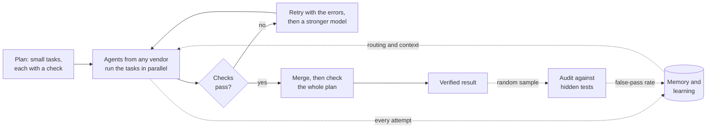

# Roko

**Run any mix of AI agents on real work, and know how far to trust the result.**

Roko is a cybernetic multi-agent orchestration harness, written in Rust. Work runs as a plan: a
graph of small tasks, each carrying a check that proves it is done. Roko runs the plan with a team
of agents from any vendor: your Claude Code or Codex subscription, Gemini, Cursor, or API models,
mixed freely. Independent tasks run in parallel, each in its own git worktree. Nothing counts until
its checks pass, and the merged result is checked again as a whole. Every verdict feeds back: Roko
learns which agent to trust with which kind of task, keeps what worked in memory, and re-checks a
sample of its own passes to measure how often a green result is wrong.

*Cybernetic* means it steers by feedback. Roko senses what happened, compares it with what should
have happened, corrects course, and audits its own corrections.



## Why Roko

- **Use the agents you already pay for.** Roko is vendor-neutral. It drives the Claude Code, Codex,
  Cursor and Gemini CLIs as workers, and calls Anthropic, Gemini, Cerebras, Perplexity or any
  OpenAI-compatible API, local models included. One plan can mix all of them.
- **Learns which agent to trust with what.** Routing comes from what has actually passed in your
  own work. Each task goes to the cheapest model and vendor likely to succeed, and moves up to a
  stronger one only when it fails.
- **Done means checked.** A task is finished when its checks pass, not when an agent says so. The
  checks are fixed before the agent starts and kept out of its reach, and the merged result is
  checked again.
- **Knows how often it's wrong.** Roko re-checks a random sample of its own passes against hidden
  tests and reports a false-pass rate, so you know how far to trust a green result.
- **Learning you can audit.** Every attempt feeds playbooks, a durable knowledge store and the
  router. Each learning loop is measured against a held-out control and switched off if it doesn't
  help, and Roko changes its own configuration only after regression checks, with rollback.
- **Parallel without the mess.** Tasks run as a dependency graph, each in its own worktree. Tasks
  that touch the same files never overlap, and finished work merges through a queue.
- **Built to run unattended.** Plans checkpoint after every task, resume after any interruption, and
  stay inside the budgets you set per turn, task, plan and day.

## Roko and Claude Code

Roko doesn't replace your coding agent; it runs a team of them. Use Claude Code to pair on a
problem. Use Roko when the work is big enough to plan, long enough to run unattended and important
enough to verify, with Claude Code as one of its workers.

| | Claude Code alone | Roko |
|---|---|---|
| Unit of work | A session | A plan: a versioned graph of tasks, each with its own check |
| Models | Claude | Any vendor, routed per task by what has passed before |
| "Done" means | The agent, a hook or you decide | The task's checks pass, then the whole plan's |
| How far to trust it | Your own review | A false-pass rate measured by random audits |
| Parallel work | Subagents within a session | A scheduled graph across isolated worktrees, merged through a queue |
| Interruptions | Resume the conversation | Resume the plan from its last checkpoint |
| Over time | Memory files | Routing, playbooks and knowledge learned from verified results |

## Features

### Plan

- **Plans are files.** A plan is a `tasks.toml`: tasks, dependencies, the files each task may touch,
  the context it needs and the commands that prove it is done. Read it, edit it, lint it, commit it.
- **Specs are checked first.** A spec-quality lint scores every task, and vague ones go back to the
  author before any agent starts.
- **Focused context.** Each prompt layers a role template, the task's declared files and symbols,
  relevant playbooks and knowledge, and the errors from any earlier attempt.
- **From idea to plan.** Write a plan by hand, or let `roko prd` take a one-line idea through web
  research and a drafted PRD to a generated plan.

### Execute

- **Parallel scheduling.** A task starts as soon as its dependencies finish, and tasks that write
  the same files never run together.
- **Isolation.** Every task works in its own git worktree. A git guard blocks destructive commands,
  agents can't read your key files, and checks run in a clean environment.
- **Self-correction.** A failed check comes back to the agent as parsed errors. Repeated failures
  escalate the model, then split or replan the task.
- **Durability.** Checkpoints after every task, resume after any interruption, a stall watchdog,
  automatic provider failover, and spending limits per turn, task, plan and day.

### Verify

- **Per-task checks.** Any command with an exit code: `cargo test`, `npm test`, `pytest`, a script.
  Code, docs, data or ops: if a command can check it, Roko can run it.
- **Tamper evidence.** Acceptance tests are pinned outside the agent's reach, and every attempt is
  diffed: deleted tests, weakened asserts or edits to the checks fail it.
- **A gate ladder.** Compile, lint, test, public API, generated tests, property tests and
  integration, scaled to each task's risk, with thresholds that adapt from history.
- **Whole-plan checks.** Finished tasks merge into one branch, the integrated result is checked as a
  whole, and a merge that breaks it is backed out.
- **Random audits.** A random sample of passed tasks is re-verified against hidden tests, which
  gives a measured false-pass rate.

### Learn

- **Everything recorded.** Every prompt, model, cost and verdict is a content-addressed signal in a
  lineage graph you can replay (`roko replay <hash>`).
- **Memory.** Verified lessons, error patterns and playbooks go into a durable knowledge store and
  come back in future prompts.
- **Learned routing.** The router learns from settled verdicts which model and vendor to trust with
  which kind of task, and starts each task on the cheapest one likely to pass.
- **Prompt experiments.** Prompt variants compete on real task outcomes.
- **Self-regulation.** Roko holds pass rate, cost per verified task, false-pass rate and latency
  within bounds and retunes itself when they drift. It commits a change to itself only after
  regression checks, with rollback, and it switches off any learning loop that doesn't beat a
  held-out control.

### Connect

- **12 provider kinds.** CLI agents (Claude Code, Codex, Cursor, Gemini), APIs (Anthropic, Gemini,
  Cerebras, Perplexity), any OpenAI-compatible endpoint (OpenRouter, Ollama, LM Studio, GLM, Kimi),
  and the Hermes and OpenClaw runtimes.
- **ACP, both ways.** `roko acp` puts Roko inside ACP editors such as Zed and JetBrains IDEs, with
  permission prompts in the editor, and Roko drives ACP agents such as Cursor as workers.
- **MCP.** Every agent gets Roko's built-in tools plus your MCP servers, and Roko ships its own MCP
  servers for code intelligence and GitHub.
- **See and steer.** A ten-tab terminal dashboard, a web portal, and an HTTP API with SSE and
  WebSocket streams. Watch each task's model, cost, gate output and transcript live; pause, resume,
  retry or cancel from any of them.
- **Runs where you do.** One binary. Run it as a daemon (launchd or systemd) or a remote worker,
  deploy it to Railway, Fly or Docker in one command, and let GitHub webhooks start plans from
  labelled issues.

### Also in the box

Offline knowledge consolidation between runs · affect-modulated dispatch · plugins with a capability
policy · feeds, recipes and cron, webhook and file-watch triggers · per-agent HTTP sidecars ·
Telegram and Slack channel adapters · a code-intelligence index for Rust, TypeScript and Go ·
optional chain primitives (agent registry, job marketplace, arena).

## What it looks like

```bash
roko init                                          # set up a workspace in your repo
roko run "add a unit test for the config parser"   # one change, checked

roko prd idea "Add OAuth2 login"                   # or plan something bigger
roko prd draft new "oauth2-login"                  # draft a PRD with an agent
roko prd plan oauth2-login                         # turn it into a graph of checkable tasks
roko plan run plans/                               # run it: parallel, isolated, checked, merged
roko dashboard                                     # watch it live
```

Roko ran most of the build of its own web portal: 16 plans and 173 tasks.

36 workspace members · ~1.2M lines of Rust · 11,000+ tests · MIT OR Apache-2.0

---

**The guide:** [Quick start](#quick-start) · [How it works](#how-it-works) ·
[Dashboard](#dashboard) · [Providers](#providers) · [Architecture](#architecture) ·
[Gate pipeline](#gate-pipeline) · [Learning](#learning) · [Deployment](#deployment) ·
[Configuration](#configuration) · [CLI reference](#cli-quick-reference) ·
[Building](#building-and-testing) · [Contributing](#contributing)

## Quick start

You need Rust 1.91 or newer, `git`, and one LLM provider: the `claude` CLI on your `PATH`, or an
API key for a supported provider.

### 1. Install

From a clone of this repository:

```bash
cargo install --path crates/roko-cli
```

The web portal is embedded only if it was exported before the build (`npm ci && npm run build:export`
in `apps/portal`). Without it, `roko serve` shows a placeholder page at `/`, and the API works as
usual. The build watches the export only once it exists, so if you export the portal after a build
without it, force one rebuild with `touch crates/roko-serve/build.rs`.

### 2. Set up a workspace

Run `roko init` at the root of an existing Rust or Go project:

```bash
cd path/to/your-project
roko init
roko config providers list
```

`roko init` writes `roko.toml` and a `.roko/` state directory. If the `claude` CLI is on your
`PATH`, it becomes the provider, and `roko config providers list` shows it. For any other provider,
`roko config providers available` lists each kind and the credentials it needs. Add the provider
under `[providers.<name>]` in `roko.toml` and point the `[models.*]` entries at it (see
[Configuration](#configuration)).

### 3. Run a prompt

```bash
roko run "add a unit test for the config parser"
```

`roko run` sizes the prompt first:

- A small change runs as one agent task. The workspace's `[[gates.rungs]]` check it; when there
  are none, `cargo check --workspace` (next to a `Cargo.toml`) or `go build ./...` (next to a
  `go.mod`) does.
- A larger prompt first has the agent write a plan, then runs that plan the way `roko plan run`
  does.

In a directory with neither build file, add a rung to `roko.toml` before running a prompt, or the
run stops with `no gate can verify this change`:

```toml
[[gates.rungs]]
name = "test"
command = "npm test"
timeout_secs = 300
required = true
```

`roko init --profile rust` writes compile, test and lint rungs for a Cargo workspace.
`roko init --profile typescript` writes `tsc` and `npm test` rungs.

### 4. Run a plan

A plan is a directory holding a `tasks.toml` (the task graph) and a `plan.md`.
[`plans/demos/`](plans/demos/README.md) has small example plans. This one asks an agent for a
hello-world program and checks it with `rustc`, and it works in an empty directory:

```bash
mkdir -p roko-demo/plans && cd roko-demo
git init && roko init
cp -R <path-to-roko>/plans/demos/parallel-plans/demo-hello-world plans/
roko plan run plans/demo-hello-world
```

`roko plan run` shows a terminal UI when stdout is a terminal (`--no-tui` gives plain logs). It
also starts the HTTP control plane in the background (`--no-serve` skips it). Progress is
checkpointed under `.roko/state/graph/<plan>/`. `roko plan status plans/demo-hello-world` shows the
task states, and `roko plan run plans/ --resume-plan` resumes an interrupted run.

### 5. Start the control plane

```bash
roko serve
```

`roko serve` listens on `127.0.0.1:6677` and prints a `portal:` link that carries a one-time token.
`GET /health` and `GET /ready` are open. The `/api/` routes need that token or an API key.

## How it works

The conceptual loop is:

```
query -> score -> route -> compose -> act -> verify -> write -> react
```

A plan run loads `tasks.toml` into the Graph engine (`crates/roko-graph`), the only plan executor.
For each task, roko assembles a prompt from the role template and the task's declared context
(`crates/roko-compose`). It dispatches the prompt to the model the router picks (`crates/roko-agent`,
`crates/roko-learn`), and it accepts the result only when the gates and the task's own `verify`
commands pass (`crates/roko-gate`). Checkpoints, activity logs and costs go to
`.roko/state/graph/<plan>/`. Each agent turn is recorded as an episode in `.roko/episodes.jsonl`.

### Full planning pipeline

For larger work that spans several tasks:

```bash
# 1. Capture what you want to build
roko prd idea "Add user authentication with OAuth2"

# 2. Research the topic (optional; uses Perplexity for web-grounded citations)
roko research topic "OAuth2 best practices in Rust"

# 3. Draft a PRD (agent-assisted)
roko prd draft new "oauth2-auth"

# 4. Generate an implementation plan with tasks
roko prd plan oauth2-auth

# 5. Execute the plans under plans/ through the Graph engine
roko plan run plans/

# 6. Resume if interrupted
roko plan run plans/ --resume-plan

# 7. Watch progress
roko dashboard
```

`roko plan validate plans/<plan>` lints a `tasks.toml` without running it, and
`roko plan run plans/<plan> --dry-run` lists the tasks and their order. `roko doctor disk` reports
free space, stale Rust targets, orphaned worktrees and oversized logs without changing anything.

### One-shot prompts

With no subcommand, roko sends a single turn to the agent, with its tools, and prints the reply:

```bash
roko "explain what src/auth.rs does"
```

This mode runs no gates, so use `roko run` for a change you want checked. Plain `roko` in a
terminal opens an interactive chat.

## Dashboard

`roko dashboard` opens a terminal UI built on ratatui. `F1`–`F10` (or the number keys) switch
tabs, and `?` shows the key bindings.

| Key | Tab | What it shows |
|-----|-----|---------------|
| F1 | Dashboard | Health gauges, plan progress, cost tracking, system metrics |
| F2 | Plans | Plan tree, task progress bars, wave overview |
| F3 | Agents | Live agent output, diffs, token burn, parallel pool status |
| F4 | Git | Branch tree, commit graph, worktree list |
| F5 | Logs | Scrollable log viewer with level filtering |
| F6 | Config | Effective config view with source annotations |
| F7 | Inspect | Signal DAG inspector, episode replay |
| F8 | Marketplace | Job browser, creation, and assignment |
| F9 | Atelier | PRD workshop and plan progress |
| F10 / 0 | Learning | Cascade routing, model health, and efficiency |

## Providers

roko supports 12 provider kinds:

| Kind | Transport | What it is |
|------|-----------|------------|
| AnthropicApi | HTTP API | Anthropic Messages API |
| ClaudeCli | CLI subprocess | `claude` CLI with the stream-json protocol |
| CodexCli | CLI subprocess | OpenAI `codex` CLI (`codex exec --json`) |
| OpenAiCompat | HTTP API | Any OpenAI chat-completions-compatible API |
| CursorAcp | ACP | Cursor Agent Client Protocol |
| CursorCli | CLI subprocess | Cursor `agent` CLI |
| PerplexityApi | HTTP API | Perplexity Sonar API (web-grounded research) |
| GeminiApi | HTTP API | Google Gemini API |
| GeminiCli | CLI subprocess | `gemini` CLI |
| CerebrasApi | HTTP API | Cerebras inference |
| Hermes | HTTP / CLI / ACP | Hermes gateway |
| OpenClaw | CLI / ACP | OpenClaw inference runtime |

`roko config providers available` lists the credentials each kind needs, and
`roko config models list` shows the configured models. The cascade router picks a model per task
from the task's tier and recorded outcomes. `roko config models route <model> --explain` shows its
reasoning for one model, and `roko learn route` shows its learned state. [`examples/`](examples/)
has sample `roko-*.toml` provider configurations (Gemini, GLM, Kimi, LM Studio, Ollama, OpenRouter,
Perplexity, and a multi-provider setup).

## Architecture

### Signals and kernel traits

The primary noun is the **Signal**: a content-addressed (BLAKE3), timestamped, scored record of
something that happened. Signals form a DAG through parent pointers, so you can trace a decision
back through its lineage (`roko replay <hash>`). The kernel in `crates/roko-core` defines 12 traits:
Store, ColdStore, Score, Verify, Route, Compose, React, Bus, Observe, Connect, Trigger and
Substrate. Missing or unknown safety contracts fail closed, so an unsupported tool use is denied.

### Crate map

| Crate | What it does |
|-------|-------------|
| `roko-core` | Signal type, kernel traits, config schema, tool system, errors |
| `roko-graph` | Graph engine: the DAG of Cells that executes plans, with checkpoints and cost state |
| `roko-cli` | CLI binary, plan loading and Graph plan execution, merge queue, worktree manager, ratatui TUI |
| `roko-agent` | Provider adapters, dispatcher, pools, tool loop, MCP client, safety layer |
| `roko-gate` | Gate implementations, the 7-rung pipeline, adaptive thresholds |
| `roko-compose` | Prompt assembly, role templates, token budgeting |
| `roko-learn` | Episodes, playbooks, bandits, model routing, prompt experiments, efficiency tracking |
| `roko-neuro` | Durable knowledge store, distillation, tier progression |
| `roko-dreams` | Offline consolidation of episodes into knowledge and playbooks |
| `roko-daimon` | Affect engine and dispatch modulation |
| `roko-conductor` | Watchers, circuit breaker, diagnosis |
| `roko-execution` | Shared runtime services builder for the CLI, serve and ACP |
| `roko-runtime` | Process supervisor, event bus, cancellation |
| `roko-serve` | HTTP control plane: REST, SSE and WebSocket on port 6677 |
| `roko-agent-server` | Per-agent HTTP sidecar |
| `roko-acp` | Agent Client Protocol server for editors |
| `roko-gateway` | Inference gateway: provider routing and fallback, caching, cost accounting |
| `roko-fs` | Append-only JSONL substrate, garbage collection, `.roko/` layout |
| `roko-std` | Standard tool definitions and MCP resolvers |
| `roko-plugin` | Plugin manifests, declarative tools, capability policy, dependency resolution |
| `roko-primitives` | Hyperdimensional vectors, tier routing |
| `roko-index` | Code parser, symbol graph, HDC fingerprints |
| `roko-mcp-*` | roko's own MCP servers (code intelligence, GitHub, stdio and others) |
| `roko-lang-*` | Language support for Rust, TypeScript and Go |
| `roko-chain` | Optional chain primitives (see below) |

### Optional chain primitives

`crates/roko-chain` holds an optional chain client plus local state machines for a registry, a job
marketplace (`roko job`), an arena and DeFi primitives. It is off by default (`[chain] enabled =
false`). Nodes, consensus and on-chain contracts live in a separate repository.

## Gate pipeline

Every agent result passes through gates before it is accepted. Plan tasks also carry their own
`verify` commands, and those must pass too.

The pipeline has 7 rungs. Which rungs run depends on the task: trivial tasks skip the expensive
checks, and complex tasks run all of them.

| Rung | Gate | What it checks |
|------|------|---------------|
| 0 | Compile | `cargo check`, `tsc`, `go build`: does it build? |
| 1 | Lint | `cargo clippy`, `eslint`: does it pass linting? |
| 2 | Test | `cargo test`: do the existing tests pass? |
| 3 | Symbol | Symbol manifest: did the change break a public API? |
| 4 | GeneratedTest | Agent-generated behavioural tests |
| 5 | PropertyTest | Property-based tests |
| 6 | Integration | A full integration scenario |

Rungs declared under `[[gates.rungs]]` in `roko.toml` replace the built-in compile, lint and test
checks for that workspace. `roko plan run` runs the required ones after each task's own
`[[task.verify]]` steps, except a rung whose command one of those steps already runs, and a failing
rung fails the task. Task prompts list the rungs, and `roko plan validate` shows which will run. A
plan opts out with `workspace_rungs = false` in its `[meta]`. Other gates include `DiffGate`,
`LlmJudgeGate`, `FactCheckGate`, `CodeExecutionGate` and `SecurityScanGate`. Gate thresholds adapt
from recorded outcomes and persist to `.roko/learn/gate-thresholds.json`, and `roko learn gates`
shows them.

## Learning

roko records its own performance and feeds it back into routing, prompts and knowledge.

```bash
roko learn all                       # router, experiments, efficiency, episodes, reflexes
roko learn experiments               # prompt A/B experiments
roko learn efficiency                # tokens, latency, cost and gate results per turn
roko knowledge query "authentication patterns"
roko knowledge stats
roko knowledge dream run             # offline consolidation of recent episodes
roko knowledge dream report
```

## Deployment

### HTTP control plane

```bash
roko serve                 # 127.0.0.1:6677
roko serve --port 9090
```

Besides the portal and the `/api/` routes, it serves SSE and WebSocket streams, `GET /ready`, and
`GET /health`, the probe that the `Dockerfile` and `fly.toml` use.
`python3 tools/http_route_inventory.py` lists the routes.

### Agents and editors

```bash
roko agent create --name X --domain Y    # create an agent from a manifest
roko agent serve --agent-id X            # per-agent HTTP sidecar
roko agent chat --agent X                # interactive chat with a running agent
roko acp                                 # Agent Client Protocol server for editors
```

The sidecar's endpoints are described in [`crates/roko-agent-server/README.md`](crates/roko-agent-server/README.md).

### Daemon, worker and cloud

```bash
roko daemon start --port 9090    # start in the background
roko daemon status
roko daemon logs --follow
roko daemon stop
roko daemon install              # install as a launchd or systemd service
roko worker --port 8080          # run as a deployed worker
roko deploy railway              # also: fly, docker
```

## Configuration

roko reads the nearest `roko.toml` at or above the working directory and layers it over the
provider, model and agent defaults in the global `~/.roko/config.toml`. `ROKO_CONFIG=<file>` replaces the project file, and a few named environment
variables such as `ROKO_MODEL` override single fields (`roko config env` lists them).
`roko config path` prints the files in use.

### Minimal config

```toml
config_version = 2

[providers.claude_cli]
kind = "claude_cli"
command = "claude"

[models.claude-sonnet-4-6]
provider = "claude_cli"
slug = "claude-sonnet-4-6"

[agent]
default_model = "claude-sonnet-4-6"

[[gates.rungs]]
name = "compile"
command = "cargo check --workspace"
timeout_secs = 120
required = true

[[gates.rungs]]
name = "test"
command = "cargo test --workspace"
timeout_secs = 300
required = true

[budget]
max_plan_usd = 10.0
max_task_usd = 1.0
max_turn_usd = 0.5
```

`roko init` writes a full `roko.toml` with the defaults spelled out.

### Config management

```bash
roko config init                            # interactive wizard for the global config
roko config show                            # effective merged config
roko config validate                        # check keys, providers and models
roko config migrate                         # upgrade a legacy config
```

### GitHub workflow automation

The GitHub integration is configured under `[github]` in `roko.toml`, with `GITHUB_TOKEN` exported.
Inspect the effective setup without starting the server:

```bash
roko github status
roko --json github status
```

Inbound webhooks use a separate `GITHUB_WEBHOOK_SECRET`. The
[GitHub integration guide](docs/v2/GITHUB-INTEGRATION.md) covers what the integration automates,
least-privilege setup, MCP configuration, branch naming, CI validation, and troubleshooting.

### Fast self-development lane (opt-in)

For a small, well-scoped local plan in this repository, the bounded FAST wrapper runs the existing
debug binary instead of `cargo run`:

```bash
./dev.sh fast plans/my-plan
```

Every FAST task must author exactly one `verify` command. The patching agent is told not to build
or test, and each attempt is capped at 6 turns and 90 s; the runner owns that one check, builds it
in the `dev-fast` profile, never runs `cargo fix`, and writes a private evidence bundle under
`.roko/runs/`.

```bash
./dev.sh feedback --run-id <run-id>             # deterministic factual debrief
./dev.sh evidence-validate .roko/runs/<run-id>  # strict terminal/JSONL/secret/size checks
./dev.sh score --bundle-root .roko/runs         # p50/p95 across captured runs
./dev.sh cache status                           # inspect caches without mutation
python3 scripts/dev_benchmark.py list           # inspect fixed-SHA benchmark lanes
```

FAST is an interactive feedback lane, not release proof. Do not use it for migrations, auth,
safety, persistence, payment, or other high-risk changes, and still run the contribution checks
below before merging. See [Fast development](docs/v2/29-FAST-DEVELOPMENT.md) for the contract and
security boundaries, and [run evidence bundles](docs/v2/30-EVIDENCE-BUNDLES.md) for optional proof
collection.

## CLI quick reference

| Command | What it does |
|---------|-------------|
| `roko init [path]` | Create `.roko/` and `roko.toml` |
| `roko run "<prompt>"` | Run a prompt as a checked task, or as a generated plan |
| `roko plan run <dir>` | Execute a plan directory through the Graph engine |
| `roko plan status <dir>` | Show a plan's task states |
| `roko prd idea "<text>"` | Capture a work item |
| `roko prd draft new "<title>"` | Draft a PRD (agent-assisted) |
| `roko prd plan <slug>` | Generate an implementation plan from a PRD |
| `roko research topic "<topic>"` | Research with citations |
| `roko status` | Signal counts, recent episodes, gate results |
| `roko github status` | GitHub config, auth, plan PR, CI, and failure-issue status |
| `roko dashboard` | Interactive terminal dashboard |
| `roko knowledge query "<topic>"` | Search durable knowledge |
| `roko knowledge dream run` | Run offline knowledge consolidation |
| `roko config providers list` | Show the configured providers |
| `roko serve` | Start the HTTP control plane and portal |
| `roko daemon start` | Start the background daemon |
| `roko deploy railway` | Deploy to Railway |

`roko help <command>` documents every command. The full reference, with flags and examples, is
[docs/v2/CLI-REFERENCE.md](docs/v2/CLI-REFERENCE.md).

## Building and testing

```bash
rustup update stable          # 1.91+ required for alloy deps
cargo build --workspace
cargo test --workspace
cargo clippy --workspace --no-deps -- -D warnings
```

### Running a single crate

```bash
cargo test -p roko-core
cargo test -p roko-agent
cargo test -p roko-gate
```

## Roadmap and open work

Roko is under active development. Plans and open work live in the work graph under
[`work/`](work/README.md):

- [`work/NOW.md`](work/NOW.md): what to work on next, goal by goal.
- [`work/STATUS.md`](work/STATUS.md): every open item, grouped by subsystem.

The component table in [`CLAUDE.md`](CLAUDE.md) says where each subsystem lives.

## Contributing

Contributions are welcome. A few ground rules:

1. **Search before writing.** With 36 workspace members and ~1M lines, the thing you want to build
   might already exist. Run `rg 'StructName' crates/ --glob '*.rs'` first.
2. **Wire, don't build.** Before adding new code, check whether existing code just needs to be
   called from the runtime.
3. **Verify before marking done.** Run the actual CLI code path. Passing unit tests does not mean
   the feature works end-to-end.
4. **All checks must pass.** `cargo +nightly fmt --all`, `cargo clippy --workspace --no-deps -- -D warnings`
   and `cargo test --workspace` must all be clean.
5. **Track work in the work graph.** Open work is one file per item under `work/items/`; the rules
   are in [`work/README.md`](work/README.md).

[`CLAUDE.md`](CLAUDE.md) has the component map and the full contributor rules.

## License

MIT OR Apache-2.0 (dual-licensed).
