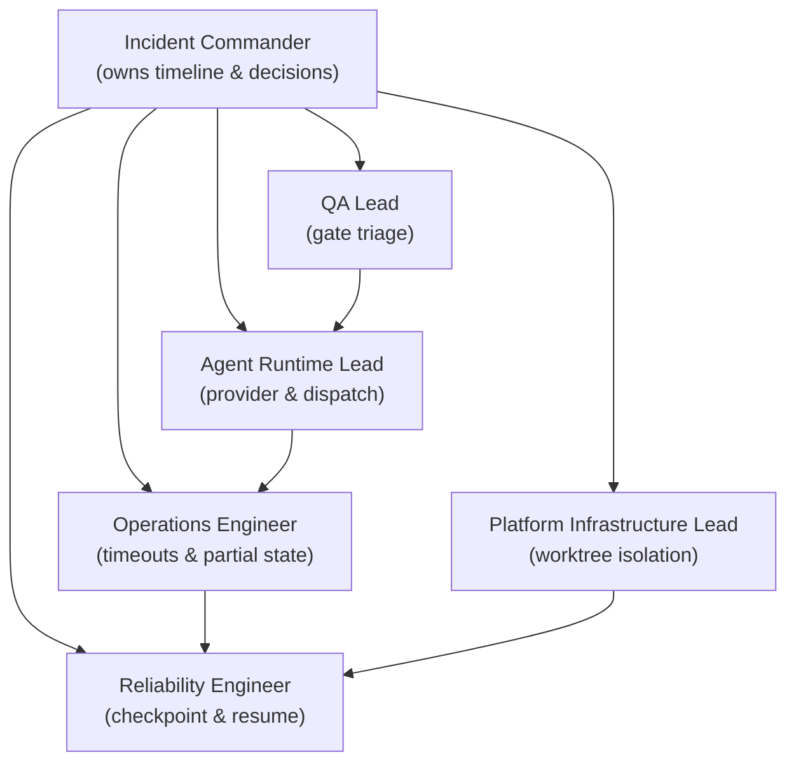
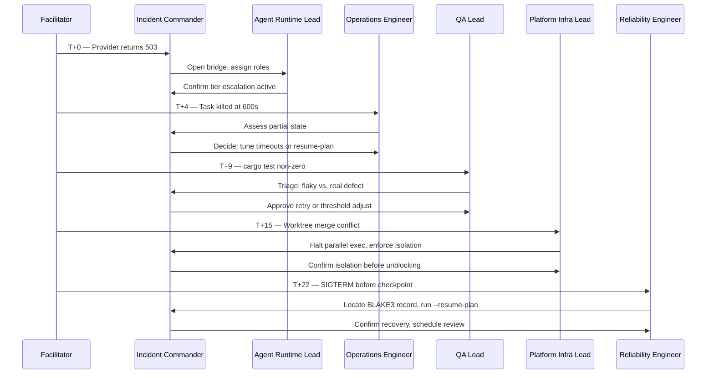
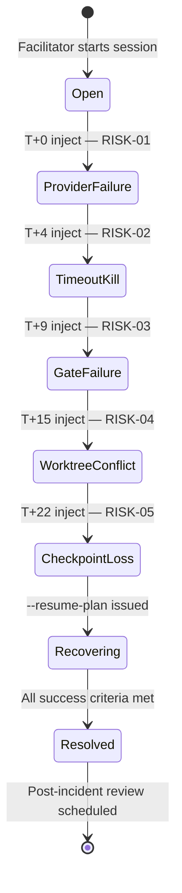
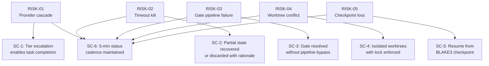

# Incident Tabletop: Agent Orchestration Provider Failure Cascade — Facilitator Guide

> **Upstream sources:**
> - Scenario definition: `demo/incident-tabletop/scenario.json`
> - Risk register: `demo/incident-tabletop/risk-register.csv`

Roko's plan executor is a layered system: a content-addressed DAG of tasks dispatched
through LLM providers, validated by a seven-rung gate pipeline, and persisted as
BLAKE3-fingerprinted checkpoints. When the provider tier collapses—through HTTP 503s,
timeout exhaustion, or SIGTERM at the wrong moment—those layers can fail in sequence.
Partial state accumulates. Verification gates short-circuit. The orchestrator may lose its
place in the DAG entirely.

This tabletop exercise confronts the response team with that cascading failure before it
reaches production, so that recovery pathways—tier escalation, checkpoint resume, worktree
isolation, and adaptive gate thresholds—are practised and not improvised. The five injects
trace five interdependent risk pathways drawn from `demo/incident-tabletop/risk-register.csv`.
Each arrives on a timed schedule and requires coordinated decision-making across six roles.
The exercise is complete when every success criterion in `demo/incident-tabletop/scenario.json`
has been demonstrated or documented as a gap.

---

## Purpose

This exercise develops four capabilities in the response team:

1. **Provider failover fluency.** Participants practise enabling tier-based escalation in
   `roko.toml` *before* the primary LLM provider is confirmed healthy, not after.
2. **Checkpoint literacy.** Participants locate and validate BLAKE3 DAG records under
   `.roko/state/graph/` and execute `roko plan run plans/ --resume-plan` correctly.
3. **Gate triage discipline.** Participants distinguish a genuine verification failure from
   a flaky test and document any adaptive-threshold adjustment with a rationale rather than
   bypassing the gate.
4. **Worktree isolation muscle memory.** Participants enforce per-task git worktrees and
   `workspace_lock_secs` before resuming parallel execution, not as an afterthought.

The exercise is not a test of individual performance. It is a shared rehearsal. Facilitators
should prioritise surfacing decision points and communication gaps over measuring response
speed. The scenario objectives in `demo/incident-tabletop/scenario.json` require status
updates to all role leads at least every five minutes; the facilitator is responsible for
holding the team to that cadence throughout.

---

## Preparation

**Facilitator prerequisites — complete before the session:**

1. **Print or share** the risk register (`demo/incident-tabletop/risk-register.csv`) so
   every participant can reference RISK-01 through RISK-05 during the exercise.
2. **Open** the scenario definition (`demo/incident-tabletop/scenario.json`) to confirm
   inject timing and expected actions.
3. **Assign one person to each role** listed in § Roles. If fewer than six participants are
   available, combine QA Lead and Reliability Engineer, but keep Incident Commander as a
   dedicated seat.
4. **Set a timer** visible to all participants. The exercise runs approximately 30 minutes of
   scenario time (injects at minutes 0, 4, 9, 15, and 22) plus debrief.
5. **Prepare an evidence log** (shared doc or whiteboard) to capture decisions, rationale,
   and artifact references as the exercise progresses. This log becomes the primary retained
   evidence.
6. **Set communication cadence expectations** explicitly at session open: the scenario
   requires status updates at least every five minutes. Enforce this throughout.

**Environment checklist:**

| Item | Required |
|------|----------|
| `roko.toml` with representative `[timeouts]` and provider config | Yes |
| Access to `.roko/learn/gate-thresholds.json` | Yes |
| `.roko/state/graph/` checkpoint directory (can be synthetic) | Yes |
| `demo/incident-tabletop/risk-register.csv` open during exercise | Yes |
| Communication channel simulating the response bridge | Yes |

---

## Roles

All six roles defined in `demo/incident-tabletop/scenario.json` under the `roles` array
must be filled. If participants are fewer than six, the facilitator may double-assign
non-adjacent roles; the Incident Commander role must always be a single dedicated person
and must not be doubled.

**Figure 1 — Incident Response Role Topology**

| Role | Responsibility |
|------|---------------|
| **Incident Commander** | Owns the response timeline, convenes the bridge, approves all recovery decisions, and ensures stakeholder communication cadence is maintained. |
| **Agent Runtime Lead** | Diagnoses provider and dispatch failures, validates fallback model configuration, and confirms tier-based escalation is active. |
| **Operations Engineer** | Monitors timeout thresholds, assesses partial workspace state from killed tasks, and decides between tuning timeouts and resuming from checkpoint. |
| **QA Lead** | Triages gate failures, determines whether to retry with an escalating model or adjust adaptive thresholds, and documents the trade-off. |
| **Platform Infrastructure Lead** | Manages worktree isolation, enforces `workspace_lock_secs`, and resolves merge conflicts caused by overlapping agent file access. |
| **Reliability Engineer** | Identifies the last durable BLAKE3 DAG checkpoint, executes plan resume, and confirms state recovery before incident closure. |

---

## Timeline

The exercise spans five timed injects covering 22 simulated minutes. The facilitator reads
the **Facilitator Prompt** aloud when the session clock reaches each inject's minute mark.
**Facilitator prompts and expected participant actions are kept separate throughout this
section.** The facilitator sets the scene; participants determine and articulate their own
response without being coached by the expected-action column.

**Figure 2 — Inject Sequence Across Roles**

**Figure 3 — Incident Lifecycle State Machine**

**Timeline Table**

| Minute | Risk | Event — Facilitator Prompt | Expected Participant Action |
|--------|------|----------------------------|-----------------------------|
| 0 | RISK-01 | **Facilitator announces:** *"The primary LLM provider begins returning HTTP 503 errors. Agent dispatch tasks stall and several return incomplete output that is persisted as signal."* | Incident Commander opens the response bridge and assigns roles. Agent Runtime Lead verifies provider status, confirms the failure is not transient, and enables tier-based escalation to the fallback model configured in `roko.toml`. Incident Commander broadcasts the initial status to all leads. |
| 4 | RISK-02 | **Facilitator announces:** *"A long-running agent task exceeds the 600-second `task_attempt_secs` threshold and is killed mid-execution, leaving partial workspace state that may corrupt the signal DAG."* | Operations Engineer assesses the partial state and determines whether it is safe to retain. Incident Commander decides whether to tune `[timeouts]` in `roko.toml` for the affected task class or to discard the partial work and recover via `--resume-plan` from the last checkpoint. The decision and rationale are communicated to all leads. |
| 9 | RISK-03 | **Facilitator announces:** *"`cargo test` returns a non-zero exit code during the gate run. The 7-rung pipeline short-circuits on first failure and the task cannot pass verification, stalling the plan."* | QA Lead triages the test failure to distinguish a genuine defect from a flaky test. Incident Commander weighs two options: retry the task with an escalating model, or relax the adaptive threshold after confirming the failure is repeated. The chosen path and its safety trade-off are documented and shared with the bridge. |
| 15 | RISK-04 | **Facilitator announces:** *"Two parallel agents modify overlapping file paths within a shared worktree, producing merge conflicts and corrupted build artifacts that block downstream tasks."* | Platform Infrastructure Lead halts parallel execution and invokes the worktree manager to create isolated git worktrees per task. Before resuming, the lead verifies that `workspace_lock_secs` guards file access and that no two agents target the same paths. Incident Commander confirms isolation is in place before unblocking work. |
| 22 | RISK-05 | **Facilitator announces:** *"The orchestrator process receives SIGTERM during plan execution before a durable checkpoint is written. In-progress plan execution is at risk of being lost entirely."* | Reliability Engineer identifies the last persisted content-addressed BLAKE3 DAG record and issues `roko plan run plans/ --resume-plan`. Incident Commander confirms with each role lead that their recovered state is consistent, then schedules a post-incident review before formally closing the incident. |

**Facilitator instructions between injects:**

- At every 5-minute mark, prompt the Incident Commander: *"Provide a status update to all
  role leads covering decisions made, actions taken, and any open questions."*
- After each inject, allow 2–3 minutes for discussion before advancing the clock.
- If participants reach an impasse, the facilitator may offer a hint by reading the
  `evidence` field from the corresponding inject in `demo/incident-tabletop/scenario.json`.

**Figure 4 — Risk Register to Success Criterion Mapping**

---

## Debrief

Run the debrief immediately after the final inject is resolved, while the session is fresh.
Allocate 20–30 minutes. The facilitator leads; the note-taker reads back key decisions and
open gaps captured during the exercise before the first question is asked.

Use the following questions as anchors. Do not rush — allow the group to surface tensions
before moving on. Answers should be recorded in the evidence log.

1. Did tier-based escalation activate quickly enough after the provider failure, or was
   there a delay that could have extended outage impact? What would have made the fallback
   model configuration findable faster under pressure?
2. When the task was killed at the timeout threshold, was the decision to retain or discard
   partial workspace state made with sufficient information? What additional telemetry or
   tooling would have made the choice clearer?
3. Was the gate-failure triage process rigorous enough to distinguish genuine defects from
   flaky tests, or did uncertainty lead to a premature threshold relaxation? What
   observability data was absent from the environment?
4. How effectively did the worktree manager prevent cross-contamination after the merge
   conflict was detected? Were there any gaps in `workspace_lock_secs` enforcement, and
   where should those be documented?
5. Was the BLAKE3 DAG checkpoint recent enough to enable meaningful recovery via
   `--resume-plan`? How much work was at risk of loss, and is there a procedure for when
   the checkpoint itself is corrupted?
6. Did the Incident Commander maintain the five-minute communication cadence throughout
   the exercise? Where did the cadence lapse, and what was happening at those moments?
7. Which single risk from `demo/incident-tabletop/risk-register.csv`, if it had been
   pre-mitigated before the exercise, would have reduced the overall incident severity
   the most?

---

## Evidence to retain

After each session, collect and preserve the following artifacts. These feed directly into
the mitigations described in `demo/incident-tabletop/risk-register.csv` and form the basis
for runbook updates. Do not allow the session to close without confirming each row has an
owner.

| Artifact | Description |
|----------|-------------|
| `demo/incident-tabletop/risk-register.csv` | The source risk register mapping each inject to its operational signal and mitigation. |
| `demo/incident-tabletop/scenario.json` | The canonical scenario definition with injects, roles, and success criteria. |
| Evidence log (shared doc) | Real-time record of decisions, rationale, and trade-offs captured during the exercise. |
| Role assignment sheet | Who held each role during the exercise, for accountability traceability. |
| Debrief notes | Answers to the seven debrief questions, action items, and improvement recommendations. |
| Timing log | Actual wall-clock timestamps for each inject and status-update cadence check. |

**Runbook update trigger:** If any success criterion from `demo/incident-tabletop/scenario.json`
was not met during the exercise, the Incident Commander is responsible for opening a tracking
item before the session closes. The tracking item must reference the relevant risk ID from
`demo/incident-tabletop/risk-register.csv`, name an owner, and set a target date. No session
ends without this step complete.
