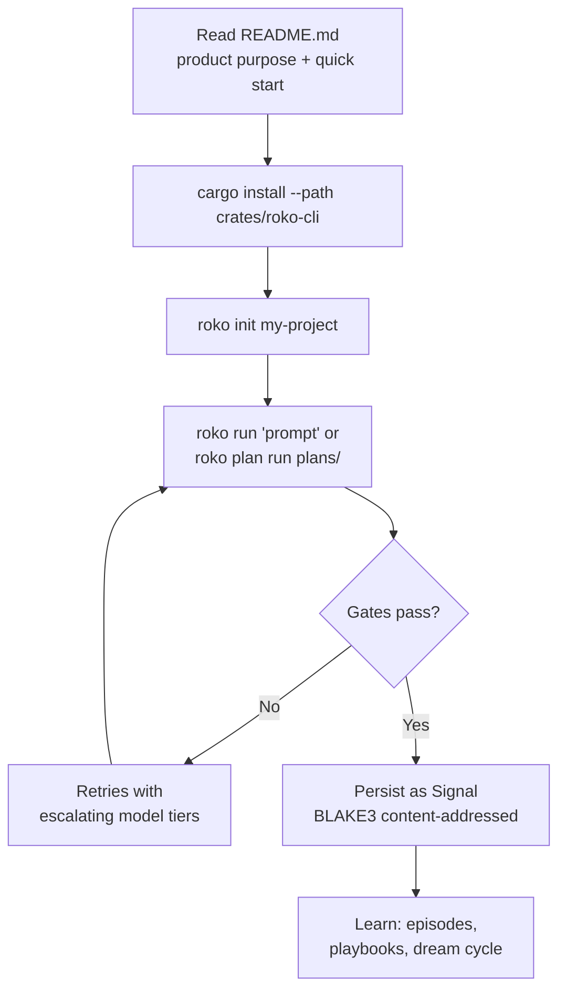

# Discovery Note: Roko Repository Onboarding

> **Scope:** STAGE-1A evidence-based discovery for the `demo-multistage` plan.
> This document is analysis only — no source code was modified.

---

## Repository signals

### Observed facts

1. **Product identity and scale.** `README.md` (lines 3–5) describes Roko as "a Rust toolkit for building agents that build themselves" and reports "35 workspace members. ~800K lines of Rust. 9,900+ tests." The core loop is stated as: observe, plan, execute, verify, learn, repeat.

2. **Quick-start entry point.** `README.md` (lines 9–15) documents a three-command onboarding path:
   ```
   cargo install --path crates/roko-cli
   roko init my-project && cd my-project
   roko run "add a health check endpoint to the API"
   ```
   `roko init` is described as auto-detecting project type (Rust, TypeScript, Go) and writing a `roko.toml`.

3. **Workspace shape.** `Cargo.toml` (lines 1–4) declares `resolver = "2"` and lists workspace members. The `default-members` array (`Cargo.toml` lines ~72–76) includes only three crates: `crates/roko-cli`, `crates/roko-mcp-code`, and `crates/roko-mcp-github`. A bare `cargo build` (without `--workspace`) compiles only those three.

4. **Crate count.** `README.md` now states "35 workspace members," matching `Cargo.toml` which lists 35 workspace members (counting `tests/`, `apps/`, and all `roko-mcp-*` and `roko-lang-*` crates individually). The previous "18 crates" figure predated the addition of MCP servers, language providers, and chain crates.

5. **`roko-orchestrator` is documented but not a workspace member.** `README.md` (line ~123) lists `roko-orchestrator` in the crate map as "Plan DAG, parallel executor, merge queue, worktree manager, safety policy." The architecture doc `docs/v1/00-architecture/15-crate-map.md` (§1.1 table and §1.5 table) also references `roko-orchestrator` as a distinct crate. However, `Cargo.toml` does **not** include `crates/roko-orchestrator` in the `members` array. Instead, a comment in `Cargo.toml` (line ~29) reads `# Orchestration layer (plan discovery, task DAG, worktree manager, executor)` with no crate path following it. The orchestrator code lives as a module inside `crates/roko-cli/orchestrator/`.

6. **Rust edition and version.** `Cargo.toml` (line ~78) specifies `edition = "2024"` and `rust-version = "1.85"`. `README.md` (line ~289) states "1.91+ required for alloy deps." The README's build instructions say `rustup update stable` to get 1.91+, while `Cargo.toml`'s declared minimum is 1.85.

7. **Target-vs-current crate boundaries.** `docs/v1/00-architecture/15-crate-map.md` (§7, "Current Status and Gaps") explicitly states: "The current workspace is not yet the target workspace." Target-only crates — `roko-bus`, `roko-hdc`, `roko-spi`, `roko-defaults`, `roko-tools`, `roko-compose-core`, `roko-templates` — are described as proposed by REF20 and not yet shipped. The current `roko-std` and `roko-compose` crates remain unsplit.

8. **Five-layer dependency architecture.** `docs/v1/00-architecture/15-crate-map.md` (§3.1) defines a downward-only invariant:
   ```
   L4 (Orchestration) → may depend on L3, L2, L1, L0, Kernel
   L3 (Harness)       → may depend on L2, L1, L0, Kernel
   L2 (Scaffold)      → may depend on L1, L0, Kernel
   L1 (Framework)     → may depend on L0, Kernel
   L0 (Runtime)       → may depend on Kernel only
   Kernel             → depends on nothing
   ```
   The doc (§3.2) notes this is "the intended direction of travel, not a snapshot of every current Cargo.toml."

9. **Contributor guidance.** `README.md` (lines ~298–305) lists four ground rules: "Search before writing," "Wire, don't build," "Verify before marking done," and "All tests must pass." The "Wire, don't build" rule explicitly warns that "The most common pattern in this repo is 'built but never connected.'"

10. **Lint strictness.** `Cargo.toml` (lines ~120–125) enforces `unsafe_code = "deny"`, `missing_docs = "warn"`, `unwrap_used = "deny"`, and enables both `pedantic` and `nursery` clippy lint groups at `warn` level. `README.md` (line ~292) requires `cargo clippy --workspace --no-deps -- -D warnings` to be clean.

11. **Binary distribution.** `Cargo.toml` (lines ~83–95) configures `cargo-dist` v0.28.1 for prebuilt releases targeting macOS ARM/Intel and Linux x86_64 (glibc + musl).

### Recommendations (not observed in sources)

- New contributors should run `cargo build --workspace` (not bare `cargo build`) to compile the full system, because `default-members` excludes most crates.
- Contributors reading the architecture doc should treat target-state crate names as aspirational and cross-reference `Cargo.toml`'s `members` list for what actually exists.
- The `roko-orchestrator` crate name in documentation should be mentally mapped to `crates/roko-cli/orchestrator/` until it is extracted.

---

## User journey

A new contributor arriving at this repository would follow this path, reconstructed from evidence in the three inspected sources:



1. **Orientation.** The contributor reads `README.md`, which immediately frames the product (agents that build themselves), the core loop (observe → plan → execute → verify → learn → repeat), and the quick-start commands.

2. **Installation.** Following `README.md` line 10, the contributor runs `cargo install --path crates/roko-cli`. This builds only the CLI crate (plus its dependencies), which is consistent with `Cargo.toml`'s `default-members` scoping.

3. **Project setup.** `roko init my-project` creates a `.roko/` directory and writes `roko.toml` with auto-detected gates (`README.md` lines 12–13).

4. **Execution.** The contributor runs `roko run "..."` for one-shot work or follows the seven-step planning pipeline (`README.md` lines 24–45): `prd idea` → `research topic` → `prd draft` → `prd plan` → `plan run` → `--resume-plan` → `dashboard`.

5. **Verification.** Every agent output passes through the 7-rung gate pipeline (`README.md` lines ~145–165): compile → lint → test → symbol → generated test → property test → integration. Failures trigger retry with model escalation.

6. **Navigation to source.** To contribute, the contributor consults the README crate map (`README.md` lines ~118–140) or the architecture crate map (`docs/v1/00-architecture/15-crate-map.md` §1) to locate the relevant crate. This is where discrepancies between documentation and `Cargo.toml` create friction (see Risks).

7. **Build and test.** `README.md` (lines ~287–296) documents `cargo build --workspace`, `cargo test --workspace`, and `cargo clippy --workspace --no-deps -- -D warnings` as the contribution gate. The contributor also learns to run single-crate tests via `cargo test -p roko-core`.

---

## Risks

### Risk 1: `default-members` hides 31 of 34 crates from a bare `cargo build`

**Evidence:** `Cargo.toml` `default-members` lists only `crates/roko-cli`, `crates/roko-mcp-code`, and `crates/roko-mcp-github`. A contributor who runs `cargo build` (without `--workspace`) will see a successful build that omits `roko-core`, `roko-agent`, `roko-gate`, `roko-conductor`, `roko-learn`, and all other library crates. Test failures or compile errors in non-default crates will be invisible until the contributor runs `cargo build --workspace` or `cargo test --workspace`.

**Impact:** Misleading "it builds" signal during onboarding; contributors may not realize the workspace is much larger than what they compiled.

### Risk 2: `roko-orchestrator` is documented as a crate but does not exist as a workspace member

**Evidence:** `README.md` (line ~123) lists `roko-orchestrator` in the crate map with the description "Plan DAG, parallel executor, merge queue, worktree manager, safety policy." `docs/v1/00-architecture/15-crate-map.md` (§1.1 and §1.5) also treats it as a distinct crate. However, `Cargo.toml` does not include `crates/roko-orchestrator` in the `members` array; the orchestrator code lives inside `crates/roko-cli/orchestrator/` as a module. A comment in `Cargo.toml` (line ~29) references the orchestration layer but assigns no crate path to it.

**Impact:** Contributors searching for a `crates/roko-orchestrator/` directory will not find it. Those running `cargo test -p roko-orchestrator` will get a package-not-found error. Navigation between documentation and source tree is broken for this subsystem.

### Risk 3: Architecture doc describes target-state crates that do not yet exist

**Evidence:** `docs/v1/00-architecture/15-crate-map.md` (§7) explicitly states "The current workspace is not yet the target workspace" and lists `roko-bus`, `roko-hdc`, `roko-spi`, `roko-defaults`, `roko-tools`, `roko-compose-core`, and `roko-templates` as target-only boundaries. The doc's implementation-status note (line 6) says these are "target crates or target splits unless explicitly marked as existing." Nevertheless, the layer-by-layer tables in §1.2–§1.4 present them alongside existing crates without clear visual separation.

**Impact:** A contributor reading the architecture doc may attempt to `cargo test -p roko-bus` or look for `crates/roko-defaults/` and encounter package-not-found errors. The doc requires careful reading of the status column to distinguish existing from target crates.

### Risk 4: Rust version conflict between README and Cargo.toml

**Evidence:** `Cargo.toml` (line ~78) declares `rust-version = "1.85"` and `edition = "2024"`. `README.md` (line ~289) states "1.91+ required for alloy deps." A contributor with Rust 1.85–1.90 installed may pass `Cargo.toml`'s version check but hit alloy-dependent compilation failures, because the README's higher minimum is not enforced by the manifest.

**Impact:** Ambiguous toolchain requirements; contributors may waste time on version-related build failures that the manifest does not prevent.

### Risk 5: Crate count in README -- previously stale, now corrected

**Evidence:** `README.md` previously claimed "18 crates." This was corrected to "35 workspace members" to match `Cargo.toml`. The "18" figure predated the addition of MCP servers, language providers, chain crates, and app crates.

**Impact:** Previously, contributors may have underestimated the codebase size and breadth. Now corrected.
