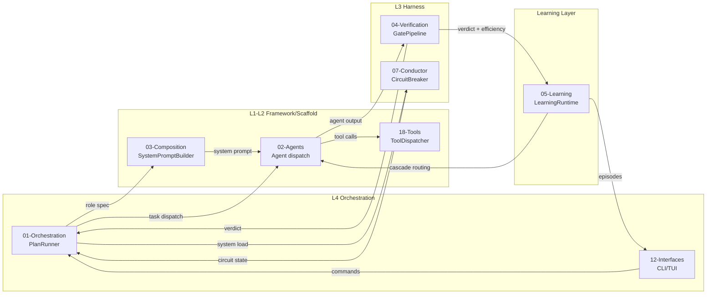
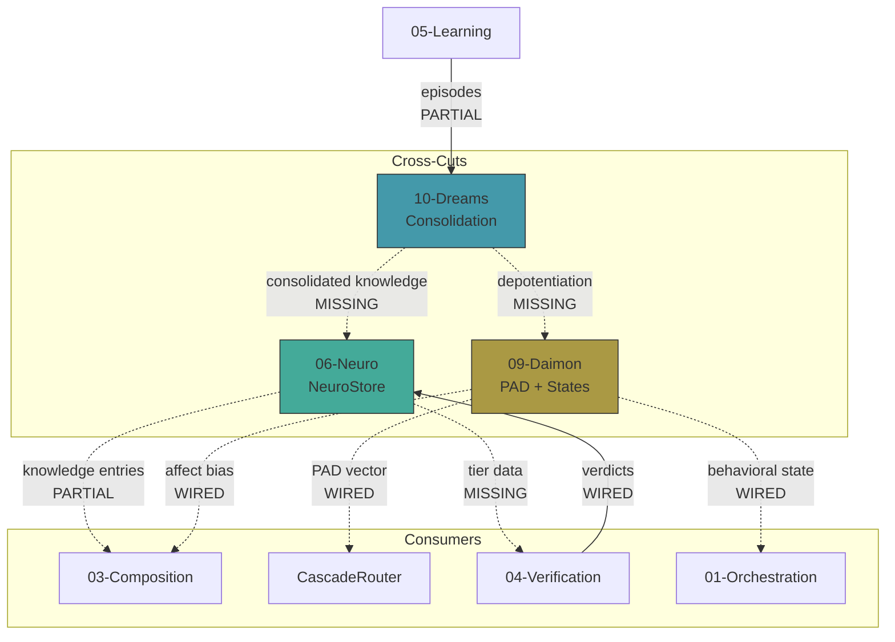
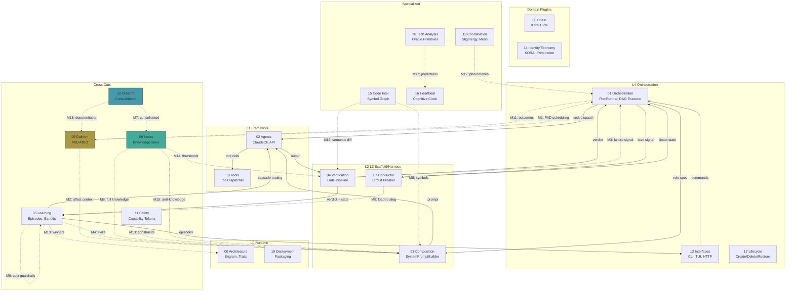
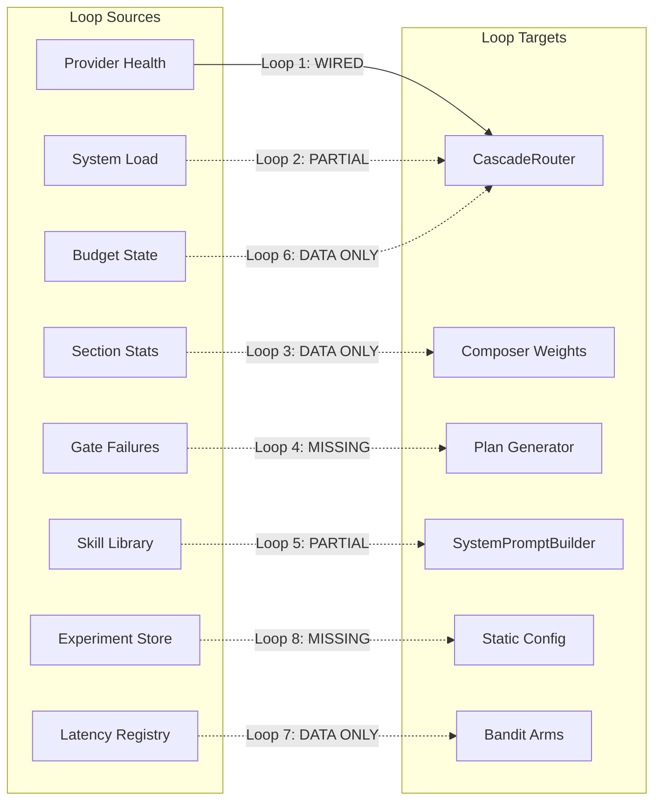
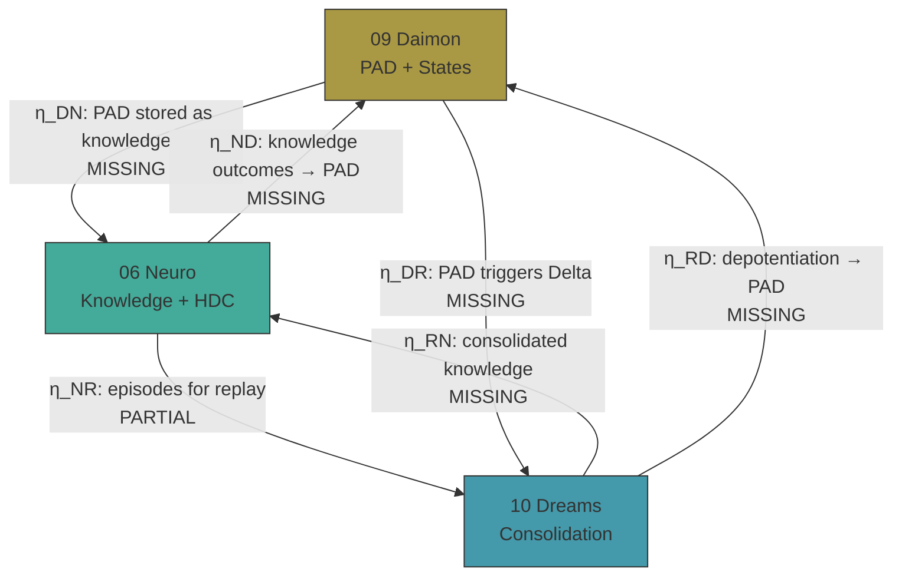

# Cross-Section Integration Map

> **Abstract:** A complete dependency matrix across all 22 documentation sections, identifying
> every data flow, trait usage, configuration dependency, and missing integration point.
> This document is the architectural X-ray — it shows how the system's subsystems actually
> connect, where they should connect but don't, and what new connections would produce the
> highest leverage improvement. The earlier engine/event-bus proposal is now the promoted
> kernel `Bus` trait at L0: the transport fabric beside `Substrate`, with `Topic`,
> `TopicFilter`, and bounded replay on the Bus ring as the coordination vocabulary.
> See also `tmp/refinements/03-bus-as-first-class.md`,
> `tmp/refinements/09-phase-2-implications.md`, and
> [01-naming-and-glossary.md](./01-naming-and-glossary.md).

> **Implementation**: Reference

**Topic**: [00-architecture](./INDEX.md)
**Prerequisites**: All 22 topic INDEX files, [13-cognitive-cross-cuts](./13-cognitive-cross-cuts.md), [05-learning/13-8-missing-feedback-loops](../05-learning/13-8-missing-feedback-loops.md), [16-heartbeat/00-coala-9-step-pipeline](../16-heartbeat/00-coala-9-step-pipeline.md)
**Key sources**: Sumers et al. 2023 (CoALA), arXiv:2601.12560 (Agentic AI taxonomies), arXiv:2507.03724 (MemOS), Zylos Research 2026 (Event-driven agent architectures), arXiv:2604.05150 (Compiled AI), arXiv:2505.07087 (Cognitive design patterns)

---

## 1. Section Inventory

Each documentation section maps to a primary crate and an architectural concern. The integration
map covers all pairwise relationships between these 22 sections.

| # | Section | Primary Crate | Architectural Role | Layer |
|---|---------|---------------|-------------------|-------|
| 00 | Architecture | `roko-core` | Foundational types, traits, universal loop | All |
| 01 | Orchestration | `roko-orchestrator` | Plan DAG, parallel executor, merge queue | L4 |
| 02 | Agents | `roko-agent` | LLM backends, tool loop, MCP, safety | L1 |
| 03 | Composition | `roko-compose` | Prompt assembly, context engineering | L2 |
| 04 | Verification | `roko-gate` | Gate pipeline, adaptive thresholds | L3 |
| 05 | Learning | `roko-learn` | Episodes, bandits, skills, experiments | Cross-cut |
| 06 | Neuro | `roko-neuro` | Knowledge store, HDC, tiers | Cross-cut |
| 07 | Conductor | `roko-conductor` | Health monitoring, circuit breaker, OODA | L3 |
| 08 | Chain | `roko-chain` | Korai EVM, tokens, HDC precompile | Domain plugin |
| 09 | Daimon | `roko-daimon` | PAD affect, behavioral states, somatic markers | Cross-cut |
| 10 | Dreams | `roko-dreams` | NREM replay, REM imagination, consolidation | Cross-cut |
| 11 | Safety | `roko-agent::safety` | Capability tokens, taint tracking, audit | Cross-cut |
| 12 | Interfaces | `roko-cli`, `roko-serve` | CLI, TUI, HTTP API, Spectre | L4 |
| 13 | Coordination | (trait impls) | Stigmergy, pheromones, Agent Mesh | Cross-cut |
| 14 | Identity/Economy | `roko-chain` ext | ERC-8004, KORAI, reputation, marketplace | Domain plugin |
| 15 | Code Intelligence | `roko-index` | Parser, symbol graph, HDC fingerprints | L2 |
| 16 | Heartbeat | (orchestrate.rs) | CoALA 9-step pipeline, three speeds | L0/L1 |
| 17 | Lifecycle | (CLI subcommands) | Create, configure, backup, restore, delete | L4 |
| 18 | Tools | `roko-std` | Built-in tools, plugins, MCP servers | L1 |
| 19 | Deployment | (build/ops) | Packaging, Docker, WASM, daemon | Infrastructure |
| 20 | Technical Analysis | `roko-oracle` (planned) | Prediction, calibration, domain oracles | L2/L3 |
| 21 | References | (docs only) | Master citation index | Documentation |

---

### 1.1 REF09 Overlay: Phase-2 Systems on the Same Kernel

REF09 removes the need to treat Chain, Dreams, Coordination, Heartbeat, and the HTTP control
plane as special architecture branches. In the two-fabric model they are standard Bus and
Substrate consumers or backends:

| Subsystem | Durable side | Live side | Net effect |
|---|---|---|---|
| Chain | `ChainSubstrate` stores and queries on-chain Engrams | `ChainBus` maps chain logs into `chain.*` Pulses | Chain consumers stop polling chain state just to notice fresh work |
| Dreams | Substrate scan remains the complete consolidation source | Bus subscription to `substrate.engram.stored` wakes Delta work reactively | Delta-speed can be threshold-triggered instead of fixed polling |
| Coordination | Pheromones persist as Engrams in shared Substrates | `mesh.pheromone.deposited` and related Pulses alert nearby agents | Stigmergy becomes literal storage plus transport rather than custom plumbing |
| Heartbeat | Tick history may still persist as Engrams when needed | `HeartbeatPolicy` publishes `heartbeat.{gamma,theta,delta}.tick` Pulses | Clock consumers subscribe by topic instead of importing a scheduler |
| Interfaces | REST reads and durable writes project Substrate state | WebSocket and SSE streams project Bus subscriptions | `roko-serve` becomes a thin projection layer rather than a custom fanout path |

This overlay is the architecture-level summary of `tmp/refinements/09-phase-2-implications.md`.

---

## 2. Full Dependency Matrix

### 2.1 Legend

Each cell encodes the relationship type(s) from the **row section** to the **column section**:

- **D** = Data flow (Engrams flow from row → column)
- **T** = Trait usage (row implements traits that column consumes)
- **C** = Configuration (row's parameters affect column's behavior)
- **I** = Integration point (currently wired)
- **M** = Missing integration (should exist but doesn't)
- **—** = No significant dependency

### 2.2 Dependency Matrix (producers as rows, consumers as columns)

```
TO →    00   01   02   03   04   05   06   07   08   09   10   11   12   13   14   15   16   17   18   19   20   21
FROM ↓
00      —    DT   DT   DT   DT   DT   DT   DT   DT   DT   DT   DT   DT   DT   DT   DT   DT   DT   DT   C    DT   —
01      —    —    DI   DI   DI   DI   M    DI   M    M    M    DI   DI   M    —    M    DI   M    —    C    —    —
02      —    DI   —    DI   M    DI   M    M    DI   M    —    DI   DI   M    —    —    DI   —    DI   —    —    —
03      —    DI   DI   —    M    DI   DM   —    M    DM   M    —    DI   —    —    DM   DI   —    —    —    M    —
04      —    DI   —    DM   —    DI   M    DI   DI   DM   DM   —    DI   —    —    —    DI   —    —    —    DI   —
05      —    DI   DI   DM   DI   —    DM   DI   —    DI   DM   —    DI   M    —    M    DI   —    —    —    DI   —
06      —    M    DM   DI   M    DI   —    —    DM   DI   DI   M    DI   DM   —    DI   DI   DI   —    —    DI   —
07      —    DI   M    —    DI   DI   —    —    —    M    —    —    DI   —    —    —    DI   —    —    C    —    —
08      —    —    DI   M    DI   M    DI   —    —    DI   —    DI   M    DI   DI   —    M    —    DI   C    DI   —
09      —    DM   DM   DI   DM   DI   DI   M    DI   —    DI   —    DI   M    —    —    DI   DI   —    —    DI   —
10      —    M    —    DM   M    DI   DI   —    —    DI   —    —    DM   M    —    —    DI   M    —    —    DI   —
11      —    DI   DI   M    DI   M    DM   DI   DI   —    —    —    DM   M    DI   —    M    DI   DI   C    —    —
12      —    DI   DI   —    DI   DI   DI   DI   DI   DI   DI   —    —    DI   DI   —    DI   DI   —    —    —    —
13      —    DI   DM   —    —    DM   DI   —    DI   DM   M    DM   DI   —    DI   —    M    M    —    —    —    —
14      —    —    —    —    —    DM   —    —    DI   —    —    DI   DM   DI   —    —    —    DI   —    —    —    —
15      —    M    DI   DI   DM   DM   DI   —    —    —    —    —    DM   —    —    —    M    —    DI   —    —    —
16      —    DI   DI   DI   DI   DI   DI   DI   DI   DI   DI   DI   DI   DI   —    DI   —    —    —    —    DI   —
17      —    M    DI   —    —    —    DI   —    DI   DI   DI   DI   DI   DI   DI   —    —    —    —    DI   —    —
18      —    —    DI   DI   —    —    —    —    DI   —    —    DI   DI   —    —    DI   —    —    —    —    —    —
19      —    C    C    —    —    —    —    C    C    —    —    C    C    —    —    —    C    C    —    —    —    —
20      —    —    M    DM   DI   DI   DI   M    DI   DI   DI   —    DM   —    —    M    DI   —    —    —    —    —
21      —    —    —    —    —    —    —    —    —    —    —    —    —    —    —    —    —    —    —    —    —    —
```

### 2.3 How to Read the Matrix

**Example:** Cell (04, 05) = `DI` means: Section 04 (Verification) sends data to Section 05
(Learning) and this integration is currently **wired**. Specifically, `GateVerdict` Engrams
flow from the gate pipeline into the `LearningRuntime.record_completed_run()` method, which
updates episodes, cascade router arms, and adaptive thresholds.

**Example:** Cell (01, 09) = `M` means: Section 01 (Orchestration) should send data to
Section 09 (Daimon) but this integration is **missing**. The orchestrator should emit task
outcome events that update the Daimon's PAD vector, but currently Daimon state is not wired
into the orchestration loop.

---

## 3. Data Flow Analysis

### 3.1 Primary Data Flows (Currently Wired)

These are the Engram flows that exist in shipping code today.



### 3.2 Cross-Cut Data Flows (Partially Wired)

The three cognitive cross-cuts (Neuro, Daimon, Dreams) are designed to be injected across
all layers via trait objects. Current wiring status:



### 3.3 Datum Flow Taxonomy

Cross-section exchange now uses both mediums: durable Engrams in Substrate and ephemeral
Pulses on the Bus. The map below highlights the Phase-2 flows that REF09 clarifies.

| Source Section | Datum | Fabric | Target Section(s) | Status |
|---|---|---|---|---|
| 01-Orchestration | `Kind::Plan`, `Kind::Task` | Substrate | 02-Agents, 04-Verification | Wired |
| 02-Agents | `Kind::AgentOutput` | Substrate | 04-Verification, 05-Learning | Wired |
| 02-Agents | `tool.call.started`, `tool.call.finished` Pulses | Bus | 11-Safety, 12-Interfaces | Partial |
| 04-Verification | `Kind::GateVerdict` | Substrate | 01-Orchestration, 05-Learning | Wired |
| 04-Verification | `gate.verdict.emitted` Pulse | Bus | 05-Learning, 09-Daimon, 12-Interfaces | Partial |
| 05-Learning | `Kind::Episode` | Substrate | 06-Neuro, 10-Dreams | Partial |
| 06-Neuro | `Kind::Insight`, `Kind::Heuristic` | Substrate | 03-Composition, 01-Orchestration | Partial |
| 08-Chain | durable chain records via `ChainSubstrate` | Substrate | 04-Verification, 14-Economy, 13-Coordination | Proposed |
| 08-Chain | `chain.*` Pulses via `ChainBus` | Bus | 05-Learning, 07-Conductor, 12-Interfaces | Proposed |
| 10-Dreams | consolidated `Kind::Insight` / `Kind::Heuristic` | Substrate | 06-Neuro, 03-Composition | Proposed |
| 10-Dreams | `engram.promoted`, `neuro.insight.promoted` Pulses | Bus | 03-Composition, 06-Neuro, 12-Interfaces | Proposed |
| 13-Coordination | `Kind::Pheromone` | Substrate | 06-Neuro, 01-Orchestration, 08-Chain | Proposed |
| 13-Coordination | `mesh.pheromone.deposited` Pulse | Bus | 02-Agents, 03-Composition, 12-Interfaces | Proposed |
| 16-Heartbeat | optional tick or telemetry Engrams | Substrate | 05-Learning, 12-Interfaces | Planned |
| 16-Heartbeat | `heartbeat.gamma.tick`, `heartbeat.theta.tick`, `heartbeat.delta.tick` Pulses | Bus | 07-Conductor, 09-Daimon, 10-Dreams | Proposed |
| 20-Tech Analysis | `Kind::Prediction` | Substrate | 05-Learning, 16-Heartbeat | Partial |

---

## 4. Trait Usage Map

The six Synapse traits plus the kernel `Bus` fabric are implemented across sections and
consumed by other sections. This creates a compile-time dependency graph for storage and
transport alike.

### 4.1 Trait Implementations by Section

| Trait | Implementing Section | Concrete Type | Status |
|---|---|---|---|
| **Substrate** | 00-Architecture | `MemorySubstrate` | Wired |
| **Substrate** | 06-Neuro | `NeuroStore` (as `FileSubstrate`) | Wired |
| **Substrate** | 08-Chain | `ChainSubstrate` | Scaffold |
| **Substrate** | 13-Coordination | `MeshSubstrate` | Proposed in REF09 as the shared durable mesh backend |
| **Substrate** | 15-Code Intel | `SymbolSubstrate` | Missing |
| **Bus** | 00-Architecture | `BroadcastBus` / `MemoryBus` | Wired |
| **Bus** | 08-Chain | `ChainBus` | Proposed in REF09 as the chain-log to topic adapter |
| **Bus** | 13-Coordination | `MeshBus` | Proposed in REF09 as the mesh transport backend |
| **Scorer** | 00-Architecture | `RecencyScorer` | Wired |
| **Scorer** | 03-Composition | `RelevanceScorer` | Wired |
| **Scorer** | 06-Neuro | `KnowledgeScorer` (multi-factor) | Missing |
| **Scorer** | 09-Daimon | `AffectScorer` (PAD-modulated) | Missing |
| **Scorer** | 20-Tech Analysis | `PredictiveScorer` | Wired in `roko-core` and prompt assembly |
| **Scorer** | 16-Heartbeat | `CatalystScorer` | Wired in `roko-core` and prompt assembly |
| **Gate** | 04-Verification | 11 gate implementations | Wired |
| **Gate** | 08-Chain | `TxSimGate`, `WalletGate` | Scaffold |
| **Gate** | 11-Safety | `SafetyGate` | Missing |
| **Router** | 05-Learning | `CascadeRouter` | Wired |
| **Router** | 09-Daimon | `AffectRouter` (PAD-biased) | Missing |
| **Composer** | 03-Composition | `PromptComposer` | Wired |
| **Composer** | 03-Composition | `SystemPromptBuilder` | Wired |
| **Policy** | 05-Learning | `EpisodePolicy` | Wired |
| **Policy** | 07-Conductor | `ConductorPolicy` | Wired |
| **Policy** | 09-Daimon | `DaimonPolicy` | Wired |
| **Policy** | 05-Learning | `PredictionPolicy` | Wired |
| **Policy** | 13-Coordination | `CFactorPolicy` | Wired into prompt-time collective calibration guidance |
| **Policy** | 10-Dreams | `DreamSchedulePolicy` | Missing |
| **Policy** | 16-Heartbeat | `HeartbeatPolicy` | Proposed in REF09 as the publisher of heartbeat tick Pulses |
| **Policy** | 13-Coordination | `PheromonePolicy` | Missing |

### 4.2 Trait Consumption by Section

| Consumer Section | Traits Consumed | Source Sections |
|---|---|---|
| 01-Orchestration | Router, Gate, Policy, Substrate | 05, 04, 07, 00 |
| 02-Agents | Router, Composer | 05, 03 |
| 03-Composition | Scorer, Substrate | 00, 06 |
| 04-Verification | Gate (self), Substrate | 04, 00 |
| 05-Learning | Scorer, Policy (self) | 00, 05 |
| 12-Interfaces | Substrate (read-only) | 00, 06 |
| 16-Heartbeat | All six traits | 00, 03, 04, 05, 06, 07 |
| 07-Conductor | Bus, Policy | 00, 05, 07 |

### 4.3 Trait Composition Chains

The universal cognitive loop chains traits in a specific order. Each chain represents
a complete tick traversal:

```
Substrate.query()           [00, 06, 15]
    → Scorer.score()        [00, 03, 06, 09]
    → Router.select()       [05, 09]
    → Composer.compose()    [03]
    → Agent.execute()       [02]
    → Gate.verify()         [04, 08, 11]
    → Substrate.put()       [00, 06]
    → Policy.decide()       [05, 07, 09, 10, 13]
```

Every section that implements a trait in this chain creates a cross-section dependency.
The chain crosses 10+ sections per tick.

---

## 5. Configuration Dependencies

Parameters defined in one section that affect behavior in another section.

### 5.1 Configuration Flow Map

```
roko.toml (Section 00: Architecture)
├── agent.mcp_config         → 02-Agents (MCP server discovery)
├── agent.default_model      → 02-Agents, 05-Learning (CascadeRouter)
├── agent.max_iterations     → 01-Orchestration (retry limit)
├── budget.max_plan_usd      → 05-Learning (cost guardrails) [MISSING → 05]
├── budget.max_session_usd   → 05-Learning (session limit) [MISSING → 05]
├── routing.static_table     → 05-Learning (CascadeRouter stage-1)
├── routing.latency_sla_ms   → 05-Learning (latency reward) [MISSING]
├── gates.rung_level         → 04-Verification (minimum rung)
├── gates.max_iterations     → 04-Verification (retry limit)
├── learning.auto_apply      → 05-Learning (experiment promotion) [MISSING]
├── conductor.max_agents     → 07-Conductor (concurrency limit)
├── conductor.stuck_threshold→ 07-Conductor (stuck detection)
├── dreams.schedule          → 10-Dreams (consolidation trigger) [MISSING]
├── dreams.min_episodes      → 10-Dreams (minimum data for NREM) [MISSING]
├── daimon.initial_pad       → 09-Daimon (starting PAD vector) [MISSING]
├── daimon.contrarian_pct    → 09-Daimon (echo chamber prevention) [MISSING]
├── neuro.max_entries        → 06-Neuro (knowledge store size)
├── neuro.decay_model        → 06-Neuro (Ebbinghaus parameters)
├── coordination.mesh_url    → 13-Coordination (Agent Mesh endpoint) [MISSING]
├── deploy.*                 → 19-Deployment (all deployment config)
└── interface.tui_refresh_ms → 12-Interfaces (TUI frame rate) [MISSING]
```

### 5.2 Cross-Section Parameter Dependencies

| Parameter (Section A) | Affects (Section B) | Mechanism | Status |
|---|---|---|---|
| `gates.max_iterations` (04) | Failure→Replanning (05) | Triggers replanning after N failures | Missing |
| `routing.confidence_threshold` (05) | Model selection (02) | CascadeRouter stage-2 cutoff | Wired |
| `conductor.max_agents` (07) | Routing bias (05) | Load-based cheap-model preference | Missing |
| `budget.max_plan_usd` (00) | Model tier filtering (05) | Budget guardrails in CascadeRouter | Missing |
| `neuro.decay_model` (06) | Context freshness (03) | Stale knowledge excluded from prompts | Partial |
| `daimon.behavioral_state` (09) | Theta cadence (16) | Struggling → shorter reflection interval | Missing |
| `dreams.idle_trigger_secs` (10) | Delta scheduling (16) | How long idle before dreams start | Missing |
| `learning.pattern_interval` (05) | Pattern discovery (06) | Episode count between mining runs | Wired |
| `safety.capability_tokens` (11) | Tool execution (18) | Which tools an agent can invoke | Wired |
| `coordination.pheromone_ttl` (13) | Knowledge decay (06) | How long pheromones persist | Missing |

---

## 6. Missing Integration Points (Prioritized)

### 6.1 Priority Matrix

Missing integrations ranked by impact × feasibility. Impact measures how much the missing
connection limits the system's self-improvement capability. Feasibility measures how much
existing code can be reused.

REF09 changes the shape of several entries: Chain, Dreams, Coordination, Heartbeat, and
Interfaces no longer need bespoke side channels or new trait families. They reduce to Bus
topics, Bus projections, and backend swaps on the existing two-fabric kernel.

| # | Missing Integration | From → To | Impact | Feasibility | LOC Est. | Tier |
|---|---|---|---|---|---|---|
| M1 | **Daimon → Orchestration** | 09 → 01 | Critical | High | ~60 | 1 |
| M2 | **Daimon → Composition** | 09 → 03 | Critical | High | ~45 | 1 |
| M3 | **Failure → Replanning** | 04 → 01 | Critical | Medium | ~80 | 1 |
| M4 | **Skills → Prompts** | 05 → 03 | High | High | ~55 | 1 |
| M5 | **Neuro → Composition** (full) | 06 → 03 | High | Medium | ~90 | 1 |
| M6 | **Cost → Routing** | 05 → 05 | High | High | ~70 | 1 |
| M7 | **Dreams → Neuro** | 10 → 06 | High | Low | ~200 | 2 |
| M8 | **Code Intel → Composition** | 15 → 03 | High | Medium | ~120 | 2 |
| M9 | **Conductor → Routing** (direct) | 07 → 05 | Medium | High | ~45 | 2 |
| M10 | **Experiments → Static** | 05 → 00 | Medium | Medium | ~90 | 2 |
| M11 | **Orchestration → Daimon** | 01 → 09 | Medium | High | ~40 | 2 |
| M12 | **Pheromones → Orchestration** | 13 → 01 | Medium | Low | ~150 | 3 |
| M13 | **Safety → Composition** | 11 → 03 | Medium | Medium | ~80 | 3 |
| M14 | **Neuro → Gate Thresholds** | 06 → 04 | Medium | Medium | ~60 | 3 |
| M15 | **AntiKnowledge → Composition** | 06 → 03 | Medium | High | ~35 | 2 |
| M16 | **Code Intel → Verification** | 15 → 04 | Medium | Medium | ~100 | 3 |
| M17 | **Tech Analysis → Heartbeat** | 20 → 16 | Medium | Low | ~150 | 3 |
| M18 | **Dreams → Daimon** | 10 → 09 | Medium | Low | ~80 | 3 |
| M19 | **Coordination → Dreams** | 13 → 10 | Low | Low | ~120 | 4 |
| M20 | **Lifecycle → Neuro** (restore) | 17 → 06 | Low | Medium | ~100 | 3 |

### 6.2 Detailed Missing Integration Specifications

#### M1: Daimon → Orchestration (PAD-modulated scheduling)

**Problem:** The orchestrator treats all tasks equally regardless of the agent's affective
state. An agent that is Struggling (P-, A+, D-) should have shorter Theta cadence and more
frequent reflection, but the orchestrator does not read Daimon state.

**Source:** `roko-daimon::AffectState` (PAD vector + behavioral state)
**Target:** `roko-cli::orchestrate.rs` (PlanRunner tick scheduling)

**Wiring:**
```rust
// In orchestrate.rs, before each task dispatch:
let affect = daimon.current_state();
let theta_interval = match affect.behavioral_state {
    BehavioralState::Struggling => Duration::from_secs(30),  // More frequent reflection
    BehavioralState::Focused => Duration::from_secs(120),     // Less interruption
    BehavioralState::Coasting => Duration::from_secs(90),     // Standard
    _ => Duration::from_secs(75),                              // Default Theta
};
```

**Test criteria:**
1. Struggling state produces shorter Theta interval than Engaged.
2. Focused state produces longer Theta interval than Engaged.
3. PAD vector changes propagate within one tick.

---

#### M2: Daimon → Composition (affect-modulated context)

**Problem:** The prompt composer does not consider the agent's emotional state when assembling
context. A high-arousal agent should include more safety-relevant context; a low-confidence
agent should include more heuristics and warnings.

**Source:** `roko-daimon::AffectState`
**Target:** `roko-compose::SystemPromptBuilder`

**Wiring:**
```rust
// In SystemPromptBuilder::build():
let affect = daimon.current_state();

// High arousal → include more safety context
if affect.pad.arousal > 0.5 {
    builder.set_section_weight("safety_constraints", 1.5);
    builder.set_section_weight("warnings", 1.3);
}

// Low dominance → include more heuristics
if affect.pad.dominance < -0.3 {
    builder.set_section_weight("heuristics", 1.4);
    builder.set_section_weight("workspace_map", 1.2);
}

// High pleasure → allow more exploration
if affect.pad.pleasure > 0.5 {
    builder.set_section_weight("exploration_hints", 1.3);
}
```

**Test criteria:**
1. High arousal increases safety context weight.
2. Low dominance increases heuristic context weight.
3. Neutral PAD produces default weights.

---

#### M3: Failure → Replanning (gate failure feedback)

**Problem:** When a task fails its gate pipeline N consecutive times, the orchestrator retries
with the same decomposition. It should analyze failure patterns and trigger replanning with
a different task decomposition.

See: [05-learning/13-8-missing-feedback-loops](../05-learning/13-8-missing-feedback-loops.md)
Loop 4 for the full wiring recipe (estimated ~80 LOC).

**Key addition beyond Loop 4:** The replanning signal should also feed into Daimon (M11),
creating a bidirectional loop: repeated failures lower Pleasure and Dominance, which
causes the Daimon to shift to Struggling state, which causes more cautious model selection
via the CascadeRouter.

---

#### M4: Skills → Prompts (skill library injection)

**Problem:** Accumulated skills from the Voyager-style skill library are not injected into
agent prompts. The 100th modification to a crate costs the same as the 1st because proven
approaches are not reused.

See: [05-learning/13-8-missing-feedback-loops](../05-learning/13-8-missing-feedback-loops.md)
Loop 5 for the full wiring recipe (estimated ~55 LOC).

**Cross-section enhancement:** Skills should also be indexed in Neuro (Section 06) with HDC
fingerprints, enabling cross-domain skill retrieval. A skill learned for `roko-core` refactoring
may be structurally similar to a `roko-agent` refactoring task — HDC similarity enables
this transfer even though the crates share no vocabulary.

---

#### M5: Neuro → Composition (full knowledge injection)

**Problem:** The NeuroStore has six knowledge types (Insight, Heuristic, Warning, CausalLink,
StrategyFragment, AntiKnowledge) but only Insights are partially injected into prompts.
Warnings, CausalLinks, and AntiKnowledge are stored but never surface in agent context.

**Source:** `roko-neuro::NeuroStore` (all 6 knowledge types)
**Target:** `roko-compose::SystemPromptBuilder` (dedicated knowledge section)

**Wiring:**
```rust
// In orchestrate.rs, before building system prompt:
let task_context = TaskContext::from_task(&task);
let knowledge = neuro_store.query_relevant(&task_context, QueryOptions {
    max_results: 20,
    min_confidence: 0.3,
    include_types: vec![
        KnowledgeType::Insight,
        KnowledgeType::Heuristic,
        KnowledgeType::Warning,
        KnowledgeType::CausalLink,
        KnowledgeType::StrategyFragment,
        KnowledgeType::AntiKnowledge,
    ],
});

// Group by type and inject with different formatting:
builder.add_knowledge_section(KnowledgeSection {
    warnings: knowledge.iter().filter(|k| k.kind == Warning).collect(),
    heuristics: knowledge.iter().filter(|k| k.kind == Heuristic).collect(),
    anti_knowledge: knowledge.iter().filter(|k| k.kind == AntiKnowledge).collect(),
    causal_links: knowledge.iter().filter(|k| k.kind == CausalLink).collect(),
    // Warnings get highest priority (safety), AntiKnowledge second (avoid dead ends)
});
```

**Template format for Warnings:**
```
⚠️ KNOWN PITFALLS (from {n} validated observations):
- {warning.content} [confidence: {warning.confidence:.0%}]
```

**Template format for AntiKnowledge:**
```
❌ DISPROVEN APPROACHES (do NOT attempt):
- {anti.content} [falsified: {anti.falsified_date}]
```

---

#### M8: Code Intelligence → Composition (code-aware context)

**Problem:** The code intelligence subsystem (`roko-index`) builds symbol graphs and HDC
fingerprints for source code, but this structural understanding is not injected into
agent prompts. Agents receive raw file content rather than semantically ranked code context.

**Source:** `roko-index::SymbolGraph`, `roko-index::HdcIndex`
**Target:** `roko-compose::PromptComposer`

**Wiring:**
```rust
// In the context assembly pipeline (before prompt composition):
let task_files = task.affected_files();
let symbol_context = code_index.context_for_files(&task_files, ContextOptions {
    max_tokens: 4000,
    strategy: SearchStrategy::PageRankBudget,  // Rank by importance, fit to budget
    include_callers: true,
    include_callees: true,
    depth: 2,
});

// Inject as a dedicated section in the system prompt:
builder.add_section("code_context", Section {
    content: symbol_context.render(),
    priority: Priority::High,
    max_tokens: 4000,
});
```

**Impact:** Reduces agent context waste by 30-50%. Instead of including entire files, the
agent receives only the semantically relevant symbols, ranked by PageRank importance and
budget-fitted to the token limit.

---

## 7. Proposed New Connections

### 7.1 Bus as a First-Class Kernel Primitive

**Research basis:** Zylos Research 2026 (Event-driven agent architectures), AutoGen v0.4
(actor model), arXiv:2601.12560 (Agentic AI taxonomies).

**Problem:** Currently, cross-section dependencies are implemented as direct function calls
in `orchestrate.rs`. That makes the coordinator the only place that knows how sections
couple, which is exactly the compile-time coupling we want to remove.

**Proposal:** Promote the kernel `Bus` trait as the transport fabric for cross-section
coordination. Subsystems publish and subscribe by `Topic` and `TopicFilter`; replay via
`replay_since()` provides bounded catch-up from the Bus ring, so they do not import each
other for live-state exchange. This is the same L0 Bus fabric described in
[12-five-layer-taxonomy.md](./12-five-layer-taxonomy.md).

```rust
pub const TASK_DISPATCHED: &str = "task.dispatched";
pub const AGENT_TURN_COMPLETED: &str = "agent.turn.completed";
pub const GATE_VERDICT_EMITTED: &str = "gate.verdict.emitted";
pub const GATE_FAILURE_RATE: &str = "gate.failure.rate";
pub const KNOWLEDGE_UPDATED: &str = "knowledge.updated";
pub const AFFECT_STATE_CHANGED: &str = "affect.state.changed";
pub const DREAM_CYCLE_COMPLETED: &str = "dream.cycle.completed";
pub const PHEROMONE_EMITTED: &str = "pheromone.emitted";
pub const CONDUCTOR_INTERVENTION: &str = "conductor.intervention";
pub const BUDGET_WARNING: &str = "budget.warning";
pub const PREDICTION_RESOLVED: &str = "prediction.resolved";

pub trait Bus {
    async fn publish(&self, pulse: Pulse) -> Result<u64>;
    async fn subscribe(&self, filter: TopicFilter) -> Result<BusReceiver>;
    async fn replay_since(
        &self,
        since_seq: u64,
        filter: &TopicFilter,
    ) -> Result<Vec<Pulse>>;
}
```

The Bus trait is the kernel transport fabric counterpart to `Substrate`: `publish()` and
`subscribe()` operate on topic-addressed Pulses, `TopicFilter` expresses the subscriber's
routing contract, and `replay_since()` exposes bounded ring-buffer history for late joins
or brief disconnects.

**Bus-first wiring:**
- `roko-gate` publishes `gate.verdict.emitted` on the L0 Bus trait after verification.
- `roko-learn` publishes `gate.failure.rate` on the L0 Bus trait from rolling gate history.
- `roko-conductor` subscribes to those topics and adjusts circuit-breaker state.
- `roko-conductor` no longer imports learning types. The bespoke `roko-conductor` →
  `roko-learn` coupling dissolves into Bus topics instead of a side interface.

**Benefits:**
- Adding M1-M20 becomes: publish a topic and add a subscriber, not a coordinator import.
- The Bus fabric is inspectable through topics, `TopicFilter`, and bounded replay, so the
  integration map becomes executable rather than implicit.
- Topic-driven decoupling keeps live coordination in `Bus`, while durable state still lives
  in `Substrate`.
- Topic filters and bounded replay make the transport fabric observable without turning it
  into persistence.
- This matches the Blackboard-style indirect coordination pattern without inventing another
  interface surface.

**Estimated LOC:** ~200 for the bus infrastructure, then each missing integration (M1-M20)
becomes ~20-40 LOC instead of the current 40-200 LOC estimates.

### 7.2 Four Provenance Dimensions

**Research basis:** arXiv:2509.13978 (LLM Agent Workflow Provenance).

**Problem:** Debugging cross-section interactions requires tracing Engrams through multiple
subsystems. Currently, the lineage DAG records parent-child relationships but does not
distinguish WHY an Engram was created.

**Proposal:** Tag each cross-section data flow with one of four provenance dimensions:

| Dimension | What It Records | Consumers |
|---|---|---|
| **Dataflow** | Input→output Engram connections | 05-Learning, 10-Dreams |
| **Control Flow** | Task dependency ordering | 01-Orchestration |
| **Telemetry** | Latency, cost, token counts | 07-Conductor, 12-Interfaces |
| **Scheduling** | Which agent ran where, when | 13-Coordination, 19-Deployment |

```rust
pub enum ProvenanceDimension {
    Dataflow,     // This Engram was derived from these inputs
    ControlFlow,  // This Engram was created because of this task ordering
    Telemetry,    // This Engram records performance metrics
    Scheduling,   // This Engram records agent placement/timing
}
```

**Integration with existing code:** Extend `Provenance` struct in `roko-core` to include
an optional `dimension: Option<ProvenanceDimension>` field. Existing code continues to work
(field defaults to `None`); new cross-section flows tag their dimension.

### 7.3 Dreams as a Two-Fabric Consolidation Consumer

**Research basis:** arXiv:2507.03724 (MemOS lifecycle model), consolidation literature, and
`tmp/refinements/09-phase-2-implications.md`.

**Problem:** Dreams is currently described like a polling-only background loop. That misses the
Bus side of the two-fabric kernel and makes Delta-speed look fixed-cadence when it should be
threshold-triggered by fresh durable work.

**Proposal:** Treat Dreams as a two-input subsystem:

- a **Substrate scan** remains the source of completeness for replay and consolidation
- a **Bus subscription** to `substrate.engram.stored` provides the wake-up and bounded catch-up

```rust
pub struct DreamProjection {
    /// Last durable point fully scanned in the Substrate.
    last_scan_cursor: Option<ContentHash>,
    /// Recent storage Pulses that suggest new consolidation work is available.
    wake_buffer: Vec<Pulse>,
    /// Threshold of fresh durable items before Delta work starts.
    min_new_engrams: usize,
}

impl DreamProjection {
    pub async fn on_pulse(&mut self, pulse: Pulse) {
        if pulse.topic == "substrate.engram.stored" {
            self.wake_buffer.push(pulse);
        }
    }

    pub async fn maybe_run_delta(
        &mut self,
        substrate: &dyn Substrate,
        bus: &dyn Bus,
    ) -> Result<()> {
        if self.wake_buffer.len() < self.min_new_engrams {
            return Ok(());
        }

        let candidates = substrate.query(self.scan_query()).await?;
        let consolidated = self.run_consolidation(candidates).await?;

        for engram in consolidated {
            substrate.put(engram.clone()).await?;
            bus.publish(Pulse::new("engram.promoted")).await?;
        }

        self.wake_buffer.clear();
        Ok(())
    }
}
```

**Integration points:**
- Dreams subscribes to `substrate.engram.stored` for reactivity but still scans Substrate for completeness.
- Consolidated `Kind::Insight` and `Kind::Heuristic` Engrams persist through Substrate.
- Promotion Pulses such as `engram.promoted` and `neuro.insight.promoted` let Neuro,
  Composition, and Interfaces react without re-querying.
- Delta-speed remains slower than Gamma and Theta, but it no longer implies fixed polling.

### 7.4 Compiled Dependency Graph

**Research basis:** arXiv:2604.05150 (Compiled AI).

**Problem:** The cross-section dependency graph is implicit in the code. You have to read
`orchestrate.rs` to understand which sections talk to which. This makes it hard to verify
that all required dependencies are wired.

**Proposal:** Express the cross-section dependency graph as a compile-time artifact that
can be validated:

```rust
/// Declare cross-section dependencies at the crate level.
/// The dependency graph is checked at build time.
pub struct CrateManifest {
    pub section: Section,
    pub produces: &'static [&'static str],
    pub consumes: &'static [&'static str],
    pub trait_impls: &'static [SynapseTrait],
    pub trait_deps: &'static [SynapseTrait],
}

// In roko-gate/src/lib.rs:
pub const MANIFEST: CrateManifest = CrateManifest {
    section: Section::Verification,
    produces: &[GATE_VERDICT_EMITTED],
    consumes: &[AGENT_TURN_COMPLETED],
    trait_impls: &[SynapseTrait::Gate],
    trait_deps: &[SynapseTrait::Substrate],
};
```

A build script or test can then verify that every consumed topic has at least one producer,
and every trait dependency has at least one implementation. This makes the dependency matrix
in Section 2 executable rather than documentary. For the Bus-specific pieces, `TopicFilter`
describes the subscriber's routing contract and the Bus ring provides bounded replay via
`replay_since()`.

---

## 8. Complete Data Flow Diagrams

### 8.1 Full System Data Flow (All Sections)



### 8.2 The Eight Feedback Loops (from Learning Section)

Mapping the eight missing feedback loops to the integration matrix:



### 8.3 Cross-Cut Interaction Triangle

The three cognitive cross-cuts form a bidirectional triangle with six natural transformations
(see [13-cognitive-cross-cuts](./13-cognitive-cross-cuts.md) Section 7):



**Current state:** 0 of 6 natural transformations are fully wired. η_NR (episodes for replay)
is partially wired because episodes are written to `.roko/episodes.jsonl` which Dreams could
read, but Dreams does not yet have a cursor-based catch-up mechanism (see Proposal 7.3).

---

## 9. Integration Priority Roadmap

### Tier 1: Self-Hosting Critical (enables autonomous operation)

| Item | Sections | LOC | Dependency |
|---|---|---|---|
| M3: Failure→Replanning | 04→01 | ~80 | None |
| M4: Skills→Prompts | 05→03 | ~55 | None |
| M6: Cost→Routing | 05→05 | ~70 | None |
| M1: Daimon→Orchestration | 09→01 | ~60 | Daimon state exists |
| M2: Daimon→Composition | 09→03 | ~45 | Daimon state exists |
| **Tier 1 Total** | | **~310** | |

### Tier 2: Cognitive Integration (enables self-improvement)

| Item | Sections | LOC | Dependency |
|---|---|---|---|
| M5: Neuro→Composition (full) | 06→03 | ~90 | Knowledge types exist |
| M15: AntiKnowledge→Composition | 06→03 | ~35 | Part of M5 |
| M8: Code Intel→Composition | 15→03 | ~120 | roko-index exists |
| M9: Conductor→Routing (Bus topics) | 07→05 | ~45 | SystemLoadSnapshot exists |
| M10: Experiments→Static | 05→00 | ~90 | ExperimentStore exists |
| M11: Orchestration→Daimon | 01→09 | ~40 | Needs M1 first |
| Bus infrastructure | All | ~200 | Enables all future M-items |
| **Tier 2 Total** | | **~620** | |

### Tier 3: Full Cognitive Loop (enables Dreams and meta-cognition)

| Item | Sections | LOC | Dependency |
|---|---|---|---|
| M7: Dreams→Neuro | 10→06 | ~200 | Dream projection (§7.3) |
| M18: Dreams→Daimon | 10→09 | ~80 | Needs M7 |
| M14: Neuro→Gate Thresholds | 06→04 | ~60 | Knowledge types exist |
| M13: Safety→Composition | 11→03 | ~80 | SafetyLayer exists |
| M16: Code Intel→Verification | 15→04 | ~100 | roko-index exists |
| M20: Lifecycle→Neuro (restore) | 17→06 | ~100 | Backup format defined |
| **Tier 3 Total** | | **~620** | |

### Tier 4: Collective Intelligence (enables multi-agent coordination)

| Item | Sections | LOC | Dependency |
|---|---|---|---|
| M12: Pheromones→Orchestration | 13→01 | ~150 | Agent Mesh transport |
| M19: Coordination→Dreams | 13→10 | ~120 | Needs M7, M12 |
| M17: Tech Analysis→Heartbeat | 20→16 | ~150 | Oracle trait defined |
| Compiled dependency graph | All | ~100 | Build-time validation |
| **Tier 4 Total** | | **~520** | |

### Grand Total: ~2,070 LOC to wire all 20 missing integrations

This is approximately 1.2% of the current codebase (~177K LOC). The highest-leverage
investments are Tier 1 (~310 LOC) and the Bus infrastructure (~200 LOC), which together
would unlock 5 missing connections and make all remaining connections cheaper to wire.

---

## 10. Relationship to the Eight Feedback Loops

The [eight missing feedback loops](../05-learning/13-8-missing-feedback-loops.md) documented
in Section 05 are a subset of the missing integrations identified here. The mapping:

| Feedback Loop | Integration Map Item | Sections | Additional Scope |
|---|---|---|---|
| Loop 1: Health→Routing | (Already wired) | 05↔05 | — |
| Loop 2: Conductor→Routing | M9 | 07→05 | Extended to include load→scheduling over Bus topics |
| Loop 3: Section→Scaffold | (New: M-Section) | 05→03 | Part of M5 (Neuro→Composition) |
| Loop 4: Failure→Replanning | M3 | 04→01 | Extended with Daimon feedback (M11) |
| Loop 5: Skills→Prompts | M4 | 05→03 | Extended with HDC cross-domain transfer |
| Loop 6: Cost→Routing | M6 | 05→05 | Extended with budget→scheduling |
| Loop 7: Latency→Reward | (New: M-Latency) | 05→05 | ~35 LOC, within Learning section |
| Loop 8: Experiments→Static | M10 | 05→00 | Extended with CLI subcommand |

This integration map adds 12 additional missing integrations (M1, M2, M5, M7, M8, M11-M20)
that the feedback loop analysis did not cover, because the feedback loop document focused
specifically on the Learning subsystem's connections. The integration map covers ALL
cross-section dependencies.

---

## 11. Validation: Section Pairs with No Expected Dependencies

Not all 462 section pairs should have connections. The following pairs are correctly
independent (no data flow, trait usage, or configuration dependency expected):

| Section A | Section B | Why Independent |
|---|---|---|
| 08-Chain | 15-Code Intel | Chain is a domain plugin; code intel is a scaffold service. No shared data. |
| 10-Dreams | 18-Tools | Dreams operates on episodes and knowledge, not tools. |
| 19-Deployment | 09-Daimon | Deployment is infrastructure; Daimon is cognitive state. |
| 19-Deployment | 10-Dreams | Deployment does not affect consolidation logic. |
| 21-References | (all except 00) | References is documentation-only, no runtime dependency. |
| 14-Economy | 03-Composition | Economic primitives don't directly affect prompt assembly. |
| 14-Economy | 15-Code Intel | Economic primitives don't affect code parsing. |
| 17-Lifecycle | 04-Verification | Lifecycle operations (create/delete) don't use gates. |
| 20-Tech Analysis | 19-Deployment | Prediction engines don't affect packaging. |

Total expected zero-dependency pairs: ~180 (39% of the 462-pair space).

---

## 12. Academic Foundations

| Citation | Contribution to This Document |
|---|---|
| Sumers et al. 2023, arXiv:2309.02427 | CoALA: the decision cycle structure that defines per-tick cross-section traversal |
| arXiv:2601.12560 | Agentic AI taxonomy: six-dimensional decomposition used for Section 1 inventory |
| arXiv:2507.03724 (MemOS) | Memory lifecycle model: Generation→Activation→Fusion→Archiving→Expiration informs Dreams as projection builder |
| arXiv:2509.13978 | Workflow provenance: four dimensions (dataflow, control, telemetry, scheduling) inform Section 7.2 |
| arXiv:2604.05150 (Compiled AI) | Compiled dependency graph: build-time validation of cross-section wiring (Section 7.4) |
| arXiv:2505.07087 | Cognitive design patterns: catalog of cross-cutting patterns from classical architectures |
| Zylos Research 2026 | Event-driven agent architecture: blackboard + Bus topic routing combination (Section 7.1) |
| arXiv:2507.01701 | Blackboard architecture for multi-agent LLM systems |
| Conant & Ashby 1970 | Good Regulator Theorem: the dependency map must be a model of the system it regulates |
| Ashby 1956 | Law of Requisite Variety: the Bus must have at least as many topic types as there are distinct cross-section interaction modes |
| Beer 1972 | Viable System Model: the conductor (System 3*) must have monitoring channels to every operational subsystem |
| Grassé 1959 | Stigmergy: indirect coordination through shared state (the Bus fabric is the stigmergic medium) |

---

## Cross-References

- [13-cognitive-cross-cuts](./13-cognitive-cross-cuts.md) — The three cross-cuts and their interaction model
- [23-architectural-analysis-improvements](./23-architectural-analysis-improvements.md) — Coherence analysis and gap identification
- [05-learning/13-8-missing-feedback-loops](../05-learning/13-8-missing-feedback-loops.md) — The eight feedback loops (subset of this map)
- [16-heartbeat/00-coala-9-step-pipeline](../16-heartbeat/00-coala-9-step-pipeline.md) — The per-tick cross-section traversal
- [16-heartbeat/01-universal-loop-mapping](../16-heartbeat/01-universal-loop-mapping.md) — Trait-to-step mapping
- [12-five-layer-taxonomy](./12-five-layer-taxonomy.md) — Layer boundaries that constrain dependency directions
- [06-synapse-traits](./06-synapse-traits.md) — The six traits that define the composition chain
