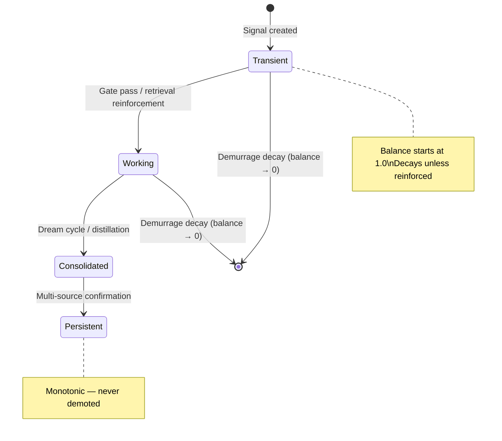
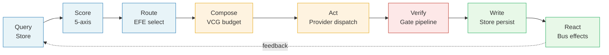
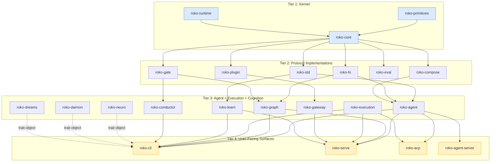
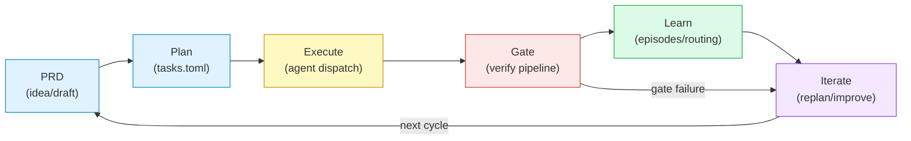

# Roko v3 Specification -- Master Index

> **Version**: 3.3
> **Date**: 2026-09-15
> **Scope**: Complete protocol specification for the Roko agent toolkit -- a Rust system
> where agents build themselves. Defines the vocabulary, composition rules, behavioral
> contracts, and implementation state for 39 workspace members (~1M LOC, 10,300+ tests).
> **Implementation status** (corrected 2026-09-29 at `7c556bc0a`): WIRED -- The
> plan-execute-verify-persist loop works end-to-end. Its largest recorded use is Roko's
> portal build: 16 plans and 173 tasks, 168 of them gate-verified, run under a supervising
> operator session (`docs/whitepaper/evidence/2026-09-29-b7-real-run-evidence.md`).
> Graph is the sole execution engine. All 9 protocols are defined as Rust traits. The 5
> primitives (Signal, Pulse, Cell, Graph, Protocol) are implemented. The earlier "48/48
> epics accepted" and "all executable tasks complete" figures were programme bookkeeping,
> not runs of this workflow, and are withdrawn (section 13). Chain/economic runtime
> integration, a fresh live self-hosting rerun, and several product residuals remain.

---

## 1. What This Specification Is

This specification defines **standards for an agent economy**: persistent identity,
trustless coordination, and composable computation. The design peers are Stripe (payment
protocol), Ethereum (execution protocol), and ERC-20 (token standard) -- not LangGraph,
CrewAI, or AutoGen.

Roko's core thesis is the **scaffold thesis**: given the same LLM, agent performance varies
dramatically based on the surrounding harness -- context engineering, verification, learning
loops, and cognitive architecture. Roko aims to be that scaffold, composable and
domain-agnostic. Today it is code-first (PARTIAL at `7c556bc0a`): its one domain-neutral
verifier is a shell command (custom `[[gates.rungs]]` and per-task `verify` steps), while
the default gate ladder runs `cargo build`, `cargo clippy` and `cargo test`
(`GatesConfig::effective_rungs`), the role templates are code roles, and isolation and
integration assume git. Empirical evidence supports the scaffold thesis:

- **SWE-bench Verified** (Jimenez et al. 2024): The same Claude Sonnet 3.5 achieves 30-65%
  solve rates depending on the harness. The difference is the scaffolding.
- **Meta-Harness** (Lee et al. 2026, arXiv:2603.28052): +7.7 points on text classification
  and +4.7 on IMO-level math from harness optimization alone, at 4x fewer tokens.
- **FrugalGPT** (Chen et al. 2023, arXiv:2305.05176): Cascade routing matches GPT-4 quality
  at 2% cost. The routing harness is the product.

Three technical bottlenecks stand between today's agent demos and a functioning agent economy:

| Bottleneck | How Roko Addresses It |
|---|---|
| **Persistent identity** | ERC-8004 agent identities + HDC fingerprints (Kanerva 2009) + ZK attestation |
| **Agent communication protocol** | MCP (tool discovery) + A2A (agent cards) + Bus (ephemeral pub/sub) + stigmergic coordination (Dorigo 1992) |
| **Trust without face-to-face** | ZK proofs over HDC vectors + TraceRank reputation + demurrage-weighted knowledge (Gesell 1916) |

Four external protocols -- **MCP**, **A2A**, **ERC-8004**, **x402** -- form a fixed
exoskeleton. This spec defines what flows through them.

---

## 2. The One Rule

> **Everything is a Graph of Cells processing Signals through Bus and Store.**

Every system, subsystem, and feature in this specification is expressed as a composition
of the same five primitives: **Signal** (data), **Cell** (computation), **Graph**
(composition), **Bus** (ephemeral transport), and **Store** (durable persistence). There
are no special cases. If something seems to need special machinery, it means we need a new
Cell specialization -- not a new concept.

This rule eliminates god files, ad-hoc state management, and one-off infrastructure. It also
means every subsystem composes with every other subsystem by construction, because they all
speak the same protocol.

---

## 3. Five Primitives

A developer learns 5 primitives, 9 protocols, and 4 patterns. Everything else is a
discoverable composition of these 18 concepts.

### 3.1 Signal

The **Signal** is the universal datum. Every piece of information in Roko -- a task, a
prompt, an LLM output, a gate verdict, a knowledge entry, a prediction, a tool trace -- is
a Signal.

| Property | Description |
|---|---|
| **Content-addressed** | BLAKE3 hash; identical content produces identical hashes |
| **Typed** | `Kind` enum: Task, Episode, Knowledge, Heuristic, AntiKnowledge, Plan, Verdict, Observation, etc. |
| **Scored** | 5-axis appraisal: confidence, novelty, utility, reputation, salience |
| **Decayed** | Balance starts at 1.0, decreases via demurrage (Gesell 1916) unless reinforced by retrieval, citation, surprise, or gate-pass |
| **Lineage-tracked** | `parents: Vec<ContentHash>` forms an immutable DAG of provenance |
| **HDC-fingerprinted** | 10,240-bit hyperdimensional computing vector (Kanerva 2009) for similarity search |
| **Tiered** | `SignalStatus`: Transient -> Working -> Consolidated -> Persistent (monotonic graduation) |



**Rust location**: `crates/roko-core/src/signal.rs` -- the `Signal` struct (aliased as
`type Engram = Signal` in `crates/roko-core/src/engram.rs`; the underlying struct is
`Signal` and `Engram` is a backward-compat alias).

**Primary doc**: [01-SIGNAL.md](01-SIGNAL.md)

### 3.2 Pulse

The **Pulse** is Signal's ephemeral sibling. Pulses flow through the Bus for immediate
downstream reactions; only those worth persisting get promoted to Signals via **Graduation**
-- the only path from transport into the audit DAG.

| Property | Description |
|---|---|
| **Sequence-numbered** | Monotonically increasing per Bus scope |
| **Ring-buffered** | Evicted by position, not time |
| **Topic-addressed** | Published to topic strings, subscribers filter by `TopicFilter` |
| **Broadcast** | One publisher, many subscribers |

**Graduation** (Pulse -> Signal) is the only path into the durable audit DAG.
**Projection** (Signal -> Pulse) is a lossy broadcast for real-time consumption.

**Rust location**: `crates/roko-core/src/pulse.rs`

**Primary doc**: [01-SIGNAL.md](01-SIGNAL.md)

### 3.3 Cell

The **Cell** is the atomic computation unit. Signals in, Signals out. Every Cell declares
its typed I/O, capabilities, and protocol conformances. Every Cell is a learner via the
**predict-publish-correct** loop (Friston 2006): the Graph Engine calls `Cell::predict`
before execution, then `Cell::correct` after, so the Cell can update its internal model.

| Property | Description |
|---|---|
| **Identity** | `cell_id: String`, `cell_name: String`, `cell_version: (u32, u32, u32)` |
| **Protocol conformance** | `protocols() -> Vec<ProtocolId>` declares which of the 9 protocols this Cell implements |
| **Capabilities** | 7-bit declaration: network, file_system, subprocess, llm_access, chain_access, bus_publish, store_write |
| **Typed I/O** | `input_schema: Option<TypeSchema>`, `output_schema: Option<TypeSchema>` for edge validation |
| **Cost estimation** | `CostEstimate { usd_cost, token_input, token_output, api_calls, wall_clock_ms, confidence }` |
| **Learning** | `predict(&[Signal]) -> Option<PredictionRecord>`, `correct(&PredictionRecord, &[Signal])` |

**Rust location**: `crates/roko-core/src/cell.rs` -- the `Cell` trait, `CellContext`,
`Capabilities`, `CostEstimate`, `PredictionRecord`, `TypeSchema`, `CoreCellRegistry`

**Primary doc**: [02-CELL.md](02-CELL.md)

### 3.4 Graph

The **Graph** is the universal composition mechanism. A typed DAG of Cells connected by
edges. TOML-defined, serializable, runtime-interpreted. In the design, Graphs are
themselves Cells, so Graphs nest (fractal composition). That is not implemented: there is
no `impl Cell for Graph` in `crates/roko-graph/src/`, so a Graph cannot run as a node of
another Graph (DOCS-ONLY at `7c556bc0a`).

| Property | Description |
|---|---|
| **DAG topology** | Cells are nodes, typed edges carry Signals between them |
| **Parallel waves** | Independent cells execute concurrently in fan-out waves |
| **Hot Graphs** | Stay resident and re-fire per tick (agent pipelines) |
| **Snapshot/resume** | Schema-v2 cost state, graph-fingerprinted Activity resume, restart-durable checkpoints |
| **Cost enforcement** | Atomic USD budget reservations, paid-failure-aware cost tracking |

The Graph engine is the **sole execution engine** since PR #260 (made default) and #276
(retired `WorkflowEngine`). Runner-v2 is retained as `--engine legacy` for one release
cycle.

**Rust location**: `crates/roko-graph/` -- DAG cells, topology, cost state,
`ProductionPlanTopology`, `GuaranteedFinallyController`

**Primary doc**: [03-GRAPH.md](03-GRAPH.md)

### 3.5 Protocol

A **Protocol** is a behavioral contract that a Cell conforms to. Roko defines 9 protocols.
Each supports the predict-publish-correct learning loop. A Cell publishes its prediction as
a Pulse, reality publishes the outcome, a CalibrationPolicy joins by lineage and computes
error, and the Cell subscribes to its error topic to update. Learning is structural.

See section 4 below for the full protocol table.

**Rust location**: `crates/roko-core/src/cell.rs` -- the `ProtocolId` enum;
`crates/roko-core/src/traits.rs` -- all 9 protocol trait definitions plus `ColdStore`,
`Bus`, and `Substrate` (Store alias)

**Primary doc**: [02-CELL.md](02-CELL.md)

---

## 4. Nine Protocols

The `ProtocolId` enum in `crates/roko-core/src/cell.rs` defines exactly 9 protocol
conformances. Each has a corresponding Rust trait in `crates/roko-core/src/traits.rs`.

| ProtocolId | Trait | Verb | What It Does | Key Property |
|---|---|---|---|---|
| `Store` | `Store` | put / get / query / query_similar / prune | Persist and retrieve Signals | Content-addressed, demurrage-decayed, HDC-queryable |
| `Score` | `Score` | rate along 5 dimensions | Evaluate Signal quality | Calibrated via Beta-Binomial tracker; Cell supertrait |
| `Verify` | `Verify` | check -> Verdict | Validate correctness, safety, quality | Conjunctive hard + Pareto soft (Goodhart-resistant) |
| `Route` | `Route` | select among candidates | Choose Cell/model/path for task | EFE (Friston): epistemic + pragmatic - cost |
| `Compose` | `Compose` | assemble under budget -> Signal | Combine context for LLM calls | VCG auction with section effect tracking |
| `React` | `React` | watch Pulses -> emit Signals/Pulses | Real-time event response | Operates on ephemeral Bus stream |
| `Observe` | `Observe` | read-only -> observation Signals | Monitor without mutation | Lens pattern for telemetry |
| `Connect` | `Connect` | connect / health / disconnect | External system I/O | Lifecycle-managed with health checks |
| `Trigger` | `Trigger` | arm / disarm | Declarative event ingress | Debounce, filter, conditional |

### Additional kernel traits (not ProtocolId variants, but part of the trait stack)

| Trait | What It Does | Notes |
|---|---|---|
| `ColdStore` | Archival store for aged-out signals | Compressed JSONL archives; `archive` / `thaw` / `purge_before` |
| `Bus` | Publish/subscribe transport for Pulses | Sequence-numbered, ring-buffered; associated `Receiver` type |
| `Substrate` | Legacy alias for `Store` | Auto-implemented blanket impl: `impl<T: Store + ?Sized> Substrate for T {}` |

The CLAUDE.md describes 12 kernel traits total: the 9 ProtocolId traits + ColdStore + Bus +
Substrate. In practice, `Substrate` is a transparent alias and `ColdStore` / `Bus` are
infrastructure traits that complement the 9 Cell protocols.

### Protocol composition

Protocols compose freely on a single Cell. A Cell that implements `Store + Score + Verify`
is a "verified scored store." The `protocols()` method returns all conformances, and the
engine can introspect at runtime which protocols a given Cell supports.

Every protocol trait (except `Store`, `ColdStore`, `Bus`, and `Substrate`) requires `Cell`
as a supertrait, giving the execution engine identity, cost estimation, and protocol
introspection for every protocol implementor.

---

## 5. Two Fabrics

All data in the system flows through exactly one of two transport fabrics. Nothing else.
No ad-hoc state channels, no hidden caches, no side-band communication.

| Fabric | Medium | Lifetime | Addressing | Access Pattern |
|---|---|---|---|---|
| **Store** | Signal (durable) | Persists until pruned by demurrage | Content-addressed (BLAKE3) | Put / Get / Query / QuerySimilar |
| **Bus** | Pulse (ephemeral) | Ring-buffered, evicted by position | Sequence-numbered | Publish / Subscribe by topic |

The two fabrics reflect two timescales of reality: things that persist and things that flow.

**Graduation** (Pulse -> Signal) converts ephemeral Bus events into durable Store entries.
This is the **only** path from transport into the audit DAG.

**Projection** (Signal -> Pulse) broadcasts durable Store entries as ephemeral Bus events.
This is a lossy transformation for real-time consumption.

---

## 6. Four Universal Patterns

Every concrete system in Roko is an instance of one (or a composition of several) of these
four recurring Graph topologies.

| Pattern | Topology | Key Property | Instances |
|---|---|---|---|
| **Pipeline** | Linear chain of Cells. Each can reject (Verify), transform (Compose), or redirect (Route). | Sequential processing with early exit. | Inference gateway (9-stage), gate pipeline (7-rung), immune system (5-layer), auth chain |
| **Loop** | Graph with feedback edge from output back to input. React Cell watches outcomes and adjusts. | Self-improving via predict-publish-correct. | Cognitive loop, calibration loop, dream cycle, adaptive thresholds, cascade router |
| **Functor** | Cross-cut that enriches Signals pre/post a Cell without changing the Graph's topology. Endofunctor F: Signal -> Signal. | Composable orthogonal concerns. | Memory enrichment, Daimon affect bias, Dreams consolidation, Safety constraints |
| **Space** | Graph that owns a Bus partition + Store partition. Members share these resources under access control. | Isolation + collaboration boundary. | Agent, Group, Workspace, Namespace, Sandbox |

**Fractal composition** (design, not implemented): if Graphs were Cells, a Pipeline of
Pipelines would itself be a Pipeline and a Loop could contain a Pipeline, with no special
glue code between subsystems. There is no `impl Cell for Graph` in `crates/roko-graph/src/`
at `7c556bc0a`, so today these patterns compose only inside a single Graph.

---

## 7. Conceptual Workflow

The canonical data flow through the system follows 8 stages. This is the "universal
cognitive loop" that every execution path instantiates:

```
query -> score -> route -> compose -> act -> verify -> write -> react
```



### Stage-by-stage

| Stage | Protocol(s) | What Happens | Key Crate |
|---|---|---|---|
| **Query** | Store | Retrieve candidate Signals matching the current context | `roko-core`, `roko-fs`, `roko-neuro` |
| **Score** | Score | Rate each candidate along 5 dimensions (confidence, novelty, utility, reputation, salience) | `roko-std`, `roko-learn` |
| **Route** | Route | Select the best candidate/model/path using EFE-balanced routing (epistemic + pragmatic - cost) | `roko-std`, `roko-learn` (CascadeRouter) |
| **Compose** | Compose | Assemble context under token/cost budget via VCG auction with section effect tracking | `roko-compose` |
| **Act** | Connect | Dispatch to the selected provider (LLM API call, tool execution, subprocess) | `roko-agent`, `roko-gateway` |
| **Verify** | Verify | Validate the output through the gate pipeline: compile, test, clippy, diff, safety checks | `roko-gate` |
| **Write** | Store | Persist the verified Signal to the durable Store; update lineage DAG | `roko-fs`, `roko-core` |
| **React** | React | Watch the newly written Signal via Bus; trigger downstream effects (learning, replanning, alerts) | `roko-conductor`, `roko-learn` |

### Short-circuit paths

Not every tick traverses all 8 stages:

- **T0 (reflex)**: Query -> Score -> Route determines the input matches a known pattern.
  Skip compose/act/verify entirely. Estimated ~80% of ticks cost $0.
- **T1 (routine)**: Query -> Score -> Route -> Compose -> Act -> Verify -> Write. Standard
  execution path.
- **T2 (deep)**: Full 8-stage path with extended verification, multi-model convergence,
  and deeper search. Triggered by high prediction error or explicitly by the operator.

These three cognitive speeds (gamma/theta/delta) are routed by Expected Free Energy:
high-certainty situations route to fast T0/T1, high-uncertainty to deep T2.

### Implementation note

The `select_compose_verify_persist` helper in `roko-core` covers only the non-ACT /
non-BROADCAST signal-selection subset of this workflow. The full 8-stage loop is
orchestrated by the Graph engine (for plans) and by `roko-cli`'s runner (for interactive
execution). `roko run` uses graph templates via `WorkflowGraphController`.

---

## 8. Thirteen Named Specializations

Named patterns of protocol combinations. These are conventions, not new primitives -- each
is built from the same 5 primitives.

| Name | Built From | What It Adds |
|---|---|---|
| **Flow** | Graph + RunId + snapshots | Runtime instance with resume capability |
| **Hot Flow** | Flow that stays resident | Re-fires per tick (agent pipelines) |
| **Rack** | Graph + Macros (knobs) + Slots (jacks) | DAW-inspired parameterization |
| **Lens** | Cell + Observe protocol | Read-only observation; StateHub projections |
| **Loop** | Graph + feedback edge | Self-improving pattern |
| **Memory** | Store Cell + demurrage + dreams | Self-trimming knowledge with consolidation |
| **Extension** | Cell intercepting another Cell's pipeline | 8 layers, 23 hooks, CaMeL IFC |
| **Agent** | Space + Extensions + Memory + clock + vitality | Full cognitive runtime |
| **Connector** | Cell + Connect protocol + lifecycle | External system I/O |
| **Feed** | Cell + Connect + Trigger + Store | Continuous data stream with subscription |
| **Recipe** | Graph of Score Cells (pure data pipeline) | Composable data transformations (no LLM) |
| **Group** | Space + membership + coordination mode | Persistent agent collective |
| **Pipeline** | Linear Graph of Verify + Compose + Route Cells | Sequential processing with early exit |

---

## 9. Crate Dependency Overview

The workspace contains **39 members** organized into 33 library crates, 3 application
binaries, and 1 integration test crate, plus the CLI binary (`roko-cli`), the HTTP server
(`roko-serve`), and the ACP server (`roko-acp`).

### Kernel layer

These crates define the type system and core abstractions. Everything else depends on them.

| Crate | Path | What | Status |
|---|---|---|---|
| `roko-primitives` | `crates/roko-primitives/` | HDC vectors, tier routing | Stable |
| `roko-runtime` | `crates/roko-runtime/` | ProcessSupervisor, event bus, cancellation, workflow contract | Stable |
| `roko-core` | `crates/roko-core/` | Signal + 12 traits, types, config, tools, errors | Kernel, stable |

### Protocol implementation layer

Concrete implementations of the 9 protocol traits.

| Crate | Path | What | Status |
|---|---|---|---|
| `roko-std` | `crates/roko-std/` | 35 default tool definitions (16 executable local + 19 GitHub MCP); 52 with typed optional-chain placeholders | Stable |
| `roko-gate` | `crates/roko-gate/` | 19 gates, 7-rung pipeline, adaptive thresholds | Partial: plan runs use `ShellGate` for authored verify commands; the rung pipeline runs only in tests |
| `roko-eval` | `crates/roko-eval/` | Unified evaluation framework: EvidenceCollector, Criterion, Profile traits | Wired |
| `roko-fs` | `crates/roko-fs/` | FileSubstrate (JSONL), GC, layout | Stable |
| `roko-compose` | `crates/roko-compose/` | Prompt assembly, 11 role templates, 9-layer SystemPromptBuilder, enrichment | Wired |

### Agent layer

Agent backends, dispatch, safety, and provider integrations.

| Crate | Path | What | Status |
|---|---|---|---|
| `roko-agent` | `crates/roko-agent/` | 12 LLM provider kinds, pools, MCP, tool loop, safety | Wired |
| `roko-agent-server` | `crates/roko-agent-server/` | Per-agent HTTP sidecar: /message, /stream, /predictions, /research, /tasks | Wired |
| `roko-acp` | `crates/roko-acp/` | ACP (Agent Client Protocol) server for Cursor/external agent integration; 180 tests | Wired |

### Execution and orchestration layer

Plan execution, graph engine, and runtime service composition.

| Crate | Path | What | Status |
|---|---|---|---|
| `roko-graph` | `crates/roko-graph/` | Sole execution engine: DAG cells, topology, cost state, parallel waves, immune Graph | Wired |
| `roko-execution` | `crates/roko-execution/` | RuntimeServices builder (7 profiles), diagnostic service, execution control, feedback settlement | Wired |
| `roko-conductor` | `crates/roko-conductor/` | 12 watchers, circuit breaker, diagnosis | Built, not wired: nothing evaluates it on plan runs |

### Cognition layer

Learning, memory, affect, and dreams.

| Crate | Path | What | Status |
|---|---|---|---|
| `roko-learn` | `crates/roko-learn/` | Episodes, playbooks, bandits, model routing, experiments, efficiency | Wired |
| `roko-neuro` | `crates/roko-neuro/` | Durable knowledge store, distillation, tier progression | Wired |
| `roko-dreams` | `crates/roko-dreams/` | Offline consolidation (hypnagogia, imagination, cycle), scheduling | Wired |
| `roko-daimon` | `crates/roko-daimon/` | Affect engine, somatic markers, PAD vector, dispatch modulation | Partial: affect feeds routing; `modulate_dispatch` and somatic markers have no caller |

### Infrastructure layer

Gateway, plugins, connectivity, and configuration.

| Crate | Path | What | Status |
|---|---|---|---|
| `roko-gateway` | `crates/roko-gateway/` | 9-stage inference pipeline: routing, caching, backpressure, cost accounting | Wired in `roko serve` only; plan runs don't use it |
| `roko-plugin` | `crates/roko-plugin/` | Plugin manifests, WASM hook validation (no hook runtime), signed deps, semantic-version resolution | Wired |
| `roko-chain` | `crates/roko-chain/` | Optional chain client/runtime primitives, local registry, marketplace, arena, DeFi state machines | Partial (local state machines tested; chain transport/indexing remain Phase 2+) |

### Code intelligence layer

| Crate | Path | What | Status |
|---|---|---|---|
| `roko-index` | `crates/roko-index/` | Parser + graph + HDC indexing | Built |
| `roko-lang-rust` | `crates/roko-lang-rust/` | Rust language support (tree-sitter, symbol extraction) | Built |
| `roko-lang-typescript` | `crates/roko-lang-typescript/` | TypeScript language support | Built |
| `roko-lang-go` | `crates/roko-lang-go/` | Go language support | Built |

### MCP servers

Standalone MCP servers used by agents via `--mcp-config`.

| Crate | Path | What | Status |
|---|---|---|---|
| `roko-mcp-code` | `crates/roko-mcp-code/` | Code-intelligence MCP server | Wired |
| `roko-mcp-github` | `crates/roko-mcp-github/` | GitHub integration MCP | Partial |
| `roko-mcp-slack` | `crates/roko-mcp-slack/` | Slack integration MCP | Partial |
| `roko-mcp-scripts` | `crates/roko-mcp-scripts/` | Scripts execution MCP | Partial |
| `roko-mcp-stdio` | `crates/roko-mcp-stdio/` | Stdio transport MCP | Wired |

### User-facing surfaces

| Crate | Path | What | Status |
|---|---|---|---|
| `roko-cli` | `crates/roko-cli/` | CLI binary, plan DAG/runner, merge queue, worktree manager, ratatui TUI | Main entry point, wired |
| `roko-serve` | `crates/roko-serve/` | HTTP control plane: ~376 canonical REST routes (~421 incl. aliases) + SSE + WebSocket on :6677 | Wired |
| `roko-demo` | `crates/roko-demo/` | Demo/example binary for showcasing features | Built |

### Application binaries

| App | Path | What | Status |
|---|---|---|---|
| `mirage-rs` | `apps/mirage-rs/` | In-process EVM fork simulator | Built |
| `agent-relay` | `apps/agent-relay/` | Supervised relay client for envelope delivery | Wired |
| `roko-chain-watcher` | `apps/roko-chain-watcher/` | Long-running chain observer agent | Built |

### Integration tests

| Crate | Path | What |
|---|---|---|
| `tests` | `tests/` | End-to-end integration tests |

### Dependency flow

Dependencies flow strictly downward through the layers:

```
                    +-----------------+
                    |  roko-primitives |
                    |  roko-runtime    |
                    +---------+-------+
                              |
                    +---------v-------+
                    |    roko-core     |  <-- kernel: Signal, Cell, 12 traits
                    +---------+-------+
                              |
          +-------------------+-------------------+
          |                   |                   |
+---------v----+   +----------v-----+   +---------v------+
|   roko-std   |   |    roko-fs     |   |   roko-gate    |
|  roko-compose|   |   roko-eval    |   |  roko-plugin   |
+---------+----+   +----------+-----+   +---------+------+
          |                   |                   |
          +-------------------+-------------------+
                              |
          +-------------------+-------------------+
          |                   |                   |
+---------v-----+  +----------v------+  +---------v-------+
|  roko-agent   |  |   roko-graph    |  |  roko-gateway   |
|  roko-learn   |  |  roko-execution |  |  roko-conductor |
|  roko-neuro   |  |                 |  |                 |
|  roko-daimon  |  |                 |  |                 |
|  roko-dreams  |  |                 |  |                 |
+-------+-------+  +--------+--------+  +--------+--------+
        |                    |                    |
        +--------------------+--------------------+
                             |
              +--------------v--------------+
              |    roko-cli (main binary)   |
              |    roko-serve (HTTP API)    |
              |    roko-acp (editor ACP)    |
              |    roko-agent-server        |
              +-----------------------------+
```

Cross-cutting concerns (`roko-neuro`, `roko-daimon`, `roko-dreams`) are injected via trait
objects, never via direct imports of higher layers.



---

## 10. Design Principles

### P1: Two mediums, two fabrics

Durable **Signals** in **Store**, ephemeral **Pulses** on **Bus**. The system has two data
shapes because reality has two timescales. **Graduation** converts Pulse -> Signal (the
only path into the audit DAG). **Projection** converts Signal -> Pulse (lossy broadcast).

### P2: Every operator is a learner

**Predict-publish-correct** via Bus (Friston 2006). Every Cell publishes its prediction as
a Pulse, subscribes to its own error topic, and adjusts. Learning is structural -- it
emerges from the same pub/sub fabric that carries heartbeats and gate verdicts, not from a
separate bolted-on subsystem.

### P3: Demurrage is default

Signals decay via attention-weighted holding cost (Gesell 1916). Balance starts at 1.0,
decreases unless actively reinforced by retrieval, citation, surprise, or gate-pass.
Self-trimming knowledge: unique insights stay warm, duplicates fade.

### P4: Verify is load-bearing

The Verify protocol serves four roles simultaneously: **reward function** (continuous
`Verdict.reward: f64`), **relabeling oracle** (hindsight relabeling of failed trajectories),
**safety boundary** (`verify_pre()` can veto), **economic attestation** (reputation via
ERC-8004). Conjunctive hard + Pareto soft resists Goodhart's Law.

### P5: Mortality is a feature

Agents have finite **vitality** creating behavioral phases (Thriving -> Stable ->
Conservation -> Declining -> Terminal). Economic pressure drives efficient resource use
and honest self-assessment (Jonas 1966).

### P6: Collective intelligence is measurable

The **c-factor** (Woolley et al. 2010) is computed from Bus/Store statistics. It is a
**covariate, not an objective** -- optimizing c directly can be gamed. It gates L4
evolution: only evolve configurations that increase genuine collective intelligence.

### P7: Everything composes from primitives

No special machinery. An Agent is Space + Extensions + Memory + clock. A dream cycle is a
Loop. The inference gateway is a Pipeline. Feeds are Cells with Connect+Trigger+Store
protocols. If you need a new concept, express it as a composition of existing primitives.

### P8: Cost falls mechanically with volume

Wright's-law on rails: Route = EFE balances quality vs cost; Compose = budget-constrained
VCG; Verify = cost attribution; Demurrage = even memory has cost pressure; T0 gating =
~80% of ticks cost $0. Stacked: caching (5x) x routing (3x) x gating (2x) = **10-30x
cost reduction**.

### P9: Protocol, not framework

Signal/Cell/Graph are standards. Each new conforming Cell multiplies combinations with
every existing Cell, Graph, and Signal channel (ERC-20 precedent). The spec defines what
flows through MCP, A2A, ERC-8004, and x402. It does not replace them.

### P10: Safety scales with autonomy

CaMeL capability-tagged IFC on Extensions. Nayebi 5-head lexicographic corrigibility
(deference > switch > truth > impact > task). Verify gates sit **outside the modifiable
surface** -- the agent cannot modify its own verification pipeline.

### P11: The spec is a runtime artifact

These documents are readable by agents at startup, queryable as MCP tools, evolvable
through L4, and signed under ERC-8004.

---

## 11. Anti-Principles

| Anti-Pattern | Response |
|---|---|
| Standalone destination app | Embed in existing surfaces |
| Naive multi-agent debate | Require heterogeneity + structured indirection (Surowiecki 2004) |
| Opaque marketplace economics | Publish all metrics, transparent take-rates |
| Weighted-sum verification | Conjunctive hard + Pareto soft |
| LLM-judging-itself | Variance Inequality: verifier spectrally cleaner than generator |
| God files | Composition of small Cells; max ~500 LOC per Cell |
| Ad-hoc state | Everything through Bus or Store; no hidden channels |
| One-off infrastructure | Express as Cell specialization; reuse patterns |
| Token speculation | ERC-8004 agent identity and utility, not token price |

---

## 12. Self-Hosting Workflow

Roko develops itself. Each step is a CLI command that exists today:

```bash
# 1. Capture a work item
roko prd idea "Wire SystemPromptBuilder into runner"

# 2. Draft a PRD from the idea (agent-driven)
roko prd draft new "system-prompt-wiring"

# 3. Research the topic for context
roko research enhance-prd system-prompt-wiring

# 4. Generate implementation plan + tasks from the PRD
roko prd plan system-prompt-wiring

# 5. Execute the plan (agents run tasks, gates validate, state persists)
roko plan run plans/

# 6. Resume if interrupted
roko plan run plans/ --resume-plan

# 7. Watch progress
roko dashboard

# 8. Check status
roko status
```

Each step uses Roko's own infrastructure: the Composer assembles context, the Router
selects models, the Gate pipeline verifies outputs, the Episode logger records what
happened, and the CascadeRouter improves model selection over time. The scaffold improves
the scaffold -- this is the autocatalytic cycle made concrete.



For bounded, small-scope self-development tasks, the opt-in FAST lane provides:

```bash
./dev.sh fast plans/<plan-directory>
```

FAST tasks define exactly one authored `verify` command, skip critical-path warmup/cleanup,
and capture a private evidence bundle. FAST is not appropriate for safety, auth,
persistence, migration, payment, or other high-risk changes.

---

## 13. Implementation Status Summary

As of 2026-09-15 (source: CLAUDE.md), with the rows corrected on 2026-09-29 marked:

| Component | Status | Key Milestone |
|---|---|---|
| Plan-execute-gate-persist loop | **End-to-end** | Graph engine is sole executor |
| 48/48 epics | **Accepted (manifest only)** | Corrected 2026-09-29: accepted as programme manifests, mostly built outside this workflow (note below) |
| Executable-task count | **Withdrawn** | Corrected 2026-09-29: the old "all 124 tasks complete" count was stale (note below) |
| Safety layer (E34 8/8) | **Complete** | Trust-origin IFC, 5-head corrigibility, immune Graph, sandbox policy |
| Telemetry Lens (E33 9/9) | **Complete** | 11 built-in executors, 39 event variants, restart-durable history |
| Agent cognitive autonomy (E23 manifest 10/10) | **Partial** | Corrected 2026-09-29: lifecycle type-state, behavioral vitality and CorticalState are built; affect reaches routing only, and EFE routing has no caller (11-AFFECT) |
| Advanced learning (E25 manifest 10/10) | **Partial** | Corrected 2026-09-29: HDC consolidation, hindsight, c-factor governance and playbook enrichment are built; 2 of the 8 feedback loops close on plan runs (08-LEARNING section 11) |
| Advanced memory (E24 10/10) | **Complete** | Demurrage, falsifiers, HDC lookup, temporal query, distillation, dreams |
| Inference gateway (E26 12/12) | **Complete, `roko serve` only** | 9-stage pipeline, caching, backpressure, cost accounting, key rotation. Corrected 2026-09-29: plan runs don't use it (20-GATEWAY) |
| Feeds and recipes (E27 10/10) | **Complete** | Cell-composed feeds, discovery, Bus bridging, recipe DAG evaluation |
| Agent groups (E28 8/8) | **Complete** | Membership, permissions, coordination, knowledge flows, privacy filtering |
| Triggers (E31 8/8) | **Complete** | 7 sources, IANA/DST cron, EVM ABI/finality/reorg, CA-verified mTLS |
| Tools/plugins (E32 8/8) | **Partial** | Signed deps, strict admission, verified relay/install. Corrected 2026-09-29: WASM hooks are validated at install but never run; their runtime was removed with Runner-v2 (19-TOOLS-PLUGINS) |
| Named surfaces (E37 9/9) | **Complete** | Workbench/Inbox/Canvas/Minimap/Autonomy projections, StateHub routes |
| Marketplace contracts (E38 9/9) | **Complete (contract/stub)** | Artifact/package/publish/economics tested; durable storage remains |
| Payments (E36 8/8) | **Complete** | x402 batching, MPP sessions, reputation pricing, cost persistence |
| Config evolution (E42 8/8) | **Complete** | Priority/provenance, 7 invariants, migrations, profiles, transactional reload |
| Cross-cut functors (E44 8/8) | **Complete** | Memory/Daimon/Dreams/Safety functors, VCG arbitration, gate-failure cascade |
| GitHub integration (E46 12/12) | **Wired** | Draft PRs, terminal comments/issues, accepted-commit publication |
| Connectivity/relay (E29 + R01/R02) | **Scoped complete** | HTTP JSON adapter, bounded delivery, atomic cursor restore |
| Registries/identity | **Local tranche complete** | Transferable identity, TraceRank, gossip, passport/knowledge routes |
| Arenas/evals (E40 + R03) | **Scoped complete** | Arena registry, attempt submission, settlement, leaderboard/prize/reputation |
| Meta-agent lineage (R04) | **Scoped complete** | Owner-scoped lifecycle, non-widening authority, 5-head evidence |
| Engine convergence | **Done** | Graph sole engine (#260/#276); Runner-v2 retained as --engine legacy |

> **Correction (2026-09-29, at `7c556bc0a`).** The 48 epics were accepted as programme
> manifests; accepting them did not mean running this workflow. The frozen status table lists
> the executable-task count as stale (`work/history/claude-md-status-2026-09-28.md`), and the
> companion audit of the repository history (2026-09-28) credits Roko's own plan runner with
> 0.22-0.67% of the Rust lines added and finds no runner record for at least 122 of the 124
> tasks. The best current evidence that the workflow runs end-to-end is the portal build: 16
> plans and 173 tasks, 168 of them gate-verified
> (`docs/whitepaper/evidence/2026-09-29-b7-real-run-evidence.md`).

### Remaining work

1. **Chain/economic runtime integration** -- Local witnesses, marketplace, registries, and
   DeFi primitives exist but production adapters (contracts, transport, indexing,
   authorization, risk) remain Phase 2+.
2. **Fresh dogfood proof** -- First run (2026-08-13) exposed 4 blockers; all have regression
   fixes. A clean live full self-hosting rerun is required for sign-off.
3. **ACP/serve experiment injection** -- Runner prompt experiments are durable; ACP/serve
   still inject context rather than using the runner receipt protocol.
4. **Product residuals** -- Provider-owned internals, trace Signals, adaptive immune
   memory, external ledger authentication, full named-surface TUI rendering, and several
   native runtime sources remain.

---

## 14. Chapter Listing

### Kernel -- learn the type system

| # | Document | What It Defines | Status |
|---|---|---|---|
| **[00](00-INDEX.md)** | Master Index (this document) | Primitives, protocols, patterns, architecture overview, implementation state | -- |
| **[01](01-SIGNAL.md)** | Signal and Pulse | Two mediums: durable Signal and ephemeral Pulse. Bus and Store. Demurrage. HDC. Kind system. Graduation/Projection. Taint and provenance. | WIRED |
| **[02](02-CELL.md)** | Cell and Protocols | Universal computation unit. 9 protocol traits. TypeSchema. Capabilities. Predict-publish-correct. Protocol composition. Cost estimation. | WIRED |
| **[03](03-GRAPH.md)** | Graph | Universal composition. Typed DAG. TOML definition. Hot Graphs. Workflow/Activity split. Snapshot/resume. Merge queue. Edge validation. | WIRED |
| **[04](04-EXECUTION.md)** | Execution Engine | Plan-to-Graph conversion. RuntimeServices (7 profiles). Flow lifecycle. Checkpoint/resume. Engine convergence (#260/#276). | WIRED |

### Cognition -- agent intelligence

| # | Document | What It Defines | Status |
|---|---|---|---|
| **[05](05-AGENT.md)** | Agent Runtime | 12 provider kinds. Dual-process EFE routing. 3 cognitive timescales. Vitality and type-state lifecycle. CorticalState. Somatic markers. | WIRED |
| **[06](06-COMPOSITION.md)** | Composition | Prompt assembly. 11 role templates. 9-layer SystemPromptBuilder. VCG attention auction. Section effect tracking. Token budget management. | WIRED |
| **[07](07-GATES.md)** | Gates and Verification | 19 gates. 7-rung pipeline. Adaptive EMA thresholds. Conjunctive hard + Pareto soft. Evidence typing. Gate dispatch wiring. | PARTIAL (plan tasks run their authored verify commands) |
| **[08](08-LEARNING.md)** | Learning Loops | 4 learning loops. Autocatalytic compounding (hypothesis). Playbooks. Episodes. CascadeRouter. A/B experiments. Adaptive thresholds. HDC clustering. | PARTIAL (E25 manifest 10/10) |
| **[09](09-MEMORY.md)** | Memory and Knowledge | Neuro store. Demurrage economics. HDC algebra. 6 knowledge types. 4 validation tiers. Temporal knowledge graph. Distillation. | COMPLETE (E24 10/10) |
| **[10](10-DREAMS.md)** | Dreams and Consolidation | 3-phase cycle (NREM/REM/integration). Scheduling triggers. Journals. Hypnagogia engine. Sleep-time compute. | WIRED |
| **[11](11-AFFECT.md)** | Affect Engine | PAD vector. ALMA 3-layer temporal model. Somatic markers (Damasio). 6 behavioral states. Affect-modulated routing. Energy accounting. | PARTIAL |
| **[12](12-SAFETY.md)** | Security Model | Taint lattice IFC. 5-layer immune Pipeline Graph. Capability intersection. 5-level sandbox. CaMeL. 5-head corrigibility. Quarantine. | COMPLETE (E34 8/8) |
| **[13](13-TELEMETRY.md)** | Telemetry | 11 Lens executors. StateHub projections. 39 event variants. Bounded delivery. Breaker controls. Restart-durable history. c-factor computation. | COMPLETE (E33 9/9) |

### Infrastructure -- product systems (each is a Graph of Cells)

| # | Document | What It Defines | Status |
|---|---|---|---|
| **[14](14-FEEDS-RECIPES.md)** | Feeds and Recipes | Cell-composed runtime feeds. Discovery/lifecycle. Bus bridging. Built-in source feeds. Recipe DAG persistence/evaluation. | COMPLETE (E27 10/10) |
| **[15](15-TRIGGERS.md)** | Trigger System | 7 trigger sources. Root-Cell payload Signals. Space/capability enforcement. IANA/DST cron. EVM ABI/finality/reorg. CA-verified mTLS. | COMPLETE (E31 8/8) |
| **[16](16-COORDINATION.md)** | Coordination | Stigmergy (Dorigo 1992). Digital pheromones. Morphogenetic specialization. Collective intelligence metrics. c-factor. | WIRED |
| **[17](17-GROUPS.md)** | Groups | Persisted invitations/membership. 4 coordination modes. Knowledge/pheromone/message/event flows. Privacy filtering. | COMPLETE (E28 8/8) |
| **[18](18-CONNECTIVITY.md)** | Connectivity and Relay | 5-method relay contract. HTTP JSON adapter. Bounded envelope delivery. Atomic cursor restore. Fail-closed reconciliation. | SCOPED COMPLETE (E29+R01/R02) |
| **[19](19-TOOLS-PLUGINS.md)** | Tools and Plugins | 35+ shipped tool definitions. Plugin manifests. Signed dep graphs. 23-hook WASM validation (no hook runtime). Strict admission. Verified relay/install. | PARTIAL (E32 manifest 8/8) |
| **[20](20-GATEWAY.md)** | Inference Gateway | 9-stage Pipeline. Routing/fallback. Exact + semantic caches. Tool/output/thinking controls. 3-level backpressure. Key rotation. | COMPLETE (E26 12/12); `roko serve` only |

### Configuration and surfaces

| # | Document | What It Defines | Status |
|---|---|---|---|
| **[21](21-CONFIG.md)** | Configuration | Config-as-Signal. Priority/provenance. 7 invariants. Migrations. Profiles. Transactional reload. Freshness/doctor diagnostics. | COMPLETE (E42 8/8) |
| **[22](22-SURFACES.md)** | Surfaces | Named surfaces: Workbench/Inbox/Canvas/Minimap/Autonomy. 5 StateHub-backed routes. OpenAPI. Events. Legacy-tab mapping. | COMPLETE (E37 9/9 contract/backend) |
| **[23](23-PAYMENTS-ECONOMY.md)** | Payments and Economy | x402 batching. MPP sessions. Reputation pricing. Paid-feed 402 enforcement. Cost persistence. Dashboard events. | COMPLETE (E36 8/8) |
| **[24](24-AUTH.md)** | Authentication | Deployment-scoped opaque IDs. Hashed token verifiers. Global serve-auth middleware. Worker callback authentication. | WIRED |

### Observation and operations

| # | Document | What It Defines | Status |
|---|---|---|---|
| **[25](25-TUI.md)** | Interactive TUI | ratatui dashboard. 11 tabs (F1-F11). StateHub bridge. File/git watchers. ROSEDUST design language. Spectre creature visualization. Collective display. Sonification. A2UI generative interfaces. Onboarding flow. Accessibility. | WIRED |
| **[26](26-HTTP-API.md)** | HTTP Control Plane | ~376 canonical routes (~421 incl. aliases). SSE. WebSocket. OpenAPI. REST conventions. | WIRED |
| **[27](27-ACP.md)** | Agent Client Protocol | ACP server for Cursor/editor integration. Mutation consent. Experiments. Budget enforcement. 180 tests. | WIRED (E17 8/8) |
| **[28](28-CLI.md)** | CLI Reference | All subcommands: prd, plan, agent, research, knowledge, learn, config, serve, dashboard, etc. | WIRED |

### Cognitive architecture deep-dives

| # | Document | What It Defines | Status |
|---|---|---|---|
| **[29](29-HEARTBEAT.md)** | Universal Cognitive Loop | CoALA 9-step pipeline. 3 cognitive speeds (T0/T1/T2). Gamma/theta/delta loops. Adaptive clock. VCG attention auction. | WIRED |
| **[30](30-CONDUCTOR.md)** | Conductor | 12 watchers. Circuit breaker. Graduated interventions. Diagnosis engine. OODA cybernetic loop. Yerkes-Dodson pressure. | BUILT-UNWIRED |
| **[31](31-SELF-HOSTING.md)** | Self-Hosting | 8-step CLI loop. FAST self-development. RSI taxonomy (arXiv:2607.07663). Bounded self-refinement. Gate-failure replan (built, not wired). GRASP admission. Autocatalytic compounding. DGM/ADAS. AI4AI-Bench. Triple-loop learning. Dogfood evidence. | WIRED |

### Deployment and meta

| # | Document | What It Defines | Status |
|---|---|---|---|
| **[32](32-DEPLOYMENT.md)** | Deployment | Railway/Fly/Docker. Daemon lifecycle. Brain export. Secrets management. Multi-repo coordination. Port allocation. | WIRED |
| **[33](33-CROSS-CUTS.md)** | Cross-Cut Functors | Memory/Daimon/Dreams/Safety as endofunctors F: Signal -> Signal. 6 transforms. VCG arbitration. Gate-failure cascade. | COMPLETE (E44 8/8) |
| **[34](34-CODE-INTELLIGENCE.md)** | Code Intelligence | Tree-sitter parsing. Symbol extraction. Dependency graph. PageRank importance. HDC fingerprints. MCP context server. | WIRED |
| **[35](35-ARCHITECTURE.md)** | Architecture Overview | High-level architecture. Crate dependency graph. Data flow diagrams. Design decisions and rationale. | -- |
| **[36](36-LIFECYCLE.md)** | Agent Lifecycle | Agent creation (8-step). Provisioning. Budgets. Knowledge backup/export. Deletion (8-step shutdown). Transfer. | WIRED |

### Economy and domains

| # | Document | What It Defines | Status |
|---|---|---|---|
| **[37](37-SHARED-ECONOMY.md)** | Shared Economy | Reputation (TraceRank). Passports. Peer scoring. Hiring models. Sybil detection. Knowledge registry. Gossip discovery. | LOCAL TRANCHE COMPLETE |
| **[38](38-SIGNAL-ANALYSIS.md)** | Signal Analysis | Oracle patterns. Attestation. HDC-based analysis. Adaptive signal metabolism. Causal microstructure. Predictive geometry. | PARTIAL |
| **[39](39-ROADMAP.md)** | Roadmap | Phase 2+ features. Chain integration. Aspirational work. Research frontiers. | -- |

### Reference

| Document | What It Contains |
|---|---|
| **[REFERENCES.md](REFERENCES.md)** | Master bibliography: all academic papers cited across all chapters, with annotations |

### Depth files

Each overview chapter has a corresponding directory under `depth/` containing detailed
sub-topic files. The depth directories mirror the chapter numbers:

```
depth/
  00-architecture/     (~30 files: vision, naming, score axes, traits, taxonomy, ...)
  01-signal/           (~5 files: type anatomy, pulse, lifecycle, scoring, provenance)
  02-cell/             (~4 files: trait contract, protocol IDs, composition, dual impls)
  03-graph/            (~7 files: DAG topology, parallel waves, cost state, immune graph, ...)
  04-execution/        (~15 files: plan-to-graph, runtime services, worktree, merge queue, ...)
  05-agent/            (~18 files: provider adapters, MCP, tool loop, dual-process, safety, ...)
  06-composition/      (~14 files: 9-layer builder, role templates, enrichment, VCG, ...)
  07-gates/            (~15 files: 19 gate impls, 7-rung selector, adaptive thresholds, ...)
  08-learning/         (~21 files: episodes, playbooks, bandits, cascade router, ...)
  09-memory/           (~17 files: 6 knowledge types, 4 tiers, HDC operations, decay, ...)
  10-dreams/           (~18 files: NREM replay, REM imagination, hypnagogia, scheduling, ...)
  11-affect/           (~14 files: PAD, ALMA, somatic markers, behavioral states, ...)
  12-safety/           (~17 files: capability tokens, taint tracking, sandboxing, CaMeL, ...)
  13-telemetry/        (~6 files: lens protocol, StateHub, built-in executors, breaker, ...)
  14-feeds/            (~4 files: feed sources, recipe DAGs, Bus bridging, lifecycle)
  15-triggers/         (~5 files: 7 sources, cron, EVM, mTLS, pulse delivery)
  16-coordination/     (~13 files: stigmergy, pheromones, morphogenesis, scaling, ...)
  17-groups/           (~5 files: invitation, coordination, knowledge flows, privacy, ...)
  18-connectivity/     (~4 files: relay contract, envelope delivery, cursor restore, ...)
  19-tools/            (~18 files: tool architecture, MCP, plugins, WASM hooks, ...)
  20-gateway/          (~6 files: 9-stage pipeline, cache, cost accounting, backpressure, ...)
  21-config/           (~6 files: priority/provenance, 7 invariants, migrations, profiles, ...)
  22-surfaces/         (~4 files: named projections, StateHub routes, legacy mapping, ...)
  23-payments/         (~16 files: x402, MPP, reputation pricing, registries, economy, ...)
  24-auth/             (~3 files: serve-auth middleware, worker callbacks, scoped IDs)
  25-tui/              (~8 files: layout, F1-F10, StateHub bridge, design language, ...)
  26-http/             (~5 files: route inventory, SSE/WebSocket, OpenAPI, web portal)
  27-acp/              (~4 files: protocol, cursor integration, budget, experiments)
  28-cli/              (~6 files: command reference, scaffolders, progressive help, ...)
  29-heartbeat/        (~13 files: CoALA pipeline, 3 speeds, gamma/theta/delta, VCG, ...)
  30-conductor/        (~16 files: watchers, circuit breaker, diagnosis, OODA, ...)
  31-self-hosting/     (6 files: RSI taxonomy, replan loop, GRASP admission, autocatalytic, DGM/ADAS, dogfood)
  32-deployment/       (~15 files: packaging, Docker, daemon, cloud, secrets, ...)
  33-cross-cuts/       (~7 files: functor model, memory/daimon/dreams/safety functors, ...)
  34-code-intel/       (~11 files: tree-sitter, symbols, PageRank, HDC, MCP server, ...)
  35-architecture/     (~4 files: newcomer overview, crate graph, data flow, decisions)
  36-lifecycle/        (~13 files: creation, provisioning, budgets, deletion, transfer, ...)
  37-shared-economy/   (~15 files: reputation, TraceRank, passports, hiring, sybil, ...)
  38-signal-analysis/  (~12 files: oracles, attestation, HDC analysis, metabolism, ...)
  39-references/       (~26 files: per-domain bibliographies with annotations)
```

Total: ~40 overview chapters + ~380 depth files = ~420 files (matching v1's 417).

---

## 15. Reading Order

### Essential -- learn the type system (start here)

1. **[01-SIGNAL](01-SIGNAL.md)** -- Two mediums, two fabrics. Learn Signal and Pulse.
2. **[02-CELL](02-CELL.md)** -- Universal computation, 9 protocols. Learn Cell.
3. **[03-GRAPH](03-GRAPH.md)** -- Universal composition. Learn Graph.
4. **[04-EXECUTION](04-EXECUTION.md)** -- How Graphs run. Learn Flow.

After these four chapters you understand the complete type system.

### Core systems -- understand how agents think

5. **[05-AGENT](05-AGENT.md)** -- The cognitive runtime.
6. **[06-COMPOSITION](06-COMPOSITION.md)** -- How prompts are assembled.
7. **[07-GATES](07-GATES.md)** -- How outputs are verified.
8. **[08-LEARNING](08-LEARNING.md)** -- How everything improves.
9. **[09-MEMORY](09-MEMORY.md)** -- Self-trimming knowledge.

### Product layer -- each is a Graph of Cells

10-20. Gateway, Feeds, Triggers, Coordination, Groups, Connectivity, Tools, Surfaces,
Config, Payments, Auth.

### Operations and surfaces

21-28. TUI, HTTP API, ACP, CLI, Heartbeat, Conductor, Self-Hosting, Deployment.

### Architecture and economy

29-39. Cross-Cuts, Code Intelligence, Architecture, Lifecycle, Shared Economy, Signal
Analysis, Roadmap.

### Reference

**[REFERENCES.md](REFERENCES.md)** -- Master bibliography.

---

## 16. Naming Decisions

| Decision | Rationale |
|---|---|
| **Signal** (not Engram) | Immediately meaningful. Signal is the preferred name. The Rust struct is `Signal`; `type Engram = Signal` is the backward-compat alias. |
| **Pulse** (not Envelope) | Names the ephemeral sibling. Code has `Envelope<E>`. |
| **Bus** (not EventBus) | Promoted to kernel fabric alongside Store. |
| **Cell** (not Module/Block) | Composable, small, pluggable -- Eurorack module analogy. |
| **Graph** (not Workflow) | Precise: nodes + edges. "Flow" is the runtime instance. |
| **Rack** (not Parameterized Workflow) | DAW: macro knobs and patch jacks. |
| **Lens** (not Monitor/Probe) | Read-only by definition. Stacking gives different views. |
| **Loop** (not Feedback/Cycle) | Direct and unambiguous. |
| **Space** (not Workspace) | Clean isolation + grants. |
| **Feed** (not Stream) | Continuous data stream. Cell specialization for always-on data. |
| **Recipe** (not Pipeline/Transform) | Pure data composition -- no LLM, no agent. |
| **Group** (not Fleet/Swarm) | Persistent collective with identity. |
| **Demurrage** (not Decay) | Active economic mechanism -- use restores value (Gesell 1916). |
| **Vitality** (not Budget/Lifetime) | Captures both economic pressure and behavioral modulation. |
| **Heuristic** (not Playbook/Rule) | Testable prediction with calibration + mandatory falsifier. |

---

## 17. Concept Migration from Code

### From roko-core types to spec concepts

| Code Type/Trait | Spec Concept | Notes |
|---|---|---|
| `Signal` struct | Signal (durable) | `type Engram = Signal` is the backward-compat alias. Signal is preferred everywhere. |
| `Envelope<E>` / `EventBus` | Pulse / Bus | Promoted from implementation detail to kernel primitive. |
| `Store` trait (+ `Substrate` alias) | Store protocol | + `query_similar` for HDC. `Substrate` is auto-blanket-impl'd for all `Store`. |
| `Score` trait | Score protocol | + calibration via Beta-Binomial tracker. |
| `Verify` trait | Verify protocol | + pre/post/stream, continuous reward, evidence typing, conjunctive/Pareto. |
| `Route` trait | Route protocol | + EFE, regime conditioning. |
| `Compose` trait | Compose protocol | + VCG, section effects, Datum-polymorphic input. |
| `React` trait | React protocol | **Note**: operates on Pulses via `decide_with_pulses`. |
| `Observe` trait | Observe protocol | Lens pattern. |
| `Connect` trait | Connect protocol | Lifecycle-managed. |
| `Trigger` trait | Trigger protocol | Declarative event ingress. |
| `ColdStore` trait | Cold archival | Compressed JSONL archives. |
| `Bus` trait | Bus fabric | Sequence-numbered pub/sub with associated `Receiver` type. |

---

## 18. Verification

To confirm the system is working, run these commands from the workspace root
(`/Users/will/dev/nunchi/roko/roko/`):

```bash
# Build the entire workspace
cargo build --workspace

# Run all tests (10,300+)
cargo test --workspace

# Lint (must pass clean)
cargo clippy --workspace --no-deps -- -D warnings

# Format (nightly, matches CI)
cargo +nightly fmt --all

# Basic health check
cargo run -p roko-cli -- doctor

# Verify the self-hosting workflow
cargo run -p roko-cli -- status

# Check configuration
cargo run -p roko-cli -- config show

# Inspect learning state
cargo run -p roko-cli -- learn all

# View the interactive dashboard
cargo run -p roko-cli -- dashboard
```

**Toolchain requirement**: Rust 1.91+ (alloy dependencies). The green 2026-08-16 release
checkpoint used rustc 1.96.1.

---

## 19. References

### Primary academic foundations

| Citation | Contribution to Roko |
|---|---|
| **Friston 2006, 2010**, Nature Reviews Neuroscience 11(2) | Free Energy Principle: prediction error drives learning and attention. Foundation for predict-publish-correct and EFE routing. |
| **Sumers et al. 2023**, arXiv:2309.02427 | CoALA: cognitive architecture framework for language agents. Structural blueprint for the universal cognitive loop. |
| **Kauffman 1993**, The Origins of Order, OUP | Autocatalytic sets: self-sustaining improvement cycles. Mathematical foundation for compound improvement. |
| **Gesell 1916**, Die naturliche Wirtschaftsordnung | Demurrage economics: holding costs on stored value. Foundation for Signal decay and self-trimming knowledge. |
| **Kanerva 2009**, Hyperdimensional Computing | 10,000-bit binary vectors for cognitive computation. Foundation for HDC fingerprints and similarity search. |
| **Woolley et al. 2010**, Science 330(6004) | Collective intelligence factor. Foundation for c-factor computation and group performance measurement. |
| **Dorigo 1992**, Optimization, Learning and Natural Algorithms | Stigmergic coordination in ant colonies. Foundation for pheromone-based agent coordination. |
| **Nayebi 2024** | 5-head lexicographic corrigibility ordering. Foundation for safety head priority (deference > switch > truth > impact > task). |

### Empirical scaffold thesis evidence

| Citation | Contribution |
|---|---|
| **Lee et al. 2026**, arXiv:2603.28052 | Meta-Harness: +7.7 points from harness optimization alone, 4x fewer tokens. |
| **Chen et al. 2023**, arXiv:2305.05176 | FrugalGPT: cascade routing matches GPT-4 at 2% cost. |
| **Jimenez et al. 2024** | SWE-bench: 30-65% solve rate variation from harness alone. |
| **Li et al. 2022** | AlphaCode: competitive programming through compound system design. |
| **Khattab et al. 2024** | DSPy: compiler-optimized prompt pipelines outperform manual prompting. |
| **Zaharia et al. 2024** | Compound AI Systems thesis: SOTA from systems, not individual models. |

### Cybernetic and systems theory

| Citation | Contribution |
|---|---|
| **Ashby 1956**, An Introduction to Cybernetics | Law of Requisite Variety: regulatory capacity must match environment variety. |
| **Conant & Ashby 1970**, Intl. J. Systems Science 1(2) | Good Regulator Theorem: agent must model itself (motivates Daimon). |
| **Beer 1972**, Brain of the Firm | Viable System Model: 5 recursive subsystems map to Roko's layers. |
| **Jonas 1966**, The Phenomenon of Life | Mortality as enabling feature for purposive behavior. |
| **Surowiecki 2004**, The Wisdom of Crowds | Conditions for collective intelligence: diversity, independence, decentralization. |

### Additional foundations

| Citation | Contribution |
|---|---|
| **de Vries et al. 2025**, arXiv:2504.14898 | EFE as variational inference. Theoretical basis for attention allocation. |
| **Vovk et al. 2005**, Algorithmic Learning in a Random World | Conformal prediction: distribution-free calibration for prediction tracking. |
| **Clark 2013**, Behavioral and Brain Sciences 36(3) | Predictive Processing: brain as prediction machine. Supports prediction-error attention. |
| **Damasio 1994**, Descartes' Error | Somatic marker hypothesis. Foundation for affect-modulated decision-making (Daimon). |
| **Mattar & Daw 2018**, Nature Neuroscience | Priority-weighted replay. Foundation for NREM dream consolidation math. |

For the complete bibliography with per-paper annotations, see
[REFERENCES.md](REFERENCES.md) and the `depth/39-references/` directory.

---

## 20. Version History

| Version | Date | Changes |
|---|---|---|
| 1.0 | 2026-04-20 | Initial unified spec (22 docs). |
| 2.0 | 2026-04-24 | Cell rename from Block, protocol refinements, plan runner v2. |
| 3.0 | 2026-04-26 | **Major restructure**: 29 docs. Absorbs `architecture/`. Introduces 4 universal patterns. Enforces "everything is a Graph of Cells" universally. |
| 3.1 | 2026-08-31 | Adds FAST self-development operator lane. |
| 3.2 | 2026-09-05 | Engine convergence: Graph sole engine, WorkflowEngine retired (#276), Runner-v2 as `--engine legacy`. |
| 3.3 | 2026-09-15 | **v3 documentation rewrite**: ~420 files (40 overview + ~380 depth). Full v1 parity with code-truth updates. Hierarchical structure for both human and agent readers. All crate/trait/protocol references verified against source. Implementation status reconciled with CLAUDE.md 2026-09-05 state. |
