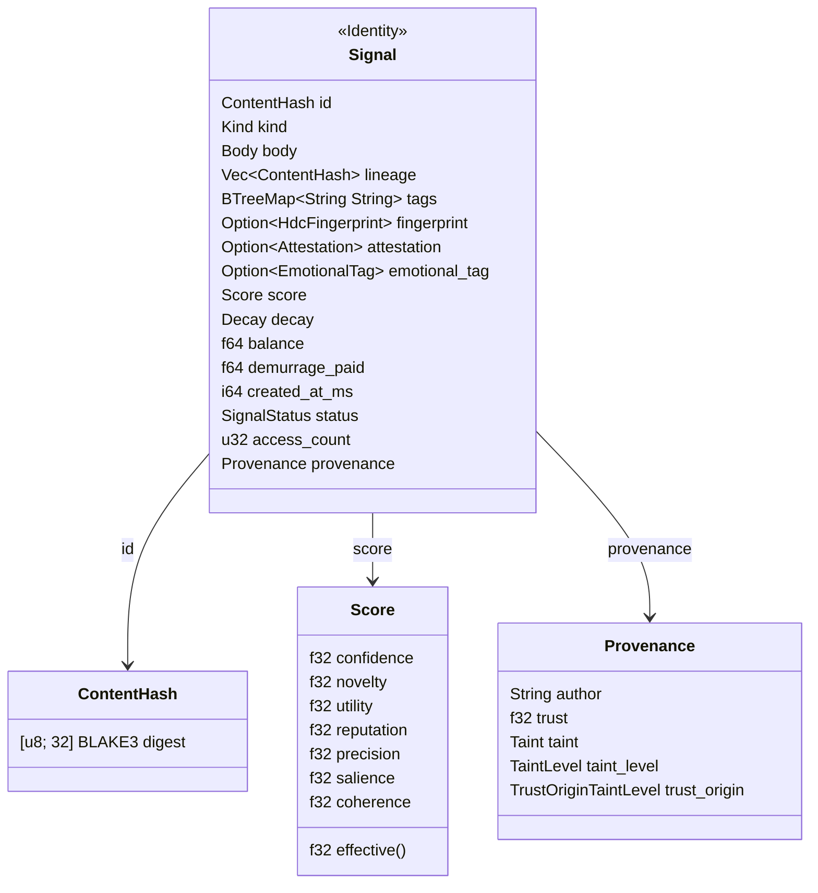
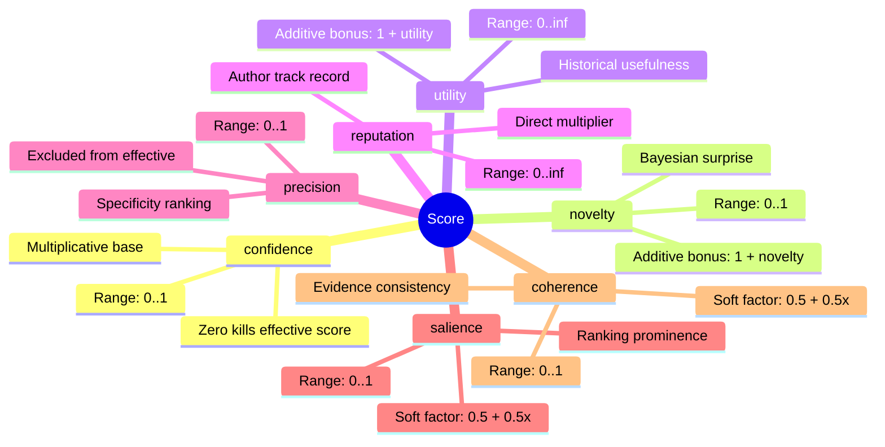
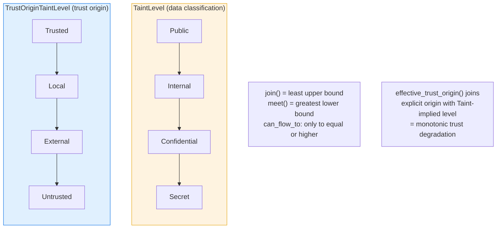

# 01 -- Signal and Pulse

> Two mediums: **Signal** (durable) in the Store, **Pulse** (ephemeral) on the Bus.
> Graduation converts Pulse into Signal. Every datum that flows through Roko is one
> or the other.

> **Implementation status (2026-09):** `Signal` is the canonical Rust struct
> (`crates/roko-core/src/signal.rs`). `type Engram = Signal` is the backward-compat
> alias in `crates/roko-core/src/engram.rs`. `Pulse` is the ephemeral transport
> record in `crates/roko-core/src/pulse.rs`. Both projection directions
> (`Signal::to_pulse`, `Pulse::graduate`) are implemented and tested.
> `BroadcastBus` is live-only; `MemoryBus` provides bounded replay; `MultiBus`
> fans out through a `MemoryBus` primary. Distributed Bus backends and several
> economic/algebraic mechanisms in this chapter remain target design.

### Naming history

| Version | Primary struct | Alias |
|---------|---------------|-------|
| v1      | `Engram`      | `type Signal = Engram` (called "implementation detail"; **wrong direction**) |
| v2      | `Engram`      | `type Signal = Engram` (called "preferred alias"; **wrong direction**) |
| **v3**  | **`Signal`**  | **`type Engram = Signal`** (backward-compat alias) |

v3 corrects the inversion present in v1 and v2. `Signal` is the canonical struct
name in the source code. `Engram` is a re-export alias retained so that existing
`use crate::engram::*` paths continue to compile. All new code should use `Signal`.

### Implementation sources

| Surface | Authority | Shipped boundary |
|---------|-----------|-----------------|
| Signal struct and lifecycle | `crates/roko-core/src/signal.rs` | `Signal` struct, `type Engram = Signal`, BLAKE3 identity, four `SignalStatus` tiers with checked forward-transition helpers, HDC fingerprinting, Pulse projection |
| Backward-compat re-export | `crates/roko-core/src/engram.rs` | `pub use crate::signal::*` |
| Pulse and graduation | `crates/roko-core/src/pulse.rs` | Transport record, `Pulse::graduate` path, `TopicFilter`, `PolicyOutputs` |
| Score | `crates/roko-core/src/score.rs` | 7-axis Score struct with 6-factor effective formula |
| Kind | `crates/roko-core/src/kind.rs` | 28 built-in variants + `Compound` + `Custom`, `KindRegistry` |
| Decay | `crates/roko-core/src/decay.rs` | 4 variants: None, HalfLife, Ttl, Ebbinghaus |
| Provenance | `crates/roko-core/src/provenance.rs` | Typed `Taint` enum, `TaintLevel` lattice, `TrustOriginTaintLevel`, coherence checks |
| Body | `crates/roko-core/src/body.rs` | 4 variants: Empty, Text, Json, Bytes (base64 serde) |
| Attestation | `crates/roko-core/src/attestation.rs` | Ed25519 signature, public key, optional chain witness |
| EmotionalTag | `crates/roko-core/src/affect.rs` | PAD vector, intensity, trigger, mood snapshot |

---

## 1. Why One Universal Type

Classical software architectures use many types: tasks, events, messages, requests,
responses, records, logs. Each type has its own schema, its own storage, its own
lifecycle. Adding a new capability means adding a new type, a new store, a new API.

Roko takes a different approach. There is exactly one durable data type -- the
**Signal** -- and a kernel of traits that operate on it. This design choice has
three consequences:

1. **Universal composability.** Any Scorer can score any Signal. Any Store can
   persist any Signal. Any Gate can verify any Signal. Components compose freely
   because they all speak the same language.

2. **Full audit trails.** Every Signal carries lineage -- the ContentHashes of the
   parent Signals it was derived from. This forms a directed acyclic graph (DAG)
   that can be traversed to explain any decision: why was this model chosen? What
   context was used? What gate verdict was rendered? Follow the lineage.

3. **Temporal dynamics.** Every Signal decays. Knowledge fades. Pheromone signals
   expire. Context becomes stale. The system's "memory" is not a static database --
   it is a living substrate where information has weight that changes over time.

The name "Engram" comes from neuroscience: a hypothetical means by which memories
are stored as biophysical changes in the brain (Semon 1904; Lashley 1950; Tonegawa
et al. 2015, Science 348(6238)). The name is retained as an alias. `Signal` is used
throughout this document and should be used in all new code.

---

## 2. The Signal Struct

**Current implementation** (`crates/roko-core/src/signal.rs`):

```rust
#[derive(Clone, Debug, PartialEq, Serialize, Deserialize)]
pub struct Signal {
    pub id: ContentHash,
    pub fingerprint: Option<HdcFingerprint>,
    pub kind: Kind,
    pub body: Body,
    pub created_at_ms: i64,
    pub decay: Decay,
    pub provenance: Provenance,
    pub score: Score,
    pub lineage: Vec<ContentHash>,
    pub tags: BTreeMap<String, String>,
    pub attestation: Option<Attestation>,
    pub emotional_tag: Option<EmotionalTag>,
    pub balance: f64,
    pub status: SignalStatus,
    pub access_count: u32,
    pub demurrage_paid: f64,
}

/// Backward-compatible alias: `Engram` is the legacy name for `Signal`.
pub type Engram = Signal;
```

### Signal Struct Overview



### 2.1 Field Reference

| Field | Type | Default | Hashed? | Purpose |
|-------|------|---------|---------|---------|
| `id` | `ContentHash` | Computed at build | N/A | BLAKE3 content-addressed identity (32 bytes). Two Signals with identical identity fields share the same hash. |
| `fingerprint` | `Option<HdcFingerprint>` | `None` | No | 10,240-bit HDC vector plus encoder version. Used for similarity lookup and semantic clustering. Populated by `Store::put()` or `compute_fingerprint()`. |
| `kind` | `Kind` | Required | Yes | Semantic type (see section 5). Tells consumers how to interpret the body. |
| `body` | `Body` | `Body::Empty` | Yes | Typed payload: `Empty`, `Text(String)`, `Json(Value)`, or `Bytes(Vec<u8>)`. |
| `created_at_ms` | `i64` | Current wall clock | No | Unix milliseconds when the Signal was first emitted. Excluded from hash so identical content at different times deduplicates. |
| `decay` | `Decay` | `Decay::None` | No | Time-based weight decay function (see section 8). |
| `provenance` | `Provenance` | `Provenance::trusted("roko")` | Partial | Producer attribution and trust. `author` and `tainted` are hashed; `trust`, `session`, `taint_level`, `trust_origin` are not. |
| `score` | `Score` | `Score::NEUTRAL` | No | 7-axis quality score (see section 7). Can be recomputed by Scorers without changing identity. |
| `lineage` | `Vec<ContentHash>` | Empty | Yes | Parent Signal hashes forming a DAG for auditing and autocatalytic metrics. |
| `tags` | `BTreeMap<String, String>` | Empty | Yes | Arbitrary string metadata. BTreeMap guarantees lexicographic key order for deterministic hashing. |
| `attestation` | `Option<Attestation>` | `None` | No | Ed25519 signature over the content hash, signer's public key, and optional chain witness. |
| `emotional_tag` | `Option<EmotionalTag>` | `None` | No | PAD (Pleasure-Arousal-Dominance) vector, intensity, trigger label, and mood snapshot from the affect engine. |
| `balance` | `f64` | `1.0` | No | Demurrage balance in `[0.0, 1.0]`. Decays over time; refreshed on access via `touch()`. |
| `status` | `SignalStatus` | `Transient` | No | Lifecycle tier: Transient, Working, Consolidated, or Persistent. Graduation is monotonic (forward-only). |
| `access_count` | `u32` | `0` | No | Number of times this Signal has been accessed. Tracked for graduation checks. Incremented by `touch()`. |
| `demurrage_paid` | `f64` | `0.0` | No | Cumulative demurrage paid over the Signal's lifetime. Monotonically increasing. |

### 2.2 Signal as an Algebraic Object

The algebraic core lives in three fields:

- `id` participates in the **lineage monoid** (append-only DAG).
- `fingerprint`, when present, participates in the **vector semiring** (bind + bundle).
- `kind` participates in the **kind lattice** (flat kinds join into Compound).

These three structures are independent but interact at composition boundaries.
**Identity is algebraically exact (hash monoid); similarity is algebraically
approximate (vector semiring).**

---

## 3. ContentHash -- Identity Through Content

A Signal's identity is its `ContentHash`: a 32-byte BLAKE3 digest computed from
the Signal's identity fields.

```rust
#[derive(Clone, Copy, PartialEq, Eq, Hash, Serialize, Deserialize)]
pub struct ContentHash(pub [u8; 32]);
```

### 3.1 Why BLAKE3

BLAKE3 was chosen over SHA-256 for three reasons:

1. **Speed.** BLAKE3 is approximately 5x faster than SHA-256 on modern hardware
   due to its tree-based structure and SIMD optimizations.
2. **Streaming.** BLAKE3 supports incremental hashing, which matters when Signals
   contain large payloads (file contents, compiled artifacts).
3. **Keyed mode.** BLAKE3 supports keyed hashing for MAC computation, useful for
   attestation.

### 3.2 What Is Hashed (Identity Fields)

The content hash covers:

- `kind` -- the semantic type (via `kind.identity_key().as_bytes()`)
- `body` -- the payload (via `body.canonical_bytes()`)
- `provenance.author` -- who produced this Signal
- `provenance.is_tainted()` -- whether the Signal contains untrusted data
- `lineage` -- the parent ContentHashes
- `tags` -- all key-value pairs in sorted order

### 3.3 What Is NOT Hashed (Mutable Fields)

The content hash **excludes**:

- `score` -- can be recomputed by different Scorers in different contexts
- `decay` -- can be adjusted (e.g., promoted from HalfLife to None) without
  changing identity
- `created_at_ms` -- creation time is metadata, not content; identical content
  at different times should deduplicate
- `fingerprint` -- derived semantic metadata; if the encoder changes, the
  fingerprint changes but not the hash
- `attestation` -- attached after construction
- `emotional_tag` -- affect metadata, not identity
- `balance`, `status`, `access_count`, `demurrage_paid` -- lifecycle state

This design means that `Store::put()` is **idempotent**: re-putting the same Signal
produces the same ContentHash and is a no-op in the Store.

### 3.4 Hash Computation

**Current implementation** (`crates/roko-core/src/signal.rs`):

```rust
pub fn content_hash(&self) -> ContentHash {
    let mut hasher = blake3::Hasher::new();
    hasher.update(self.kind.identity_key().as_bytes());
    hasher.update(b"|");
    hasher.update(&self.body.canonical_bytes());
    hasher.update(b"|");
    hasher.update(self.provenance.author.as_bytes());
    hasher.update(b"|");
    hasher.update(&[u8::from(self.provenance.is_tainted())]);
    hasher.update(b"|");
    for h in &self.lineage {
        hasher.update(&h.0);
    }
    hasher.update(b"|");
    for (k, v) in &self.tags {
        hasher.update(k.as_bytes());
        hasher.update(b"=");
        hasher.update(v.as_bytes());
        hasher.update(b";");
    }
    ContentHash(*hasher.finalize().as_bytes())
}
```

Fields are separated by `|` delimiters. Tags use `key=value;` format with
semicolons. The BTreeMap guarantees lexicographic key order, making the hash
deterministic regardless of insertion order.

### 3.5 HDC Fingerprint

The HDC fingerprint is the semantic access vector for a Signal. It is 10,240 bits
by default, computed deterministically from the body content by a registered encoder,
and stored with encoder-version metadata so nodes can compare fingerprints safely
across deployments.

```rust
pub struct HdcFingerprint {
    pub vector: HdcVector,       // 10,240-bit HDC vector
    pub encoder_version: u32,    // registry version for deterministic comparison
}
```

The field is optional so the record can still land when the encoder is unavailable
or disabled. The canonical population point is `Store::put()`, which resolves the
appropriate encoder and computes the fingerprint if the caller did not stage one.
`Signal::compute_fingerprint()` and `Signal::ensure_fingerprint()` provide direct
computation paths:

- `Body::Text` and `Body::Json` are encoded via `HdcVector::from_seed` using
  the body's canonical byte representation.
- `Body::Empty` produces a zero vector (marker Signals have no content).
- `Body::Bytes` is skipped -- binary data requires specialized encoding.

The encoder version is `ENCODER_VERSION_TEXT_V1 = 1`.

---

## 4. SignalStatus -- Lifecycle Tiers

**Current implementation** (`crates/roko-core/src/signal.rs`):

```rust
#[derive(Clone, Copy, Debug, PartialEq, Eq, Hash, Serialize, Deserialize)]
#[serde(rename_all = "snake_case")]
pub enum SignalStatus {
    Transient,
    Working,
    Consolidated,
    Persistent,
}
```

Graduation is **monotonic** -- Signals can only move forward through tiers, never
backward.

### Signal Lifecycle (Interactive 3D)

<SignalLifecycle3D />

*Drag to orbit. Hover a signal orb to inspect its score and state. Click a tier ring to see its properties. Use the speed controls to adjust the simulation. Signals decay over time (Ebbinghaus curve), receive periodic reinforcement events, and graduate upward when their score is high enough.*

### Signal Lifecycle

```mermaid
stateDiagram-v2
    [*] --> Transient : Signal::builder().build()
    Transient --> Working : promote_to_working(min_score)\neffective score > threshold
    Working --> Consolidated : promote_to_consolidated()\nmust be Working
    Consolidated --> Persistent : promote_to_persistent(min_age, min_accesses)\nmust be Consolidated + old enough + accessed enough

    Transient --> Transient : touch() refreshes balance

    state Transient {
        [*] --> Active
        Active --> Prunable : aggressive GC (minutes)
    }

    state Working {
        [*] --> TaskScoped
        TaskScoped --> TaskScoped : retained during active task
    }

    state Consolidated {
        [*] --> SessionDurable
        SessionDurable --> SessionDurable : survives restarts, feeds learning
    }

    state Persistent {
        [*] --> Archived
        Archived --> Archived : permanent, never auto-pruned
    }
```

| Tier | Retention guarantee | Graduation precondition |
|------|--------------------|-----------------------|
| `Transient` | May be pruned aggressively (minutes) | Default tier |
| `Working` | Retained during active task scope | `promote_to_working(min_score)` -- effective score must exceed threshold |
| `Consolidated` | Survives across sessions; feeds learning | `promote_to_consolidated()` -- must be Working |
| `Persistent` | Permanent archive; never auto-pruned | `promote_to_persistent(min_age_secs, min_accesses)` -- must be Consolidated, old enough, accessed enough |

`is_durable()` returns `true` for `Consolidated` and `Persistent`.

### 4.1 Graduation Errors

Graduation transitions can fail with one of four typed errors:

| Error | Condition |
|-------|-----------|
| `InvalidTransition { from, to }` | Current status is not the expected source tier |
| `ScoreTooLow { required, actual }` | Effective score is below the threshold |
| `InsufficientAge { required_secs, actual_secs }` | Signal has not been alive long enough |
| `InsufficientAccesses { required, actual }` | Signal has not been accessed enough times |

---

## 5. Kind -- Semantic Type

**Current implementation** (`crates/roko-core/src/kind.rs`):

```rust
#[derive(Clone, Debug, PartialEq, Eq, Hash, Serialize, Deserialize)]
#[non_exhaustive]
#[serde(rename_all = "snake_case")]
pub enum Kind {
    // -- Agent runtime --
    ProcessSpawn,          // A process was spawned
    ProcessExit,           // A process exited
    AgentMessage,          // Message chunk from an agent's stream
    AgentOutput,           // Raw stdout/stderr from an agent
    TokenUsage,            // Token usage report from an LLM call
    ApprovalRequested,     // Agent requested approval for destructive op

    // -- Verification --
    GateVerdict,           // Gate passed or failed a check
    TestResult,            // Test suite run result
    CompileDiagnostic,     // Compile error or warning

    // -- Tasks & plans --
    Task,                  // Task description (input to agent)
    Plan,                  // Plan (collection of tasks with deps)
    PlanPhase,             // Plan transitioned phases

    // -- Context assembly --
    PromptSection,         // Single section within an assembled prompt
    ContextPack,           // Curated bundle of context for an agent
    Prompt,                // Fully-assembled prompt ready for LLM

    // -- Routing & learning --
    RouterChoice,          // Router decision (e.g., "use Claude")
    RouterFeedback,        // Feedback about a prior router choice

    // -- Memory --
    Episode,               // Logged episode of an agent run
    PlaybookRule,          // Playbook rule extracted from patterns
    Skill,                 // Learned reusable procedure
    Compound(Vec<Kind>),   // Structural grouping of several kinds

    // -- Observability --
    Metric,                // Scalar measurement
    ExperimentResult,      // A/B test outcome
    ToolInvocation,        // Tool invocation record
    ToolHealthDegraded,    // Tool health below threshold

    // -- Chain participation --
    Insight,               // Shared knowledge
    Pheromone,             // Stigmergic signal (threat/opportunity/wisdom)
    Bounty,                // Bounty available for claiming
    Transaction,           // On-chain transaction
    Service,               // Service offering (OaaS marketplace)
    Prediction,            // Prediction claim (predictive foraging)

    // -- Extension --
    Custom(String),        // Extension kind (reverse-DNS: "com.example.my_kind")
}
```

### 5.1 Extensibility

The enum is `#[non_exhaustive]`, meaning new variants can be added without breaking
downstream implementations. For domain-specific kinds that do not belong in the core
enum, use `Kind::Custom("com.example.widget".into())` with reverse-DNS prefixes to
avoid collisions. Custom kinds can be validated and given parent-child hierarchy
through the `KindRegistry`.

### 5.2 Compound Kinds

The `Compound(Vec<Kind>)` variant represents Signals that carry multiple semantics
simultaneously (e.g., a gate verdict that is also a metric reading).

```rust
let k = Kind::compound(&[Kind::GateVerdict, Kind::Metric]);
assert!(k.contains(&Kind::GateVerdict));
assert!(k.matches(&Kind::Metric));
assert_eq!(k.arity(), 2);
assert_eq!(k.identity_key(), "compound(gate_verdict+metric)");
```

Matching semantics:

- Non-compound to non-compound: exact equality.
- Compound to non-compound: true if the non-compound is any constituent.
- Compound to compound: true if all parts of the query are in the target.

### 5.3 Kind as Dispatch Key

Kinds serve as the switchyard for dispatch throughout the system:

- A Gate might only verify Signals of kind `GateVerdict` or `TestResult`.
- A Composer might only combine `PromptSection` Signals into a `Prompt`.
- A Policy might watch for `ToolHealthDegraded` Signals and emit circuit-breaker
  responses.
- A Router might select among `RouterChoice` candidates based on historical feedback.
- A Store may select a Kind-specific HDC encoder before populating `fingerprint`.

---

## 6. Body -- Typed Payload

**Current implementation** (`crates/roko-core/src/body.rs`):

```rust
#[derive(Clone, Debug, PartialEq, Eq, Serialize, Deserialize)]
#[serde(tag = "format", content = "data", rename_all = "snake_case")]
pub enum Body {
    Empty,
    Text(String),
    Json(serde_json::Value),
    Bytes(#[serde(with = "base64_bytes")] Vec<u8>),
}
```

| Variant | When used | `byte_size()` | Canonical encoding |
|---------|-----------|---------------|-------------------|
| `Empty` | Marker Signals where Kind and tags carry all meaning | `0` | JSON serialization of the `Empty` tag |
| `Text(String)` | Logs, prompts, messages, natural-language content | `string.len()` | JSON serialization |
| `Json(Value)` | Structured data: tool call parameters, gate results, config | `json.to_string().len()` | JSON serialization |
| `Bytes(Vec<u8>)` | Binary artifacts, compressed data, serialized HDC vectors | `bytes.len()` | Base64-encoded JSON |

All variants produce a canonical byte encoding via `body.canonical_bytes()` using
JSON serialization, ensuring stability across serde versions for content hashing.

Typed decoding is provided via `as_json::<T>()`, `as_text()`, and `as_bytes()`.
Each returns a `Result` that errors if the body variant does not match. `from_json()`
serializes any serde-compatible type into a `Body::Json`.

---

## 7. Score -- 7-Axis Quality Appraisal

**Current implementation** (`crates/roko-core/src/score.rs`):

```rust
#[derive(Clone, Copy, Debug, PartialEq, Serialize, Deserialize)]
pub struct Score {
    pub confidence: f32,    // [0..1]  -- how sure are we this is correct?
    pub novelty: f32,       // [0..1]  -- how new/surprising is this?
    pub utility: f32,       // [0..inf) -- how useful historically?
    pub reputation: f32,    // [0..inf) -- author trustworthiness at emission
    pub precision: f32,     // [0..1]  -- how narrowly applicable?
    pub salience: f32,      // [0..1]  -- how much extra ranking weight?
    pub coherence: f32,     // [0..1]  -- how internally consistent is evidence?
}
```

### 7-Axis Scoring Model



### 7.1 Axis Ranges and Semantics

| Axis | Range | Semantic | Role in `effective()` |
|------|-------|----------|----------------------|
| `confidence` | `[0, 1]` | Certainty that the Signal is correct/valid | Multiplicative base (zero confidence = zero score) |
| `novelty` | `[0, 1]` | Surprise relative to prior Signals | Additive bonus to 1.0: `(1 + novelty)` |
| `utility` | `[0, inf)` | Historical usefulness proven by outcomes | Additive bonus to 1.0: `(1 + utility)` |
| `reputation` | `[0, inf)` | Author's track record at emission time | Direct multiplier |
| `precision` | `[0, 1]` | How narrowly applicable the score is | **Excluded from `effective()`** -- consumed separately by routers needing specificity ranking |
| `salience` | `[0, 1]` | Extra ranking prominence | Soft factor: `0.5 + 0.5 * salience` when non-zero, `1.0` when zero |
| `coherence` | `[0, 1]` | Internal consistency of supporting evidence | Soft factor: `0.5 + 0.5 * coherence` when non-zero, `1.0` when zero |

### 7.2 Effective Score Formula

The scalar reduction combines six of the seven axes:

```
effective = confidence
          * (1 + novelty)
          * (1 + utility)
          * reputation
          * salience_factor
          * coherence_factor
```

where `salience_factor` and `coherence_factor` are each `0.5 + 0.5 * axis` when
the axis is non-zero, or `1.0` when zero (opt-in soft damping).

When salience and coherence are both zero (the default for `Score::new()`), the
6-factor formula reduces exactly to the original 4-factor spec:

```
effective = confidence * (1 + novelty) * (1 + utility) * reputation
```

**Properties:**
- Zero confidence produces zero effective score (false positives are worthless).
- Novelty and utility act as multipliers (additive bonuses to 1.0).
- Reputation directly scales the result.
- Non-finite axes cause `effective()` to return 0.0.

### 7.3 Score Algebra

Scores compose via arithmetic:

- **Multiplication** (`score_a * score_b`): element-wise scaling of each axis.
  Useful for combining a base score with a per-axis modifier. Confidence and
  novelty are clamped to `[0, 1]`; utility and reputation accumulate freely.

- **Addition** (`score_a + score_b`): element-wise aggregation of evidence from
  multiple Scorers. Confidence and novelty clamp to 1.0; utility and reputation
  accumulate.

### 7.4 Named Constants

| Constant | Values | Use case |
|----------|--------|----------|
| `Score::ZERO` | All axes = 0.0 | "No evidence" |
| `Score::NEUTRAL` | confidence=0.5, novelty=0, utility=0, reputation=1 | Default when no Scorer is applied |

### 7.5 Information-Theoretic Scoring

**Complexity estimation via compression** (Kolmogorov 1965; Chaitin 1966):

```
complexity_ratio = len(compress(body)) / len(body)
```

High ratio (near 1.0) implies incompressible, likely novel. Low ratio implies
highly compressible, likely redundant. This provides a **substrate-free novelty
signal** -- no query needed.

**Bayesian surprise as novelty** (Itti and Baldi 2005):

```
S(data) = KL[P(M|data) || P(M)]
```

Signals with high Bayesian surprise deserve high novelty scores.

**MDL for the coherence axis** (Grunwald 2007):

```
coherence = 1.0 - (L(D|M) / L(D|null_model))
```

where the model M is the existing corpus of same-Kind Signals.

---

## 8. Decay -- Temporal Dynamics

**Current implementation** (`crates/roko-core/src/decay.rs`):

```rust
#[derive(Clone, Copy, Debug, PartialEq, Serialize, Deserialize)]
#[serde(tag = "kind", rename_all = "snake_case")]
pub enum Decay {
    None,
    HalfLife { half_life_ms: u64 },
    Ttl { ttl_ms: u64 },
    Ebbinghaus { strength: f32, scale_ms: u64 },
}
```

### 8.1 Decay Models

| Model | Formula | Behavior | Use case |
|-------|---------|----------|----------|
| `None` | `1.0` (always) | Signal weight is permanent | Config, schemas, identity |
| `HalfLife` | `0.5 ^ (age_ms / half_life_ms)` | Smooth exponential decay; halves at each half-life | Pheromones, verdicts, episodes |
| `Ttl` | `1.0` if `age < ttl_ms`, else `0.0` | Step function -- full weight then dead | Offers, bounties, strict time windows |
| `Ebbinghaus` | `exp(-age_ms / (strength * scale_ms))` | Psychological forgetting curve; higher strength = longer retention | Memory, learned skills |

**Effective weight** at a given time combines score and decay:

```rust
pub fn weight_at(&self, now_ms: i64) -> f32 {
    let age = now_ms - self.created_at_ms;
    self.score.effective() * self.decay.apply(age)
}
```

This is the primary ordering criterion for Store queries with `min_weight` filters.
A Signal that was highly scored at creation but has decayed significantly may fall
below the weight threshold and be excluded from query results -- or pruned entirely
by `Store::prune()`.

### 8.2 Pheromone Half-Life Constants

| Constant | Value | Duration |
|----------|-------|----------|
| `Decay::THREAT` | 7,200,000 ms | 2 hours |
| `Decay::OPPORTUNITY` | 14,400,000 ms | 4 hours |
| `Decay::WISDOM` | 86,400,000 ms | 24 hours |
| `Decay::GATE_VERDICT` | 86,400,000 ms | 24 hours |

### 8.3 Edge Cases

- Negative ages (clock skew) return `1.0`.
- Zero half-life decays immediately to `0.0`.
- Non-finite Ebbinghaus strength decays to `0.0`.
- `is_alive(age_ms, threshold)` rejects non-finite thresholds.

---

## 9. Provenance -- Attribution and Trust

**Current implementation** (`crates/roko-core/src/provenance.rs`):

```rust
pub struct Provenance {
    pub author: String,
    pub trust: f32,
    pub taint: Taint,
    pub taint_info: Option<TaintInfo>,    // deprecated, retained for compat
    pub session: Option<String>,
    pub taint_level: TaintLevel,
    pub trust_origin: TrustOriginTaintLevel,
}
```

### 9.1 Provenance Constructors

| Constructor | Trust | Taint | Trust origin | Use case |
|------------|-------|-------|-------------|----------|
| `Provenance::trusted(author)` | 1.0 | `Clean` | `Trusted` | Internal code, gates, orchestrator |
| `Provenance::agent(author)` | 0.75 | `Clean` | `Local` | Internal agents |
| `Provenance::external(author)` | 0.1 | `UnverifiedSource` | `External` | External APIs, webhooks |
| `Provenance::user(author)` | 0.5 | `UserInput` | `Local` | Human operators |

### 9.2 Typed Taint Classification

```rust
#[non_exhaustive]
pub enum Taint {
    Clean,
    LlmHallucination { detail: String },
    ToolFailure { detail: String },
    UserFlagged { detail: String },
    StaleData { threshold_ms: i64 },
    UnverifiedSource { detail: String },
    Propagated { detail: String, inherited_from: Option<ContentHash> },
    UserInput { detail: String },
    Custom(String),
}
```

### 9.3 TaintLevel Lattice (IFC)

The `TaintLevel` implements a 4-tier lattice with `join` (least upper bound) and
`meet` (greatest lower bound) for information-flow control:

```
Public < Internal < Confidential < Secret
```

`can_flow_to` enforces the no-write-down rule: data can only flow to equally or
more classified contexts.

### Provenance Lattices



The two lattices are **orthogonal by design**. `TaintLevel` classifies data
sensitivity. `TrustOriginTaintLevel` classifies source trustworthiness. A Signal
from a `Trusted` origin can still carry `Confidential` data, and an `External`
source can produce `Public` data. The `can_flow_to` rule enforces no-write-down
independently on each lattice.

### 9.4 TrustOriginTaintLevel (CaMeL)

A separate orthogonal lattice for trust-origin IFC, intentionally distinct from
data classification:

```
Trusted < Local < External < Untrusted
```

`effective_trust_origin()` joins the explicit origin with the level implied by the
Taint variant, ensuring monotonic trust degradation.

---

## 10. Lineage -- The Audit DAG

The `lineage` field is a vector of `ContentHash`es identifying the parent Signals
from which this Signal was derived. This forms a directed acyclic graph (DAG) that
enables:

- **Causal replay.** Trace any decision back to its inputs by following lineage
  chains.
- **Impact analysis.** Find all Signals that depend on a given input.
- **Autocatalytic metrics.** Measure how many downstream Signals an input catalyzed.
- **Forensic audit.** Reconstruct the complete chain of reasoning for any output.

### 10.1 Lineage Construction

The `derive()` method automates lineage construction:

```rust
impl Signal {
    pub fn derive(&self, kind: Kind, body: Body) -> SignalBuilder {
        SignalBuilder::new(kind)
            .body(body)
            .lineage([self.id])
            .provenance(
                Provenance::agent("derived")
                    .with_taint_level(self.provenance.effective_taint()),
            )
    }
}
```

`derive_verdict()` goes further: it preserves the parent's visible tag set,
carries forward the full known lineage chain (not just the immediate parent),
and applies the `Decay::GATE_VERDICT` contract.

### 10.2 DAG Traversal

The lineage DAG can be traversed by querying the Store for each parent ContentHash.
The `roko replay <hash>` CLI command walks this DAG.

---

## 11. The Builder Pattern

**Current implementation** (`crates/roko-core/src/signal.rs`):

```rust
pub struct SignalBuilder {
    kind: Kind,
    body: Body,
    created_at_ms: Option<i64>,
    decay: Decay,
    provenance: Provenance,
    score: Score,
    lineage: Vec<ContentHash>,
    tags: BTreeMap<String, String>,
    fingerprint: Option<HdcFingerprint>,
    attestation: Option<Attestation>,
    emotional_tag: Option<EmotionalTag>,
    balance: f64,
    status: SignalStatus,
    access_count: u32,
}

/// Backward-compatible alias.
pub type EngramBuilder = SignalBuilder;
```

### 11.1 Builder Defaults

| Field | Default | Rationale |
|-------|---------|-----------|
| `body` | `Body::Empty` | Marker Signals are common |
| `created_at_ms` | Current wall-clock time | Most Signals are created "now" |
| `decay` | `Decay::None` | Conservative -- explicit opt-in to decay |
| `provenance` | `Provenance::trusted("roko")` | Internal Signals are trusted |
| `score` | `Score::NEUTRAL` | Neutral until scored |
| `lineage` | Empty vec | No parents unless specified |
| `tags` | Empty BTreeMap | No metadata unless specified |
| `fingerprint` | `None` | Finalized by `Store::put()` |
| `attestation` | `None` | Attached after construction |
| `emotional_tag` | `None` | Set by the affect engine |
| `balance` | `1.0` | Full demurrage balance |
| `status` | `Transient` | Default lifecycle tier |
| `access_count` | `0` | Never accessed |

### 11.2 Usage Examples

```rust
use roko_core::{Body, Signal, Kind, Decay, Provenance, Score};

// Simple task Signal
let task = Signal::builder(Kind::Task)
    .body(Body::text("implement login"))
    .tag("priority", "high")
    .build();

// Pheromone with decay
let pheromone = Signal::builder(Kind::Pheromone)
    .body(Body::text("high gas prices detected"))
    .decay(Decay::HalfLife { half_life_ms: 14_400_000 }) // 4 hours
    .provenance(Provenance::agent("chain_monitor"))
    .tag("type", "opportunity")
    .build();

// Gate verdict derived from a task Signal
let verdict = task.derive(Kind::GateVerdict, Body::text("compilation passed"))
    .score(Score::new(1.0, 0.0, 1.0, 1.0))
    .build();
// verdict.lineage == [task.id]
```

### 11.3 Finalization

`build()` computes the content hash, sets the creation timestamp, and freezes
the durable fields:

```rust
pub fn build(self) -> Signal {
    let created_at_ms = self.created_at_ms.unwrap_or_else(current_time_ms);
    let mut signal = Signal {
        id: ContentHash([0; 32]),  // placeholder
        kind: self.kind,
        body: self.body,
        created_at_ms,
        decay: self.decay,
        provenance: self.provenance,
        score: self.score,
        lineage: self.lineage,
        tags: self.tags,
        fingerprint: self.fingerprint,
        attestation: self.attestation,
        emotional_tag: self.emotional_tag,
        balance: self.balance,
        status: self.status,
        access_count: self.access_count,
        demurrage_paid: 0.0,
    };
    signal.id = signal.content_hash();
    signal
}
```

---

## 12. Pulse -- The Ephemeral Medium

**Current implementation** (`crates/roko-core/src/pulse.rs`):

```rust
#[derive(Clone, Debug, PartialEq, Serialize, Deserialize)]
pub struct Pulse {
    pub seq: u64,
    pub topic: Topic,
    pub kind: Kind,
    pub body: Body,
    pub created_at_ms: i64,
    pub tags: BTreeMap<String, String>,
    pub lineage_hint: Option<ContentHash>,
}
```

### 12.1 Field Reference

| Field | Type | Purpose |
|-------|------|---------|
| `seq` | `u64` | Monotonic sequence number assigned by the Bus |
| `topic` | `Topic` | Dotted hierarchy routing key (e.g., `"gate.verdict.emitted"`) |
| `kind` | `Kind` | Semantic type, reused from Signal |
| `body` | `Body` | Payload, reused from Signal |
| `created_at_ms` | `i64` | Unix milliseconds when the Pulse was published |
| `tags` | `BTreeMap<String, String>` | Arbitrary metadata for filtering |
| `lineage_hint` | `Option<ContentHash>` | Optional back-reference to a Signal (set by `Signal::to_pulse()`) |

### 12.2 What Pulse Does Not Carry

Pulse deliberately omits the durable-record fields:

- No `id` or content hash
- No `score`
- No `decay`
- No `provenance`
- No `attestation`
- No `emotional_tag`
- No `balance`, `status`, `access_count`, `demurrage_paid`

That omission is the point. A Pulse is allowed to be brief and disposable.

### 12.3 Signal vs Pulse

| Property | Signal (durable) | Pulse (ephemeral) |
|----------|-----------------|-------------------|
| **Identity** | `ContentHash` (BLAKE3 over identity fields) | Bus-scoped `seq` + `topic` |
| **Durability** | Store-backed; survives restarts | None in `BroadcastBus`; last N in `MemoryBus` |
| **Lineage** | `Vec<ContentHash>` forming a DAG | Optional `lineage_hint: Option<ContentHash>` |
| **Scoring** | 7-axis `Score` with effective formula | No score field |
| **Retention** | `Decay`, `balance`, `status`, Store policy | Bus backend policy only |
| **HDC fingerprint** | Optional versioned `HdcFingerprint` | No fingerprint |
| **Provenance** | Typed `Provenance` + optional `Attestation` | No provenance; use tags or graduate |

They are **siblings, not parent-child**. A Signal is not "a Pulse that grew up."
The only bridges are explicit:

- **Graduation:** `Pulse::graduate(provenance, initial_balance, score, tags) -> Signal`
- **Projection:** `Signal::to_pulse(topic, seq) -> Pulse`

### Signal vs Pulse

```mermaid
graph LR
    subgraph Signal["Signal (durable)"]
        S_id["id: ContentHash"]
        S_kind["kind: Kind"]
        S_body["body: Body"]
        S_lineage["lineage: Vec&lt;ContentHash&gt;"]
        S_tags["tags: BTreeMap"]
        S_score["score: Score (7-axis)"]
        S_decay["decay: Decay"]
        S_provenance["provenance: Provenance"]
        S_attestation["attestation: Attestation"]
        S_fingerprint["fingerprint: HdcFingerprint"]
        S_balance["balance / demurrage"]
        S_status["status: SignalStatus"]
        S_emotional["emotional_tag: EmotionalTag"]
    end

    subgraph Pulse["Pulse (ephemeral)"]
        P_seq["seq: u64"]
        P_topic["topic: Topic"]
        P_kind["kind: Kind"]
        P_body["body: Body"]
        P_tags["tags: BTreeMap"]
        P_created["created_at_ms: i64"]
        P_hint["lineage_hint: Option&lt;ContentHash&gt;"]
    end

    Signal -- "to_pulse()" --> Pulse
    Pulse -- "graduate()" --> Signal

    style Signal fill:#e8f4e8,stroke:#4a8c4a
    style Pulse fill:#e8e8f4,stroke:#4a4a8c
```



---

## 13. Graduation -- Pulse to Signal

Graduation is the explicit conversion from live transport into durable record.

```rust
impl Pulse {
    pub fn graduate(
        &self,
        provenance: Provenance,
        initial_balance: f64,
        score: Score,
        tags: Vec<String>,
    ) -> Signal { /* ... */ }
}
```

The graduated Signal:

- Preserves the Pulse's kind, body, creation time, and existing tags.
- Starts at `SignalStatus::Working` (graduated Signals are already past Transient).
- Sets the initial demurrage balance to `initial_balance`.
- Adds audit tags: `"pulse_topic"` (the topic string) and `"pulse_seq"` (the
  sequence number).
- Merges extra label strings from `tags` as `key = "true"` entries.

### 13.1 Graduation Policy

| Topic pattern | Graduate? | Rationale |
|--------------|-----------|-----------|
| `gate.verdict.emitted` | Yes | Audit-critical |
| `agent.*.turn.completed` | Yes (batch) | Episodes feed learning |
| `safety.approval.requested` | Yes | Safety must be auditable |
| `conductor.circuit.tripped` | Yes | Health events are forensic |
| `cost.charged` | Yes | Accounting record |
| `agent.*.output` (chunks) | Batch on stream close | Chunks are noise; full response is the artifact |
| `heartbeat.tick` | No | Latest is all that matters |
| `ui.refresh.requested` | No | UI-local |

### 13.2 Projection -- Signal to Pulse

The inverse path is `Signal::to_pulse(topic, seq)`, which creates a lossy projection
of a Signal into the ephemeral transport layer. The projection drops durable-only
metadata (score, balance, decay, fingerprint, attestation, lineage DAG) and preserves
only kind, body, tags, and a `lineage_hint` back-reference to the Signal's id.

### 13.3 Synthetic Promotion

Two convenience methods exist for quick Pulse-to-Signal conversion without the
full graduation ceremony:

- `Signal::from_pulse_synthetic(pulse)` -- single Pulse, minimal provenance.
- `Signal::from_pulses(pulses)` -- batch Pulses into one summary Signal
  (concatenates text bodies or collects JSON bodies into an array, merges tags).

These produce different content hashes from `graduate()` because they lack the
audit tags (`pulse_topic`, `pulse_seq`).

---

## 14. Topic and TopicFilter

```rust
pub struct Topic(pub String);
```

Topics use a dotted hierarchy: `"gate.verdict.emitted"`,
`"heartbeat.gamma.tick"`. Subscribers filter by topic using `TopicFilter`:

```rust
pub enum TopicFilter {
    Exact(Topic),
    Prefix(String),
    All,
    And(Vec<TopicFilter>),
    Or(Vec<TopicFilter>),
    Not(Box<TopicFilter>),
}
```

The combinators compose: `And` requires all sub-filters to match, `Or` requires
any, `Not` inverts. Empty `And` is vacuously true; empty `Or` is false.

---

## 15. PolicyOutputs

`PolicyOutputs` is the explicit return type from a `React`'s `decide()` call,
making both output channels explicit:

```rust
pub struct PolicyOutputs {
    pub pulses: Vec<Pulse>,    // Publish on Bus for immediate downstream
    pub signals: Vec<Signal>,  // Persist via Store
}
```

---

## 16. Demurrage and Balance

Each Signal carries a `balance` field initialized to `1.0`. This balance decays
over time through a separate "demurrage" mechanism (distinct from the `Decay` field
which affects the scoring weight). The `demurrage_paid` field tracks cumulative
demurrage charged over the Signal's lifetime and is monotonically increasing.

`Signal::touch()` resets the balance to `1.0` and increments `access_count`, marking
the Signal as recently relevant:

```rust
pub fn touch(&mut self) {
    self.balance = 1.0;
    self.access_count = self.access_count.saturating_add(1);
}
```

---

## 17. HDC Algebra -- VSA Operations

Vector Symbolic Architectures (VSAs) define algebraic operations on high-dimensional
vectors that preserve compositional structure. Signal extends these to the struct
level.

### 17.1 The Three Operations

| Operation | HDC Implementation | Signal Method | Meaning |
|-----------|-------------------|---------------|---------|
| **Bind** | XOR of HDC vectors | `signal.bind(&other)` | Associate two Signals (key-value pair) |
| **Bundle** | Majority vote | `Signal::bundle(&signals)` | Create cluster centroid / composite |
| **Permute** | Cyclic bit shift | `signal.at_position(n)` | Encode temporal ordering |

All three methods return `Option<HdcVector>`, returning `None` when fingerprints
are absent.

### 17.2 Algebraic Properties

| Property | Bind (XOR) | Bundle (Majority) |
|----------|-----------|-------------------|
| Commutative | Yes | Yes |
| Associative | Yes | Approximately |
| Identity | Zero vector | None |
| Inverse | Self-inverse (`a XOR a = 0`) | None (lossy) |

Bind forms an **abelian group**; bundle forms a **commutative semigroup**. Together
they provide the algebraic structure for compositional knowledge representation
(Plate 2003; Gayler 2004; Kleyko et al. 2022).

---

## 18. Serialization and Persistence

Signals are fully serializable via serde. The default persistence format is JSONL
(JSON Lines) in the `FileSubstrate` (`roko-fs`), where each line is one Signal:

**Storage path:** `.roko/engrams.jsonl`

```json
{"id":"a1b2c3d4...","kind":"task","body":{"format":"text","data":"implement login"},"created_at_ms":1712345678000,"decay":{"kind":"none"},"provenance":{"author":"roko","trust":1.0,"taint":{"kind":"clean"},"session":null,"taint_level":"public","trust_origin":"trusted"},"score":{"confidence":0.5,"novelty":0.0,"utility":0.0,"reputation":1.0,"precision":0.0,"salience":0.0,"coherence":0.0},"lineage":[],"tags":{"priority":"high"},"balance":1.0,"status":"transient","access_count":0,"demurrage_paid":0.0}
```

ContentHashes serialize as hex strings (64 characters). Byte bodies serialize as
base64. Optional fields (`fingerprint`, `attestation`, `emotional_tag`) are omitted
when `None` via `skip_serializing_if`.

### 18.1 Schema Evolution

| Partition | Fields | Hashed? | Evolution |
|-----------|--------|---------|-----------|
| **Identity** | kind, body, author, tainted, lineage, tags | Yes | Adding new identity fields creates new identity (correct) |
| **Mutable** | score, decay, created_at_ms, fingerprint, attestation, emotional_tag, balance, status, access_count, demurrage_paid | No | Evolves freely without breaking hashes |

This mirrors Protocol Buffers' field number stability rule (Kleppmann 2017). New
serde fields default to zero/None via `#[serde(default)]`, so old JSONL records
deserialize cleanly into the current struct shape.

### 18.2 CRDT Compatibility

The lineage DAG is structurally compatible with Merkle-CRDTs (Sanjuan et al. 2020,
arXiv:2004.00107). If two agents independently derive Signals from the same parent,
the union of their lineage graphs is well-defined by content addressing --
deduplication is automatic.

---

## 19. Signal Properties Summary

| Property | Value | Implication |
|----------|-------|-------------|
| **Content-addressed** | BLAKE3(kind + body + author + tainted + lineage + tags) | Deduplication, integrity, addressable storage |
| **HDC fingerprinted** | 10,240-bit vector + encoder version | Similarity, consensus, analogy, semantic clustering |
| **Scored** | 7-axis (4 primary + 3 extended) | Multi-dimensional quality assessment |
| **Decaying** | 4 models (None, HalfLife, Ttl, Ebbinghaus) | Temporal dynamics, automatic memory management |
| **Lineage-tracked** | `Vec<ContentHash>` | Audit DAG, causal replay, forensic AI |
| **Provenance-stamped** | author + trust + taint + taint_level + trust_origin + session | Taint analysis, IFC, audit trails, reputation |
| **Balance-bearing** | Demurrage `[0.0, 1.0]` + cumulative paid | Economic lifecycle, access-driven refreshment |
| **Status-tiered** | Transient, Working, Consolidated, Persistent | Monotonic graduation, retention policy |
| **Affect-tagged** | Optional PAD vector + intensity | Somatic markers, affect-modulated dispatch |
| **Attested** | Optional Ed25519 signature + chain witness | Cryptographic proof of origin |
| **Typed payload** | Body enum (Empty, Text, Json, Bytes) | Runtime type checking, canonical encoding |
| **Extensible kind** | `#[non_exhaustive]` + `Compound` + `Custom(String)` | New capabilities without core changes |
| **Serializable** | serde Serialize + Deserialize | JSONL persistence, network transport |

---

## Verification

Inspect Signals through these CLI commands:

```bash
# Show Signal counts and recent entries
cargo run -p roko-cli -- status

# Walk the lineage DAG from a specific Signal hash
cargo run -p roko-cli -- replay <content-hash>

# Inject a synthetic Signal for testing
cargo run -p roko-cli -- inject <session> <payload>

# Inspect learning state (episodes, experiments, efficiency)
cargo run -p roko-cli -- learn all

# Show knowledge store stats
cargo run -p roko-cli -- knowledge stats

# Interactive dashboard (F1-F10 tabs show live Signals)
cargo run -p roko-cli -- dashboard

# Workspace health check
cargo run -p roko-cli -- doctor
```

To inspect the raw JSONL store:

```bash
# Count Signals
wc -l .roko/engrams.jsonl

# View the most recent Signal
tail -1 .roko/engrams.jsonl | python3 -m json.tool

# Find Signals by kind
grep '"kind":"gate_verdict"' .roko/engrams.jsonl | wc -l

# Find Signals by author
grep '"author":"gate:compile"' .roko/engrams.jsonl | head -5
```

---

## References

| Citation | Contribution |
|----------|-------------|
| Semon 1904, *Die Mneme* | Coined "engram" for memory traces. Origin of the backward-compat alias. |
| Tonegawa et al. 2015, Science 348(6238) | Identified engram cells in the brain -- physical substrates of memory. |
| BLAKE3 (O'Connor et al. 2020) | Cryptographic hash function. ~5x faster than SHA-256, streaming, SIMD-optimized. |
| Merkle 1989, Crypto '89, LNCS 435 | Content-addressed storage via hash trees. Foundation for the lineage DAG. |
| Kolmogorov 1965, Problems of Information Transmission | Algorithmic complexity -- shortest program that outputs a string. |
| Chaitin 1966, J. ACM 13(4) | Independent formulation of algorithmic complexity. |
| Grunwald 2007, MIT Press | MDL: computable proxy for Kolmogorov complexity. Foundation for coherence scoring. |
| Itti and Baldi 2005, NIPS 18 | Bayesian surprise: KL divergence as novelty measure. |
| Schmidhuber 2010, IEEE Trans. AMD 2(3) | Compression progress as intrinsic motivation / novelty reward. |
| Shapiro et al. 2011, SSS, LNCS 6976 | CRDTs: eventual consistency via join-semilattice merge. |
| Sanjuan et al. 2020, arXiv:2004.00107 | Merkle-CRDTs: content-addressed DAGs with CRDTs. |
| Plate 2003, CSLI Publications | Holographic Reduced Representations: algebraic VSA operations. |
| Gayler 2004, arXiv:cs/0412059 | MAP architecture: Multiply-Add-Permute VSA algebra. |
| Kleyko et al. 2022, ACM Computing Surveys 55(6) | Comprehensive survey of Hyperdimensional Computing. |
| Kleppmann 2017, O'Reilly | Schema evolution across serialization formats. |

---

## Depth Files

Detailed sub-topics are organized under `docs/v3/depth/01-signal/`:

| File | Topic |
|------|-------|
| `01-content-hash.md` | ContentHash internals, BLAKE3 choice, comparison with IPFS CIDs and Git objects |
| `02-kind-system.md` | Kind enum, KindRegistry, Compound kinds, extensibility |
| `03-score-7-axis.md` | Full Score specification, effective formula derivation, algebra |
| `04-decay-variants.md` | Decay enum, mathematical models, pheromone constants |
| `05-provenance.md` | Provenance, Taint, TaintLevel lattice, TrustOriginTaintLevel, IFC |
| `06-attestation.md` | Ed25519 attestation, chain witness, verification |
| `07-lineage-dag.md` | DAG construction, traversal, autocatalytic metrics |
| `08-hdc-fingerprint.md` | HDC vectors, encoder registry, VSA algebra (bind/bundle/permute) |
| `09-body-types.md` | Body enum, canonical encoding, base64 serde, typed decoding |
| `10-pulse.md` | Pulse struct, Topic, TopicFilter, graduation policy |
| `11-signal-status.md` | SignalStatus tiers, graduation transitions, GraduationError |
| `12-demurrage.md` | Balance economics, touch/access semantics, demurrage_paid |
| `13-emotional-tag.md` | PAD vectors, affect integration, somatic markers |
| `14-serialization.md` | JSONL format, schema evolution, CRDT compatibility |
| `15-binary-formats.md` | DAG-CBOR, postcard, rkyv comparison for future migration |
| `16-information-theory.md` | Kolmogorov complexity, Bayesian surprise, MDL coherence |
