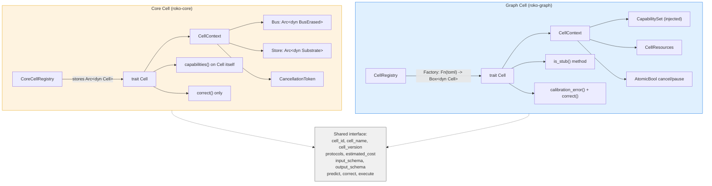
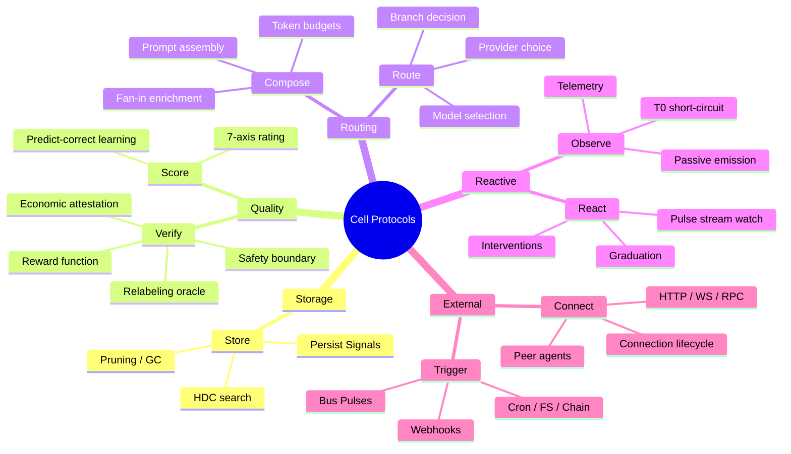
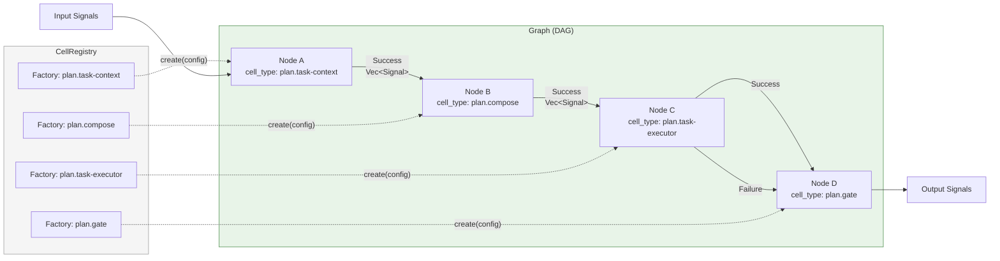

# 02 -- Cell and Protocols

> **Implementation status (2026-09):** WIRED -- The Cell trait, 9 protocol conformances,
> typed input/output schemas, capability declarations, and async `execute` method are
> shipping. All production Cells compose into Graphs via `roko-graph`.

> The universal computation unit. Signals in, Signals out.
> Everything is a Graph of Cells.

---

## 1. What Is a Cell?

A Cell is the atomic unit of computation in Roko. Every operation -- scoring a
Signal, composing a prompt, dispatching an LLM call, running a gate, persisting
results, reacting to events -- is performed by a Cell. Cells have an identity, a
version, typed input/output schemas, declared capabilities, protocol
conformances, cost estimates, and an async `execute` method.

The design principle is parsimony: a single interface subsumes Modules, Tools,
Gates, Routers, Composers, Scorers, Policies, Substrates, Connectors, and
Operators. There is no inheritance hierarchy. Cells compose by wiring them
into directed acyclic Graphs where upstream outputs become downstream inputs.

### The Cell Contract

Every Cell guarantees:

1. **Identity**: a unique `cell_id` and human-readable `cell_name`.
2. **Versioning**: a semantic `(major, minor, patch)` version tuple.
3. **Typed I/O**: optional `input_schema` and `output_schema` via `TypeSchema`.
4. **Protocol conformance**: zero or more `ProtocolId` declarations.
5. **Capability declaration**: what runtime resources the Cell needs.
6. **Cost estimation**: expected USD cost, duration, token counts.
7. **Predict-correct hooks**: opt-in online learning via prediction records.
8. **Async execution**: `execute(input, ctx) -> Result<Vec<Signal>>`.

---

## 2. The Two Cell Traits

Roko has two `Cell` trait definitions. This is intentional, not accidental.

### 2.1 Core Cell (`roko-core::cell::Cell`)

The infrastructure-rich Cell trait. Owns shared runtime handles and is used by
the kernel and non-Graph subsystems.

**Source**: `crates/roko-core/src/cell.rs`

```rust
/// Universal computation unit. Every protocol trait (Substrate, Scorer, Gate,
/// Router, Composer, Policy) requires `Cell` as a supertrait, giving the
/// execution engine identity, cost estimation, and protocol introspection.
#[async_trait]
pub trait Cell: Send + Sync + 'static {
    /// Unique identifier for this cell instance.
    fn cell_id(&self) -> &str;
    /// Human-readable name for display and logging.
    fn cell_name(&self) -> &str;
    /// Semantic version of this cell's implementation.
    fn cell_version(&self) -> CellVersion { (0, 1, 0) }
    /// Protocol conformances this cell declares (typed).
    fn protocols(&self) -> Vec<ProtocolId> { Vec::new() }
    /// Convenience: check if this cell conforms to a given protocol.
    fn has_protocol(&self, id: ProtocolId) -> bool {
        self.protocols().contains(&id)
    }
    /// Runtime capabilities this cell requires to execute.
    fn capabilities(&self) -> Capabilities { Capabilities::default() }
    /// Estimated USD cost per invocation, when known.
    fn estimated_cost(&self) -> Option<f64> { None }
    /// Estimated wall-clock duration per invocation, when known.
    fn estimated_duration(&self) -> Option<Duration> { None }
    /// Rich cost estimate for this invocation.
    fn cost_estimate(&self) -> Option<CostEstimate> { /* derived default */ }
    /// Describes the input type this cell expects. `None` means untyped.
    fn input_schema(&self) -> Option<&TypeSchema> { None }
    /// Describes the output type this cell produces. `None` means untyped.
    fn output_schema(&self) -> Option<&TypeSchema> { None }
    /// Predict the expected outcome before execution.
    fn predict(&self, input: &[Signal]) -> Option<PredictionRecord> { None }
    /// Correct internal state after execution with the actual outcome.
    fn correct(&self, prediction: &PredictionRecord, actual: &[Signal]) {}
    /// Execute this cell.
    async fn execute(&self, input: Vec<Signal>, ctx: &CellContext)
        -> Result<Vec<Signal>>;
}
```

**Core CellContext** carries infrastructure handles:

| Field | Type | Purpose |
|---|---|---|
| `bus` | `Arc<dyn BusErased>` | Pub/sub transport for ephemeral Pulses |
| `store` | `Arc<dyn Substrate>` | Durable storage for Signals |
| `cancel` | `CancellationToken` | Cooperative shutdown |
| `trace_id` | `Option<String>` | Observability trace context |
| `run_id` | `Option<String>` | Graph/Flow run identifier |
| `budget_remaining` | `Option<f64>` | USD budget remaining |
| `deadline_ms` | `Option<i64>` | Unix millisecond deadline |
| `parent_graph_id` | `Option<String>` | Enclosing Graph ID |
| `cell_id` | `Option<String>` | ID of executing Cell |

**CoreCellRegistry** stores live `Arc<dyn Cell>` instances indexed by `CellId`
(a `String` alias). It manages already-constructed instances ready for dispatch.

### 2.2 Graph Cell (`roko-graph::cell::Cell`)

The Graph Engine's Cell trait. Lighter weight -- no Bus or Store handles in the
context. Used exclusively by graph nodes.

**Source**: `crates/roko-graph/src/cell.rs`

```rust
/// Universal computation unit. Every graph node is backed by a Cell
/// implementation.
#[async_trait]
pub trait Cell: Send + Sync + 'static {
    fn cell_id(&self) -> &str;
    fn cell_name(&self) -> &str;
    fn cell_version(&self) -> CellVersion { (0, 1, 0) }
    fn protocols(&self) -> Vec<ProtocolId> { Vec::new() }
    fn has_protocol(&self, id: ProtocolId) -> bool {
        self.protocols().contains(&id)
    }
    /// Returns true when this cell is a stub/placeholder.
    fn is_stub(&self) -> bool { false }
    fn estimated_cost(&self) -> Option<f64> { None }
    fn estimated_duration(&self) -> Option<Duration> { None }
    fn input_schema(&self) -> Option<&roko_core::TypeSchema> { None }
    fn output_schema(&self) -> Option<&roko_core::TypeSchema> { None }
    fn predict(&self, input: &[Signal]) -> Option<PredictionRecord> { None }
    /// Compute a normalized calibration error after successful execution.
    fn calibration_error(&self, prediction: &PredictionRecord,
                         actual: &[Signal]) -> Option<f64> { None }
    fn correct(&self, prediction: &PredictionRecord, actual: &[Signal]) {}
    /// Execute this cell. Required -- no default implementation.
    async fn execute(&self, input: Vec<Signal>, ctx: &CellContext)
        -> Result<Vec<Signal>>;
}
```

**Graph CellContext** provides execution-scoped metadata and cooperative control:

| Field | Type | Purpose |
|---|---|---|
| `trace_id` | `Option<String>` | Observability trace context |
| `run_id` | `Option<String>` | Graph run identifier |
| `budget_remaining` | `Option<f64>` | USD budget remaining |
| `deadline_ms` | `Option<i64>` | Unix millisecond deadline |
| `parent_graph_id` | `Option<String>` | Enclosing Graph ID |
| `cell_id` | `Option<String>` | ID of executing Cell |
| `capabilities` | `Option<CapabilitySet>` | Effective capability intersection |
| `wave_index` | `Option<u32>` | Current wave in parallel execution |
| `total_waves` | `Option<u32>` | Total wave count |
| `resources` | `CellResources` | Shared service handles (e.g. gates) |
| `cancel_flag` | `Option<Arc<AtomicBool>>` | Cooperative cancellation |
| `pause_flag` | `Option<Arc<AtomicBool>>` | Cooperative pause/suspend |

**CellRegistry** (Graph) stores factory functions (`CellFactory`) indexed by
cell type name. When the engine encounters `cell_type = "gate.compile"` in a
TOML node definition, it looks up the factory and calls it with the node config
to instantiate a Cell. Registrations include a `CellDescriptor` for
side-effect-free schema introspection during edge validation.

### 2.3 Why Two Traits?



| Concern | Core Cell | Graph Cell |
|---|---|---|
| **Lives in** | `roko-core` (kernel crate) | `roko-graph` (engine crate) |
| **Context carries** | Bus + Store + CancellationToken | CapabilitySet + CellResources + atomic flags |
| **Registry model** | Instance-based (`Arc<dyn Cell>`) | Factory-based (`Fn(toml::Value) -> Box<dyn Cell>`) |
| **Stub tracking** | No | `is_stub()` method |
| **Calibration** | `correct()` only | `calibration_error()` + `correct()` |
| **Capabilities** | Declared on the Cell itself | Injected through context by the engine |
| **Used by** | Protocol traits, kernel infrastructure | Graph engine, plan topology, TOML definitions |

The split exists because the Graph engine and the kernel have different
dependency requirements. `roko-core` cannot depend on `roko-graph` (it is
downstream), so it defines its own Cell trait with infrastructure handles.
`roko-graph` defines a separate trait optimized for TOML-driven graph execution
with factory instantiation, capability injection, and stub detection. Both
traits share the same method names, type schemas, protocol IDs, and
predict/correct lifecycle.

**When to use which:**

- Implementing a protocol trait (Store, Score, Verify, Route, Compose, React,
  Observe, Connect, Trigger) -- use `roko_core::cell::Cell`.
- Implementing a graph node that will be registered in `CellRegistry` and
  instantiated from TOML config -- use `roko_graph::cell::Cell`.

---

## 3. The Nine Protocols

Every Cell may declare zero or more of nine canonical `ProtocolId` values. These
are the verbs of the system -- the nine kinds of work a Cell can perform.

### The Nine Protocols



**Source**: `crates/roko-core/src/cell.rs`

```rust
#[derive(Clone, Copy, Debug, PartialEq, Eq, Hash, Serialize, Deserialize)]
pub enum ProtocolId {
    Store,     // Persisted signal storage (Substrate trait)
    Score,     // Signal scoring (Score trait)
    Verify,    // Gate / verification (Verify trait)
    Route,     // Signal routing (Route trait)
    Compose,   // Prompt / signal composition (Compose trait)
    React,     // Reactive policy (React trait)
    Observe,   // Passive observation emitter (Observe trait)
    Connect,   // External connection lifecycle (Connect trait)
    Trigger,   // Event-driven trigger (Trigger trait)
}
```

### 3.1 Store

Persisted storage of Signals. The backing trait is `roko_core::traits::Store`
(alias of `Substrate`). Store Cells persist Signals, retrieve them by query,
support HDC similarity search, and manage pruning/GC.

**Example**: `FileSubstrate` in `roko-fs` implements JSONL-backed durable
storage with generational GC.

### 3.2 Score

Rate a Signal along multiple dimensions: relevance, quality, confidence,
novelty, utility. Score Cells are learners -- they predict quality, publish
predictions, and receive corrections from gate verdicts via the
predict-correct lifecycle.

**Example**: `QualityJudge` in `roko-learn` scores task outputs along a
5-dimensional assessment.

### 3.3 Verify

The load-bearing protocol. Verify Cells serve four roles simultaneously:
**reward function** (continuous `Verdict.reward` for routing), **relabeling
oracle** (hindsight relabeling of failed trajectories), **safety boundary**
(`verify_pre` can veto execution), and **economic attestation** (reputation
flows from verified work).

The 19 gate rungs in `roko-gate` are Verify protocol implementations. The
Graph engine's five-Cell corrigibility pipeline and five-stage immune pipeline
are also Verify Cells.

**Examples**: `PlanGateCell` (compile/lint/test rungs), `VerifyDeferenceCell`,
`VerifyTruthCell`, `VerifyImpactCell`, `ImmunePerceptionCell`.

### 3.4 Route

Choose among candidates or next actions: which model to call, which provider
to use, which tool to run, which plan branch to pursue.

**Example**: `CascadeRouter` in `roko-learn` selects models using persisted
bandit statistics and Expected Free Energy estimates.

### 3.5 Compose

Assemble bounded artifacts from multiple ingredients under token, byte, time,
or structural budgets. The canonical example is prompt construction: retrieve
relevant Signals, rank and filter, assemble under a token budget.

**Examples**: `ComposeCell` (template variable substitution),
`PlanComposeCell` (fan-in of 6 enrichers + task context into a single prompt),
`CognitiveComposeCell` (cognitive loop composition).

### 3.6 React

Watch ongoing activity and decide whether to emit interventions, summaries,
alerts, pauses, promotions, or other follow-on work. React Cells consume
Pulse streams and produce `PolicyOutputs` with new Pulses and graduated
Signals.

**Example**: `GraduationCell` watches the Bus and promotes qualifying Pulses to
durable Signals based on configured graduation policies.

### 3.7 Observe

Passive observation emitter. Observe Cells read signals from the Store and
Pulses from the Bus without modifying them, then emit observation records for
telemetry, metrics, and monitoring.

**Example**: `SenseCell` in the cognitive loop detects whether a full cognitive
tick is needed or if the T0 short-circuit applies (no new Signals/Pulses).

### 3.8 Connect

External connection lifecycle management. Connect Cells handle establishing,
maintaining, and tearing down connections to external systems (HTTP endpoints,
WebSockets, chain RPCs, peer agents).

**Implementation**: The `Connect` trait in `roko-core::traits` coexists with
the transport-neutral connector API in `roko-core::connector`. Connect Cells
manage connection state; the connector API handles message framing.

### 3.9 Trigger

Event-driven activation. Trigger Cells fire when specific conditions are met:
cron schedules, filesystem changes, chain events, webhook arrivals, Bus Pulses,
or manual invocation.

**Implementation**: The `Trigger` trait in `roko-core::traits` coexists with
the declarative trigger runtime (E31, 7 source types). Trigger Cells bind
conditions to Graph execution.

---

## 4. Supporting Types

### 4.1 TypeSchema

Describes the typed input or output contract of a Cell for edge validation.

```rust
#[derive(Debug, Clone, PartialEq, Eq, Serialize, Deserialize)]
pub enum TypeSchema {
    /// Accepts any input.
    Any,
    /// Accepts signals of a specific Kind.
    OfKind(Kind),
    /// Accepts signals matching a JSON schema string.
    JsonSchema(String),
}
```

`TypeSchema::is_compatible_with(target)` checks whether an output of type
`self` can feed into a cell expecting `target`. Rules:

- `Any` is compatible with everything.
- `OfKind(a)` is compatible with `OfKind(b)` when `a == b`.
- `JsonSchema(a)` is compatible with `JsonSchema(b)` when `a == b` (exact match).
- Cross-variant comparisons (e.g. `OfKind` vs `JsonSchema`) are incompatible.

The `union` combinator conservatively merges schemas at merge points: same Kind
preserves the Kind; otherwise falls back to `Any`.

### 4.2 Capabilities (Core)

Declares the runtime capabilities a Cell requires. Declaration only --
enforcement is the engine's job. All capabilities default to `false` (sandboxed).

```rust
pub struct Capabilities {
    pub network: bool,       // Outbound network calls
    pub file_system: bool,   // Filesystem reads/writes
    pub subprocess: bool,    // Child process spawning
    pub llm_access: bool,    // LLM API invocation
    pub chain_access: bool,  // On-chain contract/RPC
    pub bus_publish: bool,   // Bus Pulse publication
    pub store_write: bool,   // Durable Signal persistence
}
```

`is_subset_of(other)` verifies that every capability required by `self` is
granted by `other`. `union(other)` merges two capability sets.

### 4.3 CostEstimate

Rich cost estimate for a Cell invocation.

```rust
pub struct CostEstimate {
    pub usd_cost: f64,       // Estimated USD cost
    pub token_input: u64,    // Estimated input tokens
    pub token_output: u64,   // Estimated output tokens
    pub api_calls: u32,      // Outbound API calls
    pub wall_clock_ms: u64,  // Estimated wall-clock duration
    pub confidence: f64,     // Confidence [0.0, 1.0]
}
```

### 4.4 PredictionRecord

Captures a Cell's predicted outcome before execution for the
predict-publish-correct learning loop (Friston 2006).

```rust
pub struct PredictionRecord {
    pub cell_id: String,
    pub predicted_outcome: serde_json::Value,
    pub confidence: f64,
    pub timestamp_ms: i64,
}
```

Before execution the engine calls `Cell::predict()`. After execution it calls
`Cell::correct()` (and optionally `calibration_error()` in the Graph trait)
with the prediction and actual output for online learning.

### 4.5 CellDescriptor (Graph)

Side-effect-free metadata for a registered cell type. Used by
`Graph::validate_edges()` to check edge type compatibility without constructing
live Cell instances.

```rust
pub struct CellDescriptor {
    pub id: String,
    pub version: CellVersion,
    pub input_schema: Option<TypeSchema>,
    pub output_schema: Option<TypeSchema>,
    pub is_stub: bool,
    pub protocols: Vec<ProtocolId>,
    pub is_predictive: bool,
    pub display_name: Option<String>,
}
```

---

## 5. Cell Composition: Graphs of Cells

Cells compose by wiring them into directed acyclic Graphs. This is the
fundamental composition pattern: no inheritance, no middleware stacks, no
plugin chains. A `Graph` is a `petgraph::DiGraph<Node, Edge>` where each
`Node` references a `cell_type` name resolved through the `CellRegistry`.

### Cell Composition in a Graph



The engine executes nodes in **topological order** within bounded parallel
**waves** (`GraphPolicy::max_concurrent_nodes`, default 4). Each node's
`execute()` receives the upstream outputs as its input `Vec<Signal>`. Edge
conditions (`Success`, `Failure`, `OutputEquals`, `Always`) control which
downstream nodes receive the outputs.

### 5.1 Graph Nodes and Edges

```rust
pub struct Node {
    pub id: NodeId,               // Unique within this graph
    pub cell_type: String,        // Registry lookup key
    pub config: toml::Value,      // Passed to the factory
    pub inputs: Vec<String>,      // Named inputs from upstream
    pub outputs: Vec<String>,     // Named outputs for downstream
    pub execution_class: ExecutionClass, // Workflow (deterministic) or
                                        // Activity (non-deterministic)
}

pub struct Edge {
    pub from: NodeId,
    pub to: NodeId,
    pub condition: Option<EdgeCondition>,
}

pub enum EdgeCondition {
    Success,                      // Source succeeded
    Failure,                      // Source failed
    OutputEquals { key, value },  // Named output matches value
    Always,                       // Unconditional
}
```

The engine executes nodes in topological order, feeding outputs from upstream
cells as inputs to downstream cells. Parallel execution within a wave is
bounded by `GraphPolicy::max_concurrent_nodes` (default 4).

### 5.2 Edge Validation

`Graph::validate_edges(registry)` checks type compatibility between connected
nodes using `CellDescriptor` introspection (no Cell construction). Rules:

- Missing registry entries produce errors.
- Untyped cells (`None` schema) are always valid.
- Typed cells must have compatible schemas via `TypeSchema::is_compatible_with`.
- All errors are collected (no fail-fast).

### 5.3 Composition Patterns in Practice

**Linear pipeline** (plan execution):
```
TaskContext -> Enrichers -> PlanCompose -> TaskExecutor -> PlanGate
```

**Cognitive loop** (Hot Graph, 7 cells):
```
Sense -> Assess -> Compose -> Act -> Verify -> Persist -> React
          ^                                                |
          |--- T0 short-circuit (skip middle, go to React) |
```

**Safety pipeline** (corrigibility, 5 cells):
```
Deference -> Switch -> Truth -> Impact -> Task
```
Each cell stops the pipeline on veto via conditional `Success` edges.

**Immune pipeline** (5 stages):
```
Perception -> Assessment -> Containment -> Validation -> Escalation
```
Versioned state (`ImmuneCellState`) rejects skipped or reordered stages.

---

## 6. Concrete Cell Implementations

The `roko-graph` crate provides the following concrete Cell implementations,
all registered in the `CellRegistry` by type name:

### 6.1 Agent and Execution Cells

| Cell | Registry key | Protocol | Purpose |
|---|---|---|---|
| `AgentCell` | `agent` | -- | Wraps LLM agent dispatch (prompt in, response out) |
| `TaskExecutorCell` | `plan.task-executor` | -- | Host-dispatched cell for plan tasks; delegates to injected `TaskDispatcher` |
| `TaskContextCell` | `plan.task-context` | -- | Assembles task metadata and predecessor state |
| `AgentTaskCell` | `agent.task` | -- | The entry cell that starts agent work from a graph a trigger runs (roko-cli registers it in `execute_graph`, which serve's triggers, `roko trigger fire` through serve, and `roko graph run` share; it needs the `llm` capability, which `roko graph run`'s fixed grant lacks, so it refuses there). Runs the node's `prompt` as `roko run` does, a gated one-task plan under `.roko/runs/<run_id>/` (`role`, `tier`, `domain`, and `max_usd`, required, as its budget ceiling), with the `inputs` fields of its input signals fenced as untrusted data. Outputs the run's `run_id`, `verdict` and `cost_usd`, its verdict stamped for the graph to branch on; a `failed` or `cancelled` run is the node's error, an `unverified` one an output. `act` and `claude-agent` stay refused stubs (9127) |
| `PlanRunCell` | `plan.run` | -- | Runs a whole plan from a graph, as serve runs one: the node's `plan`, a directory below the plans root that must resolve inside the workspace, is validated as `roko plan run` validates it (an invalid plan is refused before it starts), then runs through the Graph engine on the caller's hub under the workspace runner lock, fresh by default or from its checkpoint with `resume = true`, with `max_usd`, required, as its budget ceiling. Outputs the run's `run_id`, the plan's `verdict` and `cost_usd`, its verdict stamped; a `failed` or `cancelled` plan is the node's error. Needs the `llm` capability, as `agent.task` does (9128) |
| `ShellExecCell` | `shell.exec` | Connect | Runs the node's `command` by `sh -c` (`cwd` inside the workspace, `timeout_secs` 120 by default and at most 3600, `env` names beyond the gate allow-list). Input signals and trigger payloads reach it only as the JSON file `ROKO_CELL_INPUT` names, never inside the command. Outputs a `ProcessExit` signal (exit code, scrubbed stdout and stderr tails, duration); a non-zero exit or a timeout, which kills the process group, is the node's error (9126) |
| `ShellExecCell` | `verify.command` | Verify | The same command run, but its output is a `GateVerdict` signal that passes on exit 0 and fails otherwise; a failed check is not an error. Both shell cells refuse to start without the `shell` capability (9126) |

### 6.2 Compose Cells

| Cell | Registry key | Protocol | Purpose |
|---|---|---|---|
| `ComposeCell` | `compose` | Compose | Template variable substitution |
| `PlanComposeCell` | `plan.compose` | Compose | Fan-in of 6 enrichers + task context into prompt |
| `CognitiveComposeCell` | `cognitive-composer` | Compose | Cognitive loop prompt assembly |

### 6.3 Verify Cells

| Cell | Registry key | Protocol | Purpose |
|---|---|---|---|
| `PlanGateCell` | `plan.gate` | Verify | Runs compile/lint/test rungs via `SharedGateEvaluator` |
| `VerifyDeferenceCell` | `security.verify.deference` | Verify | Corrigibility: deference check (highest priority) |
| `VerifySwitchCell` | `security.verify.switch` | Verify | Corrigibility: switch check |
| `VerifyTruthCell` | `security.verify.truth` | Verify | Corrigibility: truth check |
| `VerifyImpactCell` | `security.verify.impact` | Verify | Corrigibility: impact check |
| `VerifyTaskCell` | `security.verify.task` | Verify | Corrigibility: task check (lowest priority) |
| `ImmunePerceptionCell` | `security.immune.perception` | Verify | Immune stage 1: threat perception |
| `ImmuneAssessmentCell` | `security.immune.assessment` | Verify | Immune stage 2: severity assessment |
| `ImmuneContainmentCell` | `security.immune.containment` | Verify | Immune stage 3: containment |
| `ImmuneValidationCell` | `security.immune.validation` | Verify | Immune stage 4: validation |
| `ImmuneEscalationCell` | `security.immune.escalation` | Verify | Immune stage 5: escalation |

### 6.4 Cognitive Loop Cells

Seven typed Cells for the Hot Graph cognitive execution cycle:

| Cell | Registry key | Protocol | Purpose |
|---|---|---|---|
| `SenseCell` | `signal-reader` | Observe | Read Signals/Pulses; T0 short-circuit detection |
| `AssessCell` | `relevance-scorer` | Score | Score and rank sensed material |
| `CognitiveComposeCell` | `cognitive-composer` | Compose | Assemble prompt under budget |
| `ActCell` | `agent-dispatcher` | -- | Dispatch to LLM provider |
| `VerifyCell` | `verification-gate` | Verify | Post-action verification |
| `PersistCell` | `result-persister` | Store | Write results to durable store |
| `ReactCell` | `policy-reactor` | React | Maintenance, events, force-full-tick requests |

### 6.5 Utility Cells

| Cell | Registry key | Protocol | Purpose |
|---|---|---|---|
| `GraduationCell` | `graduation` | React | Promote qualifying Pulses to durable Signals |
| `PassthroughCell` | (varies) | -- | Stub that passes input through unchanged; `is_stub() = true` |

---

## 7. Registries

### 7.1 CoreCellRegistry (roko-core)

Instance-based. Stores live `Arc<dyn Cell>` instances indexed by `CellId`.

```rust
pub struct CoreCellRegistry {
    cells: HashMap<CellId, Arc<dyn Cell>>,
}

impl CoreCellRegistry {
    pub fn register(&mut self, cell: Arc<dyn Cell>);
    pub fn get(&self, id: &str) -> Option<Arc<dyn Cell>>;
    pub fn list(&self) -> Vec<(CellId, String)>;
    pub fn remove(&mut self, id: &str) -> Option<Arc<dyn Cell>>;
    pub fn len(&self) -> usize;
    pub fn is_empty(&self) -> bool;
}
```

### 7.2 CellRegistry (roko-graph)

Factory-based. Maps cell type name strings to `CellFactory` closures that
produce `Box<dyn Cell>` from TOML config.

```rust
pub type CellFactory = Box<dyn Fn(toml::Value) -> Box<dyn Cell> + Send + Sync>;

pub struct CellRegistry {
    entries: HashMap<String, CellEntry>, // descriptor + factory
}

impl CellRegistry {
    pub fn register<F>(&mut self, cell_type: &str, factory: F);
    pub fn register_with_descriptor<F>(&mut self, cell_type: &str,
        descriptor: CellDescriptor, factory: F);
    pub fn create(&self, cell_type: &str, config: toml::Value)
        -> Result<Box<dyn Cell>, GraphError>;
    pub fn descriptor(&self, cell_type: &str) -> Option<&CellDescriptor>;
    pub fn contains(&self, cell_type: &str) -> bool;
    pub fn cell_types(&self) -> impl Iterator<Item = &str>;
    pub fn descriptors(&self) -> impl Iterator<Item = &CellDescriptor>;
    pub fn predictive_cell_types(&self) -> impl Iterator<Item = &str>;
}
```

Production registrations must provide a `CellDescriptor` with typed schemas.
Test-only registrations can use `CellDescriptor::test_stub()` -- production
starts reject graphs containing stub descriptors.

---

## 8. Predict-Publish-Correct Lifecycle

Cells may opt into online learning through the predict-correct cycle:

1. **Before execution**: the engine calls `Cell::predict(input)`. If the Cell
   returns `Some(PredictionRecord)`, the engine stores the prediction.
2. **Execution**: the engine calls `Cell::execute(input, ctx)`.
3. **After execution**: the engine calls `Cell::calibration_error(prediction,
   actual)` (Graph trait only) to compute a normalized error in `[0.0, 1.0]`,
   then calls `Cell::correct(prediction, actual)` for internal model updates.

Cells that do not implement learning return `None` from `predict()` and the
engine skips the predict-correct bookkeeping entirely. The `CellDescriptor`
field `is_predictive` provides side-effect-free introspection of whether a cell
type participates in this lifecycle.

---

## 9. References

### Source files

| File | Contents |
|---|---|
| `crates/roko-core/src/cell.rs` | Core Cell trait, ProtocolId, CellContext, Capabilities, TypeSchema, CostEstimate, PredictionRecord, CoreCellRegistry |
| `crates/roko-graph/src/cell.rs` | Graph Cell trait, CellContext, CellResources |
| `crates/roko-graph/src/registry.rs` | CellRegistry, CellDescriptor, CellFactory |
| `crates/roko-graph/src/types.rs` | Graph, Node, Edge, EdgeCondition, GraphPolicy, NodeOutput |
| `crates/roko-graph/src/cells/mod.rs` | Concrete cell module index |
| `crates/roko-graph/src/cells/agent.rs` | AgentCell implementation |
| `crates/roko-graph/src/cells/compose.rs` | ComposeCell implementation |
| `crates/roko-graph/src/cells/cognitive.rs` | 7 cognitive loop cells |
| `crates/roko-graph/src/cells/corrigibility.rs` | 5 corrigibility pipeline cells |
| `crates/roko-graph/src/cells/immune.rs` | 5 immune pipeline cells |
| `crates/roko-graph/src/cells/graduation.rs` | GraduationCell (React) |
| `crates/roko-graph/src/cells/plan_compose.rs` | PlanComposeCell |
| `crates/roko-graph/src/cells/plan_gate.rs` | PlanGateCell |
| `crates/roko-graph/src/cells/task_executor.rs` | TaskExecutorCell |
| `crates/roko-graph/src/cells/task_context.rs` | TaskContextCell |
| `crates/roko-graph/src/cells/stubs.rs` | PassthroughCell |
| `crates/roko-core/src/traits.rs` | Protocol traits (Store, Score, Verify, Route, Compose, React, Bus, Observe, Connect, Trigger) |

### Prior documentation

| Document | Relationship |
|---|---|
| `docs/v2/02-CELL.md` | v2 predecessor; includes design-level protocol sketches and Verdict/Criterion/Evidence types |
| `docs/v1/00-architecture/06-synapse-traits.md` | v1 "six synapse traits" framing; superseded by the nine-protocol model |

---

## 10. Verification Commands

```bash
# Confirm ProtocolId has exactly 9 variants
grep -c '^\s\+[A-Z][a-z]' crates/roko-core/src/cell.rs | head -1
# Expected: 9 (Store, Score, Verify, Route, Compose, React, Observe, Connect, Trigger)

# Confirm exactly two Cell trait definitions exist
grep -rn 'pub trait Cell' crates/ --include='*.rs' | grep -v target/ | grep -v test
# Expected: crates/roko-core/src/cell.rs and crates/roko-graph/src/cell.rs

# Run Cell-related tests
cargo test -p roko-core cell -- --nocapture
cargo test -p roko-graph cell -- --nocapture
cargo test -p roko-graph registry -- --nocapture

# Verify edge validation tests
cargo test -p roko-graph validate_edges -- --nocapture

# Run the full graph test suite
cargo test -p roko-graph -- --nocapture
```

---

## 11. Depth Files

| File | Topic |
|---|---|
| `docs/v3/depth/02-cell/type-schema.md` | TypeSchema algebra, compatibility rules, union semantics |
| `docs/v3/depth/02-cell/capabilities.md` | Capability model, subset checking, enforcement boundary |
| `docs/v3/depth/02-cell/predict-correct.md` | Predict-publish-correct lifecycle, calibration error, online learning |
| `docs/v3/depth/02-cell/corrigibility-pipeline.md` | Five-head corrigibility verification Graph |
| `docs/v3/depth/02-cell/immune-pipeline.md` | Five-stage cognitive immune pipeline Graph |
| `docs/v3/depth/02-cell/cognitive-loop.md` | Seven-cell cognitive loop, T0 short-circuit, Hot Graph execution |
| `docs/v3/depth/02-cell/plan-topology.md` | Production plan topology: TaskContext -> Enrichers -> Compose -> Execute -> Gate |
| `docs/v3/depth/02-cell/verdict-and-evidence.md` | Verdict structure, four roles, Goodhart resistance, variance inequality |
