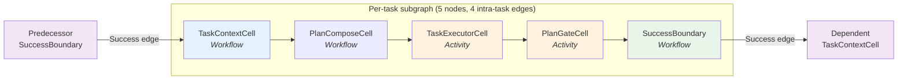
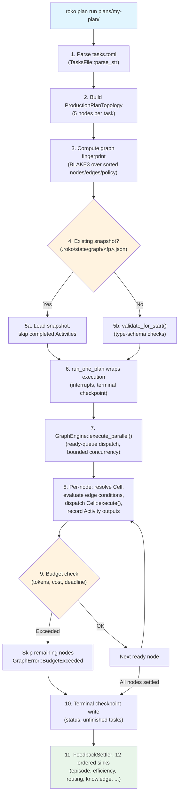
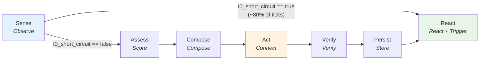
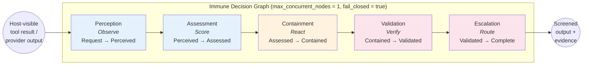
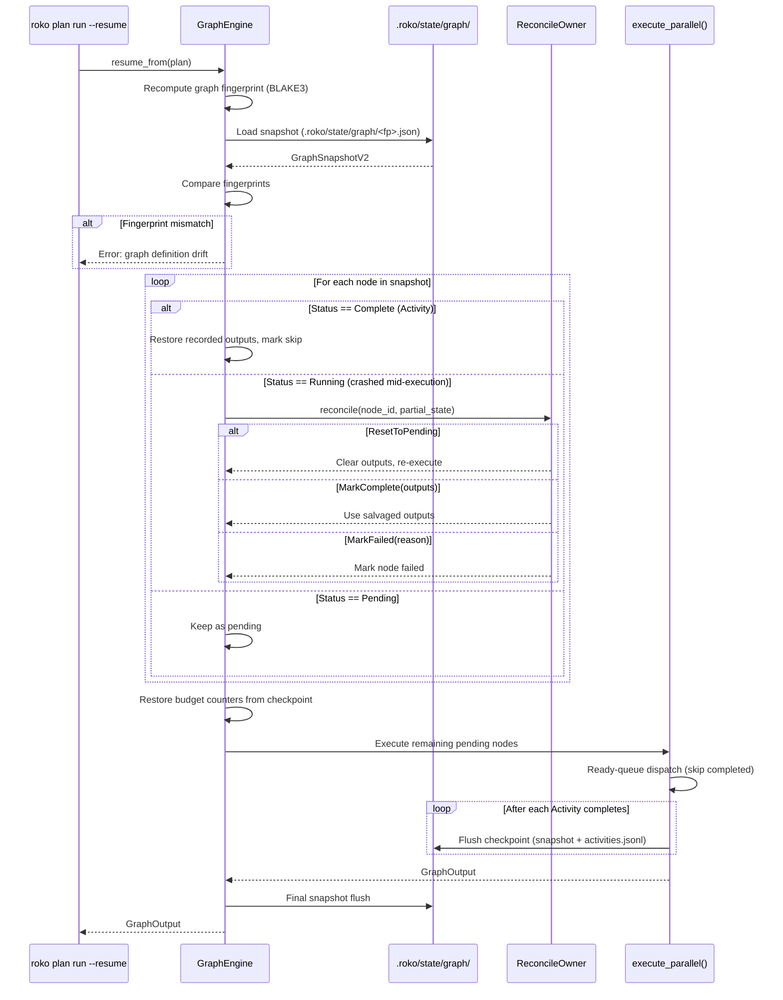

# 03 -- Graph Engine

> **Implementation status (2026-09; corrected 2026-09-29 at `7c556bc0a`):** WIRED -- Graph
> is the sole execution engine since #260 (default) and #276 (WorkflowEngine retired).
> Bounded parallel execution (a ready queue: each node starts once its own dependencies
> settle), conditional routing, TOML-defined topology, fingerprinted resume, cost
> enforcement, and durable checkpoints are shipping. The Runner-v2 event loop was deleted
> on 2026-09-06 (`6b5da8616`); `--engine legacy` and `--engine runner-v2` now exit with an
> error.

> The sole execution engine for Roko. Every plan, cognitive loop, and immune
> pipeline is a directed acyclic graph of Cells wired by typed, conditional
> edges. TOML-defined, fingerprinted, resumable. Graph became the default
> engine in #260, the sole engine in #276 (WorkflowEngine retired), and the
> Runner-v2 event loop was deleted on 2026-09-06.

---

## Overview

The Graph Engine (`roko-graph`) is the universal execution substrate for Roko.
It takes a `Graph` -- a petgraph-backed DAG of `Node`s connected by `Edge`s --
and executes them with bounded parallelism, starting each node as soon as the
nodes it depends on have settled, enforcing budgets,
recording Activities for replay, and persisting durable checkpoints across
restarts.

Three converging facts define the current architecture:

1. **Graph is the sole engine.** PR #260 made `PlanEngine::Graph` the default.
   PR #276 deleted `WorkflowEngine` entirely. Runner-v2 was retained as
   `--engine legacy` for one deprecation cycle; as of 2026-09-15 that
   deprecation is complete and Runner-v2 is being removed.

2. **Everything is a Graph of Cells.** Plan execution, the cognitive loop,
   immune screening, authored graph definitions, and single-prompt templates
   all compile down to the same `GraphEngine::execute` path. No special-case
   executors exist.

3. **Workflow/Activity split enables replay.** Every node is classified as
   `Workflow` (deterministic, re-derived on resume) or `Activity`
   (non-deterministic, recorded to JSONL). This distinction drives snapshot
   size, replay correctness, and cost accounting.

**Source:** `crates/roko-graph/src/` (35 source files, ~15K LOC).

---

## Core Types

All types live in `crates/roko-graph/src/types.rs`.

### Graph

```rust
pub struct Graph {
    pub metadata: GraphMetadata,   // name, description, version, labels
    pub policy:   GraphPolicy,     // mode, failure_strategy, max_concurrent_nodes, timeout, hot, capabilities
    pub lenses:   LensRegistry,    // telemetry Lens routing
    pub inner:    DiGraph<Node, Edge>,
    pub node_map: IndexMap<NodeId, GraphNodeIdx>,
}
```

`Graph` is a thin wrapper around `petgraph::graph::DiGraph`. The `node_map`
(`IndexMap<String, NodeIndex>`) provides O(1) string-to-index lookup while
preserving insertion order.

### Node

```rust
pub struct Node {
    pub id:              NodeId,          // unique string within the graph
    pub cell_type:       String,          // registry key (e.g. "task-executor", "sense")
    pub config:          toml::Value,     // per-node configuration passed to the cell factory
    pub inputs:          Vec<String>,     // named input slots
    pub outputs:         Vec<String>,     // named output slots
    pub execution_class: ExecutionClass,  // Workflow | Activity
    pub exclusive:       Vec<String>,     // paths written in a shared tree (see Exclusive Paths)
}
```

### Edge

```rust
pub struct Edge {
    pub from:      NodeId,
    pub to:        NodeId,
    pub condition: Option<EdgeCondition>,
}
```

Edges carry an optional `EdgeCondition`:

| Variant | Semantics |
|---|---|
| `Success` | Fires only if the source node succeeded |
| `Failure` | Fires only if the source node failed |
| `OutputEquals { key, value }` | Fires when a named output tag matches a literal value |
| `Always` | Unconditional dependency (always fires) |

### ExecutionClass

```rust
pub enum ExecutionClass {
    Workflow,  // Deterministic: re-derived on replay, not recorded
    Activity,  // Non-deterministic: recorded to JSONL, replayed on resume
}
```

The default is `Activity` because most graph nodes involve external computation
(LLM calls, tool use, gate execution). Only routing, scoring, and composition
nodes should be marked `Workflow`.

### GraphPolicy

```rust
pub struct GraphPolicy {
    pub mode:                 GraphMode,        // OneShot | Hot
    pub failure_strategy:     FailureStrategy,   // FailFast | SkipFailed | Retry { max_retries }
    pub max_concurrent_nodes: usize,             // default: 4
    pub timeout_ms:           Option<u64>,
    pub hot:                  Option<HotPolicy>,
    pub capabilities:         Vec<Capability>,
}
```

`max_concurrent_nodes` bounds how many Cells may execute at once across the
whole Graph (see the ready queue below). With 1, nodes run one at a time in
topological order.

---

## DAG Topology and Parallel Execution

### Topological Sort

The engine uses petgraph's topological sort (`petgraph::algo::toposort`) to
derive execution order. Cycle detection is implicit: if the sort does not visit
all nodes, `GraphError::CycleDetected` is returned.

```
Source: crates/roko-graph/src/topo.rs
```

### Parallel Execution: the Ready Queue

> **Corrected 2026-09-29 (at `7c556bc0a`).** Earlier revisions described wave-by-wave
> execution, where a whole depth layer had to finish before the next one started.
> That has been stale since `445a60d0d` (gap-4d835d).

With `max_concurrent_nodes` above 1, the engine runs a ready queue
(`GraphEngine::execute_ready_queue` in `crates/roko-graph/src/engine.rs`). A node
is decided once all of its predecessors have settled: it is condition-skipped,
skipped after a failed dependency, replayed from the Activity log, or queued to
run. Queued nodes start in topological order whenever fewer than
`policy.max_concurrent_nodes` cells are running, so the rest of a node's depth
layer never holds it back. With `max_concurrent_nodes = 1`, nodes run one at a
time in topological order.

A failed node blocks only its dependants, unless the policy is `FailFast`: then
no further node starts after the first failure. Nodes already running always
finish, and their Activity outputs are recorded, so a resumed run can replay
them.

`topological_waves()` in `crates/roko-graph/src/topo.rs` still groups nodes into
depth layers (`depth = max(depth of predecessors) + 1`, roots at depth 0), but the
engine does not schedule by layer.

**Example: Diamond DAG**

```
     [A]
    /   \
  [B]   [C]
    \   /
     [D]
```

B and C start together once A finishes, up to `max_concurrent_nodes`, and D
starts once both have settled. If C is slow and a node E needs only B, E starts
as soon as B finishes, while C still runs (test
`a_ready_node_does_not_wait_for_its_wave` in `crates/roko-graph/src/engine.rs`).

### Exclusive Paths

A node's `exclusive` list names the files and directories it writes in a
working tree it shares with other nodes. The engine never runs two nodes whose
exclusive paths overlap at the same time. Paths overlap when they are the same,
or when one is a directory holding the other; they are compared lexically,
component by component, so `src/app` covers `src/app/view.tsx` but not
`src/app.rs`.

When a ready node's paths overlap a running node's, the node waits in the
queue until that node finishes, and the engine logs which node it waits for.
It holds no `max_concurrent_nodes` slot while it waits, so ready nodes behind
it may start first. Exclusive paths order nodes but are not dependencies: if
the running node fails, the waiting node still runs. A node with no
exclusive paths never waits.

Graph TOML declares them per node (`exclusive = ["src/lib.rs"]`), and plan
conversion fills them from each task's `files`. They are not part of the
Graph fingerprints, so adding or changing them never stops a checkpoint from
resuming.

```
Source: crates/roko-graph/src/engine.rs (execute_ready_queue),
        crates/roko-graph/src/exclusion.rs
```

### Edge Condition Evaluation

After a source node completes, its outgoing edges are evaluated:

- `Success` edges fire only if `NodeOutputStatus::Success`.
- `Failure` edges fire only if `NodeOutputStatus::Failed`.
- `OutputEquals` edges fire if the output Signal carries a matching tag.
- `Always` edges fire unconditionally.
- `None` (no condition) edges fire unconditionally.

A downstream node whose incoming conditional edges all evaluate to false
receives status `ConditionSkipped` -- a successful no-op, not a failure.

### Edge Type-Schema Validation

Before execution begins, `GraphEngine::validate_for_start()` calls
`graph.validate_edges(&registry)` to check type-schema compatibility between
every connected pair of nodes. Validation uses side-effect-free
`CellDescriptor` introspection (no Cell construction). Rules:

- Nodes with `None` schema (untyped) are always compatible.
- Both schemas present: `source.output_schema.is_compatible_with(target.input_schema)`.
- All errors are collected (no fail-fast) and reported in
  `GraphError::EdgeValidationFailed`.

---

## TOML to Graph Conversion

### Plan Conversion: `plan_to_graph()`

The simplest conversion path maps each `TaskDef` from `tasks.toml` into a
single `task-executor` node. Dependencies become edges.

```
Source: crates/roko-graph/src/convert.rs
```

```
tasks.toml:                        Graph:
  T1 (no deps)          -->        [T1] ---> [T2] ---> [T4]
  T2 (depends: T1)                   \                  /
  T3 (depends: T1)                    --> [T3] --------/
  T4 (depends: T2, T3)
```

### Production Plan Topology: `ProductionPlanTopology`

For real plan execution, each task expands into a 5-node subgraph via
`ProductionPlanTopology::build()`:

```
Source: crates/roko-graph/src/topology.rs
```



```
                 Per-task subgraph (5 nodes, 4 intra-task edges)
                 ===============================================

  [TaskContextCell] --> [PlanComposeCell] --> [TaskExecutorCell] --> [PlanGateCell] --> [SuccessBoundary]
     (Workflow)            (Workflow)            (Activity)            (Activity)          (Workflow)
```

**Node roles:**

| Node | Cell Type | ExecutionClass | Purpose |
|---|---|---|---|
| TaskContext | `plan.task-context` | Workflow | Collects task metadata, prior attempt state |
| PlanCompose | `plan.compose` | Workflow | Assembles the task's prompt from its context |
| TaskExecutor | `task-executor` | Activity | Non-deterministic LLM dispatch |
| PlanGate | `plan.gate` | Activity | Runs gate pipeline (compile, test, clippy, diff) |
| SuccessBoundary | `plan.success-boundary` | Workflow | No-op anchor for inter-task edges |

Until 2026-10-03 the subgraph also fanned the context out to six
`plan.enricher.*` nodes (knowledge, episodes, playbook, modulation, safety,
experiment). They were passthrough stubs that changed nothing, so they were
removed (9206); the dispatcher's prompt builder does the enrichment.

**Inter-task wiring:** Predecessor's `SuccessBoundary` connects to dependent's
`TaskContextCell` via a `Success` edge. This means a task's context node begins
only after all predecessor tasks have passed their gates.

**Scale:** A 4-task diamond plan produces 20 nodes and 20 edges (5 nodes x 4
tasks; 4 intra-task edges x 4 + 4 inter-task edges).

### Full Execution Flow: `roko plan run plans/<dir>`

The complete pipeline from CLI command to execution:



```
  roko plan run plans/my-plan/
       |
       v
  1. Parse plans/my-plan/tasks.toml      (TasksFile::parse_str)
       |
       v
  2. Build ProductionPlanTopology         (5 nodes per task)
       |
       v
  3. Compute graph fingerprint            (BLAKE3 over sorted nodes/edges/policy)
       |
       v
  4. Check for existing snapshot          (.roko/state/graph/<fingerprint>.json)
       |
       v
  5. If resuming: load snapshot, skip completed Activities
     If fresh: validate_for_start()
       |
       v
  6. run_one_plan wraps execution         (interrupt handling, terminal checkpoint write)
       |
       v
  7. GraphEngine::execute_parallel()      (ready-queue dispatch, bounded concurrency)
       |
       v
  8. Per-node: resolve Cell from registry, evaluate edge conditions,
     dispatch to Cell::execute(), record Activity outputs
       |
       v
  9. Budget enforcement per-node          (tokens, cost, deadline)
       |
       v
  10. Terminal checkpoint write            (status, unfinished tasks, run manifest)
       |
       v
  11. FeedbackSettler: 12 ordered sinks   (episode, efficiency, routing, knowledge, ...)
```

---

## Sample Execution Graph (ASCII)

A 3-task plan (T1 -> T2, T1 -> T3) produces the following graph with
`ProductionPlanTopology`:

```
Wave 0:  [T1.context]
                |
Wave 1:  [T1.knowledge] [T1.episodes] [T1.playbook] [T1.modulation] [T1.safety] [T1.experiment]
                |             |             |              |             |             |
Wave 2:  [T1.compose] <------+-------------+--------------+-------------+-------------+
                |
Wave 3:  [T1.executor]  (Activity -- LLM dispatch)
                |
Wave 4:  [T1.gate]      (Activity -- compile/test/clippy)
                |
Wave 5:  [T1.success]
              /    \
Wave 6:  [T2.context] [T3.context]
              |             |
Wave 7:  [T2.knowledge]   [T3.knowledge]     <-- T2 and T3 enrichers run in parallel
         [T2.episodes]    [T3.episodes]
         [T2.playbook]    [T3.playbook]
         [T2.modulation]  [T3.modulation]
         [T2.safety]      [T3.safety]
         [T2.experiment]  [T3.experiment]
              |             |
Wave 8:  [T2.compose]     [T3.compose]
              |             |
Wave 9:  [T2.executor]    [T3.executor]       <-- parallel LLM dispatch (bounded by max_concurrent_nodes)
              |             |
Wave 10: [T2.gate]        [T3.gate]
              |             |
Wave 11: [T2.success]     [T3.success]
```

The wave labels are depth layers, not scheduling barriers: each node starts
once its own dependencies settle. With `max_concurrent_nodes = 2`, T2's and
T3's nodes run concurrently, two at a time.

---

## Seven Cognitive Cells

The cognitive loop is a Hot Graph with 7 typed Cells executing sequentially
each tick, modeling the agent's inner cognitive cycle:

```
Source: crates/roko-graph/src/cells/cognitive.rs
```



```
  [Sense] ---(t0_short_circuit == true)---> [React]     (T0 fast path: ~80% of ticks)
     |
     +---(t0_short_circuit == false)---> [Assess] --> [Compose] --> [Act] --> [Verify] --> [Persist] --> [React]
```

| Cell | Protocol | ExecutionClass | Purpose |
|---|---|---|---|
| **Sense** | Observe | Workflow | Reads Signals from Store/Bus; detects if full tick needed |
| **Assess** | Score | Workflow | Scores sensed Signals for relevance and priority |
| **Compose** | Compose | Workflow | Assembles the system prompt from scored context |
| **Act** | Connect | Activity | Dispatches prompt to LLM agent, collects response |
| **Verify** | Verify | Workflow | Runs gate pipeline against agent output |
| **Persist** | Store | Workflow | Writes verified outputs to durable signal store |
| **React** | React + Trigger | Workflow | Lifecycle events, housekeeping, trigger evaluation |

### T0 Short-Circuit

The most common case (~80% of ticks) is that nothing changed between ticks.
When SenseCell detects no new input, budget is not near exhaustion, and no
forced full tick was requested, it emits a Signal tagged
`t0_short_circuit=true`. The `OutputEquals` conditional edge routes directly
to React, skipping the expensive middle cells (Assess through Persist).

**Short-circuit inhibition.** The T0 path is suppressed when:

- `budget_remaining` drops below `DEADLINE_BUDGET_THRESHOLD_USD` ($0.05) --
  forces a full pass to flush pending work before budget exhaustion.
- Previous ReactCell output included `force_full_tick=true` -- React requested
  a follow-up full pass.

### Calibration

AssessCell implements the `predict()` / `correct()` calibration cycle.
It predicts output count before execution, then compares against actual
outputs to maintain a running mean calibration error. `CalibrationTracker`
provides atomic observation counting for dashboard reporting.

---

## Five-Stage Immune Decision Graph

Every host-visible tool result and canonical provider primary output traverses
a fixed, linear, fail-closed immune pipeline implemented as five Graph Cells:

```
Source: crates/roko-graph/src/cells/immune.rs
```



```
  [Perception] --> [Assessment] --> [Containment] --> [Validation] --> [Escalation]
```

| Stage | Cell Type | Protocol | Input State | Output State |
|---|---|---|---|---|
| 1. Perception | `security.immune.perception` | Observe | `Request` | `Perceived` |
| 2. Assessment | `security.immune.assessment` | Score | `Perceived` | `Assessed` |
| 3. Containment | `security.immune.containment` | React | `Assessed` | `Contained` |
| 4. Validation | `security.immune.validation` | Verify | `Contained` | `Validated` |
| 5. Escalation | `security.immune.escalation` | Route | `Validated` | `Complete` |

**Safety invariants:**

- Each stage accepts exactly one versioned `ImmuneCellState` variant and
  rejects any other. Feeding a `Request` state to `ImmuneValidationCell`
  fails with "expected contained state."
- The pipeline runs with `max_concurrent_nodes = 1` (strictly sequential).
- Graph labels declare `security.fail_closed = true` and
  `security.effect_free = true`.
- The pure-transform `ImmunePipeline` produces identical results to the
  runtime Graph execution (verified by test parity).

`ImmunePipelineGraph::screen()` is the runtime entry point: it constructs
the five-node Graph, injects the screening request as a root Signal, and
returns `ImmuneGraphOutput` with both the pipeline result and per-stage
execution evidence.

---

## Graph Fingerprinting for Activity Resume

```
Source: crates/roko-graph/src/fingerprint.rs
```

`graph_execution_fingerprint()` computes a stable BLAKE3 identity over the
execution-relevant parts of a Graph definition:

1. Sort nodes by `node.id` (lexicographic).
2. Sort edges by `(from, to, condition)`.
3. Collect sorted metadata labels into a `BTreeMap`.
4. Serialize the schema version, metadata, policy, nodes, and edges to JSON.
5. Hash with BLAKE3; return hex string.

**Invariant:** Node and edge insertion order do not affect the fingerprint.
Two structurally identical graphs always produce the same fingerprint.

**Use:** The fingerprint is stored in every snapshot (`GraphSnapshotV2.graph_fingerprint`).
On resume, the engine recomputes the fingerprint from the current graph
definition and rejects the snapshot if it differs -- preventing replay after
graph definition or policy drift.

---

## Restart-Durable Checkpoints

### GraphSnapshot V2

```
Source: crates/roko-graph/src/snapshot.rs
```

The snapshot captures the minimum state needed for resume:

```rust
pub struct GraphSnapshotV2 {
    pub schema_version:          u8,                             // always 2
    pub graph_name:              String,
    pub graph_id:                String,
    pub graph_fingerprint:       String,                         // BLAKE3 hex
    pub node_statuses:           HashMap<String, SerializableNodeStatus>,
    pub node_outputs:            HashMap<String, Vec<SerializableSignal>>,  // Activity only
    pub tick_count:              u64,
    pub budget_spent_micro_usd:  u64,                            // 1 USD = 1_000_000
    pub budget_reserved_micro_usd: u64,
    pub last_event_seq:          u64,                            // monotonic event counter
    pub created_at_ms:           i64,
    pub policy:                  GraphPolicy,
    pub extensions:              BTreeMap<String, serde_json::Value>,
    pub receipts:                Vec<ReceiptLedgerEntry>,
}
```

**Key design choices:**

- Only `Activity` node outputs are stored. `Workflow` nodes are re-derived
  from inputs on resume (they are deterministic by definition).
- V1 snapshots on disk deserialize into V2 via serde defaults -- no explicit
  migration code.
- The extension ledger allows host layers (CLI, serve, ACP) to register
  namespaced data without editing the graph-core schema. 13 known extension
  namespaces are registered: `activity`, `approval`, `control`, `cost`,
  `delivery`, `experiment`, `feedback`, `gate_history`, `replan`,
  `run_context`, `safety_provenance`, and more.
- The receipt ledger enforces forward-only transitions:
  `Prepared -> Committed -> Settled`. Repeating the current transition is
  idempotent; reverse or skipped transitions fail closed.

### Reconciliation on Resume



When a snapshot contains `Running` Activity nodes (the process crashed during
execution), the engine delegates to the registered reconciliation owner rather
than blindly resetting to `Pending`. `ReconcileAction` options:

- `ResetToPending` -- clear and re-execute.
- `MarkComplete(outputs)` -- if the Activity completed but the snapshot
  was not flushed.
- `MarkFailed(reason)` -- if the Activity cannot be salvaged.

### Hot Graph Checkpoints

```
Source: crates/roko-graph/src/hot.rs
```

Hot Graphs (tick-driven, resident) persist three artifacts after each
successful tick:

1. **`checkpoint.json`** -- `HotGraphCheckpointManifest` containing the graph
   fingerprint, tick count, budget checkpoint, and per-node tick state.
2. **`activities.jsonl`** -- Activity node outputs for replay.
3. **Budget checkpoint** -- `BudgetCheckpoint` with `tokens_used`,
   `cost_microdollars`, `elapsed_ms`, and per-node cost breakdown.

On resume, `start_hot_resumable()` loads the manifest, verifies the graph
fingerprint (rejects drift/corruption), restores tick state and budget
counters, and replays the Activity log. The interrupted tick's Activity is
replayed without re-execution.

**Loop levels** for nested hot graphs:

| Level | Name | Default Interval |
|---|---|---|
| Gamma | Perception, reflex | 250 ms |
| Theta | Planning, deliberation | 10,000 ms |
| Delta | Learning, consolidation | 60,000 ms |

---

## Cost State and Budget Enforcement

```
Source: crates/roko-graph/src/budget.rs
```

### BudgetTracker

Monitors three resource dimensions during execution:

| Dimension | Field | Limit | Check |
|---|---|---|---|
| Tokens | `tokens_used: AtomicU64` | `max_tokens` | Before each node |
| Cost | `cost_microdollars: AtomicU64` | `max_cost_usd` | Before each node |
| Time | `start_time: Instant` | `deadline: Duration` | Before each node |

When any limit is exceeded, the engine returns `GraphError::BudgetExceeded`
and skips remaining nodes.

Cost is tracked in microdollars (1 USD = 1,000,000) using `AtomicU64` for
lock-free concurrent updates from nodes that run in parallel.

### BudgetEnforcer

Wraps `BudgetTracker` with Hot-Graph-specific logic: nodes can be classified
as essential (always run, even near budget exhaustion) or expensive (skip when
budget is tight). This enables graceful degradation rather than hard failure.

```mermaid
stateDiagram-v2
    [*] --> Available : Graph starts with configured limits

    Available --> CheckToken : Before each node
    CheckToken --> Available : tokens_used < max_tokens
    CheckToken --> Exceeded : tokens_used >= max_tokens

    Available --> CheckCost : Before each node
    CheckCost --> Available : cost_microdollars < max_cost_usd * 1M
    CheckCost --> Exceeded : cost_microdollars >= max_cost_usd * 1M

    Available --> CheckDeadline : Before each node
    CheckDeadline --> Available : elapsed < deadline
    CheckDeadline --> Exceeded : elapsed >= deadline

    Available --> NearExhaustion : budget_remaining < $0.05
    NearExhaustion --> SkipExpensive : Node is expensive
    NearExhaustion --> Available : Node is essential (always runs)
    SkipExpensive --> Available : Continue with remaining nodes

    Exceeded --> [*] : GraphError::BudgetExceeded\nskip remaining nodes

    note right of NearExhaustion
        Hot Graph graceful degradation:
        essential nodes always run,
        expensive nodes are skipped
    end note
```

### BudgetCheckpoint

Serializable cumulative budget state for durable checkpoints:

```rust
pub struct BudgetCheckpoint {
    pub tokens_used:       u64,
    pub cost_microdollars: u64,
    pub elapsed_ms:        u64,
    pub breakdown:         Vec<NodeCostCheckpoint>,
}
```

On resume, counters are restored from the checkpoint so cost accounting
spans process restarts without double-counting.

---

## ProductionPlanTopology

```
Source: crates/roko-graph/src/topology.rs
```

`ProductionPlanTopology` builds the canonical per-task subgraph described
above. It is the bridge between the plan domain (`tasks.toml`) and the graph
domain (DAG of Cells).

**Construction phases:**

1. **Validate dependencies.** Every `depends_on` reference must name a task
   present in the plan. Missing references fail with `GraphError::InvalidGraph`.
2. **Build per-task subgraphs.** For each task, add 5 nodes and 4
   intra-task edges.
3. **Wire inter-task dependencies.** Predecessor's `task.<id>.success` connects
   to dependent's `task.<id>.context` via a `Success` edge.
4. **Cycle detection.** `topo::topological_order()` runs on the complete graph.
   Cycles fail with `GraphError::CycleDetected`.

**Report:** `TopologyReport` returns total node/edge counts, task count,
entry tasks (no predecessors), and exit tasks (no dependents).

---

## Cleanup on exit

There is no separate finally controller. A `GuaranteedFinallyController` was
drafted in `crates/roko-graph/src/finally.rs`, but roko-graph never compiled it
(its `lib.rs` declared no `mod finally`), and it was deleted on 2026-10-01
(gap-ff6e83).

`run_one_plan` (`crates/roko-cli/src/graph_execution/plan_runner.rs`) does a plan run's
cleanup:

- On an interrupt it cancels the graph and sends SIGTERM to in-flight agents. Attempts
  still running after a drain timeout are stopped, and agents that ignored SIGTERM are
  killed.
- It then writes the checkpoint's terminal status and the tasks the run did not complete,
  and closes the run manifest.

A forced exit or SIGHUP ends the run without that terminal write (bug-4641e3).

---

## GraphEngine

```
Source: crates/roko-graph/src/engine.rs
```

### Construction

```rust
let engine = GraphEngine::new(graph, registry)
    .with_root_inputs(inputs)
    .with_recorder(recorder)        // Activity recording
    .with_replayer(replayer)        // Activity replay on resume
    .with_telemetry(telemetry)      // Passive lifecycle sink
    .with_event_sink(sink)          // Rich graph execution events
    .with_allow_test_stubs(false);  // Reject stub descriptors in production
```

### Execution Paths

| Method | Mode | Concurrency |
|---|---|---|
| `execute()` | OneShot | Sequential (one node at a time) |
| `execute_parallel()` | OneShot | Bounded parallel ready queue |
| `execute_at_tick(tick)` | Hot | Sequential, tick-driven |
| `execute_parallel_at_tick(tick)` | Hot | Parallel, tick-driven |
| `start()` | OneShot | Background task with `FlowHandle` |
| `resume_from(snapshot)` | OneShot | Parallel, skips completed Activities |

All paths require a `ValidatedGraph` proof token from `validate_for_start()`,
ensuring type-schema validation cannot be accidentally skipped.

### FlowHandle

`GraphEngine::start()` returns a `FlowHandle` for non-blocking observation:

- `status()` -- point-in-time per-node status and budget consumption.
- `cancel()` -- request early stop (currently executing node finishes first).
- `await_completion()` -- async wait for final `GraphOutput`.
- `is_running()` -- check whether the background task is still alive.

### NodeStatus Lifecycle

```
Pending --> Running --> Complete
                   \-> Failed
                   \-> Skipped (upstream failure)
                   \-> ConditionSkipped (no incoming route selected)
```

---

## Workflow vs. Activity Classification

Every production stage is classified for replay and idempotency:

| Stage | Class | Replay Rule |
|---|---|---|
| Plan loading, DAG construction | Workflow | Re-derive from `tasks.toml` |
| Graph conversion, fingerprinting | Workflow | Deterministic given same input |
| Topological sort, ready-queue ordering | Workflow | Re-derive from graph structure |
| Budget reservation and tracking | Workflow | Re-derive from policy + consumed totals |
| Compose/prompt assembly | Workflow | Deterministic given same context |
| **Provider dispatch (LLM call)** | **Activity** | **Record output; replay substitutes** |
| **Tool execution** | **Activity** | **Record output; replay substitutes** |
| **Gate execution** | **Activity** | **Record verdict; replay substitutes** |
| **Verify command execution** | **Activity** | **Record verdict; replay substitutes** |
| Snapshot persistence | Workflow | Always written fresh |
| Episode logging | Workflow | Append-only, deduplicated |
| Feedback settlement | Workflow | At-most-once per receipt |

---

## Cell Registry

```
Source: crates/roko-graph/src/registry.rs
```

`CellRegistry` maps cell type names (strings) to factory functions. Each
registration includes a `CellDescriptor` with:

- **Version** (semver triple).
- **Input/output TypeSchema** (for edge validation).
- **`is_stub` flag** (test-only passthrough; rejected in production).
- **Protocol IDs** (what kernel protocols the cell implements).
- **`is_predictive` flag** (whether the cell supports `predict()`/`correct()`).

`default_registry()` pre-registers all built-in cells: 7 cognitive cells,
5 immune cells, compose, agent, graduation, and test stubs. Production plan
topology cells are registered separately via `register_topology_cells()`.

---

## Verification

### Validate a graph definition

```bash
cargo run -p roko-cli -- graph validate path/to/graph.toml
```

### Validate a plan's topology

```bash
cargo run -p roko-cli -- plan validate plans/my-plan/
```

This parses `tasks.toml`, builds the `ProductionPlanTopology`, and checks
for missing dependencies, cycles, and type-schema mismatches.

### Inspect a graph

```bash
cargo run -p roko-cli -- graph inspect path/to/graph.toml
```

Prints node count, edge count, topological waves, root/leaf nodes, and
detected issues.

### Run graph engine tests

```bash
cargo test -p roko-graph --lib
```

The graph crate has comprehensive unit tests covering:

- Topological sort (linear, diamond, independent roots, cycles).
- Wave computation (linear, diamond, parallel).
- Edge validation (untyped, compatible, incompatible, missing cells).
- Fingerprint stability and sensitivity.
- Production topology (5 nodes per task, edge counts, cycles, duplicates).
- Cognitive loop (T0 short-circuit, all 7 cells, calibration).
- Immune pipeline (all 5 stages, out-of-order rejection, malformed input).
- Budget tracking and enforcement.
- Snapshot serialization and resume.

### Engine convergence fixtures

Three frozen golden fixtures under
`crates/roko-graph/tests/fixtures/engine_convergence/` verify end-to-end
correctness:

| Fixture | Topology | Tests |
|---|---|---|
| `diamond_success` | A -> {B, C} -> D | All tasks succeed, parallel B/C |
| `gate_replan_cap` | Linear with gate failure | Replan cap exhaustion |
| `cancel_resume_budget` | A -> B -> C with budget | Cancel/resume/budget skip |

Each fixture contains `tasks.toml`, `graph.toml`, `expected.json`, and
`activities.jsonl` with pre-recorded Activity outputs for deterministic replay.

---

## References

- Kahn, A. B. (1962). Topological sorting of large networks. *Communications of the ACM*, 5(11), 558--562.
- Topcuoglu, H., Hariri, S. & Wu, M.-Y. (2002). Performance-effective and low-complexity task scheduling for heterogeneous computing. *IEEE Trans. Parallel and Distributed Systems*, 13(3), 260--274.
- Mokhov, A., Mitchell, N. & Peyton Jones, S. (2018). Build systems a la carte. *ICFP 2018*.
- Hammer, M. A. et al. (2014). Adapton: Composable, demand-driven incremental computation. *PLDI 2014*.
- van der Aalst, W. M. P. (1997). Verification of workflow nets. *Application and Theory of Petri Nets 1997*, LNCS 1248.
- Blumofe, R. D. & Leiserson, C. E. (1999). Scheduling multithreaded
  computations by work stealing. *JACM*, 46(5), 720--748. (Work-stealing
  bounds: E[T_P] = T_1/P + O(T_inf); informing wave-based parallelism
  limits.)
- Rocklin, M. (2015). Dask: Parallel computation with blocked algorithms and task scheduling. *SciPy 2015*.
- Dean, J. & Ghemawat, S. (2008). MapReduce: Simplified data processing on large clusters. *Comm. ACM*, 51(1), 107--113.
- Sumers, T. R. et al. (2023). Cognitive architectures for language agents.
  *arXiv:2309.02427*. (CoALA decision cycle, §4.6; informing the 7
  cognitive cells.)

---

## Depth Files

| File | Topic |
|---|---|
| `depth/03-graph/cell-trait.md` | Cell trait API, CellContext, CellResources |
| `depth/03-graph/registry.md` | CellRegistry, CellDescriptor, factory protocol |
| `depth/03-graph/topology-builder.md` | ProductionPlanTopology internals |
| `depth/03-graph/immune-pipeline.md` | Five-stage immune Graph details |
| `depth/03-graph/cognitive-loop.md` | Seven cognitive Cells, T0 short-circuit |
| `depth/03-graph/hot-graphs.md` | Hot Graph tick lifecycle, checkpoint, loop levels |
| `depth/03-graph/snapshot-resume.md` | GraphSnapshotV2, extension ledger, reconciliation |
| `depth/03-graph/budget.md` | BudgetTracker, BudgetEnforcer, BudgetCheckpoint |
| `depth/03-graph/fingerprint.md` | BLAKE3 graph fingerprinting algorithm |
| `depth/03-graph/edge-conditions.md` | EdgeCondition evaluation, type-schema validation |
| `depth/03-graph/plan-conversion.md` | plan_to_graph, plan_to_graph_with_endpoints |
| `depth/03-graph/events.md` | GraphExecutionEvent, EventSeqCounter, sinks |
| `depth/03-graph/delivery.md` | CompletionDeliveryService, merge queue |
| `depth/03-graph/control.md` | ExecutionControlService, approval, pause/resume |
| `depth/03-graph/plan-mutation.md` | Runtime replan: merge, split, rewiring |
| `depth/03-graph/engine-convergence.md` | #260/#276 migration, frozen fixtures, cutover invariants |
