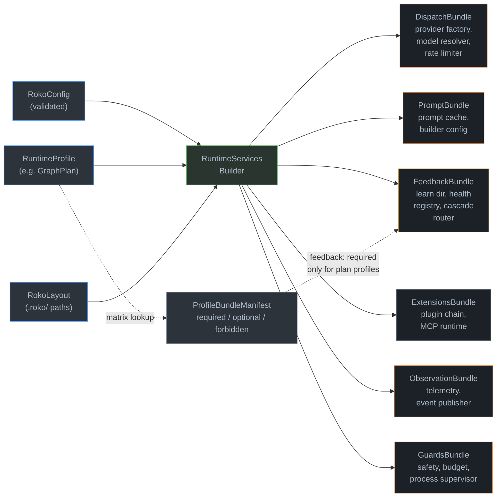
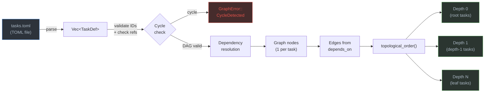
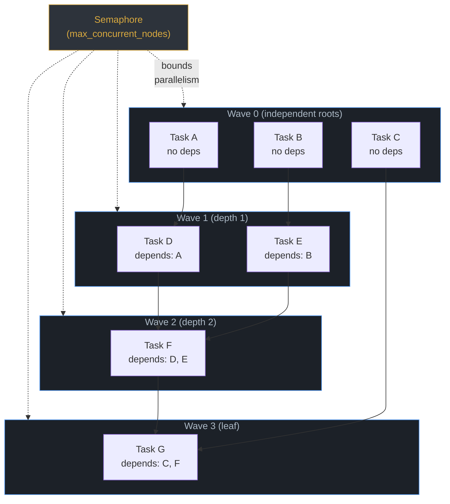
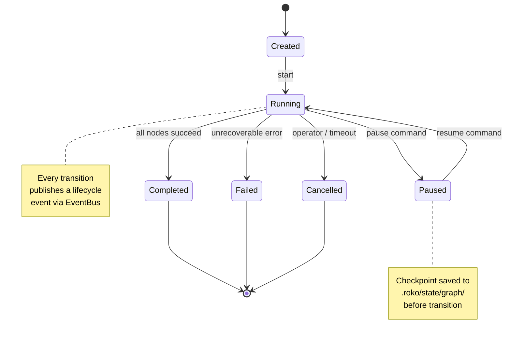
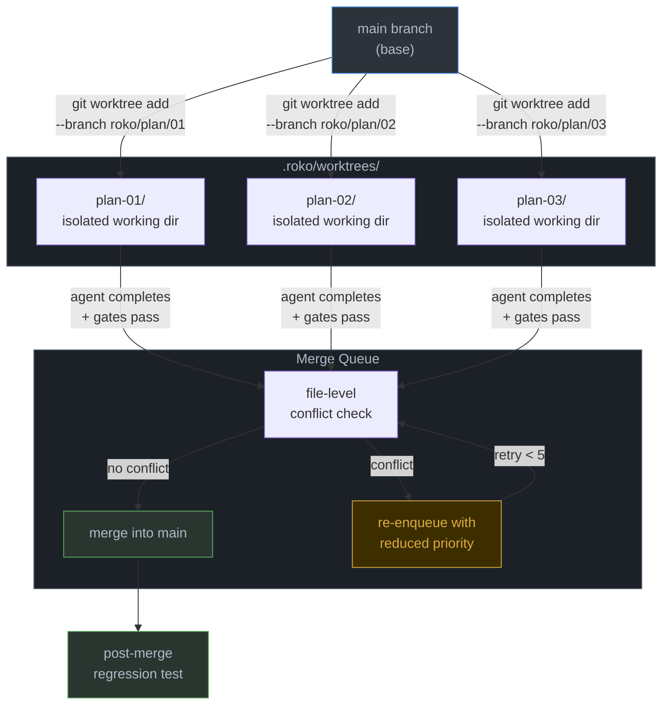

# 04 -- Execution and Orchestration

> **Implementation status (corrected 2026-09-29 at `7c556bc0a`):** WIRED -- The
> plan-execute-verify-persist pipeline works end-to-end through the Graph engine. Plan
> directories load as Graph topologies, each task starts as soon as its dependencies
> finish (up to the plan's `max_parallel`, which defaults to 1), each task's authored
> `verify` commands check it, and durable checkpoints allow resume after crash. Three
> parts of the design are not on this path. Tasks run in the operator's working tree:
> `--worktree-per-task` is opt-in, and its worktrees are never merged back (section 10).
> Nothing merges: the merge queue has no production caller (section 11). The 19-gate
> rung pipeline runs only in tests ([07-GATES](07-GATES.md)).

> The plan-execute-verify-persist pipeline. A plan directory becomes a Graph of
> Cells, the Graph engine runs each task as soon as its dependencies finish, each
> task's `verify` commands check its result, and durable checkpoints allow resume
> after crash. One engine, one path, end to end. Per-task worktree isolation and a
> merge queue that serializes integration are designed (sections 10 and 11) but not
> wired.

---

## 1. Overview

Execution is the bridge between a plan on disk and observable changes in the
codebase. The pipeline has five stages:

```
plan directory  -->  plan discovery  -->  plan-to-graph conversion
     -->  graph execution (ready queue, verify steps)
     -->  delivery (merge queue, snapshot, feedback)
```

Every plan passes through the same path:

1. **Discover**: scan `plans/` for directories containing `plan.md` and
   `tasks.toml`. Parse frontmatter, validate, rank by priority.
2. **Convert**: transform the TOML task DAG into a `Graph` of Cells via
   `plan_to_graph()` or `ProductionPlanTopology::build()`.
3. **Execute**: the `GraphEngine` topologically sorts the graph and starts
   each Cell once its own dependencies settle (bounded by
   `max_concurrent_nodes`), dispatching agents, composing prompts, and running
   each task's verify steps.
4. **Persist**: Activity outputs are recorded to JSONL, checkpoints are
   written to `.roko/state/graph/`, episodes are logged.
5. **Deliver** (designed, not wired): completed plan branches would enter the
   merge queue for conflict-free integration into the target branch. Today nothing
   merges (section 11).

The entire pipeline is orchestrated by the `AuthoredGraphController` (for
user-defined graphs) or `drive_controller` (for plan execution), both
backed by the shared `RuntimeServices` facade.

**Source crates:**

| Crate | Path | Role |
|---|---|---|
| `roko-graph` | `crates/roko-graph/` | Graph engine, topology, convert, cells, snapshot, replay |
| `roko-execution` | `crates/roko-execution/` | RuntimeServices builder, profiles, authored graph controller |
| `roko-cli` | `crates/roko-cli/` | Plan discovery, plan loader, CLI commands, TUI |
| `roko-gate` | `crates/roko-gate/` | 19 gates and a 7-rung pipeline (plan runs use only `ShellGate`, for verify commands), adaptive thresholds |
| `roko-runtime` | `crates/roko-runtime/` | ProcessSupervisor, event bus, cancellation |

---

## 2. RuntimeServices Builder (#243)

Before any execution begins, the runtime constructs a shared service facade.
`RuntimeServicesBuilder` takes a validated `RokoConfig` and a `RuntimeProfile`,
and produces a `RuntimeServices` value containing six bundles.

**Source:** `crates/roko-execution/src/builder.rs`



### The six bundles

```rust
pub struct RuntimeServices {
    pub dispatch:    Arc<DispatchFactory>,    // provider factory, model resolver, rate limiter
    pub prompt:      PromptBundle,            // prompt cache + builder state
    pub feedback:    Option<FeedbackBundle>,  // learning stores (None for light profiles)
    pub extensions:  ExtensionsBundle,        // plugin chain, MCP runtime
    pub observation: ObservationBundle,       // telemetry, event publisher
    pub guards:      GuardsBundle,            // safety, budget, process supervisor
    pub profile:     RuntimeProfile,
}
```

### Runtime profiles

The `RuntimeProfile` enum determines which bundles are required, optional, or
forbidden. The profile matrix is encoded as data in `profile_bundle_manifest()`
so drift is caught by snapshot tests.

| Profile | Used by | Feedback required |
|---|---|---|
| `GraphPlan` | `roko plan run` | Yes |
| `FullPlan` | Legacy Runner-v2 (deprecated) | Yes |
| `Workflow` | `roko run` | No |
| `DirectLight` | `roko do`, `roko develop` | No |
| `AgentServer` | `roko agent serve` | No |
| `ChatLight` | `roko chat` | No |
| `AuthoredGraph` | `roko graph run` | No |

All profiles require dispatch, prompt, observation, and guards. Only plan
execution profiles (`GraphPlan`, `FullPlan`) require the feedback bundle
(learning stores, cascade router, health registry). Extensions are optional
for every profile.

**Source:** `crates/roko-execution/src/profiles.rs`

---

## 3. Plan Discovery

Plan discovery is the first stage. It scans the filesystem for plans, parses
their metadata, validates constraints, and returns a ranked list.

**Source:** `crates/roko-cli/src/runner/plan_loader.rs`,
`crates/roko-cli/src/plan.rs`

### Directory layout

Plans live in numbered directories under `plans/`:

```
plans/
  01-workspace-scaffold/
    plan.md          # description + YAML frontmatter
    tasks.toml       # task definitions
    CONTEXT.md       # optional (skipped by discovery)
  02-core-traits/
    plan.md
    tasks.toml
```

The numeric prefix determines sort order. Alpha suffixes are supported
(`08a-variant` sorts after `08` and before `09`). A legacy flat-file layout
(`plans/01-workspace-scaffold.md`) is supported as fallback; the directory
layout wins when both exist.

### YAML frontmatter

Frontmatter is optional. All fields are optional within it.

```yaml
---
plan: "01-workspace-scaffold"
depends_on: ["00-init"]
parallel_with: ["02-core"]
crates_touched: ["roko-core", "roko-fs"]
estimated_tasks: 8
estimated_parallel_width: 4
estimated_minutes: 45
parallel_safe: true        # default: true
priority: 10               # higher runs first
tags: ["rust"]
milestone: "v0.2"
---
```

Key fields:

| Field | Type | Purpose |
|---|---|---|
| `depends_on` | `Vec<String>` | Plans that must complete first |
| `crates_touched` | `Vec<String>` | Crate dirs modified (for conflict inference) |
| `parallel_safe` | `bool` | Whether tasks can run concurrently with other plans |
| `priority` | `Option<u32>` | Higher values run first; ties broken by numeric prefix |

Validation rejects empty plan IDs, zero-value estimated_minutes, and
zero-value estimated_parallel_width. Malformed YAML fails loudly rather
than silently dropping the plan.

### Ranking

Plans are sorted by priority (descending), then by numeric prefix
(ascending). This determines the initial execution queue order.

---

## 4. Plan-to-Graph Conversion

After discovery, each plan's `tasks.toml` is converted into a `Graph` that
the engine can execute.



Two converters exist:

### Simple converter: `plan_to_graph()`

**Source:** `crates/roko-graph/src/convert.rs`

Maps each `TaskDef` to a single `Node` with `cell_type = "task-executor"`.
All nodes use `ExecutionClass::Activity` (non-deterministic LLM dispatch).
Dependencies become edges. The resulting graph is validated for cycles.

```rust
pub fn plan_to_graph(
    plan_id: &str,
    plan_dir: &str,
    tasks: &[(String, PlanTaskInfo)],
    max_parallel: u32,
) -> Result<Graph, GraphError>
```

### Production converter: `ProductionPlanTopology::build()`

**Source:** `crates/roko-graph/src/topology.rs`

Builds a richer 11-node subgraph per task. Each task becomes:

```
[TaskContextCell] --> [KnowledgeCell]    --+
                  --> [EpisodesCell]      --|
                  --> [PlaybookCell]      --|-> [ComposeCell] -> [TaskExecutorCell] -> [GateCell] -> [SuccessBoundary]
                  --> [ModulationCell]    --|
                  --> [SafetyCell]        --|
                  --> [ExperimentCell]    --+
```

The six enricher nodes run in parallel (same wave). ComposeCell receives
seven inputs: six enrichment Signals plus the TaskContext Signal. Inter-task
dependencies connect predecessor SuccessBoundary nodes to dependent
TaskContext nodes.

For a plan with N tasks, the production topology produces 11N nodes. A
`TopologyReport` summarizes totals, entry tasks, and exit tasks.

Cross-plan dependencies (`depends_on_plan`) are outside single-graph
scope -- they are logged as warnings and skipped during conversion.

---

## 5. Unified Task DAG

Within a single plan, the task DAG is embedded in the `Graph` via edges.
Across plans, the `CrossPlanDag` computes a dependency graph from
frontmatter `depends_on` declarations.

**Source:** `crates/roko-cli/src/runner/plan_dag.rs`

The cross-plan DAG provides:

- **Wave computation**: groups plans into execution waves where all plans
  in a wave are independent of each other.
- **Critical path estimation**: identifies the longest dependency chain
  with estimated duration.
- **Crate overlap detection**: warns when multiple plans declare the same
  crate in `crates_touched`.
- **Dangling reference detection**: warns when `depends_on` references a
  plan ID that does not exist.

The `--waves` flag on `roko plan list` renders the cross-plan DAG.

---

## 6. Parallel Wave Execution

> **Corrected 2026-09-29 (at `7c556bc0a`).** The engine no longer executes wave
> by wave. Since `445a60d0d` (gap-4d835d), `GraphEngine::execute_ready_queue`
> starts each node as soon as its own predecessors have settled, up to
> `max_concurrent_nodes`, so the diagram below shows depth layers, not
> scheduling barriers. [03-GRAPH](03-GRAPH.md) describes the ready queue.

The `GraphEngine` is the sole execution engine. It orders nodes
topologically; grouped by depth, they form layers ("waves") in which every
node is independent of every other.

**Source:** `crates/roko-graph/src/engine.rs`, `crates/roko-graph/src/topo.rs`



### Topological sort

`topological_order()` uses `petgraph::algo::toposort` to produce a linear
execution order. If the graph contains a cycle, `GraphError::CycleDetected`
is returned.

`topological_waves()` groups the sorted nodes into depth layers. Within
each layer, all nodes have no edges between them and can execute
concurrently, but the engine does not wait for a layer to finish before
starting nodes of the next.

### Bounded parallelism

The graph's `policy.max_concurrent_nodes` caps how many nodes execute at
once across the Graph: the ready queue starts a queued node whenever fewer
than that many are running. With a cap of 1, nodes run one at a time in
topological order.

### Conditional routing

Edges may carry conditions (`EdgeCondition::Success`, `EdgeCondition::Failure`,
`EdgeCondition::Always`, or output-equality predicates). The engine evaluates
conditions after each node completes. Nodes whose incoming conditions are
all unmet receive `NodeStatus::ConditionSkipped` -- a successful no-op,
not a failure.

### Node execution loop

For each node in topological order:

```
1. Resolve activation:
   - Root node -> use root_inputs
   - All upstream edges satisfied -> Ready(collected_outputs)
   - No conditional route selected -> ConditionSkipped
   - Required upstream failed -> UpstreamFailed

2. If Activity AND replayer has recorded output:
   -> return recorded output (skip re-execution)

3. Look up Cell in CellRegistry by cell_type

4. Execute the Cell with inputs + CellContext

5. If Activity AND recorder present:
   -> append output to JSONL activity log

6. Track budget (microdollars via AtomicU64)

7. Update node status and propagate to downstream edges
```

### NodeStatus

```rust
pub enum NodeStatus {
    Pending,           // not yet started
    Running,           // currently executing
    Complete,          // finished successfully
    Failed,            // execution error
    Skipped,           // upstream failure
    ConditionSkipped,  // no conditional route selected (not a failure)
}
```

---

## 7. Plan Phases and Flow Lifecycle

Plan execution follows a lifecycle managed by the controller outside the
graph engine.

### Flow lifecycle



Every state transition publishes a lifecycle event. These events are the
sole source of execution observability.

### Plan phase sequence

For plans executing through the full pipeline:

```
Queued -> Enriching -> Implementing -> Gating -> Verifying
       -> Reviewing -> DocRevision -> Merging -> Complete
```

With retry loops:

- `Gating -> AutoFixing -> Gating` (up to 5 iterations)
- `Verifying -> RegeneratingVerify -> Verifying`
- `Reviewing -> Implementing` (on rejection)

Terminal states: `Complete`, `Failed`, `Skipped`.

### GuaranteedFinallyController

**Source:** `crates/roko-graph/src/finally.rs`

The `GuaranteedFinallyController` wraps graph execution with an absolute
guarantee that cleanup runs regardless of outcome (success, failure, panic,
cancellation):

1. Emits exactly one `TerminalReceipt` (success, failure, or cancelled).
2. Releases all workspace leases.
3. Stops all tracked agent processes.
4. Flushes the final snapshot to disk.

This controller runs outside the DAG -- it is not a graph node.

---

## 8. Executor Actions

The engine dispatches actions based on the cell type of each node. The key
executor actions in a plan graph:

| Action | Cell type | Effect |
|---|---|---|
| Dispatch agent | `task-executor` | Build prompt, launch LLM provider, collect response |
| Run gate | `plan.gate` | Invoke compile/test/clippy pipeline, emit verdict |
| Compose prompt | `plan.compose` | Assemble system prompt from enrichment signals |
| Enrich context | `plan.knowledge`, `plan.episodes`, etc. | Query knowledge store, episodes, playbooks |
| Success boundary | `plan.success-boundary` | Mark task complete, emit downstream signal |

For the production topology, each task flows through all 11 nodes in
sequence: context -> 6 enrichers (parallel) -> compose -> executor -> gate
-> success boundary.

---

## 9. Runtime Harness

The runtime harness connects the pure graph engine to effectful subsystems.

### CellResources injection

Cells receive shared service handles through `CellContext`, which carries
a `CellResources` bundle. This provides cells access to:

- Provider dispatch (via `DispatchFactory`)
- Prompt assembly (via `PromptCacheHandle`)
- Budget tracking (via `BudgetTracker`)
- Cancellation token
- Telemetry event sink
- Workspace and worktree paths

### Process supervision

`ProcessSupervisor` (from `roko-runtime`) tracks spawned agent processes.
When a plan completes or fails, the supervisor ensures all child processes
are terminated. The `GuaranteedFinallyController` invokes supervisor
shutdown as part of its cleanup guarantee.

### Budget enforcement

The `BudgetTracker` (from `roko-graph/src/budget.rs`) tracks cost in
microdollars (1 USD = 1,000,000 microdollars). Atomic reservations are
persisted before dispatch. On resume, the schema-v2 cost sidecar restores
the exact budget state. Missing, corrupt, or mismatched cost state fails
closed.

---

## 10. Worktree Isolation

> **Status (2026-09-29, at `7c556bc0a`): PARTIAL.** This section describes the design.
> On Graph runs every task edits the operator's working tree by default.
> `plan run --worktree-per-task` is opt-in: each attempt gets a worktree under
> `.roko/worktrees/`, forked from `HEAD`, and a successful attempt's edits are never
> merged back, which is why `crates/roko-cli/src/graph_execution/plan_runner.rs` refuses
> the flag when plans run in parallel. The per-plan path (`ensure_for_plan`,
> `create_for_plan`) and `reclaim_idle` have no production caller, and `max_live` is unset.

Git worktrees provide per-plan filesystem isolation. Each active plan gets
its own worktree -- a separate working directory on its own branch, sharing
the same `.git` repository.

**Source:** `crates/roko-cli/src/orchestrator/worktree/mod.rs`



### Why worktrees

Without isolation, concurrent agents conflict on files, builds, and test
results. Worktrees solve this at the filesystem level:

- Each worktree has its own working directory and branch
- Agents in different worktrees cannot conflict on files
- Build and test artifacts are isolated
- Integration happens only at merge time

### Branch naming

```
roko/plan/<plan_id>
```

For example: `roko/plan/01-workspace-scaffold`. The convention is
deterministic -- the same plan always gets the same branch, enabling
idempotent `ensure_for_plan()` on resume.

### Lifecycle

| Operation | Behavior |
|---|---|
| `create(id)` | Check budget, create branch from base, create worktree, record handle |
| `ensure_for_plan(id)` | Create if absent, return existing if present (idempotent) |
| `remove(id)` | Remove worktree, optionally delete branch |
| `check_health(id)` | Return Ok, Missing, StaleLock, or Detached |
| `reclaim_idle()` | Remove worktrees idle longer than TTL (default 30 min) |
| `clear_stale_locks()` | Remove leftover `*.lock` files from crashed git operations |

### Configuration

| Parameter | Default | Source |
|---|---|---|
| `repo_root` | Working directory | CLI `--workdir` |
| `base_branch` | `"main"` | Config |
| `worktrees_root` | `.roko/worktrees/` | Convention |
| `max_live` | 8 | `config.conductor.max_agents` |
| `idle_ttl` | 30 minutes | `DEFAULT_WORKTREE_IDLE_TTL_SECS` |

Budget enforcement: when `create()` would exceed `max_live`, the manager
first attempts `reclaim_idle()`. If still over budget, it returns
`WorktreeError::BudgetExceeded`.

---

## 11. Merge Queue

> **Status (2026-09-30): ORPHANED.** The merge queue served Runner-v2,
> whose event loop was deleted on 2026-09-06 (`6b5da8616`), and nothing re-attached it:
> only tests construct `MergeQueue`, and `PlanMerger` was deleted (gap-3505fb). Graph runs
> under `--worktree-per-task` deliver each finished plan into the run's batch branch with
> git plumbing instead (`crates/roko-cli/src/graph_execution/batch.rs`, `delivery.rs`).

The merge queue serializes plan merges to prevent file conflicts.

**Source:** `crates/roko-cli/src/orchestrator/merge_queue.rs`

### Conflict detection

Conflicts are tracked at individual file granularity, not plan or crate
level. Two plans modifying different files in the same crate can merge in
parallel. Only plans modifying the exact same files are serialized.

```rust
pub struct MergeQueue {
    inner: Arc<Mutex<Inner>>,
}

struct Inner {
    pending:      Vec<MergeRequest>,         // ordered by priority
    merging:      HashMap<String, MergeRequest>,  // currently merging (files locked)
    locked_files: HashSet<String>,           // files reserved by in-progress merges
    completed:    Vec<MergeResult>,
}
```

### Priority ordering

Higher-priority requests merge first. Equal-priority requests use FIFO
ordering.

### Retry with backoff

When a merge fails:

1. Increment `retry_count`
2. If `retry_count < MAX_RETRIES` (5), re-enqueue with reduced priority
3. If at max retries, transition plan to `Failed`

Retries handle transient conflicts that resolve when other merges complete
first (e.g. auto-generated `Cargo.lock` conflicts).

### Post-merge regression detection

After a successful merge, the system runs regression detection: compile and
test the merged result. Even though individual plans passed their gates in
isolation, the combination may fail.

---

## 12. Snapshot Recovery

Long-running plan sessions must survive crashes. The recovery system
provides two complementary mechanisms.

### Graph snapshots

**Source:** `crates/roko-graph/src/snapshot.rs`

The `GraphSnapshotV2` captures everything needed to resume:

```rust
pub struct GraphSnapshotV2 {
    pub schema_version:           u8,       // always 2
    pub graph_name:               String,
    pub graph_id:                 String,
    pub graph_fingerprint:        String,   // BLAKE3 fingerprint of graph definition
    pub node_statuses:            HashMap<String, SerializableNodeStatus>,
    pub node_outputs:             HashMap<String, Vec<SerializableSignal>>,
    pub tick_count:               u64,
    pub budget_spent_micro_usd:   u64,
    pub budget_reserved_micro_usd: u64,
    pub last_event_seq:           u64,
    pub created_at_ms:            i64,
    pub policy:                   GraphPolicy,
    // ... extension ledger, receipt state
}
```

The fingerprint ensures resume is rejected after graph definition drift.
V1 snapshots deserialize into V2 via serde defaults (no migration code).

### Persistence paths

| What | Path |
|---|---|
| Graph checkpoints | `.roko/state/graph/` |
| Legacy Runner-v2 snapshot | `.roko/state/state-snapshot.json` |
| Activity recordings | `.roko/state/graph/<run-id>/activities/*.jsonl` |
| Episode log | `.roko/episodes.jsonl` |
| Signal log | `.roko/engrams.jsonl` |

### Atomic writes

Snapshots use the write-fsync-rename pattern:

1. Write to `<path>.tmp`
2. `fsync` the temp file
3. Rename `<path>.tmp` to `<path>` (atomic on POSIX)

A crash during steps 1-2 leaves the original intact. A crash during step 3
produces either the old or new snapshot, never a partial write.

### Hot checkpoint manifests

For Hot Graphs (persistent cognitive loops), the `HotGraphCheckpointManifest`
commits tick state, Activity logs, and cumulative budget after each
successful tick. A crash between Activity write and manifest commit replays
that Activity from the run-scoped log.

---

## 13. Event Log and Episodes

### Activity recording (replay log)

**Source:** `crates/roko-graph/src/replay.rs`

Every Activity node's output is appended to a JSONL file immediately after
execution:

```rust
pub struct RecordEntry {
    pub graph_id: String,
    pub run_id:   String,
    pub node_id:  String,
    pub tick:     u64,
    pub signals:  Vec<Signal>,
}
```

The file is flushed after every write. On resume, the `ActivityReplayer`
loads recorded entries and substitutes them for re-execution, avoiding
duplicate LLM calls.

### Episode log

The episode log (`.roko/episodes.jsonl`) records agent turns and gate
results. Each entry captures the task, provider, model, cost, duration,
verdict, and HDC fingerprint. Episodes feed the learning subsystem for
model routing, cascade adaptation, and playbook enrichment.

### Efficiency events

Per-turn efficiency telemetry is written to `.roko/learn/efficiency.jsonl`.
This tracks token usage, cost, duration, and outcome per dispatch, enabling
the cascade router and budget optimizer.

---

## 14. Checkpoint and Resume

The checkpoint-resume system ensures no completed work is repeated after
a crash or manual restart.

### Workflow/Activity split

Every node is classified as either:

- **Workflow**: deterministic (routing, scoring, composition). Re-derived
  from inputs on resume. Never recorded.
- **Activity**: non-deterministic (LLM calls, tool use, gates). Recorded
  to JSONL. Replayed from recording on resume.

### Resume procedure

When `roko plan run <dir> --resume-plan` is invoked:

```
1. Load GraphSnapshotV2 from .roko/state/graph/

2. Validate graph_fingerprint matches the current graph definition

3. Restore node statuses:
   - Complete   -> skip (Activity output loaded from recording)
   - Running    -> reset to Pending (was interrupted)
   - Pending    -> execute normally

4. Restore budget state (spent + reserved microdollars)

5. Resume execution from the first non-complete node
```

The worst case after a crash is a single duplicate LLM call (if the
Activity completed but the recording was not flushed before crash). The
system prefers availability over exactly-once semantics.

### Reconciliation

The `ReconcileAction` type lets extension owners decide how to handle
`Running` status from a restored snapshot. The engine delegates to the
registered owner rather than blindly resetting to `Pending`.

---

## 15. Error Handling

### Four error kinds

```rust
pub enum ErrorKind {
    Transient,       // network timeout, rate limit -- retry with backoff
    Deterministic,   // compile error, schema mismatch -- never retry blindly
    Resource,        // disk full, memory pressure -- retry after resource freed
    Catastrophic,    // data corruption, auth revoked -- never retry
}
```

### Supremum composition

When a graph has multiple failures, the composite kind is the supremum:
`Catastrophic > Deterministic > Resource > Transient`. A single
catastrophic failure in a parallel fan-out makes the entire fan-out
catastrophic.

### Failure strategies

Strategies are applied per-node from the node's config or graph-level
policy:

| Strategy | Behavior |
|---|---|
| Fail | Terminate flow immediately |
| Retry | Re-execute with exponential backoff (up to N times) |
| RetryWithEscalation | Retry with progressively more capable models |
| Skip | Continue; downstream receives empty input |
| Decompose | LLM decomposes the failed task into a sub-graph |
| Replan | Generate a new plan from the failure context |
| HumanResolve | Pause flow; notify operator; timeout escalates |

---

## 16. Engine Convergence History

The execution engine went through three phases of convergence:

1. **Runner-v2** (original): a monolithic event loop in `roko-cli` that
   managed plan phases, agent dispatch, gate invocation, and snapshot
   persistence directly. Tight coupling made testing difficult.

2. **Graph engine introduced** (#260, default): `PlanEngine::Graph` became
   the default execution engine. Plans were converted to Graphs via
   `plan_to_graph()`. Runner-v2 remained available as `--engine legacy`.

3. **WorkflowEngine retired** (#276): the intermediate `WorkflowEngine`
   was deleted entirely. Graph became the sole engine. Runner-v2 was
   retained only for one deprecation cycle.

4. **Runner-v2 removal** (2026-09-15): Runner-v2 is being removed. The
   `--engine legacy` flag and `FullPlan` profile exist only for backward
   compatibility during this transition. All new execution uses
   `GraphPlan` exclusively.

The `roko-execution` crate (#243) provides the shared `RuntimeServices`
builder that both engines consumed during the transition period, ensuring
provider health, rate limiters, cost tables, prompt caches, and process
supervisors were shared regardless of engine choice.

---

## Verification Commands

```bash
# Validate a plan's tasks.toml without executing
cargo run -p roko-cli -- plan validate plans/<dir>

# Execute a plan through the Graph engine
cargo run -p roko-cli -- plan run plans/<dir>

# Show execution status for a plan
cargo run -p roko-cli -- plan status plans/<dir>

# Resume a crashed/interrupted plan execution
cargo run -p roko-cli -- plan run plans/<dir> --resume-plan

# List discovered plans with cross-plan DAG waves
cargo run -p roko-cli -- plan list --waves

# Inspect the deterministic plans index
cargo run -p roko-cli -- plan index

# Diagnose why a plan failed
cargo run -p roko-cli -- diagnose <plan-id>

# Resume a specific run
cargo run -p roko-cli -- resume [run-id]
```

---

## Depth Files

| # | File | Topic |
|---|---|---|
| 01 | `depth/04-01-plan-discovery.md` | Plan scanning, frontmatter parsing, ranking, validation |
| 02 | `depth/04-02-plan-to-graph.md` | `plan_to_graph()`, `ProductionPlanTopology`, 11-node subgraph |
| 03 | `depth/04-03-unified-task-dag.md` | Cross-plan DAG, wave computation, critical path, crate overlaps |
| 04 | `depth/04-04-graph-engine-execution.md` | `GraphEngine`, topological waves, node activation, conditional routing |
| 05 | `depth/04-05-plan-phases.md` | Phase lifecycle, state transitions, retry loops |
| 06 | `depth/04-06-runtime-services.md` | `RuntimeServicesBuilder`, profiles, bundle matrix, `CellResources` |
| 07 | `depth/04-07-worktree-isolation.md` | `WorktreeManager`, branch naming, health, idle reclamation, budget |
| 08 | `depth/04-08-merge-queue.md` | File-conflict detection, priority ordering, retry, post-merge regression |
| 09 | `depth/04-09-snapshot-recovery.md` | `GraphSnapshotV2`, atomic writes, fingerprint validation, delta encoding |
| 10 | `depth/04-10-activity-replay.md` | `ActivityRecorder`, `ActivityReplayer`, Workflow/Activity split |
| 11 | `depth/04-11-episodes-telemetry.md` | Episode log, efficiency events, HDC fingerprints, learning feedback |
| 12 | `depth/04-12-budget-enforcement.md` | `BudgetTracker`, microdollar accounting, reservation lifecycle, cost sidecar |
| 13 | `depth/04-13-error-resilience.md` | Four error kinds, supremum composition, retry policy monoid, failure strategies |
| 14 | `depth/04-14-finally-controller.md` | `GuaranteedFinallyController`, terminal receipts, cleanup guarantees |
| 15 | `depth/04-15-convergence-history.md` | Engine timeline: Runner-v2, #260 Graph default, #276 WorkflowEngine retired |
