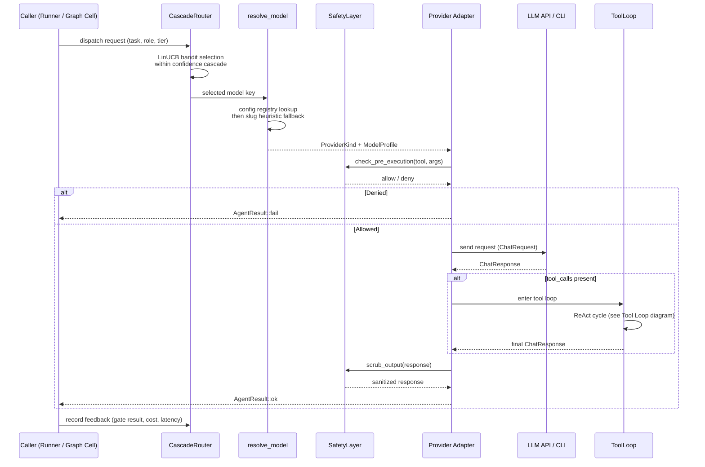
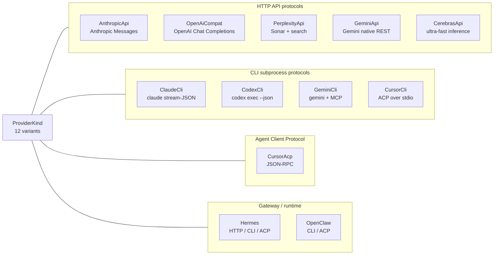
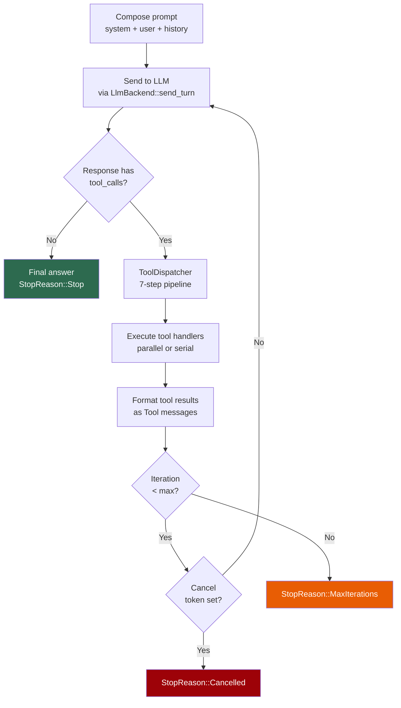
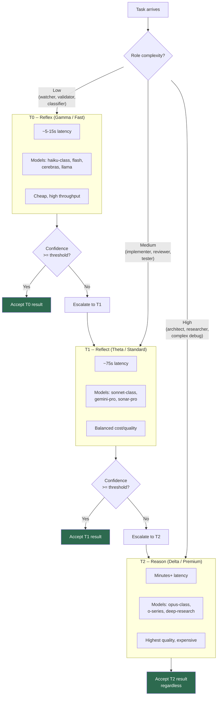
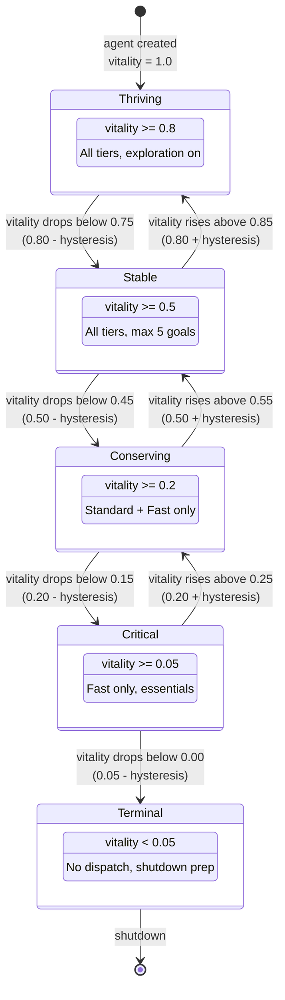

# 05 -- Agent System

> Agent = provider-backed LLM runtime + tool loop + safety layer + cognitive
> autonomy. The Agent trait is the bridge between Roko's deterministic kernel
> (12 traits, Signals, Cells) and the stochastic, side-effecting world of
> language models.

> **Implementation status (2026-09):** All 12 provider kinds are wired through
> `adapter_for_kind` with static adapters. The 7-step ToolDispatcher, ToolLoop,
> SafetyLayer, and MCP passthrough are live. E23 Cognitive Autonomy is COMPLETE
> (10/10 manifest): lifecycle type-state, five-phase VitalityTracker,
> CorticalState energy fields, energy/affect coupling, EFE routing, GoalTree,
> SlotManager, revisioned mode owners, and phase-aware runner dispatch are live.
> 28 AgentRole variants map to 11 compose templates. AgentPool/MultiAgentPool
> are built and tested but not runtime-instantiated by the Graph engine.

### Implementation sources

| Surface | Authority | Shipped boundary |
|---------|-----------|-----------------|
| Agent trait and AgentResult | `crates/roko-agent/src/agent.rs` | `Agent` trait (run, name, backend_id, supports_streaming), `AgentResult` |
| Provider factory | `crates/roko-agent/src/provider/mod.rs` | `create_agent_for_model`, `adapter_for_kind`, 12 static adapters |
| ProviderKind enum | `crates/roko-core/src/agent.rs` | 12 variants with serde aliases |
| Chat types | `crates/roko-core/src/chat_types.rs` | `ChatMessage`, `ChatResponse`, `ChatRequest`, `Usage`, `ToolChoice`, `ResponseMetadata` |
| ToolDispatcher | `crates/roko-agent/src/dispatcher/mod.rs` | 7-step pipeline, batch dispatch, ingress validation |
| ToolLoop | `crates/roko-agent/src/tool_loop/mod.rs` | Multi-turn driver, checkpoint/resume, context pruning |
| Safety layer | `crates/roko-agent/src/safety/mod.rs` | 6 policy families, contract enforcement |
| Agent roles | `crates/roko-core/src/agent.rs` | 28 `AgentRole` variants |
| Agent pools | `crates/roko-agent/src/pool.rs`, `multi_pool.rs` | `AgentPool`, `MultiAgentPool` |
| Lifecycle and slots | `crates/roko-agent/src/lifecycle.rs` | Type-state transitions, `SlotManager` |
| Vitality and phases | `crates/roko-daimon/src/lib.rs` | `VitalityTracker`, 5 `BehavioralPhase`s |
| CorticalState | `crates/roko-runtime/src/heartbeat.rs` | Atomic energy fields, affect coupling |
| GoalTree | `crates/roko-daimon/src/goals.rs` | Seed promotion, node lifecycle, pruning |
| MCP integration | `crates/roko-agent/src/process/mcp.rs` | Config discovery, launch normalization |

---

## 1. The Agent Trait

Roko's core architecture is built on 12 composable kernel traits that process
Signals. Those traits share four properties: they are synchronous, deterministic
(given fixed inputs), side-effect-free, and they process single Signals at a
time.

An **Agent** violates all four:

1. **Async execution** -- agents spawn subprocesses, call LLM APIs over HTTP,
   and await network responses.
2. **Side effects** -- agents edit files, run shell commands, and mutate the
   filesystem. The side effects are the point.
3. **Multiple signals** -- a single agent run produces a stream of intermediate
   signals (tool calls, diffs, status messages) before emitting final output.
4. **Non-deterministic** -- LLMs are stochastic; the same prompt produces
   different outputs on each run.

Rather than distort a kernel trait, `Agent` is its own capability extension
(Sumers et al., 2023, CoALA; arXiv:2309.02427).

```rust
// crates/roko-agent/src/agent.rs

pub trait Agent: Send + Sync {
    /// Run the agent against the input signal.
    async fn run(&self, input: &Signal, ctx: &Context) -> AgentResult;

    /// Human-readable name for logs/metrics.
    fn name(&self) -> &str;

    /// Stable backend identifier for audit and episode logging.
    fn backend_id(&self) -> &'static str { "unknown" }

    /// Does this agent emit a streaming trace or a single output?
    fn supports_streaming(&self) -> bool { false }
}
```

### AgentResult

```rust
pub struct AgentResult {
    pub output: Signal,          // Primary output (Kind::AgentOutput)
    pub trace: Vec<Signal>,      // Intermediate signals, chronological
    pub usage: Usage,            // Token counts, cost, duration
    pub success: bool,           // false on non-zero exit / connection error
}
```

Constructors: `AgentResult::ok(output)`, `AgentResult::fail(output)`,
`.with_trace(vec)`, `.with_usage(usage)`. The `all_engrams()` method returns
`trace` then `output` in chronological order for episode logging.

### Where the Agent sits in the kernel loop

In the universal loop -- query, score, route, compose, **act**, verify, write,
react -- the Agent occupies the **act** step. It is the bridge between the pure
kernel world and the impure, side-effecting real world.

---

## 2. Provider Registry

The provider registry is the config-driven layer that binds model names to
concrete API endpoints. Two TOML tables drive it:

- **`[providers.*]`** -- defines *where* to send requests (protocol, URL, auth)
- **`[models.*]`** -- defines *what* to send (model slug, capabilities, cost)

A model entry points at a provider via the `provider` field. At resolve time,
Roko looks up the model, finds the provider, determines the `ProviderKind`, and
uses the appropriate adapter to construct a configured `Box<dyn Agent>`.

### ProviderConfig

```rust
// crates/roko-core/src/config/schema.rs

pub struct ProviderConfig {
    pub kind: ProviderKind,                          // Protocol dispatch key
    pub base_url: Option<String>,                    // API endpoint root
    pub api_key_env: Option<String>,                 // Env var for API key
    pub command: Option<String>,                     // CLI binary name
    pub args: Option<Vec<String>>,                   // CLI default args
    pub timeout_ms: Option<u64>,                     // Per-request timeout
    pub extra_headers: Option<HashMap<String, String>>, // Injected headers
    pub max_concurrent: Option<u32>,                 // Concurrency limiter
}
```

API keys never appear in TOML. `resolve_api_key()` reads the named environment
variable at runtime.

### ModelProfile

```rust
pub struct ModelProfile {
    pub provider: String,              // Key into [providers.*]
    pub slug: String,                  // Model ID sent to the API
    pub context_window: u64,           // Token window (default: 128_000)
    pub max_output: Option<u64>,       // Output-token cap
    pub supports_tools: bool,          // Tool calling
    pub supports_thinking: bool,       // Reasoning output
    pub supports_vision: bool,         // Image inputs
    pub supports_web_search: bool,     // Built-in web search
    pub supports_search: bool,         // Grounded search (Perplexity)
    pub supports_citations: bool,      // Response citations
    pub tool_format: String,           // Wire format ("openai_json", "anthropic_blocks")
    pub cost_input_per_m: Option<f64>, // $/M input tokens
    pub cost_output_per_m: Option<f64>,// $/M output tokens
    // ... additional cost, tokenizer, async fields
}
```

### Provider dispatch flow



### Model resolution

`resolve_model` (in `roko-core/src/agent.rs`) bridges the config-driven and
heuristic worlds:

1. Try the config registry: `config.models.get(model_key)`.
2. Fall back to slug heuristic: `AgentBackend::from_model(model_key)`.

This two-phase resolution means bare model slugs like `"claude-opus-4-6"`
continue to work via heuristic, while `[providers.*]` and `[models.*]` entries
give full control.

### Provider health tracking

Provider health is tracked through `roko-learn`'s `ModelCallFeedbackRecorder`.
Each completed agent run records a feedback signal combining gate pass/fail,
token efficiency, latency, and cost. Unhealthy providers (repeated failures,
latency spikes) are filtered during learned routing by the CascadeRouter's
Pareto frontier computation and LinUCB bandit selection.

### Effective config merge

Merge priority (highest to lowest):

1. User-specified `[providers.*]` / `[models.*]`
2. Built-in model profiles from `profile_for_model()`
3. Slug-heuristic fallback

---

## 3. Provider Kinds

All 12 provider kinds are defined in the `ProviderKind` enum at
`crates/roko-core/src/agent.rs`. Each kind has a static adapter registered in
`adapter_for_kind()` at `crates/roko-agent/src/provider/mod.rs`.



### 3.1 AnthropicApi

| Field | Value |
|-------|-------|
| **Config key** | `kind = "anthropic_api"` |
| **Protocol** | Anthropic Messages API over HTTP |
| **Capabilities** | Tool calling, extended thinking, prompt caching (cache_read/cache_write tokens), vision, streaming |
| **Models** | claude-opus-4-6, claude-sonnet-4-6, claude-haiku-3-5, etc. |
| **Tool format** | `anthropic_blocks` (content blocks with `tool_use`/`tool_result` types) |
| **Config** | `base_url`, `api_key_env` (ANTHROPIC_API_KEY), `timeout_ms`, `max_concurrent` |
| **Limitations** | No built-in web search; vision requires `supports_vision = true` in profile |

### 3.2 ClaudeCli

| Field | Value |
|-------|-------|
| **Config key** | `kind = "claude_cli"` |
| **Protocol** | Stream-JSON subprocess (`claude` CLI binary) |
| **Capabilities** | Tool calling (internal tool loop), MCP passthrough (`--mcp-config`), `--system-prompt`/`--append-system-prompt`, `--allowedTools`, `--model`, `--permission-prompt-tool` |
| **Models** | All Anthropic models via `--model` flag |
| **Config** | `command` (default: `"claude"`), `args`, `timeout_ms` |
| **Limitations** | Drives its own internal tool loop; Roko's ToolDispatcher/SafetyLayer are bypassed (Claude CLI has its own safety). Cost reported natively. `bare_mode = true` replaces built-in prompt via `--system-prompt` |
| **Isolation** | Every Claude Code run Roko starts, plan tasks and `roko chat` included, passes `--add-dir <workdir>`, `--setting-sources ""` and `--strict-mcp-config` and sets `CLAUDE_CODE_DISABLE_AUTO_MEMORY=1` and `CLAUDE_CODE_ADDITIONAL_DIRECTORIES_CLAUDE_MD=1` (`ClaudeIsolation` in `claude_cli_agent.rs`). The user's own `~/.claude` settings, hooks, plugins, permission rules, CLAUDE.md files, auto-memory and MCP servers do not apply. The workdir's own `CLAUDE.md`, `.claude/CLAUDE.md` and `.claude/rules` do, and so does Roko's `--settings` (the guard hooks and key-file deny rules) |

### 3.3 CodexCli

| Field | Value |
|-------|-------|
| **Config key** | `kind = "codex_cli"` (aliases: `CodexCli`, `codex`) |
| **Protocol** | Subprocess (`codex exec --json`) |
| **Capabilities** | Tool calling via Codex internal loop, reasoning tokens (subset of output_tokens) |
| **Models** | OpenAI o-series, codex-mini, etc. |
| **Config** | `command` (default: `"codex"`), `args`, `timeout_ms` |
| **Limitations** | Drives own tool loop like ClaudeCli; Roko's dispatcher is bypassed |

### 3.4 OpenAiCompat

| Field | Value |
|-------|-------|
| **Config key** | `kind = "openai_compat"` (alias: `open_ai_compat`) |
| **Protocol** | OpenAI Chat Completions API (`/v1/chat/completions`) |
| **Capabilities** | Tool calling, streaming, reasoning_content parsing, image inputs (when profile `supports_vision = true`), provider routing (OpenRouter) |
| **Models** | Any model served via the OpenAI-compatible endpoint: GPT-5, DeepSeek, ZhipuAI GLM, Moonshot Kimi, OpenRouter, local models |
| **Tool format** | `openai_json` |
| **Config** | `base_url`, `api_key_env`, `extra_headers`, `timeout_ms`, `max_concurrent` |
| **Limitations** | Provider-specific extensions (e.g., OpenRouter's `provider_routing` field) are captured in `ModelProfile` capability flags and `ResponseMetadata.extra`, not separate adapters |

### 3.5 CursorAcp

| Field | Value |
|-------|-------|
| **Config key** | `kind = "cursor_acp"` |
| **Protocol** | Agent Client Protocol (JSON-RPC) |
| **Capabilities** | Mutation consent, experiments, Anthropic MCP parity, truthful capabilities, USD budgets, health-aware selection, sandboxing, worktree inspection. 180 ACP tests pass |
| **Models** | Any model available through Cursor's agent runtime |
| **Config** | `command` (e.g., `"cursor-agent"`), `timeout_ms` |
| **Limitations** | Definition-only MCP advertisements fail closed; ACP/serve experiment injection still needs canonical-section/receipt parity with runner |

### 3.6 CursorCli

| Field | Value |
|-------|-------|
| **Config key** | `kind = "cursor_cli"` |
| **Protocol** | ACP JSON-RPC over stdio subprocess |
| **Capabilities** | Same as CursorAcp, via subprocess transport |
| **Models** | Same as CursorAcp |
| **Config** | `command`, `args`, `timeout_ms` |
| **Limitations** | Subprocess variant; shares CursorAcp limitations |

### 3.7 PerplexityApi

| Field | Value |
|-------|-------|
| **Config key** | `kind = "perplexity_api"` |
| **Protocol** | Perplexity Sonar HTTP API (OpenAI-compatible base, Sonar extensions) |
| **Capabilities** | Grounded web search, citations, `search_context_size` control, async deep research (`supports_async = true`) |
| **Models** | sonar, sonar-pro, sonar-deep-research, sonar-reasoning, sonar-reasoning-pro |
| **Tool format** | `openai_json` |
| **Config** | `base_url` (default: `https://api.perplexity.ai`), `api_key_env` (PERPLEXITY_API_KEY), `timeout_ms` |
| **Limitations** | Per-request fee (`cost_per_request`) in addition to token-based pricing; search_context_size values: `"low"`, `"medium"`, `"high"` |

### 3.8 GeminiApi

| Field | Value |
|-------|-------|
| **Config key** | `kind = "gemini_api"` |
| **Protocol** | Google Gemini API (native REST) |
| **Capabilities** | Tool calling, vision, grounding, thinking, safety settings (forwarded from `config.gemini.safety_settings`) |
| **Models** | gemini-2.5-pro, gemini-2.5-flash, gemini-2.0-flash, etc. |
| **Config** | `base_url`, `api_key_env` (GEMINI_API_KEY or GOOGLE_API_KEY), `timeout_ms` |
| **Limitations** | Uses native Gemini API format, not OpenAI compat; safety settings are per-request configurable |

### 3.9 GeminiCli

| Field | Value |
|-------|-------|
| **Config key** | `kind = "gemini_cli"` |
| **Protocol** | `gemini` CLI subprocess with MCP |
| **Capabilities** | Native authenticated Gemini CLI MCP integration |
| **Models** | Same as GeminiApi |
| **Config** | `command` (default: `"gemini"`), `args`, `timeout_ms` |
| **Limitations** | Subprocess variant; requires local gemini CLI installation |

### 3.10 CerebrasApi

| Field | Value |
|-------|-------|
| **Config key** | `kind = "cerebras_api"` |
| **Protocol** | OpenAI-compatible HTTP (ultra-fast inference) |
| **Capabilities** | Tool calling, extremely low latency inference |
| **Models** | llama-3.3-70b, etc. via Cerebras Inference |
| **Config** | `base_url` (default: `https://api.cerebras.ai`), `api_key_env` (CEREBRAS_API_KEY), `timeout_ms` |
| **Limitations** | Model selection limited to Cerebras-hosted models; specialized adapter for Cerebras-specific response format |

### 3.11 Hermes

| Field | Value |
|-------|-------|
| **Config key** | `kind = "hermes"` (alias: `Hermes`) |
| **Protocol** | HTTP, CLI one-shot, or ACP |
| **Capabilities** | Gateway-style dispatch to Hermes-managed model fleet |
| **Models** | Any model available through the Hermes gateway |
| **Config** | `base_url` or `command`, `api_key_env`, `timeout_ms` |
| **Limitations** | Requires a running Hermes gateway instance |

### 3.12 OpenClaw

| Field | Value |
|-------|-------|
| **Config key** | `kind = "open_claw"` (aliases: `OpenClaw`, `openclaw`) |
| **Protocol** | CLI one-shot or ACP |
| **Capabilities** | OpenClaw inference runtime integration |
| **Models** | Models served by the OpenClaw runtime |
| **Config** | `command`, `args`, `timeout_ms` |
| **Limitations** | WIT/Component-model hostcalls and legacy adapter parity remain separate roadmap work |

### TOML configuration examples

```toml
[providers.anthropic]
kind = "anthropic_api"
base_url = "https://api.anthropic.com"
api_key_env = "ANTHROPIC_API_KEY"
timeout_ms = 120000
max_concurrent = 5

[providers.openrouter]
kind = "openai_compat"
base_url = "https://openrouter.ai/api/v1"
api_key_env = "OPENROUTER_API_KEY"
extra_headers = { "HTTP-Referer" = "https://roko.dev", "X-Title" = "Roko" }

[providers.perplexity]
kind = "perplexity_api"
base_url = "https://api.perplexity.ai"
api_key_env = "PERPLEXITY_API_KEY"

[providers.local-claude]
kind = "claude_cli"
command = "claude"
timeout_ms = 300000

[models.claude-opus]
provider = "anthropic"
slug = "claude-opus-4-6"
context_window = 200000
max_output = 32768
supports_tools = true
supports_thinking = true
supports_vision = true
tool_format = "anthropic_blocks"
cost_input_per_m = 15.00
cost_output_per_m = 75.00

[models.sonar-pro]
provider = "perplexity"
slug = "sonar-pro"
context_window = 200000
supports_tools = true
supports_search = true
supports_citations = true
tool_format = "openai_json"
cost_input_per_m = 3.00
cost_output_per_m = 15.00
cost_per_request = 0.005
search_context_size = "high"
```

---

## 4. Chat Types

Canonical message types shared across prompt assembly, tool loops, and provider
adapters live in `crates/roko-core/src/chat_types.rs`.

### ChatMessage

```rust
#[derive(Debug, Clone, PartialEq, Serialize, Deserialize)]
#[serde(tag = "role")]
pub enum ChatMessage {
    System { content: String },
    User { content: MessageContent },
    Assistant {
        content: Option<String>,
        reasoning_content: Option<String>,
        tool_calls: Option<Vec<ToolCallMessage>>,
        partial: bool,
    },
    Tool {
        tool_call_id: String,
        content: String,
    },
}
```

### MessageContent and ContentBlock

User content can be plain text or multimodal blocks:

```rust
pub enum MessageContent {
    Text(String),
    Blocks(Vec<ContentBlock>),
}

pub enum ContentBlock {
    Text { text: String },
    ImageUrl { image_url: ImageUrl },
}
```

Image data URIs are redacted in Debug output to prevent leaking sensitive image
bytes into logs.

### ChatResponse

Provider-agnostic response surface:

```rust
pub struct ChatResponse {
    pub content: String,
    pub reasoning: Option<String>,
    pub tool_calls: Vec<ToolCall>,
    pub usage: Usage,
    pub finish_reason: FinishReason,  // Stop | Length | ToolCalls | ContentFilter | Error
    pub metadata: ResponseMetadata,
    pub raw_assistant_message: Option<ChatMessage>,
    pub session: SessionState,
}
```

### Usage

```rust
pub struct Usage {
    pub input_tokens: u32,
    pub output_tokens: u32,
    pub cache_read_tokens: u32,
    pub cache_create_tokens: u32,
    pub reasoning_tokens: u32,   // o-series/Codex: subset of output_tokens
    pub cost_usd: f32,
    pub wall_ms: u64,
}
```

Cost computation: `fill_cost_from_pricing(input_per_m, output_per_m,
cache_read_per_m, cache_write_per_m)` is a no-op when cost is already set
(e.g., Claude CLI reports cost natively) or when pricing data is missing
(display shows "--").

### ChatRequest

```rust
pub struct ChatRequest {
    pub messages: Vec<ChatMessage>,
    pub model_slug: String,
    pub tools: Vec<ToolDef>,
    pub tool_choice: ToolChoice,  // Auto | None | Required | Specific { name }
    pub max_tokens: Option<u32>,
    pub temperature: Option<f64>,
    pub stream: bool,
    pub options: RequestOptions,
}
```

---

## 5. Agent Roles and Role-to-Template Mapping

28 `AgentRole` variants are defined at `crates/roko-core/src/agent.rs`. Each
role maps to a compose template (in `crates/roko-compose/src/templates/`) that
provides role-specific system prompt content through the 9-layer
`SystemPromptBuilder`.

### Role catalog

| Role | Description | Default tier |
|------|-------------|-------------|
| **Conductor** | Meta-orchestrator; watches agents, intervenes | Premium |
| **Strategist** | Writes plan briefs, decomposes PRDs into tasks | Standard |
| **Implementer** | Writes code (the main coding agent) | Standard |
| **Architect** | Reviews architecture before implementation | Premium |
| **Researcher** | Broad research reader (docs, code, external) | Standard |
| **Auditor** | Post-impl review for correctness and safety | Premium |
| **QuickReviewer** | Single-pass reviewer for Standard-complexity plans | Fast |
| **Scribe** | Drafts documentation | Standard |
| **Critic** | Devil's advocate / alternative-approach reviewer | Standard |
| **AutoFixer** | Lightweight patcher after gate failure | Fast |
| **Refactorer** | Structural rewrite without behavior change | Standard |
| **PrePlanner** | Validates pre-plan artifacts before enrichment | Fast |
| **DocVerifier** | Verifies docs still match code after edits | Fast |
| **IntegrationTester** | Runs integration-level tests against live system | Standard |
| **MergeResolver** | Resolves merge conflicts across workstreams | Standard |
| **TerminalValidator** | Tests CLI/terminal entry points end-to-end | Fast |
| **LifecycleTester** | Exercises agent lifecycle (spawn/tick/teardown) | Standard |
| **SpecDriftDetector** | Detects divergence between PRD and implementation | Fast |
| **RegressionDetector** | Watches for regression in test-pass rate and cost | Fast |
| **PerformanceSentinel** | Tracks performance metrics across runs | Fast |
| **CoverageTracker** | Tracks coverage/rung satisfaction | Fast |
| **PlanLifecycleManager** | Manages plan lifecycle state transitions | Standard |
| **CrossSystemTester** | Tests cross-system flows across runtime boundaries | Standard |
| **ErrorDiagnoser** | Diagnoses errors into actionable root causes | Standard |
| **DependencyValidator** | Validates dependency additions/upgrades | Fast |
| **PatternExtractor** | Extracts reusable patterns from completed work | Standard |
| **SnapshotComparator** | Compares snapshots across runs for drift | Fast |
| **FullLoopValidator** | Validates end-to-end pipeline | Premium |

`AgentRole::ALL_AGENTS` is a const array of all 27 working roles (everything
except `Conductor`, which is a meta-watcher). The 11 compose templates group
roles into behavioral families.

### Graduated autonomy by role

Roles implement graduated autonomy (Meta-Harness principle #5):

- **Read-only roles** (Conductor, QuickReviewer, Auditor family): can inspect
  and report but not modify.
- **Read-write roles** (Implementer, Refactorer, AutoFixer): full file
  operations within worktree boundaries.
- **Meta roles** (Conductor, Strategist): orchestrate but do not implement.

The SafetyLayer provides a floor that even high-autonomy roles cannot breach.

---

## 6. Agent Pools

Two pool types manage agent lifecycle and concurrency. Both are built and tested
but are not yet runtime-instantiated by the Graph engine.

### AgentPool

```rust
// crates/roko-agent/src/pool.rs

pub struct AgentPool {
    role: AgentRole,
    primary: Arc<dyn Agent>,
    fallback: Option<Arc<dyn Agent>>,
    pending: VecDeque<AgentTask>,
    statuses: Vec<(AgentInstanceId, InstanceStatus)>,
    completed: VecDeque<TaskOutcome>,
    active_task: Option<AgentInstanceId>,
}
```

A single-role pool with primary + optional fallback agent. Queues tasks, tracks
instance status, and drains completed outcomes.

### MultiAgentPool

```rust
// crates/roko-agent/src/multi_pool.rs

pub struct MultiAgentPool {
    active: HashMap<AgentInstanceId, ActiveEntry>,
    warm: HashMap<(AgentRole, String), WarmEntry>,
    fallbacks: HashMap<AgentRole, Arc<dyn Agent>>,
    concurrency_limits: HashMap<AgentRole, usize>,
    default_concurrency: usize,  // Default: 4
}
```

Multi-role pool with warm pre-spawned agents, per-role concurrency limits, and
fallback agents. The TUI `AgentPoolRow` in `tui/modals/agent_pool_modal.rs`
provides a scrollable view of all pool entries (role, model, task, tokens, cost,
state, context%).

---

## 7. MCP Integration

MCP (Model Context Protocol) integration operates at two levels:

### CLI passthrough

For CLI-based providers (ClaudeCli, CodexCli, GeminiCli), MCP config is passed
directly via `--mcp-config` flag. The config file at `.roko/mcp-config.json` is
authored solely by `PlanRunner::resolve_mcp_config_path` in
`roko-cli/src/runner/event_loop.rs`.

```rust
// crates/roko-agent/src/process/mcp.rs
pub fn normalize_mcp_launch(launch: McpLaunch, probe_root: &Path) -> McpLaunch;
```

The `normalize_mcp_launch` function resolves relative paths and validates the
MCP server configuration before launch.

### HTTP clients and resolvers

For HTTP-based providers, retained live MCP clients and resolvers handle
Anthropic/OpenAI/Gemini/Perplexity/Cerebras tool loops. The `McpRuntime` in
`crates/roko-agent/src/mcp.rs` manages client lifecycles.

Definition-only MCP advertisements (servers that declare tools but do not
provide execution endpoints) fail closed -- the ToolDispatcher will not
execute a tool call against a definition-only MCP server.

### Tool definitions

Roko ships 35 tool definitions by default (16 executable local + 19 GitHub
MCP); 52 total with typed optional-chain placeholders. The `roko-std` crate
(`crates/roko-std/`) provides the canonical built-in handlers. The dispatcher
resolves handlers through a `HandlerResolver` trait, keeping `roko-agent` free
of the `roko-std` dependency (see M19 in MISTAKES-LEARNED.md).

---

## 8. Tool Loop Protocol

The ToolLoop at `crates/roko-agent/src/tool_loop/mod.rs` is a fully
implemented, fully tested multi-turn tool-calling driver implementing the
**ReAct** pattern (Yao et al., 2023, arXiv:2210.03629, ICLR 2023).

### Core cycle

```
prompt --> LLM --> tool_calls? --> dispatch --> results --> LLM --> ...
```



### Stop conditions

1. **Stop** -- LLM returns a response with no tool calls (final answer).
2. **MaxIterations** -- iteration cap reached (default: 25).
3. **Cancelled** -- cancel token tripped between turns.
4. **BackendError** -- LLM returns an error.

### LlmBackend trait

```rust
pub trait LlmBackend: Send + Sync {
    async fn send_turn(
        &self,
        messages: &[serde_json::Value],
        tools: &RenderedTools,
    ) -> Result<BackendResponse, LlmError>;
}
```

Single request-response granularity. The ToolLoop calls `send_turn()` once per
iteration, inspects for tool calls via the Translator, dispatches through the
ToolDispatcher, formats results, and calls `send_turn()` again.

### Submodules

| Submodule | Purpose |
|-----------|---------|
| `max_iter` | Iteration cap enforcement |
| `prune` | Context-growth pruning (byte-based, keeps system + first user + recent tail) |
| `result_msg` | Tool-result message construction |
| `checkpoint` | Resumable state snapshots |

### Checkpoint and resume

```rust
pub struct Checkpoint {
    pub iterations: usize,
    pub tool_calls: Vec<ToolCall>,
    pub messages: Vec<serde_json::Value>,
}
```

Checkpoints capture full conversation state; `tool_loop.resume(checkpoint,
&tools, &ctx)` continues from where the loop stopped.

---

## 9. Dispatcher Architecture

The `ToolDispatcher` at `crates/roko-agent/src/dispatcher/mod.rs` processes
every tool call through a 7-step pipeline:

```
1. VALIDATE   -- identity + args against JSON schema from registry
2. AUTHORIZE  -- profile/task filters and role capabilities
3. SAFETY     -- hooks, policy, durable immune controls
4. EXECUTE    -- handler under timeout/cancellation, panic-catching
5. BOUND      -- recursively scrub, recover, re-bound results
6. SCREEN     -- finalized result through fixed immune Graph
7. FINALIZE   -- emit one sanitized terminal audit signal
```

### Batch dispatch

`dispatch_batch` groups calls by `ToolConcurrency`:

- **Parallel** tools (read_file, grep, glob) run through a bounded unordered
  stream via `join_all`.
- **Serial** tools (bash, write_file) run sequentially to preserve ordering and
  avoid write-write races.

### Limits

| Constant | Value | Purpose |
|----------|-------|---------|
| `MAX_TOOL_CALLS_PER_BATCH` | 16 | Per-turn call cap |
| `MAX_TOOL_CALL_INGRESS_BYTES` | 256 KB | Per-call size limit |
| `MAX_TOOL_CALL_FRAME_BYTES` | 1 MB | Per-frame size limit |
| `MAX_TOOL_BATCH_RESULT_BYTES` | 8 MB | Aggregate result payload cap |
| `DEFAULT_MAX_RESULT_BYTES` | (from roko-core) | Per-result truncation limit |

### Dispatcher submodules

| Module | Purpose |
|--------|---------|
| `alert` | Alert emission |
| `cancel` | Cancellation primitives |
| `dedup_cache` | Dispatch-level dedup for idempotent agent dispatch |
| `emit_metric` | Metric emission |
| `hook_chain` | Pre/post execution hook chains |
| `parallel` | Concurrency partitioning |
| `production_safety_chain` | Production safety hook chain |
| `result_cache` | Explicit cache primitives (dispatcher does NOT cache internally) |
| `timeout` | Timeout enforcement |
| `tool_selector` | Tool selection logic |
| `truncate` | Result truncation/bounding |
| `validate` | Input validation |

---

## 10. Harness Engineering

The central finding of harness engineering research is that the **harness** --
the scaffolding around an LLM (prompts, tools, context management, retry
logic) -- contributes more to agent performance than the model itself (Lee
et al., 2026; arXiv:2603.28052; HarnessX arXiv:2606.14249).

### Six harness principles and Roko's implementation

| Principle | Roko implementation |
|-----------|-------------------|
| **1. Design tools for the model** | `ToolDef` JSON schema + `Translator` layer ensures model-preferred wire format |
| **2. Right context, not more context** | 9-layer `SystemPromptBuilder` with targeted per-layer context |
| **3. Validate before executing** | 7-step ToolDispatcher validates schema/permissions/safety before handler execution |
| **4. Compress history intelligently** | `prune` submodule drops oldest tool results, preserves system + first user + error results |
| **5. Graduate autonomy** | Role-based permissions (read-only to read-write-exec), SafetyLayer floor |
| **6. Close the feedback loop** | EpisodeLogger, efficiency events, CascadeRouter persistence, adaptive gate thresholds |

### Benchmark evidence

| Benchmark | Harness impact | Source |
|-----------|---------------|--------|
| Text classification | +7.7 accuracy points (same model, better harness) | Lee et al., 2026 |
| IMO math | +4.7 points with structured tool access | Lee et al., 2026 |
| Token efficiency | 4x fewer tokens via context pruning | Lee et al., 2026 |
| SWE-bench mobile | 6x gap (harness vs. no harness, ref [46]) | Lee et al., 2026 |

The Harness-Bench benchmark (arXiv:2605.27922) provides standardized evaluation
of harness quality across agent systems. Belief Divergence (arXiv:2607.04528)
quantifies the gap between an agent's internal model and its expressed behavior,
providing a diagnostic for harness-model misalignment.

The Mechanism-Level Review of Language Agent Systems (arXiv:2607.23942) provides
the most comprehensive survey of agent architectures, cataloguing the specific
mechanisms that distinguish high-performing harnesses.

---

## 11. Dual-Process Routing (T0/T1/T2)

Roko's model routing is inspired by dual-process theory from cognitive science
(Kahneman, 2011, *Thinking, Fast and Slow*).

### Three cognitive speeds

| Speed | Tier | Latency | Examples |
|-------|------|---------|---------|
| **T0 (Gamma)** | Fast | ~5-15s | File read, classification, watchers, validators |
| **T1 (Theta)** | Standard | ~75s | Implementation, review, testing |
| **T2 (Delta)** | Premium | Hours | Architecture, research, complex debug |



### CascadeRouter

The CascadeRouter implements a multi-stage confidence cascade:

```
Task arrives
    |
    v
Stage 1: Try Fast model (System 1)
    |-- Confidence >= threshold --> Accept, done
    v
Stage 2: Try Standard model
    |-- Confidence >= threshold --> Accept, done
    v
Stage 3: Try Premium model (System 2)
    |-- Accept regardless
```

Confidence signals: gate results, self-assessment uncertainty markers, historical
success rate, cost-quality tradeoff. The LinUCB contextual bandit (Li et al.,
2010) selects models within each tier, balancing exploration with exploitation.

### Persistence

Routing state persists to `.roko/learn/cascade-router.json`. Decisions improve
across sessions.

### Active inference connection

The routing system is theoretically grounded in the Free Energy Principle
(Friston, 2006). The CascadeRouter's behavior minimizes expected free energy:
exploration (epistemic value) reduces uncertainty; exploitation (pragmatic
value) achieves objectives; the confidence threshold acts as a precision
parameter.

---

## 12. Safety Layer Overview

The `SafetyLayer` at `crates/roko-agent/src/safety/mod.rs` composes six policy
families. Full detail is in [12-SAFETY](12-SAFETY.md).

```rust
pub struct SafetyLayer {
    pub bash_policy: BashPolicy,       // Command allowlist/denylist
    pub git_policy: GitPolicy,         // Branch protection
    pub network_policy: NetworkPolicy, // Outbound destination allowlist
    pub path_policy: PathPolicy,       // Worktree escape prevention
    pub scrub_policy: ScrubPolicy,     // Secret scrubbing from outputs
    pub rate_limiter: Option<Arc<RateLimiter>>,
    pub role: String,
}
```

Pre-execution: `check_pre_execution` applies policies based on tool name.
Post-execution: `scrub_output` removes API keys, tokens, and secrets from tool
output before it enters conversation history.

The trust-origin IFC lattice, five-layer immune Graph, five-head corrigibility
ordering, and exact Cell x Graph x Space capabilities are documented in E34
(8/8 strict).

---

## 13. E23 Cognitive Autonomy (10/10)

The cognitive autonomy subsystem, complete at 10/10 manifest, gives agents
biologically-inspired lifecycle and energy dynamics. This draws on the Free
Energy Principle (Friston, 2006) and developmental maturation models (Gesell,
1916).

### VitalityTracker

```rust
// crates/roko-daimon/src/lib.rs

pub struct VitalityTracker {
    pub initial_budget: f64,       // Budget at lifecycle initialization
    pub remaining_budget: f64,     // Most recently observed remaining
    pub last_phase: BehavioralPhase,
    pub last_transition_at: DateTime<Utc>,
}
```

Vitality = `remaining_budget / initial_budget`. A 5-percentage-point hysteresis
band (`HYSTERESIS = 0.05`) prevents phase oscillation at boundaries.

### Five BehavioralPhases

```rust
pub enum BehavioralPhase {
    Thriving,   // vitality >= 0.8: all tiers, exploration available
    Stable,     // vitality >= 0.5: all tiers, max 5 active goals
    Conserving, // vitality >= 0.2: Standard + Fast only
    Critical,   // vitality >= 0.05: Fast only, essential tasks
    Terminal,   // vitality < 0.05: shutdown preparation
}
```

Phase transitions are hysteretic: an agent must cross the boundary plus the
hysteresis band before transitioning, preventing rapid oscillation.



### CorticalState

```rust
// crates/roko-runtime/src/heartbeat.rs

pub struct CorticalState {
    pleasure: AtomicU32,
    arousal: AtomicU32,
    dominance: AtomicU32,
    primary_emotion: AtomicU8,
    aggregate_accuracy: AtomicU32,
    accuracy_trend: AtomicI8,
    category_accuracies: [AtomicU32; 16],
    surprise_rate: AtomicU32,
    universe_size: AtomicU32,
    active_count: AtomicU16,
    pending_predictions: AtomicU32,
    creative_mode: AtomicU8,
    fragments_captured: AtomicU32,
    last_novel_prediction_tick: AtomicU64,
    regime: AtomicU8,
    gas_gwei: AtomicU32,
    resource_health: AtomicU32,
    knowledge_health: AtomicU32,
    performance_trend: AtomicU32,
    behavioral_state: AtomicU8,
}
```

All fields are atomic for lock-free concurrent access from tick producers and
consumers. The PAD (Pleasure-Arousal-Dominance) affect model uses f32 precision
at the boundary via `as f32` / `as f64` conversion.

### Energy/Affect Coupling

Cognitive energy depletion and recovery modulate affect state. Energy fields
in CorticalState track resource_health, performance_trend, and behavioral_state.
The coupling ensures that low energy produces conservation behavior (reduced
exploration, tier restrictions) while high energy enables creative exploration.

### EFE Routing

Expected Free Energy (Friston, 2006) drives routing decisions. The agent
selects actions that minimize the expected surprise between its internal model
and observed outcomes. This manifests as the CascadeRouter's confidence cascade:
high-confidence tasks route to cheap models (low EFE), uncertain tasks route to
expensive models (epistemic value justifies the cost).

### GoalTree

```rust
// crates/roko-daimon/src/goals.rs

pub struct GoalTree {
    seeds: Vec<GoalSeed>,                    // Awaiting promotion
    nodes: HashMap<String, GoalNode>,        // Active goals by ID
    min_observations: u64,                   // Promotion threshold
    min_score: f64,                          // Promotion score floor
    completion_threshold: f64,               // When a goal is done
    prune_threshold: f64,                    // When to discard
}
```

Goals emerge from repeated patterns in task outcomes. Seeds accumulate
observations and promote to active nodes when they cross thresholds. Active
nodes track progress toward completion and are pruned when they fall below
the prune threshold.

### SlotManager

```rust
// crates/roko-agent/src/lifecycle.rs

pub struct SlotManager {
    slots: BTreeMap<String, SlotState>,
    max_slots: usize,
}
```

Manages concurrent agent instances with a validated capacity. Slot names
must be unique; capacity must be non-zero. Revisioned mode owners ensure
that only one mode-change per slot is active at any time.

---

## 14. Verification Commands

```bash
# List all configured/running agents
cargo run -p roko-cli -- agent list

# Detailed health status for a specific agent
cargo run -p roko-cli -- agent status --name my-agent

# Start the per-agent HTTP sidecar
cargo run -p roko-cli -- agent serve

# Interactive chat with an agent
cargo run -p roko-cli -- agent chat --agent my-agent

# Check provider configuration health
cargo run -p roko-cli -- config providers health

# List available providers
cargo run -p roko-cli -- config providers list

# Test a specific provider
cargo run -p roko-cli -- config providers test

# Inspect model routing
cargo run -p roko-cli -- config models route

# Check workspace health
cargo run -p roko-cli -- doctor
```

---

## 15. Depth Files

| File | Topic |
|------|-------|
| `depth/05-00-agent-trait.md` | Agent trait design, AgentResult, actor model foundations |
| `depth/05-01-provider-registry.md` | Config-driven provider binding, TOML schema, model resolution |
| `depth/05-02-provider-adapters.md` | ProviderAdapter trait, adapter dispatch table, format translation |
| `depth/05-03-chat-types.md` | ChatMessage/ChatResponse/ChatRequest canonical types |
| `depth/05-04-agent-roles.md` | 28 roles, permissions, template mapping |
| `depth/05-05-agent-pools.md` | AgentPool, MultiAgentPool, warm pre-spawning |
| `depth/05-06-mcp-integration.md` | MCP config, CLI passthrough, HTTP clients/resolvers |
| `depth/05-07-tool-loop.md` | ToolLoop internals, LlmBackend trait, checkpoint/resume |
| `depth/05-08-harness-engineering.md` | Meta-Harness principles, HarnessX, Harness-Bench, Belief Divergence |
| `depth/05-09-format-translation.md` | Translator trait, tool_format wire formats |
| `depth/05-10-temperament-profiling.md` | Temperament (Conservative/Balanced/Exploratory) |
| `depth/05-11-dual-process-routing.md` | T0/T1/T2, CascadeRouter, LinUCB, Thompson sampling |
| `depth/05-12-extensibility.md` | Adding providers, agent composition patterns |
| `depth/05-13-creation-sites.md` | create_agent_for_model call sites |
| `depth/05-14-provider-integrations.md` | Provider-specific quirks and extensions |
| `depth/05-15-cognitive-autonomy.md` | E23 10/10: VitalityTracker, CorticalState, GoalTree |
| `depth/05-16-dispatcher-internals.md` | 7-step pipeline, batch dispatch, immune screening |
| `depth/05-17-safety-policies.md` | 6 policy families, contract enforcement, tool cooldown |

---

## 16. Citations

1. Sumers, T. R. et al. (2023). "Cognitive Architectures for Language Agents."
   arXiv:2309.02427. -- CoALA: theoretical basis for separating
   perception/reasoning from action execution.
2. Yao, S. et al. (2023). "ReAct: Synergizing Reasoning and Acting in
   Language Models." ICLR 2023. arXiv:2210.03629. -- ReAct pattern
   implemented by the ToolLoop.
3. Lee, S. Y. et al. (2026). "Meta-Harness: Harness Engineering for LLM
   Agents." arXiv:2603.28052. -- Harness quality as dominant performance
   factor.
4. Lee, S. Y. et al. (2026). "HarnessX." arXiv:2606.14249. -- Extended
   harness engineering framework.
5. arXiv:2605.27922. "Harness-Bench." -- Standardized harness quality
   evaluation.
6. arXiv:2607.04528. "Belief Divergence in Language Agent Systems." --
   Agent internal model vs. expressed behavior.
7. arXiv:2607.23942. "A Mechanism-Level Review of Language Agent Systems."
   -- Comprehensive survey of agent mechanisms.
8. Kahneman, D. (2011). *Thinking, Fast and Slow.* -- Dual-process theory
   grounding T0/T1/T2 routing.
9. Friston, K. (2006). "A free energy principle for the brain." Journal of
   Physiology - Paris. -- Free Energy Principle grounding EFE routing and
   active inference connection.
10. Gesell, A. (1916). *The Mental Growth of the Pre-School Child.* --
    Developmental maturation model informing BehavioralPhase progression.
11. Li, L. et al. (2010). "A contextual-bandit approach to personalized
    news article recommendation." WWW 2010. -- LinUCB algorithm used by
    CascadeRouter.
12. `crates/roko-agent/src/agent.rs` -- Agent trait and AgentResult source.
13. `crates/roko-agent/src/provider/mod.rs` -- Provider factory and adapter
    dispatch.
14. `crates/roko-agent/src/dispatcher/mod.rs` -- ToolDispatcher 7-step
    pipeline.
15. `crates/roko-agent/src/tool_loop/mod.rs` -- ToolLoop multi-turn driver.
16. `crates/roko-agent/src/safety/mod.rs` -- SafetyLayer, 6 policy families.
17. `crates/roko-core/src/agent.rs` -- ProviderKind, AgentRole enums.
18. `crates/roko-core/src/chat_types.rs` -- Canonical chat types.
19. `crates/roko-daimon/src/lib.rs` -- VitalityTracker, BehavioralPhase.
20. `crates/roko-daimon/src/goals.rs` -- GoalTree.
21. `crates/roko-runtime/src/heartbeat.rs` -- CorticalState.
22. `crates/roko-agent/src/lifecycle.rs` -- SlotManager, type-state
    lifecycle.
