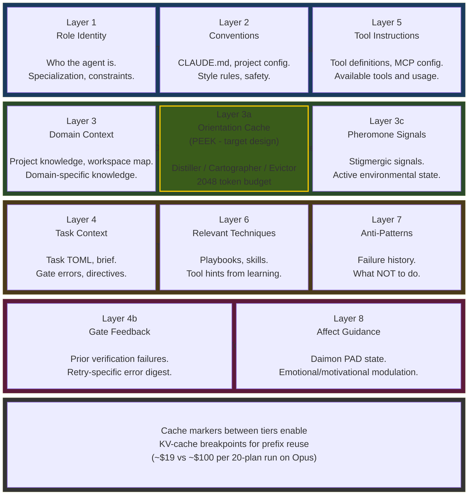
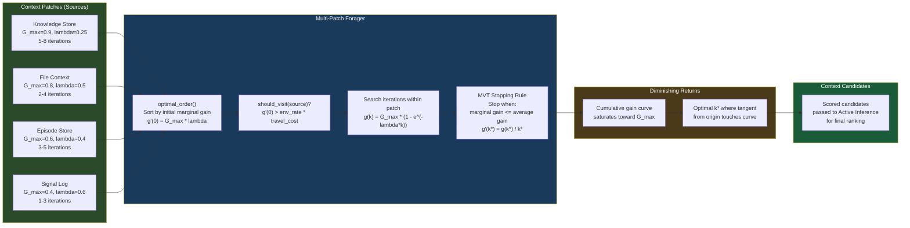
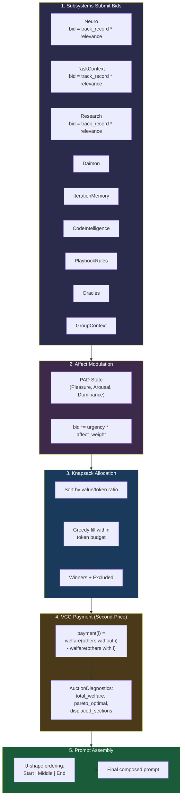
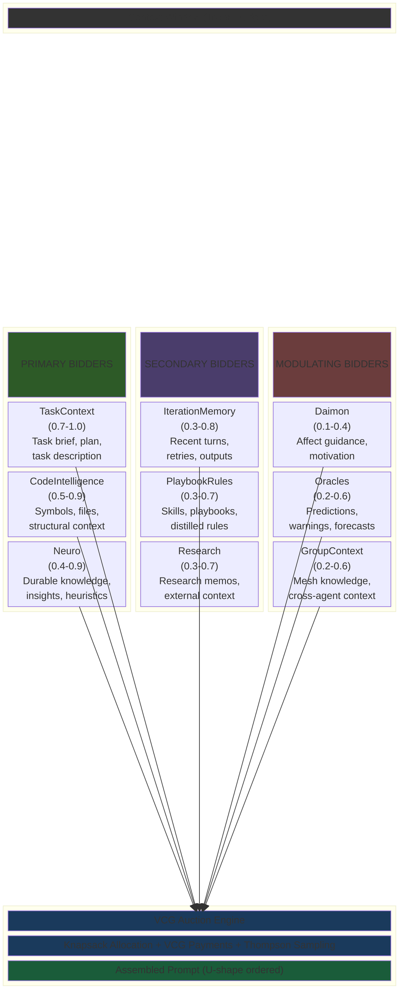

# 06 -- Composition

> The Composer assembles scored, budgeted context into a single coherent prompt.
> The SystemPromptBuilder stacks **10 layers** (9 implemented + orientation cache
> target). Role templates, enrichment artifacts, attention bidders, and a
> VCG-based auction cooperate to fill a scarce context window with the
> highest-value content, ordered for the U-shaped attention curve.

> **Implementation status (2026-09):** The Composer trait, PromptComposer,
> 9-layer SystemPromptBuilder (12+ tests), 11 role templates, 12-step
> enrichment pipeline, 9 AttentionBidder variants, VCG allocation with
> LearningBidder + Thompson sampling, SymbolResolver, cache alignment markers,
> affect-guided PAD modulation, complexity-adaptive budgets, and U-shape
> placement are implemented and shipping. The 10th layer (PEEK orientation
> cache) is target design. Full VCG payment diagnostics and active inference
> EFE scoring are designed but not yet wired.

### Implementation sources

| Surface | Authority | Shipped boundary |
|---------|-----------|-----------------|
| Composer trait | `crates/roko-core/src/traits.rs` | `Compose` trait: `fn compose(signals, budget, scorer, ctx) -> Signal` |
| PromptComposer | `crates/roko-compose/src/prompt.rs` | Greedy budget-fitting, U-shape placement, AttentionBidder enum, VCG auto-select, 18+ tests |
| SystemPromptBuilder | `crates/roko-compose/src/system_prompt_builder.rs` | 9 layers, cache alignment markers, PAD affect guidance, budget profiles, section-effectiveness learning |
| Role templates | `crates/roko-compose/src/templates/` | 11 templates: implementer, strategist, scribe, reviewer, conductor, researcher, refactorer, integration, quick, task_impl, common |
| Enrichment pipeline | `crates/roko-compose/src/enrichment/` | 12-step pipeline, staleness checking, TOML repair, continue-on-failure |
| VCG auction | `crates/roko-compose/src/auction.rs` | `vcg_allocate`, `LearningBidder`, `AuctionDiagnostics`, `FairnessConfig`, Pareto check |
| Symbol resolver | `crates/roko-compose/src/symbol_resolver.rs` | Workspace-rooted Rust symbol resolution, 7 SymbolKind variants |
| Context bidders | `crates/roko-compose/src/context_provider.rs`, `group_context_bidder.rs` | Neuro/Task/Research/Daimon/PlaybookRules/CodeIntelligence/IterationMemory/Oracles/GroupContext |
| Cost attribution | `crates/roko-compose/src/cost_attribution.rs` | Per-section token cost tracking |
| Budget system | `crates/roko-compose/src/templates/common.rs` | `PromptBudget`, `budget_for`, `adaptive_budget_for` |

---

## 1. The Composer Trait

The Composer is one of the 12 kernel traits. It defines the contract for assembling
scored, budgeted context into a single coherent prompt Signal:

```rust
pub trait Compose: Send + Sync {
    fn compose(
        &self,
        signals: &[Signal],
        budget: &Budget,
        scorer: &dyn Score,
        ctx: &Context,
    ) -> Result<Signal>;
}
```

The trait is synchronous, deterministic, and never performs I/O. Composers receive
pre-gathered candidates and assemble them under budget constraints. The `Budget`
struct constrains output across three dimensions:

```rust
pub struct Budget {
    pub max_tokens: usize,   // Hard cap on estimated token count (4K-24K typical)
    pub max_signals: usize,  // Maximum number of signals to include (10-50)
    pub max_bytes: usize,    // Byte-level cap for binary payloads (100KB-1MB)
}
```

Budget derivation follows context tiers:

| Context Tier | Token Budget | Model Class | Use Case |
|-------------|-------------|-------------|----------|
| Surgical | ~4,000 | Haiku, Ollama, local | Mechanical tasks |
| Focused | ~12,000 | Sonnet | Focused implementation |
| Full | ~24,000 | Opus | Architectural tasks |

The Composer accepts `&dyn Score` as a parameter rather than consuming pre-scored
signals. This enables re-scoring during assembly (an entry's marginal value depends
on what else is already included), scorer-as-strategy (different scorers produce
different compositions from the same candidates), and full testability through
mock scorers.

The Composer's position in the cognitive loop:

```
PERCEIVE (Store.query)
    -> REMEMBER (Score.score)
        -> ATTEND (Route.select)
            -> COMPOSE (Compose.compose)  <-- here
                -> ACT (Agent.execute)
                    -> VERIFY (Gate.verify)
```

---

## 2. SystemPromptBuilder -- 10-Layer Architecture

### Current state: 9 layers (implemented)

The SystemPromptBuilder constructs agent system prompts through a 9-layer
architecture that separates stable identity from volatile context. Each layer
targets a different cache-stability tier:

| Layer | Name | Cache Tier | Content Source | Purpose |
|-------|------|-----------|----------------|---------|
| 1 | Role Identity | System | `role_prompts.rs` | Who the agent is, what it specializes in |
| 2 | Conventions | System | CLAUDE.md / project config | Project patterns, style rules, safety constraints |
| 3 | Domain Context | Session | Project knowledge, workspace map | Domain-specific knowledge |
| 3c | Pheromone Signals | Session | Stigmergic signals | Active environmental signals |
| 4 | Task Context | Task | Task TOML, brief, gate errors | What the agent should do now |
| 4b | Gate Feedback | Dynamic | Prior verification failures | Retry-specific error digest |
| 5 | Tool Instructions | System | Tool definitions, MCP config | Available tools and usage |
| 6 | Relevant Techniques | Task | Playbooks, skills, tool hints | Learned techniques to prefer |
| 7 | Anti-Patterns | Task | Failure history | What NOT to do |
| 8 | Affect Guidance | Dynamic | Daimon PAD state | Emotional/motivational modulation |

Cache alignment markers between tiers enable the inference gateway to place
KV-cache breakpoints for maximum prefix reuse:

```xml
<!-- roko:layer:system -->
{Layer 1: Role Identity}
{Layer 2: Conventions}
{Layer 5: Tool Instructions}

<!-- roko:layer:session -->
{Layer 3: Domain Context}
{Layer 3c: Pheromone Signals}

<!-- roko:layer:task -->
{Layer 4: Task Context}
{Layer 6: Relevant Techniques}
{Layer 7: Anti-Patterns}

<!-- roko:layer:dynamic -->
{Layer 4b: Gate Feedback}
{Layer 8: Affect Guidance}
```

The builder emits normalized whitespace (trailing spaces stripped, tabs replaced,
`\r\n` normalized) and canonicalized tool ordering (`BTreeMap`, not `HashMap`)
to ensure byte-identical prefixes across requests.

### Target design: 10th layer -- Orientation Cache

**Design upgrade based on PEEK** (arXiv:2605.19932, May 2026).

Agents lose orientation over long sessions. The 9-layer builder provides
task-specific context but no persistent summary of accumulated knowledge.
The 10th layer adds a constant-token orientation cache maintained by three
cooperating modules:

| Module | Role | Mechanism |
|--------|------|-----------|
| **Distiller** | Extract transferable knowledge from inference signals | Identifies durable facts, patterns, and constraints from recent agent turns |
| **Cartographer** | Translate knowledge into structured map edits | Maintains a hierarchical map of workspace understanding, dependency graphs, and interface contracts |
| **Evictor** | Enforce fixed token budget via priority eviction | When the cache exceeds its budget, evicts lowest-priority entries using LRU-weighted relevance scoring |

The orientation cache occupies a fixed token allocation (configurable, default
2048 tokens) within the Session cache tier, placed between Domain Context (Layer 3)
and Pheromone Signals (Layer 3c). Its content persists across task iterations
within a plan execution, accumulating the agent's growing understanding of the
workspace.

**Evidence** (PEEK's own evaluation on long-context reasoning and aggregation benchmarks, not on plans): 93-145 fewer iterations and 1.7-5.8x lower cost than ACE (arXiv:2510.04618) (§4.3). The effect on Roko plans is untested. The cache
eliminates redundant re-discovery of workspace structure, type signatures, and
cross-crate dependencies that agents currently rediscover on every task.

Supporting research:

- **VISTA** (arXiv:2606.30005) validates the proprioceptive context dashboard
  pattern: agents with structured self-awareness of their state outperform those
  relying on raw context alone.
- **ECS** (arXiv:2601.11585) scores each candidate passage by how far it shifts the model's answer distribution toward the correct answer (§3); on turn-level context selection in LoCoMo it reaches F1 0.265, 71.8% above TF-IDF (abstract, §4.2). It measures selection quality, not downstream task performance.
- **Scroll** (arXiv:2608.21690) frames context as an executable environment
  rather than passive text, supporting the Cartographer's structured-map approach
  over flat summaries.

The 10-layer architecture after the upgrade:

| Layer | Name | Cache Tier | Status |
|-------|------|-----------|--------|
| 1 | Role Identity | System | Implemented |
| 2 | Conventions | System | Implemented |
| 3 | Domain Context | Session | Implemented |
| **3a** | **Orientation Cache** | **Session** | **Target design** |
| 3c | Pheromone Signals | Session | Implemented |
| 4 | Task Context | Task | Implemented |
| 4b | Gate Feedback | Dynamic | Implemented |
| 5 | Tool Instructions | System | Implemented |
| 6 | Relevant Techniques | Task | Implemented |
| 7 | Anti-Patterns | Task | Implemented |
| 8 | Affect Guidance | Dynamic | Implemented |



### Builder API

```rust
pub struct SystemPromptBuilder {
    role_identity: String,
    conventions: Option<String>,
    domain: Option<String>,
    context: Option<String>,
    pheromones: Vec<ContextChunk>,
    task: Option<String>,
    gate_feedback: Vec<String>,
    tools: Option<String>,
    relevant_skills: Vec<Skill>,
    relevant_playbooks: Vec<Playbook>,
    tool_hints: Option<String>,
    anti_patterns: Vec<String>,
    affect_state: Option<PadState>,
    temperament: Option<Temperament>,
    cache_markers: bool,
    token_budget: Option<usize>,
    budget_profile: Option<PromptBudget>,
    section_effectiveness: Option<SectionEffectivenessConfig>,
    model_hint: Option<String>,
}
```

The builder uses a fluent pattern:

```rust
let prompt = SystemPromptBuilder::new("You are an implementer...")
    .with_conventions("Use snake_case, thiserror for errors")
    .with_domain("DeFi protocol context: ...")
    .with_task("Implement the rate limiter in crates/roko-core")
    .with_tools("MCP tools available: Read, Write, Bash")
    .with_anti_patterns(vec!["Never call unwrap in library crates"])
    .build();
```

Both `build()` (flat string with cache markers) and `build_sections()` (structured
`Vec<PromptSection>` for budget fitting) are available. The `build_with_counter`
variant enforces a token budget via the `TokenCounter` abstraction.

### Cache alignment cost impact

For a typical 20-plan run with 80 agent spawns:

| Without cache alignment | With cache alignment |
|------------------------|---------------------|
| ~$100 on Opus (20M tokens) | ~$19 on Opus |
| Every request pays full price | 90% discount on prefix layers |

### Affect guidance

The Daimon's PAD (Pleasure-Arousal-Dominance) vector (Mehrabian 1996) modulates
Layer 8:

| Dimension | Threshold | Guidance |
|-----------|-----------|----------|
| High arousal (>= 0.35) | Time pressure | Focus on impact, avoid over-engineering |
| Low arousal (<= -0.35) | Exploration | Consider multiple approaches, read carefully |
| Low pleasure (<= -0.35) | Caution | Double-check work against acceptance criteria |

---

## 3. Role Templates

Eleven role templates specialize the system prompt for different agent functions.
Each receives a distinct identity, per-role token budget, and section emphasis:

| # | Role | Purpose | Default Model | Key Budget Emphasis |
|---|------|---------|---------------|---------------------|
| 1 | **Strategist** | Decompose tasks, plan execution order | Opus | Large workspace_map (20K), zero file_context |
| 2 | **Implementer** | Write code to implement changes | Sonnet | Largest file_context (8K), largest skills (8K) |
| 3 | **Architect** | Review implementation for quality | Sonnet | Moderate across all sections |
| 4 | **Auditor** | Security and correctness audit | Sonnet | Same as Architect, narrowly scoped |
| 5 | **QuickReviewer** | Fast-turnaround code review | Haiku | Minimal budgets, designed for low cost |
| 6 | **Scribe** | Technical documentation | Sonnet | Moderate budgets; the plan and brief carry the spec it cites |
| 7 | **Critic** | Devil's advocate, challenge assumptions | Sonnet | Emphasis on anti-patterns |
| 8 | **AutoFixer** | Mechanical compilation/lint fixes | Haiku | Minimal: error output + relevant file |
| 9 | **IntegrationTester** | Validate cross-crate interactions | Sonnet | Moderate workspace_map + file_context |
| 10 | **Refactorer** | Restructure code, preserve behavior | Sonnet | Large file_context + workspace_map |
| 11 | **Researcher** | Deep research with citations | Opus | Default budgets, moderate skills |
| 12 | **Conductor** | Coordinate multi-agent execution | Opus | Large plan visibility |

Template files: `crates/roko-compose/src/templates/{implementer,strategist,scribe,reviewer,conductor,researcher,refactorer,integration,quick,task_impl,common}.rs`

### Per-role token budgets

```rust
pub const fn budget_for(role: AgentRole) -> PromptBudget {
    match role {
        AgentRole::Implementer => PromptBudget {
            plan: 50_000, workspace_map: 20_000,
            context: 4_000, brief: 8_000, reviews: 3_000,
            instructions: 4_000, file_context: 8_000, skills: 8_000,
        },
        AgentRole::Strategist => PromptBudget {
            plan: 50_000, workspace_map: 20_000,
            context: 4_000, brief: 6_000, reviews: 3_000,
            instructions: 4_000, file_context: 0, skills: 4_000,
        },
        AgentRole::Scribe => PromptBudget {
            plan: 50_000, workspace_map: 6_000,
            context: 4_000, brief: 6_000, reviews: 3_000,
            instructions: 4_000, file_context: 6_000, skills: 4_000,
        },
        // Architect | Auditor: 6K workspace, 6K file_context
        // Default: 8K workspace, 6K file_context
    }
}
```

Key asymmetries: Implementer gets the most file_context (it writes code).
Strategist gets zero file_context (it plans, never codes). Implementer gets the
most skills (playbook rules directly prevent repeated mistakes).

### Complexity-adaptive budgets

Base budgets are adjusted by task complexity:

```rust
pub enum Complexity {
    Trivial,   // Two-line fix. Drop context and skills; halve workspace_map and brief.
    Standard,  // Base budgets unchanged.
    Complex,   // 50% more workspace_map, 100% more context, 50% more file_context.
}
```

### Shared stanzas

Three shared stanzas are reused across templates: `CONTEXT_LAYOUT_STANZA`
(where to find context files), `MCP_TOOLS_STANZA` (tool usage instructions),
and `NITS_FORMAT` (review output format).

---

## 4. Enrichment Pipeline -- 12 Steps

The enrichment pipeline pre-computes context artifacts before agent sessions
begin. Rather than having agents spend tokens discovering what they need, the
pipeline generates 12 typed artifacts using the cheapest appropriate model for
each step:

| # | Step | Output File | Default Model | Purpose |
|---|------|------------|---------------|---------|
| 1 | Briefs | `brief.md` | Sonnet | Generate What/Why/How task summaries |
| 2 | Tasks | `tasks.toml` | Sonnet | Generate task specifications |
| 3 | Decompose | `decomposition.md` | Sonnet | Step-by-step subtask breakdown |
| 4 | Research | `research.md` | Opus | Deep research with citations |
| 5 | Dependencies | `dependency-manifest.toml` | Haiku | External dependency list |
| 6 | Fixtures | `fixture-manifest.toml` | Haiku | Test fixture requirements |
| 7 | Integration | `integration.md` | Sonnet | Cross-crate integration notes |
| 8 | Verify | `verify.sh` | Haiku | Invariant verification script |
| 9 | Reviews | `review-tasks.toml` | Haiku | Review task assignments |
| 10 | Tests | `test-tasks.toml` | Haiku | Test task assignments |
| 11 | Invariants | `invariants.md` | Sonnet | Invariant specifications |
| 12 | Scribe | `scribe-tasks.toml` | Haiku | Documentation task assignments |

```mermaid
flowchart LR
  subgraph Cheap["Haiku Steps (low cost)"]
    direction TB
    S5["5. Dependencies\ndependency-manifest.toml"]
    S6["6. Fixtures\nfixture-manifest.toml"]
    S8["8. Verify\nverify.sh"]
    S9["9. Reviews\nreview-tasks.toml"]
    S10["10. Tests\ntest-tasks.toml"]
    S12["12. Scribe\nscribe-tasks.toml"]
  end

  subgraph Mid["Sonnet Steps (mid cost)"]
    direction TB
    S1["1. Briefs\nbrief.md"]
    S2["2. Tasks\ntasks.toml"]
    S3["3. Decompose\ndecomposition.md"]
    S7["7. Integration\nintegration.md"]
    S11["11. Invariants\ninvariants.md"]
  end

  subgraph Deep["Opus Steps (high cost)"]
    S4["4. Research\nresearch.md"]
  end

  S1 --> S2 --> S3 --> S4 --> S5 --> S6 --> S7 --> S8 --> S9 --> S10 --> S11 --> S12

  subgraph Controls["Pipeline Controls"]
    direction TB
    STALE["Staleness check\n(skip if < 24h old)"]
    REPAIR["TOML repair\n(one retry on parse error)"]
    CONT["Continue-on-failure\n(missing artifacts = absent sections)"]
  end

  subgraph Output["Enriched Context"]
    direction TB
    EP["execution-pack.md\n(Implementer)"]
    AP["architect-pack.md\n(Architect)"]
    SP["scribe-pack.md\n(Scribe)"]
    AUP["auditor-pack.md\n(Auditor)"]
  end

  S12 --> Output

  style Cheap fill:#2a4a2a,color:#fff
  style Mid fill:#1a3a5c,color:#fff
  style Deep fill:#5c1a3a,color:#fff
  style Controls fill:#3a3a3a,color:#fff
  style Output fill:#1a5c3a,color:#fff
```



### Pipeline semantics

- **Staleness checking**: outputs younger than `max_staleness` (default 24h)
  are skipped, preventing re-running expensive LLM calls on plan restart.
- **TOML repair**: steps producing TOML output get one repair retry -- the parse
  error is sent back to the LLM for correction. If repair also fails, the step
  is marked failed and the pipeline continues.
- **Continue-on-failure**: all 12 steps run regardless of individual failures.
  Missing artifacts are simply absent from the prompt; the PromptComposer's
  priority-based dropping handles this gracefully.
- **Step selection**: not every task needs all 12 steps. Trivial tasks run only
  Briefs. Complex tasks run all 12. Scribe tasks run Scribe + Research.

### Cost analysis

| Approach | Cost per plan | Agent success rate |
|----------|---------------|-------------------|
| No enrichment | $0 | ~45% |
| All 12 steps (Haiku/Sonnet mix) | ~$0.15 | ~78% |
| Manual context assembly | $0 (human time) | ~72% |

The $0.15 enrichment investment produces a ~33% improvement in agent success rate.
This embodies the Compound AI Systems paradigm (Zaharia et al., BAIR 2024):
"clever engineering > model scaling."

### Context injection by role

| Role | Primary pack | Additional files |
|------|-------------|-----------------|
| Implementer | `execution-pack.md` | `brief.md` |
| Architect | `architect-pack.md` | `review-tasks.toml`, `verify-tasks.toml` |
| Scribe | `scribe-pack.md` | `scribe-tasks.toml`, `research.md` |
| Auditor | `auditor-pack.md` | `verify-tasks.toml` |

### Gate output compression

**TACO** (arXiv:2604.19572) demonstrates self-evolving compression rules for
terminal output, directly applicable to compressing gate output injected into
Layer 4b. Rather than passing raw compiler/test output, TACO-style rules extract
the actionable signal (error type, location, suggested fix) while discarding
verbose context that wastes budget.

---

## 5. Token Budget Management

### Layer budget allocation

Each layer has a default budget share, adjustable by role:

| Layer | Default | Implementer | Strategist | Scribe |
|-------|---------|-------------|------------|--------|
| 1. Role Identity | 5% | 5% | 5% | 5% |
| 2. Conventions | 8% | 8% | 8% | 8% |
| 3. Domain Context | 12% | 15% | 15% | 8% |
| 3c. Pheromone Signals | 3% | 3% | 5% | 2% |
| 4. Task Context | 28% | 33% | 23% | 23% |
| 5. Tool Instructions | 12% | 12% | 12% | 12% |
| 6. Relevant Techniques | 5% | 3% | 7% | 5% |
| 7. Anti-Patterns | 7% | 4% | 10% | 7% |
| 8. Affect Guidance | 2% | 2% | 2% | 2% |
| *Reserve* | 10% | 3% | 8% | 20% |

### Truncation helpers

Two truncation strategies manage sections exceeding their budget:

- `truncate(content, max_chars)` -- truncate from end, preserving beginning.
  Used for workspace_map and file_context (headers/imports are most
  important).
- `truncate_tail(content, max_chars)` -- truncate from beginning, preserving
  end. Used for gate_errors (most recent errors are most relevant).

---

## 6. Lost-in-the-Middle: U-Shaped Attention Curve

Language models attend to information at the beginning and end of their context
far more effectively than information in the middle (Liu et al. 2023,
arXiv:2307.03172). For GPT-3.5-Turbo, accuracy with the answer in the middle fell below its closed-book accuracy of 56.1% (§1, §2.3).

```
Performance
    ^
    | ####                                        ####
    | ######                                    ######
    | ########                                ########
    | ##########                            ##########
    | ##############                    ##############
    | ####################        ####################
    | ####################################################
    +-------------------------------------------------------> Position
      Beginning      Middle positions        End
```

This is an **architectural property**, not a learned one. "Lost in the Middle at Birth" (arXiv:2603.10123, 2026) proved that the U-shaped bias is an algebraic
property of causal decoder architectures, present at initialization before any
training. Causal masking guarantees primacy; residual connections guarantee
recency. Positional encodings (RoPE, ALiBi) modulate the shape but cannot
eliminate the effect.

### Position attention model

```rust
pub struct PositionAttentionModel {
    pub primacy_weight: f64,   // default: 0.35
    pub primacy_decay: f64,    // default: 0.15
    pub recency_weight: f64,   // default: 0.30
    pub recency_decay: f64,    // default: 0.20
    pub baseline: f64,         // default: 0.35
}

impl PositionAttentionModel {
    /// Attention at normalized position [0, 1]:
    /// attention(pos) = primacy_weight * exp(-primacy_decay * pos)
    ///                + recency_weight * exp(-recency_decay * (1 - pos))
    ///                + baseline
    pub fn attention_at(&self, normalized_pos: f64) -> f64 {
        let primacy = self.primacy_weight * (-self.primacy_decay * normalized_pos).exp();
        let recency = self.recency_weight
            * (-self.recency_decay * (1.0 - normalized_pos)).exp();
        (primacy + recency + self.baseline).min(1.0)
    }

    pub fn effective_score(&self, base_score: f64, normalized_pos: f64) -> f64 {
        base_score * self.attention_at(normalized_pos)
    }
}
```

### Section-to-placement mapping

The `Placement` enum (Start/Middle/End) drives U-shape ordering:

| Section | Placement | Rationale |
|---------|-----------|-----------|
| Role identity | **Start** | Agent must know its identity first |
| Conventions | **Start** | Safety rules need primacy attention |
| Task description | **Start** | Core task at the beginning |
| Workspace map | **Middle** | Supporting context |
| Cross-plan context | **Middle** | Background information |
| Gate errors | **End** | Most recent failure needs recency |
| Anti-patterns | **End** | Prohibitions need recency attention |
| Affect guidance | **End** | Behavioral modulation near output |
| Constraints reminder | **End** | Devin's dual-position pattern |

Within each placement group, CacheLayer ordering is preserved for cache
stability. Critical-priority sections retain fixed placement regardless of
density scoring.

### Placement-adjusted scoring

```rust
pub fn placement_adjusted_score(base_score: f64, placement: Placement) -> f64 {
    match placement {
        Placement::Start  => base_score * 1.0,   // primacy zone: full value
        Placement::End    => base_score * 0.95,  // recency zone: ~95%
        Placement::Middle => base_score * 0.70,  // degradation zone: ~70%
    }
}
```

### Prompt quality assurance

**Arbiter** (arXiv:2603.08993) provides system prompt interference detection --
identifying when independently authored prompt sections conflict or create
contradictory instructions. This complements the Placement system by detecting
semantic conflicts that positional optimization cannot resolve.

---

## 7. Active Inference Context Selection

Active inference (Friston 2006, 2010, 2022) provides a principled answer to
"what should the scaffold include?" by decomposing context value into pragmatic
value (goal-seeking) and epistemic value (information gain):

```
G(section) = pragmatic_value + epistemic_value - ambiguity

Where:
  pragmatic_value = E[task_success | section_included]
                  - E[task_success | section_excluded]

  epistemic_value = D_KL(P(state | section) || P(state))
                  = information gain from including section

  ambiguity       = Var[task_success | section_included]
```

The selection policy uses a softmax with inverse temperature gamma:

```
P(include section_i) = softmax(gamma * G(section_i))
                     = exp(gamma * G_i) / Sum_j exp(gamma * G_j)
```

With gamma = 8.0 (from canonical spec). Higher gamma makes selection more
deterministic; lower gamma increases exploration.

### Behavior under uncertainty

When the agent is **uncertain** (few historical observations):
- Epistemic value dominates the EFE score
- The agent prioritizes context that fills knowledge gaps
- Even indirectly relevant context may be selected if it resolves uncertainty

When the agent is **confident** (many successful observations):
- Pragmatic value dominates
- The agent grabs highest-proven context for immediate application
- Epistemic context is deprioritized

No hyperparameters control this balance. It emerges from the mathematics of
expected free energy minimization.

### Scoring components

```
score = track_record(entry) * belief_change(entry) / uncertainty

Where:
  track_record  = conditional probability of success given inclusion [0, 1]
  belief_change = Bayesian surprise: D_KL(posterior || prior) [0, inf)
                  (approximated via HDC fingerprint novelty)
  uncertainty   = 1/(1 + episode_count/10) + recent_prediction_error [0.1, inf)
```

### Affect modulation of EFE

The Daimon's PAD state modulates active inference scoring:

| PAD State | Effect on EFE |
|-----------|--------------|
| High arousal (>= 0.35) | Increase pragmatic_value weight -- favor proven context |
| Low arousal (<= -0.35) | Increase epistemic_value weight -- favor novel context |
| Low pleasure (<= -0.35) | Increase weight on anti-knowledge and failure history |
| Low dominance | Favor explanatory context (agent seeks understanding) |
| High dominance | Favor directive context (agent acts autonomously) |

---

## 8. Predictive Foraging -- Marginal Value Theorem

Context assembly is an information foraging problem (Pirolli & Card 1999). The
Marginal Value Theorem (Charnov 1976) provides the optimal stopping rule.



### The MVT stopping rule

```
Stop when: relevance(last_result) / cost(last_search) <= total_gain / total_cost
```

When the marginal gain-to-cost ratio drops below the average gain-to-cost ratio,
further searching is suboptimal.

### Exponential gain curve

Context relevance follows diminishing returns:

```
g(k) = G_max * (1 - exp(-lambda * k))
```

Where:
- `g(k)` -- cumulative relevance gained after k search iterations
- `G_max` -- maximum achievable relevance (asymptotic limit)
- `lambda` -- rate parameter (how quickly the curve saturates)
- `k` -- number of search iterations

The marginal gain at step k:

```
g'(k) = G_max * lambda * exp(-lambda * k)
```

### Optimal stopping point

Setting marginal gain equal to average gain rate:

```
g'(k*) = g(k*) / k*

G_max * lambda * exp(-lambda * k*) = G_max * (1 - exp(-lambda * k*)) / k*
```

This transcendental equation has no closed-form solution but is easily solved
numerically. For typical values (G_max = 1.0, lambda = 0.3), the optimal
stopping point is k* ~ 5-8 iterations.

### Multi-patch foraging

The multi-source problem -- when to switch between knowledge store, episode store,
file context, and signal log:

```rust
pub struct MultiPatchForager {
    pub source_params: HashMap<ContextSource, (f64, f64)>,  // (G_max, lambda)
    pub travel_costs: HashMap<ContextSource, f64>,
    pub environment_rate: f64,
}

impl MultiPatchForager {
    /// Visit the source with highest expected marginal gain first.
    /// g'(0) = G_max * lambda
    pub fn optimal_order(&self) -> Vec<ContextSource> { /* sort by initial gain */ }

    /// Skip if first result's expected gain < environment_rate * travel_cost.
    pub fn should_visit(&self, source: &ContextSource) -> bool { /* ... */ }

    /// Solve: g'(k*) = environment_rate + travel_cost / k*
    pub fn optimal_iterations(&self, source: &ContextSource) -> usize { /* ... */ }
}
```

Per-source characteristics:

| Source | G_max | lambda | Travel Cost | Typical Iterations |
|--------|-------|--------|-------------|-------------------|
| Knowledge Store | 0.9 | 0.25 | Low | 5-8 |
| Episode Store | 0.6 | 0.4 | Low | 3-5 |
| File Context | 0.8 | 0.5 | Medium | 2-4 |
| Signal Log | 0.4 | 0.6 | Low | 1-3 |

### Complementarity with active inference

MVT and active inference are complementary:
- **Active inference** decides WHAT to include (scoring function)
- **MVT** decides WHEN to stop searching (stopping rule)

In the 5-stage pipeline: Stage 1 (Query) uses MVT to decide how many candidates
to retrieve; Stage 2 (Score) uses active inference to rank the retrieved candidates.

---

## 9. VCG Attention Auction

The VCG (Vickrey-Clarke-Groves) attention auction applies mechanism design to
allocating the scarce context window among competing cognitive subsystems.



### Origins

The mechanism combines three foundational results:

- **Vickrey (1961)**: In a second-price auction, the winner pays the
  second-highest bid. This incentivizes truthful bidding -- the optimal
  strategy is to bid true value regardless of others' bids.
- **Clarke (1971)**: Extended second-price auctions to multiple items. Each
  winner pays the externality their allocation imposes on others.
- **Groves (1973)**: Proved VCG is the unique mechanism achieving truthful
  bidding and efficient allocation simultaneously for quasi-linear utilities.

### Properties

| Property | Meaning for Context Allocation |
|----------|------------------------------|
| **Truthful** | Each subsystem's optimal strategy is to bid its true expected value |
| **Efficient** | The allocation maximizes total expected value |
| **Individually rational** | No subsystem is made worse off by participating |
| **Weakly budget balanced** | Total payments <= total welfare generated |

### The bid formula

```
bid(section) = expected_value * urgency * affect_weight

Where:
  expected_value = track_record(section) * relevance(section)
  urgency        = 1.0 + max(0, (deadline - now) / total_time_budget)^(-1)
  affect_weight  = daimon_modulation(section.type, current_pad_state)
```

### The nine bidding subsystems

| # | Subsystem | Bids For | Typical Bid Range |
|---|-----------|----------|-------------------|
| 1 | **Neuro** | Durable knowledge, insights, heuristics | 0.4-0.9 |
| 2 | **Daimon** | Affect guidance, motivational modulation | 0.1-0.4 |
| 3 | **IterationMemory** | Recent turns, retries, prior outputs | 0.3-0.8 |
| 4 | **CodeIntelligence** | Symbols, files, structural context | 0.5-0.9 |
| 5 | **PlaybookRules** | Skills, playbooks, distilled rules | 0.3-0.7 |
| 6 | **Research** | Research memos, external domain context | 0.3-0.7 |
| 7 | **TaskContext** | Task brief, plan, task description, directives | 0.7-1.0 |
| 8 | **Oracles** | Predictions, warnings, forecast outputs | 0.2-0.6 |
| 9 | **GroupContext** | Mesh knowledge, cross-agent context | 0.2-0.6 |

### Per-subsystem bid computation

Each subsystem computes its bid with affect modulation. The `subsystem_bias`
formula for each:

```rust
match section.bidder {
    AttentionBidder::Neuro => {
        1.0 + urgency * 0.12 * warningish
            + low_dominance * 0.18 * exploratory
            + low_pleasure * 0.28 * warningish
    }
    AttentionBidder::Daimon => {
        // Affect-modulated: higher when emotional state is extreme
    }
    AttentionBidder::IterationMemory => {
        1.0 + urgency * 0.14 * proven
            + low_dominance * 0.20 * exploratory
            + low_pleasure * 0.22 * conservative.max(proven)
    }
    AttentionBidder::Research => {
        1.0 + low_dominance * 0.30 * exploratory.max(1.0)
    }
    AttentionBidder::TaskContext => {
        1.0 + urgency * 0.18 * deadline.max(1.0)
    }
    AttentionBidder::Oracles => {
        1.0 + urgency * 0.22 * prediction.max(1.0)
    }
    AttentionBidder::GroupContext => {
        1.0 + urgency * 0.18 * warningish.max(deadline)
            + low_dominance * 0.18 * exploratory
    }
}
```

### VCG allocation rule

```
1. Collect bids from all 9 subsystems
   bids = {(section_i, value_i, tokens_i)} for i in 1..N

2. Find the allocation maximizing total value within budget
   optimal = maximize Sum value_i * x_i
             subject to Sum tokens_i * x_i <= budget
             x_i in {0, 1}

3. This is a 0/1 knapsack (NP-hard in general).
   For N < 50 candidates, the greedy approximation is sufficient.
   greedy_welfare >= 0.5 * optimal_welfare  (Dantzig 1957)
   In practice: typically >90% of optimal.
```

### VCG payment rule (second-price)

Each winning section pays the externality it imposes:

```
payment(section_i) = Sum_{j != i} value_j(optimal without i)
                   - Sum_{j != i} value_j(optimal with i)
```

Section i pays the difference between the total value others would get without i
and the total value others get with i. Payments are diagnostic -- they measure
"budget pressure" that manual priority tuning cannot.

### Strategic bidding via Thompson sampling

Each subsystem learns its bid value from historical outcomes:

```rust
pub struct LearningBidder {
    pub subsystem_id: SubsystemId,
    pub section_betas: HashMap<String, (f64, f64)>,  // Beta(alpha, beta)
    pub prior_bid: f64,
}

impl LearningBidder {
    /// Bid using Thompson sampling for natural exploration.
    pub fn bid(&self, section_name: &str, relevance: f64) -> f64 {
        let (alpha, beta) = self.section_betas
            .get(section_name)
            .copied()
            .unwrap_or((1.0, 1.0));  // Uniform prior
        let sampled_track_record = beta_sample(alpha, beta);
        sampled_track_record * relevance
    }

    /// Update after task outcome.
    pub fn update(&mut self, section_name: &str, was_included: bool, gate_passed: bool) {
        if was_included {
            let entry = self.section_betas
                .entry(section_name.to_string())
                .or_insert((1.0, 1.0));
            if gate_passed { entry.0 += 1.0; }  // alpha: success
            else { entry.1 += 1.0; }             // beta: failure
        }
    }
}
```

Convergence: ~50-100 tasks per subsystem to stabilize bids. The PromptComposer
auto-selects VCG mode when bidders have accumulated sufficient observations.

### Fairness and safety floor

The alpha-fairness family (Bertsimas et al.) unifies allocation criteria:

```
maximize Sum_i (allocation_i^(1-alpha)) / (1-alpha)

alpha = 0: Utilitarian (VCG) -- maximize total welfare
alpha = 1: Proportional fairness -- maximize geometric mean
alpha -> inf: Max-min fairness -- maximize the minimum
```

The recommended policy combines VCG efficiency with a max-min safety floor:

```rust
pub struct FairnessConfig {
    pub alpha: f64,                // 0.0 = pure efficiency (default)
    pub safety_floor_tokens: usize, // 200 (guaranteed minimum for safety)
}
```

1. Reserve `safety_floor_tokens` for the Safety subsystem (guaranteed minimum)
2. Run VCG auction on the remaining budget across all subsystems
3. Safety subsystem can bid for additional tokens beyond its floor

### Auction diagnostics

```rust
pub struct AuctionDiagnostics {
    pub total_welfare: f64,
    pub total_payments: f64,
    pub welfare_loss: f64,        // vs. optimal (exhaustive for N < 20)
    pub pareto_optimal: bool,
    pub highest_payment_sections: Vec<(String, f64)>,
    pub displaced_sections: Vec<(String, f64)>,
    pub budget_utilization: f64,  // tokens_used / tokens_available
}
```

### Collusion detection

```rust
pub fn detect_bid_correlation(
    bid_history: &[(SubsystemId, SubsystemId, Vec<(f64, f64)>)],
    threshold: f64,  // default: 0.85
) -> Vec<(SubsystemId, SubsystemId, f64)> {
    bid_history.iter()
        .filter_map(|(s1, s2, pairs)| {
            let correlation = pearson_correlation(pairs);
            if correlation > threshold { Some((*s1, *s2, correlation)) } else { None }
        })
        .collect()
}
```

### Price of Anarchy

```
PoA = welfare(socially optimal) / welfare(worst Nash equilibrium)
```

Under VCG with truthful bidding, PoA = 1. With greedy approximation, the
practical PoA for Roko's context allocation is estimated at < 1.1.

---

## 10. Symbol Resolution and Anti-Pattern Detection

### Symbol resolver

The `SymbolResolver` resolves symbol names to their definitions in the workspace,
enabling precise context injection:

```rust
pub struct SymbolResolver { /* workdir: PathBuf */ }

impl SymbolResolver {
    /// Resolve symbols: "TaskDef", "SystemPromptBuilder::new",
    /// or "task_parser::TaskDef"
    pub fn resolve_symbols(&self, names: &[String]) -> Vec<ResolvedSymbol>;
}

pub struct ResolvedSymbol {
    pub name: String,
    pub file: String,       // Relative to workdir
    pub line: usize,
    pub signature: String,  // Extracted definition
    pub kind: SymbolKind,   // Struct | Enum | Trait | Fn | TypeAlias | Const | Impl | Unknown
}
```

The resolver collects all `.rs` files under `crates/`, skipping `target/`, and
performs line-by-line pattern matching. Resolved symbols are injected into the
task context layer (Layer 4) to provide exact type signatures, reducing the
agent's need to discover them via file reads.

### Anti-pattern detection

Anti-patterns (Layer 7) are sourced from three channels:

1. **Episode history**: common mistakes extracted from past gate failures
2. **Anti-knowledge entries**: explicitly recorded "things that are wrong"
3. **Gate failure patterns**: recurring error patterns from similar tasks

Anti-patterns are placed at `Placement::End` (recency zone) to exploit the
U-shaped attention curve -- the model's last impression before generating is
"don't make these mistakes."

---

## 11. Context Bidders



Nine `AttentionBidder` variants represent the cognitive subsystems competing for
context window budget:

```rust
pub enum AttentionBidder {
    Neuro,             // Durable knowledge from neuro store
    Daimon,            // Affect/somatic guidance
    IterationMemory,   // Recent turns, retries, prior outputs
    CodeIntelligence,  // Symbols, files, structural context
    PlaybookRules,     // Skills, playbooks, distilled rules
    Research,          // Research memos, external domain context
    TaskContext,       // Task brief, plan, task description (default)
    Oracles,           // Predictions, warnings, forecasts
    GroupContext,       // Membership-scoped group knowledge
}
```

Each bidder tags its sections so the PromptComposer can compute per-subsystem
budget allocation, VCG payments, and diagnostic metrics. The three primary
bidders for task execution are:

- **Neuro**: queries the durable knowledge store for insights matching the
  current task. High-value when the agent is working in a domain with accumulated
  knowledge. Modulated by low_pleasure (boost warnings) and low_dominance
  (boost exploratory knowledge).

- **TaskContext**: provides the task brief, plan content, task description, and
  verification criteria. Always the highest-priority bidder -- task context is
  Critical priority and never dropped. Modulated by urgency and deadline signals.

- **Research**: injects research memos and external domain context. Highest value
  for novel domains or complex integration tasks. Modulated by low_dominance
  (agent seeks understanding before acting).

---

## 12. Academic Foundations

### Context engineering

**Friston, K. (2006, 2010, 2022), The Free Energy Principle.** All
self-organizing systems minimize variational free energy. Active inference
extends this to agents: they act to minimize expected free energy, naturally
balancing goal-seeking (pragmatic value) and information-seeking (epistemic
value). The exploration/exploitation tradeoff emerges from the mathematics.

**Liu, Lin, Hewitt, Paranjape, Bevilacqua, Petroni, and Liang (2023),
"Lost in the Middle: How Language Models Use Long Contexts."** TACL 2024,
arXiv:2307.03172. The foundational paper on the U-shaped performance curve (§2.3).

**"Lost in the Middle at Birth"** (arXiv:2603.10123, 2025). Proved the U-shaped
bias is an algebraic property of causal decoder architectures.

**Charnov, E. L. (1976), "Optimal Foraging: The Marginal Value Theorem."**
Theoretical Population Biology, 9(2), 129-136.

**Pirolli, P. & Card, S. K. (1999), "Information Foraging."** Psychological
Review, 106(4), 643-675.

### Mechanism design

**Vickrey, W. (1961), "Counterspeculation, Auctions, and Competitive Sealed
Tenders."** Journal of Finance, 16(1), 8-37.

**Clarke, E. H. (1971), "Multipart Pricing of Public Goods."** Public Choice,
11(1), 17-33.

**Groves, T. (1973), "Incentives in Teams."** Econometrica, 41(4), 617-631.

**Duetting, Mirrokni, Paes Leme, Xu, Zuo (2024), "Mechanism Design for Large
Language Models."** WWW 2024 Best Paper, arXiv:2310.10826.

### Composition and context

**PEEK** (arXiv:2605.19932, May 2026). Orientation cache with
Distiller/Cartographer/Evictor modules. 93-145 fewer iterations, 1.7-5.8x lower
cost vs. ACE.

**ACE** (arXiv:2510.04618). Baseline autonomous context engineering agent.

**VISTA** (arXiv:2606.30005). Proprioceptive context dashboard pattern.

**ECS** (arXiv:2601.11585). Entropic context shaping -- active management of
context window information density.

**Scroll** (arXiv:2608.21690). Context as executable environment.

**Arbiter** (arXiv:2603.08993). System prompt interference detection.

**TACO** (arXiv:2604.19572). Self-evolving compression rules for terminal output.

### Prompt and RAG

**Compound AI Systems** (Zaharia et al., BAIR 2024). State-of-the-art results
from composing components, not single model calls.

**CoALA** (Sumers et al. 2023). Cognitive Architectures for Language Agents.
Working memory assembly phase maps to the Composer.

**DSPy** (Khattab et al. 2023). Programmatic prompt optimization with typed
module signatures.

**Self-RAG** (Asai et al. 2023). Adaptive retrieval with reflection tokens.

**Modular RAG** (Gao et al. 2023). Composable retrieval/generation modules.

### Cognitive foraging

**Hills, Todd, Lazer, Redish, Couzin (2015).** "Exploration Versus Exploitation
in Space, Mind, and Society." Trends in Cognitive Sciences.

**Lacosse et al. (2026).** LLMs exhibit human-like foraging patterns.
arXiv:2603.01822.

**Itti & Baldi (2005), "Bayesian Surprise."** NeurIPS. KL divergence between
posterior and prior beliefs.

**Mehrabian (1996), PAD Model.** Three-dimensional emotional space for affect
modulation.

---

## 13. Verification Commands

```bash
# Composer and prompt tests
cargo test -p roko-compose -- prompt
cargo test -p roko-compose -- system_prompt_builder
cargo test -p roko-compose -- auction
cargo test -p roko-compose -- symbol_resolver
cargo test -p roko-compose -- enrichment
cargo test -p roko-compose -- templates
cargo test -p roko-compose -- cost_attribution

# Full compose crate
cargo test -p roko-compose

# Check prompt assembly wiring
cargo run -p roko-cli -- doctor

# Inspect budget allocation
cargo run -p roko-cli -- show agents

# Lint composition code
cargo clippy -p roko-compose --no-deps -- -D warnings
```

---

## Depth Files

Detailed treatments of each subsystem are in `docs/v3/depth/06-composition/`:

| File | Topic |
|------|-------|
| `01-composer-trait.md` | Compose trait signature, Budget struct, scorer-in-signature rationale |
| `02-system-prompt-builder.md` | 10-layer architecture, builder API, cache alignment, PEEK orientation cache |
| `03-role-templates.md` | 11 role templates, PromptBudget, complexity-adaptive budgets |
| `04-enrichment-pipeline.md` | 12-step pipeline, staleness, TOML repair, continue-on-failure |
| `05-token-budget-management.md` | Per-layer allocation, truncation, compression strategies |
| `06-u-shape-attention.md` | Lost-in-the-middle, Placement enum, position-aware scoring, attention sinks |
| `07-active-inference.md` | EFE formula, track record, belief change, softmax selection |
| `08-predictive-foraging.md` | MVT stopping rule, exponential gain curve, multi-patch foraging |
| `09-vcg-auction.md` | VCG mechanism, 9 bidders, payment rule, Thompson sampling, fairness |
| `10-symbol-resolution.md` | SymbolResolver, anti-pattern detection, SymbolKind variants |
| `11-context-bidders.md` | AttentionBidder enum, per-subsystem modulation, group context |
| `12-affect-modulated-retrieval.md` | PAD-driven retrieval modulation, Daimon integration |
| `13-distributed-context.md` | Social foraging, stigmergic signals, cross-agent context |
| `14-orientation-cache.md` | PEEK Distiller/Cartographer/Evictor, VISTA/ECS/Scroll integration |

---

## Cross-References

| Chapter | Relationship |
|---------|-------------|
| [01-SIGNAL](01-SIGNAL.md) | Signal is the unit of composition input and output |
| [02-CELL](02-CELL.md) | Graph cells produce context sections for the builder |
| [03-GRAPH](03-GRAPH.md) | Graph engine invokes composition for each agent dispatch |
| 05-AGENT | Agent receives the composed prompt; provider dispatch |
| 07-GATES | Gate outcomes feed back into track_record and active inference |
| 08-LEARNING | Playbooks, experiments, and efficiency events inform bidders |
| 09-MEMORY | Neuro knowledge store is the primary Neuro bidder source |
| 10-DREAMS | Dream consolidation updates the knowledge entries that Neuro bids for |
| 11-AFFECT | Daimon PAD state modulates Layer 8 and VCG bid weights |
| 12-SAFETY | Safety system has a guaranteed floor in VCG + safety constraints at both edges |
