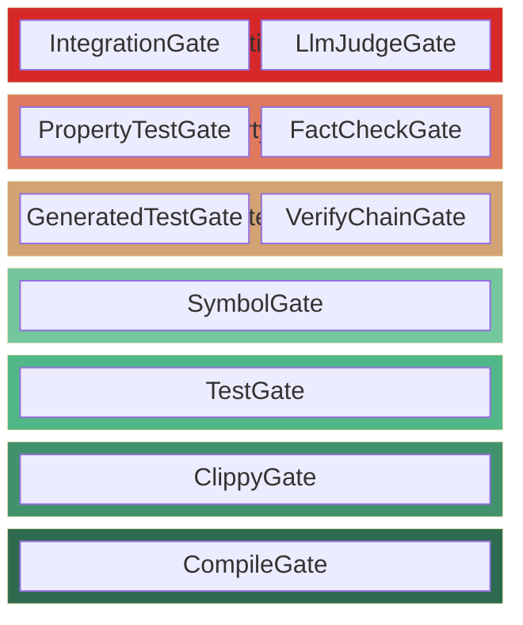
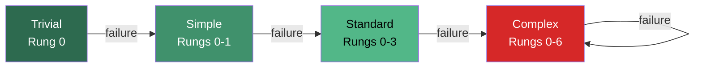
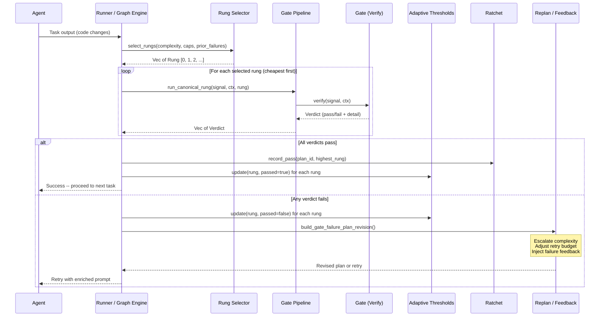
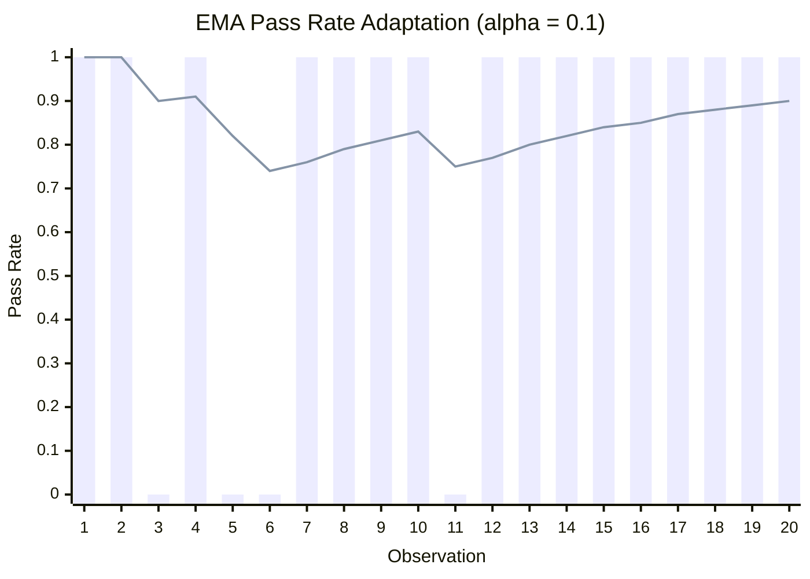
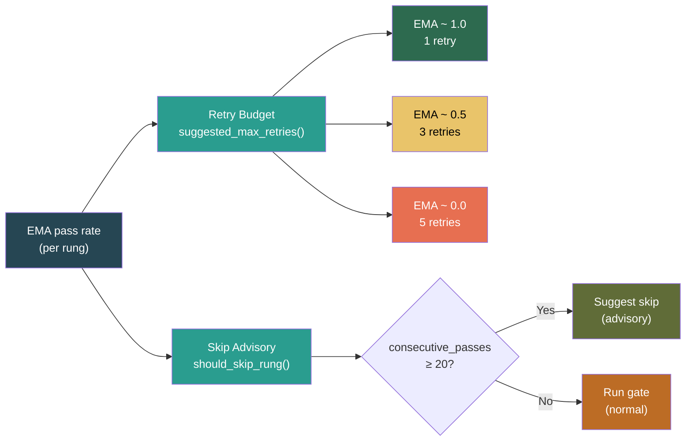
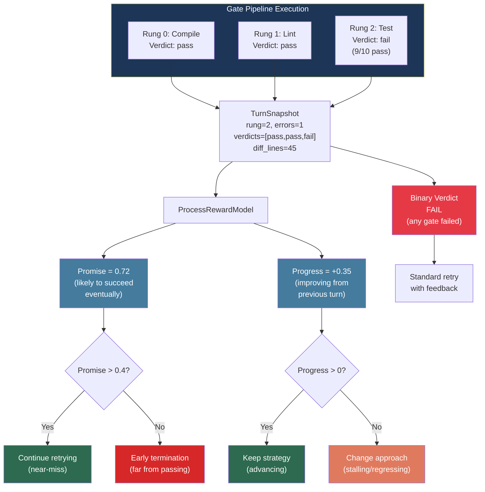
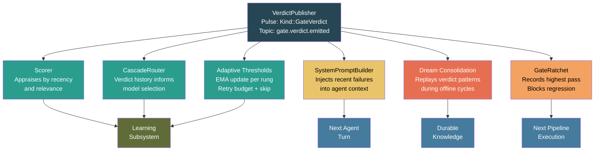

# 07 -- Gates and Verification

> Every agent output passes through gates before it becomes truth. Gates
> are deterministic oracles: compilers, test runners, linters, symbol
> checkers. They return **Verdicts**, not Results. A gate failure is
> knowledge, not an error.

> **Implementation status (corrected 2026-09-29 at `7c556bc0a`):** 19 concrete
> gate implementations ship in `crates/roko-gate/src/`, together with the 7-rung
> pipeline, adaptive EMA thresholds, ratchet, artifact store, agent feedback filter,
> forensic replay, verdict publisher, SPC detectors (CUSUM/EWMA/BOCPD), PELT offline
> analysis, Hotelling T-squared multi-gate detection, gate composition wrappers
> (Parallel/Voting/Fallback), the production gate service and the graph cell. Plan runs
> use little of this. A Graph plan task runs only its authored `verify` commands, each
> through `ShellGate`, sequentially and fail-fast
> (`GraphTaskDispatcher::settle_task_verification` in
> `crates/roko-cli/src/graph_task_dispatch.rs`); a task with no `verify` steps settles as
> `Unverified`. `run_gate_once` (`crates/roko-cli/src/runner/gate_dispatch.rs`) is reached
> only from tests, through `spawn_gate`, and nothing outside `roko-gate` constructs
> `GatePipelineCell`. Graph runs do update each rung's pass-rate EMA after every task, and
> the EMA sets the retry budget of tasks that don't author `max_retries`
> (`crates/roko-cli/src/graph_task_dispatch/retry_budget.rs`). Process reward models,
> continuous progress scoring, and the full evaluation lifecycle remain target design.

### Implementation sources

| Surface | Authority | Shipped boundary |
|---------|-----------|-----------------|
| Gate trait (Verify protocol) | `crates/roko-core/src/traits.rs` | `verify(&self, signal: &Signal, ctx: &Context) -> Verdict` |
| 19 gate implementations | `crates/roko-gate/src/` | All 19 concrete gates plus 3 composition wrappers |
| 7-rung selector | `crates/roko-gate/src/rung_selector.rs` | `Rung` enum (0-6), `PlanComplexity`, `select_rungs()` |
| Rung dispatch | `crates/roko-gate/src/rung_dispatch.rs` | `run_rung()`, `run_canonical_rung()`, `GatePipelineBuilder` |
| Gate pipeline | `crates/roko-gate/src/gate_pipeline.rs` | `GatePipeline`, `ComposedGatePipeline`, `GateComposition` |
| Adaptive thresholds | `crates/roko-gate/src/adaptive_threshold.rs` | EMA update, retry budget, skip advisory, persistence |
| Ratchet | `crates/roko-gate/src/ratchet.rs` | `GateRatchet`, monotonic pass tracking |
| Artifact store | `crates/roko-gate/src/artifact_store.rs` | BLAKE3 content-addressed, append-only |
| Agent feedback | `crates/roko-gate/src/feedback.rs` | `feedback_for_agent()`, severity classification |
| Forensic replay | `crates/roko-gate/src/forensic.rs` | `ForensicReplayBuilder`, `CausalChain`, `TurnRecord` |
| SPC detectors | `crates/roko-gate/src/spc.rs` | `CusumDetector`, `EwmaControlChart`, `BocpdDetector` |
| Hotelling T-squared | `crates/roko-gate/src/hotelling.rs` | `HotellingDetector`, `JointAnomalyResult` |
| PELT offline | `crates/roko-gate/src/pelt.rs` | Offline change-point detection |
| Process rewards | `crates/roko-gate/src/process_reward.rs` | `ProcessRewardModel`, `StepVerdict`, `TurnSnapshot` |
| Verdict publisher | `crates/roko-gate/src/verdict_publisher.rs` | `VerdictPublisher` |
| Production service | `crates/roko-gate/src/production_service.rs` | `ProductionGateService`, `DefaultGateService` |
| Graph cell | `crates/roko-gate/src/graph_cell.rs` | `GatePipelineCell` (#250) |
| Runner gate dispatch | `crates/roko-cli/src/runner/gate_dispatch.rs` | `GateTaskContext`, rung inputs, verify-step wiring |

---

## 1. The Verify Protocol

The `Gate` trait is deliberately minimal -- two methods, no error return type:

```rust
pub trait Gate: Send + Sync {
    /// Verify the Signal and return a verdict.
    async fn verify(&self, signal: &Signal, ctx: &Context) -> Verdict;

    /// Human-readable name (appears in verdicts).
    fn name(&self) -> &str;
}
```

### 1.1 Verdict, Not Result

This is the single most important design decision in the gate system.
`verify()` returns `Verdict`, not `Result<Verdict>`.

**Gate failure is a verdict, not an error.**

When `cargo check` reports a compilation error, that is not infrastructure
failure -- it is ground truth. The gate encodes the outcome into
`Verdict::fail()` with a reason string and optional error digest. The caller
never handles two failure paths; there is only one: the verdict.

- A gate that cannot spawn its subprocess returns `Verdict::fail("spawn failed: ...")`
- A gate that times out returns `Verdict::fail("timed out after N ms")`
- A gate with malformed input returns `Verdict::fail("signal body is not a GatePayload: ...")`
- A gate whose test suite has 3 failures returns `Verdict::fail("test foo::bar ... FAILED; ...")`

All four are verdicts. The pipeline, ratchet, adaptive thresholds, and feedback
systems never pattern-match on `Result::Err`.

### 1.2 The Verdict Type

```rust
pub struct Verdict {
    pub passed: bool,                    // Did the gate pass?
    pub gate: String,                    // Name of the gate
    pub reason: String,                  // Human-readable explanation
    pub detail: Option<String>,          // Full output for debugging
    pub error_digest: Option<String>,    // Machine-parseable error summary
    pub duration_ms: u64,                // Wall-clock time
    pub test_count: Option<TestCount>,   // Parsed test counts
}
```

Construction patterns:

```rust
// Passing verdict
Verdict::pass(&self.name)
    .with_detail(combined_output)
    .with_duration(elapsed_ms)

// Failing verdict with reason
Verdict::fail(&self.name, reason_string)
    .with_detail(combined_output)
    .with_duration(elapsed_ms)

// Test gate attaches parsed counts
verdict.with_test_count(TestCount::new(passed, failed, ignored))
```

### 1.3 The Gate Contract

Every gate implementation must satisfy four invariants:

1. **Total function.** `verify()` always returns a `Verdict`. It never panics,
   never returns `Err`, never hangs. Every gate enforces a timeout via
   `tokio::time::timeout` and converts expiration into `Verdict::fail()`.

2. **Deterministic on identical inputs.** Given the same signal body and
   filesystem state, a gate produces the same verdict. Gates do not use
   randomness. (`LlmJudgeGate` is the deliberate exception, with its own
   reproducibility constraints.)

3. **Side-effect free on source.** Gates read the filesystem and run
   subprocesses, but never modify the source code being verified. Artifacts
   go into `CARGO_TARGET_DIR` or the `ArtifactStore`, not the source tree.

4. **Duration tracking.** Every verdict carries `duration_ms`. This feeds
   adaptive threshold retry budgets and per-gate timing telemetry.

---

## 2. The 19 Gate Implementations

Roko ships 19 concrete gate implementations. They divide into rung-dispatched
gates (13 gates across 7 rungs) and standalone gates (6 gates invoked outside
the rung pipeline).

### 2.1 Rung-Dispatched Gates (7 Rungs)

| Rung | Index | Gate(s) | Cost | What it verifies |
|------|-------|---------|------|------------------|
| Compile | 0 | `CompileGate` | Low | Code compiles (`cargo check`, `npm run build`, `go build`) |
| Lint | 1 | `ClippyGate` | Low | No lint violations (`cargo clippy -- -D warnings`, `go vet`) |
| Test | 2 | `TestGate` | Medium | Tests pass, with parsed pass/fail/ignored counts |
| Symbol | 3 | `SymbolGate` | Near-zero | Required symbols exist with correct kind/visibility/path |
| GeneratedTest | 4 | `GeneratedTestGate` + `VerifyChainGate` | High | Auto-generated tests pass; chain verification |
| PropertyTest | 5 | `PropertyTestGate` + `FactCheckGate` | High | Property-based tests; fact-checking assertions |
| Integration | 6 | `IntegrationGate` + `LlmJudgeGate` | Highest | Integration suite; LLM-based quality judgment |



**Complexity selects how high the pipeline climbs.** Trivial plans run only
Rung 0. Complex plans run all seven. Escalation on failure promotes a plan
one complexity tier, adding rungs on retry:



### 2.2 Standalone Gates (6 Gates)

| Gate | Module | Purpose |
|------|--------|---------|
| `DiffGate` | `diff_gate.rs` | Rejects vacuous implementations (todo!, Ok(())) |
| `CodeExecutionGate` | `code_exec.rs` | Sandboxed code execution |
| `ShellGate` | `shell.rs` | Arbitrary shell command verification |
| `BenchmarkRegressionGate` | `benchmark_gate.rs` | Criterion benchmark regression detection |
| `FormatCheckGate` | `format_check_gate.rs` | Code formatting (`cargo fmt --check`) |
| `SecurityScanGate` | `security_scan_gate.rs` | Security scanning |

### 2.3 Composition Wrappers

Three composition wrappers allow combining gates:

| Wrapper | Behavior |
|---------|----------|
| `ParallelGate` | Run multiple gates concurrently, collect all verdicts |
| `VotingGate` | Majority-vote across inner gates |
| `FallbackGate` | Try gates in order, use first non-error verdict |

### 2.4 Ad-Hoc Generated Checks

`GateGenerator` / `GeneratedCheck` produce dynamically generated verification
checks at runtime, enabling the system to create task-specific verification
on the fly.

### 2.5 Gate Details

**CompileGate (Rung 0).** Wraps `ShellGate` with build-system awareness.
Reads `BuildSystem` from the `GatePayload` and runs the appropriate check
command (`cargo check --workspace`, `npm run build`, `go build ./...`,
`make`). On failure, extracts up to 3 error-level diagnostics from stderr
via `summarize_errors()`. Timeout: 10 minutes.

**ClippyGate (Rung 1).** Runs the language-appropriate linter. Handles
the Cargo-specific `--` sentinel carefully: extra args are inserted *before*
the separator. Designed to run before `TestGate` -- lint checks are fast
and catch many issues that would cause expensive test failures. Timeout: 5
minutes.

**TestGate (Rung 2).** Runs the project test suite and parses
passed/failed/ignored counts from output. `TestSelector` controls scope:
`All`, `Quick` (unit tests only), or `Patterns` (specific test patterns).
`parse_test_counts()` dispatches by build system -- Cargo aggregates across
multiple test targets, Go counts `--- PASS:`/`--- FAIL:`/`--- SKIP:`
markers. Timeout: 15 minutes.

**SymbolGate (Rung 3).** Unique among gates: no subprocess, no LLM calls.
Parses Rust source files directly and verifies that every symbol in a
`SymbolManifest` exists with the correct kind, visibility, and module path.
Five mismatch categories: `MISSING`, `WRONG_VIS`, `WRONG_KIND`, `WRONG_PATH`,
`AMBIGUOUS`. Cost: effectively zero.

**DiffGate (Standalone).** Rejects vacuous implementations. A diff is
rejected when: (a) zero added lines, (b) non-whitespace lines below
`min_added_lines`, or (c) every substantive added line matches a forbidden
token (`todo!()`, `unimplemented!()`, `Ok(())`, `return Ok(())`).
`analyze_diff()` is pure: no I/O, no subprocess.

**LlmJudgeGate (Rung 6, auxiliary).** The only gate that consults a model
rather than a deterministic tool. Used when properties are too nuanced for
automated checking ("does this implementation match the PRD's intent?").

**FactCheckGate (Rung 5).** Verifies factual claims against a search oracle.
Pairs with `PropertyTestGate` for combined assertion and fact verification.

---

## 3. The 7-Rung Pipeline

Not every task needs every gate. A one-line rename does not need property-based
testing. A new subsystem does. The rung selector solves this.

### 3.1 The Rung Enum

```rust
#[derive(Clone, Copy, Debug, PartialEq, Eq, PartialOrd, Ord, Hash)]
pub enum Rung {
    Compile       = 0,   // Does it compile?
    Lint          = 1,   // Does it pass linting?
    Test          = 2,   // Do tests pass?
    Symbol        = 3,   // Are required symbols present?
    GeneratedTest = 4,   // Do auto-generated tests pass?
    PropertyTest  = 5,   // Do property-based tests pass?
    Integration   = 6,   // Do integration tests pass?
}
```

### 3.2 Plan Complexity

The selector's primary input classifies change scope:

```rust
pub enum PlanComplexity {
    Trivial,    // Rename, typo fix, config change
    Simple,     // Single function change, small bug fix
    Standard,   // Multi-file feature, medium scope
    Complex,    // New subsystem, architectural change
}
```

Complexity-to-rung mapping:

| Complexity | Baseline Rungs | Rationale |
|------------|---------------|-----------|
| `Trivial` | Compile only (0) | No functional changes |
| `Simple` | Compile + Lint (0-1) | Small changes; lint catches quality issues |
| `Standard` | Compile + Lint + Test + Symbol (0-3) | Feature work needs test coverage |
| `Complex` | All available (0-6) | Architectural changes need full verification |

### 3.3 Escalation on Failure

When a plan fails a gate, complexity escalates:

```rust
impl PlanComplexity {
    pub fn escalate(&self) -> Self {
        match self {
            Self::Trivial  => Self::Simple,
            Self::Simple   => Self::Standard,
            Self::Standard => Self::Complex,
            Self::Complex  => Self::Complex,  // Already maximal
        }
    }
}
```

Escalation adds rungs on retry. If the easy checks catch a problem, the change
is more complex than initially classified.

### 3.4 Rung Capabilities

Not every environment has every gate. `RungCaps` records which rungs can run:

```rust
pub struct RungCaps {
    pub compile: bool,
    pub lint: bool,
    pub test: bool,
    pub symbol: bool,
    pub generated_test: bool,
    pub property_test: bool,
    pub integration: bool,
}
```

The selector intersects complexity-implied rungs with available capabilities.

### 3.5 The select_rungs() Function

```rust
pub fn select_rungs(
    complexity: PlanComplexity,
    caps: &RungCaps,
    prior_failures: u32,
) -> Vec<Rung>
```

Algorithm:
1. If `prior_failures > 0`, escalate complexity by that many levels (capped at Complex).
2. Map complexity to maximum rung: Trivial -> 0, Simple -> 1, Standard -> 3, Complex -> 6.
3. Collect all rungs <= maximum that are available in `caps`.
4. Sort ascending (cheapest first).
5. Return the rung list.

### 3.6 Rung Cost Ordering

| Rung | Typical Cost | Notes |
|------|-------------|-------|
| 0 (Compile) | 1-10 seconds | Incremental builds faster |
| 1 (Lint) | 2-60 seconds | Clippy slow on large codebases |
| 2 (Test) | 5s - 15 minutes | Depends on test count |
| 3 (Symbol) | 10-100 ms | Pure file I/O, no subprocess |
| 4 (GeneratedTest) | 30s - 5 minutes | Generation + execution |
| 5 (PropertyTest) | 10s - 10 minutes | Randomized exploration |
| 6 (Integration) | 1 minute - 1 hour | Infrastructure dependent |

The verification-first architecture: **cheap gates first prevent expensive
retries.** A compile failure caught in 3 seconds saves a 15-minute test run.

### 3.7 Gate Execution Flow

The following sequence shows the full path from task completion through verdict
production to downstream effects:



---

## 4. Adaptive Thresholds via EMA

Adaptive thresholds tune verification behavior based on historical pass rates.
They use exponential moving averages per gate rung and derive two advisory
signals: retry budgets and skip recommendations.

**Persistence:** `.roko/learn/gate-thresholds.json` (atomic write via
temp-file-then-rename).

### 4.1 Per-Rung Statistics

```rust
pub struct RungStats {
    pub ema_pass_rate: f64,       // EMA of pass rate [0.0, 1.0]
    pub total_observations: u64,  // Total gate runs
    pub consecutive_passes: u32,  // Reset on any failure
}
```

Fresh rungs start with `ema_pass_rate = 0.5` (neutral prior),
`total_observations = 0`, `consecutive_passes = 0`.

### 4.2 The EMA Update Rule

```rust
pub fn update(&mut self, rung: u32, passed: bool) {
    let stats = self.rungs.entry(rung).or_default();
    let value = if passed { 1.0 } else { 0.0 };

    if stats.total_observations == 0 {
        stats.ema_pass_rate = value;
    } else {
        // EMA formula: alpha * new_value + (1 - alpha) * old_value
        stats.ema_pass_rate = EMA_ALPHA.mul_add(
            value,
            (1.0 - EMA_ALPHA) * stats.ema_pass_rate
        );
    }

    stats.total_observations += 1;

    if passed {
        stats.consecutive_passes += 1;
    } else {
        stats.consecutive_passes = 0;
    }
}
```

**EMA formula:**

```
EMA(t) = alpha * x(t) + (1 - alpha) * EMA(t-1)
```

Where `alpha = 0.1` (the `EMA_ALPHA` constant). This gives an effective memory
window of ~1/alpha = 10 observations.

| alpha | Effective window | Behavior |
|-------|-----------------|----------|
| 0.01 | ~100 observations | Very stable, slow to adapt |
| **0.10** | **~10 observations** | **Balanced (current default)** |
| 0.30 | ~3 observations | Responsive, potentially noisy |

### 4.3 Retry Budget Suggestion

```rust
pub fn suggested_max_retries(&self, rung: u32) -> u32 {
    let Some(stats) = self.rungs.get(&rung) else {
        return 3; // Default for unknown rungs
    };

    if stats.total_observations < 5 {
        return 3; // Not enough data
    }

    // Linear mapping: high pass rate -> low retries, low -> high
    let retries = stats.ema_pass_rate.mul_add(-range, max).round() as u32;
    retries.clamp(MIN_RETRIES, MAX_RETRIES)
}
```

Linear mapping:
- Pass rate 1.0 -> 1 retry (almost always passes)
- Pass rate 0.5 -> 3 retries (coin flip)
- Pass rate 0.0 -> 5 retries (almost never passes)

Constants: `MIN_RETRIES = 1`, `MAX_RETRIES = 5`.

### 4.4 Skip Advisory

```rust
pub fn should_skip_rung(&self, rung: u32) -> bool {
    self.rungs
        .get(&rung)
        .is_some_and(|s| s.consecutive_passes >= SKIP_STREAK_THRESHOLD)
}
```

`SKIP_STREAK_THRESHOLD = 20`. If a rung has passed 20 consecutive times, the
system suggests it can be skipped. This is advisory only -- the orchestrator
decides whether to honor it and typically runs the gate every Nth time to
maintain coverage.

### 4.5 EMA Feedback Loop

```
Gate pipeline executes
    -> Verdict(s) produced
    -> For each (rung, verdict):
         thresholds.update(rung, verdict.passed)
    -> thresholds.save(path)
    -> Next execution:
         suggested_max_retries(rung) may differ
         should_skip_rung(rung) may change
```

### 4.6 EMA Adaptation Over Time

The following diagram illustrates how the EMA pass rate adapts over a sequence
of observations. With `alpha = 0.1`, the EMA smooths noisy per-observation
outcomes into a stable trend that informs retry budgets and skip advisories:



**Key dynamics:**
- Observations 3, 5, 6, and 11 are failures. Each one pulls the EMA down.
- Between failures, consecutive passes gradually pull the EMA back up.
- The EMA never reacts as sharply as the raw signal -- it remembers history.
- After 20 consecutive passes, `should_skip_rung()` would begin returning
  `true` (advisory only).

The retry budget and skip advisory derive directly from this EMA curve:



### 4.7 Statistical Process Control Extensions

The EMA core is augmented by three SPC methods that detect different kinds of
shifts in gate behavior:

**CUSUM (Cumulative Sum)** detects small, sustained changes that EMA might
smooth over. Tracks cumulative departures from target in both directions:

```
C+(t) = max(0, C+(t-1) + z(t) - k)     # upward shift
C-(t) = max(0, C-(t-1) - z(t) - k)     # downward shift
z(t) = (x(t) - mu_0) / sigma            # standardized observation
```

Parameters: `k = 0.25` (reference value), `h = 4.0` (decision interval).
Signal when `C+ > h` or `C- > h`. Fast Initial Response reset: `C = h/2`.

**EWMA Control Chart** adds formal upper/lower control limits to the EMA:

```
UCL = mu_0 + L * sigma_z
LCL = mu_0 - L * sigma_z

sigma_z = sigma * sqrt( (lambda / (2 - lambda)) * (1 - (1 - lambda)^(2n)) )
```

Parameters: `lambda = 0.10` (smoothing), `L = 2.814` (limit width).
ARL_0 ~ 500 (one false alarm per ~500 observations), ARL_1 ~ 31 (true
1-sigma shift detected in ~31 observations on average).

**BOCPD (Bayesian Online Change Point Detection)** answers "did the gate's
fundamental behavior change?" probabilistically. Maintains a posterior over
run lengths (time since last change point). When P(run_length = 0) spikes
above `changepoint_threshold = 0.5`, a regime change is declared and all
detectors recalibrate.

> **Citation**: Adams & MacKay, "Bayesian Online Changepoint Detection"
> (arXiv:0710.3742, 2007).

**PELT (Pruned Exact Linear Time)** provides offline retrospective
change-point detection for historical gate data with O(n) expected
complexity.

> **Citation**: Killick et al., "Optimal Detection of Changepoints with a
> Linear Computational Cost" (arXiv:1101.1438, 2012).

**Hotelling's T-squared** monitors the joint distribution of gate metrics
across all rungs simultaneously, detecting correlated anomalies that per-gate
monitors miss:

```
T-squared = (x - mu)^T * Sigma^{-1} * (x - mu)
```

When T-squared exceeds the chi-squared critical value (alpha=0.01, p=7 gates,
threshold ~ 18.48), a multi-gate anomaly is flagged with per-gate attribution.

---

## 5. Gate Dispatch Wiring

The `gate_dispatch.rs` module in `roko-cli/src/runner/` connected gate
infrastructure to the Runner-v2 plan execution event loop, which was deleted on
2026-09-06 (`6b5da8616`). Graph runs use two of its helpers: `attempt_auto_fix`,
the compile auto-fix after a failed verify, and `acquire_compile_ownership`, which
serializes cargo verify commands. Only tests reach `spawn_gate` and `run_gate_once`;
a Graph task runs its authored `verify` commands instead (see the status note at the
top of this chapter).

```rust
// crates/roko-cli/src/runner/gate_dispatch.rs

/// Task-definition-derived context for building RungExecutionInputs.
pub struct GateTaskContext {
    pub plan_id: String,
    pub symbols: Vec<String>,        // For Symbol gate
    pub acceptance_criteria: Vec<..>, // For FactCheck gate
    pub judge_payload: Option<..>,   // For LlmJudge gate
    // ...
}
```

Key wiring functions:

- `build_rung_execution_inputs()` constructs real `RungExecutionInputs` for
  advanced rungs (Symbol, FactCheck, LlmJudge, GeneratedTest) from the task
  definition.
- `build_rung_execution_config()` builds `RungExecutionConfig` with timeouts,
  parallelism limits, and environment variables.
- Sentinel rung values: `RUNG_PLAN_VERIFY = 1000` (plan-level verification),
  `RUNG_MERGE = 1001` (post-merge regression gates).
- `cargo_build_jobs()` limits concurrent CPU usage to half logical CPUs.
- `sccache_available()` detects and caches sccache availability.

Sub-modules:
- `cargo_command` -- command parsing, fingerprinting, deduplication
- `gate_input` -- deterministic worktree fingerprinting
- `gate_report` -- output rendering and failure classification
- `gate_adapter` -- `RunnerProductionGateAdapter` and artifact store

The production gate service (`ProductionGateService`, `DefaultGateService`)
provides the trait interface that the Runner-v2 event loop used and that the
Graph engine's `GatePipelineCell` (#250) calls. Nothing outside `roko-gate`
constructs `GatePipelineCell`, so plan runs never reach it.

---

## 6. Artifact Store

The `ArtifactStore` is a content-addressed, append-only store for gate
artifacts. Every artifact is identified by its BLAKE3 hash. The store
deduplicates automatically.

```rust
pub type ContentHash = [u8; 32];

pub struct ArtifactStore {
    items: HashMap<ContentHash, Vec<u8>>,
}
```

Three operations: `store(&[u8]) -> ContentHash`, `get(&ContentHash) -> Option<&[u8]>`,
`contains(&ContentHash) -> bool`. No `delete`, `update`, or `clear` in the
public API. Once stored, an artifact exists for the lifetime of the store.

**Content addressing enables:**
- Immutable artifacts: hash is identity, no "update" operation.
- Deduplication: identical outputs share storage (critical for retries that
  produce megabytes of test output 3-5 times).
- Reproducibility: given a hash, retrieve the exact artifact.
- Forensic replay: any verdict traces to its exact inputs and outputs.

Content-addressed storage is consistent across the system: `ArtifactStore`,
`Signal`, and `FileSubstrate` all use BLAKE3.

---

## 7. Ratcheting Mechanism

The `GateRatchet` prevents verification regression. Once a plan passes rung N,
it should never regress to rung N-1.

```rust
pub struct GateRatchet {
    passes: HashMap<String, u8>,  // plan_id -> highest rung passed
}
```

**Core operations:**

```rust
// Record a pass (monotonic: only advances the watermark)
pub fn record_pass(&mut self, plan_id: impl Into<String>, rung: u8);

// Query highest pass
pub fn highest_pass(&self, plan_id: &str) -> Option<u8>;

// Check for regression (returns true when no regression would occur)
pub fn can_regress(&self, plan_id: &str, rung: u8) -> bool;
```

**The thrashing problem.** Without a ratchet, an agent can oscillate
indefinitely: fix lint -> break compile -> fix compile -> break lint. The
ratchet breaks this cycle by enforcing monotonic forward progress through the
rungs.

**Ratchet + escalation interaction:**

| Mechanism | Direction | Purpose |
|-----------|-----------|---------|
| Escalation | Forward (adds rungs) | Failed -> try harder |
| Ratchet | Backward (blocks regression) | Passed -> do not lose progress |

Together they create a monotonically advancing verification frontier.

---

## 8. Process Reward Models

> **Citation**: Lightman et al. "Let's Verify Step by Step"
> (arXiv:2305.20050, 2023) -- PRM800K dataset; process supervision
> outperforms outcome supervision for mathematical reasoning.

Process reward models (PRMs) score intermediate reasoning steps, not just
final output. In agent-driven development: evaluating each tool call, each
file edit, each reasoning turn -- not just whether the final code passes
gates.

### 8.1 Promise and Progress

Two orthogonal dimensions:

**Promise** estimates how likely the current execution is to eventually
succeed. Indicators of high Promise: compile-passing edits, targeting the
right files, edit patterns matching successful history. Low Promise triggers
early termination before the full retry budget is consumed.

**Progress** measures whether the agent is advancing or stalling. Positive
Progress: higher rung reached, fewer errors, more tests passing. Negative
Progress across multiple attempts triggers re-planning.

### 8.2 The Promise Score Function

```
Promise(attempt) = w_1 * rung_fraction
                 + w_2 * test_pass_rate
                 + w_3 * error_trend
                 + w_4 * tool_efficiency
```

Where:
- `rung_fraction = highest_rung_passed / total_rungs`  (0.0 to 1.0)
- `test_pass_rate = tests_passed / total_tests`  (0.0 to 1.0)
- `error_trend = 1.0` if errors decreasing, `0.5` if stable, `0.0` if increasing
- `tool_efficiency = useful_tool_calls / total_tool_calls`

Default weights: `w_1 = 0.4`, `w_2 = 0.3`, `w_3 = 0.2`, `w_4 = 0.1`.

| Promise | Action |
|---------|--------|
| > 0.8 | Continue, possibly reduce retries |
| 0.4-0.8 | Continue with standard retries |
| 0.2-0.4 | Consider early termination |
| < 0.2 | Terminate, try different approach |

### 8.3 The Progress Score Function

```
Progress(attempt_n) = Delta_rung + Delta_test_rate + Delta_error_count
```

Where:
- `Delta_rung = (current_rung - previous_rung) / total_rungs`
- `Delta_test_rate = current_pass_rate - previous_pass_rate`
- `Delta_error_count = (previous_errors - current_errors) / max(previous_errors, 1)`

| Progress | Action |
|----------|--------|
| > 0.1 | Advancing -- continue |
| -0.1 to 0.1 | Stalling -- escalate complexity, adjust prompt |
| < -0.1 | Regressing -- stop retrying, re-plan |

### 8.4 Three Feedback Timescales

1. **Process reward** (per-turn): Promise/Progress -> continue/terminate
2. **Retry loop** (per-attempt): Gate verdict -> retry with adjusted prompt
3. **Escalation** (across attempts): Repeated failure -> add rungs, re-plan

### 8.5 Self-Supervised PRM Training

Roko generates its own step-level training labels. The gate pipeline is a
deterministic oracle -- every intermediate artifact can be verified, producing
automated labels without human annotation.

**Potential-Based Reward Shaping** (preserves optimal policy per Ng et al.,
ICML 1999):

```
R'(s, a, s') = R(s, a, s') + gamma * Phi(s') - Phi(s)
```

Where `Phi` is the potential function:

```
Phi(state) = w_compile * compile_status
           + w_test    * test_pass_rate
           + w_lint    * lint_cleanliness
           + w_complete * (1 - stub_fraction)
```

Default weights: `w_compile = 0.4`, `w_test = 0.3`, `w_lint = 0.1`,
`w_complete = 0.2`.

Shaping naturally penalizes vacuous changes (deleting tests to pass) and
rewards genuine progress (fixing errors), without hand-coded rules.

---

## 9. Continuous Progress Scores Alongside Binary Verdicts

> **Target design.** Gates currently produce binary pass/fail. This section
> describes the approved upgrade to produce continuous progress signals
> alongside those binary verdicts.

> **Citation**: AgentPRM (arXiv:2511.08325, WWW 2026) -- per-step rewards
> for agent tool-use settings provide 10x richer signal than final pass/fail,
> enabling 8x compute efficiency for verification.

The core limitation of binary verdicts: they cannot distinguish "almost
passed" (9/10 tests green, one off-by-one error) from "completely failed"
(does not compile). Both return `Verdict::fail()`. This limits replanning
quality -- the system cannot allocate different strategies to near-misses
versus fundamental failures.

### 9.1 The Upgrade

Each gate produces a continuous progress score `p in [0.0, 1.0]` alongside
its binary verdict. The score is computed using **Temporal Difference
estimation** combined with **Generalized Advantage Estimation** (GAE):

```
TD_error(t) = r(t) + gamma * V(s_{t+1}) - V(s_t)

A^GAE(t) = sum_{l=0}^{T-t} (gamma * lambda)^l * TD_error(t+l)
```

Where:
- `r(t)` is the step reward from gate outcomes
- `V(s)` is the value estimate of state `s` (from EMA history)
- `gamma` is the discount factor (default: 0.99)
- `lambda` is the GAE smoothing parameter (default: 0.95)

### 9.2 What This Enables

1. **Partial-success replanning.** Instead of "try again," the system can say
   "you are 80% of the way there -- the remaining failure is in module X."
   The replan prompt becomes targeted rather than generic.

2. **8x compute efficiency.** AgentPRM showed that process-level rewards
   reduce the number of verification rollouts needed by 8x compared to
   outcome-only rewards. Rather than running 8 full retries, 1 attempt with
   per-step scoring identifies the exact failure point.

3. **Test-time compute scaling.** Continuous scores enable intelligent
   allocation of verification budget: near-passing attempts get focused
   verification on the failing component, while far-from-passing attempts
   get terminated early.

### 9.3 Gate-Specific Progress Scores

Each gate type computes progress differently:

| Gate | Progress score formula |
|------|----------------------|
| CompileGate | `1.0 - (error_count / max_errors).min(1.0)` |
| TestGate | `tests_passed / tests_total` |
| ClippyGate | `1.0 - (warning_count / max_warnings).min(1.0)` |
| SymbolGate | `symbols_found / symbols_expected` |
| DiffGate | `substantive_lines / expected_lines` (capped at 1.0) |
| LlmJudgeGate | Judge's continuous quality score |

### 9.4 Continuous Scores Alongside Binary Verdicts

The following diagram shows how the Process Reward Model produces both a
binary verdict (pass/fail) and continuous Promise/Progress signals from the
same gate pipeline data. The binary verdict drives the retry loop; the
continuous signals drive early termination, targeted replanning, and model
routing:



### 9.5 Related Work

> **Correction (2026-09-29):** an earlier revision cited a benchmark-corpus paper
> here for a 2.3x faster convergence from partial-pass scoring. That paper does not
> report such a result, and no cited study does, so the claim is withdrawn.

> **Citation**: PACE (arXiv:2607.02032) -- proxy capability evaluation shows
> that continuous verification scores enable accurate capability assessment
> at 15% of the compute cost of full evaluation.

---

## 10. Agent Feedback from Gates

Raw gate output -- compiler stderr, test logs, linter JSON -- is verbose.
Progress bars, download messages, Cargo metadata all waste agent context
tokens. The feedback module parses raw output into structured `GateFeedback`
containing only actionable items.

```rust
pub struct GateFeedback {
    pub rung: u8,
    pub passed: bool,
    pub errors: Vec<String>,       // Must fix
    pub warnings: Vec<String>,     // Should fix
    pub suggestions: Vec<String>,  // Informational
}
```

**Token economy.** A typical `cargo check` failure: ~2,000 lines raw output,
~1,500 noise lines, ~45 actionable lines. That is a 97.75% reduction. At
~4 tokens per line, saves ~7,800 tokens per gate failure.

The classification pipeline: per-line severity classification via priority
chain (empty -> noise -> error -> warning -> suggestion -> noise). Noise
patterns: Cargo progress (`Downloading`, `Compiling`, `Fresh`), npm
deprecation warnings, Unicode progress bars. Error patterns: `error:`,
`error[E`, `panicked at`, `FAILED`. Warning patterns: `warning:`,
`warn[`. Suggestion patterns: `help:`, `note:`, `-->`.

---

## 11. Evaluation Lifecycle

Evaluation spans five speed tiers with 14 feedback loops:

| Tier | Speed | Loops | What Runs |
|------|-------|-------|-----------|
| Machine | Sub-second to seconds | 5 | Confidence calibration, context attribution, cost-effectiveness, tool selection, adversarial awareness |
| Cognitive | Seconds to minutes | 3 | Gate pipeline, error diagnosis, retry logic |
| Consolidation | Minutes to hours | 3 | Skill extraction, pattern discovery, model calibration |
| Retrospective | Hours to days | 2 | Shadow testing, reasoning quality review |
| Meta | Days to weeks | 1 | Meta-learning evaluation |

The output of fast loops feeds into slower loops. Insights from slow loops
adjust parameters of fast loops. Gate verdicts are the data substrate that
connects all 14 loops.

---

## 12. Autonomous Evaluation Generation

The system creates its own verification criteria without human intervention.
Three-stage pipeline:

1. **Test generation.** A dedicated test-generation agent reads the task spec
   and generates test cases, stored as immutable artifacts.
2. **Test validation.** Generated tests run against the current codebase
   (before agent changes). New-functionality tests should fail (red-green).
   Tests that do not compile are rejected.
3. **Test registration.** Validated tests register with `GeneratedTestGate`
   (Rung 4) for execution after the implementation agent completes.

This closes the gap between hand-written tests (what the human thought to
test) and generated tests (what the agent actually changed).

---

## 13. EvoSkills: Self-Evolving Verification Skills

> **Citation**: Wang et al. "Voyager: An Open-Ended Embodied Agent with
> Large Language Models" (arXiv:2305.16291, 2023) -- open-ended skill
> library with verification-driven skill accumulation.

EvoSkills accumulates reusable tool-use patterns from successful task
executions, validated through adversarial testing. Three-tier hierarchy:

1. **Episodes** (raw): every execution recorded in `.roko/episodes.jsonl`.
2. **Patterns** (extracted): when 5+ similar episodes show the same tool-use
   sequence leading to success, a pattern is extracted with precondition,
   procedure, and postcondition.
3. **Skills** (verified): patterns that survive adversarial surrogate
   verification graduate to durable skills. Cross-model transfer enables
   skills learned by one model to benefit others.

Reference results: baseline 32% -> with EvoSkills 75% (+43pp); cross-model
transfer +35-44pp.

---

## 14. Forensic AI and Causal Replay

Forensic replay reconstructs, step by step, exactly what an agent did, why
it did it, and what verification outcomes resulted -- with cryptographic proof
(BLAKE3 content addressing) that the reconstruction is accurate.

```rust
pub struct CausalChain {
    pub turns: Vec<TurnRecord>,
    // ... content-addressed chain from prompt through every tool call
}
```

Applications: regulatory compliance (EU AI Act Art. 14, SEC/CFTC audit
trails), debugging complex failures by tracing through agent reasoning, and
learning system validation (verifying that historical data driving routing
decisions was accurate).

---

## 15. Verdicts as Signals

Gate verdicts are not terminal events. They are Signals -- first-class data
that re-enter the signal pipeline. A compile failure is knowledge. A test
pass is evidence. A clippy warning is a heuristic.

When a verdict becomes a Signal (`Kind::GateVerdict`), downstream consumers
use it:

| Consumer | How it uses the verdict |
|----------|----------------------|
| Scorer | Appraises: a compile error on a just-modified file scores higher than a pre-existing warning |
| Router | Uses verdict history to select models: tasks that repeatedly fail compile get routed to stronger models |
| Composer | Injects recent verdicts into agent prompts: the agent sees its own failures |
| Dreams | Replays verdict patterns during consolidation: the system learns which gate patterns predict task failure |
| Adaptive thresholds | Updates per-rung EMA: retry budgets and skip advisories adjust |
| Ratchet | Tracks highest rung passed: prevents regression |

The verdict is not metadata about the pipeline. It is a data point in the
agent's cognitive process.



---

## 16. Relationship to the GVU Framework

The Generation-Verification-Update (GVU) framework (Song et al., ICLR 2025)
proves: **self-improvement succeeds when the verifier is strong, not when the
generator is strong.** The Variance Inequality shows that an oracle verifier
(verification noise sigma_V ~ 0) enables improvement despite arbitrarily high
generation noise.

Compilers and test suites are oracle verifiers for their respective
properties -- zero false positive rate. This is why Roko invests in 19 gates
and 7 rungs rather than relying solely on better prompts: **the returns to
stronger verification compound, while the returns to stronger generation
plateau.**

---

## Verification commands

```bash
# Run gate-crate tests
cargo test -p roko-gate

# Run gate tests with chaos engineering
cargo test -p roko-gate --features chaos

# Check gate implementations compile
cargo check -p roko-gate

# Run clippy on gate crate
cargo clippy -p roko-gate --no-deps -- -D warnings

# Inspect adaptive thresholds
cargo run -p roko-cli -- learn gates

# Inspect gate state via CLI
cargo run -p roko-cli -- learn inspect gates

# Show gate threshold health in dashboard
cargo run -p roko-cli -- dashboard  # F7 tab

# Validate a plan's gate configuration
cargo run -p roko-cli -- plan validate plans/<dir>

# Run the production gate pipeline on a plan
cargo run -p roko-cli -- plan run plans/<dir>
```

---

## Depth files

| # | File | Scope |
|---|------|-------|
| 01 | `depth/07-gates/01-gate-trait.md` | Verify protocol, Verdict type, contract invariants |
| 02 | `depth/07-gates/02-gate-implementations.md` | All 19 gates: structure, construction, error summarization |
| 03 | `depth/07-gates/03-rung-pipeline.md` | 7-rung selector, complexity mapping, escalation, capabilities |
| 04 | `depth/07-gates/04-gate-pipeline.md` | GatePipeline, ComposedGatePipeline, short-circuit behavior |
| 05 | `depth/07-gates/05-artifact-store.md` | BLAKE3 content-addressed store, deduplication, forensic chain |
| 06 | `depth/07-gates/06-ratcheting.md` | GateRatchet, monotonic progress, thrashing prevention |
| 07 | `depth/07-gates/07-adaptive-thresholds.md` | EMA, retry budget, skip advisory, SPC extensions |
| 08 | `depth/07-gates/08-process-reward-models.md` | Promise/Progress, self-supervised PRM, reward shaping |
| 09 | `depth/07-gates/09-agent-feedback.md` | Feedback filter, severity classification, token economy |
| 10 | `depth/07-gates/10-evaluation-lifecycle.md` | 14 loops, 5 speed tiers, composition |
| 11 | `depth/07-gates/11-autonomous-eval-generation.md` | Test generation pipeline, red-green validation |
| 12 | `depth/07-gates/12-evoskills.md` | Self-evolving skill library, adversarial verification |
| 13 | `depth/07-gates/13-forensic-replay.md` | Causal chain, content-addressed audit, regulatory compliance |
| 14 | `depth/07-gates/14-verdicts-as-signals.md` | Verdict-to-Signal transformation, downstream consumers |
| 15 | `depth/07-gates/15-continuous-progress-scores.md` | TD+GAE estimation, partial-success replanning, AgentPRM |
