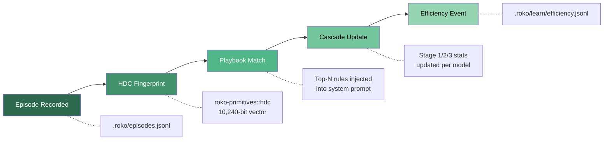
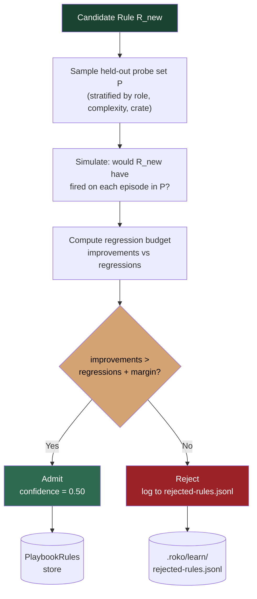
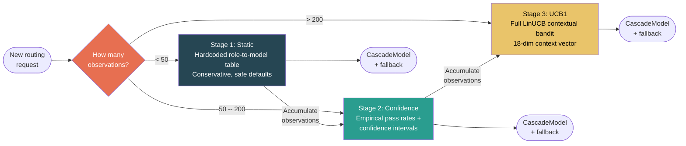
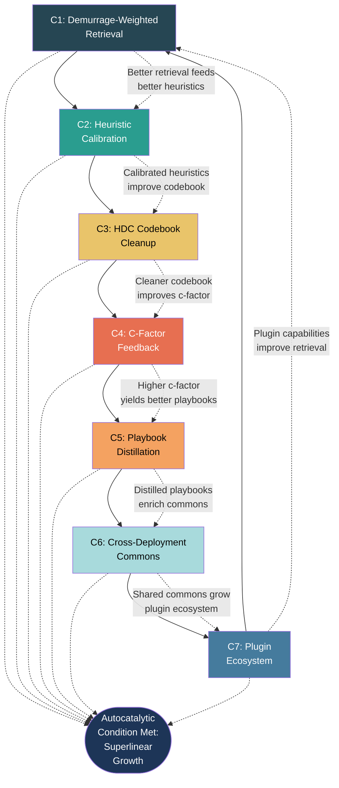
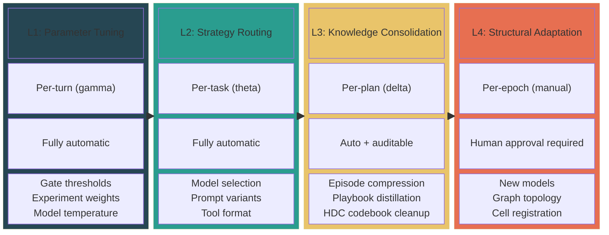

# 08 -- Learning Loops

> The learning system converts raw execution experience into durable reusable
> knowledge. Ten subsystems operate across four timescales, connected by eight
> cybernetic feedback loops. Every component persists to disk and survives
> restarts. E25 is complete (10/10 manifest tasks).

**Depends on**: [01-SIGNAL](01-SIGNAL.md) (Signal/Pulse, demurrage, HDC fingerprints), [02-CELL](02-CELL.md) (9 protocols, predict-publish-correct), [03-GRAPH](03-GRAPH.md) (Graph wiring, TOML definition), [05-AGENT](05-AGENT.md) (EFE gating, CorticalState), [09-MEMORY](09-MEMORY.md) (Store, demurrage economics)

**Implementation status (2026-09-15):** E25 is **complete (10/10)**. Shipped
behavior includes the episode logger, when/then playbook matching with
confidence dynamics, three-stage cascade router (Static/Confidence/UCB1),
HDC clustering and defragmentation with provenance, append-only hindsight
adjustments, bounded c-factor governance recommendations, chi-square/Wilson
experiment conclusions and archives, Variance Inequality checks, seven
autocatalytic metrics, and explicit when/then playbook matching injected by
the Graph engine before dispatch. The full declarative Loop-Graph realization
and autonomous structural L4 evolution remain target design. The 10/10 counts
built components, not loops that run on plans: on Graph runs (checked at
`7c556bc0a`) two of the eight loops in section 11 close, the per-rung gate EMA
sets retry budgets, and playbook outcomes are credited to the injected playbooks.
No loop has a measured effect on outcomes yet.

### Authoritative sources

| Surface | Source file |
|---|---|
| Episode logger | `crates/roko-learn/src/episode_logger.rs` |
| Playbook store and rules | `crates/roko-learn/src/playbook.rs`, `crates/roko-learn/src/playbook_rules.rs` |
| Cascade router | `crates/roko-learn/src/cascade_router.rs` |
| Bandit algorithms | `crates/roko-learn/src/bandits.rs` |
| HDC clustering | `crates/roko-learn/src/hdc_clustering.rs` |
| Hindsight adjustments | `crates/roko-learn/src/hindsight.rs` |
| C-factor governance | `crates/roko-learn/src/cfactor.rs` |
| Prompt experiments | `crates/roko-learn/src/prompt_experiment.rs` |
| Efficiency events | `crates/roko-learn/src/efficiency.rs` |
| Runtime feedback | `crates/roko-learn/src/runtime_feedback.rs` |
| Runner experiment lifecycle | `crates/roko-cli/src/runner/prompt_experiments.rs` |

---

## 1. Episode Logger

> **Crate:** `roko-learn` -- **Module:** `episode_logger.rs`
> **Persistence:** `.roko/episodes.jsonl` (append-only JSONL)
> **Cross-references:** [depth/08-learning/01-episode-logger.md](depth/08-learning/01-episode-logger.md)

The episode logger is the foundational data substrate for all learning in Roko.
Every agent turn -- regardless of outcome -- produces exactly one `Episode`
record appended to a JSONL file. This append-only log is the raw material from
which every other learning subsystem draws its observations.

### 1.1 Episode Schema

```rust
pub struct Episode {
    pub id: String,
    pub agent_id: String,
    pub task_id: String,
    pub plan_id: String,
    pub role: String,
    pub model: String,
    pub backend: String,
    pub success: bool,
    pub iteration: u32,
    pub input_tokens: u64,
    pub output_tokens: u64,
    pub cost_usd: f64,
    pub duration_ms: u64,
    pub gate_verdicts: Vec<GateVerdict>,
    pub timestamp: DateTime<Utc>,
    pub hdc_fingerprint: Option<HdcVector>,
    pub extra: HashMap<String, Value>,
}

pub struct GateVerdict {
    pub gate: String,
    pub passed: bool,
    pub signature: Option<String>,  // content hash, not raw output
}
```

### 1.2 Append Pipeline

```
Agent Turn Completes
    |
    v
EpisodeLogger::append(&episode)
    |
    +-- 1. Validate: extra field <= MAX_EXTRA_BYTES (16 KB)
    +-- 2. Compute HDC fingerprints (text + metadata)
    +-- 3. Serialize: serde_json::to_string(&episode) + "\n"
    +-- 4. Acquire process-wide parking_lot::Mutex
    +-- 5. Open file with O_APPEND | O_CREAT
    +-- 6. Write serialized line
    +-- 7. Release mutex
```

The `parking_lot::Mutex` (synchronous, not `tokio::Mutex`) serializes
concurrent writes within a single process. The critical section is a single
`write_all` syscall. Separate processes append independently -- the OS
guarantees atomicity for `O_APPEND` writes below `PIPE_BUF`.

### 1.3 Integration with LearningRuntime

The episode logger is the first subsystem updated by
`LearningRuntime::record_completed_run()`. The runtime appends the episode
before updating any downstream subsystem:

```
CompletedRunInput
    |
    +-- 1. EpisodeLogger::append(episode)          <-- raw persistence
    +-- 2. CostsLog::append(cost_record)
    +-- 3. PlaybookStore::record_outcome()
    +-- 4. PlaybookRules::validate() / contradict()
    +-- 5. SkillLibrary::record_use()
    +-- 6. TaskMetric -> regression history
    +-- 7. ExperimentStore::record_outcome()
    +-- 8. (removed: PatternMiner::ingest_episode(), gap-4adfa7)
    +-- 9. CascadeRouter::update()
    +-- 10. CFactor::compute()
```



This ordering ensures crash-safety: if the process fails at step 5, the raw
episode is already on disk and can be replayed on restart to reconstruct
downstream state.

### 1.4 HDC Fingerprinting

Every episode is fingerprinted with a 10,240-bit hyperdimensional computing
(HDC) vector from `roko-primitives::hdc`. Two fingerprints are computed:

1. **Text fingerprint** -- encodes semantic content (task description, gate
   verdicts) via `text_fingerprint`.
2. **Metadata fingerprint** -- encodes structural identity (agent_id, task_id,
   role) for structural similarity matching.

HDC fingerprints enable sub-microsecond similarity search: comparing two
10,240-bit vectors via Hamming distance takes ~50ns, compared to ~1us for
cosine distance on 768-dimensional float embeddings. This speed is critical
for real-time pattern matching during task dispatch, where the system scans
hundreds of historical episodes before the agent begins work.

### 1.5 Tolerance and Retention

The reader skips corrupt JSONL lines (crash mid-write, schema change, manual
edits) and surfaces them through `LoggerError::Parse` with line numbers. For a
system running 100 tasks/day at ~2 KB/episode, the log grows ~73 MB/year.

---

## 2. Playbook Store

> **Crate:** `roko-learn` -- **Modules:** `playbook.rs`, `playbook_rules.rs`
> **Persistence:** `.roko/learn/playbooks/` (JSON per playbook), `.roko/learn/playbook-rules.toml`
> **Cross-references:** [depth/08-learning/02-playbook-store.md](depth/08-learning/02-playbook-store.md)

The playbook system captures and reuses procedural knowledge from past
executions. It has two components: **PlaybookStore** (ordered step sequences)
and **PlaybookRules** (if-then rules with trigger matching and confidence
dynamics). Together they implement a structured form of Reflexion (Shinn et al.
2023) and ExpeL (Zhao et al. 2024): instead of free-form natural language
reflection, Roko extracts typed rules with bounded confidence tracking.

### 2.1 Playbooks in the Learning Stack

```
+--------------------------------------------------------------+
|              Tier 4: Playbook Rules And Playbooks              |
|   Concrete instructions compiled from validated heuristics.    |
|   Confidence: 0.0 -- 0.95 bounded. Reinforcement + balance    |
|   keep rules warm; demurrage cools stale rules.               |
+--------------------------------------------------------------+
|             Tier 3: Heuristics And Worldview Priors            |
|   Reusable rules of thumb with falsifier surfaces.             |
+--------------------------------------------------------------+
|                    Tier 2: Patterns                             |
|   Extracted hypotheses from episode clustering.                 |
+--------------------------------------------------------------+
|                    Tier 1: Episodes                             |
|   Raw observations from every agent turn.                      |
+--------------------------------------------------------------+
```

### 2.2 PlaybookRules Schema

```rust
pub struct Rule {
    pub rule_id: String,
    pub title: String,         // <= 80 chars
    pub body: String,          // injected into prompt
    pub triggers: Triggers,
    pub balance: f64,          // freshness balance (demurrage-governed)
    pub demurrage_paid: f64,
    pub confidence: f64,       // bounded to [0.0, 0.95]
    pub validations: u32,
    pub contradictions: u32,
    pub last_applied: Option<DateTime<Utc>>,
    pub created_at: DateTime<Utc>,
    pub source_episodes: Vec<String>,
}

pub struct Triggers {
    pub file_globs: Vec<String>,       // globset shell patterns
    pub tags: Vec<String>,             // case-insensitive overlap
    pub categories: Vec<String>,
    pub error_signatures: Vec<String>,
    pub roles: Vec<String>,
}
```

Matching uses **OR semantics** across the five trigger kinds: a rule fires if
ANY trigger list intersects the incoming context. All-empty `Triggers` matches
nothing -- guarding against accidental universal rules.

### 2.3 Confidence Dynamics

| Trigger | Confidence change | Balance change |
|---------|-------------------|----------------|
| Validation (rule predicted correctly) | `+0.05` | Reinforcement bonus |
| Contradiction (rule predicted wrong) | `-0.10` | Loss + cooling pressure |
| Successful reuse / citation | N/A | Reinforcement bonus |
| Demurrage tick | N/A | Holding cost |
| Prune threshold | N/A | Rule removed |

The asymmetric update rate (contradictions penalize 2x more than validations
reward) ensures rules that stop being accurate are quickly demoted. The 0.95
confidence ceiling prevents epistemic closure -- every rule retains a 5% doubt
margin that allows contradictions to eventually demote it.

```
Confidence lifecycle:
    new rule -> 0.50 (default)
        |
        +-- validated -> 0.55 -> 0.60 -> ... -> 0.95 (ceiling)
        |
        +-- contradicted -> 0.40 -> 0.30 -> ... -> 0.0 (pruned)
```

### 2.4 Prompt Injection

When the prompt composer assembles a system prompt, it queries
`PlaybookRules::select(MatchContext)` and injects the top-N matching rules
(typically 3, sorted by confidence) as "Lessons from previous builds." Each
rule consumes ~50-100 tokens -- a trivial cost that prevents multi-thousand-
token debugging loops where the agent discovers the issue through trial and
error.

### 2.5 Design Upgrade: GRASP-Style Regression-Gated Admission

> **Current state:** Playbook entries are admitted when a pattern has
> `support_count >= 5` and confidence exceeds `min_confidence`. There is no
> check for whether the new entry degrades performance on existing trajectories.

> **Target design:** Each candidate playbook entry is tested against a balanced
> held-out probe set under a hard regression budget before admission. Only
> admitted if net improvement is positive.

**Rationale.** GRASP (arXiv:2605.29668, May 2026) demonstrated that
unrestricted grounding of agent actions on retrieved knowledge causes silent
degradation -- rules that help on new cases can break established trajectories.
On MedAgentBench, GRASP improved task success from 40.6% to 88.8% (+48 points)
by gating admission through a regression test.

**Admission protocol (target):**

```
Candidate Rule R_new
    |
    v
1. Sample probe set P from recent successful episodes
   (stratified by role, complexity, crate)
    |
    v
2. Simulate: for each episode in P, would R_new have
   fired? If so, would its advice have changed the outcome?
    |
    v
3. Compute regression budget:
   improvements = count(P where R_new helps)
   regressions = count(P where R_new hurts)
    |
    v
4. Gate: admit only if improvements > regressions + margin
   where margin = max(1, 0.1 * |P|)
    |
    v
5. If admitted, set initial confidence = 0.50
   If rejected, log reason to .roko/learn/rejected-rules.jsonl
```



**Failed-episode augmentation (SiriuS).** Rather than discarding failed
episodes outright, SiriuS (arXiv:2502.04780) augments them with corrective
annotations and reuses them as negative examples. The target design preserves
failed episodes with their error signatures and uses them as part of the probe
set -- a candidate rule that would have *prevented* a known failure gets credit,
while one that would have *caused* a new failure in the probe set is penalized.

**Unbounded growth prevention (SkillZip).** SkillZip (arXiv:2608.11079)
compresses one skill's text by finding its shortest faithful structural explanation: a typed minimum-description-length (MDL) objective under a hard coverage constraint, run once or on every self-evolution patch (Zip-on-Write) (abstract, §V). It is evaluation-free and does not merge rules across a library. The target design borrows the MDL idea (Roko's own extension): when
the playbook store exceeds a configured capacity (default: 500 rules), the
system compresses by merging rules with overlapping triggers and high HDC
similarity into a single generalized rule. The MDL criterion ensures that
generalization only happens when the merged rule is shorter (in description
length) than the two originals while preserving predictive accuracy.

**Complementary work.** ReSkill (arXiv:2606.01619) provides a complementary
approach of skill refinement through iterative self-correction, which could
augment the GRASP admission gate with post-admission refinement cycles.

---

## 3. Cascade Router

> **Crate:** `roko-learn` -- **Module:** `cascade_router.rs`
> **Persistence:** `.roko/learn/cascade-router.json`
> **Cross-references:** [depth/08-learning/03-cascade-router.md](depth/08-learning/03-cascade-router.md), [depth/08-learning/04-bandit-algorithms.md](depth/08-learning/04-bandit-algorithms.md)

The cascade router is Roko's central model selection system. It answers:
"Given a task with these features, which LLM model should run it?" The answer
evolves through three stages of increasing sophistication.

### 3.1 Three-Stage Cascade

```
+-----------------------------+-----------------------------------------+
|  Stage 1: Static            |  < 50 observations                      |
|  Hardcoded role->model      |  No learning, safe defaults             |
|  table                      |                                         |
+-----------------------------+-----------------------------------------+
|  Stage 2: Confidence        |  50 -- 200 observations                 |
|  Empirical pass rates +     |  Simple statistics, wide confidence     |
|  confidence intervals       |  intervals shrink with data             |
+-----------------------------+-----------------------------------------+
|  Stage 3: UCB               |  > 200 observations                     |
|  Full LinUCB contextual     |  Context-dependent routing with         |
|  bandit                     |  learned feature weights                |
+-----------------------------+-----------------------------------------+
```



**Why three stages?** A single bandit works poorly at all scales. LinUCB with
18 context dimensions needs ~50 observations per arm; with 5 models, that is
250+ observations before it is useful. During cold start, random exploration
wastes money. A hardcoded table can never adapt. The confidence stage bridges
the gap.

### 3.2 Stage 1: Static Routing (< 50 observations)

Hardcoded mapping from `ModelTier` to model slug:

```rust
fn static_route(tier: ModelTier) -> ModelSpec {
    match tier {
        ModelTier::Fast    => ModelSpec::new("claude-haiku-4-5-20251001"),
        ModelTier::Standard => ModelSpec::new("claude-sonnet-4-20250514"),
        ModelTier::Complex => ModelSpec::new("claude-opus-4-20250514"),
    }
}
```

Deliberately conservative: over-routes to stronger models to avoid gate
failures during cold start, accepting higher cost for higher pass rates.

### 3.3 Stage 2: Confidence Routing (50--200 observations)

For each candidate model:

```
score(model) = pass_rate(model) - cost_penalty(model) + affinity_bonus(model)
```

Where:
- `cost_penalty` = normalized cost relative to the cheapest available model
- `affinity_bonus` = `CACHE_AFFINITY_BONUS` (0.15) if model matches previous
  task's model

Additional biases from C-Factor and affect:
- **Low affect confidence** (< 0.3): bias toward stronger models
- **High C-Factor** (> 0.8): bias toward cheaper models
- **Low C-Factor** (< 0.4): bias toward stronger models

### 3.4 Stage 3: UCB Routing (> 200 observations)

The full LinUCB contextual bandit takes over. See section 4 for the complete
bandit mathematics.

The 18-dimensional `RoutingContext` enables learned patterns like:
- "For roko-core with high familiarity, haiku is sufficient"
- "For cross-crate refactoring on retry, escalate to opus"
- "When sonnet failed, escalate rather than retrying sonnet"

### 3.5 Provider Health Integration

```
CascadeRouter::select(context)
    |
    +-- 1. Compute candidate scores (per stage algorithm)
    +-- 2. Filter: ProviderHealthRegistry::is_available(model.provider)
    |       -> Remove models whose circuit breaker is Open
    +-- 3. Filter: Pareto frontier pruning
    |       -> Remove dominated models (worse on both cost and quality)
    +-- 4. Select highest-scoring non-filtered model
```

### 3.6 CascadeModel Output

```rust
pub struct CascadeModel {
    pub primary: ModelSpec,
    pub fallback: Option<ModelSpec>,
    pub latency_sla_ms: u64,
    pub stage: CascadeStage,
}
```

The `fallback` provides a pre-computed escalation target. If the primary fails,
the orchestrator retries with the fallback without re-querying the router.

---

## 4. Bandit Algorithms

> **Crate:** `roko-learn` -- **Module:** `bandits.rs`, `model_router.rs`
> **Academic basis:** Auer, Cesa-Bianchi & Fischer 2002 (UCB1); Li et al. 2010 (LinUCB); Thompson 1933; Garivier & Kaufmann 2016 (Track-and-Stop)

Roko provides three bandit implementations for repeated decisions in the
system: model routing, prompt variant selection and backend preference. A
fourth, Track-and-Stop for tool-format selection, was removed unwired (see
4.4).

### 4.1 UCB1: Upper Confidence Bound (Auer et al. 2002)

For each arm `a` with `pulls_a` observations:

```
                                        +-----------+
                                       /             \
ucb(a) = mean_a  +  C * sqrt( ln(N) /  pulls_a )
                                       \             /
                                        +-----------+
```

where:
- `mean_a` = cumulative reward / pulls_a
- `C` = exploration constant (default: sqrt(2))
- `N` = total pulls across all arms

**Regret bound:** O(sqrt(T ln T)) cumulative regret (Auer et al. 2002). Arms
with `pulls_a == 0` receive infinite UCB and are always chosen before any
pulled arm. Tiebreaking is deterministic by insertion order.

**Reward scaling:** UCB1 assumes rewards in [0, 1]:

| Outcome | Reward |
|---------|--------|
| Gate pass (first attempt) | 1.0 |
| Gate pass (after retry) | 0.7 |
| Gate fail (recoverable) | 0.2 |
| Gate fail (unrecoverable) | 0.0 |
| Cost efficiency | `1.0 - (cost / max_cost)` |

```rust
pub struct BanditArm {
    pub name: String,
    pub pulls: u64,
    pub total_reward: f64,
}

pub struct UcbBandit {
    arms: RwLock<Vec<BanditArm>>,
    total_pulls: AtomicU64,
    exploration_c: f64,      // default: sqrt(2)
    persist_path: Option<PathBuf>,
}
```

Thread safety: `parking_lot::RwLock` for arm stats, `AtomicU64` for pull
counter. `select()` acquires only a shared read lock; `update()` acquires
exclusive. Concurrent selections never block each other.

### 4.2 Thompson Sampling (Thompson 1933)

Thompson sampling maintains a Beta posterior per arm and samples from it:

```
For each arm a:
    sample_a ~ Beta(alpha_a, beta_a)

Select arm with highest sample.

On reward observation r in {0, 1}:
    alpha_a += r
    beta_a += (1 - r)
```

The Beta(alpha, beta) posterior is the conjugate prior for Bernoulli
observations:

```
p(theta | data) = Beta(alpha + successes, beta + failures)

Posterior mean = alpha / (alpha + beta)
Posterior variance = (alpha * beta) / ((alpha + beta)^2 * (alpha + beta + 1))
```

Thompson sampling naturally handles non-stationarity when combined with a
discount factor gamma (Thompson Sampling with Drift):

```
alpha_a <- gamma * alpha_a + r
beta_a  <- gamma * beta_a + (1 - r)
```

With gamma = 0.995, the effective window is ~200 observations, allowing the
posterior to track changing model quality.

### 4.3 LinUCB: Contextual Bandit (Li et al. 2010)

For each arm `a` with context vector `x`:

```
score(a) = theta_a^T * x  +  alpha * sqrt( x^T * A_a^{-1} * x )
```

where:
- `theta_a = A_a^{-1} * b_a` (ridge regression estimate)
- `A_a` = d x d matrix (initialized to identity I_d)
- `b_a` = d x 1 vector (initialized to zero)
- `alpha` = exploration parameter (decays from 1.0 to 0.05)

**Context vector (18 dimensions):**

| Dimension(s) | Feature | Encoding |
|-------------|---------|----------|
| 0-7 | Task category | One-hot (8 TaskCategory variants) |
| 8 | Complexity band | Scalar: 0.0 / 0.5 / 1.0 |
| 9 | Iteration | Normalized: iteration / 10, capped at 1.0 |
| 10-13 | Agent role | 4-dim float vector (hashed) |
| 14 | Crate familiarity | success_count / total_count |
| 15 | Has prior failure | Binary: 0.0 or 1.0 |
| 16 | Bias term | Always 1.0 |
| 17 | Cache affinity | 1.0 if matches previous model |

**Alpha decay:** Exploration decays exponentially from 1.0 to 0.05 over 200
observations:

```
alpha = 0.05 + 0.95 * exp(-observations / 60)
```

At cold start, alpha = 1.0 (maximum exploration). After 200 observations,
alpha ~= 0.084 (mostly exploitation). The decay constant tau = 60 gives
effective convergence by 200 observations.

**On reward observation r for arm a with context x:**

```
A_a <- A_a + x * x^T
b_a <- b_a + r * x
theta_a <- A_a^{-1} * b_a
```

### 4.4 Track-and-Stop: Best-Arm Identification (Garivier & Kaufmann 2016)

> **Removed (2026-10-02, find-34a4b5).** `TrackAndStopBandit` and the rest of
> the tool-format bandit stack (`FormatBandit`, `ProfileBandit`,
> `EpsilonGreedyBandit`, roko-fs `BanditStore`) were deleted in `310f984b6`.
> After Runner-v2 nothing selected a tool format with them or fed them an
> outcome. The algorithm is kept below as design reference.

Designed for decisions where the optimal choice is fixed (e.g., tool format for
a given model):

```
Phase 1: Round-robin
    Pull each arm at least once.

Phase 2: D-tracking
    Compute target allocation proportions from gap estimates.
    Pull the arm most under-sampled relative to its target.
    Forced exploration: no arm falls below sqrt(t) - K/2 pulls.

Phase 3: Stopping
    When GLR statistic > beta(t, delta), declare winner.
    Stop exploring permanently for this key.
```

**GLR stopping criterion:**

```
GLR(t) = t * KL(mu_hat_1, mu_hat_2)

where mu_hat_1, mu_hat_2 = empirical means of top-2 arms

Threshold: beta(t, delta) = ln((ln(t) + 1) / delta)

When GLR(t) > beta(t, delta), declare best arm with confidence >= 1 - delta.
```

---

## 5. HDC Clustering

> **Crate:** `roko-learn` -- **Module:** `hdc_clustering.rs`
> **Cross-references:** [depth/08-learning/05-hdc-clustering.md](depth/08-learning/05-hdc-clustering.md)

HDC (hyperdimensional computing) clustering groups episodes by semantic
similarity using 10,240-bit binary vectors. This enables pattern discovery
without embedding models -- similarity is a Hamming distance computation at
~50ns per comparison.

### 5.1 Clustering for Pattern Discovery

Incremental DBSCAN over HDC space discovers natural episode groupings:

```
On new episode:
    1. Compute HDC fingerprint
    2. Find nearest cluster (HDC similarity to each cluster superposition)
    3. If similarity > eps_similarity (default 0.72):
        a. Add episode to cluster
        b. Update cluster superposition (bitwise OR)
        c. Update cluster statistics
    4. If no cluster matches:
        a. Add to noise buffer
        b. When noise buffer reaches min_points (default 3) similar episodes:
           -> Form new cluster
```

### 5.2 HDC Defragmentation with Provenance (E25)

The shipped E25 implementation performs HDC codebook defragmentation: bundled
vectors whose constituents all exist independently at higher tiers are pruned.
Provenance tracking ensures every vector in the codebook traces back to its
source episodes.

### 5.3 Template Suggestion

Given a new task context, the system scans recent episodes (within
`TEMPLATE_SUGGESTION_MAX_AGE_DAYS` = 30, up to
`TEMPLATE_SUGGESTION_MAX_CANDIDATES` = 256) and returns episodes with HDC
similarity above `TEMPLATE_SUGGESTION_MIN_SIMILARITY` = 0.7.

---

## 6. Hindsight Adjustments

> **Crate:** `roko-learn` -- **Module:** `hindsight.rs`
> **Cross-references:** [depth/08-learning/06-hindsight-adjustments.md](depth/08-learning/06-hindsight-adjustments.md)

Hindsight relabeling corrects earlier episode outcomes with later evidence. The
design below decomposes failed trajectories into sub-goals and marks achieved
sub-goals as positive episodes; that sub-goal relabeling is not implemented. What
runs on Graph plans (checked at `7c556bc0a`) is narrower: `HindsightSink`
(`crates/roko-cli/src/runtime_feedback/hindsight.rs`) appends corrections to
`.roko/learn/episode-adjustments.jsonl`, for example a `Regression`
against a task's latest success when a later verify failure blames that task's
edits. Nothing reads those corrections yet.

### 6.1 Relabeling Protocol

```
Failed trajectory (original goal: "implement auth + tests")
    |
    v
Sub-goal extraction: "auth implemented" (achieved), "tests written" (failed)
    |
    v
Relabel: trajectory is SUCCESSFUL for "implement auth"
    |
    v
Episode relabeled with achieved sub-goal -> enters replay as positive data
```

**Recovery rate:** Not measured. An earlier revision stated a recovery figure
that had no source; no recovery rate has been measured for any version of this
mechanism.

### 6.2 Append-Only Guarantee

Hindsight adjustments are append-only: the original episode is never modified.
A separate adjustment record references the original episode ID, the achieved
sub-goal, and the relabeled outcome. This preserves audit trail integrity --
the raw episode log remains the ground truth.

### 6.3 Connection to SiriuS Failed-Episode Augmentation

SiriuS (arXiv:2502.04780) independently validates the principle: rather than
discarding failed episodes, augment them with corrective annotations and reuse
them as training signal. Roko's hindsight system applies this principle at the
procedural level -- extracting what *did* work from trajectories that did not
achieve their primary goal.

---

## 7. C-Factor Governance

> **Crate:** `roko-learn` -- **Module:** `cfactor.rs`
> **Cross-references:** [depth/08-learning/07-cfactor.md](depth/08-learning/07-cfactor.md)

The C-Factor (Collective Capability Factor) measures collective intelligence
across a cohort of agents. It is a diagnostic sensor -- a covariate that
correlates with quality, not an objective to maximize. If the C-Factor becomes
a reward signal, the system will game it (Goodhart's Law).

### 7.1 Five Process Variables (Woolley et al. 2010)

```
c_factor = w_1 * turn_taking_entropy
         + w_2 * peer_prediction_accuracy
         + w_3 * citation_reciprocity
         + w_4 * delivery_rate
         + w_5 * hdc_diversity
         + bias
```

| Variable | Formula | What It Measures |
|----------|---------|------------------|
| Turn-taking entropy | `H = -sum(p_i * ln(p_i)) / ln(N)` | Conversational equality |
| Peer prediction | `1.0 - MSE(predictions, outcomes)` | Social perceptiveness |
| Citation reciprocity | `survived_citations / total_citations` | Trust calibration |
| Delivery rate | `confirmed / (confirmed + dropped)` | Channel openness |
| HDC diversity | `1.0 - mean_pairwise_similarity` | Cognitive diversity |

Weights are learned online via gradient descent from cohort outcomes, not
declared by fiat:

```
On cohort completion with observed outcome_quality:
    predicted = weights.dot(metrics)
    error = outcome_quality - predicted

    w_i += learning_rate * error * metric_i
```

### 7.2 Routing Bias

The C-Factor provides routing bias to the cascade router:

```rust
pub enum AgentDispatchBias {
    PreferStronger,   // C-Factor < 0.4 -- system struggling
    PreferCheaper,    // C-Factor > 0.8 -- system performing well
    Neutral,          // C-Factor 0.4--0.8
}
```

### 7.3 Bounded Governance Recommendations (E25)

The shipped E25 implementation includes `CFactorGovernance::recommendations()`
which can emit non-binding actions like `InjectDiversity` and `AdjustWeights`.
Detection of groupthink, domination, and prediction collusion pathologies is
live. Structural countermeasures (Devil's Advocate, Outsider Injection,
Minority Report React Cells) remain target design.

---

## 8. A/B Experiments (Prompt Experiments)

> **Crate:** `roko-learn` -- **Module:** `prompt_experiment.rs`
> **Cross-references:** [depth/08-learning/08-experiments.md](depth/08-learning/08-experiments.md)

Prompt experiments implement DSPy-style (Khattab et al. 2024) prompt
optimization: define a section, generate variants, assign variants using
bandit selection, and evaluate against gate pass rate.

### 8.1 Experiment Lifecycle

Runner prompt treatments are durable effects, not best-effort annotations.
For each `run_id/plan_id/task_id/attempt`, the ExperimentStore transaction
chooses a scoped variant and snapshots its content. The prompt assembler
replaces the exact canonical section before scoring, placement, and budget
selection.

After dispatch, a typed durable terminal event settles the assignment exactly
once. Excluded treatments, assembly failures, and confirmed pre-provider
failures do not count as trials.

### 8.2 Conclusion Criteria

Experiments conclude via chi-square test or Wilson score interval:

- **Minimum samples:** 50 per variant
- **Significance threshold:** p < 0.05
- **Effect size threshold:** delta > 5%
- **Early stopping:** Variance Inequality check terminates experiments where
  no variant can statistically surpass the leader

### 8.3 Persistence

All production ExperimentStore writers use a stable sibling advisory lock
across strict read, scoped mutation, and atomic publication. Malformed or
oversized state is preserved rather than silently replaced. ACP and serve
use their own context-injection shapes; canonical-section receipt parity
across those runtimes remains follow-up work.

---

## 9. Efficiency Events

> **Crate:** `roko-learn` -- **Module:** `efficiency.rs`
> **Persistence:** `.roko/learn/efficiency.jsonl`
> **Cross-references:** [depth/08-learning/09-efficiency-events.md](depth/08-learning/09-efficiency-events.md)

Per-turn efficiency events capture fine-grained telemetry about each agent
dispatch:

```rust
pub struct AgentEfficiencyEvent {
    pub run_id: String,
    pub task_id: String,
    pub model: String,
    pub input_tokens: u64,
    pub output_tokens: u64,
    pub cost_usd: f64,
    pub duration_ms: u64,
    pub was_warm_start: bool,
    pub section_meta: Vec<PromptSectionMeta>,
    pub gate_passed: bool,
    pub timestamp: DateTime<Utc>,
}

pub struct PromptSectionMeta {
    pub name: String,
    pub tokens: u64,
    pub was_truncated: bool,
}
```

Section-level token attribution enables the Section-to-Scaffold feedback loop
(loop 3): the system tracks which prompt sections correlate with gate passes
and adjusts section weights accordingly.

---

## 10. Autocatalytic Compounding (Kauffman 1993)

> **Cross-references:** [depth/08-learning/10-autocatalytic.md](depth/08-learning/10-autocatalytic.md)

> **Status (2026-09-29): a hypothesis, not a result.** No measurement shows Roko's
> learning compounding, and recent studies argue against expecting it:
> of three agent optimizers, only the one with regression control built into its loop kept improving on new tasks (Wang, Kattakinda and Feizi 2026, arXiv:2607.14004), self-improvement results depend on task order and
> amplify noise (Ye et al. 2026, arXiv:2608.18066), and harness evolution does not
> consistently beat matched test-time scaling (Wang et al. 2026, arXiv:2607.12227).
> The defensible claim is bounded, audited improvement with rollback. The metric
> functions in `crates/roko-learn/src/aggregate.rs` (`compute_compounding_metrics`)
> have no production caller at `7c556bc0a`, and `check_autocatalytic` below is a
> sketch with no counterpart in `crates/`.

A reaction network is autocatalytic when every reaction's inputs are produced
by some other reaction in the network (Kauffman 1993). In learning terms: the
system compounds when its feedback graph forms a **strongly connected cycle** --
every loop has at least one input from another loop, and there are no orphan
loops.

### 10.1 Seven Autocatalytic Metrics (E25)

The shipped E25 implementation computes seven autocatalytic metrics that
measure whether the compounding condition holds:

```rust
pub fn check_autocatalytic(graph: &FeedbackGraph) -> AutocatalyticStatus {
    // Check 1: no orphan loops (every loop has an incoming edge)
    let orphans: Vec<LoopId> = graph.loops.iter()
        .filter(|l| graph.incoming_edges(l.id).is_empty())
        .map(|l| l.id)
        .collect();

    if !orphans.is_empty() {
        return AutocatalyticStatus::Broken { orphans };
    }

    // Check 2: strong connectivity (Tarjan's algorithm)
    let sccs = tarjan_scc(&graph.adjacency);
    if sccs.len() == 1 && sccs[0].len() == graph.loops.len() {
        AutocatalyticStatus::Connected
    } else {
        AutocatalyticStatus::Fragmented { components: sccs }
    }
}
```

### 10.2 Autocatalytic Metrics Model

The compounding rate is modeled as a superlinear growth function when the
autocatalytic condition holds:

```
Improvement(t) = base_rate * Product_i(loop_i_output(t))

When all loops are connected:
    d(Improvement)/dt > base_rate  (superlinear growth)

When loops are fragmented:
    d(Improvement)/dt <= base_rate  (at most linear growth)
```

The seven KPIs that measure compounding:

| KPI | Measures | Expected Curve |
|-----|----------|----------------|
| Time to first PR | All loops together | Steep initial drop |
| Median tokens/task | C1 + C3 + C5 | Monotonic decrease |
| Mean confidence width | C2 heuristic | Decrease with trials |
| HDC cache hit rate | C3 codebook | Asymptote toward 1.0 |
| Cohort c-factor trend | C4 | Monotonic increase |
| Retroactive improvements/week | C5 playbook | Increase then plateau |
| Time from install to success | C6 commons | Decrease as commons grows |

### 10.3 Seven Compounding Loops

| Loop | Name | Mechanism |
|------|------|-----------|
| C1 | Demurrage-Weighted Retrieval | Used memory reinforced, idle memory taxed |
| C2 | Heuristic Calibration | Predict-outcome-calibrate cycle |
| C3 | HDC Codebook Cleanup | Redundant bundled vectors pruned |
| C4 | C-Factor Feedback | High c-factor -> better output -> better evidence |
| C5 | Playbook Distillation | Episodes -> playbooks -> meta-playbooks |
| C6 | Cross-Deployment Commons | Shared heuristic pool across deployments |
| C7 | Plugin Ecosystem | Network effects from portable capabilities |



---

## 11. Eight Cybernetic Feedback Loops

> **Theoretical basis:** Ashby's Law of Requisite Variety, Beer's Viable System
> Model, Good Regulator Theorem (Argyris & Schon 1978)
> **Cross-references:** [depth/08-learning/11-feedback-loops.md](depth/08-learning/11-feedback-loops.md)

```
+---------------------------------------------------------------------+
|                    EIGHT FEEDBACK LOOPS                                |
|                                                                       |
|  1. Health -> Routing     Provider circuit breaker -> candidate set   |
|  2. Conductor -> Routing  System load signals -> routing bias         |
|  3. Section -> Scaffold   Section effectiveness -> prompt weights     |
|  4. Failure -> Replanning Gate failures -> plan revision              |
|  5. Skills -> Prompts     Skill library -> prompt injection           |
|  6. Cost -> Routing       Budget pressure -> model selection          |
|  7. Latency -> Reward     Response latency -> bandit reward signal    |
|  8. Experiments -> Static Experiment winners -> static routing table  |
|                                                                       |
+---------------------------------------------------------------------+
```

Each loop is designed as negative feedback: detect a deviation from desired
behavior and apply a corrective signal. On Graph runs (checked at `7c556bc0a`),
two of the eight close: provider health (loop 1) and the plan budget (loop 6).
The rest are partial or not wired, as each loop's status line says, and none has
a measured effect on outcomes yet.

### Loop 1: Health -> Routing

```
+-----------------------+     +-------------------------+     +------------------+
|  Provider Response    |---->|  ProviderHealthRegistry  |---->|  CascadeRouter   |
|  (success/failure)    |     |  record_success/failure  |     |  select()        |
+-----------------------+     +-------------------------+     +------------------+
      Source type:                Transform:                   Sink type:
      ProviderResponse            ErrorClassifier ->           is_available() ->
      { status_code,              CircuitState update          bool filter on
        latency_ms,               (Closed/Open/HalfOpen)       candidate set
        error: Option }
```

**Status:** Wired. Cascade router calls `is_available()` during candidate
scoring. Prevents routing to degraded providers.

### Loop 2: Conductor -> Routing

```
+-----------------------+     +-------------------------+     +------------------+
|  SystemLoadSnapshot   |---->|  Load Threshold Check    |---->|  CascadeRouter   |
|  (cpu, mem, agents,   |     |  active_agents >=        |     |  routing bias    |
|   queue_depth)        |     |  max_agents * 0.8?       |     |  adjustment      |
+-----------------------+     +-------------------------+     +------------------+
```

**Status:** Not wired on Graph runs. Graph dispatch builds its `RoutingContext`
with `conductor_load: 0.0` and `active_agents: 1`
(`crates/roko-cli/src/graph_task_dispatch.rs`), and nothing evaluates the
Conductor ([30-CONDUCTOR](30-CONDUCTOR.md)), so no load signal reaches the router.

### Loop 3: Section -> Scaffold

```
+-----------------------+     +-------------------------+     +------------------+
|  PromptSectionMeta +  |---->|  SectionEffectiveness    |---->|  SectionWeights  |
|  gate_passed (from    |     |  Tracker (conditional    |     |  (HashMap<String |
|  efficiency events)   |     |  pass rate analysis)     |     |   , f32>)        |
+-----------------------+     +-------------------------+     +------------------+
```

**Status:** Partial. Composed prompts emit per-section inclusion/drop metadata
into efficiency events, and the prompt build reads the learned section weights
(`crates/roko-cli/src/dispatch/prompt_cache.rs`), but plan runs never record
section outcomes, so the weights don't learn from plan runs (checked at
`7c556bc0a`).

**Impact:** Highest-leverage self-improvement loop. Adaptive context assembly
can reduce prompt size by 30-50% while improving pass rates.

### Loop 4: Failure -> Replanning

```
+-----------------------+     +-------------------------+     +------------------+
|  Consecutive gate     |---->|  Failure Analyzer        |---->|  Plan Generator  |
|  failures for task    |     |  (pattern detection,     |     |  (decompose into |
|  (Vec<GateVerdict>)   |     |   root cause grouping)   |     |   subtasks)      |
+-----------------------+     +-------------------------+     +------------------+
```

**Status:** Not wired on Graph runs. Runner-v2's plan revision was deleted
with it on 2026-09-06 (`6b5da8616`), and `ReplanController`
(`crates/roko-execution/src/replan_controller.rs`) has no caller. A failed task is
retried with its gate feedback up to `max_retries`. With
`learning.replan_on_gate_failure` (on by default) and a cheap model available,
each failure also gets an LLM reflection.

### Loop 5: Skills -> Prompts

```
+-----------------------+     +-------------------------+     +------------------+
|  SkillLibrary         |---->|  Skill Matcher           |---->|  SystemPrompt    |
|  (accumulated skills  |     |  (tag + file + HDC       |     |  Builder layer   |
|   with confidence)    |     |   similarity search)     |     |  ("skills" sect) |
+-----------------------+     +-------------------------+     +------------------+
```

**Status:** Built, not wired. The prompt builder can render a skills section
(`RoleSystemPromptSpec::with_relevant_skills`), but no dispatch path supplies
skills, so plan-run prompts carry none (checked at `7c556bc0a`).

### Loop 6: Cost -> Routing

```
+-----------------------+     +-------------------------+     +------------------+
|  CostsLog (running    |---->|  BudgetGuardrail         |---->|  CascadeRouter   |
|  cost accumulator)    |     |  check() -> action       |     |  cost_weight or  |
|                       |     |                          |     |  candidate filter |
+-----------------------+     +-------------------------+     +------------------+
```

**Status:** Wired on Graph runs, through the per-plan budget reservation rather
than `BudgetGuardrail`: each dispatch reserves budget (`GraphPlanBudgetPolicy` in
`crates/roko-cli/src/graph_task_dispatch.rs`), a plan at its ceiling stops
dispatching, and routing receives the remaining budget.

### Loop 7: Latency -> Reward

```
+-----------------------+     +-------------------------+     +------------------+
|  LatencyRegistry      |---->|  Latency Reward          |---->|  Bandit Update   |
|  (EWMA per model,     |     |  Computation (SLA        |     |  (composite      |
|   p50/p95/p99)        |     |   compliance scoring)    |     |   reward signal) |
+-----------------------+     +-------------------------+     +------------------+
```

**Status:** Partial. On Graph runs `RoutingObservationSink`
(`crates/roko-cli/src/runtime_feedback/routing.rs`) folds normalized latency and
cost into the router's multi-objective reward, but only for successful tasks; a
failure updates only the model's success-rate statistics.

### Loop 8: Experiments -> Static

```
+-----------------------+     +-------------------------+     +------------------+
|  ExperimentStore      |---->|  Significance Tester     |---->|  Static Config   |
|  (concluded expts     |     |  (chi-squared or         |     |  (roko.toml      |
|   with variant data)  |     |   z-test for winner)     |     |   updates)       |
+-----------------------+     +-------------------------+     +------------------+
```

**Status:** Partial. Graph runs assign and settle prompt experiments per attempt
(`crates/roko-cli/src/graph_task_dispatch/prompt_experiment.rs`). Model experiments
never run on plans: `CascadeRouter::route_with_experiments` has no production
caller, so no plan-run outcome can conclude one and update the router's static
table.

### Cross-Loop Interaction Matrix

| Source Loop | Affected Loop | Interaction |
|-------------|---------------|-------------|
| 1 (Health->Routing) | 6 (Cost->Routing) | Provider failure forces fallback to more expensive provider |
| 2 (Conductor->Routing) | 7 (Latency->Reward) | High system load increases latency, penalizing reward |
| 3 (Section->Scaffold) | 5 (Skills->Prompts) | Section weight changes may truncate skill injection |
| 4 (Failure->Replan) | 6 (Cost->Routing) | Replanning creates new tasks, increasing session cost |
| 6 (Cost->Routing) | 1 (Health->Routing) | Cost-forced downgrade may hit rate limits |
| 7 (Latency->Reward) | 2 (Conductor->Routing) | Latency-optimal routing may increase system load |
| 8 (Experiments->Static) | 3 (Section->Scaffold) | Winner changes section content, resetting effectiveness data |

### Interaction-Aware Scheduling

```
Priority 1 (every episode): Loop 1 (Health), Loop 6 (Cost)
    -> Safety-critical: prevent provider failures and budget overruns

Priority 2 (every 5 episodes): Loop 7 (Latency), Loop 2 (Conductor)
    -> Performance: optimize for speed and resource utilization

Priority 3 (every 20 episodes): Loop 3 (Section), Loop 5 (Skills)
    -> Learning: adjust prompt composition based on accumulated evidence

Priority 4 (every 50 episodes): Loop 4 (Failure->Replan), Loop 8 (Experiments)
    -> Strategic: structural changes with high confidence requirements
```

### Cybernetic Theory

These eight loops implement Ashby's Law of Requisite Variety: each detects a
deviation and applies a corrective signal. Provider health degrades: route
away. System overloaded: cheaper models. Section wasteful: reduce weight.
Task intractable: decompose differently. Skill available: inject it. Budget
exhausted: downgrade. Latency excessive: penalize slow models. Experiment
concluded: lock in winner.

The intended compound effect is convergence toward an optimal operating point
without manual tuning (Argyris & Schon 1978, double-loop learning); section 10's
status note explains why that remains a hypothesis.

---

## 12. Self-Improvement Frameworks

> **Cross-references:** [depth/08-learning/12-self-improvement.md](depth/08-learning/12-self-improvement.md)

Each major framework in the agent self-improvement literature maps to a
concrete Roko subsystem:

| Framework | Paper | Roko Implementation |
|-----------|-------|---------------------|
| Reflexion | Shinn et al. 2023 | Playbook rules (persistent cross-task reflections) |
| ExpeL | Zhao et al. 2024 | Skill library + playbook rules (positive + negative experiences) |
| Voyager | Wang et al. 2023 | Skill library (accumulating reusable capabilities) |
| DSPy | Khattab et al. 2024 | Prompt experiments (online bandit-driven optimization) |
| GRASP | arXiv:2605.29668 | Target: regression-gated playbook admission (section 2.5) |
| SiriuS | arXiv:2502.04780 | Hindsight adjustments (failed-episode augmentation) |
| SkillZip | arXiv:2608.11079 | Target: MDL compression for playbook store (section 2.5) |
| ReSkill | arXiv:2606.01619 | Target: iterative skill refinement |

### 12.1 External Verifier Requirement

The self-improvement literature consistently requires an external verifier
(Huang et al. ICLR 2024, Song et al. ICLR 2025). Roko's gates provide
deterministic external verification (on plan runs, each task's authored `verify`
commands; the 19-gate pipeline runs only in tests) -- stronger than the weak
verifiers (LLM-as-judge) used in most research, because gate outcomes are
not subject to model bias or hallucination.

### 12.2 Four Key Metrics

From the production analysis of the predecessor system:

| Metric | Self-Improvement Lever |
|--------|----------------------|
| First-attempt pass rate | Playbook rules prevent known failures |
| Iterations per plan | Better routing, better prompts |
| Cost per plan | Model routing, cache optimization |
| Prompt tokens per spawn | Context assembly optimization |

### 12.3 Improvement Safety

Self-improvement must be bounded. Constitutional constraints prevent learning
subsystems from disabling gates, modifying safety modules, or reducing quality
below configurable floors:

```toml
[safety.constitution]
gates_immutable = true
self_modification_forbidden_crates = ["roko-gate", "roko-agent/safety"]
min_quality_model_tier = "standard"
quality_floor = 0.50
self_mod_requires_review = true
```

**Gate gaming detection:** Rising pass rates paired with falling quality
(shorter code, fewer edge cases, trivial tests) are the signal that the system
is gaming the metric rather than genuinely improving. The `GateGamingDetector`
monitors for this divergence.

---

## 13. Four Learning Loops at Increasing Timescales

The architecture organizes all learning subsystems into four feedback loops at
increasing timescales. Current code ships concrete modules and runner feedback
paths; realizing every loop as a declarative Loop Graph remains target design.

| Loop | Name | Timescale | Autonomy | What It Adjusts |
|------|------|-----------|----------|-----------------|
| L1 | Parameter Tuning | Per-tick (gamma) | Fully automatic | Continuous params within bounds |
| L2 | Strategy Routing | Per-task (theta) | Fully automatic | Selection among pre-approved alternatives |
| L3 | Knowledge Consolidation | Per-session (delta) | Auto + auditable | Episode compression into knowledge |
| L4 | Structural Adaptation | Per-approval (manual) | Requires human | System structure changes |

```
                            Increasing scope -->
                            Increasing timescale -->
                            Increasing oversight -->

    +------------+  +-----------------+  +----------------------+  +--------------------+
    | L1: Param  |  | L2: Strategy    |  | L3: Knowledge        |  | L4: Structural     |
    | Tuning     |  | Routing         |  | Consolidation        |  | Adaptation         |
    |            |  |                 |  |                      |  |                    |
    | gamma      |  | theta           |  | delta                |  | manual             |
    | per-tick   |  | per-task        |  | per-session          |  | per-approval       |
    | automatic  |  | automatic       |  | auto + audit         |  | human approval     |
    +------------+  +-----------------+  +----------------------+  +--------------------+
```



**L1** adjusts gate thresholds, experiment weights, and model temperature
within declared `ParamRange` bounds using EMA feedback with auto-rollback.

**L2** selects among pre-approved alternatives (models, strategies). The
concrete implementation is the three-stage cascade router (section 3).

**L3** compresses raw episodes into durable knowledge through the four-phase
dream cycle: NREM Replay, Hindsight Relabeling, REM Imagination, Integration.

**L4** proposes structural changes (new models, graph topology, cell
registration) that require human approval. Gated by C-Factor and the
`RecursiveSafetyMonitor`.

---

## 14. Summary Table

| Subsystem | Persistence | Frequency | Status |
|-----------|-------------|-----------|--------|
| Episode Logger | `.roko/episodes.jsonl` | Per-turn | Wired |
| Playbook Store | `.roko/learn/playbooks/` | Per-pattern | Wired |
| Playbook Rules | `.roko/learn/playbook-rules.toml` | Per-episode | Wired |
| Cascade Router | `.roko/learn/cascade-router.json` | Per-episode | Wired |
| HDC Clustering | In-memory + episode fingerprints | Per-episode | Wired |
| Hindsight Adjustments | Append-only adjustment records | Per-session | Partial: written on plan runs, read by nothing |
| C-Factor | `.roko/learn/cfactor.json` | Per-cohort | Wired |
| Prompt Experiments | `.roko/learn/experiments/` | Per-attempt | Wired |
| Efficiency Events | `.roko/learn/efficiency.jsonl` | Per-turn | Wired |
| Gate Thresholds | `.roko/learn/gate-thresholds.json` | Per-rung EMA | Wired |
| Autocatalytic Metrics | Computed from feedback graph | Per-session | Built, no production caller |

---

## 15. Verification

```bash
# Inspect episode log
cargo run -p roko-cli -- show history

# Inspect learning state
cargo run -p roko-cli -- learn all

# Inspect cascade router
cargo run -p roko-cli -- learn router

# Inspect experiments
cargo run -p roko-cli -- learn experiments

# Inspect efficiency events
cargo run -p roko-cli -- learn efficiency

# Inspect episodes
cargo run -p roko-cli -- learn episodes

# Inspect reflexes (T0 rules)
cargo run -p roko-cli -- learn reflexes

# Inspect gate thresholds
cargo run -p roko-cli -- learn gates

# Inspect knowledge stats
cargo run -p roko-cli -- learn knowledge-stats

# Read-only subsystem inspection
cargo run -p roko-cli -- learn inspect gates
cargo run -p roko-cli -- learn inspect routing
cargo run -p roko-cli -- learn inspect budget

# Run workspace tests for learning crate
cargo test -p roko-learn
```

---

## 16. References

- Argyris, C. & Schon, D.A. (1978). *Organizational Learning: A Theory of Action Perspective*. Addison-Wesley.
- Auer, P., Cesa-Bianchi, N. & Fischer, P. (2002). Finite-time analysis of the multiarmed bandit problem. *Machine Learning* 47(2-3), 235-256.
- Garivier, A. & Kaufmann, E. (2016). Optimal best arm identification with fixed confidence. *COLT 2016*.
- GRASP (arXiv:2605.29668, May 2026). Regression-gated grounding for agent self-improvement.
- Kauffman, S.A. (1993). *The Origins of Order: Self-Organization and Selection in Evolution*. Oxford University Press.
- Khattab, O. et al. (2024). DSPy: Compiling Declarative Language Model Calls into Self-Improving Pipelines. *ICLR 2024*.
- Li, L. et al. (2010). A Contextual-Bandit Approach to Personalized News Article Recommendation. *WWW 2010*.
- ReSkill (arXiv:2606.01619, June 2026). Iterative skill refinement through self-correction.
- Shinn, N. et al. (2023). Reflexion: Language Agents with Verbal Reinforcement Learning. *NeurIPS 2023*.
- SiriuS (arXiv:2502.04780, Feb 2025). Self-improving multi-agent systems through an experience library of successful and repaired reasoning trajectories (§2.2).
- SkillZip (arXiv:2608.11079, Aug 2026). Evaluation-free MDL compression of a skill's text, with Zip-on-Write for self-evolution patches (§V).
- Thompson, W.R. (1933). On the likelihood that one unknown probability exceeds another in view of the evidence of two samples. *Biometrika* 25(3-4), 285-294.
- Wang, G. et al. (2023). Voyager: An Open-Ended Embodied Agent with Large Language Models. *NeurIPS 2023 (Oral)*.
- Woolley, A.W. et al. (2010). Evidence for a collective intelligence factor in the performance of human groups. *Science* 330(6004), 686-688.
- Zhao, A. et al. (2024). ExpeL: LLM Agents Are Experiential Learners. *AAAI 2024*.

---

## 17. Depth Files

| # | File | Content |
|---|------|---------|
| 01 | [depth/08-learning/01-episode-logger.md](depth/08-learning/01-episode-logger.md) | Episode schema, append pipeline, HDC fingerprinting, tiered storage, importance scoring, clustering |
| 02 | [depth/08-learning/02-playbook-store.md](depth/08-learning/02-playbook-store.md) | PlaybookStore, PlaybookRules, trigger system, confidence dynamics, GRASP admission gate, SkillZip compression |
| 03 | [depth/08-learning/03-cascade-router.md](depth/08-learning/03-cascade-router.md) | Three-stage cascade, stage transitions, provider health, Pareto pruning, lookahead routing, calibration |
| 04 | [depth/08-learning/04-bandit-algorithms.md](depth/08-learning/04-bandit-algorithms.md) | UCB1 formula and regret bound, Thompson Beta posterior, LinUCB context matrix, Track-and-Stop GLR (removed), BanditBank |
| 05 | [depth/08-learning/05-hdc-clustering.md](depth/08-learning/05-hdc-clustering.md) | Incremental DBSCAN, codebook defragmentation, template suggestion, cluster evolution |
| 06 | [depth/08-learning/06-hindsight-adjustments.md](depth/08-learning/06-hindsight-adjustments.md) | Sub-goal extraction, relabeling protocol, append-only guarantee, SiriuS connection |
| 07 | [depth/08-learning/07-cfactor.md](depth/08-learning/07-cfactor.md) | Five process variables, learned weights, Goodhart defense, WisdomGate, anti-groupthink |
| 08 | [depth/08-learning/08-experiments.md](depth/08-learning/08-experiments.md) | Experiment lifecycle, durable assignments, conclusion criteria, Variance Inequality |
| 09 | [depth/08-learning/09-efficiency-events.md](depth/08-learning/09-efficiency-events.md) | PromptSectionMeta, warm/cold start tracking, section effectiveness |
| 10 | [depth/08-learning/10-autocatalytic.md](depth/08-learning/10-autocatalytic.md) | Seven compounding loops, Kauffman condition, feedback graph, KPI panel |
| 11 | [depth/08-learning/11-feedback-loops.md](depth/08-learning/11-feedback-loops.md) | Eight cybernetic loops, data flow specs, wiring recipes, cross-loop interaction matrix |
| 12 | [depth/08-learning/12-self-improvement.md](depth/08-learning/12-self-improvement.md) | Reflexion, ExpeL, Voyager, DSPy, GRASP, SiriuS, SkillZip mappings, safety invariants |
| 13 | [depth/08-learning/13-thompson-sampling.md](depth/08-learning/13-thompson-sampling.md) | Beta posterior, drift handling, discount factor tuning |
| 14 | [depth/08-learning/14-pattern-discovery.md](depth/08-learning/14-pattern-discovery.md) | Trigram mining, HDC cluster extraction, pattern-to-rule promotion |
| 15 | [depth/08-learning/15-stability-mechanisms.md](depth/08-learning/15-stability-mechanisms.md) | Hysteresis, frequency separation, damping, oscillation prevention |
| 16 | [depth/08-learning/16-cost-normalization.md](depth/08-learning/16-cost-normalization.md) | Reward scaling, budget guardrails, cost-spectrum routing |
| 17 | [depth/08-learning/17-provider-health.md](depth/08-learning/17-provider-health.md) | Circuit breaker states, error classification, cooldown policy |
| 18 | [depth/08-learning/18-pareto-pruning.md](depth/08-learning/18-pareto-pruning.md) | Cost-quality Pareto frontier, dominated model removal |
| 19 | [depth/08-learning/19-router-calibration.md](depth/08-learning/19-router-calibration.md) | Platt scaling, isotonic regression, ECE metric, auto-recalibration |
| 20 | [depth/08-learning/20-loop-graph-target.md](depth/08-learning/20-loop-graph-target.md) | L1-L4 declarative Loop Graph TOML definitions, predict-publish-correct pattern |
| 21 | [depth/08-learning/21-improvement-measurement.md](depth/08-learning/21-improvement-measurement.md) | Scorecard, significance tests, holdout experiments, monotonicity tracking, gate gaming |
