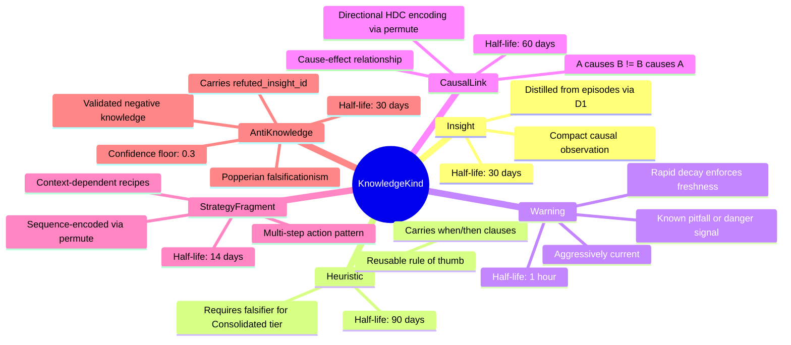
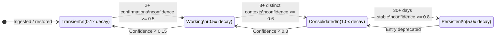
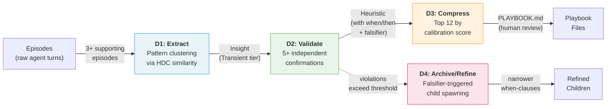
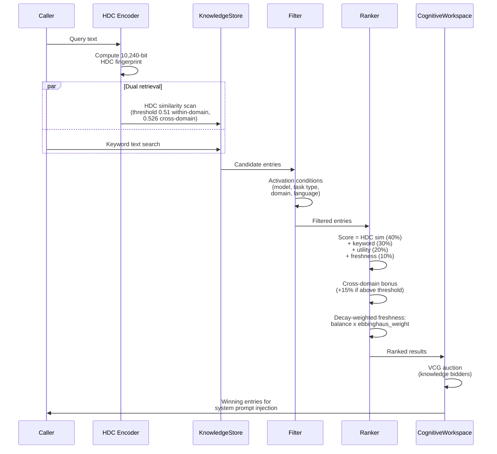

# 09 -- Memory and Knowledge

> Durable knowledge entries, HDC similarity search, Ebbinghaus decay with
> demurrage, four-tier validation, distillation pipelines, and cross-domain
> transfer -- the agent's long-term memory substrate.

> **Implementation status (2026-09):** `roko-neuro::KnowledgeStore` persists
> typed `KnowledgeEntry` records with six canonical kinds, four validation tiers,
> balance-based demurrage, five reinforcement signals, falsifiers, freeze/thaw
> cold storage, HDC fingerprint similarity queries, cross-domain resonance
> detection, tier progression, temporal indexing, worldview clustering, and
> backup/restore with genomic bottleneck. `roko-primitives` provides the
> 10,240-bit `HdcVector` with bind, bundle, permute, similarity,
> `BundleAccumulator`, `DecayingBundleAccumulator`, `ItemMemory`, `Codebook`,
> `PatternStore`, and cross-domain resonance detection. Runtime gate completions
> distill passed patterns into Heuristic or AntiKnowledge entries. Dream
> consolidation runs on idle/cron/episode-count triggers with checkpoint restore.
> Resonator network factorization, the full temporal constraint graph, and
> distributed memory remain target design.

### Implementation sources

| Surface | Authority | Shipped boundary |
|---------|-----------|-----------------|
| KnowledgeEntry, KnowledgeKind, KnowledgeTier | `crates/roko-neuro/src/lib.rs` | Six canonical kinds (Insight, Heuristic, Warning, CausalLink, StrategyFragment, AntiKnowledge) with serde aliases for legacy names; four tiers with multiplier method; balance, frozen, falsifier, activation conditions, emotional provenance, catalytic score, HDC encoder version, access tracking |
| KnowledgeStore lifecycle | `crates/roko-neuro/src/knowledge_store.rs` | Ingest, query, decay, GC, confirm, tier progression, backup/restore, temporal index, worldview clustering |
| Tier progression | `crates/roko-neuro/src/tier_progression.rs` | Configurable promotion/demotion thresholds, confirmation counting, distinct context tracking |
| Distillation | `crates/roko-neuro/src/distillation.rs` | D1 (episodes to insights), D2 (insights to heuristics), D3 (heuristics to playbooks) |
| Temporal index | `crates/roko-neuro/src/temporal.rs` | In-memory `TemporalIndex`, `AllenRelation` (13 variants), `TemporalInterval`, epoch-ordered records |
| HdcVector | `crates/roko-primitives/src/hdc.rs` | 10,240-bit BSC vector, bind/bundle/permute/similarity, `from_seed`, serde, rkyv zero-copy |
| BundleAccumulator | `crates/roko-primitives/src/hdc.rs` | Per-bit vote tracking, weighted addition, decay, majority-vote collapse |
| Codebook / PatternStore | `crates/roko-primitives/src/codebook.rs` | Deterministic concept allocation, role-filler binding, cross-domain resonance detection |
| LSH index | `crates/roko-primitives/src/lsh.rs` | Locality-sensitive hashing for sub-linear HDC similarity search |
| HDC migration | `crates/roko-primitives/src/hdc_migration.rs` | Fingerprint version upgrade framework |
| Demurrage constants | `crates/roko-neuro/src/lib.rs` | `DEMURRAGE_RATE_PER_HOUR`, `BALANCE_GC_FLOOR`, `THAW_STARTER_BALANCE`, `ReinforcementSignal` |
| Source channel discounting | `crates/roko-neuro/src/lib.rs` | `SourceChannel` (5 variants) with per-channel trust discount and security labels |
| Backup/restore | `crates/roko-neuro/src/knowledge_store.rs` | Genomic bottleneck: export top entries, restore at Transient tier with discounted confidence |
| Dream consolidation | `crates/roko-dreams/` | Idle/cron/episode-count triggers, checkpoint restore, NREM replay, hindsight relabeling |
| CLI commands | `crates/roko-cli/src/` | `roko knowledge query/stats/gc/backup/restore/sync/dream/export/import/backfill-hdc/custody/archive` |

---

## 1. KnowledgeEntry

A `KnowledgeEntry` is the fundamental unit of durable memory. Each entry
represents a single piece of reusable understanding distilled from episodes --
classified by kind, validated by tier, and subject to economic decay.

```rust
// From crates/roko-neuro/src/lib.rs
pub struct KnowledgeEntry {
    pub id: String,
    pub kind: KnowledgeKind,
    pub source: Option<String>,
    pub origin_taint: CamelTaintLevel,       // monotonic at ingress
    pub classification: TaintLevel,           // monotonic at ingress
    pub content: String,
    pub confidence: f64,                      // 0.0..=1.0
    pub confidence_weight: f64,               // signed retrieval weight
    pub refuted_insight_id: Option<String>,   // AntiKnowledge only
    pub refutation_evidence: Option<String>,  // AntiKnowledge only
    pub source_episodes: Vec<String>,
    pub tags: Vec<String>,
    pub source_model: Option<String>,
    pub model_generality: f64,               // 1.0 = fully general
    pub created_at: DateTime<Utc>,
    pub half_life_days: f64,
    pub tier: KnowledgeTier,
    pub emotional_tag: Option<EmotionalTag>,
    pub emotional_provenance: Option<EmotionalProvenance>,
    pub hdc_vector: Option<Vec<u8>>,         // 1,280 bytes serialized
    pub confirmation_count: u32,
    pub distinct_contexts: Vec<String>,
    pub deprecated: bool,
    pub balance: f64,                        // demurrage freshness reserve
    pub frozen: bool,                        // cold storage flag
    pub balance_depleted_at: Option<DateTime<Utc>>,
    pub frozen_at: Option<DateTime<Utc>>,
    pub falsifier: Option<Falsifier>,
    pub catalytic_score: u32,                // knowledge-generating count
    pub hdc_encoder_version: u32,
    pub access_count: u64,
    pub last_accessed: Option<DateTime<Utc>>,
    pub activation_conditions: Vec<ActivationCondition>,
}
```

Key fields by role:

| Field | Purpose |
|-------|---------|
| `kind` | Semantic category -- determines base half-life and retrieval behavior |
| `tier` | Validation depth -- scales effective half-life via multiplier |
| `confidence` | 0.0--1.0 score reflecting accumulated evidence |
| `balance` | Freshness reserve subject to demurrage and reinforcement |
| `frozen` | Whether the entry has been moved to cold storage |
| `falsifier` | Falsifiable predicate for Heuristic and AntiKnowledge entries |
| `hdc_vector` | Optional 10,240-bit BSC fingerprint for similarity search |
| `activation_conditions` | Context gates controlling when the entry is surfaced |
| `catalytic_score` | How many new entries this one helped create (autocatalysis metric) |

---

## 2. Six Knowledge Types



Every entry is classified into one of six semantic categories. The type
determines the base half-life and retrieval behavior.

```rust
pub enum KnowledgeKind {
    Insight,           // compact causal observation
    Heuristic,         // reusable rule of thumb
    Warning,           // known pitfall or danger signal
    CausalLink,        // cause-effect relationship with directional HDC encoding
    StrategyFragment,  // multi-step action pattern or recipe
    AntiKnowledge,     // validated negative knowledge -- things that seem true but are not
}
```

Legacy variants (`Fact`, `Procedure`, `Playbook`, `Constraint`) survive as serde
aliases so that persisted entries from older versions can still be deserialized.

### Half-life summary

| Type | Base Half-Life | Rationale | Confidence Floor |
|------|---------------|-----------|-----------------|
| **Insight** | 30 days | Observations need regular revalidation | None |
| **Heuristic** | 90 days | Rules of thumb are more durable | None |
| **Warning** | 1 hour | Danger signals must be aggressively current | None |
| **CausalLink** | 60 days | Causal relationships need periodic confirmation | None |
| **StrategyFragment** | 14 days | Strategies are context-dependent | None |
| **AntiKnowledge** | 30 days (with floor) | Known unknowns are permanently valuable | 0.3 |

```rust
// From crates/roko-neuro/src/lib.rs
pub const INSIGHT_HALF_LIFE_DAYS: f64 = 30.0;
pub const HEURISTIC_HALF_LIFE_DAYS: f64 = 90.0;
pub const WARNING_HALF_LIFE_DAYS: f64 = 1.0 / 24.0;  // 1 hour
pub const CAUSAL_LINK_HALF_LIFE_DAYS: f64 = 60.0;
pub const STRATEGY_FRAGMENT_HALF_LIFE_DAYS: f64 = 14.0;
```

### AntiKnowledge and the challenge mechanism

AntiKnowledge entries carry `refuted_insight_id` and `refutation_evidence`.
When an agent retrieves a knowledge entry that has been challenged, the
`refutation_warning()` method surfaces the counterevidence alongside the
original claim:

```rust
impl KnowledgeEntry {
    pub fn refutation_warning(&self) -> Option<String> {
        if self.kind != KnowledgeKind::AntiKnowledge { return None; }
        let refuted_id = self.refuted_insight_id.as_deref()?.trim();
        let evidence = self.refutation_evidence
            .as_deref()
            .unwrap_or(self.content.as_str())
            .trim()
            .trim_end_matches(|ch| matches!(ch, '.' | '!' | '?'));
        Some(format!("Previous insight {refuted_id} was wrong because {evidence}."))
    }
}
```

AntiKnowledge has a confidence floor of 0.3 -- it never decays below this
threshold during GC. This ensures that lessons about what is false are never
completely forgotten, implementing Popper's falsificationism as a computational
principle.

---

## 3. Four Validation Tiers

Knowledge reliability is tracked orthogonally to type through four tiers. Each
tier carries a multiplicative effect on the base half-life.

```rust
pub enum KnowledgeTier {
    Transient,     // 0.1x -- decays 10x faster
    Working,       // 0.5x -- decays 2x faster
    Consolidated,  // 1.0x -- base rate
    Persistent,    // 5.0x -- decays 5x slower
}

impl KnowledgeTier {
    pub const fn multiplier(&self) -> f32 {
        match self {
            Self::Transient => 0.1,
            Self::Working => 0.5,
            Self::Consolidated => 1.0,
            Self::Persistent => 5.0,
        }
    }
}
```

### Tier progression



```
Transient --(2+ confirms, conf >= 0.5)--> Working --(3+ distinct contexts, conf >= 0.6)--> Consolidated --(30+ days, conf >= 0.8)--> Persistent
```

Demotion rules (asymmetric by design -- negative evidence weighs more heavily):

| From | To | Trigger |
|------|----|---------|
| Persistent | Consolidated | Entry explicitly deprecated |
| Consolidated | Working | Confidence drops below 0.3 |
| Working | Transient | Confidence drops below 0.15 |

### Two-dimensional decay: Type x Tier

The effective half-life is the product of base half-life and tier multiplier:

```
effective_half_life = tier_multiplier * type_base_half_life
```

This produces a 6x4 matrix:

| | Transient (0.1x) | Working (0.5x) | Consolidated (1.0x) | Persistent (5.0x) |
|---|---|---|---|---|
| **Insight** (30d) | 3 days | 15 days | 30 days | 150 days |
| **Heuristic** (90d) | 9 days | 45 days | 90 days | 450 days |
| **Warning** (1h) | 6 min | 30 min | 1 hour | 5 hours |
| **CausalLink** (60d) | 6 days | 30 days | 60 days | 300 days |
| **StrategyFragment** (14d) | 1.4 days | 7 days | 14 days | 70 days |

Key observations:
- A Transient Warning (6 minutes) decays extremely fast -- it must be confirmed
  almost immediately or it vanishes.
- A Persistent Heuristic (450 days) represents the agent's most reliable
  behavioral knowledge.
- A Working Insight (15 days) is the default operating state for most knowledge.

### CLS theory mapping

The four-tier system implements Complementary Learning Systems theory (McClelland
et al. 1995):

| CLS Concept | Roko Implementation |
|-------------|-------------------|
| Hippocampal fast learning | Transient tier -- created quickly, decays rapidly |
| Neocortical slow learning | Persistent tier -- stable, representing generalized patterns |
| Consolidation during sleep | Dreams subsystem replays episodes and promotes tiers |
| Interference protection | Tier separation -- Transient entries cannot corrupt Persistent entries |
| Gradual transfer | Working -> Consolidated -> Persistent as evidence accumulates |

---

## 4. Ebbinghaus Decay with Demurrage

### The forgetting curve

The retention model combines Ebbinghaus time-decay with an economic demurrage
mechanism:

```
balance(t + dt) = balance(t) - demurrage_tax(dt) + reinforcement(kind, novelty)
freshness(t) = balance(t) * ebbinghaus_weight(age, type_half_life, tier_multiplier)
```

The Ebbinghaus weight is an exponential decay function:

```
ebbinghaus_weight(age_hours, half_life_hours) = exp(-age_hours * ln(2) / half_life_hours)
```

This formula is implemented directly:

```rust
impl KnowledgeEntry {
    pub fn freshness(&self, now: DateTime<Utc>) -> f64 {
        let age_hours = now.signed_duration_since(self.created_at).num_seconds() as f64 / 3600.0;
        if age_hours <= 0.0 { return self.balance; }
        let half_life_hours = self.effective_half_life_days() * 24.0;
        let ebbinghaus = if half_life_hours > 0.0 {
            (-(age_hours * 2.0_f64.ln()) / half_life_hours).exp()
        } else {
            0.0
        };
        self.balance * ebbinghaus
    }

    pub fn effective_half_life_days(&self) -> f64 {
        let base = if self.half_life_days.is_finite() && self.half_life_days > 0.0 {
            self.half_life_days
        } else {
            self.kind.default_half_life_days()
        };
        base * self.tier.multiplier() as f64
    }
}
```

### Worked examples

**Example 1: A Working Insight (effective half-life = 15 days = 360 hours)**

At balance = 1.0, no reinforcement:

| Age | Ebbinghaus weight | Freshness | Interpretation |
|-----|------------------|-----------|---------------|
| 0 days | 1.000 | 1.000 | Fresh at ingest |
| 7 days | 0.722 | 0.722 | Moderate decay after one week |
| 15 days | 0.500 | 0.500 | Exactly one half-life elapsed |
| 30 days | 0.250 | 0.250 | Two half-lives -- approaching GC threshold |
| 45 days | 0.125 | 0.125 | Three half-lives -- near floor |

Derivation for 7 days: `exp(-168 * ln(2) / 360) = exp(-0.3252) = 0.722`

**Example 2: A Persistent Fact (effective half-life = 1,825 days)**

| Age | Ebbinghaus weight | Interpretation |
|-----|------------------|---------------|
| 30 days | 0.989 | Nearly unchanged after a month |
| 365 days | 0.863 | Still strong after a year |
| 1825 days | 0.500 | One half-life after 5 years |

**Example 3: A Transient Warning (effective half-life = 6 minutes = 0.1 hours)**

| Age | Ebbinghaus weight | Interpretation |
|-----|------------------|---------------|
| 1 min | 0.891 | Already decaying |
| 6 min | 0.500 | One half-life |
| 20 min | 0.100 | Nearly gone |
| 1 hour | 0.001 | Effectively zero |

### Demurrage model

Balance decreases over time through demurrage tax:

```rust
pub const DEMURRAGE_RATE_PER_HOUR: f64 = 0.005;
pub const BALANCE_GC_FLOOR: f64 = 0.05;

impl KnowledgeEntry {
    pub fn apply_demurrage(&mut self, elapsed_hours: f64) {
        if elapsed_hours <= 0.0 { return; }
        let deduction = DEMURRAGE_RATE_PER_HOUR * elapsed_hours;
        self.balance = (self.balance - deduction).max(0.0);
    }
}
```

At the default rate of 0.005/hour, an entry with balance 1.0 and no
reinforcement reaches the GC floor (0.05) after approximately 190 hours
(~8 days). But reinforcement signals restore balance, so entries that remain
useful stay warm indefinitely.

### Reinforcement signals

Five balance-earning events replenish freshness:

```rust
pub enum ReinforcementSignal {
    Retrieved,     // 0.05 base bump
    Cited,         // 0.10 base bump
    Gated,         // 0.15 base bump
    Surprised,     // 0.08 base bump
    AgentQuoted,   // 0.12 base bump
}
```

Each bump is novelty-weighted: `bump = base_value * (1.0 + novelty)` where
`novelty = 1.0 - max_hdc_similarity` against top-K neighbors. Common entries
get small bumps; rare-but-useful entries get larger bumps. Balance is capped
at 5.0.

This implements the anti-hoarding rule: knowledge must earn its balance from
uniquely useful contributions, not merely from being repeated. The spacing
effect (Ebbinghaus 1885) is also preserved: reinforcement across distinct
episodes matters more than repeated retrieval within a single task.

### Source channel discounting

On ingest, each entry's confidence is multiplied by a channel-specific trust
discount:

| Channel | Discount | Rationale |
|---------|----------|-----------|
| `UserInput` | 1.00 | Fully trusted |
| `GateVerdict` | 0.95 | High but not perfect trust |
| `AgentOutput` | 0.80 | LLM outputs need verification |
| `ExternalApi` | 0.60 | External data may be unreliable |
| `DreamConsolidation` | 0.50 | Speculative knowledge |

### Research context: validating the Ebbinghaus approach

FadeMem (arXiv:2601.18642) provides independent empirical validation that
Ebbinghaus-based decay is effective for agent memory systems. Their streaming
memory framework uses exponential forgetting curves to weight observation
relevance, achieving strong performance on long-context benchmarks. Roko's
approach is compatible: the tier multiplier and demurrage model generalize
the basic Ebbinghaus curve with economic reinforcement.

Memory Worth (arXiv:2604.12007) introduces outcome-grounded forgetting --
tracking how often each memory co-occurs with successful versus failed outcomes rather than relying on age alone; the paper stresses that this signal is associational, not causal (§3, §4.2). Roko's reinforcement signals partially implement this: the
`Gated` signal specifically rewards knowledge that contributed to gate success.
The catalytic score (`catalytic_score` field) extends this further by tracking
how many new entries each entry helped create, enabling autocatalysis
measurement (network is self-sustaining when mean catalytic score exceeds 1.5).

---

## 5. Falsifiers

Every Heuristic and AntiKnowledge entry should carry a **falsifier** -- a
concrete, testable predicate that specifies conditions under which the entry
should be considered wrong.

```rust
pub struct Falsifier {
    pub predicate: String,       // the concrete claim to check
    pub observations: u32,       // times checked
    pub violations: u32,         // times the predicate was violated
    pub last_checked: DateTime<Utc>,
    pub active: bool,            // whether to continue checking
}
```

The falsifier serves two purposes:

1. **Epistemic hygiene.** Forces the system to articulate *how* a rule could be
   wrong, preventing unfalsifiable belief accumulation. A heuristic without a
   falsifier cannot be frozen at Consolidated tier.

2. **Automatic retirement.** When a falsifier accumulates enough violations
   (ratio exceeding a threshold), the entry is demoted or refined. Violations
   spawn refined children with narrower activation conditions -- for example,
   "When refactoring code, run clippy" that fails for JavaScript files spawns
   "When refactoring Rust code, run clippy."

Surviving observations (predicate holds) increase the entry's evidentiary
standing. A single observed violation deactivates the falsifier and discredits
the entry. This implements Popper's falsificationism as a live runtime
mechanism rather than a passive philosophical principle.

---

## 6. HDC/VSA Foundations

### What HDC is

Hyperdimensional Computing (HDC), also called Vector Symbolic Architectures
(VSA), represents information as high-dimensional binary vectors and
manipulates them with a small set of algebraic operations. The mathematical
foundation rests on a geometric fact: **concentration of measure** in
high-dimensional spaces.

In a D-dimensional binary space {0,1}^D, the expected Hamming distance between
two independently drawn vectors is D/2, with standard deviation sqrt(D)/2.
As D grows, the distribution of pairwise distances concentrates tightly around
the mean:

```
Expected Hamming distance:     mu = D/2
Standard deviation:            sigma = sqrt(D) / 2
Coefficient of variation:      CV = sigma / mu = 1 / sqrt(D)
```

At D = 10,240:

```
CV = 1 / sqrt(10240) = 0.00988
```

99% of random pairs land within 1% of the expected Hamming distance D/2. The
normalized Hamming similarity (fraction of matching bits) concentrates around
0.5. Random vectors are neither similar nor dissimilar -- they are **reliably
orthogonal**. When similarity is significantly above 0.5, there is a genuine
structural relationship.

Kanerva (2009) formalized these properties and showed that the same geometry
underlies neural population codes in the brain. Place cells in the hippocampus,
grid cells in the entorhinal cortex, and sparse codes throughout the cortex all
operate in regimes where quasi-orthogonality provides the capacity guarantees
that HDC exploits computationally.

### Selected system: Binary Spatter Codes (BSC)

Roko uses BSC exclusively, chosen for five reasons:

1. **Exact invertibility.** XOR is its own inverse: `bind(bind(a, b), b) = a`
   exactly. No approximation error. Structured queries decompose composites
   without information loss.

2. **Storage efficiency.** 1,280 bytes per vector. A 100K-entry knowledge base
   requires only ~128 MB of HDC storage. HRR at D=10,000 requires 40 KB per
   vector (40 GB for 100K entries).

3. **Computation speed.** XOR compiles to a single instruction per 64-bit word.
   Comparing two 10,240-bit vectors takes ~13 ns on x86 AVX-512. Brute-force
   scanning of 100K entries takes ~1.3 ms.

4. **Bundle capacity.** D=10,240 BSC vectors reliably store up to ~1,000 bound
   pairs in a bundle with >95% retrieval accuracy (Kleyko et al. 2022).

5. **Discrete data fit.** Knowledge entries are inherently discrete -- typed
   tags, named concepts, structured relationships. BSC's discrete operations
   are a natural match.

| Property | BSC | MAP | HRR | FHRR |
|----------|-----|-----|-----|------|
| Vector space | {0,1}^D | {-1,0,+1}^D | R^D | C^D |
| Binding | XOR | Multiplication | Circular convolution | Phase addition |
| Unbinding | Exact (self-inverse) | Exact | Approximate | Approximate |
| Bundle capacity at D=10K | ~1,000 pairs | ~800 pairs | ~100 pairs | ~100 pairs |
| Storage per vector | 1,280 bytes | 10--40 KB | 40 KB | 80 KB |

### Dimension: D = 10,240

The implementation uses **D = 10,240 bits = 160 x u64 words = 1,280 bytes**.

Two reasons for this specific number:

1. **Quasi-orthogonality guarantee.** P(|sim| > 0.05 from expected) < 10^-9
   for random pairs.

2. **SIMD alignment.** 160 words = 5 x 32-word AVX-512 passes or 10 x 16-word
   AVX2 passes. Clean loop boundaries with no remainder handling.

### Johnson-Lindenstrauss bound

The Johnson-Lindenstrauss lemma (1984) provides a lower bound on the dimension
needed to preserve pairwise distances for N points with distortion epsilon:

```
D >= (8 ln N) / epsilon^2
```

For N = 100,000 knowledge entries and epsilon = 0.1 (10% maximum distortion):

```
D >= (8 * ln(100000)) / 0.01
   = (8 * 11.51) / 0.01
   = 9,210
```

D = 10,240 exceeds this bound, confirming sufficiency for 100K+ entries with
less than 10% distance distortion. For N = 1,000,000 entries (a large
collective knowledge base):

```
D >= (8 * ln(1000000)) / 0.01
   = (8 * 13.82) / 0.01
   = 11,052
```

This exceeds 10,240, suggesting that for very large knowledge bases (>100K
entries) the dimension may need to increase to D = 12,288 or D = 16,384.

### Signal-to-noise ratio and capacity bounds

For a bundle of K items in D dimensions:

```
SNR = sqrt(D / K)
```

At D = 10,240:

| K (items bundled) | SNR | Max codebook N at 99% accuracy |
|-------------------|-----|-------------------------------|
| 5 | 45.3 | >100,000 |
| 10 | 32.0 | >50,000 |
| 50 | 14.3 | ~5,000 |
| 100 | 10.1 | ~1,000 |
| 200 | 7.2 | ~200 |
| 500 | 4.5 | ~20 |

For the primary use case -- encoding 5--10 role-filler pairs per knowledge
entry -- the capacity is enormous (SNR > 30). Safe rule of thumb: K < 100
items per bundle for reliable retrieval against codebooks of 1,000+ entries.

### Performance characteristics

| Entries | Scan time (AVX-512) | Scan time (ARM NEON) |
|---------|--------------------|--------------------|
| 1,000 | ~13 us | ~30 us |
| 10,000 | ~130 us | ~300 us |
| 100,000 | ~1.3 ms | ~3 ms |
| 1,000,000 | ~13 ms | ~30 ms |

For per-agent knowledge bases (typically <100K entries), brute-force scan is
fast enough that no approximate nearest neighbor index is needed.

### Storage comparison

| Items | HDC (1,280 B/vec) | Neural embeddings (768-d float32, 3,072 B/vec) |
|-------|-------------------|--------------------------------------------|
| 1,000 | 1.28 MB | 3.07 MB |
| 10,000 | 12.8 MB | 30.7 MB |
| 100,000 | 128 MB | 307 MB |

### PathHD connection

PathHD (arXiv:2512.09369) demonstrates that HDC can serve as an effective
retrieval mechanism for knowledge graph queries, achieving competitive accuracy
with substantially lower computational cost than embedding-based approaches.
Roko's use of HDC for knowledge retrieval follows this pattern: the role-filler
binding structure naturally encodes knowledge graph relationships, and the
algebraic operations support structured query decomposition.

---

## 7. HDC Operations

```mermaid
flowchart TB
    subgraph ops["Three Core Operations"]
        direction TB
        bind["<b>Bind (XOR)</b>\nA ⊕ B"]
        bundle["<b>Bundle (Majority Vote)</b>\nmajority(A, B, C)"]
        permute["<b>Permute (Cyclic Shift)</b>\nrotate(A, k)"]
    end

    subgraph bind_props["Bind Properties"]
        direction TB
        bp1["Self-inverse: bind(bind(A,B), B) = A"]
        bp2["Commutative: bind(A,B) = bind(B,A)"]
        bp3["Associative: bind(A, bind(B,C)) = bind(bind(A,B), C)"]
        bp4["Distributes over bundle"]
    end

    subgraph bundle_props["Bundle Properties"]
        direction TB
        bup1["Similarity-preserving: result similar to all inputs"]
        bup2["Capacity: SNR = sqrt(D/K)"]
        bup3["NOT associative: needs accumulator"]
        bup4["~5 ns per vector (10,240-bit)"]
    end

    subgraph permute_props["Permute Properties"]
        direction TB
        pp1["Group: perm(perm(A,j), k) = perm(A, j+k)"]
        pp2["Invertible: perm(perm(A,k), D-k) = A"]
        pp3["Quasi-orthogonal to input for k >= 1"]
        pp4["Preserves pairwise similarity"]
    end

    bind --> bind_props
    bundle --> bundle_props
    permute --> permute_props

    subgraph encoding["Composite Encoding Example"]
        direction LR
        e1["role_language"] -->|bind| e2["hv_rust"]
        e3["role_topic"] -->|bind| e4["hv_async"]
        e2 -->|bundle| record["Record Vector"]
        e4 -->|bundle| record
        record -->|"bind(record, role_language)"| answer["≈ hv_rust"]
    end

    ops --> encoding
```



### The Rust implementation

```rust
// From crates/roko-primitives/src/hdc.rs
pub struct HdcVector {
    bits: [u64; 160],  // 160 words * 64 bits = 10,240 bits
}
```

Key properties: `Copy` semantics (1,280 bytes on the stack), deterministic
seeding via `from_seed(bytes)` using FNV-1a + splitmix64, full serde support,
rkyv zero-copy deserialization.

### 7.1 Bind (XOR)

Binding associates two hypervectors into a new vector quasi-orthogonal to both
inputs. It encodes **typed relationships**: "Rust in the language role."

```
bind(A, B) = A XOR B    (componentwise XOR)
```

| Property | Formula | Significance |
|----------|---------|-------------|
| **Self-inverse** | bind(bind(A, B), B) = A | No separate unbind needed |
| **Commutative** | bind(A, B) = bind(B, A) | Symmetric unless permute is used |
| **Associative** | bind(A, bind(B, C)) = bind(bind(A, B), C) | Multi-way binding in any order |
| **Distributes over bundle** | bind(A, bundle(B, C)) = bundle(bind(A, B), bind(A, C)) | Structured queries work |

The distributivity property makes structured queries possible:

```
record = bundle(bind(role_language, hv_rust), bind(role_topic, hv_async))
answer = bind(record, role_language)  -->  approximately hv_rust
```

```rust
impl HdcVector {
    pub fn bind(&self, other: &Self) -> Self {
        let mut bits = [0u64; 160];
        for (slot, (left, right)) in bits.iter_mut()
            .zip(self.bits.iter().zip(other.bits.iter()))
        {
            *slot = left ^ right;
        }
        Self { bits }
    }
}
```

**Performance**: 160 XOR operations on u64 words. ~5 ns scalar, ~2 ns AVX-512.

### 7.2 Bundle (Majority Vote)

Bundling superimposes multiple hypervectors into a single aggregate **similar
to all inputs** -- a "set union" in hypervector space:

```
bundle(A, B, C)[i] = majority(A[i], B[i], C[i])
```

| Property | Details |
|----------|---------|
| **Similarity preservation** | sim(bundle(A, B), A) >= sim(bundle(A, B), B) > 0.5 |
| **Capacity** | SNR = sqrt(D/K) for K bundled items |
| **NOT associative** | bundle(bundle(A, B), C) != bundle(A, bundle(B, C)) |
| **Requires accumulator** | Incremental bundling needs integer vote counts |

```rust
impl HdcVector {
    pub fn bundle(vectors: &[&Self]) -> Self {
        if vectors.is_empty() { return Self::zeros(); }
        let len = vectors.len();
        let mut bits = [0u64; 160];
        for (word_index, slot) in bits.iter_mut().enumerate() {
            let mut word = 0u64;
            for bit_index in 0..64 {
                let mut ones = 0usize;
                for vector in vectors {
                    ones += ((vector.bits[word_index] >> bit_index) & 1) as usize;
                }
                if ones * 2 > len {
                    word |= 1u64 << bit_index;
                }
            }
            *slot = word;
        }
        Self { bits }
    }
}
```

**Performance**: O(D x K). For K=10 vectors: ~800 ns. For K=100: ~8 us.

### BundleAccumulator

Because bundling is not associative over binary vectors, incremental bundling
requires a per-bit vote accumulator:

```rust
pub struct BundleAccumulator {
    votes: Vec<i32>,    // 10,240 entries, 40 KB
    pub count: usize,
}

impl BundleAccumulator {
    pub fn new() -> Self {
        Self { votes: vec![0i32; 10_240], count: 0 }
    }

    // add(): +1 for set bits, -1 for unset (bipolar encoding)
    pub fn add(&mut self, hv: &HdcVector) { /* O(D) per call */ }

    // add_weighted(): equivalent to abs(weight) add() calls in one pass
    pub fn add_weighted(&mut self, hv: &HdcVector, weight: i32) { /* ... */ }

    // finish(): votes[i] > 0 -> bit 1; ties break to 0 for determinism
    pub fn finish(&self) -> HdcVector { /* ... */ }

    // decay(): votes *= factor, controlled forgetting
    // Half-life: -ln(2) / ln(factor)
    //   factor 0.90 -> half-life 6.6 decays
    //   factor 0.95 -> half-life 13.5 decays
    //   factor 0.99 -> half-life 69.0 decays
    pub fn decay(&mut self, factor: f32) { /* ... */ }
}
```

The bipolar encoding (+1/-1 instead of 1/0) centers votes at zero, making the
majority threshold a simple sign check. Ties (votes == 0) break to 0 for
determinism -- same inputs always produce same outputs (Kleyko et al. 2022
note that random tie-breaking preserves statistical properties but
determinism matters more for reproducibility).

### 7.3 Permute (Cyclic Shift)

Permutation applies a cyclic bit rotation by k positions, producing a vector
quasi-orthogonal to the original:

```
permute(A, k) = cyclic_left_shift(A, k)
```

| Property | Details |
|----------|---------|
| **Group operation** | permute(permute(A, j), k) = permute(A, j+k) |
| **Invertible** | permute(permute(A, k), D-k) = A |
| **Quasi-orthogonality** | permute(A, k) is quasi-orthogonal to A for k >= 1 |
| **Preserves similarity** | sim(permute(A, k), permute(B, k)) = sim(A, B) |

```rust
impl HdcVector {
    pub fn permute(&self, n: usize) -> Self {
        let bits_len = self.bits.len() * 64;
        let n = n % bits_len;
        if n == 0 { return *self; }
        let word_shift = n / 64;
        let bit_shift = n % 64;
        let mut bits = [0u64; 160];
        for (index, slot) in bits.iter_mut().enumerate() {
            let src0 = (index + 160 - word_shift) % 160;
            *slot = if bit_shift == 0 {
                self.bits[src0]
            } else {
                let src1 = (src0 + 159) % 160;
                (self.bits[src0] << bit_shift) | (self.bits[src1] >> (64 - bit_shift))
            };
        }
        Self { bits }
    }
}
```

**Performance**: ~10 ns. Used to encode directionality in CausalLinks:

```
causal_hv = bind(permute(hv_cause, 1), permute(hv_effect, 2))
```

This ensures "A causes B" differs from "B causes A." Sequence encoding follows
the same pattern: `bundle(permute(step1, 0), permute(step2, 1), permute(step3, 2))`.

### 7.4 Similarity (Hamming Distance)

Similarity is the fraction of matching bits:

```
sim(A, B) = 1 - hamming_distance(A, B) / D
```

| Range | Meaning |
|-------|---------|
| 1.0 | Identical vectors |
| > 0.526 | Meaningful relationship (Bonferroni-corrected for 100K vocabulary) |
| > 0.52 | Meaningful relationship (single-pair check) |
| 0.48 -- 0.52 | Noise band (quasi-orthogonal, no relationship) |
| < 0.48 | Meaningful dissimilarity (anti-correlated) |
| 0.0 | Bitwise complement |

```rust
impl HdcVector {
    pub fn similarity(&self, other: &Self) -> f32 {
        let mut differing_bits = 0u32;
        for (left, right) in self.bits.iter().zip(other.bits.iter()) {
            differing_bits += (left ^ right).count_ones();
        }
        let differing_bits = u16::try_from(differing_bits).unwrap_or(u16::MAX);
        1.0_f32 - (f32::from(differing_bits) / 10_240.0_f32)
    }
}
```

**Performance**: 160 XOR + POPCNT operations: ~13 ns on x86 with SIMD.

With rkyv, similarity can be computed directly against memory-mapped archived
vectors without deserialization (zero-copy scan of on-disk knowledge bases).

---

## 8. False Positive Rate Calculations

### Statistical foundation

For two independent random 10,240-bit binary vectors, the Hamming similarity
distribution is:

```
mu    = 0.5
sigma = 1 / (2 * sqrt(D)) = 1 / (2 * sqrt(10240)) = 0.00494
```

By the Central Limit Theorem, for D = 10,240: `sim ~ N(0.5, 0.00494^2)`.

A similarity of s corresponds to Z-score:

```
Z = (s - 0.5) / sigma = (s - 0.5) / 0.00494
```

False positive rate: `P(sim > s) = 1 - Phi(Z)` where Phi is the standard
normal CDF.

### Threshold table

| Threshold | Z-score | Per-comparison FP rate | Use case |
|-----------|---------|----------------------|----------|
| 0.505 | 1.01 | 15.6% | Too low -- noise |
| 0.510 | 2.02 | 2.17% | Rough screening |
| 0.515 | 3.04 | 0.12% | Conservative single-pair |
| 0.520 | 4.05 | 2.6 x 10^-5 | Moderate vocabulary |
| **0.526** | **5.26** | **7.3 x 10^-8** | **100K vocabulary (Bonferroni)** |
| 0.530 | 6.07 | 6.5 x 10^-10 | 1M vocabulary |
| 0.540 | 8.10 | < 10^-15 | Extremely conservative |

### Bonferroni correction derivation

When scanning N entries, the probability of at least one false positive:

```
P(at least 1 FP) ~= N * P(single FP)    (for small P)
```

To maintain overall false positive rate alpha across N comparisons:

```
P(single FP) <= alpha / N
```

| Vocabulary (N) | Target alpha | Required per-comparison FP | Required Z | Threshold |
|----------------|-------------|---------------------------|-----------|-----------|
| 100 | 1% | 10^-4 | 3.72 | 0.518 |
| 1,000 | 1% | 10^-5 | 4.26 | 0.521 |
| 10,000 | 1% | 10^-6 | 4.75 | 0.523 |
| **100,000** | **1%** | **10^-7** | **5.26** | **0.526** |
| 1,000,000 | 1% | 10^-8 | 5.73 | 0.528 |

### Multi-agent confirmation

Two-agent confirmation at the 0.526 threshold:

```
P(joint FP) = P(agent_1 FP) * P(agent_2 FP)
            = (7.3 x 10^-8)^2
            = 5.3 x 10^-15
```

Effectively zero false positives with two independent confirmations.

### JL bound validation

| N (entries) | epsilon | Minimum D | D=10,240 sufficient? |
|-------------|---------|-----------|---------------------|
| 1,000 | 0.1 | 553 | Yes (18.5x headroom) |
| 10,000 | 0.1 | 737 | Yes (13.9x headroom) |
| 100,000 | 0.1 | 921 | Yes (11.1x headroom) |
| 100,000 | 0.05 | 3,682 | Yes (2.8x headroom) |
| 1,000,000 | 0.05 | 4,423 | Yes (2.3x headroom) |
| 1,000,000 | 0.03 | 12,286 | **No** (needs D >= 12,288) |

---

## 9. Cross-Domain HDC Transfer

The most novel HDC capability is **cross-domain insight resonance** --
automatic detection of structural analogies across domains in nanoseconds.

### How it works

When entries encode the same abstract relationship using shared role vectors,
their HDC fingerprints have elevated similarity regardless of domain-specific
fillers:

```
Coding:   BIND(role_risk_factor, hv_high_complexity) XOR BIND(role_response, hv_more_review)
Chain:    BIND(role_risk_factor, hv_high_volatility) XOR BIND(role_response, hv_more_caution)
Research: BIND(role_risk_factor, hv_contradictory_sources) XOR BIND(role_response, hv_more_verification)
```

All three share the abstract structure `BIND(role_risk_factor, hv_X) XOR
BIND(role_response, hv_Y)`. The shared role vectors create measurable
similarity (typically 0.53--0.58) above the 0.526 cross-domain threshold.

### Role vector hierarchy

**Abstract roles** (enable cross-domain transfer):

| Role | Encodes |
|------|---------|
| `role:risk_factor` | What creates risk |
| `role:response` | How to respond |
| `role:pattern` | Observable signal |
| `role:severity` | How serious |
| `role:temporal` | Time dimension |
| `role:confidence` | Certainty level |

**Domain-specific roles** (within-domain precision only):

- Coding: `role:crate`, `role:function`, `role:module`
- Chain: `role:protocol`, `role:asset`, `role:pool`
- Research: `role:source`, `role:citation`, `role:method`

Cross-domain transfer happens through abstract roles only. Domain-specific
roles add precision within a domain but are orthogonal across domains.

### Analogical reasoning

HDC answers "A is to B as C is to ?" using binding:

```
relationship = BIND(hv_rust, hv_borrow_checker)    -- captures the relationship
answer = BIND(relationship, hv_java)                -- applies to new domain
nearest(answer, codebook) --> hv_garbage_collector   -- recovers the analogy
```

### Transfer risk assessment

Not all structural analogies are beneficial. Surface-structure matches can
mask deep-structure mismatches. The system assesses transfer risk using
domain distance (vocabulary divergence, structural divergence, outcome
correlation) and historical success rates for each domain pair.

### xMemory decoupling pattern

xMemory (Hu et al. 2026, arXiv:2602.02007) argues that agent memory should decouple before it aggregates: split the interaction history into segments and reusable memory components first, then aggregate related components into groups for retrieval (abstract). Roko separates a different set of stages: HDC similarity search, the demurrage/reinforcement model and the CognitiveWorkspace VCG auction run independently, so each can evolve without breaking the others. That separation is Roko's design; the paper does not test it.

---

## 10. Distillation Pipeline



### Four stages

Knowledge is distilled from raw episodes through a staged pipeline that runs
during Dream consolidation:

| Stage | Input | Output | Criteria |
|-------|-------|--------|----------|
| **D1** | Recurring episode patterns | Insight at Transient tier | 3+ supporting episodes |
| **D2** | Confirmed insights | Heuristic with when/then + falsifier | 5+ independent confirmations |
| **D3** | Top heuristics | `PLAYBOOK.md` for human review | Top 12 by calibration score |
| **D4** | Heuristic violations | Refined children with narrower conditions | Falsifier triggered above threshold |

D1 extracts patterns from high-surprise episodes using HDC clustering. D2
promotes validated Insights into actionable Heuristics with mandatory
falsifiers. D3 compiles the best-calibrated Heuristics into human-readable
playbook files. D4 refines Heuristics whose falsifiers fire by spawning
children with narrower when-clauses.

### Research context: adaptive pipelines

FluxMem (arXiv:2602.14038) introduces adaptive memory structure selection via
Beta Mixture Models -- the memory system itself learns which storage structure
(list, queue, graph, hierarchy) best fits each type of information. Roko's
six-kind system is a static version of this: the kind determines the
half-life and retrieval behavior. A future evolution could make the kind
assignment itself adaptive based on observed retrieval patterns.

MemPro (arXiv:2606.00619) proposes evolvable memory pipelines where the
pipeline structure itself is subject to evolution. This aligns with Roko's
architecture: the distillation stages are defined as Dream phases that
can be extended or refined through configuration and the cross-cut functor
system.

---

## 11. Knowledge Query API



### Core query flow

```
1. Compute HDC fingerprint for query text
2. Scan local NeuroStore for similarity matches
3. Filter by activation conditions (model, task type, domain, language)
4. Score results: HDC similarity (40%) + keyword match (30%) + utility (20%) + freshness (10%)
5. Cross-domain bonus (+15% for matches from other domains above threshold)
6. Results enter the CognitiveWorkspace VCG auction as knowledge bidders
7. Winning entries are injected into the system prompt
```

Within-domain queries use a lower threshold (0.51) because the domain
constraint already reduces false positive space. Cross-domain queries use
the full 0.526 threshold.

### CLI interface

```bash
# Query the knowledge store
roko knowledge query "borrow checker patterns"

# Store statistics
roko knowledge stats

# Garbage collection
roko knowledge gc

# Export and import
roko knowledge export --output knowledge.json
roko knowledge import --input knowledge.json

# Backfill HDC fingerprints for entries without them
roko knowledge backfill-hdc

# Dream consolidation
roko knowledge dream run
roko knowledge dream report
roko knowledge dream schedule

# Custody chain
roko knowledge custody list
roko knowledge custody show <entry-id>
roko knowledge custody verify

# Cold storage archival
roko knowledge archive
```

---

## 12. Backup and Restore with Genomic Bottleneck

### Backup

Export selects the top entries by freshness score, preserving the most
valuable knowledge while shedding low-value entries. The selection process
mimics a genomic bottleneck: only the fittest knowledge survives the
transfer.

### Restore

On restore, all entries start at Transient tier with discounted confidence
(multiplied by the source channel discount for `ExternalApi` = 0.6). Entries
must re-prove themselves in the new context. This prevents importing stale or
context-inappropriate knowledge at inflated confidence levels.

```bash
# Backup with genomic bottleneck
roko knowledge backup --output backup.json

# Restore with decay
roko knowledge restore --input backup.json
```

The backup includes entry content, kind, tags, HDC vectors, and source
episode references. It does not include balance or tier -- those are reset
on restore.

---

## 13. Temporal Query and GC

### Temporal index

`roko-neuro` provides an optional in-memory `TemporalIndex` using Allen's
13 interval relations (Allen 1983). Each knowledge entry can be associated
with a temporal interval, and the index supports temporal queries:

```rust
pub enum AllenRelation {
    Before, After, Meets, MetBy, Overlaps, OverlappedBy,
    Contains, During, Starts, StartedBy, Finishes, FinishedBy, Equal,
}

pub struct TemporalInterval {
    pub start: i64,   // epoch milliseconds
    pub end: i64,
}
```

The 13 relations form a JEME (jointly exhaustive, mutually exclusive)
partition: every pair of intervals satisfies exactly one relation.

### Garbage collection

GC removes entries whose confidence falls below `DEFAULT_GC_MIN_CONFIDENCE`
(0.05). AntiKnowledge entries are exempt below their confidence floor of 0.3.
Worldview clustering prevents GC from removing the last representative of a
conceptual cluster.

The GC schedule interacts with cold storage: entries whose balance falls below
`BALANCE_GC_FLOOR` (0.05) are frozen rather than deleted. Frozen entries retain
their content address and lineage but are excluded from hot query results.
Thawing restores a starter balance (`THAW_STARTER_BALANCE` = 0.3) so the entry
can compete again.

```rust
pub const BALANCE_GC_FLOOR: f64 = 0.05;
pub const THAW_STARTER_BALANCE: f64 = 0.3;
```

Seven-day depleted-balance freezing: entries whose balance has been at zero
for 7 days are automatically frozen into cold storage. The
`balance_depleted_at` timestamp tracks when depletion began.

---

## 14. Worldview Clustering

Worldview clustering groups related knowledge entries by tag overlap using
union-find. During GC, if an entry is the last representative of its
worldview cluster, it is preserved to prevent losing an entire conceptual
domain.

```rust
pub struct WorldviewCluster {
    pub id: String,
    pub representative_tags: Vec<String>,
    pub entry_count: usize,
}
```

The clustering algorithm uses O(n^2) pairwise tag overlap -- acceptable for
typical knowledge store sizes. Two entries share a cluster when they have at
least `min_tag_overlap` tags in common.

---

## Research Citations

### Foundational

- **Kanerva, P.** (2009). "Hyperdimensional Computing: An Introduction to
  Computing in Distributed Representation with High-Dimensional Random
  Vectors." *Cognitive Computation*, 1(2), 139--159. (BSC algebra formalization,
  quasi-orthogonality proofs, neural population code connection)

- **Plate, T. A.** (2003). *Holographic Reduced Representations: Distributed
  Representation for Cognitive Structures.* CSLI Publications. (Bundle capacity
  proofs, HRR algebra)

- **Kleyko, D., Rachkovskij, D. A., Osipov, E., & Rahimi, A.** (2022). "A
  Survey on Hyperdimensional Computing: Theory, Architecture, and Applications."
  *ACM Computing Surveys*, 54(6). (Capacity bounds, performance benchmarks,
  tie-breaking analysis)

- **Ebbinghaus, H.** (1885). *Uber das Gedachtnis.* Leipzig: Duncker & Humblot.
  (Forgetting curve, spacing effect)

- **McClelland, J. L., McNaughton, B. L., & O'Reilly, R. C.** (1995). "Why
  there are complementary learning systems in the hippocampus and neocortex."
  *Psychological Review*, 102(3), 419--457. (CLS theory: fast hippocampal
  learning consolidating into slow neocortical memory)

- **Richards, B. A. & Frankland, P. W.** (2017). "The Persistence and
  Transience of Memory." *Neuron*, 94(6), 1071--1084. (Forgetting as active,
  beneficial process; transient vs. persistent memory traces)

- **Johnson, W. B. & Lindenstrauss, J.** (1984). "Extensions of Lipschitz
  mappings into a Hilbert space." *Contemporary Mathematics*, 26, 189--206.
  (Dimensionality lower bound for distance preservation)

### Contemporary agent memory research

- **FluxMem** (arXiv:2602.14038). Adaptive memory structure selection via
  Beta Mixture Model. Evidence that memory structure should be adaptive, not
  fixed. Roko's six-kind system is a static approximation; future work could
  make kind assignment itself adaptive.

- **Memory Worth** (arXiv:2604.12007). Outcome-grounded forgetting metric --
  tracking how often a memory co-occurs with success versus failure rather than relying on age alone (associational, not causal, as the paper stresses; §3, §4.2). Roko's `Gated` reinforcement signal and catalytic score partially
  implement this.

- **FadeMem** (arXiv:2601.18642). Validates the Ebbinghaus-based decay
  approach for streaming agent memory. Empirical support for roko-neuro's
  exponential forgetting curves.

- **MemPro** (arXiv:2606.00619). Evolvable memory pipelines where the
  pipeline structure itself is subject to evolution. Aspirational target for
  Roko's distillation pipeline self-improvement.

- **PathHD** (arXiv:2512.09369). HDC for knowledge graph retrieval.
  Encodes multi-hop relation paths with an order-sensitive, non-commutative (block-diagonal GHRR) binding and retrieves them by calibrated cosine similarity; competitive Hits@1 and F1 on WebQSP, CWQ and GrailQA at markedly lower inference cost (abstract).

- **xMemory** (arXiv:2602.02007). Decouple before aggregating: split history into segments and memory components, then group them (abstract); Roko's stage separation is its own design, not tested by the paper.

---

## Verification Commands

```bash
# Run the full roko-neuro test suite
cargo test -p roko-neuro

# Run HDC primitives tests
cargo test -p roko-primitives

# Run knowledge store tests specifically
cargo test -p roko-neuro -- knowledge_store

# Run tier progression tests
cargo test -p roko-neuro -- tier_progression

# Run temporal index tests
cargo test -p roko-neuro -- temporal

# Run codebook / cross-domain resonance tests
cargo test -p roko-primitives -- codebook

# Run HDC operation tests
cargo test -p roko-primitives -- hdc

# Verify knowledge CLI commands work
cargo run -p roko-cli -- knowledge stats
cargo run -p roko-cli -- knowledge query "test topic"

# Verify backup/restore
cargo run -p roko-cli -- knowledge backup --output /tmp/kb-test.json
cargo run -p roko-cli -- knowledge restore --input /tmp/kb-test.json

# Run the full workspace test suite (includes all memory tests)
cargo test --workspace

# Clippy on memory crates
cargo clippy -p roko-neuro -p roko-primitives --no-deps -- -D warnings
```

---

## Depth Files

| # | File | Topic |
|---|------|-------|
| 01 | `depth/09-01-knowledge-entry-schema.md` | Full KnowledgeEntry field reference, defaults, serde aliases |
| 02 | `depth/09-02-six-knowledge-types.md` | Detailed type semantics, domain examples, retrieval behavior |
| 03 | `depth/09-03-four-validation-tiers.md` | Tier progression mechanics, CLS theory mapping, confirmation tracking |
| 04 | `depth/09-04-ebbinghaus-decay-formulas.md` | Complete decay math with worked examples for all type x tier combinations |
| 05 | `depth/09-05-demurrage-model.md` | Balance economy, reinforcement signals, novelty weighting, spacing effect |
| 06 | `depth/09-06-hdc-vsa-foundations.md` | Concentration of measure, BSC selection rationale, dimension analysis |
| 07 | `depth/09-07-hdc-operations.md` | Bind/bundle/permute/similarity with full Rust implementations |
| 08 | `depth/09-08-bundle-accumulator.md` | Vote tracking, weighted addition, decay, BundleAccumulator and DecayingBundleAccumulator |
| 09 | `depth/09-09-false-positive-math.md` | Statistical derivations, Bonferroni correction, threshold selection |
| 10 | `depth/09-10-cross-domain-transfer.md` | Role hierarchy, resonance detection, confirmation protocol, transfer risk |
| 11 | `depth/09-11-antiknowledge-falsifiers.md` | Challenge mechanism, repulsion thresholds, falsifier lifecycle |
| 12 | `depth/09-12-distillation-pipeline.md` | D1--D4 stages, dream integration, heuristic calibration |
| 13 | `depth/09-13-temporal-index.md` | Allen relations, TemporalInterval, epoch ordering, constraint propagation (target) |
| 14 | `depth/09-14-knowledge-query-api.md` | Query flow, scoring weights, activation conditions |
| 15 | `depth/09-15-backup-restore.md` | Genomic bottleneck, source channel discounting on restore |
| 16 | `depth/09-16-worldview-clustering.md` | Union-find clustering, GC preservation, rival worldview swap |
| 17 | `depth/09-17-source-channel-trust.md` | Five source channels, discount factors, security label propagation |
