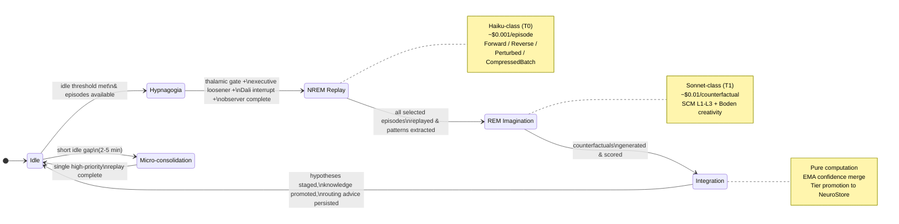
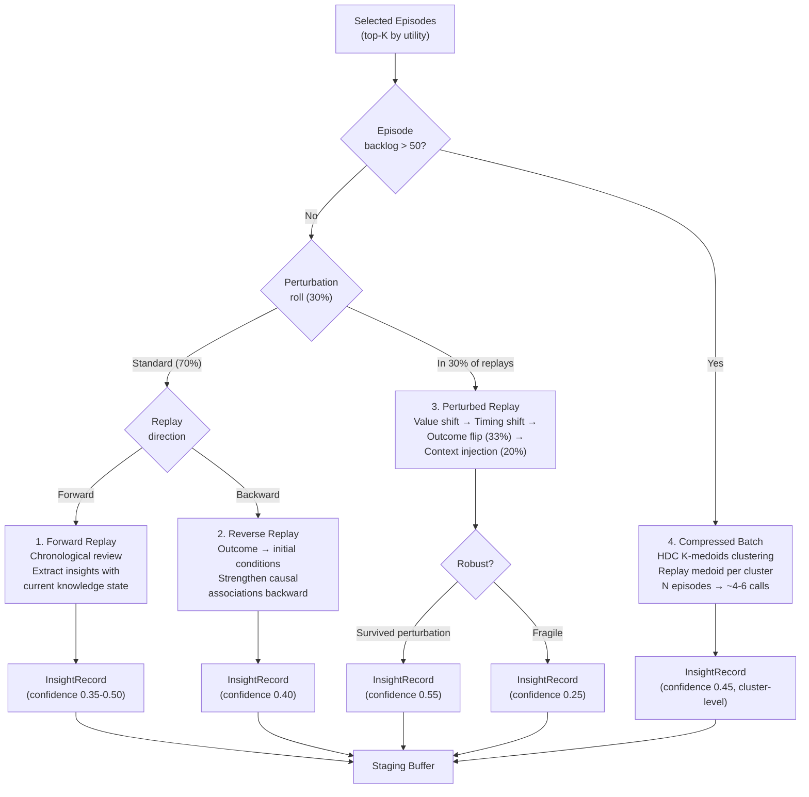
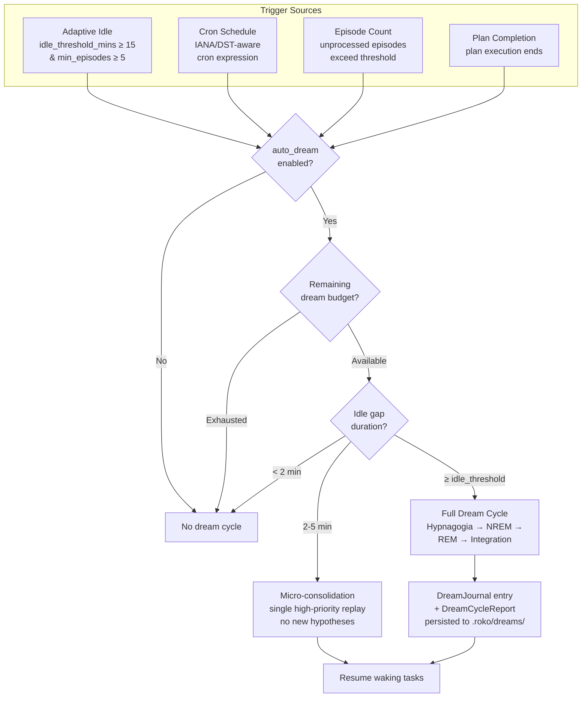
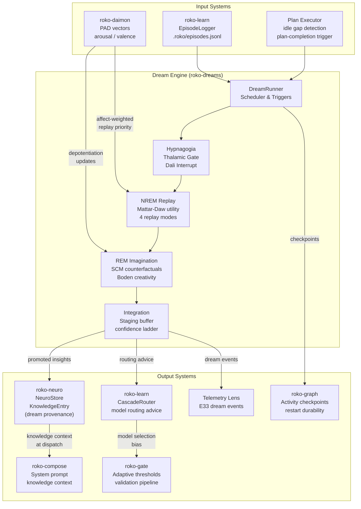
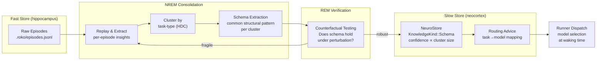

# 10 -- Dreams: Offline Consolidation and Schema Distillation

> Agents sleep. During idle periods, the dream cycle replays episodes,
> imagines counterfactuals, distills schemas, and consolidates knowledge --
> producing insights that make waking performance faster, cheaper, and more
> creative. The three-phase cycle (NREM replay, REM imagination, Integration)
> is grounded in Complementary Learning Systems theory (McClelland et al. 1995)
> and the specific consolidation mechanisms documented by Diekelmann & Born
> (2010, Psychological Review).

> **Implementation status (2026-09):** The dream-cycle runtime, heartbeat
> scheduler (adaptive idle, cron, episode-count triggers), replay planning
> with Mattar-Daw utility scoring, affect-weighted episode selection,
> imagination/counterfactual synthesis, staging buffer, consolidation with
> tier progression, routing advice generation, dream journals, and
> checkpoint restore are live in `roko-dreams`. The `DreamRunner` drives
> the end-to-end cycle from `roko plan run` and `roko knowledge dream run`.
> Schema distillation (target design) is specified but not yet
> implemented -- three independent 2025-2026 papers converge on CLS-based
> parametric consolidation as the next step.

### Implementation sources

| Surface | Authority | Shipped boundary |
|---------|-----------|-----------------|
| Dream cycle orchestration | `crates/roko-dreams/src/cycle.rs` | `DreamCycle`, `DreamCycleReport`, `AgentDispatcher`, staging, consolidation, routing advice |
| Dream runner | `crates/roko-dreams/src/runner.rs` | `DreamRunner`, `DreamEngine`, `DreamConfig`, triggers, heartbeat, budget, journal |
| NREM replay planning | `crates/roko-dreams/src/replay.rs` | `ReplayUtility`, `DreamReplayMode`, `MattarDawConfig`, affect-weighted selection |
| REM imagination | `crates/roko-dreams/src/imagination.rs` | `ImaginationMode`, `CounterfactualQuery`, `CausalModel`, hypothesis synthesis |
| Hypnagogia engine | `crates/roko-dreams/src/hypnagogia.rs` | `HypnagogiaEngine`, `ThalamicGate`, `ExecutiveLoosener`, `DaliInterrupt`, `HomuncularObserver` |
| Staging buffer | `crates/roko-dreams/src/staging.rs` | `StagingBuffer`, `StagingEntry`, `ConfidenceStage` |
| Routing advice | `crates/roko-dreams/src/routing_advice.rs` | `DreamRoutingAdvice`, `RoutingRecommendation`, `PatternSummary` |
| Threat rehearsal | `crates/roko-dreams/src/threat.rs` | `ThreatScenario`, `enumerate_threats`, `threat_warning_entries` |
| Phase 2 stubs | `crates/roko-dreams/src/phase2/` | Sleep-time compute budget tracker, dream journal, advanced dream constructs |
| Episode logger (input) | `crates/roko-learn/src/episode_logger.rs` | `Episode`, `EpisodeLogger` -- source data for replay |
| Pattern discovery | `crates/roko-learn/src/pattern_discovery.rs` | `CrossEpisodeConsolidator`, `PatternMiner` |
| Knowledge store (output) | `crates/roko-neuro/` | `KnowledgeStore`, `KnowledgeEntry`, `KnowledgeTier`, tier progression |
| HDC vectors | `crates/roko-primitives/src/hdc/` | `HdcVector`, `text_fingerprint` -- encoding for similarity, clustering |

---

## 1. The Three-Phase Dream Cycle

Every dream cycle consists of three sequential phases:

1. **NREM Replay** -- Replay past experiences with controlled mutations to
   consolidate memory and extract cross-episode patterns.
2. **REM Imagination** -- Generate novel strategies and counterfactual
   hypotheses through creative recombination.
3. **Integration** -- Evaluate outputs, update the staging buffer, promote
   validated hypotheses to permanent knowledge.

The cycle progresses through a deterministic state machine:

```
IDLE -> [HYPNAGOGIA] -> NREM_REPLAY -> REM_IMAGINATION -> INTEGRATION -> IDLE
```



The optional hypnagogia phase fires at the transition from waking to sleep,
before the structured NREM/REM/Integration phases begin.

### Phase state machine

```rust
pub enum DreamPhase {
    Idle,
    NremReplay {
        episodes_to_replay: usize,
        episodes_replayed: usize,
    },
    RemImagination {
        counterfactuals_to_generate: usize,
        counterfactuals_generated: usize,
    },
    Integration {
        hypotheses_to_evaluate: usize,
        hypotheses_evaluated: usize,
    },
}
```

Each state transition is logged. The agent cannot be interrupted mid-phase
(the current phase runs to completion before any transition). Between full
dream cycles, the agent may enter a **micro-consolidation** mode where only
the highest-utility single replay is processed -- handling the case where the
agent is briefly idle between tasks but not idle enough for a full cycle.

### Resource allocation across phases

| Phase | Model Tier | Context Window | Typical Duration | Cost Profile |
|-------|-----------|----------------|------------------|-------------|
| **NREM Replay** | Haiku-class (T0) | Minimal | 60-120s for 10 episodes | ~$0.001/episode |
| **REM Imagination** | Sonnet-class (T1) | Full knowledge context | 120-300s for 3-5 counterfactuals | ~$0.01/counterfactual |
| **Integration** | None (pure computation) | N/A | < 5 seconds | Negligible |

The asymmetry is deliberate. NREM replay is cheap pattern matching. REM
imagination requires genuine reasoning. Integration is arithmetic and
database operations.

---

## 2. NREM Replay: Utility-Weighted Episode Consolidation

NREM replay is the first phase of every dream cycle. It takes accumulated
episodes from the episode log and replays them -- not verbatim, but with
controlled mutations -- to consolidate memory and extract patterns.

The biological analogy is hippocampal sharp-wave ripples during slow-wave
sleep (stages N2-N3). Ji & Wilson (2007, Nature Neuroscience) showed that
these ripples replay compressed versions of waking experiences at 6x-20x
temporal compression, and the replay actively reorganizes memory.

### The Mattar-Daw Utility Formula

Episode selection for replay is governed by the utility formula from
Mattar & Daw (2018, Nature Neuroscience, "Prioritized memory access explains
planning and hippocampal replay"):

```
Utility(episode) = Gain(episode) * Need(episode) * (1 / SpacingPenalty(episode))
```

#### Gain

Gain measures how much the agent's behavior would improve by better
processing this episode. It is computed as the **prediction error** -- the
magnitude of the difference between what the agent expected and what
actually happened:

```
Gain(episode) = |expected_outcome - actual_outcome|
```

For episodes that ended in failure (a gate rejection, a task that produced
incorrect output), the gain is inherently high because the agent's
predictions were wrong. For episodes that succeeded exactly as predicted,
the gain is low -- there is nothing new to learn. Episodes without an
expected outcome (novel task types) receive gain = 1.0.

Gain is normalized to [0.0, 1.0] across the current episode batch:

```rust
fn compute_gain(ep: &Episode) -> f64 {
    match ep.expected_outcome {
        Some(expected) => (expected - ep.actual_outcome).abs(),
        None => 1.0, // novel task type -- always worth replaying
    }
}

fn normalize_gains(gains: &mut [f64]) {
    let max = gains.iter().cloned().fold(0.0_f64, f64::max);
    if max > 0.0 {
        for g in gains.iter_mut() {
            *g /= max;
        }
    }
}
```

When the entire batch has zero prediction error, all gains remain 0.0 and
selection falls back to Need alone -- the correct behavior when nothing
surprised the agent.

#### Need

Need measures how often the agent encounters situations structurally similar
to this episode. It is computed using HDC similarity between the episode's
vector representation and the centroid of the most recent N episodes:

```
Need(episode) = HDC_similarity(episode_vector, recent_centroid)
```

Where `episode_vector` is a 10,240-bit BSC (Binary Spatter Code) vector
encoding the episode's structural features (task type, model used, tools
invoked, outcome), and `recent_centroid` is the bundled vector of the most
recent 50 episodes. High need means the agent frequently encounters
situations like this one, so learning from it has high expected value.

The HDC similarity operation uses Hamming distance and runs in
sub-microsecond time per comparison (Kanerva 2009, Cognitive Computation
1(2)). This means the Need computation scales linearly with episode count
and is never a bottleneck.

The episode vector is produced by binding five feature vectors:

```rust
fn encode_episode(ep: &Episode) -> HdcVector {
    let task_v = HdcVector::from_seed(ep.task_type.as_bytes());
    let model_v = HdcVector::from_seed(ep.model_id.as_bytes());
    let tools_v = HdcVector::bundle(
        &ep.tools_used.iter()
            .map(|t| HdcVector::from_seed(t.as_bytes()))
            .collect::<Vec<_>>()
            .iter()
            .collect::<Vec<_>>(),
    );
    let outcome_v = HdcVector::from_seed(ep.outcome_class.as_bytes());
    let gates_v = ep.gate_results.iter().fold(
        HdcVector::from_seed(b"gate_identity"),
        |acc, g| acc.bind(&HdcVector::from_seed(g.as_bytes())),
    );

    task_v
        .bind(&model_v)
        .bind(&tools_v)
        .bind(&outcome_v)
        .bind(&gates_v)
}
```

| Feature | Encoding | Bits |
|---------|----------|------|
| Task type | `HdcVector::from_seed(task_type.as_bytes())` | 10,240 |
| Model used | `HdcVector::from_seed(model_id.as_bytes())` | 10,240 |
| Tools invoked | Bundle of per-tool seed vectors | 10,240 |
| Outcome class | `HdcVector::from_seed(outcome_class.as_bytes())` | 10,240 |
| Gate results | Bind chain of per-gate vectors | 10,240 |

The recent centroid bundles the most recent N episodes (default N=50,
configurable via `dreams.replay.centroid_window`). It is recomputed at the
start of each dream cycle -- not cached across cycles -- because the
recent distribution shifts.

```rust
fn compute_recent_centroid(
    episodes: &[Episode],
    window: usize,
) -> HdcVector {
    let recent = &episodes[episodes.len().saturating_sub(window)..];
    let vectors: Vec<HdcVector> = recent.iter().map(encode_episode).collect();
    HdcVector::bundle(&vectors.iter().collect::<Vec<_>>())
}
```

Need falls to ~0.5 (random baseline) for episodes that share no structural
features with recent work. It rises toward 1.0 for episodes that mirror the
agent's current activity patterns.

#### Spacing Penalty

The spacing penalty implements the **spacing effect** from memory research
(Cepeda et al. 2006, Psychological Bulletin, "Distributed practice in
verbal recall tasks"). Recently replayed episodes are penalized to prevent
over-rehearsal:

```
SpacingPenalty(episode) = 1.0 + (replay_count * decay_factor / time_since_last_replay)
```

Where:
- `replay_count` is the number of times this episode has been replayed in
  previous dream cycles
- `decay_factor` is a configurable parameter (default: 0.5)
- `time_since_last_replay` is measured in hours since the episode was last
  replayed (floor clamped to 0.01 to avoid division by zero)

| Parameter | Default | Range | Unit | Effect |
|-----------|---------|-------|------|--------|
| `decay_factor` | 0.5 | 0.1-2.0 | dimensionless | Higher values penalize recent replays more aggressively |
| `time_since_last_replay` | measured | >0 | hours | Floor clamped to 0.01 |
| `replay_count` | tracked | 0+ | integer | Incremented each time the episode enters a replay batch |

Worked examples:

```
Never replayed:     SpacingPenalty = 1.0 + (0 * 0.5 / anything)  = 1.0   (no penalty)
Replayed 2x, 1h:    SpacingPenalty = 1.0 + (2 * 0.5 / 1.0)      = 2.0   (utility halved)
Replayed 2x, 24h:   SpacingPenalty = 1.0 + (2 * 0.5 / 24.0)     = 1.042 (nearly no penalty)
```

```rust
fn compute_spacing_penalty(
    ep: &Episode,
    replay_history: &HashMap<String, ReplayRecord>,
) -> f64 {
    match replay_history.get(&ep.id) {
        None => 1.0,
        Some(record) => {
            let hours_since = record
                .last_replayed
                .elapsed()
                .as_secs_f64() / 3600.0;
            let clamped_hours = hours_since.max(0.01);
            1.0 + (record.count as f64 * SPACING_DECAY / clamped_hours)
        }
    }
}
```

#### Batch selection

The top-K episodes by utility score are selected for the current replay
batch. K is configurable (default: 10 per dream cycle):

```rust
fn select_replay_batch(
    episodes: &[Episode],
    recent_centroid: &HdcVector,
    replay_history: &HashMap<String, ReplayRecord>,
    batch_size: usize,
) -> Vec<&Episode> {
    let mut scored: Vec<(f64, &Episode)> = episodes
        .iter()
        .map(|ep| {
            let gain = compute_gain(ep);
            let need = compute_need(ep, recent_centroid);
            let spacing = compute_spacing_penalty(ep, replay_history);
            let utility = gain * need * (1.0 / spacing);
            (utility, ep)
        })
        .collect();

    scored.sort_by(|a, b| b.0.partial_cmp(&a.0).unwrap_or(Ordering::Equal));
    scored.into_iter().take(batch_size).map(|(_, ep)| ep).collect()
}
```

#### Emotional modulation of replay

The Daimon's PAD vectors influence replay via two mechanisms:

**Somatic marker prioritization** (Damasio 1994). Episodes encoded with
high emotional intensity receive a replay priority boost:

```
replay_priority_boost = |arousal_at_encoding| * somatic_weight
```

Where `somatic_weight` defaults to 0.3. An episode encoded with arousal 0.9
gets a 0.27 priority boost.

**Mood-congruent recall** (Blaney 1986, Psychological Bulletin). The
current mood biases replay toward mood-congruent episodes, deliberately
attenuated to prevent rumination spirals:

```
mood_congruence = similarity(current_pad, episode_pad) * attenuation_factor
```

Where `attenuation_factor` is 0.15 (a weak bias).

### The four replay modes



Once episodes are selected, they are replayed using one of four modes:

#### 1. Standard Forward Replay

The episode is replayed in chronological order. The agent reviews what
happened and extracts insights using its current knowledge state:

```
Given this episode from {timestamp}:
  Task: {task_description}
  Actions taken: {action_sequence}
  Outcome: {success/failure}
  Gate results: {gate_verdicts}

With your current knowledge, would you do anything differently?
What patterns do you notice that you might not have noticed at the time?
```

#### 2. Reverse Replay

The episode is replayed backward -- from outcome to initial conditions,
strengthening causal associations in the backward direction. Based on
Ambrose et al. (2016, Science, "Reverse replay of hippocampal place cells
is uniquely associated with period of reward"):

```
An episode ended with this outcome: {outcome}
Working backward, what conditions and decisions led to this result?
What was the earliest decision point where a different choice would have
changed the outcome?
```

#### 3. Perturbed Replay

In 30% of replays (configurable), key values within the episode are
systematically perturbed to test robustness:

| Perturbation Type | Description | Magnitude |
|-------------------|-------------|-----------|
| **Value shift** | Numeric parameters shifted by +/-10-50% | Within observed range |
| **Timing shift** | Temporal parameters shifted forward/backward | +/-2x original duration |
| **Outcome flip** | Outcome reversed (success<->failure) | Binary flip |
| **Context injection** | Context from an unrelated episode injected | Random from different cluster |

Perturbation selection follows a fixed priority order, not random choice:
1. Value shift is always applied first (most common, least disruptive)
2. Timing shift applied if the episode has temporal parameters
3. Outcome flip applied to 1 in 3 perturbed replays (default: 0.33)
4. Context injection applied to 1 in 5 perturbed replays (default: 0.20)

Perturbation ranges are bounded by 2 standard deviations of observed variance:

```rust
fn compute_perturbation_range(
    episodes: &[Episode],
    field: &str,
) -> (f64, f64) {
    let values: Vec<f64> = episodes
        .iter()
        .filter_map(|ep| ep.numeric_field(field))
        .collect();
    let mean = values.iter().sum::<f64>() / values.len() as f64;
    let std_dev = (values.iter()
        .map(|v| (v - mean).powi(2))
        .sum::<f64>() / values.len() as f64)
        .sqrt();
    (mean - 2.0 * std_dev, mean + 2.0 * std_dev)
}
```

```
This episode originally had these values: {original_values}
Now imagine these values were slightly different: {perturbed_values}
Would the same outcome have occurred? Would you have taken the same actions?
What does this tell you about how robust your strategy is?
```

#### 4. Compressed Batch Replay

When the episode backlog is large (>50 episodes since the last dream), the
replay phase uses compressed batch mode via HDC cluster-compression:

1. Compute HDC vectors for all unprocessed episodes
2. Run K-medoids clustering with dynamic K selection using the silhouette
   method (K from 2 to sqrt(n), capped at 12)
3. For each cluster, replay the medoid episode as representative
4. Patterns extracted from the medoid apply to all cluster members

This reduces LLM calls from N to the number of clusters. A batch of 100
episodes might produce 4-6 clusters, requiring only 4-6 replay calls.

```rust
fn select_k(
    vectors: &[HdcVector],
    max_k: usize,
    max_iterations: usize,
) -> usize {
    let mut best_k = 2;
    let mut best_score = f64::NEG_INFINITY;

    for k in 2..=max_k {
        let result = k_medoids(vectors, &KMedoidsConfig {
            k,
            max_iterations,
        });
        let score = mean_silhouette(vectors, &result.assignments, &result.medoids);
        if score > best_score {
            best_score = score;
            best_k = k;
        }
    }
    best_k
}
```

Convergence criterion: stop when no swap of a medoid with a non-medoid
reduces total within-cluster distance. Maximum iterations (default: 50)
prevents runaway computation. If K-medoids does not converge, the
best-so-far assignment is returned.

### Cross-episode pattern discovery

In addition to per-episode replay, the NREM phase runs two pattern-discovery
operations across the entire replay batch:

**Trigram mining.** The `PatternMiner` identifies recurring three-action
sequences across episodes. A discovered trigram like `read -> edit -> test`
(appearing in 8 of 10 episodes) becomes a candidate heuristic.

**HDC cross-episode consolidation.** The `CrossEpisodeConsolidator` uses
K-medoids clustering over HDC episode vectors to discover structural
meta-patterns -- groups of episodes that share task type, model, outcome
pattern, and tool usage regardless of specific content.

### Replay output format

```rust
pub struct InsightRecord {
    pub id: String,
    pub content: String,
    pub confidence: f64,
    pub source_episodes: Vec<String>,
    pub replay_mode: ReplayMode,
    pub relation_to_existing: InsightRelation,
    pub hdc_vector: Option<HdcVector>,
}

pub enum ReplayMode {
    Forward,
    Reverse,
    Perturbed,
    CompressedBatch,
}

pub enum InsightRelation {
    Confirms(String),
    Contradicts(String),
    Novel,
}
```

| Source | Initial confidence | Rationale |
|--------|-------------------|-----------|
| Forward replay, confirmed pattern | 0.50 | Known pattern, re-observed |
| Forward replay, new insight | 0.35 | New observation from known data |
| Reverse replay | 0.40 | Causal chain analysis, moderate reliability |
| Perturbed replay, robust finding | 0.55 | Survived perturbation -- higher trust |
| Perturbed replay, fragile finding | 0.25 | Did not survive -- flag for review |
| Compressed batch, cluster-level | 0.45 | Represents multiple episodes, coarser signal |

### Replay scheduling

Optimal replay requires knowing not just *which* episodes to replay, but
*when* and *how often*. The SM-2 algorithm (Wozniak 1990) provides spaced
repetition scheduling:

```
Initial easiness factor:  EF_0 = 2.5
Interval after first replay:  I_1 = 1 hour
Interval after second replay: I_2 = EF_0 hours

For subsequent replays (n >= 3):
  I(n) = I(n-1) * EF

After each replay, update easiness factor:
  EF_new = EF + (0.1 - (5 - q) * (0.08 + (5 - q) * 0.02))

Where q is replay quality (0-5 scale):
  q = 5: high-confidence insight produced
  q = 4: correct with minor difficulty
  q = 3: correct with significant difficulty
  q = 2: incorrect, easy to recall upon seeing answer
  q = 1: incorrect, easy to recall
  q = 0: complete failure

Minimum EF is 1.3. If EF falls below 1.3, reset interval to I_1.
```

The Expected Value of Backup (EVB) from Mattar & Daw (2018) determines
whether to replay or collect new experience:

```
EVB(best_candidate_episode) > V(collecting_new_experience)
```

### Deep RL experience replay connections

Roko's dream replay re-derives many principles from deep RL:

| Deep RL Concept | Algorithm | Roko Dream Equivalent |
|-----------------|-----------|----------------------|
| Replay buffer | DQN (Mnih et al. 2015) | `.roko/episodes.jsonl` |
| TD error priority | PER (Schaul et al. 2016) | `Gain(episode)` |
| IS weight correction | PER | Spacing penalty (approximate) |
| Goal relabeling | HER (Andrychowicz et al. 2017) | Gate-based hindsight relabeling |
| Recency emphasis | ERE (Wang & Ross 2019) | `centroid_window` (fixed) |
| Generative replay | Scholar (Shin et al. 2017) | `ReplayFidelity::Generative` |
| Planning rollouts | Jensen et al. (2024) | Variable-length adaptive rollouts |
| Goal-uncertain replay | Sagiv et al. (2025) | Goal ensemble with marginal need*gain |

PER sampling (Schaul et al. 2016):

```
Sampling probability: P(i) = p_i^alpha / Sigma p_j^alpha

Where:
  p_i = |delta_i| + epsilon    (priority = TD error + constant)
  epsilon = 0.01
  alpha = 0.6

IS correction: w_i = (1/N * 1/P(i))^beta
  with beta annealing from 0.4 to 1.0
```

In Roko's formulation: `p_i ~ Gain(episode) * Need(episode)` and the
spacing penalty implements bias correction analogous to IS weights.

### Configuration

```toml
[dreams.replay]
batch_size = 10
perturbation_rate = 0.30
spacing_decay = 0.5
somatic_weight = 0.3
mood_attenuation = 0.15
min_utility = 0.1
centroid_window = 50
```

---

## 3. REM Imagination: Counterfactual Reasoning and Creative Recombination

REM imagination is the second phase. Where NREM replay strengthens and tests
existing memories, REM imagination generates **genuinely novel hypotheses**
by recombining elements from different episodes, simulating counterfactual
histories, and applying structured creativity frameworks.

The biological analogy is REM sleep, during which the prefrontal cortex
(executive control) is suppressed while associative cortex remains active
(Hobson & Schredl 2011). Walker & van der Helm (2009, Psychological
Bulletin) showed that REM specifically depotentiates the emotional charge
of memories -- "overnight therapy."

### Pearl's Structural Causal Models (SCM)

The primary engine for counterfactual reasoning is Pearl's (2009, Causality)
three-level framework:

**Level 1: Association (Seeing).** "What correlates with what?" The agent
identifies correlations across episodes without asserting causation. Outputs
enter the staging buffer at confidence 0.20.

```
What correlations do you notice between actions and outcomes?
List at least 5 correlations, noting which are strong (>70% of cases)
and which are weak (30-70%).
```

**Level 2: Intervention (Doing).** "What would happen if I changed my
behavior?" Requires a causal model -- directed graph of feature
relationships constructed from Level 1 associations with temporal ordering.
Outputs enter at confidence 0.25-0.30.

```
In episode {episode_id}, you took action {action} and observed {outcome}.
Using causal model: {causal_edge} (confidence: {confidence})
What would happen if you had taken {alternative_action} instead?
```

**Level 3: Counterfactual (Imagining).** "Given what happened, what would
have happened if conditions were different?" Uses Pearl's
abduction-action-prediction framework:

1. **Abduction**: Given the observed outcome, infer the most likely latent
   state
2. **Action**: Modify the latent state by changing one or more conditions
3. **Prediction**: Predict what would have happened under modified conditions

Outputs enter at confidence 0.30 (highest initial confidence for dream
hypotheses).

**Level 3+: Backtracking Counterfactuals.** Standard Pearl counterfactuals
fix initial conditions and alter causal laws. Backtracking counterfactuals
invert this: causal laws are fixed, but differences are backtracked to
altered exogenous variables. Outputs enter at confidence 0.25 (lower than
standard Level 3 due to reasoning about unobserved variables).

### Boden's Three Creativity Modes

Following Boden (2004, The Creative Mind):

| Mode | Operation | Example |
|------|-----------|---------|
| **Combinational** | Combine elements from unrelated episodes for unexpected similarities | Gas price spikes and governance deadlines share timing patterns |
| **Exploratory** | Traverse boundaries of existing strategy spaces | Push "retry 3 times" heuristic to 10 retries -- when does it break? |
| **Transformational** | Violate fundamental assumptions to generate novel approaches | What if compilation errors were actually test failures? |

Combinational creativity selects episode pairs with HDC similarity below
0.55 -- distant enough for creative tension, close enough for bridgeable
structure.

### Emotional depotentiation

During REM processing, Walker & van der Helm (2009) showed emotional charge
decreases by 0.3-0.5 units per cycle on a 0-1 arousal scale:

```
post_dream_arousal = pre_dream_arousal - depotentiation_delta
depotentiation_delta in [0.3, 0.5] per cycle
```

Depotentiation applies to individual episodes, not global state. Arousal
never drops below `arousal_floor` (0.05). Domain-specific weights control
rate:

```toml
[dreams.depotentiation.domain_weights]
compile_error = 1.5       # depotentiate faster -- high arousal, low signal after first
test_failure = 1.0        # standard rate
gate_rejection = 0.8      # slower -- gate rejections carry more signal
architectural_error = 0.5  # preserve emotional weight -- rare and informative
```

### Counterfactual guidance

**Byrne's fault lines** (2005, The Rational Imagination) guide which
aspects of an episode the agent counterfactualizes first:

| Fault Line | Description | Priority |
|------------|-------------|----------|
| Controllable actions | Things the agent could have done differently | Highest |
| Recent actions | Temporally proximate decisions | High |
| Abnormal actions | Deviations from the agent's usual patterns | Medium |

**Epstude & Roese (2008)** provide the functional theory: upward
counterfactuals ("what if I had done better?") drive self-improvement;
downward counterfactuals ("what if I had done worse?") rehearse threats.

### REM phase resource allocation

| Operation | Model Tier | Typical Cost | Calls per Dream |
|-----------|-----------|-------------|----------------|
| Association (SCM L1) | Sonnet-class | ~$0.005 | 1 |
| Intervention (SCM L2) | Sonnet-class | ~$0.008 | 2-3 |
| Counterfactual (SCM L3) | Sonnet-class | ~$0.012 | 1-2 |
| Combinational creativity | Sonnet-class | ~$0.010 | 1 |
| Exploratory creativity | Sonnet-class | ~$0.008 | 1 |
| Transformational creativity | Sonnet-class | ~$0.012 | 0-1 |
| Deduplication | None (HDC) | ~$0.000 | All hypotheses |
| **Total per dream** | | **~$0.03-0.08** | **5-9 calls** |

---

## 4. Integration and Staging

Dream-generated hypotheses enter a staging buffer at confidence 0.20-0.30
and climb a confidence ladder through waking validation:

| Confidence Range | Status | What Happens |
|-----------------|--------|--------------|
| 0.20-0.30 | **Staged** | Hypothesis just entered from a dream |
| 0.30-0.50 | **Partially Validated** | Some waking evidence supports it |
| 0.50-0.70 | **Strongly Supported** | Multiple confirmations; tentative action |
| >= 0.70 | **Promoted** | Written to NeuroStore as validated insight |

**Promotion** writes a `KnowledgeEntry` with `source: "dream"` provenance.
If the hypothesis represents a new heuristic, it is also written to the
playbook store. A `DreamOutcomeEvent` is emitted for downstream listeners.

**Expiration.** Hypotheses not validated within 5,000 ticks (~3.5 days)
expire. The hypothesis enters normal temporal decay.

**Insight consolidation** uses EMA confidence merging for near-duplicates:

```rust
pub struct InsightConsolidator {
    neuro_store: Arc<NeuroStore>,
    min_confidence: f64,       // default: 0.30
    merge_threshold: f32,      // default: 0.80 (HDC similarity)
    max_insights_per_cycle: usize, // default: 20
}

// When a near-duplicate exists (HDC similarity > 0.80):
let new_confidence = existing.confidence * 0.7 + insight.confidence * 0.3;
```

---

## 5. Hypnagogia Engine: Four-Layer Creative Onset

Hypnagogia is the transitional state between waking and sleep. Lacaux et al.
(2021, Science Advances) demonstrated that subjects in the hypnagogic state
solved 83% of creative problems versus 30% for fully awake subjects,
replicating the Edison/Dali technique.

The hypnagogia engine solves the **alpha convergence problem**: when all
agents use the same foundation models, insights converge to zero marginal
value (Grossman & Stiglitz 1980). The engine injects agent-specific
experiential noise to produce insights unique to each agent.

### Layer 1: Thalamic Gate

Anti-correlated HDC retrieval surfaces knowledge entries maximally
dissimilar to the agent's current focus. Instead of retrieving similar
entries, it retrieves the most *opposite*:

```rust
fn thalamic_gate_retrieval(
    current_focus: &HdcVector,
    knowledge_store: &NeuroStore,
    n_fragments: usize,
) -> Vec<KnowledgeFragment> {
    let anti_focus = current_focus.bind(&HdcVector::ones());
    knowledge_store.nearest_neighbors(&anti_focus, n_fragments)
        .into_iter()
        .map(|entry| KnowledgeFragment {
            content: entry.content.truncate_to_fragment(),
            source_id: entry.id,
            similarity_to_anti_focus: anti_focus.similarity(&entry.hdc_vector),
        })
        .collect()
}
```

Produces 5-10 fragments that have nothing to do with the agent's current
focus -- the "phosphenes" of the hypnagogic state.

### Layer 2: Executive Loosener

Modifies LLM generation parameters to produce less constrained, more
associative output:

| Parameter | Waking Value | Hypnagogic Value | Effect |
|-----------|-------------|------------------|--------|
| Temperature | 0.7 | **1.3** | More diverse sampling |
| top_p | 0.90 | **0.95** | Wider sampling window |
| min_p | 0.05 | **0.02** | Allow lower-probability tokens |
| max_tokens | Task-specific | **50-100** | Short fragmentary outputs |

The short output length prevents the LLM from "recovering" logical
coherence -- the fragment is too short for course-correction.

```
These fragments surfaced from your memory:
- "{fragment_1}"
- "{fragment_2}"
- "{fragment_3}"

Do not analyze these. Do not reason about them.
Let them collide. What forms at the intersection?
Respond in 2-3 sentences. Do not explain yourself.
```

### Layer 3: Dali Interrupt

Named after Dali's technique of holding a key over a metal plate while
dozing. The engine generates multiple short completions (50-100 tokens
each), interrupted mid-completion before the model can organize output
into coherent reasoning:

```rust
fn dali_interrupt(
    prompt: &str,
    model: &dyn LLMProvider,
    n_fragments: usize,
    max_tokens_per_fragment: usize,
) -> Vec<String> {
    let params = GenerationParams {
        temperature: 1.3,
        top_p: 0.95,
        min_p: 0.02,
        max_tokens: max_tokens_per_fragment,
    };
    (0..n_fragments)
        .map(|_| model.generate(prompt, &params))
        .collect()
}
```

### Layer 4: Homuncular Observer

A separate LLM call at low temperature (T=0.4, haiku-class) evaluates
fragments on three dimensions:

| Dimension | Question | Scale |
|-----------|----------|-------|
| **Novelty** | Does this contain an idea not in existing knowledge? | 0.0-1.0 |
| **Relevance** | Could this be useful for current or future tasks? | 0.0-1.0 |
| **Coherence** | Despite fragmentary form, is it actionable? | 0.0-1.0 |

Only fragments scoring > 0.5 on all three dimensions are retained. The
geometric mean ranks passing fragments:

```rust
fn composite_score(fragment: &HypnagogicFragment) -> f64 {
    (fragment.novelty * fragment.relevance * fragment.coherence).cbrt()
}
```

A balanced 0.7/0.7/0.7 scores 0.70. A lopsided 0.95/0.2/0.9 scores ~0.53.

### Stochastic resonance

The engine implements stochastic resonance (Gammaitoni et al. 1998, Reviews
of Modern Physics): adding controlled noise to a signal can improve its
detection. The noise is the anti-correlated retrieval and elevated
temperature. The signal is the creative association that forms when distant
knowledge entries collide.

### LLM recipe summary

| Step | Temperature | Model Tier | Tokens | Purpose |
|------|------------|-----------|--------|---------|
| 1. Thalamic Gate | N/A | None (HDC) | N/A | Anti-correlated retrieval |
| 2. Executive Loosener | 1.3 | Sonnet-class | 50-100 | Fragmentary generation |
| 3. Dali Interrupt | 1.3 | Sonnet-class | 50-100 x 3-5 | Interrupted fragments |
| 4. Homuncular Observer | 0.4 | Haiku-class | 200 | Structured evaluation |

---

## 6. Dream Evolution

The fourth phase (EVOLUTION) fires infrequently (every 5-10 cycles) and
applies memetic selection pressure to the agent's accumulated knowledge.
Strategies that consistently appear in successful episodes are strengthened;
strategies that appear in failed episodes are weakened. The mechanism is
analogous to natural selection operating on behavioral strategies rather
than genomes.

Evolution uses Simonton's (2010) BVSR (Blind Variation and Selective
Retention) theory: creativity requires both a variation mechanism (the
dream phases provide this) and a selection mechanism (the Evolution phase
provides this by filtering against accumulated waking outcomes).

---

## 7. HDC Counterfactual Synthesis

The HDC vector space enables a unique form of counterfactual generation
that operates entirely in vector space without LLM calls:

1. **Episode interpolation**: Given episodes A and B with vectors v_A and
   v_B, compute `v_mid = bundle(v_A, v_B)` to produce a synthetic episode
   that shares features of both
2. **Feature substitution**: Unbind a feature vector and bind a replacement
   to answer "what if this episode had used a different tool/model?"
3. **Cluster transfer**: Project an episode's vector into a different
   cluster's subspace to simulate how that episode would have played out
   in a different task category

These operations run in sub-microsecond time and cost zero inference
budget, making them useful for bulk screening before expensive LLM-based
counterfactual analysis.

---

## 8. Sleep-Time Compute

Lin et al. (2025, arXiv:2504.13171, "Sleep-time Compute: Beyond Inference
Scaling at Test-time") demonstrated that dedicating computation to offline
processing during idle periods yields a **5x reduction in test-time compute
requirements**. The key insight: agents can perform significant cognitive
work during idle periods, making waking performance dramatically more
efficient.

WSCL (2024, "Wake-Sleep Continual Learning") showed a complementary result:
interleaving wake and sleep phases produces a **38% reduction in
catastrophic forgetting** versus continuous waking-only learning.

### Compute budget allocation

```
dream_budget_usd = inference_daily_usd * dream_fraction
```

Where `dream_fraction` defaults to 0.15 (15% of daily inference budget).

| Phase | Budget Share | Model Tier | Rationale |
|-------|-------------|-----------|-----------|
| Hypnagogia | 10% | Haiku + Sonnet | Thalamic Gate is free; Dali/Observer use LLM |
| NREM Replay | 30% | Haiku-class (T0) | Pattern matching is cheap |
| REM Imagination | 50% | Sonnet-class (T1) | Creative reasoning requires capable model |
| Integration | 0% | None | Pure computation |
| EVOLUTION | 10% | Sonnet-class (T1) | Fires infrequently but requires reasoning |

### Sleep-time pre-computation (Lin et al. 2025)

Given persistent context c, the model runs a sleep-time computation
S(c) -> c', transforming c into an enhanced representation. At test time,
queries are answered from c' rather than c, decoupling thinking cost from
latency. The model calls `rethink_memory` up to 10 times, progressively
rewriting context into dense summaries optimized for anticipated queries.

Results: 5x reduction in test-time compute on Stateful GSM-Symbolic and
AIME; 2.5x cost-per-query reduction when amortized across 10 queries.
Test-time tokens weighted **10x** the cost of sleep-time tokens.

The key predictor of efficacy is **query predictability**: log P(q | c).
Agent episodes are exactly the right kind of context -- recurring task
patterns, repeated failure modes, consistent tool chains.

### Sleepwalker mode

During dreaming, the agent enters Sleepwalker mode -- a reduced-capability
state using a 3-step CoALA variant (Sumers et al. 2023):

1. **Perceive**: Check for urgent signals
2. **Decide**: If urgent, abort dream and wake; otherwise continue
3. **Act**: Continue current phase or transition to waking

### Cost-effectiveness

| Scenario | Episodes/Day | Dreams/Day | Dream Cost/Day | Waking Improvement |
|----------|-------------|-----------|----------------|-------------------|
| Light usage | 10-20 | 1 | ~$0.03-0.08 | Marginal |
| Standard usage | 50-100 | 3-4 | ~$0.10-0.30 | 10-15% fewer retries |
| Heavy usage | 200+ | 6-8 | ~$0.30-0.60 | 20-30% fewer retries |

---

## 9. Scheduling and Triggers

The dream scheduler determines when and how often to fire dream cycles.
Three trigger types are live, plus a plan-completion trigger:



### Adaptive idle trigger

```rust
impl DreamRunner {
    pub fn schedule(&self) -> Option<Duration> {
        if !self.config.auto_dream {
            return None;
        }
        let recent_episodes = count_episodes_since_last_dream();
        if recent_episodes < self.config.min_episodes_for_dream {
            return None;
        }
        let idle_duration = now - most_recent_episode_timestamp();
        if idle_duration >= self.config.idle_threshold_mins {
            return Some(Duration::ZERO); // Dream now
        }
        let remaining = self.config.idle_threshold_mins - idle_duration;
        Some(remaining)
    }
}
```

### Cron trigger

IANA/DST-aware cron expressions allow scheduled dream cycles regardless
of activity patterns.

### Episode-count trigger

Fires when a threshold of unprocessed episodes accumulates, regardless of
idle time. Useful for high-volume agents that are never truly idle.

### Plan-completion trigger

Fires at the end of each plan execution, consolidating the plan's episodes
before moving to the next.

| Parameter | Default | Description |
|-----------|---------|-------------|
| `auto_dream` | `true` | Whether idle-triggered dreaming is enabled |
| `idle_threshold_mins` | `15` | Minutes of inactivity before triggering |
| `min_episodes_for_dream` | `5` | Minimum unprocessed episodes required |

### Micro-consolidation

Short idle gaps (2-5 minutes) between tasks support micro-consolidation --
a single high-priority episode replay without the full cycle. It can only
reinforce existing memory, not generate new hypotheses or promote knowledge.

---

## 10. Dream Journals and Oneirography

Every completed dream cycle produces a `DreamCycleReport` -- a structured
JSON document persisted to `.roko/dreams/`:

```rust
pub struct DreamCycleReport {
    pub started_at: DateTime<Utc>,
    pub completed_at: DateTime<Utc>,
    pub processed_through: Option<DateTime<Utc>>,
    pub episodes_replayed: usize,
    pub counterfactuals_generated: usize,
    pub insights: Vec<InsightRecord>,
    pub patterns: Vec<PatternRecord>,
    pub staged_hypotheses: usize,
    pub promoted_hypotheses: usize,
    pub confidence_updates: usize,
    pub depotentiation: DepotentiationSummary,
}
```

Reports are stored as `dream-{unix_timestamp_ms}.json`. The `DreamJournal`
provides durable entries and archive queries:

```rust
pub struct DreamJournalEntry {
    pub id: String,
    pub timestamp: DateTime<Utc>,
    pub cycle_id: String,
    pub summary: String,
    pub insights_count: usize,
    pub promoted_count: usize,
    pub depotentiation_applied: bool,
}
```

CLI access:

```bash
roko knowledge dream run            # Run a dream cycle now
roko knowledge dream report         # Show latest dream report
roko knowledge dream schedule       # Show next scheduled dream
roko knowledge dream journal        # List journal entries
roko knowledge dream archive        # Archive old entries
```

---

## 11. Dream Routing Advice

After each dream cycle, the consolidation phase generates model-routing
advice based on discovered patterns. This advice is persisted to
`.roko/learn/dream-routing-advice.json` and consulted by the runner at
dispatch time:

```rust
pub struct DreamRoutingAdvice {
    pub generated_at: DateTime<Utc>,
    pub source_dream_report: String,
    pub recommendations: Vec<RoutingRecommendation>,
    pub pattern_summaries: Vec<PatternSummary>,
}

pub struct RoutingRecommendation {
    pub task_category: String,
    pub complexity_band: String,
    pub recommended_model: String,
    pub deprioritize: Vec<String>,
    pub confidence: f64,
    pub supporting_episodes: usize,
    pub recommended_model_success_rate: f64,
    pub pattern_signature: u64,
}
```

A recommendation like "for `implementation` tasks at `medium` complexity,
prefer `claude-sonnet` over `gpt-4o`" emerges from cross-episode
consolidation discovering that success rates differ by model for specific
task shapes.

---

## 12. Cross-System Integration

The dream subsystem connects to the broader Roko runtime:



| System | Integration Point |
|--------|-------------------|
| **Episode logger** | Source data: `.roko/episodes.jsonl` feeds replay |
| **NeuroStore** | Output sink: insights promoted as `KnowledgeEntry` with dream provenance |
| **Daimon** | Affect: PAD vectors modulate replay priority; depotentiation updates arousal |
| **Playbook store** | Output sink: dream-derived heuristics written as when/then entries |
| **CascadeRouter** | Model selection: routing advice biases cascade for specific task shapes |
| **Plan executor** | Scheduling: detects idle gaps between tasks and signals the dream scheduler |
| **Staging buffer** | Intermediate store: hypotheses accumulate confidence through waking validation |
| **Telemetry Lens** | Observation: dream events published through the E33 ingress |
| **Graph engine** | Resume: dream checkpoints participate in Activity-level restart durability |
| **CLI** | User access: `roko knowledge dream *` subcommands |

---

## 13. Schema Distillation (Target Design)

> **Current state:** The dream cycle replays and reorganizes stored episode
> records during idle periods. Consolidation produces insights, meta-patterns,
> and routing advice, but does not distill generalizable schemas from episodic
> traces.
>
> **Target design:** Three independent research groups converged in
> May-June 2026 on the finding that dream-phase consolidation should
> distill generalizable schemas from raw episodic traces, not just replay them.

### Research convergence

**Auto-Dreamer** (arXiv:2605.20616, May 2026). A learned consolidator based
on Complementary Learning Systems (CLS) theory. Rather than hand-coded
replay rules, the consolidation process itself is learned -- a meta-learning
loop trains the consolidator to produce schemas that maximize downstream
task performance. The fast pathway (analogous to hippocampus) stores raw
episodic traces; the slow pathway (analogous to neocortex) distills them
into compressed, generalizable representations.

**Language Models Need Sleep** (arXiv:2606.03979, June 2026). Demonstrates
parametric distillation during offline phases. During "sleep," the model's
parameters are updated to consolidate what was learned during "waking" into
stable long-term representations. This goes beyond reorganizing stored
records -- it modifies the model's internal representations to encode
generalizable schemas.

**Do LMs Need Sleep?** (arXiv:2605.26099, May 2026). Proposes a sleep phase for language models: the model runs N offline recurrent passes over its accumulated context, writes the result into fast weights in its state-space blocks and then clears its KV cache (§5). On synthetic tasks and a math-reasoning task where plain transformers and SSM-attention hybrids fail, longer sleep (larger N) improves accuracy, most on examples that need deeper reasoning (abstract, §6). It is an architecture-level mechanism; it does not compare structured with random replay or test transfer across tasks.

### Target data flow



### Design implications for Roko

The dream cycle should evolve in three specific ways:

1. **Extract generalizable schemas from raw episodic traces.** Not just
   replay: compress episodes into task-type schemas that capture "how to
   succeed at X" independent of specific instance details.

2. **Update persistent knowledge representations.** Move beyond
   reorganizing stored records to actually updating the agent's knowledge
   store with distilled schemas at higher confidence than raw episode
   insights.

3. **Use CLS-inspired fast/slow separation.** The Auto-Dreamer pattern:
   maintain a fast store (raw episodes, high detail, rapid decay) and a
   slow store (distilled schemas, low detail, persistent). Consolidation
   transfers from fast to slow via compression and generalization.

### Integration with existing architecture

The CLS pattern maps naturally onto Roko's existing two-store design:

| CLS Component | Roko Equivalent |
|---------------|-----------------|
| Fast pathway (hippocampus) | `.roko/episodes.jsonl` -- raw episodic traces |
| Slow pathway (neocortex) | NeuroStore -- durable knowledge with tier progression |
| Consolidation | Dream cycle NREM phase -- already in place, needs schema extraction |
| Schema | New `KnowledgeKind::Schema` entry type in NeuroStore |

The schema distillation step would occur at the end of NREM replay, before
REM imagination. After replaying episodes and extracting per-episode
insights, the consolidator would:

1. Cluster replay insights by task-type
2. For each cluster, extract the common structural pattern (the schema)
3. Write the schema to NeuroStore at confidence proportional to cluster
   size and insight confidence
4. Pass schemas to REM for counterfactual testing ("does this schema
   hold under perturbation?")

### Related work

**TiMem** (arXiv:2601.02845) provides a temporal hierarchical consolidation
framework that validates the multi-tier approach: recent experiences should
be stored at high resolution and progressively compressed into
lower-resolution but more general representations over time.

**Phasor Agents** (arXiv:2601.04362) explore oscillatory sleep-staged
learning: different sleep stages (mapped to different processing modes)
contribute different types of consolidation. This validates the NREM/REM
distinction -- NREM for faithful replay and pattern extraction, REM for
creative recombination and schema testing.

---

## Verification Commands

```bash
# Dream cycle runtime
cargo test -p roko-dreams

# Replay utility scoring
cargo test -p roko-dreams replay::

# Imagination and counterfactuals
cargo test -p roko-dreams imagination::

# Staging buffer
cargo test -p roko-dreams staging::

# Hypnagogia engine
cargo test -p roko-dreams hypnagogia::

# Routing advice
cargo test -p roko-dreams routing_advice::

# Cross-episode pattern discovery
cargo test -p roko-learn pattern_discovery::

# Knowledge tier progression (output sink)
cargo test -p roko-neuro tier_progression::

# Episode logger (input source)
cargo test -p roko-learn episode_logger::

# HDC vector operations (encoding + similarity)
cargo test -p roko-primitives hdc::

# End-to-end: dream run via CLI
cargo run -p roko-cli -- knowledge dream run

# Dream journal
cargo run -p roko-cli -- knowledge dream journal

# Dream scheduling status
cargo run -p roko-cli -- knowledge dream schedule
```

---

## Academic Citations

| Paper | How It Informs Dreams |
|-------|---------------------|
| McClelland et al. (1995), Psychological Review | CLS theory: fast episodic + slow semantic memory, bridged by sleep |
| Diekelmann & Born (2010), Psychological Review | Comprehensive review of sleep's role in memory consolidation |
| Mattar & Daw (2018), Nature Neuroscience | Core utility formula for episode selection: Gain x Need x 1/SpacingPenalty |
| Ji & Wilson (2007), Nature Neuroscience | Compressed replay during slow-wave sleep; 6x-20x temporal compression |
| Cepeda et al. (2006), Psychological Bulletin | Spacing effect: distributed replay > massed replay for retention |
| Walker (2005), Neuron, "A refined model of sleep and the time course of memory formation" | Sleep-stage-specific consolidation; SWS for declarative, REM for procedural |
| Stickgold & Walker (2013), Nature Neuroscience | Sleep-dependent memory triage: selective consolidation based on future utility |
| Lacaux et al. (2021), Science Advances | Hypnagogic creative sweet spot: 83% vs 30% creative problem-solving in N1 sleep |
| Walker & van der Helm (2009), Psychological Bulletin | REM emotional depotentiation: "overnight therapy" reduces arousal 0.3-0.5 per cycle |
| Pearl (2009), Causality: Models, Reasoning, and Inference | Three-level SCM framework for counterfactual reasoning |
| Boden (2004), The Creative Mind | Three creativity modes: combinational, exploratory, transformational |
| Lin et al. (2025), arXiv:2504.13171 | Sleep-time compute: 5x test-time reduction via offline processing |
| Auto-Dreamer (Ye et al. 2026), arXiv:2605.20616 | Learned consolidator using CLS theory for schema distillation |
| Language Models Need Sleep (2026), arXiv:2606.03979 | Parametric distillation during offline phases |
| Do LMs Need Sleep? (2026), arXiv:2605.26099 | Offline recurrence produces structured abstractions |
| Li et al. (2025), arXiv:2601.02845 | Temporal hierarchical consolidation across memory tiers |
| Phasor Agents (2025), arXiv:2601.04362 | Oscillatory sleep-staged learning validates NREM/REM distinction |
| Ambrose et al. (2016), Science | Reverse replay of hippocampal place cells during sleep |
| Byrne (2005), The Rational Imagination | Fault lines: controllable/recent/abnormal actions prioritized for counterfactuals |
| Epstude & Roese (2008), PSPB | Functional theory: upward counterfactuals drive improvement |
| Kanerva (2009), Cognitive Computation 1(2) | HDC: 10,240-bit BSC vectors for sub-microsecond similarity |
| Shin et al. (2017), NeurIPS | Scholar architecture: generative replay prevents catastrophic forgetting |
| Schaul et al. (2016), ICLR | Prioritized Experience Replay: priority-weighted sampling with IS correction |
| Andrychowicz et al. (2017), NeurIPS | Hindsight Experience Replay: relabeling failed episodes with achieved goals |
| Mnih et al. (2015), Nature | DQN experience replay: circular buffer, uniform minibatch sampling |
| Wozniak (1990), SM-2 algorithm | Spaced repetition scheduling for optimal review timing |
| Jensen, Hennequin & Mattar (2024), Nature Neuroscience | Planning-integrated replay with variable-length rollouts |
| Sagiv, Akam, Witten & Daw (2025), Neuron | Goal-uncertain replay: ensemble value functions under goal ambiguity |
| Hobson & Schredl (2011) | REM neurophysiology: prefrontal suppression enables novel associations |
| Grossman & Stiglitz (1980), AER | Alpha convergence: identical information yields zero marginal value |
| Gammaitoni et al. (1998), Reviews of Modern Physics | Stochastic resonance: controlled noise improves signal detection |
| Damasio (1994), Descartes' Error | Somatic marker hypothesis: emotional tagging guides decision-making |
| Blaney (1986), Psychological Bulletin | Mood-congruent memory recall |
| WSCL (2024) | Wake-Sleep Continual Learning: 38% reduction in catastrophic forgetting |
| Helfrich et al. (2023), Nature Neuroscience | SO-spindle-ripple triple coupling gates memory replay windows |
| Fauconnier & Turner (2002), The Way We Think | Conceptual blending for creative recombination |
| Sumers et al. (2023), arXiv:2309.02427, CoALA | Cognitive architecture with three operating frequencies |

---

## Depth Files

The following depth files from v1 provide exhaustive detail on each
subsystem. They are the canonical reference for implementation-level
specifications:

| # | File | Content |
|---|------|---------|
| 1 | `docs/v1/10-dreams/01-three-phase-cycle.md` | Phase state machine, concurrent execution, resource allocation |
| 2 | `docs/v1/10-dreams/02-nrem-replay.md` | Full Mattar-Daw math, 4 replay modes, HDC encoding, K-medoids, SM-2, PER/HER/ERE connections, triple coupling, goal-ensemble replay (1,380 lines) |
| 3 | `docs/v1/10-dreams/03-rem-imagination.md` | Pearl SCM levels, Boden creativity modes, backtracking counterfactuals, emotional depotentiation, conceptual blending |
| 4 | `docs/v1/10-dreams/04-consolidation-and-staging.md` | Staging buffer schema, confidence ladder, promotion mechanics |
| 5 | `docs/v1/10-dreams/05-dream-evolution.md` | Memetic selection, strategy evolution, BVSR theory |
| 6 | `docs/v1/10-dreams/06-hdc-counterfactual-synthesis.md` | Vector-space counterfactuals, episode interpolation, feature substitution |
| 7 | `docs/v1/10-dreams/07-hypnagogia-engine.md` | Four-layer pipeline, stochastic resonance, novelty search, serendipity scoring |
| 8 | `docs/v1/10-dreams/08-divergence-and-alpha.md` | Alpha convergence problem, agent-specific experiential divergence |
| 9 | `docs/v1/10-dreams/09-threat-simulation.md` | Revonsuo's threat simulation theory, downward counterfactuals |
| 10 | `docs/v1/10-dreams/10-hauntology-in-dreams.md` | Derrida's hauntology, spectral agency, unique experiential ghosts |
| 11 | `docs/v1/10-dreams/11-inner-worlds-and-rendering.md` | Internal world models, dream rendering pipeline |
| 12 | `docs/v1/10-dreams/12-sleep-time-compute.md` | Lin et al. 2025, compute budget, sleepwalker mode, privacy |
| 13 | `docs/v1/10-dreams/13-scheduling-and-triggers.md` | Trigger types, scheduling algorithm, plan-completion triggers |
| 14 | `docs/v1/10-dreams/14-oneirography.md` | Dream journals, reporting, archive queries |
| 15 | `docs/v1/10-dreams/15-cross-system-integration.md` | Integration points with NeuroStore, Daimon, CascadeRouter, Graph |
| 16 | `docs/v1/10-dreams/16-implementation-status.md` | Implementation tracking per component |
| 17 | `docs/v1/10-dreams/17-advanced-dream-concepts.md` | Advanced topics: triple coupling, novelty search, spreading activation |
| 18 | `docs/v1/10-dreams/INDEX.md` | Section index and navigation |
