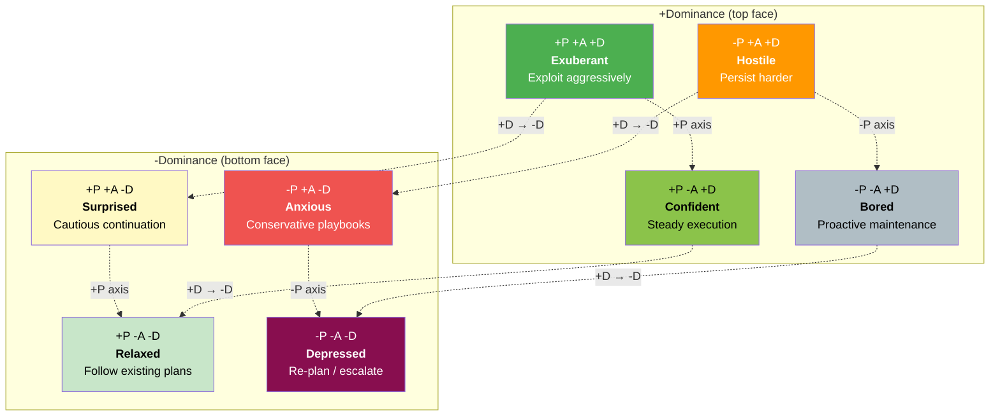
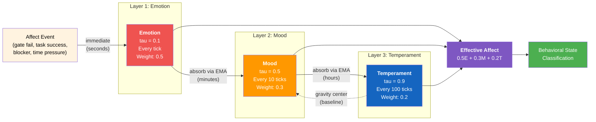
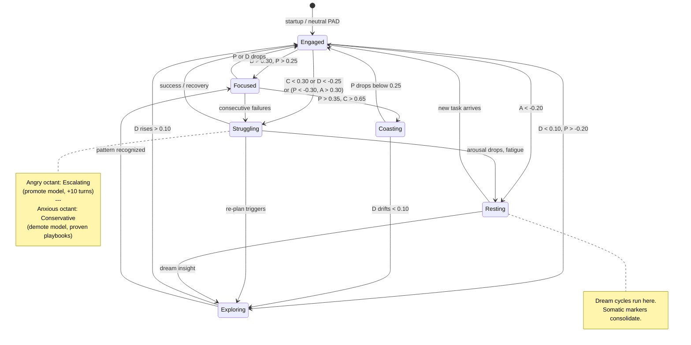
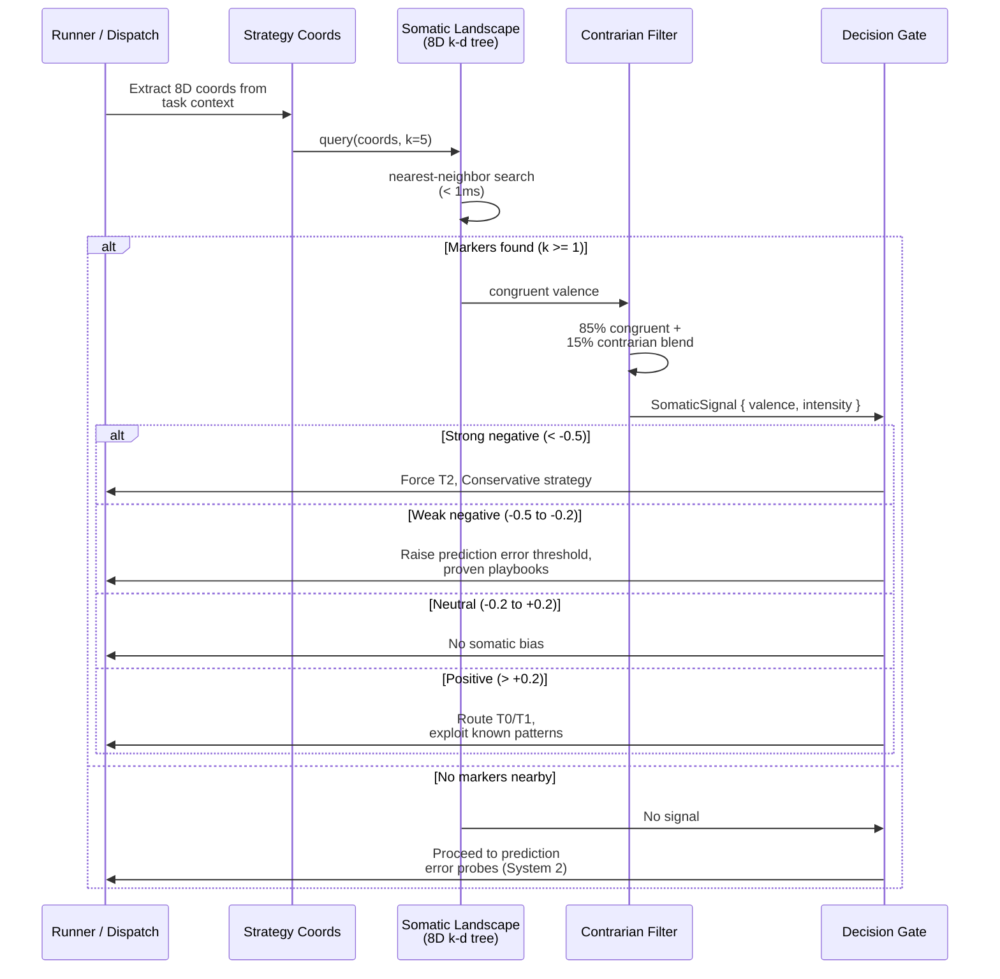
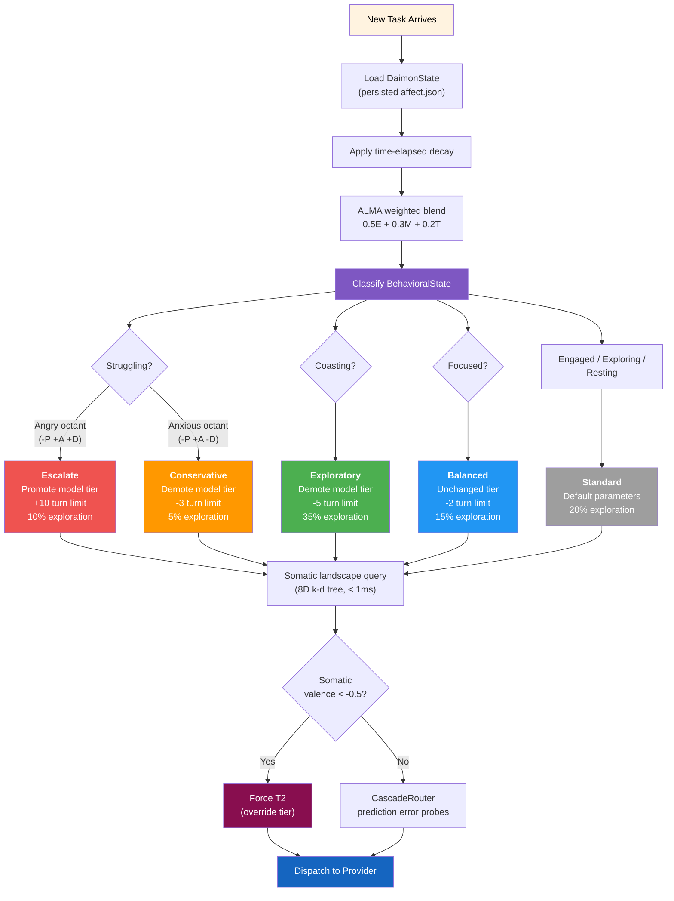

# 11 -- Affect and Daimon

> **Implementation status** (corrected 2026-09-29 at `7c556bc0a`): PARTIAL --
> `roko-daimon` implements the affect engine: PAD vector, ALMA three-layer temporal
> model, OCC/Scherer appraisal pipeline, six behavioral states with hysteresis, somatic
> landscape (8D k-d tree), 15% contrarian retrieval, four-factor retrieval scoring,
> prospect-theory appraisal asymmetry, collective contagion primitives, cognitive energy
> accounting, vitality lifecycle, emergent goal trees, and bidirectional energy/affect
> coupling. The E23 (cognitive autonomy) manifest lists 10/10 tasks accepted; that counts
> built components, not runtime effect. On Graph runs the plan runner loads one
> `DaimonState`, and each task outcome is appraised into it. Its effect is limited to
> routing and one detector (`crates/roko-cli/src/graph_task_dispatch.rs`): its confidence
> and behavioral state enter the router's `RoutingContext`, a Struggling state adds a
> conservative-routing recommendation, and its pleasure value adjusts the gate-gaming
> detector's judge score. `AffectPolicy::modulate_dispatch`
> (`crates/roko-daimon/src/policy.rs`) has no caller, so affect never sets turn limits or
> exploration; no affect state reaches the prompt; and the somatic landscape has no
> caller outside `roko-daimon`.

---

## 1. Design Thesis

The Daimon is not an emotional display. It is a **control signal**.

Three floating-point numbers -- pleasure, arousal, dominance -- flow through
the same PAD vector and simultaneously control which model is called, how many
turns are allocated, whether the agent explores or exploits, and whether it
re-plans or persists. The affect system exists because agents that lack
situation-specific emotional memory must reason through every decision from
first principles, while agents with somatic markers achieve O(log N)
approximate evaluation before O(N) exact evaluation (Damasio 1994).

The Daimon implements a hybrid of three theoretical frameworks:

| Framework | Role in Daimon | Key Reference |
|---|---|---|
| **PAD model** | 3D continuous affect space | Mehrabian (1996); Russell & Mehrabian (1977) |
| **ALMA** | Three-layer temporal dynamics | Gebhard (2005) |
| **OCC/Scherer** | Event-grounded appraisal rules | Ortony et al. (1988); Scherer (2001) |

The integration philosophy: PAD provides the coordinate system, ALMA provides
the temporal dynamics, and OCC/Scherer provides the grounding constraint -- no
emotion without a concrete trigger.

---

## 2. The PAD Vector

The Pleasure-Arousal-Dominance model (Mehrabian 1996; Russell & Mehrabian 1977)
represents emotional states as points in a continuous three-dimensional space.
Each dimension occupies [-1.0, 1.0].

### 2.1 The Three Dimensions

**Pleasure [-1.0, 1.0]** -- Outcome quality trajectory.

| Range | Agent State | Concrete Triggers |
|---|---|---|
| [0.6, 1.0] | Strong success | Multiple consecutive gate passes |
| [0.2, 0.6] | Moderate success | Gate passes at moderate rungs |
| [-0.2, 0.2] | Neutral | Mixed results |
| [-0.6, -0.2] | Moderate difficulty | Gate failures, multiple retries |
| [-1.0, -0.6] | Strong failure | Consecutive gate failures, timeouts |

Appraisal rules:

```
Gate pass:    pleasure += 0.05 * rung_scale
Gate fail:    pleasure -= 0.10 * rung_scale
Task success: pleasure += 0.10
Task failure: pleasure -= 0.20
```

The 2x asymmetry (failure impact doubles success impact) follows prospect
theory (Kahneman & Tversky 1979): losses loom larger than gains.

**Arousal [-1.0, 1.0]** -- Cognitive load and urgency.

| Range | Agent State | Concrete Triggers |
|---|---|---|
| [0.6, 1.0] | High urgency | Deadlines, blockers, consecutive failures |
| [-0.2, 0.2] | Normal load | Routine tasks |
| [-1.0, -0.6] | Minimal load | No active tasks, consolidation opportunity |

Appraisal rules:

```
Time pressure:  arousal += proximity * 0.40    (proximity in [0.0, 1.0])
Blocked:        arousal += blockers * 0.05     (capped at 5)
Queue wait:     arousal += scaled ramp over 7 days (0 for first 24h)
Gate fail:      arousal += 0.04 * rung_scale
```

Arousal is the primary input to tier routing bias. High arousal lowers the T2
trigger threshold; low arousal keeps the agent on cheap T0/T1 models.

**Dominance [-1.0, 1.0]** -- Confidence in current approach.

| Range | Agent State | Concrete Triggers |
|---|---|---|
| [0.6, 1.0] | High confidence | Known patterns, successful track record |
| [-0.2, 0.2] | Neutral | No strong signal |
| [-1.0, -0.6] | Very low confidence | Repeated failures, no clear path |

Appraisal rules:

```
Gate pass:    dominance += 0.03 * rung_scale
Gate fail:    dominance -= 0.08 * rung_scale
Task success: dominance += 0.10
Task failure: dominance -= 0.15
Blocked:      dominance -= blockers * 0.08
```

Dominance drives exploration/exploitation balance. Low dominance triggers
exploration (new approaches, broader context). High dominance triggers
exploitation (cached strategies, minimal context).

Where `rung_scale = 1.0 + min(rung, 3) * 0.15` makes higher-rung gate results
approximately 45% more emotionally significant.

### 2.2 PadVector Implementation

The canonical struct lives in `roko-core/src/affect.rs`:

```rust
#[derive(Debug, Clone, Copy, PartialEq, Serialize, Deserialize)]
pub struct PadVector {
    pub pleasure: f64,   // [-1.0, 1.0]
    pub arousal: f64,    // [-1.0, 1.0]
    pub dominance: f64,  // [-1.0, 1.0]
}

impl PadVector {
    pub const fn new(pleasure: f64, arousal: f64, dominance: f64) -> Self;
    pub const fn neutral() -> Self;           // [0, 0, 0]
    pub fn clamped(self) -> Self;             // clamp each to [-1, 1]
    pub fn apply_delta(&mut self, p: f64, a: f64, d: f64);
    pub fn decay_by_factor(&mut self, factor: f64);
}
```

### 2.3 The 8 Octant States

The sign of each PAD dimension defines one of eight named octant states:

| Octant | P | A | D | Label | Agent Meaning | Behavioral Bias |
|---|---|---|---|---|---|---|
| +P+A+D | + | + | + | **Exuberant** | Succeeding under pressure | Exploit aggressively |
| +P+A-D | + | + | - | **Surprised** | Unexpected success | Cautious continuation |
| +P-A+D | + | - | + | **Confident** | Calm, in control | Steady execution |
| +P-A-D | + | - | - | **Relaxed** | Nothing urgent | Follow existing plans |
| -P+A+D | - | + | + | **Hostile** | Frustrated but trying | Persist harder, add retries |
| -P+A-D | - | + | - | **Anxious** | Failing under pressure | Conservative, proven playbooks |
| -P-A+D | - | - | + | **Bored** | Idle | Proactive maintenance, dreams |
| -P-A-D | - | - | - | **Depressed** | Repeated failures, no agency | Trigger re-plan, escalate model |

The zero vector defaults to Relaxed. Octant classification is implemented via
`AffectOctant::from_pad()`:

```rust
pub const fn from_pad(pleasure: f64, arousal: f64, dominance: f64) -> Self {
    if pleasure == 0.0 && arousal == 0.0 && dominance == 0.0 {
        return Self::Relaxed;
    }
    match (!pleasure.is_sign_negative(),
           !arousal.is_sign_negative(),
           !dominance.is_sign_negative()) {
        (true, true, true)   => Self::Excited,
        (true, true, false)  => Self::Surprised,
        (true, false, true)  => Self::Confident,
        (true, false, false) => Self::Relaxed,
        (false, true, true)  => Self::Angry,
        (false, true, false) => Self::Anxious,
        (false, false, true) => Self::Bored,
        (false, false, false)=> Self::Depressed,
    }
}
```

### 2.4 Relation to Plutchik's Emotion Wheel

Octants map to Plutchik (1980) categories for human-readable logging:

| PAD Octant | Plutchik Emotion | Intensity Variants |
|---|---|---|
| +P+A+D (Exuberant) | Joy | Ecstasy / Joy / Serenity |
| -P+A-D (Anxious) | Fear | Terror / Fear / Apprehension |
| -P+A+D (Hostile) | Anger | Rage / Anger / Annoyance |
| +P-A+D (Confident) | Trust | Admiration / Trust / Acceptance |
| -P-A-D (Depressed) | Sadness | Grief / Sadness / Pensiveness |
| +P+A-D (Surprised) | Surprise | Amazement / Surprise / Distraction |
| -P-A+D (Bored) | Disgust | Loathing / Disgust / Boredom |
| +P-A-D (Relaxed) | Anticipation | Vigilance / Anticipation / Interest |

PAD values, not Plutchik labels, drive all behavioral modulation.

### 2.5 PAD Vector Space

The PAD cube maps every affective state to a point in continuous 3D space.
Each axis spans [-1, +1]; the sign triple selects one of eight octants.



Axes: **Pleasure** runs left-right (+P right, -P left), **Arousal** runs
front-back (+A front, -A back), **Dominance** separates the top and bottom
faces. The zero vector `[0, 0, 0]` defaults to Relaxed.

### 2.6 PAD Cosine Similarity

For mood-congruent retrieval and somatic landscape queries, PAD similarity is
computed as cosine similarity mapped to [0.0, 1.0]:

```rust
pub fn pad_cosine_similarity(a: &PadVector, b: &PadVector) -> f64 {
    let dot = a.pleasure * b.pleasure
        + a.arousal * b.arousal
        + a.dominance * b.dominance;
    let mag_a = (a.pleasure.powi(2) + a.arousal.powi(2) + a.dominance.powi(2)).sqrt();
    let mag_b = (b.pleasure.powi(2) + b.arousal.powi(2) + b.dominance.powi(2)).sqrt();

    if mag_a == 0.0 || mag_b == 0.0 {
        return 0.5;  // Neutral mood -> middle similarity
    }
    (dot / (mag_a * mag_b) + 1.0) / 2.0  // Map [-1, 1] -> [0, 1]
}
```

Cosine captures emotional *direction* rather than *magnitude*. Mild anxiety
(P:-0.2, A:+0.1, D:-0.1) and strong anxiety (P:-0.8, A:+0.5, D:-0.4) have
high Euclidean distance (0.74) but high cosine similarity (0.99).

### 2.7 Decay Toward Baseline

The PAD vector decays toward neutral [0, 0, 0] with configurable half-life
(default: 4 hours). Exponential decay:

```
factor = 0.5 ^ (elapsed_hours / half_life_hours)
pad.pleasure  *= factor
pad.arousal   *= factor
pad.dominance *= factor
```

Confidence decays toward 0.5 (neutral), not toward 0.0:

```
confidence = 0.5 + (confidence - 0.5) * factor
```

After 1 half-life (4h): intensity halved. After 2 half-lives (8h): quartered.
After 4 half-lives (16h): at 6.25% of original intensity.

---

## 3. ALMA Three-Layer Temporal Model

The ALMA (A Layered Model of Affect) architecture (Gebhard 2005) provides
three temporal layers that prevent both emotional volatility and emotional
inertia.

### 3.1 Layer Definitions

| Layer | Timescale | Time Constant | Update Frequency | Function |
|---|---|---|---|---|
| **Emotion** | Seconds | tau_e = 0.1 | Every tick | Fast reactivity to events |
| **Mood** | Hours | tau_m = 0.5 | Every 10 ticks | Accumulated trajectory |
| **Temperament** | Lifetime | tau_t = 0.9 | Every 100 ticks | Stable baseline personality |

### 3.2 AlmaLayers Implementation

```rust
pub struct AlmaLayers {
    pub emotion: PadVector,
    pub mood: PadVector,
    pub temperament: PadVector,
    pub tau_emotion: f64,      // default 0.1
    pub tau_mood: f64,         // default 0.5
    pub tau_temperament: f64,  // default 0.9
    pub mood_interval: u64,        // default 10 ticks
    pub temperament_interval: u64, // default 100 ticks
}
```

Update equations use exponential moving averages:

```
Emotion layer:      emotion     = (1 - tau_e) * emotion     + tau_e * stimulus
Mood layer:         mood        = (1 - tau_m) * mood        + tau_m * emotion
Temperament layer:  temperament = (1 - tau_t) * temperament + tau_t * mood
```

### 3.3 Effective Affect

The effective PAD used for behavioral decisions is a weighted blend:

```
effective_affect = 0.5 * emotion + 0.3 * mood + 0.2 * temperament
```

This gives the emotion layer primacy for fast reactivity while mood and
temperament provide smoothing and gravitational centering.

### 3.4 ALMA Three Layers



Each layer responds at a different timescale. Fast stimuli dominate the
emotion layer but are smoothed by mood and anchored by temperament. The
weighted blend ensures the agent reacts quickly to urgent events without
whipsawing on routine noise.

### 3.5 Temporal Cascade

```
Event occurs (gate fail, task success, blocker, ...)
  |
  v
Layer 1: Emotion -- compute PAD delta from appraisal rules
  |
  v
Layer 2: Mood -- absorb emotion via EMA (every 10 ticks)
  |              +-- Decay toward Layer 3 baseline
  v
Layer 3: Temperament -- absorb mood via EMA (every 100 ticks)
  |
  v
effective_affect() -- weighted blend drives behavioral state
```

### 3.6 Temporal Dynamics Example

```
t=0: Neutral mood [P:0.0, A:0.0, D:0.0]
t=1: Task failure -> delta [P:-0.20, A:0.00, D:-0.15]
     Mood: [P:-0.20, A:0.00, D:-0.15]  State: Anxious/Depressed region
t=2: Task failure -> delta [P:-0.20, A:0.00, D:-0.15]
     Mood: [P:-0.40, A:0.00, D:-0.30]  State: Deep Struggling
t=3: Task failure -> delta [P:-0.20, A:0.00, D:-0.15]
     Mood: [P:-0.60, A:0.00, D:-0.45]  State: Struggling, may trigger re-plan
t=4: Task success -> delta [P:+0.10, A:0.00, D:+0.10]
     Mood: [P:-0.50, A:0.00, D:-0.35]  State: Still negative, recovering
t=5: (4 hours pass) -> decay factor 0.5
     Mood: [P:-0.25, A:0.00, D:-0.175] State: Fading toward neutral
```

### 3.7 Why Three Layers

| Alternative | Problem |
|---|---|
| Emotion layer only | Agent whipsaws between states on every event |
| Mood layer only | Agent responds too slowly to urgent events |
| Two layers (emotion+mood) | Without personality attractor, permanent drift |

The personality layer (temperament) prevents permanent affect drift by
providing a gravitational center. Currently hardcoded as neutral [0, 0, 0];
future work: per-agent personality profiles, learned personality from
long-term trajectory (Costa & McCrae 1992).

---

## 4. OCC/Scherer Appraisal Model

The appraisal pipeline converts concrete events into PAD deltas. The critical
constraint is **grounding**: every emotion has a trigger, every trigger is
grounded in a concrete metric (Ortony et al. 1988; Scherer 2001).

### 4.1 Appraisal Pipeline

```
AffectEvent arrives
  |
  v  Step 1: CLASSIFY -- event type (gate, task, blocker, time, queue, dream)
  |
  v  Step 2: GROUND -- verify concrete metric (boolean pass/fail, [0,1] proximity, count)
  |
  v  Step 3: SCALE -- rung_scale = 1.0 + min(rung, 3) * 0.15
  |
  v  Step 4: COMPUTE DELTA -- apply appraisal rules -> (P, A, D, C) delta
  |
  v  Step 5: DECAY -- temporal decay before applying delta
  |
  v  Step 6: APPLY -- add delta with clamping to [-1, 1]
  |
  v  Step 7: PERSIST -- autosave to disk
  |
  v  Step 8: EMIT -- if PAD Euclidean delta > 0.15, emit MoodUpdate event
```

### 4.2 Complete Appraisal Rule Set

| Event | P delta | A delta | D delta | C delta | Character |
|---|---|---|---|---|---|
| Gate pass (rung r) | +0.05*rs | -0.01*rs | +0.03*rs | +0.03*rs | Satisfaction |
| Gate fail (rung r) | -0.10*rs | +0.04*rs | -0.08*rs | -0.08*rs | Disappointment |
| Task success | +0.10 | 0.00 | +0.10 | +0.08 | Achievement |
| Task failure | -0.20 | 0.00 | -0.15 | -0.15 | Significant setback |
| Blocked (n blockers) | 0.00 | +n*0.05 | -n*0.08 | -0.02*n | Frustration |
| Time pressure (prox) | 0.00 | +prox*0.40 | 0.00 | 0.00 | Pure urgency |
| Queue wait (>24h) | 0.00 | scaled | 0.00 | 0.00 | Increasing urgency |
| Dream failure (n) | 0.00 | 0.00 | 0.00 | -0.07*n | Confidence erosion |

### 4.3 OCC Theory Mapping

OCC (Ortony, Clore, & Collins 1988) classifies emotions by appraisal focus:

| Focus | Positive | Negative | Agent Mapping |
|---|---|---|---|
| **Events** (consequences for goals) | Joy, Hope | Distress, Fear | Gate results, task outcomes |
| **Agents** (actions vs. standards) | Pride | Shame | Dominance dimension |
| **Objects** (attributes of things) | Attraction | Aversion | Somatic landscape valence |

### 4.4 Scherer's Sequential Checking

Scherer (2001) proposed five sequential appraisal checks:

| Check | Question | Daimon Implementation |
|---|---|---|
| Novelty | New or expected? | Prediction accuracy |
| Intrinsic pleasantness | Positive or negative? | Gate pass vs. fail |
| Goal relevance | Does it matter? | Always relevant (active task) |
| Coping potential | Can I handle this? | Dominance dimension |
| Norm compatibility | Meets standards? | Gate rung levels |

### 4.5 Prospect Theory Integration

The `prospect_value()` function maps realized outcomes to subjective value
using Kahneman & Tversky's prospect theory:

```rust
pub fn prospect_value(pnl: f64) -> f64 {
    const LOSS_AVERSION: f64 = 2.25;
    const CURVATURE: f64 = 0.88;
    if pnl == 0.0 { 0.0 }
    else if pnl > 0.0 { pnl.powf(CURVATURE) }
    else { -LOSS_AVERSION * pnl.abs().powf(CURVATURE) }
}
```

Gains use x^0.88; losses use -2.25 * |x|^0.88. Non-finite inputs are returned
unchanged for caller rejection.

---

## 5. Six Behavioral States

The six behavioral states bridge the continuous PAD space and discrete
decision space. The critical constraint is **cyclicality** -- there is no
terminal state. Every state can transition to every other state through
intermediate PAD changes.

### 5.1 State Definitions

| State | PAD Profile | Description |
|---|---|---|
| **Engaged** | Near origin | Normal operation, sustainable progress |
| **Struggling** | Low P, High A | Failing under pressure |
| **Coasting** | High P, Low A | Succeeding without difficulty |
| **Exploring** | Low D | Unfamiliar territory |
| **Focused** | High D, High P | Succeeding in well-understood territory |
| **Resting** | Low A, Low D | Idle, maintenance opportunity |

### 5.2 Classification Algorithm

```rust
pub fn classify(pad: PadVector, confidence: f64) -> BehavioralState {
    let c = confidence.clamp(0.0, 1.0);

    if pad == PadVector::neutral() { return BehavioralState::Engaged; }

    // Priority order: Struggling checked first (protective measures)
    if c < 0.30 || pad.dominance < -0.25
       || (pad.pleasure < -0.30 && pad.arousal > 0.30)
    { return BehavioralState::Struggling; }

    if pad.pleasure > 0.35 && c > 0.65
    { return BehavioralState::Coasting; }

    if pad.dominance > 0.30 && pad.pleasure > 0.25
    { return BehavioralState::Focused; }

    if pad.arousal < -0.20
    { return BehavioralState::Resting; }

    if pad.dominance < 0.10 && pad.pleasure > -0.20
    { return BehavioralState::Exploring; }

    BehavioralState::Engaged  // fallback
}
```

### 5.3 Threshold Calibration

Thresholds derive from appraisal rule magnitudes:

```
confidence_threshold = 0.70 - (2.5 * 0.15) = 0.30
dominance_threshold  = 0.00 - (2.0 * 0.15) = -0.25  (with partial decay)
```

Three consecutive task failures push confidence from 0.70 to 0.25, crossing
the 0.30 threshold and triggering Struggling. The agent tolerates one or two
failures without state change.

### 5.4 Hysteresis and Dwell Time

Split thresholds prevent boundary oscillation:

```rust
pub struct BehavioralStateThresholds {
    pub struggling_entry_confidence: f64,  // 0.30
    pub struggling_exit_confidence: f64,   // 0.40
    pub struggling_entry_dominance: f64,   // -0.25
    pub struggling_exit_dominance: f64,    // -0.15
    pub coasting_entry_pleasure: f64,      // 0.35
    pub coasting_exit_pleasure: f64,       // 0.25
    pub resting_entry_arousal: f64,        // -0.20
    pub resting_exit_arousal: f64,         // -0.10
}
```

Minimum dwell time (default: 10 ticks) prevents state flickering. The
`BehavioralStateTracker` suppresses transitions until dwell time expires.

### 5.5 Behavioral Modulation Parameters

Each state maps to concrete dispatch parameters:

| State | Strategy | Turn Limit | Model | Exploration |
|---|---|---|---|---|
| **Engaged** | Balanced | unchanged | unchanged | 20% |
| **Struggling** (low C/D) | Escalating | +10 | promote | 10% |
| **Struggling** (low P, high A) | Conservative | -3 | demote | 5% |
| **Coasting** | Exploratory | -5 | demote | 35% |
| **Focused** | Balanced | -2 | unchanged | 15% |
| **Resting** | Proactive | +5 | unchanged | 25% + dreams |

**Struggling distinction**: Angry octant (-P, +A, +D) triggers Escalating --
the agent believes it can solve this but needs more resources. Anxious octant
(-P, +A, -D) triggers Conservative -- the agent falls back to proven
approaches. This implements a coarse confidence-competence matrix.

### 5.6 Behavioral State to Tier Routing

Behavioral state modulates CascadeRouter prediction error thresholds:

```
Standard:   error < 0.2 -> T0;  error < 0.6 -> T1;  error >= 0.6 -> T2
Struggling: error < 0.1 -> T0;  error < 0.4 -> T1;  error >= 0.4 -> T2
Coasting:   error < 0.3 -> T0;  error < 0.8 -> T1;  error >= 0.8 -> T2
```

| State | T0 Bias | T1 Bias | T2 Bias |
|---|---|---|---|
| **Engaged** | Standard | Standard | Standard |
| **Struggling** | Reduced | Reduced | **Increased** |
| **Coasting** | **Increased** | **Increased** | Reduced |
| **Exploring** | Standard | **Increased** | Increased for research |
| **Focused** | **Increased** | Standard | Reduced |
| **Resting** | Standard | Standard for dreams | N/A |

```rust
pub struct TierBias {
    pub t0_threshold_delta: f64,  // + = harder to escalate
    pub t1_threshold_delta: f64,  // - = easier to escalate
}
```

### 5.7 Cyclicality Diagram

```
           +--------------------------------------+
           |                                      |
    Engaged --> Struggling --> Resting            |
       ^            |              |              |
       |            v              v              |
    Focused <-- Exploring    (Dream cycles)       |
       ^                           |              |
       |                           v              |
       +-------- Coasting <--------+              |
                    |                              |
                    +------------------------------+
```

Common transitions: Struggling -> Resting -> Exploring -> Engaged (recovery);
Engaged -> Focused -> Coasting (performance optimization); Coasting -> Engaged
-> Struggling (challenge encounter).

### 5.8 State Transition Diagram



All transitions are reversible. Minimum dwell time (10 ticks) and split
entry/exit thresholds prevent boundary oscillation.

---

## 6. Somatic Markers

Damasio's somatic marker hypothesis (1994) proposes that emotions mark past
experiences with "gut feelings" that speed future decisions. The Daimon
implements this as a **k-d tree over the 8-dimensional strategy space**
(Bechara & Damasio 2000, 2005).

### 6.1 The Somatic Landscape

```rust
pub struct SomaticLandscape {
    tree: KdTree<f64, STRATEGY_DIMENSIONS>,  // 8D k-d tree
}

pub struct SomaticMarker {
    pub strategy_coords: [f64; 8],
    pub valence: f64,     // +1 = worked well; -1 = went badly
    pub intensity: f64,   // [0, 1] -- strength of the feeling
    pub episodes: Vec<ContentHash>,  // provenance
}
```

The k-d tree provides O(log N) nearest-neighbor queries. With `kiddo` v4+:
100 markers at ~5us, 10,000 markers at ~100us, 100,000 markers at ~500us --
all within the 1ms latency budget.

### 6.2 Somatic Query Protocol

Before selecting an action, the agent queries the somatic landscape:

```rust
pub fn query(
    &self,
    strategy_coords: &[f64; 8],
    k: usize,           // nearest neighbors (default: 5)
    contrarian_k: usize, // contrarian neighbors (default: 1)
) -> SomaticSignal {
    // Phase 1: k nearest neighbors
    let neighbors = self.tree.nearest(strategy_coords, k, &squared_euclidean);

    // Phase 2: weighted valence (inverse distance weighting)
    let congruent_valence = weighted_average_valence(&neighbors);

    // Phase 3: mandatory 15% contrarian retrieval
    let contrarian = self.query_contrarian(strategy_coords, congruent_valence, contrarian_k);

    // Phase 4: blend 85% congruent + 15% contrarian
    let blended = 0.85 * congruent_valence + 0.15 * contrarian.valence;

    SomaticSignal { valence: blended, intensity, neighbor_count, contrarian_count }
}
```

### 6.3 Somatic Signal Response

| Signal | Agent Response |
|---|---|
| Strong negative (< -0.5) | Route T2, increase review, Conservative strategy |
| Weak negative (-0.5 to -0.2) | Increase prediction error threshold, proven playbooks |
| Neutral (-0.2 to 0.2) | No somatic bias |
| Weak positive (0.2 to 0.5) | Slight model demotion, cached strategies |
| Strong positive (> 0.5) | Route T0/T1, exploit known patterns |

### 6.4 Timing in Cognitive Pipeline

```
1. SOMATIC QUERY       (< 1ms)  -- k-d tree nearest neighbor
2. PREDICTION ERROR    (< 5ms)  -- 16 deterministic probes
3. TIER SELECTION      (~0ms)   -- threshold comparison
4. CONTEXT ASSEMBLY    (~10ms)  -- VCG auction, knowledge retrieval
5. MODEL INFERENCE     (~2-30s) -- LLM call at selected tier
```

The somatic query can preempt tier selection: strongly negative valence forces
T2 before prediction error probes run. This is the System 1 fast path
(Kahneman 2011).

### 6.5 Somatic Marker Decision Flow



The somatic query acts as a System 1 fast path. When past experience
has recorded a strong marker near the current strategy coordinates, the
decision is biased before the slower prediction-error probes run.

### 6.6 Marker Lifecycle

**Live-created markers**: When a PAD delta exceeds 0.15 Euclidean, the
appraisal engine records a marker at current strategy coordinates.

**Dream-created markers**: During NREM replay, emotionally charged episodes
(|arousal| > 0.5) are distilled into markers.

**Consolidation**: Markers within Euclidean distance 0.5 are merged during
dream cycles via intensity-weighted averaging. Provenance is preserved (up to
50 episodes per marker).

**Depotentiation** (Walker & van der Helm 2009): Dream processing reduces
marker intensity, reflecting emotional processing. A marker at intensity 0.9
may be reduced to 0.6 after dreaming.

### 6.7 Somatic Events

When a marker fires strongly (|valence| > 0.3, intensity > 0.5):

```rust
pub struct SomaticMarkerFiredEvent {
    pub situation: String,
    pub valence: f64,
    pub source_episodes: Vec<ContentHash>,
    pub strategy_param: String,
}
```

Consumed by TUI, episode logger, and emotional provenance tracker.

---

## 7. 15% Contrarian Retrieval

Mood-congruent memory is adaptive (Bower 1981) but creates a dangerous
positive feedback loop: a failing agent retrieves failure memories, reinforcing
the negative state, biasing retrieval further toward failures. This is the
computational analog of learned helplessness (Seligman 1972).

### 7.1 The Mechanism

A rolling window tracker maintains minimum 15% contrarian rate across any
200-tick window:

```rust
pub struct ContrarianTracker {
    window: VecDeque<ContrarianEvent>,
    window_size: usize,              // default: 200
    min_contrarian_fraction: f64,    // default: 0.15
}

impl ContrarianTracker {
    pub fn should_inject(&self, current_tick: u64) -> bool {
        let rate = contrarian_count / recent_total;
        rate < self.min_contrarian_fraction
    }
}
```

### 7.2 Contrarian Retrieval

When injection is needed, the retrieval system inverts pleasure and dominance
while keeping arousal (arousal tracks salience):

```rust
let inverted_pad = PadVector {
    pleasure: -current_pad.pleasure,
    arousal:  current_pad.arousal,   // keep salience
    dominance: -current_pad.dominance,
};
```

### 7.3 Why 15%

- **Large enough** to break feedback loops (5% would be absorbed by 85% majority)
- **Small enough** to preserve mood-congruent benefits (Bower 1981: 5-30% accuracy boost)
- **Not from Emotional RAG**: that paper (2024, arXiv:2410.23041) tests mood-congruent retrieval only; 15% is Roko's own choice

### 7.4 Three Loop-Breaking Mechanisms

| Mechanism | Level | Timescale |
|---|---|---|
| 15% contrarian retrieval | Memory access | Tick-level |
| REM depotentiation | Memory storage | Dream-cycle (hours) |
| PAD decay | Affect state | Hours to days |

### 7.5 Contrarian in Somatic Queries

The 15% also applies to k-d tree somatic queries. The `query_contrarian()`
method filters for opposite-valence markers, with a dead zone (congruent
valence < 0.05 uses any |valence| > 0.20 as informative).

---

## 8. 8-Dimensional Strategy Space

The somatic landscape indexes markers in an 8-dimensional strategy space.
Dimensions are domain-configurable.

### 8.1 Coding Agent Dimensions

| # | Dimension | Low (0.0) | High (1.0) | Source |
|---|---|---|---|---|
| 1 | **Complexity** | Simple rename | Multi-file refactor | Cyclomatic complexity, file count |
| 2 | **Risk** | Test-covered | Untested critical path | Coverage, gate rung, deps |
| 3 | **Novelty** | Familiar pattern | First encounter | Neuro similarity (inverted) |
| 4 | **Confidence** | Low Daimon confidence | High, proven approach | AffectState.confidence |
| 5 | **Time Pressure** | No deadline | Imminent deadline | Proximity, blockers, queue |
| 6 | **Scope** | Single function | System-wide change | Lines changed, file count |
| 7 | **Reversibility** | Easily reverted | Schema migration | Diff analysis |
| 8 | **Dep. Depth** | Leaf module | Core library | Dependency graph |

### 8.2 StrategyCoordinates Implementation

```rust
pub struct StrategyCoordinates {
    pub complexity: f64,       // [0, 1]
    pub risk: f64,
    pub novelty: f64,
    pub confidence: f64,
    pub time_pressure: f64,
    pub scope: f64,
    pub reversibility: f64,
    pub dependency_depth: f64,
}

impl StrategyCoordinates {
    pub const fn as_array(self) -> [f64; 8];
    pub const fn neutral() -> Self;  // all 0.5
    pub fn clamped(self) -> Self;    // clamp each to [0, 1]
}
```

### 8.3 Chain Agent Dimensions

| # | Dimension | Low (0.0) | High (1.0) |
|---|---|---|---|
| 1 | Volatility | Stable market | Rapid price changes |
| 2 | Liquidity | Deep pools | Thin markets |
| 3 | Correlation | Independent assets | High cross-asset correlation |
| 4 | Leverage | Spot only | High leverage |
| 5 | Time Horizon | Short-term (< 1h) | Long-term (> 1 week) |
| 6 | Concentration | Diversified | Single asset |
| 7 | Counterparty Risk | Trustless protocol | Bridge/CEX dependency |
| 8 | Regulatory Exposure | Clearly unregulated | Potentially regulated |

### 8.4 Dimensionality Choice

8 dimensions balance expressiveness (distinguish strategies), computational
efficiency (k-d tree: N >> 2^D = 256, easily achievable), and human
interpretability. Alternatives:

| D | Verdict | Reason |
|---|---|---|
| 3 | Rejected | Cannot distinguish strategies with same emotional profile |
| 5 | Rejected | Too few for domain-specific features |
| **8** | **Selected** | Good k-d tree performance, interpretable |
| 16 | Rejected | k-d tree degradation, hard to populate |

### 8.5 Dimension Computation

Complexity uses sigmoid normalization:

```
sigmoid_normalize(x, midpoint, steepness) = 1 / (1 + exp(-steepness * (x - midpoint)))
```

Risk combines three signals: 50% coverage_risk + 25% rung_risk + 25% dep_risk.

Novelty = 1 - nearest_playbook_similarity (maximum 1.0 for new agents).

### 8.6 Resource Pressure Scalar

Under budget pressure, coordinates compress toward the conservative center:

```
scalar = min(token_remaining, time_remaining)^0.5

compressed[i] = scalar * coords[i] + (1 - scalar) * 0.5
```

At 25% budget: scalar = 0.5. At 6.25%: scalar = 0.25. This causes the k-d
tree to hit markers in the "moderate" region -- proven approaches.

### 8.7 Cross-Domain Transfer

Transfer uses structural analogy via dimension role mapping:

| Role | Coding Dim | Chain Dim |
|---|---|---|
| difficulty | Complexity | Volatility |
| danger | Risk | Leverage |
| familiarity | Novelty | Correlation |
| self_assessment | Confidence | Confidence |
| urgency | Time Pressure | Time Horizon |
| breadth | Scope | Concentration |
| recoverability | Reversibility | Counterparty Risk |
| coupling | Dep. Depth | Regulatory Exposure |

The `classify_dimension_role()` function maps dimension labels to abstract
behavioral roles via keyword matching.

### 8.8 Dimension Weighting

Weighted squared Euclidean distance. Weights are applied via sqrt-scaling
before insertion:

```
weighted_coord[i] = coord[i] * sqrt(weight[i])
```

Default: all 1.0. Override via `roko.toml`:

```toml
[daimon.strategy_space]
domain = "coding"
dimension_weights = [1.0, 1.5, 1.2, 1.0, 0.8, 1.0, 1.3, 0.7]
```

---

## 9. Mood-Congruent Memory

Emotional state biases which memories are retrieved. This is adaptive, not a
bug (Bower 1981; Phelps 2004).

### 9.1 Four-Factor Retrieval Scoring

```
score = w_recency    * recency(Ebbinghaus)
      + w_importance * quality(Reflexion)
      + w_relevance  * cosine(query, entry)
      + w_emotional  * PAD_cosine(current_mood, entry_affect)
```

Initial weights: recency 0.20, importance 0.25, relevance 0.35, emotional
0.20. Weights are online-learnable:

```rust
pub struct RetrievalWeights {
    pub recency: f64,     // 0.20
    pub importance: f64,  // 0.25
    pub relevance: f64,   // 0.35
    pub emotional: f64,   // 0.20
}

impl RetrievalWeights {
    pub fn update(&mut self, factors: [f64; 4], outcome: f64, learning_rate: f64) {
        // Gradient descent, normalize to sum=1.0, clamp each to [0.01, 0.80]
    }
}
```

### 9.2 Emotional Tags on Signals

Every Signal in the Neuro store carries an optional `EmotionalTag`:

```rust
pub struct EmotionalTag {
    pub pad: PadVector,          // PAD at creation
    pub emotion: String,         // Plutchik label
    pub intensity: f32,          // [0.0, 1.0]
    pub trigger: String,         // "gate_fail:rung_2:task_abc"
    pub mood_snapshot: PadVector, // ALMA mood layer snapshot
}
```

### 9.3 Emotional Provenance

Consolidated knowledge preserves emotional provenance:

```rust
pub struct EmotionalProvenance {
    pub average_pad: PadVector,
    pub discovery_emotion: String,
    pub validation_arc: Option<ValidationArc>,
    pub emotional_diversity: f64,  // Shannon entropy across supporting episodes
}

pub enum ValidationArc {
    Redemptive,     // adversity -> positive outcome (most transferable)
    Contaminating,  // success -> failure (cautionary)
    Stable,         // consistent tone
    Progressive,    // gradual improvement
}
```

Emotional diversity is computed as normalized Shannon entropy. Score of 1.0 =
maximum diversity across emotional states, highest reliability signal.

### 9.4 Emotional Consolidation Bias

High-arousal experiences are preferentially consolidated (McGaugh 2004):

```
consolidation_priority = base_priority * (1.0 + arousal_boost)
arousal_boost = |emotional_tag.pad.arousal| * 0.3
```

### 9.5 The Dream-Memory-Emotion Triangle

1. **Emotion -> Memory**: Mood-congruent retrieval + arousal-based consolidation
2. **Memory -> Emotion**: Retrieved context shapes appraisal interpretation
3. **Dreams -> Memory + Emotion**: Consolidation, depotentiation, somatic markers

Self-regulating when all three mechanisms operate. Without dreams, the
triangle degenerates: emotional memories accumulate without processing, and
contrarian retrieval becomes the sole defense against rumination.

---

## 10. Integration Points

The PAD vector is a control signal that drives four systems simultaneously:

### 10.1 Integration Map

```
                 PAD Vector
                /    |    \
               /     |     \
              /      |      \
    Behavioral     Tier       VCG       Somatic
     State        Routing    Auction    Landscape
       |            |          |           |
       v            v          v           v
    Self-model   CascadeR.   Context    Pre-filter
    TUI display  Model sel.  assembly   Fast bias
    Tone map     Cost ctrl   Token alloc Strategy rank
```

### 10.2 Affect-Aware Dispatch Flow



The behavioral state selects a dispatch strategy (turn limits, model tier
bias, exploration rate). The somatic landscape can then override tier
selection when past experience recorded a strong negative marker for
similar strategy coordinates.

### 10.3 VCG Auction Bidding

```
bid = expected_value * urgency * affect_weight

urgency      = 1 + arousal * 0.5
affect_weight = 1 + 0.3 * abs(pleasure - 0.5)
```

High arousal amplifies safety-critical context bids. Extreme pleasure (positive
or negative) increases emotionally-relevant context weight.

### 10.4 Event Emission Thresholds

| Event | Trigger | Consumers |
|---|---|---|
| MoodUpdate | PAD Euclidean delta > 0.15 | TUI, episode logger, clients |
| SomaticMarkerFired | |valence| > 0.3, intensity > 0.5 | TUI, episode logger |
| EmotionalShift | Dominant Plutchik emotion changes | TUI, notification |

---

## 11. Coding Agent Integration

The Daimon provides three coding-specific capabilities.

### 11.1 Per-Crate Confidence

```rust
pub struct CrateConfidence {
    pub seen: u32,
    pub resolved: u32,
    pub confidence: f64,
}
```

Per-crate confidence modulates tier routing (low < 0.40 promotes model, high >
0.80 demotes) and provides the Confidence dimension in the 8D strategy space.

### 11.2 Error Pattern Sensitivity

```rust
pub struct ErrorPatternTracker {
    patterns: HashMap<String, (u32, u32)>,
}

impl ErrorPatternTracker {
    pub fn familiarity(&self, error_category: &str) -> f64 {
        // resolution_rate * experience, saturates at 10 encounters
    }
    pub fn scale_gate_failure(&self, category: &str, base_delta: (f64,f64,f64,f64))
        -> (f64,f64,f64,f64) {
        // Unfamiliar (0.0) -> 1.5x; Familiar (1.0) -> 0.5x
        let scale = 1.5 - familiarity;
        // ... scale all delta components
    }
}
```

### 11.3 Fatigue Detection

Detected when: 3+ consecutive failures AND pleasure drop > 0.15 AND failures
within 2 hours:

```rust
pub fn is_fatigued(&self, task_id: &str) -> bool {
    many_failures && pleasure_drop && rapid_failures
}
```

Response selected by behavioral state:

| State | Fatigue Response |
|---|---|
| Struggling | Escalate (stronger model) |
| Exploring | Re-plan (different strategy) |
| Resting | Dream cycle (pattern recognition) |
| Other | Deprioritize (work on something else) |

### 11.4 SystemPromptBuilder Integration

The Daimon state is injected into agent system prompts:

```xml
<daimon>
  behavioral_state: Struggling
  confidence: 0.35
  crate_confidence:
    roko-core: 0.85
    roko-daimon: 0.35
  fatigue: detected (3 consecutive failures)
  recommendation: escalate to stronger model
</daimon>
```

---

## 12. Collective Emotional Contagion

When agents share a mesh, emotional states propagate (Van den Broek 2023;
Hatfield, Cacioppo, & Rapson 1993).

### 12.1 Contagion Rules

| Dimension | Attenuation | Rationale |
|---|---|---|
| Pleasure | 0.3 (30%) | Peer success is informative, not as significant as own |
| Arousal | 0.3 (30%) | Peer urgency increases vigilance, not overwhelms |
| Dominance | 0.0 (none) | Control perception is strictly local |

Arousal cap per sync cycle: +0.3. Propagation: unidirectional (no reciprocal
feedback). Borrowed emotion decay: 6-hour half-life.

### 12.2 Contagion Triggers

| Trigger | Effect on Receiver |
|---|---|
| Peer warning push | Arousal +0.1 (capped) |
| Peer critical alert | Arousal +0.1 (capped) |
| Peer sustained success | Dominance +0.05 |
| Peer sustained failure | Pleasure -0.05 |
| Peer dream insight | Arousal +0.05 |

### 12.3 Anti-Cascade Design

Three mechanisms prevent cascading panic:

1. **Cap per sync cycle**: +0.3 arousal max, regardless of simultaneous alarms
2. **Unidirectional propagation**: Contagion does not re-emit; breaks feedback at first hop
3. **Rapid decay**: 6h half-life for borrowed emotions

### 12.4 Somatic Field Formation

Mesh-shared somatic markers aggregate into a collective `SomaticField`:

```rust
pub struct SomaticField {
    landscape: SomaticLandscape,
    agent_weights: HashMap<AgentId, f64>,  // calibrated by historical accuracy
}
```

Privacy boundary: shared markers contain coordinates, valence, and intensity
only -- no episode content, task details, or PAD state.

---

## 13. Energy Accounting

E23 (cognitive autonomy; its manifest lists 10/10 tasks accepted) introduces energy
accounting through CorticalState energy fields.

### 13.1 CognitiveEnergy

```rust
pub struct CognitiveEnergy {
    pub current: f64,              // available energy
    pub max: f64,                  // capacity
    pub fatigue: f64,              // accumulated fatigue
    pub recovery_mode: RecoveryMode,
    pub depletion_multiplier: f64, // affect-derived cost multiplier
    pub fatigue_intensity_factor: f64,
}
```

Energy is consumed by cognitive activities:

| Activity | Cost |
|---|---|
| T0Tick | Deterministic execution |
| T1Tick | Lightweight model |
| T2Tick | Deep model |
| ToolCall | External tool invocation |
| ContextAssembly | Context window assembly |
| GateCheck | Corrigibility evaluation |
| DreamCycle | Recovery operation |

### 13.2 Recovery Modes

```rust
pub enum RecoveryMode {
    Gamma, // Fast partial recovery
    Theta, // Moderate partial recovery
    Delta, // Full recovery with fatigue reset
}
```

Delta recovery also dampens PAD toward neutral:

```rust
pub fn recover_cognitive_energy(&mut self, mode: RecoveryMode) {
    self.cognitive_energy.recover(mode);
    if mode == RecoveryMode::Delta {
        self.state.pad = PadVector::new(
            self.state.pad.pleasure * 0.7,
            self.state.pad.arousal * 0.7,
            self.state.pad.dominance * 0.7,
        );
    }
}
```

### 13.3 Energy/Affect Coupling

Bidirectional coupling applied each tick:

```rust
pub fn apply_energy_affect_coupling(&mut self) {
    // Low energy dampens arousal
    if self.cognitive_energy.current < 0.3 {
        self.state.pad.arousal *= 0.8;
    }
    // High arousal accelerates energy depletion
    self.cognitive_energy.depletion_multiplier =
        if self.state.pad.arousal.abs() > 0.7 { 1.5 } else { 1.0 };
}
```

### 13.4 Vitality Lifecycle

Budget-derived phases gate available tiers and exploration:

```rust
pub enum BehavioralPhase {
    Thriving,      // >= 0.8: all tiers, full exploration
    Stable,        // >= 0.5: all tiers, max 5 active goals
    Conservation,  // >= 0.3: T0/T1 only, reduced exploration
    Declining,     // >= 0.1: T0 only, one goal, no exploration
    Terminal,      // < 0.1: no dispatch, prepare shutdown
}
```

```rust
pub struct VitalityTracker {
    pub initial_budget: f64,
    pub remaining_budget: f64,
    pub last_phase: BehavioralPhase,
    pub last_transition_at: DateTime<Utc>,
}
```

Hysteresis band: 0.05 around each boundary prevents oscillation. Phase
transitions enforce goal capacity limits via `enforce_goal_limit()`.

### 13.5 Yerkes-Dodson Complexity Ceiling

Arousal maps to maximum task complexity via an inverted-U curve (Yerkes &
Dodson 1908):

```rust
pub fn yerkes_dodson_complexity_ceiling(arousal: f64) -> f64 {
    let optimal = 0.35;
    let width = 0.6;
    let deviation = (arousal - optimal) / width;
    (1.0 - 0.5 * deviation * deviation).clamp(0.25, 1.0)
}
```

Peak performance at moderate arousal (~0.35). Ceiling maps to complexity bands:
>= 0.85 = "complex", >= 0.6 = "standard", >= 0.4 = "simple", below = "trivial".

---

## 14. DaimonState and AffectEngine

### 14.1 DaimonState

The persisted top-level state:

```rust
pub struct DaimonState {
    pub state: AffectState,
    pub half_life_hours: f64,
    pub somatic_landscape: SomaticLandscape,
    pub strategy_space: StrategySpaceDefinition,
    pub crate_confidence_map: HashMap<String, f64>,
    pub crate_trackers: HashMap<String, CrateConfidence>,
    pub contrarian_tracker: ContrarianTracker,
    pub error_patterns: ErrorPatternTracker,
    pub fatigue_detector: FatigueDetector,
    pub borrowed_affect: Vec<BorrowedAffect>,
    pub behavioral_tracker: BehavioralStateTracker,
    pub vitality_tracker: VitalityTracker,
    pub cognitive_energy: CognitiveEnergy,
    pub goal_tree: GoalTree,
    pub goal_seeds: Vec<GoalSeed>,
    pub novelty_filter: NoveltyFilter,
}
```

### 14.2 AffectState

```rust
pub struct AffectState {
    pub pad: PadVector,
    pub confidence: f64,
    pub behavioral_state: BehavioralState,
    pub updated_at: DateTime<Utc>,
    pub alma: AlmaLayers,
    pub tick_count: u64,
}
```

The `apply_delta()` method routes stimuli through the ALMA emotion layer,
increments tick count, ticks ALMA layers at their intervals, computes
effective affect from the weighted blend, and refreshes behavioral state.

### 14.3 Persistence

DaimonState persists to `.roko/daimon/affect.json`. On restart, decay is
applied for elapsed time since `updated_at`. An agent shut down 8 hours ago in
a negative mood resumes at 25% intensity (two half-lives).

### 14.4 Affect-Sized Position Multiplier

For DeFi integration:

```rust
pub fn affect_size_multiplier(pleasure: f64, arousal: f64, dominance: f64) -> f64 {
    let arousal_factor = 1.0 - arousal * 0.5;
    let pleasure_factor = 1.0 + pleasure * 0.25;
    (arousal_factor * pleasure_factor).clamp(0.25, 1.5)
}
```

---

## 15. Emergent Goals

DaimonState tracks emergent goals that arise from behavioral patterns.

### 15.1 Goal Tree

```rust
pub struct GoalTree { /* ... */ }

pub struct GoalNode {
    pub id: String,
    pub pattern: String,
    pub status: GoalStatus,
    pub score: f64,
}

pub enum GoalStatus { Active, Suspended, Completed, Pruned }
```

### 15.2 Goal Seeds

Repeated rewarded patterns accumulate as `GoalSeed` entries. When sufficiently
reinforced, they promote into the `GoalTree` as active goals. The vitality
phase enforces capacity limits (Thriving: unlimited, Stable: 5, Conservation:
2, Declining: 1, Terminal: 0).

---

## Academic Foundations

### Core Frameworks

- Mehrabian, A. (1996). "Pleasure-arousal-dominance: A general framework for describing and measuring individual differences in temperament." *Current Psychology*, 14(4), 261--292.
- Russell, J.A. & Mehrabian, A. (1977). "Evidence for a three-factor theory of emotions." *Journal of Research in Personality*, 11, 273--294.
- Gebhard, P. (2005). "ALMA -- A Layered Model of Affect." *AAMAS*, 29--36.
- Ortony, A., Clore, G.L., & Collins, A. (1988). *The Cognitive Structure of Emotions*. Cambridge University Press.
- Scherer, K.R. (2001). "Appraisal considered as a process of multilevel sequential checking." In *Appraisal Processes in Emotion*. Oxford University Press.

### Somatic Markers and Decision-Making

- Damasio, A.R. (1994). *Descartes' Error: Emotion, Reason, and the Human Brain*. Putnam.
- Bechara, A. & Damasio, A.R. (2000). "Emotion, decision making and the orbitofrontal cortex." *Cerebral Cortex*, 10(3), 295--307.
- Bechara, A. & Damasio, A.R. (2005). "The somatic marker hypothesis: A neural theory of economic decision." *Games and Economic Behavior*, 52, 336--372.

### Memory, Emotion, and Learning

- Bower, G.H. (1981). "Mood and Memory." *American Psychologist*, 36(2), 129--148.
- Phelps, E.A. (2004). "Human emotion and memory: interactions of the amygdala and hippocampal complex." *Current Opinion in Neurobiology*, 14(2), 198--202.
- Seligman, M.E.P. (1972). "Learned helplessness." *Annual Review of Medicine*, 23, 407--412.
- Walker, M.P. & van der Helm, E. (2009). "Overnight therapy? The role of sleep in emotional brain processing." *Psychological Bulletin*, 135(5), 731--748.

### Agent Affect and Emotional Computing

- Gadanho, S.C. (2003). "Learning Behavior-Selection by Emotions and Cognition in a Multi-Goal Robot Task." *JMLR*, 4, 385--412.
- Zhang, H. et al. (2024). "Building Emotional Support Chatbots in the Era of LLMs." *SIGDIAL*.
- Friston, K. (2006). "A free energy principle for the brain." *Journal of Physiology -- Paris*, 100(1--3), 70--87.
- Van den Broek, J. (2023). "Emotional Contagion in Multi-Agent Systems." (Review, cited in roko-daimon contagion design).

### Complementary References

- Kahneman, D. & Tversky, A. (1979). "Prospect Theory: An Analysis of Decision under Risk." *Econometrica*, 47(2), 263--291.
- Plutchik, R. (1980). *Emotion: A Psychoevolutionary Synthesis*. Harper & Row.
- Costa, P.T. & McCrae, R.R. (1992). *NEO PI-R Professional Manual*. Psychological Assessment Resources.
- Yerkes, R.M. & Dodson, J.D. (1908). "The relation of strength of stimulus to rapidity of habit-formation." *Journal of Comparative Neurology and Psychology*, 18, 459--482.

---

## Verification Commands

```bash
# Core daimon tests
cargo test -p roko-daimon

# PAD vector and affect types
cargo test -p roko-core pad
cargo test -p roko-core affect

# Behavioral state classification
cargo test -p roko-core behavioral

# Somatic landscape k-d tree operations
cargo test -p roko-daimon somatic

# Strategy space projection
cargo test -p roko-daimon strategy

# ALMA temporal model
cargo test -p roko-daimon alma

# Contrarian retrieval
cargo test -p roko-daimon contrarian

# Cognitive energy and vitality
cargo test -p roko-daimon energy
cargo test -p roko-daimon vitality

# Goal tree lifecycle
cargo test -p roko-daimon goal

# Fatigue detection
cargo test -p roko-daimon fatigue

# Integration: daimon state in runner dispatch
cargo test -p roko-cli daimon

# Full workspace
cargo test --workspace
```

---

## Depth Files

| File | Topic |
|---|---|
| `depth/11-01-pad-vector.md` | Full PAD 3D affect space math, octant algebra |
| `depth/11-02-alma-temporal.md` | Three-layer EMA dynamics, decay proofs |
| `depth/11-03-occ-scherer.md` | Appraisal rule derivation, Scherer's five checks |
| `depth/11-04-behavioral-states.md` | State machine, hysteresis, dwell time |
| `depth/11-05-tier-routing.md` | Behavioral state to CascadeRouter wiring |
| `depth/11-06-somatic-markers.md` | k-d tree algorithms, consolidation, depotentiation |
| `depth/11-07-contrarian.md` | Rolling window, bootstrap, edge cases |
| `depth/11-08-strategy-space.md` | 8D definition, extraction algorithms, domain registration |
| `depth/11-09-mood-memory.md` | Four-factor scoring, emotional provenance, diversity |
| `depth/11-10-integration.md` | VCG bidding, somatic pipeline, event emission |
| `depth/11-11-coding-agent.md` | Per-crate confidence, error patterns, fatigue |
| `depth/11-12-contagion.md` | Propagation rules, anti-cascade, somatic fields |
| `depth/11-13-energy.md` | CognitiveEnergy, vitality lifecycle, Yerkes-Dodson |
| `depth/11-14-goals.md` | Emergent goal seeds, promotion, phase capacity |

---

## Cross-References

- **Signal** (ch.01): `EmotionalTag` on Signals enables affect-weighted retrieval
- **Cell** (ch.02): Immune Graph cells consume PAD for five-head corrigibility
- **Graph** (ch.03): Graph execution dispatches through Daimon-modulated parameters
- **Dreams** (ch.10): Dream consolidation creates/depotentiates somatic markers, triggers REM emotional processing
- **Learning** (ch.12): CascadeRouter receives tier bias from behavioral state; efficiency events carry effort labels
- **Neuro** (ch.08): Four-factor retrieval scoring uses PAD cosine similarity as fourth factor; emotional consolidation bias in tier progression
- **Safety** (ch.14): Corrigibility gate evaluation consumes CognitiveEnergy; sandbox policy informed by vitality phase
