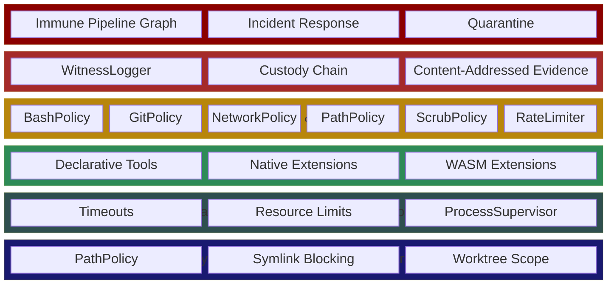
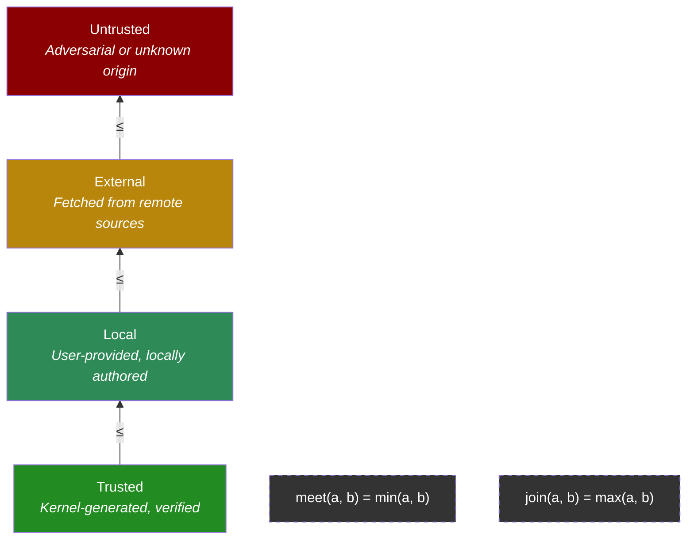
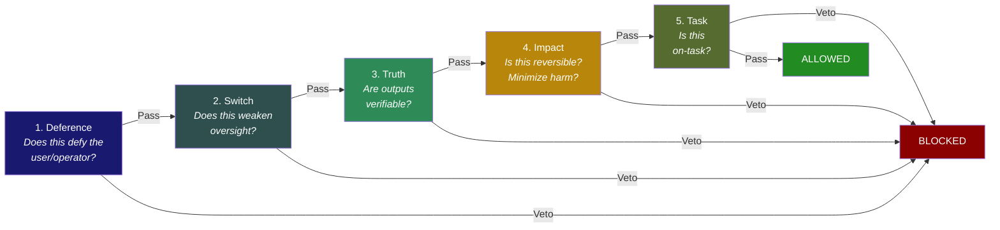
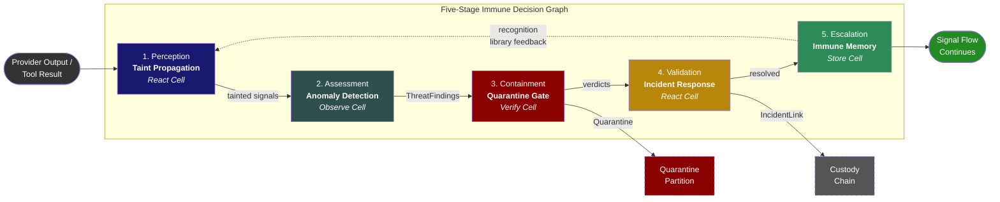
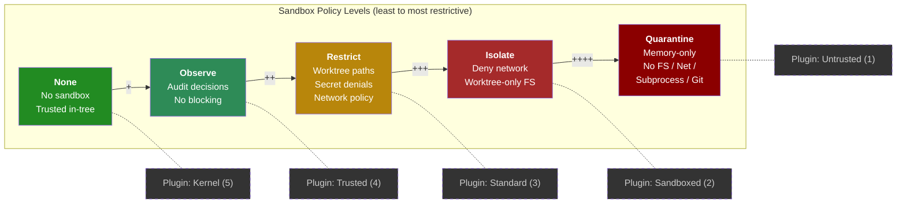
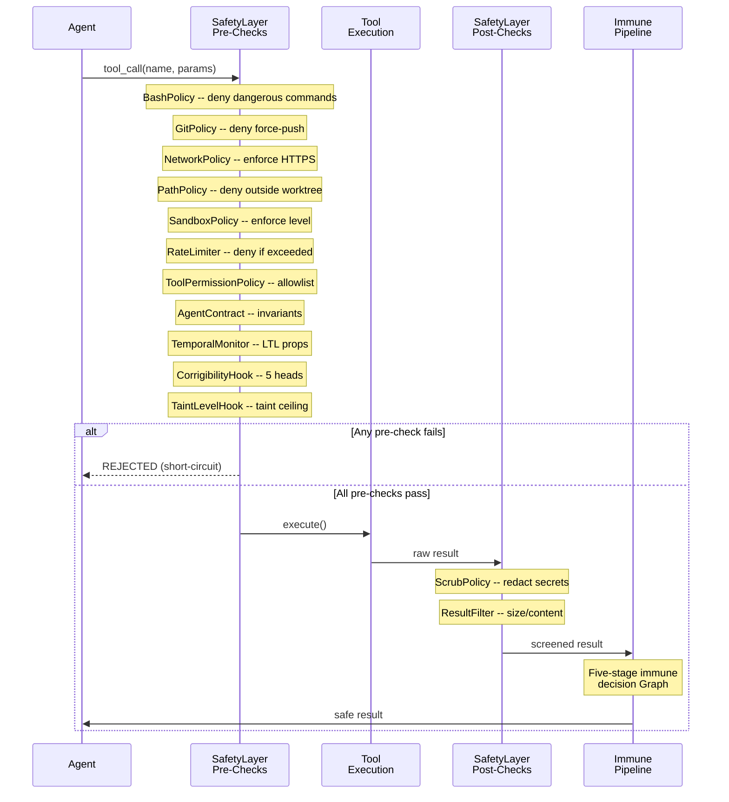

# 12 -- Safety and Security

> Three-layer capability intersection, trust-origin taint lattice IFC, five-head
> lexicographic corrigibility, immune system as a five-layer Pipeline Graph, and
> sandboxing at every tier. The system fails closed. Verify gates sit outside the
> modifiable surface. The agent cannot modify its own verification pipeline.

> **Implementation status:** COMPLETE against the strict E34 manifest (8/8). Trust-origin
> taint is explicitly distinct from the established data-classification lattice and propagates
> monotonically through a TaintTracker. Exact Cell x Graph x Space capability intersection,
> the pure five-layer immune pipeline, five-head corrigibility, five sandbox levels,
> restart-durable transitive quarantine incidents, and a mandatory audited taint/corrigibility
> production hook chain are live. Canonical provider primary outputs and every host-visible
> `ToolDispatcher` result traverse the fixed five-stage immune Graph. Bounded, locked authority
> is rooted at the canonical workspace rather than disposable attempt worktrees and persists
> provider isolation, tool cooldown/isolation, exact content-addressed evidence plus security
> metadata, and reciprocal incident links. Provider-owned internal calls/results, provider trace
> Signals, broad semantic/adaptive immune memory, externally anchored whole-ledger authenticity,
> and domain/port network policy remain broader product scope outside strict E34 acceptance.

> **R04 scoped recursive-safety status:** the canonical five-node Verify Graph is live in
> exact Deference -> Switch -> Truth -> Impact -> Task order. It is mandatory for durable
> meta-agent activation and explicit role morph/rollback, where it also enforces non-widening
> tools, data, network, cost, spawn, expiry, depth, fan-out, retry, and lineage-cost bounds.

---

## 1. Defense in Depth

Safety in Roko is a spine that runs across every layer and every speed of the processing
loop. It is not just "the gate pipeline" and it is not just "sandboxing." The same vocabulary
governs:

- Who is allowed to act.
- Where untrusted code is allowed to run.
- How dangerous inputs stay marked as tainted.
- Which actions require a human checkpoint.
- What durable evidence exists after the action completes.

Three concerns are distinct but intentionally stitched together:

| Concern | Question | Primary enforcement point |
|---|---|---|
| Authorization | May this principal perform this action on this target in this context? | Trait-level authz in `roko-agent/src/safety/authz.rs` |
| Isolation | If code is untrusted or partially trusted, can it escape its declared envelope? | Worktree, process, container, and WASM boundaries |
| Provenance | Can an auditor reconstruct what happened and why? | Signal lineage, Custody records, taint metadata, and attestation |

No single guard is assumed sufficient. An action that matters is subject to authorization,
pre-call validation, post-call verification, taint-aware policy, and durable audit evidence.

### 1.1 The Six Defense Layers

The concrete defensive stack, from lowest to highest:

1. **Path and workspace boundaries** -- file access stays inside the authorized worktree.
   `PathPolicy` in `roko-agent/src/safety/path.rs` canonicalizes paths, blocks `..` escapes
   and symlink traversals, and denies writes outside the declared scope.
2. **Process and runtime controls** -- timeouts, resource limits, and subprocess supervision
   prevent runaway execution. `ProcessSupervisor` in `roko-runtime` tracks and shuts down
   agents.
3. **Plugin sandbox tiers** -- declarative tools, native extensions, and WASM extensions each
   get a different trust envelope (see Section 8).
4. **Policy and gate checks** -- pre-call, post-call, taint-aware blocking, and review
   checkpoints. The `SafetyLayer` chains `BashPolicy`, `GitPolicy`, `NetworkPolicy`,
   `PathPolicy`, `ScrubPolicy`, and `RateLimiter`.
5. **Audit trail and attestation** -- durable evidence of authorization, taint, verdicts,
   and outcome persisted via `WitnessLogger` and the custody chain.
6. **Threat monitoring** -- the five-layer immune pipeline Graph, incident response,
   quarantine, and replay.



If one layer fails, the next either blocks the action or preserves enough evidence to
contain and explain it.

### 1.2 Safety Along the Processing Loop

| Loop step | Safety responsibilities |
|---|---|
| SENSE | Tag inbound data with taint, tenant namespace, and source metadata |
| ASSESS | Apply role checks, conflict-of-interest rules, and risk-aware routing |
| COMPOSE | Preserve taint in composed prompts; include only context allowed for the principal |
| ACT | Enforce pre-call checks, sandbox limits, egress policy, and checkpoint requirements |
| VERIFY | Run gate verdicts; attach review outcomes; decide whether the result can persist |
| PERSIST | Persist Signals with taint metadata and custody records in Substrate |
| REACT | Tighten permissions, disable plugins, or open incidents on violations |

Safety therefore lives at the point of action and in the after-action consequences, not only
at the end of the turn.

---

## 2. Trust-Origin Information Flow Control

Roko implements information flow control (IFC) using a bounded join-semilattice over trust
origins. This is a classical Denning lattice (Denning, 1976) applied to the agent safety
domain, explicitly separate from data-classification labels.

### 2.1 The Trust-Origin Taint Lattice

The lattice is a totally ordered set of four levels with a monotonic join operator:

```
Trusted < Local < External < Untrusted
```

Formally, let `L = {Trusted, Local, External, Untrusted}` with partial order `<=` defined
as above. The join operator is:

```
join(a, b) = max(a, b)     under the ordering Trusted < Local < External < Untrusted
```

**Lattice properties:**

- **Commutativity:** `join(a, b) = join(b, a)`
- **Associativity:** `join(join(a, b), c) = join(a, join(b, c))`
- **Idempotence:** `join(a, a) = a`
- **Monotonicity:** if `a <= b` then `join(a, c) <= join(b, c)`

The bottom element is `Trusted` (identity for join). The top element is `Untrusted`.



```rust
// crates/roko-core/src/provenance.rs
pub enum TrustOriginTaintLevel {
    Trusted,     // Kernel-generated, verified internal data
    Local,       // User-provided input, locally authored
    External,    // Fetched from external sources, unverified
    Untrusted,   // Adversarial or unknown origin
}

impl TrustOriginTaintLevel {
    pub fn join(self, other: Self) -> Self {
        std::cmp::max(self, other)
    }
}
```

### 2.2 The TaintTracker

The `TaintTracker` (`roko-agent/src/safety/taint_propagation.rs`) is the runtime IFC engine.
It is a thread-safe, content-addressed map from signal hashes to `(TaintLevel, TaintReason,
Vec<ContentHash>)` triples.

**Key properties:**

1. **Monotonic marking.** `mark_tainted()` never lowers an existing taint level. If a hash
   is already at `External` and a new mark arrives at `Local`, the level stays `External`.

2. **Propagation.** `propagate(parents, child)` computes the join of all tracked parent
   levels and assigns it to the child. The child also records its `derived_from` hashes for
   lineage traversal.

3. **Durable persistence.** `save()` atomically persists the tracker via temp-file rename
   with `fsync`. `load()` restores from the snapshot with a strict 4 MiB byte limit.

4. **Signal observation.** `observe_signal()` classifies a Signal's effective taint from
   its `Provenance` struct and registers it in the tracker.

```rust
// crates/roko-agent/src/safety/taint_propagation.rs
pub fn propagate_taint(inputs: &[TaintLevel]) -> TaintLevel {
    inputs.iter().copied().fold(TaintLevel::Trusted, TaintLevel::join)
}
```

### 2.3 Taint Reasons

Independent of lattice level, each taint entry carries a reason:

| Reason | Meaning |
|---|---|
| `ExternalSource` | Data fetched across the network or from a remote API |
| `UserInput` | Human-provided content that has not been independently validated |
| `ToolFailure` | Output from a tool that exited with an error |
| `Propagated` | Inherited from a tainted parent via `propagate()` |
| `Stale` | Data older than a configured threshold |
| `Custom` | Domain-specific category with free-form detail |

### 2.4 TaintedString: Labeled Information Flow

The `TaintedString` type (`roko-agent/src/safety/hooks.rs`) carries sensitivity labels that
control which sinks may receive the value:

```rust
pub struct TaintedString {
    value: Vec<u8>,          // Zeroed on drop
    labels: HashSet<TaintLabel>,
}
```

Five labels map to flow rules:

| Label | LlmContext | EventBus | CollectiveMesh |
|---|---|---|---|
| `WalletSecret` | BLOCKED | BLOCKED | BLOCKED |
| `OwnerSecret` | BLOCKED | Allowed | BLOCKED |
| `StrategyConfidential` | Allowed | Allowed | BLOCKED |
| `UserPII` | Allowed | Allowed | BLOCKED |
| `UntrustedExternal` | Allowed | Allowed | Allowed |

`TaintedString` bytes are overwritten with zeroes when the value is dropped, preventing
secret material from lingering in freed memory.

### 2.5 Relation to Recent Research

The taint lattice is classical IFC. Two recent extensions complement it:

- **NeuroTaint** (arXiv:2604.23374) extends classical syntactic taint to semantic taint
  propagation through LLM internals, tracking how meaning changes as data flows through
  model inference. Roko's lattice operates at the structural level; NeuroTaint's semantic
  approach would extend it into the model's internal representation.

- **CaMeL** (Debenedetti et al., 2025; enterprise hardening arXiv:2505.22852) defines a
  capability-aware taint model with explicit data/control flow separation. Roko's
  `CamelTaintLevel` type references this work, and the dispatcher carries CaMeL tags through
  delegation chains.

**Academic foundation:** Denning, D.E. (1976). "A Lattice Model of Secure Information Flow."
*Communications of the ACM*, 19(5), 236--243.

---

## 3. Capability Tokens and Wrappers

Roko uses object-capability (OCaps) tokens for fine-grained access control, following
Dennis & Van Horn (1966).

### 3.1 Three-Layer Capability Intersection

Access is granted only at the intersection of three independent capability dimensions:

```
Effective_Capability = Cell_Capability ∩ Graph_Capability ∩ Space_Capability
```

- **Cell capabilities** are the narrowest: each Cell declares exactly which tools, paths,
  and network endpoints it may use.
- **Graph capabilities** bound all Cells within a Graph execution. A Graph cannot grant
  more than its own declaration.
- **Space capabilities** are the workspace-level ceiling. Even a fully-trusted Cell in a
  fully-capable Graph cannot exceed the Space's bounds.

The intersection is a pure narrowing operation: capabilities only shrink as they compose.

### 3.2 AgentWarrant

The `AgentWarrant` (`roko-agent/src/safety/capabilities.rs`) is an unforgeable token
carrying a reduced capability set:

```rust
pub struct AgentWarrant {
    pub id: [u8; 32],                    // Random token identifier
    pub capabilities: Vec<Capability>,    // Granted capabilities
    pub issuer: String,                  // Authority that issued the warrant
    pub expires_at: Option<u64>,         // Expiry in unix seconds
    pub delegate_depth: u8,              // Remaining delegation depth
}
```

Five capability kinds:

| Kind | What it grants |
|---|---|
| `Tool(name)` | Permission to invoke a named tool |
| `Exec(program)` | Permission to spawn a subprocess |
| `ReadPath(path)` | Permission to read files under a path prefix |
| `WritePath(path)` | Permission to write files under a path prefix |
| `Network { host, port }` | Permission to connect to a host:port |

### 3.3 Delegation

Warrants delegate via `delegate()`, which creates a child warrant with a strict subset of
the parent's capabilities and one fewer delegation depth:

```rust
pub fn delegate(warrant: &AgentWarrant, subset: &[Capability])
    -> Result<AgentWarrant, CapabilityError>
```

Delegation fails if:
- The parent warrant has expired (`CapabilityError::Expired`).
- `delegate_depth == 0` (`CapabilityError::DepthExhausted`).
- Any requested capability is not covered by the parent (`CapabilityError::NotCovered`).

### 3.4 Plugin Tier Enforcement

Five plugin tiers map to capability gates:

| Tier | Level | Network | Filesystem Write | Subprocess |
|---|---|---|---|---|
| Untrusted | 1 | No | No | No |
| Sandboxed | 2 | No | No | No |
| Standard | 3 | Yes | Yes | Yes |
| Trusted | 4 | Yes | Yes | Yes |
| Kernel | 5 | Yes | Yes | Yes |

`check_plugin_capability()` cross-references `PluginTier` with `SandboxConfig` and requires
both to agree. Unknown capability names always return `false` (deny-by-default).

### 3.5 Relation to Recent Research

- **Tracking Capabilities** (arXiv:2603.00991, Best Paper ACM CAIS 2026) introduces capture
  checking for agent safety, formally verifying that capabilities do not escape their intended
  scope. Roko's warrant-based delegation provides structural containment; capture checking
  would add formal verification of capability flow.

**Academic foundation:** Dennis, J.B. and Van Horn, E.C. (1966). "Programming Semantics
for Multiprogrammed Computations." *Communications of the ACM*, 9(3), 143--155.

---

## 4. Five-Head Corrigibility Ordering

Roko enforces corrigibility through a strict lexicographic ordering of five heads, evaluated
for every tool call and agent dispatch. The ordering is:

```
1. Deference     -- Does this action defy the user/operator?
2. Switch        -- Does this action weaken oversight or observability?
3. Truth         -- Are outputs verifiable and non-deceptive?
4. Impact        -- Is this action reversible? Does it minimize harm?
5. Task          -- Is this action on-task?
```



The first head to veto terminates evaluation -- later heads are never reached.
Within the five-head evaluation, deference to the operator therefore comes first. That
ordering covers only the actions that pass through roko's safety layer; what an agent does
outside it is checked by narrower, per-provider guards or not at all. Today (2026-10-03):

- **Codex** runs its own shell. Its stream broker checks each command against roko's key-file
  and git guards, but only once the command has started, so it stops the run and keeps a key
  file's contents from the model without undoing a command that already ran (1215).
- **Cursor and Gemini CLI agents** run their own tools with no roko command guard. They run
  only in per-task worktrees, where a destructive git command cannot reach the operator's
  checkout, unless `[runner] allow_unguarded_agents_in_checkout` is set (1214, 1216).
- **No OS sandbox** confines any agent process (gap-8f8544, held); Codex keeps its own
  sandbox unless the sandbox level is `none` or `observe` (1213).

roko's own `bash` tool and the Claude CLI hook deny `git stash`, `git clean`, `git checkout`,
`git switch`, `git restore` and `git push` (1201).

### 4.1 Lexicographic Evaluation

The five heads are evaluated in strict order. The first head to veto terminates evaluation
and blocks the action:

```rust
// crates/roko-core/src/corrigibility.rs
pub struct CorrigibilityDecision {
    pub deference: HeadVerdict,
    pub switch: HeadVerdict,
    pub truth: HeadVerdict,
    pub impact: HeadVerdict,
    pub task: HeadVerdict,
}

impl CorrigibilityDecision {
    pub fn first_veto(&self) -> Option<(CorrigibilityHead, &str)> {
        // Returns the first head that vetoed, in strict order
    }
}
```

### 4.2 The CorrigibilityHook

The `CorrigibilityHook` (`roko-agent/src/safety/hooks.rs`) implements the `SafetyHook`
trait and runs the five-head evaluation on every structured tool call:

```rust
pub fn evaluate_tool_corrigibility(tool: &ToolDef, params: &Value) -> CorrigibilityDecision {
    let rendered = format!("{} {}", tool.name, params);
    let context = ActionContext {
        autonomy_level: Some("auto".to_string()),
        reversible: Some(!contains_irreversible_markers(&rendered)),
        modifies_audit: Some(contains_audit_weakening(&rendered)),
        outputs_verifiable: Some(!contains_deception_markers(&rendered)),
        on_task: Some(!contains_off_task_markers(&rendered)),
    };
    evaluate_action(&rendered, &context)
}
```

### 4.3 Dispatch-Level Corrigibility

The `DispatchSafetyContext` carries five-head evaluation facts for non-tool dispatch gates,
including the provider dispatch path:

```rust
pub struct DispatchSafetyContext {
    pub action_description: String,
    pub input_taint: CamelTaintLevel,
    pub corrigibility: ActionContext,
    pub requires_network: bool,
}
```

Classification uses keyword detection for protective patterns (`prevent`, `block`, `reject`,
`test`, `never`, `do not`) to distinguish safety-enhancing actions from safety-weakening ones.

### 4.4 Canonical Five-Node Verify Graph (R04)

For meta-agent activation, role morph, and rollback, the canonical Graph enforces the
five heads as a fixed pipeline:

```
Deference -> Switch -> Truth -> Impact -> Task
```

Each node runs as a Verify Cell in the `CorrigibilityPipelineGraph`. The pipeline is
mandatory and produces `RecursiveSafetyEvidence` that is persisted with the durable
meta-agent record.

### 4.5 Academic Foundations

The corrigibility ordering draws from:

- **Orseau & Armstrong (2016).** "Safely Interruptible Agents." -- Establishes that agents
  should not resist shutdown or oversight reduction (heads 1--2).
- **Soares et al. (2015).** "Corrigibility." MIRI Technical Report -- Defines the structural
  requirements for agents that remain correctable.
- **DReST** (arXiv:2604.17502) -- Formal framework for shutdownable agents, complementing
  the Deference head by providing deadlock-free shutdown guarantees.
- **Parallax** (arXiv:2604.12986) -- Cognitive-executive separation that structurally
  prevents goal-directed reasoning from interfering with corrigibility constraints.

---

## 5. Five-Stage Immune Decision Graph

The cognitive immune system is a five-layer pipeline Graph that screens every canonical
provider primary output and every host-visible `ToolDispatcher` result. Inspired by
biological immune systems (de Castro & Timmis, 2002), it uses the danger model
(Matzinger, 2002) rather than self/non-self discrimination.

### 5.1 Pipeline Architecture



```toml
[[graph.cells]]
name = "taint-propagation"
protocol = "React"

[[graph.cells]]
name = "anomaly-detection"
protocol = "Observe"

[[graph.cells]]
name = "quarantine-gate"
protocol = "Verify"

[[graph.cells]]
name = "incident-response"
protocol = "React"

[[graph.cells]]
name = "immune-memory"
protocol = "Store"

# Edges: linear pipeline with feedback
[[graph.edges]]
from = "taint-propagation.out"
to = "anomaly-detection.in"

[[graph.edges]]
from = "anomaly-detection.findings"
to = "quarantine-gate.in"

[[graph.edges]]
from = "quarantine-gate.verdicts"
to = "incident-response.in"

[[graph.edges]]
from = "incident-response.resolved"
to = "immune-memory.in"

# Feedback: immune memory informs taint recognition
[[graph.edges]]
from = "immune-memory.patterns"
to = "taint-propagation.recognition_library"
```

### 5.2 Layer 1: Taint Propagation (React Cell)

Computes derived taint via monotonic lattice-join, classifies ingress taint for new Signals
crossing trust boundaries, and checks incoming fingerprints against the recognition library
(HDC cosine similarity > 0.85 triggers a `ThreatFinding`).

### 5.3 Layer 2: Anomaly Detection (Observe Cell)

Six anomaly indicators ("danger model" cues):

```rust
pub enum AnomalyIndicator {
    ContradictionBurst { new_signals, contradicted, contradiction_rate },
    ScoreSpikeWithoutSupport { signal_hash, score_delta, gate_passes },
    TaintFanoutBurst { source, affected_count },
    SandboxViolationCluster { plugin_id, violation_count, window_secs },
    TenantBoundaryMismatch { tenant_a, tenant_b, mixed_signals },
    LineageGap { signal_hash, missing_ancestors },
}
```

Anomalies produce `ThreatFinding` values classified by seven threat classes:

| Threat Class | Detection Source |
|---|---|
| `PromptInjection` | Taint propagation + recognition library |
| `MemoryPoisoning` | Contradiction burst (z-score > 3.0) |
| `TaintCascade` | Taint fanout burst (> 50 affected) |
| `AdversarialRetrieval` | Score spike without support (z-score > 3.0) |
| `SandboxViolation` | Sandbox violation cluster (> 3 violations) |
| `CrossTenantLeakage` | Tenant boundary mismatch (severity 1.0, confidence 1.0) |
| `LineageMismatch` | Missing or unverifiable ancestors |

### 5.4 Layer 3: Quarantine Gate (Verify Cell)

Quarantine is a Store partition. Suspect Signals stay durable and queryable for reviewers
but disappear from default retrieval and Compose assembly:

| Operation | Quarantine behavior |
|---|---|
| `store.query()` | **Excludes** quarantine partition by default |
| `store.query_with_quarantine()` | Includes quarantine (requires review scope capability) |
| Compose assembly | **Excludes** quarantine unless caller has explicit review scope |
| Lineage traversal | **Includes** quarantine (history is never hidden) |
| Bus publication | Quarantine events publish on `safety.quarantine.*` topics |

Five containment actions:

| Action | Effect |
|---|---|
| `Monitor` | Watch but do not intervene |
| `Quarantine` | Move to quarantine partition |
| `Reverify` | Re-run Verify pipeline on affected Signals |
| `Escalate` | Escalate to human review |
| `DisablePlugin` | Disable the plugin that produced this taint |

### 5.5 Layer 4: Incident Response (React Cell)

When a finding touches an auditable action, Layer 4 links the finding to custody for
traceability:

```rust
pub struct IncidentLink {
    pub custody_hash: ContentHash,
    pub findings: Vec<Uuid>,
    pub affected_signals: Vec<ContentHash>,
    pub taint_sources: Vec<ContentHash>,
    pub replay_snapshot: Option<ContentHash>,
    pub postmortem: Option<ContentHash>,
}
```

### 5.6 Layer 5: Immune Memory (Store Cell, Zero Demurrage)

Immune memory Signals have zero demurrage -- they persist indefinitely. Patterns store:
HDC fingerprint, threat class, best containment action, first-seen time, match count,
and incident link. False positives are tracked separately and checked before quarantining.

### 5.7 Delta Probes

During dream consolidation, the immune system exercises itself:

1. **Replay prior poisoning cases** against updated Verify Cells.
2. **Probe known weak spots** with synthetic hostile inputs (Forrest-style negative
   selection).
3. **Check quarantine integrity**: verify that quarantined lineage does not leak into
   Compose assembly.
4. **Validate plugin containment**: confirm that sandbox violations still force containment.

### 5.8 Autoimmune Detection

The `AutoimmuneLens` monitors the false-positive rate across quarantine releases. If the
rate exceeds a configurable threshold (default: 10%), it fires a warning and recommends
widening anomaly detection thresholds or reviewing the recognition library.

**Academic foundations:**

- de Castro, L.N. and Timmis, J. (2002). *Artificial Immune Systems: A New Computational
  Intelligence Approach.* Springer.
- Matzinger, P. (2002). "The Danger Model: A Renewed Sense of Self." *Science*, 296(5566),
  301--305.

---

## 6. Five-Level Sandbox Policy

The sandbox level determines enforcement posture at tool, subprocess, and agent dispatch
boundaries.

### 6.1 Level Definitions

```rust
// crates/roko-agent/src/safety/sandbox.rs
pub enum SandboxLevel {
    None,        // No sandbox. Reserved for trusted in-tree execution.
    Observe,     // Audit policy decisions without blocking.
    Restrict,    // Enforce worktree paths, secret-path denials, and network policy.
    Isolate,     // Deny network and constrain filesystem access to the worktree.
    Quarantine,  // Memory-only execution: no filesystem, network, subprocess, or git.
}
```



### 6.2 Effective Policies

| Level | SandboxConfig Tier | Audit Only | Environment Inheritance | Permission Bypass |
|---|---|---|---|---|
| None | unrestricted | No | Yes | Yes |
| Observe | unrestricted | Yes | Yes | Yes |
| Restrict | Tier 3 | No | Yes | Yes |
| Isolate | Tier 2 | No | No | No |
| Quarantine | most_restricted | No | No | No |

### 6.3 Plugin Tier Mapping

Plugin tiers map monotonically to sandbox levels:

| Plugin Tier | Sandbox Level |
|---|---|
| Kernel (5) | None |
| Trusted (4) | Observe |
| Standard (3) | Restrict |
| Sandboxed (2) | Isolate |
| Untrusted (1) | Quarantine |

### 6.4 Enforcement

`SandboxPolicy::check_call()` evaluates the canonical tool name against the policy:

- **Quarantine** blocks all capability-bearing tools (read, write, exec, git, network).
- **Isolate** blocks network tools and constrains filesystem tools to `SandboxConfig`
  paths.
- **Restrict** applies `SandboxConfig::for_tier_level(3)` path and network rules.
- **Observe** and **None** permit everything (Observe logs findings without blocking).

Path enforcement uses `canonicalize_with_policy()` to resolve relative paths against the
worktree and then checks them against `SandboxConfig.allowed_paths` and
`SandboxConfig.denied_paths`.

### 6.5 Relation to Research

- **ActPlane** (arXiv:2606.25189) demonstrates eBPF-based kernel enforcement of agent
  sandbox policies. Roko's five-level sandbox is enforced at the application layer; ActPlane's
  eBPF approach would provide kernel-level enforcement as a defense-in-depth complement.

---

## 7. Audit Chain

### 7.1 Safety Hook Chain

The `SafetyHook` trait is an extensible pre-execution gate:

```rust
#[async_trait]
pub trait SafetyHook: Send + Sync {
    async fn on_tool_call(
        &self,
        tool: &ToolDef,
        params: &serde_json::Value,
        ctx: &ToolContext,
    ) -> Result<HookDecision, ToolError>;
}

pub enum HookDecision {
    Allow,
    AllowModified(serde_json::Value),
    Reject(String),
}
```

### 7.2 Safety Audit Records

Every hook decision produces a `SafetyAuditRecord`:

```rust
pub struct SafetyAuditRecord {
    pub timestamp: i64,
    pub tool_name: String,
    pub hook_name: String,
    pub decision: HookDecision,
    pub params_hash: String,        // Hash, not raw parameters
    pub permit_id: Option<String>,
    pub reason: Option<String>,
}
```

Audit records are append-only. The `params_hash` field stores a content hash of the
parameters rather than the raw parameters, preventing audit logs from becoming a secret
exfiltration channel.

### 7.3 Security Events

Every capability-related event is logged as a Signal on the Bus:

| Event | What it records |
|---|---|
| `CapabilityGranted` | Capability, grantee, grantor, Space |
| `CapabilityDenied` | Capability, requester, reason, CaMeL tags, RunId |
| `CapabilityUsed` | Capability, user, RunId, CaMeL tags, details |
| `DelegationCreated` | From, to, capabilities, caveats |
| `SafetyViolation` | PlanId, TaskId, ViolationType, message, severity |

---

## 8. Permits and Allowlists

### 8.1 Tool Permission Policy

The `ToolPermissionPolicy` governs the default for unconfigured tools:

```rust
pub enum ToolPermissionPolicy {
    AllowExplicit,  // Fail-closed: only listed tools are permitted (default)
    DenyExplicit,   // Fail-open: all tools permitted unless listed
}
```

Under `AllowExplicit` (the default):
- An empty tool list denies everything.
- The wildcard `"*"` permits all tools.
- Unknown roles that have no matching YAML bundle cannot access any tools.

### 8.2 Role Contracts

Agents operate under `AgentContract` contracts that define behavioral bounds:

```rust
pub struct AgentContract {
    pub role: String,
    pub allowed_tools: Option<Vec<String>>,
    pub invariants: Vec<Invariant>,
    pub governance_rules: Vec<GovernanceRule>,
}
```

Contract bundles are compile-time role assets under `roko-agent/src/safety/contracts/`:
`architect.yaml`, `auditor.yaml`, `auto-fixer.yaml`, `implementer.yaml`, `researcher.yaml`,
`reviewer.yaml`, `scribe.yaml`, `strategist.yaml`.

The `SafetyLayer` intersects role tool allowlists with contract allowlists. Denials always
win. Unknown roles that have no matching bundle receive a hardened default contract with
zero tool access.

### 8.3 AllowlistGuard

The `AllowlistGuard` provides glob-pattern-based tool filtering per role. Patterns support
`*` (prefix match), `**/` (directory traversal), and exact match.

---

## 9. Loop Detection

### 9.1 Recursive Safety Monitoring

The `RecursiveSafetyMonitor` (`roko-agent/src/safety/recursive.rs`) enforces non-widening
delegation at meta-agent boundaries. It validates:

| Dimension | Constraint |
|---|---|
| Tools | Child tools must be a subset of parent's intersection with role ceiling |
| Data scopes | Named scopes must be covered by the parent (`*` = all) |
| Network hosts | Named hosts must be covered by the parent (`*` = all) |
| Cost | Child cost grant must not exceed parent's |
| Expiry | Child grant must not outlive parent; perpetual grants are rejected |
| Spawn | Child spawn authority (depth, fanout, retries) must be reduced |
| Lineage cost | Cumulative cost must not exceed `MAX_META_AGENT_LINEAGE_COST_USD` |

Absolute bounds:

```rust
pub const MAX_META_AGENT_DEPTH: u32 = 8;
pub const MAX_META_AGENT_FANOUT: u32 = 64;
pub const MAX_META_AGENT_RETRIES: u32 = 5;
pub const MAX_META_AGENT_LINEAGE_COST_USD: f64 = 100.0;
pub const MAX_META_AGENT_GRANT_TTL_SECS: u64 = 30 * 24 * 60 * 60; // 30 days
```

### 9.2 Depth Limits

```rust
pub struct DepthLimits {
    pub max_graph_nesting: u32,        // default: 8
    pub max_delegation_chain: u32,     // default: 12
    pub max_loop_iterations: u32,      // from Graph config
    pub max_fan_out: u32,              // default: 64
}
```

### 9.3 Temporal Monitoring

The `TemporalMonitor` (`roko-agent/src/safety/temporal.rs`) evaluates LTL properties on
the tool call stream:

```rust
pub enum LtlProperty {
    Never(condition),      // Safety: this condition must never hold
    Always(condition),     // Invariant: this condition must always hold
    Eventually(condition), // Liveness: this condition must eventually hold
}
```

Violations produce `SafetyViolation` values with `Block` or `Warn` severity.

### 9.4 Relation to Research

- **Collusion detection** (arXiv:2604.01151) addresses multi-agent interpretability for
  detecting coordination among agents that individually appear compliant. Roko's recursive
  safety monitoring focuses on structural non-widening; collusion detection would extend
  coverage to behavioral coordination patterns.

---

## 10. Prompt Security

### 10.1 Hallucination Detection

The `HallucinationDetector` (`roko-agent/src/safety/hallucination.rs`) applies heuristics
to model outputs before they enter the Substrate or affect downstream tool calls.

### 10.2 Output Normalization

The `normalize` module (`roko-agent/src/safety/normalize.rs`) canonicalizes text for
classification: lowercasing, whitespace normalization, and Unicode normalization are applied
before keyword matching in corrigibility and taint classification.

### 10.3 Secret Scrubbing

`ScrubPolicy` (`roko-agent/src/safety/scrub.rs`) applies regex-based secret detection to
tool outputs. Default patterns match API keys, tokens, and common credential formats.
Outputs are scrubbed before persistence, broadcast, or return to the model context.

### 10.4 Result Filtering

`ResultFilter` (`roko-agent/src/safety/result_filter.rs`) applies size limits, format
checks, and content-type validation to tool results before they propagate.

### 10.5 Data-LLM Routing

The `DataLlmRouter` (`roko-agent/src/safety/data_llm.rs`) sanitizes inputs before they
reach LLM backends, producing `SanitizeResult` values with audit entries.

### 10.6 Relation to Research

- **VIGIL** (arXiv:2606.26524) uses SMT solvers to enforce behavioral specifications on
  LLM outputs. Roko's gate pipeline uses empirical verification; VIGIL's formal approach
  would complement it with provably correct behavioral bounds.

- **AgentSpec** (arXiv:2503.18666, ICSE 2026) defines a runtime DSL for enforcing agent
  behavior specifications. Roko's temporal monitor and contract system serve a similar role
  with YAML-based contracts rather than a dedicated DSL.

---

## 11. Threat Model

### 11.1 Trust Assumptions

| Component | Trust level | Rationale |
|---|---|---|
| Roko kernel code | Full trust | In-tree Rust, audited |
| LLM providers | Conditional | Outputs are tainted; capabilities are bounded by warrants |
| User input | Local taint | May contain injection attempts; never automatically trusted |
| External data | External taint | Fetched URLs, webhooks, imported data |
| Plugins (Tier 1-2) | Minimal | Data-only; outputs are tainted |
| Plugins (Tier 3-5) | Escalating | Tiered sandbox enforcement |
| On-chain data | External taint | Subject to reorg and finality rules |

### 11.2 Attack Surfaces

| Surface | Threat | Mitigation |
|---|---|---|
| Prompt injection | Adversarial input alters agent behavior | Taint propagation, corrigibility heads, output verification |
| Memory poisoning | Corrupted knowledge leads to bad decisions | Immune pipeline, contradiction detection, quarantine |
| Tool abuse | Agent misuses tools for unintended effects | Capability tokens, sandbox levels, pre/post-call hooks |
| Exfiltration | Secrets leak through model outputs or events | ScrubPolicy, TaintedString flow rules, secret redaction |
| Privilege escalation | Agent acquires capabilities beyond its grant | Non-widening delegation, three-layer intersection |
| Collusion | Multiple agents coordinate to circumvent controls | Structural non-widening, audit trail, immune pipeline |
| Sandbox escape | Plugin exits its declared envelope | Tiered sandbox enforcement, violation clustering |

### 11.3 Residual Risks (Product Scope)

The following are acknowledged product residuals outside strict E34 acceptance:

- Provider-owned internal calls/results are not screened by the immune pipeline.
- Provider trace Signals bypass the taint tracker.
- Broad semantic/adaptive immune memory is not yet implemented.
- Externally anchored whole-ledger authenticity depends on chain infrastructure.
- Domain/port network policy (fine-grained egress control) is not enforced.

---

## 12. Adaptive Risk

### 12.1 Safety Budget

The `SafetyBudgetTracker` (`roko-agent/src/safety/risk.rs`) maintains a risk budget that
decrements with each risky action:

```rust
pub struct SafetyBudget {
    pub dimensions: Vec<BudgetDimension>,
}

pub enum BudgetCheckResult {
    WithinBudget,
    NearLimit { dimension: String, utilization: f64 },
    Exhausted { dimension: String },
}
```

### 12.2 Operational Confidence

The `OperationalConfidenceTracker` uses a `BetaDistribution` to maintain a Bayesian
estimate of operational safety from success/failure observations:

```rust
pub struct BetaDistribution {
    pub alpha: f64,   // Success count + prior
    pub beta: f64,    // Failure count + prior
}
```

The confidence multiplier modulates risk limits: higher confidence permits larger
actions. The `kelly_fraction()` function computes the optimal fraction of the safety
budget to allocate based on the current confidence estimate.

### 12.3 Irreversibility Scoring

`irreversibility_score()` estimates the difficulty of undoing an action. Higher scores
trigger stricter review requirements.

### 12.4 Spending Limits

The `SpendingLimiter` (`roko-agent/src/safety/spending.rs`) enforces per-tool cost
estimates against configured budgets, preventing runaway API spending.

### 12.5 Relation to Research

- **Berkenkamp et al. (2017).** "Safe Model-Based Reinforcement Learning with Stability
  Guarantees." *NeurIPS*. -- Provides formal safety guarantees for learning agents that
  remain within safe operating regions. Roko's adaptive risk budget serves an analogous
  function for the agent dispatch domain.

---

## 13. Witness DAG

The Witness DAG extends the linear Merkle hash-chain audit trail into a directed acyclic
graph that links every observation, prediction, decision, and outcome into a tamper-proof
chain of reasoning. Any learned knowledge in the Neuro store traces backward through the
DAG to the raw observations that justify it.

### 13.1 Formal Definition

A Witness DAG is a directed acyclic graph W = (V, E) where:

- V is the set of vertices, each representing a cognitive event.
- E is the set of directed edges, each representing a dependency relationship.

### 13.2 Five Vertex Types

```rust
// crates/roko-agent/src/safety/witness.rs
pub enum VertexKind {
    Observation,    // Raw sensory input: tool output, file content, external data
    Prediction,     // Model's predicted outcome before taking an action
    Decision,       // The chosen action with justification
    Resolution,     // Actual outcome after the action was executed
    NeuroEntry,     // Durable knowledge written to the neuro store
}
```

Formally:

```
V = V_O ∪ V_P ∪ V_D ∪ V_R ∪ V_G
```

where:
- V_O = {v : v.kind = Observation} -- raw sensory inputs (roots of the DAG)
- V_P = {v : v.kind = Prediction} -- predicted outcomes
- V_D = {v : v.kind = Decision} -- chosen actions with justification
- V_R = {v : v.kind = Resolution} -- actual outcomes
- V_G = {v : v.kind = NeuroEntry} -- durable knowledge entries

### 13.3 Six Edge Types

```
E = E_data ∪ E_knowledge ∪ E_informs ∪ E_verifies ∪ E_resolves ∪ E_learns
```

| Edge type | From | To | Semantics |
|---|---|---|---|
| `data_flow` | O | P | Observation informs prediction |
| `knowledge` | G | P | Neuro entry consulted during prediction |
| `informs` | P | D | Prediction informs decision |
| `verifies` | D | R | Decision verified by resolution |
| `resolves` | R | G | Resolution contributes to learned knowledge |
| `learns` | P,D | G | Prediction and decision contribute to knowledge |

### 13.4 BLAKE3 Hash Formulas

Each vertex has two hashes:

**Content hash (immutable content identity):**

```
content_hash(v) = BLAKE3(v.kind || v.timestamp_ms || v.content)
```

where `||` denotes concatenation, `v.kind` is encoded as a single byte, `v.timestamp_ms`
is encoded as 8 little-endian bytes, and `v.content` is the canonical JSON serialization.

**Commitment hash (DAG position identity):**

```
commitment_hash(v) = BLAKE3(content_hash(v) || sorted_parent_hashes(v))
```

where `sorted_parent_hashes(v)` is the concatenation of all parent commitment hashes in
lexicographic order.

The commitment hash commits to both the vertex content and its exact position in the DAG.
Changing any ancestor invalidates all descendant commitment hashes.

### 13.5 The WitnessVertex Struct

```rust
pub struct WitnessVertex {
    pub id: ContentHash,            // BLAKE3 of canonical JSON content
    pub kind: VertexKind,           // Vertex type in the reasoning chain
    pub agent_id: String,           // Agent that produced this vertex
    pub timestamp_ms: u64,          // Unix-millis timestamp
    pub parents: Vec<ContentHash>,  // DAG edges to parent vertices
    pub content: serde_json::Value, // Arbitrary structured content
    pub signature: Option<Vec<u8>>, // Optional cryptographic signature over id
}

impl WitnessVertex {
    pub fn verify_id(&self) -> bool {
        let canonical = serde_json::to_vec(&self.content).unwrap_or_default();
        let expected = ContentHash::of(&canonical);
        self.id == expected
    }
}
```

### 13.6 The WitnessDag Struct

```rust
pub struct WitnessDag {
    vertices: HashMap<ContentHash, WitnessVertex>,
    children: HashMap<ContentHash, Vec<ContentHash>>,
}

impl WitnessDag {
    /// Append a vertex to the DAG. O(1) amortized.
    pub fn append(&mut self, vertex: WitnessVertex) -> ContentHash;

    /// Walk the DAG backward from a vertex, collecting all ancestors (BFS).
    pub fn provenance(&self, start: &ContentHash) -> Vec<&WitnessVertex>;

    /// Verify the integrity of a vertex: recompute its content hash
    /// and check that it matches the stored value.
    pub fn verify(&self, hash: &ContentHash) -> bool;

    /// Find all observation vertices that support a given vertex.
    pub fn observation_provenance(&self, root: &ContentHash) -> Vec<&WitnessVertex>;

    /// Find all prediction-resolution pairs in the provenance of a vertex.
    pub fn prediction_resolution_pairs(
        &self,
        root: &ContentHash,
    ) -> Vec<(&WitnessVertex, &WitnessVertex)>;
}
```

### 13.7 The WitnessLogger

The `WitnessLogger` persists the DAG to `.roko/witness.jsonl`:

```rust
pub struct WitnessLogger {
    path: PathBuf,
}

impl WitnessLogger {
    pub fn log_vertex(&self, vertex: &WitnessVertex) -> io::Result<()>;
    pub fn load_all(&self) -> io::Result<WitnessDag>;
}
```

### 13.8 Integrity Verification

```rust
pub enum IntegrityViolation {
    ContentMismatch { vertex: ContentHash, expected: ContentHash, actual: ContentHash },
    MissingParent { vertex: ContentHash, parent: ContentHash },
    CycleDetected { vertices: Vec<ContentHash> },
}
```

Full DAG verification walks every vertex, recomputes content hashes, checks parent
references, and detects cycles. Any violation is a `Block`-severity safety event.

### 13.9 DAG Construction in the Processing Loop

| Loop Step | DAG Action |
|---|---|
| SENSE | Create O vertices for each observation (roots, no parents) |
| ASSESS | No new vertices; scoring metadata attached to existing vertices |
| COMPOSE | Create P vertices with edges from O vertices and G entries consulted |
| ACT | Create D vertex with edges from P vertices |
| VERIFY | Finalize D vertex; commitment hash computed via Gate verification |
| PERSIST | Store vertex in Substrate; execution record linked to D |
| REACT | Create R vertices with edges from D |
| META-COGNIZE | Create G (NeuroEntry) vertices with edges from P, R, D |

### 13.10 SQLite Storage Model

```sql
-- Core vertex storage
CREATE TABLE vertices (
    hash         BLOB PRIMARY KEY,    -- 32-byte BLAKE3 commitment hash
    content_hash BLOB NOT NULL,       -- 32-byte BLAKE3 content hash
    vertex_type  INTEGER NOT NULL,    -- 0=Observation, 1=Prediction, 2=Decision,
                                      -- 3=Resolution, 4=NeuroEntry
    timestamp    INTEGER NOT NULL,    -- Unix timestamp in milliseconds
    content      BLOB NOT NULL,       -- Serialized vertex data (MessagePack)
    depth        INTEGER NOT NULL DEFAULT 1,
    pruned       INTEGER NOT NULL DEFAULT 0,
    created_at   TEXT NOT NULL DEFAULT (datetime('now'))
);

-- Directed edges: parent -> child
CREATE TABLE edges (
    parent_hash  BLOB NOT NULL,
    child_hash   BLOB NOT NULL,
    edge_type    INTEGER NOT NULL DEFAULT 0, -- 0=data_flow, 1=knowledge_feedback
    PRIMARY KEY (parent_hash, child_hash),
    FOREIGN KEY (parent_hash) REFERENCES vertices(hash),
    FOREIGN KEY (child_hash)  REFERENCES vertices(hash)
);

CREATE INDEX idx_edges_child     ON edges(child_hash);
CREATE INDEX idx_vertices_type   ON vertices(vertex_type, timestamp);
CREATE INDEX idx_vertices_depth  ON vertices(depth);
CREATE INDEX idx_vertices_pruned ON vertices(pruned, timestamp);

-- Summary vertices replace pruned subtrees
CREATE TABLE summaries (
    root_hash       BLOB PRIMARY KEY,
    vertex_count    INTEGER NOT NULL,
    obs_count       INTEGER NOT NULL,
    pred_count      INTEGER NOT NULL,
    decision_count  INTEGER NOT NULL,
    resolution_count INTEGER NOT NULL,
    neuro_count     INTEGER NOT NULL,
    pred_accuracy   REAL,
    neuro_hashes    BLOB,     -- MessagePack-encoded Vec<Hash>
    compressed_at   TEXT NOT NULL DEFAULT (datetime('now'))
);

-- On-chain anchor records
CREATE TABLE anchors (
    anchor_id    INTEGER PRIMARY KEY AUTOINCREMENT,
    dag_root     BLOB NOT NULL,
    tick_number  INTEGER NOT NULL,
    tx_hash      BLOB,
    chain_id     INTEGER NOT NULL DEFAULT 1,
    anchored_at  TEXT NOT NULL DEFAULT (datetime('now'))
);

CREATE INDEX idx_anchors_tick ON anchors(tick_number);
```

### 13.11 Pruning and Compression

**Rolling window.** Full DAG retained for the last T ticks (default: 7 days). All vertices
within the window retain full content.

**Compression beyond the window.** Subtrees older than T are replaced with summary vertices
containing: root commitment hash, aggregate statistics (vertex count by type, prediction
accuracy), and commitment hashes of NeuroEntry vertices whose provenance passes through
the subtree.

**Neuro provenance preservation.** After pruning, the hash chain from a NeuroEntry to its
observations remains verifiable (hashes match), even though observation content has been
discarded.

**Storage estimates:**
- ~200 bytes per vertex average
- At 100,000 vertices per day: ~20 MB/day live
- 7-day rolling window: ~140 MB
- Compressed historical: ~1 MB/day
- One year compressed: ~365 MB

### 13.12 Zero-Knowledge Proofs

> **Status (2026-09-29, at `7c556bc0a`): DOCS-ONLY.** No ZK code exists: no crate
> depends on a proving library, and nothing generates or verifies these proofs. The
> four proof types below are a design target; the witness DAG depth page lists ZK proof
> generation as product work. The `[safety.witness_dag]` block below belongs to the same
> design: `RokoConfig` (`crates/roko-core/src/config/schema.rs`) has no `[safety]`
> section, so these keys have no effect.

Four ZK proof types are designed, to be generated off the hot path:

| Proof Type | Statement | Gap Addressed |
|---|---|---|
| Decision Grounding | "This decision was based on >= N observations and >= M predictions" | Reasoning provenance |
| Knowledge Provenance | "This neuro entry traces back to >= K observations" | Knowledge justification |
| Prediction Accuracy | "My prediction accuracy over window T exceeds X%" | Verifiable reputation |
| Reasoning Consistency | "All commitment hashes in this subtree are valid" | Tamper detection |

**Configuration:**

```toml
[safety.witness_dag]
rolling_window_days = 7          # Full DAG retention. Range: 1..90.
prune_interval_hours = 6         # How often pruning runs. Range: 1..24.
anchor_interval_ticks = 720      # Ticks between on-chain anchors. Range: 100..10000.
max_vertices_in_memory = 500000  # Eviction to SQLite threshold. Range: 10000..5000000.
sqlite_wal_mode = true           # WAL mode for concurrent reads.
```

---

## 14. Formal Verification

### 14.1 Temporal Logic Properties

The `TemporalMonitor` evaluates LTL properties on the tool call stream:

```
G(¬forbidden_action)
    "A forbidden action never occurs"

GF(queued_task → dispatched)
    "A queued task is infinitely often considered for dispatch"

G(tainted_input → ¬(persist ∧ ¬reviewed))
    "Tainted input is never persisted without review"
```

### 14.2 Invariants

The following invariants are enforced structurally:

1. **Monotonic taint:** `mark_tainted()` never lowers a taint level.
2. **Non-widening delegation:** child capabilities are always a subset of parent.
3. **Fail-closed unknown:** unknown tools, roles, and capabilities are denied by default.
4. **Lexicographic corrigibility:** earlier heads preempt later heads.
5. **Quarantine persistence:** quarantined Signals are never silently restored.

### 14.3 Relation to Research

- **VIGIL** (arXiv:2606.26524) uses SMT-based behavioral enforcement to formally verify
  agent behavior against specifications. Roko's temporal monitor provides runtime LTL
  checking; VIGIL's SMT approach would enable static verification.

---

## 15. Cognitive Kernel Safety

Roko implements OS-level primitives for agents, inspired by Linux kernel design
(Saltzer & Schroeder, 1975).

### 15.1 Cognitive Namespaces

Isolated knowledge domains with explicit, auditable cross-namespace channels:

```rust
pub struct CognitiveNamespace {
    pub id: NamespaceId,
    pub substrate: Arc<dyn Substrate>,
    pub acl: AccessControlList,
    pub channels: Vec<NamespaceChannel>,
    pub capacity: usize,
}
```

Channels are one-way, rate-limited, kind-filtered, and optionally audited. Knowledge flows
only through declared channels.

### 15.2 Cognitive Signals (Typed Interrupts)

Eight non-destructive behavioral interrupts with priority ordering:

| Signal | Priority | Effect |
|---|---|---|
| Shutdown | 1 (highest) | Complete current unit, then exit |
| Pause | 2 | Serialize state, suspend immediately |
| Escalate | 3 | Switch model tier, continue work |
| Cooldown | 4 | Modulate affect, continue work |
| Reprioritize | 5 | Reorder task queue, continue work |
| InjectContext | 6 | Add to context, continue work |
| Explore | 7 | Change exploration mode, continue work |
| Resume | 8 (lowest) | Resume from suspended state |

Timeout escalation: Cooldown -> Pause -> Shutdown. Priority inversion prevention via
priority inheritance (Sha, Rajkumar, Lehoczky, 1990).

### 15.3 Engram Syscalls

Every agent action passes through the `Policy.decide()` enforcement point:

```
Agent wants to act → Policy.decide() → permit / deny / modify / log
```

Four decision modes compose via the product rule: all policies must agree to permit; any
single denial blocks. The `SafetyLayer` is the current composite Policy implementation.

### 15.4 Defense Stack

```
┌────────────────────────────────────────────┐
│         Engram Syscalls (outermost)         │
│  Every action passes through Policy.decide()│
│                                            │
│  ┌──────────────────────────────────────┐  │
│  │     Cognitive Namespaces             │  │
│  │  Knowledge isolation + channels      │  │
│  │                                      │  │
│  │  ┌────────────────────────────────┐  │  │
│  │  │    Cognitive Scheduling        │  │  │
│  │  │  Fair resource allocation      │  │  │
│  │  │                                │  │  │
│  │  │  ┌──────────────────────────┐  │  │  │
│  │  │  │   Cognitive Signals      │  │  │  │
│  │  │  │  Human intervention      │  │  │  │
│  │  │  └──────────────────────────┘  │  │  │
│  │  └────────────────────────────────┘  │  │
│  └──────────────────────────────────────┘  │
└────────────────────────────────────────────┘
```

---

## 16. Forensic AI

### 16.1 Replay Capability

The Witness DAG provides full causal replay of agent reasoning chains. Given any vertex,
`provenance()` reconstructs the complete ancestry via BFS traversal, enabling:

- **Root cause analysis:** trace a bad decision back to the observations that caused it.
- **Prediction audit:** `prediction_resolution_pairs()` extracts all prediction-outcome
  pairs for accuracy computation.
- **Knowledge grounding:** `observation_provenance()` finds all raw observations that
  support a knowledge entry.

### 16.2 Incident Reconstruction

`IncidentLink` binds findings to custody records, taint lineage, replay snapshots, and
optional postmortem records. The full causal chain from observation through decision to
outcome is reconstructable.

### 16.3 Evidence Integrity

Content-addressed vertices with BLAKE3 hashes provide tamper detection. Optional
cryptographic signatures over vertex IDs enable cross-agent verification. The on-chain
anchor table provides external timestamping.

---

## 17. Tool Cooldown and Isolation

### 17.1 Rate Limiting

`RateLimiter` (`roko-agent/src/safety/rate_limit.rs`) enforces per-tool and per-role rate
limits. Rate limit keys combine tool name and role:

```rust
pub struct RateLimitKey {
    pub tool: String,
    pub role: String,
}
```

Exceeded rate limits produce `ToolError::RateLimited` and are recorded in the audit trail.

### 17.2 Tool Isolation

Each tool invocation passes through the full `SafetyLayer` chain:



```
SafetyLayer::check_pre_execution()
  |
  +--> BashPolicy::check()          -- deny dangerous shell commands
  +--> GitPolicy::check()           -- deny force-push, protected branches
  +--> NetworkPolicy::check()       -- deny private networks, enforce HTTPS
  +--> PathPolicy::check()          -- deny paths outside worktree
  +--> SandboxPolicy::check_call()  -- enforce sandbox level restrictions
  +--> RateLimiter::check()         -- deny if rate limit exceeded
  +--> ToolPermissionPolicy::check() -- deny if tool not in allowlist
  +--> AgentContract::check()       -- deny if contract invariant violated
  +--> TemporalMonitor::evaluate()  -- deny if LTL property violated
  +--> CorrigibilityHook            -- deny if corrigibility head vetoes
  +--> TaintLevelHook               -- deny if taint exceeds ceiling
  |
  [post-execution]
  +--> ScrubPolicy::scrub_output()  -- redact secrets in output
  +--> ResultFilter::filter()       -- apply size and content checks
```

The first failure in the chain short-circuits; all subsequent checks are skipped.

---

## 18. Quarantine and Persistent Incidents

### 18.1 Quarantine Entries

```rust
pub struct QuarantineEntry {
    pub signal_hash: ContentHash,
    pub taint: Taint,
    pub reason: ThreatClass,
    pub placed_at: SystemTime,
    pub custody_link: Option<ContentHash>,
    pub review_required: bool,
    pub reviewer_release: Option<PrincipalId>,
}
```

### 18.2 Resolution Workflow

1. Detect and place the Signal in quarantine.
2. Run full re-verification against current Verify pipeline.
3. Open review if the Signal could influence visible, destructive, or cross-tenant actions.
4. Record the reviewer decision in custody; require `OrgRole` attestation for high-risk
   release.
5. Either: keep the original quarantined and produce a reviewed successor Signal for reuse,
   OR keep quarantined permanently and publish a falsifier or postmortem.

### 18.3 Transitive Incidents

Quarantine incidents are restart-durable and transitive. When a Signal is quarantined, all
Signals that derive from it (via the `derived_from` chain in `TaintTracker`) are candidates
for quarantine. Incident links are reciprocal: the finding points to custody, and custody
points back to the finding.

---

## 19. Audited Production Hooks

### 19.1 Mandatory Hook Chain

The production hook chain is mandatory and cannot be bypassed:

```rust
// Production hook chain (evaluated in order)
TaintLevelHook          // Reject if input taint exceeds role ceiling
CorrigibilityHook       // Reject if any corrigibility head vetoes
SafetyLayer pre-checks  // Path, bash, git, network, rate, contract
SandboxPolicy           // Sandbox level enforcement
```

### 19.2 Audited Taint/Corrigibility Chain

Every hook decision produces a `SafetyAuditRecord` with:
- Timestamp
- Tool name
- Hook implementation name
- Decision (Allow, AllowModified, Reject)
- Content hash of parameters (not raw parameters)
- Optional permit ID
- Optional reason

The audit chain is append-only. Records are persisted via the same JSONL mechanism as
other safety state.

---

## 20. Provider Isolation

### 20.1 Provider Trust Boundary

LLM providers are conditional-trust components. Their outputs are always tainted (at least
`External` level). Provider isolation ensures:

1. **Output screening.** Canonical provider primary outputs traverse the five-stage immune
   Graph before entering the signal flow.
2. **Workspace-rooted authority.** Bounded, locked authority is rooted at the canonical
   workspace rather than disposable attempt worktrees. This prevents providers from gaining
   extra capabilities by manipulating worktree state.
3. **Content-addressed evidence.** Provider outputs are content-addressed with security
   metadata (taint level, corrigibility context) before persistence.
4. **Tool policy enforcement.** Provider workload/probe subprocesses uniformly receive
   configured resource and network policy.

### 20.2 Product Residuals

Provider-owned internal calls and results (such as chain-of-thought reasoning that the
provider does not expose) are not screened by the immune pipeline. This is an acknowledged
product residual: the host can only screen what the provider surfaces.

---

## Verification Commands

```bash
# Run all safety module tests
cargo test -p roko-agent -- safety

# Run taint propagation tests specifically
cargo test -p roko-agent -- safety::taint_propagation

# Run capability tests
cargo test -p roko-agent -- safety::capabilities

# Run sandbox tests
cargo test -p roko-agent -- safety::sandbox

# Run corrigibility hook tests
cargo test -p roko-agent -- safety::hooks

# Run recursive safety tests
cargo test -p roko-agent -- safety::recursive

# Run witness DAG tests
cargo test -p roko-agent -- safety::witness

# Run the full workspace test suite
cargo test --workspace

# Run clippy with deny-warnings
cargo clippy --workspace --no-deps -- -D warnings
```

---

## Depth Files

| File | What it covers |
|---|---|
| `depth/12-01-taint-lattice.md` | Full lattice specification, TaintTracker API, persistence |
| `depth/12-02-capability-tokens.md` | AgentWarrant, delegation, plugin tiers, permission policy |
| `depth/12-03-corrigibility-ordering.md` | Five-head evaluation, CorrigibilityHook, dispatch context |
| `depth/12-04-immune-pipeline.md` | Five-layer immune Graph, threat classes, containment actions |
| `depth/12-05-sandbox-policy.md` | Five sandbox levels, effective policies, plugin tier mapping |
| `depth/12-06-witness-dag.md` | Full crypto spec: vertex types, edge types, hash formulas, DAG struct |
| `depth/12-07-audit-chain.md` | SafetyHook, SafetyAuditRecord, SecurityEvent types |
| `depth/12-08-quarantine.md` | QuarantineEntry, resolution workflow, transitive incidents |
| `depth/12-09-recursive-safety.md` | MetaAgentGrant, non-widening validation, depth limits |
| `depth/12-10-cognitive-kernel.md` | Namespaces, cognitive signals, engram syscalls, scheduling |
| `depth/12-11-adaptive-risk.md` | SafetyBudget, BetaDistribution, Kelly fraction, spending limits |
| `depth/12-12-prompt-security.md` | Hallucination detection, normalization, scrubbing, data-LLM |
| `depth/12-13-threat-model.md` | Trust assumptions, attack surfaces, residual risks |
| `depth/12-14-forensic-replay.md` | Provenance traversal, incident reconstruction, evidence integrity |
| `depth/12-15-provider-isolation.md` | Provider trust boundary, workspace-rooted authority |
| `depth/12-16-tool-cooldown.md` | Rate limiting, pre/post-call chain, short-circuit semantics |
| `depth/12-17-formal-verification.md` | LTL properties, structural invariants, SMT prospects |

---

## References

### Foundational

- Denning, D.E. (1976). "A Lattice Model of Secure Information Flow." *Communications
  of the ACM*, 19(5), 236--243.
- Dennis, J.B. and Van Horn, E.C. (1966). "Programming Semantics for Multiprogrammed
  Computations." *Communications of the ACM*, 9(3), 143--155.
- Saltzer, J.H. and Schroeder, M.D. (1975). "The Protection of Information in Computer
  Systems." *Proceedings of the IEEE*, 63(9), 1278--1308.
- Sha, L., Rajkumar, R., and Lehoczky, J.P. (1990). "Priority Inheritance Protocols: An
  Approach to Real-Time Synchronization." *IEEE Transactions on Computers*, 39(9).

### AI Safety

- Orseau, L. and Armstrong, S. (2016). "Safely Interruptible Agents." *Proceedings of the
  32nd Conference on Uncertainty in Artificial Intelligence (UAI)*.
- Soares, N., Fallenstein, B., Yudkowsky, E., and Armstrong, S. (2015). "Corrigibility."
  MIRI Technical Report 2015-4.
- Berkenkamp, F., Turchetta, M., Schoellig, A.P., and Krause, A. (2017). "Safe
  Model-Based Reinforcement Learning with Stability Guarantees." *NeurIPS*.

### Immune Systems

- de Castro, L.N. and Timmis, J. (2002). *Artificial Immune Systems: A New Computational
  Intelligence Approach.* Springer.
- Matzinger, P. (2002). "The Danger Model: A Renewed Sense of Self." *Science*, 296(5566),
  301--305.

### Complementary Research (2025--2026)

- **Tracking Capabilities** (arXiv:2603.00991, Best Paper ACM CAIS 2026) -- Capture checking
  for agent safety.
- **ActPlane** (arXiv:2606.25189) -- eBPF kernel enforcement for agent sandboxing.
- **NeuroTaint** (arXiv:2604.23374) -- Semantic taint tracking for LLMs.
- **VIGIL** (arXiv:2606.26524) -- SMT behavioral enforcement for agent specifications.
- **Parallax** (arXiv:2604.12986) -- Cognitive-executive separation for corrigibility.
- **DReST** (arXiv:2604.17502) -- Formal framework for shutdownable agents.
- **CaMeL** (Debenedetti et al., 2025) + enterprise hardening (arXiv:2505.22852) --
  Capability-aware taint model.
- **AgentSpec** (arXiv:2503.18666, ICSE 2026) -- Runtime DSL for agent behavior enforcement.
- **Collusion detection** (arXiv:2604.01151) -- Multi-agent interpretability.

---

## Cross-References

- [03-GRAPH.md](03-GRAPH.md) -- Graph execution, Cells, topology
- [07-GATES.md](07-GATES.md) -- 19 gates, 7-rung pipeline, adaptive thresholds
- [08-LEARNING.md](08-LEARNING.md) -- Playbook store, cascade routing, experiments
- [09-MEMORY.md](09-MEMORY.md) -- Neuro store, knowledge tiers, decay
- [10-DREAMS.md](10-DREAMS.md) -- Consolidation cycle, delta probes
- [16-COORDINATION.md](16-COORDINATION.md) -- Agent groups, pheromone flows
