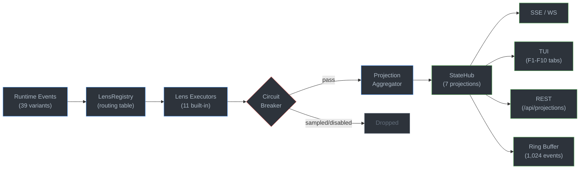

# 13 -- Telemetry: Lens System and StateHub

> Full observability through the Observe protocol. Lenses focus attention without
> modifying the subject. StateHub projects Lens output into typed projections consumed
> by every surface. Removing every Lens from a running system changes nothing about its
> behavior -- only visibility.

**Depends on**: [01-SIGNAL](01-SIGNAL.md) (Signal lineage, HDC fingerprints, demurrage), [02-CELL](02-CELL.md) (9 protocols, Observe protocol), [03-GRAPH](03-GRAPH.md) (Graph TOML loading, topological sort), [05-AGENT](05-AGENT.md) (vitality, regime, lifecycle), [07-GATES](07-GATES.md) (Verify verdicts, rungs), [09-MEMORY](09-MEMORY.md) (Store tiers, demurrage economics)

**Implementation status (2026-09-15):** E33 is **complete (9/9 manifest tasks)**. All 11
built-in Lens executors, all 39 production event variants, bounded queued delivery with
drop-oldest accounting, three-stage overhead circuit breaker, restart-durable projection
history with configurable 7-day retention and resolution coalescing, central StateHub fanout,
typed aggregation, live Lens runtime controls, SSE and WebSocket delivery, REST reads, CLI
projection output, and Graph TOML loading are wired end to end for the complete bounded,
fail-closed built-in catalog including derived chains. The periodic observer samples the
shared MetricRegistry every 30 seconds and persists rotation-bounded JSONL. Direct native
Agent publication into the E33 observation ingress remains separate product integration work.

### Authoritative sources

| Surface | Source file |
|---|---|
| TelemetryObserve trait + ObservableEvent enum | `crates/roko-core/src/telemetry_observe.rs` |
| LensRegistry (routing + chain validation) | `crates/roko-core/src/lens_registry.rs` |
| LensCircuitBreaker | `crates/roko-core/src/lens_circuit_breaker.rs` |
| Projection schemas (7 typed projections) | `crates/roko-core/src/telemetry_projections.rs` |
| Lens trait + CollectorLens + domain lenses | `crates/roko-core/src/obs/lens.rs` |
| LensRegistry (obs) + default_registry | `crates/roko-core/src/obs/lens.rs` |
| PeriodicObserver | `crates/roko-core/src/obs/telemetry_observe.rs` |
| MetricRegistry (Prometheus-format) | `crates/roko-core/src/obs/metrics.rs` |
| Canonical metric schema (16 families) | `crates/roko-core/src/obs/schema.rs` |
| LensExecutor (routed execution) | `crates/roko-runtime/src/lens_executor.rs` |
| TelemetryProjectionAggregator | `crates/roko-runtime/src/telemetry_projection_aggregator.rs` |
| StateHub (materialized snapshot + ring) | `crates/roko-runtime/src/state_hub.rs` |
| DashboardSnapshot + DashboardEvent | `crates/roko-core/src/dashboard_snapshot.rs` |
| Serve periodic observer (30s loop) | `crates/roko-serve/src/telemetry_observer.rs` |
| Projection HTTP routes | `crates/roko-serve/src/routes/projections.rs` |
| SSE event stream | `crates/roko-serve/src/routes/sse.rs` |

---

## 1. Design Principles

Three rules govern the telemetry system:

1. **Observe, never mutate.** A Lens receives an immutable `&ObservableEvent`. It cannot
   modify the Cell, Graph, or Agent it observes. Removing all Lenses from a running Graph
   changes nothing about the computation -- only what operators can see.

2. **Pay only for what you watch.** The engine pre-filters events by `ObservableEventKind`
   and `LensScope` at routing time. A Lens declaring `observes() = [CellLifecycle]` never
   receives Agent events, and a Lens scoped to `Graph("checkout")` never receives events
   from `Graph("deploy")`. The routing table is built once at Graph-load time.

3. **Fail closed, degrade gracefully.** A Lens that exceeds its overhead budget is sampled,
   then disabled. A Lens that panics or errors is isolated. The overhead breaker publishes a
   diagnosis event when it transitions. The observed execution path is never affected by
   telemetry failures.

---

## 1.1 Lens Pipeline



---

## 2. The TelemetryObserve Protocol

The Observe protocol is the seventh of nine Cell protocols ([02-CELL](02-CELL.md)). Two
distinct traits serve two different execution models.

### 2.1 Event-Oriented Observation

The primary contract for lifecycle-event delivery:

```rust
#[async_trait]
pub trait TelemetryObserve: Send + Sync {
    /// Observe one immutable lifecycle event and emit zero or more Signals.
    async fn observe(&self, event: &ObservableEvent) -> Result<Vec<Signal>>;

    /// Event families accepted by this Lens.
    fn observes(&self) -> &[ObservableEventKind];

    /// Subject (or upstream Lens) observed by this Lens.
    fn scope(&self) -> LensScope;
}
```

The engine depends only on a separate passive sink contract (`TelemetryEventSink`) that
carries runtime-resolved scope ancestry. Routing, chained Lens execution, projection
updates, and overhead enforcement remain owned by the telemetry runtime. Implementations
must not mutate the observed Cell or Graph.

```rust
#[async_trait]
pub trait TelemetryEventSink: Send + Sync {
    /// Deliver one event together with its runtime-resolved scope ancestry.
    async fn emit(
        &self,
        event: &ObservableEvent,
        ancestry: &[LensScope],
    ) -> Result<Vec<Signal>>;
}
```

### 2.2 Periodic Snapshot Observation

The synchronous `Lens` trait for registry-based snapshot polling:

```rust
pub trait Lens: Send + Sync {
    /// Human-readable name (stable across restarts).
    fn name(&self) -> &str;

    /// The scope this lens observes.
    fn scope(&self) -> &LensScope;

    /// Take a point-in-time snapshot of the source.
    /// This MUST be cheap (no I/O, no blocking beyond a read-lock).
    fn snapshot(&self) -> LensSnapshot;
}
```

`LensSnapshot` is the uniform output shape -- a timestamped bag of `MetricSnapshot` entries
with a monotonically increasing version counter. Downstream consumers (StateHub, TUI, SSE)
treat this as the sole data contract and never read the source directly.

### 2.3 LensScope

Both traits use the same scope hierarchy:

```rust
pub enum LensScope {
    Cell(String),      // Observe a single named Cell
    Graph(String),     // Observe all Cells within a Graph
    Agent(String),     // Observe an Agent's full pipeline
    Space(String),     // Observe everything within a workspace/Space
    Lens(String),      // Observe another Lens's output (chaining)
    Global,            // System-wide -- observe all events
}
```

An empty identifier is a family wildcard: `Cell("")` matches all Cells. `Global` accepts
every event regardless of source. Cross-level containment (e.g., "which Graph does this Cell
belong to?") is resolved by the runtime via `ancestry`, because this portable contract
intentionally carries no topology graph.

---

## 3. Observable Events (39 Variants)

Every lifecycle event in the system is represented as an `ObservableEvent` variant, grouped
into 8 families. The engine uses `ObservableEventKind` as a pre-filter so Lenses pay only for
the families they declare.

### 3.1 Event Family Filter

```rust
pub enum ObservableEventKind {
    SignalLifecycle,       // 8 variants
    CellLifecycle,         // 7 variants
    GraphLifecycle,        // 6 variants
    AgentLifecycle,        // 7 variants
    MemoryLifecycle,       // 4 variants
    VerifyLifecycle,       // 2 variants
    TriggerLifecycle,      // 3 variants
    ExtensionLifecycle,    // 2 variants
    All,                   // Accept everything
}
```

### 3.2 Complete Event Catalog

**Signal lifecycle (8):**

| Variant | Payload | When emitted |
|---|---|---|
| `SignalCreated` | `Signal` | New Signal enters the system |
| `SignalScored` | signal ID, score result | 5-axis appraisal completes |
| `SignalRouted` | signal ID, route result | Signal routed to target |
| `SignalVerified` | signal ID, `Verdict` | Verify protocol returns a verdict |
| `SignalComposed` | parent IDs, composed `Signal` | Compose protocol creates a new Signal |
| `SignalDemurrageApplied` | signal ID, balance lost | Demurrage reduces balance |
| `SignalPromoted` | signal ID, old tier, new tier | Signal graduates tiers |
| `SignalPruned` | signal ID | Signal removed from hot storage |

**Cell lifecycle (7):**

| Variant | Payload | When emitted |
|---|---|---|
| `CellStarted` | block, run, input hash | Cell execution begins |
| `CellCompleted` | block, run, duration_ms, cost_usd | Cell execution succeeds |
| `CellFailed` | block, run, error | Cell execution fails |
| `CellRetried` | block, run, attempt, reason | Cell retried after failure |
| `CellCancelled` | block, run | Cell execution cancelled |
| `CellPredictionPublished` | block, prediction | Cell publishes a Pulse prediction |
| `CellCalibrationReceived` | block, error | Prediction calibration feedback arrives |

**Graph lifecycle (6):**

| Variant | Payload | When emitted |
|---|---|---|
| `GraphStarted` | graph, run, input hash | Graph execution begins |
| `GraphNodeCompleted` | graph, run, node, duration_ms | One node completes within a Graph |
| `GraphCompleted` | graph, run, duration_ms, cost_usd | Graph finishes successfully |
| `GraphFailed` | graph, run, error | Graph execution fails |
| `GraphPaused` | graph, run, reason | Graph execution paused |
| `GraphResumed` | graph, run | Graph execution resumed |

**Agent lifecycle (7):**

| Variant | Payload | When emitted |
|---|---|---|
| `AgentTick` | agent, regime, prediction_error, vitality | Agent completes a cognitive tick |
| `AgentRegimeChange` | agent, old, new regime | Agent changes cognitive regime |
| `AgentBudgetUpdate` | agent, spent_usd, remaining_usd, vitality | Budget ledger updated |
| `AgentModeChange` | agent, old, new mode | Agent mode transition |
| `AgentPhaseChange` | agent, old, new phase | Vitality phase transition |
| `AgentStateTransition` | agent, old, new state | Lifecycle type-state transition |
| `AgentSlotUpdate` | agent, slot, state | Slot manager state change |

**Memory lifecycle (4):**

| Variant | Payload | When emitted |
|---|---|---|
| `MemoryRetrieved` | query, result count, duration_ms | Knowledge store queried |
| `MemoryStored` | signal ID, tier | Signal persisted to Store |
| `MemoryConsolidated` | promoted, demoted, pruned | Consolidation cycle completes |
| `DemurrageApplied` | count, total balance lost | Demurrage sweep completes |

**Verify lifecycle (2):**

| Variant | Payload | When emitted |
|---|---|---|
| `VerifyPreResult` | block, verdict, evidence | Pre-execution check completes |
| `VerifyPostResult` | block, verdict, reward, evidence | Post-execution verification completes |

**Trigger lifecycle (3):**

| Variant | Payload | When emitted |
|---|---|---|
| `TriggerFired` | trigger, graph | Trigger fires and starts a Graph |
| `TriggerArmed` | trigger | Trigger becomes armed |
| `TriggerDisarmed` | trigger | Trigger becomes disarmed |

**Extension lifecycle (2):**

| Variant | Payload | When emitted |
|---|---|---|
| `ExtensionHookCalled` | extension, hook, layer, duration_ms | Plugin hook completes |
| `ExtensionHookFailed` | extension, hook, error | Plugin hook fails |

### 3.3 Source Scope Resolution

Each event carries a normalized source scope derived from its payload fields. The
`source_scope()` method on `ObservableEvent` returns the appropriate `LensScope` without
requiring type-level coupling to the graph or agent runtime:

- Cell and Verify events return `LensScope::Cell(block)`.
- Graph and Trigger events return `LensScope::Graph(graph)`.
- Agent events return `LensScope::Agent(agent)`.
- Signal, Memory, and Extension events return `LensScope::Global`.

The routing table matches this source scope against each Lens's declared scope, with the
runtime providing scope ancestry so wider-scope Lenses (e.g., Graph-scoped) can receive
events from narrower sources (e.g., Cell-scoped).

### 3.4 Agent Lifecycle Observation Ingress

A registered Agent runtime commits its post-mutation or post-cycle sample through
`POST /api/agents/{id}/observation`. The payload carries a per-Agent monotonic `sequence`,
the current regime, vitality, mode, vitality phase, lifecycle state, optional completed-tick
prediction error, and zero or more slot mutations. The server validates canonical enum and
numeric ranges, legal lifecycle transitions, monotonic vitality/phase movement, and the
distinction between a real completed tick and a transition-only update.

On acceptance, the durable baseline is written before the corresponding Agent-scoped Lens
events are delivered in deterministic order: regime, mode, phase, lifecycle state, sorted
slot updates, then tick. Replaying the exact committed sequence is a no-op; stale or
conflicting sequences are rejected without emission. Lens fanout is deliberately best-effort
after the commit, so observability cannot roll back real Agent state.

---

## 4. Built-in Lenses (11)

Roko ships 11 built-in Lenses. Each implements `TelemetryObserve`, declares its event-family
filters, and emits typed Signals that flow into StateHub projections.

### 4.1 CostLens

Tracks USD and token expenditure across Cell executions.

| Property | Value |
|---|---|
| **Observes** | `CellLifecycle`, `GraphLifecycle`, `AgentLifecycle` |
| **Default Scope** | `Graph` |
| **Emits** | `LensPayload::CostReport` |
| **Topic** | `telemetry.lens.cost_report.v1` |

```rust
pub struct CostReportPayload {
    pub target: String,
    pub interval_ms: u64,
    pub total_usd: f64,
    pub total_tokens: u64,
    pub input_tokens: u64,
    pub output_tokens: u64,
    pub model_breakdown: BTreeMap<String, f64>,
    pub cumulative_usd: f64,
    pub budget_remaining: Option<f64>,
    pub vitality: Option<f64>,
}
```

### 4.2 LatencyLens

Measures execution duration with percentile tracking.

| Property | Value |
|---|---|
| **Observes** | `CellLifecycle`, `GraphLifecycle` |
| **Default Scope** | `Graph` |
| **Emits** | `LensPayload::Latency` |
| **Topic** | `telemetry.lens.latency.v1` |

```rust
pub struct LatencyPayload {
    pub target: String,
    pub interval_ms: u64,
    pub count: u64,
    pub p50_ms: u64,
    pub p95_ms: u64,
    pub p99_ms: u64,
    pub mean_ms: u64,
}
```

### 4.3 QualityLens

Tracks pass/fail rates from Verify-protocol Cells, including pre/post verification with
continuous reward.

| Property | Value |
|---|---|
| **Observes** | `VerifyLifecycle`, `SignalLifecycle` |
| **Default Scope** | `Graph` |
| **Emits** | `LensPayload::Quality` |
| **Topic** | `telemetry.lens.quality.v1` |

```rust
pub struct QualityPayload {
    pub target: String,
    pub interval_ms: u64,
    pub total_verifications: u64,
    pub pre_verify_vetoes: u64,
    pub post_verify_passed: u64,
    pub post_verify_failed: u64,
    pub pass_rate: f64,
    pub avg_reward: f64,
    pub hard_criteria_failures: u64,
    pub rung_breakdown: BTreeMap<String, PassFailCounts>,
}
```

### 4.4 EfficiencyLens

Measures tokens-per-task and cost-per-quality ratios per Agent.

| Property | Value |
|---|---|
| **Observes** | `CellLifecycle`, `AgentLifecycle` |
| **Default Scope** | `Agent` |
| **Emits** | `LensPayload::Efficiency` |
| **Topic** | `telemetry.lens.efficiency.v1` |

```rust
pub struct EfficiencyPayload {
    pub agent: String,
    pub interval_ms: u64,
    pub tasks_completed: u64,
    pub tokens_per_task: f64,
    pub usd_per_task: f64,
    pub quality_per_usd: f64,
    pub t0_hit_rate: f64,
    pub t1_hit_rate: f64,
    pub t2_hit_rate: f64,
    pub avg_prediction_error: f64,
    pub vitality: f64,
    pub vitality_phase: String,
}
```

### 4.5 ErrorLens

Classifies and aggregates errors across Cell executions.

| Property | Value |
|---|---|
| **Observes** | `CellLifecycle`, `GraphLifecycle`, `ExtensionLifecycle` |
| **Default Scope** | `Graph` |
| **Emits** | `LensPayload::Error` |
| **Topic** | `telemetry.lens.error.v1` |

```rust
pub struct ErrorPayload {
    pub target: String,
    pub interval_ms: u64,
    pub total_errors: u64,
    pub by_category: BTreeMap<String, u64>,
    pub by_block: BTreeMap<String, u64>,
    pub retry_count: u64,
    pub retry_success_rate: f64,
    pub error_rate: f64,
}

pub enum ErrorCategory {
    Timeout,
    CapabilityDenied,
    External,
    LogicError,
    InputInvalid,
    Cancelled,
}
```

### 4.6 DriftLens

Detects knowledge quality degradation in Memory stores. Tracks demurrage-driven balance
changes (Gesell 1916) rather than time-based decay.

| Property | Value |
|---|---|
| **Observes** | `MemoryLifecycle`, `SignalLifecycle` |
| **Default Scope** | `Agent` |
| **Emits** | `LensPayload::Drift` |
| **Topic** | `telemetry.lens.drift.v1` |

```rust
pub struct DriftPayload {
    pub memory: String,
    pub interval_ms: u64,
    pub total_entries: u64,
    pub tier_distribution: BTreeMap<String, u64>,
    pub avg_balance: f64,
    pub balance_delta: f64,
    pub promotion_rate: f64,
    pub demotion_rate: f64,
    pub cold_entries: u64,
    pub anti_knowledge_count: u64,
    pub heuristic_calibration_avg: f64,
}
```

### 4.7 BudgetLens

Monitors budget consumption and vitality across Agents and Spaces. Emits alerts when
thresholds are crossed.

| Property | Value |
|---|---|
| **Observes** | `AgentLifecycle`, `CellLifecycle` |
| **Default Scope** | `Agent` or `Space` |
| **Emits** | `LensPayload::BudgetAlert` |
| **Topic** | `telemetry.lens.budget_alert.v1` |

```rust
pub struct BudgetAlertPayload {
    pub target: String,
    pub budget_total: f64,
    pub budget_spent: f64,
    pub budget_remaining: f64,
    pub vitality: f64,
    pub vitality_phase: String,
    pub projected_exhaustion_ms: Option<i64>,
    pub burn_rate: f64,
    pub level: AlertLevel,   // Info | Warning | Critical
}
```

### 4.8 TrendLens

Computes statistical trends over time-series data. This is a **chaining Lens** -- it
observes another Lens's output rather than raw lifecycle events.

| Property | Value |
|---|---|
| **Observes** | `SignalLifecycle` (Lens output Signals) |
| **Default Scope** | `Lens` (wraps another Lens) |
| **Emits** | `LensPayload::Trend` |
| **Topic** | `telemetry.lens.trend.v1` |

```rust
pub struct TrendPayload {
    pub source_lens: String,
    pub metric: String,
    pub window_ms: u64,
    pub slope: f64,
    pub ema: f64,
    pub ema_previous: f64,
    pub direction: TrendDirection,   // Rising | Falling | Stable
    pub r_squared: f64,
    pub data_points: usize,
}
```

### 4.9 AnomalyLens

Detects statistical outliers in observation streams. Uses rolling window z-score with IQR
fallback for non-Gaussian distributions. Also a **chaining Lens**.

| Property | Value |
|---|---|
| **Observes** | `SignalLifecycle` (Lens output Signals) |
| **Default Scope** | `Lens` (wraps another Lens) |
| **Emits** | `LensPayload::Anomaly` |
| **Topic** | `telemetry.lens.anomaly.v1` |

```rust
pub struct AnomalyPayload {
    pub source_lens: String,
    pub metric: String,
    pub observed_value: f64,
    pub expected_value: f64,
    pub deviation: f64,
    pub direction: AnomalyDirection,   // Above | Below
    pub severity: AnomalyLevel,        // Moderate | Severe | Critical
}
```

### 4.10 UsageLens

Tracks usage analytics for marketplace and developer metrics. Analytics are aggregated --
individual runs are never exposed to publishers. The portable lifecycle protocol deliberately
does not attach provider token counts to Cell events; UsageLens therefore reports only
directly evidenced runtime activity and never converts unknown token counts to zero.

| Property | Value |
|---|---|
| **Observes** | `CellLifecycle`, `GraphLifecycle`, `TriggerLifecycle` |
| **Default Scope** | `Space` or `Global` |
| **Emits** | `LensPayload::Usage` |
| **Topic** | `telemetry.lens.usage.v1` |

```rust
pub struct UsagePayload {
    pub target: String,
    pub interval_ms: u64,
    pub cell_runs: u64,
    pub graph_runs: u64,
    pub trigger_fires: u64,
    pub total_cost_usd: f64,
    pub total_duration_ms: u64,
}
```

### 4.11 CollectiveIntelligenceLens (c-factor)

Computes the **c-factor** -- collective intelligence as a runtime observable. Grounded in
Woolley et al. (2010, *Science*): 40%+ of group performance variance loads onto a single
general factor driven by turn-taking equality and social perceptiveness, not mean IQ.

The c-factor is a **covariate, not an objective** -- if turned into a reward signal the system
will game it. The correct architecture: c-factor feeds L4 evolution decisions as one covariate
among many.

| Property | Value |
|---|---|
| **Observes** | `AgentLifecycle`, `SignalLifecycle`, `MemoryLifecycle` |
| **Default Scope** | `Space` (measures across all agents in a Space) |
| **Emits** | `LensPayload::CFactor` |
| **Topic** | `telemetry.lens.c_factor.v1` |

```rust
pub struct CFactorPayload {
    pub space: String,
    pub interval_ms: u64,
    pub c_factor: f64,                     // composite score (0.0..=1.0)

    // Components
    pub turn_taking_entropy: f64,          // Shannon entropy of turn distribution
    pub peer_prediction_accuracy: f64,     // predict-publish-correct accuracy
    pub citation_reciprocity: f64,         // knowledge attribution flow balance
    pub hdc_diversity: f64,                // spread of HDC fingerprints

    // Diagnostics
    pub agent_count: usize,
    pub active_agents: usize,
    pub dominant_agent_share: f64,
    pub knowledge_flow_edges: usize,
    pub avg_agent_vitality: f64,
}
```

The five sub-computations are implemented as pure functions in `telemetry_observe.rs`:

| Component | Function | What it measures |
|---|---|---|
| Turn-taking entropy | `turn_taking_entropy()` | Normalized Shannon entropy of agent turn distribution |
| Peer prediction accuracy | `peer_prediction_accuracy()` | 1 - MSE over matched prediction/outcome samples |
| Citation reciprocity | `citation_reciprocity()` | Recency-weighted fraction of cited Signals that survived verification |
| Bus delivery rate | `delivery_rate()` | Fraction of Bus deliveries confirmed during an interval |
| HDC diversity | `hdc_diversity()` | 1 - mean pairwise HDC similarity |

### 4.12 Built-in Lens Summary

| # | Lens | Observes | Default Scope | Payload type | Chains |
|---|---|---|---|---|---|
| 1 | CostLens | Cell, Graph, Agent | Graph | `cost_report` | No |
| 2 | LatencyLens | Cell, Graph | Graph | `latency` | No |
| 3 | QualityLens | Verify, Signal | Graph | `quality` | No |
| 4 | EfficiencyLens | Cell, Agent | Agent | `efficiency` | No |
| 5 | ErrorLens | Cell, Graph, Extension | Graph | `error` | No |
| 6 | DriftLens | Memory, Signal | Agent | `drift` | No |
| 7 | BudgetLens | Agent, Cell | Agent/Space | `budget_alert` | No |
| 8 | TrendLens | Signal | Lens | `trend` | Yes |
| 9 | AnomalyLens | Signal | Lens | `anomaly` | Yes |
| 10 | UsageLens | Cell, Graph, Trigger | Space/Global | `usage` | No |
| 11 | CollectiveIntelligenceLens | Agent, Signal, Memory | Space | `c_factor` | No |

---

## 5. Lens Composition

Lenses compose in three ways: stacking, chaining, and scoping. All three are configured
via TOML and resolved at Graph-load time.

### 5.1 Stacking (Multiple Lenses on Same Target)

Multiple Lenses observe the same Cell, Graph, Agent, or Space simultaneously. Each receives
the same events independently in registration order. There is no ordering dependency between
stacked Lenses. Failure in one does not interrupt others.

### 5.2 Chaining (Lens Observes Another Lens's Output)

A Lens can observe another Lens's output Signals rather than raw lifecycle events. This
enables derived metrics:

```
CostLens ----> TrendLens (cost $) ----> AnomalyLens
  emits           emits                    emits
CostReport      Trend                    Anomaly
 Signals        Signals                  Signals
```

Chaining uses `LensScope::Lens(upstream_name)`. The `LensRegistry` enforces acyclicity via
topological sort at registration time. If a new edge closes a cycle, both the registration
and edge are rolled back atomically and the error includes a deterministic cycle path (e.g.,
`a -> b -> a`).

Downstream Lens invocation happens only when the immediate upstream emits output for that
event cycle, preserving per-event-cycle ordering. Transitive consumers run only when their
immediate upstream emits its own output.

### 5.3 Scoping

| Scope | Receives events from | Aggregation |
|---|---|---|
| `Cell` | Single Cell only | Per-invocation metrics |
| `Graph` | All Cells within one Graph | Aggregated across nodes |
| `Agent` | All Graphs within one Agent | Cross-pipeline view |
| `Space` | All Agents within one Space | Full workspace view |
| `Global` | Everything in the system | System-wide overview |

### 5.4 Composition Rules

1. **Independence**: Stacked Lenses do not affect each other.
2. **Ordering**: Chained Lenses are topologically sorted. Cycles are rejected at
   Graph-load time.
3. **Scope narrowing**: A Lens at Graph scope does not receive events from Cells in other
   Graphs.
4. **Scope widening**: A Lens at Space scope receives events from all contained
   Agents/Graphs/Cells. The runtime provides the `ancestry` array so wider scopes can match
   without guessing topology.
5. **Cross-scope chaining**: A Graph-scoped CostLens can chain into a Space-scoped
   TrendLens.

### 5.5 TOML Configuration

```toml
[graph]
name = "plan-executor"

[[lenses]]
name = "cost-monitor"
block = "roko:cost-lens@^1.0"
scope = "graph"
[lenses.params]
interval = "60s"
budget_warn_pct = 0.80

[[lenses]]
name = "cost-trend"
block = "roko:trend-lens@^1.0"
scope = "lens:cost-monitor"

[[lenses]]
name = "cost-anomaly"
block = "roko:anomaly-lens@^1.0"
scope = "lens:cost-trend"
```

The `LensConfig` struct carries the name, block (versioned plugin reference), scope, and
optional parameter map. Scope syntax: bare `cell`, `graph`, `agent`, `space` are family
wildcards; `kind:name` targets a specific instance; `lens:name` chains; `global` accepts
all events.

---

## 6. LensRegistry and Routing

The `LensRegistry` in `roko-core/src/lens_registry.rs` is the declarative routing table.

### 6.1 Registration

```rust
pub struct LensRegistration {
    pub config: LensConfig,
    pub scope: LensScope,
    pub observes: Vec<ObservableEventKind>,
}
```

Names are unique. Duplicate names are rejected. Chain edges are stored in a
`BTreeMap<String, Vec<String>>` and kept sorted for deterministic iteration.

### 6.2 Routing

Two routing methods serve different callers:

- **`route(event)`**: uses the event's own `source_scope()` as the sole ancestry element.
  Suitable when the runtime has no topology context.
- **`route_with_ancestry(event, ancestry)`**: accepts an explicit ancestry array (e.g.,
  `[Cell("compile"), Graph("checkout"), Agent("builder"), Space("prod")]`). Wider-scope
  Lenses can match without the routing table guessing containment.

Both filter by event-family match (`observes_event`) and scope match (`matches_source`).
Chained Lenses (scope = `Lens(...)`) are excluded from raw-event fan-out; they are invoked
separately by `route_lens_output()`.

### 6.3 Chain Order

The `chain_order()` method returns a deterministic dependency-first ordering of all
registered Lens names via topological sort. The sort uses Kahn's algorithm with a
`BTreeSet` ready-queue for deterministic tie-breaking. If a cycle is detected, a DFS
cycle-finder produces the exact path for the error message.

### 6.4 Validation

`validate()` rejects forward references that were never resolved after all Graph Lens
entries were registered. It then verifies acyclicity.

---

## 7. Bounded Queued Delivery

The `LensExecutor` in `roko-runtime/src/lens_executor.rs` binds the declarative routing
table to named `TelemetryObserve` implementations.

### 7.1 Queue Configuration

```rust
pub struct LensQueueConfig {
    pub capacity: usize,         // Default: 1,024
    pub backpressure: LensBackpressurePolicy,   // Default: DropOldest
}
```

When the queue is full, the oldest pending observation is evicted. The enqueue result
distinguishes `Accepted` from `ReplacedOldest`, and the queue tracks lifetime counters for
enqueued, processed, dropped-oldest, and failed dispatches.

### 7.2 Dispatch Flow

For each event delivered to the executor:

1. The routing table matches the event against all registered Lens scopes and filters.
2. Each matched Lens is checked against its per-Lens circuit breaker.
3. Permitted Lenses are invoked concurrently via a `JoinSet`.
4. Output Signals are collected in deterministic routing order.
5. Chained downstream Lenses are invoked with the collected output.
6. A `LensDispatchReport` records every invocation outcome, breaker state transitions,
   emitted signals, and projection errors.

### 7.3 Execution Outcomes

```rust
pub enum LensExecutionOutcome {
    Succeeded,              // Normal completion
    Failed(String),         // Typed runtime error
    SampledOut,             // Breaker's 50% sampler skipped this event
    Disabled,               // Breaker has disabled this Lens
    MissingImplementation,  // Declarative registration has no bound impl
    TaskFailed(String),     // Spawned Lens task panicked or was cancelled
}
```

---

## 8. Circuit Breaker

Each Lens has an independent three-stage overhead circuit breaker
(`LensCircuitBreaker` in `roko-core/src/lens_circuit_breaker.rs`).

### 8.1 Stages

```mermaid
stateDiagram-v2
    [*] --> Active
    Active --> Sampled : 3 consecutive\noverhead violations
    Sampled --> Disabled : 10 consecutive\noverhead violations
    Disabled --> Sampled : operator reset()

    Active --> Active : within budget\n(counter resets to 0)
    Sampled --> Sampled : 50% deterministic\nsampling

    state Active {
        [*] : Invoked on every\nmatching event
    }
    state Sampled {
        [*] : 50% alternating\nsampling
    }
    state Disabled {
        [*] : Never invoked;\nrequires operator reset
    }
```



| Stage | Behavior |
|---|---|
| **Active** | Lens invoked on every matching event |
| **Sampled** | Deterministic 50% sampling (alternating sequence) |
| **Disabled** | Lens never invoked; requires operator reset |

### 8.2 Overhead Budget

The breaker tracks whether the Lens's wall-clock time exceeds a configurable fraction
(default: 1%) of the observed operation's duration:

```rust
pub struct LensBreakerConfig {
    pub overhead_budget_pct: f64,    // Default: 0.01 (1%)
    pub sample_threshold: u32,       // Default: 3 consecutive violations
    pub disable_threshold: u32,      // Default: 10 consecutive violations
}
```

When `lens_duration_ms > cell_duration_ms * overhead_budget_pct`:
- Consecutive violation counter increments.
- At `sample_threshold` consecutive violations: transition to `Sampled`.
- At `disable_threshold` consecutive violations: transition to `Disabled`.
- Any event where the Lens stays within budget resets the consecutive counter to 0.

### 8.3 Operator Controls

The `LensExecutor` exposes three runtime controls per Lens:

- **Reset**: returns a `Disabled` Lens to `Sampled` and clears the consecutive counter.
- **Enable**: permits future invocations (sets the operator-enabled flag).
- **Disable**: blocks all invocations regardless of breaker state.

Breaker stage transitions publish diagnosis events as `DashboardEvent::Diagnosis` with
severity and detail, so operators can see why a Lens was degraded or disabled.

---

## 9. StateHub -- The Projection Layer

StateHub is the universal projection layer between Lens output and all consumer surfaces. It
centralizes aggregation once and projects the result to all consumers through typed, versioned
contracts.

### 9.1 Architecture

```
Orchestrator / Graph Engine
    | publish(DashboardEvent)
    v
StateHub (roko-runtime/src/state_hub.rs)
    |-- watch<DashboardSnapshot>    <-- TUI reads (60fps, zero-copy borrow)
    |-- broadcast<DashboardEvent>   <-- WebSocket/SSE clients subscribe
    +-- ring buffer (1,024)         <-- replay for late joiners
```

Without StateHub, every surface (TUI, web dashboard, Slack bot, audit trail) would
independently parse raw Lens output, compute its own aggregations, and maintain its own state.
This leads to inconsistency and duplication. StateHub computes once and fans out.

### 9.2 Central Producer Fanout

The `TelemetryProjectionAggregator` in `roko-runtime/src/telemetry_projection_aggregator.rs`
bridges Lens output Signals into typed StateHub projections. Each `LensSignalEnvelope` carries:

- A schema version (`v1`).
- A custom Signal `Kind` (`roko.telemetry.lens.output.v1`).
- A canonical topic tag (`telemetry.topic`).
- The emitting Lens instance name (`telemetry.source_lens`).

The aggregator validates that the topic tag and envelope payload type agree before applying
any projection update. Malformed or spoofed envelopes are rejected and counted in the
dispatch report.

### 9.3 Seven Core Projections

| Projection ID | Type | Source Lenses | Consumers |
|---|---|---|---|
| `cohort_health` | `CohortHealthProjection` | EfficiencyLens, ErrorLens, BudgetLens | TUI (F1), Web dashboard |
| `active_tasks` | `ActiveTasksProjection` | QualityLens, LatencyLens | TUI (F2), Workbench surface |
| `gate_pipeline` | `GatePipelineProjection` | QualityLens | TUI (F3), Audit trail |
| `cost_meter` | `CostMeterProjection` | CostLens, BudgetLens | TUI (F5), Web |
| `knowledge_health` | `KnowledgeHealthProjection` | DriftLens | TUI (F6), Web |
| `c_factor` | `CFactorProjection` | CollectiveIntelligenceLens | TUI (F7), L4 gate, Web |
| `agent_vitality` | `AgentVitalityProjection` | BudgetLens, EfficiencyLens | TUI (F4), Slack alerts |

### 9.4 Projection Schemas

```rust
pub struct CohortHealthProjection {
    pub agent_count: usize,
    pub active_count: usize,
    pub avg_vitality: f64,
    pub avg_pass_rate: f64,
    pub total_spend_usd: f64,
    pub error_rate: f64,
    pub t0_hit_rate: f64,
    pub regime_distribution: BTreeMap<String, usize>,
}

pub struct CostMeterProjection {
    pub total_usd: f64,
    pub budget_remaining: f64,
    pub burn_rate_usd_per_hour: f64,
    pub model_breakdown: BTreeMap<String, f64>,
    pub cost_trend: String,
}

pub struct GatePipelineProjection {
    pub rungs: Vec<RungSnapshot>,
    pub overall_pass_rate: f64,
    pub avg_reward: f64,
    pub hard_criteria_fail_rate: f64,
}

pub struct AgentVitalityProjection {
    pub agents: Vec<AgentVitalitySnapshot>,
}
```

### 9.5 Projection Updates

StateHub updates projections on every Lens observation Signal. Each update:

1. Applies the observation to the relevant projection(s).
2. Increments the projection `version` (monotonically increasing).
3. Publishes a sequenced event carrying the projection ID, source Lens, and new version.
4. REST reads immediately see the committed value; subscribed SSE/WS consumers receive
   the invalidation and fetch the updated projection.

### 9.6 Restart-Durable Projection History

StateHub retains bounded projection history with three controls:

- **Capacity**: default 1,024 versions per projection (`DEFAULT_PROJECTION_HISTORY_CAPACITY`).
- **Time retention**: default 7 days (`DEFAULT_PROJECTION_HISTORY_RETENTION`). Entries older
  than this window are pruned.
- **Resolution queries**: consumers can request history at coarser granularity (e.g., 60s).
  The server coalesces adjacent versions within the requested resolution window, returning
  only the latest version per window.

History survives restarts because StateHub persists its event log to
`.roko/state/events.jsonl` with rotation-bounded JSONL. On startup, the log is replayed to
rebuild the materialized `DashboardSnapshot`. Compaction keeps a configurable maximum line
count (default: 50,000) and rewrites atomically to prevent partial-line reads.

---

## 10. PeriodicObserver

The `PeriodicObserver` in `roko-core/src/obs/telemetry_observe.rs` samples the shared
`MetricRegistry` at a fixed interval. The production observer in `roko-serve` samples
immediately at startup and every 30 seconds thereafter.

### 10.1 Observation Cycle

Each cycle:

1. `PeriodicObserver::observe()` calls `LensRegistry::snapshot_all()`.
2. Each registered `Lens` produces a `LensSnapshot` (cheap, no I/O, no blocking beyond a
   read-lock).
3. The snapshots are serialized to `TelemetryObservation` records with wall-clock timestamps.
4. The records are persisted as one JSONL batch under `.roko/metrics/` via
   `roko_fs::log_rotation::append_jsonl_line_sync`.

### 10.2 Default Registry

The default registry pre-registers three domain-specific collector Lenses:

| Lens | Metric families | Labels |
|---|---|---|
| `TokenUsageLens` | `roko_llm_tokens_total` | `provider`, `model`, `direction` |
| `LatencyLens` | `roko_llm_ttft_seconds`, `roko_llm_request_duration_seconds` | `provider`, `model` |
| `CostLens` | `roko_llm_cost_usd_total` | `provider`, `model` |

### 10.3 Cost Spike Detection

The production observer tracks a 15-minute rolling cost rate. When the rate exceeds the
configured threshold (default: $1/min), a warning is logged. This is pure observation -- no
action is taken beyond the log entry.

### 10.4 Rotation

The JSONL observation file is bounded by the workspace's `resources.log_rotation_max_mb`
configuration. When the file exceeds the limit, it is rotated by `roko-fs` log rotation.
Observations are derived telemetry, so failures are best-effort and never affect request
handling.

---

## 11. Canonical Metric Schema

The `MetricRegistry` in `roko-core/src/obs/metrics.rs` is a lock-free Prometheus-compatible
metric store. It produces text in the Prometheus exposition format without depending on the
`prometheus` crate.

### 11.1 Metric Families (16)

| Family | Kind | Labels |
|---|---|---|
| `roko_plans_total` | Counter | `status` |
| `roko_tasks_total` | Counter | `status`, `role` |
| `roko_tool_calls_total` | Counter | `tool`, `outcome` |
| `roko_gate_verdicts_total` | Counter | `gate`, `verdict` |
| `roko_agent_duration_seconds` | Histogram | `backend`, `role` |
| `roko_llm_tokens_total` | Counter | `provider`, `model`, `direction` |
| `roko_llm_cost_usd_total` | Counter | `provider`, `model` |
| `roko_agent_server_requests_total` | Counter | (none) |
| `roko_agent_server_message_requests_total` | Counter | (none) |
| `roko_llm_calls_total` | Counter | `provider`, `model`, `status` |
| `roko_llm_errors_total` | Counter | `provider`, `model`, `error_type` |
| `roko_llm_ttft_seconds` | Histogram | `provider`, `model` |
| `roko_llm_request_duration_seconds` | Histogram | `provider`, `model` |
| `roko_context_utilization` | Gauge | `provider`, `model` |
| `roko_token_throughput_per_second` | Gauge | `provider`, `model` |
| `roko_target_dir_size_bytes` | Gauge | (none) |

### 11.2 Schema Contract

```rust
pub trait MetricSchema {
    fn schema_version() -> u32;
    fn metrics() -> &'static [MetricDescriptor];
}
```

The `CanonicalMetricSchema` implementation returns schema version 1 and the 16 canonical
families. The schema version is stable across restarts; breaking changes require a version
bump.

---

## 12. Dashboard Delivery

### 12.1 SSE Endpoint

```
GET /api/events       (primary)
GET /api/sse          (alias)
```

Returns `text/event-stream` with `DashboardEvent` payloads as JSON `data:` frames. Each
event carries a monotonic `id:` for reconnection.

**Replay cursor precedence**: `Last-Event-ID` header > `?lastEventId=` query param >
`?n=` legacy query param > 0.

If the cursor has fallen out of the ring buffer or the retained replay suffix exceeds 256
events, the server replaces the replay with one explicit snapshot gap frame containing the
full `DashboardSnapshot`, then continues live from that snapshot's atomic cursor. This
prevents silent truncation.

**Response headers** for HTTP/2 proxy compatibility (Railway, Nginx, Cloudflare):

```
X-Accel-Buffering: no
Cache-Control: no-cache, no-store, no-transform, must-revalidate
Connection: keep-alive
```

### 12.2 Projection Routes

```
GET  /api/projections/catalog                 -- list all projection IDs
GET  /api/projections/telemetry               -- read current telemetry projection
GET  /api/projections/telemetry/stream        -- SSE stream of telemetry updates
GET  /api/projections/workbench               -- Workbench surface projection
GET  /api/projections/inbox                   -- Inbox surface projection
GET  /api/projections/canvas                  -- Canvas surface projection
GET  /api/projections/minimap                 -- Minimap surface projection
GET  /api/projections/autonomy                -- Autonomy surface projection
GET  /api/projections/{name}                  -- read any projection by name
GET  /api/projections/{name}/stream           -- SSE stream of a named projection
GET  /api/projections/{name}/history          -- bounded history with time/version filters
```

### 12.3 Lens Runtime Control Routes

```
GET  /api/statehub/lens-runtimes              -- list all Lens runtime statuses
GET  /api/statehub/lens-runtimes/{runtime_id} -- single Lens runtime status
POST /api/statehub/lens-runtimes/{runtime_id}/reset   -- reset breaker to Sampled
POST /api/statehub/lens-runtimes/{runtime_id}/enable  -- permit invocations
POST /api/statehub/lens-runtimes/{runtime_id}/disable -- block all invocations
```

### 12.4 WebSocket

The control plane (`roko serve` on :6677) exposes a WebSocket endpoint at `/ws/telemetry`.
Clients send a subscription message specifying which projections to watch and at what
resolution. The server streams projection updates matching the subscription.

### 12.5 TUI Rendering

The ratatui dashboard renders StateHub projections directly via a `watch` channel borrowed
at 60 fps. Each F-key tab maps to one or more projections:

| Tab | Projections consumed |
|---|---|
| F1: Overview | `cohort_health` |
| F2: Tasks | `active_tasks` |
| F3: Gates | `gate_pipeline` |
| F4: Agents | `agent_vitality` |
| F5: Telemetry | `cost_meter`, `gate_pipeline` |
| F6: Knowledge | `knowledge_health` |
| F7: C-Factor | `c_factor` |

The five named surfaces also consume StateHub projections:

| Surface | Projections consumed |
|---|---|
| **Workbench** | `active_tasks`, `gate_pipeline`, `cost_meter` |
| **Inbox** | `agent_vitality`, `cohort_health` |
| **Canvas** | `active_tasks`, `gate_pipeline` |
| **Minimap** | `c_factor`, `cohort_health`, `knowledge_health` |
| **Autonomy** | `agent_vitality`, `c_factor` |

---

## 13. Verification

```bash
# Confirm telemetry observation types compile
cargo test -p roko-core telemetry_observe --lib

# Confirm Lens trait and registry
cargo test -p roko-core obs::lens --lib

# Confirm LensRegistry routing and chain validation
cargo test -p roko-core lens_registry --lib

# Confirm circuit breaker behavior
cargo test -p roko-core lens_circuit_breaker --lib

# Confirm projection schemas
cargo test -p roko-core telemetry_projections --lib

# Confirm canonical metric schema
cargo test -p roko-core obs::schema --lib

# Confirm LensExecutor (runtime routing and dispatch)
cargo test -p roko-runtime lens_executor --lib

# Confirm TelemetryProjectionAggregator
cargo test -p roko-runtime telemetry_projection_aggregator --lib

# Confirm StateHub event delivery and history
cargo test -p roko-runtime state_hub --lib

# Confirm periodic observer
cargo test -p roko-core obs::telemetry_observe --lib

# Confirm serve-side observer wiring
cargo test -p roko-serve telemetry_observer --lib

# Confirm projection HTTP routes
cargo test -p roko-serve projections --lib

# Confirm SSE endpoint
cargo test -p roko-serve sse --lib

# Full workspace telemetry test surface
cargo test --workspace -- telemetry lens statehub projection
```

---

## 14. Depth File Listing

Detailed subsystem documentation lives in `docs/v3/depth/13-telemetry/`:

| File | Contents |
|---|---|
| `01-lens-protocol.md` | TelemetryObserve trait, LensScope, ObservableEvent routing, LensSnapshot contract |
| `02-statehub.md` | StateHub architecture, DashboardSnapshot, ring buffer, watch channel, event log compaction, restart replay |
| `03-built-in-executors.md` | All 11 built-in Lens implementations with payload schemas, topic strings, and default scope/filter declarations |
| `04-circuit-breaker.md` | LensCircuitBreaker stages, overhead budget, operator controls, diagnosis events, LensBreakerConfig |
| `05-delivery-and-fanout.md` | LensExecutor queue, LensQueueConfig, backpressure policy, dispatch flow, central producer fanout, LensSignalEnvelope |
| `06-metric-schema.md` | CanonicalMetricSchema, 16 metric families, MetricRegistry, Prometheus text format, PeriodicObserver, JSONL persistence |

---

## 15. Product Residuals

The following items are outside the accepted E33 scope and remain product work:

- **Native Agent publication**: registered agents commit the final six Agent lifecycle
  variants through a typed, durable, identity-bound observation boundary; direct native
  `Agent`-to-E33 observation publication remains broader integration scope.
- **Adaptive Lens weights**: CohortWeightsLearner for online c-factor weight adjustment is
  specified but depends on L4 structural evolution infrastructure.
- **Prometheus/OTLP export Lens**: the `PrometheusExportLens` and OTLP export paths exist
  as trait placeholders; concrete implementations remain future work.
- **Resolution-aware SSE throttling**: surfaces can subscribe at different resolutions
  (100ms, 1s, 10s, 60s), but server-side coalescing at the SSE layer is not yet implemented;
  clients receive every update and throttle locally.
