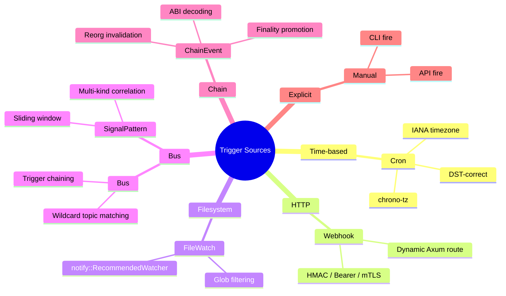

# 15 -- Declarative Trigger Runtime

> Event-driven Graph execution. A trigger is a persistent, TOML-defined
> binding from an event source to a Graph. When the event fires, the
> coordinator applies filters and concurrency policy, maps the payload to
> root-Cell input Signals, enforces Space/capability boundaries, and spawns
> a Flow. Every lifecycle transition is a durable Signal on Bus. The
> coordinator owns seven source kinds, four concurrency policies,
> debounce/rate-limit admission, IANA/DST cron scheduling, watcher-to-raw
> EVM ABI decoding with finality promotion and reorg invalidation, and
> CA-verified mTLS webhook identity.

> **Implementation status (2026-09-15):** E31 is **complete (8/8)**. All
> seven sources, the long-lived `TriggerCoordinator` actor, durable TOML
> persistence with live disk reload, `TriggerBinding` validation,
> authenticated dynamic webhooks with HMAC-SHA256 and bearer-token
> verification, CA-verified mutual TLS transport, mapped payload-to-root-Cell
> Signals, live Graph execution through `TriggerExecutionScope`, filters
> (payload match, debounce, rate-limit), four concurrency policies
> (Queue/Skip/CancelRunning/Parallel), Space partition/visibility/capability
> enforcement, shared Pulse delivery with graduation policy, durable
> CLI/API history with correlated lifecycle evidence, IANA/DST cron
> scheduling via `chrono-tz`, and bundled watcher-to-raw-EVM ABI decoding
> with automatic finality promotion, canonical-hash checks, bounded reorg
> replay, invalidation, and idempotency are implemented. 58 trigger-related
> tests pass across the protocol, runtime, TLS, CLI, route, and plugin
> modules.

**Depends on**: [01-SIGNAL](01-SIGNAL.md) (Signal/Pulse duality, Bus), [02-CELL](02-CELL.md) (Trigger protocol), [03-GRAPH](03-GRAPH.md) (Graph/Flow, graph execution), [12-SAFETY](12-SAFETY.md) (capability enforcement, Space scoping)

### Authoritative sources

| Surface | Source file |
|---|---|
| Protocol types (7 sources, binding, handle, event, filter, auth, history) | `crates/roko-core/src/trigger.rs` |
| Coordinator actor (arm/disarm, filter/concurrency, source lifecycle, chain handling) | `crates/roko-serve/src/trigger_runtime.rs` |
| CA-verified mTLS transport | `crates/roko-serve/src/trigger_tls.rs` |
| HTTP routes (CRUD, fire, history, dynamic webhooks) | `crates/roko-serve/src/routes/triggers.rs` |
| CLI commands (list, show, create, fire, history) | `crates/roko-cli/src/commands/trigger.rs` |
| Plugin trigger registry | `crates/roko-plugin/src/trigger_protocol.rs` |
| Trigger outcome learning | `crates/roko-learn/src/trigger_outcome.rs` |
| Space/capability execution scope | `crates/roko-serve/src/runtime.rs` (`TriggerExecutionScope`) |

---

## 1. Architecture

The trigger system is a single long-lived `TriggerCoordinator` actor that owns
every armed source's lifetime, all filter and concurrency state, and the
durable lifecycle evidence log. It runs inside `roko-serve` and is lazily
initialized on first use via `ensure_trigger_runtime`.

```
                    +-----------+
  .roko/triggers/   |  Disk     |  TOML binding files, hot-reloaded every 500ms
  *.toml            |  Reloader |--+
                    +-----------+  |
                                   v
           +-------------------------------------------+
           |         TriggerCoordinator Actor           |
           |                                            |
           |  HashMap<name, ActiveBinding>              |
           |    - binding config                        |
           |    - source_cancel token                   |
           |    - running flows (HashMap<Uuid, flow>)   |
           |    - concurrency queue                     |
           |    - debounce / rate state                 |
           |    - signal pattern history                |
           |    - chain pending / delivered maps         |
           |                                            |
           |  Commands (mpsc channel, cap 1024):        |
           |    Reconcile | Submit | Observe |           |
           |    ObservePulse | DebounceReady |           |
           |    RateReady | FlowDone | SourceStopped |   |
           |    Rearm | SourceError | Shutdown           |
           +-------------------------------------------+
                |            |               |
                v            v               v
           arm/disarm    launch_flow     emit_lifecycle
           sources       (scoped Graph)  (Bus + JSONL + Signal)
```

Four background observers feed events into the coordinator:

1. **EventObserver** -- subscribes to `ServerEvent` broadcast for webhooks,
   chain logs, chain blocks, chain finality updates, and chain reorgs.
2. **PulseObserver** -- subscribes to the Pulse Bus for Bus-kind and
   SignalPattern-kind triggers.
3. **DiskReloader** -- polls `.roko/triggers/` every 500ms and reconciles
   the live binding set with the on-disk TOML snapshot.
4. **ShutdownObserver** -- cancels all sources on server shutdown.

---

## 2. Trigger Protocol

The `TriggerProtocol` trait in `roko-core` defines two operations. Triggers are
push-based: `arm()` sets up the event subscription and the trigger publishes a
`TriggerFired` Pulse on Bus when the condition fires. There is no poll loop.

```rust
#[async_trait]
pub trait TriggerProtocol: Send + Sync {
    /// Arm the trigger. Validates the binding config, sets up the
    /// subscription/watcher/route/timer, returns a TriggerHandle in Armed state.
    async fn arm(&self, binding: TriggerBinding) -> Result<TriggerHandle>;

    /// Disarm the trigger. Tears down subscriptions and cleans up resources.
    async fn disarm(&self, handle: TriggerHandle) -> Result<()>;
}
```

### 2.1 TriggerHandle

```rust
pub struct TriggerHandle {
    pub id: TriggerId,
    pub binding: TriggerBinding,
    pub armed_at_ms: u64,        // millis since UNIX epoch
    pub state: TriggerState,
}

pub enum TriggerState {
    Armed,                       // watching for conditions; ready to fire
    Firing,                      // condition met, Flow being spawned
    Cooldown { until_ms: u64 },  // temporarily suppressed
    Disarmed,                    // explicitly disarmed
    Failed { error: String },    // unrecoverable error; requires intervention
}
```

### 2.2 TriggerEvent

Published as a Pulse on `trigger:{name}:fired`. The coordinator subscribes
to the internal command channel and spawns the bound Graph as a Flow.

```rust
pub struct TriggerEvent {
    pub trigger_id: TriggerId,
    pub fired_at_ms: u64,
    pub payload: Value,           // kind-specific structure
    pub source: TriggerSource,    // which of the 7 kinds produced this
    pub space_id: Option<SpaceId>,
    pub trace_id: TraceId,        // correlates with the resulting Flow
}
```

---

## 3. Seven Trigger Sources



Each source implements push-based event detection. The coordinator arms and
disarms sources through cancellation tokens; when a source detects its
condition, it publishes a `TriggerEvent` back to the coordinator via the
command channel.

| # | Source | `arm()` action | Push mechanism |
|---|---|---|---|
| 1 | **Cron** | Registers tokio timer with IANA timezone | Timer fires at scheduled time |
| 2 | **Webhook** | Registers dynamic Axum route on `:6677` | HTTP handler fires on request |
| 3 | **FileWatch** | Sets up `notify::RecommendedWatcher` | OS filesystem event callback |
| 4 | **Bus** | Subscribes to Bus topic via PulseObserver | Wildcard topic matching on each Pulse |
| 5 | **ChainEvent** | Subscribes to chain indexer events | Raw log observation with ABI decode |
| 6 | **Manual** | No-op (awaits explicit CLI/API call) | API/CLI handler fires on request |
| 7 | **SignalPattern** | Subscribes to Signal graduation events | Evaluates pattern on each new Signal |

### 3.1 Cron

Time-based triggers with full IANA timezone support and DST-correct scheduling.
The implementation uses `chrono-tz` for timezone resolution and the `cron` crate
for expression parsing. Each cron source is a `TimezoneCronEventSource` that
computes the next occurrence in the binding's timezone, converts to UTC, and
sleeps until that instant.

```rust
pub struct CronTrigger {
    pub expression: String,       // standard cron expression
    pub timezone: Option<String>, // IANA timezone (default: UTC)
}
```

Key behaviors:

- **DST transitions**: The `next_after` computation runs entirely in the
  configured timezone via `chrono_tz::Tz`, so spring-forward and fall-back
  transitions produce correct wall-clock times.
- **Restart idempotency**: The coordinator persists `last_fired` timestamps in
  durable lifecycle evidence. On restart, the disk reloader re-arms bindings
  and the cron source computes the next occurrence from the current time, not
  from a stale checkpoint. Double-fires within the same minute are prevented by
  the trace-id deduplication set.

```toml
# .roko/triggers/nightly-consolidation.toml
name = "nightly-consolidation"
graph = "plans/dream-consolidation.toml"
enabled = true

[kind]
type = "cron"
expression = "0 0 3 * * *"
timezone = "America/New_York"

[concurrency]
kind = "skip"
```

### 3.2 Webhook

HTTP endpoint triggers registered as dynamic routes on the `roko serve`
control plane (`:6677`). The coordinator mounts a catch-all route that matches
incoming requests against armed webhook bindings by path.

```rust
pub struct WebhookTrigger {
    pub method: Option<String>,  // HTTP method filter (None = match any)
    pub path: String,            // path suffix (e.g. "/hook/my-trigger")
}
```

Authentication is enforced before the payload reaches the coordinator. Three
verification modes are supported:

| Auth kind | Mechanism |
|---|---|
| `HmacSha256` | HMAC-SHA256 signature in a named header (e.g. GitHub `X-Hub-Signature-256`) |
| `BearerToken` | Bearer token comparison |
| `MutualTls` | CA-verified client certificate (see Section 9) |

```toml
name = "github-pr-opened"
graph = "plans/code-review.toml"
enabled = true

[kind]
type = "webhook"
method = "POST"
path = "/hook/github/pr"

[auth]
type = "hmac_sha256"
header = "X-Hub-Signature-256"

[auth.secret]
kind = "env"
var = "GITHUB_WEBHOOK_SECRET"
```

### 3.3 FileWatch

Filesystem event triggers using `notify::RecommendedWatcher`. Watches files or
directories for changes and optionally filters by glob pattern.

```rust
pub struct FileWatchTrigger {
    pub path: PathBuf,                // file or directory to watch
    pub events: Vec<FileWatchEvent>,  // Created, Modified, Deleted, Renamed, Any
    pub glob: Option<String>,         // optional glob filter
}
```

Paths must be worktree-relative without parent traversal (`..`). The binding
validator rejects absolute paths and path-escape attempts.

```toml
name = "plan-file-changed"
graph = "plans/validate-plan.toml"
enabled = true

[kind]
type = "file_watch"
path = "plans/"
events = ["modified", "created"]
glob = "*.toml"

[concurrency]
kind = "skip"
```

### 3.4 Bus

Triggers on Pulses matching a topic filter with wildcard support. The
coordinator's `PulseObserver` subscribes to `TopicFilter::All` on the Pulse
Bus and evaluates each incoming Pulse against all armed Bus bindings using
`wildcard_matches`.

```rust
pub struct BusTrigger {
    pub topic: String,  // topic filter with * wildcards
}
```

Bus triggers are the primary mechanism for trigger chaining: one Flow completes,
publishes a Pulse, which triggers another Flow.

```toml
name = "on-gate-failure"
graph = "plans/gate-failure-replan.toml"
enabled = true

[kind]
type = "bus"
topic = "gate.verdict.*"

[filter]
matches = { "hard_pass" = false }

[concurrency]
kind = "queue"
```

### 3.5 ChainEvent (DEPRECATED)

> **Deprecation notice**: Chain event triggers are deprecated as part of the
> broader chain subsystem deprecation. The `roko-chain` crate and all
> associated chain primitives are transitioning to the separate `daeji`
> repository. Chain triggers remain functional under the `chain` feature
> flag but will not receive new features. See the chain deprecation plan
> for migration guidance.

Triggers on indexed on-chain events. The coordinator processes raw EVM logs
through a multi-stage pipeline:

1. **ABI decoding** -- When the binding includes a JSON ABI, the coordinator
   uses `alloy_dyn_abi::EventExt` to decode indexed and non-indexed log
   fields from raw topic/data bytes. The event signature is matched against
   the ABI's topic0 selector.

2. **Finality promotion** -- Events are held in a `pending_chain` map until
   they reach the binding's required finality level:

   | Level | Confirmations | Semantics |
   |---|---|---|
   | `Reversible` | 0 | Fire immediately; may be invalidated by reorg |
   | `QuasiFinalized` | 12 | High-confidence threshold |
   | `Final` | 64 | Chain's final confirmation depth |

3. **Canonical-hash verification** -- The coordinator maintains a
   `canonical_blocks` map tracking block number to (hash, parent_hash). New
   blocks trigger parent-chain validation.

4. **Reorg invalidation** -- When a block arrives whose parent hash does not
   match the known canonical chain, the coordinator identifies orphaned
   blocks, removes all pending events on those blocks, and emits
   `TriggerEventKind::Error` lifecycle events with `chain_reorg` phase for
   any already-delivered events, providing a durable audit trail.

5. **Idempotency** -- The `chain_log_seen_for_binding` check prevents
   duplicate delivery of the same log to the same binding, covering both
   pending and delivered states.

```rust
pub struct ChainEventTrigger {
    pub chain_id: u64,            // EIP-155 chain ID
    pub contract: String,         // checksummed hex address
    pub event_signature: String,  // e.g. "Transfer(address,address,uint256)"
    pub abi: Option<Value>,       // JSON ABI for raw log decoding
    pub finality: FinalityRequirement,
}
```

```toml
name = "identity-updated"
graph = "plans/update-agent-identity.toml"
enabled = true

[kind]
type = "chain_event"
chain_id = 8453
contract = "0x..."
event_signature = "IdentityUpdated(address,bytes32)"
finality = "quasi_finalized"
```

### 3.6 Manual

Triggers that fire only when explicitly invoked via CLI (`roko trigger fire`)
or HTTP API (`POST /api/triggers/{name}/fire`). Used for on-demand operations,
deployment triggers, and testing.

The `Manual` variant carries no configuration -- it is the simplest trigger
kind. The coordinator treats it as a no-op on arm and waits for explicit
submission.

```toml
name = "manual-deploy"
graph = "plans/deploy-staging.toml"
enabled = true

[kind]
type = "manual"
```

### 3.7 SignalPattern

Triggers when a set of required Signal kinds all appear within a time window.
Unlike Bus triggers (which match individual Pulses), SignalPattern triggers
maintain a sliding window of observed Signal kinds and fire when all required
kinds are present.

```rust
pub struct SignalPatternTrigger {
    pub description: String,       // human-readable pattern description
    pub required_kinds: Vec<String>, // signal kinds that must all appear
    pub window_secs: u64,          // time window in seconds
}
```

The coordinator's `observe_signal` method maintains a per-binding
`signal_history` deque of `(timestamp_ms, kind, signal_id)` tuples. On each
new Signal, it prunes entries outside the window, then checks whether all
`required_kinds` are represented. When the pattern matches, the history is
cleared to prevent re-firing on the same signals.

Space-scoped SignalPattern triggers only observe Signals tagged with the
binding's `space_id`.

```toml
name = "failure-cluster"
graph = "plans/investigate-failures.toml"
enabled = true

[kind]
type = "signal_pattern"
description = "Three high-severity findings within 5 minutes"
required_kinds = ["gate.verdict.fail", "compile.error", "test.failure"]
window_secs = 300
```

---

## 4. TriggerBinding: Persistent Configuration

A `TriggerBinding` is the durable, TOML-defined configuration connecting an
event source to a Graph. Bindings are stored as individual TOML files in
`.roko/triggers/` and survive process restarts.

```rust
pub struct TriggerBinding {
    pub name: String,                              // unique; used as file stem
    pub kind: TriggerKind,                         // source configuration
    pub graph: GraphRef,                           // Graph to fire
    pub input_mapping: Option<TriggerInputMapping>, // payload -> Graph input
    pub concurrency: ConcurrencyPolicy,            // overlap behavior
    pub filter: Option<TriggerFilter>,             // admission conditions
    pub enabled: bool,                             // toggleable without deletion
    pub space: Option<SpaceId>,                    // capability scoping
    pub auth: Option<TriggerAuth>,                 // source authentication
    pub graduation_policy: TriggerGraduationPolicy, // auto-promotion policy
}
```

### 4.1 Persistence layout

```
.roko/triggers/
    nightly-consolidation.toml   # binding definitions (one per file)
    github-pr-opened.toml
    on-gate-failure.toml
    events/                      # durable fired-event evidence
        nightly-consolidation-<trace>.json
    lifecycle.jsonl              # append-only lifecycle transitions
    inbox/                       # external event injection (claimed by reloader)
```

### 4.2 Disk reload

The `DiskReloader` background task polls the triggers directory every 500ms.
On each tick it:

1. Calls `TriggerBinding::load_all` to read and validate all `*.toml` files.
2. Updates the shared `trigger_bindings` map in `AppState`.
3. Sends a `Reconcile` command to the coordinator with the complete binding set.
4. Claims any files in the `inbox/` subdirectory as injected events.

The coordinator's `reconcile` method compares incoming bindings against its
live set by JSON fingerprint. Unchanged bindings are skipped. New or modified
bindings are armed (if enabled). Removed bindings are disarmed.

### 4.3 Validation

`TriggerBinding::validate()` enforces:

- **Name safety**: ASCII alphanumeric plus `.`, `_`, `-`; not `.` or `..`.
- **Graph reference**: non-empty, worktree-relative, no parent traversal.
- **Kind-specific rules**: non-empty cron expression; webhook path starts with
  `/` without traversal; file-watch path is worktree-relative; bus topic is
  non-empty; signal pattern requires non-empty kinds and non-zero window.
- **Concurrency bounds**: queue `max_depth` and parallel `max_concurrent` must
  be greater than zero when specified.
- **Rate-limit bounds**: `max_fires` and `window_ms` must be greater than zero.
- **File-name consistency**: the TOML file stem must match `binding.name`.

### 4.4 Input mapping

Trigger event payloads are mapped to Graph input Signals through
`TriggerInputMapping`, a list of `InputFieldMapping` entries:

```rust
pub struct InputFieldMapping {
    pub from: String,       // JSONPath selecting from the trigger event payload
    pub to: String,         // target field in the Graph's input Signal
    pub transform: Option<Expr>, // optional transformation expression
}
```

---

## 5. Concurrency Policies

Four policies control behavior when a trigger fires while a previous Flow
from the same trigger is still running.

| Policy | Behavior | Default limit | Hard limit |
|---|---|---|---|
| `Queue` | Buffer the firing; process after current Flow completes | 10 | 1,024 |
| `Skip` | Silently drop the new firing | -- | -- |
| `CancelRunning` | Cancel all running Flows, then start new one | -- | -- |
| `Parallel` | Run multiple concurrent Flows | 16 | 64 |

```rust
pub enum ConcurrencyPolicy {
    Queue { max_depth: Option<usize> },
    Skip,
    CancelRunning,
    Parallel { max_concurrent: Option<usize> },
}
```

The coordinator enforces these policies in `apply_concurrency`. When a Queue
is full or Parallel limit is reached, the event is suppressed with a
`TriggerEventKind::Skipped` lifecycle event. When `CancelRunning` fires, all
existing Flow cancel tokens are cancelled before the new Flow launches.

---

## 6. Filtering and Admission

Three filtering stages gate events between source detection and Flow launch.
They are applied in order from cheapest to most expensive:

### 6.1 Payload matching

The `matches` field on `TriggerFilter` checks whether the event payload
contains the specified key-value pairs.

### 6.2 Debounce

When `debounce_ms` is set, the coordinator retains only the most recent event
within the debounce window. A timer task sends a `DebounceReady` command after
the window expires, and only the latest retained event proceeds. Each new event
within the window resets the timer by incrementing the debounce generation.

### 6.3 Rate limiting

`RateLimit` tracks a sliding window of firing timestamps. When the window's
count exceeds `max_fires`, the configured `RateLimitAction` determines the
outcome:

| Action | Behavior |
|---|---|
| `Drop` | Silently discard the firing |
| `Queue` | Buffer the firing; drain when the window opens (subject to queue depth) |
| `Warn` | Log a warning but fire anyway |

```rust
pub struct RateLimit {
    pub max_fires: u32,
    pub window_ms: u64,
    pub on_limit: RateLimitAction,
}
```

```toml
[filter]
debounce_ms = 5000
[filter.rate_limit]
max_fires = 10
window_ms = 60000
on_limit = "warn"
```

---

## 7. Space and Capability Enforcement

A trigger defined within a Space is scoped to that Space's capability boundary.
The coordinator resolves a `TriggerExecutionScope` before launching each Flow,
enforcing three constraints:

1. **Bus partition**: Space-scoped Bus triggers only observe topics tagged with
   the binding's `space_id`. The coordinator checks
   `signal.tags.get("space_id")` against the binding's declared space.

2. **Graph visibility**: The target Graph must be listed in the Space's
   `GraphAllowList`. If the Space declares an allow-list and the graph is not
   present, the coordinator rejects execution with a fail-closed error.

3. **Capability intersection**: The resulting Flow runs with the intersection
   of the Space's `SpaceGrant` capabilities and the Graph's
   `CellCapabilities`. The intersection is enforced in
   `resolve_trigger_execution_scope` and passed to the runtime's
   `run_trigger_graph_scoped` method.

```rust
pub struct TriggerExecutionScope {
    pub space_id: Option<String>,
    pub capabilities: Option<CapabilitySet>,
}
```

When a binding has no `space` field, the scope inherits any space from the
event payload and the capability set is `None` (legacy unscoped execution).

---

## 8. Lifecycle Events and Durable History

### 8.1 Lifecycle events on Bus

Every trigger lifecycle transition is published as both a Bus Pulse and
(for auditable events) a durable Signal. The coordinator's `emit_lifecycle`
method:

1. Constructs a `TriggerLifecycleEvent` with the binding name, event kind,
   scoped topic, timestamp, graph reference, trace id, and structured detail.
2. Appends the event as a JSON line to `.roko/triggers/lifecycle.jsonl`.
3. Publishes a `ServerEvent::TriggerLifecycle` on the event bus.
4. Builds a Signal with the event topic, publishes it as a Pulse on the Bus.
5. If the event kind is in the graduation set, persists the Signal to Store.

### 8.2 Graduation policy

Nine of eleven lifecycle event kinds graduate to durable Signals:

| Event kind | Graduates? | Rationale |
|---|---|---|
| `Armed` | Yes | System state change |
| `Fired` | Yes | Primary audit event |
| `Filtered` | No | Noise (event rejected) |
| `Skipped` | Yes | Capacity/policy signal |
| `Queued` | No | Transient state |
| `RateLimited` | Yes | Capacity issue indicator |
| `Error` | Yes | Requires investigation |
| `Disarmed` | Yes | System state change |
| `FlowStarted` | Yes | Correlates with run_id |
| `FlowCompleted` | Yes | Outcome record |
| `Graduated` | Yes | Trust tier promotion |

### 8.3 Trigger graduation policy

Distinct from Pulse-to-Signal graduation, `TriggerGraduationPolicy` controls
when a binding itself is auto-promoted from provisional to confirmed status:

```rust
pub enum TriggerGraduationPolicy {
    ManualOnly,                          // default; no auto-promotion
    AfterSuccesses { count: u32 },       // promote after N consecutive successes
    TimeBased { min_age_hours: u64 },    // promote after minimum age
}
```

The coordinator tracks `consecutive_successes` per binding in `flow_done`.
When the `AfterSuccesses` threshold is met, a `TriggerEventKind::Graduated`
lifecycle event is emitted and the counter resets.

### 8.4 Durable history

`TriggerHistory` provides CLI and API access to the durable evidence:

```rust
pub struct TriggerHistory {
    pub trigger_name: String,
    pub total: usize,                         // total events before limit
    pub records: Vec<TriggerHistoryRecord>,   // most-recent first
}

pub struct TriggerHistoryRecord {
    pub event: TriggerEvent,                  // the original firing
    pub lifecycle: Vec<TriggerLifecycleEvent>, // correlated transitions
}
```

The `load_trigger_history` function reads fired-event JSON files from
`.roko/triggers/events/` and correlates them with lifecycle entries from
`lifecycle.jsonl` by trace id.

---

## 9. CA-Verified Mutual TLS

Webhook bindings that require mutual TLS authentication use a dedicated HTTPS
transport implemented in `crates/roko-serve/src/trigger_tls.rs`.

### 9.1 Configuration

```toml
[auth]
type = "mutual_tls"
cert = "certs/server.pem"       # server certificate chain
client_ca = "certs/client-ca.pem"  # trust anchor for client certs

[auth.key]
kind = "store"
key = "trigger-tls-key"
```

All mTLS bindings must share the same server identity and client CA because
TLS authentication happens before HTTP route selection.

### 9.2 Implementation

The `trigger_tls::load` function:

1. Collects mTLS material from all bindings that declare `MutualTls` auth.
2. Validates that all bindings share identical cert, key, and client_ca paths
   (enforced by an `anyhow::ensure!`).
3. Builds a `rustls::ServerConfig` with:
   - `WebPkiClientVerifier` configured with `allow_unauthenticated()` so
     ordinary HTTP routes remain reachable on the same listener.
   - The `aws_lc_rs` crypto provider (explicit selection, never auto-detect).
4. Wraps the config in a `TokioTlsAcceptor`.

The `trigger_tls::serve` function accepts TLS connections, extracts the
verified client certificate identity (SHA-256 fingerprint of the leaf
certificate), and attaches it as a `VerifiedClientIdentity` request extension.
The mTLS webhook route rejects requests without this extension.

```rust
pub(crate) struct VerifiedClientIdentity {
    pub certificate_sha256: String, // hex-encoded SHA-256 of the leaf cert
}
```

---

## 10. Trigger Chaining via Bus

Triggers compose through Bus: the output of one Flow publishes Pulses that
trigger Bus-kind bindings, creating event-driven pipelines without explicit
wiring between Graphs.

```
Flow A completes
    |
    +-> Publishes Pulse on "flow.{run_a}.completed"
    |
    +-> Bus trigger B matches "flow.*.completed"
    |   +-> Filter: payload.graph_name == "fetch-diff"
    |   +-> Starts Flow B
    |
    +-> Bus trigger C matches "flow.*.completed"
        +-> Filter: payload.graph_name == "code-review"
        +-> Starts Flow C
```

### Example: PR review pipeline

```toml
# Step 1: PR opened -> fetch diff
name = "pr-opened"
graph = "plans/fetch-diff.toml"
[kind]
type = "webhook"
path = "/hook/github/pr"
[filter]
matches = { "action" = "opened" }

# Step 2: diff fetched -> run review (separate binding file)
name = "diff-ready"
graph = "plans/code-review.toml"
[kind]
type = "bus"
topic = "flow.*.completed"
[filter]
matches = { "graph_name" = "fetch-diff" }

# Step 3: review done -> post comment (separate binding file)
name = "review-ready"
graph = "plans/post-pr-comment.toml"
[kind]
type = "bus"
topic = "flow.*.completed"
[filter]
matches = { "graph_name" = "code-review" }
```

---

## 11. Trigger Outcome Learning

The `roko-learn` crate tracks per-trigger outcome statistics in
`TriggerOutcomeStats`:

```rust
pub struct TriggerOutcomeStats {
    pub binding_id: String,
    pub total_firings: u64,
    pub success_count: u64,
    pub failure_count: u64,
    pub mean_duration_ms: f64,
    pub debounce_multiplier: f64,
    pub in_cooldown: bool,
}
```

When the failure rate exceeds the configurable threshold (default 50%) after
a minimum of 5 observations, the learning system extends the trigger's
debounce interval by a configurable factor (default 2x) and enters cooldown.
This prevents repeatedly spawning Flows for consistently failing triggers.

---

## 12. CLI Surface

| Command | What it does |
|---|---|
| `roko trigger list` | List all trigger bindings with kind, graph, and enabled status |
| `roko trigger show <name>` | Show full binding details (kind-specific config, concurrency, auth) |
| `roko trigger create <name> --kind <kind> --graph <graph>` | Create a new trigger binding TOML file |
| `roko trigger fire <name> [--payload <json>]` | Manually fire a trigger with optional JSON payload |
| `roko trigger history <name> [--limit N]` | Show durable firing history with correlated lifecycle events |

All commands support `--json` for machine-readable output and `--workdir`
for targeting a specific workspace.

### Examples

```bash
# List all triggers
roko trigger list

# Show details of a specific trigger
roko trigger show github-pr-opened

# Create a manual trigger
roko trigger create deploy-staging --kind manual --graph plans/deploy-staging.toml

# Fire a trigger with payload
roko trigger fire deploy-staging --payload '{"branch": "main", "env": "staging"}'

# View recent firing history
roko trigger history nightly-consolidation --limit 10
```

---

## 13. HTTP API

| Method | Path | What |
|---|---|---|
| `GET` | `/api/triggers` | List all trigger bindings (returns `TriggerListResponse`) |
| `GET` | `/api/triggers/{name}` | Get a specific trigger binding |
| `POST` | `/api/triggers` | Create a new trigger binding |
| `DELETE` | `/api/triggers/{name}` | Delete a trigger binding |
| `POST` | `/api/triggers/{name}/fire` | Manually fire a trigger (accepts `FireTriggerRequest`) |
| `GET` | `/api/triggers/{name}/history` | Firing history with lifecycle (accepts `?limit=N`) |
| `ANY` | `/{*path}` | Dynamic webhook ingress (matches armed webhook bindings) |

The dynamic webhook route (`public_routes`) is a catch-all that:

1. Matches the request path against armed webhook bindings.
2. Verifies authentication (HMAC-SHA256, bearer token, or mTLS identity).
3. Submits the event to the coordinator.
4. Falls through to the embedded SPA for unmatched GET requests.

---

## 14. Secrets Management

Secrets are never stored inline in TOML bindings -- only references.

```rust
pub enum SecretRef {
    Env { var: String },         // environment variable
    Store { key: String },       // roko secret store
    File { path: PathBuf },      // file on disk
}

pub enum TriggerAuth {
    None,
    HmacSha256 { secret: SecretRef, header: String },
    BearerToken { secret: SecretRef },
    MutualTls { cert: PathBuf, key: SecretRef, client_ca: PathBuf },
}
```

Secret resolution happens at runtime in `resolve_trigger_secret`, which
checks each variant in order. The `Store` variant uses the workspace's
`FileStore` with the `triggers` namespace.

---

## 15. Crate Mapping

| Crate | Responsibility |
|---|---|
| `roko-core` | `TriggerProtocol` trait, `TriggerBinding`, `TriggerEvent`, `TriggerSource` (7 variants), `TriggerKind`, `TriggerState`, `TriggerHandle`, `TriggerFilter`, `TriggerAuth`, `SecretRef`, `ConcurrencyPolicy`, `TriggerHistory`, lifecycle event types, TOML persistence, validation |
| `roko-serve` | `TriggerCoordinator` actor, `TriggerRuntimeHandle`, source lifecycle management, filter/concurrency admission, Space/capability resolution, raw chain log processing, durable lifecycle evidence, mTLS transport, HTTP routes, dynamic webhook ingress |
| `roko-cli` | `roko trigger` subcommands (list, show, create, fire, history) |
| `roko-plugin` | `TriggerRegistry` for plugin-defined triggers, `TriggerEntry`, `TriggerEvaluation` |
| `roko-learn` | `TriggerOutcomeStats`, failure-rate cooldown, debounce extension |
| `roko-chain` | `ChainEventTrigger` configuration (deprecated; behind `chain` feature flag) |

---

## 16. Verification

| # | Criterion | Status |
|---|---|---|
| TR-1 | `TriggerProtocol` trait compiles with `arm`, `disarm` (push-based, no poll) | PASS |
| TR-2 | `TriggerBinding` persists to `.roko/triggers/` and survives restart | PASS |
| TR-3 | Cron trigger fires at scheduled time with IANA timezone | PASS |
| TR-4 | Cron does not double-fire on restart (trace-id dedup) | PASS |
| TR-5 | Webhook registers dynamic HTTP route and receives events | PASS |
| TR-6 | Webhook HMAC-SHA256 rejects invalid signatures | PASS |
| TR-7 | FileWatch fires on file modification | PASS |
| TR-8 | Bus trigger fires on matching Pulse with wildcard topics | PASS |
| TR-9 | ChainEvent fires with ABI decode, finality promotion, reorg invalidation | PASS |
| TR-10 | Manual trigger fires via CLI and API | PASS |
| TR-11 | SignalPattern fires when all required kinds appear within window | PASS |
| TR-12 | ConcurrencyPolicy Queue buffers behind running Flow | PASS |
| TR-13 | ConcurrencyPolicy Skip drops during running Flow | PASS |
| TR-14 | ConcurrencyPolicy CancelRunning cancels first Flow on second fire | PASS |
| TR-15 | ConcurrencyPolicy Parallel respects max_concurrent limit | PASS |
| TR-16 | Debounce suppresses rapid fires to single execution | PASS |
| TR-17 | Rate limit respects max_fires within window | PASS |
| TR-18 | All lifecycle events published as Pulses on correct scoped topics | PASS |
| TR-19 | Graduation policy: fired/armed/error graduate, filtered/queued do not | PASS |
| TR-20 | Space-scoped trigger only observes Bus topics within its Space | PASS |
| TR-21 | Space-scoped trigger only fires Graphs visible in Space's allow-list | PASS |
| TR-22 | Flow spawned by scoped trigger runs with Space capability intersection | PASS |
| TR-23 | SecretRef variants resolve at runtime (env, store, file) | PASS |
| TR-24 | mTLS transport verifies CA-signed client certificates | PASS |
| TR-25 | Durable history correlates fired events with lifecycle transitions | PASS |
| TR-26 | Binding validation rejects path traversal, empty fields, zero bounds | PASS |
| TR-27 | Disk reloader reconciles live bindings with on-disk state | PASS |
| TR-28 | Trigger graduation emits lifecycle event after consecutive successes | PASS |

---

## References

### Depth files

| # | File | What it covers |
|---|---|---|
| 01 | [depth/15-triggers/01-coordinator-architecture.md](depth/15-triggers/01-coordinator-architecture.md) | Actor command loop, reconciliation, source lifecycle, background observers |
| 02 | [depth/15-triggers/02-chain-event-pipeline.md](depth/15-triggers/02-chain-event-pipeline.md) | Raw EVM log observation, ABI decoding, finality promotion, reorg handling (deprecated) |
| 03 | [depth/15-triggers/03-space-capability-enforcement.md](depth/15-triggers/03-space-capability-enforcement.md) | TriggerExecutionScope resolution, capability intersection, fail-closed semantics |
| 04 | [depth/15-triggers/04-mutual-tls-transport.md](depth/15-triggers/04-mutual-tls-transport.md) | CA verification, TlsAcceptor construction, client identity extraction |
| 05 | [depth/15-triggers/05-filter-admission-pipeline.md](depth/15-triggers/05-filter-admission-pipeline.md) | Debounce generation tracking, rate-limit sliding window, concurrency queue drain |

### Cross-references

| Document | What it provides to triggers |
|---|---|
| [01-SIGNAL](01-SIGNAL.md) | Signal/Pulse duality; lifecycle events graduate to durable Signals |
| [02-CELL](02-CELL.md) | Trigger protocol (arm/disarm) as a Cell trait |
| [03-GRAPH](03-GRAPH.md) | Graph execution; every trigger fires a Graph as a Flow |
| [12-SAFETY](12-SAFETY.md) | Capability intersection, Space grants, fail-closed enforcement |
| [08-LEARNING](08-LEARNING.md) | Trigger outcome learning, failure-rate cooldown |
| [16-COORDINATION](16-COORDINATION.md) | Conductor watchers (distinct from triggers but share Bus event model) |
