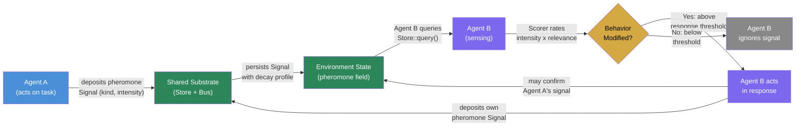
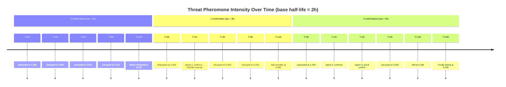
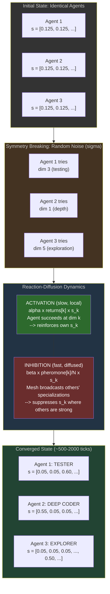
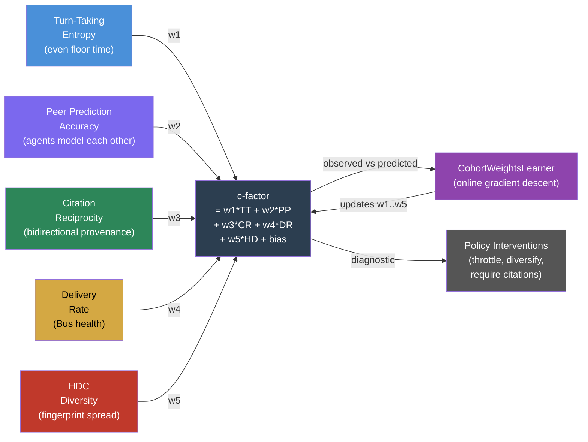

# 16 -- Coordination

> Agents coordinate through the environment, not through each other. Stigmergy
> -- indirect coordination via persistent environmental modifications -- is the
> primary mechanism. Digital pheromones provide typed, decaying signals.
> Reaction-diffusion dynamics produce emergent specialization. The c-factor
> measures whether coordination is actually working.

> **Implementation status (2026-09):** Agent groups (E28 8/8) provide
> persisted membership, four coordination modes, knowledge/pheromone/message/event
> flows, Bus publication, and privacy-filtered group prompt context. The
> pheromone system's Substrate/Bus architecture is wired: `roko-core` defines
> `PheromoneKind`, `PheromoneScope`, decay, and confirmation; `roko-fs`
> `FileSubstrate` persists pheromone Signals; the Bus announces deposits; and
> the Composer enriches agent context with ambient pheromone summaries. Group
> mesh sync, morphogenetic reaction-diffusion, niche vacancy/conflict alerting,
> and c-factor weight learning are specified but not yet wired end-to-end in
> the runner. Bucketed decay, SINR-adjusted sensing, the full interference
> matrix, and the CohortWeightsLearner remain target design.

> **Source:** `crates/roko-core/src/pheromone.rs`, `crates/roko-core/src/kind.rs`,
> `crates/roko-fs/src/file_substrate.rs`, `crates/roko-compose/src/system_prompt_builder.rs`,
> `crates/roko-learn/src/quality_judge.rs` (c-factor summary),
> `crates/roko-cli/src/runner/` (dispatch-time pheromone sensing)

### Four Coordination Modes

Roko supports four `CoordinationMode` variants (defined in
`crates/roko-core/src/groups.rs`). Each mode suits different group structures
and task types. Stigmergic is the default and the primary subject of this
chapter; the other three exist for cases where the task structure demands
explicit sequencing, simultaneous notification, or hierarchical control.

```mermaid
graph TB
    subgraph stig ["Stigmergic (default)"]
        direction LR
        SA1["Agent 1"] -->|deposits| SE["Shared<br/>Environment"]
        SE -->|senses| SA2["Agent 2"]
        SA2 -->|deposits| SE
        SE -->|senses| SA3["Agent 3"]
        SA3 -->|deposits| SE
    end

    subgraph pipe ["Pipeline"]
        direction LR
        PA1["Agent 1"] -->|output| PA2["Agent 2"]
        PA2 -->|output| PA3["Agent 3"]
        PA3 -->|output| PA4["Agent 4"]
    end

    subgraph broad ["Broadcast"]
        direction TB
        BS["Source<br/>Agent"] -->|"Pulse"| BB1["Agent 1"]
        BS -->|"Pulse"| BB2["Agent 2"]
        BS -->|"Pulse"| BB3["Agent 3"]
        BS -->|"Pulse"| BB4["Agent 4"]
    end

    subgraph leader ["LeaderFollower"]
        direction TB
        LL["Leader"] -->|assigns| LF1["Follower 1"]
        LL -->|assigns| LF2["Follower 2"]
        LL -->|assigns| LF3["Follower 3"]
        LF1 -->|reports| LL
        LF2 -->|reports| LL
        LF3 -->|reports| LL
    end

    style stig fill:#1a3a2a,color:#ccc
    style pipe fill:#1a2a3a,color:#ccc
    style broad fill:#3a2a1a,color:#ccc
    style leader fill:#2a1a3a,color:#ccc
```



| Mode | Coupling | Ordering | Failure impact | Best for |
|------|----------|----------|----------------|----------|
| **Stigmergic** | Indirect (environment) | None (async) | Graceful degradation | Open-ended exploration, large groups |
| **Pipeline** | Sequential (output->input) | Strict linear | Blocks at failed stage | Multi-phase transforms, review chains |
| **Broadcast** | One-to-many (Bus Pulse) | Simultaneous | Source failure halts flow | Announcements, collective sensing |
| **LeaderFollower** | Hierarchical (directed) | Leader-assigned | Leader is SPOF | Task delegation, supervised execution |

---

## 1. Stigmergy Theory

### What Is Stigmergy?

Stigmergy is a mechanism of indirect coordination between agents, where the
trace left in the environment by one agent's action stimulates the performance
of a subsequent action by the same or a different agent. The term was coined by
French entomologist Pierre-Paul Grasse in 1959 to describe how termites
coordinate the construction of elaborate mound structures without any
centralized plan, blueprint, or direct communication between individuals
[Grasse, P.-P. "La Reconstruction du Nid et les Coordinations
Inter-Individuelles chez Bellicositermes Natalensis et Cubitermes sp."
*Insectes Sociaux*, 6(1):41-80, 1959].

The core insight is deceptively simple: **agents do not need to communicate
with each other directly. They only need to read from and write to a shared
environment.** The environment itself becomes the coordination medium.

### Stigmergic Coordination Flow

The following diagram shows how stigmergic coordination works in Roko.
Agents never communicate directly. Instead, they deposit typed pheromone
Signals into a shared Substrate, and other agents sense those Signals to
modify their own behavior. The environment is the sole coordination medium.



### The Termite Example

Grasse observed that termites building a mound follow no central plan. Instead:

1. A termite picks up a mud pellet and deposits it at a location.
2. The deposited pellet contains a chemical pheromone that attracts other
   termites.
3. Attracted termites deposit their own pellets nearby, reinforcing the
   pheromone signal.
4. The growing pile of pellets, through its physical shape and pheromone
   concentration, guides further construction -- arches form, chambers emerge,
   ventilation shafts develop.
5. No termite has a model of the whole structure. Each termite responds to
   local stimuli.

The structure that emerges is far more complex than any individual termite
could plan. This is the hallmark of stigmergy: **simple local rules +
persistent environmental modification = complex global behavior**.

### Formal Definition

Stigmergy requires three conditions [Theraulaz, G. & Bonabeau, E. "A Brief
History of Stigmergy." *Artificial Life*, 5(2):97-116, 1999]:

| Condition | Description | Roko Equivalent |
|-----------|-------------|-----------------|
| **Shared environment** | All agents can read from and write to a common medium | Store (local Substrate), Agent Mesh (peer network), chain (global ledger) |
| **Persistent modifications** | Agent actions leave traces that outlast the agent's presence | Signals with configurable decay rates (1h--infinity) |
| **Stimulus-response coupling** | Traces in the environment trigger specific behaviors in agents that encounter them | Policy trait implementations that react to scored Signals |

When all three conditions are met, coordination emerges without any agent
needing a global view, without any central coordinator, and without agents
needing to know about each other's existence.

### Two Forms of Stigmergy

Grasse and subsequent researchers identified two distinct forms, both of which
appear in Roko's architecture [Holland, O. & Melhuish, C. "Stigmergy,
Self-Organization, and Sorting in Collective Robotics." *Artificial Life*,
5(2):173-202, 1999]:

**Sematectonic stigmergy (structure-based).** The physical structure created
by agents guides subsequent work. The product itself is the signal. In Roko,
the codebase is sematectonic stigmergy: when a coding agent writes a function,
the function's signature, its location in the module hierarchy, its
documentation, and its test coverage all constitute structural signals that
guide subsequent agents. A well-typed function with clear documentation
"invites" usage; a function with poor error handling "invites" improvement.

| Structural Feature | Signal Conveyed | Agent Response |
|-------------------|----------------|----------------|
| Empty test file | "Tests needed here" | Testing agent writes tests |
| `TODO` comment | "Incomplete implementation" | Coding agent completes it |
| Unused import | "Stale code" | Refactoring agent cleans up |
| Well-documented API | "Ready for integration" | Integration agent uses it |
| Failing CI badge | "Broken build" | Debugging agent investigates |
| Missing error handling | "Fragile code path" | Hardening agent adds handling |

**Marker-based stigmergy (signal-based).** Agents deposit explicit signals
(markers or pheromones) in the environment. These signals carry information
beyond the physical structure -- they encode urgency, type, confidence, and
decay over time. In Roko, digital pheromones -- typed Signals with explicit
`kind`, `intensity`, `scope`, and exponential decay profiles -- implement
marker-based stigmergy. When an agent detects a threat (e.g., a failing test
suite, an anomalous metric, a security vulnerability), it deposits a Threat
pheromone that other agents can sense and react to. The pheromone decays over
time (Threat signals have a 2-hour half-life), so stale threats do not
permanently distort behavior.

Key properties of marker-based stigmergy in Roko:

1. **Typed signals**: Different pheromone kinds trigger different agent
   responses (see Section 3).
2. **Exponential decay**: Signals lose intensity over time, preventing stale
   information from accumulating (see Section 2).
3. **Confirmation reinforcement**: When multiple agents deposit the same
   pheromone type at the same location, the effective half-life extends,
   making well-confirmed signals persist longer.
4. **Scope control**: Pheromones can be local (one Substrate), mesh-wide
   (one group), or global (public chain).

---

## 2. Why Stigmergy, Not Direct Communication?

Direct agent-to-agent communication (message passing, shared blackboards,
leader election) has been the dominant paradigm in multi-agent systems since
the 1980s [Hewitt, C. "Viewing Control Structures as Patterns of Passing
Messages." *Artificial Intelligence*, 8(3):323-364, 1977]. Roko uses stigmergy
instead for several fundamental reasons.

### Scalability

Direct communication scales as O(N^2) for N agents -- every agent must
potentially communicate with every other agent. Stigmergy scales as O(N x M)
where M is the number of distinct signal types (pheromone kinds), which is
bounded and small. In Roko, M = 7 universal kinds + domain extensions, so
coordination cost grows linearly with the number of agents.

| Agents (N) | Direct Comm (O(N^2)) | Stigmergy (O(N x M), M=10) |
|-----------|--------------------|-----------------------------|
| 5 | 25 channels | 50 read/writes |
| 50 | 2,500 channels | 500 read/writes |
| 500 | 250,000 channels | 5,000 read/writes |
| 5,000 | 25,000,000 channels | 50,000 read/writes |

> "Stigmergy provides a clear separation between the coordination mechanism
> and the individual agents, allowing the system to scale without modifying
> agent behavior." -- [Parunak, H.V.D. "Go to the Ant: Engineering Principles
> from Natural Multi-Agent Systems." *Annals of Operations Research*, 75:69-101,
> 1997]

This scaling advantage is not merely theoretical. Nechepurenko & Shuvalov (2026) open with the observation that multi-agent LLM systems fail in production at rates of 41-87%, most of those failures coming from coordination defects rather than base-model capability (§1, citing Cemri et al. 2025) [arXiv:2605.03310]. Stigmergy's O(N x M) scaling avoids the
coordination bottleneck that causes these failures.

### Robustness

In a direct communication system, the failure of a key node (coordinator,
leader, message broker) can paralyze the entire collective. Stigmergy is
inherently robust because the coordination state is distributed across the
environment, not concentrated in any single agent. If an agent fails:

- Its previously deposited pheromones persist and continue to guide other
  agents.
- No other agent needs to be notified of the failure.
- The pheromone field naturally adapts as the failed agent's signals decay.
- New agents joining the collective can immediately sense the current state.

This property is formalized as **graceful degradation**: the collective's
performance degrades smoothly with agent loss, rather than failing
catastrophically [Bonabeau, E., Dorigo, M. & Theraulaz, G. *Swarm
Intelligence: From Natural to Artificial Systems*. Oxford University Press,
1999].

However, shared-memory coordination mechanisms carry their own failure modes.
Margalit et al. (2026) identify four failure modes of governed shared memory: unauthorized leakage, stale propagation, contradiction persistence and provenance collapse [Margalit et al. "Governed Shared Memory for Multi-Agent LLM Systems." arXiv:2606.24535, 2026]. Roko's pheromone system covers stale propagation through exponential decay; its kind-scoped deposition and anti-saturation limits target write contention and memory bloat, which are Roko's own concerns rather than modes the paper lists.

### Asynchrony

Stigmergy is inherently asynchronous. The depositing agent and the sensing
agent do not need to be active at the same time. A pheromone deposited at
time T can influence an agent at time T + dt, where dt can be seconds,
minutes, or hours.

| Cognitive Speed | Tick Duration | Stigmergy Role |
|----------------|---------------|----------------|
| T0 (System-1, fast) | ~15 seconds | Sense ambient pheromones, react to high-intensity signals |
| T1 (System-2, deliberate) | ~60 seconds | Analyze pheromone patterns, deposit new observations |
| T2 (Reflective) | ~5 minutes | Consolidate pheromone history, emit Wisdom Signals |

An agent running at T0 speed can sense pheromones deposited by a T2 agent
hours earlier. The decoupling of production and consumption in time is a
fundamental advantage over synchronous communication protocols.

### Minimal Agent Complexity

Each agent only needs to implement two operations:

1. **Deposit**: Write a Signal to the Substrate with a pheromone kind and
   intensity.
2. **Sense**: Query the Substrate for nearby Signals above a threshold
   intensity.

The agent does not need to know how many other agents exist, what strategies
they follow, or whether they are online. In terms of the kernel traits,
deposit maps to `Store::store()`, and sense maps to `Store::query()` followed
by `Scorer::score()` to rank the sensed pheromones by relevance. The `Policy`
trait then observes the scored pheromone stream and decides whether to emit a
reactive Signal (closing the stigmergic loop).

---

## 3. Git as Stigmergy

Version control is stigmergic coordination. This is not a metaphor -- git
satisfies all three formal conditions of stigmergy:

| Condition | Git Implementation |
|-----------|-------------------|
| Shared environment | The repository (local clone, remote, forks) |
| Persistent modifications | Commits, branches, tags, merge history |
| Stimulus-response coupling | Merge conflicts trigger resolution; CI failures trigger fixes; PR reviews trigger revisions |

In a git-based workflow:

- A developer's commit is a **pheromone deposit** -- it modifies the shared
  environment (the repository) in a way that signals intent and progress to
  other developers.
- Branch names and PR titles are **typed signals** -- they encode the kind of
  work being done (`feature/`, `fix/`, `refactor/`).
- CI results are **environmental feedback** -- green checks attract merging,
  red checks repel it.
- Merge conflicts are **competitive exclusion** -- two agents that modified
  the same niche must negotiate (exactly as two ants competing for the same
  foraging trail).

Roko's plan execution extends this natural stigmergy. When `roko plan run`
creates an attempt worktree, executes agent tasks, and produces gate results,
the entire workflow is stigmergic: each completed task modifies the
repository, and subsequent tasks sense those modifications through the file
system and git state.

Simard's research on mycorrhizal networks in forests provides a biological
parallel: trees share resources through underground fungal networks, with
hub trees distributing carbon and signals to neighbors [Simard, S.W. "The
Mother Tree." Alfred A. Knopf, 2012]. Git repositories function similarly --
the repository is the fungal network, commits are the resource transfers, and
branch structure is the network topology.

---

## 4. Digital Pheromones

Digital pheromones are software analogs of the chemical pheromones used by
social insects for indirect coordination. In Roko, a digital pheromone is a
typed Signal that lives in a shared Substrate and is announced as a Pulse on
the Bus. The same coordination fact therefore has two faces in the two-fabric
model: durable storage and ephemeral announcement.

The concept was formalized by Parunak, Brueckner & Sauter (2005), who
identified the key properties that make biological pheromones effective as
coordination mechanisms and showed how to replicate them in software systems
[Parunak, H.V.D., Brueckner, S.A. & Sauter, J.A. "Digital Pheromones for
Coordination of Unmanned Vehicles." *Environments for Multi-Agent Systems*,
LNCS 3374:246-263, Springer, 2005].

Roko extends Parunak's framework with three additions:

1. **Typed pheromones**: Each pheromone has a `PheromoneKind` that determines
   its semantic meaning and default decay profile.
2. **Scoped propagation**: Pheromones propagate through one of three scopes --
   Local, Mesh, or Global -- controlling their audience and persistence.
3. **Confirmation reinforcement**: Multiple independent deposits of the same
   pheromone type extend its effective half-life, implementing a quorum-sensing
   mechanism analogous to bacterial autoinducer accumulation [Nealson, Platt &
   Hastings, *J. Bacteriology*, 1970].

### The Pheromone Struct

The primary durable object is a `Signal`. The `Pheromone` struct is an
implementation-facing view over that Signal's tags and body when the system
wants typed ergonomics. Storage stays Signal-first; live notification stays
Pulse-first.

```rust
pub struct Pheromone {
    /// The type of coordination signal.
    /// Determines default decay profile and semantic meaning.
    pub kind: PheromoneKind,

    /// Current intensity. Range: [0.0, 1.0].
    /// Starts at initial_intensity (typically 1.0) and decays
    /// exponentially. Below sensing threshold (default: 0.01),
    /// eligible for garbage collection.
    pub intensity: f64,

    /// Half-life: duration after which intensity drops to 50%.
    /// Kind-specific defaults: Threat 2h, Opportunity 4h, Wisdom 24h.
    pub decay_rate: Duration,

    /// The agent that deposited this pheromone.
    pub source: AgentId,

    /// Propagation scope:
    /// - Local(SubstrateId): agent's own store
    /// - Mesh(GroupId): visible to group members via Bus
    /// - Global: visible on chain
    pub scope: PheromoneScope,
}
```

The Signal's `tags` field carries metadata that `Store::query()` can filter:

| Tag Key | Example Value | Purpose |
|---------|--------------|---------|
| `pheromone_kind` | `"Threat"` | Filter by signal type |
| `pheromone_scope` | `"Mesh(group-42)"` | Filter by propagation scope |
| `bus_topic` | `"mesh.pheromone.deposited"` | Bus announcement topic |
| `pheromone_intensity` | `"0.87"` | Current intensity (updated on read) |
| `pheromone_confirmations` | `"3"` | Number of independent confirmations |
| `pheromone_domain` | `"code-quality"` | Domain-specific context |

### Exponential Decay

The most important property of digital pheromones is their decay over time.
Biological pheromones evaporate through chemical degradation; digital
pheromones decay through an explicit exponential function.

**The decay formula:**

```
intensity(t) = base_intensity x exp(-ln(2) x elapsed / tau_eff)
```

where:

```
tau_eff = tau_base x (1 + confirmations x 0.5)
```

This means:
- 0 confirmations: half-life = tau_base (e.g., 2 hours for Threat)
- 1 confirmation: half-life = 1.5 x tau_base (3 hours for Threat)
- 2 confirmations: half-life = 2.0 x tau_base (4 hours for Threat)
- 4 confirmations: half-life = 3.0 x tau_base (6 hours for Threat)

The constant `ln(2) = 0.693` makes the formula produce exactly 50% intensity
at t = tau_eff.

```rust
/// Compute the current intensity of a pheromone at time `now`.
///
/// Uses exponential decay with confirmation-extended half-life.
pub fn pheromone_decay(
    base_intensity: f64,
    deposited_at: Instant,
    half_life: Duration,
    confirmations: u32,
) -> f64 {
    let effective_half_life = half_life.mul_f64(1.0 + confirmations as f64 * 0.5);
    let elapsed = deposited_at.elapsed();
    let decay_factor = (-0.693 * elapsed.as_secs_f64()
        / effective_half_life.as_secs_f64()).exp();
    base_intensity * decay_factor
}
```

**Why exponential decay?**

| Property | Exponential | Linear | Step Function |
|----------|-----------|--------|---------------|
| Smoothness | Continuous, differentiable | Continuous, not differentiable at endpoint | Discontinuous |
| Recency bias | Strong initially, weakens over time | Constant rate | All-or-nothing |
| Natural interpretation | Half-life is intuitive | "Runs out in X seconds" | "Valid for X seconds" |
| Biological fidelity | Matches chemical degradation kinetics | No biological analog | No biological analog |
| Composition | Product of two exponentials = one exponential | Sum of linears = linear | Minimum of steps = step |

The exponential decay function has the memoryless property: at any point in
time, the expected remaining time until the pheromone reaches a given threshold
depends only on the current intensity, not on how long the pheromone has
already existed.

**Worked example** -- a Threat pheromone with base_intensity = 1.0, half_life =
2h, varying confirmation counts:

| Time | 0 confirmations | 1 confirmation (tau=3h) | 3 confirmations (tau=5h) |
|------|-----------------|-----------------------|------------------------|
| T+0h | 1.000 | 1.000 | 1.000 |
| T+1h | 0.707 | 0.794 | 0.871 |
| T+2h | 0.500 | 0.630 | 0.758 |
| T+3h | 0.354 | 0.500 | 0.660 |
| T+4h | 0.250 | 0.397 | 0.574 |
| T+6h | 0.125 | 0.250 | 0.435 |
| T+12h | 0.016 | 0.063 | 0.189 |
| T+24h | 0.000 | 0.004 | 0.036 |

With 3 confirmations, a Threat pheromone that would normally be negligible at
T+12h still has 19% intensity -- enough to influence agent behavior for a full
working day.

### Pheromone Decay Timeline

The following diagram shows how a Threat pheromone (2h base half-life) decays
over time. Without confirmation, intensity drops below the 0.01 sensing
threshold by T+12h. Each confirmation from an independent agent extends the
effective half-life, keeping the signal alive longer. The reinforcement
mechanism ensures that genuine, multi-agent-confirmed signals persist while
noise from individual agents decays quickly.



### Bucketed Decay for Efficiency

Computing exponential decay on every read is wasteful when thousands of
pheromones are active. Roko uses a **16-bucket decay scheme**: the continuous
intensity range [0.0, 1.0] is discretized into 16 geometric buckets. When
a pheromone crosses a bucket boundary, the system records the transition.
Queries filter by bucket rather than computing exact intensity, yielding
O(1) decay classification per pheromone instead of O(1) floating-point
exponential evaluation.

The bucket boundaries are:

```
Bucket 0:  [0.000, 0.010)  -- below sensing threshold, eligible for GC
Bucket 1:  [0.010, 0.022)
Bucket 2:  [0.022, 0.047)
Bucket 3:  [0.047, 0.100)
Bucket 4:  [0.100, 0.150)
Bucket 5:  [0.150, 0.210)
Bucket 6:  [0.210, 0.290)
Bucket 7:  [0.290, 0.380)
Bucket 8:  [0.380, 0.470)
Bucket 9:  [0.470, 0.560)
Bucket 10: [0.560, 0.650)
Bucket 11: [0.650, 0.740)
Bucket 12: [0.740, 0.820)
Bucket 13: [0.820, 0.890)
Bucket 14: [0.890, 0.950)
Bucket 15: [0.950, 1.000]
```

Geometric spacing concentrates resolution at the low end (where the sensing
threshold matters) and compresses the high end (where exact intensity matters
less than "strong").

### HDC-Based Query

When an agent queries the pheromone field, the result is ranked by a composite
score:

```
query_score = similarity(query_hdc, pheromone_hdc) x current_intensity
```

where `similarity` is the cosine similarity between the query context's HDC
fingerprint and the pheromone's HDC fingerprint, and `current_intensity` is
the decayed intensity at query time. This couples semantic relevance (what
the pheromone is about) with temporal relevance (how fresh it is).

### Confirmation Mechanics

Confirmation is the mechanism by which multiple agents reinforce a pheromone
signal. When Agent B independently deposits a pheromone of the same `kind`
and `scope` as Agent A's existing pheromone, the existing pheromone's
`confirmations` count increments and its effective half-life extends.

**Confirmation rules:**

1. **Independence**: The confirming agent must not be the original depositor.
   Self-confirmation is not counted.
2. **Same kind and scope**: The confirming deposit must match both
   `PheromoneKind` and `PheromoneScope`.
3. **Proximity**: The confirming deposit must be "near" the original in the
   Substrate's address space (same file/module for code, semantic similarity
   above threshold for knowledge).
4. **Temporal window**: The confirming deposit must occur while the original
   pheromone's intensity is above the sensing threshold (default: 0.01).
5. **Anti-spoofing**: Confirmation is weighted by the confirming agent's
   reputation score. This prevents Sybil attacks where many low-reputation
   agents artificially extend a pheromone's lifetime.

The anti-spoofing weighting formula:

```rust
pub fn effective_confirmations(
    confirmations: &[(AgentId, f64)],  // (confirmer, reputation)
) -> f64 {
    confirmations.iter()
        .map(|(_, rep)| rep.clamp(0.0, 1.0))
        .sum()
}
```

Confirmation as **quorum sensing** [Nealson, Platt & Hastings, *J.
Bacteriology*, 104(1):313-322, 1970]: individual agents deposit pheromone
Signals into the Substrate; when the confirmation count exceeds a threshold,
the pheromone's effective half-life extends significantly, making it a durable
coordination signal. This creates a natural filter: noise (false signals from
individual agents) decays quickly, while genuine signals (confirmed by
multiple independent agents) persist.

### Logarithmic Confirmation Extension

For standard (non-Alpha) kinds, the confirmation extension follows a
logarithmic curve:

```
half_life_extended = half_life_base x (1 + 0.15 x ln(1 + confirmations))
```

The logarithmic scaling ensures diminishing returns -- the first few
confirmations extend the half-life meaningfully, but a pheromone cannot live
forever through confirmation alone.

| Confirmations | Extension multiplier | Effective half-life (base = 12h) |
|---------------|---------------------|--------------------------------|
| 0 | 1.00 | 12.0h |
| 1 | 1.10 | 13.2h |
| 3 | 1.21 | 14.5h |
| 5 | 1.27 | 15.2h |
| 10 | 1.36 | 16.3h |

The `0.15` coefficient was selected so that 10 confirmations extend half-life
by ~36%, keeping even heavily-confirmed pheromones mortal.

### Pheromone Lifecycle

The complete lifecycle of a digital pheromone:

1. **Creation**: Agent deposits a pheromone Signal with kind, intensity, and
   scope.
2. **Propagation**: Based on scope -- Local stays in the agent's store, Mesh
   is published as `mesh.pheromone.deposited` via Bus, Global is replicated
   to chain.
3. **Sensing**: Other agents query the Substrate and encounter the pheromone.
4. **Scoring**: The Scorer evaluates intensity x relevance.
5. **Response**: The Router selects the highest-scored pheromone, and the
   Policy determines the agent's response.
6. **Confirmation or contradiction**: After acting, the agent may confirm
   ("verified -- it's real"), contradict ("false positive"), or extend
   ("found additional context").
7. **Decay and GC**: Intensity drops below sensing threshold (0.01), then
   GC threshold (0.001).

---

## 5. Pheromone Kinds

Every digital pheromone carries a `PheromoneKind` that determines its semantic
meaning, default decay profile, and the behavioral response it triggers.
The kind system is organized into three tiers:

1. **Universal kinds** (3): Present in every domain, every agent, every scope
2. **Domain-specific kinds** (4): Common across multiple domains but with
   domain-dependent interpretation
3. **Custom kinds** (infinity): User-defined via `Custom(String)`

The three-tier structure is inspired by the hierarchy in social insects
[Wilson, E.O. *The Insect Societies*. Belknap Press, 1971]:
- Primer pheromones (long-term physiological changes) --> Wisdom
- Releaser pheromones (immediate behavioral responses) --> Threat, Opportunity
- Informational pheromones (contextual signals) --> Alpha, Pattern, Anomaly

```rust
pub enum PheromoneKind {
    // -- Universal Kinds --
    Threat,        // 2h half-life. Alarm pheromone analog.
    Opportunity,   // 4h half-life. Recruitment pheromone analog.
    Wisdom,        // 24h half-life. Trail pheromone analog.

    // -- Domain-Specific Kinds --
    Alpha,         // 1h half-life. Ephemeral first-mover signal.
    Pattern,       // 12h half-life. Recurring structure detected.
    Anomaly,       // 6h half-life. Deviation from expected behavior.
    Consensus,     // 48h half-life. Collective agreement.

    // -- Custom Kinds --
    Custom(String), // User-defined. 1-64 chars, alphanumeric + underscore.
}
```

### Universal Kinds

**Threat** (2h half-life, initial intensity 1.0): The alarm signal. Triggers
immediate attention and prioritized response. Intensity encodes severity:
0.1-0.3 low (style violation), 0.4-0.6 medium (test flakiness), 0.7-0.8 high
(test failure, security vuln), 0.9-1.0 critical (build failure, production
vuln). When ambient Threat intensity is high, gate thresholds tighten
(collective immune response).

**Opportunity** (4h half-life, initial intensity 0.8): The recruitment signal.
Analogous to trail pheromone leading to a food source. Multiple agents may
respond to the same opportunity; first to act claims it. Subtypes via tags:
`integration_ready`, `refactoring_target`, `knowledge_gap`,
`resource_available`, `collaboration_possible`.

**Wisdom** (24h half-life, initial intensity 0.9): Validated, durable
knowledge. Wisdom pheromones typically emerge through a pipeline rather than
direct deposit: Pattern detection --> multi-agent confirmation --> operational
validation --> Wisdom deposit --> further confirmation --> promotion to
permanent Signal at 5+ confirmations.

### Domain-Specific Kinds

**Alpha** (1h half-life, initial intensity 1.0): The most ephemeral kind.
Named for the financial concept of excess return that disappears as more
participants discover it. **Alpha paradox**: unlike other kinds, confirmation
of Alpha *reduces* its value (more agents know about it):

```
tau_eff(Alpha) = tau_base x max(0.5, 1 - confirmations x 0.2)
```

| Confirmations | Multiplier | Effective half-life (base = 1h) |
|---------------|------------|-------------------------------|
| 0 | 1.0 | 60 min |
| 1 | 0.8 | 48 min |
| 2 | 0.6 | 36 min |
| 3 | 0.4 | 24 min |
| 5+ | 0.5 (floor) | 30 min |

The floor at 0.5 prevents instant evaporation -- agents that have already
committed resources need a minimum window.

**Pattern** (12h half-life, initial intensity 0.7): Recurring structure
detected. Subtypes: `code_smell`, `architecture_pattern`,
`performance_pattern`, `dependency_pattern`, `testing_pattern`.

**Anomaly** (6h half-life, initial intensity 0.8): Deviation from expected
behavior. Unlike Threat (known danger), Anomaly signals the unknown.
Anomalies resolve into Threat, Opportunity, or natural decay.

**Consensus** (48h half-life, initial intensity 0.9): Collective agreement.
The most persistent domain-specific kind. Usually emerges from confirmation
cascade, not direct deposit. Resists contradiction -- to contradict a
Consensus, an agent must deposit a Threat of equal or greater intensity with
explicit evidence.

### Promotion Cascade

The full promotion pipeline:

```
Pattern --[3+ confirmations, age > 50% half-life]--> Wisdom
Wisdom  --[4+ confirmations]------------------------> Consensus
Consensus --[5+ confirmations]----------------------> Permanent Signal (optional)
```

The `PheromonePromoter` runs as a background task inside the Curator cycle
(every 50 ticks). Promotion is idempotent: if a Wisdom with the same parent
hash already exists, the duplicate is skipped.

### Custom Kinds

Registered in `roko.toml`:

```toml
[pheromone.custom_kinds.code_coverage_gap]
half_life_secs = 28800  # 8 hours
description = "Code coverage below threshold in a module"

[pheromone.custom_kinds.model_drift]
half_life_secs = 7200   # 2 hours
description = "ML model predictions diverging from observed outcomes"
```

Custom kind identifiers must be ASCII alphanumeric + underscores, 1-64 chars,
must not collide with built-in kind names, and must not start with `_`
(reserved). Custom kinds registered by a domain plugin are scoped to that
domain's namespace -- `(domain, kind_id)` is the deduplication key.

### Pheromone-Driven Task Allocation

Beyond signaling, pheromone kinds drive emergent task allocation. Agents select
work based on the ambient pheromone gradient rather than explicit assignment,
directly inspired by division of labor in social insect colonies [Bonabeau, E.,
Theraulaz, G. & Deneubourg, J.-L. "Fixed Response Thresholds and the
Regulation of Division of Labor in Insect Societies." *Bulletin of
Mathematical Biology*, 60(4):753-807, 1998].

Each agent has a per-kind response threshold. The probability of responding
follows a sigmoid (Hill function):

```
P(respond to kind k) = I_k^n / (I_k^n + theta_k^n)
```

where I_k = current intensity, theta_k = agent's response threshold, n = Hill
coefficient (default: 2).

Thresholds adapt over time:
- Successfully responding to a kind lowers its threshold (reinforcement)
- Ignoring a kind raises its threshold (habituation)

This produces **emergent division of labor**: agents that succeed at threat
response develop lower Threat thresholds, making them more likely to respond
to future threats -- specializing as "threat responders" without explicit role
assignment.

---

## 6. Pheromone Interference and Sensing

### Interference Model

When multiple pheromone types coexist, they interfere with each other's
sensing. The interference is modeled as a signal-to-interference-plus-noise
ratio (SINR):

```
SINR_k = I_target_k / (sum_{j != k} alpha_{jk} x I_j + N_0)
```

where alpha_{jk} is the cross-kind interference coefficient.

Key design choices in the default interference matrix:
- Threat --> Opportunity: 0.6 (alarm suppresses foraging, per Wilson 1971)
- Threat --> Wisdom: 0.1 (knowledge is resistant to alarm)
- Opportunity --> Threat: 0.0 (opportunities do not mask threats)
- Consensus --> all: 0.05 (consensus is highly resistant to interference)

### Anti-Saturation

When the pheromone field becomes saturated, progressive countermeasures apply:

| Threshold | Action |
|-----------|--------|
| Soft (500 active) | Low-intensity pheromones decay 2x faster |
| Hard (2000 active) | Only pheromones with intensity > 0.1 retained |
| Per-kind cap (100/kind/scope) | Prevents any single kind from monopolizing |

### Pheromone-Enriched Context Assembly

Digital pheromones are integrated into the context assembly pipeline. When the
Composer assembles a prompt for an agent, it includes a summary of the ambient
pheromone field:

```
Agent receives task assignment
    |
Composer queries Substrate for ambient pheromones
    |
Scorer rates each pheromone by intensity x relevance
    |
Router selects top-K pheromones (default K=5)
    |
Composer formats pheromone summary into system prompt:
    "## Ambient Signals
     - [THREAT 0.73] Regression in gate pipeline (scorer NaN handling)
       -- deposited 45min ago by agent-7, confirmed by agent-12
     - [OPPORTUNITY 0.91] New API endpoint ready for integration
       -- deposited 2h ago by agent-3, 2 confirmations
     - [WISDOM 0.95] NaN scores should be clamped to 0.0
       -- deposited 6h ago by agent-7, confirmed by agents 8, 12, 15"
```

This enrichment happens automatically for every agent dispatch. The agent does
not need to explicitly request pheromone information -- it is part of the
environment, just as chemical pheromones are part of the air that biological
agents breathe.

---

## 7. Agent Mesh Sync Protocol

Pheromones propagate between agents through three scope levels:

| Scope | Environment | Persistence | Audience |
|-------|-------------|-------------|----------|
| `Local(SubstrateId)` | Agent's own Store | Infinite (until GC) | Self only |
| `Mesh(GroupId)` | Group's Agent Mesh via Bus | Configurable (hours-days) | Group members |
| `Global` | Chain (public) | Permanent (on-chain) | All agents |

**Mesh propagation** uses the Bus topic `mesh.pheromone.deposited`. When an
agent deposits a Mesh-scoped pheromone, it is published as a Pulse. Group
members subscribe to this topic and fold the pheromone into their local
Substrate view. Deduplication uses the Signal's content hash.

**Promotion gates** control upward flow: a local observation can be promoted
to Mesh scope after confidence validation (confirmation threshold), and from
Mesh to Global after collective confirmation (Consensus-level agreement).

The Mesh Memory Protocol provides a relevant reference architecture for
semantic communication layers between agents [Xu "Mesh Memory Protocol." arXiv:2604.19540, 2026]. Roko's Bus-based mesh sync achieves
similar goals through the pheromone-specific propagation model.

---

## 8. Morphogenetic Specialization

### The Problem: Identical Agents, Redundant Work

When a group starts with identically configured agents, all agents pursue
the same strategies, compete for the same tasks, and produce redundant work.
This is the **niche crowding problem**.

The solution comes from developmental biology. Alan Turing's
reaction-diffusion mechanism [Turing, A.M. "The Chemical Basis of
Morphogenesis." *Philosophical Transactions of the Royal Society B*,
237(641):37-72, 1952] explains how initially identical cells differentiate
into specialized tissues during embryonic development.

### Turing's Reaction-Diffusion

In 1952, Turing showed that a system of two chemicals -- an **activator**
and an **inhibitor** -- can produce stable spatial patterns from a uniform
initial state, provided:

1. The activator amplifies itself and the inhibitor (positive feedback locally)
2. The inhibitor suppresses the activator (negative feedback)
3. **The inhibitor diffuses faster than the activator** (D_B >> D_A)

Gierer & Meinhardt formalized this as the activator-inhibitor model [Gierer,
A. & Meinhardt, H. "A Theory of Biological Pattern Formation." *Kybernetik*,
12(1):30-39, 1972]:

```
da/dt = rho_a x (a^2 / h) - mu_a x a + D_a x nabla^2 a + sigma_a    (activator)
dh/dt = rho_h x a^2       - mu_h x h + D_h x nabla^2 h + sigma_h    (inhibitor)
```

where a = activator concentration, h = inhibitor concentration, rho =
production rate, mu = decay rate, D = diffusion coefficient, sigma = noise.

The instability condition (Turing instability) requires: D_h / D_a >> 1.

### Mapping to Agent Collectives

| Biological Component | Roko Equivalent |
|---------------------|-----------------|
| Activator | Profitable returns for a strategy dimension -- local, slow (hundreds of ticks) |
| Inhibitor | Collective-wide pheromone signals showing others' specializations -- fast via Mesh (milliseconds) |
| Diffusion asymmetry | Learning is slow (individual experience) but inhibition is fast (pheromone sync) |
| Noise (sigma) | Small random perturbations to break initial symmetry |
| Spatial pattern | Role differentiation -- each agent specializes in a different dimension |

Because inhibition propagates through the Agent Mesh in milliseconds while
activation requires hundreds of ticks of experience, **Turing's instability
condition is naturally satisfied.** Stable specialist patterns emerge from
homogeneous populations without central role assignment.

### Reaction-Diffusion Pattern Formation

The following diagram shows how Turing's reaction-diffusion mechanism
produces specialization from initially identical agents. The key asymmetry
is that inhibition (pheromone propagation through the Mesh) diffuses faster
than activation (individual learning from task returns), satisfying Turing's
instability condition and driving agents apart in strategy space.



The critical ratio is **beta/alpha >= 2.5** (super-critical regime). At the
default ratio of 3.0, inhibition is strong enough relative to activation that
agents reliably differentiate. Below 1.5, all agents collapse onto the same
strategy; above 10.0, inhibition dominates so completely that no dimension
can accumulate activation.

### The Strategy Concentration Vector

Each agent maintains an 8-dimensional strategy concentration vector:

```rust
pub const STRATEGY_DIMS: usize = 8;

pub struct MorphogeneticState {
    /// 8-dimensional strategy vector. Values in [0,1], sum to 1.0.
    /// Generalist: each ~0.125. Specialist: high in 1-2 dimensions.
    pub strategy: [f64; STRATEGY_DIMS],
    /// Per-dimension returns since last update.
    pub attributed_returns: [f64; STRATEGY_DIMS],
    /// Aggregated strategy vectors from all group members.
    pub collective_pheromone: [f64; STRATEGY_DIMS],
    /// Number of agents in the group.
    pub collective_size: usize,
}
```

The 8 default dimensions are domain-agnostic: depth, breadth, execution,
verification, time_horizon, exploration, exploitation, coordination.

Domain plugins can redefine these:
- Code: refactoring, feature_dev, testing, docs, perf, security, deps, arch
- DeFi: momentum, mean_reversion, lp, risk, time_horizon, asset_breadth,
  vol, cross_chain

**Specialization index** (normalized Shannon entropy):

```
specialization_index = 1 - H(s) / H_max
```

where H(s) = -sum s_k x ln(s_k), H_max = ln(STRATEGY_DIMS). Returns 0.0 for
maximum generalization (uniform), 1.0 for maximum specialization (all
concentration in one dimension).

### The Reaction-Diffusion Update Rule

Every 50 ticks (aligned with Curator cycle), each agent updates its strategy
vector:

```
s_k(t+1) = s_k(t) + activation_k - inhibition_k - decay_k + noise_k
```

where:

```
activation_k = alpha x resource_pressure_scalar x max(0, returns[k]) x s_k
inhibition_k = beta x (pheromone[k] / collective_size) x s_k
decay_k      = mu x (s_k - baseline)
noise_k      ~ N(0, sigma_noise^2)
```

After update, the vector is renormalized to sum to 1.0.

**Default parameters:**

| Parameter | Default | Role |
|-----------|---------|------|
| alpha | 0.05 | Activation rate (slow, local) |
| beta | 0.15 | Inhibition rate (fast, diffused). Must be > alpha for Turing instability |
| mu | 0.01 | Decay toward baseline (prevents extreme lock-in) |
| sigma_noise | 0.005 | Symmetry-breaking perturbations |
| baseline | 0.125 | 1/STRATEGY_DIMS |
| resource_pressure_scalar | 1.0 | Modulates activation based on resource state |

With beta = 3 x alpha, inhibition ensures an agent's specialization is
suppressed in dimensions where other members are already concentrated,
pushing agents apart in strategy space.

### Convergence Analysis

From homogeneous initial conditions, the dynamics typically converge in
500-2000 ticks:

| Group Size | Typical Convergence | Specialist Patterns |
|-----------|--------------------|--------------------|
| 2 agents | ~500 ticks | 2 complementary specialists |
| 5 agents | ~800 ticks | 3-5 specialists (some overlap) |
| 10 agents | ~1200 ticks | 5-8 specialists |
| 20 agents | ~1800 ticks | 8 specialists (all dimensions covered) |

**Stability condition:** Variance(strategy) = sum_k (s_k(t) - s_k(t-50))^2 < 0.01 for 100 consecutive ticks.

**Convergence guarantee:** For beta/alpha >= 2.0 and collective_size <= 50,
the system converges with probability > 0.99 within 3000 ticks (validated
through Monte Carlo simulation: 10,000 runs per parameter setting).

**Bifurcation regimes:**

| Regime | beta/alpha | Behavior |
|--------|-----------|----------|
| Sub-critical | < 1.5 | No stable patterns; all agents lock into same dimension |
| Critical | 1.5-2.5 | Metastable; slow convergence, sensitive to noise |
| Super-critical | > 2.5 | Stable patterns emerge reliably from noise (target regime) |
| Over-damped | > 10.0 | Inhibition dominates; no differentiation |

The default ratio (3.0) sits in the super-critical regime.

### Turing Instability Condition for Roko

The homogeneous steady state is unstable (patterns form) when:

```
alpha x R_k x rho > beta x P_k / N + mu
```

for at least one dimension k. This is the formal condition that activation
(returns-driven reinforcement) must exceed inhibition (collective pressure)
plus decay.

### Niche Competition, Vacancy, and Conflict

**Niche competition** measures how many other agents occupy a similar role
(cosine similarity > 0.8 in strategy space). Based on Lotka-Volterra
competition dynamics.

**Niche vacancy alerts** fire when an agent departs and its specialist
dimensions (concentration > 0.3) have no other agent with concentration >
0.2. Alerts propagate via Bus at Critical priority, triggering accelerated
respecialization:

```
acceleration = base_factor x 2^(-ticks_since_vacancy / decay_duration)
```

Default base_factor: 3.0 (triple activation rate for vacant dimensions).
Default decay_duration: 500 ticks.

**Role conflict alerts** fire when two agents' vectors have cosine similarity
> 0.9 for > 100 consecutive ticks. The lower-specialization agent receives a
bias toward the most vacant dimension.

### Domain-Specific Calibration

| Domain | alpha | beta | mu | sigma_noise | Rationale |
|--------|-------|------|----|-------------|-----------|
| Code (default) | 0.05 | 0.15 | 0.01 | 0.005 | Standard feedback loop |
| DeFi/Chain | 0.10 | 0.25 | 0.02 | 0.003 | Fast feedback, strong signal |
| Research | 0.03 | 0.10 | 0.005 | 0.008 | Slow feedback, more exploration |
| Operations | 0.04 | 0.12 | 0.008 | 0.005 | Conservative for production |

---

## 9. Permissioned Subnets

Not all coordination signals should propagate to all agents. Permissioned
subnets partition the pheromone field into access-controlled regions:

- **Group-scoped pheromones**: Visible only to members of a specific group
  (E28 agent groups). The Bus enforces subscription-level access control.
- **Domain-scoped custom kinds**: Custom pheromones registered by a domain
  plugin are invisible to agents in other domains.
- **Capability-gated sensing**: An agent must hold a specific capability to
  sense certain pheromone kinds. For example, security-related pheromones
  (Custom("cve_published")) may require a `security_audit` capability.
- **Privacy-filtered context**: When the Composer includes pheromone summaries
  in agent prompts, it applies the group's privacy filter (E28) to exclude
  signals the agent should not see.

---

## 10. Stigmergy Scaling Analysis

### Information-Theoretic Channel Capacity

A stigmergic system can be modeled as a noisy communication channel where
agents are both transmitters and receivers, and the shared environment is the
channel medium.

The effective channel capacity of a pheromone field is bounded by three
factors:

1. **Field saturation**: Too many pheromones degrade the signal-to-noise ratio.
2. **Decay rate**: Faster decay clears the channel faster (higher throughput)
   but reduces persistence.
3. **Confirmation overhead**: Each confirmation extends half-life, consuming
   capacity by keeping old signals alive.

The capacity can be approximated as:

```
C_stigmergy = M x R_gc x log_2(1 + I_signal / I_noise)
```

where M = number of distinguishable pheromone kinds (channel multiplexing),
R_gc = effective garbage collection rate, I_signal = intensity of target
pheromone, I_noise = aggregate intensity of non-target pheromones at the
same scope.

```rust
pub fn stigmergic_channel_capacity(
    kind_count: usize,
    avg_signal_intensity: f64,
    avg_noise_intensity: f64,
    gc_rate_per_tick: f64,
) -> f64 {
    if avg_noise_intensity <= 0.0 || gc_rate_per_tick <= 0.0 {
        return 0.0;
    }
    let snr = avg_signal_intensity / avg_noise_intensity;
    kind_count as f64 * gc_rate_per_tick * (1.0 + snr).log2()
}
```

### Entropy Rate

The entropy rate of the pheromone field measures the information content
generated per unit time. A healthy stigmergic system has a moderate entropy
rate:

- **Too low**: The field is static -- echo chamber, no new coordination
  information.
- **Too high**: The field is chaotic -- signals change too rapidly for agents
  to respond.
- **Optimal**: The field evolves at a rate matched to the agents' sensing and
  response timescales.

This connects to the edge-of-chaos operating point [Kauffman, S. *The Origins
of Order*. Oxford University Press, 1993]: systems at the boundary between
order and chaos have maximal computational capacity.

### Transfer Entropy

Transfer entropy [Schreiber, T. "Measuring Information Transfer." *Physical
Review Letters*, 85(2):461-464, 2000] quantifies directed causal information
flow through the stigmergic medium:

```
T_{A->B} = sum p(b_{t+1}, b_t, a_t) x log_2( p(b_{t+1} | b_t, a_t) / p(b_{t+1} | b_t) )
```

High T_{A->B} indicates that Agent A's pheromone deposits causally influence
Agent B's behavior -- the stigmergic loop is working. Low transfer entropy
in both directions indicates agents are operating independently despite
sharing an environment.

| Mechanism | Latency | Scalability | Robustness | Persistence |
|-----------|---------|-------------|------------|-------------|
| Direct messaging | Low | O(N^2) | Fragile | None |
| Blackboard | Medium | O(N) | Moderate (SPOF) | Until cleared |
| Pub-sub | Low | O(N x topics) | Moderate (broker) | Until consumed |
| **Digital pheromones** | Low-Medium | **O(N x M)** | **High** | **Configurable decay** |
| Consensus protocols | High | O(N^2) or O(N log N) | High (BFT) | Permanent |

---

## 11. Exponential Flywheel

> **Status (2026-09-29): a hypothesis the evidence does not support.** No
> measurement shows Roko improving superlinearly, and recent studies argue against
> expecting it:
> of three agent optimizers, only the one with regression control built into its loop kept improving on new tasks (Wang, Kattakinda and Feizi 2026, arXiv:2607.14004), self-improvement results depend on task order and
> amplify noise (Ye et al. 2026, arXiv:2608.18066), and harness evolution does not
> consistently beat matched test-time scaling (Wang et al. 2026, arXiv:2607.12227).
> The defensible goal is bounded, audited improvement with rollback. The loops below
> are kept as design material.

The original design goal was for Roko to improve **superlinearly** with accumulated
usage, deployment count, and connected data: an exponential flywheel, which the design
expected only when the feedback loops are wired deliberately, with linear growth or
stagnation otherwise.

### The Seven Loops

| Loop | What compounds | Coordination effect |
|---|---|---|
| Demurrage-weighted retrieval | Usage calibrates attention cost and reward | Keeps what is unique and useful instead of letting memory bloat dominate retrieval quality |
| Heuristic calibration | More trials tighten uncertainty | Each episode becomes a better test of the worldview and a better input to policy |
| HDC codebook cleanup | More exemplars improve similarity | Retrieval, clustering, and analogy get cleaner as the codebook grows |
| c-factor feedback | Better cohort process improves output quality | Cohort dynamics become a measured input to policy |
| Playbook distillation | Episodes compress into reusable playbooks | The system learns how to learn, lowering the cost of each later improvement |
| Cross-deployment heuristic commons | Imported heuristics create shared calibration | Every deployment contributes at near-zero marginal cost |
| Plugin ecosystem | Each plugin increases the value of the system | The interface becomes a platform if it stays narrow, stable, composable |

FederatedSkill [Yang et al. "FederatedSkill." arXiv:2606.03143, 2026] supports the cross-deployment loop: clients share semantic skill diffs (structured patches) instead of raw trajectories, and this gave up to 44.4% higher success rates than self-evolving baselines across 20 task families (abstract, §5.2), suggesting that Roko's heuristic commons design is well-founded.

### North-Star Metric

**Mean time to first successful PR on a new codebase.** This metric depends
on all seven loops: better priors, better retrieval, better coordination,
better compression, better tooling, better self-awareness.

### Anti-Metrics

- Warm-tier episode count should reach a steady state, not grow unbounded.
- Heuristics with fewer than three confirmations should shrink over time.
- Mean lineage depth per response should not increase unless quality improves.

If any rise without corresponding quality gains, the flywheel is being
simulated instead of earned.

### Failure Modes

- **Echo chambers**: positive feedback reinforces wrong beliefs. Counter with
  outsiders, explicit falsifiers, sampled disagreement.
- **Reward hacking**: optimizing c-factor directly prefers easy work. Keep the
  objective on task quality sampled by difficulty.
- **Premature convergence**: high-confidence heuristics stop facing challenge.
  Use importance sampling and boundary tests.
- **Substrate bloat**: retention without demurrage overwhelms the working set.
- **Commons drift**: imported heuristics lose fit across deployments. Require
  local revalidation.
- **Benchmark illusion**: synthetic tests that reset state hide compounding.
  Measure across sessions with preserved substrate.

---

## 12. Collective Intelligence Metrics

### The c-factor

The central idea is Woolley et al.'s collective intelligence factor, adapted
to Roko's runtime [Woolley, A.W. et al. "Evidence for a Collective
Intelligence Factor in the Performance of Human Groups." *Science*,
330(6004):686-688, 2010]. The c-factor is a diagnostic covariate, not a blind
optimization target. It measures whether a cohort is coordinating in a way
that improves outcomes over time.

### Five-Axis CohortMetrics

```rust
pub struct CohortMetrics {
    pub turn_taking_entropy: f64,      // [0, 1] -- even distribution of turns
    pub peer_prediction_accuracy: f64, // [0, 1] -- agents predict each other
    pub citation_reciprocity: f64,     // [0, 1] -- bidirectional citation flow
    pub delivery_rate: f64,            // [0, 1] -- Bus health
    pub hdc_diversity: f64,            // [0, 1] -- fingerprint spread
}
```

**Turn-taking entropy:** Normalized Shannon entropy of Pulse authorship
within a cohort window. High entropy means no single agent monopolizes the
floor.

**Peer prediction accuracy:** Each agent can emit a `peer.prediction` Pulse
encoding what it expects another agent to say. Accuracy is the fraction of
predictions within accepted tolerance.

**Citation reciprocity:** Measures whether the cohort uses the provenance
chain as a working memory network. Reciprocity rises when Agent A cites
Agent B and Agent B later builds on the same artifact.

**Delivery rate:** Proportion of intended Bus deliveries that arrive.
Drops due to backpressure, auth failure, or transport failure lower the rate.

**HDC diversity:** How spread out the cohort's Signal fingerprints are in HDC
space. Cohorts with collapsed fingerprints converge too early.

### Five Components of the c-factor

The c-factor is a weighted sum of five observable metrics, each measuring a
different aspect of collective coordination health. The weights are learned
online from cohort outcomes, not hardcoded. Different task families can
legitimately produce different weight distributions.



Each axis has a clear failure mode and a corresponding policy response:

| Axis | Healthy range | Failure signal | Intervention |
|------|--------------|----------------|--------------|
| Turn-Taking Entropy | > 0.7 | One agent monopolizes | Throttle dominant, soften routing |
| Peer Prediction Accuracy | > 0.5 | Agents do not model peers | Route into calibration pairs |
| Citation Reciprocity | > 0.3 | No provenance network | Require citation trails |
| Delivery Rate | > 0.95 | Bus backpressure or auth failures | Inspect transport health |
| HDC Diversity | > 0.4 | Fingerprint collapse | Diversify prompts and tools |

### Computing the c-factor

```rust
pub fn c_factor(m: &CohortMetrics, w: &CohortWeights) -> f64 {
    w.turn_taking_entropy * m.turn_taking_entropy
        + w.peer_prediction_accuracy * m.peer_prediction_accuracy
        + w.citation_reciprocity * m.citation_reciprocity
        + w.delivery_rate * m.delivery_rate
        + w.hdc_diversity * m.hdc_diversity
        + w.bias
}
```

Weights are learned from cohort outcomes via online gradient descent, not
hardcoded. Different task families can legitimately induce different weight
shapes. The CohortWeightsLearner subscribes to `cohort.completed` Bus topic
and updates weights using the prediction error against observed outcome score.

AgentReputation [Chishti et al. "AgentReputation." arXiv:2605.00073, FSE 2026]
provides a complementary approach: context-conditioned reputation scoring
where agent trustworthiness depends on the specific task type, not a single
global score. This aligns with Roko's per-kind response thresholds and
domain-scoped pheromone weight learning.

### Groupthink Countermeasures

1. **Devil's-advocate Pulse**: Policy spawns a deliberately opposing Pulse
   when diversity or reciprocity falls below threshold.
2. **Outsider injection**: Route the task through an agent with low lineage
   overlap.
3. **Minority report preservation**: Keep dissenting Signals alive longer
   than the majority trail.
4. **WisdomGate refusal**: If inputs are too narrow, refuse to finalize the
   consensus Signal and ask for wider evidence.

### Policy Interventions

The operational rule: observe c-factor and outcome together. If c-factor
drops and outcomes also drop, intervene. If c-factor drops but outcomes stay
stable, log and do not perturb.

| Condition | Policy Response |
|-----------|----------------|
| Low turn-taking entropy | Soften top-1 routing, throttle dominant senders |
| Low peer prediction accuracy | Route agents into calibration pairs |
| Low citation reciprocity | Require stronger citation trails before consensus |
| Low delivery rate | Inspect Bus backpressure and auth failures |
| Low HDC diversity | Diversify prompts, tools, or agent selection |

---

## 13. Grossman-Stiglitz Paradox and Pheromone Economics

A fundamental challenge in any information-sharing system is the
Grossman-Stiglitz paradox: if information is freely available, no agent has
an incentive to incur the cost of producing it [Grossman, S.J. & Stiglitz,
J.E. "On the Impossibility of Informationally Efficient Markets." *American
Economic Review*, 70(3):393-408, 1980].

Roko resolves this through four natural properties:

1. **Decay creates scarcity**: Pheromones decay exponentially. Information
   freely sensed yesterday may no longer be available today. Fresh signals
   provide genuine value.
2. **Confirmation extends value**: Confirming another agent's pheromone is a
   cooperative act that benefits both the confirmer (stronger signal) and the
   collective (more persistent knowledge).
3. **Reputation tracks contribution**: Agents producing high-quality pheromones
   (confirmed rather than contradicted) accumulate reputation, affecting
   routing priority and resource allocation.
4. **Domain scoping prevents free-riding**: Pheromones are scoped to specific
   domains. An agent must be active in a domain to sense its pheromones.

---

## 14. Research Frontier

### Latent-Space Communication

LatentMAS [Zou et al. "Latent Collaboration in Multi-Agent Systems." arXiv:2511.20639, ICML 2026 Spotlight]
demonstrates that agents can communicate through compressed latent-space
representations rather than natural language, with up to 14.6% higher accuracy, 70.8-83.7% fewer output tokens and 4-4.3x faster end-to-end inference (abstract, §4). This represents a frontier for evolving pheromone
communication: instead of typed textual pheromones, future systems could
deposit and sense compressed vector representations, dramatically increasing
the bandwidth of the stigmergic channel while reducing token cost.

### Semantic Skill Diffs

FederatedSkill [Yang et al. arXiv:2606.03143, 2026] shows that semantic skill diffs -- structured patches over each client's skill library -- gave up to 44.4% higher success rates than self-evolving baselines (§5.2). This validates Roko's
cross-deployment heuristic commons loop and suggests that the pheromone system
could evolve to transport skill diffs as a first-class pheromone kind.

### Coordination Failure Dominance

Nechepurenko & Shuvalov [arXiv:2605.03310, 2026] cite production failure rates of 41-87% for multi-agent systems, mostly from coordination defects (§1, after Cemri et al. 2025), and argue for treating coordination as a configurable architectural layer (§3). This supports the design decision to make coordination a first-class architectural
layer rather than an emergent property. Roko's explicit pheromone system,
morphogenetic specialization, and c-factor monitoring address precisely the
failure modes identified in that work.

### Governed Shared Memory

Margalit et al. [arXiv:2606.24535, 2026] identify four failure modes in shared-memory multi-agent systems: unauthorized leakage, stale propagation, contradiction persistence and provenance collapse. They measure one production service (MemClaw) against them rather than comparing with baselines (abstract). Roko's pheromone decay addresses stale propagation; the paper does not evaluate Roko's design.

### Mesh Memory Protocol

Xu [arXiv:2604.19540, 2026] specifies a semantic layer for cross-session agent-to-agent collaboration: each agent accepts peers' claims field by field, every claim carries its lineage back to its source, and memory is filtered when it is written (§3). The paper stresses that its schema is not a routing or transport layer (§3.1). Roko's pheromone system
achieves similar goals through HDC-based query scoring, where semantic
similarity determines which pheromones an agent senses.

### Context-Conditioned Reputation

AgentReputation [Chishti et al. arXiv:2605.00073, FSE 2026] argues, as a framework proposal without an evaluation (§3, §4), that
agent trustworthiness should be context-conditioned -- an agent reliable at
code review may be unreliable at architecture decisions. This aligns with
Roko's per-kind response thresholds and per-domain pheromone weight learning.

---

## 15. The Stigmergic Loop

The complete stigmergic loop in Roko:

```
Agent A acts --> deposits pheromone Signal to Substrate
    |
Signal propagates (Local --> Mesh --> Global based on scope)
    |
Agent B queries Substrate --> senses pheromone
    |
Scorer rates pheromone intensity and relevance
    |
Router selects highest-priority pheromone signal
    |
Agent B acts in response --> deposits its own pheromone Signal
    |
(cycle continues -- emergent coordination without direct communication)
```

This loop is isomorphic to Roko's universal cognitive loop (query --> score
--> route --> compose --> act --> verify --> write --> react), with pheromone
Signals serving as the coordination substrate.

---

## Verification Commands

```bash
# Verify pheromone types exist
grep -rn 'PheromoneKind\|PheromoneScope' crates/roko-core/src/ --include='*.rs' | grep -v target/

# Verify Substrate stores pheromones
grep -rn 'pheromone' crates/roko-fs/src/ --include='*.rs' | grep -v target/

# Verify c-factor computation exists
grep -rn 'CFactorSummary\|c_factor\|cfactor' crates/roko-learn/src/ --include='*.rs' | grep -v target/

# Verify group coordination (E28)
grep -rn 'GroupCoordination\|CoordinationMode\|pheromone' crates/roko-core/src/ --include='*.rs' | grep -v target/ | head -20

# Verify pheromone-enriched context
grep -rn 'pheromone\|ambient' crates/roko-compose/src/ --include='*.rs' | grep -v target/

# Verify morphogenetic types
grep -rn 'morphogen\|MorphogeneticState\|STRATEGY_DIMS' crates/ -r --include='*.rs' | grep -v target/

# Verify agent mesh sync
grep -rn 'mesh.*pheromone\|pheromone.*mesh\|MeshBus' crates/ -r --include='*.rs' | grep -v target/

# Run coordination-related tests
cargo test --workspace -q 2>&1 | grep -i 'pheromone\|c_factor\|morpho\|stigmer'
```

---

## Depth Files

This chapter decomposes into ~13 depth files in `docs/v3/depth/16-coordination/`:

| # | File | What It Covers |
|---|------|----------------|
| 01 | `stigmergy-theory.md` | Grasse 1959, formal definition, two forms, Grossman-Stiglitz paradox |
| 02 | `stigmergy-beyond-termites.md` | ACO (Dorigo & Gambardella 1997), swarm intelligence, distributed systems |
| 03 | `git-as-stigmergy.md` | Version control as stigmergic environment, mycorrhizal parallel (Simard 2012) |
| 04 | `digital-pheromones.md` | Pheromone struct, decay formula, confirmation, lifecycle |
| 05 | `bucketed-decay.md` | 16-bucket geometric scheme, HDC-based query scoring |
| 06 | `pheromone-kinds.md` | 3 universal + 4 domain + Custom, Alpha paradox, promotion cascade |
| 07 | `pheromone-interference.md` | SINR model, interference matrix, anti-saturation, response thresholds |
| 08 | `pheromone-scope.md` | Local/Mesh/Global, promotion gates, mesh sync protocol |
| 09 | `morphogenetic-specialization.md` | Turing R-D, strategy vector, update rule, convergence, bifurcation |
| 10 | `niche-dynamics.md` | Niche competition (Lotka-Volterra), vacancy alerts, conflict resolution |
| 11 | `stigmergy-scaling.md` | Channel capacity, entropy rate, transfer entropy, comparison table |
| 12 | `exponential-flywheel.md` | Seven loops, north-star metric, anti-metrics, failure modes |
| 13 | `collective-intelligence.md` | c-factor (Woolley 2010), five axes, weight learning, groupthink countermeasures |

---

## References

### Foundational

- [Grasse 1959] "La Reconstruction du Nid." *Insectes Sociaux*, 6(1):41-80.
  Original stigmergy observation in termite mound construction.
- [Turing 1952] "The Chemical Basis of Morphogenesis." *Phil. Trans. Royal
  Society B*, 237(641):37-72. Reaction-diffusion mechanism for pattern
  formation.
- [Shannon 1948] "A Mathematical Theory of Communication." *Bell System
  Technical Journal*, 27(3):379-423. Information-theoretic framework.
- [Woolley et al. 2010] "Evidence for a Collective Intelligence Factor."
  *Science*, 330(6004):686-688. c-factor in human groups.

### Swarm Intelligence and Stigmergy

- [Dorigo, M. & Gambardella, L.M. 1997] "Ant Colony System: A Cooperative
  Learning Approach to the Traveling Salesman Problem." *IEEE Trans.
  Evolutionary Computation*, 1(1):53-66.
- [Parunak, H.V.D. 1997] "Go to the Ant." *Annals of Operations Research*,
  75:69-101.
- [Parunak, Brueckner & Sauter 2005] "Digital Pheromones for Coordination."
  *E4MAS*, LNCS 3374:246-263.
- [Bonabeau, Dorigo & Theraulaz 1999] *Swarm Intelligence: From Natural to
  Artificial Systems*. Oxford University Press.
- [Holldobler, B. & Wilson, E.O. 2008] *The Superorganism*. W.W. Norton.
- [Camazine, S. et al. 2001] *Self-Organization in Biological Systems*.
  Princeton University Press.

### Biology and Ecology

- [Simard, S.W. 2012] *The Mother Tree*. Alfred A. Knopf. Mycorrhizal
  network resource sharing.
- [Gierer & Meinhardt 1972] "A Theory of Biological Pattern Formation."
  *Kybernetik*, 12(1):30-39.
- [Wilson, E.O. 1971] *The Insect Societies*. Belknap Press.
- [Nealson, Platt & Hastings 1970] "Cellular Control of the Synthesis and Activity
  of the Bacterial Luminescent System." *J. Bacteriology*, 104(1):313-322. Quorum sensing.

### Multi-Agent Systems (2025-2026 Research)

- [Zou et al. 2025] "Latent Collaboration in Multi-Agent Systems." arXiv:2511.20639 (ICML 2026 Spotlight).
  Latent-space agent communication: up to 14.6% higher accuracy, 4-4.3x faster inference.
- [Yang et al. 2026] "FederatedSkill." arXiv:2606.03143. Semantic skill diffs for federated skill evolution: up to 44.4% higher success than self-evolving baselines.
- [Nechepurenko & Shuvalov 2026] "Coordination as an Architectural Layer for LLM-Based Multi-Agent Systems." arXiv:2605.03310. Production failure rates of 41-87%, mostly coordination defects (§1, citing Cemri et al. 2025).
- [Margalit et al. 2026] "Governed Shared Memory for Multi-Agent LLM Systems." arXiv:2606.24535. Failure modes
  in shared-memory multi-agent systems.
- [Xu 2026] "Mesh Memory Protocol." arXiv:2604.19540. Semantic
  communication layer for agent coordination.
- [Zhang et al. 2026] "AgentReputation." arXiv:2605.00073 (FSE 2026).
  Context-conditioned reputation scoring.

### Information Theory and Stability

- [Schreiber 2000] "Measuring Information Transfer." *Physical Review Letters*,
  85(2):461-464. Transfer entropy.
- [Kauffman 1993] *The Origins of Order*. Oxford University Press. Edge of
  chaos.
- [Cross & Hohenberg 1993] "Pattern Formation Outside of Equilibrium."
  *Reviews of Modern Physics*, 65(3):851-1112. Bifurcation theory.
- [Grossman & Stiglitz 1980] "On the Impossibility of Informationally
  Efficient Markets." *AER*, 70(3):393-408.

---

## Cross-References

- [01-SIGNAL](01-SIGNAL.md) -- Signal struct, decay, HDC fingerprints
- [17-GROUPS](17-GROUPS.md) -- Agent group membership, 4 coordination modes,
  privacy filtering
- [08-LEARNING](08-LEARNING.md) -- Playbook distillation, heuristic
  calibration, c-factor integration
- [09-MEMORY](09-MEMORY.md) -- Demurrage-weighted retrieval, knowledge tier
  progression
- [10-DREAMS](10-DREAMS.md) -- Dream consolidation compression loop
- [12-SAFETY](12-SAFETY.md) -- Capability-gated pheromone sensing, trust-origin
  taint tracking
- [13-TELEMETRY](13-TELEMETRY.md) -- Lens executors for pheromone field
  observation
- [18-CONNECTIVITY](18-CONNECTIVITY.md) -- Relay transport for cross-workspace
  pheromone propagation
- [19-TOOLS-PLUGINS](19-TOOLS-PLUGINS.md) -- Plugin ecosystem flywheel loop
- [35-ARCHITECTURE](35-ARCHITECTURE.md) -- Universal cognitive loop,
  kernel traits
