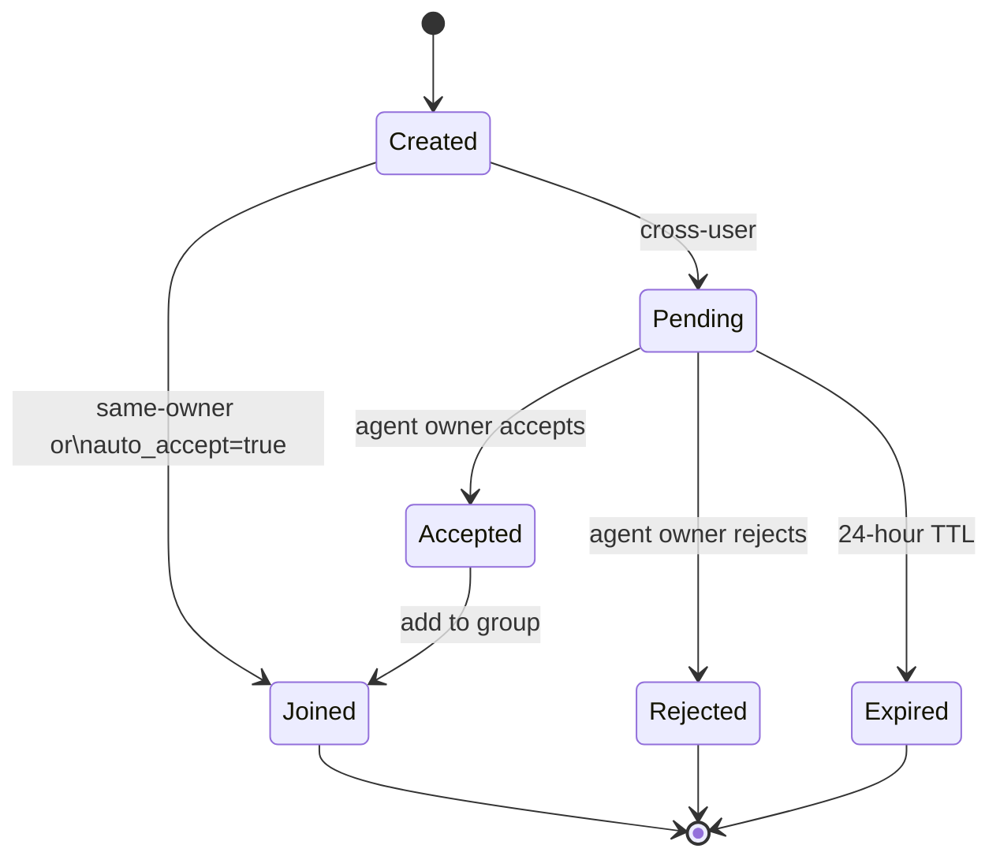
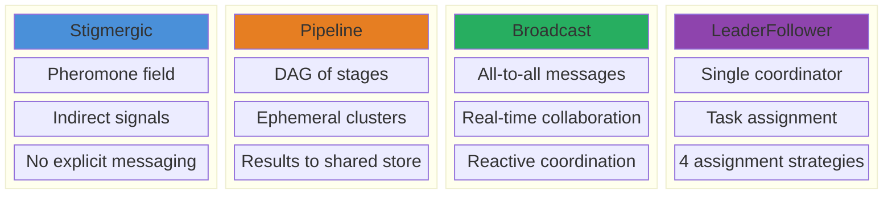

# 17 -- Agent Groups

> Persistent agent collectives as Space specializations. A group owns a Bus
> partition, a Store partition, and a membership boundary. Four coordination
> modes (Stigmergic, Pipeline, Broadcast, LeaderFollower) define how agents
> interact within the shared Space. Membership flows through an invitation
> protocol with cross-user support. Privacy-filtered group context enters
> agent prompts via the VCG auction.

> **Implementation status (2026-09):** COMPLETE against the E28 manifest
> (8/8). Core contracts, restart-durable group state, membership/invitations,
> scoped knowledge, pheromone fields with exponential demurrage, typed Bus
> publication (16 event types across 4 sub-rooms), `[[groups]]` TOML
> reconciliation, authenticated HTTP routes with typed RBAC and per-group
> ownership/permission checks, and membership-gated prompt context are live.
> Cluster execution, remote relay auto-subscription/notification, on-chain
> registration, and dashboard surfaces remain follow-up work.

> **Source:** `crates/roko-core/src/groups.rs`,
> `crates/roko-serve/src/group_runtime.rs`,
> `crates/roko-serve/src/routes/groups.rs`,
> `crates/roko-compose/src/group_context_bidder.rs`,
> `crates/roko-cli/src/dispatch/prompt_builder.rs`

---

## 1. Group Primitive

A **Group** is a Space specialization: a persistent, named collection of
agents with shared identity, a Bus partition (relay room), a Store partition
(knowledge store), and optional on-chain registration. Groups outlive
individual tasks. An agent joins a group and stays until it leaves or is
removed. Groups accumulate shared knowledge and pheromone fields over time.

### 1.1 Kernel Decomposition

```
Group = Space + Membership + CoordinationMode

  Space provides:
    Bus partition  ->  relay room (group:{id} + sub-rooms)
    Store partition ->  scoped KnowledgeStore (group knowledge)
    Access control ->  MemberPermissions (read/write/execute)

  Membership adds:
    Join/leave protocol
    Role assignment (Leader/Member/Observer)
    Cross-user invitation flow

  CoordinationMode adds:
    One of: Stigmergic | Pipeline | Broadcast | LeaderFollower
    Each mode defines how agents interact within the Space
```

No new kernel types are introduced. A Group is a named convention over the
existing Space primitives defined in
[35-ARCHITECTURE](35-ARCHITECTURE.md).

### 1.2 Core Types

These types live in `crates/roko-core/src/groups.rs`:

```rust
pub struct Group {
    pub id: GroupId,               // UUID-based stable identifier
    pub name: String,              // Human-readable, unique per owner
    pub description: String,
    pub owner: String,             // UserId of the creator
    pub members: Vec<GroupMember>,
    pub coordination: CoordinationMode,
    pub config: GroupConfig,
    pub created_at: DateTime<Utc>,
    pub updated_at: DateTime<Utc>,
}

pub struct GroupMember {
    pub agent_id: String,
    pub owner: String,             // May differ from group owner (cross-user)
    pub role: MemberRole,
    pub permissions: MemberPermissions,
    pub joined_at: DateTime<Utc>,
}

pub enum MemberRole {
    Leader,    // Can coordinate, assign tasks, manage members
    Member,    // Full participation
    Observer,  // Read-only access to group activity
}

pub struct MemberPermissions {
    pub read: bool,      // See group activity, knowledge, pheromones
    pub write: bool,     // Contribute knowledge, deposit pheromones
    pub execute: bool,   // Participate in cluster pipelines
}
```

`MemberPermissions` provides two named constants: `FULL` (read + write +
execute, the default) and `READ_ONLY` (read only). The `Group` struct
exposes convenience methods `can_read(agent_id)` and `can_write(agent_id)`
that look up the member and check its permissions.

### 1.3 Group Identity

Every group receives a stable `GroupId` of the form `grp-{uuid}`. The
`GroupId` derives its root Bus room via `GroupId::room()`, which returns
`group:{id}`. This room name is the anchor for the entire Bus partition.

### 1.4 Groups vs Clusters

| Property | Group | Cluster |
|---|---|---|
| Kernel type | Space | Flow |
| Lifetime | Persistent | Ephemeral (task-scoped) |
| Members | Join/leave dynamically | Fixed at creation |
| Coordination | 4 modes | Pipeline DAG only |
| Knowledge | Shared store, shared pheromones | Shared context via GroupSpace |
| Resume | N/A (persistent) | Yes, via snapshot_path |
| Status | Implemented (E28 8/8) | Deferred |

A **Cluster** is a Flow -- a pipeline DAG of stages executed by agents from
a group, created for a specific task and destroyed on completion. The group
persists after the cluster finishes. Cluster creation from groups is
deferred work.

---

## 2. Membership Protocol

### 2.1 Invitation Lifecycle

The membership protocol distinguishes same-owner and cross-user agents:



The four invitation states are represented by `InvitationStatus`:

```rust
pub enum InvitationStatus {
    Pending,
    Accepted,
    Rejected,
    Expired,
}
```

The `GroupInvitation` record tracks the full lifecycle:

```rust
pub struct GroupInvitation {
    pub id: InvitationId,
    pub group_id: GroupId,
    pub agent_id: String,
    pub invited_by: String,         // Group owner who sent the invitation
    pub agent_owner: String,        // Agent's owner (the approver)
    pub role: MemberRole,
    pub permissions: MemberPermissions,
    pub status: InvitationStatus,
    pub created_at: DateTime<Utc>,
    pub expires_at: DateTime<Utc>,  // 24-hour TTL
}
```

### 2.2 Same-Owner Agents

When the group owner invites one of their own agents, the agent is added
immediately with no approval flow. The runtime produces a `MemberJoined`
event directly:

```
POST /api/groups/{id}/invite
{ "agent_id": "chain-watcher", "role": "member" }
-> 201 { "status": "joined", "agent_id": "chain-watcher", "group_id": "..." }
```

### 2.3 Cross-User Invitation Flow

When a group owner invites an agent belonging to a different user, the
invitation enters `Pending` state and must be explicitly accepted or
rejected by the agent's owner:

```
User X (group owner)          GroupRuntime           User Y (agent owner)
----                          ------------           ----
POST /groups/{id}/invite
  agent_id: "alice:strategy-bot"
         --------->
                              Create GroupInvitation
                              (status: Pending)
                              Emit MemberInvited event
                              to group:{id} room
                                          --------->
                                                     GET /groups/{id}/invitations
                                                     Sees pending invitation

                                                     POST /invitations/{inv}/accept
                                          <---------
                              Add agent to group
                              Emit MemberJoined event
                              to group:{id} room
         <---------
         Sees new member
```

The invitation has a 24-hour TTL (`INVITATION_LIFETIME_HOURS = 24`). The
runtime lazily expires stale invitations on each query and mutation
operation.

### 2.4 Auto-Accept Mode

Groups with `auto_accept: true` in their config skip the approval flow
entirely -- all agents are added immediately on invitation, regardless of
ownership.

### 2.5 Leaving and Removal

An agent can be removed by either:
- The **group owner** (any member)
- The **agent's owner** (their own agent only)

```
DELETE /api/groups/{id}/members/{agent_id}
```

This produces a `MemberLeft` event with a reason of
`removed_by_group_owner` or `removed_by_agent_owner`, publishes it to the
group's Bus room, and unsubscribes the agent from the relay.

### 2.6 Capacity Enforcement

The runtime enforces bounded capacity at every mutation point:

| Limit | Value | Enforcement |
|---|---|---|
| Maximum groups per workspace | 10,000 | Checked at creation |
| Maximum members per workspace | 10,000 | Checked at invite/accept |
| Per-group `max_members` | Configurable | Checked at invite/accept |
| Maximum events per workspace | 4,096 | Oldest events pruned on overflow |

---

## 3. Permissions Model

Permissions intersect role-based access with per-member capabilities.

### 3.1 Role Hierarchy

| Role | Manage Members | Assign Tasks | Read | Write | Execute |
|---|---|---|---|---|---|
| Leader | Yes (if owner) | Yes | Yes | Yes | Yes |
| Member | No | No | Yes | Yes | Yes |
| Observer | No | No | Yes | No | No |

### 3.2 Permission Checks

Every HTTP route and runtime mutation enforces access through layered
checks:

1. **Authentication** -- The `actor()` function resolves identity from JWT
   auth context or falls back to the `x-user-id` header, preferring the
   authenticated context.
2. **Visibility** -- Public groups are visible to all; private groups
   require ownership or membership.
3. **Ownership** -- Destructive mutations (update, delete, manage members)
   require the caller to be the group owner.
4. **Member ownership** -- Agent-scoped actions (deposit pheromone, publish
   message) require the caller to own the acting agent or be the group
   owner.
5. **Permission flags** -- Read, write, and execute flags gate specific
   operations.

### 3.3 Knowledge Policy

The `KnowledgePolicy` enum controls write access to the group's knowledge
Store partition:

```rust
pub enum KnowledgePolicy {
    Open,         // Any member with write permission can publish
    WriteLeader,  // Only leaders can write; all members read
    Curated,      // Writes require leader role (same enforcement as WriteLeader)
}
```

The enforcement is in the `publish_knowledge` handler: the caller must be a
member with write permission, and under `WriteLeader` or `Curated` the
member must also hold the `Leader` role.

---

## 4. Coordination Modes

Groups support four coordination modes. The mode is set at creation and can
be changed by the group owner. Each mode defines how agents interact within
the Space's Bus partition.



```rust
pub enum CoordinationMode {
    Stigmergic,       // Indirect signals via pheromone field
    Pipeline,         // DAG of stages (cluster execution)
    Broadcast,        // All messages reach all members
    LeaderFollower,   // One leader coordinates followers
}
```

### 4.1 Stigmergic

Agents coordinate through indirect signals -- pheromones deposited in the
group's shared field. No explicit messaging required. Each agent reads the
field, decides what to do, and deposits its own signals.

**Pheromones are Signals** subject to standard demurrage. The group's
`pheromone_decay_rate` acts as a demurrage weight modifier against the base
rate of 0.01 per day:

```rust
// From crates/roko-serve/src/group_runtime.rs
const BASE_PHEROMONE_DECAY_PER_DAY: f64 = 0.01;

fn balance_at(&self, decay_modifier: f64, now: DateTime<Utc>) -> f64 {
    let elapsed_hours = (now - self.last_touched_at)
        .num_milliseconds().max(0) as f64 / 3_600_000.0;
    let daily_rate = (BASE_PHEROMONE_DECAY_PER_DAY * decay_modifier)
        .clamp(0.0, 1.0);
    let retention = (1.0 - daily_rate).powf(elapsed_hours / 24.0);
    (self.balance * retention).clamp(0.0, 1.0)
}
```

Pheromone semantics:
- **Deposit** starts balance at 1.0 and publishes a notification Pulse to
  `group:{id}:pheromones`.
- **Refresh** (re-deposit of same depositor + signal_type) resets balance
  to 1.0 and updates `last_touched_at`.
- **Decay** is computed on read via exponential demurrage: `base_rate *
  pheromone_decay_rate`.
- **Pruning** is deferred -- automatic pruning/decay events are not yet
  wired.
- **Aggregation** via `aggregated_pheromones()` collapses multiple
  depositors of the same `signal_type` into a single entry with summed
  balance (capped at 1.0).

The pheromone type structure:

```rust
pub struct GroupPheromone {
    pub group_id: GroupId,
    pub depositor: String,
    pub signal_type: String,       // "topic_relevance", "task_claim", etc.
    pub position_hint: Option<String>,
    pub metadata: serde_json::Value,
    pub deposited_at: DateTime<Utc>,
}
```

Pheromone queries accept optional `signal_type` and `min_balance` filters
and return results sorted by descending balance, then by recency.

### 4.2 Pipeline

The group creates a cluster from its members and executes a DAG of stages.
This composes the persistent group with ephemeral Flow execution:

```json
POST /api/groups/{id}/cluster
{
  "name": "weekly-report",
  "pipeline": [
    { "stage": "gather", "agents": ["chain-watcher", "news-scanner"] },
    { "stage": "analyze", "agents": ["research-scout"], "depends_on": ["gather"] },
    { "stage": "draft", "agents": ["strategy-bot"], "depends_on": ["analyze"] }
  ]
}
```

The cluster is ephemeral -- results flow into the group's shared knowledge
Store. The group persists after the cluster completes. **Status: cluster
creation and execution are deferred.**

### 4.3 Broadcast

Messages sent to the group Bus room reach all connected members. This mode
is suitable for real-time collaboration where agents react to each other's
outputs:

```json
POST /api/groups/{id}/message
{
  "from": "research-scout",
  "content": "MEV protection proposal dropped 20 minutes ago. Relevance: high.",
  "tags": ["mev", "flashbots", "urgent"]
}
```

Messages are validated (non-blank from/content, 64 KB content limit, 128
tag limit) and the sender must be a member with write permission who is not
an Observer.

### 4.4 Leader-Follower

One agent (the leader) coordinates the group. It receives all group events,
makes assignment decisions, and dispatches tasks to follower agents.

```rust
pub struct LeaderConfig {
    pub leader_agent: String,
    pub assignment_strategy: AssignmentStrategy,
    pub max_concurrent_tasks: usize,
}
```

#### Leader Assignment Strategies

Rather than a closed enum of fixed algorithms, assignment strategies are
designed to be composable and learnable:

```rust
pub enum AssignmentStrategy {
    RoundRobin,        // Cycle through followers sequentially
    CapabilityMatch,   // Assign based on declared agent capabilities
    LoadBalanced,      // Track agent load, assign to least busy
    CascadeRouter,     // LLM-driven assignment with EFE scoring
}
```

| Strategy | When to use |
|---|---|
| `RoundRobin` | Equal-capability agents, uniform task distribution |
| `CapabilityMatch` | Heterogeneous agents with domain specializations |
| `LoadBalanced` | Varying task duration, prevent hotspots |
| `CascadeRouter` | Complex assignment requiring semantic understanding |

The `FromStr` implementation normalizes input (lowercases, strips hyphens
and `rule_router:` prefixes), so TOML config accepts
`rule-router:round-robin`, `round_robin`, or `cascade_router`
interchangeably.

#### Task Assignment Events

The leader publishes `TaskAssigned` events to
`group:{id}:coordination`, and followers report `TaskCompleted` on the
same sub-room:

```rust
pub struct TaskAssignment {
    pub task_id: String,
    pub assigned_to: String,
    pub assigned_by: String,
    pub description: String,
    pub deadline: Option<DateTime<Utc>>,
}

pub struct TaskCompletion {
    pub task_id: String,
    pub completed_by: String,
    pub result_id: Option<String>,
    pub duration_secs: u64,
}
```

---

## 5. Knowledge and Pheromone Flows

### 5.1 Group Knowledge Store

The group knowledge store is a membership-gated, tag-scoped view over the
shared `roko-neuro::KnowledgeStore`. Knowledge entries published to a group
are tagged with `group:{id}`, making them visible in both the global store
and the group-scoped view.

Publication flow:
1. Validate the author is a group member with write permission.
2. Enforce `KnowledgePolicy` (Open/WriteLeader/Curated).
3. Build a `KnowledgeEntry` with auto-appended `group:{id}` tag.
4. Persist via `KnowledgeStore::add()` on a blocking thread.
5. Record a `KnowledgePublished` event.
6. Publish a Pulse with `Kind::Insight` to `group:{id}:knowledge`.

Queries filter entries by the `group:{id}` tag and support optional
`topic` (case-insensitive content/tag substring match) and
`min_confidence` (0.0..=1.0) parameters with a configurable limit (1..500,
default 100).

### 5.2 Pheromone Field

The pheromone field is a separate durable structure within the group
runtime, stored as `BTreeMap<GroupId, Vec<StoredPheromone>>` in the
persisted state file. Each `StoredPheromone` tracks:

| Field | Semantics |
|---|---|
| `id` | Stable identifier (`phr-{uuid}`) |
| `pheromone` | The `GroupPheromone` payload |
| `balance` | Current intensity (starts at 1.0, decays) |
| `last_touched_at` | Timestamp of last deposit or refresh |

The field is exposed to API consumers as `PheromoneView`, which computes
the live balance using the group's demurrage modifier at query time.

### 5.3 Message Flow

The broadcast message flow is the simplest coordination channel. Messages
are validated, persisted as events, and published as Pulses to the group's
root Bus room:

```
Agent -> POST /groups/{id}/message -> Validate -> Record event -> Publish Pulse
                                                                     |
                                                           group:{id} room
                                                                     |
                                                         All connected members
```

---

## 6. Bus Publication

### 6.1 Room Topology

Every group owns a Bus room hierarchy:

```
group:{id}                    Group lifecycle + broadcast messages
group:{id}:knowledge          Knowledge publish/validate events
group:{id}:pheromones          Pheromone deposit/decay events
group:{id}:coordination        Task assignment/completion events
```

The `GroupEvent::room()` method routes each event type to its correct
sub-room:

| Event | Room |
|---|---|
| `Created`, `Deleted` | `system` |
| `KnowledgePublished`, `KnowledgeValidated` | `group:{id}:knowledge` |
| `PheromoneDeposited`, `PheromoneDecayed` | `group:{id}:pheromones` |
| `TaskAssigned`, `TaskCompleted` | `group:{id}:coordination` |
| All other events | `group:{id}` (root) |

### 6.2 Pulse Publication

Every group mutation and event record is published as a typed `Pulse` on
the Bus. The `publish_event()` function in the serve routes:

1. Derives the `Kind` from the event type:
   - Pheromone events use `Kind::Pheromone`
   - Knowledge events use `Kind::Insight`
   - All other group events use `Kind::Custom("dev.roko.group_event")`
2. Serializes the `GroupEvent` as the Pulse body.
3. Tags the Pulse with `group_id` and `event_type` metadata.
4. Publishes via `AppState::pulse_bus.publish()`.

### 6.3 Event Types

All 16 event types and their stable wire names:

```
Type                        event_type string              Room
----                        -----------------              ----
Created                     group.created                  system
Updated                     group.updated                  group:{id}
Deleted                     group.deleted                  system
MemberInvited               group.member_invited           group:{id}
MemberJoined                group.member_joined            group:{id}
MemberLeft                  group.member_left              group:{id}
MemberUpdated               group.member_updated           group:{id}
Message                     group.message                  group:{id}
ClusterStarted              group.cluster_started          group:{id}
ClusterCompleted            group.cluster_completed        group:{id}
KnowledgePublished          group.knowledge_published      group:{id}:knowledge
KnowledgeValidated          group.knowledge_validated      group:{id}:knowledge
PheromoneDeposited          group.pheromone_deposited       group:{id}:pheromones
PheromoneDecayed            group.pheromone_decayed         group:{id}:pheromones
TaskAssigned                group.task_assigned            group:{id}:coordination
TaskCompleted               group.task_completed           group:{id}:coordination
```

---

## 7. Privacy-Filtered Group Prompt Context

### 7.1 GroupContextBidder

When an agent that belongs to one or more groups assembles its prompt, group
context enters the VCG auction through two complementary mechanisms.

**The `GroupContextBidder` in `roko-compose`** implements the
`ContextBidder` trait. It wraps a list of `GroupContextEntry` values, each
carrying a group ID, content string, priority, and source label (e.g.,
`"pheromone"`, `"knowledge"`, `"convention"`). Each entry becomes a
`ContextCandidate` with:
- `ContextSource::Pheromone` (for provenance tracking)
- `ContextPurpose::TaskGuidance`
- `ContextScope::Global` (scoped with a descriptive reason)
- A fixed relevance of 0.7

The bidder competes for prompt space alongside `NeuroContextBidder`,
`TaskContextBidder`, and `ResearchContextBidder` via the VCG auction
mechanism in the Compose protocol.

### 7.2 Runner-Side Privacy Filtering

The `load_group_context()` function in the CLI prompt builder enforces the
membership boundary at dispatch time:

1. **Load state** -- Read `.roko/groups/state.json` (capped at a bounded
   read limit to prevent DoS from malformed state).
2. **Filter groups** -- Only groups where `group.can_read(agent_id)` is
   true are accessible. The agent is identified by its logical role label.
3. **Render pheromones** -- For each accessible group, compute live
   balances using the group's `pheromone_decay_rate`, filter by a minimum
   balance threshold (0.001), and format as enrichment text.
4. **Filter knowledge** -- Global knowledge entries tagged with
   `group:{id}` are excluded from the standard Neuro context pipeline.
   Only entries whose every `group:` tag maps to an accessible group are
   included in the group context path.
5. **Inject** -- Filtered pheromone and knowledge chunks are passed to the
   `SystemPromptBuilder` via `.with_pheromones()`.

This ensures that an agent outside a group never sees that group's
pheromones or knowledge in its prompt, even when the underlying
KnowledgeStore contains entries for multiple groups.

### 7.3 Bid Value Computation

The `GroupContextBidder` in `roko-core/src/groups.rs` provides a separate
weighted bid value computation for attention allocation:

```rust
pub fn bid_value(
    &self,
    pheromone_intensity: f64,    // 0.0..=1.0
    knowledge_recency: f64,     // 0.0..=1.0
    coordination_urgency: f64,  // 0.0..=1.0
) -> f64 {
    let weighted =
        self.pheromone_weight.max(0.0) * pheromone_intensity.clamp(0.0, 1.0)
      + self.knowledge_weight.max(0.0) * knowledge_recency.clamp(0.0, 1.0)
      + self.coordination_weight.max(0.0) * coordination_urgency.clamp(0.0, 1.0);
    if weighted.is_finite() { weighted } else { 0.0 }
}
```

Negative weights are floored to zero. Non-finite outputs collapse to zero.
Input values are clamped to [0.0, 1.0]. This makes the bidder robust
against adversarial or misconfigured weights.

---

## 8. Durable Runtime

### 8.1 Persisted State

All group state is owned by `GroupRuntime` in
`crates/roko-serve/src/group_runtime.rs`. State is persisted atomically to
`.roko/groups/state.json`:

```rust
struct PersistedGroupState {
    version: u32,                                   // Schema version (currently 1)
    groups: BTreeMap<GroupId, Group>,
    invitations: BTreeMap<InvitationId, GroupInvitation>,
    pheromones: BTreeMap<GroupId, Vec<StoredPheromone>>,
    events: Vec<GroupEventRecord>,
    next_event_seq: u64,
}
```

### 8.2 Transactional Mutations

All mutations are serialized through a single `Mutex<PersistedGroupState>`.
The mutation protocol:

1. Acquire the lock.
2. Clone the current state into a candidate `next`.
3. Apply the mutation to `next`.
4. Serialize `next` to JSON.
5. Atomically write to disk via `roko_core::io::atomic_write_async()`.
6. Replace the guarded state with `next`.
7. Release the lock.

This favors correctness over write throughput -- group administration is
low-volume, while preventing duplicate invitations, capacity overbooking,
and lost updates is critical.

### 8.3 Restart Recovery

On `GroupRuntime::open()`, the runtime:

1. Reads persisted state from disk (or creates default state if absent).
2. Validates the schema version.
3. Reconciles `[[groups]]` declarations from `roko.toml` (see Section 10).
4. Persists any reconciliation changes.

The runtime survives workspace restarts with full fidelity -- groups,
memberships, invitations, pheromone balances, and event history are all
restored.

---

## 9. HTTP API Surface

All routes are authenticated. Group operations require the user to be the
group owner or a member with appropriate permissions.

### 9.1 Route Table

Routes are registered in `crates/roko-serve/src/routes/groups.rs`:

```
Method  Path                                    Operation
------  ----                                    ---------
POST    /api/groups                             Create group
GET     /api/groups                             List groups (owned + joined)
GET     /api/groups/{id}                        Group detail
PATCH   /api/groups/{id}                        Update group (owner only)
DELETE  /api/groups/{id}                        Delete group (owner only)
POST    /api/groups/{id}/invite                 Invite agent
GET     /api/groups/{id}/invitations            List pending invitations
POST    /api/invitations/{inv_id}/accept        Accept invitation (agent owner)
POST    /api/invitations/{inv_id}/reject        Reject invitation (agent owner)
GET     /api/groups/{id}/members                List members
PATCH   /api/groups/{id}/members/{agent_id}     Update member role/permissions
DELETE  /api/groups/{id}/members/{agent_id}     Remove member
GET     /api/groups/{id}/knowledge              Group knowledge store
POST    /api/groups/{id}/knowledge              Publish knowledge to group
GET     /api/groups/{id}/pheromones             Group pheromone field
POST    /api/groups/{id}/pheromones             Deposit pheromone
POST    /api/groups/{id}/message                Broadcast message to group room
GET     /api/groups/{id}/events                 Group event history
```

### 9.2 Input Validation

All route handlers validate inputs through the `RequestPayload` trait:

| Endpoint | Validations |
|---|---|
| Create/update group | Name non-blank |
| Invite | Agent registered, not already member, no duplicate pending invitation, capacity |
| Publish knowledge | Author/topic/content non-blank, confidence in 0.0..=1.0, max 128 tags of max 128 chars |
| Deposit pheromone | Depositor/signal_type non-blank, metadata must be JSON object or null |
| Message | From/content non-blank, content max 64 KB, max 128 tags |
| Identifiers | 1..=256 chars, ASCII alphanumeric plus `-_:.` |

### 9.3 Error Classification

The `GroupRuntimeError` enum maps to HTTP status codes:

| Error variant | Status code |
|---|---|
| `NotFound` | 404 |
| `Forbidden` | 403 |
| `Conflict` | 409 |
| `Invalid` | 400 |
| `Storage` | 500 |

---

## 10. TOML Configuration

Groups can be predefined in `roko.toml` for repeatable setups. The
`GroupDefinition` struct in `crates/roko-core/src/config/schema.rs`:

```toml
[[groups]]
name = "defi-research"
description = "Cross-domain DeFi research collective"
coordination = "stigmergic"
members = ["chain-watcher", "research-scout", "strategy-bot"]
public = false
max_members = 12
knowledge_policy = "open"
pheromone_decay_rate = 0.02

[[groups]]
name = "code-review"
description = "Automated review pipeline"
coordination = "leader_follower"
members = ["reviewer-lead", "lint-bot", "test-runner"]
leader = "reviewer-lead"
assignment_strategy = "capability-match"
public = false
max_members = 8
knowledge_policy = "write_leader"
pheromone_decay_rate = 0.5

[[groups]]
name = "monitoring"
description = "24/7 chain monitoring collective"
coordination = "broadcast"
members = ["block-watcher", "mempool-scanner", "alert-bot"]
public = true
knowledge_policy = "open"
pheromone_decay_rate = 0.005
```

### 10.1 Reconciliation

On `roko serve` startup, `reconcile_definitions()` processes all
`[[groups]]` entries:

1. **Validate** -- Check for duplicate names (case-insensitive),
   valid coordination modes, valid assignment strategies, valid knowledge
   policies, and that `leader_follower` groups declare a leader who is
   also a member.
2. **Match** -- Find existing groups by owner + name (case-insensitive).
3. **Create or update** -- New groups get a fresh `GroupId`. Existing
   groups have their coordination mode, config, and membership reconciled.
4. **Auto-accept members** -- Configured members are added as local
   auto-accepted members with full permissions. No invitation flow is
   required for TOML-declared members.
5. **Persist** -- If any changes occurred, the state is atomically
   written.

The `assignment_cell` config key is accepted as an alias for
`assignment_strategy` via serde.

---

## 11. CLI Operations

Group management is primarily accessed through the HTTP control plane.
The TUI dashboard displays group state through the standard state views.
The prompt builder integrates group context for dispatched agents
automatically.

Direct CLI subcommands for group management are not currently exposed as
top-level `roko agent groups` commands. Group operations are performed via:

1. **TOML config** -- Declare groups in `roko.toml`, start `roko serve`.
2. **HTTP API** -- Use `curl` or any HTTP client against the serve routes.
3. **Dashboard** -- Inspect group state in the TUI dashboard.
4. **Automatic context** -- Group knowledge and pheromones are
   automatically injected into agent prompts via the privacy-filtered
   prompt builder.

---

## 12. Full Example: Cross-User Research Group

### Step 1: Will creates the group

```bash
curl -X POST http://localhost:6677/api/groups \
  -H "Authorization: Bearer will-token" \
  -d '{
    "name": "defi-research",
    "description": "Collaborative DeFi analysis",
    "coordination": "stigmergic",
    "config": { "public": true, "auto_accept": false }
  }'
# -> 201 { "id": "grp-...", "name": "defi-research", "relay_room": "group:grp-..." }
```

### Step 2: Will adds his own agents (instant)

```bash
curl -X POST http://localhost:6677/api/groups/grp-.../invite \
  -H "Authorization: Bearer will-token" \
  -d '{ "agent_id": "chain-watcher", "role": "member" }'
# -> 201 { "status": "joined" }

curl -X POST http://localhost:6677/api/groups/grp-.../invite \
  -H "Authorization: Bearer will-token" \
  -d '{ "agent_id": "research-scout", "role": "member" }'
# -> 201 { "status": "joined" }
```

### Step 3: Will invites Alice's agent (pending)

```bash
curl -X POST http://localhost:6677/api/groups/grp-.../invite \
  -H "Authorization: Bearer will-token" \
  -d '{ "agent_id": "alice:strategy-bot", "role": "member" }'
# -> 202 { "status": "pending", "invitation_id": "inv-..." }
```

### Step 4: Alice accepts

```bash
curl -X POST http://localhost:6677/api/invitations/inv-.../accept \
  -H "Authorization: Bearer alice-token"
# -> 200 { "status": "accepted", "group_id": "grp-..." }
```

### Step 5: The group operates

All three agents share the pheromone field and knowledge store.
`chain-watcher` deposits pheromones about on-chain activity.
`research-scout` reads those pheromones and adjusts focus.
`strategy-bot` produces synthesis entries.

```bash
# Deposit a pheromone
curl -X POST http://localhost:6677/api/groups/grp-.../pheromones \
  -d '{
    "depositor": "chain-watcher",
    "signal_type": "topic_relevance",
    "metadata": { "topic": "Uniswap v4 hooks", "relevance": "high" }
  }'

# Publish group knowledge
curl -X POST http://localhost:6677/api/groups/grp-.../knowledge \
  -d '{
    "author": "research-scout",
    "topic": "MEV protection",
    "content": "Flashbots SUAVE achieves 94% MEV capture in simulation...",
    "confidence": 0.82
  }'

# Query the pheromone field
curl "http://localhost:6677/api/groups/grp-.../pheromones?signal_type=topic_relevance&min_balance=0.3"

# Get group event history
curl "http://localhost:6677/api/groups/grp-.../events?limit=20"
```

---

## 13. Crate Mapping

| Component | Crate | File | Status |
|---|---|---|---|
| Group types | `roko-core` | `src/groups.rs` | Implemented |
| Group config schema | `roko-core` | `src/config/schema.rs` | Implemented |
| Durable runtime | `roko-serve` | `src/group_runtime.rs` | Implemented |
| HTTP routes | `roko-serve` | `src/routes/groups.rs` | Implemented |
| Context bidder | `roko-compose` | `src/group_context_bidder.rs` | Implemented |
| Prompt integration | `roko-cli` | `src/dispatch/prompt_builder.rs` | Implemented |
| Cluster execution | `roko-graph` + `roko-cli` | -- | Deferred |
| On-chain registry | `roko-chain` | -- | Deferred (Phase 2+) |
| Dashboard surfaces | -- | -- | Deferred |

---

## 14. Verification

```bash
# Verify group types and coordination modes exist
grep -rn 'pub struct Group\b\|pub enum CoordinationMode\|pub enum MemberRole' \
  crates/roko-core/src/groups.rs --include='*.rs' | grep -v target/

# Verify all 16 event types have stable wire names
grep -c '"group\.' crates/roko-core/src/groups.rs
# Expected: 16

# Verify HTTP routes are registered
grep -rn 'route.*groups\|route.*invitations' \
  crates/roko-serve/src/routes/groups.rs --include='*.rs' | grep -v target/

# Verify privacy-filtered group context loading
grep -rn 'load_group_context\|can_read.*agent_id' \
  crates/roko-cli/src/dispatch/prompt_builder.rs --include='*.rs' | grep -v target/

# Verify GroupContextBidder implements ContextBidder
grep -rn 'impl ContextBidder for GroupContextBidder' \
  crates/roko-compose/src/group_context_bidder.rs --include='*.rs' | grep -v target/

# Verify TOML reconciliation
grep -rn 'reconcile_definitions' crates/roko-serve/src/group_runtime.rs \
  --include='*.rs' | grep -v target/

# Verify transactional mutation protocol
grep -rn 'atomic_write_async\|self\.commit' \
  crates/roko-serve/src/group_runtime.rs --include='*.rs' | grep -v target/

# Run group-related tests
cargo test --package roko-core -- groups
cargo test --package roko-compose -- group
cargo test --package roko-serve -- group
```

---

## 15. Open Questions

1. **Automatic pheromone pruning.** The decay math is implemented but
   automatic pruning (removing pheromones below a balance threshold) is not
   yet wired as a scheduled operation.

2. **Group-level reputation.** Should a group have its own reputation
   score (aggregated from members), or does reputation stay per-agent?
   Starting with per-agent only; group reputation is a derived view.

3. **Cluster execution.** Pipeline coordination mode is specified but
   cluster creation and execution from group members is deferred.

4. **Remote relay subscription.** Members on different roko-serve instances
   should auto-subscribe to the group Bus room via the relay transport
   (E29). Not yet wired.

5. **Conflict resolution.** When two agents deposit contradictory
   pheromones, the field currently reflects both. A future extension could
   add conflict-detection heuristics that trigger broadcast alerts.

---

## Cross-References

- [01-SIGNAL](01-SIGNAL.md) -- Signal struct, decay, demurrage mechanics
- [02-CELL](02-CELL.md) -- Cell protocol, VCG auction for context space
- [06-COMPOSITION](06-COMPOSITION.md) -- SystemPromptBuilder, 9-layer
  prompt assembly, context bidder integration
- [09-MEMORY](09-MEMORY.md) -- KnowledgeStore, KnowledgeEntry, tier
  progression, group-tagged entries
- [16-COORDINATION](16-COORDINATION.md) -- Stigmergy theory, pheromone
  system, c-factor measurement
- [18-CONNECTIVITY](18-CONNECTIVITY.md) -- Relay transport, Bus rooms,
  cross-workspace subscription
- [35-ARCHITECTURE](35-ARCHITECTURE.md) -- Universal cognitive loop,
  Space primitive, kernel traits

---

## Depth Files

| # | File | Contents |
|---|---|---|
| 1 | `membership-lifecycle.md` | Full invitation state machine with edge cases (expiration races, concurrent accept/reject, capacity overflow at accept time). Cross-user notification room protocol. |
| 2 | `pheromone-economics.md` | Demurrage math derivation, decay modifier semantics, aggregation algebra, field visualization data model. Comparison with biological stigmergy. |
| 3 | `leader-assignment.md` | Assignment strategy implementations, Route Cell protocol integration, predict-publish-correct learning loop for CascadeRouter assignments. |
| 4 | `reconciliation-protocol.md` | TOML-to-runtime reconciliation logic, idempotency guarantees, conflict handling (name collisions, member overflow, mode changes on live groups). |
| 5 | `privacy-filtering.md` | Runner-side group context loading, membership gate enforcement, knowledge tag scoping, adversarial input handling (oversized state files, malformed JSON, circular group references). |
