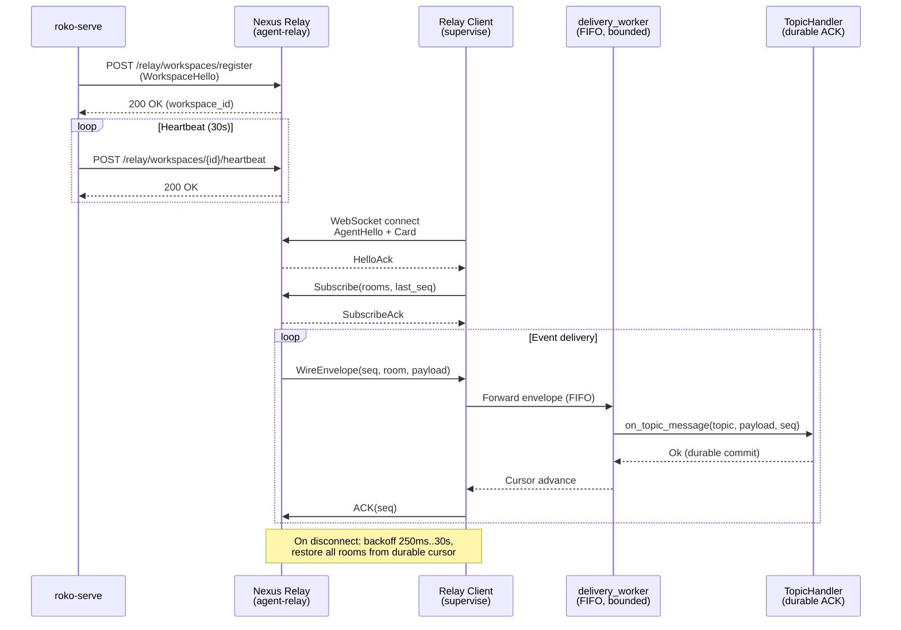

# 18 -- Connectivity and Relay

> Workspace-to-relay registration, agent-to-relay bridging, canonical envelope delivery,
> durable subscription cursors, fail-closed reconciliation, and relay health observability.
> All relay transport is subscription-based. No polling.

> **Implementation status (2026-09):** E29 contract tranche, R01 HTTP connector, and R02
> relay transport are complete. The portable kernel contracts (`Connect` trait, `WireEnvelope`,
> `ConnectorRegistry`) are shipped and tested. One concrete HTTP JSON adapter runs behind the
> canonical `Connect`/`ConnectorRegistry` boundary with real health checks, bounded reconnect
> supervision, cancellation-safe replacement and teardown, and secret-safe status. The
> `agent-relay` server and the supervised `roko-agent-server` client provide bounded
> canonical-envelope delivery, atomic room restore plus replay, durable cursors, and
> fail-closed recovery. `roko serve` executes enabled exact-room subscriptions only after
> recording durable intent and acknowledges delivery only after terminal receipts and cursors
> are atomically committed. Additional transports (MCP auto-registration, A2A publication,
> x402 settlement, chain finality/reorg execution) and startup discovery remain product work.

**Depends on:** [01-SIGNAL](01-SIGNAL.md) (Signal/Pulse duality, Bus),
[02-CELL](02-CELL.md) (9 protocols, typed I/O, capabilities),
[05-AGENT](05-AGENT.md) (vitality, type-state, CorticalState),
[12-SAFETY](12-SAFETY.md) (capability enforcement, taint propagation)

---

## 1. Why Relay

Roko workspaces run on developer machines, cloud containers, and edge devices. They need
to find each other, exchange messages, and coordinate agent work -- without requiring a
shared database, static IP, or polling loop.

The relay solves three problems:

1. **Discovery.** A workspace registers itself on startup. Dashboards, remote TUIs, and
   other workspaces discover it by listing the relay's directory. No manual URL exchange.

2. **Delivery.** Agents publish messages to rooms. The relay fans messages to all
   subscribers of that room. Delivery is bounded and sequenced: every envelope carries a
   monotonic `seq` and a `room`, and the subscriber's cursor tracks exactly what has been
   durably committed.

3. **Resilience.** Disconnections are expected. The supervisor reconnects with exponential
   backoff, restores the full room and feed set atomically from the last durable cursor,
   and replays missed events. If replay is impossible (the gap exceeds the relay's ring
   buffer), the system halts rather than silently dropping messages.

The relay is intentionally thin. It forwards events and aggregates heartbeats but does NOT
serve as a second backend. `roko-serve` is the authority; the relay is a wire.

---

## 2. The Connect Trait

The five-method async contract lives in `crates/roko-core/src/connector.rs`. It is
transport-independent: any external system (relay, database, chain RPC, MCP server)
implements the same protocol.

> **Cross-references:** [depth/18-connectivity/01-connect-contract.md](depth/18-connectivity/01-connect-contract.md)

### 2.1 Protocol Methods

```rust
#[async_trait]
pub trait Connect: Send + Sync {
    async fn connect(&mut self, config: &ConnectConfig) -> Result<()>;
    async fn query(&self, req: QueryRequest) -> Result<QueryResponse>;
    async fn execute(&self, req: ExecuteRequest) -> Result<ExecuteResponse>;
    async fn health(&self) -> Result<ConnectHealthStatus>;
    async fn disconnect(&mut self) -> Result<()>;
}
```

| Method | Idempotent | Mutating | Purpose |
|--------|-----------|----------|---------|
| `connect` | No | Yes (self) | Establish the external connection. Failure leaves it unavailable. |
| `query` | Yes | No | Perform an idempotent read operation. |
| `execute` | No | Potentially | Perform a potentially mutating operation. |
| `health` | Yes | No | Return current transport health (status, latency, last check, error). |
| `disconnect` | Yes | Yes (self) | Gracefully release connection resources. |

The trait is intentionally independent of `Cell`: this allows transports to be implemented
and tested in isolation before being composed into Cell-based pipelines.

### 2.2 ConnectConfig and Validation

```rust
pub struct ConnectConfig {
    pub endpoint: String,           // Target endpoint URL or transport address
    pub auth: Option<String>,       // Optional credential (skip_serializing)
    pub headers: Option<HashMap<String, String>>,  // Optional transport headers (skip_serializing)
    pub timeout_ms: u64,            // Operation timeout (default: 5000)
}
```

`ConnectConfig` validates two invariants: endpoint must not be empty, timeout must be
greater than zero. The `auth` and `headers` fields are marked `skip_serializing` to prevent
accidental credential leakage in logs and serialized state.

### 2.3 ConnectorManifest

Static identity, configuration schema, and lifecycle policy:

```rust
pub struct ConnectorManifest {
    pub name: String,
    pub kind: ConnectorKind,
    pub version: String,
    pub description: String,
    pub config_schema: Option<Value>,
    pub capabilities: Vec<String>,
    pub health_interval_secs: u64,
    pub reconnect_strategy: ReconnectStrategy,
}
```

The manifest carries a `ReconnectStrategy` that governs how the supervisor retries after
disconnection:

| Strategy | Parameters | Behavior |
|----------|-----------|----------|
| `ExponentialBackoff` | `base_ms`, `max_ms`, `jitter` | Bounded exponential delay with optional jitter |
| `FixedInterval` | `interval_ms` | Fixed retry interval |
| `Manual` | -- | Reconnect only on explicit caller action |

All strategies validate at construction time: zero-valued intervals and inverted ranges
are rejected.

### 2.4 ConnectorKind Taxonomy

```
Mcp, Api, Database, Blockchain, Feed, Custom, ChainRpc, Exchange,
McpServer, A2aClient, Webhook
```

Backward-compatible serde aliases ensure wire stability: `"chain_rpc"`, `"chain-rpc"`, and
`"blockchain_rpc"` all deserialize to `ConnectorKind::ChainRpc`. The `"a2a"` and
`"a2a_client"` aliases both map to `A2aClient`.

### 2.5 ConnectorRegistry

An in-memory `Vec<ConnectorInfo>` registry retained for the HTTP discovery API. New
transport implementations should implement `Connect` directly rather than going through
the registry.

Key operations:
- `register(info)` -- upsert by name
- `unregister(name)` -- remove by name, returns whether it was present
- `get(name)` -- lookup by name
- `list()` -- all registered connectors
- `healthy_count()` -- count of `ConnectorStatus::Connected` entries

---

## 3. Wire Protocol

The canonical envelope and recovery contracts live in
`crates/roko-core/src/wire_protocol.rs`.

> **Cross-references:** [depth/18-connectivity/02-wire-protocol.md](depth/18-connectivity/02-wire-protocol.md)

### 3.1 WireEnvelope (RelayEnvelope)

```rust
pub struct WireEnvelope {
    pub seq: u64,                         // Monotonic sequence within the relay stream
    pub ts: u64,                          // Server timestamp (Unix milliseconds)
    pub room: String,                     // Subscription room receiving this event
    #[serde(rename = "type")]
    pub msg_type: String,                 // Event discriminator on the wire
    pub payload: Value,                   // Event-specific body
    pub publisher_id: Option<String>,     // Optional publisher identity
}
```

`pub type RelayEnvelope = WireEnvelope;` provides the relay-facing name.

Validation rules (all enforced at construction):
- `room` and `msg_type` must not be empty
- `room` is at most 256 bytes, no whitespace or control characters
- `msg_type` is at most 128 bytes, no whitespace or control characters
- `payload` serialized size must not exceed 1 MiB (`MAX_WIRE_PAYLOAD_BYTES`)
- `publisher_id`, if present, must be 1-256 bytes without whitespace

### 3.2 Room Patterns

`RoomPattern` provides canonical room-name constructors:

| Constructor | Output | Example |
|-------------|--------|---------|
| `agent(id)` | `agent:{id}` | `agent:coder-1` |
| `agent_heartbeat(id)` | `agent:{id}:heartbeat` | `agent:coder-1:heartbeat` |
| `agent_output(id)` | `agent:{id}:output` | `agent:coder-1:output` |
| `plan(id)` | `plan:{id}` | `plan:refactor-v2` |
| `group(id)` | `group:{id}` | `group:backend-team` |
| `chain(chain_id)` | `chain:{chain_id}` | `chain:8453` |
| `system()` | `system` | `system` |
| `learning()` | `learning` | `learning` |

### 3.3 Subscription Messages

```rust
pub struct SubscribeMessage {
    pub rooms: Vec<String>,
    pub last_seq: Option<u64>,   // Durable cursor for atomic resume
}

pub struct UnsubscribeMessage {
    pub rooms: Vec<String>,
}

pub struct ResumeMessage {
    pub last_seq: u64,           // Resume strictly after this sequence
}
```

`last_seq` in `SubscribeMessage` is the key to atomic cursor restore: when provided, the
relay replays all events after that sequence for the requested rooms. When omitted, the
current relay head becomes the baseline.

### 3.4 Recovery: GapAction

When the client resumes and the relay evaluates the requested cursor against its retained
history:

```rust
pub enum GapAction {
    Replay { from_seq: u64, to_seq: u64 },   // Gap can be filled by replay
    Snapshot,                                  // Gap too large; full snapshot needed
}
```

`Replay` ranges must satisfy `from_seq <= to_seq`. Inverted ranges are rejected at
validation time.

### 3.5 Backpressure Strategies

Per-event-type overload policies:

| Strategy | Parameters | Behavior |
|----------|-----------|----------|
| `Coalesce` | `interval_ms` | Retain only the latest event; emit at most once per interval |
| `DropOldest` | `ring_size` | Bounded ring buffer; evict oldest on overflow |
| `Lossless` | -- | Preserve every event; apply transport flow control |
| `Sample` | `every_nth` | Deliver one of every N source events |

Recommended mappings: `heartbeat` -> `Coalesce { interval_ms: 500 }`,
`output_chunk` -> `DropOldest { ring_size: 1024 }`, `gate_result` -> `Lossless`,
`feed_data` -> `Sample { every_nth: dynamic }`.

Zero-capacity strategies (`interval_ms: 0`, `ring_size: 0`, `every_nth: 0`) are rejected
at validation time.

---

## 4. Supervised Relay Client

The agent-side relay client lives in `crates/roko-agent-server/src/features/relay_client.rs`.
It is a supervised WebSocket connection that maintains presence, hosts agent cards, and
delivers topic messages.

> **Cross-references:** [depth/18-connectivity/03-relay-client.md](depth/18-connectivity/03-relay-client.md)

### 4.1 Architecture



```
                    +-----------------+
                    |  agent-relay    |
                    |  (WebSocket)    |
                    +-------+---------+
                            |
                    +-------+---------+
                    |   supervise()   |  <-- reconnect loop with backoff
                    +-------+---------+
                            |
                +-----------+-----------+
                |                       |
        +-------+--------+    +--------+-------+
        | delivery_worker |    | dispatch_tasks |
        | (FIFO, bounded) |    | (semaphore=16) |
        +-------+--------+    +--------+-------+
                |                       |
        +-------+--------+    +--------+-------+
        |  TopicHandler   |    |  AgentState    |
        |  (durable ACK)  |    |  (message rsp) |
        +-----------------+    +----------------+
```

### 4.2 Connection Lifecycle

1. **Connect.** `establish_connection_bounded` opens a WebSocket, sends `AgentHello`, waits
   for the relay's `HelloAck`, then sends the agent's `Card` and optional `card_uri`.
   Connection timeout: 10 seconds.

2. **Restore.** `restore_desired` atomically sends a `Subscribe` frame containing ALL
   desired rooms plus the durable cursor (`last_seq`). Feeds are also re-registered.
   The client stays in `Disconnected` status until the relay acknowledges the subscription
   install.

3. **Run.** `run_connection` multiplexes four streams in a `tokio::select!` loop:
   - Incoming relay frames (messages, topics, snapshots, replays, supersession, errors, ACKs)
   - Delivery worker completions (cursor advances, failures, reconciliation)
   - Dispatch task responses (message responses back to the relay)
   - Client commands (subscribe, unsubscribe, register feed, publish)

4. **Exit.** The connection exits for one of four reasons:
   - `Shutdown` -- explicit cancellation via `CancellationToken`
   - `Superseded` -- another connection claimed the same agent ID
   - `ReconciliationRequired` -- a snapshot could not safely replace topic replay
   - `Disconnected` -- transport error, triggering reconnect

### 4.3 Supervisor State Machine

The supervisor (`supervise` function) wraps the connection lifecycle:

```
 +-----------+     connect ok     +-----------+     transport     +-----------+
 |Disconnected| ----------------> | Connected | ---- error ----> |Disconnected|
 +-----------+                    +-----------+                   +-----------+
      |  ^                             |                               |
      |  |         backoff             |   superseded                  |
      |  +-----------------------------+                               |
      |                                |   reconciliation              |
      |                                +-------> [HALT]                |
      +--- connect timeout/fail -------+                               |
      |                                                                |
      +------------ backoff ------------------------------------------+
```

The backoff schedule: initial delay 250ms, doubling on each attempt, capped at 30 seconds.
If a connection stays alive for 30+ seconds, the attempt counter resets to zero. This
prevents long-running connections from accumulating stale backoff state.

### 4.4 RelayHandle and RelayClientStatus

`connect()` returns a `RelayHandle` -- a cheaply clonable command sender that provides:

| Method | Effect |
|--------|--------|
| `subscribe(topic)` | Add a room to the subscription set |
| `unsubscribe(topic)` | Remove a room from the subscription set |
| `register_feed(...)` | Register a data feed with the relay |
| `publish(topic, msg_type, payload)` | Publish to a topic (fans to all subscribers) |
| `shutdown()` | Cancel the supervisor |
| `status()` | Read the latest `RelayClientStatus` snapshot |
| `subscribe_status()` | Get a `watch::Receiver` for status changes |

`RelayClientStatus` has five states:

```rust
pub enum RelayClientStatus {
    Connected { durable_cursor: u64, desired_rooms: usize },
    Disconnected { durable_cursor: u64 },
    ReconciliationRequired { snapshot_seq: u64 },
    Superseded { by_instance: String },
    Stopped,
}
```

### 4.5 Subscription Set Changes

When a subscribe or unsubscribe command changes the desired room set, the client
deliberately disconnects and reconnects with the new set plus the existing durable cursor.
This ensures the subscription install is always atomic -- the relay sees the complete room
set with the cursor in a single frame, rather than receiving incremental mutations that
could leave the cursor inconsistent with the room set.

### 4.6 Bounded Capacity

| Resource | Limit | Constant |
|----------|-------|----------|
| Command queue | 256 | `COMMAND_CAPACITY` |
| Delivery pipeline | 64 | `DELIVERY_CAPACITY` |
| Response pipeline | 32 | `RESPONSE_CAPACITY` |
| Desired rooms | 64 | `MAX_DESIRED_ROOMS` |
| Desired feeds | 64 | `MAX_DESIRED_FEEDS` |
| Concurrent message dispatches | 16 | `MAX_MESSAGE_DISPATCHES` |
| Feed field size | 512 bytes | `MAX_RELAY_FEED_FIELD_BYTES` |

Exceeding any capacity fails the operation immediately rather than blocking or silently
dropping.

---

## 5. Durable Delivery: ACK-After-Durable

The relay client emits an ACK to the relay only after the `TopicHandler` returns success.
This is the core delivery guarantee.

### 5.1 TopicHandler Contract

```rust
#[async_trait]
pub trait TopicHandler: Send + Sync + 'static {
    async fn durable_cursor(&self) -> Result<u64>;
    async fn on_topic_message(
        &self,
        topic: &str,
        msg_type: &str,
        payload: Value,
        publisher_id: Option<&str>,
        seq: u64,
    ) -> Result<()>;
    async fn on_snapshot(&self, snapshot: &SnapshotMessage) -> Result<SnapshotDisposition>;
    async fn on_replay_complete(&self, from_seq: u64, to_seq: u64) -> Result<()>;
}
```

The `durable_cursor()` method loads the last cursor already committed by durable handler
storage. On reconnect, this cursor is sent with the subscription install so the relay
replays exactly what was missed.

`SnapshotDisposition` has two outcomes:
- `AppliedEquivalent` -- the snapshot is proven equivalent to replayed topic state
- `ReconciliationRequired` -- durable reconciliation was recorded; automatic execution halts

### 5.2 RelaySubscriber (High-Level API)

`RelaySubscriber` in `crates/roko-agent-server/src/features/relay_subscriber.rs` wraps a
`RelayHandle` with channel-based message delivery:

```rust
let (handler, mut rx) = RelaySubscriber::make_handler();
// pass handler to relay_client::connect(...)
let subscriber = RelaySubscriber::from_handle(relay_handle);
subscriber.subscribe("agent:updates")?;
while let Some(msg) = rx.recv().await {
    println!("topic={} seq={}", msg.topic, msg.seq);
    msg.commit()?;  // ACK only after this succeeds
}
```

Each `TopicMessage` carries a `commit_tx` oneshot channel. Calling `msg.commit()` reports
durable success to the relay client, which then emits the relay ACK. Calling `msg.reject()`
causes the client to reconnect from its previous cursor.

### 5.3 Delivery Worker

The delivery worker in the relay client runs as a dedicated tokio task, processing topic
messages, snapshots, and replay checkpoints in FIFO order. The global cursor never advances
past unfinished lower-sequence work from another room. This single-writer ordering
eliminates the possibility of cursor gaps from concurrent room processing.

---

## 6. Serve-Side Subscription Relay

`roko serve` adds a durable journal layer on top of the relay client. This is the
ACK-after-durable exact-room subscription terminalization described in the CLAUDE.md status.

> **Cross-references:** [depth/18-connectivity/04-subscription-relay.md](depth/18-connectivity/04-subscription-relay.md)

### 6.1 Journal Architecture

The journal lives at `.roko/state/subscription-relay-journal.json` (schema version 2,
max 4 MiB, max 4096 entries).

```rust
struct JournalFile {
    schema_version: u32,
    integrity_hash: String,          // Content hash of the journal state
    global_cursor: u64,              // Highest committed relay sequence
    stream_binding: Option<RelayStreamBinding>,
    room_cursors: BTreeMap<String, u64>,
    subscription_cursors: BTreeMap<String, BTreeMap<String, u64>>,
    entries: VecDeque<JournalEntry>,
    reconciliation_required: Option<ReconciliationRecord>,
}
```

### 6.2 Journal Entry States

Each relay message progresses through a state machine:

```
                +-----------+
                | begin     |  <-- persist processing intent BEFORE dispatch
                | (intent)  |
                +-----+-----+
                      |
              +-------+-------+
              |               |
        +-----+-----+   +----+------+
        | terminals |   |   fail    |  <-- persist failure + reconciliation
        | recorded  |   +-----------+
        +-----+-----+
              |
        +-----+-----+
        |  commit   |  <-- persist terminals + cursor advance atomically
        +-----------+
```

This is the critical invariant: **intent before execution, commit after success, reconcile
on interruption.** If the process crashes between intent and commit, the journal detects the
interrupted `Processing` entry on restart and records a reconciliation requirement. The
interrupted intent is never replayed blindly.

### 6.3 Stream Binding

Before any message is processed, the journal binds to a specific relay stream:

```rust
pub struct RelayStreamBinding {
    pub origin_hash: String,      // Content hash of the relay identity
    pub rooms: Vec<String>,       // Exact sorted room set
    pub room_set_hash: String,    // Hash of the room set for change detection
    pub generation: u64,          // Monotonic binding generation
}
```

The stream binding guards against unsafe cursor reuse. If the relay origin identity changes
(different relay server) or the room set changes after the global cursor has advanced, the
journal forces reconciliation rather than continuing with a cursor that may point to a
different event sequence.

### 6.4 Remote Subscription Planning

`remote_subscription_plan()` scans the `SubscriptionRegistry` to determine which
subscriptions should be installed on the relay:

- Only enabled subscriptions with exact relay room triggers are eligible
- Cron and file-watch triggers are classified as local-only
- Glob patterns (`*`, `?`) in triggers are rejected (not exact rooms)
- The room set is bounded by `MAX_DESIRED_ROOMS` (64)
- Unsupported triggers and capacity-rejected rooms are tracked as diagnostics

### 6.5 Reconciliation

Reconciliation is the fail-closed recovery mechanism. A `ReconciliationRecord` is persisted
whenever:

1. A `Processing` entry is found on restart (interrupted dispatch)
2. A relay delivers a message for an unbound room
3. A sequence is redelivered while its previous intent is unfinished
4. A dispatch fails before the relay ACK could be sent
5. The relay origin identity changes while a cursor exists
6. The room set changes after the global cursor has advanced
7. A snapshot cannot safely substitute for topic replay

Once reconciliation is required, all further message processing halts until the operator
resolves the inconsistency. This prevents silent data loss from cursor desynchronization.

---

## 7. Relay Health

Health observability lives in `crates/roko-serve/src/relay.rs`.

### 7.1 Connection State

```rust
pub enum RelayConnectionState {
    Direct,                                        // Connected directly to roko-serve
    Relayed { relay_url: String },                // Connected via relay
    Degraded { relay_url, since, reason: String },// Relay unreachable
    Local,                                         // No relay configured
}
```

### 7.2 Data Freshness

```rust
pub struct DataFreshness {
    pub last_confirmed_at: u64,      // Unix epoch seconds
    pub stale: bool,                 // Computed by check()
    pub age_secs: u64,               // Seconds since last confirmation
    pub stale_threshold_secs: u64,   // Configurable threshold (default: 30s)
}
```

`mark_confirmed()` resets staleness. `check()` recomputes age and staleness against the
current time. Surfaces use this to display stale-state warnings.

### 7.3 Relay Heartbeat

```rust
pub struct RelayHeartbeat {
    pub last_ping_ms: u64,     // Most recent round-trip ping time
    pub avg_ping_ms: u64,      // Rolling average ping time
    pub missed_heartbeats: u64,// Consecutive missed heartbeats
}
```

### 7.4 RelayHealth (Top-Level Diagnostic)

```rust
pub struct RelayHealth {
    pub connection: RelayConnectionState,
    pub freshness: DataFreshness,
    pub heartbeat: Option<RelayHeartbeat>,
}
```

`is_healthy()` returns true when: the connection is `Direct`, `Relayed`, or `Local` AND
the data is not stale. `Degraded` is never healthy regardless of freshness.

Exposed via `GET /api/relay/health` and consumed by the TUI status bar and dashboard
connection indicator.

### 7.5 Circuit Breaker

The workspace registration heartbeat loop implements a circuit breaker:

| Parameter | Default | Constant |
|-----------|---------|----------|
| Failure threshold | 3 | `DEFAULT_RELAY_CIRCUIT_BREAKER_THRESHOLD` |
| Base backoff | 2s | `DEFAULT_RELAY_CIRCUIT_BREAKER_BASE_BACKOFF_SECS` |
| Max backoff | 60s | `DEFAULT_RELAY_CIRCUIT_BREAKER_MAX_BACKOFF_SECS` |
| Stale threshold | 30s | `DEFAULT_RELAY_STALE_THRESHOLD_SECS` |

Below the threshold, no backoff is applied. At and above the threshold, exponential
backoff kicks in: `base * 2^(failures - threshold)`, capped at max. The circuit breaker
transitions the relay health to `Degraded` when the threshold is reached.

---

## 8. RelayConfig

Workspace relay configuration lives in `crates/roko-core/src/config/chain.rs` under the
`[relay]` TOML section. Despite the file name, `RelayConfig` is a workspace relay concept,
not a blockchain concept.

```toml
[relay]
url = "wss://relay.nunchi.dev"
workspace_name = "will-dev"
public_url = "https://my-roko.up.railway.app"
heartbeat_interval_secs = 30
ring_buffer_size = 65536
```

```rust
pub struct RelayConfig {
    pub url: Option<String>,                // Relay WebSocket URL
    pub workspace_name: Option<String>,     // Human-readable name (default: hostname)
    pub public_url: Option<String>,         // Public URL of this instance
    pub heartbeat_interval_secs: u64,       // Heartbeat interval (default: 30)
    pub ring_buffer_size: usize,            // Events retained for resume replay (default: 65,536)
}
```

When `url` is `None`, workspace registration is disabled and the relay subsystem is inert.

### 8.1 Public URL Resolution

Priority order:
1. `relay.public_url` in roko.toml
2. `RAILWAY_PUBLIC_DOMAIN` environment variable
3. `FLY_APP_NAME` environment variable
4. `http://localhost:{port}` fallback

### 8.2 Workspace Name Resolution

Priority order:
1. `relay.workspace_name` in roko.toml
2. System hostname
3. `"roko"` fallback

---

## 9. Workspace Registration

`start_workspace_registration()` in `crates/roko-serve/src/relay.rs` spawns a background
task that:

1. **Registers** with the relay via `POST /relay/workspaces/register`
2. **Heartbeats** at the configured interval via `POST /relay/workspaces/{id}/heartbeat`
3. **Re-registers** on heartbeat failure (in case the relay restarted)
4. **Applies** circuit breaker backoff on consecutive failures
5. **Updates** `RelayHealth` state transitions (Relayed/Degraded)

The task runs for the lifetime of the `roko serve` process. It returns `None` when no relay
URL is configured.

---

## 10. Relay Proxy (roko-serve)

`crates/roko-serve/src/routes/relay_proxy.rs` exposes the `agent-relay` service through the
`roko-serve` single public port:

| Route | Handler | Purpose |
|-------|---------|---------|
| `GET /relay/agents/ws` | WebSocket proxy | Agent WebSocket bridge |
| `GET /relay/events/ws` | WebSocket proxy | Relay events WebSocket bridge |
| `/relay/{*path}` | HTTP proxy | Relay HTTP endpoints (health, agents CRUD) |
| `/relay` | HTTP proxy | Relay root |

The proxy converts `ws(s)://` relay URLs to `http(s)://` for HTTP forwarding and back to
`ws(s)://` for WebSocket upgrades. Requires `ROKO_AGENT_RELAY_URL` to be set; returns
503 Service Unavailable when not configured.

---

## 11. Agent Registration and Card Hosting

`crates/roko-agent-server/src/registration.rs` handles ERC-8004 agent card publication:

1. **Card construction.** `AgentCard` contains name, capabilities, endpoints, domain tags,
   and version.

2. **Relay card hosting.** When relay is configured, the card is sent to the relay via the
   `Card` frame and hosted at `/relay/cards/{agent_id}`.

3. **On-chain registration.** When a wallet and identity registry address are provided, the
   sidecar submits an `updateAgentCardUri(uint256,string)` transaction pointing to the
   relay-hosted card URI.

4. **Data URI fallback.** When no external publisher is available, the card is encoded as a
   `data:application/json;base64,...` URI.

---

## 12. Chain and Finality Primitives

The connector module also defines chain event metadata used by future transport
implementations:

### 12.1 FinalityLevel

```rust
pub enum FinalityLevel {
    Final,            // Canonical with sufficient confirmation depth
    QuasiFinalized,   // Moderately confirmed, suitable for reversible operations
    Reversible,       // Recent, pending, susceptible to reorganization
}
```

Ordered: `Reversible < QuasiFinalized < Final`.

### 12.2 FinalityTag

Attached to chain events: `level`, `chain_id`, `block_number`, `confirmations`, `timestamp`.

### 12.3 ChainReorgPulse

Canonical description of a detected chain reorganization: `chain_id`, `old_head`,
`new_head`, orphaned and new block ranges, and `depth`. Validates that ranges have
`start <= end` and `depth > 0`.

---

## 13. Agent Discovery

`MergedAgent` merges facts from relay, A2A, identity-chain, and deployment discovery into
a single view:

```rust
pub struct MergedAgent {
    pub id: String,
    pub name: String,
    pub online: bool,
    pub last_seen: u64,
    pub mode: Option<String>,
    pub profile: Option<String>,
    pub a2a_capabilities: Option<Vec<String>>,
    pub hdc_fingerprint: Option<String>,
    pub supported_protocols: Option<Vec<String>>,
    pub wallet: Option<String>,
    pub reputation: Option<f64>,
    pub stake: Option<u128>,
    pub tier: Option<AgentTier>,
    pub direct_url: Option<String>,
    pub deploy_platform: Option<DeployPlatform>,
}
```

Sources contribute facts independently:

| Source | Contributes |
|--------|------------|
| `Relay` | online status, last_seen, mode |
| `A2A` | capabilities, supported protocols |
| `Chain` | wallet, reputation, stake, tier |
| `Deployment` | direct_url, platform |

---

## 14. Workspace Events

Presence transitions published for workspace discovery:

```rust
pub enum WorkspaceEvent {
    Connected { workspace_id: String, url: Option<String> },
    Disconnected { workspace_id: String },
}
```

The `WorkspaceHello` registration message carries: workspace ID, name, URL, version,
capabilities, owner wallet, agent count, uptime, and exoskeleton status (MCP, A2A,
ERC-8004 chain, x402).

---

## 15. Product Residuals

The following capabilities are defined in the wire protocol and connector contracts but
remain product work beyond the E29 + R01/R02 scoped runtime:

| Capability | Status | Dependency |
|-----------|--------|------------|
| Additional transports (QUIC, gRPC) | Contract only | Concrete `Connect` implementations |
| MCP auto-registration | Contract only | Startup discovery pipeline |
| A2A publication | Contract only | Agent-to-Agent protocol adapter |
| x402 settlement | Contract only | Payment integration |
| Chain finality/reorg execution | Contract only | daeji consensus + indexer |
| Three-tier routing | Contract only | Relay tier awareness |
| Dashboard auto-connect | Contract only | TUI relay discovery |
| Exoskeleton status auto-detection | Wire type defined | Runtime capability probing |

---

## Verification

```bash
# Connect trait: five-method lifecycle test
cargo test -p roko-core async_connect_contract_exercises_all_five_methods

# Wire protocol: envelope serde, room patterns, recovery, backpressure
cargo test -p roko-core --lib wire_protocol

# Connector registry: register, unregister, get, list, healthy_count, serde
cargo test -p roko-core --lib connector

# Relay client integration: registration, card hosting, relay messaging
cargo test -p roko-agent-server --test relay_registration

# Serve relay health: freshness, circuit breaker, state transitions
cargo test -p roko-serve --lib relay

# Subscription relay journal: cursor management, reconciliation
cargo test -p roko-serve --lib subscription_relay
```

---

## Depth Files

| # | Path | Contents |
|---|------|----------|
| 01 | `depth/18-connectivity/01-connect-contract.md` | Five-method Connect trait, ConnectConfig, ConnectorManifest, ConnectorKind taxonomy, ConnectorRegistry |
| 02 | `depth/18-connectivity/02-wire-protocol.md` | WireEnvelope, RoomPattern, SubscribeMessage, GapAction, BackpressureStrategy, WorkspaceHello |
| 03 | `depth/18-connectivity/03-relay-client.md` | Supervised WebSocket client, RelayHandle, RelayClientStatus, TopicHandler, delivery worker, backoff |
| 04 | `depth/18-connectivity/04-subscription-relay.md` | Durable journal, stream binding, reconciliation, ACK-after-durable, subscription planning |

---

## References

### Implementation sources

| Surface | Authority |
|---------|-----------|
| Connect trait and connector contracts | `crates/roko-core/src/connector.rs` |
| Wire protocol (envelopes, rooms, recovery) | `crates/roko-core/src/wire_protocol.rs` |
| Relay config | `crates/roko-core/src/config/chain.rs` (RelayConfig) |
| Relay defaults | `crates/roko-core/src/defaults.rs` (DEFAULT_RELAY_*) |
| Relay client (agent-side) | `crates/roko-agent-server/src/features/relay_client.rs` |
| Relay subscriber (high-level API) | `crates/roko-agent-server/src/features/relay_subscriber.rs` |
| Agent registration | `crates/roko-agent-server/src/registration.rs` |
| Relay health (serve-side) | `crates/roko-serve/src/relay.rs` |
| Subscription relay journal | `crates/roko-serve/src/subscription_relay.rs` |
| Relay proxy routes | `crates/roko-serve/src/routes/relay_proxy.rs` |
| Subscription routes | `crates/roko-serve/src/routes/subscriptions.rs` |
| Relay integration tests | `crates/roko-agent-server/tests/relay_registration.rs` |

### Related chapters

| Chapter | Relevance |
|---------|-----------|
| [01-SIGNAL](01-SIGNAL.md) | Signal/Pulse duality, Bus transport |
| [02-CELL](02-CELL.md) | Cell protocols, typed I/O |
| [05-AGENT](05-AGENT.md) | Agent vitality, sidecar lifecycle |
| [12-SAFETY](12-SAFETY.md) | Capability enforcement across connections |
| [16-COORDINATION](16-COORDINATION.md) | Agent groups, message flows |
