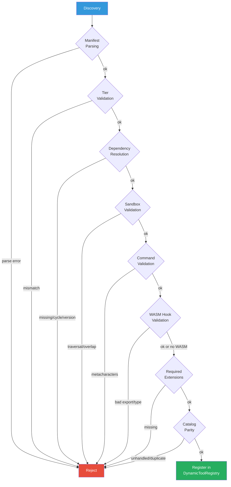
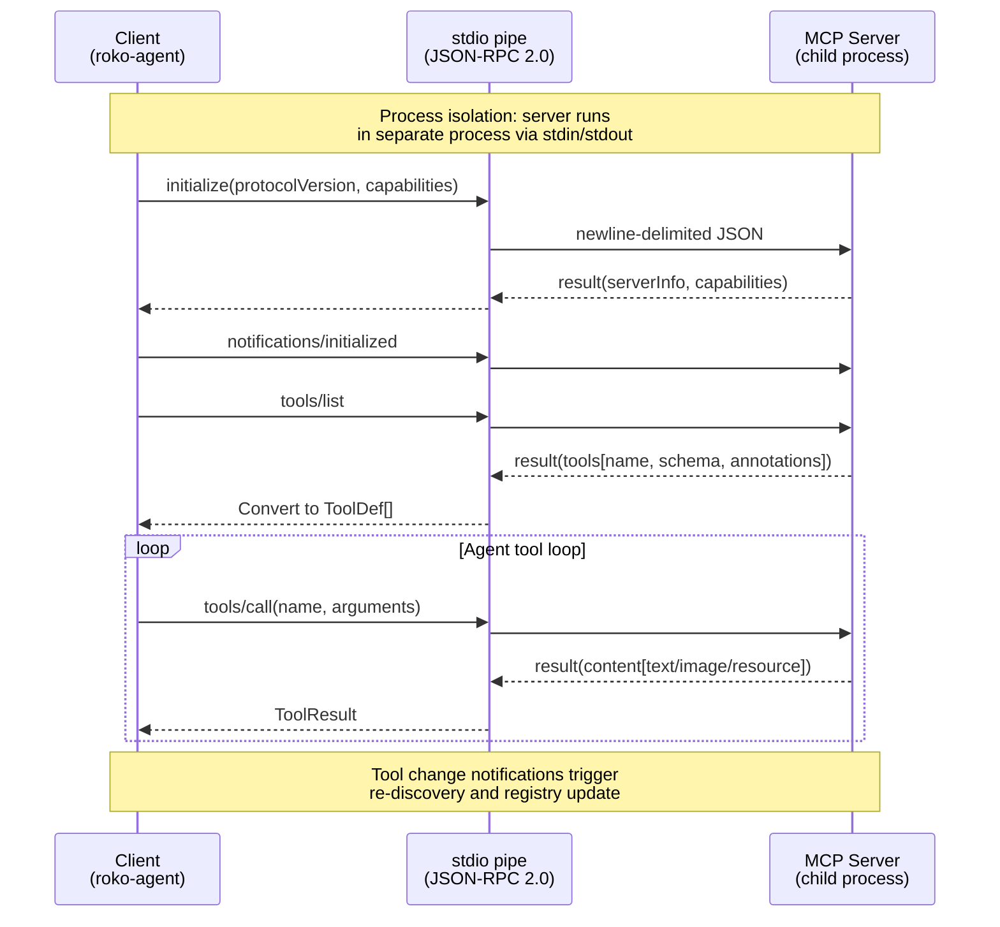

# 19 -- Tools and Plugins

> The tool architecture, builtin catalog, plugin ecosystem, MCP integration, and
> event source/feedback machinery. Tools are the bridge between reasoning and action:
> typed, described, trust-tiered functions that an agent invokes during the ACT step
> of the cognitive loop. Plugins extend the tool surface without forking core code.

> **Implementation status:** COMPLETE against the E32 manifest (8/8). 35 builtin tool
> definitions ship by default (16 local executables + 19 GitHub MCP). Signed semantic-version
> dependency graphs, range-aware relay/CLI graph validation, strict admission, kernel
> confinement, verified registry install/publish, fail-fast required-extension startup,
> Claude/Codex MCP, Cursor/Hermes ACP, and native authenticated Gemini CLI MCP are live.
> WASM hooks are not (checked at `7c556bc0a`, 2026-09-29): install still validates the
> bounded no-import typed ABI for all 23 hooks (`validate_wasm_abi` in
> `crates/roko-plugin/src/registry.rs`), but the runtime that executed them was removed
> with Runner-v2. `WasmExtension::load` (`crates/roko-cli/src/runner/extension_loader.rs`)
> always fails, so WASM extensions are skipped and no hook runs (section 7).
> The `DynamicToolRegistry` merges
> static builtins with plugin-declared tools at runtime, with per-plugin sandbox inheritance.
> Component-model Store/Bus hostcalls, OpenClaw/legacy one-shot parity, and optional chain
> handlers remain open product work.

**Depends on**: [01-SIGNAL](01-SIGNAL.md) (Signal types),
[02-CELL](02-CELL.md) (Cell execution model),
[05-AGENT](05-AGENT.md) (agent dispatch, provider adapters),
[12-SAFETY](12-SAFETY.md) (trust-origin lattice, sandbox tiers, immune Graph)

---

## 1. Overview

Every capability in Roko is mediated by **tools** -- typed, described, trust-tiered functions
that an agent can invoke during the ACT step of the universal cognitive loop. Tools are the
bridge between the agent's reasoning (LLM output) and the external world (filesystems, shells,
APIs, memory stores).

The tool architecture is designed around five principles:

1. **Static declaration** -- tools are described at compile time via `ToolDef` constants in
   `roko-std`. Each tool carries its name, description, category, permission flags, parameter
   schema, and source provenance.
2. **Trust-tiered permissions** -- three permission classes (read-only, write, execute) are
   enforced structurally. A tool's `ToolPermission` determines whether it can read files,
   write files, execute processes, or access the network.
3. **Profile-filtered loading** -- only relevant tools are registered at boot based on agent
   configuration. Role-based access control via `StaticToolRegistry.for_role()` further
   restricts which tools each agent role sees.
4. **Role-based access** -- the `StaticToolRegistry` filters tools per agent role
   (`Implementer`, `Reviewer`, `Researcher`, `Architect`, `Scribe`, `Auditor`, `Conductor`).
5. **Dynamic extensibility** -- plugin-declared tools merge into the `DynamicToolRegistry`
   at runtime. MCP tools are discovered from external servers. Each extension surface
   inherits the same validation, sandboxing, and audit pipeline as builtins.

### 1.1 Tools in the Processing Loop

Tools operate at the ACT step (step 5) of the nine-step cognitive loop:

```
1. SENSE        -> Substrate.query()       What is happening?
2. ASSESS       -> Scorer.score()          How relevant/important?
3. ATTEND       -> Router.select()         What matters most?
4. COMPOSE      -> Composer.compose()      Build context under budget
5. ACT          -> Agent.execute()         <- TOOLS INVOKED HERE
6. VERIFY       -> Gate.verify()           Did it work?
7. PERSIST      -> Substrate.put()         Store output with lineage
8. ADAPT        -> Policy.decide()         What patterns emerged?
9. META-COGNIZE -> Daimon.assess()         Am I doing this well?
```

The VERIFY step (step 6) can compare a `ToolResult`'s expected vs. actual outcome to produce
a `Verdict`. This closes the perception-action loop: the agent acts via tools, verifies via
gates, and adapts via policies.

### 1.2 Tool Audit Methodology

Tool surface reduction follows the SkillReducer methodology (Chen et al. 2026,
arXiv:2603.29919), which demonstrates that systematic tool pruning -- removing redundant or
low-impact tools from the catalog -- improves both task completion rates and token efficiency.
Roko applies this principle through profile-based filtering and role-based access control:
each agent role sees only the tools relevant to its task, rather than the full catalog.
The `validate_tool_catalog()` function performs a static audit that detects unhandled tools,
duplicate names, missing handlers, and deprecated entries.

---

## 2. The ToolDef Pattern

Every tool in Roko is defined via a `ToolDef` struct. `ToolDef` is the canonical declaration
format -- it describes the tool's name, description, category, permission flags, parameter
schema, and source provenance.

### 2.1 Core ToolDef Struct

```rust
// crates/roko-core/src/tool.rs
pub struct ToolDef {
    /// Tool name: `snake_case` or `namespace.action` convention.
    /// Examples: "read_file", "github.create_pr", "bash"
    pub name: String,

    /// LLM-facing description: when to call, what it returns, what it does NOT do.
    pub description: String,

    /// Semantic category -- drives profile filtering.
    pub category: ToolCategory,

    /// Read/write/exec/network permission flags.
    pub permission: ToolPermission,

    /// JSON Schema for input arguments.
    pub parameters: ToolSchema,

    /// Provenance: Builtin, Mcp { server }, or Plugin { name }.
    pub source: ToolSource,
}
```

### 2.2 ToolPermission Flags

```rust
pub struct ToolPermission {
    pub read: bool,     // Can read files/data
    pub write: bool,    // Can write files/modify state
    pub execute: bool,  // Can execute processes
    pub network: bool,  // Can make network requests
}
```

Named constructors:

| Constructor | read | write | execute | network | Typical use |
|---|---|---|---|---|---|
| `read_only()` | true | false | false | false | `read_file`, `grep`, `glob`, `ls` |
| `writes()` | true | true | false | false | `write_file`, `edit_file`, `notebook_edit` |
| `executes()` | true | true | true | false | `bash`, `run_tests` |
| `network()` | true | false | false | true | `web_fetch`, `web_search` |

### 2.3 ToolCategory Taxonomy

| Category | Description | Examples |
|---|---|---|
| `Read` | Read-only data access | `read_file`, `glob`, `grep`, `ls` |
| `Write` | File creation/modification | `write_file`, `edit_file`, `multi_edit`, `apply_patch` |
| `Exec` | Process execution | `bash`, `run_tests` |
| `Web` | Network access | `web_fetch`, `web_search` |
| `Planning` | Task/plan management | `todo_write`, `exit_plan_mode` |
| `Agent` | Sub-agent delegation | `task` |
| `Mcp` | MCP-proxied tools | All `github.*` tools |

### 2.4 ToolSource Provenance

```rust
pub enum ToolSource {
    /// Compiled into roko-std.
    Builtin,
    /// Discovered from an MCP server.
    Mcp { server: String },
    /// Declared by a plugin manifest.
    Plugin { name: String },
}
```

MCP-sourced tools are dispatched through an external MCP client and do not need a local
handler. The `validate_tool_catalog()` function exempts MCP tools from the unhandled-tool
check.

---

## 3. Builtin Tool Catalog

Roko ships 35 builtin tool definitions by default: 16 local executables and 19 GitHub MCP
catalog entries. With the `chain` cargo feature enabled, 17 chain-domain tools are added
for a total of 52. (The 17 chain tools are feature-gated and slated for deprecation as the
chain domain migrates to a standalone crate; see CLAUDE.md for current status.)

### 3.1 The 16 Local Tools

Defined in `crates/roko-std/src/tool/builtin/`. Registration order follows
`roko_core::tool::aliases::ALIASES`.

| # | Name | Category | Permission | Description |
|---|---|---|---|---|
| 1 | `read_file` | Read | read | Read file contents with optional offset/limit |
| 2 | `write_file` | Write | write | Write content to a file, creating if necessary |
| 3 | `edit_file` | Write | write | Replace exact string matches in a file |
| 4 | `multi_edit` | Write | write | Apply multiple edits to one or more files atomically |
| 5 | `glob` | Read | read | Find files matching glob patterns |
| 6 | `grep` | Read | read | Search file contents with regular expressions (ripgrep) |
| 7 | `bash` | Exec | execute | Execute shell commands and return output |
| 8 | `ls` | Read | read | List directory contents |
| 9 | `web_fetch` | Web | network | Fetch content from a URL |
| 10 | `web_search` | Web | network | Search the web for information |
| 11 | `notebook_edit` | Write | write | Edit Jupyter notebook cells |
| 12 | `todo_write` | Planning | write | Write todo items for task tracking |
| 13 | `task` | Agent | execute | Spawn a sub-agent to handle a delegated task |
| 14 | `exit_plan_mode` | Planning | write | Signal plan completion, request approval |
| 15 | `apply_patch` | Write | write | Apply a unified diff patch to files |
| 16 | `run_tests` | Exec | execute | Run the project's test suite |

Each module (`crates/roko-std/src/tool/builtin/<name>.rs`) exports:

- `pub const NAME: &str` -- canonical `snake_case` name
- `pub const DESCRIPTION: &str` -- LLM-facing help text
- `pub fn tool_def() -> ToolDef` -- full definition constructor

### 3.2 The 19 GitHub MCP Tools

Defined in `crates/roko-std/src/tool/builtin/github.rs`. All carry
`ToolSource::Mcp { server: "roko-mcp-github" }` and `ToolCategory::Mcp`.

**Read-only (9 tools):**

| Name | Description |
|---|---|
| `github.list_prs` | List pull requests with filters |
| `github.get_pr` | Get pull request details |
| `github.list_issues` | List issues with filters |
| `github.get_file` | Get file contents from a repository |
| `github.search_code` | Search code across repositories |
| `github.list_commits` | List commits on a branch |
| `github.get_branch` | Get branch details |
| `github.compare_branches` | Compare two branches |
| `github.get_actions_status` | Get CI/CD workflow status |

**Write (10 tools):**

| Name | Description |
|---|---|
| `github.create_pr` | Create a pull request |
| `github.comment_pr` | Comment on a pull request |
| `github.review_pr` | Submit a PR review |
| `github.merge_pr` | Merge a pull request |
| `github.create_issue` | Create an issue |
| `github.comment_issue` | Comment on an issue |
| `github.close_issue` | Close an issue |
| `github.add_labels` | Add labels to an issue or PR |
| `github.create_label` | Create a repository label |
| `github.create_branch` | Create a branch |

### 3.3 Chain Domain Tools (Feature-Gated)

The `chain` cargo feature adds 17 chain-domain tools from `roko-chain`. These tools are
typed placeholders covering optional on-chain operations. The chain domain is a domain
plugin -- not part of the core framework. See the chain integration section in CLAUDE.md
for boundaries.

### 3.4 Tool Counts

```rust
// crates/roko-std/src/tool/builtin/mod.rs

#[cfg(not(feature = "chain"))]
pub const TOOL_COUNT: usize = 35;  // 16 std + 19 GitHub MCP

#[cfg(feature = "chain")]
pub const TOOL_COUNT: usize = 52;  // 16 std + 17 chain + 19 GitHub MCP
```

---

## 4. Tool Registries

### 4.1 StaticToolRegistry

Zero-sized struct implementing `ToolRegistry`. All definitions live in the
`ROKO_BUILTIN_TOOLS` static `LazyLock`. Lookups are a linear scan -- the builtin set is
small enough that a hashmap would be slower after allocation overhead.

```rust
// crates/roko-std/src/tool/registry.rs
pub struct StaticToolRegistry;

impl ToolRegistry for StaticToolRegistry {
    fn get(&self, name: &str) -> Option<&ToolDef>;
    fn all(&self) -> &[ToolDef];
    fn validate_args(&self, name: &str, args: &serde_json::Value) -> Result<()>;
}
```

The `for_role()` method filters tools by agent role:

| Role | Available Tools | Rationale |
|---|---|---|
| **Implementer** | read + write + exec | Full access for code writing |
| **Reviewer** | read-only (no write, no exec) | Can inspect but not modify |
| **Researcher** | read + web | Can search and read, no write |
| **Architect** | read + search | Can inspect and plan |
| **Scribe** | read + write | Can read and write docs |
| **Auditor** | read-only | Strictest: read-only inspection |

### 4.2 DynamicToolRegistry

Runtime-extensible registry that merges builtins with plugin-declared tools. Starts
pre-populated with `ROKO_BUILTIN_TOOLS` and supports `register()`, `register_all()`,
`register_plugin()`, and `unregister()` operations.

Key features:

- **Deduplication**: when a plugin tool shares a name with an existing entry, the new entry
  replaces the old one and a `tracing::warn` is emitted. Safety-critical tools (`bash`,
  `read_file`, `write_file`) get an elevated warning.
- **Sandbox inheritance**: tools registered via `register_plugin()` inherit the plugin's
  `SandboxConfig`. The config is stored in a side-map keyed by plugin name and accessible
  via `sandbox_for()` and `sandbox_for_tool()`.
- **Catalog validation**: `validate_tool_catalog()` checks for unhandled tools, duplicate
  names, missing handlers, and deprecated prefixes (`legacy.`, `deprecated.`, `old_`).

```rust
pub struct DynamicToolRegistry {
    tools: Vec<ToolDef>,
    sandbox_configs: HashMap<String, SandboxConfig>,
}

impl DynamicToolRegistry {
    pub fn register_plugin(
        &mut self,
        plugin_name: &str,
        tools: Vec<ToolDef>,
        sandbox: SandboxConfig,
    );
    pub fn by_extension(&self, extension: &str) -> Vec<&ToolDef>;
    pub fn by_category(&self, category: ToolCategory) -> Vec<&ToolDef>;
    pub fn sandbox_for_tool(&self, tool_name: &str) -> Option<&SandboxConfig>;
}
```

### 4.3 Plugin Tool Registry

The `roko-plugin` crate provides a separate `DynamicToolRegistry` for versioned plugin
tools. Tools are stored as `name@version` keys, supporting multiple versions of the same
tool name. `resolve_tool()` picks the latest semver when no version is specified.

```rust
// crates/roko-plugin/src/tool_registry.rs
pub struct RegisteredTool {
    pub name: String,
    pub version: String,
    pub description: String,
    pub tier: PluginTier,
    pub schema: serde_json::Value,
    pub source_plugin: Option<String>,
}
```

---

## 5. Plugin Manifests

### 5.1 Manifest Format

Plugin manifests are TOML files declaring metadata, prompts, profiles, tools, triggers,
dependencies, and sandbox configuration.

```toml
[plugin]
name = "my-plugin"
version = "1.0.0"
description = "A description of the plugin"
author = "Author Name"

# Tier 1: Prompt templates
[[prompts]]
name = "pr-review"
role = "reviewer"
template = """
You are a code reviewer. Review the following PR...
"""

# Tier 2: Tool profile bundles
[[profiles]]
name = "read-only"
allowed_tools = ["read_file", "grep", "glob", "web_search"]
denied_tools = ["bash", "write_file", "edit_file"]

# Tier 3: Declarative tool definitions
[[tools]]
name = "lint-check"
description = "Run linter on the current file"
command = "cargo clippy -- -D warnings"
timeout_ms = 30000

# Dependencies (other plugins required)
[[dependencies]]
name = "core-utils"
version = "1.0.0"

# Event source triggers
[[triggers]]
kind = "cron"
expression = "0 */5 * * * *"
description = "Run every 5 minutes"
```

### 5.2 Five Plugin Tiers

Each plugin operates at one tier with a corresponding trust envelope:

| Tier | Label | Extension Shape | Default Sandbox |
|---|---|---|---|
| 1 | Untrusted | Prompt/template bundle (pure data) | No FS, no network, 64 MB / 5 s |
| 2 | Sandboxed | Configuration profile bundle (pure data) | Worktree read-only, no network, 128 MB / 10 s |
| 3 | Standard | Declarative tools, MCP servers, subprocess wrappers | Worktree r/w, allowlisted network, 256 MB / 30 s |
| 4 | Trusted | Native trait implementations | Full FS, full network, 512 MB / 120 s |
| 5 | Kernel | WASM sandboxed extensions, in-tree code | Unrestricted |

Tier ordering is enforced: `Untrusted < Sandboxed < Standard < Trusted < Kernel`.

### 5.3 Declarative Tool Definitions

Declarative tools run shell commands with structured parameters:

```toml
[[tools]]
name = "lint-check"
description = "Run linter on the current workspace"
command = "cargo clippy -- -D warnings"
timeout_ms = 30000
read_only = false
working_directory = "."

[[tools]]
name = "format-check"
description = "Check code formatting"
command = "cargo +nightly fmt --all -- --check"
timeout_ms = 15000
read_only = true
```

Declarative tools go through the same safety pipeline as builtins:

- Command validation rejects shell metacharacters (`|`, `;`, `&&`, `` ` ``, `$(`, `>`, `<`)
- Path validation blocks `../` traversal in allowed/denied paths
- Timeout enforcement via wall-clock limits
- Sandbox config constraints per plugin tier

### 5.4 Plugin Capabilities

```rust
pub enum PluginCapability {
    ToolProvider,     // Plugin declares tools
    EventSource,      // Plugin produces events
    FeedbackCollector,// Plugin collects outcome feedback
    PromptTemplate,   // Plugin provides prompt templates
    ProfileBundle,    // Plugin provides configuration profiles
}
```

---

## 6. Signed Dependency Graphs

### 6.1 Dependency Resolution

Plugin dependencies form a directed acyclic graph resolved via Kahn-style topological sort.
Before sorting, the resolver validates:

1. **Missing dependencies** -- a plugin requires a name not in the discovered set.
2. **Version conflicts** -- a dependency constraint the discovered version does not satisfy
   (minimum version requirement: actual >= constraint).
3. **Cycles** -- two or more plugins that transitively depend on each other.

```rust
// crates/roko-plugin/src/dependency.rs
pub fn resolve_plugin_dependencies(
    manifests: &[PluginManifestFile],
) -> Result<Vec<ResolvedPlugin>>;

pub struct ResolvedPlugin {
    pub name: String,
    pub version: String,
    pub load_order: usize,
    pub depends_on: Vec<String>,
}
```

### 6.2 Duplicate Detection

`detect_duplicate_plugins()` scans the manifest set for plugin names that appear more than
once, reporting all discovered versions and the total count.

### 6.3 Signed Packages

The registry subsystem (`crates/roko-plugin/src/registry.rs`) supports:

- **Package signing** via Ed25519 (`ed25519-dalek`). Each signed package carries the
  signer's public key and a detached signature over the manifest + contents hash.
- **Signature verification** at install time. Packages with invalid signatures are rejected.
- **Authenticated relay publishing** -- `publish_package()` signs and uploads to a configured
  relay endpoint with bearer-token authentication.
- **Verified install** -- `install_package()` downloads, verifies the signature, validates
  the manifest, and extracts contents to the local plugin root.

### 6.4 Range-Aware Validation

Dependency version constraints use `semver::VersionReq` for range-aware resolution. The
resolver accepts any version satisfying the requirement, not just exact matches. The CLI
`roko config plugins validate` runs the full graph validation offline.

---

## 7. Bounded Typed WASM Hooks

> **Status (2026-09-29, at `7c556bc0a`): validation only.** The install-time
> validation in 7.2 runs. Execution does not: the WASM runtime was deleted with
> Runner-v2, and `WasmExtension::load` (`crates/roko-cli/src/runner/extension_loader.rs`)
> always returns an error, so a WASM extension is skipped and none of the 23 hooks
> below is ever called.

### 7.1 The 23 Hook Points

Plugin WASM extensions declare which lifecycle hooks they implement. Each hook receives a
serialized JSON payload (`(ptr: i32, len: i32)`) and returns a status code (`i64`). The
bounded no-import ABI validates that each declared hook is a correctly typed function export
in the WASM module.

| # | Hook | When It Fires |
|---|---|---|
| 1 | `on_init` | Plugin initialization |
| 2 | `on_shutdown` | Plugin teardown |
| 3 | `on_observe` | Signal observation |
| 4 | `on_filter` | Signal filtering |
| 5 | `filter_input` | Input pre-processing |
| 6 | `on_retrieve` | Knowledge retrieval |
| 7 | `on_store` | Knowledge storage |
| 8 | `pre_inference` | Before LLM call |
| 9 | `post_inference` | After LLM response |
| 10 | `on_gate` | Gate verdict |
| 11 | `pre_action` | Before tool execution |
| 12 | `post_action` | After tool execution |
| 13 | `on_tool_call` | Tool invocation |
| 14 | `on_message_send` | Outbound message |
| 15 | `on_message_receive` | Inbound message |
| 16 | `on_reflect` | Metacognitive reflection |
| 17 | `on_cost_update` | Cost accounting change |
| 18 | `on_error` | Error occurrence |
| 19 | `on_budget_exceeded` | Budget limit breach |
| 20 | `on_tick_start` | Tick begins |
| 21 | `on_tick_end` | Tick completes |
| 22 | `on_slot_assigned` | Task slot assigned |
| 23 | `on_slot_completed` | Task slot completed |

### 7.2 WASM Validation

Each declared hook must:

- Be a function export in the WASM module
- Accept parameters `(i32, i32)` -- pointer and length of the JSON payload
- Return `i64` -- status code

Validation runs at install time, not at runtime. Undeclared hooks are not called. Duplicate
hook declarations are rejected. Unknown hook names fail validation. The fuel limit is
bounded to a configurable maximum (`MAX_WASM_FUEL`), with optional per-hook memory caps.

### 7.3 WASM Extension Configuration

```toml
[wasm]
module = "extension.wasm"
hooks = ["pre_inference", "post_inference", "on_gate"]
fuel = 10000000        # ~100ms of computation
memory_mb = 256

[wasm.permissions]
network = false
filesystem = false
```

---

## 8. Strict Plugin Admission

### 8.1 Admission Pipeline

Plugin admission is fail-fast: every check must pass before the plugin is registered.



1. **Manifest parsing** -- TOML must deserialize without unknown fields
   (`#[serde(deny_unknown_fields)]`).
2. **Tier validation** -- declared or inferred tier must match manifest contents.
3. **Dependency resolution** -- all declared dependencies must be present and satisfy version
   constraints (no cycles).
4. **Sandbox validation** -- `SandboxConfig::validate()` checks for path overlaps, traversal
   sequences, and impossible configurations.
5. **Command validation** -- `SandboxConfig::validate_command()` rejects shell metacharacters.
6. **WASM validation** -- for WASM extensions, every declared hook must be a correctly typed
   export.
7. **Required extensions** -- `fail_if_required_extensions_missing()` halts startup if a
   required plugin is absent.
8. **Catalog parity** -- `validate_tool_catalog()` ensures every registered tool has a handler
   or is MCP-dispatched, with no duplicates.

### 8.2 Sandbox Configuration

Five tiers of sandboxing with ascending permissiveness:

```rust
// crates/roko-std/src/tool/sandbox_config.rs
pub struct SandboxConfig {
    pub allowed_paths: Vec<String>,   // Glob patterns the tool may access
    pub denied_paths: Vec<String>,    // Explicit denials (priority over allows)
    pub network_access: bool,         // May make outbound connections
    pub max_memory_mb: u64,           // RSS cap in MB (0 = unlimited)
    pub max_cpu_seconds: u64,         // Wall-clock CPU cap (0 = unlimited)
}
```

| Tier | `allowed_paths` | `network_access` | `max_memory_mb` | `max_cpu_seconds` |
|---|---|---|---|---|
| 1 Untrusted | none | false | 64 | 5 |
| 2 Sandboxed | read-only worktree (`.env`/secrets denied) | false | 128 | 10 |
| 3 Standard | worktree r/w (`.env`/secrets denied) | true | 256 | 30 |
| 4 Trusted | full | true | 512 | 120 |
| 5 Kernel | unrestricted | true | 0 (unlimited) | 0 (unlimited) |

Denial takes priority over allowance. Path traversal (`../`) in either list is flagged as a
validation error.

---

## 9. Verified Relay and Install

### 9.1 Registry Architecture

The plugin registry supports publish/install/verify operations against a relay server.

**Publish flow:**

1. Author writes `manifest.toml` and assembles package contents.
2. `publish_package()` signs the package with the author's Ed25519 key.
3. Package is uploaded to the relay endpoint with bearer-token authentication.
4. Relay validates the signature and stores the package.

**Install flow:**

1. `install_package()` downloads the package from the relay.
2. Signature is verified against the embedded public key.
3. Manifest is validated (tier, dependencies, sandbox).
4. Contents are extracted to `plugins/<name>/` under the workspace root.
5. Dependencies are resolved and loaded in topological order.

### 9.2 CLI Surface

```bash
roko config plugins list           # List installed plugins
roko config plugins install <id>   # Install from relay
roko config plugins remove <id>    # Uninstall
roko config plugins audit          # Run full catalog validation
roko config plugins publish        # Sign and publish to relay
roko config plugins validate       # Validate dependency graph offline
```

---

## 10. MCP Architecture

### 10.1 Protocol

The Model Context Protocol (MCP) is a JSON-RPC 2.0 protocol for extending LLM agents with
external tools at runtime. MCP provides dynamic tool discovery from external servers --
complementing the statically compiled builtins.



```
Client (roko-agent)          Server (roko-mcp-github)
       |                              |
       |  {"jsonrpc":"2.0",           |
       |   "method":"initialize",     |
       |   "id":1}                    |
       | ---------------------------> |
       |                              |
       |  {"result":{...},            |
       |   "id":1}                    |
       | <--------------------------- |
       |                              |
       |  {"method":"tools/list",     |
       |   "id":2}                    |
       | ---------------------------> |
       |                              |
       |  {"result":{"tools":[...]},  |
       |   "id":2}                    |
       | <--------------------------- |
       |                              |
       |  {"method":"tools/call",     |
       |   "params":{"name":"...",    |
       |    "arguments":{...}},       |
       |   "id":3}                    |
       | ---------------------------> |
       |                              |
       |  {"result":{"content":[...]},|
       |   "id":3}                    |
       | <--------------------------- |
```

### 10.2 Transport: stdio

The primary transport is JSON-RPC 2.0 over standard input/output. The client spawns the
server as a child process and communicates via newline-delimited JSON-RPC:

- **Process isolation**: MCP servers run in separate processes. A crashing server does not
  affect the agent.
- **Language agnostic**: servers can be written in any language.
- **Security boundary**: untrusted MCP tools run in their own process with their own
  permissions.

### 10.3 Initialization Handshake

The client sends `initialize` with its protocol version and capabilities. The server responds
with its version, capabilities, and info. The client then sends `notifications/initialized`.
Feature usage is gated by server capabilities -- the client does not call `resources/list`
if the server lacks the `resources` capability.

### 10.4 MCP Tool Conversion

MCP tool schemas are converted to Roko `ToolDef` format:

- Tools are namespaced by server name: `github.get_pr`, `scripts.pm_sync`
- MCP `readOnly: true` maps to `ToolPermission::read_only()`
- MCP `readOnly: false` or absent maps to `ToolPermission::writes()` (conservative default)
- `idempotent: true` marks the tool as safe to retry on failure

### 10.5 Dynamic Registry Merge

The merged registry combines static, plugin, and MCP tools with precedence:
static > plugin > MCP. Name collisions are resolved by precedence order.

Tool change notifications (`notifications/tools/list_changed`) trigger re-discovery and
registry update.

---

## 11. MCP Targets

### 11.1 Claude and Codex CLI MCP

When dispatching to the Claude CLI or Codex CLI, Roko passes MCP configuration via
`--mcp-config`. The CLI spawns configured MCP servers alongside the agent session and
composes live MCP tool definitions into the audited tool loop.

Configuration:

```toml
[agent.mcp_config]
config_file = ".roko/mcp-config.json"

[[agent.mcp_servers]]
name = "github"
command = "roko-mcp-github"
args = ["--repo", "nunchi/roko"]
env = { GITHUB_TOKEN = "${GITHUB_TOKEN}" }
```

### 11.2 Cursor and Hermes ACP

The Agent Client Protocol (ACP) in `roko-acp` provides an editor integration surface.
Cursor and Hermes consume canonical tool handlers through authenticated per-call MCP.
ACP advertises resolved model capabilities and enforces mutation consent, experiments,
truthful capabilities, persisted USD budgets, and shared health/rate-aware selection.

### 11.3 Gemini CLI MCP

The Gemini CLI path uses native stream-JSON transport, task-scoped system settings, and
contract-derived filtering. MCP tool definitions are composed into the Gemini tool loop
via authenticated per-call MCP, matching the Claude/Codex pattern.

### 11.4 Definition-Only MCP

HTTP-provider MCP discovery retains executable clients and resolvers for
Anthropic/OpenAI/Gemini/Perplexity/Cerebras tool loops. Definition-only MCP
advertisements -- servers that list tools but cannot execute them -- fail closed.

---

## 12. Event Sources and Feedback Collectors

### 12.1 EventSource Trait

Event sources are push-based signal producers. They implement the `EventSource` trait from
`roko-plugin`:

```rust
#[async_trait]
pub trait EventSource: Send + Sync + 'static {
    fn name(&self) -> &str;
    fn kind(&self) -> EventSourceKind;
    async fn start(&self, sender: SignalSender, cancel: CancellationToken) -> Result<()>;
}
```

Three source kinds are built in:

| Kind | Implementation | Description |
|---|---|---|
| `Cron` | `CronEventSource` | IANA/DST-aware cron expressions via the `cron` crate |
| `FileWatch` | `FileWatchEventSource` | `notify::RecommendedWatcher` with debouncing, include/exclude globs |
| `Webhook` | `GitHubEventSource` | Bridges the `/webhooks/github` HTTP route to the signal pipeline |

Custom event sources can be registered by plugins via `EventSourceKind::Custom(String)`.

### 12.2 FeedbackCollector Trait

Feedback collectors periodically poll external systems for outcomes of past work:

```rust
#[async_trait]
pub trait FeedbackCollector: Send + Sync + 'static {
    fn name(&self) -> &str;
    fn services(&self) -> Vec<String>;
    fn interval(&self) -> std::time::Duration;
    async fn collect(&self, since: DateTime<Utc>) -> Result<Vec<FeedbackSignal>>;
}
```

Each `FeedbackSignal` carries the original episode ID, service name, outcome
(`Approved`, `Rejected`, `Commented`, `Ignored`, `Merged`), metadata, and timestamp.

### 12.3 Plugin Builder

Plugins compose event sources and feedback collectors via the fluent `PluginBuilder`:

```rust
let manifest = PluginBuilder::new("my-plugin")
    .event_source(CronEventSource::from_config(config))
    .feedback_collector(GitHubFeedbackCollector::new())
    .build();
```

---

## 13. Safety Hooks

### 13.1 Tool Execution Safety Chain

All tool calls pass through the safety layer in `roko-agent/src/safety/`:

1. **Role authorization** -- agents can only execute tools permitted by their role.
2. **Pre-call validation** -- parameter validation, rate limiting, budget enforcement.
3. **Post-call verification** -- output sanitization, sensitive data filtering.
4. **Taint propagation** -- untrusted inputs are tracked through the trust-origin lattice
   (see [12-SAFETY](12-SAFETY.md)).

### 13.2 AgentContract Tool Policy

Role/task allowlists intersect: a tool must be allowed by both the agent's role and the
task's policy. Denials win over allows. Unknown roles deny all tools. Unsupported
policy-bearing dispatches are rejected.

### 13.3 Provider Isolation and Tool Cooldown

The E34 safety closure enforces:

- **Provider isolation** -- each provider session operates within bounded workspace-rooted
  authority, independent of attempt worktrees.
- **Tool cooldown/isolation** -- rapid-fire tool calls are rate-limited per provider.
- **Content-addressed evidence** -- tool results are checksummed and persisted with security
  metadata.
- **Reciprocal incident links** -- quarantine incidents link back to the triggering tool
  call and forward to remediation.

### 13.4 Immune Graph Screening

Canonical provider primary outputs and every host-visible `ToolDispatcher` result traverse
the fixed five-stage immune Graph (Deference -> Switch -> Truth -> Impact -> Task). This
is the same immune pipeline described in [12-SAFETY](12-SAFETY.md); tool results are one
of its primary inputs.

---

## 14. Tool Configuration

### 14.1 roko.toml

```toml
[tools]
profile = "active"                        # Or comma-separated: "trader,vault"
enable = ["intel_compute_vpin"]           # Per-tool enable overrides
disable = ["uniswap_submit_uniswapx_order"]  # Per-tool disable overrides

[tools.safety]
max_writes_per_minute = 10
require_simulation = true
```

### 14.2 Configuration Hierarchy

Precedence (highest first):

1. **CLI flags** -- `--profile trader --disable tool_name`
2. **Environment variables** -- `TOOL_PROFILE=trader`, `ROKO_TOOL_DISABLE=...`
3. **Config file** -- `roko.toml` `[tools]` section
4. **Defaults** -- `active` profile if nothing specified

### 14.3 Tool Profiles

Profiles control which tool categories are loaded at boot. A profile is a named selection
of categories -- it determines the agent's structural capabilities. An agent with the `data`
profile is structurally unable to write: the write tool adapters do not exist in its registry.

Built-in tools use role-based access via `StaticToolRegistry.for_role()`. Domain plugins
ship their own profile bundles with their own tool sets and context schemas.

---

## 15. Open Work

### 15.1 WIT/Component-Model Hostcalls

The current WASM ABI is a bounded no-import typed interface. The target-state WASM surface
uses the Component Model (WIT) to expose typed Store/Bus/capability hostcalls:

```wit
interface roko-host {
    bus-publish: func(pulse: list<u8>) -> result<s64, string>;
    bus-subscribe: func(filter: list<u8>) -> result<s32, string>;
    substrate-query: func(fingerprint: list<u8>, radius: u32, limit: u32) -> result<list<u8>, string>;
    log: func(level: u32, msg: string);
    now-ms: func() -> s64;
}
```

This remains open product work.

### 15.2 OpenClaw/Legacy One-Shot Parity

The legacy one-shot tool execution model and OpenClaw adapter parity remain separate
roadmap items. Current tool execution is per-call through the dispatcher.

---

## 16. Verification

### 16.1 Source Locations

| Component | Path |
|---|---|
| Builtin tool definitions | `crates/roko-std/src/tool/builtin/` |
| Static registry | `crates/roko-std/src/tool/registry.rs` |
| Handler dispatch | `crates/roko-std/src/tool/handlers.rs` |
| Sandbox config | `crates/roko-std/src/tool/sandbox_config.rs` |
| Plugin manifest | `crates/roko-plugin/src/manifest.rs` |
| Dependency resolution | `crates/roko-plugin/src/dependency.rs` |
| Plugin registry (relay/install) | `crates/roko-plugin/src/registry.rs` |
| Plugin tool registry | `crates/roko-plugin/src/tool_registry.rs` |
| Event sources/feedback | `crates/roko-plugin/src/lib.rs` |
| MCP client | `crates/roko-agent/src/mcp/` |
| Safety layer | `crates/roko-agent/src/safety/` |
| GitHub MCP tools | `crates/roko-std/src/tool/builtin/github.rs` |

### 16.2 Key Tests

- `builtin_count_matches` -- `ROKO_BUILTIN_TOOLS.len() == TOOL_COUNT`
- `no_duplicate_names` -- all tool names are unique
- `github_tool_catalog_entries` -- all 19 GitHub MCP tools present with correct source/category
- `for_role_implementer_is_nonempty` / `for_role_auditor_is_read_only_subset` -- role filtering
- `validate_default_registry_has_no_issues` -- clean catalog parity
- `sandbox_tiers_form_ascending_permissiveness` -- tier ordering invariant
- `dependency_resolve_diamond` / `dependency_resolve_direct_cycle` -- graph resolution
- `resolve_tool_semver_numeric_ordering` -- 1.10.0 > 1.9.0 (numeric, not lexicographic)

### 16.3 Invariants

1. `TOOL_COUNT` matches `ROKO_BUILTIN_TOOLS.len()` at compile time.
2. Every builtin tool has a handler in `HandlerRegistry`.
3. Every MCP tool has `ToolSource::Mcp { .. }` and is exempt from local handler checks.
4. `SandboxConfig::for_tier_level(n)` is at least as permissive as level `n-1`.
5. Plugin dependency resolution is deterministic (alphabetically sorted seed queue).
6. Signed packages with invalid signatures are rejected before any content is extracted.
7. WASM hooks not declared in the manifest are never invoked.

---

## 17. References

- **MCP Specification 2025-11-25** (Anthropic / Linux Foundation) -- Current protocol version.
  [spec](https://modelcontextprotocol.io/specification/2025-11-25)
- **MCP Specification 2025-03-26** -- Introduced Streamable HTTP, tool annotations.
  [changelog](https://modelcontextprotocol.io/specification/2025-03-26)
- **SkillReducer** (Chen et al. 2026) -- Systematic tool pruning improves task completion
  and token efficiency. [arXiv:2603.29919](https://arxiv.org/abs/2603.29919)
- **ReAct** (Yao et al. 2023) -- Interleaved reasoning and tool actions.
  [arXiv:2210.03629](https://arxiv.org/abs/2210.03629)
- **OpenAPI 3.1.0** (OAI 2021) -- JSON Schema 2020-12 alignment.
  [spec](https://github.com/oai/openapi-specification/blob/main/versions/3.1.0.md)
- **AGNTCY Agent Directory** (Cisco 2025) -- Distributed tool discovery.
  [arXiv:2509.18787](https://arxiv.org/abs/2509.18787)
- **schemars** -- Derive JSON Schema from Rust types.
  [crate](https://crates.io/crates/schemars)

---

## Depth Files (v1/18 Preservation)

The following depth files from the v1 specification are preserved for reference. Each covers
a specific subsystem in detail.

| # | File | Title | Summary |
|---|---|---|---|
| 00 | [v1/18-tools/00-tool-architecture.md](../v1/18-tools/00-tool-architecture.md) | Tool Architecture | ToolDef pattern, ToolContext, ToolResult, three trust tiers, Capability<T>, speculation engine, event bus, DecisionCycleRecord |
| 01 | [v1/18-tools/01-builtin-tools.md](../v1/18-tools/01-builtin-tools.md) | Built-in Tools | 16 built-in tools, StaticToolRegistry, role-based filtering, module structure |
| 02 | [v1/18-tools/02-tool-categories.md](../v1/18-tools/02-tool-categories.md) | Tool Categories Taxonomy | 17 chain domain categories, prefix conventions, risk tier scale, profile-to-category mapping |
| 03 | [v1/18-tools/03-chain-domain-tools.md](../v1/18-tools/03-chain-domain-tools.md) | Chain Domain Plugin | 423+ DeFi tools, two-layer model, typed context, Alloy, Revm, mirage-rs |
| 04 | [v1/18-tools/04-safety-hooks.md](../v1/18-tools/04-safety-hooks.md) | Safety Hooks & Capability Tokens | Capability<T> flow, SafetyHook trait, 7-hook chain, WASM sandbox, TaintedString, audit trail |
| 05 | [v1/18-tools/05-tool-profiles.md](../v1/18-tools/05-tool-profiles.md) | Tool Profiles & Configuration | Domain profile bundles, 13 chain profiles, config hierarchy, env vars, error taxonomy |
| 06 | [v1/18-tools/06-wallet-management.md](../v1/18-tools/06-wallet-management.md) | Wallet Management | Three custody modes, WalletHandle, session keys (ERC-7715), wallet tools |
| 07 | [v1/18-tools/07-tool-testing.md](../v1/18-tools/07-tool-testing.md) | Tool Testing Strategy | Four-layer testing: SessionShim, unit, property-based, evaluation, red-team |
| 08 | [v1/18-tools/08-service-integrations.md](../v1/18-tools/08-service-integrations.md) | Service Integrations | Three-layer architecture, chain services, operations adapters |
| 09 | [v1/18-tools/09-mcp-architecture.md](../v1/18-tools/09-mcp-architecture.md) | MCP Architecture | JSON-RPC 2.0, stdio transport, tool converter, dynamic registry, capabilities |
| 10 | [v1/18-tools/10-mcp-github.md](../v1/18-tools/10-mcp-github.md) | roko-mcp-github | 17 GitHub tools with full JSON Schema |
| 11 | [v1/18-tools/11-mcp-slack.md](../v1/18-tools/11-mcp-slack.md) | roko-mcp-slack | 8 Slack tools, Socket Mode, Block Kit |
| 12 | [v1/18-tools/12-mcp-scripts.md](../v1/18-tools/12-mcp-scripts.md) | roko-mcp-scripts | Config-driven tool wrappers, scripts.toml format |
| 13 | [v1/18-tools/13-mcp-stdio.md](../v1/18-tools/13-mcp-stdio.md) | roko-mcp-stdio | McpToolHandler trait, McpServerBuilder, protocol handler |
| 14 | [v1/18-tools/14-plugin-sdk.md](../v1/18-tools/14-plugin-sdk.md) | Plugin SDK | Five-tier SPI, manifest shape, examples |
| 15 | [v1/18-tools/15-event-sources.md](../v1/18-tools/15-event-sources.md) | Event Sources | Cron, FileWatch, webhooks, dispatch loop |
| 15-16 | [v1/18-tools/15-16-agent-templates.md](../v1/18-tools/15-16-agent-templates.md) | Agent Templates | 18 templates with full system prompts and triggers |
| 16 | [v1/18-tools/16-plugin-loading.md](../v1/18-tools/16-plugin-loading.md) | Plugin Loading | Discovery-first loader, profile composition, sandbox selection |
