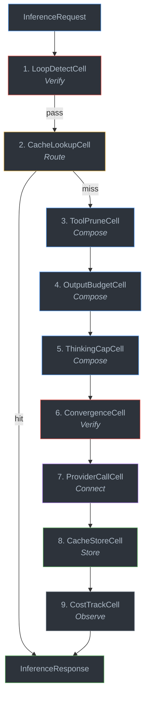
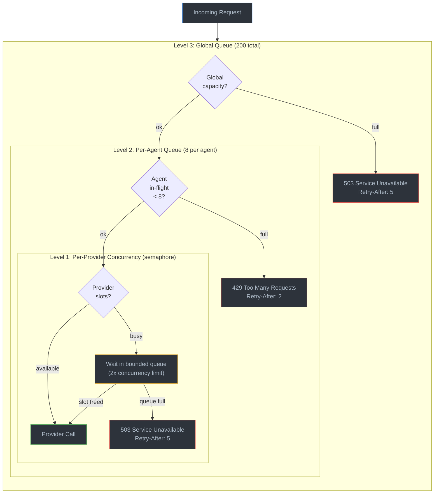

# 20 -- Inference Gateway

> In this design, agents never hold API keys: a centralized nine-stage Pipeline Graph owns
> all secrets, runs every request through multi-stage processing, and calls providers
> (today only `roko serve`'s gateway routes work this way; see the scope note). Expressed
> entirely as a composition of kernel primitives. The `InferenceGateway` in `roko-gateway`
> is a Pipeline -- a linear Graph of Cells where each can reject (Verify), transform
> (Compose), or redirect (Route).

**Depends on**: [01-SIGNAL](01-SIGNAL.md) (Signal/Pulse, content addressing), [02-CELL](02-CELL.md) (Cell, Pipeline pattern, Verify/Route/Observe protocols), [03-GRAPH](03-GRAPH.md) (Graph wiring, Pipeline specialization), [05-AGENT](05-AGENT.md) (CorticalState, regime conditioning, vitality), [08-LEARNING](08-LEARNING.md) (CascadeRouter, UCB1 bandits, cascade routing)

**Implementation status (2026-09-15):** **COMPLETE (E26 12/12).** `roko-gateway`
owns the provider-neutral protocol, bounded keyless handles, nine-stage pipeline,
two-layer cache, loop/convergence controls, tool/output/thinking budgets, provider
fallback/key rotation contracts, cost persistence, three-level backpressure, batch
queue, HTTP adapters, and loader-verified TOML graph definition. `roko-serve`
constructs it from the live `ModelCallService`, `CascadeRouter`, cost table, and
`GatewayEventWriter`; starts the gateway and batch loops; and routes inference, stats,
and batch HTTP traffic through it.

**Scope (checked at `7c556bc0a`, 2026-09-29):** the gateway is not Roko's inference
path. Only `roko-serve` depends on `roko-gateway`, and only its gateway HTTP routes go
through it. Plan runs (`roko plan run`, `roko run`, and the plans `roko serve` starts)
dispatch agents through `roko-agent`'s providers directly, the Claude CLI among them, so
the gateway's caching, budgets, backpressure and key custody do not apply to them.

**Roadmap beyond E26:** Native provider batch-job submission/polling and WebSocket
`StatsEvent` broadcast remain adapter work. The current batch processor makes bounded
live calls through the same pipeline with batch pricing. Incremental provider-to-client
pipeline streaming remains future work.

### Authoritative sources

| Surface | Source file |
|---|---|
| Gateway assembly and pipeline | `crates/roko-gateway/src/gateway.rs` |
| Protocol types | `crates/roko-gateway/src/types.rs` |
| Agent handle | `crates/roko-gateway/src/handle.rs` |
| Loop detection | `crates/roko-gateway/src/loop_detect.rs` |
| Two-layer cache | `crates/roko-gateway/src/cache.rs` |
| Tool pruning | `crates/roko-gateway/src/tool_prune.rs` |
| Output budgeting | `crates/roko-gateway/src/output_budget.rs` |
| Thinking cap | `crates/roko-gateway/src/thinking_cap.rs` |
| Convergence detection | `crates/roko-gateway/src/convergence.rs` |
| Provider contracts and KeyRing | `crates/roko-gateway/src/provider.rs` |
| Cost tracking | `crates/roko-gateway/src/cost_track.rs` |
| Three-level backpressure | `crates/roko-gateway/src/backpressure.rs` |
| Batch queue | `crates/roko-gateway/src/batch.rs` |
| HTTP routes | `crates/roko-gateway/src/http.rs` |
| Error taxonomy | `crates/roko-gateway/src/error.rs` |
| Pipeline graph TOML | `crates/roko-gateway/inference-gateway.toml` |
| Pipeline contract tests | `crates/roko-gateway/tests/pipeline_contract.rs` |

### Depth files

| File | Topic |
|---|---|
| [depth/20-gateway/01-pipeline-stages.md](depth/20-gateway/01-pipeline-stages.md) | Nine stages, protocol mapping, execution order, guidance injection |
| [depth/20-gateway/02-cache.md](depth/20-gateway/02-cache.md) | L1 exact (blake3) and L2 semantic (SimHash) cache layers |
| [depth/20-gateway/03-cost-accounting.md](depth/20-gateway/03-cost-accounting.md) | Cost formula, batch discount, naive-vs-actual savings, attribution |
| [depth/20-gateway/04-backpressure.md](depth/20-gateway/04-backpressure.md) | Three-level backpressure: request, budget, circuit |
| [depth/20-gateway/05-handles-batches.md](depth/20-gateway/05-handles-batches.md) | InferenceHandle isolation, batch queue, auto-flush |
| [depth/20-gateway/06-routing-research.md](depth/20-gateway/06-routing-research.md) | Academic context: Router-R1, xRouter, IRT-Router, BEST-Route, unified frameworks |

---

## 1. Why a Gateway

Agents should never hold API keys. Without a centralized gateway, each agent manages
its own credentials, rate limits, cost tracking, and caching independently -- leading
to duplicated infrastructure, credential sprawl, and no global cost visibility.

The `InferenceGateway` solves this by acting as the **sole path** between agents and
LLM providers. It is a Pipeline Graph -- the same primitive used by the gate pipeline
([07-GATES](07-GATES.md)), the immune system ([12-SAFETY](12-SAFETY.md)), and every
other linear processing chain in the system. The nine stages are expressed as Cells
using the standard kernel protocols, defined in a loader-verified TOML graph at
`crates/roko-gateway/inference-gateway.toml`.

The `CascadeRouter` from `roko-learn` ([08-LEARNING](08-LEARNING.md)) handles model
selection upstream; the gateway handles everything after a model is chosen.

---

## 2. Nine-Stage Pipeline

Every inference request traverses a linear chain of nine Cells. Each Cell implements
exactly one of the kernel protocols (Verify, Route, Compose, Connect, Store, Observe).

```
                          InferenceRequest
                                 |
                                 v
                      +---------------------+
                      |  1. LoopDetectCell   |  Verify: Retry / oscillation / drift.
                      +----------+----------+
                                 | pass
                                 v
                      +---------------------+
                      |  2. CacheLookupCell  |  Route: L1 exact -> L2 semantic.
                      +----------+----------+
                           hit / | miss
                      +-----+   |
                      |cache|   |
                      +-----+   v
                      +---------------------+
                      |  3. ToolPruneCell    |  Compose: Remove unused tool schemas.
                      +----------+----------+
                                 |
                                 v
                      +---------------------+
                      |  4. OutputBudgetCell |  Compose: EMA-based max_tokens cap.
                      +----------+----------+
                                 |
                                 v
                      +---------------------+
                      |  5. ThinkingCapCell  |  Compose: Per-model thinking default.
                      +----------+----------+
                                 |
                                 v
                      +---------------------+
                      |  6. ConvergenceCell  |  Verify: Repetitive response nudge.
                      +----------+----------+
                                 |
                                 v
                      +---------------------+
                      |  7. ProviderCallCell |  Connect: LLM dispatch + fallback.
                      +----------+----------+
                                 |
                                 v
                      +---------------------+
                      |  8. CacheStoreCell   |  Store: Write to L1 + L2.
                      +----------+----------+
                                 |
                                 v
                      +---------------------+
                      |  9. CostTrackCell    |  Observe: Cost, attribution, budget.
                      +----------+----------+
                                 |
                                 v
                          InferenceResponse
```



The pipeline order is fixed and structurally enforced:

```rust
pub enum PipelineStage {
    LoopDetect,         // Verify
    CacheLookup,        // Route
    ToolPrune,          // Compose
    OutputBudget,       // Compose
    ThinkingCap,        // Compose
    ConvergenceDetect,  // Verify
    ProviderCall,       // Connect
    CacheStore,         // Store
    CostTrack,          // Observe
}

impl PipelineStage {
    pub const ALL: [Self; 9] = [
        Self::LoopDetect,
        Self::CacheLookup,
        Self::ToolPrune,
        Self::OutputBudget,
        Self::ThinkingCap,
        Self::ConvergenceDetect,
        Self::ProviderCall,
        Self::CacheStore,
        Self::CostTrack,
    ];
}
```

A loader test confirms the TOML definition loads as exactly 9 nodes and 8 edges:

```rust
#[test]
fn pipeline_graph_toml_loads_as_nine_nodes_and_eight_edges() {
    let graph = roko_graph::loader::load_from_str(PIPELINE_GRAPH_TOML).unwrap();
    assert_eq!(graph.metadata.name, "inference-gateway");
    assert_eq!(graph.node_count(), 9);
    assert_eq!(graph.edge_count(), 8);
}
```

**Cross-reference:** [depth/20-gateway/01-pipeline-stages.md](depth/20-gateway/01-pipeline-stages.md)

---

## 3. Stage 1: Loop Detection (Verify)

Detects three degenerate agent loop patterns and injects one-shot corrective guidance
into the system prompt.

### Per-Session State

```rust
pub struct SessionLoopState {
    pub recent_calls: VecDeque<(String, [u8; 32])>,  // (tool_name, blake3(args))
    pub consecutive_identical: u32,
    pub tokens_since_progress: u64,
}
```

Ring buffer capacity: **16 entries**. Does not grow.

### Detection Rules

| Pattern | Trigger | Injected Guidance |
|---------|---------|-------------------|
| **Retry** | Same tool + same args hash called **5+ times** consecutively | "You have called the same tool with the same arguments 5 times. Try a different approach." |
| **Oscillation** | A -> B -> A -> B -> A -> B pattern (**3 full cycles**, 6 calls) | "You are oscillating between two actions. Break the loop by choosing a third option or stopping." |
| **Drift** | **15,000+ output tokens** accumulated without new `progress_marker` content | "You have generated 15K+ tokens without making progress. Either take a concrete action or stop." |

### Injection Mechanism

Guidance is prepended to the system prompt via `InferenceRequest::prepend_system_guidance`.
It appears once and clears itself -- `take_guidance` consumes the pending message.
A new progress marker (distinct tool-result content hash) resets the drift counter to zero.

### Counters

`loops_detected`, `loop_injections`, `loop_retry_detected`, `loop_oscillation_detected`,
`loop_drift_detected`. All exposed via `LoopStats` on the stats endpoint.

---

## 4. Stage 2: Cache Lookup (Route)

Two-layer cache. On a hit, the Cell short-circuits the Pipeline and returns the cached
response directly (Route protocol: redirect to cached result). Both layers are bounded
and concurrent.

### 4.1 L1: Exact Hash Cache

Fast-path for identical requests. Hash the normalized request with **blake3**, look up
in a bounded LRU map.

**Normalization** (applied before hashing):
- Strip UUIDs, ISO timestamps, `cch=` hashes, `CWD:` lines, `Date:` headers
- Replace git status blocks with `[GIT_STATUS]` placeholder
- Sort tool definitions by name
- Clear volatile metadata fields (`session_id`, `agent_id`, `budget_remaining`,
  `tool_calls`, `progress_marker`)

**Storage:** `HashMap<[u8; 32], CachedResponse>` with LRU recency deque.
Default capacity: **10,000 entries**.

**Regime-aware TTL** (from `CorticalState`; [05-AGENT](05-AGENT.md)):

| Regime | TTL | Rationale |
|--------|-----|-----------|
| Normal | 3,600s (1h) | Standard operating conditions |
| Calm | 7,200s (2h) | Low activity -- cached responses stay valid longer |
| Volatile | 900s (15m) | Rapid changes -- cache expires faster |
| Crisis | 300s (5m) | Active failures -- maximize freshness |

### 4.2 L2: Semantic Cache

Near-miss cache for semantically equivalent but textually different requests.

**Algorithm:** Compute a **64-bit SimHash** fingerprint of the request semantic text.
Compare against stored fingerprints using Hamming distance. A distance of **3 bits or
fewer** counts as a hit.

SimHash computation:
1. Tokenize text on non-alphanumeric boundaries (preserving underscores)
2. Hash each lowercase token with `DefaultHasher`
3. For each of 64 bit positions: if the token hash has a 1, increment; if 0, decrement
4. Final fingerprint: 1 for each positive counter, 0 for each negative

**Storage:** `DashMap<u64, SimHashEntry>` for lock-free concurrent reads.
Default capacity: **5,000 entries**. Fixed TTL: **7,200s**. LRU eviction by age.

**Namespace isolation:** Each request carries a `namespace` field (default: `"default"`).
The L2 cache only returns hits from the same namespace and model, preventing cross-tenant
cache pollution in multi-user deployments.

**Tool-state fingerprint (P3-14):** `InferenceRequest::semantic_text()` appends a
truncated hash of tool names when tools are present, so requests with different tool
states do not collide in the L2 cache.

### 4.3 Cache Exclusions

Neither layer caches:
- Responses with `ToolUse` stop reason (tool call IDs are ephemeral)
- Responses with fewer than 3 output tokens
- Error responses

**Cross-reference:** [depth/20-gateway/02-cache.md](depth/20-gateway/02-cache.md)

---

## 5. Stage 3: Tool Pruning (Compose)

Removes unused tool schemas from requests to reduce input token count. Tool schemas
are verbose (often 200-500 tokens each), and most sessions use a small subset.

### Never-Prune List

13 core tools that must always be available:

`Bash`, `Read`, `Write`, `Edit`, `Glob`, `Grep`, `WebSearch`, `WebFetch`,
`TaskCreate`, `TaskUpdate`, `TaskList`, `Agent`, `SendMessage`

Tool names are normalized (lowercased, stripped of non-alphanumeric characters,
aliases resolved: `read_file` -> `read`, `write_file` -> `write`, `edit_file` -> `edit`).

### Two-Tier Pruning

| Tier | Trigger | Logic |
|------|---------|-------|
| **Session** | **50+ requests** in the current session | Remove tools never used in this session. Protected + used tools survive. |
| **Global** | < 50 session requests but **50+ total global** requests | Remove tools never used by any session. Catches universally ignored tools. |

**Token savings estimate:** removed schemas * 300 tokens (average schema size).

---

## 6. Stage 4: Output Budget (Compose)

Prevents runaway output by auto-setting `max_tokens` based on observed behavior.

### Per-Model Tracking

```rust
pub struct ModelOutputStats {
    pub ema: f64,      // exponential moving average of output tokens
    pub ema_sq: f64,   // EMA of squared output tokens (for variance)
    pub max_seen: u64, // highest output observed
    pub count: u64,    // total observations
}
```

### Algorithm

- **EMA alpha:** 0.05 (5% weight to new observations)
- **Minimum samples:** 20 before p95 estimation is trusted
- **p95 estimate:** `ema + 2 * sqrt(ema_sq - ema^2)` (EMA + 2 standard deviations)
- **Cap:** `ceil(p95 * 1.5)`, with a **floor of 1,024 tokens**

### Behavior

- **No `max_tokens` set:** gateway auto-sets it to the computed cap
- **Unreasonably high `max_tokens`** (above 2x the cap): gateway reduces it
- **Explicit `max_tokens` at or below 2x cap:** gateway does not touch it

---

## 7. Stage 5: Thinking Cap (Compose)

Per-model defaults for extended thinking budgets. Prevents agents from using unbounded
thinking tokens when the budget is unset.

### Default Thinking Budgets

| Model Family | Default Budget |
|-------------|----------------|
| **Opus** | **32,768** tokens |
| **Sonnet** | **16,384** tokens |
| **Haiku** | **4,096** tokens |

### Rules

- Activates **only** when thinking is already enabled (`ThinkingMode::Enabled`) but
  `budget_tokens` is `None`
- **Never forces thinking on.** If thinking is disabled or absent, the cap does nothing.
- **Never overrides explicit user budgets.** If the user sets `budget_tokens: 8192`,
  the cap does not change it.

---

## 8. Stage 6: Convergence Detection (Verify)

Detects when an agent is producing repetitive responses and injects a nudge.

### Per-Session State

```rust
pub struct ConvergenceState {
    pub recent_hashes: VecDeque<u64>,  // last 8 response SimHashes
    pub consecutive_similar: u32,
}
```

### Detection

After each response, compute its SimHash. Compare to the previous response via Hamming
distance. If the distance is **2 bits or fewer**, increment `consecutive_similar`.
**Three or more** consecutive similar responses triggers convergence.

### Injection

On the next request, prepend: "Your recent responses are converging. Try a different
angle or move to the next step."

Convergence fires **once per convergent run**. A dissimilar response (Hamming > 2)
resets the counter and re-arms the detector.

---

## 9. Stage 7: Provider Call (Connect)

The Cell that dispatches to LLM providers. Implements the Connect protocol for
external system I/O.

### 9.1 ProviderBackend Trait

```rust
#[async_trait]
pub trait ProviderBackend: Send + Sync {
    fn name(&self) -> &str;
    fn supports_model(&self, model: &str) -> bool;
    async fn complete(&self, request: &InferenceRequest) -> GatewayResult<InferenceResponse>;
    async fn stream(
        &self,
        request: &InferenceRequest,
    ) -> GatewayResult<BoxStream<'static, GatewayResult<InferenceChunk>>>;
    fn rotate_key(&self) {}
}
```

The production adapter `ModelCallerBackend` binds the existing `ModelCaller` trait to
gateway-typed requests. Three default instances are registered: Anthropic (matching
`claude-` prefixes), OpenAI (matching `gpt-`, `o1`, `o3`, `o4` prefixes), and a
catch-all for configured providers.

### 9.2 Routing and Fallback

The `CascadeRouter` ([08-LEARNING](08-LEARNING.md)) returns a ranked list of models.
The gateway tries each in order. On a retryable failure (429 / 503 / timeout),
it falls through to the next model, up to `max_fallbacks` (default: **2**).

```
preferred --> call provider
                |
           success --> return response
                |
           failure (429 / 503 / timeout)
                |
                v
fallback_1 --> call provider
                |
           success --> return response
                |
           failure
                |
                v
fallback_2 --> call provider
                |
           success --> return response
                |
           failure --> ProvidersExhausted error
```

**Provider timeout:** **30 seconds** per attempt (`tokio::time::timeout`).

**Fallback metadata:** When a fallback serves the request, the response includes
`fallback: true` and `original_model` so the agent and learning system know what
happened. The router records success/failure to adjust future routing weights via
`CascadeRouter::record_confidence_outcome`.

**Non-retryable errors** (e.g., invalid request, content filter) do **not** fall
through -- they return immediately.

### 9.3 Gateway Reward Signal

Successful completions emit a multi-objective reward to the cascade router:

```rust
fn compute_gateway_reward(cost_usd: f64, latency_ms: u64) -> f64 {
    let cost_penalty = (cost_usd * 100.0).min(0.5);
    let latency_penalty = ((latency_ms as f64) / 60_000.0).min(0.3);
    (1.0 - cost_penalty - latency_penalty).max(0.1)
}
```

Base reward is 1.0, penalized proportionally by cost and latency. Cheaper and faster
providers accumulate higher scores over time.

### 9.4 Key Rotation

Each provider optionally holds a `KeyRing` -- a `Vec<String>` of API keys with an
`AtomicUsize` index for lock-free rotation.

```rust
pub struct KeyRing {
    keys: Vec<String>,
    active: AtomicUsize,
}
```

On a **429** (rate limit) response, the gateway calls `provider.rotate_key()`, which
advances to the next key in the ring. Rotation is `fetch_add(1, Ordering::Relaxed)` --
no locks, no contention, wraps via modular arithmetic.

---

## 10. Stage 8: Cache Store (Store)

Writes the provider response back to both L1 and L2 caches, unless excluded by cache
policy. The same exclusion rules apply as stage 2 (no `ToolUse`, no sub-3-token, no
errors). Both writes are non-blocking -- cache writes do not affect response latency.

The cache store Cell also receives the computed `actual_cost` from cost tracking so
that cache hits can report the avoided cost.

---

## 11. Stage 9: Cost Tracking (Observe)

Computes actual vs naive cost for every request. Read-only -- implements the Observe
protocol. Publishes cost events to the durable event sink.

### 11.1 Cost Formula

Per request, using per-model pricing from the `CostTable`:

```
fresh_input   = (input_tokens - cache_read_tokens) * input_per_m / 1e6
cached_input  = cache_read_tokens * cache_read_per_m / 1e6
cache_write   = cache_creation_tokens * input_per_m * 1.25 / 1e6    # 25% surcharge
regular_out   = (output_tokens - reasoning_tokens) * output_per_m / 1e6
reasoning     = reasoning_tokens * output_per_m / 1e6
thinking      = thinking_tokens * output_per_m / 1e6

actual_cost   = sum of above (with 50% batch discount if is_batch)
```

### 11.2 Naive Cost (Counterfactual)

What the provider would charge with no caching at all:

```
naive_cost = total_input_tokens * input_per_m / 1e6  +  total_output_tokens * output_per_m / 1e6
```

### 11.3 Savings and Attribution

`savings = naive_cost - actual_cost`. Tracked per request and aggregated along three
attribution axes: per-agent, per-session, and per-model. Unknown models use a Sonnet
fallback rate ($3/M input, $15/M output).

Budget deduction uses microdollar precision (`ceil(actual_cost * 1_000_000)`), applied
atomically via `fetch_update(Ordering::AcqRel, ...)`.

**Cross-reference:** [depth/20-gateway/03-cost-accounting.md](depth/20-gateway/03-cost-accounting.md)

---

## 12. Three-Level Backpressure

The gateway enforces concurrency limits at three levels to prevent overload. All three
are checked before a provider call proceeds, using RAII `BackpressurePermit` guards
that release capacity on drop (cancellation-safe).



### Level 1: Per-Provider Concurrency (Circuit)

```
Provider      Concurrency  Queue Capacity
--------      -----------  --------------
Anthropic     50           100
OpenAI        50           100
Gemini        30            60
Perplexity    20            40
Ollama         4             8  (local hardware bound)
OpenRouter    50           100
Other         20            40
```

Provider concurrency is enforced by `tokio::sync::Semaphore`. Requests beyond the
semaphore limit wait in a bounded queue (2x the concurrency limit). If both the
execution slots and the waiting room are full, the gateway returns `503 Service
Unavailable` with `Retry-After: 5`.

### Level 2: Per-Agent Queue Depth (Request)

Each agent can have at most **8 in-flight requests** (queued + executing). Request
number 9 receives `429 Too Many Requests` with `Retry-After: 2`. The agent should
use exponential backoff: 2s, 4s, 8s, capped at 30s.

### Level 3: Global Queue (Budget)

**200 total requests** across all agents and providers. When the global queue is full:
`503 Service Unavailable` with `Retry-After: 5`.

### Preflight Budget Check

Before provider dispatch, the gateway estimates the request cost (input tokens from
character count / 4, output tokens from `max_tokens` or 2048 default) and rejects
if the estimated cost exceeds the agent's remaining budget with `402 Payment Required`.

**Cross-reference:** [depth/20-gateway/04-backpressure.md](depth/20-gateway/04-backpressure.md)

---

## 13. InferenceHandle

In-process agents receive an `InferenceHandle` -- a cloneable capability containing
only a bounded channel sender. **No API keys, no secrets, no provider references.**

```rust
#[derive(Clone)]
pub struct InferenceHandle {
    sender: mpsc::Sender<InferenceEnvelope>,
    agent_id: AgentId,
    budget: Arc<AtomicU64>,  // remaining budget in microdollars
}
```

The handle implements `InferenceClient`, offering two methods:

- **`infer(request) -> InferenceResponse`** -- Send a request and await one response.
  Uses a `oneshot` channel for the reply.
- **`infer_stream(request) -> Stream<InferenceChunk>`** -- Send a request and receive
  incremental chunks. Uses an `mpsc` channel (capacity 64) for the reply.

The gateway's `process` method receives `InferenceEnvelope` objects, runs them through
the full pipeline, and sends responses back through whichever reply transport the
handle selected. Stream callers receive the completed response chunked into two items
(text delta + done/usage) -- the full pipeline including cost accounting runs before
any chunks are emitted, so stream callers cannot bypass any stage or budget deduction.

**Cross-reference:** [depth/20-gateway/05-handles-batches.md](depth/20-gateway/05-handles-batches.md)

---

## 14. Batch API

Queues inference requests for asynchronous processing at a **50% cost discount**.

### Queue Behavior

- Requests submitted via `POST /api/gateway/batch/submit` return `202 Accepted` with
  a `custom_id` (`roko-{uuid}`)
- **Auto-flush triggers:** 50 items accumulated OR 30 seconds elapsed
- **Manual flush:** `POST /api/gateway/batch/flush`
- **Maximum queue depth:** 1,000 items (hard bounded)

### Processing

The `ClientBatchProcessor` drains entries with bounded concurrency (8 items) through
`InferenceClient::complete`, so every item receives the same preprocessing, provider
dispatch, persistence, and 50% batch-cost calculation as real-time traffic.
`BatchProcessor` is the extension boundary for a native provider batch-job adapter.

### Polling

Local pipeline results complete directly. The exported `BATCH_POLL_INTERVAL` contract
is **60 seconds** for native provider-job polling (roadmap work).

### Results

Stored in `DashMap<String, BatchResult>` keyed by `custom_id`. Retrieved via
`GET /api/gateway/batch/result/{id}`. Three states: `Pending`, `Complete`, `Failed`.

---

## 15. Events

The gateway emits structured `GatewayEvent` records for every request through the
optional `GatewayEventWriter`. Each event includes:

```rust
pub struct GatewayEvent {
    pub request_id: String,
    pub caller: String,          // "agent_id:session_id"
    pub model: String,
    pub provider: Option<String>,
    pub input_tokens: u64,
    pub output_tokens: u64,
    pub cost_usd: f64,
    pub latency_ms: u64,
    pub cache_hit: bool,
    pub success: bool,
    pub error: Option<String>,
    pub timestamp: String,       // RFC 3339
}
```

Events are written on both success and failure paths, including cache-route
completions (with `provider: "cache"`). The event writer is injected at construction
via `GatewayConfig::with_event_writer`.

### Stats Endpoint

`GatewayStats` aggregates all nine stage counters plus cache, loop, convergence,
tool-pruning, output-budget, thinking-cap, and backpressure telemetry into a single
JSON snapshot served at `GET /api/gateway/stats`.

---

## 16. Authenticated HTTP Routes

The gateway exposes 5 HTTP routes that hosts merge into their Axum router.
Authentication is a host middleware concern -- the gateway does not validate tokens
itself.

```
POST  /api/gateway/inference         Full pipeline inference proxy.
                                      Returns InferenceResponse.

GET   /api/gateway/stats             Aggregate gateway statistics.

POST  /api/gateway/batch/submit      Queue a request for batch processing.
                                      Returns 202 + custom_id.

POST  /api/gateway/batch/flush       Force-flush the current batch queue.

GET   /api/gateway/batch/result/{id} Retrieve completed batch result.
```

### Error Responses

The gateway maps its error taxonomy to HTTP status codes:

| Error | HTTP Status | Error Code |
|-------|-------------|------------|
| Agent queue full | 429 | `agent_queue_full` |
| Provider queue full | 503 | `provider_queue_full` |
| Global overload | 503 | `gateway_overloaded` |
| Budget exceeded | 402 | `budget_exceeded` |
| Providers exhausted | 503 | `providers_unavailable` |
| Provider failure | 502 | `provider_failure` |
| Batch queue full | 503 | `batch_queue_full` |

Backpressure errors include `Retry-After` headers (2s for per-agent, 5s for
provider/global).

### Remote Agent Proxying

Remote agents (Fly Machines, Railway containers) without direct channel access make
HTTPS requests to the host's proxy endpoint. The host validates the agent token,
creates a temporary handle, and forwards the request through the same pipeline. The
agent never sees API keys.

---

## 17. Protocol Types

Core types shared across all pipeline stages.

### InferenceRequest

```rust
pub struct InferenceRequest {
    pub model: String,                     // explicit slug or "auto"
    pub messages: Vec<Message>,            // ChatMessage alias
    pub max_tokens: Option<u32>,
    pub temperature: Option<f32>,
    pub tools: Option<Vec<ToolSchema>>,    // ToolDef alias
    pub stream: bool,
    pub thinking: Option<ThinkingConfig>,
    pub metadata: InferenceMeta,
}
```

### InferenceMeta

```rust
pub struct InferenceMeta {
    pub session_id: String,
    pub agent_id: AgentId,
    pub tier: Tier,                    // T0, T1, T2
    pub budget_remaining: u64,         // microdollars
    pub namespace: String,             // cache isolation (default: "default")
    pub regime: CacheRegime,           // Normal, Calm, Volatile, Crisis
    pub is_batch: bool,
    pub task_category: Option<String>, // CascadeRouter hint
    pub complexity: Option<String>,    // CascadeRouter hint
    pub agent_role: Option<String>,    // CascadeRouter hint
    pub iteration: u32,
    pub tool_calls: Vec<ToolCallObservation>,
    pub progress_marker: Option<String>,
}
```

### InferenceResponse

```rust
pub struct InferenceResponse {
    pub text: String,
    pub stop_reason: StopReason,       // EndTurn, MaxTokens, ToolUse, ContentFilter
    pub usage: TokenUsage,
    pub model: String,
    pub latency_ms: u64,
    pub fallback: bool,
    pub original_model: Option<String>,
}
```

### TokenUsage

```rust
pub struct TokenUsage {
    pub input_tokens: u64,
    pub output_tokens: u64,
    pub cache_read_input_tokens: u64,
    pub cache_creation_input_tokens: u64,
    pub thinking_tokens: u64,          // Anthropic extended thinking
    pub reasoning_tokens: u64,         // OpenAI reasoning tokens
}
```

`TokenUsage` implements `Add` and `AddAssign` with saturating arithmetic for
aggregation across sessions.

---

## 18. Cost Stacking

The gateway cells stack to produce mechanical cost reduction:

| Mechanism | Savings Factor | Source |
|---|---|---|
| L1 hash cache | 5x on repeated requests | CacheLookupCell |
| L2 semantic cache | Additional 2x on near-miss | CacheLookupCell |
| Tool pruning | 10-30% input token reduction | ToolPruneCell |
| Output budgeting | Prevents 2-5x overgeneration | OutputBudgetCell |
| Thinking cap | Bounds thinking token waste | ThinkingCapCell |
| T0 gating (upstream) | ~80% of ticks cost $0 | CascadeRouter + EFE |
| Batch API | 50% discount on async work | BatchQueue |

**Stacked estimate:** caching (5x) * routing (3x) * gating (2x) = **10-30x cost
reduction** at volume.

---

## 19. Routing Research Context

The gateway's `CascadeRouter` draws on recent academic work in LLM model routing.
The field is converging on learned routers that combine quality prediction with
cost-aware cascading:

- **Router-R1** (Zhang et al. 2025): An LLM router trained with reinforcement learning
  that interleaves reasoning with calls to other models over several rounds and
  aggregates their answers. It beats strong baselines on seven question-answering
  benchmarks while managing cost.

- **xRouter** (Qian et al. 2025): A tool-calling router that answers directly or invokes
  other models, trained with a cost-aware reinforcement-learning reward. It reaches
  substantial cost reductions at comparable task completion rates.

- **IRT-Router** (Song et al. 2025): Uses Item Response Theory to model LLM ability
  against query difficulty, outperforming most baselines across 20 LLMs and 12
  datasets, especially in cold-start scenarios.

- **BEST-Route** (Ding et al. 2025): Chooses a model and how many responses to sample
  from it by query difficulty (best-of-n on cheaper models), cutting cost by up to 60%
  with less than a 1% drop in performance.

- **Cascade routing** (Dekoninck et al. 2025): Derives optimal routing and cascading
  strategies and unifies them into cascade routing, which outperforms either alone;
  good quality estimators are the critical factor.

Roko's `CascadeRouter` implements a three-stage architecture (Static -> Confidence ->
UCB1) that can take up insights from this work: the UCB1 stage learns from outcomes
where Router-R1 and xRouter train a router with reinforcement learning, the routing
context carries task category and complexity hints (cf. IRT-Router's difficulty
estimation), and cascading happens in the fallback chain, on provider errors, and on
the model ladder, where a plan task moves one rung up after two failed gate verdicts
(cf. cascade routing).

**Cross-reference:** [depth/20-gateway/06-routing-research.md](depth/20-gateway/06-routing-research.md)

---

## 20. Verification

### 20.1 Pipeline Contract Tests

`crates/roko-gateway/tests/pipeline_contract.rs` exercises the public
`InferenceGateway` API with fake `ProviderBackend` implementations:

| Test | Verified Property |
|------|-------------------|
| `pipeline_traverses_all_nine_stages` | All 9 stages appear in trace |
| `stage_order_matches_documented_pipeline` | Stage order matches `PipelineStage::ALL` |
| `streaming_produces_content_then_done_chunk` | Stream shape: text delta then done+usage |
| `all_providers_failing_returns_error` | Exhausted fallbacks produce error |
| `stats_reflect_completed_requests` | Stats counters increment correctly |
| `budget_is_deducted_after_successful_request` | Budget decreases after completion |
| `gateway_loop_cannot_be_started_twice` | Double-start returns `AlreadyStarted` |

### 20.2 Per-Module Unit Tests

Each gateway module has self-contained unit tests:

| Module | Tests | Key Coverage |
|--------|-------|-------------|
| `cache` | 4 | Normalization, L1 TTL + exclusion, L1-then-L2 + namespace isolation, eviction |
| `loop_detect` | 4 | Retry guidance one-shot, oscillation at 3 cycles, drift with progress reset, bounded history |
| `convergence` | 2 | Fire-at-3 similar + single-fire, dissimilarity reset + bounded history |
| `output_budget` | 2 | Wait for 20 samples + floor, cap-only absent or unreasonably high |
| `thinking_cap` | 2 | Model defaults only when enabled+absent, never forces or overrides |
| `tool_prune` | 3 | Wait for 50 requests + never remove core, session usage wins, global tier cross-session |
| `provider` | 4 | KeyRing rotation + wrapping, concurrent rotation safety, error classification, ModelCaller adapter |
| `cost_track` | 3 | Formula correctness, batch discount + attribution, unknown model fallback |
| `backpressure` | 3 | Default limits match contract, 9th agent request rejected + release, global overload 503 |
| `batch` | 3 | Auto-flush at threshold + roko-IDs, time-based flush + 60s poll, hard-bounded queue |
| `http` | 1 | Backpressure errors preserve status codes and Retry-After |
| `gateway` | 5 | Nine-stage execution, cache bypass, fallback on 503, rate-limit key rotation, budget denial |

### 20.3 TOML Graph Verification

The gateway's pipeline definition is loaded and verified at compile time via
`include_str!` and at test time via `roko_graph::loader::load_from_str`. The test
asserts 9 nodes and 8 edges -- structural drift is caught by CI.

---

## 21. References

| Citation | Reference |
|---|---|
| Zhang et al. 2025 | Haozhen Zhang, Tao Feng, Jiaxuan You, "Router-R1: Teaching LLMs Multi-Round Routing and Aggregation via Reinforcement Learning," arXiv:2506.09033, 2025. RL-trained LLM router that reasons, calls other models over several rounds and aggregates their answers. |
| Qian et al. 2025 | Cheng Qian, Zuxin Liu, Shirley Kokane, et al., "xRouter: Training Cost-Aware LLMs Orchestration System via Reinforcement Learning," arXiv:2510.08439, 2025. Tool-calling router trained with a cost-aware reinforcement-learning reward. |
| Song et al. 2025 | Wei Song, Zhenya Huang, Cheng Cheng, et al., "IRT-Router: Effective and Interpretable Multi-LLM Routing via Item Response Theory," arXiv:2506.01048, 2025. Joint model-capability and query-difficulty estimation. |
| Ding et al. 2025 | Dujian Ding, Ankur Mallick, Shaokun Zhang, et al., "BEST-Route: Adaptive LLM Routing with Test-Time Optimal Compute," arXiv:2506.22716, 2025. Chooses a model and how many responses to sample from it, by query difficulty. |
| Dekoninck et al. 2025 | Jasper Dekoninck, Maximilian Baader, Martin Vechev, "A Unified Approach to Routing and Cascading for LLMs," arXiv:2410.10347, 2025. Cascade routing: optimal routing and cascading strategies, unified. |
| Chen et al. 2023 | Lingjiao Chen, Matei Zaharia, James Zou, "FrugalGPT: How to Use Large Language Models While Reducing Cost and Improving Performance," arXiv:2305.05176, 2023. LLM cascade matching the best single LLM at 50-98% lower cost (§4, Table 3). |
| Friston 2006 | Karl Friston, "A free energy principle for the brain," *Journal of Physiology - Paris*, 100(1-3), 70-87, 2006. EFE for model routing. |
| Kanerva 2009 | Pentti Kanerva, "Hyperdimensional computing," *Cognitive Computation*, 2009. SimHash as HDC derivative for convergence detection. |
| Gesell 1916 | Silvio Gesell, *The Natural Economic Order*, 1916. Cost pressure as a feature. |
| Beer 1972 | Stafford Beer, *Brain of the Firm*, Allen Lane, 1972. Viable System Model -- regime conditioning for cache TTLs. |

---

## 22. Cross-References

| Topic | Document | Section |
|---|---|---|
| Signal/Pulse types | [01-SIGNAL](01-SIGNAL.md) | SS1-3 |
| Cell and Protocol contracts | [02-CELL](02-CELL.md) | Protocols |
| Pipeline specialization | [03-GRAPH](03-GRAPH.md) | Specializations |
| CorticalState / regime | [05-AGENT](05-AGENT.md) | Regimes |
| CascadeRouter (UCB1 strategy routing) | [08-LEARNING](08-LEARNING.md) | SS4 |
| Gate pipeline (7-rung verification) | [07-GATES](07-GATES.md) | -- |
| Telemetry Bus / cost dashboards | [13-TELEMETRY](13-TELEMETRY.md) | -- |
| Security / agent tokens | [12-SAFETY](12-SAFETY.md) | -- |
| Authentication pipeline | [24-AUTH](24-AUTH.md) | -- |
| Deployment (remote proxying) | [32-DEPLOYMENT](32-DEPLOYMENT.md) | -- |
| Payments / x402 batching | [23-PAYMENTS-ECONOMY](23-PAYMENTS-ECONOMY.md) | -- |
