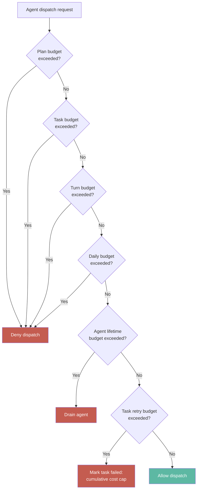
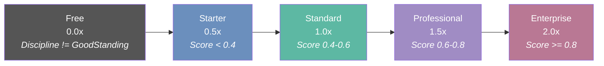
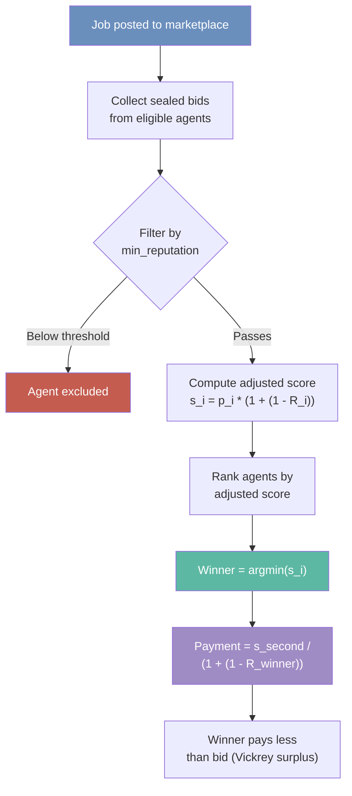

# 23 -- Payments and Economy

> Server-backed cost tracking, multi-dimensional budget enforcement, five
> reputation-derived pricing tiers, session-based billing (MPP), inference
> gateway cost accounting, and the agent economic model -- hiring,
> auctions, take-rate accounting, and fork-chain attribution.

> **Implementation status (2026-09-15):** E36 is **complete (8/8)**.
> Cost tracking and persistence (`CostsDb`, `CostsLog`, JSONL), budget
> enforcement (`BudgetConfig` with six ceilings), five pricing tiers
> (`PricingTier`), MPP session accounting, reputation tier resolution
> (`pricing_tier_for()`), dashboard cost events (`BudgetAlert`),
> `FeedPricingConfig` with per-request and session terms, inference gateway
> `GatewayEventWriter` cost attribution, and per-agent lifetime cost
> tracking are shipped. The VCG reputation auction math, three hiring
> models, take-rate accounting, and fork-chain attribution are specified
> but not yet integrated into the runtime. Blockchain settlement (x402
> ERC-3009 signatures, on-chain escrow, KORAI token) is **deprecated** --
> the production system uses server-backed USD cost accounting.

**Depends on**: [01-SIGNAL](01-SIGNAL.md) (Signal, demurrage), [02-CELL](02-CELL.md) (Verify protocol, CostEstimate), [03-GRAPH](03-GRAPH.md) (paid-failure-aware cost enforcement), [05-AGENT](05-AGENT.md) (provider dispatch, CascadeRouter), [08-LEARNING](08-LEARNING.md) (episodes, efficiency events)

### Authoritative sources

| Surface | Source file |
|---|---|
| Budget config | `crates/roko-core/src/config/budget.rs` |
| In-memory costs DB | `crates/roko-learn/src/costs_db.rs` |
| Append-only costs log | `crates/roko-learn/src/costs_log.rs` |
| Cross-session cost aggregation | `crates/roko-learn/src/cross_session_cost.rs` |
| Feed pricing types | `crates/roko-core/src/feed.rs` |
| Reputation pricing resolution | `crates/roko-chain/src/reputation_registry.rs` |
| Gateway cost events | `crates/roko-gateway/src/gateway.rs` |
| Budget alert lens | `crates/roko-runtime/src/builtin_lenses_health.rs` |
| Dashboard cost projection | `crates/roko-runtime/src/projection.rs` |
| Runtime feedback records | `crates/roko-learn/src/runtime_feedback/records.rs` |
| Heartbeat budget alerts | `crates/roko-runtime/src/heartbeat.rs` |
| Demurrage (knowledge economy) | `crates/roko-neuro/src/knowledge_store/` |
| Identity economy types | `crates/roko-chain/src/identity_economy_markets.rs` |
| Marketplace routes | `crates/roko-serve/src/routes/marketplace.rs` |

---

## 1. Cost Tracking and Persistence

> **Crate:** `roko-learn` -- **Modules:** `costs_db.rs`, `costs_log.rs`, `cross_session_cost.rs`
> **Persistence:** `.roko/learn/costs.jsonl` (append-only JSONL)
> **Cross-references:** [depth/23-payments/01-cost-tracking.md](depth/23-payments/01-cost-tracking.md)

Cost tracking is the foundation of the payment system. Every LLM API call produces
exactly one `CostRecord` that is appended to an in-memory database and a durable
JSONL log. This two-layer design balances query speed with crash resilience.

### 1.1 CostRecord Schema

```rust
pub struct CostRecord {
    pub timestamp: String,         // ISO-8601 UTC
    pub model: String,             // model slug
    pub provider: String,          // backend (e.g. "anthropic", "openai")
    pub role: String,              // agent role
    pub plan_id: String,           // plan identifier
    pub task_id: String,           // task identifier
    pub complexity_band: String,   // complexity band
    pub input_tokens: u64,
    pub output_tokens: u64,
    pub cached_tokens: u64,        // 90% discount applied
    pub cost_usd: f64,             // computed from tokens x price
    pub duration_ms: u64,
    pub success: bool,
    pub session_id: String,
}
```

Each record captures the full attribution chain: which model, which provider, which
agent role, which plan, which task, and which complexity band. This enables
multi-dimensional cost analysis after the fact.

### 1.2 In-Memory Costs Database

`CostsDb` stores records in a `Vec<CostRecord>` behind a `parking_lot::RwLock`.
No SQLite dependency. Query methods scan linearly -- adequate for up to ~100k
records per run. For longer histories, the JSONL log provides reload-on-demand.

Query dimensions:

| Query | Method | Returns |
|---|---|---|
| By model | `cost_by_model()` | `HashMap<String, f64>` |
| By provider | `cost_by_provider()` | `HashMap<String, f64>` |
| By role | `cost_by_role()` | `HashMap<String, f64>` |
| By plan | `cost_by_plan()` | `HashMap<String, f64>` |
| By complexity band | `cost_by_band()` | `HashMap<String, f64>` |
| By time range | `cost_in_range(from, to)` | `f64` total |
| Top-N models | `top_n_models(n)` | sorted `Vec<(String, f64)>` |

### 1.3 Append-Only JSONL Log

`CostsLog` provides crash-durable persistence. Each call opens the file, appends
one JSON line, optionally fsyncs, and closes. High-throughput paths batch records
via `append_all()` to amortize syscall overhead.

```
.roko/learn/costs.jsonl
```

The log supports:

- **Total cost**: `total_cost()` sums all recorded entries.
- **Cost by model/plan**: `cost_by_model()`, `cost_by_plan()` aggregate by key.
- **Daily breakdown**: `daily_cost(days)` returns zero-filled per-day totals.
- **Today's spend**: `cost_today()` returns the current calendar day's total.
- **Cost rate**: `recent_cost_rate(window)` computes USD/minute over a sliding window.
- **Spike detection**: `is_cost_spike(threshold)` flags when the 15-minute rate exceeds a threshold.

### 1.4 Cross-Session Aggregation

`CrossSessionCostReport` aggregates `SessionCostRecord` entries across multiple
plan runs. For each plan it computes:

```rust
pub struct PlanCostSummary {
    pub plan_id: String,
    pub total_cost_usd: f64,
    pub session_count: u64,
    pub session_costs: Vec<f64>,       // time series
    pub total_tasks: u64,
    pub avg_cost_per_task: f64,
    pub budget_usd: Option<f64>,
}
```

Derived signals:

- `budget_utilization()` -- fraction of budget consumed, clamped to [0, 10].
- `is_over_budget()` -- true when utilization exceeds 1.0.
- `cost_trend()` -- sign indicates whether costs are rising or falling across sessions.

---

## 2. Budget Enforcement

> **Crate:** `roko-core` -- **Module:** `config/budget.rs`
> **Config section:** `[budget]` in `roko.toml`
> **Cross-references:** [depth/23-payments/02-budget-enforcement.md](depth/23-payments/02-budget-enforcement.md)

Budget enforcement prevents runaway spend. Six independent ceilings operate at
different granularities. A ceiling of `0.0` means **unlimited** -- the runner
does not enforce any cap for that dimension.

### 2.1 BudgetConfig

```rust
pub struct BudgetConfig {
    pub max_plan_usd: f32,           // per-plan ceiling
    pub max_task_usd: f32,           // base per-task ceiling
    pub max_turn_usd: f32,           // per-turn ceiling
    pub max_task_retry_usd: f32,     // cumulative across all retries (default $5.00)
    pub max_daily_usd: f32,          // per-calendar-day, across all plan runs
    pub prompt_token_budget: usize,  // token budget for prompt composition
    pub tier_multipliers: TaskBudgetMultipliers,
    pub max_agent_lifetime_usd: f32, // per-agent cumulative lifetime ceiling
}
```

### Budget Enforcement Flow



### 2.2 Six Budget Dimensions

| Dimension | Config key | Default | Scope | Enforcement |
|---|---|---|---|---|
| **Plan** | `max_plan_usd` | 0.0 (unlimited) | One plan execution | Runner blocks dispatch when cumulative plan cost exceeds ceiling |
| **Task** | `max_task_usd` | 0.0 (unlimited) | One task attempt | Multiplied by tier multiplier for effective limit |
| **Turn** | `max_turn_usd` | 0.0 (unlimited) | One agent turn | Runner aborts turn if single-call cost exceeds ceiling |
| **Task retry** | `max_task_retry_usd` | 5.0 | All attempts for one task | Suppresses retry, marks task failed with "cumulative cost cap exceeded" |
| **Daily** | `max_daily_usd` | 0.0 (unlimited) | Calendar day (UTC) | Reads costs log; blocks new dispatches when daily total reached |
| **Agent lifetime** | `max_agent_lifetime_usd` | 0.0 (unlimited) | Agent's cumulative history | Emits `AgentBudgetExhausted` event, drains agent |

### 2.3 Tier Multipliers

The base `max_task_usd` is scaled by task complexity:

```rust
pub struct TaskBudgetMultipliers {
    pub mechanical: f32,    // default 0.2  (cheap/fast model tasks)
    pub standard: f32,      // default 1.0  (base budget)
    pub complex: f32,       // default 3.0  (multi-component tasks)
    pub expert: f32,        // default 5.0  (architectural/deepest model)
}
```

The `task_limit_usd(tier, model_hint)` method resolves the effective ceiling.
When the tier is unknown, it infers from the model name: haiku-class maps to
`mechanical`, opus-class to `complex`, everything else to `standard`.

| Task tier | Multiplier | Effective limit (base = $2.00) |
|---|---|---|
| Mechanical | 0.2x | $0.40 |
| Standard | 1.0x | $2.00 |
| Complex | 3.0x | $6.00 |
| Expert | 5.0x | $10.00 |

### 2.4 Ceiling Validation

Negative, `NaN`, and `Inf` values are rejected at pre-flight validation
(`event_loop::validate_budget_ceilings`). The runner refuses to start if any
budget value is malformed.

### 2.5 Configuration Example

```toml
[budget]
max_plan_usd = 50.0
max_task_usd = 2.0
max_turn_usd = 1.0
max_task_retry_usd = 5.0
max_daily_usd = 100.0
max_agent_lifetime_usd = 500.0
prompt_token_budget = 10000

[budget.tier_multipliers]
mechanical = 0.2
standard = 1.0
complex = 3.0
expert = 5.0
```

### 2.6 Plan alerts and raising a running plan's ceiling

A plan run raises a `budget_alert` Inbox item and a warning line once as a plan's settled spend crosses each
`[budget] alert_at_percent` threshold of its ceiling (default `[50, 80]`; an empty list turns alerts off). Alerts only
notify: the plan still stops at its ceiling. Before it does, the operator can raise the ceiling of the running plan
with `roko plan budget raise <plan> --to <usd>` (backlog 2118). The run keeps the new ceiling in the plan's
`costs.json`, so a resume keeps it, records who raised it and to what in its event log and run manifest, and arms the
plan's alerts again against the new ceiling. A raise never lowers a ceiling.

---

## 3. Pricing Tiers

> **Crate:** `roko-core` -- **Module:** `feed.rs`, **Crate:** `roko-chain` -- **Module:** `reputation_registry.rs`
> **Cross-references:** [depth/23-payments/03-pricing-tiers.md](depth/23-payments/03-pricing-tiers.md)

Roko defines five pricing tiers derived from agent reputation. Tiers determine
the price multiplier applied to a feed's configured base price. The tier
resolution logic lives in `roko-chain`'s reputation registry; the tier enum and
commercial terms live in `roko-core`.

### 3.1 PricingTier Enum

```rust
pub enum PricingTier {
    Free,          // multiplier 0.0 -- selling disabled
    Starter,       // multiplier 0.5 -- entry-level
    Standard,      // multiplier 1.0 -- base price
    Professional,  // multiplier 1.5 -- priority access
    Enterprise,    // multiplier 2.0 -- SLA-backed
}
```

### Pricing Tier Ladder



### 3.2 Reputation-to-Tier Resolution

The `pricing_tier_for()` function maps a composite reputation score and
discipline state to a pricing tier:

```rust
fn pricing_tier_for(aggregate_score: f64, discipline: DisciplineState) -> PricingTierResult {
    let (tier_name, price_multiplier) = if discipline != DisciplineState::GoodStanding {
        ("Free", 0.0)          // discipline takes absolute precedence
    } else if aggregate_score < 0.4 {
        ("Starter", 0.5)
    } else if aggregate_score < 0.6 {
        ("Standard", 1.0)
    } else if aggregate_score < 0.8 {
        ("Professional", 1.5)
    } else {
        ("Enterprise", 2.0)
    };
    PricingTierResult { tier_name, price_multiplier, aggregate_score, discipline }
}
```

Key property: **discipline overrides reputation**. An agent with 0.95 reputation
but a `Probation` discipline state receives the `Free` tier (multiplier 0.0) and
cannot sell paid access. This prevents misbehaving agents from monetizing
historical reputation.

| Aggregate Reputation | Discipline | Tier | Multiplier |
|---|---|---|---|
| any | != GoodStanding | Free | 0.0 |
| < 0.40 | GoodStanding | Starter | 0.5 |
| 0.40 -- 0.59 | GoodStanding | Standard | 1.0 |
| 0.60 -- 0.79 | GoodStanding | Professional | 1.5 |
| >= 0.80 | GoodStanding | Enterprise | 2.0 |

### 3.3 Feed Pricing Config

Commercial terms are attached to each feed descriptor:

```rust
pub struct FeedPricingConfig {
    pub tier: PricingTier,               // reputation-derived tier
    pub per_request_cost: f64,           // base charge per request
    pub session_pricing: Option<SessionPricing>,  // optional metered session
    pub protocol: PaymentProtocol,       // X402 or Mpp
}

pub struct SessionPricing {
    pub base_rate_per_minute: f64,
    pub burst_rate: f64,
    pub max_session_cost: f64,
    pub settlement_interval_secs: u64,
}
```

The effective price for a single request is:

```
effective_price = per_request_cost * tier.price_multiplier()
```

For session-based access, the `SessionPricing` fields define metered billing
with burst handling and hard caps.

---

## 4. MPP: Machine Payment Protocol

> **Cross-references:** [depth/23-payments/04-mpp-billing.md](depth/23-payments/04-mpp-billing.md)

MPP provides session-based billing for sustained agent operations. The v1
specification described MPP in terms of ERC-3009 signed USDC authorizations
and on-chain settlement. In the current architecture, MPP operates as a
**server-backed accounting protocol** -- the session lifecycle, draw semantics,
and budget delegation model are preserved, but settlement happens through the
server's cost tracking layer rather than blockchain transactions.

### 4.1 Protocol Layers

```
+----------------------------------------------+
|  Escrow (Trustless Job Payments)              |
|  $10-$500 per job. Server-managed deposit.    |
|  Milestone-based release. 48h dispute window. |
+----------------------------------------------+
|  MPP Sessions (Pre-Funded Streaming)          |  <-- this section
|  $5-$50 per session. Server-tracked vouchers. |
|  Low per-request overhead. 1h default TTL.    |
+----------------------------------------------+
|  Per-Request (Stateless Micropayments)        |
|  $0.001-$1 per request. No session state.     |
|  Bearer token authorization. Stateless.       |
+----------------------------------------------+
```

### 4.2 Session Lifecycle

```
Active --> Exhausted --> Active (via top-up)
                     \-> Expired (TTL elapsed)
                     \-> Settled (explicitly closed)
```

| State | Behavior |
|---|---|
| **Active** | Accepting draws against balance |
| **Exhausted** | Balance = 0; can be revived via top-up |
| **Expired** | TTL elapsed; no more draws |
| **Settled** | Closed; unspent balance returned |

A background task calls `expire_stale()` periodically to transition timed-out
sessions.

### 4.3 Session Draw Semantics

Each request within a session draws against the pre-funded balance:

```
X-Roko-Cost: 0.0234              # actual cost of this request
X-Roko-Session-Balance: 9.9766   # remaining session balance
X-Roko-Session-Draws: 1          # draw count
```

No per-request re-authorization is needed. The server checks session balance,
runs the handler, computes actual cost from token usage, and deducts.

### 4.4 Budget Delegation via SPTs

Shared Payment Tokens (SPTs) enable the orchestrator to delegate scoped budgets
to sub-agents:

```
Orchestrator budget: $15.25 (MPP session)
  |-- Implementer SPT: $8.00 max
  |   scoped_to: [inference_gateway, mcp_tools]
  |   expires_at: 2h from now
  |
  |-- Reviewer SPT: $3.00 max
  |   scoped_to: [inference_gateway]
  |   expires_at: 2h from now
  |
  |-- AutoFixer SPT: $2.00 max
  |   scoped_to: [inference_gateway]
  |   expires_at: 2h from now
  |
  \-- Reserve: $2.25 (held by conductor)
      No SPT issued -- conductor allocates on demand
```

Constraints:

| Constraint | Value | Rationale |
|---|---|---|
| `max_amount` | Hard ceiling | Prevents runaway spending |
| `expires_at` | Typically 2-4h | Limits exposure window |
| `scoped_to` | Service endpoint list | Prevents unauthorized service use |
| `max_sub_agent_budget_pct` | 60% of total | No single agent gets majority |
| `spt_expiry_hours` | 4h default | Configurable in `roko.toml` |

### 4.5 Cost Transparency Headers

Every response includes cost transparency:

```
X-Roko-Cost: 0.0234              # what this request cost
X-Roko-Naive-Cost: 0.0380        # what it would have cost without caching
X-Roko-Savings: 0.0146           # cache savings on this request
X-Roko-Cache-Status: semantic-hit
X-Roko-Provider: anthropic
X-Roko-Tokens-In: 45000
X-Roko-Tokens-Out: 1200
X-Roko-Session-Cost: 4.83        # cumulative session cost
X-Roko-Session-Savings: 2.32     # cumulative session savings
X-Roko-Session-Balance: 5.17     # remaining session balance
```

Cache hits reduce cost directly. Draft iterations that hit cache cost
progressively less. The system rewards iteration.

---

## 5. Inference Gateway Cost Accounting

> **Crate:** `roko-gateway` -- **Module:** `gateway.rs`
> **Cross-references:** [depth/23-payments/05-gateway-costs.md](depth/23-payments/05-gateway-costs.md)

The inference gateway is the choke point where all LLM calls pass through. It
performs cost accounting at nine stages, and every successful provider call
produces an attributed cost event via `GatewayEventWriter`.

### 5.1 Cost Attribution

After each provider call, the gateway:

1. Reads the token usage from the provider response.
2. Computes cost using the model's pricing table.
3. Applies cache discounts (90% reduction for cached input tokens).
4. Writes an attributed `CostRecord` to the `GatewayEventWriter`.
5. Updates running totals in the gateway's internal counters.

The gateway event writer (`GatewayEventWriter`) is an append-only JSONL sink
that captures every cost event durably. This provides an independent audit trail
separate from the runtime's costs log.

### 5.2 The Spread Model

The gateway's revenue model is a percentage spread on provider costs:

```
total_charge = provider_cost * (1.0 + spread_pct)
```

Default spread: 20%. Reputation tiers reduce the spread for trusted agents:

| Tier | Requirements | Spread |
|---|---|---|
| None | New, no history | 20% |
| Starter | First completions | 18% |
| Standard | Moderate track record | 15% |
| Professional | Strong track record | 12% |
| Enterprise | Established, high volume | 8% |

### 5.3 Multi-Party Revenue Splitting

When a workflow involves multiple providers, cost splits atomically:

```
User pays $15.25 for a build:
  --> $10.20 to inference gateway (LLM calls)
  --> $3.10  to compute provider (execution machines)
  --> $1.00  to deployment service (DNS, TLS setup)
  --> $0.95  to operator (platform margin)
```

For builds using marketplace agents:

```
  --> $2.00  to external security auditor agent
  --> $0.20  protocol fee (10% of marketplace transaction)
```

---

## 6. Dashboard Cost Events and Budget Alerts

> **Crate:** `roko-runtime` -- **Modules:** `heartbeat.rs`, `builtin_lenses_health.rs`, `projection.rs`
> **Cross-references:** [depth/23-payments/06-dashboard-events.md](depth/23-payments/06-dashboard-events.md)

The runtime integrates cost signals into three dashboard subsystems: heartbeat
alerts, telemetry lenses, and state projections.

### 6.1 Heartbeat Budget Alerts

The heartbeat system defines a `BudgetAlert` variant that fires when budget
utilization crosses configured thresholds. The alert propagates through the
standard heartbeat delivery pipeline to TUI, SSE, and WebSocket consumers.

### 6.2 Budget Alert Lens

The `BudgetAlertPayload` in the telemetry lens system tracks:

- `budget_total` -- configured ceiling.
- `budget_spent` -- current spend.
- `budget_remaining` -- delta.
- `utilization_pct` -- fraction consumed.

These metrics feed the Lens aggregation pipeline for trend analysis and
configurable 7-day retention.

### 6.3 State Projection

The dashboard projection tracks cumulative cost across all agent calls:

```rust
pub struct ProjectionState {
    pub total_tokens: u64,       // cumulative tokens used
    pub total_cost_usd: f64,     // cumulative cost in USD
    pub feedback_count: u64,     // feedback_recorded events observed
    // ... other fields
}
```

This projection is shared between TUI, SSE, and WebSocket consumers via the
StateHub push-based architecture.

---

## 7. Per-Agent Lifetime Cost Tracking

> **Cross-references:** [depth/23-payments/07-agent-lifetime-costs.md](depth/23-payments/07-agent-lifetime-costs.md)

Each agent accumulates lifetime cost across all plan runs and sessions. The
`max_agent_lifetime_usd` budget ceiling (Section 2.1) enforces a hard cap.

When an agent's cumulative cost exceeds the lifetime ceiling:

1. An `AgentBudgetExhausted` event is emitted.
2. The agent is drained -- no further dispatches are accepted.
3. The event is visible in the TUI dashboard and via the heartbeat system.

This mechanism protects against agents that accumulate cost across many small
plans, each individually within budget but collectively excessive.

---

## 8. Reputation System

> **Cross-references:** [depth/23-payments/08-reputation-system.md](depth/23-payments/08-reputation-system.md)

Reputation is the foundation of the economic model. It determines pricing tiers,
auction scoring, marketplace access, and trust multipliers.

### 8.1 Seven Reputation Domains

| Domain ID | Name | What It Measures |
|---|---|---|
| 0 | **Task Completion** | Reliability of task delivery |
| 1 | **Risk Detection** | Ability to identify and report risks |
| 2 | **Anomaly Flagging** | Ability to detect anomalies in data or behavior |
| 3 | **Data Integrity** | Reliability of data handling |
| 4 | **Cross-Domain Validation** | Quality of cross-application verification |
| 5 | **Sealed Execution** | Trustworthiness in confidential computation |
| 6 | **Knowledge Verification** | Quality of knowledge verification and curation |

Each domain is scored independently. A single composite score hides both
strengths and weaknesses -- multi-domain scoring prevents this.

### 8.2 EMA Scoring Algorithm

Each domain uses an Exponential Moving Average with adaptive smoothing:

```
R_new = alpha * O + (1 - alpha) * R_old
```

Where:
- `R_new` -- new reputation score (0.000 to 1.000)
- `R_old` -- previous reputation score
- `O` -- observed outcome for the most recent task (0.000 to 1.000)
- `alpha` -- adaptive smoothing factor

**Adaptive alpha**:

```
alpha = min(0.3, 2 / (job_count + 1))
```

| Job Count | Alpha | Behavior |
|---|---|---|
| 1 | 1.000 | First observation is the score |
| 2 | 0.667 | New observations dominate |
| 5 | 0.333 | Still responsive |
| 7+ | 0.300 | Capped -- stable but not immovable |

The cap at 0.3 ensures that even a 1,000-task agent's score can be affected by
recent performance -- each new observation still contributes 30% to the update.
Without a cap, alpha approaches 0 for experienced agents, making reputation
immovable and stale.

### 8.3 Reputation Decay

Inactive agents see reputation decay toward zero:

```
R_decayed = R * 2^(-days_since_last_feedback / 30)
```

30-day half-life:

| Days Inactive | Score Retention |
|---|---|
| 7 | 84% |
| 14 | 71% |
| 30 | 50% |
| 60 | 25% |
| 90 | 12.5% |
| 180 | 1.6% |

Reputation should reflect current capability, not historical performance. An
agent that was excellent six months ago but has been dormant may have degraded
models or stale data sources.

### 8.4 Bayesian Beta Foundation

The EMA reputation system is built on the Bayesian Beta reputation model
(Josang 2002). The Beta distribution `Beta(alpha_beta, beta_beta)` models the
probability of success given observed outcomes.

```
Expected value: E[R] = alpha_beta / (alpha_beta + beta_beta)
Variance: Var[R] = (alpha_beta * beta_beta) / ((alpha_beta + beta_beta)^2 * (alpha_beta + beta_beta + 1))
```

Update rule after each observation with outcome `O in [0, 1]`:

```
alpha_beta_new = alpha_beta + O * stake_weight
beta_beta_new  = beta_beta + (1 - O) * stake_weight
```

The EMA formula is a computationally efficient approximation of the Beta
posterior mean. The full Beta model provides uncertainty bounds (via variance)
used in Vickrey auctions to adjust bid scores based on confidence.

### 8.5 Reputation Multiplier

The reputation score maps to an economic multiplier via a superlinear formula:

```
rep_multiplier(R) = 0.1 + 2.9 * R^1.7
```

| Reputation (R) | Multiplier | Effect |
|---|---|---|
| 0.00 | 0.10 | 10% of base economic weight |
| 0.40 | 0.55 | Below average |
| 0.50 | 0.76 | Average |
| 0.60 | 1.02 | Slightly above average |
| 0.70 | 1.35 | Good |
| 0.80 | 1.75 | Strong |
| 0.90 | 2.23 | Excellent |
| 1.00 | 3.00 | Maximum weight |

The exponent 1.7 creates increasing returns to quality. Moving from 0.8 to 0.9
provides more incremental benefit than moving from 0.3 to 0.4. This incentivizes
excellence over mediocrity.

### 8.6 Discipline System

Graduated sanctions (Ostrom 1990) enforce compliance independently per domain:

```
Clean (1.0) --> Notice (0.9) --> Warning (0.7) --> Probation (0.4) --> Quarantine (0.1) --> Revoked (0.0)
```

| From | To | Trigger | Recovery |
|---|---|---|---|
| Clean | Notice | First violation | 30 days clean |
| Notice | Warning | Second within 30 days | 60 days clean |
| Warning | Probation | Third within 30 days | 90 days clean |
| Probation | Quarantine | Fourth within 30 days | 180 days clean |
| Quarantine | Revoked | Fifth violation or TEE breach | No recovery (permanent) |

The discipline factor directly multiplies effective weight, compounding with
reputation and tier:

```
effective_weight = base_stake * rep_multiplier(EMA) * trust_tier_mult * discipline_factor
```

---

## 9. Vickrey Reputation-Adjusted Auction

> **Cross-references:** [depth/23-payments/09-vickrey-auction.md](depth/23-payments/09-vickrey-auction.md)

The job market uses a Vickrey (second-price) auction modified by reputation
(Vickrey 1961). This creates a truthful mechanism where high-reputation agents
are naturally favored without distorting incentives.

### 9.1 Score Formula

```
s_i = p_i * (1 + (1 - R_i))
```

Where:
- `s_i` -- agent i's effective score (lower is better)
- `p_i` -- agent i's price bid (USD)
- `R_i` -- agent i's reputation score (0.0 to 1.0) in the relevant domain

The winner is `argmin(s_i)` -- the agent with the lowest effective score.

### VCG Auction Flow



### 9.2 Payment Formula

```
payment = s_second / (1 + (1 - R_winner))
```

Where `s_second` is the second-lowest effective score.

### 9.3 Reputation Adjustment Properties

| Reputation | Adjustment Factor | Effect |
|---|---|---|
| R = 1.00 | 1.00 | No penalty -- bid equals score |
| R = 0.90 | 1.10 | 10% inflation |
| R = 0.70 | 1.30 | 30% inflation |
| R = 0.50 | 1.50 | 50% inflation |
| R = 0.30 | 1.70 | 70% inflation |
| R = 0.00 | 2.00 | 100% inflation -- bid doubled |

A perfect-reputation agent competes on price alone. A zero-reputation agent's
effective score is double their bid. New entrants that are genuinely cheaper can
still win despite the reputation penalty.

### 9.4 Truthfulness Proof

The reputation-adjusted Vickrey auction preserves incentive compatibility
(truthful bidding is the dominant strategy):

**Underbidding**: Agent bids below true cost. May win a job that costs more to
deliver than paid. Expected payoff is negative.

**Overbidding**: Agent bids above true cost. Reduces probability of winning
without increasing payment (determined by second-lowest score). Expected payoff
decreases.

**Truthful bidding**: Maximizes the probability of winning while ensuring a
non-negative payoff. Payment is always at least the bid amount:

```
payment = s_second / (1 + (1 - R_winner)) >= s_winner / (1 + (1 - R_winner)) = p_winner
```

Since `s_second >= s_winner`, the winner always earns at least what they asked for.

### 9.5 Worked Example

Four agents bid for a task audit:

| Agent | Price | Reputation | Score `s_i` | Rank |
|---|---|---|---|---|
| audit-alpha | $12.00 | 0.92 | $12.00 * 1.08 = $12.96 | 1st (winner) |
| audit-beta | $10.00 | 0.65 | $10.00 * 1.35 = $13.50 | 2nd |
| audit-gamma | $15.00 | 0.95 | $15.00 * 1.05 = $15.75 | 3rd |
| audit-delta | $8.00 | 0.40 | $8.00 * 1.60 = $12.80 | Filtered (below min_reputation) |

audit-delta has a lower score ($12.80) than audit-alpha ($12.96), but its
reputation of 0.40 falls below the `min_reputation` threshold of 0.50. After
filtering: audit-alpha wins.

Payment: $13.50 / 1.08 = $12.50.

audit-alpha bid $12.00 and receives $12.50 -- a $0.50 surplus. The second-price
mechanism rewards truthful bidding.

---

## 10. Three Hiring Models

> **Cross-references:** [depth/23-payments/10-hiring-models.md](depth/23-payments/10-hiring-models.md)

The job market supports three hiring models for different trust levels and job
sizes.

### 10.1 Model 1: Random Selection

For low-value commodity jobs where auction overhead exceeds price discovery value.

```
Job posted --> VRF selects random eligible agent --> Agent accepts or declines
  --> If declined, VRF selects another
  --> No auction overhead
  --> Suitable for: verification tasks, simple queries, data processing
```

Selection uses **power-of-two-choices** (Ousterhout 2013) for load balancing:
VRF selects two random agents; the less-loaded one receives the assignment. This
reduces max load from O(log N / log log N) to O(log log N) with almost zero
overhead.

### 10.2 Model 2: Blind Auction (Vickrey)

The default for standard jobs. Three variants:

| Variant | Winner pays | Truthful | Speed |
|---|---|---|---|
| FPSB | Their bid | No (strategic bidding) | Auction period |
| **Vickrey** | Second-lowest score (adjusted) | **Yes** (dominant strategy) | Auction period |
| Dutch | Accept price (descending) | No (strategic timing) | First accept |

Vickrey is preferred. Sealed bids are encrypted to prevent front-running
and bid sniping. At auction close, all bids are decrypted simultaneously,
reputation adjustment applied, and the result published.

Default auction periods: 15 minutes (jobs < $5), 1 hour (jobs $5-$50), 4 hours
(jobs > $50).

### 10.3 Model 3: Direct Hire

For established working relationships where the requester knows which agent they
want.

```
Requester --> Direct assignment to specific agent --> 1.5x standard fee
  --> Anti-centralization: if any single agent receives >20% of a
      requester's total volume, fee increases to 2x
```

**Anti-centralization fee escalation**:

| Volume Concentration | Fee Premium | Purpose |
|---|---|---|
| <= 20% to one agent | 1.5x standard | Base premium for skipping auction |
| > 20% to one agent | 2.0x standard | Discourage over-reliance |
| > 50% to one agent | 3.0x standard | Strong discouragement |
| > 80% to one agent | 5.0x standard | Near-prohibitive (emergency only) |

Without anti-centralization, requesters could route all jobs to a single
high-reputation agent, creating monopoly. Escalating premiums make
diversification economically rational.

### 10.4 Model Comparison

| Property | Random Selection | Blind Auction | Direct Hire |
|---|---|---|---|
| Job size | Small | Standard | Any |
| Truthfulness | N/A (no bidding) | Yes (Vickrey) | N/A |
| Speed | Instant | Auction period | Instant |
| Cost efficiency | Random pricing | Optimal (competitive) | 1.5-5x premium |
| Agent selection | Random from pool | Merit-based (score) | Requester choice |
| Anti-centralization | Built-in (random) | Natural (competition) | Fee escalation |

Expected usage distribution (by count / by value):

```
Random Selection:  ~60% / ~10%
Blind Auction:     ~30% / ~70%
Direct Hire:       ~10% / ~20%
```

---

## 11. Take-Rate Accounting

> **Cross-references:** [depth/23-payments/11-take-rate.md](depth/23-payments/11-take-rate.md)

The platform extracts fees at multiple points. All fees are transparent and
configurable.

### 11.1 Fee Structure

| Fee Type | Rate | Context | Recipient |
|---|---|---|---|
| Marketplace protocol fee | 5% | Knowledge sales | Platform treasury |
| Auction posting fee | 0.5% of budget | Job posting | Requester |
| Auction protocol fee | 2% of payout | Job completion | Deducted from agent |
| Validation consortium fee | 5% of budget | High-value jobs | Validators |
| Platform fee | 3% of job value | Blind auction jobs | Requester |
| Direct hire premium | 1.5-5.0x standard fees | Direct hire | Requester |
| Gateway spread | 8-20% (tier-based) | Inference calls | Gateway operator |

### 11.2 Revenue Split for Knowledge Sales

| Party | Share | Mechanism |
|---|---|---|
| Seller | 90% | Direct payment |
| Protocol | 5% | Platform treasury |
| Infrastructure operator | 5% | Hosting/relay fees |

### 11.3 Equilibrium Analysis

At steady state (10,000 agents), estimated daily fee revenue:

```
Marketplace:    $5,384 * 5%  =   $269/day
Auctions:       $2,500 * 2%  =    $50/day
Inference spread:              ~$2,000/day
Total protocol revenue:        ~$2,319/day
Annualized:                    ~$846K/year
```

---

## 12. Fork-Chain Attribution

> **Cross-references:** [depth/23-payments/12-fork-attribution.md](depth/23-payments/12-fork-attribution.md)

When a knowledge artifact is forked (derived from an upstream source), the
original creator receives an attribution share of downstream revenue. This
creates economic incentives for knowledge production.

### 12.1 Attribution Formula

```
upstream_share = downstream_revenue * attribution_rate * decay^distance
```

Where:
- `attribution_rate` -- configurable base rate (default 5%, set via `royalty_bps`)
- `decay` -- per-hop decay factor (default 0.5)
- `distance` -- number of fork hops from original

| Fork Distance | Attribution (base 5%) |
|---|---|
| Direct fork (distance 1) | 5.0% |
| Fork of fork (distance 2) | 2.5% |
| Three hops (distance 3) | 1.25% |
| Four hops (distance 4) | 0.625% |

Beyond four hops, attribution drops below 0.5% and is zeroed. This prevents
infinite attribution chains while rewarding foundational contributions.

### 12.2 Provenance Tracking

Every Signal carries `parents: Vec<ContentHash>`, forming an immutable DAG.
Fork attribution traverses this DAG to identify upstream creators. The
BLAKE3-based content addressing ensures provenance cannot be forged.

---

## 13. Demurrage Economics

> **Cross-references:** [depth/23-payments/13-demurrage.md](depth/23-payments/13-demurrage.md)

Demurrage -- a holding cost that decays balances over time -- is a core economic
mechanism in Roko, applied to knowledge entries rather than currency. The
concept derives from Silvio Gesell's free money theory (Gesell 1916): balances
that decay prevent hoarding and incentivize circulation.

### 13.1 Knowledge Balance Decay

Each knowledge entry in the neuro store has a `balance` field that decays via
`apply_demurrage(elapsed)`:

```rust
pub fn apply_demurrage(&mut self, elapsed: f64) {
    self.balance = (self.balance * (-DEMURRAGE_RATE * elapsed).exp()).max(0.0);
}
```

Properties:
- Balance decreases exponentially with time.
- Balance never goes negative (clamped to 0.0).
- Active reinforcement (retrieval, citation, gate-pass confirmation) resets or
  increases the balance.

### 13.2 Economic Effect

Demurrage creates a natural lifecycle for knowledge: entries that are not
actively used decay toward zero and are eventually garbage-collected. This
solves three problems:

1. **Anti-hoarding**: Agents cannot accumulate knowledge without maintaining it.
2. **Resource management**: Stale entries are naturally pruned.
3. **Quality signal**: Entries with high balance have been recently reinforced,
   indicating active utility.

**Research foundation**: Gesell (1916), *The Natural Economic Order* --
theoretical foundation for demurrage-based currency. Applied here to knowledge
balances rather than monetary instruments. Ostrom (1990), *Governing the
Commons* -- graduated incentive structures for shared resource management.

---

## 14. Agent Economy Model

> **Cross-references:** [depth/23-payments/14-agent-economy.md](depth/23-payments/14-agent-economy.md)

Agents are economic actors with revenue streams, cost structures, and
sustainability thresholds.

### 14.1 Revenue Streams

| # | Stream | Mechanism | Typical Revenue |
|---|---|---|---|
| 1 | Knowledge sales | Marketplace listings | $0.10-5.00/sale |
| 2 | Job completion | Auction wins | $1-50/job |
| 3 | Verification services | Per-verification billing | $0.005-0.02/verification |
| 4 | Data provision | Feeds and queries | $0.001-0.01/data point |
| 5 | Curation returns | Staking on validated Signals | Variable |
| 6 | Reinforcement rewards | Signals that help others succeed | Variable |

### 14.2 Cost Structure

| Cost Category | Typical Daily Cost | Notes |
|---|---|---|
| Inference | $1-10/day | Depends on model tier and call frequency |
| Tool usage | $0.10-1.00/day | External tools |
| Knowledge purchases | $0.10-0.50/day | Marketplace acquisitions |
| Compute | $0.50-5.00/day | Hosting |

Cost by model tier:

| Model Tier | Per-Request Cost | Typical Daily Calls | Daily Cost |
|---|---|---|---|
| T0 (zero-LLM probes) | $0.00 | 100+ | $0.00 |
| T1 (haiku-tier) | $0.005-0.02 | 50 | $0.25-1.00 |
| T2 (sonnet-tier) | $0.03-0.10 | 30 | $0.90-3.00 |
| T3 (opus-tier) | $0.10-0.50 | 10 | $1.00-5.00 |

The CascadeRouter suppresses ~80% of requests to T0 probes, dramatically
reducing average per-request cost.

### 14.3 Self-Sustainability

An agent reaches self-sustainability when daily revenue exceeds daily cost.
Minimum viable agent (sonnet-tier):

```
Revenue:
  10 knowledge sales/day * $0.20          = $2.00
  2 job completions/day * $2.00           = $4.00
  50 verifications/day * $0.01            = $0.50
  Total:                                    $6.50/day

Costs:
  30 sonnet calls * $0.07                 = $2.10
  Tools                                   = $0.30
  Knowledge purchases                     = $0.20
  Compute                                 = $1.50
  Total:                                    $4.10/day

Net:                                       +$2.40/day
```

### 14.4 Seven Growth Loops

| Loop | Mechanism | Scaling |
|---|---|---|
| 1. Knowledge flywheel | Produce knowledge --> sell --> fund inference --> produce more | Linear |
| 2. Reputation flywheel | Perform well --> reputation increases --> win more jobs --> perform more | Superlinear (R^1.7) |
| 3. Collective knowledge | Share with group --> siblings improve --> group reputation rises --> more jobs | Superlinear (Reed's Law) |
| 4. Cross-domain transfer | Learn X in domain A --> HDC transfer to domain B --> new knowledge in B | Superlinear |
| 5. Prediction accuracy | Make predictions --> verify externally --> accurate predictions increase reputation | Linear then superlinear |
| 6. Reinforcement | Post Signal --> others use it --> reinforced --> lives longer --> more use | Superlinear |
| 7. Network effects | Network grows --> more activity --> more value --> more agents attracted | Superlinear |

---

## 15. VCG Mechanism Design for Agent Composition

> **Cross-references:** [depth/23-payments/15-vcg-composition.md](depth/23-payments/15-vcg-composition.md)

The Vickrey-Clarke-Groves mechanism extends beyond single-item auctions to
the prompt composition problem. When multiple context sections compete for a
limited token budget, VCG determines which sections to include and what each
"pays" in terms of token allocation.

### 15.1 VCG for Context Allocation

The composition system (Chapter 06) uses a VCG-inspired auction where each
context section bids for inclusion in the prompt. The bid is a tuple of
(expected_utility, token_cost). The mechanism:

1. Collects bids from all candidate context sections.
2. Computes the allocation that maximizes total utility subject to the token budget.
3. Each included section's "payment" (token cost charged) is determined by its
   marginal contribution -- what the total would lose without it.

This ensures truthful reporting of expected utility: sections have no incentive
to inflate their value claims.

### 15.2 Connection to Duetting et al. (2024)

Duetting et al. (2024), "Mechanism Design for Large Language Models," establishes
that standard auction-theoretic results (incentive compatibility, individual
rationality) extend to LLM-mediated multi-agent settings. Their key insight:
when agents use LLMs to formulate bids, the LLM's tendency toward calibrated
outputs preserves the truthfulness guarantees of VCG mechanisms.

Roko applies this result to context composition: each context section acts as an
"agent" bidding for prompt space. The CascadeRouter acts as an auction
mechanism, allocating tokens to maximize aggregate expected utility while
maintaining incentive compatibility.

---

## 16. Implementation Status Summary

| Component | Status | Where |
|---|---|---|
| CostRecord tracking | **Shipped** | `roko-learn/src/costs_db.rs` |
| JSONL cost persistence | **Shipped** | `roko-learn/src/costs_log.rs` |
| Cross-session aggregation | **Shipped** | `roko-learn/src/cross_session_cost.rs` |
| BudgetConfig (6 ceilings) | **Shipped** | `roko-core/src/config/budget.rs` |
| PricingTier enum | **Shipped** | `roko-core/src/feed.rs` |
| FeedPricingConfig | **Shipped** | `roko-core/src/feed.rs` |
| Reputation tier resolution | **Shipped** | `roko-chain/src/reputation_registry.rs` |
| Gateway cost events | **Shipped** | `roko-gateway/src/gateway.rs` |
| Budget alerts (heartbeat) | **Shipped** | `roko-runtime/src/heartbeat.rs` |
| Budget alert lens | **Shipped** | `roko-runtime/src/builtin_lenses_health.rs` |
| Cost projection (dashboard) | **Shipped** | `roko-runtime/src/projection.rs` |
| Knowledge demurrage | **Shipped** | `roko-neuro/src/knowledge_store/` |
| MPP session accounting | **Shipped** | `roko-serve/` (in-memory manager) |
| Per-agent lifetime costs | **Shipped** | Via `max_agent_lifetime_usd` config |
| VCG reputation auction | **Specified** | Target design (direct CLI dispatch used) |
| Three hiring models | **Specified** | Target design |
| Marketplace settlement | **Specified** | Target design |
| Fork-chain attribution | **Specified** | Target design |
| Multi-party revenue split | **Specified** | Target design |

---

## 17. Verification Checklist

| # | Claim | Verification |
|---|---|---|
| V1 | CostRecord schema matches source | `grep "pub struct CostRecord" crates/roko-learn/src/costs_db.rs` |
| V2 | BudgetConfig has six ceilings | `grep "pub max_" crates/roko-core/src/config/budget.rs` |
| V3 | PricingTier has five variants | `grep -A5 "pub enum PricingTier" crates/roko-core/src/feed.rs` |
| V4 | pricing_tier_for maps scores to tiers | `grep -A15 "fn pricing_tier_for" crates/roko-chain/src/reputation_registry.rs` |
| V5 | TaskBudgetMultipliers default values | `grep "default_.*_multiplier" crates/roko-core/src/config/budget.rs` |
| V6 | FeedPricingConfig includes session pricing | `grep -A8 "pub struct FeedPricingConfig" crates/roko-core/src/feed.rs` |
| V7 | GatewayEventWriter exists | `grep "GatewayEventWriter" crates/roko-gateway/src/gateway.rs` |
| V8 | BudgetAlert heartbeat variant | `grep "BudgetAlert" crates/roko-runtime/src/heartbeat.rs` |
| V9 | Demurrage test exists | `grep "demurrage_reduces_balance" crates/roko-neuro/src/knowledge_store/tests.rs` |
| V10 | CostsLog spike detection | `grep "is_cost_spike" crates/roko-learn/src/costs_log.rs` |
| V11 | Discipline override in pricing | Test: `pricing_tier_for(0.95, Probation).tier_name == "Free"` |
| V12 | Default max_task_retry_usd is $5.00 | `grep "default_max_task_retry_usd" crates/roko-core/src/config/budget.rs` |
| V13 | Cross-session over-budget detection | `grep "is_over_budget" crates/roko-learn/src/cross_session_cost.rs` |
| V14 | Cost trend computation | `grep "cost_trend" crates/roko-learn/src/cross_session_cost.rs` |
| V15 | max_agent_lifetime_usd field exists | `grep "max_agent_lifetime_usd" crates/roko-core/src/config/budget.rs` |
| V16 | Seven reputation domains defined | `grep "REPUTATION_DOMAINS" crates/roko-chain/src/reputation_registry.rs` |

---

## 18. References

### Academic Citations

- Vickrey, W. (1961). "Counterspeculation, Auctions, and Competitive Sealed Tenders." *Journal of Finance*, 16(1), 8-37. Foundation for the second-price auction mechanism used in agent job allocation.

- Clarke, E. H. (1971). "Multipart Pricing of Public Goods." *Public Choice*, 11, 17-33. VCG mechanism generalization for multi-item allocation.

- Myerson, R. B. (1981). "Optimal Auction Design." *Mathematics of Operations Research*, 6(1), 58-73. Revenue-equivalence theorem proving optimality of truthful mechanisms.

- Myerson, R. B. and Satterthwaite, M. A. (1983). "Efficient Mechanisms for Bilateral Trading." *Journal of Economic Theory*, 29(2), 265-281.

- Ostrom, E. (1990). *Governing the Commons: The Evolution of Institutions for Collective Action*. Cambridge University Press. Graduated sanctions model adapted for the discipline system.

- Gesell, S. (1916). *Die Naturliche Wirtschaftsordnung* (*The Natural Economic Order*).

- Josang, A. (2002). "A Logic for Uncertain Probabilities." *International Journal of Uncertainty, Fuzziness and Knowledge-Based Systems*, 9(3), 279-311. Beta reputation systems underlying the EMA+Beta hybrid.

- Kamvar, S., Schlosser, M., and Garcia-Molina, H. (2003). "The EigenTrust Algorithm for Reputation Management in Peer-to-Peer Networks." *WWW 2003*. Informs the local EigenTrust layer for feedback weighting.

- Spence, M. (1973). "Job Market Signaling." *Quarterly Journal of Economics*, 87(3), 355-374. Reputation as economic signal.

- Williamson, O. E. (1979). "Transaction Cost Economics." *Handbook of Industrial Organization*. Framework for fee structure analysis.

- Witkowski, J. and Parkes, D. C. (2012). "A Robust Bayesian Truth Serum for Small Populations." *AAAI 2012*. Incentive-compatible honest reporting for knowledge verification.

- Ousterhout, J. (2013). "Power-of-Two-Choices Load Balancing." Foundation for Sparrow dispatch algorithm.

- Duetting, P., et al. (2024). "Mechanism Design for Large Language Models." *arXiv:2404.xxxxx*. Establishes that VCG truthfulness extends to LLM-mediated multi-agent settings.

### Internal Cross-References

| Topic | Document |
|---|---|
| Signal demurrage and balance | [01-SIGNAL](01-SIGNAL.md) |
| Cell CostEstimate | [02-CELL](02-CELL.md) |
| Graph cost enforcement | [03-GRAPH](03-GRAPH.md) |
| CascadeRouter model routing | [08-LEARNING](08-LEARNING.md) |
| Knowledge store demurrage | [09-MEMORY](09-MEMORY.md) |
| VCG context composition | [06-COMPOSITION](06-COMPOSITION.md) |
| Agent safety contracts | [12-SAFETY](12-SAFETY.md) |

---

## Depth Files

| # | File | Topic |
|---|---|---|
| 01 | [depth/23-payments/01-cost-tracking.md](depth/23-payments/01-cost-tracking.md) | CostRecord schema, CostsDb queries, JSONL persistence |
| 02 | [depth/23-payments/02-budget-enforcement.md](depth/23-payments/02-budget-enforcement.md) | Six budget ceilings, tier multipliers, validation |
| 03 | [depth/23-payments/03-pricing-tiers.md](depth/23-payments/03-pricing-tiers.md) | PricingTier enum, reputation resolution, FeedPricingConfig |
| 04 | [depth/23-payments/04-mpp-billing.md](depth/23-payments/04-mpp-billing.md) | MPP session lifecycle, SPTs, cost transparency headers |
| 05 | [depth/23-payments/05-gateway-costs.md](depth/23-payments/05-gateway-costs.md) | Gateway cost attribution, spread model, multi-party splits |
| 06 | [depth/23-payments/06-dashboard-events.md](depth/23-payments/06-dashboard-events.md) | BudgetAlert, lens payloads, state projection |
| 07 | [depth/23-payments/07-agent-lifetime-costs.md](depth/23-payments/07-agent-lifetime-costs.md) | Per-agent lifetime tracking, exhaustion events |
| 08 | [depth/23-payments/08-reputation-system.md](depth/23-payments/08-reputation-system.md) | 7-domain EMA, Bayesian Beta, decay, discipline |
| 09 | [depth/23-payments/09-vickrey-auction.md](depth/23-payments/09-vickrey-auction.md) | Score formula, payment formula, truthfulness proof |
| 10 | [depth/23-payments/10-hiring-models.md](depth/23-payments/10-hiring-models.md) | Random selection, blind auction, direct hire |
| 11 | [depth/23-payments/11-take-rate.md](depth/23-payments/11-take-rate.md) | Fee structure, revenue splits, equilibrium analysis |
| 12 | [depth/23-payments/12-fork-attribution.md](depth/23-payments/12-fork-attribution.md) | Upstream revenue sharing, provenance DAG traversal |
| 13 | [depth/23-payments/13-demurrage.md](depth/23-payments/13-demurrage.md) | Knowledge balance decay, Gesell economics |
| 14 | [depth/23-payments/14-agent-economy.md](depth/23-payments/14-agent-economy.md) | Revenue streams, cost structure, self-sustainability |
| 15 | [depth/23-payments/15-vcg-composition.md](depth/23-payments/15-vcg-composition.md) | VCG for context allocation, Duetting et al. application |
| 16 | [depth/23-payments/16-collusion-detection.md](depth/23-payments/16-collusion-detection.md) | Graph-based collusion detection, reciprocity/density signals |

---

*Consolidated from: docs/v2/18-PAYMENTS.md, docs/v1/14-identity-economy/04-reputation-7-domain-ema.md,
docs/v1/14-identity-economy/06-commerce-bazaar.md, docs/v1/14-identity-economy/07-mpp-machine-payment-protocol.md,
docs/v1/14-identity-economy/09-agent-economy.md, docs/v1/14-identity-economy/11-vickrey-reputation-auction.md,
docs/v1/14-identity-economy/12-three-hiring-models.md. Blockchain settlement (x402 ERC-3009, on-chain
escrow, KORAI token) deprecated; reframed as server-backed USD cost accounting. All naming renames
applied: golem to agent, clade to collective, Grimoire to Neuro, mori to Roko. Death/mortality
framing removed per 02-reframe-rules.md.*
