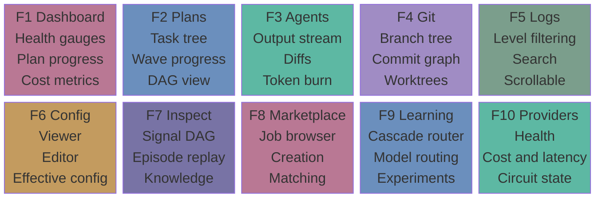
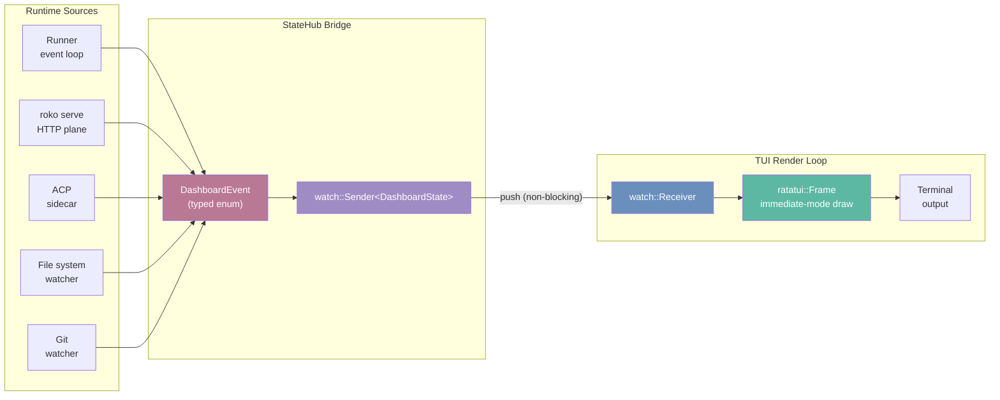
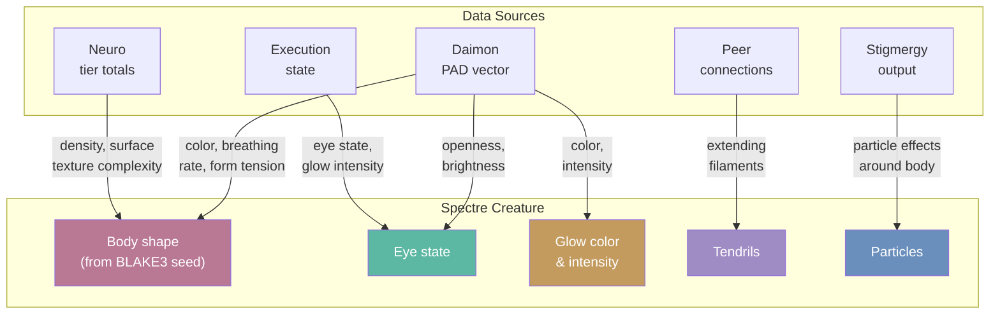

# 25 -- Terminal User Interface

> **Implementation status**: WIRED -- `roko-cli/src/tui/` (22K+ LOC) delivers a ratatui-based
> interactive dashboard with 10 tabs (F1-F10), StateHub bridge, file system watcher
> (`notify::RecommendedWatcher`), git watcher, headless snapshot engine, post-processing
> pipeline, hit-test mouse support, ROSEDUST v2 theme, and 20 widget modules. The TUI
> is the primary real-time operational surface during plan execution.

---

## 1. Design Thesis

The TUI is not a log viewer. It is a **control surface**.

Roko's terminal dashboard follows two principles that rarely coexist in agent tooling:
operational density (show the maximum useful information per terminal cell) and
peripheral awareness (communicate system state without demanding attention). The design
draws from Edward Tufte's data-ink ratio (*The Visual Display of Quantitative Information*,
1983) and Stephen Few's functional dashboard zones (*Information Dashboard Design*, 2006),
adapted for the constraints and strengths of a Unicode terminal.

The core tension: an agent system produces far more state than a human can track.
The TUI resolves this by layering three reading speeds into a single layout:

| Reading Speed | Content | Access Time |
|---|---|---|
| **Glance** (200ms) | Health gauges, cost, tab bar, Spectre silhouette | Always visible, never scrolls |
| **Scan** (30s) | Agent list, plan progress, gate results, active sessions | Sidebar panels, tab navigation |
| **Study** (minutes) | Full agent output, episode history, diff review, config editor | Detail views via Enter/drill-down |

Every tab and every widget operates within the same ratatui immediate-mode rendering loop.
Data flows from the runtime through the StateHub bridge into TUI state, and the render loop
draws whatever is current. There is no polling, no stale cache -- the TUI always shows the
latest state the runtime has published.

---

## 2. Tab Architecture

The TUI organizes its interface into **10 tabs** accessed via function keys. Each tab
is a self-contained view that renders in the same ratatui frame.

### Tab Architecture Overview



### 2.1 Tab Inventory

| Key | Tab | Purpose | Source |
|---|---|---|---|
| **F1** | Dashboard | Overview: health gauges, plan progress, cost, system metrics | `dashboard_view.rs` |
| **F2** | Plans | Plan tree, task progress bars, wave overview, DAG visualization | `plans_view.rs` |
| **F3** | Agents | Agent output stream, diffs, token burn, parallel pool status | `agents_view.rs` |
| **F4** | Git | Branch tree, commit graph, worktree list, merge queue | `git_view.rs` |
| **F5** | Logs | Scrollable log viewer with level filtering and search | `logs_view.rs` |
| **F6** | Config | Effective configuration viewer and editor | `config_view.rs` |
| **F7** | Inspect | Signal DAG inspector, episode replay, knowledge browser | `context_view.rs` |
| **F8** | Marketplace | Job browser, creation, assignment, matching | `marketplace_view.rs` |
| **F9** | Learning | Cascade router state, model routing, efficiency metrics, experiments | `learning_view.rs` |
| **F10** | Providers | NERV provider health, cost breakdown, latency, circuit state | `providers_view.rs` |

Navigation between tabs uses `Tab`/`Shift+Tab` for sequential cycling and function keys
for direct access. The active tab is highlighted in the header bar, which also shows the
workspace name, active model, and total session cost.

**Rust location**: `crates/roko-cli/src/tui/tabs.rs`

### 2.2 Named Surface Mapping

Tabs map to the v2 named-surface system (E37) for StateHub integration:

| Tab | Named Surfaces |
|---|---|
| Dashboard | Workbench, Inbox |
| Plans | Canvas, Flows |
| Agents | Agents |
| Config | System |
| Inspect | Knowledge |

This mapping ensures that the same projection data drives both TUI rendering and
HTTP/SSE consumers. Tabs without a named surface mapping (Git, Logs, Marketplace,
Learning, Providers) render from direct state queries rather than named
projections.

---

## 3. StateHub Bridge

The TUI does not poll for data. It consumes a push-based event stream from the
runtime through the StateHub bridge pattern:

```
Runtime (runner/serve/acp)
    |
    v
DashboardEvent (typed enum)
    |
    v
tokio::sync::watch::Sender<DashboardState>
    |
    v
TUI (watch::Receiver in render loop)
    |
    v
Immediate-mode ratatui::Frame draw
```

### StateHub Bridge Data Flow



### 3.1 Event Flow

`DashboardEvent` variants cover every state change the TUI needs to reflect:

- Plan state transitions (started, completed, failed, paused, resumed)
- Task progress updates (completion, gate results, cost deltas)
- Agent lifecycle events (spawned, active, idle, stopped)
- Provider health changes (circuit open/close, latency spikes)
- Cost accounting updates (per-model, per-task, session totals)
- Knowledge events (tier promotions, new entries, GC)
- Git state changes (branch, commit, worktree)
- File system changes (config reload, plan discovery)

The `TuiBridge` provides convenience methods for publishing events from any async
context. The bridge is thread-safe and non-blocking -- publishers never wait for the
TUI to consume.

### 3.2 File System Watcher

The TUI uses `notify::RecommendedWatcher` to monitor the `.roko/` directory and
project files for changes. File events are debounced and converted to `DashboardEvent`
variants that trigger re-reads of plans, config, or state files.

**Rust location**: `crates/roko-cli/src/tui/fs_watch.rs`

### 3.3 Git Watcher

A separate watcher monitors the git index and HEAD for changes, feeding branch
state, commit history, and worktree status into the TUI state model.

**Rust location**: `crates/roko-cli/src/tui/git_watch.rs`

---

## 4. ROSEDUST Design Language

ROSEDUST is Roko's visual identity system -- a dark-led palette with rose accents,
glass morphism approximation, and luxury motion. The TUI implements ROSEDUST through
the `Theme` struct and supporting color utilities.

### 4.1 Palette

The canonical ROSEDUST v2 palette as implemented in `theme.rs`:

| Token | RGB | Usage |
|---|---|---|
| `VOID` | (0, 0, 0) | Deepest background (true black canvas) |
| `BG_RAISED` | (14, 12, 18) | Elevated panel backgrounds |
| `ROSE` | (185, 120, 148) | Primary accent: active elements, selections |
| `ROSE_BRIGHT` | (220, 155, 180) | Highlighted elements, active borders |
| `ROSE_GLOW` | (228, 172, 196) | Maximum emphasis, notifications |
| `ROSE_DIM` | (155, 106, 124) | Muted accents, inactive borders |
| `BONE` | (215, 198, 158) | Warm foreground: data values, headers |
| `TEXT` | (165, 142, 158) | Primary text color |
| `TEXT_STRONG` | (215, 198, 208) | Emphasized text |
| `TEXT_DIM` | (145, 120, 138) | Secondary text |
| `TEXT_GHOST` | (110, 85, 105) | Tertiary text: timestamps, decorative |
| `DREAM` | (120, 115, 165) | Violet accent: knowledge, conductor roles |
| `SAGE` | (125, 158, 140) | Green accent: success, passing gates |
| `EMBER` | (195, 110, 85) | Warm accent: errors, failed gates |
| `WARNING` | (195, 155, 95) | Amber accent: warnings, approaching thresholds |

### 4.2 Semantic Color Functions

The theme provides semantic style helpers that map system concepts to colors:

- **Plan phases**: planning (DREAM), building (TEAL), testing (WARNING), gating (EMBER), complete (SAGE)
- **Agent roles**: architect (LAVENDER), implementer (TEAL), reviewer (EMBER), researcher (WARNING), tester (SAGE)
- **Behavioral states**: Engaged (ROSE), Struggling (WARNING/EMBER), Coasting (TEAL), Exploring (DREAM), Focused (SAGE), Resting (ROSE_DIM)
- **Progress gradients**: danger-to-warning-to-success interpolation via the `progress_style()` function

### 4.3 Color Science

ROSEDUST palette computations use OKLab (Ottosson 2020) for perceptually uniform
gradient interpolation. The palette is verified against APCA (Advanced Perceptual
Contrast Algorithm, WCAG 3.0 candidate) for accessibility:

| Pairing | APCA Lc | Target | Pass |
|---|---|---|---|
| Body text on void | +94.2 | >=75 | AA |
| Muted text on void | +62.1 | >=60 | AA |
| Rose accent on void | +71.8 | >=60 | AA |
| Jade on void | +79.3 | >=60 | AA |

Color blindness safety: no information is conveyed by color alone. Status indicators
pair symbols (`checkmark`/`cross`/`circle`) with color.

### 4.4 NO_COLOR Support

The `active_theme()` function respects the `NO_COLOR` environment variable
(https://no-color.org/), returning a fully reset palette for terminals or users
that require it.

**Rust location**: `crates/roko-cli/src/tui/theme.rs`

---

## 5. Widget Library

The TUI ships 20 specialized widget modules that compose into tab views:

| Widget | File | Purpose |
|---|---|---|
| `affect_strip` | `widgets/affect_strip.rs` | PAD vector bar and behavioral state indicator |
| `braille` | `widgets/braille.rs` | 2x4 sub-pixel braille canvas for dense charts |
| `conductor_panel` | `widgets/conductor_panel.rs` | Circuit breaker and watcher status |
| `cost_by_model` | `widgets/cost_by_model.rs` | Per-model cost breakdown table |
| `diff_panel` | `widgets/diff_panel.rs` | Unified diff viewer with hunk highlighting |
| `error_digest` | `widgets/error_digest.rs` | Compressed error summary with deduplication |
| `gate_output` | `widgets/gate_output.rs` | Gate pass/fail/pending indicators |
| `header_bar` | `widgets/header_bar.rs` | Global tab bar and session info |
| `parallel_pool` | `widgets/parallel_pool.rs` | Agent pool utilization display |
| `phase_compact` | `widgets/phase_compact.rs` | Compact plan phase indicator |
| `plan_tree` | `widgets/plan_tree.rs` | Hierarchical plan/task tree |
| `provider_nerv` | `widgets/provider_nerv.rs` | Provider health dashboard (NERV) |
| `rosedust` | `widgets/rosedust.rs` | ROSEDUST-specific rendering helpers |
| `status_bar` | `widgets/status_bar.rs` | Bottom status bar with mode and hints |
| `stream_output` | `widgets/stream_output.rs` | Scrollable agent output stream |
| `sys_metrics` | `widgets/sys_metrics.rs` | System resource metrics |
| `task_progress` | `widgets/task_progress.rs` | Per-task progress bar |
| `token_sparkline` | `widgets/token_sparkline.rs` | Token consumption sparkline chart |
| `wave_progress` | `widgets/wave_progress.rs` | Graph execution wave progress |

### 5.1 Sparklines and Data Density

Following Tufte's principle that "a number is meaningless without its history,"
metrics are displayed with inline sparklines using Unicode block characters:

```
Cost: $2.34 ▁▂▃▅▆▇█▆▅ ↑23%     <- sparkline + trend inline
C-Factor: 1.23 ▃▃▄▅▅▆▆▇ ↑0.04  <- history visible at a glance
Gate: 94% ████████▓░ 47/50      <- ratio bar with fraction
```

Eight height levels via `[' ', '▁', '▂', '▃', '▄', '▅', '▆', '▇', '█']` provide
glanceable trend visibility.

### 5.2 Braille Rendering

The braille widget (`widgets/braille.rs`) uses Unicode braille characters
(`U+2800`-`U+28FF`) to achieve 2x4 sub-pixel resolution per character cell -- 8x the
density of normal characters. This is used for phase portraits, dense sparklines,
and Spectre rendering in compact viewports.

### 5.3 Bullet Graphs

Agent progress and system metrics use Few's bullet graph (Few 2006) rather than pie
charts or gauges:

```
CPU  [██████████░░░░░░░░░] 48%  ┃75%     <- bar=actual, ┃=target
MEM  [████████████████░░░] 82%  ┃90%
COST [████░░░░░░░░░░░░░░░] $2.34/$50     <- budget fraction
```

---

## 6. Input and Navigation

### 6.1 Modal Input System

The TUI uses a vim-style modal input system with three modes:

| Mode | Indicator | Behavior |
|---|---|---|
| **Normal** | Status bar shows `NORMAL` | `j`/`k` navigate, `Enter` selects, `Esc` backs out |
| **Command** | `:` prefix | Type command, `Enter` to execute |
| **Filter** | `/` prefix | Fuzzy filter active list |

The current mode is always displayed in the status bar. Context-sensitive key hints
appear on the right side:

```
NORMAL  [j/k] navigate  [Enter] select  [?] help  [/] filter  [q] quit
FILTER  [↑/↓] results   [Enter] select  [Esc] cancel          filter: _
```

### 6.2 Keyboard Bindings

| Key | Action |
|---|---|
| `F1`-`F10` | Jump to tab |
| `Tab` / `Shift+Tab` | Cycle focus between panels |
| `j`/`k` or `Up`/`Down` | Navigate within focused list |
| `Enter` | Expand detail / enter view |
| `Esc` | Back to parent / close modal |
| `q` | Quit |
| `?` | Help overlay |
| `/` | Open filter |
| `Ctrl+P` | Fuzzy finder |

### 6.3 Mouse Support

The TUI supports mouse interaction via a hit-test registry (`hit_test.rs`). Click
targets are registered during rendering and resolved during input processing. Scroll
targets provide mouse-wheel scrolling within panels. Two Z-levels (`Z_PANEL` and
`Z_MODAL`) ensure modals capture clicks above panels.

### 6.4 Focus Ring

```rust
pub struct FocusRing {
    panels: Vec<PanelId>,
    current: usize,
}
```

`Tab`/`Shift+Tab` cycles focus between panels within the current view.
The focused panel receives keyboard input and displays a highlighted border
(ROSE_BRIGHT).

---

## 7. Spectre Creature Visualization

Every Roko agent has a **Spectre** -- a procedurally generated creature that serves
as a dense information display of the agent's cognitive state. The Spectre is not
decorative; it is a glanceable readout that encodes behavioral state (Daimon),
knowledge accumulation (Neuro tiers), activity level, and mesh connectivity into a
single visual entity.

### Spectre Information Channels



### 7.1 Spectre as Information Display

The Spectre encodes five information channels simultaneously:

| Channel | Visual Property | Data Source |
|---|---|---|
| **Behavioral state** | Color, breathing rate, form tension | Daimon PAD vector |
| **Knowledge level** | Body density, surface texture complexity | Neuro tier totals |
| **Activity level** | Eye state, glow intensity, limb movement | Agent execution state |
| **Mesh connectivity** | Tendrils/filaments extending outward | Active peer connections |
| **Pheromone emission** | Particle effects around body | Stigmergy output |

A trained operator can glance at a Spectre and immediately assess: "This agent is
actively engaged, has accumulated significant knowledge, is connected to two peers,
and is emitting a Wisdom pheromone."

### 7.2 Deterministic Identity

Every Spectre is generated from a **shape seed** -- a BLAKE3 hash of the agent's
identity (`agent_id:agent_template`). The seed determines all morphological
constants: body archetype, symmetry, limb configuration, eye style, and domain
texture. Animation state comes from the Daimon, not the seed.

The same agent always produces the same Spectre body shape. Operators learn to
recognize individual agents by their Spectre silhouette, just as they might
recognize a colleague by their face.

### 7.3 Body Archetypes

Eight base body shapes, each with distinct character:

| Archetype | Shape | Character |
|---|---|---|
| **Orb** | Spherical, compact | Dense knowledge, focused computation |
| **Column** | Tall, narrow | Structured, methodical processing |
| **Sprawl** | Wide, low | Broad exploration, many connections |
| **Cluster** | Multiple connected nodes | Parallel processing, multi-task |
| **Teardrop** | Tapered, directional | Goal-oriented, forward-moving |
| **Ring** | Hollow center, encircling | Monitoring, watchful, review-oriented |
| **Fractal** | Self-similar branching | Recursive analysis, deep reasoning |
| **Amorphous** | Shifting boundaries | Exploratory, creative, research-oriented |

### 7.4 Behavioral State Animation

The Spectre's animation is driven entirely by the Daimon PAD vector. Each behavioral
state produces a distinct visual character:

**Engaged** (Rose, `#D4778C`):
```
    ╭─╮
╭───╯ ╰───╮
│  ◉    ◉  │     Eyes: open, bright
╰─────────╯     Breathing: 0.7Hz (steady)
                 Glow: warm rose, intensity 0.8
```
- Steady breathing, open eyes, warm rose glow
- Body: stable, slight expansion/contraction on breath cycle
- Springs: stiffness 0.8, damping 0.6 -- controlled movement

**Struggling** (Amber/Crimson, `#D4A857` / `#C45C50`):
```
   ╭──╮
 ╭─╯  ╰─╮
 │ ◎  ◎  │       Eyes: wide, flickering
 ╰──────╯       Breathing: 1.4Hz (rapid)
  ≋≋≋≋≋≋         Glow: amber/crimson, pulsing
```
- Rapid breathing, constricted form, agitated tendrils
- Springs: stiffness 1.2, damping 0.3 -- tense, jittery

**Coasting** (Sapphire, `#6B8FBD`):
```
     ╭───╮
  ╭──╯   ╰──╮
  │  ○    ○  │     Eyes: half-open, relaxed
  ╰─────────╯     Breathing: 0.4Hz (slow)
```
- Expanded form, relaxed springs, gentle swaying
- Springs: stiffness 0.3, damping 0.8

**Exploring** (Violet, `#A08CC4`):
```
       ╭─╮
  ≋≋╭──╯ ╰──╮≋≋
  ≋ │  ◉  ◉  │ ≋     Eyes: open, scanning
    ╰────────╯       Tendrils: extended, probing
```
- Shifting edges, scanning eye motion, active tendrils
- Springs: stiffness 0.5, damping 0.4 -- fluid

**Focused** (Jade, `#5DB8A3`):
```
    ╭─╮
   ╭╯ ╰╮
   │◉ ◉│        Eyes: narrowed, intense
   ╰───╯        Breathing: 0.5Hz (controlled)
```
- Compact form, minimal movement, sharp glow edges
- Springs: stiffness 1.0, damping 0.7

**Resting** (Dim Rose, `#A05C6E`):
```
    ╭─╮
   ╭╯ ╰╮
   │─ ─│        Eyes: closed
   ╰───╯        Breathing: 0.2Hz (sleep-like)
```
- Minimal form, near-still, no tendrils
- If Dreams consolidation is active, faint sparkle particles (`✧`) appear

### 7.5 Eye System

Eyes are the most expressive element:

| State | Symbol | Trigger |
|---|---|---|
| Open, bright | `◉` | Active, healthy, engaged |
| Open, dim | `◎` | Active but stressed |
| Half-open | `○` | Idle, coasting |
| Narrowed | `◉` (compact) | Focused, concentrated |
| Closed | `─` | Resting |
| Scanning | `◉` (oscillating) | Exploring |

Eye animation tracks the PAD vector:
- **Pleasure** controls brightness (low = dim, high = bright)
- **Arousal** controls openness (low = half-closed, high = wide)
- **Dominance** controls focus (low = scanning, high = locked forward)

### 7.6 Breathing System

Breathing is the primary ambient animation -- a continuous, rhythmic
expansion/contraction of the body cloud:

| State | Rate (Hz) | Depth | Character |
|---|---|---|---|
| Engaged | 0.7 | 0.6 | Natural, productive |
| Struggling | 1.4 | 0.8 | Rapid, shallow gasps |
| Coasting | 0.4 | 0.4 | Slow, even |
| Exploring | 0.9 | 0.7 | Energized, slightly irregular |
| Focused | 0.5 | 0.3 | Controlled, minimal |
| Resting | 0.2 | 0.2 | Sleep-like, deep exhale |

### 7.7 Dot-Cloud Geometry and Spring Physics

Spectres are internally represented as a dot cloud -- weighted 3D points connected by
springs. The geometry is rasterized differently per rendering target.

Spring physics use Verlet integration (time-reversible, symplectic,
energy-preserving). Spring parameters (stiffness, damping) vary by behavioral state:
high stiffness and low damping produce tense, jittery movement (Struggling); low
stiffness and high damping produce relaxed drift (Coasting).

Body silhouettes are composed using Signed Distance Fields (SDF) with smooth
blending (Quilez 2014). Surface textures use Gray-Scott reaction-diffusion for
deterministic patterns unique to each agent.

### 7.8 Glow System

Each Spectre emits a glow encoded as color and intensity. In truecolor terminals,
glow is rendered using the `gradient()` and `lighten()` functions to create
multi-step color falloff from the body outward. In 256-color terminals, glow is a
single-cell border. In no-color terminals, glow is `░` (light shade) characters.

### 7.9 Tendril and Particle Systems

**Tendrils** represent mesh connectivity. Each active peer connection is rendered as
a tendril extending from the body, using `≋` (wave) characters that animate in the
flow direction.

**Particles** represent events:

| Event | Character | Animation |
|---|---|---|
| Wisdom pheromone | `✦` | Float upward, fade |
| Warning pheromone | `⚡` | Flash, fade quickly |
| Discovery pheromone | `◊` | Expand outward |
| Knowledge promotion | `·` -> `•` -> `◉` | Grow as they rise |
| Dreams consolidation | `✧` | Drift slowly, dim |

### 7.10 No Mortality

Spectres never die. There are no death animations, terminal states, or decay-to-nothing
sequences. An agent that stops working has its Spectre enter the Resting state --
minimal form, slow breathing, dim glow. When the agent resumes, the Spectre
reactivates. This reflects the architectural reality that agents can be resumed,
replayed, or forked.

---

## 8. Spectre Rendering Per Interface

The Spectre is defined by a single data model (`SpectreCloud` dot-cloud geometry
plus animation parameters). This model is rendered differently per interface:

### 8.1 TUI ASCII Renderer

The primary Spectre renderer. Rasterizes the dot cloud as Unicode characters within
a ratatui `Widget`.

**Pipeline**: Project 3D points to 2D (orthographic) -> quantize to character
grid -> assign characters by point density and kind -> apply ROSEDUST color and
glow composite -> render as ratatui Cells.

**Character mapping**:

| Point Kind | Low Density | Medium Density | High Density |
|---|---|---|---|
| Body | `░` | `▒` | `▓` / `█` |
| Limb | `─` / `│` | `━` / `┃` | `═` / `║` |
| Eye | `○` | `◉` | `◎` |
| Tendril | `~` | `≈` | `≋` |
| Particle | `·` | `•` | `✦` |

**Viewport sizing** adapts to available terminal space:

| Viewport Size | Detail Level |
|---|---|
| < 20x8 | Minimal: body outline + eyes only |
| 20x8 - 40x12 | Standard: body + eyes + breathing + glow |
| 40x12 - 60x16 | Detailed: full body + limbs + tendrils + particles |
| > 60x16 | Gallery: multiple Spectres side by side |

### 8.2 Web Portal WebGL Renderer

The Web Portal renders Spectres as 3D objects using WebGL 2.0 with:
- Instanced point cloud meshes
- Custom shaders (body subsurface scattering, bloom post-process, emissive eyes)
- Kawase blur bloom pipeline matching ROSEDUST aesthetics
- Interactive orbit camera, zoom, hover tooltips, click-to-focus

### 8.3 CLI Inline Renderer

For text-mode output (`roko status`, `roko dashboard --text`):

**Single-line mode**:
```
rust-impl-01: ◉ Engaged [▓▓▓▓▓░░] P:0.7 A:0.5 D:0.8  (sonnet-4.6, 3/7, $0.34)
```

**Mini Spectre** (5x3):
```
Engaged:    Struggling:  Coasting:   Exploring:  Focused:   Resting:
 ╭╮          ╭╮           ╭─╮         ╭╮          ╭╮         ╭╮
╭◉◉╮        ╭◎◎╮         ╭○ ○╮      ≋◉◉≋        ╭◉◉╮       ╭──╮
 ╰╯          ╰╯           ╰──╯        ╰╯          ╰╯         ╰╯
```

### 8.4 API JSON Renderer

Raw Spectre state is available via `/ws/spectre/:id` WebSocket and
`/api/agents/:id/spectre` REST endpoint for custom renderers (Unity, Godot,
Processing, p5.js, etc.).

### 8.5 AR/VR Spatial Renderer

WebXR/visionOS renderer with proximity-based LOD (ray-marched SDF at close range,
polygon mesh at medium range, billboard sprites at distance), HRTF spatial audio
for agent events, and hand gesture interaction (pinch to select, grab to drag,
open palm to pause).

### 8.6 Rendering Consistency

All renderers share:
- The same behavioral state to color mapping from the ROSEDUST palette
- The same morphological parameter tables from the shape seed
- The same breathing rate, phase, and asymmetry values

A Spectre generated for `rust-impl-01` looks recognizably similar across all
renderers, despite different fidelity levels.

---

## 9. Spectre as Collective Display

When multiple Spectres are rendered together, they form a collective display that
encodes emergent multi-agent properties.

### 9.1 Layout

**TUI Gallery**: Grid layout with Spectre cells connected by filament characters.
**Web Portal**: Force-directed 3D layout with four forces: repulsion (prevent
overlap), attraction (mesh edges), center gravity, and pheromone attraction.

### 9.2 Filament Connections

Filaments represent inter-agent relationships:

| Connection Type | TUI Rendering | Color | Animation |
|---|---|---|---|
| Mesh peer | `──────` | Muted rose | Static pulse |
| Active data flow | `══════` | Rose | Flow particles |
| Pheromone channel | `≋≋≋≋≋≋` | Pheromone type color | Wave toward target |
| Knowledge transfer | `──·──•──◉──` | Gold | Dots grow in transit |
| Stigmergy trace | `- - - -` | Dim, fading | Gradual fade |

### 9.3 Breathing Synchronization

When multiple agents share a behavioral state, their breathing rates synchronize
through a Kuramoto-inspired phase-coupling mechanism:

```
dtheta_i/dt = omega_i + (K/N) * sum(sin(theta_j - theta_i))
```

Coupling strength K is proportional to C-Factor: higher C-Factor produces tighter
synchronization, creating a visible collective "pulse" that indicates coordination
quality. The Kuramoto order parameter r (range [0,1]) provides a real-time readout
of collective coherence.

### 9.4 C-Factor Harmony Encoding

The collective display encodes C-Factor through multiple visual channels:

| C-Factor | Visual Character |
|---|---|
| < 0.8 | Independent breathing, sparse connections, muted colors |
| 0.8-1.0 | Some synchronization, visible connections, subtle glow |
| 1.0-1.2 | Noticeable sync, active flow particles, warm ambient glow |
| 1.2-1.5 | Strong sync, dense connections, rich pheromone fields |
| > 1.5 | Near-perfect sync, collective breathing pulse, particle harmony |

### 9.5 Pheromone Fields

Pheromone emissions create visible particle fields around the emitting Spectre:

| Pheromone | Color | Particle | Field Character |
|---|---|---|---|
| Wisdom | Gold | `✦` | Rising sparkles |
| Warning | Danger red | `⚡` | Sharp flashes |
| Discovery | Violet | `◊` | Expanding ripples |
| Recruitment | Rose | `→` | Directional flow |
| Completion | Jade | `✓` | Settling dots |

---

## 10. Generative Interfaces (A2UI)

Generative Interfaces allow agents to create their own UI components during
execution via the A2UI (Agent-to-UI) protocol.

### 10.1 Protocol

Agents emit structured JSONL descriptions with an `"a2ui"` key. The host interface
(TUI, Web, CLI) renders these using ROSEDUST styling. The agent describes *what* to
show; the renderer decides *how*.

```jsonl
{"a2ui": "table", "title": "Dependency Comparison", "columns": ["Name", "Version"], "rows": [["tokio", "1.38"]]}
{"a2ui": "progress", "label": "Migration", "value": 0.67, "style": "success"}
{"a2ui": "chart", "type": "bar", "title": "Coverage", "data": [{"label": "auth", "value": 94}]}
{"a2ui": "status", "items": [{"label": "Compile", "state": "pass"}, {"label": "Test", "state": "fail"}]}
{"a2ui": "callout", "level": "warning", "title": "Breaking Change", "content": "Public API changes."}
```

### 10.2 Component Types

| Component | TUI Rendering | Web Rendering |
|---|---|---|
| `table` | Unicode table (`─│┌┐└┘`) | HTML `<table>` with glass panel |
| `progress` | `████░░░░` with percentage | Animated gradient bar |
| `chart` | Braille/ASCII chart | Recharts/Nivo component |
| `status` | `✓`/`✗`/`○` symbols | Colored badges |
| `code` | Syntax-colored text | Prism.js highlighting |
| `callout` | Bordered text with icon | Glass panel with icon |
| `tree` | ASCII tree (`├──`, `└──`) | Collapsible tree |
| `kv` | Aligned columns | Definition list |
| `diagram` | ASCII box-and-arrow | SVG rendering |
| `markdown` | Rendered in terminal | Rendered HTML |

### 10.3 Sandboxing

A2UI components render only within the agent's output viewport. They cannot modify
TUI chrome, overlay other agents' output, trigger navigation, or execute code.
All input is schema-validated before rendering. Resource limits: max 10 components
per turn, max 50 table rows, max 100 chart data points.

### 10.4 ROSEDUST Inheritance

All A2UI components automatically inherit the ROSEDUST palette through semantic
color names (`primary`, `success`, `warning`, `danger`, `info`) that resolve to
ROSEDUST values. Agents never emit raw color codes.

---

## 11. Sonification

Roko's sonification system generates ambient music that encodes cognitive agent
state as sound, following the **Eno mandate**: music must be "as ignorable as it is
interesting" (Eno, *Music for Airports*, 1978).

### 11.1 Five Musical Layers

| Layer | Source | Encoding |
|---|---|---|
| **Drone** | Project identity + C-Factor | Foundational harmonic bed; volume tracks collective health |
| **Breath** | Average Spectre breathing rate | Rhythmic pulse; syncs with collective breathing |
| **Ghost** | Individual events (gates, knowledge, tasks) | Melodic fragments; rising intervals for success, descending for failure |
| **Weather** | Collective state + knowledge flow | Granular texture; warm (high C-Factor) to cold (low) |
| **Sparks** | Tool call frequency | Transient clicks/pops; panned to agent mesh position |

### 11.2 Behavioral State to Music Mapping

| State | Scale | Tempo Feeling | Character |
|---|---|---|---|
| Engaged | Major (Ionian) | Steady 0.7Hz | Warm, productive, confident |
| Struggling | Phrygian/Locrian | Rapid 1.4Hz | Dark, tense, attention-getting |
| Coasting | Mixolydian | Slow 0.4Hz | Relaxed, slightly flat |
| Exploring | Lydian/Whole-tone | Energized 0.9Hz | Open, floating, curious |
| Focused | Dorian | Controlled 0.5Hz | Centered, serious |
| Resting | Aeolian (natural minor) | Very slow 0.2Hz | Quiet, reflective |

### 11.3 Event to Sound Mapping

| Event | Sound | Character |
|---|---|---|
| Gate pass | Rising interval (3rd or 5th) | Bright, confirming |
| Gate fail | Descending minor 2nd | Dark, attention-getting |
| Knowledge created | Bell tone | Clear, resonant |
| Knowledge promoted | Rising arpeggio | Ascending, rewarding |
| Task completed | Resolved cadence (V->I) | Satisfying, complete |
| Dreams consolidation | Major 7th | Ethereal, floating |

### 11.4 Silence as Instrument

Silence carries information:
- **Sudden silence** after activity = all agents stopped (check status)
- **Gradual fade** = agents transitioning to rest (normal)
- **Silence with occasional Ghost** = Dreams consolidation active
- **Extended silence** = no work in progress (expected during idle)

### 11.5 Presets

Eight presets configure the sonification for different contexts: `ambient_default`
(balanced), `minimal_drone` (drone + breath only), `granular_texture` (Weather-heavy),
`engaged_flow` (warm, motivating), `struggling_tension` (attention-drawing),
`deep_dream` (ethereal, slow), `exploring_curiosity` (open, chromatic), and
`emergence` (collective breakthrough -- triggered when C-Factor > 1.5).

---

## 12. Rich UX Primitives

The TUI renders a set of canonical UX primitives that are shared across all
surfaces (CLI, TUI, Chat, Web). The primitives address three problems unique to
agent UX: latency (seconds to minutes of reasoning), uncertainty (probabilistic
outputs), and causality (chains of choices).

### 12.1 The Ten Primitives

| Primitive | What It Shows | TUI Rendering |
|---|---|---|
| Reasoning stream | Live thought/process trail | Toggleable sidebar |
| Tool-call banner | One banner per tool invocation | Bordered list rows with expandable output |
| Gate badge | Pass/warn/fail status | Persistent status rail |
| Heuristic footnote | Inline numbered citations | Footnote pane with calibration data |
| Uncertainty bar | Confidence under a decision | Unicode block characters |
| Replay scrubber | Episode timeline | Bottom timeline bar |
| Alternative rendering | Different views over same data | View-swap tabs |
| Confidence-weighted aggregation | Weighted multi-agent consensus | Minority view inspectable |
| Progressive disclosure | Nested reveal from summary to trace | Expand-in-place |
| Spatial memory | Stable placement across sessions | Shortcut registry + stable layout |

### 12.2 Degradation Rules

Primitives degrade independently when upstream data is unavailable:

| Primitive | Missing Upstream | Degraded Behavior |
|---|---|---|
| Gate badge | Pipeline stalls | Keep last known state, mark stale |
| Heuristic footnote | Lookup fails | Omit footnotes, do not block answer |
| Uncertainty bar | No confidence published | Omit bar, use normal approval policy |
| Replay scrubber | Timeline unavailable | Disable scrubbing, show unavailable |

The rule: degraded but legible beats blank or broken.

---

## 13. Agent Onboarding Flow

The onboarding flow brings a new agent from zero to operational: domain detection,
profile selection, template instantiation, model routing, knowledge bootstrapping,
Spectre generation, and first-task execution.

### 13.1 Interactive `roko init`

```
$ roko init
Welcome to Roko. Let's set up your first agent.

Which profile would you like to install or activate?
  [x] Coding
  [ ] Research
  [ ] Ops
  [ ] Compose multiple profiles

Which models would you like to use?
  [x] Anthropic
  [ ] OpenAI
  [ ] Local Ollama
  [ ] Other

Should Roko look for MCP servers?
  [x] Yes, auto-discover
  [ ] No, configure later
```

**Design rules**:
- `roko init` never dead-ends. Every prompt has a skip/configure-later path.
- Missing API keys yield a literal next command, not a generic failure.
- Partial success is durable: interrupted setup resumes from last completed step.
- First useful output in under 30 seconds is the target.

### 13.2 Domain Auto-Detection

| Signal | Profile | Confidence |
|---|---|---|
| `Cargo.toml` | Coding | 0.95 |
| `package.json` + TypeScript | Coding | 0.90 |
| `go.mod` | Coding | 0.90 |
| `pyproject.toml` | Research/Data | 0.85 |
| Empty directory | Blank starter | 0.10 |

### 13.3 First-Task Validation

The first task validates every critical path:

| Step | What It Proves |
|---|---|
| SENSE | Knowledge store is connected |
| ASSESS | Scorer is configured |
| COMPOSE | Context engineering is functional |
| ACT | Model routing is connected |
| VERIFY | Gates are configured |
| PERSIST | Substrate write is working |
| BROADCAST | Live progress is visible |
| REACT | Learning loop is connected |

### 13.4 Spectre First Appearance

The Spectre first appears in the Resting state. When the agent receives its first
task, the Spectre transitions to Engaged over ~500ms using the ROSEDUST luxury
easing curve (`cubic-bezier(0.16, 1, 0.3, 1)`):

```
Resting:           Transition:        Engaged:
   ╭╮              ╭─╮                 ╭─╮
  ╭──╮            ╭╯ ╰╮           ╭───╯ ╰───╮
  │──│    >>>     │○ ○│    >>>    │  ◉    ◉  │
  ╰──╯            ╰───╯           ╰─────────╯
 (dim)           (brightening)      (full glow)
```

---

## 14. Accessibility

### 14.1 Core Requirements

- **Color is never the sole channel**: every status uses symbol + color
  (`✓`/`✗`/`○` plus jade/ember/muted)
- **Keyboard-only operation**: every action reachable without mouse
- **High-contrast support**: `NO_COLOR` disables all color; APCA contrast verified
- **Screen reader compatibility**: headless snapshot engine
  (`snapshot.rs`) produces text representations of every tab
- **Reduced motion**: animation can be disabled without losing state information
- **No emojis in TUI**: Unicode symbols and dingbats only (BMP range
  U+0000-U+FFFF) for consistent rendering across terminal emulators

### 14.2 Color Blindness Safety

Under deuteranopia simulation, ROSEDUST rose shifts toward brownish-yellow and jade
toward blue-gray -- still distinguishable due to OKLab lightness difference
(L=0.65 vs L=0.84). Status indicators always pair icon + text.

### 14.3 Terminal Compatibility

| Terminal Type | Color Support | Spectre Rendering |
|---|---|---|
| Truecolor (24-bit) | Full ROSEDUST palette | Multi-step glow gradients |
| 256-color | Nearest-match via OKLab distance | Single-cell glow border |
| No-color | `NO_COLOR` reset palette | `░` shade characters for glow |
| Minimum 80 columns | Responsive breakpoints | Single-column stacked layout |

### 14.4 Responsive Breakpoints

| Terminal Width | Layout |
|---|---|
| < 80 columns | Single column: navigation stacked above detail |
| 80-119 columns | Two columns: navigation sidebar + detail panel |
| 120+ columns | Full layout with Spectre viewport |

---

## 15. Headless Snapshot Engine

The TUI includes a headless snapshot engine (`snapshot.rs`) that renders every tab
to text using `ratatui::backend::TestBackend`. This enables:

- AI agents to inspect the dashboard without a real terminal
- Automated regression testing of TUI rendering
- Text-mode `roko show` output for non-interactive contexts

The engine produces a manifest (`manifest.json`) alongside per-tab text files
(`f01-dashboard.txt`, `f02-plans.txt`, etc.), capturing the complete frame output
at a specified terminal dimension.

---

## 16. Post-Processing Pipeline

The TUI includes a post-processing pipeline (`postfx.rs`, `postfx_pipeline.rs`)
for applying visual effects to the rendered frame buffer:

- Bloom composite for ROSEDUST glow elements on truecolor terminals
- Smoothing (`smoothing.rs`) for animation transitions
- Atmosphere effects (`atmosphere.rs`) for ambient visual treatment
- Effects configuration (`effects_config.rs`) for per-user tuning

---

## 17. Verification

```bash
# Launch the interactive TUI dashboard
cargo run -p roko-cli -- dashboard

# Headless snapshot capture (for CI or agent inspection)
cargo run -p roko-cli -- show dashboard --width 120 --height 30
```

The dashboard renders all 10 tabs from live workspace state. Each tab displays
real-time data from the StateHub bridge, file system watcher, and git watcher.

---

## 18. Cross-References

| Topic | Location |
|---|---|
| Daimon behavioral states and PAD vector | [11-AFFECT.md](11-AFFECT.md) |
| Gate pipeline and adaptive thresholds | [07-GATES.md](07-GATES.md) |
| Neuro knowledge tiers and progression | [09-MEMORY.md](09-MEMORY.md) |
| Dreams consolidation cycle | [10-DREAMS.md](10-DREAMS.md) |
| Safety contracts and trust-origin lattice | [12-SAFETY.md](12-SAFETY.md) |
| Agent coordination and stigmergy | [16-COORDINATION.md](16-COORDINATION.md) |
| Execution engine and Graph DAG | [04-EXECUTION.md](04-EXECUTION.md) |
| Signal as universal datum | [01-SIGNAL.md](01-SIGNAL.md) |
| HTTP control plane routes | Depth: [depth/26-http/](depth/26-http/) |
| ACP editor integration | Depth: [depth/27-acp/](depth/27-acp/) |
| CLI commands reference | Depth: [depth/28-cli/](depth/28-cli/) |

---

## 19. Depth Files

This chapter is expanded by the following depth files in `depth/25-tui/`:

| File | Topic |
|---|---|
| `01-tab-architecture.md` | Tab enum, F-key mapping, named surface integration |
| `02-statehub-bridge.md` | DashboardEvent, TuiBridge, watch::Sender/Receiver pattern |
| `03-rosedust-palette.md` | Full ROSEDUST v2 palette, OKLab color science, APCA verification |
| `04-spectre-creature.md` | Dot-cloud geometry, spring physics, SDF composition, L-systems |
| `05-spectre-rendering.md` | Per-interface rendering: TUI ASCII, WebGL, CLI inline, API JSON, AR/VR |
| `06-spectre-collective.md` | Collective display, filaments, Kuramoto synchronization, C-Factor encoding |
| `07-sonification.md` | Five musical layers, Eno mandate, behavioral presets, harmonic vocabulary |
| `08-a2ui-generative.md` | A2UI protocol, component catalog, sandboxing, incremental updates |
