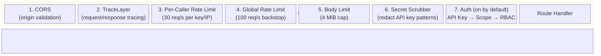
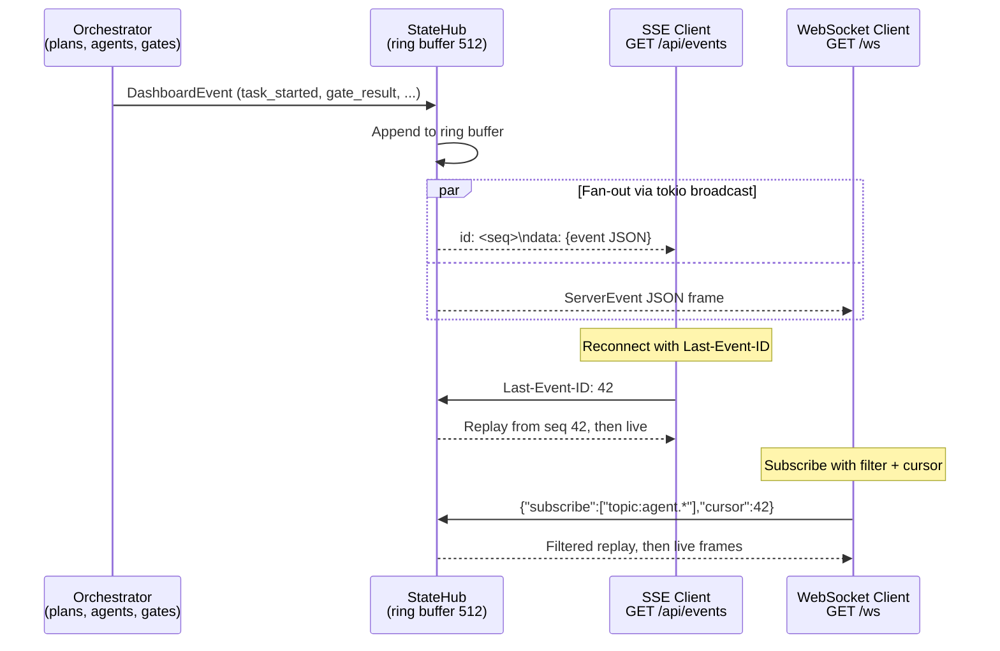

# 26 -- HTTP Control Plane

> The `roko serve` HTTP control plane exposes ~376 canonical REST routes (~421
> including aliases) plus SSE and WebSocket streams on port 6677. It is the
> programmatic surface through which dashboards, CI scripts, external agents,
> and the interactive TUI observe and control every aspect of the system.

> **Implementation status (2026-09):** WIRED. All route categories listed in
> this chapter are live. Auth middleware, secret scrubbing, CORS, rate limiting,
> and the trace layer are production-grade. StateHub push-based event
> distribution, named surface projections (E37), and run-scoped observability
> are all wired. The 19-gate pipeline and per-agent sidecar routes are live.
> See `.roko/GAPS.md` for remaining product residuals.

### Implementation sources

| Surface | Authority | Shipped boundary |
|---------|-----------|-----------------|
| Router assembly | `crates/roko-serve/src/routes/mod.rs` | `build_router()` merges ~50 route modules with middleware layers |
| Auth middleware | `crates/roko-serve/src/routes/middleware.rs` | API key, bearer, JWT, agent token, scope enforcement |
| RBAC middleware | `crates/roko-serve/src/routes/rbac_middleware.rs` | Per-route permission checks when auth is enabled |
| Rate limiting | `crates/roko-serve/src/routes/mod.rs` | Global backstop (100 req/s), per-caller keyed (30 req/s), per-route expensive (terminal, inference, agent) |
| Secret scrubbing | `crates/roko-serve/src/routes/middleware.rs` | `scrub_secrets` redacts API key patterns from response bodies |
| SSE streaming | `crates/roko-serve/src/routes/sse.rs` | `/api/events`, `/api/sse` with ring buffer replay |
| WebSocket streaming | `crates/roko-serve/src/routes/ws.rs` | `/ws`, `/roko-ws` with filtering, backpressure, cursor replay |
| StateHub | `crates/roko-runtime/src/state_hub.rs` | Ring buffer (512 events), broadcast channel, snapshot projections |
| OpenAPI | `crates/roko-serve/src/openapi.rs` | `GET /api/openapi.json` |
| AppState | `crates/roko-serve/src/state.rs` | Shared state: config, runtime, affect engine, arenas, registries, telemetry |
| Server bootstrap | `crates/roko-serve/src/lib.rs` | Bind, TLS, graceful shutdown, daemon integration |

---

## 1. Architecture Overview

```
+------------------+         +-----------------------------+
|  Your client     |  HTTP   |  roko-serve  (port 6677)    |
|  (dashboard,     | ------> |  REST + SSE + WebSocket     |
|   CI, scripts)   |  SSE    |                             |
|                  | <------ |  AuthMiddleware              |
+------------------+  WS     |  SecretScrubber             |
                             |  TraceLayer                 |
                             +--------------+--------------+
                                            |
                             +--------------v--------------+
                             |  StateHub                   |
                             |  (ring buffer + broadcast)  |
                             +--------------+--------------+
                                            |
                    +---------------+-------+-------+----------------+
                    |               |               |                |
             +------v------+ +------v------+ +------v------+ +-------v------+
             |  SSE stream | |  WebSocket  | | HTTP routes | |  Orchestrator|
             |  /api/events| |  /ws        | |  /api/...   | |  (plans,     |
             +-------------+ +-------------+ +-------------+ |   agents,    |
                                                             |   gates)     |
                                                             +--------------+
```

**Base URL:** `http://127.0.0.1:6677` (default).

**All API routes live under `/api/`.** Exceptions: `/health` and `/ready`
(liveness/readiness probes), `/metrics` (Prometheus scrape), `/webhooks/*`
(inbound webhooks), `/ws` and `/roko-ws` (WebSocket), and `/runs/{id}`
(shareable run pages) are outside `/api/` and always public.

### 1.1 Request and Response Conventions

- **Content-Type**: All request bodies are `application/json`. Responses are
  `application/json` unless noted (SSE: `text/event-stream`, Prometheus:
  `text/plain`, logs: `text/plain`).
- **Body limit**: 4 MiB global default (`DEFAULT_REQUEST_BODY_LIMIT_BYTES`).
  Webhook routes further clamp to 1 MiB.
- **Error envelope**: Every error is JSON:
  ```json
  { "code": "not_found", "message": "plan 'x' not found", "status": 404 }
  ```
  Common codes: `not_found` (404), `bad_request` (400), `unauthorized` (401),
  `forbidden` (403), `internal` (500), `rate_limited` (429),
  `insufficient_scope` (403), `not_implemented` (501).

---

## 2. Quick Start

### 2.1 Start the server

```bash
# Default: binds 127.0.0.1:6677, reads roko.toml from cwd
roko serve

# Custom bind and port
roko serve --bind 0.0.0.0 --port 8080

# API key authentication is on by default. Set a key, stored as
# ROKO__SERVE__AUTH__API_KEY in .roko/.env, or use the launch token
# roko serve prints when it binds a loopback address without one.
roko config set serve.auth.api_key sk-my-secret-key

# Enable PTY terminal (disabled by default for security)
roko serve --enable-terminal
```

### 2.2 Verify it is running

```bash
curl http://127.0.0.1:6677/health
# {"status":"ok","version":"0.1.0","uptime_secs":3}

curl http://127.0.0.1:6677/api/health
# {"status":"ok","version":"0.1.0","uptime_secs":3,"active_plans":0,...}
```

### 2.3 Watch the event stream

```bash
curl -N http://127.0.0.1:6677/api/events
```

### 2.4 Trigger a one-shot run

```bash
curl -X POST http://127.0.0.1:6677/api/run \
  -H "Content-Type: application/json" \
  -d '{"prompt": "Add a unit test for the parser module"}'
# {"id":"run-uuid"}
```

Watch the SSE stream for `task_started`, `agent_spawned`, `gate_result`, and
`task_completed` events as the agent works.

### 2.5 Configuration keys

```toml
[server]
bind = "127.0.0.1"
port = 6677
rate_limit_per_sec = 100          # global backstop
rate_limit_per_key_per_sec = 30   # per-caller keyed limit
unsafe_public_cors = false

[serve]
terminal_enabled = false
terminal_commands = []            # command lines a session may run instead of the login shell
terminal_max_sessions = 8         # open PTY sessions; 0 lifts the cap
terminal_session_ttl_secs = 28800 # PTY lifetime (8 h); 0 lifts it
cors_origins = []

[serve.auth]
enabled = true            # the default; false turns auth off for local use
# The legacy single key never goes here: roko.toml is readable by agents, and
# roko refuses to load it with a secret. Set ROKO__SERVE__AUTH__API_KEY in
# .roko/.env (`roko config set serve.auth.api_key <key>` does).
privy_app_id = ""

[[serve.auth.api_keys]]
name = "ci-bot"
key_hash = "<sha256-hex>"
scope = "agent:write"
expires_at = "2027-01-01T00:00:00Z"  # optional
```

---

## 3. Authentication

Authentication is **on by default**: `serve.auth.enabled` defaults to `true`.
With no key configured, `roko serve` on a loopback address mints a per-run
launch token and prints a sign-in link, and
`roko config set serve.auth.api_key <key>` sets a lasting key. For local use
you can turn auth off with `serve.auth.enabled = false`, and then all routes are
open; a bind beyond localhost also needs `serve.acknowledge_public_risk = true`.

When enabled, all `/api/*` routes require a credential. The `/health`,
`/ready`, `/metrics`, `/webhooks/*`, and `/runs/{id}` routes are always public.

### 3.1 Credential sources (checked in order)

| Header | Format | Notes |
|--------|--------|-------|
| `X-Api-Key` | plaintext key | Matched via SHA-256 hash. Sets `X-Auth-Method: api_key`. |
| `Authorization: Bearer <token>` | API key | Falls back from named keys to legacy `api_key`. Sets `X-Auth-Method: bearer`. |
| `Authorization: Bearer <jwt>` | Privy JWT | 3-segment base64url validated against JWKS cache. Sets `X-Auth-Method: jwt`. |
| `Authorization: Bearer <token>` | Agent token | Issued via `POST /api/agents/{id}/token`. Scope: `agent:write`. |

On success, `X-Auth-Method` is set in the response and an `AuthContext` is
injected into request extensions.

### 3.2 Scope enforcement

Scope hierarchy: `admin` > `agent:write` > `plan:write` > `read`.

| Route prefix | Required scope |
|---|---|
| GET/HEAD/OPTIONS (any) | `read` (always allowed) |
| `/api/secrets`, `/api/config`, `/api/api-keys` | `admin` |
| `/api/agents/*` | `agent:write` |
| `/api/plans/*`, `/api/prd*` | `plan:write` |
| All other POST/PUT/PATCH/DELETE | `read` |

### 3.3 RBAC middleware

When auth is enabled, a second middleware layer
(`rbac_middleware::require_route_permission`) checks per-route permissions
based on the authenticated identity's role. This is layered on top of scope
enforcement.

### 3.4 Error responses

```json
{ "code": "unauthorized", "message": "missing credential", "status": 401 }
{ "code": "insufficient_scope", "message": "scope 'read' insufficient for 'admin'", "status": 403 }
```

---

## 4. Rate Limiting

Rate limiting uses the `governor` crate with token-bucket algorithms. Three
layers are applied from outermost to innermost:

| Layer | Default | Scope |
|-------|---------|-------|
| Per-caller keyed | 30 req/s | Per API-key hash or client IP |
| Global backstop | 100 req/s | All requests combined |
| Per-route expensive | Varies | Terminal (2/min burst 3), inference (30/min burst 10), agent registration (5/min burst 5) |

**Rate limit key priority**: authenticated API key hash > `X-Forwarded-For` /
`X-Real-Ip` > connected peer address > fallback `"anon"`.

**429 responses** include a `Retry-After` header (seconds) and a stable JSON
body:

```json
{ "code": "rate_limited", "message": "per-caller rate limit exceeded" }
```

---

## 5. CORS Configuration

Configured via `serve.cors_origins` (string array of allowed origins). When
the list is empty, `CorsLayer::permissive()` is used (allow all origins).

When `server.unsafe_public_cors = true`, CORS is permissive regardless of the
origins list. When auth is enabled and `unsafe_public_cors` is false, only
listed origins are allowed.

---

## 6. Middleware Stack

The middleware stack is applied in this order (outermost first):

1. **CORS** -- origin validation
2. **TraceLayer** -- request/response tracing
3. **Per-caller keyed rate limit** -- checked first
4. **Global rate limit backstop** -- checked second
5. **Body limit** -- 4 MiB cap
6. **Secret scrubber** -- redacts API key patterns from JSON response bodies (up to 16 MiB)
7. **Auth** (when enabled) -- `require_api_key` -> `require_scope` -> `require_route_permission`



All `/api/*` responses pass through the secret-scrubbing middleware. Binary
content types (`image/*`, `application/octet-stream`) pass through unchanged.

---

## 7. Real-Time Streams

Roko has two complementary push mechanisms. Use **SSE** for simple read-only
dashboards and **WebSocket** when you need filtering, backpressure control, or
bidirectional communication. Both receive events from the StateHub ring buffer.

### 7.1 Server-Sent Events (SSE)

**`GET /api/events`** and **`GET /api/sse`** -- Main dashboard event stream.

On connect, the server replays retained events from the ring buffer (default
256 events, capped at `MAX_REPLAY_EVENTS`) starting at the sequence number in
`Last-Event-ID` (header or `?lastEventId=<n>` query parameter), then streams
live events.

```
id: <monotonic-seq>
data: {"type":"task_started","plan_id":"...","task_id":"..."}
```

Each `data:` frame is a JSON-serialized `DashboardEvent`. Keep-alive pings are
sent periodically. On reconnect, send `Last-Event-ID` to replay missed events.

**`GET /api/workflow/events`** -- `RuntimeEvent`-typed SSE stream.

```
event: <kind>
data: {"kind":"...","...event fields..."}
```

**`GET /api/bench/events`** -- Bench-only event SSE stream.

**`GET /api/bench/runs/{id}/events`** -- Run-specific bench SSE stream.

**`GET /api/runs/{run_id}/events/stream`** -- Run-filtered SSE with bounded
durable replay and live frames.

**`GET /api/projections/{name}/stream`** -- Projection delta SSE stream.

**`GET /api/projections/telemetry/stream`** -- Telemetry projection SSE.

```bash
# Example: watch events from curl
curl -N http://127.0.0.1:6677/api/events

# Resume from sequence 42 after a disconnect
curl -N -H "Last-Event-ID: 42" http://127.0.0.1:6677/api/events

# JavaScript
const es = new EventSource('http://127.0.0.1:6677/api/events');
es.onmessage = (e) => console.log(JSON.parse(e.data));
```

### 7.2 WebSocket

**`GET /ws`** and **`GET /roko-ws`** -- Main WebSocket endpoints.

After connecting, optionally send a JSON control message to narrow what you
receive:

```json
{
  "subscribe": ["projection:gate_pipeline", "topic:agent.*"],
  "cursor": 42,
  "back_pressure": "at_most_once"
}
```

| Control field | Type | Description |
|---|---|---|
| `subscribe` | `string[]` | Filter strings. Empty = accept all. Supports type substrings, `projection:<name>`, `topic:<pattern>`, `engram-stream:<name>`, glob suffixes. |
| `cursor` | `u64` | Replay from this sequence on reconnect. |
| `back_pressure` | `"at_most_once"` / `"coalesce"` / `"resume_required"` | Delivery semantics (default: `at_most_once`). |

Outgoing frames are JSON-serialized `ServerEvent` objects. If the broadcast
buffer overflows, lagged events are silently dropped (server-side warning
logged at most every 5 seconds).

**`GET /api/ws`** (aggregator variant) -- Aggregates live event streams from
all discovered agent sidecars (refresh interval: 10s, reconnect delay: 2s).

### 7.3 StateHub Push Pattern

The StateHub is the central nervous system for real-time state distribution.
All orchestrator activity flows through it as `DashboardEvent` objects,
maintained in a bounded ring buffer (default: 512 events) and fanned out to
all SSE and WebSocket subscribers via `tokio::sync::broadcast`.



### 7.4 Event Catalog

**Orchestrator events** (plans, tasks, agents, gates):

| `type` | Key fields |
|--------|-----------|
| `plan_started` | `plan_id` |
| `plan_completed` | `plan_id`, `success`, `outcome`, `stats` |
| `task_started` | `plan_id`, `task_id`, `title`, `phase` |
| `task_completed` | `plan_id`, `task_id`, `outcome` |
| `task_phase_changed` | `plan_id`, `task_id`, `old_phase`, `new_phase` |
| `agent_spawned` | `agent_id`, `role`, `model` |
| `agent_output` | `agent_id`, `content` |
| `agent_completed` | `agent_id`, `role`, `episode_id`, `passed` |
| `gate_result` | `plan_id`, `task_id`, `gate`, `rung`, `passed` |
| `phase_transition` | `plan_id`, `from`, `to` |
| `efficiency_event` | `plan_id`, `task_id`, `agent_id`, `cost_usd`, `tokens`, `duration_ms` |
| `episode_recorded` | `agent_id`, `role`, `episode_id`, `passed` |

**Inference and deployment events:**

| `type` | Key fields |
|--------|-----------|
| `inference_started` | `request_id`, `model`, `agent_id`, `auto_routed` |
| `inference_completed` | `request_id`, `model`, `agent_id`, `input_tokens`, `output_tokens`, `cost_usd`, `duration_ms` |
| `inference_failed` | `request_id`, `model`, `agent_id`, `error` |
| `deployment_created` | `id`, `name` |
| `deployment_ready` | `id`, `url` |
| `deployment_failed` | `id`, `reason` |

**Learning and subsystem events:**

| `type` | Key fields |
|--------|-----------|
| `cascade_router_updated` | router snapshot |
| `gate_thresholds_updated` | threshold map |
| `experiment_winners_updated` | experiment data |
| `c_factor_trend_updated` | trend data |
| `knowledge_entries_updated` | entries array |
| `somatic_marker_fired` | `plan_id`, `task_id`, `valence`, `intensity` |
| `config_reloaded` | `applied_sections`, `restart_required` |

**Bench events** (PascalCase):

`BenchRunStarted`, `BenchTaskStarted`, `BenchTaskCompleted`,
`BenchLearningEvent`, `BenchProgress`, `BenchRunCompleted`.

**System events:**

`server_shutdown`, `error`, `webhook_received`, `heartbeat_received`,
`vision_loop_iteration`, `vision_loop_completed`.

---

## 8. Route Reference by Domain

Routes are organized by domain. All paths are relative to `/api/` unless
otherwise noted. Routes with both `/learning/` and `/learn/` prefixes are
aliases (both are mounted).

### 8.1 Health and Status

| Method | Path | Description |
|--------|------|-------------|
| GET | `/health` (no `/api/` prefix) | Bare liveness probe -- always public |
| GET | `/ready` (no `/api/` prefix) | Readiness probe -- returns 503 during shutdown |
| GET | `/metrics` (no `/api/` prefix) | Prometheus text exposition format |
| GET | `/api/health` | Rich health check with telemetry and provider status |
| GET | `/api/status` | Session overview, supervised processes |
| GET | `/api/dashboard` | Dashboard scaffold from the runtime |
| GET | `/api/operations/{id}` | Background operation status |
| GET | `/api/relay/health` | Relay connection diagnostics |
| GET | `/api/parity` | TUI / HTTP / CLI feature coverage matrix |
| GET | `/api/retention` | Retention policies and violations |
| GET | `/api/diagnosis` | Conductor diagnosis report |
| GET | `/api/doctor` | Workspace diagnostic report (mirrors `roko doctor`) |
| GET | `/api/truth_map` | Entity-to-canonical-source registry |

### 8.2 Plans

| Method | Path | Description |
|--------|------|-------------|
| GET | `/api/plans` | List all plans |
| POST | `/api/plans` | Create a new plan |
| GET | `/api/plans/{id}` | Full plan details |
| GET | `/api/plans/{id}/tasks` | Tasks for a plan |
| POST | `/api/plans/{id}/execute` | Execute plan (background, 202 Accepted with the run's `id`; 422 with the validation report in `details` when `roko plan run` would refuse the plan) |
| GET | `/api/plans/{id}/status` | Execution status |
| POST | `/api/plans/{id}/pause` | Pause execution |
| POST | `/api/plans/{id}/resume` | Resume execution |
| GET | `/api/plans/{id}/gates` | Gate results grouped by task |
| GET | `/api/plans/{id}/costs` | Retry-inclusive spend, ceilings, projections |
| GET | `/api/plans/{id}/reviews` | Human reviews |
| POST | `/api/plans/{id}/tasks/{task_id}/review` | Submit a human review |
| GET | `/api/plans/{id}/tasks/{task_id}/diff` | Code diff from task agent |
| POST | `/api/plans/{id}/chat` | Chat in plan context |
| POST | `/api/plans/{id}/estimate` | Cost and duration estimate |
| POST | `/api/plans/generate` | Generate plan from prompt (202 Accepted) |

### 8.3 One-Shot Runs

| Method | Path | Description |
|--------|------|-------------|
| POST | `/api/run` | Spawn a background run (202 Accepted) |
| GET | `/api/run/{id}/status` | Poll run status |

### 8.4 Run-Scoped Observability

Hashed per-run indexes under `.roko/events-by-run/` and
`.roko/runtime-events-by-run/`. IDs are SHA-256 hashed before path selection.

| Method | Path | Description |
|--------|------|-------------|
| GET | `/api/dashboard/runs` | Bounded summary of hashed per-run indexes |
| GET | `/api/runs/{run_id}` | Run detail, terminal state, counts, integrity |
| GET | `/api/runs/{run_id}/events` | Cursor-paginated events (`?cursor=&limit=&types=&source=`) |
| GET | `/api/runs/{run_id}/events/stream` | Run-filtered SSE |
| GET | `/api/runs/{run_id}/tasks` | Task summaries and attempt numbers |
| GET | `/api/runs/{run_id}/tasks/{task_id}/attempts` | Events grouped by attempt |
| GET | `/api/runs/{run_id}/gates` | Bounded gate lifecycle/results |
| GET | `/api/runs/{run_id}/logs` | Scrubbed event-derived log previews (`?source=&level=&since=`) |
| GET | `/api/runs/{run_id}/metrics` | Tokens, cost, duration, gate counts |
| GET | `/api/runs/{run_id}/artifacts` | Evidence artifact metadata |
| GET | `/api/runs/{run_id}/screenshots` | Screenshot manifest (metadata only) |
| GET | `/api/runs/{run_id}/bundle` | Evidence-bundle manifest (no download) |
| GET | `/api/shared/{token}` | Public shared transcript (opaque token) |
| GET | `/runs/{token}` (no `/api/` prefix) | Self-contained shareable run page |

### 8.5 PRDs

| Method | Path | Description |
|--------|------|-------------|
| GET | `/api/prds` | List all PRDs |
| GET | `/api/prds/status` | Coverage report by lifecycle stage |
| POST | `/api/prds/ideas` | Capture a work-item idea |
| GET | `/api/prds/{slug}` | Get a PRD by slug |
| POST | `/api/prds/{slug}/draft` | Agent-driven PRD drafting (202) |
| POST | `/api/prds/{slug}/promote` | Promote to planned/approved status |
| POST | `/api/prds/{slug}/plan` | Generate implementation plan from PRD (202) |
| POST | `/api/prds/consolidate` | Scan for duplicates and gaps |
| POST | `/api/prd/consolidate` | (alias) |

### 8.6 Agents -- Control Plane

| Method | Path | Description |
|--------|------|-------------|
| GET | `/api/managed-agents` | List all managed agent processes |
| POST | `/api/agents/register` | Register a remote sidecar |
| POST | `/api/agents/create` | Create and spawn a new agent from manifest |
| GET | `/api/agents/{id}` | Agent details |
| GET | `/api/agents/{id}/profile` | Model profile assigned to agent |
| POST | `/api/agents/{id}/stop` | Stop a running agent |
| GET | `/api/agents/{id}/episodes` | Episodes attributed to agent |
| GET | `/api/agents/{id}/logs` | Proxy logs from sidecar |
| POST | `/api/agents/{id}/message` | Send prompt inline (30s timeout) |
| POST | `/api/agents/{id}/start` | Start or restart agent |
| POST | `/api/agents/{id}/restart` | Restart agent |
| POST | `/api/agents/{id}/observation` | Commit agent lifecycle sample |
| GET | `/api/agents/{id}/token` | Token status |
| POST | `/api/agents/{id}/token` | Issue or rotate bearer token |

### 8.7 Agent Fleet Aggregation

Data aggregated from all discovered sidecars in parallel.

| Method | Path | Description |
|--------|------|-------------|
| GET | `/api/agents` | All agents with live stats (TTL-cached 30s) |
| GET | `/api/agents/topology` | Agent topology as a graph |
| GET | `/api/agents/{id}/stats` | Live sidecar stats (TTL-cached 5s) |
| GET | `/api/agents/{id}/skills` | Skill manifest |
| GET | `/api/agents/{id}/heartbeat` | Latest heartbeat |
| GET | `/api/agents/{id}/trace` | Proxy trace logs |
| GET | `/api/predictions/sessions` | Prediction sessions (TTL-cached 10s) |
| GET | `/api/predictions/sessions/{id}` | Specific prediction session |
| GET | `/api/predictions/claims` | Prediction claims |
| GET | `/api/predictions/calibration/{agent_id}` | Calibration for an agent |
| GET | `/api/knowledge/entries` | Knowledge entries (TTL-cached 30s) |
| GET | `/api/knowledge/edges` | Knowledge graph edges |
| GET | `/api/knowledge/search` | Search knowledge (`?q=<query>`) |
| GET | `/api/knowledge/kinds` | Known knowledge kinds |
| GET | `/api/tasks` | Tasks from all sidecars (TTL-cached 30s) |
| GET | `/api/tasks/stats` | Aggregate task statistics |
| GET | `/api/tasks/{id}` | Specific task by ID |

### 8.8 Knowledge (Neuro)

| Method | Path | Description |
|--------|------|-------------|
| POST | `/api/neuro/query` | HDC similarity search |
| GET | `/api/knowledge` | Alias (`?q=<topic>&limit=N`) |

### 8.9 Gates

Rung numbers: `0=compile`, `1=clippy`, `2=test`, `3=diff`, `4=fmt`,
`5=custom`, `6=judge`.

| Method | Path | Description |
|--------|------|-------------|
| GET | `/api/gates/summary` | Pass rates and durations per gate |
| GET | `/api/gates/history` | Recent verdicts (flat or `?format=waterfall`) |
| GET | `/api/gates/{gate_name}/history` | Time series for one gate |

### 8.10 Episodes and Signals

| Method | Path | Description |
|--------|------|-------------|
| GET | `/api/episodes` | Episode proof rows (`?limit=&plan_id=&task_id=&gate=`) |
| GET | `/api/signals` | Raw signals as JSON array (most recent first, max 500) |

### 8.11 Metrics

| Method | Path | Description |
|--------|------|-------------|
| GET | `/api/metrics` | Raw metric snapshots |
| GET | `/api/metrics/summary` | Aggregate execution and learning metrics (`?period=last_7_days`) |
| GET | `/api/metrics/success_rate` | Per-template success rate by trigger kind |
| GET | `/api/metrics/engagement` | Feedback acknowledgement ratio per template |
| GET | `/api/metrics/c_factor` | C-Factor, sub-metrics, per-agent contributions |
| GET | `/api/metrics/model_efficiency` | Cost per successful episode per model |
| GET | `/api/metrics/gate_rate` | Gate pass/total with trend delta |
| GET | `/api/metrics/experiments` | Best vs worst variant gap per experiment |
| GET | `/api/metrics/feedback_latency` | Median hours from action to gate feedback |
| GET | `/api/metrics/velocity` | Self-improvement velocity |
| GET | `/api/metrics/coverage` | Event bus subscription coverage |
| GET | `/api/metrics/prometheus` | Prometheus text exposition format |

### 8.12 Learning and Adaptation

All routes have both `/learning/` and `/learn/` prefix forms.

| Method | Path | Description |
|--------|------|-------------|
| GET | `/api/learning/efficiency` | Task-level cost and timing |
| GET | `/api/learning/costs` | Canonical runtime cost projection |
| GET | `/api/learning/provider-outcomes` | Provider health for dashboards |
| GET | `/api/learning/retries` | Retry attempt proof surface |
| GET | `/api/learning/runtime-feedback` | Joined feedback store overview |
| GET | `/api/learning/cascade-router` | Raw cascade router state |
| GET | `/api/learning/cascade` | Model weights and routing stats |
| GET | `/api/learning/cost-tiers` | T0/T1/T2 routing distribution |
| GET | `/api/learning/experiments` | Full experiment store |
| GET | `/api/learning/adaptive-thresholds` | EMA-based adaptive gate thresholds |
| GET | `/api/learning/gate-thresholds` | Raw gate threshold data |
| GET | `/api/learning/reflexes` | T0 reflex rules |
| GET | `/api/learning/playbooks` | Playbook store |
| GET | `/api/learning/model-scorecard` | Per-model scorecard |
| GET | `/api/c-factor/trend` | C-Factor trend series (`?window=24h|7d`) |
| GET | `/api/executor/state` | Executor snapshot |

### 8.13 Research

| Method | Path | Description |
|--------|------|-------------|
| GET | `/api/research` | List research artifacts |
| POST | `/api/research/topic` | Deep research on a topic (202) |
| POST | `/api/research/enhance-prd/{slug}` | Enhance PRD with research |
| POST | `/api/research/enhance-plan/{plan}` | Enhance plan with research |
| POST | `/api/research/enhance-tasks/{plan}` | Enhance tasks with research |
| POST | `/api/research/analyze` | Analyze execution data |

### 8.14 Groups

Persistent agent groups with membership, coordination, knowledge, and
pheromone flows.

| Method | Path | Description |
|--------|------|-------------|
| GET/POST | `/api/groups` | List / create groups |
| GET/PATCH/DELETE | `/api/groups/{id}` | Read / update / delete group |
| POST | `/api/groups/{id}/invite` | Invite an agent |
| GET | `/api/groups/{id}/invitations` | List invitations |
| POST | `/api/invitations/{id}/accept` | Accept invitation |
| POST | `/api/invitations/{id}/reject` | Reject invitation |
| GET | `/api/groups/{id}/members` | List members |
| PATCH/DELETE | `/api/groups/{id}/members/{agent_id}` | Update / remove member |
| GET/POST | `/api/groups/{id}/knowledge` | List / publish knowledge |
| GET/POST | `/api/groups/{id}/pheromones` | List / deposit pheromones |
| POST | `/api/groups/{id}/message` | Publish message |
| GET | `/api/groups/{id}/events` | List events |

### 8.15 Feeds

Cell-composed runtime feeds with discovery, lifecycle, and Bus bridging.

| Method | Path | Description |
|--------|------|-------------|
| GET/POST | `/api/feeds` | List / register feeds (`?kind=&agent_id=`) |
| GET | `/api/feeds/catalog` | Built-in feed agents and descriptors |
| GET | `/api/feeds/runtime` | All runtime feeds with status |
| GET | `/api/feeds/runtime/{id}` | Detailed runtime status |
| GET | `/api/feeds/discover` | Discover available feeds |
| GET | `/api/feeds/search` | Search feeds |
| GET | `/api/feeds/health` | Feed health |
| POST | `/api/feeds/start/{id}` | Start a feed |
| POST | `/api/feeds/stop/{id}` | Stop a feed |
| GET/DELETE | `/api/feeds/{id}` | Get / unregister a feed |

### 8.16 Recipes

Pure-data feed recipe DAGs.

| Method | Path | Description |
|--------|------|-------------|
| GET/POST | `/api/recipes` | List / create recipes |
| GET/DELETE | `/api/recipes/{id}` | Get / delete recipe |
| POST | `/api/recipes/{id}/run` | Evaluate a recipe |
| POST | `/api/recipes/validate` | Validate recipe DAG |

### 8.17 Triggers

Declarative trigger bindings with seven source types.

| Method | Path | Description |
|--------|------|-------------|
| GET/POST | `/api/triggers` | List / create trigger bindings |
| GET/DELETE | `/api/triggers/{name}` | Get / remove a binding |
| GET | `/api/triggers/{name}/history` | Trigger fire history |
| POST | `/api/triggers/{name}/fire` | Manually fire a trigger |
| ANY | `/{*path}` (no `/api/` prefix) | Public dynamic webhook ingress |

### 8.18 Surfaces and Projections (Named Surfaces, E37)

Five typed StateHub-backed projection routes.

| Method | Path | Description |
|--------|------|-------------|
| GET | `/api/projections/catalog` | Projection IDs, versions, invalidation policies |
| GET | `/api/projections/telemetry` | Telemetry projection |
| GET | `/api/projections/telemetry/stream` | Telemetry SSE stream |
| GET | `/api/projections/workbench` | Typed Workbench projection |
| GET | `/api/projections/inbox` | Typed unresolved-Inbox projection |
| GET | `/api/projections/canvas` | Typed Canvas live-overlay projection |
| GET | `/api/projections/minimap` | Typed Minimap projection |
| GET | `/api/projections/autonomy` | Typed Autonomy projection |
| GET | `/api/projections/{name}` | Get named projection |
| GET | `/api/projections/{name}/stream` | Stream projection deltas over SSE |

### 8.19 Telemetry (StateHub and Lens)

| Method | Path | Description |
|--------|------|-------------|
| GET | `/api/statehub/snapshot` | Current StateHub projection snapshot |
| GET | `/api/statehub/events` | Bounded replay from ring buffer (`?after_seq=&limit=&run_id=&type=`) |
| GET | `/api/statehub/{projection_id}` | Versioned current Lens projection |
| GET | `/api/statehub/{projection_id}/history` | Bounded restart-durable retained versions |
| GET | `/api/statehub/lens-runtimes` | Lens runtime status |
| GET | `/api/statehub/lens-runtimes/{id}` | Specific lens runtime |
| POST | `/api/statehub/lens-runtimes/{id}/{lens}/reset` | Reset a lens runtime |
| POST | `/api/statehub/lens-runtimes/{id}/{lens}/enable` | Enable a lens runtime |

### 8.20 Inference Gateway

Centralized LLM dispatch with CascadeRouter, health tracking, cost
accounting, and event publishing.

| Method | Path | Description |
|--------|------|-------------|
| POST | `/api/inference/complete` | Submit completion request |
| GET | `/api/gateway/stats` | Gateway request statistics |
| GET | `/api/gateway/models` | Models with routing weights |
| GET | `/api/rate-limits` | Rolling RPM/TPM and circuit state |
| POST | `/api/inference/batch/submit` | Submit batch of requests |
| GET | `/api/inference/batch/{id}` | Batch status and results |

### 8.21 Config

| Method | Path | Description |
|--------|------|-------------|
| GET | `/api/config` | Current config (secrets masked) |
| GET | `/api/config/toml` | Raw TOML source |
| PUT | `/api/config` | Deep-merge partial config update |
| POST | `/api/config/reload` | Reload from disk and hot-apply |
| POST | `/api/config/preset` | Apply validated config preset |

### 8.22 Providers and Models

Nested under `/api/providers` and `/api/models`.

| Method | Path | Description |
|--------|------|-------------|
| GET | `/api/providers` | List providers with health |
| GET | `/api/providers/{id}/health` | Provider health details |
| POST | `/api/providers/{id}/test` | Test with live completion |
| GET | `/api/models` | List models with tier and pricing |
| GET | `/api/routing/explain` | Explain routing decision (`?role=&task_category=&complexity=`) |

### 8.23 Arenas (R03, decoupled from chain)

Durable local arena service with authenticated lifecycle, attempt submission,
and settlement. Persists `.roko/chain/arena-state.json`.

| Method | Path | Description |
|--------|------|-------------|
| GET/POST | `/api/arenas` | List (filtered) / create authenticated draft arena |
| GET/PATCH | `/api/arenas/{id}` | Read / owner-or-admin lifecycle transition |
| GET | `/api/arenas/{id}/leaderboard` | Leaderboard from settled attempts |
| GET/POST | `/api/arenas/{id}/attempts` | List / start principal-bound attempt |
| GET | `/api/arenas/{id}/attempts/{attempt_id}` | Read one attempt |
| POST | `/api/arenas/{id}/attempts/{attempt_id}/submit` | Bind output hash |
| POST | `/api/arenas/{id}/attempts/{attempt_id}/settle` | Owner/admin settlement |

### 8.24 Registries (decoupled from chain)

Durable local passport and knowledge operations. Restart-safe, usable without
chain configuration.

| Method | Path | Description |
|--------|------|-------------|
| GET/POST | `/api/registries/passports` | List / mint passport |
| GET | `/api/registries/passports/{id}` | Get passport |
| GET | `/api/registries/passports/{id}/history` | Passport history |
| POST | `/api/registries/passports/{id}/transfer` | Transfer passport |
| PUT | `/api/registries/passports/{id}/metadata` | Update metadata |
| POST | `/api/registries/passports/{id}/delegations` | Add delegation |
| DELETE | `/api/registries/passports/{id}/delegations/{delegatee}` | Revoke delegation |
| GET/POST | `/api/registries/knowledge` | List / publish knowledge |
| GET | `/api/registries/knowledge/{id}` | Get knowledge entry |
| POST | `/api/registries/knowledge/{id}/validate` | Validate entry |
| POST | `/api/registries/knowledge/{id}/challenge` | Challenge entry |
| POST | `/api/registries/knowledge/challenges/{id}/resolve` | Resolve challenge |
| GET | `/api/registries/events` | List events |
| GET | `/api/registries/stats` | Registry stats |
| POST | `/api/registries/indexer/sync` | Sync indexer |
| POST | `/api/registries/indexer/rebuild` | Rebuild indexer |

### 8.25 Meta-Agent Lifecycle (R04)

Durable owner-scoped meta-agent lifecycle with non-widening authority.

| Method | Path | Description |
|--------|------|-------------|
| GET/POST | `/api/meta/agents` | List / persist a proposal |
| GET | `/api/meta/agents/{id}` | Read proposal or active record |
| POST | `/api/meta/agents/{id}/validate` | Validate and activate from R03 evidence |
| POST | `/api/meta/agents/{id}/morph` | Apply authority-narrowing role morph |
| POST | `/api/meta/agents/{id}/morph/rollback` | Restore pre-morph role |
| POST | `/api/meta/agents/{id}/deactivate` | Durably deactivate |

### 8.26 Connectors (R01)

Supervised HTTP JSON connectors.

| Method | Path | Description |
|--------|------|-------------|
| GET/POST | `/api/connectors` | List / register connector |
| DELETE | `/api/connectors/{name}` | Unregister connector |
| GET | `/api/connectors/{name}/health` | Transport health |
| POST | `/api/connectors/{name}/restart` | Restart connector |
| POST | `/api/connectors/{name}/query` | Bounded idempotent query |
| POST | `/api/connectors/{name}/execute` | Bounded mutation |

### 8.27 Safety Observability

| Method | Path | Description |
|--------|------|-------------|
| GET | `/api/safety/quarantine` | Tool results the immune boundary withheld, from the workspace vault (plan runs included) plus any older plan-run vault left in a `.roko/worktrees/` checkout. Each entry gives its review `status`, its `full_hash` and its `vault`; each vault gives its `capacity` and whether it is `full` (a full vault cannot index further withheld results) |
| GET | `/api/safety/incidents` | Links between quarantined results, from the same vaults |

### 8.28 Affect (Daimon)

| Method | Path | Description |
|--------|------|-------------|
| GET | `/api/affect/state` | Current DaimonState: PAD values, behavioral state, energy, somatic markers |

### 8.29 Dreams

| Method | Path | Description |
|--------|------|-------------|
| POST | `/api/dream/run` | Trigger dream consolidation cycle (202) |
| GET | `/api/dream/journal` | Dream journal for visualization |

### 8.30 Jobs

State machine: `open -> assigned/in_progress -> submitted -> completed/failed`.

| Method | Path | Description |
|--------|------|-------------|
| GET | `/api/jobs` | List jobs (`?status=&job_type=`) |
| POST | `/api/jobs` | Create job |
| GET | `/api/jobs/stats` | Counts by status |
| POST | `/api/jobs/match` | Match jobs to agent capabilities |
| GET | `/api/jobs/{id}` | Get job |
| PATCH | `/api/jobs/{id}` | Update job |
| DELETE | `/api/jobs/{id}` | Cancel job |
| POST | `/api/jobs/{id}/cancel` | (alias) |
| POST | `/api/jobs/{id}/assign` | Assign to agent |
| POST | `/api/jobs/{id}/start` | Transition to in_progress |
| POST | `/api/jobs/{id}/submit` | Submit completed work |
| POST | `/api/jobs/{id}/evaluate` | Evaluate submission |
| POST | `/api/jobs/{id}/execute` | Execute using local agent (202) |

### 8.31 Benchmarks

| Method | Path | Description |
|--------|------|-------------|
| POST | `/api/bench/run` | Start benchmark run (202) |
| POST | `/api/bench/runs` | (alias) |
| GET | `/api/bench/runs` | List runs (`?suite_id=&status=&limit=&offset=`) |
| GET | `/api/bench/run/{id}` | Full run with task results |
| GET | `/api/bench/runs/{id}` | (alias) |
| GET | `/api/bench/run/{id}/status` | Lightweight status poll |
| DELETE | `/api/bench/run/{id}` | Cancel or delete run |
| POST | `/api/bench/runs/{id}/cancel` | Cancel running run |
| GET | `/api/bench/runs/compare` | Compare runs (`?ids=a,b`) |
| GET | `/api/bench/suites` | Available suites |
| GET | `/api/bench/suites/{id}` | Full suite with tasks |
| POST | `/api/bench/suites` | Upload custom suite |
| GET | `/api/bench/models` | Models with pricing |
| GET | `/api/bench/pareto` | Pareto frontier (pass rate vs cost) |
| GET | `/api/bench/export/{id}` | Export run as JSON |
| GET | `/api/bench/events` | Bench-only SSE stream |
| GET | `/api/bench/runs/{id}/events` | Run-specific bench SSE |

### 8.32 Deployments

| Method | Path | Description |
|--------|------|-------------|
| POST | `/api/deployments` | Create cloud deployment |
| GET | `/api/deployments` | List deployments |
| GET | `/api/deployments/{id}` | Deployment details |
| DELETE | `/api/deployments/{id}` | Tear down deployment |
| GET | `/api/deployments/{id}/logs` | Fetch logs |
| POST | `/api/deployments/{id}/task` | Proxy task to worker |
| POST | `/api/deployments/{id}/callback` | Receive worker callback |

### 8.33 Auth and Secrets

| Method | Path | Description |
|--------|------|-------------|
| GET | `/api/auth/me` | Current authenticated user |
| POST | `/api/auth/login` | Exchange credentials for token |
| GET | `/api/secrets` | List secrets (names only, masked) |
| POST | `/api/secrets` | Store a secret |
| GET | `/api/secrets/{name}` | Get secret |
| PUT | `/api/secrets/{name}` | Update secret |
| DELETE | `/api/secrets/{name}` | Delete secret |
| POST | `/api/api-keys` | Create API key |
| DELETE | `/api/api-keys/{name}` | Revoke API key |

### 8.34 Subscriptions and Workflows

| Method | Path | Description |
|--------|------|-------------|
| GET | `/api/subscriptions` | List subscriptions |
| POST | `/api/subscriptions` | Create subscription |
| GET | `/api/subscriptions/catalog` | Supported trigger/filter shapes |
| GET | `/api/subscriptions/relay/status` | Durable relay diagnostics |
| PUT | `/api/subscriptions/{id}` | Replace subscription |
| DELETE | `/api/subscriptions/{id}` | Delete subscription |
| POST | `/api/subscriptions/{id}/enable` | Enable subscription |
| POST | `/api/subscriptions/{id}/disable` | Disable subscription |
| GET | `/api/workflows` | List workflows |
| POST | `/api/workflows` | Create workflow |
| GET | `/api/workflows/{id}` | Get workflow |
| PUT | `/api/workflows/{id}` | Update workflow |
| DELETE | `/api/workflows/{id}` | Delete workflow |
| POST | `/api/workflows/{id}/trigger` | Trigger workflow |

### 8.35 Team

| Method | Path | Description |
|--------|------|-------------|
| GET/POST | `/api/team` | List / manage team membership |
| POST | `/api/team/invite` | Create secure invitation |
| POST | `/api/team/join` | Join with invitation token (public) |

### 8.36 Extensions

| Method | Path | Description |
|--------|------|-------------|
| GET | `/api/extensions` | Extensions with layer, tier, version, circuit health |
| GET | `/api/extensions/{name}` | Inspect one extension |

### 8.37 Heartbeats

| Method | Path | Description |
|--------|------|-------------|
| POST | `/api/heartbeats` | Agent liveness heartbeat |

### 8.38 Webhooks

Always public (no `/api/` prefix, no auth).

| Method | Path | Description |
|--------|------|-------------|
| POST | `/webhooks/github` | GitHub webhook (verified via `X-Hub-Signature-256`) |
| POST | `/webhooks/slack` | Slack webhook (verified) |
| POST | `/api/webhooks/generic` | Authenticated generic webhook |

### 8.39 Terminal

Disabled by default (`serve.terminal_enabled = false`). When enabled, the
routes require auth even on a loopback bind. Creating, deleting or writing to a
session, and opening `/ws/terminal/{id}`, also need the `terminal:write` scope
and the `agent:spawn` permission: the WebSocket upgrade is a GET, but it starts
a shell, so it is not treated as a read.

The defaults are the safe choice, and each opt-out is an explicit `[serve]` key:

- A session runs the login shell. `POST /api/terminal/sessions` refuses a
  `command` (403) unless `terminal_commands` lists that exact command line.
- A request's `workdir` must resolve, symlinks included, inside the workspace
  root; a relative path is taken from the root (400 otherwise).
- At most `terminal_max_sessions` (8) PTYs are open at once; one more is
  refused (429 over REST, a closed socket over WebSocket). `0` lifts the cap.
- A session is closed `terminal_session_ttl_secs` (8 hours) after it started,
  attached or not; a background reaper checks every minute. `0` lifts it.
- A session id is 1-128 ASCII letters, digits, `-` or `_`, because it names a
  directory under `.roko/workspaces/`. Every route that takes an id answers any
  other id (for example one with an encoded `/`) with 400.

| Method | Path | Description |
|--------|------|-------------|
| GET | `/api/terminal/sessions` | List PTY sessions |
| POST | `/api/terminal/sessions` | Create a PTY session (`cols`, `rows`, optional `command` and `workdir`) |
| DELETE | `/api/terminal/sessions/{id}` | Kill a session |
| POST | `/api/terminal/sessions/{id}/input` | Write input to a session (256 KiB body cap) |
| GET | `/ws/terminal/{id}` | WebSocket PTY stream; reattaches to `{id}` or starts a login-shell session |

### 8.40 Miscellaneous

| Method | Path | Description |
|--------|------|-------------|
| GET | `/api/history` | Chat session list (`?limit=`) |
| GET | `/api/history/{id}` | Chat session detail |
| GET | `/api/cache/status` | Cache status |
| POST | `/api/cache/prune` | Prune caches (`{"apply": true}` for real) |
| GET | `/api/templates` | System prompt templates |
| GET | `/api/templates/{name}` | Get a template |
| GET/POST | `/api/vision-loop` | Vision loop control |
| GET/POST | `/api/integrations/*` | External integrations |
| GET | `/api/openapi.json` | OpenAPI 3.0 spec |
| POST | `/api/event-ingest` | Event ingestion endpoint |
| GET/POST | `/api/workspaces` | Multi-workspace management |
| GET | `/api/swe-bench/*` | SWE-bench evaluation routes |

---

## 9. Removed Routes (Deprecation)

The following route groups return `501 Not Implemented` with structured
responses. They are retained as API contracts but have no durable backend.

### 9.1 Chain routes (removed per deprecation plan)

All chain routes return 501 (or require the `alloy-backend` feature flag).
Disabled routes: `/api/chain/agents`, `/api/chain/bounties`,
`/api/chain/status`, `/api/chain/blocks`, `/api/chain/transactions`,
`/api/chain/events`, `/api/chain/watcher`.

### 9.2 DeFi routes (removed per deprecation plan)

All DeFi routes return 501: `/api/defi/instruments`, `/api/defi/bonds`,
`/api/defi/options/price`, `/api/defi/insurance`, `/api/defi/indices`,
`/api/defi/risk/portfolio`.

### 9.3 Marketplace routes (removed per deprecation plan)

All marketplace routes return 501: `/api/marketplace/browse`,
`/api/marketplace/search`, `/api/marketplace/artifacts/{ref}`,
`/api/marketplace/publish`, `/api/marketplace/fork`.

### 9.4 Arena and registry routes (KEPT, decoupled from chain)

Arena routes (Section 8.23) and registry routes (Section 8.24) are fully
functional with durable local state. They do not depend on chain
configuration and are explicitly retained.

---

## 10. Per-Agent Sidecar API

`roko-agent-server` (`crates/roko-agent-server/`) runs a per-agent HTTP
server on a dynamic port. Each sidecar serves a single agent. Sidecars
self-register with the control plane via `POST /api/agents/register` and
send heartbeats to `POST /api/heartbeats`.

### 10.1 Public routes (no auth)

| Method | Path | Description |
|--------|------|-------------|
| GET | `/health` | Agent liveness |
| GET | `/capabilities` | Feature flags, live routes, skills |

### 10.2 Protected routes

| Method | Path | Description |
|--------|------|-------------|
| GET | `/stats` | Agent statistics |
| GET | `/logs` | Agent log stream (text/plain) |

### 10.3 Messaging feature

| Method | Path | Description |
|--------|------|-------------|
| POST | `/message` | Dispatch prompt to LLM, return response |
| GET | `/stream` | WebSocket streaming dispatch |

### 10.4 Predictions feature

| Method | Path | Description |
|--------|------|-------------|
| GET | `/predictions` | List predictions |
| POST | `/predictions` | Create prediction |
| GET | `/predictions/{id}` | Get prediction |
| GET | `/predictions/residuals` | Predicted vs actual |

### 10.5 Research feature

| Method | Path | Description |
|--------|------|-------------|
| POST | `/research` | Knowledge query |

### 10.6 Tasks feature

| Method | Path | Description |
|--------|------|-------------|
| GET | `/tasks` | List tasks |
| POST | `/tasks/{id}/accept` | Accept task |
| POST | `/tasks/{id}/complete` | Complete task |

---

## 11. OpenAPI

`GET /api/openapi.json` returns the OpenAPI 3.0 specification for the control
plane API as JSON. This is generated from route annotations and includes all
mounted route groups.

The current spec registers all five named-surface paths but describes their
response bodies as generic JSON `Value`; concrete component-schema `$ref`
entries for generated clients remain open.

---

## 12. Verification

### 12.1 Start the server and verify health

```bash
roko serve &
sleep 1

# Liveness
curl -s http://127.0.0.1:6677/health | jq .
# {"status":"ok","version":"...","uptime_secs":1}

# Rich health
curl -s http://127.0.0.1:6677/api/health | jq .status
# "ok"

# OpenAPI spec
curl -s http://127.0.0.1:6677/api/openapi.json | jq .openapi
# "3.0.3"
```

### 12.2 SSE stream

```bash
# Start watching events
curl -N http://127.0.0.1:6677/api/events &

# Trigger a run in another terminal
curl -s -X POST http://127.0.0.1:6677/api/run \
  -H "Content-Type: application/json" \
  -d '{"prompt":"Write a hello world function"}' | jq .
```

### 12.3 Plan lifecycle

```bash
# Create a plan
curl -s -X POST http://127.0.0.1:6677/api/plans \
  -H "Content-Type: application/json" \
  -d '{"title":"Test plan","tasks":[]}' | jq .

# List plans
curl -s http://127.0.0.1:6677/api/plans | jq .
```

### 12.4 Auth-protected access

```bash
# Start with auth
roko serve --api-key sk-test-key &

# Without key -- 401
curl -s http://127.0.0.1:6677/api/plans
# {"code":"unauthorized",...}

# With key -- 200
curl -s -H "X-Api-Key: sk-test-key" http://127.0.0.1:6677/api/plans | jq .
```

### 12.5 Learning data

```bash
curl -s http://127.0.0.1:6677/api/learning/cascade | jq .current_stage
curl -s http://127.0.0.1:6677/api/learning/experiments | jq .running_experiments
curl -s http://127.0.0.1:6677/api/learning/adaptive-thresholds | jq .tracked_rungs
```

---

## 13. Depth Files

Detailed sub-topic files for this chapter live in `depth/26-http/`:

| File | Topic |
|------|-------|
| `01-route-inventory.md` | Complete route inventory with handler modules, request/response shapes, and query parameters for every endpoint |
| `02-sse-websocket.md` | SSE and WebSocket protocols, event catalog, reconnection, filtering, backpressure, StateHub ring buffer internals |
| `03-openapi.md` | OpenAPI generation, schema gaps, typed surface responses, generated client considerations |
| `04-sidecar.md` | Per-agent sidecar architecture, feature flags, builder pattern, registration, heartbeat lifecycle |
| `05-middleware.md` | Middleware stack details: auth chain, RBAC, secret scrubbing patterns, rate limiter internals, CORS policy resolution |

---

## References

- **Roko v2 API Reference**: `docs/v2/API-REFERENCE.md` -- full route details
  with request/response shapes
- **Route modules**: `crates/roko-serve/src/routes/` -- ~50 route module files
- **StateHub**: [13-TELEMETRY.md](13-TELEMETRY.md) -- Lens protocol, StateHub
  aggregation, event delivery
- **Named Surfaces**: [22-SURFACES.md](22-SURFACES.md) -- Typed projections,
  legacy-tab mapping
- **Auth**: [24-AUTH.md](24-AUTH.md) -- Serve-auth middleware, worker
  callbacks, scoped IDs
- **Safety**: [12-SAFETY.md](12-SAFETY.md) -- Capability enforcement, taint
  tracking, immune graph
- **Gates**: [07-GATES.md](07-GATES.md) -- 19 gates, 7-rung pipeline, adaptive
  thresholds
- **Agent sidecar**: `crates/roko-agent-server/` -- 14-route per-agent HTTP
  server
