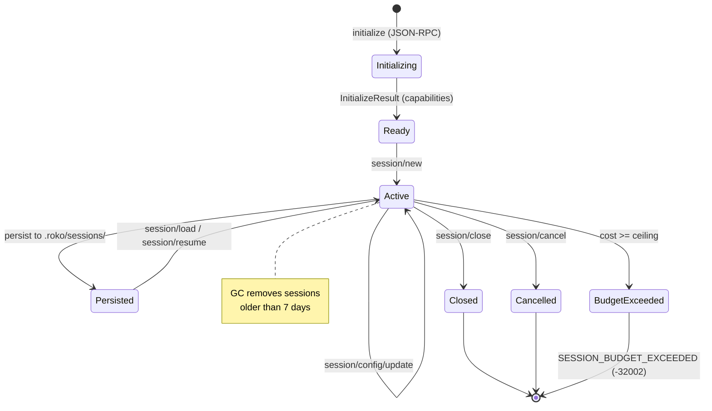
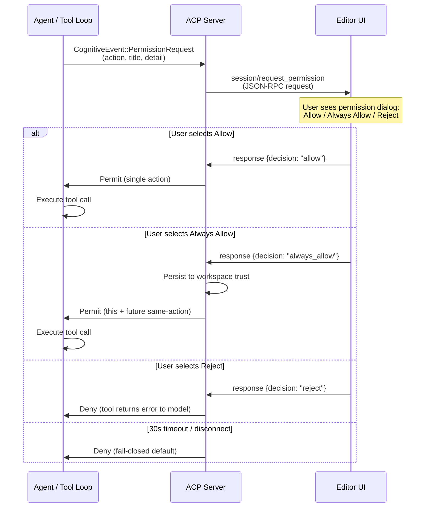

# 27 -- Agent Client Protocol (ACP)

> ACP is Roko's JSON-RPC 2.0 stdio protocol for editor integration. It turns
> any ACP-compatible editor (Cursor, Zed, JetBrains, Neovim, VS Code) into a
> Roko front-end: the editor owns the UI, Roko owns the cognition. Every
> interaction is mediated by mutation consent, budget enforcement, safety
> pre/post-dispatch checks, and truthful capability advertisement.

> **Implementation status (2026-09):** E17 8/8 WIRED. Fail-closed mutation
> consent, scoped prompt/model experiments, Anthropic session-MCP parity,
> consent-derived tool ceilings, model-aware image advertisement/enforcement,
> audio rejection, persisted/enforced USD budgets, shared health/rate-aware
> provider selection, configured sandboxing, opaque-phase worktree inspection,
> and a conformance capstone are live. 215 ACP tests pass (180 inline + 35
> integration). **Known P0: ACP stability** -- 7 crash-path panics and 12 race
> conditions were addressed by commit `815d96c90` (channel capacity 64->256,
> TOCTOU race -> atomic compare_exchange, blocking experiment IO ->
> spawn_blocking, reviewer no longer silently approves). Broader P1 hardening
> (spec upgrade v0.12->v0.13, bridge_events refactor) remains open backlog.

### Implementation sources

| Surface | Authority | Shipped boundary |
|---------|-----------|-----------------|
| ACP server entry point | `crates/roko-acp/src/handler.rs` | `run_acp_server`, JSON-RPC dispatch loop, config hot-reload |
| Session management | `crates/roko-acp/src/session.rs` | `SessionManager`, `AcpSession`, GC, persistence, budget tracking |
| Transport layer | `crates/roko-acp/src/transport.rs` | `StdioTransport<R, W>`, request/response correlation, pending request registry |
| Protocol types | `crates/roko-acp/src/types.rs` | JSON-RPC messages, ACP spec v0.12.2 types, error codes, capabilities |
| Bridge events | `crates/roko-acp/src/bridge_events/` | Cognitive event streaming, dispatch, cost, experiments, permissions, provenance, slash commands |
| Pipeline runner | `crates/roko-acp/src/runner.rs` | Workflow state machine execution, safety-layer-per-dispatch, worktree change detection |
| Pipeline state machine | `crates/roko-acp/src/pipeline.rs` | Pure `PipelinePhase`/`PipelineEvent`/`PipelineAction` state machine (side-effect-free) |
| Builtin tools | `crates/roko-acp/src/builtin_tools.rs` | 8 tools, fail-closed permission derivation, session capability ceiling |
| Workflow run state | `crates/roko-acp/src/workflow.rs` | `WorkflowRun` with cost, tokens, timing, template |
| Server config | `crates/roko-acp/src/config.rs` | `AcpConfig`, config source prefixes, multi-layer config loading |
| Config watcher | `crates/roko-acp/src/config_watch.rs` | `ConfigWatcher`, hot-reload on roko.toml changes |
| Knowledge injection | `crates/roko-acp/src/knowledge.rs` | Dispatch knowledge query, context prepend |
| ACP adapter (roko-agent) | `crates/roko-acp/src/acp_adapter.rs` | Agent adapter for ACP dispatch |

---

## 1. Protocol Overview

ACP communicates over **stdio** using newline-delimited JSON-RPC 2.0 messages. The
editor is the JSON-RPC client; Roko is the server. There is no HTTP, no WebSocket,
no shared memory -- just stdin/stdout. This design eliminates port conflicts, firewall
issues, and cross-process state, at the cost of requiring the editor to manage the
server process lifecycle.

```
Editor                                  Roko ACP Server
  |                                           |
  |--- initialize --------------------------->|
  |<-- InitializeResult (capabilities) -------|
  |                                           |
  |--- session/new --------------------------->|
  |<-- SessionNewResult (session_id) ----------|
  |                                           |
  |--- session/prompt (user message) --------->|
  |<~~ session/update (streaming tokens) ~~~~~~|
  |<~~ session/update (tool calls) ~~~~~~~~~~~~|
  |<~~ session/request_permission ------------->|  (mutation consent)
  |--- permission response ------------------->|
  |<~~ session/update (more tokens) ~~~~~~~~~~~|
  |<-- SessionPromptResult (stop_reason) ------|
  |                                           |
  |--- session/close ------------------------->|
```

**Wire format:** each message is a single JSON object terminated by `\n`. The server
reads from stdin via `BufReader`, writes to stdout. All stderr output goes to file
logging (`.roko/acp.log`).

**Source:** `crates/roko-acp/src/transport.rs` -- `StdioTransport<R, W>`

### 1.1 Protocol Versioning

```rust
// crates/roko-acp/src/types.rs

pub const ACP_PROTOCOL_VERSION: u32 = 1;
pub const ACP_SPEC_VERSION: &str = "0.12.2";
```

The `initialize` handshake negotiates the protocol version and exchanges
capabilities. The server reports its agent info, active config sources, and any
startup warnings (missing providers, parse errors, credential problems).

### 1.2 Error Codes

| Code | Constant | Meaning |
|------|----------|---------|
| -32700 | `PARSE_ERROR` | Malformed JSON-RPC message |
| -32600 | `INVALID_REQUEST` | Invalid JSON-RPC structure |
| -32601 | `METHOD_NOT_FOUND` | Unknown method |
| -32602 | `INVALID_PARAMS` | Parameter validation failed |
| -32603 | `INTERNAL_ERROR` | Server-side failure |
| -32000 | `SESSION_NOT_FOUND` | Session ID does not exist |
| -32001 | `SESSION_BUSY` | Session already has an active prompt |
| -32002 | `SESSION_BUDGET_EXCEEDED` | Session USD budget exhausted |

---

## 2. Session Management

An ACP session is a server-side conversation state identified by a UUID. Sessions
are created, used, persisted, loaded, and garbage-collected.

### 2.1 Session Lifecycle



**Source:** `crates/roko-acp/src/session.rs`

### 2.2 AcpSession State

Each session carries:

| Field | Type | Purpose |
|-------|------|---------|
| `session_id` | `String` | Server-generated UUID (`sess_<uuid>`) |
| `session_name` | `Option<String>` | Auto-set from first user message (truncated to 60 chars) |
| `config_state` | `SessionConfigState` | Model, provider, effort, gates, workflow, review strictness |
| `client_capabilities` | `ClientCapabilities` | Filesystem, terminal, MCP support declared by the editor |
| `cancel_token` | `CancelToken` | Cooperative cancellation (atomic flag + notify) |
| `conversation_history` | `Vec<ConversationTurn>` | Bounded multi-turn history (max 40 turns, 64K chars) |
| `mcp_servers` | `Vec<McpServerConfig>` | Session-scoped MCP server attachments |
| `always_allowed` | `HashSet<PermissionAction>` | Actions pre-granted via "always allow" for this session |
| `pinned_context` | `Vec<PinnedFile>` | Files pinned into every turn's system prompt (max 32 KiB each) |
| `cost_budget_usd` | `Option<f64>` | Session cost ceiling; `None` means unlimited |
| `accumulated_cost_usd` | `f64` | Spend accumulated from completed efficiency events |
| `provider_health_registry` | `Arc<ProviderHealthRegistry>` | Shared runtime health tracking |
| `provider_rate_limiter` | `Arc<ProviderRateLimiter>` | Configured RPM/TPM pool shared across sessions |

### 2.3 Session Configuration State

The `SessionConfigState` maps directly to the editor's dropdown controls:

```rust
// crates/roko-acp/src/session.rs

pub struct SessionConfigState {
    pub agent_mode: String,        // "code"
    pub provider: String,          // maps to [providers.*] in roko.toml
    pub model: String,             // maps to [models.*] in roko.toml
    pub model_selection_explicit: bool, // true if user picked it
    pub effort: String,            // low, medium, high, max
    pub clippy_enabled: bool,      // gate toggle
    pub tests_enabled: bool,       // gate toggle
    pub workflow: String,          // none, express, standard, full, auto
    pub review_strictness: String, // none, quick, standard, thorough
    pub max_iterations: u32,       // pipeline retry limit (1-3)
}
```

Config updates flow through `session/config/update` (or the alias
`session/set_config_option`) and trigger a `config_option_update` notification
back to the editor so dropdowns reflect the new state.

### 2.4 Garbage Collection

At server startup, `SessionManager::gc_old_sessions` removes persisted sessions
older than 7 days. This prevents unbounded disk growth from abandoned sessions.

---

## 3. Mutation Consent Protocol

This is the ACP's central safety mechanism. Every side-effecting action requires
explicit editor approval before execution. The agent cannot modify files, run
commands, or access the network without the user's consent.

### 3.1 Flow

1. During prompt execution, the provider's tool loop emits a
   `CognitiveEvent::PermissionRequest` containing the action type, title, and detail.
2. The ACP event streamer intercepts this event and sends a
   `session/request_permission` JSON-RPC **request** to the editor.
3. The editor displays a permission dialog with standard options.
4. The user selects an option; the editor sends a JSON-RPC **response**.
5. The ACP server parses the response and returns the decision to the tool loop.



**Source:** `crates/roko-acp/src/bridge_events/permissions.rs`

### 3.2 Permission Actions

```rust
// Derived in crates/roko-acp/src/builtin_tools.rs

pub fn derive_tool_permissions(tool_name: &str) -> ToolPermission {
    match tool_name {
        "read_file" | "glob" | "grep" | "ls" => ToolPermission::read_only(),
        "write_file" | "edit_file"            => ToolPermission::writes(),
        "bash"                                => ToolPermission::executes(),
        "web_fetch" | "web_search"            => ToolPermission::networked(),
        _                                     => ToolPermission::deny_all(), // fail closed
    }
}
```

Unknown tools are denied everything. The session capability ceiling is computed
as the union of all registered tool permissions -- nothing more.

### 3.3 Decision Outcomes

| Decision | Effect |
|----------|--------|
| Allow | Permit this single action |
| Always Allow | Permit this action for the remainder of the session; persisted to workspace trust |
| Reject | Block the action; the tool call returns an error to the model |

The 30-second timeout defaults to Reject. Cancellation during the permission wait
also defaults to Reject. A disconnected editor defaults to Reject. The pattern is
fail-closed at every edge.

### 3.4 Pre-Grant and Always-Allow

The `always_allowed` set is loaded from workspace trust at session creation and
updated dynamically when the user selects "Always Allow." Trust state is persisted
to disk so it survives session restarts:

```rust
// crates/roko-acp/src/session.rs

if matches!(decision, PermissionDecision::AlwaysAllow) {
    session.grant_always_allow(action.clone());
    AcpSession::save_workspace_trust(workdir, &session.always_allowed);
}
```

---

## 4. Prompt Experiments (A/B Testing)

ACP supports scoped prompt experiments: controlled A/B tests that replace specific
sections of the system prompt with variant content and optionally override the
dispatch model.

### 4.1 How Experiments Work

1. **Assignment**: Before each non-slash-command prompt, `assign_acp_experiment`
   reads the persisted experiment store (`.roko/learn/experiments.json`), filters
   for `Running` experiments matching the current ACP mode/role, and deterministically
   selects a variant.

2. **Section replacement**: The experiment's content replaces the corresponding
   canonical section in the system prompt via `replace_section_in_prompt()` -- not
   append. This ensures the experiment controls exactly the content it claims to.

3. **Model override**: If the experiment specifies a `model_slug`, the dispatch
   model changes for that turn. The cascade router is bypassed for experiment
   dispatches.

4. **Dispatch marking**: After the final prompt is assembled, the experiment is
   marked dispatched with the prompt's content hash, completing the
   Prepared -> Dispatched lifecycle transition.

5. **Outcome recording**: After dispatch completes (success or failure),
   `record_acp_experiment_outcome` persists the result for later analysis.

**Source:** `crates/roko-acp/src/bridge_events/experiments.rs`

### 4.2 Three-Phase Assignment Lifecycle

```
prepare_attempt_assignments -> mark_attempt_dispatched -> record_outcome
```

Each experiment assignment carries:
- `experiment_id` and `variant_id` for the selected variant
- `section_name` and `content` for prompt injection
- `attempt_key` (durable receipt key: session_id / "acp" / mode / attempt 1)
- `prepared_assignment_ids` for the dispatched subset

The experiment store uses a `std::sync::Mutex` (via `EXPERIMENT_STORE_IO_LOCK`)
for disk access. Since this blocks, assignment runs on a `spawn_blocking` thread
to avoid stalling the tokio runtime.

### 4.3 Interaction with Cascade Routing

Experiment model overrides take priority over cascade selection. When an experiment
specifies a model, the cascade router is not consulted. When no experiment is active
and the user has not explicitly selected a model, cascade routing proceeds normally.

---

## 5. Truthful Capabilities

ACP advertises only capabilities the selected model actually supports. This prevents
the editor from offering features that will fail at dispatch time.

### 5.1 Capability Advertisement

During `initialize`, the server resolves the default model and constructs
capabilities that reflect reality:

```rust
// crates/roko-acp/src/handler.rs

let prompt_capabilities = advertised_prompt_capabilities_for_model(
    resolved.provider_kind,
    resolved.profile.is_some_and(|profile| profile.supports_vision),
);
```

The function checks:
- **Provider kind** -- certain providers support richer prompt formats
- **Vision support** -- images are only advertised if the model profile declares
  `supports_vision = true`
- **Audio** -- always rejected (not supported in any current provider path)

### 5.2 Per-Prompt Validation

Before dispatch, `unsupported_prompt_content` validates the prompt blocks against
the resolved model's capabilities. If a user submits an image to a non-vision model,
the request is rejected with `INVALID_PARAMS` before any API call is made. If the
prompt contains audio blocks, they are rejected unconditionally.

### 5.3 Content Block Validation

For prompts containing images, `validate_model_input_messages` performs structural
validation before dispatch. Multi-part content arrays are assembled per-provider
via `inject_image_parts`, which translates between the wire format and each
provider's native image encoding.

---

## 6. Persisted and Enforced USD Budgets

Each ACP session has an optional cost ceiling in USD. When the budget is exhausted,
the session refuses further prompts.

### 6.1 Budget Lifecycle

1. **Configuration**: `budget.max_plan_usd` in `roko.toml` sets the per-session
   ceiling. `None` or zero means unlimited.

2. **Per-turn accounting**: After each prompt completes, `acp_efficiency_event`
   calculates the cost from the pricing table (or from the workflow engine's actual
   cost report). The session's `accumulated_cost_usd` is incremented.

3. **Pre-prompt check**: Before each non-slash-command prompt, `cost_budget_exceeded()`
   compares accumulated cost against the ceiling. If exceeded, the server returns
   `SESSION_BUDGET_EXCEEDED` (-32002) without making an API call.

4. **Budget status notification**: After each efficiency event, a
   `session_info_update` is pushed to the editor whose `_meta.roko.budget` holds the
   ceiling, accumulated spend, and remaining budget. The editor can display this in a
   status bar; spec clients that do not know the extension ignore it.

**Source:** `crates/roko-acp/src/bridge_events/cost.rs`,
`crates/roko-acp/src/bridge_events/protocol.rs`

### 6.2 Cost Calculation

```rust
// crates/roko-acp/src/bridge_events/cost.rs

pub fn calculate_cost_for_model_slug(
    model_slug: &str,
    input_tokens: u64,
    output_tokens: u64,
    cache_read_tokens: u64,
) -> Option<f64>
```

When the model slug has no pricing row, cost stays `None` rather than collapsing to
zero. For workflow engine dispatches, the actual cost from `WorkflowRunReport` is
preferred over the pricing-table estimate.

---

## 7. Shared Health and Rate-Aware Selection

ACP sessions share provider health state and rate-limit pools so that one session's
provider failure informs routing decisions across all concurrent sessions.

### 7.1 Provider Health Registry

A shared `Arc<ProviderHealthRegistry>` tracks per-provider health. Providers that
return errors are marked unhealthy and filtered from routing. The registry is
initialized lazily on the first prompt (`ensure_provider_runtime`) and shared across
all sessions via the `SessionManager`.

### 7.2 Rate Limiter

A shared `Arc<ProviderRateLimiter>` enforces configured RPM and TPM limits from
provider definitions in `roko.toml`. The limiter integrates with the health registry
so that rate-limited providers are treated as temporarily unavailable.

```rust
// crates/roko-acp/src/session.rs

fn build_provider_rate_limiter(
    roko_config: &RokoConfig,
    health: &Arc<ProviderHealthRegistry>,
) -> Arc<ProviderRateLimiter> {
    let providers = roko_config.effective_providers();
    let health_checker: Arc<dyn ProviderHealthChecker> = Arc::clone(health) as Arc<_>;
    Arc::new(
        ProviderRateLimiter::from_provider_configs(
            DEFAULT_PROVIDER_RPM,
            providers.iter(),
        )
        .with_health_registry(health_checker),
    )
}
```

### 7.3 Cascade Router Integration

When the user has not explicitly selected a model and no experiment overrides the
choice, `cascade_select_model` consults the cascade router with the current health
and rate state. The router considers prompt complexity, effort level, provider
availability, and historical performance to choose the optimal model.

Cascade observations are recorded after each direct prompt (not after workflow
dispatches, which own their own feedback) so the router learns from ACP usage
patterns.

---

## 8. Configured Sandboxing

The ACP pipeline runner applies the configured sandbox level from `roko.toml` to
every agent dispatch within a workflow. This uses the same sandbox infrastructure
as the CLI plan runner.

### 8.1 Sandbox Levels

The `RunnerSandboxLevel` enum (from `roko-core`) defines the isolation tiers:

| Level | Enforcement |
|-------|-------------|
| `None` | No additional restrictions beyond path policy |
| `Restricted` | Filesystem access limited to the workspace |
| `Quarantine` | Network access denied, exec restricted |
| `Container` | Full container isolation (when available) |

### 8.2 Pipeline Safety Layer

Each pipeline phase gets its own `SafetyLayer` instance, constructed with the
configured sandbox level:

```rust
// crates/roko-acp/src/runner.rs

fn safety_layer_for_pipeline_role_with_sandbox(
    role: &str,
    sandbox_level: RunnerSandboxLevel,
) -> SafetyLayer {
    safety_layer_for_mode(role).with_sandbox_level(sandbox_level.into())
}
```

The sandbox level propagates to every agent spawned by the pipeline -- strategist,
implementer, auto-fixer, reviewer. There is no per-phase override; the workspace
configuration is authoritative.

---

## 9. Opaque-Phase Worktree Inspection

The ACP server tracks filesystem changes made during each prompt dispatch, enabling
post-dispatch safety verification without exposing the internals of the provider's
execution to the consent protocol.

### 9.1 WorktreeChangeSnapshot

Before dispatch, the server captures a snapshot of the git worktree state:

```rust
// crates/roko-acp/src/runner.rs

pub(crate) struct WorktreeChangeSnapshot { /* git status/ls-files state */ }

impl WorktreeChangeSnapshot {
    pub fn capture(workdir: &Path) -> Self { /* ... */ }
    pub fn changed_files(&self, workdir: &Path) -> Vec<PathBuf> { /* ... */ }
}
```

After dispatch, `changed_files` diffs the before/after state to identify exactly
which files were created, modified, or deleted. This list feeds the post-dispatch
safety check, which runs the `SafetyLayer::post_dispatch_check` against the actual
filesystem mutations.

### 9.2 Post-Dispatch Safety

The post-dispatch check runs the full safety layer (including taint, path policy,
and content scrubbing) against the changed files and the assistant's text output.
Blocking violations cause the entire prompt result to be replaced with a pipeline
error. Warning violations are logged but do not block the response.

### 9.3 Pre-Dispatch Safety

Before the cognitive task spawns, a pre-dispatch safety check validates the prompt
against the configured role and workspace context. The check evaluates:
- Role authorization for the action
- Network requirement declarations
- Workspace boundary constraints

Blocking violations prevent dispatch entirely. The agent never runs; the user sees
a "Safety check blocked this action" message.

---

## 10. MCP Parity

ACP achieves Anthropic MCP parity by supporting the same MCP server configuration
patterns used by Cursor and the Claude CLI.

### 10.1 Session MCP Servers

Editors pass MCP server configurations at session creation via the `mcp_servers`
field. The ACP server:

1. Discovers `.mcp.json` in the workspace root (auto-discovery)
2. Writes a merged session MCP config to `.roko/session-mcp.json`
3. Passes the resolved config path to provider dispatch
4. Supports both `stdio` and `http` transports (stdio for Claude CLI passthrough,
   HTTP for direct MCP clients)

**Source:** `crates/roko-acp/src/bridge_events/tools.rs`

### 10.2 Tool Resolution

MCP tools are resolved at dispatch time using `setup_session_mcp_tools`, which
launches stdio MCP servers, runs `tools/list`, and merges the results with the
8 builtin ACP tools. The combined tool set is registered with the `ToolDispatcher`
for the provider's tool loop.

Each MCP tool goes through the same permission derivation as builtin tools. Unknown
tool names from MCP servers are denied all permissions (fail-closed).

---

## 11. Pipeline Workflows

Beyond single-agent chat, ACP supports structured workflow pipelines that chain
multiple agent phases with gates and review.

### 11.1 Pipeline State Machine

The pipeline is a pure state machine: events in, actions out. No side effects.

```rust
// crates/roko-acp/src/pipeline.rs

pub enum PipelinePhase {
    Pending, Strategizing, Implementing, AutoFixing,
    Gating, Reviewing, Committing, Complete,
    Halted { reason: String }, Cancelled,
}
```

### 11.2 Workflow Templates

| Template | Phases | Use case |
|----------|--------|----------|
| `Express` | Implement -> Gate -> Commit | Fast changes, no review |
| `Standard` | Implement -> Gate -> Review -> Commit | Default for code changes |
| `Full` | Strategize -> Implement -> Gate -> Review -> Commit | Complex tasks |
| `auto` | Auto-selected based on prompt analysis | IDE dropdown option |
| `none` | Single-agent direct dispatch | Chat mode |

### 11.3 Workflow Engine Path

When a pipeline template is selected, ACP dispatches through the workflow engine
(`run_with_workflow_engine`) rather than single-agent dispatch. The engine manages
the full state machine, spawns agents for each phase, runs gates, and produces a
`WorkflowRunReport` with actual cost data.

The shared `WorkflowRun` handle is accessible to slash commands (e.g., `/workflow status`)
via the session's `shared_run: SharedWorkflowRun` field, which is an
`Arc<Mutex<Option<WorkflowRun>>>` updated by the runner in real time.

---

## 12. Config Management

ACP supports multi-layer configuration with hot-reload and provenance tracking.

### 12.1 Config Sources

Configuration is loaded in priority order, with each source tagged by its origin:

| Prefix | Source | Priority |
|--------|--------|----------|
| `global:` | Explicit `--global-config` path | 1 (highest global) |
| `project:` | Workspace `roko.toml` or explicit `--config` | 2 |
| `env:` | `ROKO_CONFIG` environment variable | 3 |
| `default:` | Implicit `~/.roko/config.toml` | 4 (lowest) |

The `initialize` response includes `configSources` so the editor can display
which config files are active.

### 12.2 Hot Reload

The `ConfigWatcher` monitors roko.toml for changes. On each inbound request, if
the watcher signals a change, the server:

1. Reloads the config file
2. Updates the `SessionManager`'s shared config
3. Pushes `config_option_update` notifications to all active sessions
4. Pushes `server/config_sources_update` if the source list changed

### 12.3 Global Config Inheritance

When an explicit `--global-config` is provided (common in editor ACP settings),
the global config provides provider registries, model definitions, and default
model/backend/effort settings. Project-level config values take precedence; global
values fill gaps. The merge uses first-wins semantics for providers and models
(`entry().or_insert()`), and only inherits `default_model` when the project config
uses the built-in default.

---

## 13. Cognitive Event Streaming

The bridge between Roko's provider system and ACP's `session/update` notification
stream.

### 13.1 Event Flow

```
Provider / Tool Loop
    |
    v
CognitiveEvent (mpsc channel, capacity 256)
    |
    v
stream_events_to_editor()
    |
    +-- TokenChunk(text) --> session/update { text_delta }
    +-- ToolCallStart   --> session/update { tool_call }
    +-- ToolCallResult  --> session/update { tool_result }
    +-- PermissionRequest --> session/request_permission
    +-- Complete        --> return SessionPromptResult
    +-- Failure         --> session/update { dispatch_failure }
    +-- MaxTokens       --> return stop_reason: MaxTokens
```

### 13.2 Concurrent Message Handling

While streaming events, the server simultaneously reads inbound messages to handle:
- `session/cancel` notifications (cancel the active prompt)
- JSON-RPC responses to outbound requests (permission responses)
- Client disconnection (treated as cancellation)

This is implemented via `tokio::select!` with biased cancellation priority.

---

## 14. Slash Commands

ACP sessions support slash commands (prefixed with `/`) that bypass model dispatch
and execute local operations. Slash commands are not counted against the session
budget and do not generate experiment assignments.

Available commands are sent to the editor via `available_commands_update` after
session creation and resume, adapting to bare mode configuration.

**Source:** `crates/roko-acp/src/bridge_events/slash_commands.rs`

---

## 15. Known Stability Issues

ACP stability was identified as a P0 issue and partially addressed:

### 15.1 Fixed (commit `815d96c90`)

| Issue | Fix |
|-------|-----|
| 7 crash-path panics | Defensive error handling, Option/Result propagation |
| Event channel overflow | Channel capacity increased from 64 to 256 |
| TOCTOU race on session busy flag | Replaced flag check+set with `AtomicBool::compare_exchange` |
| Blocking experiment I/O on tokio runtime | Moved to `tokio::task::spawn_blocking` |
| Reviewer silent approval on error | Reviewer now reports failure instead of silently approving |

### 15.2 Open

| Item | Backlog ID | Size |
|------|-----------|------|
| ACP spec upgrade v0.12 -> v0.13 + bridge_events refactor | 18 | XL |
| ACP tool permission gate (plugin tier + command ceiling) | 45 | M |
| ACP single-agent chat tools require client capability declaration | 56 | M |
| ACP learning-pipeline parity (experiment receipts) | 39 | M |
| ACP test coverage (MCP crash + tool matrix) | 46 | S |

---

## 16. Verification

### 16.1 Start the ACP Server

```bash
cargo run -p roko-cli -- acp
```

The server starts on stdio, logs to `.roko/acp.log`, and waits for an `initialize`
request. In practice, the editor launches this process automatically when the
Roko agent is selected.

### 16.2 Manual Protocol Test

```bash
# Send initialize and read the response:
echo '{"jsonrpc":"2.0","id":1,"method":"initialize","params":{"protocolVersion":1}}' \
  | cargo run -p roko-cli -- acp 2>/dev/null | head -1 | jq .
```

### 16.3 Run Tests

```bash
cargo test -p roko-acp           # 215 tests (180 inline + 35 integration)
```

### 16.4 Integration Tests

| Test file | Coverage |
|-----------|----------|
| `crates/roko-acp/tests/protocol_conformance.rs` | JSON-RPC framing, initialize, session lifecycle |
| `crates/roko-acp/tests/telemetry_integration.rs` | Efficiency events, episode logging |
| `crates/roko-acp/tests/helpers.rs` | Test utilities for mock transport |

---

## 17. Depth Files

| File | Topic |
|------|-------|
| [ACP-MUTATION-CONSENT](../v2/ACP-INTEGRATION-GUIDE.md) | Full mutation consent wire protocol, options, and editor integration |
| [ACP-EXPERIMENTS](../v2/ACP-INTEGRATION-GUIDE.md#experiments-ab-testing) | Experiment store, variant assignment, outcome settlement |
| [ACP-PIPELINE](../v2/ACP-INTEGRATION-GUIDE.md#pipeline-workflows) | Workflow templates, state machine, gate integration |
| [ACP-MCP-PARITY](../v2/ACP-INTEGRATION-GUIDE.md#mcp-integration) | MCP server config, tool resolution, session MCP config |

---

## 18. Cross-References

| Topic | Chapter | Relationship |
|-------|---------|-------------|
| Agent dispatch and provider kinds | [05-AGENT](05-AGENT.md) | ACP dispatches through the same provider factory |
| Safety layer and tool policy | [12-SAFETY](12-SAFETY.md) | ACP pre/post-dispatch checks use SafetyLayer |
| Cascade routing and model selection | [08-LEARNING](08-LEARNING.md) | ACP cascade selection uses the shared CascadeRouter |
| Prompt experiments | [08-LEARNING](08-LEARNING.md) | ACP experiment assignment uses the shared ExperimentStore |
| Gate pipeline | [07-GATES](07-GATES.md) | ACP workflow pipelines run compile/test/clippy gates |
| System prompt builder | [06-COMPOSITION](06-COMPOSITION.md) | ACP sessions build system prompts via SystemPromptBuilder |
| Graph engine | [03-GRAPH](03-GRAPH.md) | ACP workflow engine path uses the Graph engine |
| Execution and RuntimeServices | [04-EXECUTION](04-EXECUTION.md) | ACP workflow dispatch uses RuntimeServices |
