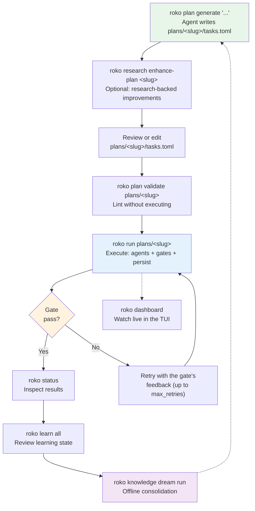

# 28. CLI Reference

> **Implementation status**: WIRED -- The CLI is the primary control surface for the entire
> Roko toolkit. Every command documented here has a corresponding Clap subcommand in
> `crates/roko-cli/src/main.rs`. Commands are verified against the `roko --help` tree and
> the six depth files in `docs/v3/depth/28-CLI-*.md`.

---

## Table of contents

1. [Overview](#overview)
2. [Installation and first run](#installation-and-first-run)
3. [Global flags](#global-flags)
4. [Exit codes](#exit-codes)
5. [Core workflow](#core-workflow)
6. [Planning](#planning)
7. [Agents](#agents)
8. [Research](#research)
9. [Knowledge](#knowledge)
10. [Learning and feedback](#learning-and-feedback)
11. [Jobs](#jobs)
12. [Configuration](#configuration)
13. [Server and deployment](#server-and-deployment)
14. [Graph, feeds, recipes, and triggers](#graph-feeds-recipes-and-triggers)
15. [Utilities](#utilities)
16. [Interactive dashboard](#interactive-dashboard)
17. [Authentication](#authentication)
18. [Vision loop](#vision-loop)
19. [Benchmarks](#benchmarks)
20. [Environment variables](#environment-variables)
21. [Config file locations and precedence](#config-file-locations-and-precedence)
22. [Data directory layout](#data-directory-layout)
23. [In-progress changes](#in-progress-changes)
24. [Removed commands](#removed-commands)
25. [Deprecated commands](#deprecated-commands)
26. [Troubleshooting](#troubleshooting)

---

## Overview

Roko is a Rust toolkit for building agents that build themselves. The CLI is the primary
control surface. You use it to turn a request (a prompt or a written spec) into an
implementation plan, execute the plan with LLM agents, validate results through a gate
pipeline, learn from every run, and persist everything so it can resume if interrupted.

### Command tree

```mermaid
graph LR
    roko((roko))

    roko --- run[run]
    roko --- status[status]
    roko --- show[show]
    roko --- doctor[doctor]

    roko --- plan[plan]
    plan --- plan_generate[generate]
    plan --- plan_create[create]
    plan --- plan_validate[validate]
    plan --- plan_run[run]
    plan --- plan_list[list]
    plan --- plan_index[index]
    plan --- plan_queue[queue]

    roko --- agent[agent]
    agent --- agent_create[create]
    agent --- agent_start[start]
    agent --- agent_stop[stop]
    agent --- agent_list[list]
    agent --- agent_serve[serve]
    agent --- agent_chat[chat]

    roko --- research[research]
    research --- res_topic[topic]
    research --- res_search[search]
    research --- res_enhance[enhance-plan/tasks]

    roko --- knowledge[knowledge]
    knowledge --- k_query[query]
    knowledge --- k_dream[dream]
    knowledge --- k_export[export/import]
    knowledge --- k_custody[custody]

    roko --- learn[learn]
    learn --- l_all[all]
    learn --- l_gates[gates]
    learn --- l_reflexes[reflexes]
    learn --- l_inspect[inspect]

    roko --- config[config]
    config --- cfg_init[init/show/set]
    config --- cfg_providers[providers]
    config --- cfg_models[models]
    config --- cfg_plugins[plugins]
    config --- cfg_mcp[mcp]

    roko --- serve[serve]
    roko --- acp[acp]
    roko --- dashboard[dashboard]
    roko --- graph_cmd[graph]
    roko --- feed[feed]
    roko --- trigger[trigger]
```



The full self-hosting workflow, plan first:



`roko run --plan "..."` does the first and last steps in one command: it writes the plan,
shows it, and asks before running it. For a small change, `roko run "..."` is enough: it
sizes the prompt and runs a small change as one checked task, and writes a plan first only
when the work is larger. Write the plan yourself (`roko plan generate`, or
`roko run --plan --dry-run`) when you want to review or edit it before anything runs.

---

## Installation and first run

Roko requires Rust 1.91 or later (needed for `alloy` dependencies).

```bash
rustup update stable
cargo build --workspace
```

Initialize a workspace:

```bash
cd /your/project
roko init
roko config init              # Interactive setup wizard
roko doctor                   # Verify everything is wired
```

---

## Global flags

These flags are `global = true` and can be placed before any subcommand.

| Flag | Type | Default | Description |
|---|---|---|---|
| `--config <path>` | path | `./roko.toml` | Override the config file location. |
| `--role <string>` | string | from config | Set the agent role / persona. |
| `--model <string>` | string | from config | Force the model for this invocation; bypasses adaptive routing. Aliases: `--force-model`, `--force-backend`. |
| `--repo <path>` | path | cwd | Set the repository / working directory root. |
| `--resume <id>` | string | -- | Resume a previous session by ID. |
| `--effort low\|medium\|high\|max` | enum | from config | Reasoning effort level passed to the agent backend. |
| `--json` | flag | false | Emit JSON output instead of human-readable text. Being implemented across 15+ commands; see [In-progress changes](#in-progress-changes). |
| `--log-format text\|json` | enum | `text` | Tracing log format. |
| `--quiet` | flag | false | Suppress non-essential output. |
| `-v`, `--verbose` | flag | false | Enable verbose tracing output to stderr. Without this, tracing goes only to `.roko/roko.log`. |
| `--no-replan` | flag | false | Disable re-planning; gate failures become terminal failures. |
| `--skip-validate` | flag | false | Skip tasks.toml structure validation (for freshly-generated plans). |
| `--headless` | flag | false | Run as a headless daemon (background service). |
| `--color auto\|always\|never` | enum | `auto` | Control ANSI color output. Respects `NO_COLOR`, `CLICOLOR`, `CLICOLOR_FORCE`. |
| `--timing` | flag | false | Print elapsed time after command execution. Also enabled by `ROKO_TIMING=1`. |
| `--no-serve` | flag | false | Do not start the HTTP control plane in the background. |

**Effort levels:**

| Value | Description |
|---|---|
| `low` | Minimal reasoning -- fast, cheap. |
| `medium` | Balanced reasoning (default). |
| `high` | Thorough reasoning. |
| `max` | Maximum reasoning -- slowest, most expensive. |

**Color auto-mode precedence** (highest first):

1. `NO_COLOR` set and non-empty -> off
2. `CLICOLOR_FORCE` set and not `"0"` -> on
3. `CLICOLOR=0` -> off
4. stdout is a TTY -> on
5. otherwise -> off

---

## Exit codes

| Code | Constant | Meaning |
|---|---|---|
| `0` | `EXIT_SUCCESS` | Successful execution. |
| `1` | `EXIT_AGENT_FAILURE` | Agent or gate failure (logical error in the build). |
| `2` | `EXIT_SYSTEM_ERROR` | System error (I/O, config, infrastructure). |

---

## Core workflow

### `roko init`

Create `.roko/` and a default `roko.toml` in the target directory.

```
roko init [path] [--cloud] [--profile <name>] [--demo]
```

| Arg/Flag | Default | Description |
|---|---|---|
| `path` | cwd | Directory to initialize. |
| `--cloud` | false | Generate cloud-ready defaults for deployment. |
| `--profile <name>` | -- | Project profile: `rust`, `typescript`, `go`, `python`, `general`. |
| `--demo` | false | Seed realistic demo data after initialization. |

```bash
roko init
roko init /path/to/project --profile rust
roko init --cloud --demo
```

---

### `roko setup`

Interactive setup wizard: detect providers, init workspace, verify.

```
roko setup [--workdir <path>] [--yes]
```

| Flag | Default | Description |
|---|---|---|
| `--workdir <path>` | cwd | Directory to set up. |
| `--yes` | false | Non-interactive mode: skip prompts, use first available provider. |

---

### `roko run`

The one entry point for work. `roko run` takes a prompt or an existing plan directory:

| Form | What it does |
|---|---|
| `roko run "<prompt>"` | Size the prompt. A small change runs as one checked task; a larger one gets a plan written first (`plans/<slug>/tasks.toml`), which then runs. |
| `roko run --plan "<prompt>"` | Always write a plan first. On a terminal Roko shows the plan and asks before running it; `--yes` skips the question. |
| `roko run --plan --dry-run "<prompt>"` | Write the plan and stop. Review or edit `plans/<slug>/`, then run it with `roko run plans/<slug>`. |
| `roko run --dry-run "<prompt>"` | Show how the prompt would run (size, route, gates). Runs nothing. |
| `roko run plans/<slug>` | Run an existing plan directory; the same run as `roko plan run plans/<slug>`. |
| `roko run plans/` | Run every plan under `plans/`. |

```
roko run <prompt...|plan-dir> [--plan] [--dry-run] [--yes]
                              [--complexity trivial|simple|standard|complex]
                              [--context <path>...] [--no-cascade] [--provider <name>]
                              [--workdir <path>] [--max-retries <n>] [--serve] [--share]
                              [--fresh] [--resume-plan [<path>]]
```

| Arg/Flag | Default | Description |
|---|---|---|
| `<prompt...>` or `<plan-dir>` | required | A natural-language request (quote it), or a plan directory such as `plans/<slug>` or `plans/`. |
| `--plan` | false | Always write a plan first, whatever the size of the prompt. |
| `--dry-run` | false | With `--plan`: write the plan and stop. Without it: show the size, route and gates the prompt would get, and run nothing. |
| `--yes` | false | Run a written plan without asking first. |
| `--complexity <level>` | auto | Force the size: `trivial` and `simple` run one task; `standard` and `complex` write a plan. |
| `--context <path>` | -- | Extra context for the planner: files, directories or globs (repeatable). |
| `--no-cascade` | false | Disable cascade routing for this run. |
| `--provider <name>` | config | Override the provider for this run. |
| `--workdir <path>` | cwd | Override the working directory. |
| `--max-retries <n>` | config | Maximum retry attempts per task. A task that fails its gates is retried with the gate's feedback. |
| `--serve` | false | Start the HTTP control plane alongside the run. One-task runs only. |
| `--share` | false | Generate a shareable URL (starts serve if needed). One-task runs only. |
| `--fresh` | false | Plan directory only: archive existing state and start from scratch. |
| `--resume-plan [<path>]` | -- | Plan directory only: resume from the last checkpoint (default `.roko/state/graph/`). |

The global flags (`--model`, `--role`, `--json`, `--effort`, `--quiet`) apply as usual. For
the full set of plan-run options (budgets, worktrees, topology, the inline TUI), use
[`roko plan run`](#roko-plan-run).

`roko run` does not classify intent: a question is not routed to research. Ask questions
with `roko think "<question>"` or `roko research topic "<topic>"`.

```bash
roko run "add a unit test for the config parser"   # one change, checked
roko run --plan "Add OAuth2 login"                 # write a plan, review it, run it
roko run --plan --dry-run "Add OAuth2 login"       # write plans/add-oauth2-login/ and stop
roko run plans/add-oauth2-login                    # run an existing plan
roko run --dry-run "Refactor the API errors"       # show size, route and gates; run nothing
```

`roko do`, `roko develop` and `roko prd` were removed; see
[Removed commands](#removed-commands) for what replaces each.

When invoked with no subcommand and a bare string argument, Roko treats it as `roko run`:

```bash
roko "Fix the login bug"        # equivalent to: roko run "Fix the login bug"
```

When invoked with no arguments and stdin is a TTY, Roko launches the unified chat REPL.

---

### `roko status` (alias: `roko s`)

Print signal counts, most recent episode, gate pass/fail ratios, and workspace health.

```
roko status [--workdir <path>] [--quick] [--cfactor] [--surfaces]
```

| Flag | Default | Description |
|---|---|---|
| `--workdir <path>` | cwd | Directory containing `.roko/`. |
| `--quick` | false | Print a compact 3-line health summary (provider, learning state, workspace). |
| `--cfactor` | false | Compute and persist the latest C-Factor snapshot. |
| `--surfaces` | false | Print the CLI/TUI/backend surface inventory instead of session status. |

```bash
roko status
roko status --json
roko status --cfactor
roko status --quick
```

---

### `roko show`

Inspect workspace state from `.roko/`. Accepts an optional subject to drill into a specific area.

```
roko show [<subject>] [--dashboard] [--follow] [--serve-url <url>] [--workdir <path>]
```

| Arg/Flag | Default | Description |
|---|---|---|
| `<subject>` | -- | One of: `costs`, `agents`, `knowledge`, `plans`, `learning`, `history`, or a work item/plan ID. |
| `--dashboard` | false | Open the interactive TUI dashboard. |
| `--follow`, `-f` | false | Stream live events from a running `roko serve` instance via SSE. |
| `--serve-url <url>` | `http://localhost:6677` | URL for `--follow`. |
| `--workdir <path>` | cwd | Working directory. |

```bash
roko show                     # Overview
roko show costs               # Cost breakdown by model, task, and day
roko show agents              # Agent status
roko show knowledge           # Durable knowledge entries
roko show plans               # Plans in progress
roko show learning            # Routing, experiments, gates, and C-Factor
roko show history             # Recent chronological state events
roko show my-plan-id          # Detail for a specific work item
```

---

### `roko doctor`

Diagnose self-hosted workspace bootstrap state. Checks for `.roko/`, `roko.toml`, agent
command availability, secrets, and optionally the HTTP control plane.

```
roko doctor [disk|network|clean] [--workdir <path>] [--serve-url <url>]
```

| Arg/Flag | Default | Description |
|---|---|---|
| `disk` | -- | Report free space, stale targets, worktrees, and retained log sizes. |
| `network` | -- | Report network connectivity and external service reachability. |
| `clean` | -- | Remove orphaned temp files, `.corrupted` files, and stale lock files. |
| `--workdir <path>` | cwd | Directory containing `roko.toml` and `.roko/`. |
| `--serve-url <url>` | -- | roko-serve base URL or health endpoint to probe. |

---

### `roko diagnose`

Diagnose why a plan failed. Prints a readable report: the plan's status, each task that did not complete with
why (its last error, the verify step it failed and that step's command, its attempts with their cost), and the
next steps, including the command that resumes the run. The global `--json` flag prints the full report as
structured JSON instead.

```
roko diagnose <plan-id> [--verbose] [--workdir <path>] [--json]
```

The report is built from the plan's Graph checkpoint under `.roko/state/graph/<plan-id>/`
(status, completed tasks, spend), the plan's `tasks.toml`, and the run's rows in
`.roko/learn/costs.jsonl` (attempts), `.roko/learn/gate-failures.jsonl` (failed verify steps)
and `.roko/episodes.jsonl` (failure reasons). It lists every task as `completed`, `failed`,
`incomplete` or `never_ran` (with the failed dependencies that blocked it), and previews what
`roko plan run <plan dir>` would resume. The Runner-v2 `.roko/state/state-snapshot.json` is
read only for a plan without a Graph checkpoint.

| Arg/Flag | Description |
|---|---|
| `<plan-id>` | Plan ID to diagnose. |
| `--verbose` | Also list the tasks that completed, with their attempts, verify failures and episodes. |
| `--json` | Print the report as structured JSON. |

---

### `roko resume`

Resume a plan execution from its last checkpoint.

```
roko resume [<run-id>] [--workdir <path>]
```

| Arg/Flag | Description |
|---|---|
| `<run-id>` | Run or plan ID to resume (defaults to most recent snapshot). |

```bash
roko resume                   # Resume from default snapshot
roko resume run_4823          # Resume a specific run
```

---

### `roko think`

Research a question without executing agents or changing source files. Uses the knowledge
store and research capabilities to answer questions about the codebase.

```
roko think <question...> [--workdir <path>]
```

```bash
roko think "how does auth work in this codebase?"
roko think "what do we know about rate limiting?"
```

---

### `roko note`

Capture a quick note (no LLM, instant). Saved to `.roko/notes/`.

```
roko note <text...> [--tag <tag>...] [--workdir <path>]
```

| Flag | Description |
|---|---|
| `--tag`, `-t` | Tag(s) to attach to the note (repeatable). |

```bash
roko note "my thought here"
roko note --tag feature "add cursor support"
roko note --tag bug --tag urgent "login is broken"
```

---

### `roko github status`

Inspect GitHub config, authentication, plan PR/CI state, and failure issues.

```
roko [--json] github status [--workdir <path>]
```

The `--json` global flag must precede `github` for structured output. The command exits
successfully with a local diagnostic when `GITHUB_TOKEN` is missing.

---

### `roko history`

List or show past chat session summaries.

```
roko history [<id>] [--workdir <path>]
```

```bash
roko history                                        # List the 20 most recent sessions
roko history 2026-04-29T14-23-05-my-agent           # Show one session in detail
```

---

### `roko cache`

Inspect and safely prune workspace-local build/evidence caches.

```
roko cache status [--workdir <path>]
roko cache prune [--apply] [--workdir <path>]
                 [--target-budget-gb <n>] [--evidence-budget-mb <n>]
                 [--context-budget-mb <n>] [--min-age-hours <n>]
                 [--max-evidence-age-days <n>] [--keep-runs <n>]
```

| Subcommand | Description |
|---|---|
| `status` | Report cache pressure and protected/eligible entries without deleting. |
| `prune` | Plan a safe prune. Without `--apply`, the command is read-only. |

| Prune flag | Default | Description |
|---|---|---|
| `--apply` | false | Perform deletion. |
| `--target-budget-gb` | 96 | Combined target budget across linked worktrees. |
| `--evidence-budget-mb` | 2048 | Terminal run-evidence budget. |
| `--context-budget-mb` | 1024 | Context-pack cache budget. |
| `--min-age-hours` | 6 | Minimum age of incremental partitions selected under pressure. |
| `--max-evidence-age-days` | 14 | Maximum age of terminal evidence and immutable log generations. |
| `--keep-runs` | 10 | Number of newest terminal evidence runs always retained. |

---

### `roko impact`

Analyze which crates are affected by the current changes. Uses git diff and cargo metadata
to determine impacted crates and their reverse dependents.

```
roko impact [--base <ref>] [--files <path>...] [--json] [--workdir <path>]
```

| Flag | Default | Description |
|---|---|---|
| `--base <ref>` | `HEAD` | Git ref to diff against. |
| `--files <path>...` | -- | Explicit file list instead of detecting from git diff. |
| `--json` | false | Machine-readable JSON output. |

```bash
roko impact                          # Affected crates from uncommitted changes
roko impact --base main              # Compare against main branch
roko impact --json                   # JSON for scripting
```

---

## Planning

A plan is the unit of work: a directory `plans/<slug>/` that holds `tasks.toml` (the tasks,
their dependencies and `verify` commands) and `plan.md` (prose context). Write one from a
prompt with `roko plan generate` (or `roko run --plan --dry-run`), or by hand with
`roko plan create`; check it with `roko plan validate`; run it with `roko run plans/<slug>`
or `roko plan run`.

```bash
roko plan generate "Add OAuth2 login"              # write plans/add-oauth2-login/ (tasks.toml + plan.md)
roko research enhance-plan add-oauth2-login        # optional: research-backed improvements to the plan
roko plan validate plans/add-oauth2-login          # lint without executing
roko run plans/add-oauth2-login                    # run it: parallel, isolated, checked, merged
roko plan run plans/add-oauth2-login --resume-plan # resume an interrupted run
```

### `roko plan` (alias: `roko p`)

#### `roko plan list`

List all plans discovered in the workspace. Supports `--json`.

```
roko plan list [--workdir <path>] [--waves]
```

| Flag | Description |
|---|---|
| `--waves` | Group plans by execution wave (cross-plan dependency analysis). |

#### `roko plan show`

Show details of a specific plan.

```
roko plan show <plan-id> [--workdir <path>]
```

#### `roko plan create`

Create a new plan skeleton.

```
roko plan create <plan-id> --title <title> [--description <text>] [--workdir <path>]
```

#### `roko plan validate`

Lint every `tasks.toml` under a plans directory without executing. Run this before
`roko plan run` to catch schema errors and missing dependency references.

```
roko plan validate [<dir>] [--strict] [--json] [--dag]
```

| Arg/Flag | Default | Description |
|---|---|---|
| `<dir>` | `plans/` | Plans root directory. |
| `--strict` | false | Fail on warnings, not only errors. |
| `--json` | false | Output machine-readable JSON. |
| `--dag` | false | Show DAG analysis: plan/task/edge counts, wave breakdown, critical path, dangling references. |

#### `roko plan run`

The primary execution command. The Graph engine executes tasks through the complete
agent/gate/replan/worktree/merge/persistence lifecycle. `roko run <plans-dir>` is the same
run with the common options; `roko plan run` takes the full set below.

```
roko plan run <plans-dir> [--engine graph] [--workdir <path>]
              [--resume-plan [<path>]] [--approval] [--no-tui]
              [--max-retries <n>] [--max-tasks <n>] [--dry-run]
              [--fresh] [--force-resume] [--force]
              [--budget-override <usd>] [--no-budget]
              [--dangerously-skip-permissions]
              [--log-file <path>] [--worktree-per-task | --no-worktree-per-task]
              [--rich-topology] [--promote <branch>]
```

| Arg/Flag | Default | Description |
|---|---|---|
| `<plans-dir>` | required | Path to the plans directory. |
| `--engine <engine>` | `graph` | `graph` is the sole engine. `legacy`/`runner-v2` are accepted but exit with a deprecation error. |
| `--workdir <path>` | cwd | Working directory (repo root). |
| `--resume-plan [<path>]` | -- | Resume from checkpoint. Default resume path: `.roko/state/graph/`. Alias: `--resume-state`. |
| `--approval` | false | Launch the connected inline TUI while the plan runs. Alias: `--tui`. |
| `--no-tui` | false | Suppress auto-enabled TUI in interactive terminals. |
| `--max-retries <n>` | config | Maximum retry attempts per task. |
| `--max-tasks <n>` | config | Maximum concurrent tasks per plan; `0` keeps configured behavior. |
| `--dry-run` | false | Parse and display the plan without executing. |
| `--fresh` | false | Archive existing state and start from scratch. |
| `--force-resume` | false | Archive mismatched fingerprint and start a new run. |
| `--force` | false | Skip disk-space pre-check. |
| `--budget-override <usd>` | config | Override the per-plan cost ceiling. |
| `--no-budget` | false | Disable the per-plan cost ceiling. |
| `--dangerously-skip-permissions` | false | Skip agent permission prompts. UNSAFE. |
| `--log-file <path>` | -- | Write structured JSONL event log to this file. |
| `--worktree-per-task` | config (`true`) | Run each task in an isolated git worktree, the default from `[runner] worktree_per_task`. Finished plans are delivered into the run's batch branch, `roko/batch/<run-id>`; your checkout is never changed, and the run ends with the command that takes the work (`git merge --ff-only roko/batch/<run-id>`). Without this flag, a workdir that is not the top level of a git checkout with a commit runs its tasks in the shared working tree. |
| `--no-worktree-per-task` | false | Run every task in the shared working tree, whatever `[runner] worktree_per_task` says: tasks edit your checkout directly. |
| `--rich-topology` | false | Use the 11-node-per-task production topology. Each task's gate runs in the worktree its attempt ran in, so this needs per-task worktrees (the default). |
| `--promote <branch>` | -- | Once every plan is delivered, promote the batch into BRANCH and tag it `roko/run/<run-id>`. A BRANCH checked out anywhere is not moved: the promotion is parked at `refs/roko/delivered/run-<run-id>`. Needs per-task worktrees. |

```bash
roko plan run plans/                            # Run all plans
roko plan run plans/my-plan                     # Run one plan
roko plan run plans/ --approval                 # With inline TUI
roko plan run plans/ --dry-run                  # Preview without executing
roko plan run plans/ --fresh                    # Archive old state, start clean
roko plan run plans/ --resume-plan              # Resume from last checkpoint
roko plan run plans/ --max-retries 3            # Override retry limit
roko plan run plans/ --budget-override 50.0     # $50 cost ceiling
```

The Graph engine does not implement `--skip-preflight`, `--screenshots`, `--screenshot-interval`, `--screenshot-dir`,
`--batch-size`, or the global `--resume <session>` and `--effort`. They still parse, but `plan run` stops with an error
that names what to use instead (`--resume-plan`, `[agent] default_effort`, `roko screenshot`).

#### `roko plan generate`

Write a plan from a prompt, a spec file, your notes, or backlog specs. An agent writes
`plans/<slug>/` (`tasks.toml` and `plan.md`) and nothing runs. Review or edit the plan,
then run it with `roko run plans/<slug>`.

```
roko plan generate <source...> [--from-file <path>] [--context <path>...]
                   [--from-notes] [--tag <tag>] [--from-backlog <ids>]
```

| Arg/Flag | Description |
|---|---|
| `<source...>` | Free-text prompt, or path to a file (a written spec, requirements, notes). |
| `--from-file <path>` | Treat source as a file path. |
| `--context <path>` | Additional context files/dirs/globs (repeatable). |
| `--from-notes` | Read notes from `.roko/notes/` and generate one plan per cluster. |
| `--tag <tag>` | Filter notes by tag when using `--from-notes`. |
| `--from-backlog <ids>` | Generate one plan per backlog spec, read from `tmp/backlog/<id>-*.md`. Comma-separated IDs: `--from-backlog 206,120`. |

```bash
roko plan generate "Add OAuth2 login"
roko plan generate --from-file docs/specs/oauth2.md
roko plan generate --from-backlog 206
```

#### `roko plan regenerate`

Regenerate an existing plan's `tasks.toml` from the source document in its plan directory
(its `plan.md`).

```
roko plan regenerate <plan-dir> [--dry-run]
```

#### `roko plan index`

Rebuild or verify the deterministic plans index.

```
roko plan index [--check] [--workdir <path>]
```

| Flag | Description |
|---|---|
| `--check` | Verify exact generated content without writing any files. |

#### `roko plan pause` / `resume` / `cancel`

Control the plan run in this workspace. Each command reaches the run over the socket `roko inject` uses and prints
the run's answer; it exits non-zero when no run is listening or the run refuses. Pause holds: no new plan, task or
retry starts until resume, the attempts already running finish, and the plan's deadline keeps running.

```
roko plan pause [--workdir <path>]
roko plan resume [--workdir <path>]
roko plan cancel [--plan-id <id>] [--workdir <path>]
```

#### `roko plan review`

Approve or reject a task that a running plan holds for review. A plan holds each verified task when its
`tasks.toml` sets `[meta] approval = "per_task"`, which needs per-task worktrees (the default) and the default topology. The
held task's diff is in `.roko/state/review-holds/<plan>/<task>.json` and on `GET /api/plans/:id/tasks/:task_id/diff`.
Approval merges the task into its plan branch. A rejection fails the attempt, and the note is the next attempt's
feedback. `POST /api/plans/:id/tasks/:task_id/review` records the same decision.

```
roko plan review <plan-id> <task-id> (--approve | --reject) [--note <text>] [--workdir <path>]
```

#### `roko plan retry`

Run a plan that failed or was cancelled in the running plan run again, from its checkpoint. Prints the run's answer;
exits non-zero when no run is listening or the run refuses.

```
roko plan retry [<task-id>] [--plan-id <id>] [--workdir <path>]
```

| Arg/Flag | Description |
|---|---|
| `<task-id>` | Accepted, but a Graph run reruns the whole plan from its checkpoint, so its passed tasks stay done. |
| `--plan-id <id>` | The plan to run again. |

#### `roko plan status`

Show lightweight runner status from `.roko/state/status.json`. With a plan directory, show that plan's tasks and
status, why its whole-plan check failed if it did, and, for a plan delivered into its run's batch branch, the branch,
the commit, and the command that takes the work into your checkout.

```
roko plan status [<plan-dir>] [--workdir <path>]
```

#### `roko plan queue`

Queue manifest operations.

```
roko plan queue show [--file <path>] [--workdir <path>]
roko plan queue validate [--file <path>] [--workdir <path>]
roko plan queue init [--output <path>] [--workdir <path>]
```

---

### `roko backlog`

List backlog specs, reconcile plan status with the Graph runs on record, and record closure
evidence. To turn a backlog spec into a plan, use `roko plan generate --from-backlog <ids>`.

#### `roko backlog list`

```
roko backlog list [<path>] [--workdir <path>]
```

| Flag | Description |
|---|---|
| `<path>` | Backlog directory (default `tmp/backlog`). Its `archive/` is listed too. |

Lists each spec with its id and its `**Status**:` line (the one `mark-done` writes).

#### `roko backlog audit`

Reconcile plan TOML status against the Graph runs on record. The audit walks every `tasks.toml` in the plans
directory, plan sets included, compares it with the plan's checkpoint under `.roko/state/graph/`, and reports each
mismatch with a stable code. It exits 1 when any finding is an error.

| Code | Severity | Meaning |
|---|---|---|
| `AUDIT_RUN_SUCCEEDED_TOML_READY` | error | A Graph run succeeded, or passed the task's gate, but `tasks.toml` still says `ready`. |
| `AUDIT_PLAN_SKIPPED` | error | `tasks.toml` does not parse, or has no `plan` in `[meta]`. |
| `AUDIT_CHECKPOINT_UNREADABLE` | error | The plan's checkpoint exists but cannot be read. |
| `AUDIT_TASK_DONE_NOT_RECORDED` | warning | `tasks.toml` says `done`, but no Graph run records the task. |
| `AUDIT_RUN_FAILED_TOML_READY` | info | The last run failed the task and `tasks.toml` still says `ready`. |
| `AUDIT_ORPHAN_CHECKPOINT` | info | A checkpoint whose plan is not in the plans directory. |

```
roko backlog audit [--workdir <path>] [--json] [--fix-safe]
```

| Flag | Description |
|---|---|
| `--json` | Emit machine-readable JSON. |
| `--fix-safe` | Apply deterministic mechanical repairs (index cleanup, dedup IDs, fix spec counts). Never changes semantic status. |

#### `roko backlog mark-done`

Mark a backlog spec as done with explicit evidence.

```
roko backlog mark-done <id> <evidence> [--workdir <path>]
```

---

## Agents

### `roko agent create`

Create a new agent from a manifest. Generates `AgentExtendedManifest` TOML at
`.roko/agents/<name>/manifest.toml`.

```
roko agent create --name <name> [--domain <domain>] [--template <template>]
                  [--prompt <text>] [--skills <skills>] [--tier <tier>]
                  [--reputation <n>] [--max-concurrent-jobs <n>]
                  [--serve-url <url>] [--workdir <path>]
```

| Flag | Default | Description |
|---|---|---|
| `--name <name>` | required | Human-readable agent name. |
| `--domain <domain>` | `general` | Agent domain: `coding`, `research`, `chain`, `general`. |
| `--template <template>` | -- | Strategy template (e.g. `fast-coding`, `deep-research`). |
| `--prompt <text>` | -- | Natural-language description of what the agent should do. |
| `--skills <skills>` | -- | Comma-separated skill tags. |
| `--tier <tier>` | -- | Agent tier: `Unverified`, `Verified`, `Trusted`, `Expert`, `Pioneer`. |
| `--reputation <n>` | `0` | Reputation score (0-100). |
| `--max-concurrent-jobs <n>` | `0` | Maximum concurrent jobs. |
| `--serve-url <url>` | -- | Auto-register with roko-serve after creation. |

### `roko agent delete`

Delete an agent with an ordered 8-step shutdown: stop processing, flush pending, backup
knowledge, deregister from mesh, release resources, archive signals, clean state, emit
deletion marker.

```
roko agent delete --name <name> [--force] [--workdir <path>]
```

### `roko agent list`

List all agents with their status.

```
roko agent list [--workdir <path>]
```

### `roko agent start`

Start a previously created agent.

```
roko agent start --name <name> [--bind <addr>] [--workdir <path>]
```

### `roko agent stop`

Stop a running agent.

```
roko agent stop --name <name> [--force] [--workdir <path>]
```

| Flag | Description |
|---|---|
| `--force` | Force kill (SIGKILL instead of SIGTERM). |

### `roko agent status`

Show detailed status for one agent.

```
roko agent status --name <name> [--workdir <path>]
```

### `roko agent serve`

Start a per-agent HTTP sidecar with 14 routes. Key routes: `/message` (real LLM dispatch),
`/stream` (WebSocket), `/predictions`, `/research`, `/tasks`.

```
roko agent serve --agent-id <id> [--bind <addr>] [--relay-url <url>]
                 [--chain-rpc-url <url>] [--identity-registry <addr>]
                 [--passport-id <id>] [--wallet-key <key>]
                 [--serve-url <url>]
```

### `roko agent chat`

Interactive chat REPL with an agent.

```
roko agent chat [--agent <id>] [--serve-url <url>]
```

| Flag | Default | Description |
|---|---|---|
| `--agent <id>` | `nunchi-intelligence` | Agent ID to chat with. |
| `--serve-url <url>` | `http://localhost:6677` | roko-serve base URL. |

---

## Research

### `roko research topic`

Deep-dive research on a topic. Produces `.roko/research/<slug>.md` with citations.

Provider priority: (1) Perplexity deep research, (2) Gemini grounded search, (3) Perplexity
standard search, (4) Claude CLI fallback.

```
roko research topic <topic...> [--deep] [--backend auto|gemini|perplexity|agent]
```

| Flag | Default | Description |
|---|---|---|
| `--deep` | false | Use Perplexity deep research (async, 1-10 min). |
| `--backend <backend>` | `auto` | Force a specific research backend. |

### `roko research enhance-plan`

Optimize an implementation plan with research-backed task decomposition techniques. Run it
on a plan written by `roko plan generate` before you run the plan.

```
roko research enhance-plan <plan>
```

### `roko research enhance-tasks`

Optimize tasks for efficiency, parallelism, and cheapest viable model.

```
roko research enhance-tasks <plan>
```

### `roko research analyze`

Analyze execution episodes for self-learning insights. Saves to `.roko/research/execution-analysis.md`.

```
roko research analyze
```

### `roko research list`

List all research artifacts in `.roko/research/`.

```
roko research list [--json] [--include-generated]
```

### `roko research search`

Direct web search using Perplexity's pure search API. Requires `PERPLEXITY_API_KEY`.

```
roko research search <query...> [--domains <domains>] [--recency hour|day|week|month|year]
                     [--output <path>] [--no-save]
```

| Flag | Default | Description |
|---|---|---|
| `--domains <domains>` | -- | Restrict to these domains (comma-separated). |
| `--recency <period>` | -- | Recency filter. |
| `--output <path>` | auto | Output file path. |
| `--no-save` | false | Do not save results to disk. |

---

## Knowledge

The knowledge store is a durable, confidence-weighted repository of what Roko has learned
across all its runs. Spans neuro (knowledge entries), dreams (offline consolidation),
custody (audit chain), and archival.

### `roko knowledge query`

Query the durable knowledge store. Returns up to N matches ranked by confidence. Each match shows its first
two lines; `--verbose` shows it in full. Supports `--json`.

```
roko knowledge query <topic...> [--workdir <path>] [--limit <n>] [--verbose]
```

| Flag | Default | Description |
|---|---|---|
| `--limit <n>` | 10 | Maximum number of results (1-1000). |
| `--verbose` | off | Print each match in full instead of its first two lines. |

### `roko knowledge stats`

Show aggregate statistics. Supports `--json`.

```
roko knowledge stats [--workdir <path>]
```

### `roko knowledge gc`

Run garbage collection on the knowledge store.

```
roko knowledge gc [--workdir <path>] [--threshold <f>] [--dry-run]
```

| Flag | Default | Description |
|---|---|---|
| `--threshold <f>` | 0.05 | Minimum confidence threshold for GC (0.0-1.0). |
| `--dry-run` | false | Preview what would be collected without removing. |

### `roko knowledge export`

Export a canonical, integrity-protected knowledge bundle.

```
roko knowledge export <output> [--workdir <path>] [--force]
                      [--top-n <n>] [--min-confidence <f>]
                      [--types <types>] [--exclude-tags <tags>]
```

### `roko knowledge import`

Import a canonical, integrity-protected knowledge bundle.

```
roko knowledge import <input> [--workdir <path>] [--decay-factor <f>]
                      [--legacy-raw] [--types <types>] [--min-confidence <f>]
```

| Flag | Default | Description |
|---|---|---|
| `--decay-factor <f>` | 0.8 | Confidence multiplier applied to imported entries. |
| `--legacy-raw` | false | Migrate a trusted legacy raw/version-1 JSONL backup. |

### `roko knowledge backup`

Backup the knowledge store with optional genomic bottleneck.

```
roko knowledge backup <destination> [--workdir <path>] [--force] [--top-n <n>]
```

Files written: `knowledge.jsonl`, `knowledge-confirmations.jsonl`, `manifest.json`.

### `roko knowledge restore`

Restore from a backup. Applies confidence decay (configurable per-generation multiplier)
and sets restored entries to `Transient` tier.

```
roko knowledge restore <source> [--workdir <path>] [--force]
                       [--types <types>] [--min-confidence <f>]
                       [--generation <n>] [--decay-factor <f>] [--legacy-raw]
```

| Flag | Default | Description |
|---|---|---|
| `--generation <n>` | 1 | Generation hop count for confidence decay. |
| `--decay-factor <f>` | 0.8 | Per-generation confidence multiplier. |

### `roko knowledge sync`

Sync knowledge with a peer agent via the Mesh protocol. Supports `--json`.

```
roko knowledge sync <peer> [--workdir <path>] [--direction send|receive|both]
                    [--max-send <n>]
```

### `roko knowledge dream`

Dream consolidation -- offline process that reads episode logs, clusters them, and distills
patterns into structured knowledge entries and playbooks.

```
roko knowledge dream run [--workdir <path>] [--dry-run]
roko knowledge dream report [--workdir <path>]
roko knowledge dream schedule [--workdir <path>]
roko knowledge dream journal [--limit <n>] [--workdir <path>]
roko knowledge dream archive [--limit <n>] [--workdir <path>]
```

| Subcommand | Description |
|---|---|
| `run` | Run a dream consolidation cycle immediately. Supports `--json`. |
| `report` | Show the latest dream report without running a new cycle. Supports `--json`. |
| `schedule` | Show when the next dream should fire. Supports `--json`. |
| `journal` | Display recent dream journal entries. `--limit` defaults to 10. |
| `archive` | Display recent dream archive entries. `--limit` defaults to 10. |

### `roko knowledge custody`

Append-only audit log tracking how knowledge entries move through the system.

```
roko knowledge custody list [--limit <n>] [--workdir <path>]
roko knowledge custody show <index> [--workdir <path>]
roko knowledge custody verify [--workdir <path>]
```

### `roko knowledge signal-archive` (alias: `archive`)

Move old signals to cold storage (compressed monthly archives at `.roko/cold/`). This
archives signal data from the hot JSONL substrate, NOT neuro knowledge entries.

```
roko knowledge signal-archive [--older-than <duration>] [--batch-size <n>]
                              [--workdir <path>] [--dry-run]
```

| Flag | Default | Description |
|---|---|---|
| `--older-than <duration>` | `30d` | Archive signals older than this. Formats: `30d`, `7d`, `24h`, `60m`, `3600s`. |
| `--batch-size <n>` | 500 | Maximum signals per batch. |
| `--dry-run` | false | Print what would be archived. |

### `roko knowledge backfill-hdc`

Backfill HDC vectors for existing knowledge entries that lack them.

```
roko knowledge backfill-hdc [--workdir <path>]
```

---

## Learning and feedback

### `roko learn all`

Show all learning state: router, experiments, efficiency, episodes, reflexes, playbooks.

```
roko learn all [--workdir <path>]
```

### `roko learn route` (alias: `router`)

Show cascade router state. The router moves through three stages: `static` (0-49
observations), `confidence` (50-199), `ucb` (200+).

```
roko learn route [--workdir <path>]
```

### `roko learn experiments`

Manage prompt A/B experiments.

```
roko learn experiments [--workdir <path>]                                # List all
roko learn experiments list [--workdir <path>] [--limit <n>]
roko learn experiments create --name <name> --section <section> --variants <variants>
roko learn experiments conclude <name> [--workdir <path>]
roko learn experiments report <name> [--workdir <path>]
```

### `roko learn efficiency`

Show efficiency metrics from `.roko/learn/efficiency.jsonl`.

```
roko learn efficiency [--workdir <path>] [--limit <n>] [--tail <n>]
                      [--since <timestamp>] [--model <slug>]
                      [--plan <id>] [--task <id>]
```

### `roko learn episodes`

Show episode summary from `.roko/episodes.jsonl`.

```
roko learn episodes [--workdir <path>] [--limit <n>] [--tail <n>]
                    [--since <timestamp>] [--model <slug>]
                    [--plan <id>] [--task <id>] [--status pass|fail]
```

### `roko learn reflexes`

Show T0 reflex rules (count, top five by hits, recent demotions).

```
roko learn reflexes [--workdir <path>]
```

### `roko learn gates`

Show adaptive gate threshold state.

```
roko learn gates [--workdir <path>]
```

### `roko learn knowledge-stats` (alias: `knowledge`)

Show durable knowledge entry counts.

```
roko learn knowledge-stats [--workdir <path>]
```

### `roko learn playbooks`

Show learned playbook store contents (name, trigger pattern, success/failure counts).

```
roko learn playbooks [--workdir <path>]
```

### `roko learn sections`

Show per-section prompt pass-rate statistics (worst sections first).

```
roko learn sections [--workdir <path>]
```

### `roko learn reflections`

Show recent post-gate reflection records.

```
roko learn reflections [--workdir <path>] [--limit <n>]
```

### `roko learn tools`

Show tool usage statistics from the tool audit log.

```
roko learn tools [--workdir <path>]
```

### `roko learn feedback-proof`

Trace an end-to-end feedback loop: knowledge ingested -> injected -> gate pass -> confirmation.

```
roko learn feedback-proof [--workdir <path>]
```

### `roko learn role-costs`

Show per-role cost profiles (average and p95 cost, token budget, pass rate). Cost figures cover only turns whose cost was measured; turns with an unknown cost are counted in a "No Cost" column, and a role with none measured shows `unknown`.

```
roko learn role-costs [--workdir <path>]
```

### `roko learn graduation`

Show graduation policy state (configured policies, counters, evaluation preview).

```
roko learn graduation [--workdir <path>]
```

### `roko learn inspect`

Read-only inspection of a learning subsystem.

```
roko learn inspect gates [--workdir <path>]
roko learn inspect routing [--workdir <path>]
roko learn inspect budget [--workdir <path>]
```

---

## Jobs

Manage marketplace jobs. The job system is the interface between Roko's orchestrator and
its agent fleet.

### `roko job list`

```
roko job list [--status <status>] [--workdir <path>]
```

Status values: `open`, `assigned`, `in_progress`, `submitted`, `completed`, `failed`, `cancelled`.

### `roko job create`

```
roko job create <title> [--type <type>] [--description <text>] [--priority <priority>]
                [--auto-execute] [--plan-id <id>] [--tag <tag>...]
                [--reward <reward>] [--posted-by <id>] [--workdir <path>]
```

| Flag | Default | Description |
|---|---|---|
| `--type <type>` | `research` | Job type: `research`, `coding_task`, `chain_monitor`, `chain_analysis`, `review`, `documentation`, `testing`. |
| `--priority <priority>` | `medium` | Priority: `low`, `medium`, `high`, `critical`. |

### `roko job match`

Match a proposed job against registered agents via roko-serve.

```
roko job match <title> [--serve-url <url>] [--description <text>]
               [--language <lang>] [--min-tier <tier>]
               [--reward <reward>] [--skills <skills>] [--workdir <path>]
```

### `roko job show`

```
roko job show <id> [--workdir <path>]
```

### `roko job execute`

```
roko job execute <id> [--serve-url <url>] [--workdir <path>]
```

### `roko job cancel`

```
roko job cancel <id> [--workdir <path>]
```

### `roko job recover`

Recover an interrupted in-progress job. If the job has a durable submission, it completes;
otherwise it transitions back to open.

```
roko job recover <id> [--workdir <path>]
```

---

## Configuration

### Core config management

#### `roko config init` (alias: `wizard`)

Interactive wizard: detects installed LLM CLIs, writes global config.

```
roko config init [--yes] [--agent <cmd>] [--model <model>] [--budget <n>]
                 [--role <role>] [--enable-gates] [--path <path>] [--non-interactive]
```

#### `roko config show`

Print the effective merged config with per-field source tags. `--effective` prints the fully-resolved config as
TOML instead. Name a section to print only that part of the fully-resolved config, as TOML: a top-level table such
as `agent` or `dreams`, or a dotted path such as `providers.anthropic`. Secrets are redacted either way.

```
roko config show [<section>] [--workdir <path>] [--effective]
```

#### `roko config path`

Print the resolved global + project + env config paths.

```
roko config path [--workdir <path>]
```

#### `roko config doctor`

Print basic config health without modifying files.

```
roko config doctor [--workdir <path>]
```

#### `roko config edit`

Open `$EDITOR` on the chosen config file.

```
roko config edit [--global] [--project] [--workdir <path>]
```

#### `roko config set`

Set a dotted key in the global config, or in the project's `roko.toml` with
`--project`. A secret key such as `serve.auth.api_key` goes to the project's
`.roko/.env` instead, as its `ROKO__` variable (`ROKO__SERVE__AUTH__API_KEY`),
whatever the flags, and is removed from the config files agents can read.

```
roko config set <key> <value> [--global] [--project] [--workdir <path>]
```

```bash
roko config set agent.command claude
roko config set agent.model claude-opus-4-5 --project
roko config set serve.auth.api_key <key>   # stored in .roko/.env
```

#### `roko config set-secret`

Store a secret in `~/.roko/.env` as `NAME=VALUE`.

```
roko config set-secret <name> <value>
```

#### `roko config check-secrets`

Check `${VAR}` references in config and validate that referenced secrets exist.

```
roko config check-secrets [--workdir <path>]
```

#### `roko config validate`

Validate `roko.toml` syntax, schema, and semantic references.

```
roko config validate [--workdir <path>]
```

#### `roko config migrate`

Migrate a legacy `roko.toml` into explicit `[providers.*]` and `[models.*]` tables.

```
roko config migrate [--workdir <path>] [--dry-run] [-y]
```

#### `roko config export`

Export config as environment variables for a deployment target.

```
roko config export [--workdir <path>] [--env <target>] [--output <path>]
```

| Flag | Description |
|---|---|
| `--env <target>` | Deployment target: `railway`, `docker`, or `fly`. |

#### `roko config env`

List all recognized environment variables with descriptions.

```
roko config env [--json]
```

### Providers

```
roko config providers list [--workdir <path>]
roko config providers health [--workdir <path>] [--check-credits]
roko config providers test [<provider>] [--all] [--workdir <path>]
roko config providers available
roko config providers discover [--workdir <path>]
roko config providers add <name> [--dry-run] [--workdir <path>]
roko config providers catalog [--workdir <path>]
roko config providers validate [--workdir <path>]
```

| Subcommand | Description |
|---|---|
| `list` | List configured providers and their connection status. |
| `health` | Show persisted circuit-breaker health and latency. `--check-credits` verifies API account credits. |
| `test [<provider>] [--all]` | Send a minimal request to verify connectivity. |
| `available` | List all supported provider kinds with required credentials. |
| `discover` | Scan environment for API keys and report available providers. |
| `add <name>` | Interactive provider setup with catalog defaults. |
| `catalog` | Show all known providers from the built-in catalog with availability status. |
| `validate` | Validate provider and model config semantics. |

### Models

```
roko config models list [--names-only] [--workdir <path>]
roko config models route <model> [--explain] [--complexity <tier>] [--workdir <path>]
```

| Subcommand | Description |
|---|---|
| `list` | List configured models and capabilities. `--names-only` prints one name per line. Alias: `ls`. |
| `route <model>` | Show the routing decision. `--explain` shows the full trace. `--complexity` sets tier: `mechanical`, `focused`, `integrative`, `architectural`. |

### Subscriptions

```
roko config subscriptions list
roko config subscriptions add --template <name> --trigger <glob>
roko config subscriptions remove <id>
roko config subscriptions enable <id>
roko config subscriptions disable <id>
```

### Events

```
roko config events [--workdir <path>]
```

Inspect configured event sources (cron jobs, file watchers).

### Experiments

```
roko config experiments <subcommand>
```

Manage model A/B experiments.

### Plugins

```
roko config plugins list [--workdir <path>] [--json]
roko config plugins install <source> [--workdir <path>]
roko config plugins publish <source> --publisher <id> [--registry <url>] [--workdir <path>]
roko config plugins remove <name> [--workdir <path>]
roko config plugins audit [--workdir <path>]
```

| Subcommand | Description |
|---|---|
| `list` | List available and installed plugins. |
| `install <source>` | Install a plugin from a local path or registry. |
| `publish <source>` | Build, sign, and publish a WASM extension directory to an authenticated relay registry. Requires `ROKO_EXTENSION_REGISTRY_PUBLISH_TOKEN` and `ROKO_EXTENSION_REGISTRY_SIGNING_KEY`. |
| `remove <name>` | Remove an installed plugin by name. |
| `audit` | Audit installed plugins and report capabilities. |

### Secrets

```
roko config secrets set <name> <value>
roko config secrets get <name>
roko config secrets list
roko config secrets rotate <name>
```

Profile-aware secrets management.

### MCP servers

```
roko config mcp list [--workdir <path>]
roko config mcp test <name> [--workdir <path>]
roko config mcp add <name> --command <cmd> [--args <args>] [--workdir <path>]
```

| Subcommand | Description |
|---|---|
| `list` | List configured MCP servers. |
| `test <name>` | Test an MCP server by performing a real initialize + tools/list handshake. |
| `add <name>` | Add an MCP server configuration. |

### Presets

Apply validated configuration presets. Each supports `--dry-run`, `--yes`, `--global`, `--project`.

```
roko config preset gates [--workdir <path>] [--dry-run] [-y] [--global] [--project]
roko config preset routing [--workdir <path>] [--dry-run] [-y] [--global] [--project]
roko config preset budget [--workdir <path>] [--dry-run] [-y] [--global] [--project]
roko config preset model <name> [--workdir <path>] [--dry-run] [-y] [--global] [--project]
```

---

## Server and deployment

### `roko serve`

Start the HTTP API server on `:6677` (REST routes, counted in `tools/http_route_inventory.snapshot.json`, plus SSE and WebSocket).

```
roko serve [--bind <addr>] [--port <port>] [--workdir <path>]
           [--tui] [--enable-terminal]
```

| Flag | Default | Description |
|---|---|---|
| `--bind <addr>` | `127.0.0.1` | Address to bind. |
| `--port <port>` | `6677` | Port number. |
| `--tui` | false | Run the interactive TUI dashboard embedded in the server process. Reads live state from StateHub (zero-copy, no file polling). |
| `--enable-terminal` | false | Expose the PTY terminal routes. |

### `roko acp`

Start ACP (Agent Client Protocol) server for editor integration. Uses stdio for JSON-RPC;
logs are redirected to a file to avoid corrupting the protocol channel.

```
roko acp [--workdir <path>] [--profile <profile>] [--config <path>]
         [--global-config <path>] [--log-file <path>]
```

| Flag | Default | Description |
|---|---|---|
| `--workdir <path>` | `.` | Working directory. |
| `--profile <profile>` | `default` | Configuration profile. |
| `--config <path>` | -- | Path to `roko.toml`. |
| `--global-config <path>` | -- | Path to a global roko.toml merged with workspace/editor config. |
| `--log-file <path>` | `.roko/acp.log` | Log file path. |

### `roko daemon`

Manage daemon mode.

```
roko daemon start [--foreground] [--port <port>]
roko daemon stop
roko daemon status
roko daemon logs [-f] [-n <lines>]
roko daemon reload
roko daemon restart [--port <port>]
roko daemon install
roko daemon uninstall
```

| Subcommand | Description |
|---|---|
| `start` | Start the daemon. `--foreground` runs in foreground. |
| `stop` | Stop the daemon. |
| `status` | Show daemon status. |
| `logs` | Show logs. `-f` follows. `-n` sets line count (default: 50). |
| `reload` | SIGHUP equivalent -- re-scan subscriptions and templates without restart. |
| `restart` | Restart the daemon. |
| `install` | Generate and install the macOS launchd plist. |
| `uninstall` | Remove the macOS launchd plist. |

### `roko deploy`

Deploy to cloud targets.

#### `roko deploy railway`

Deploy to Railway via the public GraphQL API.

```
roko deploy railway [--workdir <path>] [--with-mirage] [--workers <templates>]
                    [--unsafe-public] [--dry-run]
```

#### `roko deploy fly`

Generate `fly.toml` and deploy with Fly.io.

```
roko deploy fly [--workdir <path>] [--unsafe-public] [--dry-run]
                [--app <name>] [--region <region>] [--dockerfile <path>]
                [--health-path <path>] [--volume-source <name>]
                [--volume-destination <path>] [--force]
```

#### `roko deploy docker`

Build the local Docker image and tag it.

```
roko deploy docker [--workdir <path>] [--registry <namespace>] [--push]
                   [--unsafe-public] [--dry-run] [--dockerfile <path>]
                   [--target <stage>] [--image <name>]
```

### `roko worker`

Run as a deployed worker (reads template from env, serves tasks).

```
roko worker [--port <port>]
```

Default port: `8080`, overridden by `PORT` env.

---

## Graph, feeds, recipes, and triggers

### `roko graph`

Execute, validate, and inspect graph definitions (DAGs of cells).

```
roko graph run <definition> [--workdir <path>]
roko graph validate <definition> [--workdir <path>]
roko graph inspect <definition> [--workdir <path>]
```

### `roko feed`

Inspect and manage runtime data feeds.

```
roko feed list [--workdir <path>]
roko feed status [--workdir <path>]
roko feed start <feed-id> [--workdir <path>]
roko feed stop <feed-id> [--workdir <path>]
```

### `roko recipe`

Manage and evaluate pure-data feed recipes.

```
roko recipe list [--workdir <path>]
roko recipe show <recipe-id> [--workdir <path>]
roko recipe validate <recipe-id> [--workdir <path>]
roko recipe run <recipe-id> [--workdir <path>]
```

### `roko trigger`

Manage trigger bindings.

```
roko trigger list [--workdir <path>]
roko trigger show <trigger-id> [--workdir <path>]
roko trigger create <trigger-id> [--workdir <path>]
roko trigger fire <trigger-id> [--workdir <path>]
```

---

## Utilities

### `roko replay`

Walk the lineage DAG rooted at a signal hash and print it. Useful for forensic investigation.

```
roko replay <hash> [--workdir <path>] [--forensic] [--from-event <step>]
            [--format tree|json]
```

| Arg/Flag | Default | Description |
|---|---|---|
| `<hash>` | required | Signal hash (64 hex chars). |
| `--forensic` | false | Show timestamps, full hashes, metadata. |
| `--from-event <step>` | -- | Include only events at or after this traversal index (1-based). |
| `--format <format>` | `tree` | Output format: `tree` or `json`. |

### `roko inject`

Inject a signal into a running session. **Note**: Signal injection is being wired for full
end-to-end delivery; see [In-progress changes](#in-progress-changes).

```
roko inject <session> <payload> [--kind directive|abort|context] [--workdir <path>]
```

| Arg/Flag | Default | Description |
|---|---|---|
| `<session>` | required | Target session ID. |
| `<payload>` | required | Payload text. |
| `--kind <kind>` | `directive` | Kind of signal to inject. |

### `roko new`

Generate boilerplate for a Roko trait or domain profile. **Note**: Some scaffold templates
are being fixed; see [In-progress changes](#in-progress-changes).

```
roko new <type> <name> [--output <path>]
```

Supported types: `gate`, `scorer`, `router`, `policy`, `substrate`, `composer`, `domain`,
`template`, `event-source`.

```bash
roko new gate my-custom-gate
roko new scorer priority-scorer --output ./crates/roko-custom/
```

### `roko explain`

Explain a roko concept with progressive disclosure (3 depth levels).

```
roko explain <topic> [--depth 1|2|3]
```

Topics: `gates`, `routing`, `cognitive`, `neuro`, `daimon`, `dreams`, `signal`, `cfactor`.

```bash
roko explain gates                 # Summary
roko explain routing --depth 2     # How it works
roko explain dreams --depth 3      # Internals
```

### `roko completions`

Generate shell completion scripts.

```
roko completions <shell>
```

Shells: `bash`, `zsh`, `fish`.

```bash
roko completions bash >> ~/.bashrc
roko completions zsh >> ~/.zshrc
roko completions fish > ~/.config/fish/completions/roko.fish
```

### `roko index`

Code intelligence: build, search, and inspect the workspace index.

```
roko index build [--path <path>]
roko index rebuild [--path <path>]
roko index search <query> [--kind <kind>] [--strategy <strategy>]
                  [--file-pattern <glob>] [--limit <n>] [--path <path>]
roko index stats [--path <path>]
```

| Search flag | Default | Description |
|---|---|---|
| `--kind <kind>` | -- | Symbol kind: `function`, `struct`, `enum`, `trait`, `const`, `type`, `module`, `impl`. |
| `--strategy <strategy>` | `keyword` | Search strategy: `keyword`, `structural`, `hybrid`. |
| `--file-pattern <glob>` | -- | Glob filter on file paths. |
| `--limit <n>` | 20 | Maximum results. |

### `roko run-index`

Inspect or rebuild derived per-run event indexes offline.

```
roko run-index repair [--max-bytes <n>] [--deadline-secs <n>] [--apply]
```

---

## Interactive dashboard

### `roko dashboard`

Launch the interactive ratatui TUI dashboard.

```
roko dashboard [--page <slug>] [--list-pages] [--text] [--workdir <path>]
               [--snapshot <dir>] [--high-contrast] [--reduced-motion]
```

| Flag | Description |
|---|---|
| `--page <slug>` | Specific dashboard page slug to render. |
| `--list-pages` | List all available page slugs and exit. |
| `--text` | Force text-mode output instead of the interactive terminal UI. |
| `--snapshot <dir>` | Render all TUI tabs headlessly to text files and exit. |
| `--high-contrast` | Use high-contrast color scheme (WCAG 2.1 AA). |
| `--reduced-motion` | Disable animations for reduced-motion accessibility. |

The dashboard can also be launched embedded in the server: `roko serve --tui`.

**TUI tab structure:**

| Tab | Key | Alt key | Content |
|---|---|---|---|
| Dashboard | F1 | `1` | Health gauges, plan progress, cost summary, C-factor |
| Plans | F2 | `2` | Plan tree, task progress, wave overview |
| Agents | F3 | `3` | Agent output, diffs, token burn, parallel pool |
| Git | F4 | `4` | Branch tree, commit graph, worktree list |
| Logs | F5 | `5` | Scrollable log viewer with level filtering |
| Config | F6 | `6` | Config editor / effective config view |
| Inspect | F7 | `7` | Signal DAG inspector, episode replay |
| Marketplace | F8 | `8` | Job browser, creation, assignment |
| Learning | F9 | `9` | Cascade router, model routing, efficiency metrics |
| Providers | F10 | `0` | Provider health, cost, latency, circuit state |

**Global keybindings:**

| Key | Action |
|---|---|
| `F1`-`F10` | Switch tab |
| `1`-`9`, `0` | Switch tab (digit aliases) |
| `q` | Quit (shows confirm dialog) |
| `Ctrl+C` | Quit immediately |
| `?` | Show help modal |
| `Tab` / `Shift+Tab` | Focus next/previous panel |
| `n` | Dismiss notification |
| `Ctrl+R` | Refresh |
| `Ctrl+A` | Approve all pending commands |

---

## Authentication

### `roko login`

```
roko login [<url>] [--api-key] [--check] [--dashboard-url <url>]
```

| Arg/Flag | Default | Description |
|---|---|---|
| `<url>` | `http://localhost:6677` | URL of the roko-serve instance. |
| `--api-key` | false | Login with an API key instead of browser auth. |
| `--check` | false | Non-interactive: validate stored credential only. Requires `--api-key`. |
| `--dashboard-url <url>` | `http://localhost:5173` | Dashboard URL for browser auth. Env: `NUNCHI_DASHBOARD_URL`. |

```bash
roko login                              # Browser auth
roko login --api-key                    # API key auth
roko login --api-key --check            # Validate stored key
roko login https://my-server.com        # Remote server
```

### `roko logout`

Remove stored credentials.

```
roko logout
```

### `roko whoami`

Show current authentication status.

```
roko whoami
```

---

## Vision loop

Iterative vision-guided UI refinement. Takes a screenshot, evaluates with a vision model,
makes code changes, and repeats until the score threshold is reached.

```
roko vision-loop <target-file> --goal <text> --url <url>
                 [--max-iter <n>] [--target-score <f>]
                 [--consecutive-target <n>] [--regression-threshold <f>]
                 [--model <model>] [--viewport-width <px>] [--viewport-height <px>]
                 [--wait-ms <ms>]
```

| Arg/Flag | Default | Description |
|---|---|---|
| `<target-file>` | required | Source file to iterate on. |
| `--goal <text>` | required | What the UI should look/feel like. |
| `--url <url>` | required | URL to screenshot. |
| `--max-iter <n>` | 10 | Maximum iterations. |
| `--target-score <f>` | 9.0 | Score threshold (1-10) for early stopping. |
| `--consecutive-target <n>` | 2 | Consecutive target hits before stopping. |
| `--regression-threshold <f>` | 3.0 | Score drop from peak that triggers rollback. |
| `--model <model>` | auto | Vision model key from `roko.toml`. |
| `--viewport-width <px>` | 1280 | Viewport width in pixels. |
| `--viewport-height <px>` | 720 | Viewport height in pixels. |
| `--wait-ms <ms>` | 2000 | HMR settle time in milliseconds. |

---

## Benchmarks

### `roko bench demo`

Run a comparative benchmark: naive vs roko-optimized. Uses simulated data by default.

```
roko bench demo [--real] [--workdir <path>]
```

### `roko bench swe`

Run a native SWE-bench-style proxy batch.

```
roko bench swe [--dataset <path>] [--batch-size <n>] [--offset <n>]
               --agent-mode gold|empty|prediction-file|command
               [--predictions <path>] [--agent-command <cmd>]
               [--report <path>] [--export-predictions <path>]
               [--no-learning] [--keep-workdirs] [--workdir <path>]
```

| Flag | Default | Description |
|---|---|---|
| `--dataset <path>` | built-in smoke | Local JSONL dataset. |
| `--batch-size <n>` | 2 | Number of instances to run. |
| `--offset <n>` | 0 | Offset into the dataset. |
| `--agent-mode <mode>` | required | Agent adapter: `prediction-file` or `command` measure an agent; `gold` and `empty` are controls that check the harness and are never recorded as learning. |
| `--no-learning` | false | Disable episode, efficiency, and C-factor writes. |
| `--keep-workdirs` | false | Keep per-instance benchmark workdirs for debugging. |

---

## Environment variables

| Variable | Effect |
|---|---|
| `ROKO_TIMING=1` | Print elapsed time after command execution (same as `--timing`). |
| `ROKO_LOG_RAW=1` | Disable secret redaction in log output (debugging only). |
| `RUST_LOG=<directive>` | Override the tracing filter (e.g. `roko=debug`). |
| `NO_COLOR` | Disable ANSI colors when set and non-empty. |
| `CLICOLOR_FORCE` | Force ANSI colors when set and not `"0"`. |
| `CLICOLOR=0` | Disable ANSI colors. |
| `NUNCHI_DASHBOARD_URL` | Override the dashboard URL for browser auth (`roko login`). |
| `PERPLEXITY_API_KEY` | Required for `roko research search` and Perplexity-backed research. |
| `GEMINI_API_KEY` | Required for Gemini-grounded research. |
| `PORT` | Override the worker server port (used by `roko worker`). |
| `GITHUB_TOKEN` | Required for `roko github status` remote sections. |
| `ROKO_EXTENSION_REGISTRY_PUBLISH_TOKEN` | Bearer token for `roko config plugins publish`. |
| `ROKO_EXTENSION_REGISTRY_SIGNING_KEY` | Ed25519 key for `roko config plugins publish`. |
| `ROKO_EXTENSION_REGISTRY_URL` | Registry base URL for plugin publish (fallback). |

---

## Config file locations and precedence

Roko uses a layered config system. Lower numbers override higher numbers:

1. **CLI flags** -- `--model`, `--role`, `--effort`, etc. (highest priority)
2. **Environment variables** -- `ROKO_MODEL`, `ROKO_ROLE` (if supported by the config loader)
3. **Project config** -- `./roko.toml` (or path from `--config`)
4. **Global config** -- `~/.roko/config.toml`
5. **Built-in defaults** (lowest priority)

Config file path resolution:
- `--config <path>` -> use exactly that path
- Otherwise -> search upward from cwd for `roko.toml`
- If not found -> fall back to `~/.roko/config.toml`

Use `roko config path` to print the resolved paths, and `roko config show` to see the
merged effective config with per-field source tags.

**Version string:**

- `roko --version` prints the short version.
- `roko --long-version` prints: `<semver> (<rustc-version>, <target-triple>, git <short-hash>)`.

---

## Data directory layout

All runtime data lives under `.roko/` in the workspace root.

```
.roko/
+-- config.toml             # Optional project-level config override
+-- roko.log                # Tracing log
+-- episodes.jsonl          # Agent turn recording (EpisodeLogger)
+-- engrams.jsonl           # Signal log (FileSubstrate hot store)
+-- notes/                  # Quick notes (roko note)
+-- state/
|   +-- state-snapshot.json # Legacy Runner-v2 snapshot (deprecated)
|   +-- graph/              # Graph engine checkpoints (resume state)
|   +-- control.json        # Pause/cancel/retry control signals
|   +-- status.json         # Lightweight runner status (<500 bytes)
+-- research/               # Research artifacts (.md files)
+-- learn/
|   +-- cascade-router.json # CascadeRouter persistence
|   +-- experiments.json    # Prompt experiment store
|   +-- model-experiments.json
|   +-- efficiency.jsonl    # Per-turn efficiency events
|   +-- gate-thresholds.json # Adaptive gate thresholds (EMA per rung)
+-- neuro/
|   +-- knowledge.jsonl     # Durable knowledge store
|   +-- knowledge-confirmations.jsonl
+-- dreams/                 # Dream cycle reports
+-- cold/                   # Cold archived signals
+-- mesh/
|   +-- inbox/              # Incoming mesh sync deltas
|   +-- outbox/             # Outgoing mesh sync deltas
+-- agents/
|   +-- <name>/
|       +-- manifest.toml   # Agent manifest (roko agent create)
+-- daimon/
|   +-- affect.json         # Daimon affect state
+-- acp.log                 # ACP server log
+-- serve-tui.log           # TUI mode tracing log
+-- queue.toml              # Queue manifest (roko plan queue)
+-- screenshots/            # Event-driven screenshots (roko plan run --screenshots)
```

Plans live outside `.roko/`, in `plans/<slug>/` at the workspace root. A workspace used with
an older release may still have a `.roko/prd/` directory from the removed PRD pipeline; Roko
no longer creates or reads it, and leaves it on disk.

---

## In-progress changes

These items are actively being worked on and may change behavior in the next release:

| Item | Status | Notes |
|---|---|---|
| **`--json` flag expansion** | In progress | Being implemented across 15+ commands. Already supported by: `status`, `plan list`, `plan validate`, `knowledge query`, `knowledge stats`, `knowledge gc`, `knowledge sync`, `knowledge dream run/report/schedule`, `config env`, `backlog audit`, `research list`, `impact`, `github status`. Additional commands receiving `--json` support in upcoming releases. |
| **`roko inject`** | Being wired | Signal injection CLI is defined but end-to-end delivery to running sessions is being wired for full reliability. Use the TUI `i` keybinding for interactive injection in the meantime. |
| **`roko new`** | Templates being fixed | Some scaffold templates generate outdated trait signatures. `gate`, `scorer`, `router`, and `domain` types work; others may need manual adjustment. |
| **Chain-related commands** | Deprecated | Chain tools and chain config commands are deprecated. The `roko-chain` crate's local state machines remain for testing, but production transport, persistence, authorization, indexing, and execution adapters are Phase 2+ work in the separate `daeji` repository. |
| **`--engine legacy`** | Removed | The `--engine legacy` and `--engine runner-v2` flags are accepted for backward compatibility but print a deprecation error and exit. Remove the flag from scripts; `graph` is the default and sole engine. Scheduled for full removal (#336). |

---

## Removed commands

The PRD pipeline was removed: plans are the only unit of work, and `roko run` is the one
entry point. `roko do` and `roko prd ...` still parse as hidden commands for one release;
each prints ``error: `roko X` was removed ...`` with its replacement and exits 1 (a JSON
object with `--json`). `roko develop` is now an unknown command. Use this table to migrate scripts and older docs:

| Removed | Replacement |
|---|---|
| `roko prd idea` / `list` / `status` / `draft new` / `draft edit` / `draft promote` / `draft list` / `plan` / `consolidate` | `roko run --plan "<prompt>"`, or `roko plan generate "<prompt>"` then `roko run plans/<slug>` |
| `roko do "<prompt>"` (alias `d`) | `roko run "<prompt>"` (same sizing); `roko do --plan` becomes `roko run --plan` |
| `roko develop "<prompt>"` (an error since 2026-09-04; now an unknown command) | `roko run --plan "<prompt>"` |
| `roko research enhance-prd <slug>` | `roko research enhance-plan <slug>` |
| `roko backlog import` (imported `tmp/backlog` specs as PRD ideas) | `roko plan generate --from-backlog <ids>` |
| HTTP `/api/prds`, `/api/prds/ideas`, `/api/prds/status`, `/api/prds/{slug}`, `/api/prds/{slug}/draft`, `/api/prds/{slug}/promote`, `/api/prds/{slug}/plan`, `/api/prd/consolidate`, `/api/prds/consolidate` | `POST /api/plans/generate {"prompt": "..."}` (takes `prompt` only; `slug` is rejected with 422) |
| `POST /api/research/enhance-prd/{slug}` | `POST /api/research/enhance-plan/{plan}` |
| Auto-plan on PRD publish (`[prd] auto_plan`) | None: plans come straight from a prompt |
| `[prd]` section of `roko.toml` | Dropped with a warning when an old `roko.toml` still has it |
| TUI F9 Atelier tab (PRD workshop) | F2 Plans. The tabs after it move up: F9 Learning, F10 Providers |
| ACP slash commands `/prd-idea`, `/prd-draft`, `/prd-list`, `/prd-status`, `/prd-plan`, `/prd-consolidate`, `/enhance-prd`, `/do`, `/develop` | `/run`, `/plan-generate`, `/plan-run`, `/enhance-plan` |
| Chat `/prd idea`, `/prd list` | None |
| `.roko/prd/` (`ideas.md`, `drafts/`, `published/`, `INDEX.md`) | Not created or read any more; existing data is left on disk |

---

## Deprecated commands

These commands are hidden from `--help` but still accepted for backward compatibility:

| Command | Replacement |
|---|---|
| `roko tune routing\|gates\|budget\|model` | `roko config preset routing\|gates\|budget\|model` |
| `roko learn tune <subsystem>` | `roko learn inspect <subsystem>` |
| `roko layer-check` | `roko doctor` |
| `roko dev` | `roko serve` |
| `roko up` | `roko serve` (start agents separately with `roko agent start`) |
| `roko plan run --engine legacy` | `roko plan run` (graph engine is the sole engine) |

---

## Troubleshooting

| Error pattern | What it means | Fix |
|---|---|---|
| `.roko/` or `roko.toml` not found | Workspace not initialized | `roko init` |
| `agent not found` / `unknown agent` | No agents registered | `roko agent list` to see what exists |
| `plan not found` / `no plans found` | No plan files in the directory | `roko plan list`, or write one with `roko plan generate` or `roko plan create` |
| `connection refused` / `connect error` | roko-serve is not running | `roko serve` in another terminal |
| Gate failures on every task | Config or code problem | `roko doctor` then check `.roko/learn/gate-thresholds.json` |
| Run interrupted, want to continue | Normal for long plans | `roko plan run plans/ --resume-plan` |
| Provider timeout / rate limit | Provider circuit breaker tripped | `roko config providers health` to check, wait and retry |
| Unknown model slug | Model not configured | `roko config models list` to see available models |
| Legacy engine error | `--engine legacy` is removed | Remove `--engine legacy` from your command; graph is default |

Run `roko doctor` for a comprehensive diagnostic that checks all prerequisites at once.

---

## Build requirements

Roko requires Rust 1.91 or later (needed for `alloy` dependencies). The green 2026-08-16
release checkpoint used rustc 1.96.1.

```bash
rustup update stable
cargo build --workspace
```

Pre-commit checks (CI will reject code that fails any of these):

```bash
cargo +nightly fmt --all                              # Format (nightly, matches CI)
cargo clippy --workspace --no-deps -- -D warnings     # Lint (must pass clean)
cargo test --workspace                                # Tests (must pass)
```

---

> **Verification**: This reference is derived from the `Cli` struct and all `*Cmd` enums in
> `crates/roko-cli/src/main.rs` (lines 337-3180+), cross-checked against `roko --help`,
> the v2 CLI reference at `docs/v2/CLI-REFERENCE.md`, and the CLAUDE.md CLI commands table.
> Depth files covering command categories are at `docs/v3/depth/28-CLI-*.md`.
