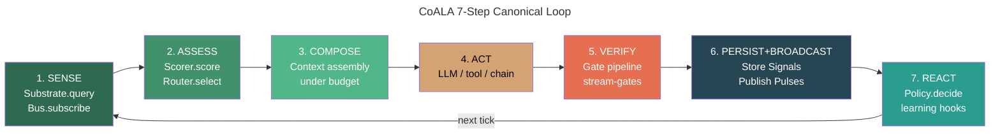
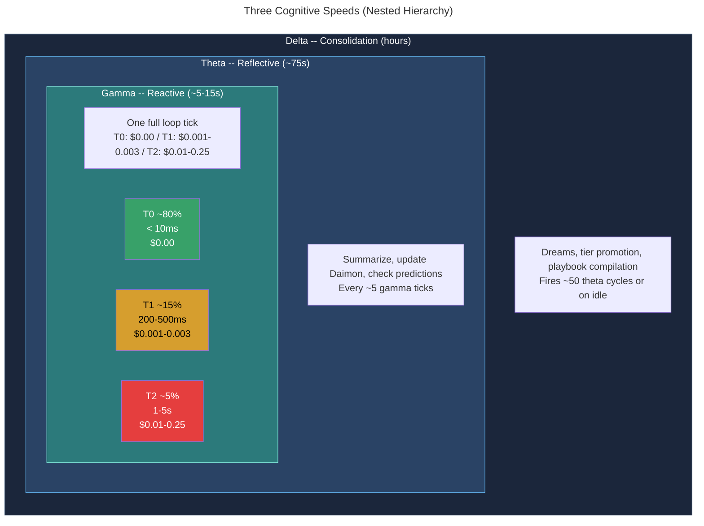
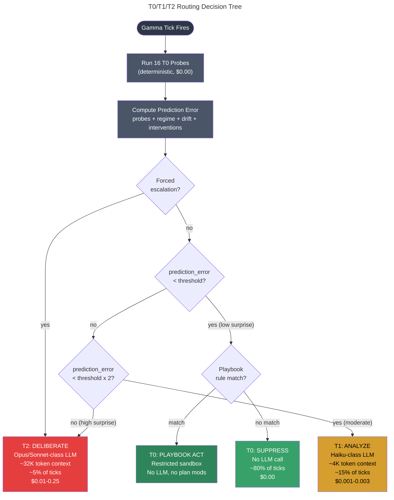
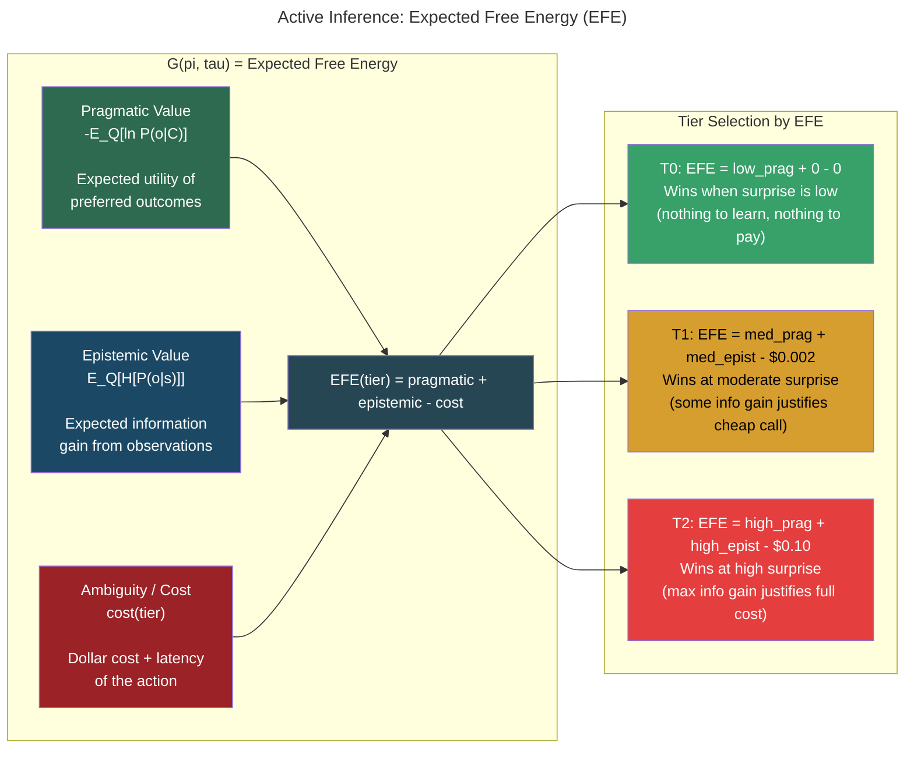
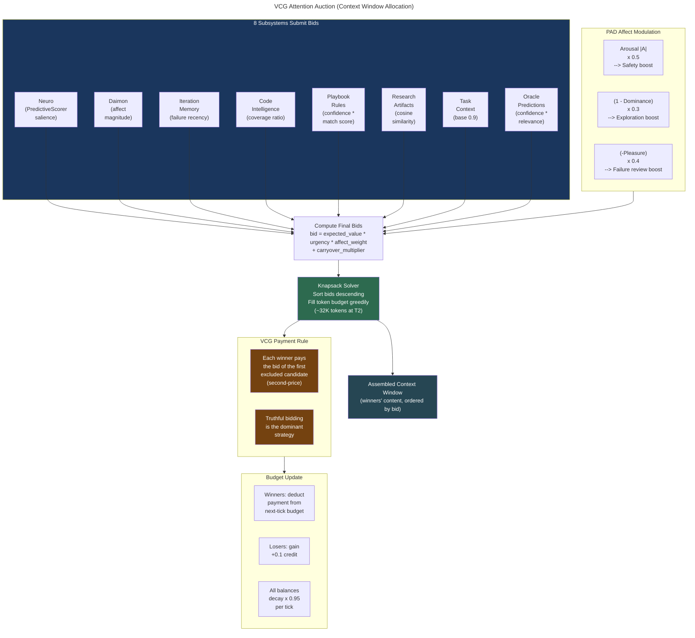

# 29 -- Heartbeat and Cognitive Loop

> The continuous observe-decide-act-learn cycle that every Roko agent executes --
> not conversation turns, but autonomous decision cycles at three concurrent
> timescales, gated by prediction error, allocated by VCG truthful bidding,
> and grounded in active inference.

> **Implementation status (2026-09):** The Graph engine executes the canonical
> seven-step loop for plan tasks. CascadeRouter provides three-stage tier routing
> (Static / Confidence / UCB1). InferenceTier T0/T1/T2 enum and TierRouter are
> defined. PredictiveScorer provides EFE-approximate context ranking in
> roko-core. Adaptive gate thresholds (EMA per rung) persist to
> `.roko/learn/gate-thresholds.json`. Episode logging, efficiency events, and
> playbook store queries are wired into runner dispatch. CorticalState energy
> fields, behavioral vitality, and affect-modulated runner dispatch are live via
> E23 10/10. Formal T0 probe registry, per-tick DecisionCycleRecord, VCG context
> auction, HeartbeatPolicy three-topic Bus emission, and the full frequency
> scheduler remain target architecture.

### Implementation sources

| Surface | Authority | Shipped boundary |
|---------|-----------|-----------------|
| InferenceTier + TierRouter | `crates/roko-primitives/src/tier.rs` | T0/T1/T2 enum, model selection with resource health threshold |
| CascadeRouter | `crates/roko-learn/src/cascade_router.rs` | Static / Confidence / UCB1 three-stage routing, persists to `.roko/learn/cascade-router.json` |
| PredictiveScorer | `crates/roko-core/src/score.rs` | EFE-approximate salience scoring: pragmatic + epistemic - cost_penalty |
| Adaptive gate thresholds | `crates/roko-learn/src/gate_thresholds.rs` | EMA per rung, flush cadence configurable under `[learning]` |
| Episode logger | `crates/roko-learn/src/episode_logger.rs` | Full turn recording to `.roko/episodes.jsonl` |
| Efficiency events | `crates/roko-learn/src/efficiency.rs` | Per-turn cost/latency/cache metrics to `.roko/learn/efficiency.jsonl` |
| CorticalState / E23 | `crates/roko-daimon/src/` | PAD affect engine, behavioral vitality, energy fields, EFE routing, phase-aware dispatch |
| Playbook store | `crates/roko-learn/src/playbook.rs` | When/then rule matching, queried at dispatch, injected into system prompt |
| Attention bidders | `crates/roko-cli/src/runner/` | Neuro/Task/Research `AttentionBidder` variants in runner dispatch |
| Runner event loop | `crates/roko-cli/src/runner/event_loop.rs` | Dispatch, gate, persist, feedback settlement |
| Graph engine | `crates/roko-graph/src/` | Sole execution engine; bounded parallel waves, conditional routing, cost enforcement |

### v1 depth files preserved

| # | v1 file | v3 section |
|---|---------|-----------|
| 00 | `00-coala-9-step-pipeline.md` | SS1--3 (CoALA framework, academic predecessors, universal loop) |
| 01 | `01-universal-loop-mapping.md` | SS3 (universal loop mapping) |
| 02 | `02-chain-heartbeat-variant.md` | SS3.3 (domain parameterization note) |
| 03 | `03-three-cognitive-speeds.md` | SS4--7 (Gamma, Theta, Delta, hierarchy) |
| 04 | `04-gamma-reactive-loop.md` | SS5 (Gamma reactive loop) |
| 05 | `05-theta-reflective-loop.md` | SS6 (Theta reflective loop) |
| 06 | `06-delta-consolidation-loop.md` | SS7 (Delta consolidation loop) |
| 07 | `07-adaptive-clock.md` | SS8 (Adaptive clock) |
| 08 | `08-dual-process-t0-t1-t2.md` | SS9--11 (Dual-process tiers, gating, probes) |
| 09 | `09-16-t0-probes.md` | SS11 (16 T0 probes) |
| 10 | `10-active-inference-compute-allocation.md` | SS12 (Active inference) |
| 11 | `11-active-inference-state-space.md` | SS13 (Active inference state space) |
| 12 | `12-attention-auction-and-gating.md` | SS14 (VCG attention auction -- FULL MATH) |

---

## 1. Why Decision Cycles, Not Conversation Turns

Most agent frameworks model cognition as a conversation: user says something, agent
thinks, agent responds. For Roko agents, this model is wrong on its face. **80% of
heartbeat ticks have no human input.** The agent fires its heartbeat, observes its
environment, evaluates whether anything interesting happened, and either acts or moves
on. There is no "user message." There is a continuous loop of observe-decide-act-learn
running autonomously.

| Aspect | Conversation Turn | Decision Cycle |
|--------|------------------|----------------|
| Trigger | User message | Timer (heartbeat interval) |
| Input | Natural language text | Structured observation (build status, market data, research signal) |
| Output | Natural language response | Typed `DecisionCycleRecord` (structured, self-contained) |
| Storage | Append to growing session | Self-contained record per tick |
| Replay | Parse message history | Structured fields, zero parsing needed |
| Credit assignment | Parse LLM output text | Read outcome + context fields directly |
| Cost | Every turn costs money | ~80% of ticks cost $0.00 (T0 suppression) |

---

## 2. CoALA: The Organizing Framework

The organizing framework for the heartbeat is CoALA (Cognitive Architectures for
Language Agents), proposed by Sumers, Yao, Narasimhan, and Griffiths (2023,
arXiv:2309.02427). CoALA draws on decades of cognitive architecture research to
formalize what a language agent IS and how its decision cycle should be structured:

> "The agent's decision procedure executes a decision cycle in a loop with the
> external environment. During each cycle, the agent uses retrieval and reasoning
> to plan by proposing and evaluating candidate learning or grounding actions. The
> best action is then selected and executed."

### 2.1 Academic predecessors

CoALA synthesizes insights from four major cognitive architecture traditions:

**Soar** (Laird, Newell, Rosenbloom 1987; Laird 2012). Production system with
impasse-driven subgoaling -- when Soar cannot resolve a decision, it creates a subgoal.
Roko's tier escalation (T0 -> T1 -> T2) implements this principle. Chunking (learning
production rules from subgoal resolution) maps to playbook rule extraction.

**ACT-R** (Anderson 1993, 2007). Modular architecture with distinct declarative and
procedural memory. Activation-based retrieval with decay maps to Roko's Ebbinghaus
curves in Neuro. Anderson's rational analysis principle -- cognitive mechanisms as optimal
adaptations to environmental statistics -- is formalized in Friston's free energy
minimization.

**CLARION** (Sun et al. 2001, 2005). Dual-process architecture with explicit (top-down)
and implicit (bottom-up) processing. CLARION's bottom-up implicit processing maps to T0
(fast, heuristic). Top-down explicit processing maps to T2 (slow, deliberate). The
motivation subsystem maps to the Daimon (PAD affect engine).

**Global Workspace Theory** (Baars 1988; Baddeley 2000). Consciousness as a shared
workspace where specialized processors compete for access. The Cognitive Workspace paper
(2025, arXiv:2508.13171) validated this approach computationally: active memory management
with deliberate information curation achieves 58.6% memory reuse rate compared to 0% for
traditional RAG, with 17-18% net efficiency gain. Roko's mapping:

| GWT Component | Roko Implementation |
|---|---|
| Central executive | Context Governor (allocates attention tokens across subsystems) |
| Episodic buffer | The assembled context window (integrates information from all sources) |
| Visuospatial sketchpad | Current observations (environment state, build results, market data) |
| Phonological loop | Playbook heuristics (rehearsed procedural knowledge) |

### 2.2 Why CoALA over alternatives

**ReAct** (Yao et al. 2022) interleaves reasoning and acting but has no explicit memory
retrieval step, no gating mechanism, and no cognitive tiering. It is a prompting strategy,
not a cognitive architecture.

**Reflexion** (Shinn et al. 2023) adds verbal self-reflection but uses self-assessment
(LLM judges its own output) rather than external verification (compiler, tests,
blockchain).

**AutoGPT / BabyAGI**: Purely loop-based without cognitive tiering or verification. Every
iteration invokes the LLM, making them expensive and lacking the T0/T1/T2 cost
optimization.

CoALA provides: (1) explicit decision cycles matching Roko's autonomous tick model;
(2) memory retrieval as a first-class step matching Neuro integration; (3) learning
from action outcomes matching Gate-based feedback; (4) grounding in established cognitive
architectures (Soar, ACT-R); (5) composability with active inference enabling the
T0/T1/T2 gating system that provides ~80% cost reduction.

---

## 3. The Canonical Seven-Step Universal Loop

Each heartbeat tick executes the universal loop. The older CoALA 9-step framing is
retained as lineage; the canonical loop has seven steps, with PERSIST and BROADCAST
co-equal at step 6.

```
1. SENSE          -- Substrate.query | Bus.subscribe | external I/O
2. ASSESS         -- Scorer.score + Router.select
3. COMPOSE        -- Assemble the prompt/context under budget
4. ACT            -- LLM, tool, or chain action
5. VERIFY         -- Gate pipeline + stream-gates
6. PERSIST        -- Store Signals in Substrate
   BROADCAST      -- Publish Pulses on the Bus
7. REACT          -- Policy.decide, emit follow-on Pulses + Signals
```



### 3.1 Step-by-step

**Step 1: SENSE.** Three inputs: durable retrieval through `Substrate.query()` for plans,
episodes, heuristics, and prior verdicts; live delivery through `Bus.subscribe()` for
tick Pulses, turn output, approvals, and cancellation; external I/O not yet normalized
into either fabric. The 16 T0 probes (SS11) are part of this sensing surface. Synapse
traits: `Substrate.query()`, `Bus.subscribe()`. Layer: L0 Runtime.

**Step 2: ASSESS.** Score candidate Signals and Pulses, compute surprise/confidence,
and route toward T0/T1/T2 in one joint decision. Multi-factor scoring:

```
score = w_recency * recency(Ebbinghaus_decay)
      + w_importance * quality(confidence * validation_ratio)
      + w_relevance * similarity(query, entry)
      + w_emotional * PAD_cosine(current_mood, entry_affect)
```

The fourth factor implements Bower's (1981) mood-congruent memory. Every 100 ticks,
mandatory 15% contrarian retrieval forces mood-opposite entries to prevent rumination.
Synapse traits: `Scorer.score()`, `Router.select()`. Layer: L1/L2.

**Step 3: COMPOSE.** Assemble the prompt or action bundle under budget. Prediction error
drives the context depth. The VCG attention auction (SS14) allocates tokens across
competing subsystems at T2. Synapse trait: `Composer.compose()`. Layer: L2 Scaffold.

**Step 4: ACT.** Execute the composed work -- LLM call, tool call, chain transaction.
Dual-process thresholding (SS9) determines whether the tick stays at T0, escalates to
T1, or pays for T2. During ACT, live Pulses (`agent.msg.chunk`, `tool.call.started`,
`agent.turn.completed`) are emitted. Synapse trait: `Agent.execute()`. Layer: L1.

**Step 5: VERIFY.** Canonical verification boundary -- pre-flight checks, safety checks,
stream-gates, and ground-truth verification as one coherent phase. Domain-specific:
coding agents run `CompileGate -> TestGate -> ClippyGate`; chain agents run
`TxSimGate -> WalletGate -> VerifyChainGate`. Synapse trait: `Gate.verify()`. Layer: L3.

**Step 6: PERSIST + BROADCAST.** Store the finished Signal in the Substrate with lineage
and provenance. Publish the matching Pulse on the Bus for live subscribers. Both outputs
are explicit, not side effects. Synapse traits: `Substrate.put()`, `Bus.publish()`.
Layer: L0.

**Step 7: REACT.** Build the `DecisionCycleRecord`. Fire learning hooks: episode logging,
Daimon PAD update, Neuro tier promotion/demotion, CascadeRouter feedback, prediction
calibration. Synapse trait: `Policy.decide()`. Layer: L3-L4.

### 3.2 CoALA-to-Synapse mapping

| Historical CoALA framing | Canonical loop | Synapse trait(s) | Layer |
|---|---|---|---|
| OBSERVE + RETRIEVE | **SENSE** | `Substrate.query()`, `Bus.subscribe()` | L0 |
| ANALYZE + GATE | **ASSESS** | `Scorer.score()`, `Router.select()` | L1/L2 |
| _(implicit)_ | **COMPOSE** | `Composer.compose()` | L2 |
| EXECUTE | **ACT** | `Agent.execute()` | L1 |
| SIMULATE + VALIDATE + VERIFY | **VERIFY** | `Gate.verify()`, domain gates | L3 |
| _(folded into REFLECT)_ | **PERSIST** | `Substrate.put()` | L0 |
| _(under-described)_ | **BROADCAST** | `Bus.publish()` | L0 |
| REFLECT | **REACT** | `Policy.decide()` | L3-L4 |

Key differences: COMPOSE is explicit (context engineering is a first-class step, per
Meta-Harness, Lee et al. 2026, arXiv:2603.28052). PERSIST and BROADCAST are both
explicit (content-addressed Signal storage and topic-addressed Pulse delivery are
co-equal). Domain-specific extensions (SIMULATE, VALIDATE) are injected into VERIFY,
not added as universal steps.

### 3.3 Domain parameterization

The universal loop is one loop parameterized by domain. Domain-specific behavior comes
from domain-specific trait implementations, not architectural modifications.

**Coding agent:** `SENSE -> FileSubstrate.query() + Bus.subscribe()`,
`VERIFY -> CompileGate -> TestGate -> ClippyGate -> DiffGate`.

**Chain agent:** Adds SIMULATE (mirage-rs pre-flight) and VALIDATE (position limits)
inside VERIFY. `SENSE` includes `ChainSubstrate.query()` + `ChainBus.subscribe()`.

**Research agent:** Simplified -- VERIFY is typically `LlmJudgeGate` only.

### 3.4 OODA correspondence

| OODA Phase | Pipeline Steps | What Happens |
|---|---|---|
| **Observe** | SENSE | Deterministic probes, live Pulses, external I/O |
| **Orient** | ASSESS + COMPOSE | Scoring, routing, context assembly |
| **Decide** | ACT | Commit to action or suppress |
| **Act** | VERIFY + PERSIST/BROADCAST | Effects checked, then written and delivered |
| _(missing in OODA)_ | REACT | DecisionCycleRecord + learning hooks close the loop |

The REACT step is what makes Roko agents self-improving rather than merely reactive.

---

## 4. Three Cognitive Speeds: Gamma, Theta, Delta

Every Roko agent operates at three timescales simultaneously, named after EEG frequency
bands (Buzsaki 2006). These are not sequential phases -- they are three concurrent async
consumers running in parallel, each processing information at a different temporal grain.
In the two-fabric model, `HeartbeatPolicy` publishes `heartbeat.gamma.tick`,
`heartbeat.theta.tick`, and `heartbeat.delta.tick` Pulses on the Bus, and the
speed-specific consumers subscribe by topic.

The three-speed model draws from Friston's free energy principle (2010): perception as
hierarchical prediction at different temporal grains. Clark (2013) extends this into the
predictive brain framework. Buzsaki (2006) establishes that oscillatory hierarchies
enable simultaneous processing at different temporal resolutions.

| Speed | Period | Name | What Happens | Trigger | Cost |
|---|---|---|---|---|---|
| **Gamma** | ~5-15s | Reactive | One complete loop tick. Tool calls, LLM inference, verification. | `heartbeat.gamma.tick` Pulse | T0: $0.00, T1: $0.001-0.003, T2: $0.01-0.25 |
| **Theta** | ~75s (30-120s) | Reflective | Summarize recent work. Update Daimon. Check predictions. Re-evaluate plan. | `heartbeat.theta.tick` Pulse, every N=5 gamma ticks or on episode completion | T1-T2: $0.01-0.10 |
| **Delta** | Hours (~50 theta cycles) | Consolidation | Dreams: replay, synthesis, pruning. Knowledge tier promotion. Playbook compilation. | `heartbeat.delta.tick` Pulse, on idle detection or scheduled | T0-T1: $0.00-0.01 |

### 4.1 Why three speeds, not one

A single-speed architecture forces a tradeoff: tick fast enough to catch urgent events
($200/day) or slowly enough to be cheap (missing time-sensitive signals). The three-speed
model resolves this: Gamma handles what is happening RIGHT NOW (most ticks free at T0).
Theta handles strategic reflection (less frequent, more depth). Delta handles
consolidation (idle time, minimal cost). Total daily cost: ~$2-50 versus $100-500+
with single-speed.

### 4.2 Nested hierarchy

```
Delta (~hours):    +--------------------------------------------------+
                   |  Consolidation: dreams, tier promotion, playbook  |
                   |  Fires: ~50 theta cycles or on idle              |
                   +--------------------------------------------------+
                        | contains ~50 theta cycles
                        v
Theta (~75s):      +------+------+------+------+------+
                   | Refl | Refl | Refl | Refl | Refl | ...
                   +------+------+------+------+------+
                        | each contains ~5 gamma cycles
                        v
Gamma (~10s):      +--+--+--+--+--+--+--+--+--+--+
                   |T0|T0|T1|T0|T0|T0|T0|T2|T0|T0| ...
                   +--+--+--+--+--+--+--+--+--+--+
                   80%     15%           5%
                   free    cheap         full
```



Information flows bidirectionally: gamma produces tick observations; theta summarizes
them into patterns; delta consolidates patterns into durable knowledge. Downward:
delta knowledge improves gamma perception; theta adjustments change gamma behavior.

---

## 5. Gamma: The Reactive Loop (~5-15s)

Gamma is the heartbeat. Every `heartbeat.gamma.tick` Pulse runs the canonical
seven-step loop. The critical property: **~80% of gamma ticks cost nothing.** The 16 T0
probes run as pure functions with zero LLM cost. Only when probes detect an anomaly
exceeding the adaptive threshold does the tick escalate to T1 or T2.

### 5.1 Full tick execution

Steps 1-3 (SENSE, ASSESS, COMPOSE) always execute. Steps 4-7 are conditional on the
tier gate decision:

1. **SENSE**: Run T0 probes, read Substrate, drain Bus topics, detect regime changes,
   read coordination signals.
2. **ASSESS**: Score retrieved Signals by relevance, recency, emotional congruence,
   confidence. Compute prediction error. Route to T0/T1/T2.
3. **COMPOSE** _(T1/T2 only)_: Assemble context via VCG auction (T2) or fixed-template
   (T1). Token budget: ~4,000 (T1) or ~32,000 (T2).
4. **ACT** _(T1/T2 only)_: Call the LLM through CascadeRouter model selection.
5. **VERIFY** _(if acted)_: Gate pipeline with ratcheting and adaptive thresholds.
6. **PERSIST + BROADCAST**: Store Signal with lineage. Publish Pulse.
7. **REACT**: Episode log, Daimon PAD update, Router feedback, prediction calibration.

### 5.2 Adaptive gamma interval

Gamma does not tick at a fixed rate. The interval adapts to environmental volatility
following Friston's (2010) active sampling:

```rust
fn compute_gamma_interval(violations: &[Violation]) -> Duration {
    Duration::from_secs(15)
        .mul_f64(1.0 / (1.0 + violations.len() as f64 * 0.3))
        .max(Duration::from_secs(5))
}
```

| Anomaly Count | Interval | Ticks/Hour |
|---|---|---|
| 0 | 15.0s | 240 |
| 1 | ~11.5s | 313 |
| 3 | ~7.9s | 456 |
| 7+ | 5.0s (floor) | 720 |

### 5.3 DecisionCycleRecord

Every gamma tick produces a typed, self-contained record serving as: the unit of dream
replay (Mattar-Daw utility formula); the unit of credit assignment (traces outcomes to
context entries); the unit of resource accounting (cost, tier, token counts); the source
of event fabric events (direct field-to-display mapping).

```rust
pub struct DecisionCycleRecord {
    // Identity
    pub tick: u64,
    pub timestamp: SystemTime,
    pub agent_id: AgentId,

    // SENSE
    pub observation: Observation,
    pub regime: Regime,
    pub probe_results: Vec<ProbeResult>,

    // ASSESS
    pub prediction_error: f32,
    pub deliberation_threshold: f32,
    pub tier: InferenceTier,

    // COMPOSE
    pub context_bundle_summary: ContextSummary,
    pub retrieved_entries: Vec<SignalSummary>,

    // ACT + VERIFY
    pub deliberation: Option<DeliberationRecord>,
    pub actions: Vec<ActionRecord>,
    pub outcome: Option<OutcomeRecord>,

    // REACT
    pub pad_before: PadVector,
    pub pad_after: PadVector,
    pub primary_emotion: PlutchikLabel,

    // Cost
    pub inference_cost: f64,
    pub total_cost: f64,
}
```

### 5.4 Ten cognitive mechanisms

Ten runtime mechanisms modulate how each gamma tick behaves. They are concurrent
processes that inject into gamma, not gamma steps:

| Mechanism | Where in Gamma | Function |
|---|---|---|
| AttentionSalience | SENSE | Priority queue with decay for observation items |
| HabituationMask | SENSE | Per-pattern exposure attenuation |
| EventDrivenWakeup | Before SENSE | Condition-based clock interrupts |
| SleepPressure | ASSESS | Accumulate toward delta threshold |
| HomeostasisRegulator | ASSESS | Proportional control for signal stability |
| ContextDelta | COMPOSE | I-frame/P-frame context compression |
| EpisodicReplay | COMPOSE | Case-based reasoning injection |
| CompensationChain | ACT-PERSIST | Saga-pattern rollback tracking |
| StateSnapshot | REACT | Periodic content-addressed checkpoint |
| MetricsEmitter | Every step | Wide-event telemetry (OTel gen_ai spans) |

### 5.5 Daily cost model

| Regime | Gamma Interval | Ticks/Day | T0 Rate | Estimated Daily Cost |
|---|---|---|---|---|
| Calm | ~15s | ~5,760 | ~90% | ~$1.00 (with context eng.) |
| Normal | ~10s | ~8,640 | ~80% | ~$2.50 (with context eng.) |
| Volatile | ~5s | ~17,280 | ~60% | ~$8.00 (with context eng.) |

Without tier gating (every tick at T2): 17,280 * $0.10 = **$1,728/day**. With gating:
~$8/day in the volatile case. Context engineering provides an additional ~6x reduction.

---

## 6. Theta: The Reflective Loop (~75s)

Theta consumes `heartbeat.theta.tick` Pulses -- every 5 gamma cycles or upon episode
completion. Named after EEG theta oscillations (4-8 Hz) associated with navigation,
memory encoding, and hippocampal indexing (Buzsaki 2006). Theta always invokes at least
T1 -- it needs LLM reasoning to reflect.

### 6.1 Five phases

**Phase 1: Summarize recent gamma work.** Outcome distribution (T0/T1/T2 counts),
anomaly patterns, action patterns, cost accumulation since last theta.

**Phase 2: Update Daimon state.** Aggregate affect at the ALMA mood layer (Gebhard
2005). Three-layer model: Emotion (seconds, alpha = 0.20), Mood (hours, alpha = 0.02,
4h half-life), Personality (permanent baseline). Six behavioral states derived from PAD:

| State | PAD Region | Effect |
|---|---|---|
| Engaged | P > 0.2, A > 0.1, D > 0.1 | Standard operation |
| Struggling | P < -0.2, A > 0.3 | More caution, lower risk tolerance |
| Coasting | P > 0.1, A < -0.1, D > 0.2 | May miss opportunities |
| Exploring | P ~ 0, A > 0.2, D < 0 | Higher T2 rate acceptable |
| Focused | P > 0, A > 0.3, D > 0.3 | Deep work, minimize distractions |
| Resting | A < -0.2 | Pre-delta state |

**Phase 3: Check predictions.** CalibrationTracker aggregates prediction residuals per
(model, task_category) pair. Arithmetic correction: `adjusted = raw - mean_bias(model,
category)` at ~50 nanoseconds. No LLM needed.

**Phase 4: Re-evaluate plan.** The core of theta. LLM (T1, T2 for complex situations)
reasons about: Is the plan still valid? Am I making progress? Should I re-prioritize?
Are there patterns in failures?

**Phase 5: Trigger interventions.** Stuck detection (>3 retries -> escalation). Cost
anomaly (T2 rate > 20% -> tighten threshold). Calibration collapse (accuracy < 40% ->
Struggling state). Complacency detection (Coasting + declining accuracy -> flag).

### 6.2 Adaptive theta interval

| Regime | Multiplier | Theta Interval | Ticks/Hour |
|---|---|---|---|
| Calm | 1.6x | 120s | 30 |
| Normal | 1.0x | 75s | 48 |
| Volatile | 0.4x | 30s | 120 |
| Crisis | 0.2x | 15s | 240 |

### 6.3 Theta's role in the hierarchy

Theta bridges individual ticks and long-term learning. Upward: gamma ticks are
summarized into episode-level Signals for delta processing. Downward: theta adjustments
(threshold changes, state transitions) immediately change gamma behavior. Theta also
increments sleep pressure toward the delta threshold.

---

## 7. Delta: The Consolidation Loop (~Hours)

Delta is sleep. When the agent has nothing to do, it enters offline learning:
the phase that turns individual experiences into durable knowledge. Corresponds to
biological slow-wave sleep (McClelland et al. 1995). Non-blocking: if a new task
arrives, the dream pauses via `CognitiveSignal::Pause`, state serializes to disk,
gamma takes over immediately.

### 7.1 Trigger conditions

1. **Idle detection**: No active tasks for >5 minutes.
2. **Scheduled time**: Nightly consolidation cron.
3. **Episode count threshold**: ~50 episodes since last delta.
4. **Explicit command**: `roko dream run`.

### 7.2 Three-phase dream cycle

**Phase 1: NREM Replay (8-15 min).** Prioritized episode review using the Mattar-Daw
utility formula: `Utility = Gain * Need * (1 / spacing_penalty)`. 30% perturbed replay
(injected adversarial conditions) for robustness. PAD modulates selection: anxiety
weights warning episodes 2x. Model: Haiku-class (T1). Cost: $0.02-0.12.

**Phase 2: REM Imagination (5-15 min).** Counterfactual generation via Boden's three
creativity modes (combinational, exploratory, transformational) implemented through
Pearl's structural causal models. Emotional depotentiation: intensity reduced by
0.3-0.5 per cycle (Walker & van der Helm 2009). HDC counterfactual synthesis for
nanosecond-speed novel knowledge combinations. Model: Sonnet-class (T1-T2). Cost:
$0.05-0.20.

**Phase 3: Integration & Staging (5-10 min).** Dream outputs enter a staging buffer at
0.20-0.30 confidence. Nothing generated during dreams is immediately trusted.
Promotion path: staging (0.20) -> Working (0.50) -> Consolidated (0.70) ->
Persistent (0.90). Only validated outputs reach permanent memory. Cost: $0.00 (pure
computation).

### 7.3 Knowledge tier promotion

| Tier | Decay Multiplier | Promotion Threshold |
|---|---|---|
| Transient | 0.1x base | (initial state) |
| Working | 0.5x base | confidence >= 0.50, used >= 2 times |
| Consolidated | 1.0x base | confidence >= 0.70, used >= 5 times |
| Persistent | 5.0x base | confidence >= 0.90, used >= 10 times |

This implements the Complementary Learning Systems framework (McClelland et al. 1995):
fast episodic memory (gamma/theta) consolidates into slow semantic memory (delta)
during "sleep."

### 7.4 Delta cost summary

| Phase | Model Class | Duration | Cost |
|---|---|---|---|
| NREM Replay | Haiku-class (T1) | 8-15 min | $0.02-0.12 |
| REM Imagination | Sonnet-class (T1-T2) | 5-15 min | $0.05-0.20 |
| Integration/Staging | Pure computation (T0) | 5-10 min | $0.00 |
| Knowledge Promotion | Pure computation (T0) | 1-2 min | $0.00 |
| Playbook Compilation | Pure computation (T0) | 1-2 min | $0.00 |
| Meta-Cognition | Haiku-class (T1) | 1-2 min | $0.001-0.005 |
| **Total per Delta** | | **~25-45 min** | **~$0.07-0.33** |

---

## 8. Adaptive Clock

The adaptive clock is the runtime policy that publishes the three heartbeat tick Pulses
on the Bus. It dynamically adjusts each frequency based on environmental regime,
resource constraints, and agent behavioral state.

### 8.1 Configuration

```toml
[clock]
gamma_min_interval_secs = 5
gamma_max_interval_secs = 15
gamma_base_interval_secs = 10
theta_min_interval_secs = 15
theta_max_interval_secs = 120
theta_base_interval_secs = 75
theta_gamma_count = 5
delta_episode_threshold = 50
delta_idle_timeout_secs = 300
daily_budget_usd = 50.0
throttle_at_percent = 80
hard_stop_at_percent = 95
```

### 8.2 Budget-aware throttling

When daily spending approaches budget limits, the clock progressively reduces expensive
operations:

| Budget Usage | Effect |
|---|---|
| < 80% | No throttling |
| 80-90% | Theta intervals 2x |
| 90-95% | Theta intervals 4x, T2 restricted to crisis |
| > 95% | T2 stopped, theta at maximum interval |

**Gamma T0 probes always run** regardless of budget. They cost $0.00. Even at 100%
utilization, the agent maintains perception -- it can see what is happening, it just
cannot deliberate.

### 8.3 Event-driven wakeup

The clock can emit an early gamma tick for urgent conditions: user intervention, safety
alert, pheromone threat signal, budget alert, or scheduled event. This ensures urgent
conditions are processed within milliseconds.

---

## 9. Dual-Process Cognition: T0, T1, T2

Daniel Kahneman's dual-process theory ("Thinking, Fast and Slow", 2011) distinguishes
System 1 (fast, automatic, heuristic-based) and System 2 (slow, deliberate, analytical).
Roko implements this distinction literally with three concrete tiers:

| Tier | Kahneman | Implementation | Cost per Call | Latency | Frequency |
|---|---|---|---|---|---|
| **T0** | System 1 (pure) | Deterministic probes + playbook rules. No LLM. | $0.00 | <10ms | ~80% |
| **T1** | System 1 -> System 2 | Fast LLM (Haiku-class). Reduced context. | $0.001-0.003 | 200-500ms | ~15% |
| **T2** | System 2 (deep) | Full LLM (Sonnet/Opus-class). Full Cognitive Workspace. | $0.01-0.25 | 1-5s | ~5% |

The 80/15/5 distribution is an **emergent property** of the gating mechanism, not a
target. The LLM-Last principle: the LLM is the last resort, not the first. Every tick
begins with deterministic checks. This is grounded in FrugalGPT (Chen et al. 2023,
arXiv:2305.05176; published 2024 in TMLR), DPT-Agent (Zhang et al. 2025,
arXiv:2502.11882), and CLARION (Sun et al. 2005).

### 9.1 The InferenceTier enum

```rust
#[derive(Debug, Clone, Copy, PartialEq, Eq, PartialOrd, Ord, Hash)]
pub enum InferenceTier {
    T0 = 0,  // Suppress. No LLM. ~80%. $0.00.
    T1 = 1,  // Analyze. Haiku-class. ~4K tokens. ~15%. $0.001-0.003.
    T2 = 2,  // Deliberate. Sonnet/Opus-class. ~32K tokens. ~5%. $0.01-0.25.
}
```

### 9.2 TierRouter

```rust
pub struct TierRouter;

impl TierRouter {
    pub fn select_model(tier: InferenceTier, resource_health: f32) -> Option<&'static str> {
        match tier {
            InferenceTier::T0 => None,
            InferenceTier::T1 => Some("claude-haiku-4-5"),
            InferenceTier::T2 => {
                if resource_health > T2_RESOURCE_THRESHOLD {
                    Some("claude-opus-4-6")
                } else {
                    Some("claude-sonnet-4-6")
                }
            }
        }
    }
}

pub const T2_RESOURCE_THRESHOLD: f32 = 0.3;
```

---

## 10. Adaptive Gating Threshold

The gating decision is driven by **prediction error** compared to an **adaptive
threshold**. Prediction error measures surprise; the threshold determines how much
surprise justifies LLM deliberation.

### 10.1 Prediction error computation

```rust
fn compute_prediction_error(
    probes: &[ProbeResult],
    predictions: &PredictionState,
    regime: &Regime,
) -> f32 {
    let mut error: f32 = 0.0;
    let anomaly_count = probes.iter().filter(|p| p.is_anomalous()).count();
    error += anomaly_count as f32 * 0.05;       // 5% per anomaly
    if regime.changed_since_last_tick() {
        error += 0.40;                           // 40% for regime change
    }
    error += predictions.compute_drift() * 0.30; // 30% * drift
    let pending = predictions.pending_intervention_count();
    error += pending as f32 * 0.10;              // 10% per intervention
    error.min(1.0)
}
```

Weight derivation (calibrated against ~2,000 tick replay corpus):

| Component | Weight | Rationale |
|---|---|---|
| Probe anomaly | 0.05 each | 4+ anomalies cross T1 threshold. 16 anomalies near-certain T2. |
| Regime change | 0.40 flat | Strongest indicator of stale world model. |
| World model drift | 0.30 * drift | Continuous signal; max drift alone = 0.30 |
| Pending intervention | 0.10 each | Two interventions match the base threshold. |

Per-probe anomaly detection uses rolling z-score:

```rust
pub struct ProbeResult {
    pub probe_id: &'static str,
    pub value: f64,
    pub rolling_mean: f64,
    pub rolling_stddev: f64,
    pub z_threshold: f64,  // default: 2.0
}

impl ProbeResult {
    pub fn is_anomalous(&self) -> bool {
        if self.rolling_stddev < f64::EPSILON { return false; }
        let z = (self.value - self.rolling_mean).abs() / self.rolling_stddev;
        z > self.z_threshold
    }
}
```

Drift metric: normalized Euclidean distance over a 5-dimension CorticalState vector
(regime, accuracy, resource_health, active_ratio, arousal), each normalized to [0, 1].
Euclidean is chosen over KL divergence because the state vector is continuous/ordinal,
not distributional, and Euclidean is always defined and symmetric.

### 10.2 Adaptive threshold

The threshold adapts based on affect, resources, and confidence. All modulation is
**additive** (not multiplicative, to prevent compounding runaway). Clamped to
[0.05, 0.50]:

```rust
fn compute_adaptive_threshold(state: &AgentState) -> f32 {
    let base = 0.20;
    let dominance = state.cortical_state.pad().dominance;
    let affect_adj = if dominance < -0.2 { -0.05 }
                     else if dominance > 0.3 { 0.05 }
                     else { 0.0 };
    let budget_pct = state.budget_tracker.daily_usage_percent();
    let resource_adj = if budget_pct > 0.80 { 0.10 } else { 0.0 };
    let arousal = state.cortical_state.pad().arousal;
    let arousal_adj = if arousal > 0.5 { -0.05 } else { 0.0 };
    let confidence_adj = state.strategy_confidence * 0.05;
    (base + affect_adj + resource_adj + arousal_adj + confidence_adj)
        .clamp(0.05, 0.50)
}
```

| Condition | Adjustment | Justification |
|---|---|---|
| Low dominance (< -0.2) | -0.05 | Uncertain agents think more (Kahneman) |
| High dominance (> 0.3) | +0.05 | Confident agents coast on heuristics |
| Budget > 80% used | +0.10 | Conservation overrides curiosity |
| High arousal (> 0.5) | -0.05 | Surprise sharpens attention |
| Strategy confidence | +0.00 to +0.05 | Continuous: `confidence * 0.05` |

Threshold bounds: floor at 0.05 ensures a single anomalous probe can still trigger T1
even under maximum conservation. Ceiling at 0.50 prevents a panicking agent from
escalating every tick.

### 10.3 Gating decision

```rust
fn gate(prediction_error: f32, threshold: f32, state: &AgentState) -> InferenceTier {
    if state.has_forced_escalation() {
        return InferenceTier::T2;
    }
    if prediction_error < threshold {
        InferenceTier::T0
    } else if prediction_error < threshold * 2.0 {
        InferenceTier::T1
    } else {
        InferenceTier::T2
    }
}
```

The 2x multiplier between T1 and T2 ensures moderate surprises get cheap T1 analysis
while only genuinely novel situations trigger expensive T2.



### 10.4 What each tier does

**T0: Suppress.** No LLM. The 16 T0 probes execute, prediction error is computed,
CorticalState is updated, DecisionCycleRecord is written. T0 also checks playbook
rules: if a known situation matches a playbook condition, the agent can act without LLM
involvement. T0 playbook actions execute in a restricted sandbox -- they cannot invoke
LLMs, modify the plan DAG, or send external requests. They can update CorticalState,
emit CognitiveSignals, log observations, or adjust the adaptive clock.

**T1: Analyze.** Fast LLM (Haiku-class) with ~4,000 token context: system prompt
(~1,200), top-5 Neuro entries (~1,500), active tasks (~800), critical warnings (~500).
Uses layers 1-3 of the SystemPromptBuilder.

**T2: Deliberate.** Full LLM (Opus/Sonnet-class, depending on resource health) with
~32,000 token Cognitive Workspace (Baddeley 2000): invariants, strategy, playbook
heuristics, retrieved episodes, retrieved insights, causal graph edges, dream
hypotheses, somatic landscape, pheromone summary, conversation tail.

---

## 11. The 16 T0 Probes

16 deterministic probes run on every gamma tick with zero LLM cost. Each probe is a pure
function: `fn probe(state: &EngineState) -> f32`. No LLM, no network calls for
domain-agnostic probes. The probe architecture implements FrugalGPT's core insight:
intelligent routing using cheap checks to determine when the expensive model is
necessary.

```rust
pub trait Probe: Send + Sync {
    fn evaluate(&self, state: &EngineState) -> f32;  // [0.0, 1.0]
    fn weight(&self) -> f32;
    fn name(&self) -> &str;
    fn domain(&self) -> ProbeDomain;
}
```

### 11.1 Blockchain domain probes (8)

| # | Probe | Weight | What it detects |
|---|---|---|---|
| 1 | **PriceDelta** | 0.15 | Significant price changes; per-asset volatility-normalized thresholds |
| 2 | **TvlDelta** | 0.10 | TVL changes across tracked protocols; 5% TVL change = maximum |
| 3 | **PositionHealth** | 0.20 | Collateral ratios and liquidation distance; < 1.2 health = critical |
| 4 | **GasSpike** | 0.05 | Sudden gas price increases vs. EMA baseline; 3x = maximum |
| 5 | **CreditBalance** | 0.05 | Remaining KORAI balance; < 1 day = critical |
| 6 | **RSI** | 0.05 | 14-period RSI; >70 overbought / <30 oversold = notable |
| 7 | **MACD** | 0.05 | Momentum shifts via MACD crossovers and divergences |
| 8 | **CircuitBreaker** | 0.10 | Exchange halts, protocol pauses, emergency shutdowns |

### 11.2 Coding domain probes (6)

| # | Probe | Weight | What it detects |
|---|---|---|---|
| 9 | **BuildHealth** | 0.20 | Last compilation result and trend; failure = 0.8 |
| 10 | **TestRegression** | 0.20 | Test pass count delta; each failing test = 0.2 |
| 11 | **ComplexityDrift** | 0.05 | Cyclomatic complexity moving average; 10% increase = max |
| 12 | **DependencyRisk** | 0.10 | New vulnerability count from dependency scanning |
| 13 | **CoverageDelta** | 0.05 | Test coverage drop; 10% drop = maximum |
| 14 | **ErrorRate** | 0.10 | Gate failure trend over last N tasks; > 50% = 0.8 |

### 11.3 Universal probes (2)

| # | Probe | Weight | What it detects |
|---|---|---|---|
| 15 | **WorldModelDrift** | 0.15 | Cosine distance between predicted and observed state vectors (Friston 2010) |
| 16 | **CausalConsistency** | 0.10 | Lineage DAG integrity; missing parents, hash mismatches, orphans |

### 11.4 Prediction error aggregation

```
prediction_error = SUM(probe_value * probe_weight)    capped at 1.0

error < 0.2  -> T0 (suppress, no LLM)     ~80% of ticks
error < 0.6  -> T1 (fast model, shallow)   ~15% of ticks
error >= 0.6 -> T2 (full model, deep)      ~5% of ticks
```

Probes compose per-domain: a chain agent registers 8 chain + 2 universal. A coding agent
registers 6 coding + 2 universal. Custom domains implement `Probe` and register via
`ProbeRegistry`.

---

## 12. Active Inference Compute Allocation

Active inference (Friston 2010, "The free-energy principle: a unified brain theory?",
Nature Reviews Neuroscience 11(2); Friston et al. 2015, "Active inference and epistemic
value", Cognitive Neuroscience 6(4)) provides the theoretical foundation for the tier
decision: the agent should invest compute that **minimizes expected free energy (EFE)**
-- balancing pragmatic value with epistemic value, minus cost.

### 12.1 The EFE formula

```
G(pi, tau) = -E_Q[ln P(o_tau | C)]  +  E_Q[H[P(o_tau | s_tau)]]
              -----------------------     -----------------------
              pragmatic value              epistemic value
              (expected utility             (expected information
               of preferred outcomes)        gain from observations)
```

Where Q is the approximate posterior, o_tau is expected observation, s_tau is expected
hidden state, C is preferred outcomes, H is entropy.

### 12.2 Applied to tier selection

```
EFE(tier) = pragmatic_value(tier) + epistemic_value(tier) - cost(tier)

  pragmatic_value(T0) = value of applying playbook rules (low if no match)
  pragmatic_value(T1) = value of quick assessment (medium)
  pragmatic_value(T2) = value of deep analysis (high)

  epistemic_value(T0) = 0 (no new information)
  epistemic_value(T1) = moderate (some uncertainty reduction)
  epistemic_value(T2) = high (maximal uncertainty reduction)

  cost(T0) = 0
  cost(T1) = $0.001-0.003 + 200-500ms
  cost(T2) = $0.01-0.25 + 1-5s
```

**Zero hyperparameters.** Unlike epsilon-greedy, UCB, or Thompson sampling, EFE
naturally balances exploration (epistemic) and exploitation (pragmatic) as two aspects
of the same objective. This is Friston's key insight: they are not opposing objectives
requiring a tradeoff parameter.



### 12.3 Applied to context selection (PredictiveScorer)

```rust
pub struct PredictiveScorer {
    pragmatic_weight: f32,  // default 1.0
}

impl Scorer for PredictiveScorer {
    fn score(&self, signal: &Signal, ctx: &Context) -> Score {
        let pragmatic = self.compute_pragmatic_value(signal, ctx);
        let epistemic = self.compute_epistemic_value(signal, ctx);
        let cost_penalty = signal.estimated_tokens() as f32 / 1000.0 * 0.01;
        let effective = pragmatic * self.pragmatic_weight + epistemic - cost_penalty;
        Score { salience: effective.max(0.0), novelty: epistemic, utility: pragmatic, .. }
    }
}
```

### 12.4 Generative model Q

A factorized categorical distribution over CorticalState signals. Each dimension is
modeled with a Dirichlet-categorical pair, updated online via Bayesian updating.

Bootstrapping: ticks 0-49 use flat Dirichlet prior (T2-heavy). Ticks 50-199 use
heuristic threshold with EFE tiebreaker. Ticks 200+ use the full ActiveInferenceRouter.

### 12.5 Implementation stages

1. **Heuristic Threshold (current):** Prediction error vs. adaptive threshold.
2. **PredictiveScorer (implemented):** EFE-style context ranking in roko-core.
3. **ActiveInferenceRouter (target):** Full EFE computation replacing UCB1 in
   CascadeRouter Stage 3.

---

## 13. Active Inference State Space

The factorized discrete POMDP that makes active inference tractable. Following Koudahl
et al. (2024, arXiv:2412.10425): **do not model the world -- model the agent's epistemic
situation.**

```
State = (TaskPhase, ContextQuality, Uncertainty)

TaskPhase in { Understanding, Planning, GatheringContext,
               Implementing, Verifying, Complete }         -- 6 states
ContextQuality in { None, Insufficient, Partial,
                    Adequate, Comprehensive }              -- 5 states
Uncertainty in { High, Medium, Low }                       -- 3 states

Total: 6 * 5 * 3 = 90 states
```

These three dimensions capture everything the agent needs for compute allocation:
TaskPhase determines what kind of work is appropriate. ContextQuality determines whether
more retrieval is needed. Uncertainty determines the tier.

The four POMDP matrices (A: likelihood, B: transition, C: preferences, D: prior) follow
the pymdp framework (Heins et al. 2022). Observations are not raw environment state but
Bus topic joins over `prediction.*`, `outcome.*`, and `prediction.error.*` Pulses.

---

## 14. VCG Attention Auction and Gating

An agent's context window is its most constrained resource. A T2 tick assembles ~32,000
tokens from competing subsystems. Which sections get included -- and how many tokens each
receives -- determines decision quality. A Vickrey-Clarke-Groves (VCG) auction (Vickrey
1961, Clarke 1971, Groves 1973) provides the optimal solution: each subsystem bids for
token budget based on its expected contribution, and the mechanism guarantees truthful
bidding -- no subsystem can gain by inflating its bid.

### 14.1 Why VCG, not priority ranking

Priority ranking is static, gameable, and wasteful. The ranking does not adapt. If
subsystems could adjust their priority, they would all claim highest. A subsystem with
5,000 tokens of high-value content and another with 500 of moderate-value content both
get the same fixed allocation. VCG solves all three problems.

### 14.2 Mechanism

```
For each context section candidate:
  bid = expected_value_of_inclusion * urgency * affect_weight

Sorted by bid. Top sections fill the token budget.
Each winner pays the second-highest bid (VCG truthfulness guarantee).
"Payment" is deducted from the subsystem's attention budget for the next tick.
```



The truthfulness guarantee: because each winner pays the second price (not their own
bid), no subsystem benefits from overbidding. Bidding truthfully is the dominant
strategy.

### 14.3 Per-subsystem bid computation

Eight subsystems compete for context budget. Each computes
`bid = expected_value * urgency * affect_weight`.

**Expected value estimation per subsystem:**

| Subsystem | expected_value method |
|---|---|
| **Neuro** | PredictiveScorer salience. Combines relevance, confidence, and recency into an EFE-approximate score. |
| **Daimon** | Affect magnitude: `sqrt(pleasure^2 + arousal^2 + dominance^2)`. Minimum value: 0.1 (always some baseline affect context). |
| **Iteration Memory** | `failure_count * recency_weight`. Base value 0.3 per failure, decayed by `0.9^(ticks_since_failure)`. |
| **Code Intelligence** | Coverage ratio: `symbols_referenced_in_context / symbols_referenced_in_task`. |
| **Playbook Rules** | `rule.confidence * condition_match_score`. 1.0 for exact matches, scaled by fraction of predicates matched. |
| **Research Artifacts** | Cosine similarity between artifact embedding and current task embedding. Falls back to keyword overlap. |
| **Task Context** | Fixed base value of 0.9. Almost always valuable; the 0.1 margin prevents monopolization. |
| **Oracle Predictions** | `prediction.confidence * relevance_to_task`. Predictions with confidence < 0.3 filtered before bidding. |

**Urgency metric.** Multiplier in [0.5, 2.0]:

```rust
pub fn compute_urgency(subsystem: &dyn ContextBidder, state: &TickState) -> f64 {
    let mut urgency = 1.0;
    if let Some(deadline_ticks) = state.ticks_until_deadline() {
        if deadline_ticks < 10 { urgency += 0.5; }
        else if deadline_ticks < 50 { urgency += 0.2; }
    }
    if state.current_task_retries() > 2 { urgency += 0.3; }
    if subsystem.is_safety_relevant() && state.pad.arousal > 0.5 { urgency += 0.2; }
    urgency.clamp(0.5, 2.0)
}
```

### 14.4 Affect-weight derivation (Mehrabian 1996)

The Daimon PAD vector biases bidding. Three affect weights, each **multiplicative on the
base bid** (not additive to the bid score). A subsystem with a low base bid still gets a
low final bid even with maximum affect modulation.

| Weight | Formula | Derivation |
|---|---|---|
| **0.5** (arousal -> safety) | `pad.arousal.abs() * 0.5` | Arousal is the strongest driver of attention in the PAD model (Mehrabian 1996). High arousal (positive or negative) signals threat or opportunity detection. Maximum arousal produces a 50% bid boost for safety content. The `.abs()` means both positive arousal (urgency) and negative arousal inversion (recovering from shock) trigger safety awareness. This is the largest weight because ignoring safety signals has the worst downside. |
| **0.3** ((1-dominance) -> exploration) | `(1.0 - pad.dominance) * 0.3` | Low dominance maps to uncertainty and openness to new information. Minimum dominance (-1.0) gives factor `(1 - (-1)) * 0.3 = 0.6`, a 60% boost. Maximum dominance (+1.0) gives factor `0.0 * 0.3 = 0.0`, no boost. Smaller than the safety weight because exploration is valuable but never urgent. |
| **0.4** ((-pleasure) -> iteration memory) | `(-pad.pleasure).max(0.0) * 0.4` | Negative pleasure (frustration, failure) maps to need for error review. Maximum displeasure (-1.0) gives factor `1.0 * 0.4 = 0.4`, a 40% boost. The `.max(0.0)` ensures positive pleasure has no effect -- a satisfied agent does not need failure review. Ranked between safety and exploration because learning from failure is important but not as critical as immediate safety. |

### 14.5 VCG allocation and payment rules

```rust
fn run_attention_auction(
    candidates: &[ContextCandidate],
    budget_tokens: usize,
    pad: &PadVector,
) -> Vec<ContextAllocation> {
    // Compute bids with affect modulation
    let mut bids: Vec<(usize, f64)> = candidates
        .iter()
        .enumerate()
        .map(|(i, c)| {
            let base_bid = c.expected_value * c.urgency;
            let affect_mult = match c.category {
                ContextCategory::Safety => {
                    1.0 + pad.arousal.abs() * 0.5
                }
                ContextCategory::Exploration => {
                    1.0 + (1.0 - pad.dominance) * 0.3
                }
                ContextCategory::IterationMemory => {
                    1.0 + (-pad.pleasure).max(0.0) * 0.4
                }
                _ => 1.0,
            };
            (i, base_bid * affect_mult)
        })
        .collect();

    // Sort by bid descending
    bids.sort_by(|a, b| b.1.partial_cmp(&a.1).unwrap());

    // Allocate tokens greedily until budget exhausted
    let mut remaining = budget_tokens;
    let mut allocations = Vec::new();

    for (idx, bid) in &bids {
        let candidate = &candidates[*idx];
        let tokens = candidate.token_count.min(remaining);
        if tokens == 0 { break; }

        // VCG payment: the second-highest bid that would have taken this slot
        let next_bid = bids.get(allocations.len() + 1)
            .map(|(_, b)| *b)
            .unwrap_or(0.0);

        allocations.push(ContextAllocation {
            candidate_idx: *idx,
            tokens_allocated: tokens,
            bid: *bid,
            payment: next_bid,  // VCG second-price payment
        });

        remaining -= tokens;
    }

    allocations
}
```

### 14.6 Second-price mechanism for truthful bidding

The VCG second-price payment is the bid of the first excluded candidate -- the minimum
bid that would have won this slot. If no candidate was excluded (budget not exhausted),
the payment is 0.0.

**Why truthful bidding is the dominant strategy.** Under a second-price payment:

- If a subsystem bids higher than its true value and wins, it pays the second price,
  which may exceed its true value -- a loss.
- If a subsystem bids lower than its true value and loses, it forfeits a slot it should
  have won -- a loss.
- Bidding exactly its true value is always at least as good as any other strategy.

This is Vickrey's (1961) classic result, generalized to multiple goods by Clarke (1971)
and Groves (1973). The incentive compatibility guarantee holds under the following
conditions: each subsystem's valuation depends only on its own allocation (private
values), and the mechanism selects the welfare-maximizing allocation.

**Tie-breaking.** Equal bids are broken by: (1) token efficiency `bid / token_count`
(higher is better); (2) subsystem priority (Task Context > Safety > Iteration Memory >
others).

### 14.7 Attention budget carryover

The "payment" each winner makes is deducted from its subsystem's attention budget for
the next tick. This creates dynamic balancing:

```rust
pub struct AttentionBudget {
    balances: HashMap<SubsystemId, f64>,
    max_debt: f64,   // default: -5.0
    decay: f64,      // default: 0.95
}

impl AttentionBudget {
    pub fn apply_auction_results(
        &mut self,
        results: &[ContextAllocation],
        candidates: &[ContextCandidate],
    ) {
        // Winners: deduct payment
        for alloc in results {
            let subsystem = candidates[alloc.candidate_idx].subsystem_id;
            *self.balances.entry(subsystem).or_insert(0.0) -= alloc.payment;
        }
        // Losers: gain a small credit (0.1)
        let winner_subsystems: HashSet<SubsystemId> = results.iter()
            .map(|a| candidates[a.candidate_idx].subsystem_id)
            .collect();
        for (subsystem, balance) in &mut self.balances {
            if !winner_subsystems.contains(subsystem) {
                *balance += 0.1;
            }
        }
        // Decay all balances toward zero
        for balance in self.balances.values_mut() {
            *balance *= self.decay;
        }
    }

    pub fn bid_multiplier(&self, subsystem: SubsystemId) -> f64 {
        let balance = self.balances.get(&subsystem).copied().unwrap_or(0.0);
        if balance >= 0.0 {
            1.0 + balance * 0.1  // credit: up to ~1.5x boost
        } else {
            (1.0 + balance * 0.2).max(0.1)  // debt: down to 0.1x penalty
        }
    }
}
```

**Debt cap.** At `max_debt` (-5.0), bid multiplier floors at 0.1x. The 0.95 decay
erodes debt within ~50 ticks (`0.95^50 * 5.0 = 0.36`), preventing permanent exclusion.

**Initial budget.** All subsystems start at zero. First tick allocation is purely base
bids + affect modulation. Carryover stabilizes within ~10 ticks.

### 14.8 Context Governor

| Tier | Token Budget | Context Strategy |
|---|---|---|
| T0 | 0 tokens | No context assembly |
| T1 | ~4,000 tokens | Fixed template: task + top-5 + warnings |
| T2 | ~32,000 tokens | VCG auction across all 8 subsystems |

Budget adjusts for task complexity (0.5x at minimum, 1.5x at maximum):

```rust
impl ContextGovernor {
    fn adjusted_budget(&self, tier: InferenceTier, task: &TaskSpec) -> usize {
        let base = self.tier_budgets.get(&tier).copied().unwrap_or(0);
        let complexity = task.estimated_complexity(); // 0.0..1.0
        let scale = 0.5 + complexity;
        (base as f64 * scale) as usize
    }
}
```

### 14.9 CorticalState: The shared perception surface

The CorticalState is a 32-signal atomic struct (~192 bytes, 4 cache lines) providing
zero-latency inter-subsystem communication. Any subsystem reads any signal with a single
atomic load -- no locks, no contention. Writes use `Ordering::Release`, reads use
`Ordering::Acquire`. Eventually consistent, not transactionally consistent.

```rust
#[repr(C, align(64))]
pub struct CorticalState {
    // AFFECT -- written by Daimon
    pub(crate) pleasure: AtomicU32,        // f32 [-1.0, 1.0]
    pub(crate) arousal: AtomicU32,         // f32 [-1.0, 1.0]
    pub(crate) dominance: AtomicU32,       // f32 [-1.0, 1.0]
    pub(crate) primary_emotion: AtomicU8,  // Plutchik label (0-7)

    // PREDICTION -- written by Oracle
    pub(crate) aggregate_accuracy: AtomicU32,
    pub(crate) accuracy_trend: AtomicI8,
    pub(crate) category_accuracies: [AtomicU32; 16],
    pub(crate) surprise_rate: AtomicU32,

    // ATTENTION -- written by Oracle/AttentionForager
    pub(crate) universe_size: AtomicU32,
    pub(crate) active_count: AtomicU16,
    pub(crate) pending_predictions: AtomicU32,

    // CREATIVE -- written by Dream engine
    pub(crate) creative_mode: AtomicU8,
    pub(crate) fragments_captured: AtomicU32,
    pub(crate) last_novel_prediction_tick: AtomicU32,
    pub(crate) last_novel_prediction_tick_hi: AtomicU32,

    // ENVIRONMENT -- written by domain probes
    pub(crate) regime: AtomicU8,
    pub(crate) gas_gwei: AtomicU32,

    // RESOURCE -- written by budget tracker
    pub(crate) resource_health: AtomicU32,
    pub(crate) knowledge_health: AtomicU32,
    pub(crate) performance_trend: AtomicU32,
    pub(crate) behavioral_state: AtomicU8,

    // DERIVED -- written by runtime per-tick
    pub(crate) compounding_momentum: AtomicU32,
}
```

**Clear ownership.** Each signal group has exactly one writer. No write contention.

| Signal Group | Writer | Frequency |
|---|---|---|
| Affect (4 signals) | Daimon | Every prediction resolution (gamma) |
| Prediction (20 signals) | Oracle/CalibrationTracker | Every prediction resolution (gamma) |
| Attention (3 signals) | Oracle/AttentionForager | Per gamma tick |
| Creative (4 signals) | Dream engine | Per dream cycle |
| Environment (2 signals) | Domain probes | Per gamma tick |
| Resource (4 signals) | Budget tracker / Theta | Per theta tick |
| Derived (1 signal) | Runtime | Per delta tick |

**Personality initialization:**

| Preset | Pleasure | Arousal | Dominance | Effect |
|---|---|---|---|---|
| Cautious | -0.1 | 0.1 | -0.2 | Lower threshold, more T1/T2. Good for new domains. |
| Balanced | 0.0 | 0.0 | 0.0 | No affect modulation at startup. Default. |
| Aggressive | 0.1 | 0.3 | 0.2 | Higher threshold, more T0 suppression. Good for known domains. |

### 14.10 Meta-cognition hook

Runs at the end of each theta tick and during delta consolidation:

```rust
pub fn meta_cognize(
    state: &AgentState,
    cortical: &CorticalState,
) -> MetaCognitionResult {
    let mut issues = Vec::new();

    // Stuck: >3 retries on same task
    if state.current_task_retries() > 3 {
        issues.push(MetaIssue::Stuck { .. });
    }
    // Thrashing: oscillating between approaches
    if state.approach_changes_last_n(5) > 3 {
        issues.push(MetaIssue::Thrashing { .. });
    }
    // Performance decline
    if cortical.performance_trend() < -0.3 {
        issues.push(MetaIssue::PerformanceDecline { .. });
    }
    // Complacency: high success but declining engagement
    if cortical.prediction_accuracy() > 0.8 && cortical.pad().arousal < -0.2 {
        issues.push(MetaIssue::Complacency { .. });
    }

    MetaCognitionResult { issues }
}
```

Meta-cognition produces `CognitiveSignal` events: Stuck -> `Escalate`, Thrashing ->
`Cooldown`, Performance decline -> `Escalate`, Complacency -> `Explore`.

### 14.11 Frequency scheduler

Coordinates the three cognitive loops by adjusting intervals dynamically:

```rust
pub struct FrequencyScheduler {
    clock: AdaptiveClock,
    cortical: Arc<CorticalState>,
}

impl FrequencyScheduler {
    pub async fn run(&self) {
        loop {
            let snapshot = self.cortical.snapshot();
            let gamma_interval = self.clock.compute_gamma_interval(
                &snapshot.recent_anomalies);
            let theta_interval = self.clock.compute_theta_interval(snapshot.regime);
            if self.clock.should_enter_delta(
                snapshot.idle_duration, snapshot.episodes_since_delta) {
                self.clock.emit_signal(CognitiveSignal::Resume);
            }
            let throttled_theta = apply_budget_throttle(
                theta_interval, budget_pct, &self.clock.config);
            self.clock.set_gamma_interval(gamma_interval);
            self.clock.set_theta_interval(throttled_theta);
            tokio::time::sleep(Duration::from_secs(1)).await;
        }
    }
}
```

### 14.12 AuctionRound and BidResult structs

```rust
#[derive(Debug, Clone, Serialize, Deserialize)]
pub struct AuctionRound {
    pub tick_id: u64,
    pub timestamp: chrono::DateTime<chrono::Utc>,
    pub tier: InferenceTier,
    pub budget_tokens: usize,
    pub pad: PadVector,
    pub bids: Vec<BidResult>,
    pub winners: usize,
    pub tokens_used: usize,
    pub tokens_remaining: usize,
    pub total_candidates: usize,
}

#[derive(Debug, Clone, Serialize, Deserialize)]
pub struct BidResult {
    pub subsystem_id: SubsystemId,
    pub category: ContextCategory,
    pub expected_value: f64,
    pub urgency: f64,
    pub affect_multiplier: f64,
    pub carryover_multiplier: f64,
    pub final_bid: f64,
    pub payment: f64,
    pub tokens_requested: usize,
    pub tokens_allocated: usize,
    pub won: bool,
    pub content_summary: String,
}
```

---

## 15. Pipeline Instrumentation: CognitiveCycleSpan

Every heartbeat execution is instrumented for observability, cost tracking, and
dual-process validation. The `CognitiveCycleSpan` bridges per-turn
`AgentEfficiencyEvent` and per-tool `ToolTrace`, following OTel gen_ai semantic
conventions:

```
invoke_agent {roko-agent}                          [CLIENT span]
|
+-- cognitive_cycle {cycle_index=0}                 [INTERNAL span]
|   |   roko.cycle.frequency = "gamma"
|   |   roko.cycle.tier = "T2"
|   |
|   +-- sense                                       [INTERNAL]
|   +-- assess                                      [INTERNAL]
|   +-- compose                                     [INTERNAL]
|   +-- act                                         [INTERNAL]
|   +-- chat {claude-opus-4-6}                      [CLIENT]
|   |   +-- execute_tool {Bash}                     [INTERNAL]
|   +-- verify                                      [INTERNAL]
|   +-- persist                                     [INTERNAL]
|   +-- broadcast                                   [INTERNAL]
|   +-- react                                       [INTERNAL]
|
+-- cognitive_cycle {cycle_index=1, tier="T0"}      [INTERNAL span]
    +-- sense + assess (only)                       [steps 4-7 skipped]
```

---

## 16. Verification

| Test | Assertion |
|---|---|
| Zero anomalies, no regime change, no drift | `tier == T0` |
| 4 anomalies, no other signals | `tier == T1` (prediction_error 0.20 >= base 0.20) |
| 8 anomalies, no other signals | `tier == T2` (prediction_error 0.40 >= base * 2.0) |
| Regime change alone | `tier == T2` (0.40 >= 0.20 * 2.0) |
| Budget > 80% shifts threshold to 0.30 | 6 anomalies (0.30) needed for T1 |
| Forced escalation flag set | `tier == T2` regardless of prediction error |
| All probes fail | prediction_error == 0.50, tier == T2 (failsafe) |
| Low resource health (< 0.30) at T2 | Model is Sonnet, not Opus |
| Single candidate within budget | Wins with payment = 0.0 |
| Two candidates, budget fits one | Higher bid wins, pays lower bid |
| Arousal=1.0 boosts Safety 1.5x | Safety candidate bid = base_bid * 1.5 |
| Pleasure=-1.0 boosts IterationMemory 1.4x | Iteration memory bid = base_bid * 1.4 |
| Carryover: 5 consecutive wins | bid_multiplier < 1.0 |
| Carryover: decay reduces balance by 5%/tick | balance_after = balance_before * 0.95 |
| Context governor: T0 budget = 0 | `assemble(T0, ...)` returns empty context |
| EFE(T0) > EFE(T1) when prediction_error = 0.0 | T0 wins (cost = 0, epistemic = 0) |
| EFE(T2) > EFE(T1) when prediction_error = 0.80 | T2 wins (epistemic justifies cost) |
| Meta: 4 retries triggers Stuck | `issues` contains `MetaIssue::Stuck` |
| Gamma interval: anomaly_rate=0 -> max interval | `compute_gamma_interval` returns max |
| CorticalState PAD round-trips through atomic store/load | Values preserved |
| AuctionRound serializes/deserializes | serde round-trip preserves all fields |
| DecisionCycleRecord < 2KB serialized | Efficient episode storage |

---

## 17. References

### Primary citations

- **Sumers, Yao, Narasimhan & Griffiths 2023** -- "Cognitive Architectures for Language
  Agents" (arXiv:2309.02427). The CoALA framework providing the organizing taxonomy.
- **Kahneman 2011** -- "Thinking, Fast and Slow" (Farrar, Straus and Giroux). System 1 /
  System 2 dual-process theory.
- **Friston 2010** -- "The Free-Energy Principle: A Unified Brain Theory?" (Nature Reviews
  Neuroscience 11(2)). Precision-weighted prediction error; active inference foundation.
- **Friston et al. 2015** -- "Active Inference and Epistemic Value" (Cognitive
  Neuroscience 6(4)). Extension to expected free energy for action selection.
- **Vickrey 1961** -- "Counterspeculation, Auctions, and Competitive Sealed Tenders"
  (Journal of Finance 16(1)). Second-price auction mechanism.
- **Clarke 1971** -- "Multipart Pricing of Public Goods" (Public Choice 11).
  Generalization of Vickrey to multiple goods.
- **Groves 1973** -- "Incentives in Teams" (Econometrica 41(4)). Truthful incentive
  compatibility.
- **Mehrabian 1996** -- "Pleasure-Arousal-Dominance: A General Framework for Describing
  and Measuring Individual Differences in Temperament" (Current Psychology 14(4)). PAD
  dimensional model of affect.

### Mechanism-level review and missing knowledge layer

- **arXiv:2607.23942** -- Mechanism-Level Review of Agent Architectures. Validates
  cognitive-architecture approaches to agent design.
- **arXiv:2604.11364** -- The Missing Knowledge Layer in LLM Agents. Motivates Roko's
  Neuro knowledge store and tier-based knowledge management.

### Cognitive architecture lineage

- **Laird, Newell & Rosenbloom 1987** -- "SOAR: An Architecture for General
  Intelligence" (Artificial Intelligence 33(1)).
- **Laird 2012** -- "The Soar Cognitive Architecture" (MIT Press).
- **Anderson 1993, 2007** -- "Rules of the Mind" (Erlbaum); "How Can the Human Mind
  Occur in the Physical Universe?" (Oxford). ACT-R.
- **Sun, Merrill & Peterson 2001** -- "From Implicit Skills to Explicit Knowledge"
  (Cognitive Science 25(2)). CLARION.
- **Sun 2005** -- "The CLARION Cognitive Architecture" (Cambridge Handbook of
  Computational Psychology).
- **Newell 1990** -- "Unified Theories of Cognition" (Harvard University Press).
- **Baars 1988** -- "A Cognitive Theory of Consciousness" (Cambridge University Press).
  Global Workspace Theory.
- **Baddeley 2000** -- "The Episodic Buffer: A New Component of Working Memory?" (Trends
  in Cognitive Sciences 4(11)).

### Neuroscience and affect

- **Buzsaki 2006** -- "Rhythms of the Brain" (Oxford University Press). Oscillatory
  hierarchies: gamma rides on theta rides on delta.
- **Clark 2013** -- "Whatever Next? Predictive Brains, Situated Agents, and the Future
  of Cognitive Science" (Behavioral and Brain Sciences 36(3)).
- **Bower 1981** -- "Mood and Memory" (American Psychologist 36(2)). Mood-congruent
  memory retrieval.
- **Barrett 2017** -- "How Emotions Are Made" (Houghton Mifflin). Constructed emotion
  theory.
- **Damasio 1994** -- "Descartes' Error" (Putnam). Somatic marker hypothesis.
- **Gebhard 2005** -- "ALMA: A Layered Model of Affect" (AAMAS 2005).
- **McClelland et al. 1995** -- Complementary Learning Systems (Psychological Review
  102(3)). Fast episodic to slow semantic consolidation.
- **Walker & van der Helm 2009** -- "Overnight Therapy?" (Psychological Bulletin 135(5)).
  Emotional depotentiation during REM.

### Dreams and replay

- **Mattar & Daw 2018** -- "Prioritized Memory Access Explains Planning and Hippocampal
  Replay" (Nature Neuroscience 21).
- **Boden 2004** -- "The Creative Mind: Myths and Mechanisms" (2nd ed., Routledge).
- **Pearl 2009** -- "Causality: Models, Reasoning, and Inference" (2nd ed., Cambridge).
- **Kanerva 2009** -- "Hyperdimensional Computing" (Cognitive Computation 1(2)).
- **Ebbinghaus 1885** -- "Uber das Gedachtnis" (On Memory). Forgetting curves.

### Agent efficiency and cost

- **Chen et al. 2023** -- FrugalGPT (arXiv:2305.05176; published 2024 TMLR). Cascade
  architectures for cost-optimal routing.
- **Zhang et al. 2025** -- DPT-Agent (arXiv:2502.11882). Dual-process theory for LLM
  agents.
- **Cognitive Workspace 2025** -- arXiv:2508.13171. Active memory management validation.
- **Lee et al. 2026** -- Meta-Harness (arXiv:2603.28052). Scaffold optimization.

### Active inference and attention

- **Parr & Friston 2017** -- "Working Memory, Attention, and Salience in Active
  Inference" (Scientific Reports 7).
- **Sims 2003** -- "Implications of Rational Inattention" (Journal of Monetary
  Economics 50(3)).
- **Koudahl et al. 2024** -- Factorized Discrete POMDP (arXiv:2412.10425).
- **Heins et al. 2022** -- pymdp (Journal of Open Source Software).
- **Li et al. 2010** -- LinUCB (WWW 2010).

### Context engineering and observability

- **Karpathy 2025** -- "Context Engineering" (blog post, June 2025).
- **OTel SIG 2025** -- OpenTelemetry gen_ai semantic conventions.
- **Boyd 1986** -- "Patterns of Conflict" (unpublished briefing). OODA Loop.
- **Conant & Ashby 1970** -- "Every Good Regulator of a System Must Be a Model of That
  System" (International Journal of Systems Science 1(2)).

---

## 18. Cross-references

- [01-SIGNAL.md](01-SIGNAL.md) -- Signal and Pulse: the universal datum
- [05-AGENT.md](05-AGENT.md) -- Agent dispatch and provider architecture
- [06-COMPOSITION.md](06-COMPOSITION.md) -- Context engineering and the COMPOSE step
- [07-GATES.md](07-GATES.md) -- The VERIFY step: 19 gates, 7-rung pipeline
- [08-LEARNING.md](08-LEARNING.md) -- CascadeRouter, episodes, playbooks, experiments
- [09-MEMORY.md](09-MEMORY.md) -- Neuro knowledge store and tier progression
- [10-DREAMS.md](10-DREAMS.md) -- Delta consolidation: dream engine specification
- [11-AFFECT.md](11-AFFECT.md) -- Daimon PAD engine, somatic markers, ALMA model
- [12-SAFETY.md](12-SAFETY.md) -- Trust-origin IFC, immune Graph, corrigibility
