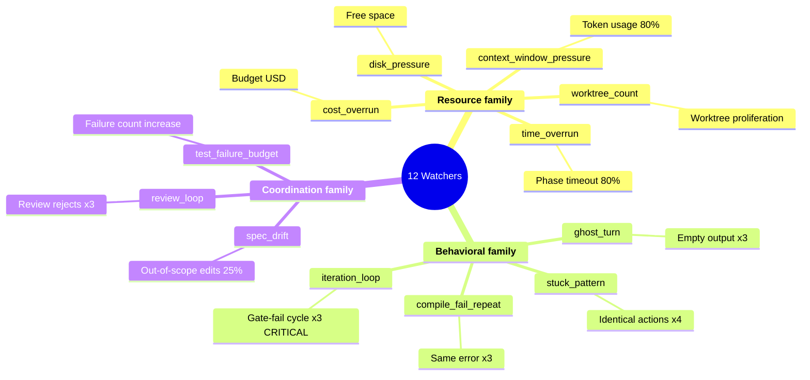
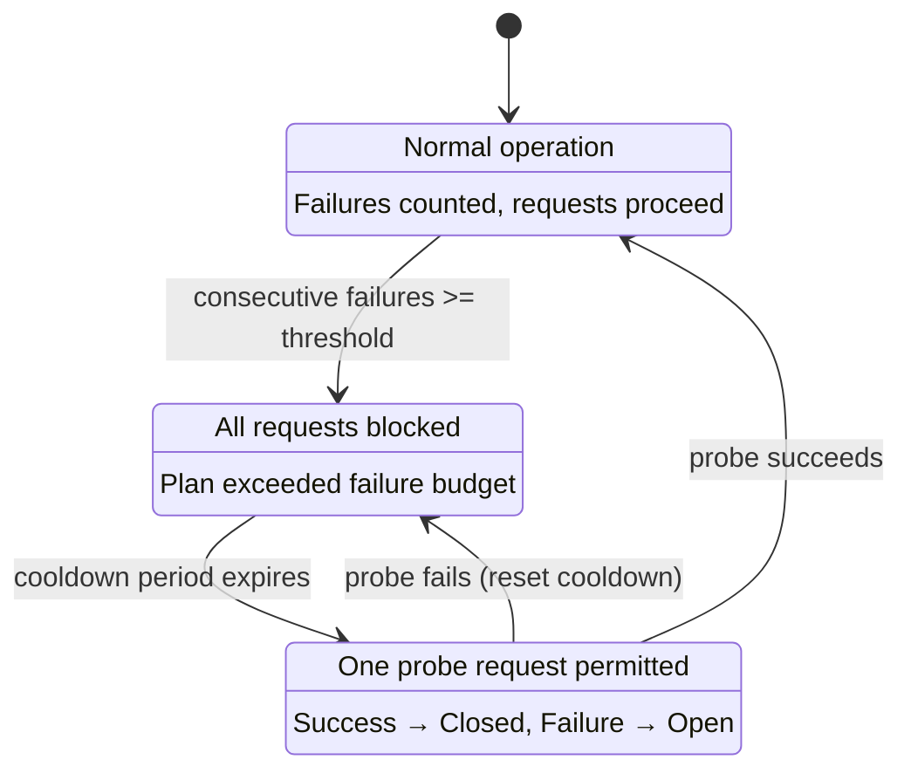
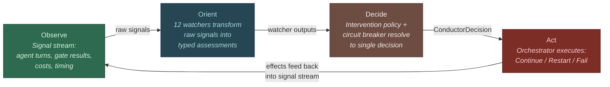
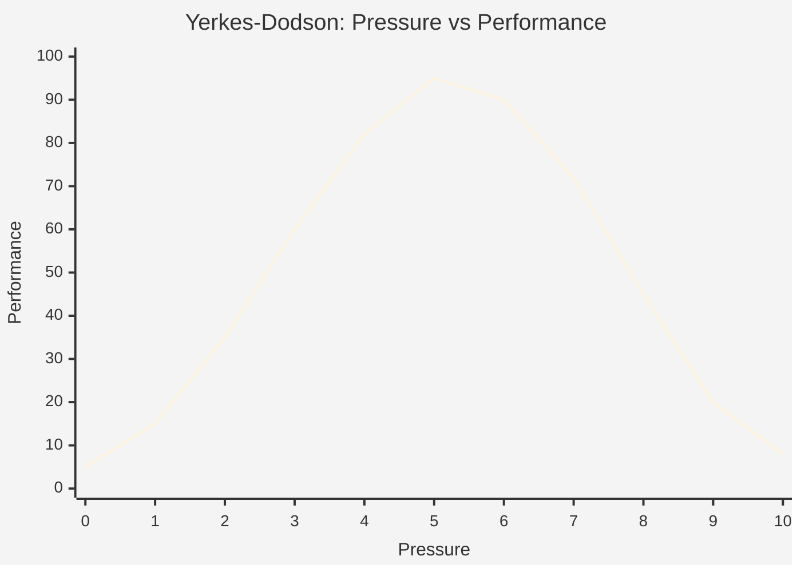

# 30 -- The Conductor

> The Conductor is not a timeout manager. It is the agent's theory of mind
> about its own pipeline -- the subsystem that watches execution unfold
> and asks: is this going where I predicted?

> **Implementation status (corrected 2026-10-03 at `e55d4c20f`): PARTIAL. The plan-run
> watchdog, on by default: `Restart` and `Fail` act, `Nudge` and `ForceAdvance` do not.**
> Every Graph plan run supervises its running attempts with the Conductor, which the plan
> host ticks every 5 s (`SUPERVISION_INTERVAL`; `GraphTaskDispatcher::with_conductor` and
> `spawn_conductor_ticker` in `crates/roko-cli/src/graph_task_dispatch/supervision.rs`,
> started by the Graph plan runner).
> Each tick runs `Conductor::evaluate_full`, with the 13 watchers `Conductor::from_config`
> builds, the plan circuit breaker and the pattern detector, over each running attempt's own
> signals (its start, and the messages and tool calls of its live output), and acts on the
> decision:
>
> - `Restart` cancels that attempt the way the stall watchdog does: it fails and retries under
>   its task's `max_retries`, and when the next attempt ends the threshold learner learns
>   whether the restart helped (`record_intervention_outcome`);
> - `Fail` stops the run the way SIGTERM does, and the run's error names the watcher;
> - `Nudge` and `ForceAdvance` are not carried out (gap-ebd656, held by decision 9236).
>
> When an attempt's own signals call for nothing, the Conductor evaluates them again with the
> task's verify runs (gate verdicts and compile diagnostics, which `compile-fail-repeat` and
> `test-failure-budget` compare across attempts). What it calls for then is advice only: it is
> published as an advisory diagnosis and cancels nothing. Every intervention is published as a
> dashboard diagnosis.
>
> `[conductor] supervise = false` (default `true`, 1210) turns the Conductor off, and the
> stall watchdog (`crates/roko-cli/src/graph_task_dispatch/watchdog.rs`) keeps running: a
> warning after `silence_timeout_secs` of agent silence (default 180), and a cancel and retry
> after `task_stall_secs` (default 300). With both of those at 0 nothing supervises the run,
> the Conductor included. Will's decision 9236 (2026-10-02) keeps the Conductor as this
> watchdog, on by default, and parks only the parts the plan path never calls; at `e55d4c20f`
> nothing is parked yet. Those parts are built and unit-tested in `roko-conductor`, but no plan
> run calls them: the diagnosis engine, stuck detector, health monitor, phase state machine,
> Yerkes-Dodson pressure framework and self-healing policy, and the `ConductorBandit` learned
> policy in `roko-learn` (`WorstSeverityPolicy` decides). The `[conductor]` keys `max_agents`,
> `max_parallel_plans` and `plan_failure_policy` apply as well: the Graph plan runner reads
> them directly. The design sections below speak of twelve watchers; the thirteenth,
> `retrieval-precision`, came later.

### Implementation sources

| Surface | Authority | Shipped boundary |
|---------|-----------|-----------------|
| Conductor struct | `crates/roko-conductor/src/conductor.rs` | `Conductor`, `evaluate()`, `RoutingBias` |
| 13 watchers | `crates/roko-conductor/src/watchers/` | All 13 watcher modules, each a `React` impl (counted at `e55d4c20f`) |
| Plan-run supervision | `crates/roko-cli/src/graph_task_dispatch/supervision.rs` | `GraphConductor`, `SUPERVISION_INTERVAL`, `spawn_conductor_ticker`; off with `[conductor] supervise = false` |
| Stall watchdog | `crates/roko-cli/src/graph_task_dispatch/watchdog.rs` | `StallThresholds` (`silence_timeout_secs`, `task_stall_secs`); runs with or without the Conductor |
| Circuit breaker | `crates/roko-conductor/src/circuit_breaker.rs` | `CircuitBreaker`, `HoltForecaster`, `ProactiveTripSignal` |
| Interventions | `crates/roko-conductor/src/interventions.rs` | `Severity`, `WatcherOutput`, `InterventionPolicy`, `BanditPolicy` |
| Diagnosis engine | `crates/roko-conductor/src/diagnosis.rs` | `DiagnosisEngine`, 20 `ErrorCategory`, 34 patterns, 9 `SuggestedIntervention` |
| Stuck detection | `crates/roko-conductor/src/stuck_detection.rs` | `StuckDetector`, 6 `StuckKind`, `MetaCognitionHook`, `CooldownFilter` |
| Health monitor | `crates/roko-conductor/src/health.rs` | `HealthMonitor`, `SystemSnapshot`, `HealthStatus` |
| State machine | `crates/roko-conductor/src/state_machine.rs` | `PhaseTransition`, `phase_timeout()` |
| Pattern detector | `crates/roko-conductor/src/pattern_detector.rs` | `PatternDetector`, `CompoundPattern`, `WatcherFamily` |
| Threshold learner | `crates/roko-conductor/src/threshold_learner.rs` | `ThresholdLearner`, `AdaptiveThreshold`, `InterventionOutcome` |
| Yerkes-Dodson | `crates/roko-conductor/src/yerkes_dodson.rs` | `YerkesDodson` pressure-performance framework |
| Self-healing | `crates/roko-conductor/src/self_healing.rs` | `SelfHealingPolicy`, `SelfHealingState`, `HealingAction` |
| Adapter | `crates/roko-conductor/src/adapter.rs` | Conductor adapter for runtime integration |
| Core types | `crates/roko-core/` | `ConductorDecision`, `ConductorEvaluation`, `CognitiveSignal`, `PlanPhase`, `PhaseKind` |
| Anomaly detector | `crates/roko-learn/src/anomaly.rs` | `AnomalyDetector`, EWMA, prompt loop, cost spike |
| Conductor bandit | `crates/roko-learn/src/conductor.rs` | `ConductorBandit` (built, not wired into evaluate path) |
| Process supervisor | `crates/roko-runtime/` | `ProcessSupervisor`, event bus, cancellation |

---

## 1. Architecture Overview

The Conductor sits at **Layer 3 (Harness)** in Roko's five-layer architecture,
sharing the layer with the gate pipeline but serving a fundamentally different
function:

- **Gates** answer: did the output meet the acceptance criteria?
- **Conductor** answers: is the process itself healthy?

Gates evaluate artifacts. The Conductor evaluates trajectories.

This distinction matters because a plan can pass every individual gate and still
be pathological -- looping through identical implement-gate cycles, burning
tokens on ghost turns, or drifting outside its declared file scope without any
single gate catching it.

| Layer | Name | What It Owns | Key Traits |
|-------|------|-------------|------------|
| L0 | Runtime | Processes, I/O, OS-level lifecycle | `Substrate` |
| L1 | Framework | Tool definitions, agent capabilities | (tools API) |
| L2 | Scaffold | Prompt construction, context engineering | `Composer` |
| **L3** | **Harness** | **Output evaluation, meta-cognition** | **`Gate`, `Policy`** |
| L4 | Orchestration | Multi-agent scheduling, DAG execution | `Router`, `Scheduler` |

The Conductor is a **composite `React`** implementation. Every watcher implements
the `React` trait. The Conductor itself also implements `React`, delegating to its
inner watchers and aggregating their outputs through an intervention policy.

### What the Conductor is not

**It is not a scheduler.** It does not decide which task runs next or which agent
gets spawned. That is L4 (Orchestration).

**It is not a gate.** Gates produce binary verdicts on artifacts. The Conductor
produces graduated interventions on processes.

**It is not a timeout manager.** Timeouts are one of twelve watcher categories.
The Conductor's scope includes loop detection, cost monitoring, context pressure
tracking, spec drift measurement, test regression detection, disk pressure
monitoring, worktree proliferation detection, and review cycle analysis.

**It does not nudge.** A nudge is "please fix yourself" -- which does not work on
confused agents. The Conductor has exactly three actions: Continue (everything is
fine), Restart (kill and restart with different context), or Fail (mark the plan
as failed). There is no "try harder." This is a deliberate design decision
derived from production experience: agents that are stuck remain stuck after
nudges (Hard Guarantee 6 from the production failure catalog).

### Evaluation flow

```
1. Circuit breaker check
   +-- If plan is tripped -> return Fail immediately

2. Run all 12 watchers against the signal stream
   +-- Each watcher returns Vec<Signal> (empty = healthy)
   +-- Collect all non-empty results as WatcherOutputs

3. Apply intervention policy
   +-- WorstSeverityPolicy: max(all severities) -> decision
   +-- Info -> Continue, Warning -> Restart, Critical -> Fail

4. If decision is Restart or Fail:
   +-- Record failure in circuit breaker
   +-- Emit intervention signal to stream

5. Return ConductorDecision
```

The entire evaluation is stateless from the Conductor's perspective -- it reads
the signal stream and produces a decision. State tracking (failure counts, circuit
breaker trips) lives in the `CircuitBreaker`, which uses thread-safe `DashMap`
for concurrent access.

**Latency budget:** The conductor evaluation cycle adds < 2 ms to the
orchestrator's event loop. This is negligible compared to agent turn times
(seconds to minutes) and gate execution times (seconds to minutes).

| Component | Typical latency |
|-----------|----------------|
| Circuit breaker check | < 1 us (DashMap lookup) |
| All 12 watchers | < 1 ms (stream scan, no I/O) |
| Intervention policy | < 1 us (max comparison) |
| Signal emission | < 10 us (signal construction) |
| **Total** | **< 2 ms** |

---

## 2. The Twelve Watchers

Twelve independent detectors, each focused on one failure mode, each
implementing the `React` trait, each testable in isolation.

### Watcher catalog

| # | Watcher | Module | Constant | Severity | What it detects |
|---|---------|--------|----------|----------|----------------|
| 1 | Ghost Turn | `ghost_turn.rs` | `MAX_GHOST_TURNS = 3` | Warning | Agent turns with zero meaningful output |
| 2 | Compile Fail Repeat | `compile_fail_repeat.rs` | `MAX_COMPILE_FAIL_REPEAT = 3` | Warning | Same compile error repeating across consecutive gate verdicts |
| 3 | Cost Overrun | `cost_overrun.rs` | `DEFAULT_BUDGET_USD = 10.0` | Warning | Plan cost exceeding allocated budget |
| 4 | Iteration Loop | `iteration_loop.rs` | `MAX_ITERATION_LOOP = 3` | **Critical** | Repeated gate-fail retry cycles without convergence |
| 5 | Review Loop | `review_loop.rs` | `MAX_REVIEW_CYCLES = 3` | Warning | Repeated review rejects without progress |
| 6 | Spec Drift | `spec_drift.rs` | `MAX_SPEC_DRIFT_RATIO = 0.25` | Warning | File edits outside declared task scope |
| 7 | Stuck Pattern | `stuck_pattern.rs` | `MAX_STUCK_REPEATS = 4` | Warning | Identical agent actions across consecutive turns |
| 8 | Test Failure Budget | `test_failure_budget.rs` | `MIN_FAILURE_INCREASE = 1` | Warning | Test failure count increasing beyond baseline |
| 9 | Time Overrun | `time_overrun.rs` | `ALERT_THRESHOLD = 0.80` | Warning | Task approaching timeout threshold (80%) |
| 10 | Context Window Pressure | `context_window_pressure.rs` | `MAX_CONTEXT_USAGE_RATIO = 0.80` | Warning | Token usage exceeding context window limits |
| 11 | Disk Pressure | `disk_pressure.rs` | (configurable) | Warning | Available disk space below safe thresholds |
| 12 | Worktree Count | `worktree_count.rs` | (configurable) | Warning | Excessive worktree proliferation consuming disk |

Only the **Iteration Loop** watcher defaults to Critical severity. Every other
watcher produces Warning, giving the plan one chance to recover through restart
before being failed.

### Watcher independence

Each watcher is independent:

- **No shared state**: Watchers do not read each other's output or maintain
  shared counters.
- **No ordering dependency**: Watchers can execute in any order. Parallel
  execution would produce identical results.
- **No cross-watcher interaction**: If both ghost-turn and stuck-pattern fire
  simultaneously, the intervention policy resolves the conflict (worst severity
  wins).

### Watcher families

Watchers group into three families based on what they measure:

**Resource family**: cost-overrun, context-window-pressure, time-overrun,
disk-pressure, worktree-count. These track consumption of finite budgets (money,
tokens, wall-clock time, disk space). When two resource watchers fire together,
the root cause is usually a single runaway process burning all budgets
simultaneously.

**Behavioral family**: ghost-turn, stuck-pattern, compile-fail-repeat,
iteration-loop. These detect degenerate agent behavior. Two behavioral watchers
firing together confirms the agent is stuck.

**Coordination family**: review-loop, spec-drift, test-failure-budget. These
detect multi-agent coordination breakdowns. Two coordination watchers firing
together indicates a systemic scoping or communication problem.



**Cross-family correlation**: If watchers from different families fire
simultaneously, the situation is more severe. A behavioral failure (stuck-pattern)
combined with a resource failure (cost-overrun) means the agent is both stuck AND
burning budget doing it. Cross-family correlation should escalate severity by one
level.

### Signal flow

**Input signals consumed:**

| Kind | What the Conductor reads |
|------|------------------------|
| `TokenUsage` | Token counts for context pressure |
| `GateVerdict` | Test results for failure budget |
| `AgentOutput` | Output content for ghost turn / stuck detection |
| `PlanPhase` | Phase events for review loop tracking |
| `Metric` (name=spec_drift) | Drift ratios for spec drift |
| `Custom("conductor.agent_output")` | Timing data for time overrun |

**Output signals emitted:**

| Kind | When |
|------|------|
| `Custom("conductor.intervention")` | Any watcher fires |

Intervention signals carry tags: `watcher` (which watcher fired), `severity`
(info/warning/critical), and watcher-specific metadata.

---

## 3. Circuit Breaker Pattern

> Design rule: a plan can fail at most twice before it needs human attention,
> and the limit is not configurable.
>
> **Status (2026-09-29, at `7c556bc0a`): not enforced.** Nothing on the Graph path
> evaluates the Conductor, so this breaker never trips on plan runs. What bounds a
> failing plan today is each task's `max_retries` and the plan's failure policy
> (`[conductor] plan_failure_policy`, read by the Graph plan runner).

The circuit breaker is designed to enforce a hard failure budget per plan. After
`MAX_PLAN_FAILURES` (default 2) failures, the plan is permanently tripped -- no
further retries. This prevents the pathological case where a fundamentally broken
plan cycles through retry after retry, burning tokens on every attempt.

Reference: Nygard, M.T. (2007). *Release It! Design and Deploy
Production-Ready Software*. Pragmatic Bookshelf. The circuit breaker pattern
prevents cascading failures by failing fast when a downstream dependency is
unavailable or a process is repeatedly failing.

### Three-state model



**Closed**: Normal operation. Failures are counted but requests proceed.

**Open**: All requests are blocked. The plan has exceeded its failure budget.

**HalfOpen**: One probe request is permitted. If the probe succeeds, the
breaker returns to Closed.

The plan-level breaker in `roko-conductor` uses a simplified two-state model
(tripped / not tripped) because plans do not benefit from automatic probing -- a
plan that failed twice needs a different approach, not another attempt at the
same approach. The full three-state model is implemented in the provider health
tracker (`roko-learn/src/provider_health.rs`) for API-level circuit breaking.

### Why two failures

**First failure**: Often caused by transient issues -- API rate limit, cold start,
missing context. Retrying with a fresh agent frequently succeeds.

**Second failure**: The same plan failing twice usually indicates a structural
problem -- the task is beyond the agent's capability with the given context, the
acceptance criteria are contradictory, or the codebase has changed in a way that
makes the task impossible as specified.

The math: with 2 plan-level failures and 3 implementation iterations each, the
absolute upper bound is 6 total implementation cycles before permanent failure.

```
MAX_PLAN_FAILURES (2) x MAX_ITERATION_LOOP (3) = 6 max attempts ever
```

### Per-plan isolation

The circuit breaker is keyed by plan ID using `DashMap` for lock-free concurrent
access. Plan A hitting its failure budget does not affect Plan B. This
per-plan isolation is critical for batch runs where 20+ plans execute in
parallel.

### Predictive circuit breaking

The `HoltForecaster` (double exponential smoothing) extends the reactive breaker
with trend-aware forward projection. Where EWMA tracks level only, Holt's method
tracks level and slope:

```rust
level_{t} = alpha * value + (1 - alpha) * (level_{t-1} + trend_{t-1})
trend_{t} = beta * (level_{t} - level_{t-1}) + (1 - beta) * trend_{t-1}
forecast(h) = level + trend * h
```

When the projected error rate exceeds 60% and the slope exceeds 5% per cycle,
the breaker trips preemptively via `ProactiveTripSignal`.

### Feature-level breakers

Partial circuit breaking degrades individual capabilities while keeping core
execution running. When context enrichment fails three times, the enrichment
circuit opens -- but compilation, testing, and implementation continue
uninterrupted. Compile and test gates have no fallback because they enforce
correctness. Everything else -- linting, enrichment, review -- is valuable but
not essential.

### Adaptive concurrency (AIMD)

The circuit breaker integrates AIMD (Additive Increase, Multiplicative Decrease)
self-tuning concurrency, using the same algorithm as TCP congestion control:

- On success: `concurrency += 1 / concurrency` (additive increase)
- On failure: `concurrency *= 0.9` (multiplicative decrease)

---

## 4. Graduated Interventions

> Three actions. No nudges. Continue, Restart, or Fail.

### The ConductorDecision enum

```rust
pub enum ConductorDecision {
    Continue,
    Restart { reason: String },
    Fail { reason: String },
}
```

### The severity system

```
Info     -> ConductorDecision::Continue
Warning  -> ConductorDecision::Restart
Critical -> ConductorDecision::Fail
```


> The severity ladder is monotonic: escalation flows left-to-right only.
> De-escalation requires a clean restart (fresh agent, fresh context).

### Why no nudge

Production experience demonstrated that nudging does not work:

```
Agent is stuck -> Conductor sends nudge ->
Agent reads nudge -> Agent attempts same approach ->
Agent is still stuck -> Conductor sends another nudge -> ...
```

A confused agent remains confused after receiving a nudge. The nudge says "you
seem stuck, try a different approach" -- but the agent's confusion is WITHIN
its context. Adding a nudge message to an already-confused context does not
reduce confusion. It may increase it.

The structural fix: kill and restart (fresh context, error analysis included),
or fail (mark for human attention). Both create a clean break from the confused
state. This is Hard Guarantee 6: "The Conductor DECIDES, Never Nudges."

### Intervention policy

The `InterventionPolicy` trait supports pluggable resolution strategies:

```rust
pub trait InterventionPolicy: Send + Sync {
    fn evaluate(&self, outputs: &[WatcherOutput], ctx: &Context)
        -> ConductorDecision;
}
```

**WorstSeverityPolicy (default):** The maximum severity among all fired watchers
determines the decision. If nine watchers say "continue" and one says "critical,"
the decision is Fail. Conservative, never under-reacts.

**BanditPolicy:** The `BanditPolicy` implementation in `interventions.rs` provides
the interface for learned intervention selection (see Section 14).

### Cooldown periods

After a watcher fires, it does not fire again for the same plan until enough
time has passed for the intervention to take effect. Production default: 120
seconds per plan per watcher. This prevents oscillation (fire -> restart ->
fire -> restart) and double-fire during restart.

### Escalation semantics

**On Restart:** The current agent is terminated (not paused). Error context is
preserved into an error brief. A new agent is spawned with fresh context plus
the error brief. The iteration counter increments.

**On Fail:** All in-flight tasks for the plan are cancelled. The plan phase
transitions to Failed(reason). The circuit breaker records the failure. The
orchestrator moves on to other plans.

---

## 5. Diagnosis Engine

Thirty-four patterns across twenty error categories. Given raw error text,
return a typed `Diagnosis` with category, confidence, and suggested intervention.

### Error categories

```rust
pub enum ErrorCategory {
    CompileError, TestFailure, TypeMismatch, BorrowCheckerError,
    LifetimeError, ImportError, MissingFile, PermissionDenied,
    NetworkError, TimeoutError, OomError, DiskFull,
    LlmRateLimit, LlmContextOverflow, LlmRefusal,
    ProcessCrash, LoopDetected, ClippyWarning,
    GitConflict, DependencyError,
}
```

### Suggested interventions

```rust
pub enum SuggestedIntervention {
    RetryWithContext, AutoFix, RestartAgent, AbortPlan,
    BackoffRetry, MergeResolution, ReduceContext,
    SwitchModel, WarnAndContinue,
}
```

### Category-to-intervention mapping

| Category | Primary intervention | Rationale |
|----------|---------------------|-----------|
| CompileError | RetryWithContext | Agent may fix with error details |
| TestFailure | RetryWithContext | Agent may fix with test output |
| TypeMismatch | RetryWithContext | Agent needs expected/found types |
| BorrowCheckerError | RestartAgent | Requires fresh architectural approach |
| LifetimeError | RestartAgent | Structurally difficult for in-context fix |
| ImportError | AutoFix | Missing imports are cheap to fix ($0.01 via Haiku) |
| MissingFile | RetryWithContext | Agent may need to create the file |
| PermissionDenied | AbortPlan | Cannot fix permissions from agent context |
| NetworkError | BackoffRetry | Likely transient |
| TimeoutError | BackoffRetry | Likely transient |
| OomError | AbortPlan | Resource exhaustion requires operator action |
| DiskFull | AbortPlan | Resource exhaustion requires cleanup |
| LlmRateLimit | BackoffRetry | Wait for rate limit window to expire |
| LlmContextOverflow | ReduceContext | Compact and retry |
| LlmRefusal | SwitchModel | Try a different model |
| ProcessCrash | RestartAgent | Agent died; respawn |
| LoopDetected | RestartAgent | Agent is stuck; fresh context needed |
| ClippyWarning | WarnAndContinue | Non-blocking |
| GitConflict | MergeResolution | Spawn merge resolver |
| DependencyError | RetryWithContext | Agent may fix with dependency info |

### Production error distribution

| Category | Frequency | Auto-fix rate |
|----------|----------|--------------|
| ImportError | 35% | 95% |
| CompileError (general) | 20% | 30% |
| TypeMismatch | 15% | 50% |
| TestFailure | 12% | 0% |
| BorrowCheckerError | 5% | 10% |
| LifetimeError | 4% | 10% |
| LlmRateLimit | 3% | N/A (retry) |
| All others | 6% | varies |

Over a third of all errors are import errors, and 95% of those can be
auto-fixed for $0.01 each. Without the diagnosis engine, all errors go through
full re-implementation at $2+ each.

---

## 6. Stuck Detection

Six heuristics for detecting stuck agents, wrapped by a `MetaCognitionHook`
that provides periodic self-assessment at Theta frequency: "Am I stuck? Am I
thrashing? Should I escalate?"

### StuckKind enum

```rust
pub enum StuckKind {
    OutputLoop,       // Identical output across turns (threshold: 4)
    NoProgress,       // No file changes within 5 minutes
    GateLoop,         // Gate failures oscillating without net progress (threshold: 3)
    CompileLoop,      // Cycling compile errors (threshold: 3)
    EmptyOutput,      // Turns with text but no tool calls (threshold: 3)
    ExcessiveRetries, // Same operation retried without change (threshold: 6)
}
```

Each variant represents a mode of execution that LOOKS like progress (the
agent is active, producing output, calling tools) but IS NOT progress. The
stuck detector models the difference between activity and progress.

### MetaCognitionHook

The `MetaCognitionHook` wraps the `StuckDetector` into a periodic assessment
that operates at Theta frequency -- medium-rate periodic assessment, not every
turn (too expensive) but often enough to catch stuck agents before they burn
significant budget.

| Frequency | Rate | Purpose |
|-----------|------|---------|
| Gamma | High (every turn) | Real-time tool dispatch, safety checks |
| Theta | Medium (periodic) | Self-assessment, meta-cognition |
| Delta | Low (between sessions) | Consolidation, pattern extraction |

Assessment maps stuck kinds to meta-cognition actions:

| Stuck kind | Action | Rationale |
|-----------|--------|-----------|
| OutputLoop | AdjustStrategy | Agent needs a different approach |
| NoProgress | AdjustStrategy | Agent is stalled; refocus |
| GateLoop | Escalate | Cycling indicates fundamental problem |
| CompileLoop | Escalate | Cycling indicates architectural mismatch |
| EmptyOutput | AdjustStrategy | Agent needs more directive prompting |
| ExcessiveRetries | AdjustStrategy | Different operation or tool needed |

### CooldownFilter

The `CooldownFilter` prevents the same stuck detection from firing repeatedly
for the same plan within a short window, avoiding intervention cascades during
recovery.

---

## 7. Health Monitors

Four system-level health checks producing a `HealthStatus` (Healthy / Degraded /
Critical). Not individual task health -- system health.

### SystemSnapshot

```rust
pub struct SystemSnapshot {
    pub active_agents: usize,
    pub expected_agents: usize,
    pub last_agent_heartbeat_ms: Option<u64>,
    pub chain_connected: bool,
    pub chain_expected: bool,
    pub spec_hash_expected: Option<String>,
    pub spec_hash_actual: Option<String>,
    pub coverage_history: Vec<f64>,
}
```

### The four checks

| Check | What it checks | Healthy | Degraded | Critical |
|-------|---------------|---------|----------|----------|
| Terminal Liveness | Is the agent process still responsive? | Heartbeat within threshold | Heartbeat exceeds threshold | No heartbeat and agents expected |
| Agent Status | Are expected agents running? | active >= expected | active < expected | active == 0 and expected > 0 |
| Spec Drift | Has the implementation diverged from specification? | Hashes match | Hashes differ | (not used) |
| Coverage Trend | Is test coverage trending down? | Stable or increasing | Declining | (not used) |

The health monitor runs on a fixed interval (every 10 seconds), independent of
events. This catches infrastructure problems that do not produce events -- for
example, an agent that has silently died.

### VSM System 3* mapping

In Beer's Viable System Model (Beer, 1972), the health monitor maps to
**System 3*** (System Three-Star) -- the audit channel. It checks whether the
orchestrator's model of reality matches actual reality.

---

## 8. OODA Cybernetic Loop

Boyd's OODA loop (Observe-Orient-Decide-Act) provides the conceptual framework
for the Conductor's evaluation cycle. Each conductor tick maps directly to one
OODA iteration.

Reference: Boyd, J. (1987). "A Discourse on Winning and Losing." Briefing
compilation, Air University Library. Boyd's OODA loop formalizes the decision
cycle for competitive environments. The Conductor's "adversary" is drift -- the
gap between what agents are doing and what they should be doing.

### OODA cycle



> Boyd, J. (1987). "A Discourse on Winning and Losing." The Conductor's
> "adversary" is drift -- the gap between what agents are doing and what they
> should be doing. Faster OODA cycling detects drift sooner.

### The four phases

**Observe:** The signal stream is the observation input. Every agent turn, gate
result, phase transition, cost event, and timing measurement produces a Signal.
The Conductor reads the stream without modifying it.

**Orient:** Each watcher transforms raw signals into structured assessments.
Orientation also includes the stuck detector's meta-cognition assessment and
the diagnosis engine's error classification. Raw data becomes typed assessments.

**Decide:** The intervention policy resolves multiple watcher assessments into
a single decision. The circuit breaker also participates: a tripped plan
produces `Fail` regardless of watcher outputs.

**Act:** The Conductor does not act directly. It returns a `ConductorDecision`
to the orchestrator, which translates it into concrete actions:

| Decision | Orchestrator action |
|----------|-------------------|
| Continue | Do nothing -- proceed with current execution |
| Restart | Kill agent process, prepare error context, spawn fresh agent |
| Fail | Cancel in-flight tasks, mark plan as Failed, move to next plan |

This separation of decision from action is deliberate. The Conductor operates
purely on the signal stream and produces pure decisions. The orchestrator
translates decisions into effects.

### Cybernetic structure

```
+----------------+     Signals      +----------------+
|                | ----------------> |                |
|  Execution     |                   |  Conductor     |
|  (Agents,      |                   |  (Watchers,    |
|   Gates,       |  <-------------- |   Policy,      |
|   Merges)      |   Decision        |   Breaker)     |
|                |                   |                |
+----------------+                   +----------------+
```

**Sensor**: Signal stream (observes execution state).
**Comparator**: Watchers (compare observed state to thresholds).
**Controller**: Intervention policy (decides corrective action).
**Actuator**: Orchestrator (executes the decision).
**Environment**: Agents + codebase + gates (the system being regulated).

The Conductor implements **negative feedback** -- it acts to reduce deviation
from the desired state (Wiener, 1948). When spec drift exceeds 25%, the
intervention pushes toward in-scope work. When cost exceeds budget, the signal
pushes toward termination. Positive feedback is absent by design -- positive
feedback in the conductor domain would risk runaway behavior. Optimization lives
in the learning system instead.

Reference: Wiener, N. (1948). *Cybernetics: or Control and Communication in
the Animal and the Machine*. MIT Press. Wiener formalized the concept of
feedback control that the Conductor implements.

### Implicit Guidance and Control (IG&C)

Boyd described a shortcut in the OODA loop: when the Orient phase recognizes a
well-known pattern, it can bypass the full Decide phase and jump straight to Act.
Pre-compiled rules for common failure patterns encode institutional knowledge
from the `ConductorBandit`'s converged actions. When a bandit arm converges to
>95% selection rate for a given failure pattern, that pattern can graduate to an
IG&C rule.

### Nested OODA loops -- multi-timescale control

A single OODA loop is insufficient for a system that operates across multiple
timescales:

```
+-------------------------------------------------------------+
|  Delta Loop (Strategic)                                      |
|  Period: per-batch (hours)                                   |
|  Orient: cross-plan patterns, model effectiveness            |
|  Decide: cascade router updates, threshold tuning            |
|                                                              |
|  +-------------------------------------------------------+  |
|  |  Theta Loop (Operational)                              |  |
|  |  Period: per-task (minutes)                            |  |
|  |  Orient: MetaCognitionHook assessment                  |  |
|  |  Decide: strategy adjustment, escalation               |  |
|  |                                                        |  |
|  |  +--------------------------------------------------+ |  |
|  |  |  Gamma Loop (Tactical)                           | |  |
|  |  |  Period: per-turn (seconds)                      | |  |
|  |  |  Orient: all 12 watchers                         | |  |
|  |  |  Decide: intervention policy                     | |  |
|  |  +--------------------------------------------------+ |  |
|  +-------------------------------------------------------+  |
+-------------------------------------------------------------+
```

The singular perturbation principle from control theory ensures these loops
decouple: Gamma runs every ~5 seconds, Theta every ~75 seconds, Delta every
~hours. The ~15x separation between adjacent levels is sufficient for
quasi-static decoupling -- each loop treats the next-slower loop's parameters
as constants.

**Parameter cascade:** Slower loops set the parameters for faster loops.
Delta sets Theta parameters (adaptive gate thresholds, default model tier, cost
budgets). Theta sets Gamma parameters (adjusted watcher thresholds, intervention
cooldown periods). The cascade flows one direction: slow to fast.

### Algedonic signals -- priority interrupts

Algedonic signals (from Greek: algos/pain + hedone/pleasure) are priority
interrupts that bypass the normal evaluation hierarchy (Beer, 1972). Four
conditions trigger algedonic escalation:

1. **Runaway cost**: total session cost exceeds 2x budget before 50% of wall
   time has elapsed.
2. **Safety violation**: agent attempts to modify files outside declared workspace
   scope, execute disallowed commands, or access restricted resources.
3. **Total infrastructure failure**: all agents are down simultaneously.
4. **Operator interrupt**: explicit Ctrl+C or shutdown command.

---

## 9. Good Regulator Self-Model

> "Every good regulator of a system must be a model of that system."
> -- Conant & Ashby (1970)

Reference: Conant, R.C. & Ashby, W.R. (1970). "Every good regulator of a
system must be a model of that system." *International Journal of Systems
Science*, 1(2), 89-97.

The Conductor models the pipeline through four components:

### 1. Behavioral norms (watcher thresholds)

| Threshold | Expectation |
|-----------|------------|
| `MAX_GHOST_TURNS = 3` | A healthy agent produces meaningful output on every turn |
| `MAX_COMPILE_FAIL_REPEAT = 3` | A healthy agent does not repeat the same compile error |
| `MAX_ITERATION_LOOP = 3` | A healthy plan converges within 3 gate-fail cycles |
| `MAX_REVIEW_CYCLES = 3` | A healthy plan passes review within 3 cycles |
| `MAX_SPEC_DRIFT_RATIO = 0.25` | A healthy agent modifies at most 25% unexpected files |
| `MAX_STUCK_REPEATS = 4` | A healthy agent does not repeat identical actions |
| `MIN_FAILURE_INCREASE = 1` | A healthy agent does not increase test failures |
| `ALERT_THRESHOLD = 0.80` | A healthy task completes within 80% of its timeout |
| `MAX_CONTEXT_USAGE_RATIO = 0.80` | A healthy agent uses at most 80% of its context window |
| `MAX_PLAN_FAILURES = 2` | A recoverable plan succeeds within 2 attempts |

### 2. Failure taxonomy (20 error categories)

The diagnosis engine's 20 error categories model the system's failure modes.
Each category maps to a distinct intervention strategy.

### 3. Process patterns (6 stuck heuristics)

Each pattern is a mode of execution that looks like progress but is not.

### 4. Infrastructure expectations (4 health checks)

The health monitor models what "the system is ready to do work" means.

### Model accuracy

The self-model's accuracy determines the Conductor's effectiveness. False
positives (model too strict) waste resources -- healthy agents are killed
unnecessarily. False negatives (model too lenient) waste resources --
pathological agents run unchecked.

Precision-weighted prediction errors from active inference theory provide the
update mechanism: errors from reliable sources (contexts with many historical
observations) drive large model updates, while errors from novel contexts drive
small ones.

### Recursive self-modeling

The meta-cognition hook introduces a recursive element:

```
Level 0: Agent executes task
Level 1: Watchers model agent execution
Level 2: MetaCognitionHook models watcher effectiveness
```

Two levels suffice. The law of diminishing returns applies: each additional
level adds complexity but decreasing diagnostic value.

---

## 10. Cognitive Signals

Typed interrupts that carry semantic meaning -- not just "something happened"
but intent about what to DO:

```rust
pub enum CognitiveSignal {
    Pause,
    Resume,
    Reprioritize(TaskId),
    InjectContext(Signal),
    Escalate,
    Cooldown,
    Explore,
    Shutdown,
}
```

| Signal | Intent | When emitted |
|--------|--------|-------------|
| Pause | Temporarily halt execution | Spec drift, cost approaching budget, degraded infrastructure |
| Resume | Continue after Pause | Condition resolved |
| Reprioritize | Change task priority | Dependency unblocked, file conflict, starvation |
| InjectContext | Add specific context to agent prompt | Diagnosis fix suggestion, playbook rule, cross-agent context |
| Escalate | Move to more capable model tier | Haiku failed twice, borrow checker errors, quality below threshold |
| Cooldown | Reduce pressure on current task | Approaching Yerkes-Dodson collapse zone |
| Explore | Grant more creative freedom | Two approaches failed, architectural change needed |
| Shutdown | Gracefully terminate execution | Budget exhausted, total infrastructure failure, operator Ctrl+C |

Cognitive signals extend the Conductor's response vocabulary from 3
(Continue/Restart/Fail) to 8+, matching the variety of anomalies the Conductor
can detect. This directly addresses Ashby's Law of Requisite Variety (Ashby,
1956): the regulator's variety must match the system's variety.

Reference: Ashby, W.R. (1956). *An Introduction to Cybernetics*. Chapman & Hall.

---

## 11. Adaptive Timeouts State Machine

### Phase timeouts by complexity band

```rust
pub fn phase_timeout(phase: PlanPhase, complexity: Complexity) -> Duration {
    match (phase, complexity) {
        (Implementing, Complex)  => Duration::from_secs(600),   // 10 min
        (Implementing, Standard) => Duration::from_secs(300),   // 5 min
        (Implementing, Fast)     => Duration::from_secs(120),   // 2 min
        (Gating, _)              => Duration::from_secs(300),   // 5 min
        (Reviewing, _)           => Duration::from_secs(300),   // 5 min
        (Merging, _)             => Duration::from_secs(60),    // 1 min
    }
}
```

### Hard timeouts

Phase timeouts are enforced by the state machine, not by heuristic detection.
When the timeout fires, the plan transitions to Failed. No exceptions. This is
Hard Guarantee 2: "Every Phase Has a Hard Timeout."

### PhaseTransition records

Every phase transition produces an audit record:

```rust
pub struct PhaseTransition {
    pub plan_id: String,
    pub from: PlanPhase,
    pub to: PlanPhase,
    pub timestamp: String,
    pub reason: String,
}
```

### Layered timeout architecture

| Layer | Timeout type | What it catches |
|-------|-------------|----------------|
| Process (roko-runtime) | Process timeout | Agent process hangs |
| Task (Conductor) | Phase timeout | Task takes too long in any phase |
| Plan (Conductor) | Wall-clock limit | Total plan execution exceeds limit |
| Batch (Orchestrator) | Budget limit | Total batch cost exceeds limit |

### TTFT timeout

Time-to-first-token timeout provides early detection of stalled providers:

```
Request sent
    <- connect_timeout_ms (5s): TCP connection must be established
    <- ttft_timeout_ms (15s): first token must arrive
    <- timeout_ms (120s): complete response must arrive
Response received
```

### Graceful shutdown

On Ctrl+C or Shutdown signal, the orchestrator executes a four-phase shutdown:
stop accepting -> drain (30s grace) -> force kill -> checkpoint and flush.
Atomic checkpoint writes (temp-file-then-rename) prevent corruption from
mid-write crashes.

---

## 12. Anomaly Detection and Learning

### AnomalyDetector

The anomaly detector (`roko-learn/src/anomaly.rs`) provides statistical anomaly
detection complementing the Conductor's threshold-based watchers:

**Prompt loop detection:** Hashes each prompt and tracks in a sliding window of
20. Five identical hashes trigger `Anomaly::PromptLoop`. Catches loops at the
input level, before the agent produces output.

**Cost spike detection:** EWMA with z-score anomaly detection. A z-score above
3.0 triggers `Anomaly::CostSpike` -- the cost of the current turn is more than
3 standard deviations above the running average.

**Quality degradation detection:** Compares recent quality scores (last 5)
against earlier scores (turns 11-20). Triggers when recent average drops >0.15
below earlier average AND recent average is below 0.5. The dual condition
prevents false positives on high-quality drops.

**Budget exhaustion:** Triggers when accumulated session cost exceeds the
configured limit.

### Streaming anomaly detection

**Online Isolation Forest:** Maintains random binary trees over a sliding
window. Points that isolate quickly (short average path length) are anomalies.
Anomaly score: `s = 2^(-E(depth) / c(window_size))`.

Reference: Liu, F.T., Ting, K.M. & Zhou, Z.-H. (2008). "Isolation Forest."
*ICDM*.

**CUSUM (Cumulative Sum):** Detects sustained shifts that EWMA z-scores miss.
The upper CUSUM statistic: `C_t = max(0, C_{t-1} + (x_t - mu_0 - k))`. CUSUM
detects sustained degradation 10-50x faster than EWMA z-scores for the same
false alarm rate.

Reference: Page, E.S. (1954). "Continuous Inspection Schemes." *Biometrika*.

### Learning integration feedback loops

**Loop 1 -- Intervention to routing improvement:**
Agent fails -> Conductor intervenes -> Negative routing signal -> Router adjusts
model selection -> Future agents less likely to fail -> Fewer interventions.

**Loop 2 -- Threshold to efficiency data to threshold tuning:**
Threshold fires -> Intervention occurs -> Efficiency event records outcome ->
Threshold effectiveness measured -> Threshold adjusted.

**Loop 3 -- Error classification to auto-fix to pattern library:**
Error occurs -> Diagnosis engine classifies -> Auto-fix attempted -> If success
-> Pattern stored with higher confidence.

**Loop 4 -- Quality degradation to model escalation:**
Quality drops -> Anomaly detector fires -> Escalate to higher-tier model ->
Better quality -> Router learns tier requirements.

---

## 13. Yerkes-Dodson Pressure Model

Reference: Yerkes, R.M. & Dodson, J.D. (1908). "The relation of strength of
stimulus to rapidity of habit-formation." *Journal of Comparative Neurology
and Psychology*, 18, 459-482.

The relationship between pressure and performance follows an inverted-U curve.
This finding, originally from maze-learning experiments in mice under varying
electric shock intensities, has replicated across species, task types, and
complexity levels for over a century.

### The inverted-U curve



```
    Zone 1 (Low pressure)      Zone 2 (Optimal)       Zone 3 (High pressure)
    ─────────────────────      ────────────────        ──────────────────────
    Under-arousal              Focused execution       Over-arousal
    Drift, exploration         Cooperation             Collapse, minimal effort
    Ghost turns, token waste   Peak gate pass rate     Template responses
```

> Yerkes, R.M. & Dodson, J.D. (1908). The inverted-U holds for LLM agents:
> moderate iteration limits, timeouts, and cost budgets maximize cooperation;
> extreme pressure collapses cooperative behavior within 5-12 turns.

### Yerkes-Dodson in LLM agent systems

Research on 770,000+ autonomous LLM agents demonstrates that cooperative
behavior follows the same inverted-U pattern with environmental pressure:

- **Moderate pressure** (iteration limits, timeouts, cost budgets) maximizes
  inter-agent cooperation.
- **Extreme pressure** collapses cooperative behavior within **5-12 turns**.
- **Insufficient pressure** produces drift -- ghost turns, verbose reasoning
  that burns tokens without advancing the task.

### Conductor thresholds as pressure parameters

| Threshold | Pressure type | Too low | Optimal | Too high |
|-----------|--------------|---------|---------|----------|
| `max_iterations` (3) | Iteration | Agent loops indefinitely | Converges in 2-3 attempts | Gives up after first failure |
| `cost_limit_usd` ($10) | Budget | Expensive reasoning freely | Balances cost vs. quality | Minimal output |
| `time_limit` (80%) | Time | Unlimited time per phase | Completes within window | Rushes, skips verification |
| `stuck_threshold` (4) | Progress | Allowed to spin | Must show progress each turn | Forced into superficial progress |
| `ghost_turn_max` (3) | Output | Can produce empty turns | Must produce meaningful output | Produces any output to avoid detection |

### Complexity-pressure interaction (Yerkes-Dodson Law proper)

The optimal pressure level depends on task difficulty. Simple tasks peak at
higher arousal. Complex tasks peak at lower arousal.

| Complexity | Phase timeout | Pressure level |
|-----------|--------------|---------------|
| Complex | 600s | Lower pressure (Zone 2 left) |
| Standard | 300s | Moderate pressure (Zone 2 center) |
| Fast | 120s | Higher pressure (Zone 2 right) |

### The collapse window

When pressure exceeds the optimal zone, cooperative behavior collapses within
5-12 turns:

```
Turn 1:  Agent attempts task normally
Turn 2:  First failure, agent retries with adjustment
Turn 3:  Conductor restarts (compile-fail-repeat fires)
Turn 4:  Agent attempts again, now with restart pressure
Turn 5:  Second failure, agent begins simplifying approach
Turn 6:  Conductor restarts again
Turn 7:  Agent produces minimal-effort output
Turn 8:  Output barely passes or fails again
...
Turn 12: Agent in full collapse -- producing template responses
```

The circuit breaker's MAX_PLAN_FAILURES=2 limit catches this collapse pattern.

### Pressure-performance curve fitting

The Yerkes-Dodson curve is modeled as an asymmetric logistic product:

```
P(x) = P_max * sigmoid(k1 * (x - a_low)) * (1 - sigmoid(k2 * (x - a_high)))
```

Parameters:
- **P_max**: peak performance (observed maximum gate pass rate)
- **a_low**: left threshold (pressure below which performance is limited)
- **a_high**: right threshold (pressure above which performance collapses)
- **k1**: steepness of the left slope (how fast performance rises)
- **k2**: steepness of the right slope (how fast performance collapses)

The curve is typically asymmetric: **k2 > k1**. Performance collapses faster
than it rises. An agent that took 10 turns of gentle pressure to reach peak
performance can lose that performance in 3 turns of excessive pressure. This
asymmetry is why the Conductor's circuit breaker errs on the side of stopping
early rather than pushing harder.

### Pressure index

A scalar pressure index collapses the multi-dimensional pressure envelope into
a single value for curve comparison:

```
pressure_index = 0.30 * (iteration / max_iterations)
              + 0.25 * (cost_usd / cost_budget_usd)
              + 0.25 * (elapsed_ms / timeout_ms)
              + 0.20 * (stuck_count / stuck_threshold)
```

### Model-specific curves

| Model tier | Peak location | Collapse threshold | Rationale |
|-----------|--------------|-------------------|-----------|
| Opus | Higher pressure | Later collapse | Superior reasoning tolerates more constraint |
| Sonnet | Moderate pressure | Moderate collapse | Default threshold calibration target |
| Haiku | Lower pressure | Earlier collapse | Limited reasoning degrades faster under stress |

Opus has a wider peak (robust over a range of pressures) with gradual collapse.
Haiku has a narrow peak (small optimal window) with steep collapse. The default
Conductor thresholds are calibrated for Sonnet.

### Online pressure optimization

Thompson sampling with five discrete pressure arms (very-loose through
very-tight) enables automated Yerkes-Dodson tuning per model. The discount
factor (0.995) means observations from ~200 tasks ago carry half their original
weight, preventing stale data from anchoring on an outdated optimum.

### Cognitive load theory mapping

Sweller's cognitive load theory (1988) maps to LLM context windows:

| Cognitive load | LLM equivalent | Source |
|---------------|----------------|--------|
| Intrinsic load | Task complexity | Plan metadata |
| Extraneous load | Irrelevant context | Stale docs, verbose error history |
| Germane load | Productive scaffolding | Plan context, error digests, playbook rules |

`intrinsic + extraneous + germane <= context_window_capacity`

The context window pressure watcher (80% threshold) preserves 20% of the window
for germane content. The Conductor's job is not to minimize total context -- it
is to maximize the germane-to-extraneous ratio.

### Flow state detection

Observable signals distinguish flow state from collapse:

| Signal | Flow state | Collapse state |
|--------|-----------|---------------|
| Files changed per turn | Consistent, moderate | Zero or extreme |
| Gate score trajectory | Improving | Flat or declining |
| Tool utilization | Diverse, purposeful | Repetitive or absent |
| Context usage | 40-70% of window | >85% or <20% |
| Cost per meaningful change | Low, stable | High, increasing |

When the system detects flow (3+ consecutive productive turns), watcher
thresholds increase by 50% to avoid disrupting the productive state. The
threshold increase is temporary and reverts when flow indicators stop. The flow
detector does not override the circuit breaker.

### Stigmergy and pressure

Git is stigmergic (Grasse, 1959): each commit is an environmental trace that
influences future agents. Under optimal pressure, agents leave high-quality
traces (clean commits, consistent patterns). Under excessive pressure,
stigmergic quality degrades (minimal commits, conflicting conventions). Poor
stigmergic quality compounds across batches.

---

## 14. Process Supervision Wiring

The `ProcessSupervisor` in `roko-runtime` provides five guarantees for every
spawned process:

1. **PID tracking**: Every process registered with PID, parent PID, attempt ID,
   and plan association.
2. **Descendant discovery**: Full process tree enumeration via platform-specific
   mechanisms (cgroups on Linux, `pgrep` on macOS).
3. **Lifecycle management**: Spawn, monitor, timeout, and terminate are atomic
   operations on the process tree, not individual processes.
4. **Orphan prevention**: On parent exit, all registered descendants are
   terminated via bottom-up kill ordering (leaves first, then parents).
5. **Attempt isolation**: Monotonically increasing attempt IDs prevent confusion
   between retries (eliminates spawn races).

### SIGTERM to SIGKILL escalation

Two-phase kill protocol: SIGTERM (grace period, configurable per process type)
followed by SIGKILL if the process does not exit. Agent CLI gets 5s, cargo gets
2s, rustc gets 1s.

### Process group management

Every agent process is spawned in its own process group via `setsid`, providing
signal isolation and group kill capability (`kill(-pgid, signal)`).

### Orphan reaper

Background task runs every 30 seconds, scanning for processes that should have
been cleaned up: alive processes whose parent task is complete/failed, and
processes reparented to init (PID 1).

### Integration with the Conductor

The Conductor decides; the ProcessSupervisor executes:

```
Conductor: "Agent for plan-42 has 3 ghost turns -> restart"
    |
    +-> Supervisor.kill_all_descendants(agent_pid)
        Supervisor.spawn(plan_42, task, cmd)  // fresh attempt
```

---

## 15. Production Failure Catalog

21 production failures across 6 categories, each observed during batch runs
between March and April 2026. Each failure maps to one or more Conductor
mechanisms.

### Category: State Corruption (#1-4)

| # | Issue | Root cause | Primary mechanism |
|---|-------|-----------|------------------|
| 1 | in_flight/completed overlap | Non-atomic state transition | Circuit breaker |
| 2 | Orphaned plans | Multi-write plan creation | Iteration loop watcher |
| 3 | Branch divergence | Long-lived branches | Review loop watcher |
| 4 | CONTEXT.md concurrent appends | Shared mutable file | Spec drift watcher |

### Category: Data Pipeline (#5, #13-15)

| # | Issue | Root cause | Primary mechanism |
|---|-------|-----------|------------------|
| 5 | Counter bug (TOML fences) | LLM wraps TOML in markdown fences | Diagnosis engine |
| 13 | Enrichment TOML fences | Same as #5 | Diagnosis engine |
| 14 | Verify script stale refs | LLM hallucinated package names | Compile-fail-repeat watcher |
| 15 | Review verdict parsing | Fragile regex parser | Review loop watcher |

### Category: Process Management (#6-9)

| # | Issue | Root cause | Primary mechanism |
|---|-------|-----------|------------------|
| 6 | Spawn races | No attempt tracking | Ghost-turn watcher + ProcessSupervisor |
| 7 | Orphaned cargo processes | kill(pid) misses descendants | ProcessSupervisor |
| 8 | Claude CLI cold start | 2-5s startup per turn | Time overrun watcher |
| 9 | Agent ghost turns | LLM degenerate loops | Ghost-turn watcher |

### Category: Resource Management (#10-12)

| # | Issue | Root cause | Primary mechanism |
|---|-------|-----------|------------------|
| 10 | Disk pressure | No proactive monitoring | Health monitor |
| 11 | Gate serialization bottleneck | Double semaphore | Time overrun watcher |
| 12 | Memory pressure from large prompts | "Include everything" strategy | Context pressure watcher |

### Category: Merge & Coordination (#16-18)

| # | Issue | Root cause | Primary mechanism |
|---|-------|-----------|------------------|
| 16 | Rebase failures | Permanent kill on rebase fail | Iteration loop watcher |
| 17 | Merge conflicts at gate | Plans scheduled without file overlap check | Compile-fail-repeat watcher |
| 18 | Worktree symlinks to shared state | Race conditions via symlinks | Spec drift watcher |

### Category: Observability (#19-21)

| # | Issue | Root cause | Primary mechanism |
|---|-------|-----------|------------------|
| 19 | Buried failures in logs | Unstructured logging | Efficiency events + Conductor signals |
| 20 | No signal on WHY plans fail | Failure path omitted reason | Diagnosis engine |
| 21 | ETA completely wrong | Broken TOML caused wrong progress | Anomaly detector |

### Design principles derived

| Principle | Prevents issues |
|-----------|----------------|
| Single source of truth | #1, #2, #4, #18 |
| Event-sourced state | #1, #2, #4 |
| Ephemeral everything | #3, #16 |
| Typed pipelines | #5, #13, #14, #15 |
| Fail loud, recover fast | #1, #2, #5, #6, #19, #20, #21 |
| Resource budgets | #10, #11, #17 |
| Process isolation | #4, #6, #7, #9, #18 |
| Measure everything | #8, #9, #11, #12, #19, #20, #21 |
| Anticipate, don't react | #9, #10, #12, #14, #17, #21 |

---

## 16. Conductor Learning Federation

### Contextual bandit for intervention selection

The `ConductorBandit` models intervention selection as a contextual multi-armed
bandit problem. 19-dimensional feature vector, 5 actions (Continue, InjectHint,
SwitchModel, Restart, Abort), Thompson Sampling blended with a linear context
model (65% exploration, 35% exploitation).

**Warmup period:** 50 observations before overriding static policy. Below 60%
confidence, falls back to `WorstSeverityPolicy`. The learned policy can only
override static rules with both sufficient data and sufficient confidence.

**Reward shaping:**

| Action | Outcome | Reward |
|--------|---------|--------|
| Continue | Next gate passes | 0.9 |
| Continue | Next gate fails | 0.1 |
| Restart | Restarted agent succeeds | 0.8 |
| Restart | Restarted agent also fails | 0.2 |
| Fail | Plan later retried and failed again | 0.7 (correct fail-fast) |
| Fail | Plan later retried and succeeded | 0.1 (premature failure) |

### Four-level federation architecture

Federation puts a conductor at each level. All four levels implement the same
trait and communicate through the signal stream -- no special hierarchy protocol:

| Level | VSM System | Scope | Actions |
|-------|-----------|-------|---------|
| L1 (Turn) | System 2 | Per-agent-turn | Prompt loop, cost spike detection |
| L2 (Task) | System 3 | Per-task | 12 watchers + circuit breaker |
| L3 (Plan) | System 3* | Per-plan | Resource reallocation, priority |
| L4 (Fleet) | System 4 | Cross-plan | Router policy updates, global budgets |

### Self-healing conductor

Four conductor failure modes, each with detection and recovery:

| Failure | Symptom | Detection | Recovery |
|---------|---------|-----------|----------|
| Threshold drift | Good plans killed | Intervention effectiveness < 50% | Bayesian threshold adaptation |
| Model staleness | Interventions have no effect | Restart success == continue success | Re-calibrate from recent efficiency events |
| Watcher blindness | New failure mode not caught | Plans fail without intervention | Unclassified error clustering |
| Circuit breaker stuck | Plans tripped that should retry | Tripped plans with changed environment | Auto-probe after sleep window |

### Triple-loop learning

```
Loop 1 (Single-loop): Correct errors
    Agent fails -> Conductor restarts -> Agent succeeds

Loop 2 (Double-loop): Change the rules
    Conductor thresholds produce false positives
    -> ThresholdLearner adjusts thresholds
    -> Future interventions more accurate

Loop 3 (Triple-loop): Change the meta-rules
    Threshold learning rate too slow (or too fast)
    -> Self-model accuracy metrics detect meta-problem
    -> Learning parameters adjusted
```

Reference: Argyris, C. & Schon, D.A. (1978). *Organizational Learning: A
Theory of Action Perspective*. Addison-Wesley.

---

## 17. Coordination as Architectural Layer

Multi-agent systems fail primarily from coordination failures, not individual
agent capability gaps:

> "Multi-agent LLM systems fail in production at rates between 41% and 87%, with the majority of these failures
> attributable to coordination defects rather than to base-model capability."
> -- Nechepurenko & Shuvalov, arXiv:2605.03310 (2026), abstract; its §1 credits the figure to Cemri et al. (2025)

The Conductor addresses this directly. Its twelve watchers detect coordination
failures (review loops, spec drift, merge conflicts) alongside individual
failures (ghost turns, compile loops). The circuit breaker prevents cascading
coordination failures. The multi-level federation architecture ensures
coordination monitoring at every granularity (turn, task, plan, fleet).

---

## Verification

### What to verify

```bash
# Conductor crate compiles and tests pass
cargo test -p roko-conductor

# Watcher count matches (13 watchers at e55d4c20f)
grep -c "pub mod" crates/roko-conductor/src/watchers/mod.rs
# Expected: 13

# All watcher modules exist
ls crates/roko-conductor/src/watchers/*.rs | wc -l
# Expected: 14 (13 watchers + mod.rs)

# Core re-exports are present
grep "ConductorDecision\|CognitiveSignal\|ConductorEvaluation" \
  crates/roko-conductor/src/lib.rs

# Conductor is used in executor
grep -rn "Conductor\|conductor" crates/roko-cli/src/runner/ \
  --include='*.rs' | head -5

# Circuit breaker integration
grep "circuit_breaker\|CircuitBreaker" \
  crates/roko-conductor/src/conductor.rs
```

### Canonical watcher list (12 modules)

```
compile_fail_repeat.rs      ghost_turn.rs          review_loop.rs
context_window_pressure.rs  iteration_loop.rs      spec_drift.rs
cost_overrun.rs             stuck_pattern.rs       test_failure_budget.rs
disk_pressure.rs            time_overrun.rs        worktree_count.rs
```

---

## References

### Primary citations

- **Wiener, N.** (1948). *Cybernetics: or Control and Communication in the Animal and the Machine*. MIT Press.

- **Ashby, W.R.** (1956). *An Introduction to Cybernetics*. Chapman & Hall. --
  Law of Requisite Variety: "Only variety can absorb variety." The Conductor's
  regulatory variety (12 watchers, 6 stuck heuristics, 20 error categories, 3
  severity levels, 8 cognitive signals) must match or exceed the variety of the
  agent ensemble's failure modes.

- **Maxwell, J.C.** (1868). "On Governors." *Proceedings of the Royal Society of London*, 16, 270-283.

- **Beer, S.** (1972). *Brain of the Firm*. Allen Lane.

- **Conant, R.C. & Ashby, W.R.** (1970). "Every good regulator of a system must be a model of that system." *International Journal of Systems Science*, 1(2), 89-97.

- **Boyd, J.** (1987). "A Discourse on Winning and Losing." Briefing compilation, Air University Library.

- **Yerkes, R.M. & Dodson, J.D.** (1908). "The relation of strength of stimulus to rapidity of habit-formation." *Journal of Comparative Neurology and Psychology*, 18, 459-482.

- **Nygard, M.T.** (2007). *Release It! Design and Deploy Production-Ready Software*. Pragmatic Bookshelf.

### Supporting citations

- **arXiv:2605.03310** (2026). "Coordination as an Architectural Layer for LLM-Based Multi-Agent Systems." -- Cites production failure rates of 41-87% for multi-agent systems, mostly from coordination defects (§1, after Cemri et al. 2025).

- **Francis, B.A. & Wonham, W.M.** (1976). "The Internal Model Principle of Control Theory." *Automatica*, 12(5), 457-465.

- **Friston, K.** (2010). "The free-energy principle: a unified brain theory?" *Nature Reviews Neuroscience*, 11(2), 127-138.

- **Liu, F.T., Ting, K.M. & Zhou, Z.-H.** (2008). "Isolation Forest." *ICDM*.

- **Page, E.S.** (1954). "Continuous Inspection Schemes." *Biometrika*.

- **Sweller, J.** (1988). "Cognitive load during problem solving." *Cognitive Science*, 12(2), 257-285.

- **Csikszentmihalyi, M.** (1990). *Flow: The Psychology of Optimal Experience*. Harper & Row.

- **Grasse, P.P.** (1959). "La reconstruction du nid." *Insectes Sociaux*, 6(1), 41-80.

- **Mesarovic, M., Macko, D. & Takahara, Y.** (1970). *Theory of Hierarchical, Multilevel Systems*. Academic Press.

- **Patterson, D. et al.** (2002). "Recovery-Oriented Computing."

- **Klein, G.** (1998). *Sources of Power: How People Make Decisions*. MIT Press.

- **Argyris, C. & Schon, D.A.** (1978). *Organizational Learning*.

- **Kalman, R.E.** (1960). "A New Approach to Linear Filtering and Prediction Problems." *Journal of Basic Engineering*, 82(1), 35-45.

- **Thompson, W.R.** (1933). "On the likelihood that one unknown probability exceeds another." *Biometrika*, 25(3-4), 285-294.

---

## Depth Files (v1/07-conductor/)

All v1 depth files are preserved in full. This chapter consolidates them.

| # | v1 file | Topic | v3 section |
|---|---------|-------|-----------|
| 00 | `00-conductor-architecture.md` | Architecture overview, L3 placement | Section 1 |
| 01 | `01-watcher-ensemble.md` | All watchers, detection logic, composition | Section 2 |
| 02 | `02-circuit-breaker.md` | Per-plan breaker, 3-state model, chaos engineering | Section 3 |
| 03 | `03-graduated-interventions.md` | Severity system, no-nudge policy | Section 4 |
| 04 | `04-diagnosis-engine.md` | 34 patterns, 20 categories, auto-fix | Section 5 |
| 05 | `05-stuck-detection.md` | 6 heuristics, MetaCognitionHook | Section 6 |
| 06 | `06-health-monitors.md` | SystemSnapshot, 4 checks, VSM 3* | Section 7 |
| 07 | `07-ooda-cybernetic-loop.md` | OODA mapping, nested loops, algedonic signals | Section 8 |
| 08 | `08-good-regulator-self-model.md` | Conant-Ashby, adaptive model, forward prediction | Section 9 |
| 09 | `09-cognitive-signals.md` | 8 typed interrupts, Ashby's variety | Section 10 |
| 10 | `10-adaptive-timeouts-state-machine.md` | Phase timeouts, TTFT, graceful shutdown | Section 11 |
| 11 | `11-anomaly-detection-learning.md` | EWMA, prompt loops, feedback loops | Section 12 |
| 12 | `12-yerkes-dodson-pressure.md` | Inverted-U, pressure calibration, flow state | Section 13 |
| 13 | `13-process-supervision-wiring.md` | ProcessSupervisor, PID tracking, orphan cleanup | Section 14 |
| 14 | `14-production-failure-catalog.md` | 21 failures, 6 categories, design principles | Section 15 |
| 15 | `15-conductor-learning-federation.md` | Learned policies, federation, self-healing | Section 16 |
