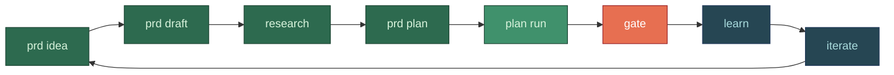
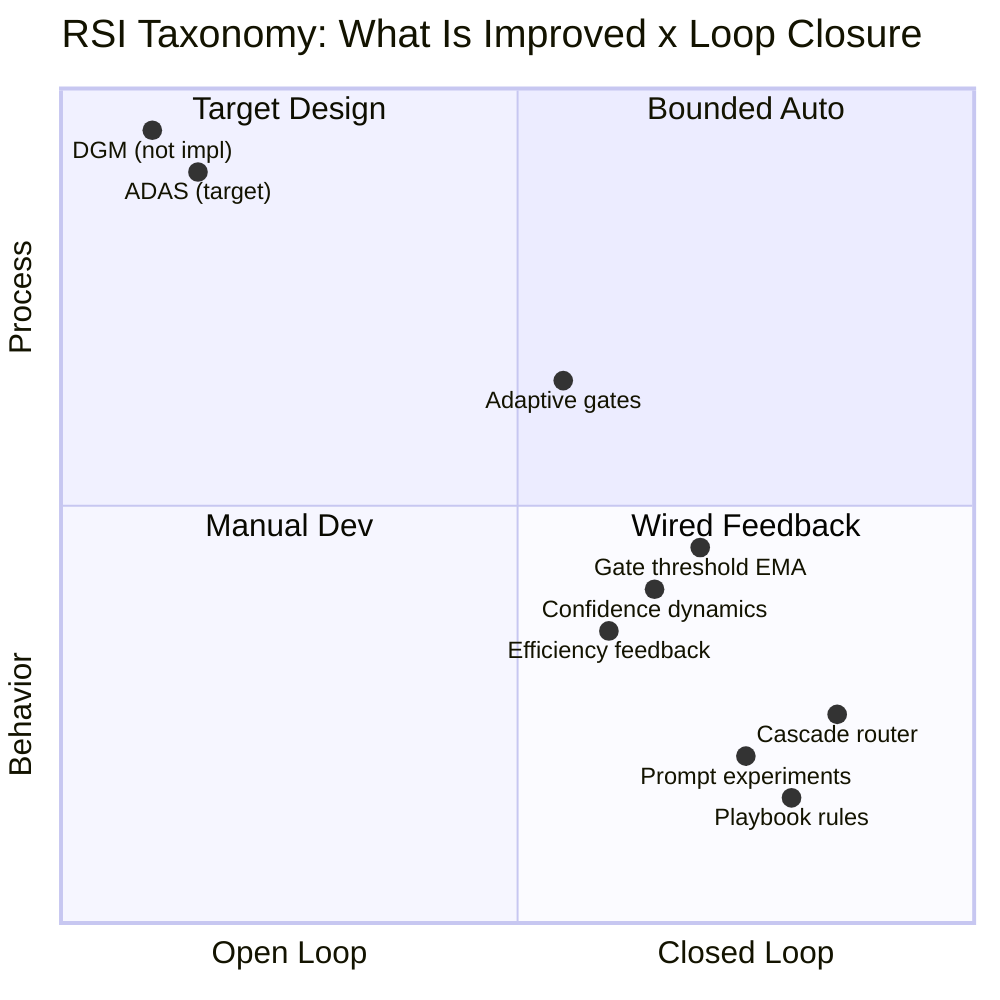
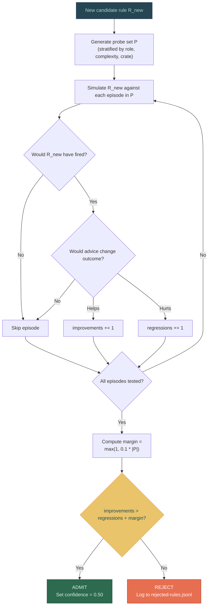
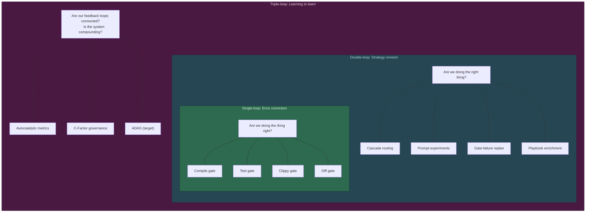
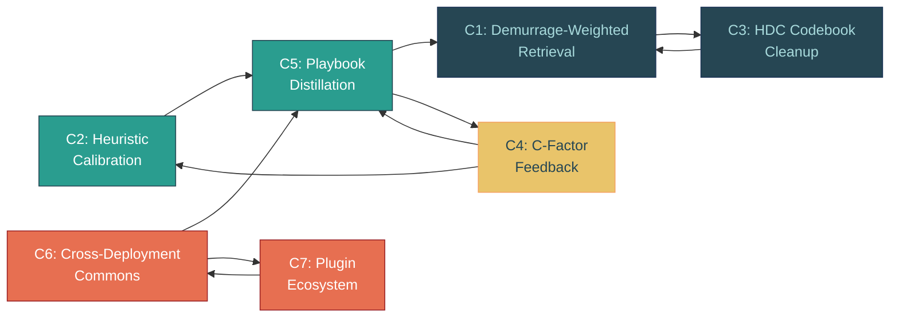

# 31 -- Self-Hosting: Recursive Self-Development

> Roko develops itself. It reads PRDs, generates implementation plans, executes
> tasks via LLM agents, validates results with each task's verify commands, learns
> from outcomes, and iterates. This chapter covers both the practical CLI
> workflow that makes self-hosting operational today and the theoretical
> foundations that bound what recursive self-improvement can and cannot achieve.

**Depends on**: [04-EXECUTION](04-EXECUTION.md) (Graph engine, plan pipeline, worktrees),
[05-AGENT](05-AGENT.md) (provider dispatch, tool loop), [07-GATES](07-GATES.md) (19-gate
pipeline, adaptive thresholds), [08-LEARNING](08-LEARNING.md) (8 feedback loops,
playbook rules, cascade router), [09-MEMORY](09-MEMORY.md) (durable knowledge store),
[10-DREAMS](10-DREAMS.md) (offline consolidation), [12-SAFETY](12-SAFETY.md) (capability
intersection, corrigibility, immune system)

**Implementation status (2026-09-15; corrected 2026-09-29 at `7c556bc0a`):** The
self-hosting workflow is **operational**. The 8-step CLI loop (idea -> draft ->
research -> plan -> execute -> resume -> monitor -> verify) works end-to-end. The
earlier claim that the 48 epics were accepted using this workflow is withdrawn:
they were accepted as programme manifests, and most of the code was written outside
Roko's own runner (section 1). The largest recorded run is the portal build: 16 plans
and 173 tasks, 168 of them gate-verified, under a supervising operator session
(`docs/whitepaper/evidence/2026-09-29-b7-real-run-evidence.md`). The first live
dogfood run (2026-08-13) exposed 4 blockers, all of which have regression fixes. A
clean full-cycle rerun is pending as separate sign-off. FAST self-development via
`dev.sh fast` is live. The `roko develop` command has been retired in favor of
`roko do --plan`. Adaptive thresholds (they set retry budgets) and durable prompt
experiments are wired; gate-failure replan is not (section 3). The theoretical
ceiling -- autonomous structural self-modification (Loop 4, ADAS) -- requires
human approval by design and is not implemented as a closed loop.

### Authoritative sources

| Surface | Source file |
|---|---|
| CLI commands (plan, prd, research) | `crates/roko-cli/src/main.rs`, `crates/roko-cli/src/commands/plan.rs` |
| Plan-to-graph conversion | `crates/roko-graph/src/convert.rs`, `crates/roko-graph/src/topology.rs` |
| Graph engine | `crates/roko-graph/src/engine.rs` |
| Gate-failure replan controller | `crates/roko-execution/src/replan_controller.rs` |
| Plan mutation contract | `crates/roko-core/src/plan_mutation.rs` |
| C-Factor metrics | `crates/roko-learn/src/cfactor.rs` |
| Autocatalytic metrics | `crates/roko-learn/src/cfactor.rs`, `crates/roko-learn/src/aggregate.rs` |
| FAST self-development wrapper | `dev.sh` (`cmd_fast`) |
| Playbook store (GRASP target) | `crates/roko-learn/src/playbook.rs`, `crates/roko-learn/src/playbook_rules.rs` |
| Prompt experiments | `crates/roko-learn/src/prompt_experiment.rs` |
| Gate gaming detection | `crates/roko-learn/src/gate_gaming.rs` |
| Durable knowledge store | `crates/roko-neuro/` |
| Dream consolidation | `crates/roko-dreams/src/cycle.rs` |

---

## 1. The Self-Hosting Workflow

Roko's self-hosting is meant to be the system's primary development workflow.
It is not yet: the companion audit of the repository history (2026-09-28) credits
Roko's own plan runner with 0.22-0.67% of the Rust lines added, and most of the
programme (48 epics, ~1M LOC) was written in operator-directed assistant sessions.
The portal build (section 6.2) is the largest body of work Roko has produced with
the loop described here.

### 1.1 The Eight-Step CLI Loop

```
Step 1: roko prd idea "Wire SystemPromptBuilder into runner"
                |
Step 2: roko prd draft new "system-prompt-wiring"
                |
Step 3: roko research enhance-prd system-prompt-wiring
                |
Step 4: roko prd plan system-prompt-wiring
                |
Step 5: roko plan run plans/
                |
Step 6: roko plan run plans/ --resume-plan
                |
Step 7: roko dashboard
                |
Step 8: roko status
```



Each step has a specific role in the pipeline:

| Step | Command | What It Does | Duration |
|------|---------|-------------|----------|
| 1. Capture | `roko prd idea "<text>"` | Record a work item as a PRD idea. No LLM call. Instant. | <1s |
| 2. Draft | `roko prd draft new "<slug>"` | Agent generates a structured PRD from the idea, with requirements, scope, and acceptance criteria. | 30-120s |
| 3. Research | `roko research enhance-prd <slug>` | Agent researches the topic (web search, codebase analysis, citation gathering) and enriches the PRD with findings. | 60-300s |
| 4. Plan | `roko prd plan <slug>` | Agent generates a `tasks.toml` with dependencies, crate targets, and verification commands from the enriched PRD. | 30-120s |
| 5. Execute | `roko plan run plans/` | The Graph engine converts tasks.toml into a DAG of Cells, runs each task as soon as its dependencies finish (up to the plan's `max_parallel`) in the working tree, checks each task with its `verify` commands, and persists results. | minutes-hours |
| 6. Resume | `roko plan run plans/ --resume-plan` | Restores graph checkpoint from `.roko/state/graph/`, skips completed Activity nodes using recorded outputs, resumes from the first non-complete node. | varies |
| 7. Monitor | `roko dashboard` | Interactive ratatui TUI with F1-F10 tabs showing live plan progress, agent status, cost tracking, and learning metrics. | real-time |
| 8. Verify | `roko status` | Query signal counts, episode counts, and plan state. | <1s |

### 1.2 What Happens Inside Step 5

Step 5 is where the self-hosting machinery is densest. A single
`roko plan run plans/` invocation triggers:

```
tasks.toml
    |
    v
plan_to_graph() / ProductionPlanTopology::build()
    |
    v
Graph of 11N nodes (N tasks)
    |
    v
For each task (as soon as its dependencies finish):
    |
    +-- TaskContextCell      --> parse task metadata, set scope
    +-- KnowledgeCell        --> query durable knowledge store
    +-- EpisodesCell         --> retrieve relevant past episodes
    +-- PlaybookCell         --> match when/then rules, inject lessons
    +-- ModulationCell       --> apply affect/DaimonState bias
    +-- SafetyCell           --> check capability intersection, taint
    +-- ExperimentCell       --> assign prompt variant (if active experiment)
    |        |
    |        v  (all six enrichers run in parallel)
    |
    +-- ComposeCell          --> assemble 9-layer system prompt from enrichment
    +-- TaskExecutorCell     --> dispatch to LLM provider, collect response
    +-- GateCell             --> run compile, lint and test rungs (`PlanGateCell`)
    +-- SuccessBoundary      --> mark task complete, emit downstream signal
```

Each step of this pipeline is a Cell in a Graph -- the same primitive used
everywhere else in the system. The production topology (11 nodes per task) is
built by `ProductionPlanTopology::build()` in `crates/roko-graph/src/topology.rs`.
It runs only with `plan run --rich-topology`, and its six enricher cells are still
passthrough stubs (the plan runner warns when the flag is used). By default
`plan_to_graph()` builds one `TaskExecutorCell` per task, which dispatches the agent
and then runs the task's authored `verify` commands.

### 1.3 FAST Self-Development

For small, local changes with a prebuilt binary, the FAST wrapper avoids
Cargo during the provider session:

```bash
./dev.sh fast plans/<plan-directory>
```

FAST operates under a strict bounded contract:

| Constraint | Value | Purpose |
|---|---|---|
| Deadline | 300s (configurable via `--deadline`) | Hard wall-clock cap including settlement |
| Concurrent tasks | 1 (default; `--max-tasks` override) | Prevents concurrent compiler owners |
| Retries | 0 (default; `--max-retries` override) | Forces first-attempt success |
| Gate mode | `ROKO_GATE_MODE=focused` | Task's authored `verify` command only |
| Preflight | Skipped (`ROKO_SKIP_PREFLIGHT=1`) | No workspace-wide compilation |
| Evidence | Structured event stream required | Durable run proof |

FAST tells the provider to hand off after patching, captures a private evidence
bundle (disk state, event stream, optional screenshots and endpoint probes), and
rejects execution under severe disk pressure. It is not appropriate for safety,
auth, persistence, migration, payment, or other high-risk changes.

Each FAST task must define exactly one authored `verify` command in its task
definition. The evidence bundle is written to `--bundle-root` (default:
`.roko/runs/`).

**Source:** `dev.sh` function `cmd_fast` (line 126+)

### 1.4 Plan-First Development (roko do --plan)

For ad-hoc development tasks that do not start from a PRD:

```bash
cargo run -p roko-cli -- do --plan "add cursor support"
```

This generates a plan from the prompt, seeks approval, and executes it through
the same Graph pipeline. The retired `roko develop` command was an alias for
this workflow.

### 1.5 Automatic Plan Generation

When `prd.auto_plan = true` in `roko.toml`, publishing a PRD draft automatically
triggers plan generation via `spawn_prd_publish_subscriber` in `roko-serve`.
This closes the loop between "write a PRD" and "generate a plan" without manual
intervention.

---

## 2. Recursive Self-Improvement Taxonomy

Self-improvement in AI systems is not a binary property. It spans a spectrum
from simple parameter tuning to open-ended architecture search. This section
taxonomizes where Roko sits on that spectrum, drawing on the RSI Survey
(Chen et al. 2026, arXiv:2607.07663) and the broader literature on
recursive self-improvement.

> **Cross-references:** [depth/31-self-hosting/01-rsi-taxonomy.md](depth/31-self-hosting/01-rsi-taxonomy.md)

### 2.1 What Is Improved

The RSI Survey identifies four targets of self-improvement, ordered by
increasing scope and risk:

| Target | What Changes | Roko Implementation | Risk Level |
|--------|-------------|---------------------|------------|
| **Deployment behavior** | Prompt engineering, tool selection, context assembly | Playbook rules, prompt experiments, cascade router | Low |
| **Training policy** | Learning rate, reward shaping, data curation | Gate threshold EMA, confidence dynamics, efficiency feedback | Medium |
| **Evaluator** | The verification pipeline itself | Adaptive gate thresholds (bounded by floor) | Medium-High |
| **Research process** | The method of searching for improvements | ADAS (not implemented; requires human approval) | High |



Roko operates primarily at levels 1 and 2: it improves its deployment behavior
(which prompts to use, which models to route to, which rules to inject) and its
training policy (how gate thresholds adapt, how confidence tracks) through
automated feedback loops. Level 3 is bounded: adaptive gate thresholds adjust
EMA values within a configured floor (default 0.30), and the gate pipeline
itself (which gates exist, their ordering) is immutable to the learning system.
Level 4 is explicitly gated behind human approval.

### 2.2 Degree of Loop Closure

The RSI Survey classifies systems by how much of the improvement loop is
automated:

```
Fully open          Partially closed       Mostly closed        Fully closed
(human does          (human approves        (human monitors      (no human in
 everything)          each change)           anomalies only)      the loop)
    |                    |                      |                    |
    |--- Manual ---------|--- Roko L1-L3 -------|--- Roko L4 --------|--- ADAS/DGM ---|
    |   (dev workflow)   |   (auto feedback)    |   (target design)  |   (not impl)   |
```

Roko's operational loops (L1 parameter tuning, L2 strategy routing, L3
knowledge consolidation) are mostly closed: they operate automatically per-tick,
per-task, and per-session respectively, with human oversight via the dashboard
and `roko show learning` commands rather than per-decision approval.

L4 (structural adaptation) is explicitly open: any change to graph topology,
cell registration, or model introduction requires human approval. This is a
design choice, not a limitation -- the `RecursiveSafetyMonitor` enforces it.

### 2.3 Bounded Self-Refinement

Roko's operational class is **bounded self-refinement**: the system improves its
own performance within fixed structural boundaries. The boundaries are:

1. **Gate immutability** -- the 19-gate pipeline cannot be disabled or weakened
   below the threshold floor by the learning system.
2. **Constitutional constraints** -- safety-critical crates (`roko-gate`,
   `roko-agent/safety`) are excluded from self-modification.
3. **Velocity limits** -- maximum rate of playbook rule changes (10/day),
   routing table changes (20/day), experiment conclusions (5/day).
4. **Non-widening authority** -- R04 meta-agent lifecycle enforces that no
   spawned agent can acquire wider capabilities than its parent.
5. **Confidence ceilings** -- playbook rule confidence is capped at 0.95,
   preventing epistemic closure.

This is the correct operating point for a development tool. Open-ended
self-modification (the DGM/ADAS class) trades safety for expressiveness in ways
that are inappropriate for a system modifying production codebases.

---

## 3. Gate-Failure Replan Loop

> **Status (2026-09-29, at `7c556bc0a`): BUILT-UNWIRED.** `ReplanController`
> (`crates/roko-execution/src/replan_controller.rs`) is built and tested, but nothing
> outside that file uses it, and the gate-failure plan revision that Runner-v2 performed
> was deleted with it on 2026-09-06 (`6b5da8616`). On Graph runs a failed task is retried
> with its gate feedback up to `max_retries` and then fails; none of the strategies
> below runs.

In the design, when a task fails its gate pipeline and ordinary retry is exhausted,
the system does not simply give up: the `ReplanController` in `roko-execution`
applies deterministic structural mutations to the plan itself.

> **Cross-references:** [depth/31-self-hosting/02-replan-loop.md](depth/31-self-hosting/02-replan-loop.md)

### 3.1 Five Replan Strategies

The controller tries strategies in fixed order, each at most once per
(strategy, evidence_fingerprint) pair:

| Strategy | What It Does | When It Helps |
|----------|-------------|---------------|
| `ChangeApproach` | Replace the failed task's metadata/prompt approach | Wrong algorithm or approach |
| `SplitTask` | Split into two ordered child tasks | Task too large or complex |
| `AddPrerequisite` | Insert a prerequisite task | Missing context or dependency |
| `MergeSiblingTasks` | Merge with a pending sibling | Duplicate or overlapping tasks |
| `RemoveInvalidDependency` | Remove a dependency named by gate evidence | Stale or incorrect dependency |

### 3.2 Replan Contract

```
Task fails gate pipeline
    |
    v
Retry within task (up to task.max_retries)
    |  still failing
    v
ReplanController::decide(ReplanRequest)
    |
    +-- Classify failure (GateFailureClassification from roko-gate)
    +-- Check prior_attempts for deduplication
    +-- Select next untried strategy from the fixed order
    +-- Construct PlanMutationV1
    +-- Apply mutation atomically via apply_mutation()
    +-- Persist ReplanReceiptV1 as checkpoint extension
    |
    v
Resume graph execution with mutated plan
    |
    v
Cap: min(request.max_replans, 5) structural changes per run
```

Every replan is durably receipted. The `ReplanReceiptV1` records the strategy,
evidence fingerprint, before/after plan fingerprint, ordinal, and mutation ID.
On resume, prior receipts are loaded from the checkpoint extension to prevent
duplicate attempts.

**Source:** `crates/roko-execution/src/replan_controller.rs`

---

## 4. GRASP Regression-Gated Admission

Playbook rules are the system's primary mechanism for learning from failures.
But unrestricted admission of new rules can cause silent degradation -- a rule
that helps on new cases may break established trajectories.

> **Cross-references:** [depth/31-self-hosting/03-grasp-admission.md](depth/31-self-hosting/03-grasp-admission.md)

### 4.1 The Problem

GRASP (arXiv:2605.29668, May 2026) demonstrated that grounding agent actions
on retrieved knowledge without regression testing causes silent degradation.
On MedAgentBench, GRASP improved task success from 40.6% to 88.8% (+48 points)
by gating admission through a regression test.

### 4.2 Current State vs Target Design

| Aspect | Current state | Target design |
|--------|--------------|---------------|
| Admission gate | `support_count >= 5` and `confidence >= min_confidence` | Regression-tested against held-out probe set |
| Regression check | None | Hard regression budget: `improvements > regressions + margin` |
| Failed episodes | Discarded for admission | Augmented with corrective annotations (SiriuS, arXiv:2502.04780) |
| Growth control | None | MDL compression (SkillZip, arXiv:2608.11079) when exceeding 500 rules |

### 4.3 Target Admission Protocol



The same protocol in pseudocode:

```
Candidate Rule R_new
    |
    v
1. Sample probe set P from recent successful episodes
   (stratified by role, complexity, crate)
    |
    v
2. Simulate: for each episode in P, would R_new have
   fired? If so, would its advice have changed the outcome?
    |
    v
3. Compute regression budget:
   improvements = count(P where R_new helps)
   regressions = count(P where R_new hurts)
    |
    v
4. Gate: admit only if improvements > regressions + margin
   where margin = max(1, 0.1 * |P|)
    |
    v
5. If admitted, set initial confidence = 0.50
   If rejected, log reason to .roko/learn/rejected-rules.jsonl
```

**Implementation target:** `roko-learn` playbook enrichment path

---

## 5. Theoretical Foundations

### 5.1 Argyris & Schon Triple-Loop Learning (1978)

Roko's learning architecture maps directly to the three levels of
organizational learning identified by Argyris and Schon:

| Loop | Name | Question | Roko Implementation |
|------|------|----------|---------------------|
| **Single-loop** | Error correction | "Are we doing the thing right?" | Gate pipeline: compile, test, clippy, diff |
| **Double-loop** | Strategy revision | "Are we doing the right thing?" | 8 cybernetic feedback loops: routing, replanning, prompt experiments |
| **Triple-loop** | Learning to learn | "How do we decide what is right?" | Autocatalytic metrics, C-Factor governance, ADAS (target) |



Single-loop learning detects and corrects errors within the existing framework
(a task fails compilation; retry with a fix). Double-loop learning questions
the framework itself (this model keeps failing on Rust tasks; route to a
different model). Triple-loop learning questions the learning process itself
(are our feedback loops connected? is the system compounding?).

The eight cybernetic feedback loops (08-LEARNING, section 11) implement
double-loop learning. The autocatalytic metrics (08-LEARNING, section 10)
measure whether triple-loop learning is occurring -- whether the compound
effect of all loops together exceeds the sum of their individual contributions.

### 5.2 Autocatalytic Compounding (Kauffman 1993)

An autocatalytic set (Kauffman 1993) is a collection of entities where each
entity's production is catalyzed by other entities in the set. Once the set
reaches a critical diversity threshold, it becomes self-sustaining: creating
new entities accelerates the creation of further entities.

> **Cross-references:** [depth/31-self-hosting/04-autocatalytic-compounding.md](depth/31-self-hosting/04-autocatalytic-compounding.md)

Roko's seven compounding loops form a potential autocatalytic set:



| Loop | Name | Output feeds into |
|------|------|--------------------|
| C1 | Demurrage-Weighted Retrieval | C3 (knowledge used -> codebook improved) |
| C2 | Heuristic Calibration | C5 (calibrated predictions -> better playbooks) |
| C3 | HDC Codebook Cleanup | C1 (cleaner codebook -> faster retrieval) |
| C4 | C-Factor Feedback | C2, C5 (collective quality -> individual calibration) |
| C5 | Playbook Distillation | C1, C4 (playbooks improve output -> reinforces knowledge) |
| C6 | Cross-Deployment Commons | C5, C7 (shared heuristics accelerate new deployments) |
| C7 | Plugin Ecosystem | C6 (network effects from portable capabilities) |

The autocatalytic condition holds when the feedback graph is **strongly
connected** -- every loop has at least one input from another loop, and there
are no orphan loops. Seven KPIs measure whether compounding is occurring:

| KPI | Expected Curve |
|-----|---------------|
| Time to first PR | Steep initial drop |
| Median tokens/task | Monotonic decrease |
| Mean confidence width | Decrease with trials |
| HDC cache hit rate | Asymptote toward 1.0 |
| Cohort C-Factor trend | Monotonic increase |
| Retroactive improvements/week | Increase then plateau |
| Time from install to success | Decrease as commons grows |

### 5.3 Darwin Godel Machine (DGM)

The Darwin Godel Machine (Zhang et al. 2025, arXiv:2505.22954) extends
Schmidhuber's original Godel Machine with archive-based open-ended evolution.
Instead of requiring self-referential proofs of improvement (which are
intractable for non-trivial systems), DGM maintains a population of candidate
self-modifications and selects among them using empirical evaluation against
an archive of past solutions.

| DGM Concept | Roko Analogue | Status |
|---|---|---|
| Archive of solutions | Episode log + skill library + playbook store | Wired |
| Empirical evaluation | Per-task verify commands (the 19-gate pipeline runs only in tests) + 4 key metrics | Partial |
| Population of candidates | Prompt experiment variants | Wired |
| Selection pressure | Bandit algorithms (UCB1, Thompson) | Wired |
| Self-referential proof | Not attempted | By design |
| Open-ended evolution | ADAS-style architecture search | Target (requires human) |

Roko does not attempt DGM's open-ended evolution. The system's self-improvement
is bounded by the five structural boundaries listed in section 2.3. This is a
deliberate constraint: a development tool should not autonomously modify its
own verification pipeline.

### 5.4 AI4AI-Bench: Evaluating Learning Algorithm Modification

AI4AI-Bench (Chi et al. 2026, arXiv:2608.20318) provides the first
systematic benchmark for evaluating whether AI systems can improve their own
learning algorithms. The benchmark tests three capabilities:

1. **Understanding** -- can the system correctly analyze existing learning code?
2. **Debugging** -- can the system identify and fix bugs in learning algorithms?
3. **Improvement** -- can the system propose modifications that genuinely
   improve performance on held-out tasks?

Roko's position relative to AI4AI-Bench:

| Capability | Roko Status | Evidence |
|---|---|---|
| Understanding | Operational | Agents successfully modify `roko-learn` code during plan execution |
| Debugging | Operational | Gate failures in learning code trigger replan with enriched context |
| Improvement | Bounded | Prompt experiments and cascade routing improve empirically; structural improvements require human review |

The key insight from AI4AI-Bench is that improvement claims require controlled
experiments. Roko's holdout experiment design (ExperimentStore with 80/20
treatment/control split) provides this control -- observed improvements are
compared against a frozen baseline to distinguish genuine improvement from
confounds.

---

## 6. Evidence and Verification

### 6.1 Dogfood Evidence (2026-08-13)

The first live full self-hosting run (2026-08-13) produced concrete evidence
of both capability and limitation:

**Four blockers discovered and fixed:**

| Blocker | Root Cause | Fix |
|---------|-----------|-----|
| Config merge failure | Layered config merge did not handle nested TOML tables correctly | Fixed merge logic for nested tables in `roko-core/src/config/loader.rs` |
| Stale snapshot resume | Snapshot from previous run contained node IDs that no longer existed in the updated graph | Added graph fingerprint validation to `GraphSnapshotV2` |
| fsmonitor interference | macOS FSEvents watcher produced spurious events during worktree operations | Debounce filter added to `tui/fs_watch.rs` |
| Enrichment phase transition | Plan phases did not correctly transition from Enriching to Implementing when enrichment cells had no output | Fixed phase state machine edge case |

All four fixes have regression tests. The deterministic self-host coverage
passes. A clean live full-cycle rerun is pending as separate sign-off.

### 6.2 What the System Can Do Today

| Capability | Evidence |
|---|---|
| Generate plans from PRDs | `roko prd plan` writes `tasks.toml` from a PRD (the old "48 epics accepted using this workflow" is withdrawn; section 1) |
| Execute plans end-to-end | Portal build: 16 plans, 173 tasks, 168 gate-verified (`docs/whitepaper/evidence/2026-09-29-b7-real-run-evidence.md`) |
| Resume after crash | Graph checkpoint + Activity replay proven in dogfood |
| Learn from failures | Playbook rules + cascade router + adaptive thresholds wired |
| Route to cost-effective models | Cascade router with per-model pass rate tracking |
| Prevent known mistakes | Playbook rule injection into agent prompts before dispatch |
| Self-monitor | Gate-gaming detection runs after each task's verify, without ground truth to check it against; the autocatalytic metrics are built but have no caller |

### 6.3 What the System Cannot Do Today

| Limitation | Why | What Would Be Needed |
|---|---|---|
| Autonomously modify its own structure | By design (safety) | L4 human approval gate |
| Replan a failing task's structure | `ReplanController` is built but has no caller (section 3) | Wire it into Graph task failure handling |
| Modify its own gate pipeline | Constitutional constraint | Would require removing safety invariant |
| Transfer knowledge across workspaces | C6/C7 loops not connected | Network transport for knowledge sync |
| Evolve its own learning algorithms | AI4AI-Bench level 3 | ADAS-style meta-agent |
| Prove that a change is an improvement | DGM self-referential proofs intractable | Empirical holdout experiments suffice |

### 6.4 Four Key Metrics for Self-Improvement

Every learning subsystem ultimately aims to improve one or more of these four
numbers:

| Metric | Definition | Self-Improvement Lever |
|--------|-----------|----------------------|
| First-attempt pass rate | % tasks passing gates first try | Playbook rules prevent known failures |
| Iterations per plan | Avg retries to complete a plan | Better model routing, better prompts |
| Cost per plan | Total USD per plan execution | Model routing, cache optimization, context dropping |
| Prompt tokens per spawn | Input tokens for initial agent prompt | Context assembly optimization (Loop 3) |

### 6.5 Improvement Safety

Self-improvement must be bounded. The system enforces safety invariants that
no learning subsystem can override:

```toml
# In roko.toml [safety] section
[safety.constitution]
gates_immutable = true
self_modification_forbidden_crates = ["roko-gate", "roko-agent/safety"]
min_quality_model_tier = "standard"
quality_floor = 0.50
self_mod_requires_review = true
```

**Gate gaming detection** (see [12-SAFETY](12-SAFETY.md)): the most insidious
failure mode is a system that learns to game its own metrics -- producing
outputs that pass gates without actually solving the task. The
`GateGamingDetector` monitors for four indicators:

1. Pass rate increases while downstream quality decreases
2. Output complexity decreases (shorter, simpler code)
3. Test coverage decreases while test pass rate increases
4. Diff size shrinks toward zero (minimal changes that technically pass)

**Source:** `crates/roko-learn/src/gate_gaming.rs`

---

## 7. The Learning Stack as Self-Improvement Engine

The learning architecture (08-LEARNING) is the engine that makes self-hosting
improve over time rather than merely repeat. The relevant subsystems and their
roles in the self-hosting loop:

| Subsystem | Role in Self-Hosting | Timescale |
|-----------|---------------------|-----------|
| Episode logger | Raw data capture for all subsequent learning | Per-turn |
| Playbook rules | Prevent known failures from recurring across plans | Per-episode |
| Cascade router | Route each task to the most cost-effective model | Per-task |
| Prompt experiments | A/B test prompt variants for statistical winners | Per-attempt |
| Adaptive gate thresholds | Adjust pass/fail boundary from empirical evidence | Per-rung EMA |
| Efficiency events | Track per-section token cost for context optimization | Per-turn |
| C-Factor governance | Detect collective pathologies (groupthink, domination) | Per-cohort |
| Autocatalytic metrics | Measure whether the system is compounding or fragmenting | Per-session |
| Dream consolidation | Distill episodes into durable knowledge during idle periods | Per-cycle |
| Gate-failure replan | Structurally mutate plans that cannot be fixed by retry | Per-failure |

The compound effect is that each plan execution makes the next plan execution
cheaper, faster, and more likely to succeed on the first attempt -- provided
the autocatalytic condition holds (all loops connected, no orphans).

---

## 8. Connection to Broader Research

### 8.1 Self-Improvement Frameworks

Each major framework in the agent self-improvement literature maps to a
concrete Roko subsystem:

| Framework | Paper | Roko Implementation |
|-----------|-------|---------------------|
| Reflexion | Shinn et al. 2023 | Playbook rules (persistent cross-task reflections) |
| ExpeL | Zhao et al. 2024 | Skill library + playbook rules (positive + negative experiences) |
| Voyager | Wang et al. 2023 | Skill library (accumulating reusable capabilities) |
| DSPy | Khattab et al. 2024 | Prompt experiments (online bandit-driven optimization) |
| GRASP | arXiv:2605.29668 | Target: regression-gated playbook admission (section 4) |
| SiriuS | arXiv:2502.04780 | Hindsight adjustments (failed-episode augmentation) |
| SkillZip | arXiv:2608.11079 | Target: MDL compression for playbook store |
| ReSkill | arXiv:2606.01619 | Target: iterative skill refinement |
| Meta-Harness | Lee et al. 2026 | Scaffold thesis: harness is the product |

### 8.2 Key Differences from the Literature

1. **Persistence across tasks**: Reflexion operates within a single task's
   retry loop. Roko's playbook rules persist across tasks and plans -- a
   failure in plan A prevents the same mistake in plan B.

2. **Deterministic verification**: Most self-improvement research uses
   LLM-as-judge (weak verifiers subject to bias). Roko checks each task with
   deterministic commands (its authored `verify` steps, typically build, test and
   lint) that are not subject to model hallucination.

3. **Online optimization**: DSPy optimizes statically (generate variants,
   evaluate on test set, select winner). Roko optimizes online via bandit
   algorithms during live execution.

4. **Structural replanning**: Most frameworks retry with different prompts.
   Roko's replan controller can structurally mutate the plan itself (split
   tasks, add prerequisites, change approach).

---

## Verification Commands

```bash
# Run the complete self-hosting workflow
cargo run -p roko-cli -- prd idea "description"
cargo run -p roko-cli -- prd draft new "slug"
cargo run -p roko-cli -- research enhance-prd slug
cargo run -p roko-cli -- prd plan slug
cargo run -p roko-cli -- plan run plans/
cargo run -p roko-cli -- plan run plans/ --resume-plan
cargo run -p roko-cli -- dashboard
cargo run -p roko-cli -- status

# FAST self-development (requires prebuilt binary)
./dev.sh fast plans/<plan-directory>

# Plan-first development from prompt
cargo run -p roko-cli -- do --plan "add cursor support"

# Inspect learning state
cargo run -p roko-cli -- learn all
cargo run -p roko-cli -- learn gates
cargo run -p roko-cli -- learn router

# Inspect self-improvement metrics
cargo run -p roko-cli -- show learning
cargo run -p roko-cli -- show costs

# Diagnose a failed plan
cargo run -p roko-cli -- diagnose <plan-id>

# Validate plan without executing
cargo run -p roko-cli -- plan validate plans/<dir>
```

---

## Depth Files

| # | File | Topic |
|---|---|---|
| 01 | `depth/31-self-hosting/01-rsi-taxonomy.md` | RSI Survey taxonomy, loop closure spectrum, bounded self-refinement class |
| 02 | `depth/31-self-hosting/02-replan-loop.md` | Gate-failure replan controller, 5 strategies, mutation contract, durable receipts |
| 03 | `depth/31-self-hosting/03-grasp-admission.md` | GRASP regression-gated playbook admission, SiriuS augmentation, SkillZip compression |
| 04 | `depth/31-self-hosting/04-autocatalytic-compounding.md` | Kauffman autocatalytic sets, 7 compounding loops, 7 KPIs, strong connectivity test |
| 05 | `depth/31-self-hosting/05-dgm-and-adas.md` | Darwin Godel Machine, ADAS pathway, AI4AI-Bench, structural adaptation limits |
| 06 | `depth/31-self-hosting/06-dogfood-evidence.md` | 2026-08-13 dogfood run, 4 blockers, regression fixes, verification status |
