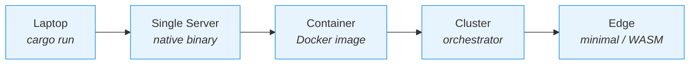
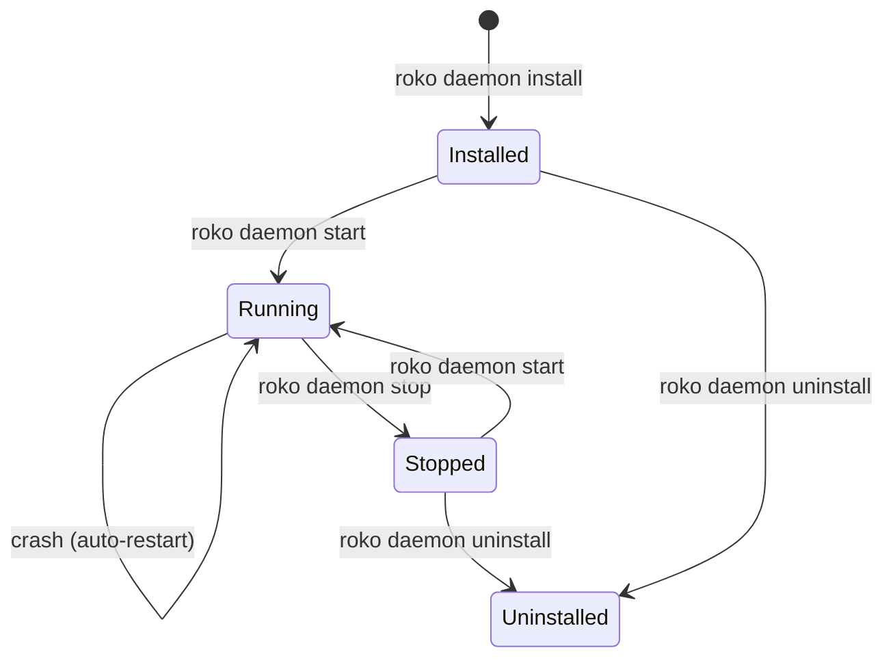

# 32 -- Deployment

> **Implementation status (2026-09):** PARTIAL -- Native builds work on all target
> triples. `roko serve` (~376 canonical routes on :6677) is wired. `roko deploy
> railway` exists. Docker images are designed but not built. Fly.io, systemd, and
> edge deployment remain specified but unimplemented.

> Packaging, distribution, and deployment of Roko across five runtime
> shapes: laptop-local, single-server, container, clustered, and edge.
> One Rust binary plus packaging artifacts; configuration selects the
> shape instead of forking the codebase. Covers native builds, Docker,
> daemon modes (launchd + systemd), cloud deployment (Fly.io, Railway),
> secret management, production hardening, observability, and the full
> release pipeline from source to installable artifact.

---

## 1. Deployment Shape Model

Roko produces the same binary for every shape. The deployment shape is
a packaging and configuration choice, not a code branch:

| Shape | Typical profile | How it runs |
|---|---|---|
| laptop-local | `laptop` | `cargo run -p roko-cli`, developer machine |
| single-server | `single-server` | Native binary or daemon on a VPS/bare metal |
| container | `container` | Docker image, volume, probes, env wiring |
| clustered | `clustered` | Repeatable node image behind an orchestrator |
| edge | `edge` | Minimal binary or WASM module on constrained devices |

The container shape is intentionally boring: one image, one config
layer, one volume layout, and the same observability contract everywhere.



### Deployment CLI commands

| Command | What it does |
|---|---|
| `roko deploy railway` | Deploy to Railway (generates project, sets secrets, deploys) |
| `roko deploy fly` | Deploy to Fly.io (creates app, volume, deploys) |
| `roko deploy docker` | Generate Docker deploy bundle (Dockerfile + .env + README) |
| `roko daemon install` | Install platform-native daemon (launchd on macOS, systemd on Linux) |
| `roko daemon start` | Start the installed daemon |
| `roko daemon stop` | Stop the running daemon |
| `roko daemon status` | Show daemon state (PID, uptime, subscriptions) |
| `roko daemon logs` | Tail daemon logs |
| `roko worker` | Run as a deployed worker (reads template from env, listens on $PORT) |

**Source crates:**

| Crate | Path | Role |
|---|---|---|
| `roko-cli` | `crates/roko-cli/` | CLI entry point, daemon mode, worker mode, deploy commands |
| `roko-serve` | `crates/roko-serve/` | HTTP control plane (~376 canonical routes on :6677), deploy backends |
| `roko-agent-server` | `crates/roko-agent-server/` | Per-agent HTTP sidecar (14 routes) |

---

## 2. Toolchain Requirements

Roko requires **Rust 1.91+** due to alloy dependencies (Ethereum
primitives). The green 2026-08-16 release checkpoint used rustc 1.96.1.

```bash
rustup update stable          # Ensure 1.91+ for alloy deps
cargo build --workspace
cargo test --workspace
cargo clippy --workspace --no-deps -- -D warnings
```

Pre-commit checks are mandatory before any commit:

```bash
cargo +nightly fmt --all                              # Format (nightly, matches CI)
cargo clippy --workspace --no-deps -- -D warnings     # Lint (must pass clean)
cargo test --workspace                                # Tests (must pass)
```

---

## 3. Native Builds (x86_64 and aarch64)

### Supported architectures

| Target Triple | OS | Arch | Linking | Primary Use |
|---|---|---|---|---|
| `x86_64-apple-darwin` | macOS | Intel | dynamic (libc) | Developer laptops (older Macs) |
| `aarch64-apple-darwin` | macOS | Apple Silicon | dynamic (libc) | Developer laptops (M1-M4) |
| `x86_64-unknown-linux-gnu` | Linux | Intel | dynamic (glibc) | Servers, CI, Docker (glibc) |
| `aarch64-unknown-linux-gnu` | Linux | ARM64 | dynamic (glibc) | ARM servers (Graviton, Ampere) |
| `x86_64-unknown-linux-musl` | Linux | Intel | static (musl) | Docker slim images, scratch containers |
| `aarch64-unknown-linux-musl` | Linux | ARM64 | static (musl) | Docker slim images, ARM containers |

Musl targets produce fully static binaries with no runtime libc
dependency. These are used for Docker slim images and prebuilt
binaries distributed via GitHub Releases.

### Release profile

```toml
[profile.release]
opt-level = 3
lto = "thin"        # Thin LTO: balance of compile time and binary size
codegen-units = 1   # Single codegen unit for maximum optimization
strip = true        # Strip debug symbols from release binaries
panic = "abort"     # Smaller binaries, no unwinding overhead
```

### Binary sizes (approximate, release + strip + LTO)

| Binary | Size | Notes |
|---|---|---|
| `roko-cli` | ~25-35 MB | Full CLI with TUI, all gates, all backends |
| `roko-serve` | ~20-30 MB | HTTP API server, no TUI |

### Cross-compilation

```bash
# Using cargo-zigbuild (preferred, no Docker required)
cargo zigbuild --release --target x86_64-unknown-linux-musl -p roko-cli
cargo zigbuild --release --target aarch64-unknown-linux-musl -p roko-cli

# Using cross (Docker-based, pre-configured toolchains)
cross build --release --target x86_64-unknown-linux-musl -p roko-cli
```

### Installation from source

```bash
git clone https://github.com/nunchi/roko.git
cd roko
cargo build --workspace --release
cargo install --path crates/roko-cli
```

Verify the build:

```bash
cargo run -p roko-cli -- --version
cargo run -p roko-cli -- doctor
```

The `roko doctor` subcommand verifies the installation environment:
config files, API keys, gateway connectivity, index health, and git
availability.

### Memory usage

| Scenario | RSS (approx.) |
|---|---|
| roko-cli idle (after init) | ~50 MB |
| roko-cli running 4 agents | ~200-400 MB |
| roko-cli running 8 agents | ~400-800 MB |
| roko-serve idle | ~40 MB |

Memory scales primarily with the number of concurrent agents (each
holds context in memory) and the size of the code index (tree-sitter
ASTs + HDC fingerprints + symbol graph).

---

## 4. Packaging and Distribution

### Distribution channels

| Channel | roko-cli | roko-serve |
|---|---|---|
| `cargo install` | Yes | Yes |
| `cargo binstall` | Yes | Yes |
| Homebrew | Yes | Yes |
| GitHub Releases (prebuilt) | Yes | Yes |
| Docker (ghcr.io) | Yes | Yes |

### crates.io publishing

The workspace contains 39 members. Most are internal. Publish only
user-facing binaries and key shared libraries:

| Crate | crates.io name | Why publish |
|---|---|---|
| `roko-cli` | `roko-cli` | Main user-facing binary |
| `roko-serve` | `roko-serve` | HTTP API server |
| `roko-core` | `roko-core` | Signal + 12 traits, types, config |
| `roko-std` | `roko-std` | Default trait implementations |
| `roko-agent` | `roko-agent` | LLM backends, tool dispatch, MCP |
| `roko-gate` | `roko-gate` | Verification pipeline (19 gates) |
| `roko-compose` | `roko-compose` | Prompt assembly, context engineering |
| `roko-primitives` | `roko-primitives` | HDC vectors, Hamming similarity |

Workspace default is `publish = false` in root `Cargo.toml`. Published
crates override with `publish = true`. Independent versioning per crate.

### Publish order

crates.io requires dependencies before dependents:

1. `roko-primitives` (zero internal deps)
2. `roko-core` (depends on `roko-primitives`)
3. `roko-std`, `roko-agent`, `roko-gate`, `roko-compose` (depend on core)
4. `roko-cli`, `roko-serve` (depend on the above)

Dual-source pattern in each `Cargo.toml`:

```toml
[dependencies]
roko-core = { version = "0.3", path = "../../crates/roko-core" }
```

### Release pipeline: release-plz + cargo-dist + git-cliff

```
push to main
  -> release-plz detects changes
  -> opens Release PR with version bumps + changelog
  -> merge PR
  -> release-plz publishes to crates.io + creates git tags
  -> cargo-dist builds binaries + creates GitHub Release + updates Homebrew tap
```

Each package gets its own tag: `roko-cli-v1.2.0`, `roko-core-v0.3.0`.
Each tag triggers a separate GitHub Release with platform-specific
binaries.

**Configuration files:**

- `release-plz.toml` -- workspace changelog, package-level publish rules,
  version groups for tightly-coupled crates
- `cliff.toml` -- conventional commit parsing for changelogs
- `dist-workspace.toml` -- cargo-dist targets, installers, supply chain
  settings

### cargo-dist configuration

```toml
[dist]
cargo-dist-version = "0.31.0"
ci = "github"
targets = [
    "x86_64-unknown-linux-gnu",
    "x86_64-unknown-linux-musl",
    "aarch64-unknown-linux-gnu",
    "aarch64-unknown-linux-musl",
    "x86_64-apple-darwin",
    "aarch64-apple-darwin",
]
installers = ["shell", "powershell", "homebrew"]
tap = "nunchi/homebrew-roko"
install-path = "~/.cargo/bin"
install-updater = true
sbom = true
github-attestations = true
github-actions-pinning = true
```

### Homebrew

```bash
brew tap nunchi/roko
brew install roko-cli
brew install roko-serve
```

### Shell completions

All tools use `clap_complete` for shell completions:

```bash
roko completions bash > ~/.local/share/bash-completion/completions/roko
roko completions zsh > ~/.zfunc/_roko
roko completions fish > ~/.config/fish/completions/roko.fish
```

### Self-update via axoupdater

axoupdater (cargo-dist companion) uses install receipts to detect
updates. Soft notification on startup, explicit `roko update`
subcommand for applying updates.

### cargo binstall support

```toml
[package.metadata.binstall]
pkg-url = "{ repo }/releases/download/roko-cli-v{ version }/roko-cli-{ version }-{ target }.tar.gz"
bin-dir = "roko-cli-{ version }-{ target }/{ bin }{ binary-ext }"
pkg-fmt = "tgz"
```

Downloads prebuilt binary instead of compiling -- approximately 10
seconds instead of 3+ minutes.

### Supply chain security

| Layer | Tool | What it checks |
|---|---|---|
| Source dependencies | cargo-deny | Licenses, advisories, bans |
| Audit trail | cargo-vet | Human audit attestations |
| Binary composition | cargo-auditable | Embedded dep manifest |
| Release artifacts | CycloneDX SBOM | Full dependency tree |
| Binary authenticity | Sigstore/cosign | Keyless signing + Rekor log |
| Build provenance | SLSA attestation | Source-to-binary traceability |

CI enforcement:

```yaml
- name: cargo deny
  uses: EmbarkStudios/cargo-deny-action@v2
  with:
    command: check all

- name: cargo vet
  run: cargo vet check
```

All release binaries are signed using Sigstore's keyless signing via
GitHub Actions OIDC. Users verify downloaded binaries:

```bash
cosign verify-blob roko-cli-0.3.0-x86_64-unknown-linux-musl.tar.gz \
  --bundle roko-cli-0.3.0-x86_64-unknown-linux-musl.tar.gz.sigstore.json \
  --certificate-identity="https://github.com/nunchi/roko/.github/workflows/release.yml@refs/tags/roko-cli-v0.3.0" \
  --certificate-oidc-issuer="https://token.actions.githubusercontent.com"
```

---

## 5. Docker Deployment

Docker is the packaging layer for the container shape, not a fork of
the runtime. The same binary powers all shapes.

### Image registry and naming

Images are published to GitHub Container Registry (`ghcr.io`):

```
ghcr.io/nunchi/roko-cli:latest
ghcr.io/nunchi/roko-cli:0.3.0
ghcr.io/nunchi/roko-cli:0.3.0-full
ghcr.io/nunchi/roko-serve:latest
```

### Two image variants

**Slim images** -- statically linked binary, minimum runtime deps.
Production default.

| Base | Size | Shell | Use case |
|---|---|---|---|
| `gcr.io/distroless/cc-debian12` | small | No | Dynamic slim images |
| `cgr.dev/chainguard/static` | smaller | No | Static binaries |
| `scratch` | smallest | No | Absolute minimum for musl builds |

**Full images** -- add `tmux`, `ttyd`, and a web terminal entrypoint for
demos, debugging, and controlled shared servers.

### Slim Dockerfile: roko-cli

```dockerfile
FROM debian:trixie-slim

RUN apt-get update \
    && apt-get install -y --no-install-recommends ca-certificates git curl \
    && rm -rf /var/lib/apt/lists/*

RUN useradd -m -s /bin/bash -d /data roko \
    && mkdir -p /data/.roko/state /data/.roko/prd \
    && chown -R roko:roko /data

COPY target/x86_64-unknown-linux-musl/release/roko-cli /usr/local/bin/roko

USER roko
WORKDIR /data
EXPOSE 8080
ENV RUST_LOG=info
ENTRYPOINT ["roko"]
CMD ["plan", "run", "--port", "8080", "--bind", "0.0.0.0"]
```

### Slim Dockerfile: roko-serve

```dockerfile
FROM debian:trixie-slim

RUN apt-get update \
    && apt-get install -y --no-install-recommends ca-certificates \
    && rm -rf /var/lib/apt/lists/*

RUN useradd -m -s /bin/bash roko

COPY target/x86_64-unknown-linux-musl/release/roko-serve /usr/local/bin/roko-serve

USER roko
EXPOSE 8080
ENV RUST_LOG=info
ENTRYPOINT ["roko-serve"]
CMD ["--port", "8080", "--bind", "0.0.0.0"]
```

### Directory structure

```
docker/
  roko-cli.Dockerfile
  roko-cli-full.Dockerfile
  roko-serve.Dockerfile
  roko-serve-full.Dockerfile
  entrypoints/
    roko-cli.sh
    roko-serve.sh
  docker-compose.yml
  docker-compose.dev.yml
```

### docker-compose.yml

Provides the local packaging bundle for laptop-local and single-server
testing:

- Service containers reuse the same profile logic as production
- Shared volume gives durable state directory
- Health checks use `/readyz` (same contract as Fly.io, Kubernetes)
- Port mapping avoids conflicts when running multiple services locally

### State and observability

Container deployments rely on a mounted state directory, usually
`/var/lib/roko`:

- `roko state export <archive>` captures substrate state, bus queues,
  and config
- `roko state import <archive>` restores the same bundle elsewhere
- Structured logs go to stderr by default
- `/metrics` exposes Prometheus-compatible metrics (target-state)
- `/healthz` and `/readyz` match orchestrator probes
- OpenTelemetry can be enabled through standard environment variables

### Build strategy

The preferred CI path cross-compiles the Rust binary first via
cargo-zigbuild, then copies it into the image. This keeps Docker builds
small, reproducible, and independent of the Rust toolchain inside the
final image. cargo-chef can be used for dependency caching when
in-Docker builds are needed.

---

## 6. Daemon Mode: launchd (macOS)

On macOS, Roko runs as a persistent background daemon managed by
launchd. The `roko daemon install` command generates a launchd plist,
installs it to `~/Library/LaunchAgents/`, and starts the service.

**Source:** `crates/roko-cli/src/daemon.rs`, `crates/roko-cli/src/daemon/launchd.rs`

### Overview

Daemon mode transforms Roko from a CLI tool into a persistent
background service that:

- Watches repositories for changes (filesystem events, git push
  webhooks, cron schedules)
- Triggers plan execution automatically when PRDs change or on schedule
- Maintains state across reboots (launchd restarts it automatically)
- Accepts commands via a Unix domain socket IPC interface
- Streams events to connected clients (TUI, web dashboard, CI hooks)

### Daemon lifecycle



### The `roko daemon` subcommand

```
roko daemon [COMMAND]

Commands:
  install      Generate launchd plist and load it (starts on login)
  uninstall    Unload and remove launchd plist
  start        Start the daemon (if installed but not running)
  stop         Stop the daemon
  restart      Stop and start the daemon
  status       Show daemon status (running, PID, uptime, subscriptions)
  logs         Tail daemon logs (stdout + stderr)
  send <cmd>   Send a command to the running daemon via IPC
```

### launchd plist

Generated plist lives at `~/Library/LaunchAgents/dev.nunchi.roko.plist`.
Uses user-level LaunchAgents directory (no root required).

Key configuration:

- `RunAtLoad = true` -- starts on login
- `KeepAlive.SuccessfulExit = false` -- restarts on crash, not clean exit
- `ThrottleInterval = 10` -- minimum 10 seconds between restart attempts
- Logs to `~/.local/state/roko/daemon.stdout.log` and
  `~/.local/state/roko/daemon.stderr.log`
- `Nice = 5` -- slightly lower priority than interactive processes
- File descriptor limit raised to 4096

### IPC: Unix domain socket

The daemon exposes a Unix domain socket for command-and-control. The
protocol is newline-delimited JSON using the `DaemonCmd` enum:

```rust
#[derive(Debug, Clone, Serialize, Deserialize)]
#[serde(tag = "cmd", rename_all = "snake_case")]
pub enum DaemonCmd {
    Status,
    Stop,
    Restart,
    Reload,
    ListSubscriptions,
    PauseSubscription { id: String },
    ResumeSubscription { id: String },
}
```

### Environment variables

launchd runs daemons in a minimal environment. The `roko daemon install`
command detects environment variables from the current shell and includes
relevant ones in the plist: `ANTHROPIC_API_KEY`, `OPENAI_API_KEY`,
`RUST_LOG`, `HOME`, `PATH`. Sensitive keys can alternatively be read
from the macOS Keychain at runtime.

### Log management

- Maximum log file size: 10MB
- Rotation: rename to `.log.1`, `.log.2`, `.log.3`
- Total maximum disk usage for logs: ~40MB

### Graceful shutdown

On SIGTERM (from `launchctl unload` or `roko daemon stop`):

1. Stop accepting new tasks
2. Drain running tasks (up to 30 seconds)
3. Save state (subscription states, pending events)
4. Close IPC socket and clean up socket file
5. Exit cleanly (exit 0)

---

## 7. Daemon Mode: systemd (Linux)

On Linux, Roko runs as a persistent background daemon managed by
systemd. Identical functionality to the macOS launchd path.

**Source:** `crates/roko-cli/src/daemon/systemd.rs`

### systemd user unit file

Generated at `~/.config/systemd/user/roko.service`. Uses user-level
systemd instance (no root required).

```ini
[Unit]
Description=Roko cognitive agent daemon
Documentation=https://github.com/nunchi/roko
After=network-online.target
Wants=network-online.target

[Service]
Type=simple
ExecStart=/home/USERNAME/.cargo/bin/roko daemon run \
    --socket %t/roko-daemon.sock

Restart=on-failure
RestartSec=10
RestartMaxDelaySec=300
RestartSteps=5

Environment=RUST_LOG=info
EnvironmentFile=-%h/.config/roko/daemon.env

LimitNOFILE=4096

NoNewPrivileges=true
ProtectSystem=strict
ProtectHome=read-only
ReadWritePaths=%h/.roko %h/.local/state/roko %h/.config/roko
PrivateTmp=true

WatchdogSec=60

[Install]
WantedBy=default.target
```

### Key configuration choices

- `Restart=on-failure` with exponential backoff (10s to 5m)
- `%t/roko-daemon.sock` expands to `$XDG_RUNTIME_DIR` (typically
  `/run/user/1000`)
- `EnvironmentFile=-%h/.config/roko/daemon.env` loads API keys (the
  `-` prefix means ignore if absent)
- Security hardening: `NoNewPrivileges`, `ProtectSystem=strict`,
  `ProtectHome=read-only`, `PrivateTmp`
- `WatchdogSec=60` -- daemon must ping systemd every 60 seconds via
  `sd_notify`

### Log management via journald

systemd's journald handles rotation, compression, and retention:

```bash
roko daemon logs                           # Tail logs
roko daemon logs --lines 100               # Last 100 lines
journalctl --user-unit roko.service -f     # Direct journalctl access
journalctl --user-unit roko.service -o json # JSON output for parsing
```

Structured logging via `tracing-journald` emits metadata fields
queryable in journalctl.

### Lingering for headless servers

```bash
loginctl enable-linger $USER
```

Required for persistent daemon operation on servers without active
login sessions.

### Comparison: launchd vs systemd

| Feature | launchd (macOS) | systemd (Linux) |
|---|---|---|
| Unit file location | `~/Library/LaunchAgents/` | `~/.config/systemd/user/` |
| Start on login | `RunAtLoad = true` | `WantedBy=default.target` + enable |
| Restart on crash | `KeepAlive.SuccessfulExit = false` | `Restart=on-failure` |
| Restart backoff | `ThrottleInterval` (flat) | `RestartSec` + exponential |
| Logs | Custom log files | journald (built-in rotation) |
| Socket path | `/tmp/roko-daemon.sock` | `/run/user/$UID/roko-daemon.sock` |
| Security hardening | Sandbox profiles (limited) | Namespaces, ProtectSystem |
| Watchdog | Not built-in | `WatchdogSec` + `sd_notify` |
| Persistent without login | Always (user agents) | Requires `loginctl enable-linger` |

---

## 8. Subscription Configuration

When Roko runs as a daemon, it monitors repositories for changes and
triggers plan execution automatically. Subscriptions are defined in
`~/.config/roko/config.toml`.

### Three trigger types

| Trigger | When it fires | Use case |
|---|---|---|
| **Cron** | Time schedule (cron expression) | Periodic builds, nightly consolidation |
| **Watch** | File changes (fsnotify) | Reactive to PRD edits, code changes |
| **Webhook** | HTTP POST arrives | GitHub push events, CI triggers |

### Configuration format

```toml
[daemon]
socket = "/tmp/roko-daemon.sock"
log_level = "info"
max_concurrent_runs = 4

[[subscriptions]]
repo = "/Users/will/dev/nunchi/roko/roko"

[subscriptions.cron]
schedule = "*/30 * * * *"
plan_dirs = ["plans/"]
changed_paths = [".roko/prd/**/*.md", "plans/**/*.toml"]

[[subscriptions]]
repo = "/Users/will/dev/project-b"

[subscriptions.watch]
paths = [".roko/prd/"]
debounce_ms = 5000

[[subscriptions]]
repo = "/Users/will/dev/project-c"

[subscriptions.webhook]
path = "/hook/project-c"
secret = "${ROKO_WEBHOOK_SECRET_C}"
```

### Per-repo overrides

Each repository can override subscription settings via its local
`.roko/config.toml`, merged on top of the global entry.

### Config merge order

```
1. Daemon defaults     ([daemon.defaults] in global config)
2. Global subscription ([[subscriptions]] entry for this repo)
3. Per-repo config     (.roko/config.toml in the repo)
4. Environment vars    (ROKO_* prefix)
```

### Changed-path filtering

When `changed_paths` is specified, the cron trigger only executes if
matching files have changed since the last successful run. The daemon
tracks last-run timestamps in
`~/.local/state/roko/subscriptions.json`.

### Debouncing

File system events arrive in bursts. The debounce timer resets on each
event and only triggers a plan run after the quiet period expires
(default: 5 seconds).

---

## 9. Multi-Repo Coordination

A single Roko daemon manages multiple repository subscriptions. Each
subscription is isolated in filesystem, process, and configuration,
but they share system resources (CPU, memory, network, API keys).

### Isolation model

- Filesystem: each repo has its own `.roko/` directory
- Process: agents spawned for repo A cannot access repo B's files
- Configuration: per-repo `.roko/config.toml` has final say
- Shared: API keys are daemon-level, all repos share rate limits

### Shared scheduler

Global limits prevent one repo from consuming all resources:

```toml
[daemon]
max_concurrent_runs = 4
max_total_agents = 8
```

### Scheduling priority

When multiple subscriptions trigger simultaneously and the pool is
full:

1. **Webhook** (highest) -- external event, time-sensitive
2. **Watch** (medium) -- file change, user actively editing
3. **Cron** (lowest) -- scheduled, can wait

Within the same priority, FIFO ordering.

### Cross-repo knowledge sharing (optional)

When Agent Mesh is enabled, repos in the same group can share
qualifying Signals through the peer-to-peer protocol. High-confidence
Insights and Heuristics transfer between repos, enabling cross-domain
pattern recognition.

---

## 10. Cloud Deployment: Fly.io

Roko services deploy to Fly.io as Firecracker microVMs with persistent
volumes, automatic TLS, private networking, auto-stop on idle, and
auto-start on request.

### Architecture

Services in the same Fly organization communicate over the private
IPv6 network (6PN) using `.internal` DNS names.

```
                +-----------------------------------------+
                |         Fly.io Organization              |
                |                                          |
                |  +-------------+   +------------------+  |
  HTTPS ------->|  | roko-serve  |<->|   roko-cli       |  |
  (public)      |  | HTTP API    |   |   orchestrator   |  |
                |  | port 8080   |   |   volume: /data  |  |
                |  +-------------+   +------------------+  |
                |        ^                                  |
                |        | .internal                        |
                |        v                                  |
                |  +------------------+                     |
                |  | roko-console     |                     |
                |  | web terminal     |                     |
                |  | port 3000        |                     |
                |  +------------------+                     |
                +-----------------------------------------+
```

### fly.toml (roko-serve)

```toml
app = "roko-serve"
primary_region = "iad"

[build]
  dockerfile = "docker/roko-serve.Dockerfile"

[env]
  RUST_LOG = "roko_serve=info"

[http_service]
  internal_port = 8080
  force_https = true
  auto_stop_machines = "stop"
  auto_start_machines = true
  min_machines_running = 0

  [http_service.concurrency]
    type = "requests"
    hard_limit = 500
    soft_limit = 250

[[http_service.checks]]
  grace_period = "10s"
  interval = "30s"
  method = "GET"
  path = "/health"
  timeout = "5s"

[[vm]]
  size = "shared-cpu-2x"
  memory = "1gb"
```

Key settings:

- `auto_stop_machines = "stop"` with `min_machines_running = 0` --
  machine stops when idle, no charges while stopped. ~2-3 second cold
  start for a Rust binary.
- Persistent Fly volumes for `.roko/` state directory.

### Deploy scripts

```bash
# deploy/scripts/fly-deploy.sh
./deploy/scripts/fly-deploy.sh all           # Deploy everything
./deploy/scripts/fly-deploy.sh roko-serve    # Deploy just the API server
```

The deploy script: creates the app if new, creates volumes if the
service needs one, then deploys with `fly deploy --remote-only`.

### Cost estimates (with auto-stop)

| Service | VM Size | Memory | Estimated Cost |
|---|---|---|---|
| roko-cli | shared-cpu-2x | 2GB | ~$3-7/mo (active hours) |
| roko-serve | shared-cpu-2x | 1GB | ~$2-5/mo (active hours) |
| console | shared-cpu-1x | 256MB | ~$1-2/mo |
| Volumes (1GB each) | -- | -- | ~$0.15/mo per volume |

Personal deployment with intermittent use: $5-15/month total.

### Custom domains

```bash
fly certs create roko-serve api.example.com
# Fly handles TLS via Let's Encrypt automatically
```

### Console service (web terminal)

A lightweight Caddy reverse proxy forwards WebSocket connections to
each service's ttyd instance over Fly's internal network, serving a
static HTML page with xterm.js that renders the terminal in the
browser.

---

## 11. Cloud Deployment: Railway

Railway deployment is supported via `roko deploy railway`. The CLI
generates the Railway project configuration, sets secrets, and deploys.

> **Note:** The `--with-mirage` flag is deprecated following the chain
> removal refactor. The mirage-rs EVM fork simulator is no longer
> bundled with the default Railway deployment. Chain/EVM integration
> remains separate product work.

The Railway deploy backend is implemented in
`crates/roko-serve/src/deploy/railway_api.rs` and
`crates/roko-serve/src/deploy/railway_cli.rs`.

### Worker mode

`roko worker` runs as a deployed worker inside a Railway (or any)
container. It reads configuration from environment variables:

- `ROKO_TEMPLATE_JSON` -- Base64-encoded agent template
- `ROKO_CONTROL_PLANE_URL` -- Optional callback URL for result
  reporting
- `ROKO_DEPLOYMENT_ID` -- Opaque callback-routing identifier
- `ROKO_WORKER_CALLBACK_TOKEN` -- Shared secret for callback auth
- `PORT` -- Listen port (Railway injects this)

**Source:** `crates/roko-cli/src/worker/mod.rs`

### Manual deploy bundle

The `roko deploy docker` command generates a deploy bundle in
`.roko/deploy-bundles/{name}/` containing a Dockerfile, `.env`, and
README. This works for any container platform (Railway, Render, AWS
ECS, etc.).

**Source:** `crates/roko-serve/src/deploy/manual.rs`

---

## 12. Secret Management

Roko handles sensitive credentials through a layered resolution
strategy that works across all deployment shapes.

### Resolution order

```
1. CLI flags         roko run --api-key sk-ant-...
       |
2. Environment       ANTHROPIC_API_KEY=sk-ant-...
       |
3. Config files      roko.toml / ~/.config/roko/config.toml
       |
4. OS keychain       macOS Keychain / Linux Secret Service
       |
5. Secret store      Vault / AWS Secrets Manager / K8s Secret
       |
6. Compiled default  fail with an actionable error message
```

### Shape-aware defaults

| Shape | Default secret source |
|---|---|
| laptop-local | OS keychain |
| single-server | OS keychain or host secret store |
| container | Env vars or `_FILE` mounts |
| clustered | External secret store |
| edge | Provider-native secret injection |

### Environment variable conventions

| Variable | Used by | Purpose |
|---|---|---|
| `ANTHROPIC_API_KEY` | roko-cli, roko-serve | Anthropic provider key |
| `OPENAI_API_KEY` | roko-cli, roko-serve | OpenAI provider key |
| `OPENROUTER_API_KEY` | roko-cli, roko-serve | OpenRouter key |
| `RUST_LOG` | all | Log level filter |
| `ROKO_*` | roko-cli | General configuration |
| `ROKO_SERVE_*` | roko-serve | Server configuration |

### .env file loading

`dotenvy` loads `.env` from the working directory:

- Look for `.env` in current directory
- Load if present
- Do not overwrite existing environment variables
- Continue silently if file is missing
- Keep `.env` gitignored

### ${VAR} interpolation in config

```toml
[agent.providers.anthropic]
api_key = "${ANTHROPIC_API_KEY}"
```

Interpolation rules: `${VAR}` resolves from env, `${VAR:-default}`
falls back, `$$` escapes a literal dollar sign.

### Docker secrets

Support the `_FILE` suffix for orchestrator-mounted secrets:

```rust
fn resolve_env_or_file(var_name: &str) -> Option<String> {
    if let Ok(val) = std::env::var(var_name) {
        return Some(val);
    }
    let file_var = format!("{var_name}_FILE");
    if let Ok(path) = std::env::var(&file_var) {
        if let Ok(val) = std::fs::read_to_string(&path) {
            return Some(val.trim().to_string());
        }
    }
    None
}
```

### Fly.io secrets

```bash
fly secrets set ANTHROPIC_API_KEY=sk-ant-... --app roko-serve
```

Secrets become environment variables inside the machine. Never stored
in `fly.toml`, image layers, or logs.

### Secret CLI

```bash
roko config secrets set anthropic.api_key
roko config secrets get anthropic.api_key
roko config secrets list
roko config secrets rotate anthropic.api_key
```

### Safety rules

1. Never log secret values
2. Never write secrets into Signal bodies or long-lived state
3. Never persist resolved secrets into `.roko/` archives
4. Keep `.env` gitignored
5. Prefer OS keychain for laptop-local use
6. Prefer `_FILE` and secret stores for container deployments

### roko doctor secret check

```
Credentials:
  ANTHROPIC_API_KEY: set [source: keychain]
  OPENAI_API_KEY: set [source: .env]
  OPENROUTER_API_KEY: not set (optional)
```

---

## 13. Remote Orchestrator (roko-serve)

`roko-serve` runs as a long-lived HTTP service, exposing the full Roko
API over HTTP. ~376 canonical routes (~421 including aliases) on :6677.

**Source:** `crates/roko-serve/src/`

### Starting the server

```bash
roko serve                         # Start on :6677
roko serve --port 8080 --bind 0.0.0.0
```

### Default port

The default serve port is **6677**. When the `PORT` environment
variable is set (as Railway and similar platforms inject), roko-serve
binds to that port instead.

### Authentication

API keys are bearer tokens with three scopes: `read`, `write`, `admin`.
Keys are stored in the server's state directory, rotatable, revocable,
and auditable.

```bash
curl -H "Authorization: Bearer roko_sk_a1b2c3d4..." \
  https://roko-serve.fly.dev/v1/status
```

Rate limits are enforced per API key using a token bucket algorithm.

### Real-time streaming

```
GET    /projections/:name             # Query projection state
GET    /projections/:name/stream      # SSE stream
WS     /ws/*                          # Bidirectional WebSocket
```

Remote clients subscribe to typed projection channels with cursor-based
resume.

### Multi-project management

One roko-serve instance manages multiple projects, each with its own
git repo, PRDs, plans, config, run history, and Signal/episode logs.
Projects are isolated.

### Cost tracking

The server tracks LLM costs per project, per run, and per API key.
Budget limits can be enforced per project or per API key:

```toml
[budgets]
max_per_run_usd = 5.00
max_per_project_daily_usd = 50.00
max_daily_usd = 200.00
```

---

## 14. WASM and Edge Deployment (Aspirational)

WASM and edge deployment are **aspirational targets** (Tier 3H / P3).
The core cognitive primitives are designed to compile to WASM, but
end-to-end validation has not been performed.

### What works in WASM

| Component | WASM Support |
|---|---|
| Signal struct, Score | Full -- pure data, serialization |
| Scorer, Router, Composer traits | Full -- pure computation |
| HDC vectors (hamming, XOR) | Full -- pure bit operations |
| Decay calculations | Full -- pure math |
| Content addressing (BLAKE3) | Full -- compiles to WASM natively |
| MemorySubstrate | Full -- in-memory BTreeMap |
| FileSubstrate | No -- requires filesystem |
| LLM backends | No -- requires HTTP/TLS |
| ProcessSupervisor | No -- requires process spawning |
| TUI | No -- requires terminal |

### Feature flags for WASM builds

```bash
cargo build --target wasm32-wasi -p roko-core \
    --no-default-features --features "serde,hdc,decay"
```

### Edge binary size budget

Target: ~500KB stripped binary. The core cognitive kernel (Signal,
Score, Scorer, Router, Composer, HDC, BLAKE3) fits in ~360KB. Apply
`opt-level = "z"`, `lto = "fat"`, `strip = true`, `panic = "abort"`
for size optimization.

### WASI Preview 2 and Component Model

WASI 0.2 support via `wasm32-wasip2` target (Rust 1.82+ Tier 2).
WIT interfaces can expose Roko's cognitive kernel as component exports
for composition with platform-specific capability providers.

### Edge use cases

- Edge scoring and pre-filtering (forward only high-novelty events)
- Local knowledge cache (MemorySubstrate)
- HDC-based similarity search at the edge (~50ns per vector comparison
  on ARM Cortex-A72)
- Offline agent with periodic sync

---

## 15. Production Hardening

### Adaptive timeouts

Use `p95 latency x 2`, clamped to 5-300 seconds. Separate timeout
histories per provider. The implementation is in `roko-agent`.

### Exponential backoff with full jitter

```
sleep = random_between(0, min(cap, base * 2^attempt))
```

Jitter prevents synchronized retry stampedes. Retryable failures are
explicit: timeouts, server errors, and rate limits. Authentication
and malformed requests are not retried.

### Per-provider concurrency control

Semaphore-based back-pressure per provider. Default limits are
profile-aware:

| Profile | Concurrency posture |
|---|---|
| laptop-local | Conservative, interactive |
| single-server | Moderate, shared-machine safe |
| container | Tuned for one instance per node |
| clustered | Horizontal scale with per-node caps |
| edge | Minimal, request-scoped |

### Context overflow handling

At ~80% context capacity, start summarizing or shedding lower-value
context. At critical usage, force eviction and continue with reduced
state.

### Graceful shutdown

1. **Stop accepting**: mark service unavailable, flip readiness to
   false
2. **Drain**: wait for in-flight requests within bounded window. For
   realtime subscribers, readiness fails before liveness so new
   subscriptions stop landing while existing clients finish or
   reconnect with their last cursor
3. **Checkpoint and exit**: flush durable state, persist executor
   progress, close transports

### Zero-downtime upgrades

- Drain traffic before terminating old process
- Resume from last checkpoint or state archive
- Rolling replacement behind load balancer for clustered deployments
- Treat container upgrades as new image + state handoff

### Health check patterns

- `/healthz` -- liveness (is the process healthy enough to stay up?)
- `/readyz` -- readiness (should traffic be sent here now?)
- During shutdown, readiness fails before liveness for clean traffic
  drain
- SSE endpoints must disable proxy buffering
- WebSocket endpoints must preserve upgrade headers through ingress

### Content-addressed dedup cache

Duplicate requests reuse cached responses when request, model, and
parameters match. Reduces cost and latency across all profiles.

### Hedged requests (future)

Send same work to multiple providers when latency matters more than
token cost. Sparingly used, only when the deployment profile can
afford duplicate work.

---

## 16. Port Allocation

| Port | Service | Protocol | Notes |
|---|---|---|---|
| 3000 | Roko Console (web terminal) | HTTPS | Caddy proxy to ttyd |
| 6677 | roko-serve HTTP API | HTTPS | Default serve port |
| 7681 | ttyd (per-service, internal) | WSS | WebSocket-to-PTY bridge |
| 8080 | roko-serve (containerized) | HTTPS | Remapped in containers |
| 8545 | mirage-rs JSON-RPC | HTTPS | Anvil-compatible EVM RPC |
| 9090 | Webhook ingress | HTTPS | GitHub/GitLab webhooks |

### Fly.io internal ports

| Internal Address | Port | Service |
|---|---|---|
| `roko-cli.internal` | 8080 | CLI orchestrator |
| `roko-serve.internal` | 8080 | HTTP API |
| `roko-console.internal` | 3000 | Web terminal |

---

## 17. Observability and Telemetry

### Current baseline

The following observability surfaces are shipped:

- JSONL episode logs (`.roko/episodes.jsonl`)
- Efficiency events (`.roko/learn/efficiency.jsonl`)
- `StateHub` + `DashboardSnapshot` path used by TUI, SSE, WebSocket,
  and REST status views
- `tracing`-based structured logs
- E33 Telemetry Lens runtime (11 built-in executors, 39 production
  variants, bounded delivery, breaker controls, restart-durable history,
  configurable 7-day retention)

### Structured logging

Default: one JSON object per line on stderr. Human-readable mode for
interactive sessions.

Required log fields: `ts`, `level`, `target`, `trace_id` (when inside
an operator boundary), `plan_id`, `task_id`, `agent_id`,
`gate` + `passed` (for verification outcomes), `usd` or token counts
(for cost-bearing actions).

| Mode | Deployment use |
|---|---|
| JSON default | containers, systemd, Fly.io, ingestion pipelines |
| human format | laptop-local sessions, incident triage |
| debug | postmortems, high-detail forensics |

### Metrics (target-state)

Prometheus-compatible `/metrics` endpoint is target-state. Key
Roko-specific metrics when implemented:

| Metric | Meaning |
|---|---|
| `roko.c_factor` | Collective intelligence health |
| `roko.bus.pulses_per_second` | Bus throughput |
| `roko.gate.pass_rate` | Gate success rate |
| `roko.substrate.query_latency_p99` | Storage latency |
| `roko.cost.usd_total` | Cumulative spend by model and role |
| `roko.cost.budget_remaining_usd` | Spend headroom |
| `roko.safety.escalations_total` | Escalation rate |

### Traces (target-state)

OpenTelemetry traces around the seven-step operator pipeline. OTLP
export for downstream collectors (Jaeger, Tempo, Honeycomb).

### Replay

Replay is observability: reconstruct what an agent saw and why it
acted using episode Signals and Pulse history.

### Cost visibility

Attributed spend: per session, per task, per role, per model, per
budget scope. The `cost_meter` projection provides the live view.

---

## 18. Multi-Tenant Safety

Shared deployments need explicit tenant boundaries:

- Scope substrate keys by tenant
- Per-tenant quotas for tokens, spend, and episode counts
- Tenant-aware auth and role checks
- Label metrics with tenant identifiers (only where cardinality is
  safe)

Isolation without separate code paths per tenant.

---

## 19. Configuration File Locations

| File | Location | Purpose |
|---|---|---|
| `roko.toml` | Project root | Per-project configuration |
| `.roko/config.toml` | Project `.roko/` dir | Per-project overrides |
| `~/.config/roko/config.toml` | XDG config | Global configuration |
| `~/.config/roko/daemon.env` | XDG config | Daemon env vars (Linux systemd) |
| `~/.local/state/roko/` | XDG state | Daemon logs, subscription state |
| `.env` | Project root | Per-project secrets (gitignored) |
| `release-plz.toml` | Workspace root | Release pipeline configuration |
| `cliff.toml` | Workspace root | Changelog generation |
| `dist-workspace.toml` | Workspace root | cargo-dist binary distribution |
| `deploy/fly/*/fly.toml` | Deploy directory | Per-service Fly.io config |
| `docker/*.Dockerfile` | Docker directory | Per-service Docker builds |
| `docker/docker-compose.yml` | Docker directory | Local development stack |

---

## 20. Implementation Status

| Feature | Status | Notes |
|---|---|---|
| Native build (x86_64, aarch64) | **Working** | 6 target triples, CI cross-compile |
| roko serve (~376 routes on :6677) | **Wired** | Full HTTP control plane |
| roko deploy railway/fly/docker | **Wired** | CLI commands, deploy backends |
| roko daemon start/stop/status/logs/install | **Wired** | launchd + systemd |
| roko worker | **Wired** | Worker mode for deployed containers |
| Worker callback authentication | **Wired** | Deployment-scoped opaque IDs |
| Docker images | **Designed** | Dockerfiles specified, not in CI |
| Release pipeline (release-plz + cargo-dist) | **Designed** | Config files specified |
| Homebrew tap | **Designed** | Depends on cargo-dist pipeline |
| WASM target | **Feature flags exist** | End-to-end validation pending |
| Edge target | **Designed** | Binary size validation pending |
| Secret management (env vars) | **Working** | roko-agent reads env vars |
| Secret management (keychain) | **Designed** | Keyring crate not wired |
| Production hardening: timeouts + backoff | **Implemented** | In roko-agent |
| Production hardening: graceful shutdown | **Partial** | ProcessSupervisor handles agents |
| Prometheus /metrics | **Target-state** | Not shipped as deployment default |
| OTLP traces | **Target-state** | Exporter not wired |
| E33 Telemetry Lens | **Complete** | 11 executors, 39 variants, durable |

---

## 21. Verification

### Build verification

```bash
cargo build --workspace --release       # All workspace members
cargo test --workspace                  # 10,300+ tests
cargo clippy --workspace --no-deps -- -D warnings
cargo build -p roko-core --no-default-features  # Minimal build works
```

### Deployment verification

```bash
roko doctor                             # Installation health check
roko doctor disk                        # Free space, stale targets
roko doctor network                     # Network reachability
roko serve                              # Start HTTP control plane
curl http://localhost:6677/health       # Health check
roko daemon install && roko daemon status  # Daemon lifecycle
```

### Docker verification

```bash
docker build -f docker/roko-cli.Dockerfile .
docker compose -f docker/docker-compose.yml up --wait
```

---

## 22. References

### v1 depth files (15 files, preserved)

| # | File | Title |
|---|---|---|
| 00 | `docs/v1/19-deployment/00-packaging-and-distribution.md` | Packaging and Distribution |
| 01 | `docs/v1/19-deployment/01-native-x86-arm.md` | Native Deployment (x86_64 and aarch64) |
| 02 | `docs/v1/19-deployment/02-wasm-browser-edge.md` | WASM Deployment (Browser and Edge) |
| 03 | `docs/v1/19-deployment/03-docker.md` | Docker Deployment |
| 04 | `docs/v1/19-deployment/04-daemon-launchd-macos.md` | Daemon Mode: launchd (macOS) |
| 05 | `docs/v1/19-deployment/05-daemon-systemd-linux.md` | Daemon Mode: systemd (Linux) |
| 06 | `docs/v1/19-deployment/06-cloud-fly-io.md` | Cloud Deployment: Fly.io |
| 07 | `docs/v1/19-deployment/07-edge-embedded.md` | Edge and Embedded Deployment |
| 08 | `docs/v1/19-deployment/08-subscription-configuration.md` | Subscription Configuration |
| 09 | `docs/v1/19-deployment/09-multi-repo-coordination.md` | Multi-Repo Coordination |
| 10 | `docs/v1/19-deployment/10-secret-management.md` | Secret Management |
| 11 | `docs/v1/19-deployment/11-remote-orchestrator.md` | Remote Orchestrator |
| 12 | `docs/v1/19-deployment/12-production-hardening.md` | Production Hardening |
| 13 | `docs/v1/19-deployment/13-current-status-and-port-allocation.md` | Current Status and Port Allocation |
| 14 | `docs/v1/19-deployment/14-observability-and-telemetry.md` | Observability and Telemetry |

### Source crates

| Crate | Path |
|---|---|
| roko-cli (daemon, worker, deploy commands) | `crates/roko-cli/src/` |
| roko-cli daemon (IPC, plist, systemd) | `crates/roko-cli/src/daemon.rs`, `crates/roko-cli/src/daemon/` |
| roko-cli worker (deployed container mode) | `crates/roko-cli/src/worker/` |
| roko-serve (HTTP control plane, deploy backends) | `crates/roko-serve/src/` |
| roko-serve deploy (Railway, manual) | `crates/roko-serve/src/deploy/` |
| roko-agent-server (per-agent sidecar) | `crates/roko-agent-server/` |

### Cross-references

| Topic | Document |
|---|---|
| Graph execution engine | `docs/v3/04-EXECUTION.md` |
| Agent dispatch | `docs/v3/05-AGENT.md` |
| Gate pipeline | `docs/v3/07-GATES.md` |
| Safety and trust | `docs/v3/12-SAFETY.md` |
| Telemetry Lens (E33) | `docs/v3/16-COORDINATION.md` |
| Configuration system | CLAUDE.md `roko config` CLI reference |
