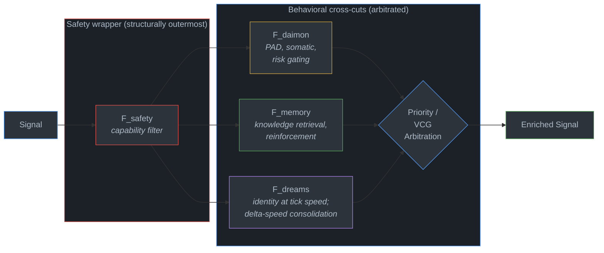
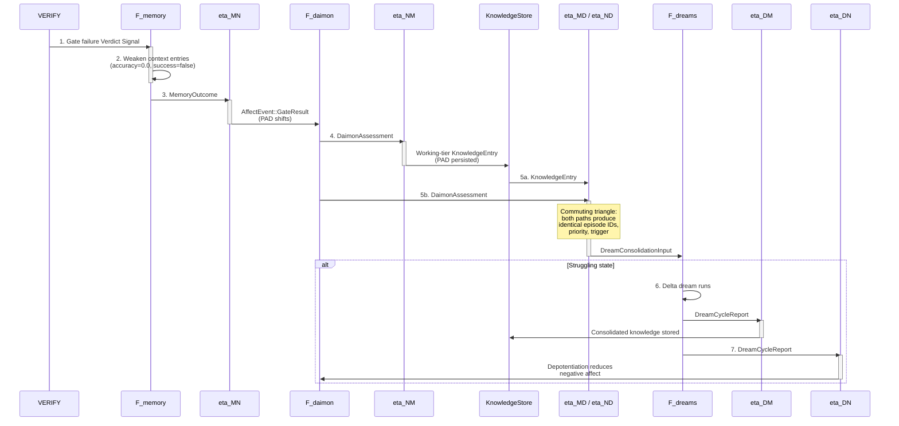

# 33 -- Cross-Cut Functors

> Four cognitive cross-cuts -- Memory, Daimon, Dreams, Safety -- are **endofunctors
> F: Signal -> Signal** that transform the agent's cognitive loop from the side. They do
> not occupy positions in the 7-step sequence (Sense, Assess, Compose, Act, Verify,
> Persist, React). They modify it. Six natural transformations connect the first three
> into a fully connected triangle. Safety is structurally outside VCG arbitration and
> cannot be outbid. The production abstraction is a generic signal-bundle enrichment
> adapter that does not depend on a concrete Cell type.

> **Implementation status (2026-09):** COMPLETE (E44 8/8). `roko-compose` provides
> `CrossCutFunctor`, `EnrichedCell`, Memory/Daimon/Dreams/Safety functors, all six
> natural transformations, priority/VCG arbitration, and the dream-output consumer.
> `roko-cli` launches the non-blocking gate-failure cascade from failed gate completions.
> Default and HDC `roko-compose` checks and `roko-cli` checks pass; focused tests cover
> composition order, live-store mutation, affect gating, dream publication, commuting
> transformations, arbitration, and safety pre-filtering.

> The Rust snippets below reflect the production API. The authoritative sources are in
> `crates/roko-compose/src/{cross_cut,memory_functor,daimon_functor,dreams_functor,
> natural_transforms,safety_functor,auction}.rs`. Conceptual names such as `MemoryCell`
> are explanatory; they are not additional runtime types.

### Implementation sources

| Surface | Authority | Shipped boundary |
|---------|-----------|-----------------|
| `LoopStep`, `CrossCutContext`, `CrossCutFunctor`, `EnrichedCell` | `crates/roko-compose/src/cross_cut.rs` | 7-step enum, context struct, async trait with pre/post enrichment, generic wrapper with forward-pre/reverse-post ordering |
| `MemoryFunctor` | `crates/roko-compose/src/memory_functor.rs` | KnowledgeStore-backed keyword + HDC retrieval, Sense/Compose injection, React reinforcement/weakening, short-circuit hint |
| `DaimonFunctor` | `crates/roko-compose/src/daimon_functor.rs` | Live `DaimonState`, PAD/somatic enrichment, tier escalation, risk deferral, prospect-theory value, short-circuit neutral-PAD predicate |
| `DreamsFunctor`, `DreamOutputConsumer` | `crates/roko-compose/src/dreams_functor.rs` | Per-tick identity passthrough, delta-speed consumer publishing to KnowledgeStore/Daimon/CascadeRouter |
| `SafetyFunctor` | `crates/roko-compose/src/safety_functor.rs` | Capability default-deny pre-filter, contract taint/tool post-filter, `wrap()` outer-position constructor, never short-circuits |
| Six transformations, `run_gate_failure_cascade` | `crates/roko-compose/src/natural_transforms.rs` | `eta_MN`, `eta_NM`, `eta_MD`, `eta_DM`, `eta_ND`, `eta_DN`, `NaturalTransformation` trait, `GateFailureCascade` evidence struct |
| `CrossCutArbitrator`, priority, VCG | `crates/roko-compose/src/auction.rs` | `CrossCutId` (Memory/Daimon/Dreams), `CrossCutRecommendation`, `resolve_by_priority`, `resolve_by_vcg`, `CrossCutArbitration` |
| Runner cascade launch | `crates/roko-cli/src/graph_task_dispatch.rs` | `arbitrate_cross_cut_routing_bias` integrates arbitration into live dispatch |

**Depends on**: [01](01-SIGNAL.md) (Signal, Pulse, demurrage, HDC fingerprint),
[02](02-CELL.md) (Cell, protocols), [03](03-GRAPH.md) (Graph composition),
[05](05-AGENT.md) (Agent lifecycle, cognitive loop), [06](06-COMPOSITION.md) (VCG auction,
SystemPromptBuilder, AttentionBidder), [09](09-MEMORY.md) (KnowledgeStore, tiers,
distillation), [10](10-DREAMS.md) (Dream cycle, consolidation),
[11](11-AFFECT.md) (PAD, Daimon, somatic markers), [12](12-SAFETY.md) (CaMeL IFC,
capability grants, AgentContract)

---

## 1. Cross-Cuts Are Not Loop Steps

The 7-step cognitive loop is a sequential pipeline:

```
SENSE -> ASSESS -> COMPOSE -> ACT -> VERIFY -> PERSIST -> REACT
```

Memory (neuro), Daimon (affect), Dreams (offline consolidation), and Safety (capability
enforcement) do not occupy positions in this sequence. They operate **orthogonally** --
each one modifies the loop's behavior from the side, touching multiple steps
simultaneously.

The precise structure: each cross-cut is an **endofunctor F: Signal -> Signal** that
transforms Signals passing through the loop. When you apply Memory enrichment to SENSE,
you are not adding a step before SENSE. You are replacing SENSE with F_memory(SENSE) --
a version of SENSE that includes knowledge retrieval.

This distinction matters for three reasons:

1. **Cross-cuts compose independently.** You can enable Memory without Daimon, or Daimon
   without Dreams. Each functor is an `Arc<dyn CrossCutFunctor>` that is optionally
   present in the `EnrichedCell` wrapper.

2. **Cross-cuts preserve the loop's topology.** Production `EnrichedCell` wraps an inner
   operation with ordered pre/post hooks; the seven-node Graph notation is the
   architectural model of that composition. No edges are added or removed.

3. **Cross-cuts can be tested independently.** Test Memory injection by running SENSE with
   and without F_memory. The `RecordingFunctor` in `cross_cut.rs` tests demonstrate this:
   they assert wrapper ordering without a real store or affect engine.

---

## 2. The Category-Theoretic Model

### 2.1 Category of Signals (Sig)

Define a category **Sig** where:

- **Objects** are typed Signal bundles (`Vec<Signal>` with a particular schema).
- **Morphisms** are Cells -- `Signal -> Signal` transformations.
- **Composition** is Graph sequencing (Cell A's output feeds Cell B's input).
- **Identity** is the pass-through Cell (`output = input`).

This satisfies the category axioms: composition is associative (Graph edge ordering is
deterministic), and the identity Cell composes neutrally. See Mac Lane (1971), *Categories
for the Working Mathematician*, Ch. I for the standard definitions.

### 2.2 Cross-Cuts as Endofunctors

An **endofunctor** F: **Sig** -> **Sig** maps objects to objects and morphisms to morphisms
within the same category, preserving composition and identity. Concretely:

- F maps each Signal bundle to an **enriched** Signal bundle: F(s) has additional
  metadata, knowledge entries, affect annotations, or filtered-out violations.
- F maps each Cell to an **enriched** Cell: F(cell) wraps the original Cell with
  pre/post hooks.

The functor laws require:
- **Identity preservation:** F(id) = id. An enrichment of the pass-through Cell must
  itself be a pass-through when the functor has nothing to contribute (the
  `should_short_circuit` optimization).
- **Composition preservation:** F(g . f) = F(g) . F(f). Enriching a composed Cell is
  equivalent to enriching each Cell individually.

The production `EnrichedCell` enforces these structurally. When a functor's
`should_short_circuit()` returns true, its pre/post hooks are identity transforms.
When multiple functors compose, they nest: the first functor in the vector is the
outermost wrapper.

### 2.3 The CrossCutFunctor Trait

From `crates/roko-compose/src/cross_cut.rs`:

```rust
#[async_trait]
pub trait CrossCutFunctor<C = CrossCutContext>: Send + Sync + 'static {
    /// Stable cross-cut identity.
    fn name(&self) -> &str;

    /// Enrich inputs before the inner operation runs.
    async fn pre_enrich(
        &self,
        input: Vec<Signal>,
        ctx: &C,
    ) -> CrossCutResult<Vec<Signal>>;

    /// Enrich outputs after the inner operation runs.
    async fn post_enrich(
        &self,
        output: Vec<Signal>,
        ctx: &C,
    ) -> CrossCutResult<Vec<Signal>>;

    /// Whether callers may omit this functor as an optimization.
    fn should_short_circuit(&self) -> bool;
}
```

The context parameter `C` defaults to `CrossCutContext`, which carries the current
`LoopStep`, plan/task identifiers, and agent role. The generic parameter exists so that
tests can substitute simpler context types.

### 2.4 The EnrichedCell Wrapper

`EnrichedCell` applies functors in a symmetric pattern: pre-hooks run in declaration
order, the inner operation runs once, then post-hooks unwind in reverse order:

```rust
pub struct EnrichedCell<C = CrossCutContext> {
    functors: Vec<Arc<dyn CrossCutFunctor<C>>>,
}

impl<C: 'static> EnrichedCell<C> {
    pub async fn execute<F, Fut>(
        &self,
        mut input: Vec<Signal>,
        ctx: &C,
        operation: F,
    ) -> CrossCutResult<Vec<Signal>>
    where
        F: FnOnce(Vec<Signal>) -> Fut,
        Fut: Future<Output = CrossCutResult<Vec<Signal>>>,
    {
        for functor in &self.functors {
            input = functor.pre_enrich(input, ctx).await?;
        }
        let mut output = operation(input).await?;
        for functor in self.functors.iter().rev() {
            output = functor.post_enrich(output, ctx).await?;
        }
        Ok(output)
    }
}
```

The first functor is therefore the outermost wrapper. When Safety is present, it is
always first, making it structurally impossible for an inner functor's output to bypass
capability checks.

### 2.5 The Four Endofunctors at a Glance

| Cross-Cut | Functor | F(Signal) | Injection Points | Priority |
|-----------|---------|-----------|------------------|----------|
| **Memory** | F_memory | Signal enriched with knowledge entries, HDC similarity scores, tier metadata, demurrage balance | SENSE (retrieval), COMPOSE (VCG bids via NeuroBidder), REACT (reinforcement/weakening) | 2 |
| **Daimon** | F_daimon | Signal annotated with PAD vector, somatic markers, behavioral state, prospect value | ASSESS (PAD/somatic injection, tier escalation), ACT (risk gating, prospect valuation) | 1 (highest) |
| **Dreams** | F_dreams | Identity at tick speed; consolidated knowledge, hypotheses, and depotentiated affect at delta speed | Delta speed only; output feeds Memory and Daimon via `DreamOutputConsumer` | 3 (lowest) |
| **Safety** | F_safety | Signal filtered by capability grants (pre) and contract taint/tool allowlist (post) | Every loop step; structurally outside VCG | N/A (pre-filter) |

### 2.6 Functor Composition Diagram



---

## 3. Memory Functor (F_memory)

### 3.1 Construction

`MemoryFunctor` wraps a shared `Arc<KnowledgeStore>` without taking ownership. It
maintains an internal map of included knowledge entry IDs per (plan, task) pair so that
REACT can reinforce or weaken precisely the entries that were in context.

```rust
pub struct MemoryFunctor {
    store: Arc<KnowledgeStore>,
    max_entries: usize,              // default: 10
    included: Mutex<HashMap<(String, String), Vec<String>>>,
    last_query_empty: AtomicBool,    // short-circuit hint
}
```

### 3.2 SENSE Enrichment

On `LoopStep::Sense`, the functor queries the knowledge store for entries matching the
current task. When the `hdc` feature is enabled, both keyword and HDC similarity retrieval
run, and results are merged by entry ID with the higher-scoring retrieval method winning.
Each match becomes an `Kind::Insight` Signal carrying the knowledge content, tier,
retrieval method, relevance score, and demurrage balance.

### 3.3 COMPOSE Enrichment

On `LoopStep::Compose`, the same retrieval runs but each result Signal is additionally
tagged as an `AttentionBidder::Neuro` recommendation. These tags --
`recommendation_source`, `decision_kind`, `decision_key`, `recommendation_confidence`,
`priority_level` -- make the entry eligible for cross-cut arbitration when it conflicts
with a Dreams recommendation.

### 3.4 REACT Feedback

On `LoopStep::React`, the post-enrichment hook checks for `Kind::GateVerdict` Signals.
If the gate passed, included entries receive gated reinforcement
(`ReinforcementSignal::Gated`), increasing their balance and confidence. If the gate
failed, included entries receive prediction-utility scoring with `accuracy = 0.0` and
batch usage recording with `success = false`, decreasing their balance and confidence.
This is the feedback loop that makes knowledge self-trimming via demurrage.

### 3.5 Short-Circuit Hint

`should_short_circuit()` returns true when the last query returned zero results *or*
the entire store is empty. This lets `EnrichedCell` callers skip the functor when there
is no knowledge to inject.

---

## 4. Daimon Functor (F_daimon)

### 4.1 Construction

`DaimonFunctor` binds to the runtime `DaimonState` through an `Arc<RwLock<DaimonState>>`.
It reads affect state for enrichment and writes back prospect-theory appraisals.
Configurable `BehavioralStateThresholds` and `SomaticRetrievalConfig` control the
sensitivity of gating decisions.

```rust
pub struct DaimonFunctor {
    state: Arc<RwLock<DaimonState>>,
    thresholds: BehavioralStateThresholds,
    somatic_config: SomaticRetrievalConfig,
}
```

### 4.2 ASSESS Pre-Enrichment

On `LoopStep::Assess`, the pre-hook injects two metadata Signals:

1. **PAD vector**: pleasure, arousal, dominance, and the current `BehavioralState`
   (one of `Engaged`, `Struggling`, `Coasting`, `Exploring`, `Focused`, `Resting`).
2. **Somatic retrieval**: blended valence and intensity from the 8-dimensional somatic
   landscape (k-d tree), neighbor and contrarian counts, and the configured 15%
   contrarian fraction. Somatic markers implement Damasio's (1994) somatic marker
   hypothesis: recall how similar decisions *felt* before engaging slow deliberation.

### 4.3 ASSESS Post-Enrichment (Tier Escalation)

After ASSESS, the post-hook checks whether the PAD state indicates high anxiety with
low agency: `arousal > 0.5` and `dominance < struggling_entry_dominance`. If so, it
injects a tier-escalation Signal requesting at minimum `T2Reflective`. This prevents
the agent from using a fast, cheap model when the affect state signals that the
situation requires more careful reasoning.

### 4.4 ACT Pre-Enrichment (Risk Gating)

On `LoopStep::Act`, the pre-hook checks whether the agent should defer high-risk
actions. The deferral condition is:

```
cautious = (behavioral_state == Struggling)
        || (pad.dominance < struggling_entry_dominance)
```

When cautious and any input Signal carries `risk_level: "high"` or `risk_level: "critical"`
(or a JSON `risk > 0.5`), the functor injects a deferral Signal tagged
`safety_critical: true` with `priority_level: 1`. This makes the deferral win any
subsequent arbitration -- Daimon safety overrides are structurally at the highest
priority level.

### 4.5 ACT Post-Enrichment (Prospect Theory)

After ACT, the post-hook applies Kahneman-Tversky prospect-theory valuation
(Tversky & Kahneman 1992) to the action outcome:

```rust
pub fn prospect_value(outcome: f64, reference: f64) -> f64 {
    let delta = outcome - reference;
    if delta >= 0.0 {
        delta.powf(PROSPECT_ALPHA)          // alpha = 0.88
    } else {
        -PROSPECT_LAMBDA * (-delta).powf(PROSPECT_ALPHA)  // lambda = 2.25
    }
}
```

The asymmetry -- losses weighted 2.25x more than equivalent gains, with diminishing
sensitivity exponent 0.88 -- matches the empirical parameters from Tversky & Kahneman
(1992). The computed prospect value drives a `DaimonState::appraise` call that shifts
the PAD vector and behavioral state for subsequent ticks.

### 4.6 Short-Circuit Hint

`should_short_circuit()` returns true when PAD is in the **neutral region**: all three
dimensions have absolute value below 0.1. This is not a named `BehavioralState` variant
-- `Neutral` does not exist in the enum. It is a predicate over the continuous PAD space.

---

## 5. Dreams Functor (F_dreams)

### 5.1 Per-Tick Identity

Unlike Memory and Daimon, the `DreamsFunctor` is a strict identity at tick speed. Its
`pre_enrich` and `post_enrich` return the input unchanged, and `should_short_circuit()`
returns true unconditionally. Dreams does not inject per-tick. It runs on its own
delta-speed schedule through the `roko-dreams` engine.

```rust
#[derive(Debug, Default, Clone, Copy)]
pub struct DreamsFunctor;
```

The functorial structure is:

```
F_dreams: Signal -> Signal
F_dreams(episode) = consolidated_knowledge | hypothesis | depotentiated_affect
```

### 5.2 DreamOutputConsumer

When the delta-speed dream engine completes a cycle, a `DreamCycleReport` is published
to the live system through `DreamOutputConsumer`. This consumer binds three live targets:

```rust
pub struct DreamOutputConsumer {
    knowledge_store: Arc<KnowledgeStore>,
    daimon: Arc<RwLock<DaimonState>>,
    cascade_router: Arc<CascadeRouter>,
    latest_routing_advice: RwLock<Option<DreamRoutingAdvice>>,
}
```

The `consume()` method applies two natural transformations:

1. **eta_DM** (Dreams -> Memory): consolidated knowledge entries are ingested into the
   durable store.
2. **eta_DN** (Dreams -> Daimon): dream affect and depotentiation update the live PAD
   state.

Additionally, dream routing advice biases the CascadeRouter for subsequent model
selection, closing the loop from offline consolidation to live dispatch.

### 5.3 The Three-Phase Dream Cycle

Dreams operates as a sub-Graph with three phases (see [10-DREAMS](10-DREAMS.md) for
the full specification):

| Phase | Cell | What It Does |
|-------|------|-------------|
| **NREM Replay** | `roko.dreams.nrem_replay` | Replays recent episodes ordered by prediction-error magnitude (Mattar & Daw 2018) |
| **REM Imagination** | `roko.dreams.rem_imagination` | HDC recombination for cross-domain analogies, counterfactual generation (Pearl 2009), emotional depotentiation (Walker & van der Helm 2009) |
| **Integration** | `roko.dreams.integration_staging` | Writes consolidated knowledge to Store and publishes depotentiated affect to Bus |

---

## 6. Safety Functor (F_safety)

### 6.1 Design Principle

Safety is the fourth endofunctor, but it operates at a fundamentally different level
from the other three. Memory, Daimon, and Dreams are **behavioral** cross-cuts -- they
influence *what the agent should do*. Safety is a **structural** cross-cut -- it
enforces *what the agent is allowed to do*. The distinction:

```
Safety:  "This tool call is not in the capability grant set. Blocked."
Daimon:  "This action is risky given current PAD state. Deferred."
```

Safety is a hard constraint. Daimon is a soft bias. They do not compete.

### 6.2 Construction

`SafetyFunctor` is constructed from the agent's `AgentContract` (role, tool allowlist,
taint ceiling) and its active `CapabilitySet`:

```rust
pub struct SafetyFunctor {
    contract: AgentContract,
    grants: CapabilitySet,
}
```

Seven capabilities are recognized: `ReadFs`, `WriteFs`, `Network`, `Shell`, `Llm`,
`Secrets`, `Bus`. Unknown or malformed capability names are denied by default.

### 6.3 Pre-Filter (Capability Enforcement)

On every loop step, the pre-hook removes any Signal that requires capabilities outside
the active grant set. Capability requirements are read from the `requires_capability`
or `required_capabilities` tag (or the equivalent JSON body fields). Multiple
capabilities can be comma/space/semicolon-separated.

If a Signal names a capability not in the recognized set, it is denied. This is
**default-deny**: the agent cannot use capabilities it was not explicitly granted.

### 6.4 Post-Filter (Contract Enforcement)

After the inner operation runs, the post-hook removes any output Signal that:

- Exceeds the contract's taint ceiling (`AgentContract::check_taint_level`), or
- Names a tool not in the contract's allowlist (`AgentContract::permits_tool`).

Both conditions must pass for a Signal to survive. Filtering emits `tracing::warn`
diagnostics rather than returning an error -- a permissive contract is not turned into
an execution failure.

### 6.5 Structural Position

Safety **never participates in VCG arbitration**. It is structurally absent from
`CrossCutId`, which contains only `Memory`, `Daimon`, and `Dreams`. Safety runs as an
outer wrapper via the `wrap()` method:

```rust
impl SafetyFunctor {
    pub fn wrap(
        self: Arc<Self>,
        inner: Vec<Arc<dyn CrossCutFunctor<CrossCutContext>>>,
    ) -> EnrichedCell {
        let mut functors: Vec<Arc<dyn CrossCutFunctor<CrossCutContext>>> = vec![self];
        functors.extend(inner);
        EnrichedCell::new(functors)
    }
}
```

The total composition is:

```
F_total = F_safety . F_arbitrated(F_memory, F_daimon, F_dreams)
```

Safety cannot be outbid. It cannot lose a vote. It is structurally prior to the
cross-cut competition. `should_short_circuit()` always returns false.

---

## 7. Natural Transformations Between Cross-Cuts

The three behavioral cross-cuts interact through **natural transformations** --
structure-preserving maps between functors (Mac Lane 1971, Ch. IV). There are six,
forming a fully connected triangle. Each is implemented as both a standalone function
(`eta_*`) and a `NaturalTransformation<Source, Target>` trait implementation.

### 7.1 The Six Transformations

| Notation | Direction | Source -> Target | Production function | What it does |
|----------|-----------|-----------------|--------------------|----|
| eta_MN | Memory -> Daimon | `MemoryOutcome -> AffectEvent` | `eta_MN()` | Gate outcomes (pass/fail, rung) become affect appraisal events |
| eta_NM | Daimon -> Memory | `DaimonAssessment -> KnowledgeEntry` | `eta_NM()` | PAD assessment persisted as a Working-tier knowledge entry with consolidation priority |
| eta_MD | Memory -> Dreams | `KnowledgeEntry -> DreamConsolidationInput` | `eta_MD()` | Knowledge provenance becomes a prioritized NREM replay input |
| eta_DM | Dreams -> Memory | `DreamCycleReport -> Vec<KnowledgeEntry>` | `eta_DM()` | Consolidated clusters, regressions, and strategy hypotheses become durable knowledge |
| eta_ND | Daimon -> Dreams | `DaimonAssessment -> DreamConsolidationInput` | `eta_ND()` | Affect state triggers delta consolidation when Struggling |
| eta_DN | Dreams -> Daimon | `DreamCycleReport -> DreamAffectInput` | `eta_DN()` | Consolidation outcomes become appraisal events with optional depotentiation |

### 7.2 The Commuting Triangle

For the system to stay consistent, the composition of transformations must commute.
The critical diagram:

```
Daimon --eta_NM--> Memory --eta_MD--> Dreams
  |                                     ^
  +-------------eta_ND-----------------+
```

The path **Daimon -> Memory -> Dreams** (the assessment is stored, then offered for
replay) must produce the same result as **Daimon -> Dreams** (PAD directly triggers
consolidation). Specifically, the two paths must agree on:

- Episode IDs eligible for replay
- Consolidation priority
- Whether to trigger a delta dream

This is verified by a focused test in `natural_transforms.rs`:

```rust
#[test]
fn daimon_memory_dreams_triangle_commutes() {
    let assessment = DaimonAssessment {
        pad: PadVector::new(-0.6, 0.8, -0.5),
        behavioral_state: BehavioralState::Struggling,
        confidence: 0.2,
        episode_id: "failed-episode".into(),
    };

    let through_memory = eta_MD(&eta_NM(&assessment));
    let direct = eta_ND(&assessment);

    assert_eq!(through_memory.episode_ids, direct.episode_ids);
    assert_eq!(through_memory.priority, direct.priority);
    assert_eq!(through_memory.trigger_delta, direct.trigger_delta);
}
```

The commutativity is structural: `eta_NM` preserves the episode ID and derives priority
from the same `consolidation_priority()` formula used by `eta_ND`. `eta_MD` reads these
from the stored entry's `source_episodes` and `confidence` fields. No arbitration is
needed to repair a mismatch after the fact.

### 7.3 NaturalTransformation Trait

Each of the six transformations also has a named struct implementing the
`NaturalTransformation<Source, Target>` marker trait:

```rust
pub trait NaturalTransformation<Source, Target> {
    fn transform(source: &Source) -> Target;
}
```

| Struct | Source | Target |
|--------|--------|--------|
| `MemoryToDaimon` | `MemoryOutcome` | `AffectEvent` |
| `DaimonToMemory` | `DaimonAssessment` | `KnowledgeEntry` |
| `MemoryToDreams` | `KnowledgeEntry` | `DreamConsolidationInput` |
| `DaimonToDreams` | `DaimonAssessment` | `DreamConsolidationInput` |
| `DreamsToMemory` | `DreamCycleReport` | `Vec<KnowledgeEntry>` |
| `DreamsToDaimon` | `DreamCycleReport` | `DreamAffectInput` |

---

## 8. Conflict Resolution: Priority + VCG

When two or more cross-cuts produce conflicting recommendations for the same decision,
the system resolves the conflict through a two-layer protocol.

### 8.1 Layer 1: Priority Hierarchy

Fixed priority ordering, applied first:

| Priority | Cross-cut | Rationale |
|----------|-----------|-----------|
| 1 (highest) | Daimon | Safety-critical behavioral gating overrides other concerns |
| 2 | Memory | Validated knowledge at Consolidated/Persistent tier overrides speculation |
| 3 (lowest) | Dreams | Dream-generated hypotheses are speculative |

The `resolve_by_priority()` function checks two conditions:

1. **Daimon safety override**: if any Daimon recommendation is marked `safety_critical`,
   it wins immediately regardless of confidence.
2. **Consolidated Memory override**: if a Memory recommendation has `knowledge_tier` at
   `Consolidated` or `Persistent` and conflicts with a Dreams recommendation, Memory wins.

If neither condition applies, the conflict falls through to VCG.

### 8.2 Layer 2: VCG Tiebreaker

When priority does not cleanly resolve the conflict, a VCG (Vickrey-Clarke-Groves)
attention auction breaks the tie. The mechanism:

1. Each cross-cut bids its truthful confidence in `[0.0, 1.0]`.
2. Only `Route` and `Compose` decisions are eligible (not `Act` -- those go to Daimon).
3. Both bidders must have confidence above 0.5.
4. Both bidders must be at the **same priority level**.
5. The highest-confidence bidder wins.
6. The winner "pays" the second-highest bid (second-price clearing).

```rust
pub enum CrossCutArbitrationResult {
    NoConflict,
    Resolved {
        winner: CrossCutId,
        recommendation: CrossCutRecommendation,
        attention_cost: f64,        // second-highest confidence
        runner_up: Option<CrossCutId>,
        mechanism: ArbitrationMechanism,  // Priority or Vcg
    },
}
```

The VCG mechanism ensures **truthful bidding**: a cross-cut gains nothing by inflating
its confidence because the price it pays (in attention cost) is determined by the
second-highest bid. This is a classical result from mechanism design (Vickrey 1961;
Clarke 1971; Groves 1973).

### 8.3 The CrossCutArbitrator

The production `CrossCutArbitrator` composes the full pipeline:

1. Run Memory, Daimon, and Dreams pre-enrichment (injecting recommendations).
2. Run Safety pre-filter (removing capability-violating Signals).
3. Parse `CrossCutRecommendation` from the surviving Signals.
4. Apply `resolve_by_priority`. If no winner, apply `resolve_by_vcg`.

Safety runs after the three advisory functors but before recommendation collection.
A forbidden recommendation is filtered before it can enter the bidding.

---

## 9. Gate-Failure Cascade

When a gate fails, the natural transformations fire in a coordinated sequence that
demonstrates how all three behavioral cross-cuts interact. The
`run_gate_failure_cascade()` function encodes the synchronous portion:



### 9.1 The Seven Steps

```
1. VERIFY emits a gate_failure Verdict Signal
       |
       v
2. F_memory(REACT): Memory weakens knowledge entries that were in context
       |   (score_prediction_utility with accuracy=0.0, batch_record_usage with success=false)
       |
       v
3. eta_MN: Knowledge outcome -> AffectEvent::GateResult
       |   (the live Daimon is appraised immediately; PAD shifts)
       |
       v
4. eta_NM: Daimon assessment -> KnowledgeEntry
       |   (PAD assessment persisted as Working-tier knowledge)
       |
       v
5. eta_MD + eta_ND: Both paths produce DreamConsolidationInput
       |   (the commuting triangle guarantees identical episode IDs,
       |    priority, and delta-trigger decisions)
       |
       v
6. If Struggling -> delta dream runs
       |   eta_DM: consolidated knowledge stored
       |
       v
7. eta_DN: depotentiation reduces negative affect from failure
```

### 9.2 Non-Blocking Runner Integration

The runner launches the cascade without blocking the event loop. On a failed gate
completion, `roko-cli` invokes `run_gate_failure_cascade` in a spawned blocking worker
(`tokio::spawn` + `spawn_blocking`). If the transformed assessment shows `Struggling`,
the worker runs a delta dream and publishes its report through `eta_DM` and `eta_DN`.
Failure within the cascade is logged without changing the gate result or blocking the
event loop.

The `GateFailureCascade` evidence struct captures the full audit trail:

```rust
pub struct GateFailureCascade {
    pub memory_outcome: MemoryOutcome,
    pub updated_pad: PadVector,
    pub daimon_assessment: DaimonAssessment,
    pub memory_path: DreamConsolidationInput,   // via eta_NM -> eta_MD
    pub direct_path: DreamConsolidationInput,    // via eta_ND
}
```

The `debug_assert_eq!` in the production code verifies that both paths produce
identical replay inputs, enforcing the commuting triangle at runtime.

---

## 10. Legacy Generic Composition

The cross-cut arbitration system operates alongside the `PromptComposer`'s own
budget-allocation strategy. The `CompositionStrategy` enum provides three modes:

| Strategy | Behavior |
|----------|----------|
| `Auto` (default) | Use `DensityGreedy` until all registered `LearningBidder`s reach the warmup observation threshold (default: 10 rounds), then switch to `Vcg` |
| `DensityGreedy` | Deterministic greedy allocation by score density -- the legacy path |
| `Vcg` | VCG-style allocation with affect modulation, payments, Pareto checks, and displacement diagnostics |

The `DensityGreedy` / `WeightedSum` path is the **legacy greedy strategy**. It sorts
candidate prompt sections by `score / tokens` (value density) and includes them
greedily until the budget is exhausted. This strategy is deterministic, requires no
learning state, and works well during cold start.

Cross-cut arbitration (`CrossCutArbitrator`) resolves conflicts *between* cross-cuts.
The composition strategy resolves allocation *within* the prompt budget. The two
mechanisms are orthogonal: a Memory recommendation can win arbitration but still lose
prompt-budget allocation to a higher-density TaskContext section.

---

## 11. Composition Order and Overhead

### 11.1 Functor Application Order

When Memory and Daimon both enrich the same loop step (e.g., ASSESS), the default
application order is:

```
ASSESS_enriched = F_daimon(F_memory(ASSESS_raw))
```

F_daimon runs after F_memory, so Daimon biases scores that already include knowledge
context. This order is intentional: Daimon's somatic markers operate on the
fully-contextualized assessment.

The total composition with Safety:

```
F_total = F_safety . F_daimon . F_memory . F_dreams
```

Since Dreams is a per-tick identity, the effective per-tick composition is:

```
F_effective = F_safety . F_daimon . F_memory
```

### 11.2 Overhead Analysis

With four functors and seven loop steps, a caller that invokes every hook has at most
56 hook calls per tick (4 functors x 7 steps x 2 phases). In practice:

- **F_memory** activates only on Sense, Compose, and React (6 hooks).
- **F_daimon** activates only on Assess and Act (4 hooks).
- **F_dreams** short-circuits always (0 effective hooks).
- **F_safety** activates on every step (14 hooks).

Maximum effective hooks per tick: **24**. Each hook is an async function that reads
from or writes to in-memory state (KnowledgeStore, DaimonState, CapabilitySet). There
are no network calls, no disk I/O beyond JSONL appends for knowledge mutations, and
no LLM invocations.

---

## 12. Feedback Loops

The architecture defines five feedback loops. E44 implements the first three; the
remaining two are tracked as design follow-ups.

| Loop | Observes | Adjusts | Status |
|------|----------|---------|--------|
| **Memory reinforcement** | Gate pass/fail with knowledge entries in context | Demurrage balance and prediction-utility: pass uses gated reinforcement; fail records unsuccessful usage | Implemented |
| **Daimon adaptation** | Gate and prospect-weighted task outcomes (lambda=2.25, alpha=0.88) | Live PAD and behavioral state; somatic retrieval keeps the configured 15% contrarian fraction | Implemented |
| **Dream prioritization** | Memory/Daimon replay inputs and completed `DreamCycleReport` | Delta-dream input, consolidated KnowledgeStore entries, Daimon depotentiation, routing advice | Implemented |
| **Arbitration calibration** | VCG outcomes correlated with downstream gate results | Future confidence discount for consistently wrong bidders | Design follow-up |
| **Safety contract evolution** | Logged safety violations and reviewed false positives | Future contract refinement; any relaxation requires manual review | Design follow-up |

---

## 13. Verification

### 13.1 Commands

```bash
# Cross-cut composition tests (including HDC path)
cargo test -p roko-compose --features hdc

# Natural transformations and gate-failure cascade
cargo test -p roko-compose -- natural_transforms

# Arbitration (priority, VCG, safety pre-filter)
cargo test -p roko-compose -- auction::tests

# Individual functor tests
cargo test -p roko-compose -- memory_functor
cargo test -p roko-compose -- daimon_functor
cargo test -p roko-compose -- dreams_functor
cargo test -p roko-compose -- safety_functor

# Full workspace (includes graph dispatch integration)
cargo test --workspace
```

### 13.2 Key Assertions

| Test | What It Verifies |
|------|-----------------|
| `enriched_cell_preserves_outer_wrapper_order` | Pre-hooks run forward, post-hooks run reverse |
| `sense_and_compose_query_real_store_with_metadata_and_neuro_bid` | Real KnowledgeStore retrieval with tier metadata and Neuro bid tags |
| `react_reinforces_passes_and_weakens_failures_in_real_store` | Gate pass increases balance; gate fail decreases balance and confidence |
| `empty_query_sets_short_circuit_hint_without_dropping_input` | Short-circuit hint set without losing input Signals |
| `losses_are_weighted_more_than_equal_gains` | Prospect-theory asymmetry: loss magnitude > 2.2x gain |
| `struggling_state_defers_high_risk_action` | Deferral Signal injected with safety_critical tag |
| `anxious_assessment_escalates_tier` | Tier-escalation Signal injected on high arousal + low dominance |
| `dreams_is_a_strict_per_tick_passthrough` | DreamsFunctor is identity at tick speed |
| `output_consumer_publishes_to_all_three_live_targets` | KnowledgeStore, Daimon, and CascadeRouter all updated |
| `capability_filter_is_deny_by_default_and_always_active` | Unknown capabilities denied; should_short_circuit is false |
| `post_filter_enforces_contract_taint_and_tool_allowlist` | Taint ceiling and tool allowlist both enforced |
| `daimon_memory_dreams_triangle_commutes` | Both paths produce identical episode IDs, priority, and trigger |
| `gate_failure_cascade_weakens_memory_and_produces_commuting_replay_inputs` | End-to-end cascade with real stores |
| `priority_layer_protects_safety_and_consolidated_memory` | Safety-critical Daimon wins; Consolidated Memory beats Dreams |
| `cross_cut_vcg_is_same_level_high_confidence_and_second_price` | VCG requires same level, confidence > 0.5; winner pays second price |
| `safety_prefilter_removes_forbidden_bid_before_collection` | Forbidden Shell recommendation filtered before arbitration |

---

## 14. References

### Category Theory

- Mac Lane, S. (1971). *Categories for the Working Mathematician*. Springer. Ch. I
  (categories), Ch. III (natural transformations), Ch. IV (functors).
- Awodey, S. (2010). *Category Theory*. 2nd ed. Oxford University Press. Accessible
  introduction to endofunctors and natural transformations.

### Affect and Decision Theory

- Mehrabian, A. (1996). "Pleasure-Arousal-Dominance: A General Framework for
  Describing and Measuring Individual Differences in Temperament." *Current Psychology*,
  14(4), 261-292.
- Tversky, A. & Kahneman, D. (1992). "Advances in Prospect Theory: Cumulative
  Representation of Uncertainty." *Journal of Risk and Uncertainty*, 5(4), 297-323.
  Lambda = 2.25, alpha = 0.88.
- Damasio, A. (1994). *Descartes' Error: Emotion, Reason, and the Human Brain*.
  Putnam. Somatic marker hypothesis.
- Gebhard, P. (2005). "ALMA -- A Layered Model of Affect." *Proc. AAMAS 2005*.
  Three-layer temporal affect dynamics.

### Dream Consolidation

- Mattar, M. G. & Daw, N. D. (2018). "Prioritized memory access explains planning
  and hippocampal replay." *Nature Neuroscience*, 21(11), 1609-1617. Prediction-error
  prioritized replay.
- Walker, M. P. & van der Helm, E. (2009). "Overnight therapy? The role of sleep in
  emotional brain processing." *Psychological Bulletin*, 135(5), 731-748. REM emotional
  depotentiation.
- Pearl, J. (2009). *Causality: Models, Reasoning, and Inference*. 2nd ed. Cambridge
  University Press. Counterfactual generation.

### Mechanism Design

- Vickrey, W. (1961). "Counterspeculation, Auctions, and Competitive Sealed Tenders."
  *Journal of Finance*, 16(1), 8-37. Second-price auctions.
- Clarke, E. H. (1971). "Multipart Pricing of Public Goods." *Public Choice*, 11(1),
  17-33. VCG mechanism for public goods.
- Groves, T. (1973). "Incentives in Teams." *Econometrica*, 41(4), 617-631. Truthful
  revelation through externality payments.

### Memory and Learning

- Kanerva, P. (2009). "Hyperdimensional Computing: An Introduction to Computing in
  Distributed Representation with High-Dimensional Random Vectors." *Cognitive
  Computation*, 1(2), 139-159. HDC similarity search.
- Semon, R. (1904). *Die Mneme*. Engram concept.

---

## Depth Files

The `docs/v3/depth/33-cross-cuts/` directory contains the following supplementary
documents:

| File | Topic |
|------|-------|
| [01-functor-model.md](depth/33-cross-cuts/01-functor-model.md) | Category-theoretic foundations: endofunctors, natural transformations, and the commuting triangle |
| [02-memory-functor.md](depth/33-cross-cuts/02-memory-functor.md) | MemoryFunctor internals: keyword/HDC retrieval, gate feedback, short-circuit |
| [03-daimon-functor.md](depth/33-cross-cuts/03-daimon-functor.md) | DaimonFunctor internals: PAD injection, somatic retrieval, tier escalation, prospect theory |
| [04-dreams-functor.md](depth/33-cross-cuts/04-dreams-functor.md) | DreamsFunctor and DreamOutputConsumer: delta-speed publication, routing advice |
| [05-safety-functor.md](depth/33-cross-cuts/05-safety-functor.md) | SafetyFunctor internals: capability parsing, contract enforcement, structural position |
| [06-arbitration.md](depth/33-cross-cuts/06-arbitration.md) | Priority hierarchy, VCG tiebreaker, CrossCutArbitrator pipeline, LearningBidder |
| [07-cascade.md](depth/33-cross-cuts/07-cascade.md) | Gate-failure cascade: 7-step sequence, non-blocking runner wiring, evidence trail |

---

## Version History

| Version | Date | Changes |
|---------|------|---------|
| 4.0 | 2026-09-15 | v3 spec: full restructure with category-theory grounding, production source cross-references, all four functors documented against shipped code, verification commands, depth file index. |
| 3.1 | 2026-08-15 | E44 implementation complete: production functors, transformations, arbitration, safety ordering, runtime cascade, canonical BehavioralState vocabulary. |
| 3.0 | 2026-04-26 | Unified spec: functorial treatment, 6 transformations, commuting triangle, VCG, Safety as 4th functor, 5 feedback loops. |
| 2.0 | 2026-04-22 | Depth doc: cross-cut-functors.md with Rust code and category theory framing. |
| 1.0 | 2026-04-18 | Initial agent runtime cross-cut design. |
