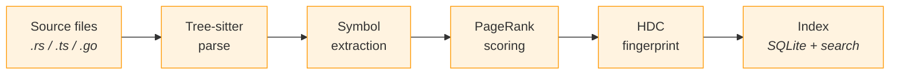
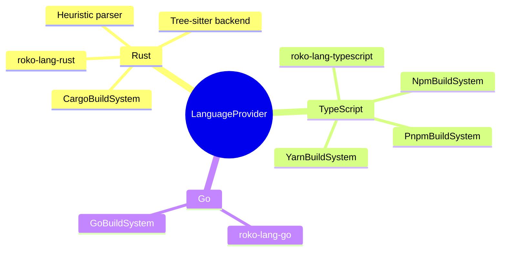

# 34 -- Code Intelligence

> Structural understanding of source code for cognitive agents. Parsing,
> symbol graphs, HDC fingerprints, context assembly, and the MCP context
> server -- powered by `roko-index`, three `roko-lang-*` providers, and
> the `roko-mcp-code` server binary.

> **Implementation status (2026-09):** `roko-index` ships 6 modules
> (parser, symbol, graph, hdc, workspace, sqlite) at ~5,822 lines with
> 88 tests. Three language providers ship (Rust at 1,387 lines with a
> feature-gated tree-sitter backend, TypeScript at 939 lines, Go at 672
> lines) totaling 104 tests across the three crates. The `roko-mcp-code`
> MCP server binary implements all 10 planned tools (2,330 lines, 16
> tests). SQLite persistence (`roko-index/sqlite`) is feature-gated and
> enabled by `roko-cli`. CLI commands (`roko index build/rebuild/search/stats`,
> `roko run-index repair`) are wired. The `WorkspaceIndex` facade in
> `roko-index/workspace` stitches parsing, graph, fingerprints, and
> search into a unified API consumed by both the MCP server and the CLI.
> Tree-sitter Rust parsing exists behind the `tree-sitter` feature flag
> in `roko-lang-rust`. Dense embeddings, rkyv snapshots, Salsa
> memoization, and additional language providers remain product residuals.

### Implementation sources

| Surface | Authority | Shipped boundary |
|---------|-----------|-----------------|
| LanguageProvider trait | `crates/roko-core/src/language.rs` | `LanguageProvider`, `Symbol`, `SymbolKind` (8 variants), `Visibility` (3 levels), `Import`, `ImportKind` |
| Parser module | `crates/roko-index/src/parser.rs` | `SourceFile`, `parse_source()` |
| Symbol module | `crates/roko-index/src/symbol.rs` | `SymbolId`, `SymbolRef`, `find_symbol()` |
| Graph module | `crates/roko-index/src/graph.rs` | `SymbolGraph`, `EdgeKind` (5: Calls, Imports, Implements, Contains, TypeRef), `build_graph()`, `pagerank()`, `personalized_pagerank()`, `weighted_pagerank()` |
| HDC module | `crates/roko-index/src/hdc.rs` | `HdcFingerprint`, `fingerprint_symbol()`, `fingerprint_file()`, `similarity()` |
| Workspace module | `crates/roko-index/src/workspace.rs` | `WorkspaceIndex`, `CodeIndex` trait, `SearchResult`, `SymbolContext`, `IndexStats`, `WorkspaceMap`, all 10 query types |
| SQLite persistence | `crates/roko-index/src/sqlite.rs` | `SqliteIndex`, `IndexStore`, schema v4, WAL mode, BLAKE3 incremental updates, `UpdateStats` |
| Rust provider | `crates/roko-lang-rust/src/lib.rs` | `RustLanguageProvider`, `CargoBuildSystem`, heuristic parser |
| Rust tree-sitter | `crates/roko-lang-rust/src/tree_sitter_parser.rs` | `TreeSitterRustProvider`, AST-based extraction (feature-gated) |
| TypeScript provider | `crates/roko-lang-typescript/src/lib.rs` | `TypeScriptLanguageProvider`, `NpmBuildSystem`, `PnpmBuildSystem`, `YarnBuildSystem` |
| Go provider | `crates/roko-lang-go/src/lib.rs` | `GoLanguageProvider`, `GoBuildSystem` |
| MCP server | `crates/roko-mcp-code/src/lib.rs` | 10 MCP tools via stdio JSON-RPC, `run()` entry point |
| CLI commands | `crates/roko-cli/src/main.rs` | `roko index build/rebuild/search/stats`, `roko run-index repair` |

---

## 1. Vision: Why Code Intelligence Matters

Coding agents powered by large language models face a fundamental constraint:
the context window is finite, but codebases are not. A 200,000-token window
sounds generous until the math is done for a real workspace. The Roko
codebase itself at ~1M lines across 39 workspace members exceeds that budget
as raw text by an order of magnitude. Agents must work with partial views,
and the quality of those partial views determines the quality of the agent's
output.

Code intelligence is the subsystem that makes those partial views excellent.
Rather than dumping files into the context window and hoping the relevant code
is somewhere in the pile, code intelligence provides structured understanding:
what symbols exist, how they relate, which ones matter most for the current
task, and how to retrieve exactly the right context at the right granularity.

### 1.1 The Context Window Problem

| Metric | Roko workspace | Typical enterprise |
|--------|---------------|-------------------|
| Lines of code | ~1M | 500K--5M |
| Estimated tokens (raw) | ~1.5M | 1.5M--15M |
| Context budget (128K model) | 128K | 128K |
| Usable for code (after prompt/history) | ~80K | ~80K |
| Coverage without intelligence | ~5% | 0.5--5% |

Without code intelligence, an agent sees at most 5% of even a modest
codebase. For enterprise codebases, that drops below 1%.

### 1.2 Blind Agent Failure Modes

When agents lack structural understanding, they exhibit predictable failures:

1. **Duplicate implementations** -- The agent writes code that already exists
   because it never saw the existing implementation. This is the single most
   common failure mode in this codebase, catalogued in `MISTAKES-LEARNED.md`
   as mistake #1.

2. **Broken dependencies** -- The agent modifies a function signature without
   knowing that dozens of call sites depend on the old signature. Impact
   analysis requires graph traversal, not text search.

3. **Misunderstood abstractions** -- The agent reimplements a capability
   because it does not understand the trait hierarchy. Understanding that
   `Gate` is a composable trait across layers requires structural
   comprehension.

4. **Token waste on irrelevant context** -- Without ranking, the agent
   includes entire files when it only needs three functions. Empirical
   measurements show that intelligent context selection reduces token
   consumption by 10x for search tasks and up to 75x for impact analysis.

### 1.3 The Niche Construction Thesis

The concept of niche construction from evolutionary biology (Odling-Smee,
Laland, and Feldman 2003) provides the theoretical foundation. In biology,
organisms actively modify their environment to improve fitness. Beavers build
dams. Earthworms transform soil chemistry. Coding agents operate analogously:
the codebase is the agent's environment; code intelligence is the mechanism by
which the agent constructs its cognitive niche -- building indexes, computing
importance scores, maintaining symbol graphs -- so that future interactions
are more productive.

This is not a metaphor. It is a design principle. The `roko-index` crate is
literally the niche construction machinery for Roko's coding agents. Every
parse, every graph edge, every HDC fingerprint is a modification to the
agent's cognitive environment that improves future performance.

### 1.4 Token Savings: Empirical Evidence

Measurements from Aider's repository map feature (Gauthier 2024) and
Meta-Harness experiments (Lee et al. 2026, arXiv:2603.28052):

| Scenario | Without intelligence | With intelligence | Savings |
|----------|---------------------|-------------------|---------|
| Code search (find relevant function) | ~50K tokens | ~5K tokens | **10x** |
| Impact analysis (who calls this?) | ~150K tokens | ~2K tokens | **75x** |
| Similar pattern finding | ~100K tokens | ~3K tokens | **33x** |
| Context for modification | ~40K tokens | ~8K tokens | **5x** |

---

## 2. The Four Pillars

`roko-index` implements four core capabilities, each building on the
previous:

| Pillar | Module | What it does | Why it matters |
|--------|--------|-------------|---------------|
| **Parsing** | `parser` | Extracts symbols and imports via `LanguageProvider` | Raw structural data |
| **Graph** | `graph` | Directed dependency graph, PageRank scoring | Understands relationships and importance |
| **Fingerprints** | `hdc` | 10,240-bit HDC vectors for structural similarity | Finds similar code without embeddings |
| **Search** | `workspace` | Hybrid search combining keyword, structural, and HDC strategies | Retrieves precisely the right context |



These pillars serve the composition system at two steps:

- **Perceive** -- Code intelligence enables queries to return not just raw
  files but parsed, ranked, similarity-scored code fragments. The agent
  perceives code structure, not text.

- **Compose** -- PageRank scores and dependency information assemble context
  windows that prioritize the most important symbols for the current task.
  Budget-aware composition means every token counts.

### 2.1 Design Principles

1. **Language-agnostic core, language-specific providers.** `roko-index`
   defines no language-specific parsing logic. All language knowledge lives
   in `LanguageProvider` implementations. Adding a new language requires only
   implementing the trait; the graph, fingerprint, and search layers work
   unchanged.

2. **Incremental by design.** BLAKE3 content hashing detects which files
   actually changed. The SQLite backend supports true incremental updates --
   only files whose content hash changed are re-indexed.

3. **Composable with the Signal architecture.** A parsed symbol can be stored
   as a Signal with `kind: CodeSymbol`. A PageRank score maps to a Signal's
   `utility` axis. An HDC fingerprint similarity maps to the `salience` axis.
   The dependency graph itself is a form of lineage tracking.

---

## 3. Parsing: The LanguageProvider Trait

### Language providers



### 3.1 The Trait Contract

All parsing in `roko-index` goes through a single trait defined in
`roko-core`:

```rust
pub trait LanguageProvider: Send + Sync {
    /// Human-readable language name (e.g., "rust", "typescript", "go").
    fn language_name(&self) -> &str;

    /// File extensions this provider handles (e.g., &["rs"], &["ts", "tsx"]).
    fn file_extensions(&self) -> &[&str];

    /// Extract import statements from source text.
    fn parse_imports(&self, source: &str) -> Vec<Import>;

    /// Extract symbol definitions from source text.
    fn extract_symbols(&self, source: &str) -> Vec<Symbol>;
}
```

The `parse_source()` function in `roko-index/src/parser.rs` delegates
entirely to the provider:

```rust
pub fn parse_source(
    path: &str,
    content: &str,
    provider: &dyn LanguageProvider,
) -> SourceFile {
    let symbols = provider.extract_symbols(content);
    let imports = provider.parse_imports(content);
    SourceFile {
        path: path.to_string(),
        language: provider.language_name().to_string(),
        content: content.to_string(),
        symbols,
        imports,
    }
}
```

### 3.2 Symbol and Import Types

From `roko_core::language`:

```rust
pub struct Symbol {
    pub name: String,
    pub kind: SymbolKind,
    pub visibility: Visibility,
    pub line: usize,        // 1-based line number
}

#[non_exhaustive]
pub enum SymbolKind {
    Function, Struct, Enum, Trait, Const, Type, Module, Impl,
}

pub enum Visibility {
    Public, Private, Crate,
}

pub struct Import {
    pub path: String,
    pub alias: Option<String>,
    pub kind: ImportKind,
}

pub enum ImportKind {
    Use, Require, Import, TypeOnly, Mod, ExternCrate,
}
```

### 3.3 Cross-Language Mapping Conventions

The type system accommodates different language paradigms through consistent
mapping:

| Language construct | Mapped SymbolKind | Rationale |
|-------------------|-------------------|-----------|
| Rust `fn` / `async fn` | `Function` | Direct |
| Rust `struct` | `Struct` | Direct |
| Rust `trait` | `Trait` | Direct |
| Rust `impl` / `impl Trait for Type` | `Impl` | Unique to Rust |
| TypeScript `class` | `Struct` | Classes = data + methods |
| TypeScript `interface` | `Trait` | Interfaces define contracts |
| TypeScript `function` | `Function` | Direct |
| Go `func` | `Function` | Methods also map here |
| Go `type X struct` | `Struct` | Direct |
| Go `type X interface` | `Trait` | Direct |
| Go uppercase name | `Visibility::Public` | Go capitalization convention |

This mapping means the graph and fingerprint layers treat symbols uniformly
regardless of source language. A Rust `trait` and a Go `interface` both
produce `SymbolKind::Trait` nodes in the dependency graph.

---

## 4. Heuristic Parsers

### 4.1 Rust: `roko-lang-rust` (902 lines, 39 tests)

The `RustLanguageProvider` implements line-by-line heuristic parsing:

**Import parsing** extracts three forms:
- `use path::to::Item;` (with brace expansion)
- `mod name;` (module declarations)
- `extern crate name;`

**Symbol extraction** recognizes:
- Functions: `fn`, `async fn`, `unsafe fn`, `const fn`, `pub fn`,
  `pub(crate) fn`
- Structs: `struct Name`
- Enums: `enum Name`
- Traits: `trait Name`
- Impls: `impl Name`, `impl Trait for Type`
- Constants: `const NAME`
- Type aliases: `type Name`
- Modules: `mod name`

**Visibility handling** parses `pub`, `pub(crate)`, and `pub(super)` prefixes.
Angle bracket skipping handles generic type parameters.

**Build system**: `CargoBuildSystem` implementation.

**Known limitations**: Cannot parse nested function definitions, multi-line
signatures where `fn` and the name are on different lines, macro-generated
code, or `#[cfg]`-gated items.

### 4.2 TypeScript: `roko-lang-typescript` (939 lines, 33 tests)

The `TypeScriptLanguageProvider` handles TypeScript and JavaScript:

**Import parsing** extracts:
- ES module imports: `import { X } from "path"`, `import X from "path"`,
  `import * as X from "path"`
- Type-only imports: `import type { X } from "path"`
- CommonJS requires: `const X = require("path")`

**Symbol extraction** recognizes:
- Functions, classes (mapped to `Struct`), interfaces (mapped to `Trait`),
  type aliases, constants, enums, export defaults

**Build systems**: `NpmBuildSystem`, `PnpmBuildSystem`, and `YarnBuildSystem`.

**Known limitations**: Cannot parse destructured exports, dynamic `import()`
calls, or JSX/TSX component definitions.

### 4.3 Go: `roko-lang-go` (672 lines, 25 tests)

The `GoLanguageProvider` handles Go:

**Import parsing** extracts single, grouped, and aliased imports.

**Symbol extraction** recognizes functions, methods (via receiver), structs,
interfaces, constants, and variables.

**Visibility convention**: Go capitalization -- uppercase names are public,
lowercase are private.

**Build system**: `GoBuildSystem`.

**Known limitations**: Cannot parse function types, build tags, or generated code.

---

## 5. Tree-Sitter Parsing

### 5.1 What Tree-Sitter Provides

Tree-sitter (Brunsfeld 2018) is an incremental parsing framework that
generates parsers from grammar specifications. It provides:

1. **Concrete Syntax Trees** -- Lossless CST with named and anonymous nodes.
   The `node.named_child()` API filters to named-only traversal.

2. **Incremental updates** -- When source text changes, tree-sitter re-parses
   only the affected regions. A single-character edit re-parses in
   microseconds. The algorithm (based on Wagner and Graham 1998) reuses
   unchanged subtrees.

3. **Error-tolerant parsing** -- Always produces a valid tree via `ERROR` and
   `MISSING` nodes. Never fails with an exception. Critical for coding agents
   that frequently work with incomplete code.

4. **GLR error recovery** -- Forks the parse stack into up to 6 concurrent
   branches, each attempting a different recovery strategy. Adaptive
   convergence prunes branches as valid nodes accumulate past the error site.

5. **Consistent API** across 300+ supported language grammars.

### 5.2 Current Tree-Sitter Implementation

The `TreeSitterRustProvider` in `crates/roko-lang-rust/src/tree_sitter_parser.rs`
(485 lines, 7 tests) is a working implementation behind the `tree-sitter`
feature flag:

```rust
pub struct TreeSitterRustProvider;

impl LanguageProvider for TreeSitterRustProvider {
    fn language_name(&self) -> &str { "rust" }
    fn file_extensions(&self) -> &[&str] { &["rs"] }

    fn parse_imports(&self, source: &str) -> Vec<Import> {
        let Some(tree) = parse_source(source) else { return Vec::new() };
        let mut imports = Vec::new();
        collect_imports(tree.root_node(), source, &mut imports);
        imports
    }

    fn extract_symbols(&self, source: &str) -> Vec<Symbol> {
        let Some(tree) = parse_source(source) else { return Vec::new() };
        let mut symbols = Vec::new();
        collect_symbols(tree.root_node(), source, &mut symbols);
        symbols
    }
}
```

The implementation handles:
- All symbol kinds (functions, structs, enums, traits, consts, types,
  modules, impl blocks)
- Impl blocks with trait names (`impl Display for Foo`)
- Methods within impl bodies via recursive `collect_impl_methods()`
- Visibility modifiers
- `use` declarations with brace expansion and wildcards
- `mod` declarations and `extern crate`
- Graceful error recovery (parse errors do not prevent extraction of
  valid regions)

A parity test verifies that tree-sitter extracts at least as many symbols
as the heuristic parser for standard cases.

### 5.3 What Tree-Sitter Enables Beyond Heuristics

| Capability | Heuristic | Tree-sitter |
|-----------|-----------|-------------|
| Nested function definitions | Missed | Captured at correct scope |
| Multi-line signatures | Fragile | Robust |
| Macro-generated items | Invisible | Visible (if expanded) |
| Scope-aware symbol lookup | Impossible | Natural via AST traversal |
| Call graph extraction | Impossible | Via function call node traversal |
| `impl Trait for Type` edges | Partial | Complete |
| Error recovery | Crashes or misparses | Partial tree with ERROR nodes |
| Column-level source locations | Not tracked | Exact byte offsets |

### 5.4 Incremental Parsing Workflow

```
                    Initial Parse
  Source text --> tree_sitter::Parser --> Tree (full CST)
                                           |
                                    Store tree + hash

                    Incremental Update
  Git diff --> compute edit ranges --> tree.edit(InputEdit)
                                           |
                                  parser.parse(text, Some(old_tree))
                                           |
                                  New tree (partial re-parse)
                                           |
                                  ts_tree_get_changed_ranges(old, new)
                                           |
                                  Re-extract symbols in changed ranges only
```

The key insight: `parser.parse()` accepts an optional `old_tree`. Tree-sitter's
`ReusableNode` component checks whether old tree nodes are still valid. If
valid, the entire subtree is reused -- no lexing, no parsing. For a typical
single-function edit, this means re-parsing a few hundred bytes rather than
the entire file.

---

## 6. Symbol Extraction

### 6.1 Symbol Identification: SymbolId

`SymbolId` provides a unique identifier for a symbol within an index,
combining three components:

```rust
#[derive(Clone, Debug, PartialEq, Eq, Hash, Serialize, Deserialize)]
pub struct SymbolId {
    pub file_path: String,
    pub symbol_name: String,
    pub kind: SymbolKind,
}
```

The triple `(file_path, symbol_name, kind)` is unique because:
- Two symbols with the same name but different kinds are distinct
- Two symbols with the same name and kind in different files are distinct
- Re-indexing the same file produces the same `SymbolId` for unchanged symbols

### 6.2 Symbol References: SymbolRef

While `SymbolId` identifies where a symbol is defined, `SymbolRef`
identifies where a symbol is used:

```rust
#[derive(Clone, Debug, PartialEq, Eq, Hash, Serialize, Deserialize)]
pub struct SymbolRef {
    pub file: String,
    pub line: usize,   // 1-based
    pub column: usize,  // 0-based
}
```

### 6.3 The Extraction Pipeline

```
  Source file (path + content)
        |
  LanguageProvider.extract_symbols()
        |
  Vec<Symbol> --> SourceFile { symbols, imports, ... }
        |                           |
  SymbolId::from_symbol()    build_graph() uses symbols as nodes
        |                           |
  Graph nodes                  Import/Call/TypeRef edges
        |
  fingerprint_symbol() --> HdcFingerprint (10,240 bits)
```

---

## 7. Dependency Graph

### 7.1 SymbolGraph

A codebase is not a collection of files -- it is a graph of relationships.
The `SymbolGraph` captures these as a directed graph with dual adjacency
lists:

```rust
pub struct SymbolGraph {
    nodes: HashSet<SymbolId>,
    forward: HashMap<SymbolId, Vec<(SymbolId, EdgeKind)>>,
    reverse: HashMap<SymbolId, Vec<(SymbolId, EdgeKind)>>,
}
```

Forward edges answer "what does symbol X depend on?" Reverse edges answer
"what depends on symbol X?" Maintaining both costs 2x memory for edges but
enables O(1) lookup in either direction.

### 7.2 Edge Types

```rust
#[non_exhaustive]
pub enum EdgeKind {
    Calls,       // Function/method call
    Imports,     // use/import/require statement
    Implements,  // Trait/interface implementation
    Contains,    // Scope nesting (method in impl block)
    TypeRef,     // Type reference in signature or body
}
```

The current `build_graph()` creates `Imports` edges from parsed imports and
`TypeRef`/`Calls` edges using regex heuristics over function bodies. The
`CALL_RE` regex (`\b([A-Za-z_][A-Za-z0-9_]*)\s*\(`) identifies call sites;
the `TYPE_REF_RE` regex (`\b([A-Z][A-Za-z0-9_]*)\b`) identifies type
references. `Implements` and `Contains` edges require tree-sitter AST
analysis.

### 7.3 Graph Construction

Graph construction is a multi-phase process:

1. **Node registration** -- Every symbol in every file becomes a node.
2. **Name-to-ID lookup table** -- A reverse index maps symbol names to their
   `SymbolId`s across all files.
3. **Import edge creation** -- Import paths are matched by last segment
   against the name lookup table. Multi-separator support (`::`/`/`/`.`).
   Self-file edges are excluded.
4. **Call and TypeRef edges** -- Regex-based extraction from function bodies.

### 7.4 Graph Traversal Operations

- `neighbors(id)` -- Forward neighbors (what does this depend on?)
- `reverse_neighbors(id)` -- Reverse neighbors (what depends on this?)
- `transitive(start, max_depth)` -- BFS transitive closure with depth limit
- `all_edges()` -- All edges as `SymbolEdge` triples

### 7.5 Program Dependence Graphs

The `EdgeKind` enum is `#[non_exhaustive]` to accommodate planned PDG-style
edges:

- **ControlDep** -- Y executes conditionally based on X
- **DataFlow** -- Value flows from definition at X to use at Y

These enable program slicing (Weiser 1981) -- extracting the minimal set of
statements relevant to a computation -- which produces compact,
dependency-aware context that LLMs reason about more effectively than raw
file dumps.

---

## 8. PageRank for Symbol Importance

### 8.1 The Algorithm

Not all symbols are equally important. A core `Signal` struct imported by
30 modules matters more than a helper function used in one test file.
PageRank (Page, Brin, Motwani, and Winograd 1999) provides a principled
answer: symbols imported by many other symbols receive high scores, and
symbols imported by high-scoring symbols receive even higher scores.

```rust
pub fn pagerank(
    graph: &SymbolGraph,
    iterations: u32,
    damping: f64,
) -> HashMap<SymbolId, f64>
```

Implementation details:
- Initialization: all nodes start with equal rank `1/N`
- Geometric convergence; 20--30 iterations typically suffice
- Out-degree floor via `max(1)` prevents division by zero for dangling nodes
- `mul_add` precision for fused multiply-add

For the Roko workspace (~5K+ symbols), 30 iterations of PageRank take under
1ms.

### 8.2 Personalized PageRank

The `personalized_pagerank()` function replaces uniform teleportation with
a biased distribution. Task-mentioned symbols receive higher teleportation
probability, concentrating scores around task-relevant neighborhoods:

```rust
pub fn personalized_pagerank(
    graph: &SymbolGraph,
    seeds: &[SymbolId],
    iterations: u32,
    damping: f64,
) -> HashMap<SymbolId, f64>
```

### 8.3 Weighted PageRank

The `weighted_pagerank()` function incorporates edge weights for
task-aware ranking:

| Condition | Weight | Rationale |
|-----------|--------|-----------|
| Symbol mentioned in task prompt | 10x | Direct task relevance |
| Symbol in currently open file | 50x | Active working context |
| Recently modified symbol | 5x | Recency bias |
| Private/crate-internal symbol | 0.1x | Less cross-module relevance |
| Test file symbol | 0.5x | Tests depend on code, not reverse |

### 8.4 Interpreting PageRank Scores

| Symbol pattern | Typical PageRank | Why |
|---------------|-----------------|-----|
| Core types (`Signal`, `Error`, `Config`) | Top 1% | Imported everywhere |
| Trait definitions (`Gate`, `Scorer`) | Top 5% | Implemented by many types |
| Shared utilities (`build_graph`) | Top 10% | Called from multiple modules |
| Module-internal helpers | Bottom 50% | Few external imports |
| Dead code | Bottom 5% | Zero in-links |

### 8.5 Budget-Aware Context Allocation

```
token_budget(symbol) = total_budget * (pagerank(symbol) / sum(pagerank(included)))
```

A symbol with twice the PageRank gets twice the token budget. This ensures
the context window is dominated by the most structurally important code.

---

## 9. HDC Fingerprints for Structural Similarity

### 9.1 Mathematical Foundations

Hyperdimensional Computing (HDC) (Kanerva 2009) is a computational framework
based on the algebraic properties of high-dimensional random vectors. In
sufficiently high-dimensional spaces (thousands of bits), random vectors are
almost certainly near-orthogonal. Three operations form the algebra:

| Operation | Symbol | Implementation | Preserves |
|-----------|--------|---------------|-----------|
| **Bind** | xor | XOR | Associates two concepts (role-filler binding) |
| **Bundle** | maj | Majority vote | Creates a set-like superposition |
| **Permute** | rot | Bit rotation | Creates ordered sequences |

### 9.2 Why 10,240 Bits?

| D | Capacity | Hamming precision | Storage per vector |
|---|----------|-------------------|-------------------|
| 1,024 | ~100 items | +/-3.1% | 128 bytes |
| 4,096 | ~1,000 items | +/-1.6% | 512 bytes |
| **10,240** | **~10,000 items** | **+/-1.0%** | **1,280 bytes** |
| 65,536 | ~100,000 items | +/-0.4% | 8,192 bytes |

The 10,240-bit choice (160 u64 words) balances capacity (~10,000
distinguishable items for workspace-scale indexing), precision (+/-1.0%),
and performance (XOR + popcount over 160 words completes in ~50ns).

### 9.3 The Encoding Scheme

Each symbol's fingerprint encodes three properties:

```
fingerprint(symbol) = bind(role_vector(kind), bundle(name_vector, context_vector))
```

1. **Role vector** -- Deterministic vector from `SymbolKind`. Generated via
   FNV-1a hashing expanded through splitmix64 PRNG.
2. **Name vector** -- Character trigrams of the symbol name bundled via
   majority vote. Similar names produce similar vectors (`process_input` and
   `process_output` share 7 of 11 trigrams).
3. **Context vector** -- Derived from surrounding source text.

```rust
pub fn fingerprint_symbol(symbol: &Symbol, context: &[u8]) -> HdcFingerprint {
    let role_vec = role_vector(&symbol.kind);
    let name_vec = encode_name(&symbol.name);
    let ctx_vec = vector_from_seed(context);
    let combined = bundle(&[name_vec, ctx_vec]);
    HdcFingerprint {
        bits: bind(&role_vec, &combined),
    }
}
```

### 9.4 Similarity

```rust
impl HdcFingerprint {
    pub fn similarity(&self, other: &Self) -> f64 {
        let dist = hamming_distance(&self.bits, &other.bits);
        1.0 - (f64::from(dist) / TOTAL_BITS as f64)
    }
}
```

Similarity is normalized to [0.0, 1.0]:
- 1.0 = identical fingerprints
- 0.5 = random (expected for unrelated vectors)
- 0.0 = maximally different

### 9.5 File-Level Fingerprints

Entire files can be fingerprinted by bundling all symbol fingerprints:

```rust
pub fn fingerprint_file(source: &SourceFile) -> HdcFingerprint
```

Enables file-level similarity search, duplicate module detection, and test
file correspondence.

### 9.6 Performance Characteristics

| Operation | Time |
|-----------|------|
| `vector_from_seed()` | ~200ns |
| `encode_name()` (15-char name) | ~3us |
| `fingerprint_symbol()` | ~5us |
| `fingerprint_file()` (10 symbols) | ~50us |
| `similarity()` | ~50ns |

### 9.7 Comparison with Neural Embeddings

| Property | HDC (10,240-bit) | Dense embedding (384-dim float) |
|----------|-----------------|-------------------------------|
| Vector size | 1,280 bytes | 1,536 bytes |
| Computation | ~5us (CPU only) | ~10ms (GPU) or ~100ms (CPU) |
| Similarity op | ~50ns (XOR+POPCNT) | ~500ns (dot product) |
| Structural similarity | Good | Excellent |
| Semantic similarity | Limited | Excellent |
| Model dependency | None | Requires embedding model |

HDC excels for structural similarity and is 200x--20,000x faster than neural
embeddings. The planned design uses both: HDC for fast structural matching,
embeddings for semantic refinement.

### 9.8 Code Clone Detection

| Clone Type | Definition | HDC detects |
|-----------|-----------|-------------|
| Type-1 | Exact copies | Yes (similarity ~0.95+) |
| Type-2 | Renamed identifiers | Partially (trigram overlap) |
| Type-3 | Near-miss (statements changed) | Weakly |
| Type-4 | Semantic clones | No (requires embeddings) |

### 9.9 Verified Behaviors

| Test | What it verifies |
|------|-----------------|
| `identical_symbols_identical_fingerprints` | Same symbol + context = similarity 1.0 |
| `similar_names_high_similarity` | `process_input` vs `process_output` > 0.5 |
| `different_kinds_lower_similarity` | `Config(Function)` vs `Config(Struct)` < 0.9 |
| `completely_different_symbols_low_similarity` | Unrelated symbols < 0.7 |
| `fingerprint_file_deterministic` | Same file = identical fingerprints |
| `self_similarity_is_one` | Any fingerprint vs itself = exactly 1.0 |
| `comparison_performance_under_1ms` | 10,000 comparisons in < 1ms |

---

## 10. Context Assembly and Search

### 10.1 The WorkspaceIndex Facade

The `WorkspaceIndex` in `crates/roko-index/src/workspace.rs` stitches the
primitives into a repository index that answers higher-level queries. It
implements the `CodeIndex` trait:

```rust
pub trait CodeIndex {
    fn search(&self, query: &IndexQuery) -> Result<Vec<SearchResult>>;
    fn symbol_context(&self, name: &str, file: Option<&str>,
                      depth: u32) -> Result<SymbolContext>;
    fn file_ast(&self, path: &str, bodies: bool) -> Result<FileAst>;
    fn find_similar(&self, reference: &str, min_sim: f64,
                    max: usize) -> Result<Vec<SearchResult>>;
    fn stats(&self) -> Result<IndexStats>;
    fn find_references(&self, name: &str, file: Option<&str>,
                       include_defs: bool) -> Result<Vec<ReferenceMatch>>;
    fn find_implementations(&self, trait_name: &str,
                            methods: bool) -> Result<Vec<ImplementationMatch>>;
    fn callers(&self, name: &str, file: Option<&str>,
               transitive: bool, depth: u32) -> Result<CallGraph>;
    fn workspace_map(&self, depth: &str,
                     focus: Option<&str>) -> Result<WorkspaceMap>;
    fn assemble_context(&self, task: &str, budget: u64,
                        tests: bool) -> Result<AssembledContext>;
}
```

### 10.2 Search Strategies

The system supports five search strategies:

| # | Strategy | What it finds | Speed |
|---|----------|-------------- |-------|
| 1 | **Keyword** | Exact text matches on symbol names | Fast |
| 2 | **Structural** | Symbols by kind, visibility, file pattern | Fast |
| 3 | **HDC** | Structurally similar symbols | Fast (Hamming) |
| 4 | **Embedding** | Semantically similar code | Medium (ANN) |
| 5 | **Hybrid** | Combined ranking from all strategies | Medium |

### 10.3 The Context Assembly Pipeline

```
  Task description
        |
  1. PARSE QUERY --> Extract search terms, intent, focal symbols
        |
  2. MULTI-STRATEGY SEARCH --> Run applicable strategies
        |
  3. RANK (RRF) --> Combine into single ranked list
        |
  4. EXPAND GRAPH --> Add graph neighbors (1-2 hops)
        |
  5. SLICE --> Extract relevant code fragments
        |
  6. BUDGET --> Fit into token budget, prioritized by rank
        |
  Context block (ready for prompt assembly)
```

### 10.4 Reciprocal Rank Fusion

RRF (Cormack, Clarke, and Butt 2009) combines ranked lists from multiple
strategies:

```
RRF_score(symbol) = sum_strategy 1 / (k + rank_strategy(symbol))
```

Where `k = 60`. Symbols appearing in multiple result lists rise to the top.

### 10.5 Context Overlay System

Per-agent customization of index views:

```rust
pub struct ContextOverlay {
    pub pinned_files: Vec<String>,
    pub excluded_patterns: Vec<String>,
    pub importance_overrides: HashMap<SymbolId, f64>,
    pub max_expansion_depth: usize,
}
```

### 10.6 Privacy Configuration

```rust
pub struct PrivacyConfig {
    pub redact_patterns: Vec<String>,
    pub ignore_files: Vec<String>,
    pub blocked_symbols: Vec<String>,
}
```

Redaction happens after search and ranking but before prompt composition.

---

## 11. MCP Context Server

### 11.1 The Ten Tools

The `roko-mcp-code` crate (2,330 lines, 16 tests) exposes code intelligence
as MCP tools via stdio JSON-RPC. These are the tools agents call:

| Tool | Purpose | Key params |
|------|---------|-----------|
| `search_code` | Multi-strategy code search | `query`, `strategy`, `max_results`, `file_pattern`, `kind_filter` |
| `get_symbol` | Detailed symbol context | `name`, `file_path`, `include_dependencies`, `include_callers` |
| `get_file_ast` | Symbol-level file structure | `file_path`, `include_bodies` |
| `find_similar` | HDC similarity search | `reference`, `min_similarity`, `max_results` |
| `get_stats` | Index health and coverage | (none) |
| `find_references` | Symbol usage sites | `symbol_name`, `file_path`, `include_definitions` |
| `find_implementations` | Trait/interface implementations | `trait_name`, `include_methods` |
| `get_callers` | Call graph traversal | `function_name`, `transitive`, `max_depth` |
| `workspace_map` | Structural workspace overview | `depth`, `focus_path` |
| `get_context` | Automated context assembly | `task`, `token_budget`, `include_tests` |

### 11.2 Server Architecture

The MCP server follows the standard MCP stdio transport pattern. It is
launched as:

```toml
[agent.mcp_config.servers.code-intelligence]
command = "roko-mcp-code"
```

On startup the server:
1. Discovers the workspace root (via `.roko/` marker or `--root` flag)
2. Builds a `WorkspaceIndex` from source files
3. Enters the stdio JSON-RPC loop: reads requests, dispatches to handlers,
   writes responses

### 11.3 Security

All tool inputs are validated:
- File paths must be within the workspace (path traversal blocked)
- Result limits are capped
- Token budgets are capped
- FTS5 queries are sanitized

### 11.4 Comparison with Built-in Tools

| Existing tool | MCP equivalent | Difference |
|--------------|---------------|-----------|
| `file_read` | `get_file_ast` | MCP returns structured AST, not raw text |
| `file_search` | `search_code` | MCP uses multi-strategy search with ranking |
| `grep_search` | `search_code` (keyword) | MCP adds structural and similarity search |
| (none) | `get_callers` | Graph-based caller analysis |
| (none) | `find_implementations` | Trait implementation discovery |
| (none) | `workspace_map` | Structural workspace overview |
| (none) | `get_context` | Automated context assembly |

---

## 12. SQLite Persistence

### 12.1 Design Philosophy

SQLite is the storage engine for persistent code intelligence:

1. **Zero administration** -- No server, no configuration. Single file at
   `.roko/index.db`.
2. **ACID guarantees** -- WAL mode for concurrent reads with serialized
   writes.
3. **FTS5** -- Built-in full-text search with BM25 ranking.
4. **Embeddable** -- Links directly into the Rust binary via `rusqlite`.

### 12.2 Schema (v4)

The `SqliteIndex` in `crates/roko-index/src/sqlite.rs` (1,502 lines, 22
tests) implements the persistent storage layer behind the `sqlite` feature
flag:

```rust
pub struct SqliteIndex {
    conn: Connection,
}
```

Core tables:
- `files` -- Tracked files with BLAKE3 content hash, language, size, symbol
  count
- `symbols` -- Symbol definitions with file reference, kind, visibility, line
- `edges` -- Dependency edges with from/to symbol references and kind
- `pagerank` -- Cached PageRank scores
- `meta` -- Schema version and index metadata

Key design decisions:
- WAL mode enabled at creation for concurrent reader/single writer access
- Foreign keys enabled with CASCADE deletes
- BLAKE3 content hashing for accurate change detection
- FTS5 search over symbol names (tokenizes camelCase and snake_case)

### 12.3 Incremental Updates

The update algorithm uses BLAKE3 content hashing:

```
1. Enumerate workspace files by extension
2. For each file:
   a. Compute BLAKE3(content)
   b. Look up in files table by path
   c. Hash matches --> skip (no change)
   d. Hash differs --> re-parse, update symbols, edges, fingerprints
   e. New file --> insert everything fresh
3. Delete removed files (present in DB but not on disk)
4. Recompute PageRank if graph changed
```

This is strictly more accurate than timestamp-based detection:
- `git checkout` with new timestamps but same content: skipped correctly
- IDE write-then-rename with stale timestamps: caught correctly

### 12.4 Schema Migrations

The `meta` table tracks schema version. On startup, the index checks version
and runs pending migrations. Migrations are additive (never drop columns).
On incompatible schema changes, the index is rebuilt from scratch (it is a
cache, not source of truth).

### 12.5 Feature-Flag Architecture

```toml
[features]
default = []
sqlite = ["dep:rusqlite"]
```

Without the feature enabled, `roko-index` works entirely in-memory. The
`CodeIndex` trait abstracts over both backends. The CLI enables `sqlite`
and uses the `SqliteIndex` for persistence.

---

## 13. CLI Commands

### 13.1 Index Commands

| Command | What it does |
|---------|-------------|
| `roko index build [--path DIR]` | Build or incrementally update the code index |
| `roko index rebuild [--path DIR]` | Drop and rebuild the index from scratch |
| `roko index search QUERY [--kind K] [--strategy S] [--file-pattern P] [--limit N]` | Search the code index |
| `roko index stats [--path DIR]` | Print index statistics (files, symbols, edges, languages, top PageRank) |

### 13.2 Run-Index Commands

| Command | What it does |
|---------|-------------|
| `roko run-index repair [--apply] [--max-bytes N] [--deadline-secs N]` | Inspect or rebuild derived per-run event indexes |

### 13.3 Search Strategies

The `roko index search` command supports:
- `keyword` (default) -- Name matching
- `structural` -- By kind, visibility, file pattern
- `hybrid` -- Combined ranking

---

## 14. Snapshot Optimization (Planned)

### 14.1 The Cold Start Problem

Without persistent storage, every session starts from scratch. For large
workspaces, the cost grows linearly:

| Workspace | Symbol count | Full build | Incremental (1 file) |
|-----------|-------------|-----------|---------------------|
| Small (5K symbols) | 5,000 | ~177ms | ~5ms |
| Medium (50K) | 50,000 | ~2s | ~5ms |
| Large (500K) | 500,000 | ~20s | ~5ms |

With SQLite, cold start becomes incremental update time -- proportional to
changed files, not total files.

### 14.2 rkyv Zero-Copy Snapshots (Planned)

The `rkyv` crate serializes Rust data structures into a binary format that
can be memory-mapped and read directly without deserialization. This
eliminates the SQLite deserialization overhead for read-heavy workloads.

Planned snapshot format:
- Header (64 bytes): magic, version, counts, workspace BLAKE3 hash
- Fingerprint section: contiguous `[u64; 160]` array
- Symbol metadata section (rkyv serialized)
- Graph section (rkyv serialized)
- PageRank section: contiguous `f64` array
- String table (deduped)

Performance target: < 1ms load time regardless of workspace size (memory
mapping is a virtual memory operation).

### 14.3 Salsa Memoization (Planned)

Salsa (used by rust-analyzer) is an incremental computation framework.
It memoizes function results and re-computes only when inputs change.
When `file_content("graph.rs")` changes, Salsa re-executes only the
dependent computations -- not the entire pipeline.

---

## 15. Scaling Characteristics

### 15.1 Storage Requirements

| Metric | Per symbol | 5K symbols | 50K symbols | 500K symbols |
|--------|-----------|-----------|------------|-------------|
| Symbol record | ~200 bytes | 1 MB | 10 MB | 100 MB |
| HDC fingerprint | 1,280 bytes | 6.25 MB | 62.5 MB | 625 MB |
| Edges (avg 3/sym) | ~50 bytes | 750 KB | 7.5 MB | 75 MB |
| **Total** | | **~9 MB** | **~85 MB** | **~850 MB** |

### 15.2 Query Performance

| Query type | Expected latency |
|-----------|-----------------|
| Symbol by name (indexed) | < 0.1ms |
| Symbol by kind (indexed) | < 1ms |
| FTS5 search | < 5ms |
| Forward/reverse edge lookup | < 0.1ms |
| Fingerprint scan (5K symbols) | ~0.25ms |
| Fingerprint scan (50K symbols) | ~2.5ms |

### 15.3 Concurrent Access

SQLite WAL mode: multiple readers, one writer. Reads never block writes in
WAL mode. This matches the code intelligence access pattern -- many agents
querying, one re-indexer updating.

---

## 16. Verified Behaviors

### 16.1 Graph Tests (22)

- Empty graph: no panics, empty rank map
- Star topology: hub gets highest PageRank
- Cycle topology: all nodes get roughly equal rank
- Forward/reverse neighbor queries return correct sets
- Transitive BFS respects depth limits
- Self-file import edges are excluded
- Regex-based call and type-ref edge extraction
- Weighted and personalized PageRank variants

### 16.2 HDC Tests (10)

- Identical symbols produce identical fingerprints (similarity 1.0)
- Similar names produce high similarity
- Different kinds produce lower similarity
- File fingerprinting is deterministic
- 10,000 comparisons complete in < 1ms

### 16.3 Parser Tests (5)

- Symbol extraction from test provider
- Import extraction
- Metadata preservation (path, language, content)
- Empty source handling
- Mixed content (imports + symbols)

### 16.4 Symbol Tests (8)

- SymbolId construction and display format
- Hash-based identity (HashMap key behavior)
- find_symbol across multiple files
- Serialization round-trip

### 16.5 SQLite Tests (22)

- Schema creation and migration
- File insert/update with BLAKE3 hashing
- Symbol upsert and query
- Edge upsert and query
- PageRank persistence
- Incremental update (add/update/skip unchanged)
- WAL mode configuration

### 16.6 Workspace Tests (21)

- WorkspaceIndex build from directory
- Keyword/structural/HDC/hybrid search
- Symbol context with dependencies and callers
- File AST extraction
- Similar pattern finding
- Reference and implementation finding
- Call graph traversal (forward/reverse, transitive)
- Workspace map generation
- Context assembly with token budgets
- Index statistics

### 16.7 MCP Server Tests (16)

- Tool listing and schema validation
- Each of the 10 tools returns expected structure
- Error handling for unknown tools
- File path validation

### 16.8 Tree-Sitter Tests (7)

- Basic function extraction
- Struct and enum extraction
- Impl block extraction (including `impl Trait for Type`)
- Use import extraction (including brace expansion, mods, extern crate)
- Trait and const extraction
- Graceful handling of parse errors
- Heuristic vs tree-sitter parity

### 16.9 Language Provider Tests (97 total)

- Rust heuristic provider: 39 tests
- TypeScript provider: 33 tests
- Go provider: 25 tests

---

## 17. Current Status and Gaps

### 17.1 What Exists (Built and Wired)

| Component | Lines | Tests | Status |
|-----------|-------|-------|--------|
| `roko-index` core (6 modules) | 5,822 | 88 | Wired via CLI and MCP |
| `roko-lang-rust` (heuristic + tree-sitter) | 1,387 | 46 | Heuristic wired; tree-sitter feature-gated |
| `roko-lang-typescript` | 939 | 33 | Wired |
| `roko-lang-go` | 672 | 25 | Wired |
| `roko-mcp-code` (MCP server) | 2,330 | 16 | Wired |
| **Total** | **11,150** | **208** | |

### 17.2 What Is Missing

1. **Tree-sitter as default parser** -- The tree-sitter Rust provider exists
   but is behind a feature flag. Tree-sitter for TypeScript and Go has not
   been implemented.

2. **Dense embeddings** -- No embedding model integration for semantic
   search (fastembed/BGE-small). Currently HDC-only for similarity.

3. **rkyv snapshots** -- No zero-copy memory-mapped snapshots for cold
   start elimination.

4. **Salsa memoization** -- No fine-grained incremental computation caching.

5. **HNSW index** -- No approximate nearest-neighbor search for large
   fingerprint sets. Currently brute-force O(N) per query.

6. **Additional language providers** -- No Python, Java, C++, or other
   language support.

7. **Column-level source locations** -- Heuristic parsers track line numbers
   only, not columns.

8. **`Implements` and `Contains` edges** -- Require tree-sitter AST analysis.

9. **Graph visualization** -- No DOT export for dependency graph visualization.

10. **roko-compose integration** -- Code intelligence data is not yet wired
    into the SystemPromptBuilder context layer for automatic context
    enrichment of agent prompts.

---

## 18. Configuration

```toml
[index]
# SQLite persistence (sqlite feature required).
# Path is relative to workspace root.
db_path = ".roko/index.db"

[index.pagerank]
damping_factor = 0.85          # Standard damping. Range: 0.5..0.99.
max_iterations = 30            # For global PageRank. Range: 5..100.
convergence_tolerance = 1e-6   # Early termination threshold.
ppr_alpha = 0.15               # Personalized PageRank teleportation. Range: 0.05..0.30.

[index.graph]
max_slice_depth = 5            # Maximum traversal depth. Range: 1..20.

[mcp.code_intelligence]
max_concurrent_queries = 16    # Connection pool size. Range: 1..64.
query_timeout_ms = 5000        # Per-query timeout. Range: 1000..30000.
debounce_ms = 500              # File change debounce. Range: 100..5000.
```

---

## 19. Academic Foundations

### Parsing and Static Analysis
- **Tree-sitter**: Brunsfeld (2018). Incremental parsing framework. 300+ language grammars.
- **Principles of Program Analysis**: Nielson, Nielson, and Hankin (1999). Foundational text on extracting structural information from source code.
- **Efficient and Flexible Incremental Parsing**: Wagner and Graham (1998). *ACM TOPLAS* 20(5). Foundation for tree-sitter's incremental algorithm.

### Graph Analysis
- **PageRank**: Page, Brin, Motwani, and Winograd (1999). "The PageRank Citation Ranking." Stanford InfoLab. Adapted for symbol importance scoring.
- **Topic-Sensitive PageRank**: Haveliwala (2002). *WWW*. Pre-computed biased PageRank vectors per topic.
- **Local Graph Partitioning**: Andersen, Chung, and Lang (2006). *FOCS*. Push algorithm for approximate local PPR.
- **Code Property Graphs**: Yamaguchi, Golde, Arp, and Rieck (2014). "Modeling and Discovering Vulnerabilities with Code Property Graphs." *IEEE S&P*. IEEE Test-of-Time Award 2024.
- **Program Dependence Graph**: Ferrante, Ottenstein, and Warren (1987). *ACM TOPLAS* 9(3). Control and data dependence edges.
- **System Dependence Graph**: Horwitz, Reps, and Binkley (1990). *ACM TOPLAS* 12(1). Interprocedural slicing.

### Code Representations
- **Hyperdimensional Computing**: Kanerva (2009). "Hyperdimensional Computing." *Cognitive Computation* 1(2). HDC fingerprint foundations.
- **code2vec**: Alon, Zilberstein, Levy, and Brody (2019). *POPL*. Distributed code representations.
- **CodeBERT**: Feng, Guo, Tang, et al. (2020). *EMNLP*. Pre-trained model for programming and natural languages.
- **StarCoder**: Li et al. (2023). arXiv:2305.06161. Code embedding model.
- **CodeSage**: Zhang et al. (2024). Contrastive learning for code search.

### Slicing and Search
- **Program slicing**: Weiser (1981). "Program Slicing." *ICSE*. Minimal relevant code subset.
- **Thin slicing**: Sridharan, Fink, and Bodik (2007). *PLDI*. 1.5--5x smaller slices.
- **Reciprocal Rank Fusion**: Cormack, Clarke, and Butt (2009). *SIGIR*. Multi-list fusion.

### Agent Context Engineering
- **Meta-Harness**: Lee et al. (2026). arXiv:2603.28052. +7.7 points from harness optimization including context engineering.
- **Aider repository map**: Gauthier (2024). Tree-sitter-based repository maps for coding agent context.
- **Niche construction**: Odling-Smee, Laland, and Feldman (2003). *Niche Construction*. Princeton University Press. Environmental modification by cognitive agents.

### LLM-Aware Analysis
- **BugLens**: (OOPSLA 2024). PDG slices as structured LLM context; precision 0.10 to 0.72.
- **LLMxCPG**: Lekssays et al. (2025). *USENIX Security*. LLM-generated CPG queries for vulnerability detection.

### Storage and Indexing
- **SQLite**: Hipp (2000). Zero-configuration embeddable database.
- **BLAKE3**: O'Connor et al. (2020). Content hashing for change detection.
- **rkyv**: Rust archiving framework. Zero-copy deserialization.
- **Salsa**: rust-analyzer team (2019). Incremental computation framework.

---

## 20. Cross-References

- Chapter 01 (Signal) -- Code intelligence data can be stored as Signals; PageRank maps to Score axes
- Chapter 02 (Cell) -- The Graph engine can host code-intelligence cells
- Chapter 05 (Agent) -- Coding agents are the primary consumers of code intelligence
- Chapter 06 (Composition) -- `roko-compose` assembles code context into prompts via `SystemPromptBuilder`
- Chapter 07 (Gates) -- Code intelligence could enable structural verification gates
- Chapter 08 (Learning) -- PageRank scores and fingerprints feed learning loops
- Chapter 09 (Memory) -- The neuro knowledge store uses HDC encoding similar to `roko-index`
- Chapter 12 (Safety) -- Code intelligence respects privacy/redaction configuration
