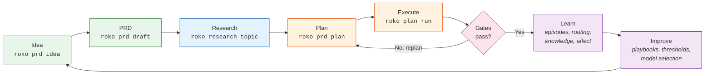
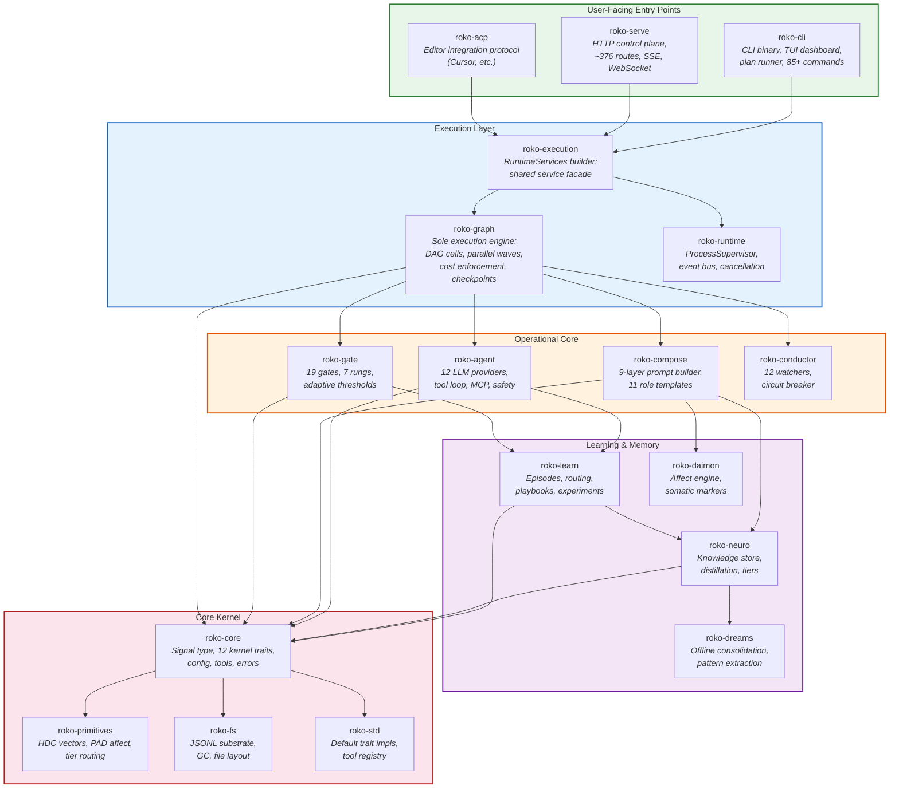
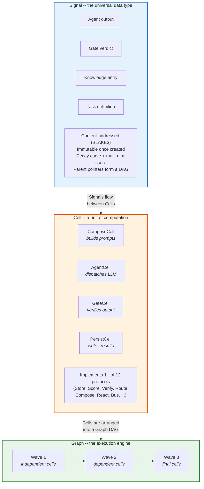
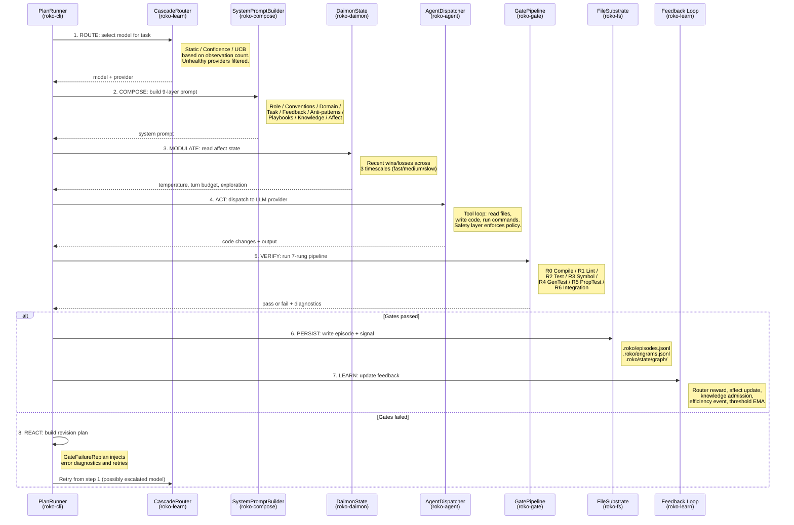

# Architecture Guide

> **Implementation status (2026-09):** REFERENCE -- This chapter is a comprehensive
> architecture guide verified against the codebase as of 2026-09-15. 39 workspace
> members. ~1M lines of Rust. 10,300+ tests. Graph engine is the sole executor
> since #260/#276. All 48 epics accepted. See `.roko/GAPS.md` for product residuals.

---

## Table of Contents

1. [What is Roko?](#1-what-is-roko)
2. [The Core Idea: Agents That Build Themselves](#2-the-core-idea-agents-that-build-themselves)
3. [The Self-Hosting Loop](#3-the-self-hosting-loop)
4. [System Overview Diagram](#4-system-overview-diagram)
5. [The Signal-Cell-Graph Model](#5-the-signal-cell-graph-model)
6. [Data Flow: From Idea to Completed Code](#6-data-flow-from-idea-to-completed-code)
7. [Crate Map](#7-crate-map)
8. [Entry Points](#8-entry-points)
9. [Key Architectural Decisions](#9-key-architectural-decisions)
10. [Verification Commands](#10-verification-commands)
11. [How to Navigate These Docs](#11-how-to-navigate-these-docs)
12. [References](#12-references)

---

## 1. What is Roko?

Roko is a Rust toolkit for building AI agents that improve their own source code. You
point it at a codebase, describe what you want in plain language, and Roko handles the
rest: it composes a prompt from your project context, dispatches an LLM agent to write
the code, verifies the result with compilation and test gates, records what happened,
and learns from the outcome so the next run is better. The entire pipeline -- from
natural-language intent to validated, committed code -- runs as a single CLI command.

What makes Roko unusual is that this pipeline is also how Roko develops *itself*. The
same plan-execute-verify loop that builds your features is the loop that builds Roko's
own features. This is called **self-hosting**: the system is its own primary user. Every
architectural decision in this document exists because the self-hosting loop needed it.
If you understand why a self-improving agent needs a gate pipeline, a durable knowledge
store, an affect engine, and an adaptive model router, you understand why Roko has the
shape it does.

---

## 2. The Core Idea: Agents That Build Themselves

Most AI coding tools work in a single shot: you write a prompt, the model writes code,
and you decide whether it is good enough. Roko turns this into a **closed loop**.

The key insight is that software development is a cycle, not a line:

1. **Observe** -- understand what needs to be done (read a PRD, scan the codebase).
2. **Plan** -- break the work into tasks with dependencies.
3. **Execute** -- dispatch an LLM agent to write code for each task.
4. **Verify** -- run the compiler, tests, linter, and other gates on the output.
5. **Learn** -- record what worked, what failed, which model was used, how much it cost.
6. **Iterate** -- feed failure information back into the planner and try again.

When the loop runs once, you have an AI coding assistant. When the loop runs
continuously and remembers its outcomes, you have an agent that gets better at software
engineering over time. When that agent is pointed at its own source code, it builds
itself.

This loop is not theoretical. Every step maps to a concrete CLI command and a wired
code path. The next section shows exactly how.

---

## 3. The Self-Hosting Loop

The loop below is how Roko develops itself. Each node is a real CLI command. The
arrows marked with a gate failure feed back into the planner, creating a closed loop
that converges on working code.



Here is the same workflow expanded as CLI commands. Each command is implemented
and wired to the runtime today.

```
    roko prd idea "..."          Capture what you want to build
         |
         v
    roko prd draft new "..."     Draft a Product Requirements Doc (agent-assisted)
         |
         v
    roko research topic "..."    Research the topic for context (optional)
         |
         v
    roko prd plan <slug>         Generate an implementation plan with tasks
         |
         v
    roko plan run plans/         Execute the plan through the Graph engine
         |                        - each task dispatches an LLM agent
         |                        - each agent output runs through gates
         |                        - state checkpoints after each task
         |
         +---> gate fails?        Feed failure info back to the planner
         |        |               Replan and retry automatically
         |        v
         |     roko plan run plans/ --resume-plan
         |
         v
    roko dashboard               Watch progress in real time (TUI)
         |
         v
    roko status                  Inspect the final state
```

In concrete shell commands:

```bash
# 1. Capture a work item
roko prd idea "Add rate limiting to the API endpoints"

# 2. Draft a PRD from the idea (an agent writes the requirements doc)
roko prd draft new "api-rate-limiting"

# 3. Research the topic for grounded context (uses Perplexity for citations)
roko research topic "rate limiting best practices in Rust"

# 4. Generate an implementation plan from the PRD
roko prd plan api-rate-limiting

# 5. Execute the plan
#    The Graph engine runs each task: agent writes code -> gates verify -> state persists
roko plan run plans/

# 6. If interrupted, resume from the last checkpoint
roko plan run plans/ --resume-plan

# 7. Watch progress in the terminal dashboard
roko dashboard

# 8. Check the final result
roko status
```

For a single quick task that does not need the full planning pipeline:

```bash
# One-shot: prompt -> agent -> gates -> persist, all in one command
roko run "add a health check endpoint to the API"
```

This is the same pipeline compressed into a single step. Internally it still composes a
prompt, dispatches an agent, runs gates, and persists the result.

---

## 4. System Overview Diagram

This diagram shows the major components and how they relate. Read it top-to-bottom:
foundations at the bottom, user-facing entry points at the top.



Three user-facing entry points sit at the top. Everything below is internal.

### Key relationships

- **roko-core** defines the vocabulary (types and trait contracts) but performs no I/O.
  Every other crate depends on it.
- **roko-graph** is the sole execution engine. It runs task DAGs as parallel waves of
  cells. The older Runner-v2 is retained as `--engine legacy` for one deprecation cycle.
- **roko-cli**, **roko-serve**, and **roko-acp** are the three entry points. They wire
  the internal crates together and expose them to users via CLI, HTTP, and editor
  protocol respectively.
- The learning stack (roko-learn, roko-neuro, roko-dreams, roko-daimon) forms a feedback
  loop: execution outcomes feed into routing decisions, knowledge, and affect state,
  which in turn influence future executions.

---

## 5. The Signal-Cell-Graph Model

Three concepts form the backbone of Roko's design. Understanding these three things
gives you a mental model for everything else in the system.



### Signal: the universal data type

Everything in Roko is a **Signal**. An agent's output is a Signal. A gate verdict is a
Signal. A knowledge entry is a Signal. A task definition is a Signal.

A Signal is like a Git commit for a piece of information:

- **Content-addressed**: its identity is a BLAKE3 hash of what it contains. Two Signals
  with identical content always have the same ID.
- **Immutable**: once created, a Signal does not change.
- **Traceable**: it carries parent pointers (lineage) that form a DAG. You can always
  walk backward to see *why* an agent made a decision.

Unlike a Git commit, a Signal also has:

- A **decay curve** -- knowledge has a half-life. A warning decays in hours; a fact
  persists for months.
- A **score** -- multi-dimensional: confidence, novelty, utility, reputation.
- **Lineage** -- parent content hashes, forming an auditable DAG.
- An optional **HDC fingerprint** -- a 10,240-bit vector for semantic similarity lookup.

The Rust struct is `Signal` (defined in `roko-core/src/signal.rs`), with a
backward-compatible alias `pub type Engram = Signal` in `roko-core/src/engram.rs`.
You will see both names in the codebase; they refer to the same thing. `Signal` is
the canonical name.

```rust
// Creating a Signal
let signal = Signal::builder(Kind::Task)
    .body(Body::text("implement login"))
    .tag("priority", "high")
    .decay(Decay::HalfLife { half_life_ms: 86_400_000 })
    .build();
```

### Cell: a unit of computation

A **Cell** is any component that can participate in execution. It has an identity, a
version, a list of protocols it supports, and optional cost/duration estimates.

```rust
pub trait Cell: Send + Sync + 'static {
    fn cell_id(&self) -> &str;
    fn cell_name(&self) -> &str;
    fn protocols(&self) -> &[&str];
    fn estimated_cost(&self) -> Option<f64>;
}
```

The kernel defines 12 protocol traits that Cells can implement:

| Protocol | What it does |
|----------|-------------|
| **Store** | Persist and retrieve Signals (memory, disk, chain) |
| **ColdStore** | Archive aged-out Signals to cold storage |
| **Score** | Rate a Signal along dimensions (relevance, recency, reputation) |
| **Verify** | Check a Signal against ground truth (compile, test, lint) |
| **Route** | Pick one candidate from many (bandit, cascade, static) |
| **Compose** | Combine Signals into a token-budgeted prompt |
| **React** | Watch signal streams and emit interventions |
| **Bus** | Publish/subscribe for ephemeral Pulses |
| **Observe** | Import data from external sources |
| **Connect** | Manage network connections |
| **Trigger** | Arm/disarm scheduled or event-driven actions |
| **Substrate** | Low-level storage backend contract |

Every capability in the system -- agent spawning, gate verification, prompt assembly,
model routing, knowledge retrieval, affect modulation -- is an implementation of one of
these twelve protocols operating on Signals.

### Graph: the execution engine

A **Graph** is a directed acyclic graph (DAG) of Cells. When you run a plan, each task
becomes a subgraph of cells: prompt assembly, agent dispatch, gate verification,
feedback recording. The Graph engine executes these subgraphs in topological order,
running independent branches in parallel.

Key properties of the Graph engine:

- **Parallel waves**: independent cells execute concurrently within a wave.
- **Conditional routing**: cells can route to different downstream paths based on output.
- **Cost enforcement**: per-plan and per-task USD budgets are enforced atomically.
- **Checkpoint/resume**: state is durably checkpointed after each task completion.
  Resume from the exact point of interruption with `--resume-plan`.
- **Immune Graph**: a five-stage verification pipeline screens all outputs before they
  propagate downstream.

The conceptual flow through any execution is:

```
query -> score -> route -> compose -> act -> verify -> write -> react
```

Stop at any step and you still have something useful. A composer without an agent is a
retrieval pipeline. An agent without gates is a raw LLM wrapper. The pieces are
independent and composable.

---

## 6. Data Flow: From Idea to Completed Code

This section traces a single task through the system, showing which crates are involved
at each step. This is the path that runs when `roko plan run` executes one task in a
plan.



Below is the same flow described step by step with crate annotations.

```
Step 1: ROUTE -- pick a model
  CascadeRouter (roko-learn) selects a model based on task complexity.
  Three maturity stages: Static (0-49 observations) -> Confidence (50-199) -> UCB (200+).
  Unhealthy providers are filtered out using the persisted health registry.
     |
     v
Step 2: COMPOSE -- build the prompt
  SystemPromptBuilder (roko-compose) assembles a 9-layer system prompt:
    Layer 1: Role identity ("You are a senior Rust engineer...")
    Layer 2: Conventions (project style, imports, naming)
    Layer 3: Domain context (crate map, dependency graph)
    Layer 4: Task specification (the actual work to do)
    Layer 5: Gate feedback (errors from previous attempts)
    Layer 6: Anti-patterns (known mistakes to avoid)
    Layer 7: Playbooks (successful patterns from past tasks)
    Layer 8: Knowledge (relevant facts from the neuro store)
    Layer 9: Affect context (adjust tone based on recent history)
     |
     v
Step 3: MODULATE -- adjust for affect
  DaimonState (roko-daimon) reads recent success/failure history and computes a
  DispatchModulation: temperature adjustment, turn budget, exploration rate.
     |
     v
Step 4: ACT -- dispatch the agent
  The dispatcher (roko-agent) sends the prompt to one of 12 LLM provider backends:
    AnthropicApi, ClaudeCli, CodexCli, OpenAiCompat, CursorAcp, CursorCli,
    PerplexityApi, GeminiApi, GeminiCli, CerebrasApi, Hermes, OpenClaw
  The agent runs in a tool loop: it can read files, write code, run commands.
  Safety checks (roko-agent/safety) enforce tool policies and role-based access.
     |
     v
Step 5: VERIFY -- run gates
  GatePipeline (roko-gate) runs up to 7 rungs of verification:
    Rung 0: Compile  -- does it build? (cargo check, tsc, go build)
    Rung 1: Lint     -- does it pass linting? (cargo clippy, eslint)
    Rung 2: Test     -- do existing tests pass? (cargo test)
    Rung 3: Symbol   -- did public APIs break?
    Rung 4: GeneratedTest -- agent-written behavioral tests
    Rung 5: PropertyTest  -- property-based tests (proptest/quickcheck)
    Rung 6: Integration   -- full integration scenarios
  Additional specialized gates: DiffGate, LlmJudge, FactCheck, CodeExec.
  Gate thresholds are adaptive: they tighten when gates consistently pass,
  relax when they consistently fail. Thresholds persist across runs.
     |
     v
Step 6: PERSIST -- record results
  On success: the episode is written to .roko/episodes.jsonl
  The Graph engine checkpoints state to .roko/state/graph/
  The Signal is stored in the substrate (.roko/engrams.jsonl)
     |
     v
Step 7: LEARN -- update the feedback loop
  CascadeRouter.feedback() updates the model arm reward (roko-learn)
  DaimonState.on_outcome() updates the affect state (roko-daimon)
  KnowledgeAdmissionStore considers creating a knowledge entry (roko-neuro)
  Efficiency event written to .roko/learn/efficiency.jsonl
  Adaptive gate thresholds updated in .roko/learn/gate-thresholds.json
     |
     v
Step 8: REACT -- handle failure
  If gates failed: GateFailureReplan (roko-cli/runner) builds a revision plan.
  If the model was escalated: CascadeRouter records the escalation outcome.
  The conductor's 12 watchers (roko-conductor) monitor for stuck agents,
  budget exhaustion, quality degradation, and other anomalies.
```

### Offline learning: the Dream cycle

Between work sessions, an offline consolidation cycle runs:

1. Batch completed episodes.
2. Cluster by task shape using HDC fingerprints.
3. Distill knowledge: extract facts, insights, heuristics, procedures.
4. Promote reliable success patterns into playbooks.
5. Playbooks are injected into future prompts (step 2 above, layer 7).

This is how the system gets better over time: successful patterns are extracted,
stored, and reused.

```bash
roko knowledge dream run      # trigger a dream consolidation cycle
roko knowledge dream report   # see what was consolidated
roko knowledge query "auth"   # search the durable knowledge store
```

---

## 7. Crate Map

All 39 workspace members organized by function. Status reflects verified runtime
wiring, not just whether the code compiles.

```mermaid
graph TD
    subgraph T9 ["Tier 9: Apps & Tests"]
        ar["agent-relay"]
        mirage["mirage-rs"]
        cw["roko-chain-watcher"]
        demo["roko-demo"]
        tests["roko-tests"]
    end

    subgraph T8 ["Tier 8: Chain & Economy"]
        chain["roko-chain"]
    end

    subgraph T7 ["Tier 7: MCP, Plugin & Gateway"]
        mcpgh["roko-mcp-github"]
        mcpstdio["roko-mcp-stdio"]
        mcpslack["roko-mcp-slack"]
        mcpscript["roko-mcp-scripts"]
        plugin["roko-plugin"]
        gateway["roko-gateway"]
        eval["roko-eval"]
    end

    subgraph T6 ["Tier 6: Code Intelligence"]
        idx["roko-index"]
        mcpcode["roko-mcp-code"]
        langrs["roko-lang-rust"]
        langts["roko-lang-typescript"]
        langgo["roko-lang-go"]
    end

    subgraph T5 ["Tier 5: External Interfaces"]
        cli["roko-cli"]
        serve["roko-serve"]
        acp["roko-acp"]
        agserv["roko-agent-server"]
    end

    subgraph T4 ["Tier 4: Learning & Memory"]
        learn["roko-learn"]
        neuro["roko-neuro"]
        dreams["roko-dreams"]
        daimon["roko-daimon"]
    end

    subgraph T3 ["Tier 3: Agent & Composition"]
        agent["roko-agent"]
        compose["roko-compose"]
        gate["roko-gate"]
        conductor["roko-conductor"]
    end

    subgraph T2 ["Tier 2: Execution Engine"]
        graph["roko-graph"]
        execution["roko-execution"]
        runtime["roko-runtime"]
    end

    subgraph T1 ["Tier 1: Core Kernel"]
        core["roko-core"]
        prims["roko-primitives"]
        fs["roko-fs"]
        std["roko-std"]
    end

    T9 -.-> T7
    T8 -.-> T1
    T7 -.-> T3
    T6 -.-> T1
    T5 --> T2
    T4 --> T1
    T3 --> T1
    T2 --> T1

    style T1 fill:#fce4ec,stroke:#b71c1c,stroke-width:2px
    style T2 fill:#e3f2fd,stroke:#1565c0,stroke-width:2px
    style T3 fill:#fff3e0,stroke:#e65100,stroke-width:2px
    style T4 fill:#f3e5f5,stroke:#6a1b9a,stroke-width:2px
    style T5 fill:#e8f5e9,stroke:#2e7d32,stroke-width:2px
    style T6 fill:#e0f2f1,stroke:#00695c,stroke-width:2px
    style T7 fill:#fff8e1,stroke:#f57f17,stroke-width:2px
    style T8 fill:#efebe9,stroke:#4e342e,stroke-width:2px
    style T9 fill:#eceff1,stroke:#37474f,stroke-width:2px
```

### Tier 1: Core Kernel

These crates are always used. They define the vocabulary and foundational abstractions.

| Crate | What it does | Key types |
|-------|-------------|-----------|
| **roko-core** | Signal type, 12 kernel trait contracts, config schema, tool system, errors. The kernel -- defines the vocabulary for the entire system. | `Signal` (primary), `Engram` (compat alias), `ContentHash`, `Kind`, `Score`, `Context` |
| **roko-primitives** | Pre-core math: 10,240-bit hyperdimensional vectors, PAD affect vectors, tier routing. | `HdcVector`, `PadVector`, `InferenceTier` |
| **roko-fs** | Append-only JSONL substrate on disk. Garbage collection, file layout, workspace structure. | `FileSubstrate`, `RokoLayout` |
| **roko-std** | Default trait implementations: no-op scorers, memory substrate, static tool registry, role tool profiles. | `SumScorer`, `StaticToolRegistry`, `MemorySubstrate` |

### Tier 2: Execution Engine

The machinery that runs task DAGs.

| Crate | What it does | Key types |
|-------|-------------|-----------|
| **roko-graph** | **Sole execution engine** since #260/#276. DAG of cells, ready-queue execution, conditional routing, cost enforcement, immune decision graph, durable checkpoints. | `GraphEngine`, `ProductionPlanTopology`, `GuaranteedFinallyController` |
| **roko-execution** | Shared runtime services builder. Gives CLI, serve, and ACP a common layer for safety, budget, routing, and feedback. | `RuntimeServices` |
| **roko-runtime** | Process supervisor, typed event bus, cancellation tokens, workflow contract types (preserved from retired WorkflowEngine). | `ProcessSupervisor`, `EventBus`, `PipelineStateV2` |

### Tier 3: Agent and Composition

The operational core: LLM dispatch, prompt assembly, verification.

| Crate | What it does | Key types |
|-------|-------------|-----------|
| **roko-agent** | 12 LLM provider backends, agent pools, MCP tool integration, tool dispatch loop, safety layer with role-based access. Largest non-CLI crate. | `AgentDispatcher`, `ToolDispatcher`, `SafetyLayer` |
| **roko-compose** | 9-layer SystemPromptBuilder, 11 role templates, enrichment pipeline, context assembly, symbol resolution. | `SystemPromptBuilder`, `RoleSystemPromptSpec`, `PromptComposer` |
| **roko-gate** | 19 gate types in a 7-rung pipeline. Adaptive EMA thresholds. Compile, test, clippy, diff, LLM judge, fact check, and more. | `GatePipeline`, `AdaptiveThresholds`, `CompileGate`, `TestGate` |
| **roko-conductor** | 12 reactive watchers, circuit breaker, diagnosis engine. Detects stuck agents, budget exhaustion, quality degradation. | `Conductor`, `CircuitBreaker`, `DiagnosisEngine` |

### Tier 4: Learning and Memory

The feedback loop that makes the system improve over time.

| Crate | What it does | Key types |
|-------|-------------|-----------|
| **roko-learn** | Episode logging, when/then playbooks, multi-armed bandits, cascade model routing, prompt A/B experiments, efficiency tracking, HDC clustering, hindsight adjustments, c-factor governance. | `CascadeRouter`, `EpisodeLogger`, `PlaybookStore`, `SkillLibrary` |
| **roko-neuro** | Durable knowledge store. Entries have types (fact, insight, heuristic, procedure, constraint, anti-knowledge), half-lives, and tier progression (transient -> working -> reference). | `KnowledgeStore`, `KnowledgeEntry`, `ContextAssembler` |
| **roko-dreams** | Offline consolidation: batch episodes, cluster by shape, distill knowledge, promote playbooks. Adaptive idle scheduling in daemon mode. | `DreamCycle`, `Hypnagogia`, `Imagination` |
| **roko-daimon** | Affect engine: three timescales of emotional state (fast emotion, medium mood, slow temperament). Adjusts model temperature, turn budget, and exploration rate based on recent outcomes. | `DaimonState`, `SomaticMarkers`, `DispatchModulation` |

### Tier 5: External Interfaces

How users and external systems interact with Roko.

| Crate | What it does | Key types |
|-------|-------------|-----------|
| **roko-cli** | Main binary (`roko`). CLI commands, plan DAG runner, merge queue, worktree manager, interactive ratatui TUI with 10 tabs (F1-F10). | `PlanRunner`, `TuiBridge`, `DashboardApp` |
| **roko-serve** | HTTP control plane: ~376 canonical REST routes + SSE + WebSocket on port 6677. Relay subscription execution, arena/meta-agent services. | Axum routes, `StateHub`, `PeriodicObserver` |
| **roko-acp** | Agent Client Protocol server for editor integration (Cursor, etc.). Mutation consent, budget enforcement, experiment assignment. 180 tests. | `AcpServer`, `AcpSession` |
| **roko-agent-server** | Per-agent HTTP sidecar: `/message` (real LLM dispatch), `/stream` (WebSocket), `/predictions`, `/research`, `/tasks`. | Sidecar routes |

### Tier 6: Code Intelligence

Static analysis and language support for richer prompts.

| Crate | What it does |
|-------|-------------|
| **roko-index** | Source code parser, symbol graph, PageRank scoring, HDC fingerprints. |
| **roko-lang-rust** | Rust language provider for the index (tree-sitter parsing). |
| **roko-lang-typescript** | TypeScript language provider. |
| **roko-lang-go** | Go language provider. |
| **roko-mcp-code** | Code-intelligence MCP server (shipped binary). Symbol lookup, dependency graph. |

### Tier 7: MCP, Plugin, and Gateway

Tool ecosystem and inference pipeline.

| Crate | What it does | Status |
|-------|-------------|--------|
| **roko-mcp-github** | GitHub MCP server (shipped binary). Plan PRs, CI integration. | Wired |
| **roko-mcp-stdio** | Shared JSON-RPC 2.0 transport for all MCP servers. | Wired |
| **roko-mcp-slack** | Slack MCP server. | Disconnected |
| **roko-mcp-scripts** | Script execution MCP server. | Disconnected |
| **roko-plugin** | Plugin SDK: signed dependency graphs, WASM hooks, strict admission, kernel confinement. | Wired (E32 8/8) |
| **roko-gateway** | Nine-stage inference gateway: routing/fallback, caching, tool controls, cost accounting, key rotation, backpressure. | Wired (E26 12/12) |
| **roko-eval** | Evaluation framework: evidence collector, criterion, profile traits. | Wired |

### Tier 8: Chain and Economy

Local state machines for future on-chain integration. These are tested but do not have
production runtime adapters yet.

| Crate | What it does | Status |
|-------|-------------|--------|
| **roko-chain** | Local registry, marketplace, arena, and DeFi state machines. X402 payments, identity, witness. | Partial (Phase 2 stubs) |

### Tier 9: Apps, Demo, and Tests

Standalone binaries and integration scaffolding.

| Crate | What it does | Status |
|-------|-------------|--------|
| **agent-relay** | Bounded canonical-envelope relay server with atomic recovery. | Wired (R02) |
| **mirage-rs** | In-process EVM fork simulator. | Built |
| **roko-chain-watcher** | Long-running agent that observes a chain and posts insights via HTTP. | Built |
| **roko-demo** | Demo/example binary for showcasing features. | Disconnected |
| **roko-tests** | End-to-end integration test suite. | Tests only |

---

## 8. Entry Points

There are three ways into Roko. Each serves a different audience.

### roko-cli: the command-line interface

This is the primary way to use Roko. The `roko` binary is built from `crates/roko-cli/`.

```bash
# Build and install
cargo install --path crates/roko-cli

# Initialize a workspace
roko init

# Run a single task
roko run "add error handling to the parser"

# Full planning pipeline
roko prd idea "Add OAuth2 support"
roko prd draft new "oauth2"
roko prd plan oauth2
roko plan run plans/

# Interactive dashboard
roko dashboard
```

The CLI provides 85+ subcommands organized into groups: core workflow, planning/PRDs,
agents, research, knowledge, learning, configuration, server/deployment, graph/feeds/
triggers, and utilities. See the [CLI Reference](../v2/CLI-REFERENCE.md) for the
complete list.

### roko-serve: the HTTP control plane

A long-running HTTP server that exposes the full system over REST, SSE, and WebSocket.
Built from `crates/roko-serve/`.

```bash
roko serve                             # default: 127.0.0.1:6677
roko serve --bind 0.0.0.0 --port 9090  # custom bind address

# Probe liveness
curl http://localhost:6677/health
# {"status":"ok"}

# Check system metrics
curl http://localhost:6677/api/metrics/c_factor
# {"overall":0.73,"components":{...},"episode_count":120}

# Execute a plan via API
curl -X POST http://localhost:6677/api/plans/execute -d '{"path":"plans/"}'
```

The server exposes ~376 canonical routes (~421 including aliases) organized by
subsystem: health/metrics, plans, PRDs, research, agents, knowledge, learning,
configuration, events, and more.

### roko-acp: editor integration

An Agent Client Protocol server that integrates with editors like Cursor. Built from
`crates/roko-acp/`.

```bash
roko acp  # start the ACP server
```

ACP provides mutation consent (file writes require editor permission), budget
enforcement, health-aware provider selection, and experiment assignment. It exposes
the full Roko runtime to editor-driven development workflows.

---

## 9. Key Architectural Decisions

These are the major design choices and why they were made.

### "Everything is a Signal"

**Decision**: A single data type (Signal) represents every piece of information in the
system -- agent outputs, gate verdicts, knowledge entries, task definitions, episodes.

**Why**: Uniformity enables the universal loop. When everything is the same type, the
same scoring, routing, composing, and verification operations apply everywhere. You do
not need separate systems for "agent output management" and "knowledge management" and
"task tracking" -- they are all Signals with different `Kind` values.

**Trade-off**: The Signal struct carries fields (decay, emotional_tag, attestation)
that are irrelevant for many use cases. This is an acceptable cost for the composability
it enables.

### Graph engine as sole executor

**Decision**: All execution runs through a single DAG-based Graph engine. The older
WorkflowEngine and Runner-v2 were retired (Runner-v2 kept as `--engine legacy` for one
deprecation cycle).

**Why**: Multiple execution engines meant multiple code paths for the same operation,
with different bug profiles, different checkpoint formats, and different feature sets.
Converging on one engine means one place to add features, one checkpoint format, and
one set of invariants.

### Gate pipeline with adaptive thresholds

**Decision**: Every agent output passes through a multi-rung gate pipeline before
acceptance. Gate thresholds adjust automatically using exponential moving averages.

**Why**: LLM output is unreliable. The gate pipeline is what makes the system
trustworthy: if the code does not compile, does not pass tests, or does not pass
linting, it is rejected regardless of how confident the model sounded. Adaptive
thresholds prevent the gates from being either too strict (rejecting everything) or
too permissive (accepting broken code).

### Cascade model routing with learning

**Decision**: The system selects which LLM model to use for each task based on task
complexity, historical performance, and cost. Three maturity stages: Static (config
lookup), Confidence (enough data for confidence intervals), UCB (full contextual
bandit).

**Why**: Different tasks need different models. Renaming a variable does not need
Claude Opus; designing an API does. The cascade router learns which models work best
for which tasks, reducing cost without sacrificing quality.

### Affect-aware dispatch

**Decision**: An affect engine (DaimonState) tracks recent success/failure history
across three timescales and adjusts agent behavior accordingly.

**Why**: After a string of failures, blindly retrying with the same parameters wastes
money. The affect engine notices patterns (frustration, fatigue) and adjusts:
lowering temperature, reducing exploration, or escalating to a more capable model.

### Separation of composition and execution

**Decision**: Prompt assembly (roko-compose) is a separate crate from agent dispatch
(roko-agent). The prompt is fully assembled before the agent is called.

**Why**: This makes prompts inspectable, testable, and reproducible. You can look at
exactly what prompt was sent to the model. You can write tests for prompt assembly
without calling an LLM. You can replay a prompt against a different model.

### JSONL-based durable state

**Decision**: State is stored as append-only JSONL files in the `.roko/` directory.
Episodes, signals, efficiency events, and gate thresholds all use this format.

**Why**: JSONL is human-readable, grep-able, and trivially appendable. It requires no
database server. It works on every OS. It is easy to back up, diff, and version
control. For a developer tool that runs on laptops, this is the right trade-off.

### Workspace-local data

**Decision**: All Roko state lives in the `.roko/` directory inside the project
workspace. There is no global daemon database.

**Why**: Each project is self-contained. You can copy a project directory and bring its
full history. You can have multiple projects with different configurations. There is no
"Roko corrupted my other project" failure mode.

---

## 10. Verification Commands

After cloning the repository, run these commands to verify that everything is working.

### Build the workspace

```bash
cd /path/to/roko
rustup update stable          # requires Rust 1.91+
cargo build --workspace       # build all 39 workspace members
```

### Run the test suite

```bash
cargo test --workspace        # 10,300+ tests
```

### Check for lint violations

```bash
cargo clippy --workspace --no-deps -- -D warnings
```

### Verify the CLI works

```bash
# Build and check the binary
cargo run -p roko-cli -- doctor

# Initialize a workspace (creates .roko/ and roko.toml)
cargo run -p roko-cli -- init

# Check workspace status
cargo run -p roko-cli -- status

# Check disk health
cargo run -p roko-cli -- doctor disk

# Inspect config
cargo run -p roko-cli -- config show
```

### Pre-commit checks (mandatory before any commit)

```bash
cargo +nightly fmt --all                              # format (nightly required)
cargo clippy --workspace --no-deps -- -D warnings     # lint
cargo test --workspace                                # test
```

All three must pass before pushing. CI will reject code that fails any of these.

---

## 11. How to Navigate These Docs

### If you are new to the project

Read this document first. Then:

1. Run the verification commands in Section 10 to confirm your setup works.
2. Try the one-shot command: `roko run "add a TODO comment to main.rs"` in a test
   project.
3. Open `crates/roko-core/src/engram.rs` to see the Signal struct.
4. Open `crates/roko-core/src/traits.rs` to see the 12 kernel traits.
5. Follow one execution path: start at `crates/roko-cli/src/runner/event_loop.rs`
   and trace how a task moves through dispatch, gating, and persistence.

### If you want to add a feature

1. Check `.roko/GAPS.md` first -- the feature may already be partially built.
2. Search the codebase: `grep -rn 'StructName' crates/ --include='*.rs' | grep -v target/`
3. Identify which of the 12 protocol traits your feature maps to.
4. Wire existing code before writing new code. The most common pattern in this
   codebase is "built but never connected."

### If you want to understand a specific subsystem

The v2 docs contain detailed subsystem guides:

- [CLI Reference](../v2/CLI-REFERENCE.md) -- all 85+ commands with flags and examples
- [Gate Pipeline](../v2/ARCHITECTURE-GUIDE.md#12-gate-pipeline-architecture) -- 19 gates, 7 rungs, adaptive thresholds
- [Learning Architecture](../v2/ARCHITECTURE-GUIDE.md#14-learning-architecture) -- episodes, routing, experiments
- [Knowledge Store](../v2/ARCHITECTURE-GUIDE.md#15-knowledge-store-architecture) -- entries, tiers, distillation
- [Safety Architecture](../v2/ARCHITECTURE-GUIDE.md#22-safety-architecture) -- trust origin, immune graph, capabilities
- [GitHub Integration](../v2/GITHUB-INTEGRATION.md) -- PRs, CI, webhooks
- [Fast Development](../v2/29-FAST-DEVELOPMENT.md) -- the FAST self-development lane

### Key files to read

| What | Path |
|------|------|
| Signal struct definition | `crates/roko-core/src/signal.rs` (primary); `crates/roko-core/src/engram.rs` (re-export) |
| 12 kernel traits | `crates/roko-core/src/traits.rs` |
| Config schema | `crates/roko-core/src/config/schema.rs` |
| Runner event loop (plan execution) | `crates/roko-cli/src/runner/event_loop.rs` |
| Agent dispatcher | `crates/roko-agent/src/dispatcher/mod.rs` |
| Safety layer | `crates/roko-agent/src/safety/` |
| 9-layer prompt builder | `crates/roko-compose/src/system_prompt_builder.rs` |
| Role templates | `crates/roko-compose/src/templates/` |
| Graph engine | `crates/roko-graph/src/` |
| Gate pipeline | `crates/roko-gate/src/` |
| Cascade model router | `crates/roko-learn/src/` |
| Knowledge store | `crates/roko-neuro/src/` |
| HTTP routes | `crates/roko-serve/src/routes/` |
| TUI dashboard | `crates/roko-cli/src/tui/` |
| Gap tracker | `.roko/GAPS.md` |

---

## 12. References

### Internal documentation

| Document | What it covers |
|----------|---------------|
| `.roko/GAPS.md` | Canonical gap tracker. Check before starting new work. |
| `CLAUDE.md` | Full project context: current state, CLI commands, crate map, build instructions. |
| `README.md` | Quick start, configuration, deployment, gate pipeline, multi-provider setup. |
| `docs/v2/ARCHITECTURE-GUIDE.md` | Detailed v2 architecture: trait signatures, state machines, data flow. |
| `docs/v2/CLI-REFERENCE.md` | Complete CLI command reference with all flags and examples. |
| `docs/v2/GITHUB-INTEGRATION.md` | GitHub workflow automation setup and troubleshooting. |
| `docs/v2/29-FAST-DEVELOPMENT.md` | FAST self-development lane contract and boundaries. |
| `docs/v2/30-EVIDENCE-BUNDLES.md` | Run evidence bundle format and collection. |
| `tmp/docs-audit/01-CODEBASE-TRUTH.md` | Ground truth audit of all 39 workspace crates. |

### Project coordinates

| Property | Value |
|----------|-------|
| Repository | `https://github.com/nunchi/roko` |
| Language | Rust (stable 1.91+, nightly for formatting) |
| License | MIT OR Apache-2.0 (dual-licensed) |
| Workspace members | 37 |
| Lines of code | ~1,000,000 |
| Tests | 10,300+ |
| Epics | 48/48 accepted |
| Default binary targets | `roko-cli`, `roko-mcp-code`, `roko-mcp-github` |
