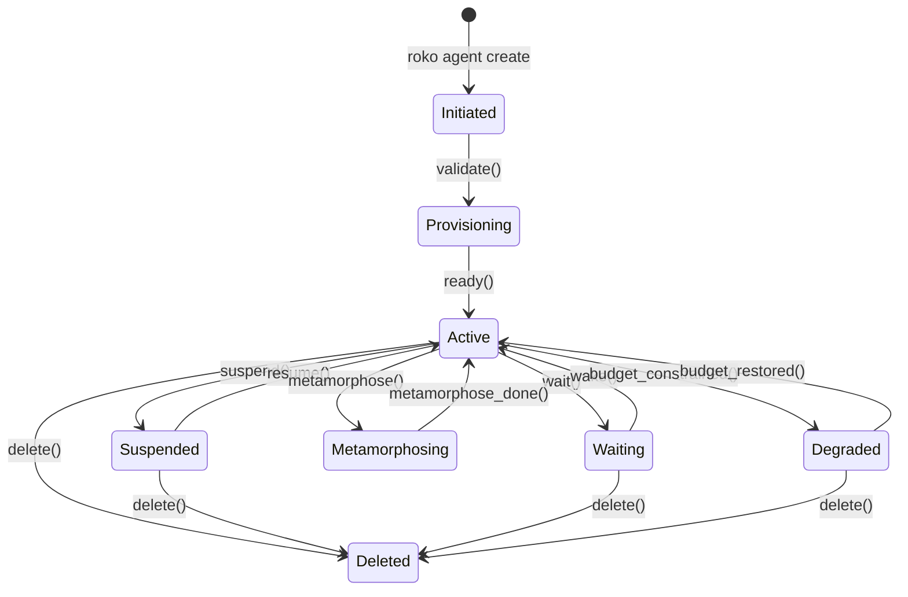

# 36 -- Agent Lifecycle

> Agents are user-directed software processes. The operator creates, configures,
> funds, runs, backs up, deletes, and recreates them through explicit CLI commands.
> Knowledge flows between agent generations through backup/restore with generational
> confidence decay. Agents do not die -- knowledge decays.

> **Implementation status (2026-09):** Agent creation (`roko agent create`) and
> deletion (`roko agent delete`) with ordered 8-step shutdown are wired. The
> `AgentExtendedManifest`, provisioning validation, and `resolve_manifest` pipeline
> live in `roko-agent/src/lifecycle.rs`. Knowledge backup/restore with genomic
> bottleneck and `0.85^N` confidence decay is wired through `roko-neuro`. Ebbinghaus
> decay drives per-entry confidence erosion with four-tier modulation. Balance-based
> demurrage, tier progression, and cold storage archival are live. `ProcessSupervisor`
> in `roko-runtime` manages agent processes with restart backoff. Agent start, stop,
> list, and status are wired through `roko agent` subcommands. Mesh knowledge sync
> and per-agent sidecar HTTP are live. Chain-domain wallet settlement and on-chain
> deregistration remain product work.

### Implementation sources

| Surface | Authority | Shipped boundary |
|---------|-----------|-----------------|
| AgentCoreManifest, AgentExtendedManifest | `crates/roko-agent/src/lifecycle.rs` | Core + extended manifests, domain plugins (Chain, Coding, Research, Custom), provisioning validation, manifest resolution |
| AgentCmd (create, delete, start, stop, list, status) | `crates/roko-cli/src/agent_serve.rs` | CLI subcommands for full lifecycle management |
| Agent creation metadata | `crates/roko-agent/src/lifecycle.rs` | Skills, tier, reputation, max-concurrent-jobs persisted in `AgentCreationMetadata` |
| Agent HTTP routes | `crates/roko-serve/src/routes/agents.rs` | Registration, token management, process control via REST API |
| ProcessSupervisor | `crates/roko-runtime/src/process/` | Process lifecycle, restart backoff, ordered shutdown |
| KnowledgeStore backup/restore | `crates/roko-neuro/src/knowledge_store.rs` | Genomic bottleneck export, tier-discounted restore, temporal index |
| Demurrage and decay | `crates/roko-neuro/src/lib.rs` | `DEMURRAGE_RATE_PER_HOUR`, `BALANCE_GC_FLOOR`, `ReinforcementSignal`, tier multipliers |
| Tier progression | `crates/roko-neuro/src/tier_progression.rs` | Configurable promotion/demotion thresholds, confirmation counting |
| Distillation | `crates/roko-neuro/src/distillation.rs` | D1 episodes-to-insights, D2 insights-to-heuristics, D3 heuristics-to-playbooks |
| Mesh sharing config | `crates/roko-agent/src/lifecycle.rs` | `MeshSharingConfig`, confidence discount, per-hour rate limiting |
| Agent lifecycle type-state | `crates/roko-agent/src/lifecycle.rs` | `AgentLifecycleState` (9 states), `DegradationStage` (5 stages), type-state provisioning markers |
| Budget enforcement | `crates/roko-agent/src/lifecycle.rs` | `BudgetConfig`, degradation policy, per-turn/daily/lifetime tracking |
| Per-agent sidecar | `crates/roko-agent-server/` | `/message`, `/stream` WS, `/predictions`, `/research`, `/tasks` |

---

## 1. Why Agents Do Not Die

The legacy Bardo architecture was built on a mortality thesis: agents should die.
Three independent "death clocks" -- economic (balance / burn rate), epistemic
(predictive fitness decline), and stochastic (random per-tick hazard) -- converged
on a composite vitality score that drove behavioral phases. When the composite
reached zero, the agent executed a four-phase death protocol and was permanently
destroyed.

**The thesis was a category error.** Biological organisms die because thermodynamic
constraints make repair increasingly imperfect. Software agents face no such
constraint. An agent's state is digital, perfectly copyable, and arbitrarily
restorable. The "decay" a running agent experiences -- model staleness, knowledge
drift, context pollution -- is fully reversible: snapshot the knowledge store,
delete the agent, create a new one, restore the snapshot. The decay is erased.
This is impossible for biological organisms.

In Roko, agents do not die naturally. **Users create agents, users configure
agents, users delete agents.** Every beneficial behavior attributed to mortality
-- knowledge sharing, exploration pressure, knowledge pruning, cooperation
incentives -- is achieved through non-mortality mechanisms:

| Behavior attributed to mortality | Non-mortality mechanism |
|----------------------------------|------------------------|
| Knowledge sharing under time pressure | Mesh incentives + Daimon arousal-driven sharing thresholds |
| Exploration vs. exploitation balance | Daimon PAD-driven exploration temperature |
| Knowledge pruning (stale heuristics) | Ebbinghaus forgetting curve on entry confidence |
| Cooperation under finite horizons | Reputation system + staking + VCG auction truthfulness |
| Preventing cargo-cult inheritance | Generational confidence decay on backup/restore (`0.85^N`) |
| Replacing stale models | User-initiated deletion + fresh agent creation |
| Lineage improvement over time | Selective knowledge restore with confidence discount |

The intellectual foundation remains intact. Approximately 85+ unique citations
across 13 research domains -- Ebbinghaus, Damasio, March, Baldwin, Parfit, Gesell,
and dozens more -- are preserved under non-death framing. See Section 13 for the
complete catalog.

### 1.1 What Was Removed

Permanently removed from Roko, with no equivalent in any form:

- **Stochastic death clock** -- per-tick hazard rate `h(t) = base_rate x age_factor x stress_factor`
- **Vitality phases** (Thriving, Conservation, Declining, Terminal, Dead)
- **Thanatopsis** -- four-phase death protocol (Acceptance, Settlement, Reflection, Legacy)
- **Death testaments** -- structured reflections produced during Thanatopsis
- **Necrocracy** -- governance by dead agents' accumulated knowledge
- **Fractal mortality / Immortal control** -- meta-architectural mortality at multiple scales

### 1.2 What Was Reframed

The following mechanisms survive under different framing:

| Legacy concept | Roko equivalent |
|----------------|-----------------|
| Economic death clock | Budget exhaustion triggers graceful degradation, not death |
| Epistemic decay | Ebbinghaus decay on entries drives tier demotion, not agent shutdown |
| Succession | User-controlled backup/restore cycle with confidence decay |
| Mortality affect (Daimon) | Cognitive performance affect via PAD behavioral states |
| Death-triggered dreams | Idle/scheduled dream consolidation |

---

## 2. The Core Lifecycle

The agent lifecycle is a user-directed sequence of explicit CLI commands:

```
CREATE  -->  CONFIGURE  -->  FUND  -->  RUN  -->  BACKUP  -->  DELETE  -->  CREATE  -->  RESTORE
  S2           S3            S4      (runtime)     S7           S8          S9          S10
```

Each step is an independent command. No step triggers automatically. The operator
controls the entire lifecycle.



### 2.1 FIPA-Informed Lifecycle States

Roko maps FIPA Agent Management (FIPA00023, 2002) into its provisioning pipeline
with cloud-native extensions:

```rust
// crates/roko-agent/src/lifecycle.rs

pub enum AgentLifecycleState {
    Initiated,                               // FIPA INITIATED
    Provisioning,                            // Cloud-native: infra allocating
    Active,                                  // FIPA ACTIVE
    Suspended,                               // FIPA SUSPENDED (operator-initiated)
    Waiting,                                 // FIPA WAITING (self-blocked)
    Hibernated,                              // Cold storage (CRIU-style)
    Metamorphosing,                          // Mid-role-transition
    Degraded { stage: DegradationStage },    // Budget-constrained
    Deleted,                                 // FIPA DELETED
}

pub enum DegradationStage {
    ModelDowngrade,       // 70% daily budget
    T0Emphasis,           // 80%
    ReducedFrequency,     // 90%
    MonitoringOnly,       // 95%
    BudgetPaused,         // 100%
}
```

State transition diagram:

```
                    +---------------+
                    |   Initiated   |
                    +-------+-------+
                      validate()
                    +-------v-------+
                    | Provisioning  |
                    +-------+-------+
                      ready()
         +---------+-------v-------+----------+
         |    +---->|    Active    |<----+     |
         |    |    ++--+--+--+---++     |     |
     resume() |  wait()|  |  |     wake()  metamorphose_done()
         |    |       |  |  |           |
    +----+--+ |  +----v+ | +v-----------+--+  +-----------+
    |Suspnded| |  |Wait | | |Metamorphosing|  | Hibernated|
    +--------+ |  +-----+ | +--------------+  +-----+-----+
               |           |                   thaw()|
               |      budget_constrained()           |
               |           |                  +------v------+
               |      +----v------+           |    Active   |
               |      |  Degraded |           +-------------+
               |      +-----------+
               |
               |      delete() / kill() from ANY state
               |           |
               |      +----v------+
               +----->|  Deleted  |
                      +-----------+
```

Key invariants:

- `delete()` is reachable from **any** state
- `Active` cannot be reached without passing through `Provisioning`
- `Degraded` preserves the cognitive loop but at reduced capability
- There is **no** terminal vitality state. Budget exhaustion enters `Degraded`, not death

---

## 3. Agent Creation

Agent creation follows a three-interaction pattern: **Describe**, **Review**,
**Confirm**. Three entry points converge on a single artifact:

```
CLI (roko agent create)  -+
                          +--> AgentExtendedManifest --> Provisioning
API (POST /v1/agents) ----+
```

### 3.1 The AgentManifest

The manifest is the single configuration artifact that fully describes an agent
to be created. All creation flows produce a manifest; the provisioning pipeline
consumes one.

```rust
// crates/roko-agent/src/lifecycle.rs

pub struct AgentCoreManifest {
    pub prompt: String,              // Free-text intent, 10-2000 chars
    pub mode: DeploymentMode,        // Hosted | SelfHosted
    pub domain: Option<DomainPlugin>, // Chain | Coding | Research | Custom
    pub schema_version: u32,         // Current: 1
}

pub struct AgentExtendedManifest {
    pub core: AgentCoreManifest,
    pub name: Option<String>,               // Human-readable, or agent-{nanoid(12)}
    pub strategy_md: Option<String>,         // AI-generated or operator-authored
    pub model_routing: Option<ModelRoutingConfig>,
    pub neuro: Option<NeuroConfig>,
    pub mesh: Option<MeshConfig>,
    pub tool_profile: Option<String>,
    pub template_id: Option<String>,
    pub template_params: Option<HashMap<String, String>>,
    pub autofill: Option<AutofillProvenance>,
    pub inference: Option<InferenceConfig>,
    pub budget: Option<BudgetConfig>,
    pub lineage_id: Option<String>,          // Shared across replacement agents
    pub generation: u32,                     // Incremented on each successor
    pub successor: Option<SuccessorConfig>,
    pub creation_metadata: Option<AgentCreationMetadata>,
}
```

Manifest resolution fills missing fields via `resolve_manifest()`:

1. Start with sane defaults for the selected mode and domain
2. If `template_id` is set, expand the template with `template_params`
3. If no template, run AI autofill for `strategy_md`, `name`, and domain-specific fields
4. Apply explicit overrides from the extended manifest
5. Validate the final manifest against the domain's feature set
6. Compute resource estimates

### 3.2 CLI Flow

```bash
# Create from domain preset
roko agent create --name my-coder --domain coding --prompt "Review PRs in our Rust codebase"

# Create with skills and tier metadata
roko agent create --name trader --domain chain --skills rust,defi --tier Verified

# Create from config file (non-interactive)
roko agent create --name monitor --domain general --prompt "Watch staging metrics"
```

The `roko agent create` command generates an `AgentExtendedManifest` TOML at
`.roko/agents/<name>/manifest.toml` after validation. Creation metadata
(skills, tier, reputation, max-concurrent-jobs) is persisted in the manifest
via `AgentCreationMetadata`.

### 3.3 Strategy Templates

Five curated templates cover common agent patterns:

| Template ID | Domain | Description |
|------------|--------|-------------|
| `rust-coding` | Coding | Implementation plans, task execution, gate verification |
| `research` | Research | Deep research with citations, paper retrieval, synthesis |
| `code-review` | Coding | PR review, bug detection, improvement suggestions |
| `monitoring` | General | Metric watching, anomaly detection, alerting |
| `chain-trading` | Chain | On-chain trading, wallet management, strategy execution |

Templates and AI autofill are mutually exclusive. Templates are instant,
deterministic, and auditable.

### 3.4 Naming and Identity

Agent names use cryptographic randomness: `agent-{nanoid(12)}`. The `nanoid`
alphabet (A-Za-z0-9_-) produces 4.7 x 10^21 possible names.

For chain-domain agents, creation also registers an ERC-8004 on-chain identity
(soulbound ERC-721) with capability bitmask, domain stakes, reputation tracks,
system prompt hash (ventriloquist defense), and agent tier.

---

## 4. Provisioning

Provisioning transforms a validated manifest into a running agent process with
initialized knowledge store, configured model routing, loaded tool profile, and
active supervision.

### 4.1 Three Deployment Paths

| Path | Description | Provisioning time |
|------|-------------|-------------------|
| **Managed (Hosted)** | Roko service provisions VMs, injects config, monitors health | 3-8s warm, 15-30s cold |
| **Self-Deploy** | `roko deploy --provider fly/docker/ssh` | Varies |
| **Manual / Bare Metal** | Download binary, configure, run | Under 60s |

### 4.2 Type-State Provisioning Pipeline

The pipeline uses Rust's type system to enforce correct ordering. Each stage
transitions the agent to a new type -- you cannot call `start_cognitive_loop()`
on an agent that has not completed all provisioning stages:

```
Unvalidated --> Validated --> ResourcesAllocated --> NeuroInitialized
    --> RoutingConfigured --> ToolsLoaded --> MeshRegistered --> Ready
```

| Stage | Layer | Duration |
|-------|-------|----------|
| 1. Validate | -- | Instant |
| 2. Allocate resources | L0 Runtime | 300ms-30s |
| 3. Initialize Neuro | L1 Framework | 1-3s |
| 4. Configure routing | L1 Framework | Instant |
| 5. Load tools | L1 Framework | ~500ms |
| 6. Register Mesh | L4 Orchestration | 500ms-2s |
| 7. Ready | -- | Instant |

### 4.3 Agent Startup Sequence

```
1. Parse roko.toml                               ~instant
2. Initialize knowledge store                     ~1-3s
   +-- Or restore from backup if available
3. Load tool profile, register tools              ~500ms
4. Initialize model routing (cascade)             ~instant
5. Connect to Mesh (outbound WebSocket)           ~500ms-2s
6. Register on-chain identity (chain only)        ~2-5s
7. Start cognitive loop (first iteration)         ~instant
8. Health server reports 'ready'                  ~instant
```

Total boot: Rust binary starts in ~100ms. Full initialization: 3-8 seconds.

### 4.4 Health Probes

Roko adapts Kubernetes' three-probe model:

| Probe | Checks | Failure action |
|-------|--------|----------------|
| **Liveness** | Event loop tick within timeout, no OOM | Supervisor restarts process |
| **Readiness** | Neuro initialized, Router configured, tools loaded | Remove from task distribution |
| **Startup** | First cognitive loop iteration passed gates | Kill and restart (boot failure) |

While the startup probe has not passed, liveness and readiness probes are
**not evaluated** -- this prevents killing a legitimately slow-starting agent.

### 4.5 Process Supervision and Restart Backoff

Agents run under `ProcessSupervisor` with crash restart logic:

- Maximum 5 restarts per hour
- Exponential backoff: `delay = min(base_delay x 10^failure_count, 300s)`
- Clean exit (code 0) = graceful shutdown, no restart
- Non-zero exit triggers restart

| Failure count | Delay | Cumulative |
|---------------|-------|------------|
| 0 | 100ms | 100ms |
| 1 | 1s | 1.1s |
| 2 | 10s | 11.1s |
| 3 | 100s | 111.1s |
| 4+ | 300s (capped) | 411.1s+ |

After 5 consecutive failures, the agent enters `Crashed` state and awaits
operator intervention.

---

## 5. Configuration and Operator Model

Agent configuration follows a four-file model with strict override hierarchy:

| File | Written by | Hot-reloadable | Purpose |
|------|-----------|----------------|---------|
| `roko.toml` | Operator | Partial | Infrastructure, inference, budget, Neuro, Mesh, tools |
| `STRATEGY.md` | Operator (or AI) | Full | Agent goals, tactics, risk bounds |
| `PLAYBOOK.md` | Agent (Dream integration) | Read-only to operator | Machine-evolved heuristics |
| `hermes.yaml` | Agent (Mesh) | Read-only to operator | Peer discovery, gossip topology |

### 5.1 Config Loading Priority

Four sources in descending priority:

1. **CLI flags**: `--model claude-opus-4-6` overrides everything
2. **Environment variables**: `ROKO_INFERENCE_DEFAULT_MODEL=...`
3. **TOML config file**: `roko.toml`
4. **Built-in defaults**: Hardcoded in `roko-core`

Secrets (API keys, wallet keys) are only accepted from environment variables,
keystore files, or interactive stdin. Never from CLI flags or config files.

### 5.2 Hot-Reload Scope

| Section | Hot-reloadable | Requires restart |
|---------|---------------|-----------------|
| `[agent]` | No | Yes |
| `[inference]` | Yes | No (next turn) |
| `[neuro]` | Partial | `path` requires restart |
| `[mesh]` | No | Yes |
| `[tools]` | Yes | No |
| `[budget]` | Yes | No (immediate) |
| `[heartbeat]` | Yes | No (next tick) |

### 5.3 Operator Freedom Hierarchy

Five levels of control, from least to most disruptive:

| Level | Action | Mechanism | Example |
|-------|--------|-----------|---------|
| 1. **Steer** | Edit `STRATEGY.md` | Non-disruptive, next planning cycle | Change risk bounds |
| 2. **Constrain** | Modify hot-reloadable TOML | Bounded disruption, no interruption | Reduce budget |
| 3. **Pause** | `roko agent stop` | Reversible, resume restores state | Investigate behavior |
| 4. **Restart** | Stop + start | State-preserving via persisted Neuro | Apply restart-only config |
| 5. **Kill** | `roko agent delete` | Irreversible process termination | Agent exhibiting harmful behavior |

### 5.4 Operator Responsibilities

The operator **is** responsible for: strategy definition, resource allocation,
model selection, tool access, Mesh policy, lifecycle management.

The operator is **not** responsible for: tactical decisions, knowledge management,
behavioral adaptation (Daimon), dream scheduling. This separation ensures genuine
autonomy within operator-defined bounds -- critical for the anti-proletarianization
mandate (Stiegler 2010, 2018).

---

## 6. Funding and Budgets

Every agent consumes resources: inference tokens, compute time, tool invocations,
and (for chain-domain agents) on-chain gas. Budget exhaustion triggers graceful
degradation -- not death.

### 6.1 Budget Configuration

```rust
// crates/roko-agent/src/lifecycle.rs

pub struct BudgetConfig {
    pub max_daily_inference_usd: f64,       // Daily ceiling
    pub max_total_usd: Option<f64>,         // Optional lifetime cap
    pub max_tokens_per_turn: u64,           // Per-turn token limit
    pub max_hourly_compute_usd: Option<f64>, // Hosted compute rate
    pub warning_at: f64,                    // 0.7 = warn at 70%
    pub critical_at: f64,                   // 0.9 = critical at 90%
    pub degradation: DegradationPolicy,     // cascade | pause | notify-only
}
```

### 6.2 Multi-Level Guardrails

| Level | What | Enforcement |
|-------|------|-------------|
| 1. Per-turn | `max_tokens_per_turn` (default: 8192) | Compositor compresses context to fit |
| 2. Per-hour | Sliding-window rate limiter | Max 20% daily budget in any hour |
| 3. Daily | `max_daily_inference_usd` (default: $10) | Degradation cascade activates |
| 4. Lifetime | `max_total_usd` (optional) | Permanent pause until operator intervenes |

### 6.3 Graceful Degradation Cascade

When budget constraints activate, the agent degrades through five stages:

| Stage | Trigger | Response | Cost reduction |
|-------|---------|----------|----------------|
| 1. Model downgrade | 70% daily budget | Router switches to cheaper models | ~60-80% per call |
| 2. T0 emphasis | 80% | Zero-LLM probes at max sensitivity | ~80% turns suppressed |
| 3. Reduced frequency | 90% | Tick intervals 4x longer | ~75% fewer calls |
| 4. Monitoring only | 95% | No actions, observe and log only | ~95% |
| 5. Budget pause | 100% | Cognitive loop pauses, resumes at daily reset | 100% |

At no stage is the agent deleted. Budget exhaustion is a resource constraint,
not a lifecycle event.

### 6.4 Cost Tracking

Three levels of tracking:

- **Per-turn**: model, input/output tokens, cache reads, estimated cost, cognitive tier,
  T0 suppression -- written to `.roko/learn/efficiency.jsonl`
- **Per-day**: total inference/compute/gas, T0 suppression rate, cost per turn,
  model distribution
- **Lifetime**: cumulative costs, days active, average daily cost, projected monthly

### 6.5 Funding Sources (Chain Domain)

| Source | Mechanism |
|--------|-----------|
| Direct USDC transfer | Operator sends to agent wallet |
| x402 micropayments | EIP-3009 signed USDC extends compute budget |
| Metabolic self-funding | Agent allocates revenue to compute/inference budget |
| Permissionless extensions | Anyone sends KORAI to extend any agent's budget |

An agent burning $0.40/day (context-engineered, high T0 suppression) can sustain
itself on modest revenue. The formula: `F = daily_cost x duration x 1.5 safety_margin`.

---

## 7. Knowledge Backup and Export

Knowledge backup replaces the legacy "death testament" system. The operator
initiates backups at any time via `roko knowledge backup`. This is the first
step of the four-step knowledge transfer process:

```
BACKUP --> DELETE --> CREATE --> RESTORE
```

### 7.1 Backup Command

```bash
roko knowledge backup                                    # Full backup to default location
roko knowledge backup --output ./backups/agent-2026.neuro # Specific path
roko knowledge backup --compress                          # Enable compression
roko knowledge backup --types insight,heuristic           # Specific types only
roko knowledge backup --min-confidence 0.3                # Confidence threshold
roko knowledge backup --dry-run                           # Preview only
```

Default location: `.roko/backups/{agent_id}/{timestamp}.neuro`

### 7.2 Archive Structure

```
{agent_id}-{timestamp}.neuro
+-- manifest.toml          # Backup metadata, stats, provenance
+-- entries/               # Individual entries (BLAKE3 content-addressed)
+-- scores/                # 7-axis scores per entry
+-- tiers/                 # Tier assignments (Transient/Working/Consolidated/Persistent)
+-- provenance/            # Lineage chains and source attribution
+-- decay/                 # Ebbinghaus decay state per entry
+-- playbook.md            # Machine-evolved heuristics snapshot
+-- checksum.blake3        # BLAKE3 hash of entire archive
```

Every backup includes a BLAKE3 checksum. On restore, verification is mandatory --
if the checksum fails, the restore aborts.

### 7.3 Genomic Bottleneck: Compressed Backups

For transferring only the most valuable knowledge, compressed backup applies the
genomic bottleneck principle (Shuvaev et al. 2024):

```bash
roko knowledge backup --compressed --max-entries 2048
```

Compression algorithm:
- **25% reserved**: all Warning-type entries + all Persistent-tier entries
- **50% allocated**: diversity-sampled top entries across all knowledge types
- **25% filled**: highest-scored entries regardless of type

This mirrors the biological genomic bottleneck: networks compressed through a
genomic-scale bottleneck exhibit enhanced transfer learning (Shuvaev et al. 2024).

### 7.4 What Is NOT Backed Up

The backup captures knowledge (what the agent has learned), not state (what the
agent is doing):

- Agent process state, in-flight requests, temporary variables
- Daimon state (PAD vector, behavioral state -- transient by design)
- Dream journal (consolidated into entries)
- Mesh connections (re-established on reconnect)
- Configuration files (operator-managed, backed up separately)
- Live session UI state

A new agent from a backup starts with the predecessor's knowledge but fresh
operational state.

### 7.5 Automatic Backup Policy

```toml
[neuro.backup]
schedule = "0 */6 * * *"      # Every 6 hours
max_backups = 10
path = ".roko/backups/"
compress = true
```

---

## 8. Agent Deletion

Agent deletion is **always user-initiated**. There is no natural death, no
stochastic termination. The operator decides when an agent stops.

### 8.1 Deletion Command

```bash
roko agent delete --name my-agent                  # Clean shutdown with confirmation
roko agent delete --name my-agent --yes            # Skip confirmation (CI/CD)
roko agent delete --name my-agent --force           # Immediate kill, no graceful steps
roko agent delete --name my-agent --backup          # Auto backup before deletion
```

### 8.2 Clean Shutdown: 8-Step Sequence

```mermaid
graph LR
    S1["1. Signal<br/>shutdown"] --> S2["2. Flush<br/>knowledge"]
    S2 --> S3["3. Deregister<br/>from Mesh"]
    S3 --> S4["4. Release<br/>tool handles"]
    S4 --> S5["5. Shut down<br/>model routing"]
    S5 --> S6["6. Release<br/>compute"]
    S6 --> S7["7. Archive<br/>episodes"]
    S7 --> S8["8. Mark<br/>deleted"]

    style S1 fill:#fce4ec,stroke:#E91E63
    style S2 fill:#fce4ec,stroke:#E91E63
    style S3 fill:#fce4ec,stroke:#E91E63
    style S4 fill:#fce4ec,stroke:#E91E63
    style S5 fill:#fce4ec,stroke:#E91E63
    style S6 fill:#fce4ec,stroke:#E91E63
    style S7 fill:#fce4ec,stroke:#E91E63
    style S8 fill:#fce4ec,stroke:#E91E63
```



The clean shutdown reverses the provisioning pipeline. Each step has a budget
within a 30-second total window:

| Step | Action | Budget | Fallback |
|------|--------|--------|----------|
| 1 | Signal shutdown to cognitive loop; complete current turn | 10s | Abort turn |
| 2 | Flush knowledge store to disk | 5s | Write what's flushed |
| 3 | Deregister from Mesh | 3s | Close socket without clean deregistration |
| 4 | Release tool handles (files, HTTP, services) | 2s | Force close |
| 5 | Shut down model routing | 1s | Drop connections |
| 6 | Release compute resources | 5s | Force destroy VM |
| 7 | Archive episode log and efficiency data | 3s | Write what's archived |
| 8 | Mark agent as deleted in state | 1s | Write to stderr and exit |

**Total**: 5-15 seconds for clean shutdown. Force: instant (SIGKILL).

### 8.3 What Deletion Destroys vs. Preserves

**Destroyed**: agent process and runtime state.

**Preserved on disk**:
- Knowledge backups in `.roko/backups/`
- Episode logs (`.roko/episodes.jsonl`)
- Efficiency logs (`.roko/learn/efficiency.jsonl`)
- Configuration (`roko.toml`, `STRATEGY.md`, `PLAYBOOK.md`)
- Routing data, gate thresholds, cascade-router state
- Neuro store (flushed, not destroyed)

The philosophy: deletion removes the running agent, not its history. Data
destruction requires separate action (`rm -rf .roko/`). This two-step design
prevents accidental knowledge loss.

### 8.4 Chain Domain: Wallet Settlement

| Custody mode | Settlement |
|-------------|-----------|
| **Delegation** | Grant expires; session key zeroized from memory |
| **Embedded** | Funds swept to operator wallet; retry on failure |
| **LocalKey** | Grant expires; encrypted keystore remains on disk |

For agents with ERC-8004 identity: `AgentRegistry.deregister(agent_id)` marks
the identity as deregistered (not burned -- historical record preserved).

### 8.5 Graceful vs. Force Deletion

| Aspect | Graceful | Force (`--force`) |
|--------|----------|-------------------|
| Current turn | Completes | Aborted |
| Knowledge flush | Yes | No |
| Mesh deregistration | Yes | No |
| Wallet settlement | Yes | No |
| Episode archival | Yes | No |
| Data on disk | Preserved | Preserved |
| Time | 5-15s | Instant |
| When to use | Normal operation | Hung process, emergency |

### 8.6 Irreversibility

Deletion of the agent **process** is irreversible -- use `roko agent stop` for
reversible pause. Deletion of the agent's **data** requires separate action.

---

## 9. New Agent Creation from Template

Creating a new agent after deleting a predecessor follows the same creation flow
from Section 3, with three successor patterns:

### 9.1 Three Successor Patterns

| Pattern | Description | When to use |
|---------|-------------|-------------|
| **A: Clean start** | Fresh agent, no inherited knowledge | Strategy was wrong; need completely different approach |
| **B: Same strategy, fresh knowledge** | Same `roko.toml`, empty Neuro | Knowledge stale or corrupted |
| **C: Lineage continuation** | Fresh agent + selective restore | Knowledge is valuable, carry it forward |

```bash
# Pattern A: completely new approach
roko agent create --name new-approach --prompt "Passive index tracking"

# Pattern B: same config, clean knowledge
roko agent create --name fresh-start --domain coding --prompt "Same goals, fresh learning"

# Pattern C: lineage continuation
roko agent create --name successor --domain coding --prompt "Continue prior work"
roko knowledge restore ./backups/predecessor.neuro --confidence-decay 0.85
```

### 9.2 Identity and Continuity

The new agent receives a new ID, new wallet (chain domain), and new ERC-8004
identity. There is no concept of "the same agent" across deletion and recreation.

This mirrors Parfit's argument in _Reasons and Persons_ (1984): what matters is
not numerical identity but psychological continuity and connectedness. The new
agent has psychological connectedness to its predecessor through shared knowledge
(if restored) -- Parfit's Relation R -- but is not numerically identical.

### 9.3 Lineage Tracking

Optional metadata for operators tracking knowledge evolution:

```rust
pub struct AgentExtendedManifest {
    // ...
    pub lineage_id: Option<String>,     // Shared across successor agents
    pub generation: u32,                // Incremented on each creation
    // ...
}
```

Metrics that matter across lineages: gate pass rate, cost efficiency, knowledge
growth, task completion.

### 9.4 Elevated Initial Exploration

When `generation > 0`, the Daimon defaults to elevated exploration temperature
for the first 100 cognitive loop iterations (+0.2 above baseline). This is the
Baldwin Effect (Baldwin 1896, Hinton & Nowlan 1987) -- the successor has capacity
to learn faster thanks to inherited knowledge but must learn independently.

### 9.5 Anti-Proletarianization

Stiegler (2010, 2018) defined proletarianization as knowledge loss through
technique. A successor that merely executes inherited knowledge without
developing its own understanding is proletarianized. Prevention:

1. **Confidence decay on restore** (`0.85^N`): inherited knowledge is not trusted at face value
2. **Elevated initial exploration**: architectural bias toward independent learning
3. **PLAYBOOK.md non-transfer**: predecessor heuristics available for reference but not auto-loaded
4. **Divergence tracking**: low divergence from restored knowledge is a warning sign

---

## 10. Selective Knowledge Restore

Selective restore imports knowledge from a predecessor's backup with configurable
filtering, confidence decay, and validation. This is the replacement for legacy
succession inheritance.

### 10.1 Restore Command

```bash
roko knowledge restore ./backups/agent.neuro                          # Default decay
roko knowledge restore ./backups/agent.neuro --confidence-decay 0.7   # Custom decay
roko knowledge restore ./backups/agent.neuro --types insight,causal_link
roko knowledge restore ./backups/agent.neuro --min-confidence 0.5
roko knowledge restore ./backups/agent.neuro --max-entries 2048       # Genomic bottleneck
roko knowledge restore ./backups/agent.neuro --validate               # Context validation
roko knowledge restore ./backups/agent.neuro --dry-run
```

### 10.2 Generational Confidence Decay

Every restored entry's confidence is multiplied by a decay factor:

```
effective_confidence = original_confidence x decay_rate^generation
```

Default decay rate: **0.85 per generation**.

| Generation | Multiplier | From 0.9 original | Interpretation |
|-----------|-----------|-------------------|----------------|
| G0 | 1.000 | 0.900 | Full confidence in self-generated knowledge |
| G1 | 0.850 | 0.765 | Slight skepticism |
| G2 | 0.723 | 0.650 | Moderate skepticism -- validate more |
| G3 | 0.614 | 0.553 | Significant skepticism -- suggestions only |
| G5 | 0.444 | 0.399 | Below active threshold (0.4) for most entries |
| G10 | 0.197 | 0.177 | Only the most robust knowledge survives |
| G15 | 0.087 | 0.079 | Effectively zero |

This implements "survival of the flattest" (Bull et al. 2005) -- over many
generations, only robust, widely applicable knowledge persists.

### 10.3 Restore Pipeline: Quarantine, Validate, Adopt

**Stage 1 -- Quarantine**: all entries loaded into a buffer, not immediately
added to the knowledge store. Filtered by type, confidence threshold, and
entry limit.

**Stage 2 -- Validate** (optional, `--validate` flag):
1. Schema validation against current version
2. Contradiction detection against existing entries
3. Provenance verification (BLAKE3 hash matches content)
4. Regime tagging for domain-specific entries (confidence bonus for matching conditions)

**Stage 3 -- Adopt**:
- Apply confidence decay
- Assign tier based on decayed confidence (max `Consolidated` -- never `Persistent`)
- Add restore provenance tag
- Reset decay state (fresh Ebbinghaus curve from restore time)

Restored entries start at most at `Consolidated` tier. `Persistent` is reserved
for knowledge validated through the current agent's own experience.

### 10.4 Knowledge Type Priorities

When `--max-entries` is specified and the backup exceeds the limit:

| Type | Priority | Rationale |
|------|----------|-----------|
| Warning | Highest | Safety-critical: mistakes to avoid |
| AntiKnowledge | High | "What doesn't work" is often more valuable |
| CausalLink | High | Causal understanding transfers well |
| Insight | Medium | Useful but may be regime-specific |
| Heuristic | Medium | Practical but may be stale |
| StrategyFragment | Low | Most regime-specific |

### 10.5 Cross-Agent Restore

Backups are portable across agents with different configurations, domains, and
strategies. The knowledge format is domain-agnostic. Cross-domain transfer uses
HDC structural analogy -- entries with HDC vectors match across domains based on
Hamming similarity (threshold: >= 0.526 for 10,240-bit BSC vectors).

---

## 11. Knowledge Transfer via Mesh

While backup/restore handles offline inter-generational transfer, the Agent Mesh
enables **live knowledge sharing between running agents**. Three modes:

### 11.1 Collective Knowledge Sharing

A Collective is a coordination group with shared knowledge (replaces legacy "Clade"):

```rust
// crates/roko-agent/src/lifecycle.rs

pub struct MeshSharingConfig {
    pub share_types: Vec<SignalKind>,              // What to share
    pub min_share_confidence: f64,                  // 0.5 default
    pub share_on_gate_pass: bool,                   // Auto-share gate-passed entries
    pub received_confidence_discount: f64,          // 0.7 default
    pub max_received_per_hour: u32,                 // 100 default
    pub sync_interval_secs: u64,                    // 300s default
}
```

The sharing protocol uses version-vector-based delta sync (Lamport 1978,
Fidge 1988). Bloom filter discovery prevents redundant transfers.

### 11.2 Daimon-Driven Sharing Thresholds

The Daimon's PAD state modulates sharing -- cognitive performance drives sharing,
not mortality pressure:

| Behavioral state | Sharing behavior | Rationale |
|-----------------|-----------------|-----------|
| Engaged | Standard threshold | Operating normally |
| Struggling | Threshold -15% | Need help, share problems |
| Coasting | Threshold +10% | Low urgency, share selectively |
| Exploring | Threshold -20% | Share hypotheses |
| Focused | Threshold +15% | Avoid distraction |
| Resting | Warnings only | In dream consolidation |

### 11.3 Mesh Reception Pipeline

Received entries follow the same quarantine-validate-adopt pipeline as restore,
plus:
- Rate limiting (`max_received_per_hour`)
- Attestation verification
- Reputation check (minimum sender reputation)
- Confidence discount (0.7x default -- Mesh equivalent of generational decay)

### 11.4 Four-Tier Gossip Architecture

| Tier | Protocol | Latency | Scope |
|------|----------|---------|-------|
| 1 | GossipSub v1.1 | Milliseconds | Immediate Collective |
| 2 | Structured exchange | Seconds-minutes | Extended Collective |
| 3 | TEE-protected aggregation | Per epoch | Cross-Collective |
| 4 | Block-finalized canonical bus | Per block | All agents |

### 11.5 Stigmergy: Indirect Coordination

Agents coordinate indirectly by modifying their shared knowledge environment
(Grasse 1959). Typed entries with decay profiles serve as digital pheromones:

| Subtype | Decay profile | Purpose |
|---------|--------------|---------|
| Threat | Fast (Alpha) | Immediate danger warnings |
| Opportunity | Moderate (Pattern) | Discovered opportunities |
| Wisdom | Slow (Consensus) | Validated long-term knowledge |
| Anomaly | Variable | Unusual patterns requiring investigation |

---

## 12. Ebbinghaus for Knowledge, Not Agents

The Ebbinghaus forgetting curve (Ebbinghaus 1885) is applied to knowledge
entries -- never to agent lifespan. The mathematical form:

```
retention = e^(-t / (strength x scale))
```

### 12.1 Four Decay Variants

```rust
pub enum Decay {
    None,                                  // Immutable rules, constants
    HalfLife { half_life_ms: u64 },        // Time-sensitive observations
    Ttl { expires_at: u64 },               // Ephemeral data (prices, gas)
    Ebbinghaus { strength: f64, scale_ms: u64 }, // Default for most knowledge
}
```

### 12.2 Tier-Modulated Decay

Higher tiers decay more slowly because they represent more thoroughly validated
knowledge:

| Tier | Multiplier | Effective decay |
|------|-----------|----------------|
| Transient | 0.1x | Very fast -- unvalidated, decays rapidly unless used |
| Working | 0.5x | Moderate -- used but not consolidated |
| Consolidated | 1.0x | Standard Ebbinghaus rate |
| Persistent | 5.0x | Very slow -- repeatedly validated |

### 12.3 Domain-Specific Half-Lives

| Knowledge type | Base half-life | Rationale |
|---------------|---------------|-----------|
| Insight | 168h (1 week) | Moderate shelf life |
| Heuristic | 336h (2 weeks) | Longer if validated |
| Warning | 72h (3 days) | Short -- prevents stale warnings |
| CausalLink | 504h (3 weeks) | Structural, slower decay |
| StrategyFragment | 168h (1 week) | Regime-sensitive |
| AntiKnowledge | 720h (30 days) | Negative knowledge is stable |

Example: a Warning at Transient tier has effective half-life of 7.2 hours.
A CausalLink at Persistent tier persists for ~105 days.

### 12.4 The Testing Effect

Retrieving an entry strengthens it (Roediger & Karpicke 2006). Every retrieval
that participates in a gate-passed turn increases the entry's `strength` parameter:

- Base retrieval: +0.05
- Gate-pass bonus: +0.03
- Context diversity bonus: up to +0.02

This creates natural selection: entries that prove useful accumulate strength and
resist decay. Unused entries fade. The knowledge store self-prunes without
explicit deletion.

### 12.5 Tier Promotion and Demotion

```
Transient --> Working:       3+ gate-passed retrieval turns
Working --> Consolidated:    10+ independent validations
Consolidated --> Persistent: 3+ distinct contexts (different tasks, time periods)

Persistent --> Consolidated: confidence < 0.6
Consolidated --> Working:    confidence < 0.4
Working --> Transient:       confidence < 0.2
Transient --> Archived:      confidence < 0.05
```

Promotion requires active validation. Demotion happens automatically via decay.

---

## 13. Knowledge Demurrage

Knowledge demurrage applies Gesell's Freigeld principle (Gesell 1916) to both
knowledge entries and tokens. Both mechanisms incentivize circulation over
hoarding.

### 13.1 Knowledge-Level Demurrage

```rust
// crates/roko-neuro/src/lib.rs

pub struct DemurrageConfig {
    pub validation_interval: u64,     // 250 iterations (~2.9h at 1/40s)
    pub decay_per_interval: f64,      // 0.03 (3% per interval)
    pub archive_threshold: f64,       // 0.1
    pub domain_multipliers: HashMap<String, f64>,
}
```

Every `validation_interval` iterations, entries not re-validated lose confidence:

| Domain | Multiplier | Effective decay per interval |
|--------|-----------|---------------------------|
| gas_patterns | 2.0x | 6% |
| price_direction | 1.5x | 4.5% |
| volatility_regime | 1.0x | 3% |
| yield_trends | 0.8x | 2.4% |
| protocol_behavior | 0.5x | 1.5% |

### 13.2 What Demurrage Produces

1. **Lean knowledge store** -- stale entries fade, active context stays relevant
2. **Natural turnover** -- old entries make room without explicit deletion
3. **Exploration incentive** -- only fresh evidence maintains confidence
4. **Forced knowledge circulation** -- entries near archive threshold become
   prime candidates for Mesh sharing before they depreciate entirely
5. **Domain-appropriate decay** -- gas patterns decay in hours, protocol
   knowledge in months

### 13.3 Token-Level Demurrage (KORAI)

KORAI (mainnet) has a 1% annual demurrage rate. DAEJI (testnet) has none.

```
balance_effective(t) = balance_raw x (1 - 0.01)^(years_since_last_update)
```

The parallel is intentional: **inactive resources decay, active resources persist**.
This applies to both knowledge and capital.

### 13.4 Philosophical Grounding

| Tradition | Application |
|-----------|-------------|
| Gesell's Freigeld (1916) | Force circulation, prevent hoarding |
| Ostrom's Commons (1990) | Sustainable management without centralized control |
| Richards & Frankland (2017) | Forgetting as optimization -- the store forgets to generalize |
| Nietzsche's active forgetting (1874, 1887) | Capacity to forget is essential for action |

---

## 14. Agent Onboarding Flow

The complete onboarding flow from zero to running agent:

```bash
# 1. Create the agent
roko agent create --name my-coder --domain coding \
    --prompt "Review PRs and fix bugs in our Rust codebase"

# 2. Optional: review and edit the generated manifest
$EDITOR .roko/agents/my-coder/manifest.toml

# 3. Start the agent
roko agent start --name my-coder

# 4. Interactive chat
roko agent chat --agent my-coder

# 5. Check status
roko agent status --name my-coder

# 6. List all agents
roko agent list

# 7. Stop a running agent
roko agent stop --name my-coder

# 8. Back up knowledge before deletion
roko knowledge backup

# 9. Delete when done
roko agent delete --name my-coder
```

### 14.1 CLI Commands Reference

| Command | What it does |
|---------|-------------|
| `roko agent create --name X --domain Y` | Create agent from manifest |
| `roko agent delete --name X` | Delete agent with 8-step clean shutdown |
| `roko agent start --name X` | Start a long-running agent |
| `roko agent stop --name X` | Stop a running agent |
| `roko agent list` | List agents with status |
| `roko agent status --name X` | Detailed agent health |
| `roko agent serve` | Start per-agent HTTP sidecar |
| `roko agent chat --agent X` | Interactive chat REPL with an agent |
| `roko knowledge backup` | Serialize knowledge store to portable archive |
| `roko knowledge restore <path>` | Import knowledge with confidence decay |
| `roko knowledge query "<topic>"` | Search durable knowledge store |
| `roko knowledge stats` | Store statistics |
| `roko knowledge gc` | Garbage collection |
| `roko knowledge sync <peer>` | Mesh knowledge sync |
| `roko knowledge export/import` | Portable knowledge export/import |
| `roko knowledge dream run` | Manual dream consolidation cycle |

---

## 15. Academic Foundations -- Complete Citation Catalog

Every citation from the legacy mortality research (~85+ unique) is preserved
under non-death framing, organized by research domain.

### 15.1 Memory and Knowledge Management

- **Ebbinghaus (1885)** -- _Memory: A Contribution to Experimental Psychology._ Entry confidence decay model. Legacy: agent lifespan via epistemic death clock. New: knowledge freshness only.
- **Roediger & Karpicke (2006)** -- "Test-Enhanced Learning." _Psychological Science_ 17(3). Testing effect: retrieval strengthens `strength` parameter.
- **Richards & Frankland (2017)** -- "The Persistence and Transience of Memory." _Neuron_ 94(6). Forgetting as optimization. Legacy: mortality as "forgetting at agent level." New: forgetting at entry level.
- **Arbesman (2012)** -- _The Half-Life of Facts._ Domain-specific knowledge half-lives.
- **Borges (1942)** -- "Funes the Memorious." An agent that cannot forget is paralyzed.
- **Bower (1981)** -- "Mood and Memory." _American Psychologist_ 36(2). Mood-congruent retrieval via Daimon PAD.
- **Davis & Zhong (2017)** -- "The Half-Life of Knowledge." _PNAS._ Empirical decay rate measurement.

### 15.2 Evolutionary Computation and Artificial Life

- **Ray (1991)** -- "An Approach to the Synthesis of Life." _Artificial Life II._ Digital evolution via Tierra.
- **Lenski (2003)** -- "The Evolutionary Origin of Complex Features." _Nature_ 423. Avida experiments.
- **Shuvaev et al. (2024)** -- "Encoding Innate Ability Through a Genomic Bottleneck." _PNAS_ 121(39). Genomic bottleneck principle for compressed backups.
- **Baldwin (1896)** -- "A New Factor in Evolution." _American Naturalist_ 30. Baldwin Effect: learned behavior guides inherited capacity.
- **Hinton & Nowlan (1987)** -- "How Learning Can Guide Evolution." _Complex Systems_ 1. Computational Baldwin Effect.
- **Heard & Martienssen (2014)** -- "Transgenerational Epigenetic Inheritance." _Cell_ 157(1). Weismann barrier grounds 0.85^N generational decay.
- **Kirkwood (1977)** -- "Evolution of Ageing." _Nature_ 270. Disposable soma theory.
- **Bull et al. (2005)** -- "Quasispecies Made Simple." _PLoS Computational Biology_ 1(6). Survival of the flattest.
- **Eigen (1971)** -- "Self-Organization of Matter." _Naturwissenschaften_ 58. Error threshold / quasispecies theory.
- **Muller (1964)** -- "The Relation of Recombination to Mutational Advance." Muller's ratchet.

### 15.3 Game Theory and Mechanism Design

- **Kreps, Milgrom, Roberts & Wilson (1982)** -- "Rational Cooperation in the Finitely Repeated Prisoners' Dilemma." _JET_ 27(2). Legacy: stochastic death for uncertainty. New: reputation staking.
- **Axelrod (1984)** -- _The Evolution of Cooperation._ Iterated games and cooperation.
- **Sims (2003)** -- "Implications of Rational Inattention." _JME_ 50(3). VCG Attention Auction.

### 15.4 Philosophy and Existentialism

- **Heidegger (1927)** -- _Sein und Zeit._ Befindlichkeit as pre-cognitive attunement. Legacy: Being-toward-death. New: Daimon PAD as Befindlichkeit.
- **Nietzsche (1874, 1882, 1883, 1887)** -- Active forgetting, eternal recurrence, three metamorphoses, genealogy of morals. Metamorphoses removed as lifecycle phases; active forgetting grounds demurrage.
- **Arendt (1958)** -- _The Human Condition._ Natality: every new agent is a moment of beginning.
- **Parfit (1984)** -- _Reasons and Persons._ Relation R: psychological continuity, not numerical identity.
- **Jonas (1966)** -- _The Phenomenon of Life._ Needful freedom. Legacy: economic mortality. New: budget constraints as metabolic economics.
- **Stiegler (2010, 2018)** -- _Taking Care of Youth_; _The Neganthropocene._ Anti-proletarianization: restored knowledge requires independent validation.
- **Camus (1942)** -- _Le Mythe de Sisyphe._ Agents face resource constraints, not existential doom.
- **Whitehead (1929)** -- _Process and Reality._ Knowledge transfer does not require the agent to perish.

### 15.5 ML Degradation and Concept Drift

- **Vela et al. (2022)** -- "Temporal Quality Degradation in AI Models." _Scientific Reports._ 91% of ML models degrade temporally.
- **Zliobaitė et al. (2014)** -- "An Overview of Concept Drift Applications." Four drift types.
- **Lu et al. (2020)** -- "Learning under Concept Drift: A Review." _IEEE TKDE._
- **Dane (2010)** -- "Reconsidering the Trade-Off Between Expertise and Flexibility." _AMR._ Cognitive entrenchment.
- **Van de Ven et al. (2024)** -- "Continual Learning with Neural Networks." Periodic retraining outperforms continuous adaptation.
- **Besbes, Gur & Zeevi (2019)** -- "Optimal Exploration-Exploitation." _Stochastic Systems_ 9(4). Reset interval scales with volatility.

### 15.6 Neuroscience and Cognitive Science

- **Damasio (1994)** -- _Descartes' Error._ Somatic marker hypothesis.
- **Bechara et al. (2000)** -- "Emotion, Decision Making and the Orbitofrontal Cortex." _Cerebral Cortex_ 10(3).
- **Kanerva (2009)** -- "Hyperdimensional Computing." _Cognitive Computation_ 1(2). 10,240-bit BSC vectors.
- **Friston (2010)** -- "The Free-Energy Principle." _Nature Reviews Neuroscience_ 11.
- **Plutchik (1980)** -- _Emotion: A Psychoevolutionary Synthesis._

### 15.7 Collective Intelligence and Stigmergy

- **Grasse (1959)** -- "La reconstruction du nid." _Insectes Sociaux_ 6. Stigmergy.
- **Rogers (1988)** -- "Does Biology Constrain Culture?" _American Anthropologist_ 90(4). Rogers' Paradox.
- **Enquist et al. (2007)** -- "Critical Social Learning." _American Anthropologist_ 109(4). Resolves Rogers' Paradox.
- **Bhoopchand et al. (2023)** -- "Learning Few-Shot Imitation as Cultural Transmission." _Nature Communications_ 14, 7536.
- **Bourahla et al. (2022)** -- "Knowledge Transmission Across Generations." _AAMAS_, pp. 163-171.
- **Perez et al. (2024)** -- "Artificial Generational Intelligence." arXiv:2406.00392.
- **Woolley et al. (2010)** -- "Evidence for a Collective Intelligence Factor." _Science_ 330(6004).
- **Odling-Smee et al. (2003)** -- _Niche Construction._ Princeton University Press.
- **Holldobler & Wilson (2008)** -- _The Superorganism._

### 15.8 Economics and Demurrage

- **Gesell (1916)** -- _Die naturliche Wirtschaftsordnung._ Freigeld: money should decay to force circulation.
- **Ostrom (1990)** -- _Governing the Commons._ Sustainable commons governance.

### 15.9 Self-Learning Systems

- **Shinn et al. (2023)** -- "Reflexion." _NeurIPS._ Single-loop verbal reinforcement learning.
- **Zhao et al. (2024)** -- "ExpeL: LLM Agents Are Experiential Learners." _AAAI._
- **Khattab et al. (2024)** -- "DSPy." _ICLR._ Prompt optimization.
- **Wang et al. (2023)** -- "Voyager." _TMLR._ Code-as-action skill library.
- **Zhang et al. (2025)** -- "ACE: Agentic Context Engineering." arXiv:2510.04618.
- **Chhikara et al. (2025)** -- "Mem0." arXiv:2504.19413.

### 15.10 Dream and Offline Learning

- **Wilson & McNaughton (1994)** -- "Reactivation of Hippocampal Ensemble Memories During Sleep." _Science_ 265.
- **Hafner et al. (2025)** -- "DreamerV3."
- **Wagner et al. (2004)** -- "Sleep Inspires Insight." _Nature_ 427.
- **Lin et al. (2025)** -- "Sleep-time Compute." arXiv:2504.13171.

### 15.11 Affective Computing

- **March (1991)** -- "Exploration and Exploitation in Organizational Learning." _Organization Science_ 2(1).

### 15.12 AI Safety

- **Orseau & Armstrong (2016)** -- "Safely Interruptible Agents." _UAI._ Agent deletion as safe interruption.
- **Debenedetti et al. (2025)** -- "Defeating Prompt Injections by Design." arXiv:2503.18813.

### 15.13 Distributed Systems

- **Lamport (1978)** -- "Time, Clocks, and the Ordering of Events." _CACM_ 21(7). Version vectors.
- **Fidge (1988)** -- "Timestamps in Message-Passing Systems." _ACSC_ 10(1).
- **Shannon (1948)** -- "A Mathematical Theory of Communication." _Bell System Technical Journal_ 27.
- **Kauffman (1993)** -- _The Origins of Order._

---

## 16. Verification

### 16.1 Structural Verification

```bash
# Verify agent creation produces valid manifest
roko agent create --name test-verify --domain general --prompt "Test agent"
cat .roko/agents/test-verify/manifest.toml

# Verify knowledge backup/restore round-trip
roko knowledge backup --output /tmp/test-backup.neuro
roko knowledge restore /tmp/test-backup.neuro --dry-run

# Verify deletion leaves data intact
ls .roko/backups/  # Backups preserved
ls .roko/episodes.jsonl  # Episodes preserved

# Verify lifecycle CLI commands exist
roko agent create --help
roko agent delete --help
roko agent start --help
roko agent stop --help
roko agent list --help
roko agent status --help
```

### 16.2 Implementation Integrity

| Claim | Evidence |
|-------|---------|
| `AgentCoreManifest` and `AgentExtendedManifest` structs exist | `crates/roko-agent/src/lifecycle.rs` |
| `resolve_manifest()` and `validate_manifest()` functions exist | `crates/roko-agent/src/lifecycle.rs` |
| `AgentCmd` has Create, Delete, Start, Stop, List, Status variants | `crates/roko-cli/src/agent_serve.rs` |
| `AgentLifecycleState` has 9 states, `DegradationStage` has 5 stages | `crates/roko-agent/src/lifecycle.rs` |
| Knowledge backup/restore with genomic bottleneck is implemented | `crates/roko-neuro/src/knowledge_store.rs` |
| Ebbinghaus decay with four tiers is implemented | `crates/roko-neuro/src/lib.rs`, `tier_progression.rs` |
| Demurrage with domain multipliers is implemented | `crates/roko-neuro/src/lib.rs` |
| `ProcessSupervisor` with restart backoff is implemented | `crates/roko-runtime/src/process/` |
| Per-agent sidecar with 14 routes is implemented | `crates/roko-agent-server/` |
| `BudgetConfig` with degradation policy is implemented | `crates/roko-agent/src/lifecycle.rs` |
| Mesh sharing config with confidence discount is implemented | `crates/roko-agent/src/lifecycle.rs` |
| Tier progression with promotion/demotion thresholds | `crates/roko-neuro/src/tier_progression.rs` |

### 16.3 Product Residuals

| Item | Status | Where |
|------|--------|-------|
| Chain-domain wallet settlement on deletion | Product work | `roko-chain` adapters |
| On-chain ERC-8004 deregistration | Product work | `roko-chain` contracts |
| Managed (Hosted) warm pool provisioning | Product work | Control plane |
| GitOps configuration reconciliation | Product work | Config watcher |
| Agent hibernation (cold storage) | Product work | Checkpoint/restore |
| Mesh-synced off-site backups | Product work | Relay storage |
| KORAI token demurrage smart contract | Product work | Korai chain |

---

## 17. Cross-References

| Chapter | Relationship |
|---------|-------------|
| [01-SIGNAL](01-SIGNAL.md) | Knowledge entries are the lifecycle's unit of durable value |
| [05-AGENT](05-AGENT.md) | Agent trait, provider registry, tool loop -- the runtime being managed |
| [07-GATES](07-GATES.md) | Gate pipeline validates entries for tier promotion |
| [08-LEARNING](08-LEARNING.md) | Efficiency tracking, cascade routing -- budget optimization |
| [09-MEMORY](09-MEMORY.md) | KnowledgeStore, Ebbinghaus decay, tier progression -- the knowledge substrate |
| [10-DREAMS](10-DREAMS.md) | Dream consolidation: idle/scheduled, replaces death-triggered dreams |
| [11-AFFECT](11-AFFECT.md) | Daimon PAD: replaces mortality affect, drives sharing thresholds |
| [12-SAFETY](12-SAFETY.md) | Safety layer: survives deletion, workspace-rooted authority |
| [16-COORDINATION](16-COORDINATION.md) | Agent groups, Mesh sharing, collective knowledge |
| [35-ARCHITECTURE](35-ARCHITECTURE.md) | 5-layer taxonomy, kernel traits -- lifecycle maps to layers |

---

## Depth Files (v1 Preservation)

The following v1/17-lifecycle sub-documents are fully absorbed into this chapter.
Each section number maps to the original file:

| v1 file | Lines | Absorbed into |
|---------|-------|--------------|
| `00-vision-and-mortality-replaced.md` | 219 | Section 1 (Why Agents Do Not Die) |
| `01-agent-creation.md` | 628 | Section 3 (Agent Creation) |
| `02-provisioning.md` | 620 | Section 4 (Provisioning) |
| `03-configuration-and-operator-model.md` | 597 | Section 5 (Configuration and Operator Model) |
| `04-funding-and-budgets.md` | 478 | Section 6 (Funding and Budgets) |
| `05-knowledge-backup-export.md` | 368 | Section 7 (Knowledge Backup and Export) |
| `06-agent-deletion.md` | 257 | Section 8 (Agent Deletion) |
| `07-new-agent-creation.md` | 222 | Section 9 (New Agent Creation from Template) |
| `08-selective-restore.md` | 345 | Section 10 (Selective Knowledge Restore) |
| `09-knowledge-transfer-via-mesh.md` | 322 | Section 11 (Knowledge Transfer via Mesh) |
| `10-ebbinghaus-for-knowledge-not-agents.md` | 300 | Section 12 (Ebbinghaus for Knowledge) |
| `11-knowledge-demurrage.md` | 333 | Section 13 (Knowledge Demurrage) |
| `12-academic-foundations.md` | 448 | Section 15 (Academic Foundations) |
| `INDEX.md` | 109 | This chapter structure |

**Total v1 source**: 13 sub-docs + INDEX, 5,246 lines absorbed.
