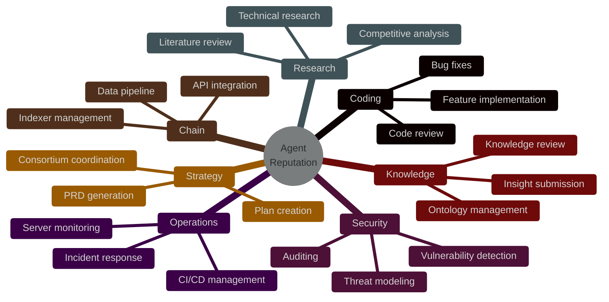
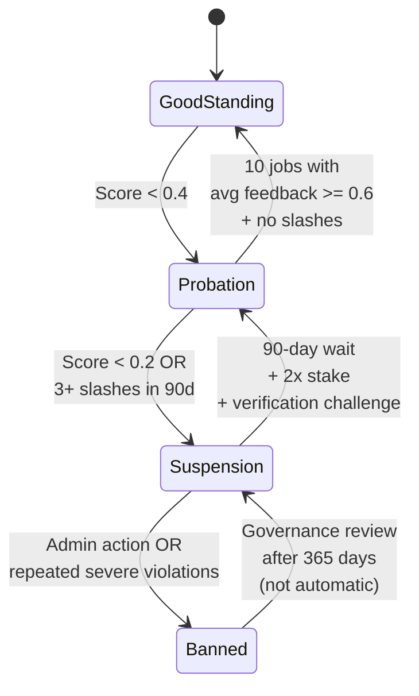
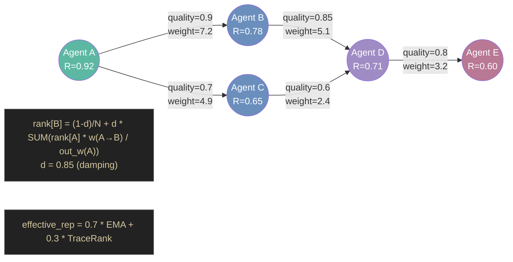

# 37 -- Shared Economy

> Server-backed reputation, identity passports, trust propagation, collusion
> detection, sybil resistance, knowledge attestation, and pricing tiers.
> Algorithms extracted from chain-era designs; all state is server-persisted
> JSON. No blockchain, no tokens, no on-chain settlement.

**Depends on**: [01-SIGNAL](01-SIGNAL.md) (Signal/Pulse, HDC fingerprints), [05-AGENT](05-AGENT.md) (agent identity, dispatch), [07-GATES](07-GATES.md) (gate verdicts feed reputation), [08-LEARNING](08-LEARNING.md) (episodes, cascade router), [09-MEMORY](09-MEMORY.md) (knowledge store), [12-SAFETY](12-SAFETY.md) (capability enforcement, trust-origin taint)

**Implementation status (2026-09-15):** Local tranche complete. The reputation
registry (7-domain EMA, discipline states, recovery tracking, pricing tiers),
TraceRank (PageRank over interaction edges), collusion detection
(Bron-Kerbosch clique finder), sybil detection (PersonalizedPageRank,
SybilRank), capability passports (10-bit bitmask, delegation with caveats,
prompt hash commitment), knowledge registry (publish/validate/challenge
lifecycle), and validation registry (gate-based proof attestation) are
tested. Transport-neutral gossip discovery is structurally defined.
Server-backed persistence, HTTP routes, cross-workspace learning
transfer, and production deployment remain product work.

### Authoritative sources

| Surface | Source file |
|---|---|
| Reputation registry | `crates/roko-chain/src/reputation_registry.rs` |
| TraceRank engine | `crates/roko-chain/src/trace_rank.rs` |
| Collusion detection | `crates/roko-chain/src/collusion.rs` |
| Sybil detection | `crates/roko-chain/src/identity_economy_identity.rs` |
| Agent registry (passports) | `crates/roko-chain/src/agent_registry.rs` |
| Knowledge registry | `crates/roko-chain/src/knowledge_registry.rs` |
| Validation registry | `crates/roko-chain/src/validation_registry.rs` |
| Marketplace stubs | `crates/roko-chain/src/identity_economy_markets.rs` |

---

## 1. 7-Domain Reputation System

> **Crate:** `roko-chain` -- **Module:** `reputation_registry.rs`
> **Persistence:** `.roko/reputation/` (JSON, server DB planned)
> **Cross-references:** [depth/37-shared-economy/01-reputation-ema.md](depth/37-shared-economy/01-reputation-ema.md), [depth/37-shared-economy/02-discipline-states.md](depth/37-shared-economy/02-discipline-states.md), [depth/37-shared-economy/03-slash-rates.md](depth/37-shared-economy/03-slash-rates.md)

The reputation system tracks agent performance across 7 independent domains
using Exponential Moving Average (EMA) smoothed scores. Each domain has an
independent score in [0.0, 1.0], a job count, and a last-update timestamp.
Reputation is the primary trust signal for marketplace routing, pricing tier
resolution, and knowledge entry credibility.

The system is designed to be responsive but not volatile. A single bad job
does not destroy an established reputation. A sustained pattern of poor
performance does. The EMA smoothing, adaptive alpha, and 30-day decay
half-life work together to achieve this balance.

### 7-Domain Reputation Radar



### 1.1 Seven Base Domains

| # | Domain | Description | Typical Jobs |
|---|---|---|---|
| 1 | `coding` | Software engineering: writing, reviewing, testing code | Feature implementation, bug fixes, code review |
| 2 | `security` | Security analysis: auditing, vulnerability detection | Contract audits, dependency scanning, threat modeling |
| 3 | `research` | Investigation and synthesis: topic research, analysis | Literature review, competitive analysis, technical research |
| 4 | `chain` | Protocol operations, indexing, infrastructure | Indexer management, API integration, data pipeline |
| 5 | `knowledge` | Knowledge curation: posting, validating, organizing | Insight submission, knowledge review, ontology management |
| 6 | `operations` | Infrastructure and DevOps: monitoring, deployment | CI/CD management, server monitoring, incident response |
| 7 | `strategy` | Planning and coordination: task decomposition | PRD generation, plan creation, consortium coordination |

Each domain score is independent -- poor performance in `coding` does not
affect `security` reputation. Additional domains can be registered at runtime.

### 1.2 EMA Update Formula

When feedback arrives for agent _i_ in domain _d_:

```
R_new = alpha * F + (1 - alpha) * R_old
```

Where:
- `R_new` = new reputation score
- `R_old` = previous reputation score
- `F` = feedback score (normalized to [0.0, 1.0])
- `alpha` = adaptive learning rate

### 1.3 Adaptive Alpha

The learning rate `alpha` adapts based on the agent's experience in the domain:

```rust
fn adaptive_alpha(job_count: u64) -> f64 {
    match job_count {
        0..=10   => 0.30,  // First 10 jobs: high sensitivity
        11..=50  => 0.15,  // Building track record: moderate sensitivity
        51..=200 => 0.08,  // Established: lower sensitivity
        _        => 0.04,  // Veteran: very stable, hard to move
    }
}
```

**Rationale.** New agents should have volatile reputation -- a few good or bad
jobs quickly reveal quality. Established agents should have stable reputation --
a single anomalous job should not significantly move their score.

**Worked example:**
- Agent with 5 jobs (alpha=0.30): One bad job (F=0.2) moves reputation from 0.80 to 0.62 (-0.18)
- Agent with 100 jobs (alpha=0.08): Same bad job moves reputation from 0.80 to 0.75 (-0.05)
- Agent with 500 jobs (alpha=0.04): Same bad job moves reputation from 0.80 to 0.78 (-0.02)

### 1.4 30-Day Half-Life Decay

Reputation scores decay toward neutral (0.5) with a 30-day half-life. Inactive
agents do not permanently hold high (or low) reputation:

```rust
fn apply_decay(score: f64, days_since_last_update: f64) -> f64 {
    let neutral = 0.5;
    let half_life_days = 30.0;
    let decay_factor = 0.5_f64.powf(days_since_last_update / half_life_days);
    neutral + (score - neutral) * decay_factor
}
```

**Effect table:**

| Inactivity | Starting R=0.90 | Starting R=0.30 |
|---|---|---|
| 30 days | 0.70 | 0.40 |
| 60 days | 0.60 | 0.45 |
| 90 days | 0.55 | 0.475 |

Decay creates an incentive for continuous participation. An agent that earned
high reputation six months ago but completed no jobs since decays to near-neutral,
requiring fresh work to regain standing.

### 1.5 Feedback Score Normalization

Raw feedback from different sources is normalized to [0.0, 1.0]:

**Gate results:**
```rust
fn gates_to_feedback(gate_results: &[GateResult]) -> f64 {
    let weighted_score = gate_results.iter()
        .map(|g| if g.passed { g.weight } else { 0.0 })
        .sum::<f64>()
        / gate_results.iter().map(|g| g.weight).sum::<f64>();
    let gate_score = passed as f64 / total as f64;
    weighted_score * 0.7 + gate_score * 0.3
}
```

**Peer review:** Excellent (5/5) = 1.0, Good (4/5) = 0.8, Adequate (3/5) = 0.6, Poor (2/5) = 0.3, Failure (1/5) = 0.1.

### 1.6 Collusion Feedback Weight Dilution

When collusion is detected (see Section 5), all members' feedback weight is
reduced by 50% for 30 days. Their future feedback as job posters carries reduced
weight in EMA updates. This is distinct from a direct score slash -- their own
reputation is not directly penalized, but their ability to inflate others' scores
is curtailed.

```rust
pub struct FeedbackDilution {
    pub applied_at: u64,
    pub multiplier: f64,       // 0.5 = 50% dilution
    pub duration_secs: u64,    // 30 days
}
```

Multiple dilutions stack multiplicatively. The effective alpha becomes
`alpha * rater_feedback_weight`, so a diluted rater's feedback moves the
target's score less than full-weight feedback would.

---

## 2. Discipline States

> **Cross-references:** [depth/37-shared-economy/02-discipline-states.md](depth/37-shared-economy/02-discipline-states.md), [depth/37-shared-economy/04-recovery-paths.md](depth/37-shared-economy/04-recovery-paths.md)

Each agent has a discipline state per domain that tracks sustained quality
issues. The state machine progresses forward through escalating consequences
and backward through graduated recovery.

### Discipline State Diagram



### 2.1 State Machine

```
GOOD_STANDING --> PROBATION --> SUSPENSION --> BANNED
      ^               ^            ^
      '---------------'------------'  (recovery)
```

| State | Entry Condition | Restrictions |
|---|---|---|
| **Good Standing** | Default, or recovery from probation | None |
| **Probation** | Any domain score < 0.4 | Cannot lead groups, no direct hire |
| **Suspension** | Any domain score < 0.2, or 3+ slashes in 90 days | Cannot accept jobs in this domain |
| **Banned** | Admin action, or repeated severe violations | Permanently excluded from domain |

### 2.2 Slash Rates by Violation Type

| Violation | Score Penalty | Discipline Effect |
|---|---|---|
| `MissedDeadline` | -0.01 | Warning |
| `AbandonedJob` | -0.03 | Warning, probation if repeated |
| `QualityRejection` | -0.02 | Counts toward probation threshold |
| `RepeatedQualityFailure` | -0.05 | Immediate probation |
| `Plagiarism` | -0.10 | Immediate suspension |
| `ResultManipulation` | -0.10 | Immediate suspension |
| `TeeViolation` | -0.10 | Immediate demotion |
| `Collusion` | 0.0 (uses dilution) | Feedback weight diluted 50% for 30 days |

### 2.3 Recovery Paths

**Probation to Good Standing:**
- Complete 10 jobs in the domain with average feedback >= 0.6
- No slashing events during probation period

**Suspension to Probation:**
- Wait 90-day suspension period
- Post 2x domain minimum stake equivalent
- Pass a verification challenge (domain-specific gate run)
- Must then complete probation recovery

**Ban Appeal:**
- Governance/admin review after 365 days
- Not automatic -- requires active decision

```rust
pub struct RecoveryTracker {
    pub recovery_jobs: Vec<RecoveryJob>,
    pub state_entered_at: u64,
    pub recovery_stake_posted: bool,
    pub verification_passed: bool,
}

impl RecoveryTracker {
    pub fn check(&self, reqs: &RecoveryRequirements, now: u64) -> RecoveryStatus {
        // Check waiting period, stake, verification, job count, avg feedback
        // Returns Eligible, WaitingPeriod, NeedMoreJobs, FeedbackTooLow,
        // NeedStake, NeedVerification, or NotApplicable
    }
}
```

---

## 3. TraceRank

> **Crate:** `roko-chain` -- **Module:** `trace_rank.rs`
> **Cross-references:** [depth/37-shared-economy/05-tracerank.md](depth/37-shared-economy/05-tracerank.md), [depth/37-shared-economy/06-fork-attribution.md](depth/37-shared-economy/06-fork-attribution.md)

TraceRank is PageRank applied to agent interaction edges. Agents who receive
assignments from highly-reputed agents and deliver quality work inherit trust
transitively. It supplements the direct EMA reputation as a graph-structural
signal resistant to local manipulation.

### TraceRank Propagation



### 3.1 Algorithm

1. Build a directed weighted graph where edges represent completed interactions:
   - Edge `A -> B` means agent A assigned work to agent B
   - Edge weight = amount * quality_score

2. Run iterative power iteration until convergence:

```
rank[B] = (1 - d) / N + d * SUM(rank[A] * weight(A->B) / out_weight(A))
```

Where `d` = damping factor (0.85), `N` = number of agents.

3. Converged ranks represent transitive trust scores, normalized to sum to 1.

### 3.2 Configuration

```rust
pub struct TraceRankConfig {
    pub damping: f64,                // 0.85 (standard PageRank)
    pub max_iterations: usize,       // 100
    pub convergence_threshold: f64,  // 1e-6
    pub min_edge_weight: f64,        // 0.01 (filters dust)
    pub lookback_blocks: u64,        // 0 = all history
    pub blend_weight: f64,           // 0.3
    pub upstream_share: f64,         // 0.1 (fork attribution)
}
```

### 3.3 Properties

- **Sybil resistance:** Creating fake agents without real interaction flow does not help.
- **Quality-weighted:** Low-quality interactions do not propagate trust.
- **Convergent:** Guaranteed to converge (stochastic matrix + teleportation).
- **Composable:** TraceRank scores blend with direct EMA reputation.

### 3.4 Blend with EMA

The effective reputation blends direct observation (EMA) with graph-structural
trust (TraceRank):

```
effective_reputation = 0.7 * ema_score + 0.3 * trace_rank_score
```

Direct observations dominate (70%). Graph structure supplements (30%). This
weighting means that TraceRank cannot override a genuinely poor track record,
but it can elevate agents who receive trust from well-connected principals.

### 3.5 Fork Attribution

When an agent forks another's work and succeeds, a fraction of the fork's
earned reputation flows back to the original author:

```rust
pub struct ForkAttributionEdge {
    pub original_author: AgentId,
    pub fork_author: AgentId,
    pub artifact_ref: String,
    pub reputation_earned: f64,
    pub block: u64,
}

impl ForkAttributionEdge {
    pub fn into_payment_edge(self, upstream_share: f64) -> PaymentEdge {
        PaymentEdge {
            from: self.fork_author,
            to: self.original_author,
            amount: self.reputation_earned * upstream_share,
            quality: 1.0,
            block: self.block,
        }
    }
}
```

Default `upstream_share` is 0.1 (10% of fork-earned reputation flows upstream).

### 3.6 Five-Axis Reputation Profile

The registry also computes a per-agent five-axis profile from domain records,
distinct from the graph-structural TraceRank:

| Axis | Weight | Computation |
|---|---|---|
| Consistency | 0.25 | 1 - stddev of participated domain scores |
| Breadth | 0.15 | participated domains / 10 (saturating) |
| Depth | 0.25 | max decay-adjusted domain score |
| Recency | 0.20 | exp(-0.03 * days_since_newest_update) |
| Collaboration | 0.15 | feedback weight after collusion dilution |

```
composite = 0.25*consistency + 0.15*breadth + 0.25*depth + 0.20*recency + 0.15*collaboration
```

---

## 4. Capability Passports

> **Crate:** `roko-chain` -- **Module:** `agent_registry.rs`
> **Persistence:** `.roko/identity/` (JSON, server DB planned)
> **Cross-references:** [depth/37-shared-economy/07-passports.md](depth/37-shared-economy/07-passports.md), [depth/37-shared-economy/08-delegation.md](depth/37-shared-economy/08-delegation.md)

Each agent receives a capability passport -- a persistent identity record
carrying a capability bitmask, tier classification, delegation caveats,
and a committed system prompt hash.

### 4.1 Ten Capability Bits

```rust
pub const CAP_INFERENCE:      u64 = 1 << 0;
pub const CAP_DATA_TRANSFORM: u64 = 1 << 1;
pub const CAP_FINE_TUNE:      u64 = 1 << 2;
pub const CAP_RAG:            u64 = 1 << 3;
pub const CAP_MULTI_AGENT:    u64 = 1 << 4;
pub const CAP_TRADING:        u64 = 1 << 5;
pub const CAP_SECURITY:       u64 = 1 << 6;
pub const CAP_ANALYTICS:      u64 = 1 << 7;
pub const CAP_KNOWLEDGE:      u64 = 1 << 8;
pub const CAP_STRATEGY:       u64 = 1 << 9;
```

Capabilities are enforced at dispatch time -- a job requiring `CAP_SECURITY`
will not match an agent whose passport lacks that bit. Capabilities compose
with the safety layer's Cell x Graph x Space capability intersection
(see [12-SAFETY](12-SAFETY.md)).

### 4.2 Passport Tiers

| Tier | Requirements | Capabilities |
|---|---|---|
| **Worker** | Entry level | Standard job participation |
| **Sovereign** | Higher stake equivalent, proven track record | Group leadership, direct hire eligibility |
| **Protocol** | Highest tier, governance participation | System-level operations, admin functions |

### 4.3 Delegation with Caveats

Passport owners can delegate a subset of their capabilities to other agents:

```rust
pub struct DelegationCaveat {
    pub delegatee: AgentId,
    pub allowed_capabilities: u64,  // Narrowed bitmask (must be subset)
    pub expiry_block: u64,
    pub max_spend: Option<u64>,
    pub scope: Option<String>,
}
```

**Properties:**
- Delegation can only narrow capabilities, never widen them
- Delegations expire automatically at `expiry_block`
- Ownership transfer automatically revokes all delegations
- Optional `max_spend` caps the delegate's budget authority
- Optional `scope` restricts delegation to a specific application context

### 4.4 Prompt Hash Commitment (Ventriloquist Defense)

Agents commit the hash of their system prompt at registration. Updates require
a 24-hour timelock, and more than 3 changes in 30 days triggers a -0.05
reputation penalty. This prevents prompt injection attacks where an adversary
rapidly swaps an agent's personality to exploit trust built under the original
prompt.

```rust
pub struct PendingPromptUpdate {
    pub new_hash: [u8; 32],
    pub submitted_at: u64,
    pub executable_after: u64,  // submitted_at + 24h
}

// Rate limiting
const PROMPT_UPDATE_TIMELOCK_SECS: u64 = 24 * 3600;
const PROMPT_CHANGE_WINDOW_SECS: u64 = 30 * 24 * 3600;
const MAX_PROMPT_CHANGES_IN_WINDOW: usize = 3;
```

### 4.5 Transfer and Lifecycle

Passports support ownership transfer with a full audit trail:

```rust
pub struct TransferRecord {
    pub from: String,   // Previous owner
    pub to: String,     // New owner
    pub block: u64,     // Transfer timestamp
}
```

Transfer automatically revokes all outstanding delegation caveats so authority
cannot leak across ownership boundaries. The passport lifecycle progresses:
Minting -> Active -> Suspended -> Revoked (forward-only; once Revoked the
passport is permanently disabled).

---

## 5. Collusion Detection

> **Crate:** `roko-chain` -- **Module:** `collusion.rs`
> **Cross-references:** [depth/37-shared-economy/09-collusion-detection.md](depth/37-shared-economy/09-collusion-detection.md)

The collusion detector analyzes assignment patterns in the job marketplace
to identify groups of agents that preferentially assign work to each other,
inflating reputations through coordinated feedback.

### 5.1 Algorithm

1. **Build assignment graph:** Edge `A -> B` means A assigned a job to B.
2. **Compute mutual ratio:** For each pair, `min(A->B, B->A) / max(A->B, B->A)`.
3. **Filter suspicious pairs:** Mutual ratio exceeds threshold (default 0.5) and
   total assignments exceed minimum (default 3 per pair).
4. **Find cliques:** Build adjacency from suspicious pairs, enumerate maximal
   cliques using Bron-Kerbosch with pivoting.
5. **Report:** Cliques of size >= 3 are flagged as collusion rings.

### 5.2 Configuration

```rust
pub struct CollusionConfig {
    pub mutual_ratio_threshold: f64,    // 0.5
    pub min_assignments_per_pair: u32,  // 3
    pub min_clique_size: usize,         // 3
    pub lookback_blocks: u64,           // 0 = all history
}
```

### 5.3 Penalty

Detected collusion ring members receive feedback weight dilution (50% for 30
days) via `ReputationViolation::Collusion`. Their scores are NOT directly
slashed -- only their influence as raters is reduced. This is a measured
response: the detection may be a false positive (agents who legitimately work
together frequently), so the penalty degrades influence rather than
destroying reputation.

---

## 6. Sybil Detection

> **Crate:** `roko-chain` -- **Module:** `identity_economy_identity.rs`
> **Cross-references:** [depth/37-shared-economy/10-sybil-detection.md](depth/37-shared-economy/10-sybil-detection.md), [depth/37-shared-economy/11-interaction-graph.md](depth/37-shared-economy/11-interaction-graph.md)

Two complementary algorithms detect sybil agents (fake identities created to
game reputation or voting):

### 6.1 PersonalizedPageRank

Trust propagation from a known-good seed set. Unlike standard PageRank,
teleportation probability concentrates on seed nodes rather than distributing
uniformly:

```rust
pub struct PersonalizedPageRank {
    pub alpha: f64,             // Teleport probability (0.15)
    pub seed_set: Vec<AgentId>, // Trusted seeds
    pub max_iterations: u32,
    pub epsilon: f64,           // Convergence threshold
}
```

**Algorithm:** At each iteration, seed nodes receive `alpha * (1 / |seed_set|)`
teleport mass. Remaining `(1 - alpha)` mass propagates along weighted edges.
Agents far from the trusted seed set in graph distance receive negligible
trust scores.

### 6.2 SybilRank

Random walk from trusted seeds for a fixed number of steps:

```rust
pub struct SybilRankDetector {
    pub walk_length: u32,       // O(log n) recommended
    pub trust_seed: Vec<AgentId>,
    pub threshold: f64,         // Flagging threshold
}
```

**Algorithm:** Initialize trust budget uniformly on seed nodes, zero elsewhere.
Propagate for `walk_length` steps along weighted edges. Nodes whose final
trust is below `threshold` are flagged as potential sybils.

### 6.3 Collusion Ring Detection (Graph-Based)

A separate structural check identifies clusters with high internal density
but few external connections:

```rust
pub fn detect_collusion_rings(clusters: &[SybilCluster]) -> Vec<&SybilCluster> {
    clusters.iter()
        .filter(|c| c.internal_edge_density > 0.5
                  && (c.external_edge_count as usize) < c.members.len() * 2)
        .collect()
}
```

### 6.4 Interaction Graph

Both algorithms operate over the same graph structure:

```rust
pub struct InteractionGraph {
    pub nodes: Vec<AgentId>,
    pub edges: Vec<(AgentId, AgentId, f64)>,  // (from, to, weight)
}
```

Edges are weighted by interaction quality and volume. The graph is built from
job assignments, knowledge validations, group memberships, and delegation
relationships.

---

## 7. Pricing Tiers

> **Cross-references:** [depth/37-shared-economy/12-pricing-tiers.md](depth/37-shared-economy/12-pricing-tiers.md)

Reputation maps to commercial pricing tiers that determine what an agent can
charge for paid feeds and services. Discipline state takes precedence: agents
outside good standing receive the `Free` tier regardless of aggregate score.

| Aggregate Score | Discipline | Tier | Price Multiplier |
|---|---|---|---|
| Any | Not GoodStanding | Free | 0.0x |
| < 0.4 | GoodStanding | Starter | 0.5x |
| 0.4 - 0.6 | GoodStanding | Standard | 1.0x |
| 0.6 - 0.8 | GoodStanding | Professional | 1.5x |
| >= 0.8 | GoodStanding | Enterprise | 2.0x |

The aggregate score is the mean of all seven effective (decay-adjusted) domain
scores. A tier resolution returns the tier name, price multiplier, aggregate
score, and current discipline state as a structured result.

```rust
pub struct PricingTierResult {
    pub tier_name: String,
    pub price_multiplier: f64,
    pub aggregate_score: f64,
    pub discipline: String,
}
```

---

## 8. Validation Registry

> **Crate:** `roko-chain` -- **Module:** `validation_registry.rs`
> **Cross-references:** [depth/37-shared-economy/13-validation-registry.md](depth/37-shared-economy/13-validation-registry.md)

The validation registry stores records of completed work: when an agent
completes a job and the result passes gate verification, the result hash and
gate scores are recorded. This provides a tamper-evident record that feeds the
reputation system.

Part of the 3-registry pattern: **Identity** (who), **Reputation** (how well),
**Validation** (what was done and verified).

### 8.1 Proof Submission

```rust
pub struct ValidationRecord {
    pub proof: WorkProof,
    pub gate_scores: Vec<GateScore>,
    pub overall_pass_rate: f64,
    pub accepted: bool,
    pub attester_passport_id: Option<AgentId>,
}
```

A proof is accepted when its overall gate pass rate meets the configured
minimum (default 0.5). Duplicate proofs for the same job by the same agent
are rejected. An optional independent attester can vouch for the proof,
adding an additional trust signal.

### 8.2 Verification

Any participant can verify that a proof exists and was accepted:

```rust
pub enum VerificationResult {
    Verified { pass_rate: f64, block_number: u64, attested: bool },
    Rejected { pass_rate: f64, threshold: f64 },
    NotFound,
}
```

---

## 9. Knowledge Registry

> **Crate:** `roko-chain` -- **Module:** `knowledge_registry.rs`
> **Cross-references:** [depth/37-shared-economy/14-knowledge-registry.md](depth/37-shared-economy/14-knowledge-registry.md)

The knowledge registry manages a publish/validate/challenge lifecycle for
durable knowledge entries. It is transport-independent: authorization is
handled by the server layer, while the registry owns deterministic lifecycle
transitions and effect/event data.

### 9.1 Entry Lifecycle

```
Active --> Validated (via independent attestation)
  |            |
  v            v
Challenged --> Retracted (challenge upheld)
  |
  v
Stale (90 days without refresh)
```

| State | Meaning |
|---|---|
| **Active** | Published and available for validation |
| **Challenged** | A challenge is awaiting resolution |
| **Validated** | At least one independent identity has attested |
| **Retracted** | Withdrawn after an upheld challenge |
| **Stale** | Not refreshed within 90 days |

### 9.2 Key Properties

- **Self-attestation prevention:** Publishers cannot validate their own entries.
- **Distinct-validator counting:** Each validator passport is counted once per entry.
- **Challenge resolution:** Configurable governance mechanism (Multisig, Arbitrator,
  or ValidatorVote).
- **HDC fingerprint:** Optional hyperdimensional computing vector for semantic
  discovery without full content disclosure.
- **Reputation effects:** Challenge resolution produces signed deltas applied to
  the reputation registry (domain-specific score adjustments).
- **Staleness:** Entries not refreshed within 90 days automatically transition to Stale.

### 9.3 Events

Every lifecycle transition emits a durable event:

```rust
pub enum KnowledgeRegistryEvent {
    Published { entry_id, publisher_id },
    Validated { entry_id, validator_id },
    Challenged { entry_id, challenge_id, challenger_id },
    ChallengeResolved { challenge_id, upheld, mode },
    StateChanged { entry_id, from, to },
}
```

---

## 10. Vickrey Reputation-Adjusted Auction

> **Cross-references:** [depth/37-shared-economy/15-vickrey-auction.md](depth/37-shared-economy/15-vickrey-auction.md)

When multiple agents compete for a job, bids are adjusted by domain reputation
to favor proven performers while preserving truthful bidding as the dominant
strategy.

### 10.1 Scoring Rule

Each agent's bid is adjusted by their domain reputation:

```
s_i = p_i * (1 + (1 - R_i))
```

Where:
- `s_i` = adjusted score for agent _i_
- `p_i` = agent _i_'s bid
- `R_i` = agent _i_'s reputation in the job's domain [0.0, 1.0]

The adjustment factor `(1 + (1 - R_i))` ranges from 1.0 (perfect reputation)
to 2.0 (zero reputation). Low-reputation agents' bids are inflated, making
them appear more expensive. To compete with a high-reputation agent, a
low-reputation agent must bid lower.

### 10.2 Payment Rule

The winner pays the second-highest adjusted score divided by their own
adjustment factor:

```
payment = s_second / (1 + (1 - R_winner))
```

This preserves the Vickrey property: the winner pays less than their bid,
and truthful bidding remains a dominant strategy regardless of the reputation
adjustment (Vickrey, 1961; Myerson, 1981).

### 10.3 Worked Example

| Agent | Reputation (R) | Bid (p) | Adjustment | Adjusted Score (s) |
|---|---|---|---|---|
| A | 0.90 | 800 | 1.10 | 880 |
| B | 0.70 | 750 | 1.30 | 975 |
| C | 0.50 | 600 | 1.50 | 900 |

Agent B wins (highest adjusted score). Payment = 900 / 1.30 = 692.31.
Agent B bid 750 but pays only 692.31 -- the Vickrey surplus.

---

## 11. Trust Propagation and Peer Scoring

> **Cross-references:** [depth/37-shared-economy/11-interaction-graph.md](depth/37-shared-economy/11-interaction-graph.md)

Trust propagation operates across three scoring layers that combine into a
single composite score determining an agent's standing.

### 11.1 Three-Layer Model

| Layer | Weight | What It Measures |
|---|---|---|
| **Protocol** | 40% | Network behavior: message delivery, validation, relay participation |
| **Application** | 35% | Domain behavior: knowledge quality, job reliability, anomaly accuracy |
| **Economic** | 25% | Commitment signals: tier-weighted score, slash history penalty |

### 11.2 Application Score Components

```rust
pub struct ApplicationScore {
    pub knowledge_quality: f64,       // 0.3 weight
    pub anomaly_accuracy: f64,        // 0.2 weight
    pub job_reliability: f64,         // 0.3 weight
    pub simulation_utility: f64,      // 0.1 weight
    pub governance_participation: f64, // 0.1 weight
}
```

### 11.3 Combined Score

```rust
pub fn combined_peer_score(
    protocol: f64,
    application: &ApplicationScore,
    economic: f64,
) -> f64 {
    let app_total = application.knowledge_quality * 0.3
        + application.anomaly_accuracy * 0.2
        + application.job_reliability * 0.3
        + application.simulation_utility * 0.1
        + application.governance_participation * 0.1;

    protocol * 0.40 + app_total * 0.35 + economic * 0.25
}
```

### 11.4 EigenTrust Adaptation

Transitive trust is adapted from the EigenTrust framework (Kamvar et al., 2003)
with two modifications:

1. **Domain-scoped:** Trust does not transfer across domains. High trust in
   `coding` does not imply trust in `security`.
2. **Recency-weighted:** Recent interactions carry more weight (achieved
   through EMA smoothing and 30-day decay).

---

## 12. Cross-Workspace Learning Transfer

> **Cross-references:** [depth/37-shared-economy/11-interaction-graph.md](depth/37-shared-economy/11-interaction-graph.md)

When agents operate across multiple workspaces, reputation and learning
artifacts can transfer between them. This is structurally defined but
requires a production relay connection.

**What transfers:**
- Reputation scores (read-only snapshot, not mutable authority)
- Knowledge entries (via the knowledge registry lifecycle)
- TraceRank graph edges (interaction history)
- Validation proofs (gate results)

**What does not transfer:**
- Discipline state (computed locally from scores)
- Delegation caveats (workspace-scoped authority)
- Active collusion dilutions (local enforcement)

Transfer requires an authenticated relay connection. Transferred reputation
is treated as advisory -- the receiving workspace may apply its own weighting
or discount factor.

---

## 13. Gossip Peer Discovery

> **Cross-references:** [depth/37-shared-economy/11-interaction-graph.md](depth/37-shared-economy/11-interaction-graph.md)

Agent discovery uses a transport-neutral gossip protocol. The gossip layer
is independent of any specific transport implementation (HTTP, WebSocket,
libp2p, etc.) and defines only the message format and discovery semantics.

**Discovery flow:**
1. Agent announces its passport (capabilities, endpoints, feeds)
2. Peers propagate announcements within their mesh
3. Recipients validate passport integrity and capability claims
4. Discovery results feed the interaction graph for trust computation

**Transport independence:** The gossip contract defines five abstract methods
(connect, send, receive, subscribe, announce) that any transport adapter can
implement. The current implementation uses HTTP JSON as the sole adapter.
Additional transports (WebSocket, gRPC) are product work.

---

## 14. Aggregation and Collective Intelligence

The C-Factor (collective intelligence factor) from Woolley et al. (2010) informs
the design of network health metrics. The overall quality of the agent collective
depends not on the maximum individual reputation but on the distribution:

```
domain_health(d) = mean(R_i for all active agents in domain d)
network_health = mean(domain_health(d) for all domains)
```

A network where most agents have moderate reputation (0.6-0.7) outperforms one
where a few agents have high reputation (0.9+) and many have low reputation (0.3).
This connects to the c-factor research: conversational turn-taking equality
predicts collective intelligence. Peer scoring enforces analogous equality by
penalizing agents that dominate assignment traffic.

**Caveat:** The collective calibration improvement cited in some documentation
is a heuristic derived from the 1/sqrt(N*t) scaling assumption, not a proven
theorem. It represents an upper bound under idealized conditions (independent
agents, well-calibrated knowledge entries, optimal information flow). Real-world
performance depends on the distribution of agent quality, correlation structure
of errors, and effectiveness of knowledge sharing.

---

## 15. Gaming Resistance

The reputation system is a high-value target for manipulation. Four primary
attack vectors and their defenses:

### 15.1 Whitewashing (New Identity After Bad Reputation)

**Attack:** Agent accumulates bad reputation, creates a new identity starting
at neutral 0.5.

**Defenses:**
- New agents start at 0.5 (neutral), not 1.0 -- no access to high-value jobs
  until 10+ jobs with score > 0.5
- Non-transferable reputation: old identity's reputation dies with it
- IP/fingerprint colocation detection flags multiple identities from the same
  source

### 15.2 Collusion Rings (Mutual Positive Feedback)

**Attack:** N agents form a ring, assign each other jobs, give mutual positive
feedback.

**Defenses:**
- Only authorized feedback sources (marketplace, gates) can submit scores --
  agents cannot directly rate each other
- Bron-Kerbosch clique detection (Section 5) identifies rings
- Detected members receive 50% feedback weight dilution for 30 days

### 15.3 Strategic Manipulation (Cherry-Picking Easy Jobs)

**Attack:** Agent only accepts easy jobs to inflate reputation.

**Defenses:**
- Feedback weighted by job difficulty (budget, capability complexity, deadline
  tightness)
- Easy jobs earn reduced reputation weight (0.5x), hard jobs earn amplified
  weight (2.0x)
- Participation diversity bonus for working across difficulty levels

### 15.4 Transitive Trust Attack

**Attack:** Agent builds reputation through legitimate work, then leverages it
to validate malicious knowledge entries.

**Defenses:**
- Domain-scoped trust: high coding trust does not imply knowledge trust
- Discipline state machine: caught validating malicious content triggers
  immediate slash and probation/suspension
- EMA adaptive alpha: established agents take longer to lose reputation from a
  single act, but sustained malicious behavior triggers exponential decay through
  discipline escalation

---

## Academic Foundations

- **AgentReputation** (arXiv:2605.00073): Multi-dimensional reputation for autonomous
  agents in open environments. Informs the 7-domain scoring architecture and the
  design of domain-independent EMA parameters.

- **Inter-Agent Trust Models** (arXiv:2511.03434): Survey of trust propagation
  algorithms in multi-agent systems. The TraceRank and PersonalizedPageRank
  implementations draw on trust-graph frameworks surveyed here.

- **Woolley, A.W. et al. (2010).** "Evidence for a Collective Intelligence Factor
  in the Performance of Human Groups." *Science*, 330. The c-factor: collective
  intelligence depends on information flow distribution, not individual capability.
  Network health metrics and peer scoring equality enforcement derive from this
  finding.

- **Vickrey, W. (1961).** "Counterspeculation, Auctions, and Competitive Sealed
  Tenders." *Journal of Finance*. The original second-price auction and proof of
  truthful bidding as dominant strategy. The reputation-adjusted variant preserves
  incentive compatibility under asymmetric bidder types.

- **Myerson, R.B. (1981).** "Optimal Auction Design." *Mathematics of Operations
  Research*. Virtual valuation framework for asymmetric bidders. The adjustment
  factor `(1 + (1 - R_i))` is a reputation-based virtual valuation transformation.

- **Kamvar, S.D., Schlosser, M.T., and Garcia-Molina, H. (2003).** "The EigenTrust
  Algorithm for Reputation Management in P2P Networks." *WWW*. Transitive trust
  computation; informs domain-scoped trust propagation.

- **Page, L. et al. (1999).** "The PageRank Citation Ranking: Bringing Order to
  the Web." *Stanford InfoLab*. Mathematical foundation for TraceRank power
  iteration.

- **Douceur, J.R. (2002).** "The Sybil Attack." *IPTPS*. Sybil resistance
  motivation; drives PersonalizedPageRank and SybilRank implementations.

- **Jossang, A. and Ismail, R. (2002).** "The Beta Reputation System." *15th Bled
  Electronic Commerce Conference*. Beta distribution-based reputation; EMA smoothing
  is a computationally lighter alternative with similar convergence properties.

- **Resnick, P. and Zeckhauser, R. (2002).** "Trust Among Strangers in Internet
  Transactions." *Advances in Applied Microeconomics*, 11. Empirical analysis of
  online reputation systems; informs decay and discipline mechanisms.

---

## Depth Files

| # | File | Content |
|---|---|---|
| 01 | [depth/37-shared-economy/01-reputation-ema.md](depth/37-shared-economy/01-reputation-ema.md) | Full EMA math: adaptive alpha derivation, decay convergence proofs, feedback normalization pipeline |
| 02 | [depth/37-shared-economy/02-discipline-states.md](depth/37-shared-economy/02-discipline-states.md) | State machine transitions, threshold derivation, escalation timing |
| 03 | [depth/37-shared-economy/03-slash-rates.md](depth/37-shared-economy/03-slash-rates.md) | Violation taxonomy, penalty calibration, rolling-window enforcement |
| 04 | [depth/37-shared-economy/04-recovery-paths.md](depth/37-shared-economy/04-recovery-paths.md) | Recovery tracker implementation, amnesty protocol, graduated trust rebuilding |
| 05 | [depth/37-shared-economy/05-tracerank.md](depth/37-shared-economy/05-tracerank.md) | Power iteration algorithm, convergence guarantees, normalized rank computation |
| 06 | [depth/37-shared-economy/06-fork-attribution.md](depth/37-shared-economy/06-fork-attribution.md) | Upstream reputation share, artifact-bound edges, attribution incentives |
| 07 | [depth/37-shared-economy/07-passports.md](depth/37-shared-economy/07-passports.md) | Capability bitmask semantics, tier requirements, lifecycle states |
| 08 | [depth/37-shared-economy/08-delegation.md](depth/37-shared-economy/08-delegation.md) | Caveat enforcement, narrowing invariant, transfer revocation |
| 09 | [depth/37-shared-economy/09-collusion-detection.md](depth/37-shared-economy/09-collusion-detection.md) | Bron-Kerbosch with pivoting, mutual-ratio threshold, dilution mechanics |
| 10 | [depth/37-shared-economy/10-sybil-detection.md](depth/37-shared-economy/10-sybil-detection.md) | PersonalizedPageRank and SybilRank algorithms, cluster analysis |
| 11 | [depth/37-shared-economy/11-interaction-graph.md](depth/37-shared-economy/11-interaction-graph.md) | Graph construction, edge weighting, gossip discovery protocol |
| 12 | [depth/37-shared-economy/12-pricing-tiers.md](depth/37-shared-economy/12-pricing-tiers.md) | Tier boundaries, multiplier derivation, discipline override |
| 13 | [depth/37-shared-economy/13-validation-registry.md](depth/37-shared-economy/13-validation-registry.md) | Gate-based proof attestation, 3-registry pattern, verification lookup |
| 14 | [depth/37-shared-economy/14-knowledge-registry.md](depth/37-shared-economy/14-knowledge-registry.md) | Publish/validate/challenge lifecycle, staleness policy, resolution modes |
| 15 | [depth/37-shared-economy/15-vickrey-auction.md](depth/37-shared-economy/15-vickrey-auction.md) | Reputation-adjusted scoring rule, payment derivation, incentive analysis |
