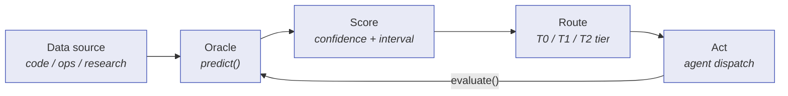
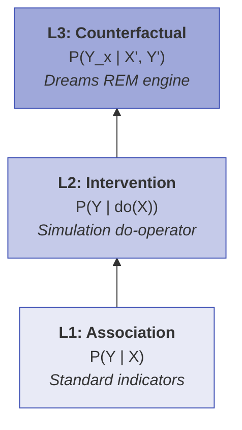

# 38 -- Signal Analysis

> Signal analysis is generalized pattern detection. Every structured domain --
> code, research, operations, markets -- shares the same mathematical bones:
> measurable state, time-series dynamics, feedback loops, pattern recurrence,
> adversarial participants, and external verification. The Oracle trait
> abstracts over these properties. Domain-specific implementations handle the
> details. HDC algebra, causal reasoning, evolutionary signal metabolism,
> topological shape extraction, somatic markers, and active inference compose
> into a single self-improving prediction infrastructure.

**Depends on**: [01-SIGNAL](01-SIGNAL.md) (Signal/Pulse, demurrage, HDC fingerprints), [02-CELL](02-CELL.md) (Cell protocols), [03-GRAPH](03-GRAPH.md) (Graph execution), [05-AGENT](05-AGENT.md) (CorticalState, EFE gating, cognitive tiers), [08-LEARNING](08-LEARNING.md) (CascadeRouter, episodes, playbooks), [09-MEMORY](09-MEMORY.md) (Store, demurrage economics), [10-DREAMS](10-DREAMS.md) (consolidation cycles), [11-AFFECT](11-AFFECT.md) (Daimon, PAD vectors)

**Implementation status (2026-09-15):** The Oracle trait and full domain-specific
implementations are **specified** design. The live runtime includes the
components that signal analysis builds on: `CascadeRouter` with UCB1/LinUCB
(in `roko-learn`), adaptive gate thresholds with EMA per rung (in
`.roko/learn/gate-thresholds.json`), per-turn efficiency events (in
`.roko/learn/efficiency.jsonl`), prompt experiments via `ExperimentStore`, HDC
fingerprinting per episode, and the T0/T1/T2 cognitive tier routing. The full
`PredictionStore`, `CalibrationTracker`, domain-specific oracle
implementations, and the active inference state space remain target design.

### Authoritative sources

| Surface | Source file / location |
|---|---|
| Cascade router | `crates/roko-learn/src/cascade_router.rs` |
| Adaptive gate thresholds | `crates/roko-learn/src/gate_threshold.rs` |
| Efficiency events | `crates/roko-learn/src/efficiency.rs` |
| HDC primitives | `crates/roko-primitives/src/hdc.rs` |
| Bayesian confidence | `crates/roko-learn/src/bayesian_confidence.rs` |
| Quality judge | `crates/roko-learn/src/quality_judge.rs` |
| Error enrichment | `crates/roko-learn/src/error_enrichment.rs` |

---

## 1. Vision: Signal Analysis as Generalized Pattern Detection

> **Cross-reference:** [depth/38-signal-analysis/01-vision.md](depth/38-signal-analysis/01-vision.md)

Technical analysis originated as a financial discipline -- chart patterns,
moving averages, momentum oscillators applied to price data. In Roko, TA is
generalized into a set of **universal oracle primitives**: prediction,
evaluation, calibration, and feedback loops that operate identically across any
domain where an agent interacts with a verifiable external system.

The core insight: code, research, and operations all share the structural
properties that make TA useful:

| Property | Code domain | Research domain | Operations domain |
|---|---|---|---|
| **Measurable state** | Compile time, test pass rate, complexity | Citation counts, publication velocity | Latency, error rates, throughput |
| **Time series dynamics** | Complexity trends, perf regression trajectories | Field maturity, paradigm shifts | Load patterns, failure cascades |
| **Feedback loops** | Tech debt accumulates, dev slows, more shortcuts | Popular papers attract citations, more visibility | Overload degrades perf, triggers more retries |
| **Pattern recurrence** | Similar code structures produce similar bugs | Similar methodologies produce similar reliability | Similar deploy patterns produce similar failures |
| **Adversarial dynamics** | Supply chain attacks, dependency confusion | p-hacking, selective reporting | DDoS, resource exhaustion |
| **External verification** | Compilers, test suites, benchmarks | Replication studies, meta-analyses | Health checks, SLA monitors |

The structural analogy is not metaphor -- it is a mathematical fact. If TA is
defined as "systematic prediction from structured time series with feedback,"
then TA applies to any domain with those properties. The Oracle trait makes
this concrete: all domains implement the same two-method interface.



### 1.1 Cross-domain insight transfer via HDC

When a coding agent learns "high-churn modules need more review," it encodes
this as an HDC vector: `BIND(high_complexity, more_review)`. When a research
agent learns "high-citation-velocity sources need more scrutiny," it encodes:
`BIND(high_citation_velocity, more_scrutiny)`. Both reduce to the abstract
structure `BIND(high_uncertainty, more_verification)`.

The Hamming similarity between these vectors is high because the HDC algebra
preserves structural isomorphism. Cross-domain insight transfer happens
automatically through the Neuro (knowledge) system at nanosecond cost (Kleyko
et al., 2022, *ACM Computing Surveys*).

### 1.2 Three cognitive speeds for oracles

Oracles operate at all three of Roko's cognitive timescales:

| Speed | Period | Oracle activity |
|---|---|---|
| **Gamma** (~5-15s) | Real-time | T0 probes evaluate prediction error scalar. No LLM. Zero cost. |
| **Theta** (~75s) | Reflection | Pending predictions resolved. Residuals computed. CalibrationTracker updated. |
| **Delta** (hours) | Consolidation | Cross-domain patterns consolidated. Routing tables updated. |

At Gamma frequency, T0 probes (FrugalGPT-inspired; Chen et al., 2023,
arXiv:2305.05176) compute a prediction error scalar that drives T0/T1/T2
cognitive tier routing:

```
error < 0.2  ->  T0 (suppress, no LLM)     ~80% of ticks
error < 0.6  ->  T1 (fast model, shallow)   ~15% of ticks
error >= 0.6 ->  T2 (full model, deep)      ~5% of ticks
```

---

## 2. The Oracle Trait

> **Cross-reference:** [depth/38-signal-analysis/02-oracle-trait.md](depth/38-signal-analysis/02-oracle-trait.md)

The `Oracle` trait is the single interface through which all prediction
capabilities are expressed. It is async, object-safe (`Send + Sync`), and
designed for composition:

```rust
pub trait Oracle: Send + Sync {
    /// Make a prediction about future state.
    async fn predict(
        &self,
        query: &OracleQuery,
        ctx: &Context,
    ) -> Result<Prediction>;

    /// Evaluate a past prediction against the actual outcome.
    async fn evaluate(
        &self,
        prediction: &Prediction,
        outcome: &Engram,
    ) -> Result<PredictionAccuracy>;
}
```

This follows Ousterhout's "deep module" principle (Ousterhout, 2018) -- the
interface is narrow (2 methods), but the implementation depth is substantial.

### 2.1 OracleQuery and OracleDomain

```rust
pub struct OracleQuery {
    pub id: ContentHash,
    pub domain: OracleDomain,
    pub payload: QueryPayload,
    pub horizon: Duration,
    pub min_confidence: f64,
    pub tags: BTreeMap<String, String>,
    pub created_at_ms: i64,
}

#[non_exhaustive]
pub enum OracleDomain {
    Coding,
    Research,
    Operations,
    Custom(String),
}
```

### 2.2 Prediction output

```rust
pub struct Prediction {
    pub id: ContentHash,
    pub query_id: ContentHash,
    pub value: PredictedValue,
    pub confidence: f64,
    pub interval: Option<PredictionInterval>,
    pub created_at_ms: i64,
    pub resolve_by_ms: i64,
    pub provenance: PredictionProvenance,
    pub lineage: Vec<ContentHash>,
    pub outcome: Option<PredictionOutcome>,
}

pub enum PredictedValue {
    Numeric(f64),
    Probability(f64),
    Ordinal { label: String, rank: u32 },
    Binary(bool),
    Compound(BTreeMap<String, PredictedValue>),
}

pub struct PredictionInterval {
    pub lower: f64,
    pub upper: f64,
    pub coverage: f64,
}
```

### 2.3 PredictionAccuracy -- The feedback signal

```rust
pub struct PredictionAccuracy {
    pub prediction_id: ContentHash,
    pub outcome_id: ContentHash,
    pub accuracy: f64,
    pub residual: f64,         // predicted - actual; positive = overestimate
    pub interval_hit: Option<bool>,
    pub resolution_lag_ms: i64,
    pub domain: OracleDomain,
    pub category: String,
}
```

### 2.4 Oracle composition and calibration

Multiple oracles compose into calibrated ensembles using three strategies:

| Strategy | Mechanism | Citation |
|---|---|---|
| **Weighted ensemble** | Inverse Brier score weighting | Cesa-Bianchi & Lugosi, 2006 |
| **Conformal prediction** | Distribution-free coverage guarantees: P(y in C(x)) >= 1 - alpha | Vovk et al., 2005; Angelopoulos & Bates, 2023 |
| **Post-hoc recalibration** | Isotonic regression, Platt scaling, temperature scaling | Zadrozny & Elkan, 2002; Platt, 1999; Guo et al., 2017 |

**Conformal prediction** provides the strongest guarantees: the coverage
guarantee holds for any distribution, requiring only exchangeability. The
quantile threshold q-hat = ceil((1-alpha)(n+1))/n of calibration nonconformity
scores produces prediction sets with finite-sample validity.

**Brier score decomposition** (Murphy, 1973) separates calibration quality into
orthogonal components:

```
Brier = REL - RES + UNC

REL (reliability): (1/N) SUM n_k (f_bar_k - o_bar_k)^2
    Measures calibration: do predicted probabilities match observed frequencies?
RES (resolution):  (1/N) SUM n_k (o_bar_k - o_bar)^2
    Measures discrimination: do different forecasts correspond to different outcomes?
UNC (uncertainty): o_bar(1 - o_bar)
    Base rate uncertainty (irreducible).
```

The `CalibrationTracker` in Roko tracks REL and RES separately: if REL is
high, apply `ResidualCorrector` or recalibration; if RES is low, the oracle's
features need improvement.

---

## 3. Coding Oracles

> **Cross-reference:** [depth/38-signal-analysis/03-coding-oracles.md](depth/38-signal-analysis/03-coding-oracles.md)

The `CodingOracle` implements the Oracle trait for software engineering
prediction: build time, test failure probability, complexity drift, dependency
risk, performance regression, and coverage impact.

### 3.1 Verification mechanisms

Coding oracles use deterministic external verifiers:

| Verifier | What it produces | Prediction it resolves |
|---|---|---|
| **Compiler** (rustc, gcc, tsc) | Success/failure + compile time | Build time, compilation success |
| **Test suite** (cargo test, pytest) | Pass/fail per test, total pass rate | Test failure probability |
| **Linter** (clippy, eslint) | Warning/error counts, complexity metrics | Complexity drift |
| **Benchmark** (criterion, hyperfine) | Throughput, latency distributions | Performance regression |
| **Coverage tool** (tarpaulin, llvm-cov) | Line/branch coverage | Coverage impact |
| **Vuln scanner** (cargo audit) | CVE counts, severity scores | Dependency risk |

### 3.2 Coding-specific prediction targets

**Build time prediction** uses historical compile time data plus change scope
analysis. An EMA of recent compile times, adjusted for change scope (files
changed, crates affected, incremental vs. full), produces the base prediction.

**Test failure prediction** uses file-to-test mapping (from `roko-index`) plus
per-test historical failure rates. Tests covering changed code are more likely
to fail. Flaky tests are discounted:

```rust
// Adjusted failure probability per test:
let adj_rate = base_failure_rate * (1.0 - flakiness);
expected_failures += adj_rate;
```

**Complexity drift detection** uses MACD-equivalent moving average crossovers:
short EMA (5 commits) vs. long EMA (25 commits). When the short EMA exceeds
the long EMA and acceleration is positive, complexity growth is accelerating --
an early warning signal.

**Dependency risk scoring** aggregates CVE risk, maintenance risk (time since
last commit, bus factor), depth risk, license risk, and popularity risk into a
decomposable composite score.

### 3.3 The T0 coding probes

Six coding-domain probes run at Gamma frequency with zero LLM cost:

1. **Build health** -- last compile status and trend
2. **Test regression** -- delta of passing test count since last run
3. **Complexity drift** -- MACD acceleration of cyclomatic complexity
4. **Dependency risk** -- new vulnerabilities in dependency tree
5. **Coverage delta** -- test coverage decrease magnitude
6. **Error rate** -- gate failure trend over last N tasks

### 3.4 Tech debt as a feedback loop

The coding oracle makes the tech-debt feedback loop observable:

```
Tech debt accumulates
  -> Development slows (increasing build times, more test failures)
  -> Engineers take more shortcuts (increasing complexity)
  -> More tech debt accumulates
```

When complexity drift acceleration exceeds a threshold, the oracle emits a
`Warning` knowledge entry via the Neuro subsystem with an estimate of commits
to crisis.

---

## 4. Research Oracles

> **Cross-reference:** [depth/38-signal-analysis/04-research-oracles.md](depth/38-signal-analysis/04-research-oracles.md)

The `ResearchOracle` evaluates sources, detects contradictions, estimates
information completeness, and predicts replication probability.

### 4.1 Research-specific prediction targets

**Source reliability estimation** aggregates venue quality, citation momentum,
author track record, methodology quality, internal consistency, and
cross-source agreement into a decomposable reliability score.

**Information completeness assessment** uses topic models to measure which
subtopics have been covered and which are missing. The stopping rule uses
Charnov's marginal value theorem (Charnov, 1976): stop researching when the
expected information gain per additional query drops below the cost.

**Contradiction detection** uses HDC encoding for nanosecond detection: encode
each claim as a 10,240-bit vector, compute Hamming similarity between claim
pairs, flag pairs with high semantic similarity but opposite conclusions.

**Replication probability estimation** is modeled on the Open Science
Collaboration's (2015) finding that only 36% of psychology studies replicate.
Features include statistical power, preregistration status, p-value proximity
to 0.05, number of comparisons, effect size magnitude, and field base rate.

**Citation momentum analysis** uses MACD over citation time series: positive
MACD indicates accelerating citations (growing influence), negative MACD
indicates decelerating citations (declining relevance), and MACD crossover
signals paradigm shifts.

### 4.2 Adversarial dynamics: p-hacking detection

The research domain's adversarial threat model centers on publication bias
(Simmons et al., 2011). Detection signals include p-value clustering below
0.05, effect sizes inconsistent with sample size, multiple unreported
comparisons, and selective reporting.

### 4.3 Verification mechanisms

Research verification is inherently weaker than coding verification -- there
is no compiler that produces deterministic pass/fail. Verification is
probabilistic, using cross-source agreement (immediate, moderate strength),
citation analysis (immediate, moderate), logical consistency (immediate,
moderate), replication studies (months/years, strong), and meta-analyses
(months/years, strong). The `CalibrationTracker` learns these domain-specific
accuracy profiles automatically.

---

## 5. Attestation Patterns

> **Cross-reference:** [depth/38-signal-analysis/05-attestation.md](depth/38-signal-analysis/05-attestation.md)

The attestation pipeline is the perception layer of signal analysis. Originally
designed for blockchain observation (the "witness" in legacy documents), it
generalizes to any structured data stream. Every oracle needs an attestation
source to feed it data.

### 5.1 Generalized attestation trait

```rust
pub trait Attestor: Send + Sync {
    /// Observe the current state of the domain.
    async fn observe(&self, since: i64) -> Result<Vec<Engram>>;
    /// Subscribe to a real-time stream of observations.
    async fn subscribe(&self) -> Result<mpsc::Receiver<Engram>>;
    /// Get current health status.
    fn health(&self) -> AttestorHealth;
}
```

Every domain has its own attestation source:

| Domain | Source | Data type | Cadence |
|---|---|---|---|
| **Coding** | File system, CI/CD, Git, test runners | Build results, test outcomes, code metrics | Per-commit or continuous |
| **Research** | APIs, databases, citation indices | Papers, citations, claims | On-demand or periodic |
| **Operations** | Metrics systems, log aggregators | Latency, error rates, throughput | Continuous (sub-second) |

### 5.2 Triage pipeline

Not every observation deserves attention. The triage pipeline filters and
classifies incoming data using streaming algorithms:

- **MIDAS-R** (Bhatia et al., 2020, *AAAI*): streaming anomaly detection,
  O(1) memory, sub-microsecond per update
- **DDSketch** (Masson et al., 2019, *PVLDB*): streaming percentile
  estimation with relative-error guarantees, O(1) memory per sketch

Together they allow the triage pipeline to process millions of observations per
second while maintaining constant memory usage.

### 5.3 CorticalState -- The shared signal bus

The `CorticalState` is the working memory for the attestation pipeline. All
signal analysis subsystems read from and write to this shared state:

```rust
pub struct CorticalState<const N: usize> {
    /// N atomic signal values, updated by T0 probes.
    pub signals: [AtomicF64; N],
    /// Current prediction error scalar (drives T0/T1/T2 routing).
    pub prediction_error: AtomicF64,
    /// Probe weights.
    pub weights: [AtomicF64; N],
    /// Current behavioral state from Daimon.
    pub behavioral_state: AtomicU8,
    /// Timestamp of last update.
    pub last_update_ms: AtomicI64,
}

pub type CodingCorticalState = CorticalState<6>;
```

All operations are atomic -- no locking, no allocation, sub-microsecond
latency. This enables the "80% of ticks cost nothing" property.

---

## 6. Hyperdimensional Analysis

> **Cross-reference:** [depth/38-signal-analysis/06-hdc-analysis.md](depth/38-signal-analysis/06-hdc-analysis.md)

HDC encodes signal analysis patterns as 10,240-bit vectors. Pattern algebra
(bind, bundle, permute) enables nanosecond cross-domain similarity search,
temporal composition, and shift-invariant pattern matching.

### 6.1 Pattern algebra

| Operation | HDC | Cost | What it does |
|---|---|---|---|
| **Bind** (XOR) | `A XOR B` | ~2ns | Associate two concepts |
| **Bundle** (majority) | `[A, B, C]` | ~10ns | Merge patterns |
| **Permute** (rotate) | `pi(A)` | ~1ns | Encode position/sequence |
| **Similarity** (Hamming) | `d(A, B)` | ~13ns | Compare patterns |

Signal analysis states are encoded as bundles of role-filler pairs:

```rust
pub fn encode_ta_state(observations: &[(HdcVector, HdcVector)]) -> HdcVector {
    let bound: Vec<HdcVector> = observations.iter()
        .map(|(role, filler)| role.xor(filler))
        .collect();
    HdcVector::bundle(&bound)
}
```

### 6.2 Temporal composition

Time series patterns are encoded using permutation to represent sequence:

```rust
pub fn encode_temporal_pattern(observations: &[HdcVector]) -> HdcVector {
    let permuted: Vec<HdcVector> = observations.iter()
        .enumerate()
        .map(|(i, obs)| obs.permute(i as u32))
        .collect();
    HdcVector::bundle(&permuted)
}
```

Shift-invariant pattern matching slides the template across a sequence and
returns the maximum similarity at any offset.

### 6.3 Cross-domain pattern matching

The deepest value of HDC for signal analysis is cross-domain insight resonance.
When a coding oracle encodes "high churn in auth module" and a research oracle
encodes "high citation retraction rate in subfield," the HDC vectors are
structurally similar because both encode `BIND(high_instability,
critical_area)`.

The threshold of 0.526 comes from information-theoretic analysis: with
10,240-bit vectors, random vectors have expected Hamming similarity of 0.500
with standard deviation ~0.005. A threshold of 0.526 (>5 sigma) ensures
detected similarities are statistically significant.

### 6.4 Pattern store and lifecycle

```rust
pub struct PatternStore {
    patterns: HashMap<OracleDomain, Vec<StoredPattern>>,
    cross_domain_index: Vec<(OracleDomain, HdcVector, ContentHash)>,
}

pub struct StoredPattern {
    pub vector: HdcVector,
    pub source_engram: ContentHash,
    pub outcome: Option<PredictionOutcome>,
    pub frequency: u64,
    pub reliability: f64,
}
```

**Pruning rules** (applied in order): unreliable patterns (reliability < 0.3
after 10+ observations), stale patterns (unmatched for 72 hours), redundant
patterns (similarity > 0.95 to another, keep higher reliability), LRU
eviction to budget.

### 6.5 Quantized numeric encoding

Continuous values are quantized into HDC vectors using thermometer encoding.
Level vectors use thermometer construction: `level_k` = `level_{k-1}` with
`dim / (2 * n_levels)` random bits flipped. Interpolation between adjacent
levels uses probabilistic bit selection weighted by proximity. This preserves
ordinal relationships: `encode(3.0)` is more similar to `encode(4.0)` than to
`encode(100.0)`.

### 6.6 Codebook generation

Codebooks are generated deterministically from a domain-specific seed
(SHA-256 of domain name -> ChaCha20 CSPRNG). All agents sharing a seed share
the same vector space, enabling direct cross-agent comparison without
alignment.

---

## 7. Adaptive Signal Metabolism

> **Cross-reference:** [depth/38-signal-analysis/07-signal-metabolism.md](depth/38-signal-analysis/07-signal-metabolism.md)

Signals are living organisms. They compete for attention, reproduce when
useful, die when obsolete, and evolve through mutation and selection. The
signal analysis subsystem is an ecological system governed by Hebbian learning
and replicator dynamics.

### 7.1 The signal as a 5-tuple

Each adaptive signal is a 5-tuple: (f, C, H, W, ctx) -- computation function,
confidence, HDC identity vector, weight (fitness), and domain context.

### 7.2 Hebbian learning

Signal confidence is updated via Oja's rule (Oja, 1982), a normalized Hebbian
variant that prevents runaway weight growth:

```
Delta_w = eta * y * (x - y * w)
```

where w = current confidence, x = signal value, y = outcome, eta = learning
rate (0.01-0.05 depending on domain).

### 7.3 Replicator dynamics

Signal weights evolve according to the replicator equation (Taylor & Jonker,
1978):

```
dw_i/dt = w_i * (f_i - f_bar)
```

Signals with above-average fitness gain weight; below-average signals lose
weight. This creates a self-organizing ensemble without manual threshold
tuning.

**Fisher's fundamental theorem** applies: the rate of increase in mean fitness
equals the variance in fitness:

```
V(fitness) = SUM w_i * (f_i - f_bar)^2
```

When V approaches 0, the ensemble has converged and needs mutation injection to
restore diversity.

### 7.4 Speciation and the Red Queen

New signals emerge through mutation of successful parents: the parent's HDC
vector is XORed with a sparse random noise vector (mutation rate ~0.05), and
signal function parameters are perturbed. Children start with low weight
(0.01) and must prove themselves.

**Red Queen pressure** (Van Valen, 1973): in adversarial environments, signals
must continuously evolve to maintain fitness. Implemented as constant downward
weight decay (`w *= 1 - decay_rate`). Without improvement, signals decay
toward zero.

### 7.5 Heartbeat integration

| Speed | Signal metabolism activity |
|---|---|
| **Gamma** (~5-15s) | Signals evaluate against current data. No learning. Cost: microseconds. |
| **Theta** (~75s) | Hebbian update + replicator dynamics step. Predictions resolve. |
| **Delta** (hours) | Full evolutionary step: speciation, extinction, Red Queen. Landscape analysis. |

---

## 8. Causal Microstructure Discovery

> **Cross-reference:** [depth/38-signal-analysis/08-causal-discovery.md](depth/38-signal-analysis/08-causal-discovery.md)

Correlation is not causation. The causal discovery subsystem uses Pearl's
structural causal models, Granger causality, and interventional experiments to
discover genuine causal relationships in structured domains.



### 8.1 Pearl's causal hierarchy

| Level | Question | Roko implementation |
|---|---|---|
| **L1: Association** | "What is P(Y given X)?" | Standard indicators (correlation, regression) |
| **L2: Intervention** | "What happens to Y if I do X?" | Simulation-backed do-operator |
| **L3: Counterfactual** | "Would Y have occurred if X hadn't?" | Dreams counterfactual engine (REM phase) |

### 8.2 Structural Causal Model (SCM)

```rust
pub struct StructuralCausalModel {
    pub exogenous: Vec<Variable>,
    pub endogenous: Vec<Variable>,
    pub equations: HashMap<VariableId, StructuralEquation>,
    pub graph: CausalGraph,
}
```

The do-operator `do(X = x)` intervenes on the model by setting variable X to
value x and removing all incoming edges to X. This breaks the causal mechanism
that normally determines X, allowing measurement of the pure causal effect of X
on downstream variables (Pearl, 2009, *Causality*).

### 8.3 Causal discovery algorithms

**PC Algorithm** (Spirtes, Glymour, & Scheines, 2000): discovers causal graph
structure from observational data via conditional independence testing. Three
phases: edge removal via conditional independence tests, v-structure
orientation, and Meek's orientation rules. Output: a Partially Directed
Acyclic Graph (PDAG).

**Granger causality** (Granger, 1969): tests whether past values of X help
predict Y beyond Y's own past values. Roko extends standard Granger causality
with: (1) irregular-interval support for domains without fixed cadence, (2)
nonlinear extensions via kernel methods, (3) confounding-robust variants that
condition on potential confounders, and (4) domain-specific lag calibration.

### 8.4 Interventional experiments via simulation

For domains with simulation capability, the agent can perform Level 2 causal
reasoning by running do-interventions on a simulated copy:

```
1. Identify candidate causal edge X -> Y in the learned graph
2. Fork the simulation state
3. Apply do(X = x) -- set X to a specific value, sever incoming edges
4. Observe the effect on Y in simulation
5. Compare with observational prediction (L1)
6. If they differ: the causal relationship is genuine
7. If they agree: may be confounded -- investigate further
```

### 8.5 Counterfactual reasoning via Dreams

During REM-phase dreaming, the agent evaluates counterfactual queries: "Would
the build have failed if I hadn't added that dependency?" The Dreams engine
replays the episode with the counterfactual intervention and compares outcomes.
This produces counterfactual knowledge entries in the Neuro store.

### 8.6 HDC encoding of causal graphs

Causal relationships are encoded as HDC vectors using role-filler composition:

```
cause_hv = BIND(BIND(cause_role, X_hv), BIND(effect_role, Y_hv))
```

This enables nanosecond causal pattern matching: when a new causal
relationship is discovered, HDC similarity search finds analogous causal
structures across domains.

---

## 9. Predictive Geometry and Resonant Patterns

> **Cross-reference:** [depth/38-signal-analysis/09-predictive-geometry.md](depth/38-signal-analysis/09-predictive-geometry.md)

Topological Data Analysis (TDA) extracts shape from time series. Persistence
landscapes provide a Banach space for pattern comparison. Resonant patterns are
living organisms with HDC genomes that compete for attention.

### 9.1 Persistence diagrams

A persistence diagram tracks the birth and death of topological features
(connected components, loops, voids) across a filtration. Each point (b, d)
represents a feature born at scale b and dying at scale d. Long-lived features
(d - b is large) represent genuine structure; short-lived features are noise.

Time series are embedded as point clouds using Takens' delay embedding, which
guarantees topological equivalence (Takens, 1981). Persistent homology
is then computed via a Rips filtration.

### 9.2 Persistence landscapes (Bubenik, 2015)

Persistence landscapes transform persistence diagrams into piecewise-linear
functions that live in a Banach space, enabling arithmetic operations:
addition, subtraction, scaling, and integration on topological features.
Key property: landscapes support statistical operations (mean, variance,
hypothesis testing) that are not well-defined on persistence diagrams directly.

The L^p norm measures total topological complexity. The landscape distance
between two time series quantifies their topological dissimilarity in a
mathematically rigorous way (stability theorem: small data perturbations
produce small landscape changes, bottleneck stability from Cohen-Steiner,
Edelsbrunner & Harer, 2007).

### 9.3 Topology-to-trajectory mapping

Topological features constrain trajectory predictions:

- **beta_0** (component count): if a time series has 2 connected components,
  any predicted trajectory must eventually converge or further diverge.
- **beta_1** (loop count): a persistent 1-cycle indicates periodic behavior
  that the prediction should account for.

Kernel regression maps topological features to trajectory parameters.

### 9.4 Resonant pattern ecosystem

Resonant patterns combine the evolutionary dynamics of signal metabolism
(Section 7) with the topological constraints of predictive geometry. Each
pattern has an HDC genome, a persistence landscape phenotype, and fitness
measured by prediction accuracy. Patterns compete for attention budget via
VCG auction bidding, reproduce via crossover of HDC genomes, and mutate via
topological perturbation.

---

## 10. Adversarial Signal Robustness

> **Cross-reference:** [depth/38-signal-analysis/10-adversarial-robustness.md](depth/38-signal-analysis/10-adversarial-robustness.md)

Every domain has adversaries who manipulate signals. Supply chain attackers
manipulate dependencies. p-hackers manipulate statistics. Adversarial actors
manipulate operational metrics. The adversarial robustness subsystem defends
predictions through decomposition, HDC prototype matching, robust statistics,
certified robustness, and red-team dreaming.

### 10.1 Adversarial signal decomposition

Every observed signal is modeled as a mixture:

```
observed = genuine + adversarial + noise
```

Identification uses four methods: statistical outlier detection (robust
statistics), causal consistency (does this signal fit the causal model?), HDC
prototype matching (does this match a known attack pattern?), and cross-source
verification (do independent sources agree?).

### 10.2 HDC prototype matching

Known adversarial patterns are encoded as HDC prototype vectors. Incoming
signals are compared against all prototypes via Hamming similarity at ~10ns per
comparison. For 1,000 known attack patterns: ~10 microseconds total. This runs at
Gamma frequency on every observation.

**Coding domain prototypes**: dependency confusion, typosquatting, malicious
build scripts, backdoored dependencies, test suite poisoning.

**Research domain prototypes**: p-value clustering, selective reporting, data
fabrication, citation manipulation.

### 10.3 Robust statistics

The robustness layer uses breakdown-point-optimal estimators:

- **Median/MAD** for location and scale (50% breakdown point)
- **Minimum Covariance Determinant (MCD)** for multivariate outlier detection
  (Rousseeuw, 1999)
- **Huber M-estimator** for bounded-influence regression

These estimators resist contamination: even if up to 50% of observations are
adversarial, the estimates remain useful.

### 10.4 Certified robustness

Certified robustness provides mathematical guarantees on prediction stability:

- **Randomized smoothing** (Cohen et al., 2019): proven L2 radius around each
  prediction within which the prediction is guaranteed stable
- **Lipschitz certification**: the oracle's Lipschitz constant L bounds the
  maximum prediction change per unit input change; certification radius R =
  margin / L
- **Interval Bound Propagation (IBP)**: propagate input intervals through the
  oracle to bound output ranges

### 10.5 Red-team dreaming

During Delta-frequency consolidation, the Dreams subsystem runs red-team
exercises: generate synthetic adversarial signals using current attack
prototypes plus novel perturbations, feed them through the oracle pipeline, and
measure which attacks succeed. Successful synthetic attacks become new defense
training data.

---

## 11. Somatic Signal Analysis and Emergent Multiscale Intelligence

> **Cross-reference:** [depth/38-signal-analysis/11-somatic-multiscale.md](depth/38-signal-analysis/11-somatic-multiscale.md)

Somatic signal analysis uses Damasio's somatic marker hypothesis (1994) to
create "gut feelings" about signal patterns. Emergent multiscale intelligence
measures integrated information (IIT Phi) across the signal analysis
subsystems.

### 11.1 Somatic markers as HDC bindings

Each somatic marker binds a signal analysis pattern vector to an affect (PAD)
vector:

```
marker_hv = BIND(pattern_hv, affect_hv)
```

Where `affect_hv = BUNDLE(BIND(pleasure_role, P), BIND(arousal_role, A),
BIND(dominance_role, D))`.

When the agent encounters a new pattern, it retrieves somatic markers with
similar pattern components and aggregates their affect. Cost: ~63ns per marker
comparison. This runs BEFORE analytical prediction -- System 1 cognition
(Kahneman, 2011) for agents.

**Mandatory contrarian retrieval**: 15% of retrieved markers must have opposite
valence (Bower, 1981) to prevent emotional echo chambers.

### 11.2 Integrated Information Theory (IIT) for signal analysis

Phi (Tononi, 2004; Tononi et al., 2016) measures the degree to which the 9
signal analysis subsystems working together produce more insight than the sum
of their individual contributions.

For 9 subsystems, the Minimum Information Bipartition (MIB) is computed over
all 510 non-trivial bipartitions -- small enough for exhaustive enumeration in
under 1ms.

### 11.3 Partial Information Decomposition (PID)

PID (Williams & Beer, 2010) decomposes the information provided by pairs of
subsystems about a target into four components:

```
I(S1, S2 ; T) = Redundancy + Unique_S1 + Unique_S2 + Synergy
```

Synergy is the emergent intelligence: information that only exists in the
interaction between subsystems. The system detects synergistic pairs and forms
somatic markers at their boundaries for fast future detection.

### 11.4 Integration with Daimon

Somatic assessment and Phi computation feed into the Daimon PAD vector:

- Somatic valence -> Pleasure dimension
- Phi value -> Dominance dimension (high integration = high confidence)
- Novel synergy detection -> Arousal dimension (surprise)

Phi is computed at Delta frequency only. At Theta, somatic markers serve as
fast proxies.

---

## 12. Predictive Foraging and Active Inference

> **Cross-reference:** [depth/38-signal-analysis/12-predictive-foraging.md](depth/38-signal-analysis/12-predictive-foraging.md)

Every knowledge retrieval is a falsifiable prediction. The CalibrationTracker
corrects biases at ~50ns per correction. Active inference (factorized discrete
POMDP with 90 states) drives context selection via Expected Free Energy.

### 12.1 The core loop

```
1. PREDICT    ->  Oracle.predict(query, ctx) -> Prediction
2. ACT        ->  Agent.execute(action) -> output
3. VERIFY     ->  Gate.verify(output) -> Engram (ground truth)
4. RESOLVE    ->  Oracle.evaluate(prediction, outcome) -> PredictionAccuracy
5. CORRECT    ->  ResidualCorrector.update(model, category, residual)
6. CALIBRATE  ->  CalibrationTracker.update(model, category, accuracy)
7. FEEDBACK   ->  Router.feedback(model, accuracy) -> updated bandit arms
8. LEARN      ->  Neuro.store(pattern) -> knowledge entry
```

Steps 5-8 cost ~50 nanoseconds total -- pure arithmetic, no LLM. This makes
the loop viable at Gamma frequency.

### 12.2 ResidualCorrector

Maintains per-(model, task_category) bias estimates as exponential moving
averages. Correction: `adjusted = raw - mean_bias(model, category)`.

```rust
pub struct ResidualCorrector {
    biases: DashMap<(String, String), ExponentialMovingAverage>,
    alpha: f64,  // EMA smoothing factor (typically 0.1)
}
```

At 1,000 predictions/day/agent: 50 microseconds total daily cost for corrections.

### 12.3 Active inference state space

The agent's state is a factorized discrete POMDP: 6 task complexity levels x 5
information states x 3 confidence states = 90 discrete states. The generative
model has four matrices: A (observation likelihood), B (transition dynamics), C
(preferred observations), D (initial prior).

**Expected Free Energy (EFE)** decomposes into three terms:

```
G(pi) = pragmatic_value + epistemic_value - ambiguity
```

- **Pragmatic value**: expected goal achievement (exploitation)
- **Epistemic value**: expected information gain (exploration)
- **Ambiguity**: expected observation noise (uncertainty)

High-uncertainty predictions bid more aggressively for context because
resolving them has high epistemic value (Friston, 2010).

### 12.4 Context foraging stopping rule

Charnov's marginal value theorem (Charnov, 1976) provides the optimal stopping
rule for context retrieval: stop when the marginal information gain of the next
retrieval drops below the average gain rate across all context patches.

```
Retrieve next item if:
    marginal_gain(next_item) > gain_rate * marginal_cost(next_item)
```

This naturally balances breadth (exploring many topics) vs. depth (going deep
on one topic) based on the current information landscape.

### 12.5 Thompson Sampling for oracle selection

When multiple oracle implementations are available, Thompson Sampling
(Thompson, 1933) selects which oracle to use by sampling from each oracle's
Beta(alpha, beta) distribution and choosing the highest sample. For
non-stationary environments, the f-dsw variant (Raj & Kalyani, 2017) adds
discounting to track changing oracle quality.

---

## 13. Sheaf-Tropical Geometry

> **Cross-reference:** [depth/38-signal-analysis/13-sheaf-tropical.md](depth/38-signal-analysis/13-sheaf-tropical.md)

Sheaf theory provides local-to-global consistency guarantees across distributed
oracle subsystems. Tropical geometry reveals the piecewise-linear decision
boundaries of oracle policies and connects symbolic planning with neural
computation via the max-plus semiring.

### 13.1 Sheaf theory for oracle consistency

The 9 signal analysis subsystems each produce predictions that must be locally
consistent. Sheaf theory (Bredon, 1997; Curry, 2014) formalizes this: a
cellular sheaf assigns a vector space to each subsystem (its "prediction
space") and linear maps between adjacent subsystems (their "consistency
constraints").

The **coboundary operator** delta measures inconsistency:

```
(delta s)(e_{ij}) = rho_{vj, eij}(s(vj)) - rho_{vi, eij}(s(vi))
```

A section is consistent (a global section) iff `delta s = 0`. The norm
`||delta s||^2` measures total inconsistency.

The **sheaf Laplacian** `L_F = delta^T delta` generalizes the graph Laplacian.
Its spectral properties (Hansen & Ghrist, 2019): kernel = globally consistent
sections, smallest nonzero eigenvalue = consistency gap, with Fiedler-like
bound `lambda_1 >= h^2(F)/2`.

**Sheaf cohomology** H^k(G, F) detects structural inconsistencies: H^0 =
globally consistent sections, H^1 = obstructions to consistency that cannot be
resolved by adjusting individual predictions.

This provides the algebraic explanation for why certain bipartitions in the Phi
computation (Section 11) lose less information -- they correspond to sheaf
subcomplexes with low H^1.

### 13.2 Tropical geometry for decision boundaries

Every oracle prediction that selects among discrete outcomes computes a maximum
over score functions -- this is inherently tropical arithmetic in the max-plus
semiring: `a + b = max(a, b)`, `a * b = a + b`.

Key insight (Zhang et al., 2018, *ICML*): a ReLU neural network computes a
tropical rational function. The decision boundary of `max(f1(x), f2(x))` is a
tropical hypersurface -- a piecewise-linear codimension-1 set.

**Tropical robustness analysis**: the Lipschitz constant L of a tropical
polynomial is `max_i ||a_i||` (exact, not a bound). The distance to the
nearest decision boundary is `margin / ||gradient_diff||` (exact adversarial
perturbation distance).

**Tropical convexity** (Develin & Sturmfels, 2004): each oracle's prediction
space is tropically convex. The tropical convex hull of successful prediction
prototypes defines the oracle's competence region in a way that respects the
max-plus structure.

**Tropical attention** (arXiv:2505.17190, 2025): attention mechanism native to
the max-plus semiring, directly approximating dynamic programming algorithms.
Applied to task selection in the plan DAG executor.

---

## Academic Foundations

### Signal analysis as generalized TA
- Friston, K. (2010). "The free-energy principle: a unified brain theory?" *Nature Reviews Neuroscience*, 11(2), 127-138.
- Conant, R. C., & Ashby, W. R. (1970). "Every good regulator of a system must be a model of that system." *International Journal of Systems Science*, 1(2), 89-97.
- Sumers, T. R., et al. (2023). "Cognitive Architectures for Language Agents." arXiv:2309.02427.
- Lee, S., et al. (2026). "Meta-Harness: Optimizing Harness, Not Model." arXiv:2603.28052.

### Oracle trait and calibration
- Ousterhout, J. (2018). *A Philosophy of Software Design*. Yaknyam Press.
- Murphy, A. H. (1973). "A New Vector Partition of the Probability Score." *J. Applied Meteorology*, 12(4), 595-600.
- Vovk, V., Gammerman, A., & Shafer, G. (2005). *Algorithmic Learning in a Random World*. Springer.
- Angelopoulos, A. N., & Bates, S. (2023). "Conformal Prediction: A Gentle Introduction." arXiv:2107.07511.
- Naeini, M. P., Cooper, G., & Hauskrecht, M. (2015). "Obtaining Well Calibrated Probabilities." *AAAI 2015*.
- Guo, C., et al. (2017). "On Calibration of Modern Neural Networks." *ICML 2017*.
- Cesa-Bianchi, N., & Lugosi, G. (2006). *Prediction, Learning, and Games*. Cambridge University Press.

### Coding oracles
- McCabe, T. J. (1976). "A Complexity Measure." *IEEE Trans. Software Engineering*, SE-2(4), 308-320.
- Lehman, M. M. (1980). "Programs, Life Cycles, and Laws of Software Evolution." *Proc. IEEE*, 68(9), 1060-1076.
- Nagappan, N., & Ball, T. (2005). "Use of Relative Code Churn Measures to Predict System Defect Density." *ICSE 2005*.
- Chen, L., et al. (2023). "FrugalGPT." arXiv:2305.05176.

### Research oracles
- Open Science Collaboration. (2015). "Estimating the reproducibility of psychological science." *Science*, 349(6251), aac4716.
- Simmons, J. P., et al. (2011). "False-Positive Psychology." *Psychological Science*, 22(11), 1359-1366.
- Ioannidis, J. P. A. (2005). "Why Most Published Research Findings Are False." *PLoS Medicine*, 2(8), e124.

### HDC
- Kanerva, P. (2009). "Hyperdimensional Computing." *Cognitive Computation*, 1(2), 139-159.
- Kleyko, D., et al. (2022). "A Survey on Hyperdimensional Computing." *ACM Computing Surveys*, 54(6), 1-51.
- Plate, T. A. (1995). "Holographic Reduced Representations." *IEEE Trans. Neural Networks*, 6(3), 623-641.
- Frady, E. P., Kleyko, D., & Sommer, F. T. (2018). "A Theory of Sequence Indexing." *Neural Computation*, 30(6), 1449-1513.

### Signal metabolism
- Taylor, P. D., & Jonker, L. B. (1978). "Evolutionary Stable Strategies." *Mathematical Biosciences*, 40(1-2), 145-156.
- Fisher, R. A. (1930). *The Genetical Theory of Natural Selection*. Clarendon Press.
- Wright, S. (1932). "The Roles of Mutation, Inbreeding, Crossbreeding, and Selection." *Proc. Sixth International Congress of Genetics*.
- Van Valen, L. (1973). "A New Evolutionary Law." *Evolutionary Theory*, 1, 1-30.
- Oja, E. (1982). "Simplified neuron model as a principal component analyzer." *J. Mathematical Biology*, 15(3), 267-273.
- Hebb, D. O. (1949). *The Organization of Behavior*. Wiley.

### Causal discovery
- Pearl, J. (2009). *Causality: Models, Reasoning, and Inference*. 2nd ed. Cambridge University Press.
- Spirtes, P., Glymour, C., & Scheines, R. (2000). *Causation, Prediction, and Search*. 2nd ed. MIT Press.
- Granger, C. W. J. (1969). "Investigating causal relations by econometric models." *Econometrica*, 37(3), 424-438.

### Predictive geometry and TDA
- Bubenik, P. (2015). "Statistical topological data analysis using persistence landscapes." *JMLR*, 16, 77-102.
- Takens, F. (1981). "Detecting strange attractors in turbulence." *Lecture Notes in Mathematics*, 898.
- Cohen-Steiner, D., Edelsbrunner, H., & Harer, J. (2007). "Stability of persistence diagrams." *Discrete & Computational Geometry*, 37(1), 103-120.

### Adversarial robustness
- Cohen, J. M., et al. (2019). "Certified Adversarial Robustness via Randomized Smoothing." *ICML 2019*.
- Rousseeuw, P. J. (1999). "A Fast Algorithm for the Minimum Covariance Determinant Estimator." *Technometrics*, 41(3), 212-223.
- Bhatia, S., et al. (2020). "MIDAS: Microcluster-Based Detector of Anomalies." *AAAI 2020*.
- Masson, C., et al. (2019). "DDSketch." *PVLDB*, 12(12), 2195-2205.

### Somatic markers and IIT
- Damasio, A. R. (1994). *Descartes' Error*. Putnam.
- Kahneman, D. (2011). *Thinking, Fast and Slow*. Farrar, Straus and Giroux.
- Mehrabian, A., & Russell, J. A. (1974). *An Approach to Environmental Psychology*. MIT Press.
- Bower, G. H. (1981). "Mood and Memory." *American Psychologist*, 36(2), 129-148.
- Tononi, G. (2004). "An information integration theory of consciousness." *BMC Neuroscience*, 5(42).
- Tononi, G., et al. (2016). "Integrated information theory." *Nature Reviews Neuroscience*, 17(7), 450-461.
- Williams, P. L., & Beer, R. D. (2010). "Nonnegative decomposition of multivariate information." arXiv:1004.2515.

### Predictive foraging
- Charnov, E. L. (1976). "Optimal foraging: the marginal value theorem." *Theoretical Population Biology*, 9, 129-136.
- Pirolli, P., & Card, S. (1999). "Information foraging." *Psychological Review*, 106(4), 643-675.
- Thompson, W. R. (1933). "On the Likelihood that One Unknown Probability Exceeds Another." *Biometrika*, 25(3-4), 285-294.
- Raj, V., & Kalyani, S. (2017). "Taming Non-stationary Bandits." arXiv:1707.09727.

### Sheaf and tropical geometry
- Hansen, J., & Ghrist, R. (2019). "Toward a Spectral Theory of Cellular Sheaves." *J. Applied and Computational Topology*, 3, 315-358.
- Bodnar, C., et al. (2022). "Neural Sheaf Diffusion." arXiv:2202.04579.
- Curry, J. (2014). "Sheaves, Cosheaves and Applications." arXiv:1303.3255.
- Bredon, G. E. (1997). *Sheaf Theory*. 2nd ed. Springer.
- Zhang, L., Naitzat, G., & Lim, L.-H. (2018). "Tropical Geometry of Deep Neural Networks." *ICML 2018*.
- Tran, N. M., & Yu, J. (2019). "Product-Mix Auctions and Tropical Geometry." *Mathematics of Operations Research*, 44(4).
- Develin, M., & Sturmfels, B. (2004). "Tropical Convexity." *Documenta Mathematica*, 9, 1-27.
- arXiv:2505.17190 (2025). "Tropical Attention: Neural Algorithmic Reasoning for Combinatorial Algorithms."

### VCG mechanism
- Vickrey, W. (1961). "Counterspeculation, Auctions, and Competitive Sealed Tenders." *J. Finance*, 16(1), 8-37.
- Clarke, E. H. (1971). "Multipart Pricing of Public Goods." *Public Choice*, 11(1), 17-33.
- Groves, T. (1973). "Incentives in Teams." *Econometrica*, 41(4), 617-631.
