# Architecture Explorer

An interactive view of the Roko system architecture. Components are organized
by tier, from the core kernel at the bottom to user-facing surfaces at the top.
Click any component name to jump to its documentation. Dependency arrows show
the primary compile-time relationships.

## Interactive Crate Graph

The interactive visualization below lets you explore the full crate dependency
graph. Click any node to see its details (LOC, test count, dependencies, and
a link to its docs chapter). Hover over a node to highlight its direct
dependencies and dependents. Use the toolbar to zoom and pan.

<ClientOnly>
  <ArchitectureExplorer />
</ClientOnly>

::: tip Navigation
Click a component box to see its detail panel. Hover over any box to
highlight its dependency edges. Use the +/- buttons or mouse wheel to zoom,
and drag on empty space to pan.
:::

::: details Static Mermaid fallback (for non-interactive environments)

## System Architecture

```mermaid
graph TB
    subgraph T9["Tier 9: Apps and Tests"]
        direction LR
        AR["agent-relay<br/><i>Bounded envelope relay</i>"]
        MR["mirage-rs<br/><i>In-process EVM fork</i>"]
        CW["roko-chain-watcher<br/><i>Chain observer agent</i>"]
        DM["roko-demo<br/><i>Demo scenarios</i>"]
    end

    subgraph T8["Tier 8: Chain and Economy"]
        direction LR
        CHAIN["roko-chain<br/><i>Registry, marketplace,<br/>arena, DeFi state machines</i>"]
    end

    subgraph T7["Tier 7: MCP, Plugin, Gateway"]
        direction LR
        MCPGH["roko-mcp-github<br/><i>GitHub plan PRs, CI</i>"]
        MCPSTDIO["roko-mcp-stdio<br/><i>JSON-RPC transport</i>"]
        PLUGIN["roko-plugin<br/><i>Signed deps, WASM hooks,<br/>strict admission</i>"]
        GATEWAY["roko-gateway<br/><i>9-stage inference pipeline,<br/>caching, cost, backpressure</i>"]
        EVAL["roko-eval<br/><i>Evidence collector,<br/>criterion, profiles</i>"]
    end

    subgraph T6["Tier 6: Code Intelligence"]
        direction LR
        IDX["roko-index<br/><i>Parser, symbol graph,<br/>PageRank, HDC</i>"]
        MCPCODE["roko-mcp-code<br/><i>Code-intel MCP server</i>"]
        LANGRS["roko-lang-rust<br/><i>Rust tree-sitter</i>"]
        LANGTS["roko-lang-typescript<br/><i>TypeScript support</i>"]
        LANGGO["roko-lang-go<br/><i>Go support</i>"]
    end

    subgraph T5["Tier 5: External Interfaces"]
        direction LR
        CLI["roko-cli<br/><i>85+ commands, TUI,<br/>plan runner</i>"]
        SERVE["roko-serve<br/><i>REST routes,<br/>SSE, WebSocket</i>"]
        ACP["roko-acp<br/><i>Editor integration<br/>(Cursor, etc.)</i>"]
        AGSERV["roko-agent-server<br/><i>Per-agent sidecar<br/>14 routes</i>"]
    end

    subgraph T4["Tier 4: Learning and Memory"]
        direction LR
        LEARN["roko-learn<br/><i>Episodes, routing,<br/>playbooks, experiments</i>"]
        NEURO["roko-neuro<br/><i>Knowledge store,<br/>distillation, tiers</i>"]
        DREAMS["roko-dreams<br/><i>Offline consolidation,<br/>pattern extraction</i>"]
        DAIMON["roko-daimon<br/><i>Affect engine,<br/>somatic markers</i>"]
    end

    subgraph T3["Tier 3: Agent and Composition"]
        direction LR
        AGENT["roko-agent<br/><i>12 LLM providers,<br/>tool loop, MCP, safety</i>"]
        COMPOSE["roko-compose<br/><i>9-layer prompt builder,<br/>11 role templates</i>"]
        GATE["roko-gate<br/><i>19 gates, 7 rungs,<br/>adaptive thresholds</i>"]
        CONDUCTOR["roko-conductor<br/><i>12 watchers,<br/>circuit breaker</i>"]
    end

    subgraph T2["Tier 2: Execution Engine"]
        direction LR
        GRAPH["roko-graph<br/><i>Sole execution engine:<br/>DAG cells, parallel waves</i>"]
        EXEC["roko-execution<br/><i>RuntimeServices builder,<br/>shared service facade</i>"]
        RUNTIME["roko-runtime<br/><i>ProcessSupervisor,<br/>event bus, cancellation</i>"]
    end

    subgraph T1["Tier 1: Core Kernel"]
        direction LR
        CORE["roko-core<br/><i>Signal type, 12 traits,<br/>config, tools, errors</i>"]
        PRIMS["roko-primitives<br/><i>HDC vectors, PAD affect,<br/>tier routing</i>"]
        FS["roko-fs<br/><i>JSONL substrate,<br/>GC, file layout</i>"]
        STD["roko-std<br/><i>Default trait impls,<br/>tool registry</i>"]
    end

    %% Primary dependency edges
    CLI --> EXEC
    SERVE --> EXEC
    ACP --> EXEC
    AGSERV --> AGENT

    EXEC --> GRAPH
    EXEC --> RUNTIME

    GRAPH --> AGENT
    GRAPH --> COMPOSE
    GRAPH --> GATE
    GRAPH --> CONDUCTOR

    AGENT --> LEARN
    GATE --> LEARN
    COMPOSE --> NEURO
    COMPOSE --> DAIMON
    LEARN --> NEURO
    NEURO --> DREAMS

    AGENT --> CORE
    COMPOSE --> CORE
    GATE --> CORE
    LEARN --> CORE
    NEURO --> CORE
    GRAPH --> CORE
    CONDUCTOR --> CORE

    CORE --> PRIMS
    CORE --> FS
    CORE --> STD

    IDX --> CORE
    MCPCODE --> IDX
    LANGRS --> IDX
    LANGTS --> IDX
    LANGGO --> IDX

    PLUGIN --> CORE
    GATEWAY --> CORE
    EVAL --> CORE
    MCPGH --> MCPSTDIO

    CHAIN --> CORE

    AR --> CORE
    MR --> CORE

    %% Tier coloring
    style T1 fill:#fce4ec,stroke:#b71c1c,stroke-width:2px
    style T2 fill:#e3f2fd,stroke:#1565c0,stroke-width:2px
    style T3 fill:#fff3e0,stroke:#e65100,stroke-width:2px
    style T4 fill:#f3e5f5,stroke:#6a1b9a,stroke-width:2px
    style T5 fill:#e8f5e9,stroke:#2e7d32,stroke-width:2px
    style T6 fill:#e0f2f1,stroke:#00695c,stroke-width:2px
    style T7 fill:#fff8e1,stroke:#f57f17,stroke-width:2px
    style T8 fill:#efebe9,stroke:#4e342e,stroke-width:2px
    style T9 fill:#eceff1,stroke:#37474f,stroke-width:2px

    %% Component link targets
    click CORE "/01-SIGNAL" "Signal type and kernel traits"
    click PRIMS "/depth/00-architecture/score-7-axis-appraisal" "HDC vectors and tier routing"
    click FS "/depth/00-architecture/substrate-trait" "JSONL substrate"
    click STD "/depth/00-architecture/scorer-gate-router-composer-policy" "Default trait implementations"
    click GRAPH "/03-GRAPH" "Graph execution engine"
    click EXEC "/04-EXECUTION" "RuntimeServices builder"
    click RUNTIME "/depth/04-execution/runtime-harness" "Process supervisor and event bus"
    click AGENT "/05-AGENT" "Agent dispatch and providers"
    click COMPOSE "/06-COMPOSITION" "Prompt composition"
    click GATE "/07-GATES" "Gate pipeline"
    click CONDUCTOR "/30-CONDUCTOR" "Conductor watchers"
    click LEARN "/08-LEARNING" "Learning subsystem"
    click NEURO "/09-MEMORY" "Knowledge store"
    click DREAMS "/10-DREAMS" "Dream consolidation"
    click DAIMON "/11-AFFECT" "Affect engine"
    click CLI "/28-CLI" "CLI reference"
    click SERVE "/26-HTTP-API" "HTTP API"
    click ACP "/27-ACP" "ACP protocol"
    click AGSERV "/depth/26-http/04-sidecar-api" "Agent sidecar"
    click IDX "/34-CODE-INTELLIGENCE" "Code intelligence"
    click MCPCODE "/depth/19-tools/mcp-architecture" "Code-intel MCP"
    click LANGRS "/depth/34-code-intel/language-providers" "Rust language provider"
    click LANGTS "/depth/34-code-intel/language-providers" "TypeScript language provider"
    click LANGGO "/depth/34-code-intel/language-providers" "Go language provider"
    click PLUGIN "/depth/19-tools/plugin-sdk" "Plugin SDK"
    click GATEWAY "/20-GATEWAY" "Inference gateway"
    click EVAL "/depth/07-gates/evaluation-lifecycle" "Evaluation framework"
    click MCPGH "/depth/19-tools/mcp-github" "GitHub MCP"
    click MCPSTDIO "/depth/19-tools/mcp-architecture" "MCP stdio transport"
    click CHAIN "/23-PAYMENTS-ECONOMY" "Chain and economy"
    click AR "/18-CONNECTIVITY" "Agent relay"
```

:::

## Component Quick Reference

Each tier groups crates by abstraction level. Dependencies flow downward:
higher tiers depend on lower tiers, never the reverse.

### Tier 1: Core Kernel {#tier-1}

The vocabulary layer. These crates define the types and trait contracts that
every other crate depends on. They perform no I/O themselves.

| Crate | Primary responsibility | Key types |
|-------|----------------------|-----------|
| [roko-core](/01-SIGNAL) | Signal type, 12 kernel traits, config, tools, errors | `Signal`, `ContentHash`, `Kind`, `Score` |
| [roko-primitives](/depth/00-architecture/score-7-axis-appraisal) | Pre-core math: HDC vectors, PAD affect, tier routing | `HdcVector`, `PadVector`, `InferenceTier` |
| [roko-fs](/depth/00-architecture/substrate-trait) | Append-only JSONL substrate, GC, workspace layout | `FileSubstrate`, `RokoLayout` |
| [roko-std](/depth/00-architecture/scorer-gate-router-composer-policy) | Default trait implementations, tool registry | `SumScorer`, `StaticToolRegistry` |

### Tier 2: Execution Engine {#tier-2}

The machinery that runs task DAGs.

| Crate | Primary responsibility | Key types |
|-------|----------------------|-----------|
| [roko-graph](/03-GRAPH) | Sole execution engine: DAG cells, wave execution, cost enforcement | `GraphEngine`, `ProductionPlanTopology` |
| [roko-execution](/04-EXECUTION) | Shared runtime services builder for CLI/serve/ACP | `RuntimeServices` |
| [roko-runtime](/depth/04-execution/runtime-harness) | Process supervisor, event bus, cancellation tokens | `ProcessSupervisor`, `EventBus` |

### Tier 3: Agent and Composition {#tier-3}

LLM dispatch, prompt assembly, and verification.

| Crate | Primary responsibility | Key types |
|-------|----------------------|-----------|
| [roko-agent](/05-AGENT) | 12 LLM provider backends, tool loop, MCP, safety layer | `AgentDispatcher`, `SafetyLayer` |
| [roko-compose](/06-COMPOSITION) | 9-layer prompt builder, 11 role templates, enrichment | `SystemPromptBuilder`, `RoleSystemPromptSpec` |
| [roko-gate](/07-GATES) | 19 gate types, 7-rung pipeline, adaptive thresholds | `GatePipeline`, `AdaptiveThresholds` |
| [roko-conductor](/30-CONDUCTOR) | 12 watchers, circuit breaker, diagnosis engine | `Conductor`, `CircuitBreaker` |

### Tier 4: Learning and Memory {#tier-4}

The feedback loop that makes the system improve over time.

| Crate | Primary responsibility | Key types |
|-------|----------------------|-----------|
| [roko-learn](/08-LEARNING) | Episodes, playbooks, bandits, cascade routing, experiments | `CascadeRouter`, `EpisodeLogger` |
| [roko-neuro](/09-MEMORY) | Durable knowledge store, distillation, tier progression | `KnowledgeStore`, `KnowledgeEntry` |
| [roko-dreams](/10-DREAMS) | Offline consolidation, pattern extraction, scheduling | `DreamCycle`, `Hypnagogia` |
| [roko-daimon](/11-AFFECT) | Affect engine, somatic markers, dispatch modulation | `DaimonState`, `DispatchModulation` |

### Tier 5: External Interfaces {#tier-5}

User-facing and integration surfaces.

| Crate | Primary responsibility | Scale |
|-------|----------------------|-------|
| [roko-cli](/28-CLI) | Main binary, 85+ commands, plan runner, TUI dashboard | 10 TUI tabs (F1-F10) |
| [roko-serve](/26-HTTP-API) | HTTP control plane on :6677 | REST routes + SSE + WS |
| [roko-acp](/27-ACP) | Editor integration protocol (Cursor, etc.) | 180 tests |
| [roko-agent-server](/depth/26-http/04-sidecar-api) | Per-agent HTTP sidecar | 14 routes |

### Tier 6-9: Ecosystem {#tier-6-9}

Code intelligence, MCP servers, plugins, chain primitives, and standalone apps.
See the [Crate Map](./crate-map) for the full dependency diagram.

---

## Related

- [Architecture Guide](/35-ARCHITECTURE) -- narrative companion with worked examples
- [Crate Map](./crate-map) -- detailed dependency diagram with all 37 crates
- [Data Flow Animator](./data-flow) -- step-through animated workflows
