# Crate Map

All 37 workspace crates and 3 standalone apps, organized by tier and showing
the primary compile-time dependency edges. Color-coded by abstraction level.
Click any crate to jump to its documentation.

::: info Reading the diagram
- **Arrows** point from dependent to dependency (A --> B means A depends on B).
- **Tiers** are numbered 1-9 from most foundational (bottom) to most user-facing (top).
- **Solid boxes** are shipped binaries or libraries. All 37 are workspace members.
- Only primary/direct dependencies are shown. Transitive dependencies through
  roko-core are omitted for clarity.
:::

## Full Dependency Graph

```mermaid
graph TB
    %% ── Tier 1: Core Kernel ──────────────────────────────────────
    subgraph T1["Tier 1: Core Kernel"]
        direction LR
        core["<b>roko-core</b><br/><sub>Signal, 12 traits, config,<br/>tools, errors</sub>"]
        primitives["<b>roko-primitives</b><br/><sub>HDC vectors, PAD,<br/>tier routing</sub>"]
        fs["<b>roko-fs</b><br/><sub>JSONL substrate,<br/>GC, layout</sub>"]
        std["<b>roko-std</b><br/><sub>Default impls,<br/>tool registry</sub>"]
    end

    %% ── Tier 2: Execution Engine ─────────────────────────────────
    subgraph T2["Tier 2: Execution Engine"]
        direction LR
        graph_e["<b>roko-graph</b><br/><sub>Sole engine: DAG cells,<br/>waves, cost, checkpoints</sub>"]
        execution["<b>roko-execution</b><br/><sub>RuntimeServices builder,<br/>shared facade</sub>"]
        runtime["<b>roko-runtime</b><br/><sub>ProcessSupervisor,<br/>event bus, cancel</sub>"]
    end

    %% ── Tier 3: Agent and Composition ────────────────────────────
    subgraph T3["Tier 3: Agent and Composition"]
        direction LR
        agent["<b>roko-agent</b><br/><sub>12 providers, tool loop,<br/>MCP, safety</sub>"]
        compose["<b>roko-compose</b><br/><sub>9-layer prompts,<br/>11 templates</sub>"]
        gate["<b>roko-gate</b><br/><sub>19 gates, 7 rungs,<br/>adaptive EMA</sub>"]
        conductor["<b>roko-conductor</b><br/><sub>12 watchers,<br/>circuit breaker</sub>"]
    end

    %% ── Tier 4: Learning and Memory ──────────────────────────────
    subgraph T4["Tier 4: Learning and Memory"]
        direction LR
        learn["<b>roko-learn</b><br/><sub>Episodes, routing,<br/>playbooks, bandits</sub>"]
        neuro["<b>roko-neuro</b><br/><sub>Knowledge store,<br/>distillation, tiers</sub>"]
        dreams["<b>roko-dreams</b><br/><sub>Consolidation,<br/>pattern extraction</sub>"]
        daimon["<b>roko-daimon</b><br/><sub>Affect engine,<br/>somatic markers</sub>"]
    end

    %% ── Tier 5: External Interfaces ──────────────────────────────
    subgraph T5["Tier 5: External Interfaces"]
        direction LR
        cli["<b>roko-cli</b><br/><sub>85+ commands, TUI,<br/>plan runner, F1-F10</sub>"]
        serve["<b>roko-serve</b><br/><sub>~376 routes, SSE, WS<br/>port 6677</sub>"]
        acp["<b>roko-acp</b><br/><sub>Editor protocol<br/>180 tests</sub>"]
        agent_server["<b>roko-agent-server</b><br/><sub>Per-agent sidecar<br/>14 routes</sub>"]
    end

    %% ── Tier 6: Code Intelligence ────────────────────────────────
    subgraph T6["Tier 6: Code Intelligence"]
        direction LR
        index["<b>roko-index</b><br/><sub>Parser, symbols,<br/>PageRank, HDC</sub>"]
        mcp_code["<b>roko-mcp-code</b><br/><sub>Code-intel MCP<br/>shipped binary</sub>"]
        lang_rs["<b>roko-lang-rust</b><br/><sub>Rust tree-sitter</sub>"]
        lang_ts["<b>roko-lang-typescript</b><br/><sub>TS support</sub>"]
        lang_go["<b>roko-lang-go</b><br/><sub>Go support</sub>"]
    end

    %% ── Tier 7: MCP, Plugin, Gateway ─────────────────────────────
    subgraph T7["Tier 7: MCP, Plugin, Gateway"]
        direction LR
        mcp_gh["<b>roko-mcp-github</b><br/><sub>GitHub plan PRs,<br/>CI integration</sub>"]
        mcp_stdio["<b>roko-mcp-stdio</b><br/><sub>JSON-RPC 2.0<br/>transport</sub>"]
        mcp_slack["<b>roko-mcp-slack</b><br/><sub>Slack MCP</sub>"]
        mcp_scripts["<b>roko-mcp-scripts</b><br/><sub>Script exec MCP</sub>"]
        plugin["<b>roko-plugin</b><br/><sub>Signed deps, WASM,<br/>strict admission</sub>"]
        gateway["<b>roko-gateway</b><br/><sub>9-stage inference,<br/>cache, cost, backpressure</sub>"]
        eval["<b>roko-eval</b><br/><sub>Evidence, criterion,<br/>profile traits</sub>"]
    end

    %% ── Tier 8: Chain and Economy ────────────────────────────────
    subgraph T8["Tier 8: Chain and Economy"]
        direction LR
        chain["<b>roko-chain</b><br/><sub>Registry, marketplace,<br/>arena, DeFi, x402</sub>"]
    end

    %% ── Tier 9: Apps and Tests ───────────────────────────────────
    subgraph T9["Tier 9: Apps and Tests"]
        direction LR
        relay["<b>agent-relay</b><br/><sub>Envelope relay,<br/>atomic recovery</sub>"]
        mirage["<b>mirage-rs</b><br/><sub>In-process EVM fork</sub>"]
        watcher["<b>roko-chain-watcher</b><br/><sub>Chain observer agent</sub>"]
        demo["<b>roko-demo</b><br/><sub>Demo scenarios</sub>"]
        tests["<b>tests</b><br/><sub>E2E integration suite</sub>"]
    end

    %% ── Dependency edges ─────────────────────────────────────────

    %% T1 internal
    core --> primitives
    core --> fs
    std --> core

    %% T2 depends on T1
    graph_e --> core
    graph_e --> runtime
    execution --> graph_e
    execution --> runtime
    execution --> core
    runtime --> core

    %% T3 depends on T1, T2
    agent --> core
    agent --> runtime
    compose --> core
    gate --> core
    conductor --> core
    conductor --> runtime

    %% T4 depends on T1
    learn --> core
    learn --> primitives
    neuro --> core
    neuro --> primitives
    dreams --> core
    dreams --> neuro
    dreams --> learn
    daimon --> core
    daimon --> primitives

    %% T3 cross-deps to T4
    agent --> learn
    compose --> neuro
    compose --> daimon
    compose --> learn
    gate --> learn

    %% T5 depends on T2, T3, T4
    cli --> execution
    cli --> graph_e
    cli --> agent
    cli --> compose
    cli --> gate
    cli --> learn
    cli --> neuro
    cli --> dreams
    cli --> daimon
    cli --> conductor
    cli --> runtime
    cli --> core

    serve --> execution
    serve --> agent
    serve --> core
    serve --> learn
    serve --> neuro

    acp --> execution
    acp --> agent
    acp --> core
    acp --> learn

    agent_server --> agent
    agent_server --> core

    %% T6 depends on T1
    index --> core
    index --> primitives
    mcp_code --> index
    mcp_code --> core
    lang_rs --> index
    lang_ts --> index
    lang_go --> index

    %% T7 depends on T1
    mcp_gh --> mcp_stdio
    mcp_gh --> core
    mcp_slack --> mcp_stdio
    mcp_scripts --> mcp_stdio
    mcp_stdio --> core
    plugin --> core
    gateway --> core
    gateway --> learn
    eval --> core

    %% T8 depends on T1
    chain --> core
    chain --> primitives

    %% T9 depends on various
    relay --> core
    relay --> runtime
    mirage --> core
    watcher --> core
    watcher --> chain
    demo --> core
    demo --> agent
    tests --> cli
    tests --> core

    %% ── Tier styling ─────────────────────────────────────────────
    style T1 fill:#fce4ec,stroke:#b71c1c,stroke-width:2px
    style T2 fill:#e3f2fd,stroke:#1565c0,stroke-width:2px
    style T3 fill:#fff3e0,stroke:#e65100,stroke-width:2px
    style T4 fill:#f3e5f5,stroke:#6a1b9a,stroke-width:2px
    style T5 fill:#e8f5e9,stroke:#2e7d32,stroke-width:2px
    style T6 fill:#e0f2f1,stroke:#00695c,stroke-width:2px
    style T7 fill:#fff8e1,stroke:#f57f17,stroke-width:2px
    style T8 fill:#efebe9,stroke:#4e342e,stroke-width:2px
    style T9 fill:#eceff1,stroke:#37474f,stroke-width:2px

    %% ── Clickable links ──────────────────────────────────────────
    click core "/01-SIGNAL" "Signal type and kernel traits"
    click primitives "/depth/00-architecture/score-7-axis-appraisal" "HDC vectors and tier routing"
    click fs "/depth/00-architecture/substrate-trait" "JSONL substrate"
    click std "/depth/00-architecture/scorer-gate-router-composer-policy" "Default trait impls"
    click graph_e "/03-GRAPH" "Graph execution engine"
    click execution "/04-EXECUTION" "RuntimeServices builder"
    click runtime "/depth/04-execution/runtime-harness" "Process supervisor"
    click agent "/05-AGENT" "Agent dispatch"
    click compose "/06-COMPOSITION" "Prompt composition"
    click gate "/07-GATES" "Gate pipeline"
    click conductor "/30-CONDUCTOR" "Conductor watchers"
    click learn "/08-LEARNING" "Learning subsystem"
    click neuro "/09-MEMORY" "Knowledge store"
    click dreams "/10-DREAMS" "Dream consolidation"
    click daimon "/11-AFFECT" "Affect engine"
    click cli "/28-CLI" "CLI reference"
    click serve "/26-HTTP-API" "HTTP API"
    click acp "/27-ACP" "ACP protocol"
    click agent_server "/depth/26-http/04-sidecar-api" "Agent sidecar"
    click index "/34-CODE-INTELLIGENCE" "Code intelligence"
    click mcp_code "/depth/19-tools/mcp-architecture" "Code-intel MCP"
    click lang_rs "/depth/34-code-intel/language-providers" "Rust provider"
    click lang_ts "/depth/34-code-intel/language-providers" "TS provider"
    click lang_go "/depth/34-code-intel/language-providers" "Go provider"
    click mcp_gh "/depth/19-tools/mcp-github" "GitHub MCP"
    click mcp_stdio "/depth/19-tools/mcp-architecture" "MCP transport"
    click mcp_slack "/depth/19-tools/mcp-architecture" "Slack MCP"
    click mcp_scripts "/depth/19-tools/mcp-architecture" "Scripts MCP"
    click plugin "/depth/19-tools/plugin-sdk" "Plugin SDK"
    click gateway "/20-GATEWAY" "Inference gateway"
    click eval "/depth/07-gates/evaluation-lifecycle" "Evaluation framework"
    click chain "/23-PAYMENTS-ECONOMY" "Chain and economy"
    click relay "/18-CONNECTIVITY" "Agent relay"
    click demo "/depth/35-architecture/newcomer-overview" "Demo scenarios"
```

## Tier Summary

| Tier | Crates | Role | Status |
|------|--------|------|--------|
| **T1: Core Kernel** | roko-core, roko-primitives, roko-fs, roko-std | Types, traits, storage primitives | Stable |
| **T2: Execution** | roko-graph, roko-execution, roko-runtime | Graph DAG engine, runtime services, process supervision | Wired |
| **T3: Operations** | roko-agent, roko-compose, roko-gate, roko-conductor | LLM dispatch, prompt assembly, gate verification, monitoring | Wired |
| **T4: Learning** | roko-learn, roko-neuro, roko-dreams, roko-daimon | Episodes, knowledge, offline consolidation, affect | Wired |
| **T5: Interfaces** | roko-cli, roko-serve, roko-acp, roko-agent-server | CLI (85+ cmds), HTTP (~376 routes), editor protocol, sidecar | Wired |
| **T6: Code Intel** | roko-index, roko-mcp-code, roko-lang-{rust,typescript,go} | Parsing, symbol graphs, language providers | Built |
| **T7: Ecosystem** | roko-mcp-{github,stdio,slack,scripts}, roko-plugin, roko-gateway, roko-eval | MCP servers, plugin SDK, inference gateway | Mixed |
| **T8: Chain** | roko-chain | Registry, marketplace, arena, DeFi state machines | Partial |
| **T9: Apps** | agent-relay, mirage-rs, roko-chain-watcher, roko-demo, tests | Standalone binaries, integration tests | Mixed |

## Dependency Counts

How many direct dependencies each crate has on other workspace crates,
sorted by dependency count (most dependent first):

| Crate | Direct workspace deps | Tier |
|-------|----------------------|------|
| roko-cli | 12 | T5 |
| roko-serve | 5 | T5 |
| roko-acp | 4 | T5 |
| roko-compose | 4 | T3 |
| roko-graph | 3 | T2 |
| roko-execution | 3 | T2 |
| roko-dreams | 3 | T4 |
| roko-agent | 3 | T3 |
| roko-conductor | 2 | T3 |
| roko-gateway | 2 | T7 |
| roko-learn | 2 | T4 |
| roko-neuro | 2 | T4 |
| roko-chain | 2 | T8 |
| roko-watcher | 2 | T9 |
| roko-agent-server | 2 | T5 |
| roko-core | 2 | T1 |
| tests | 2 | T9 |
| roko-mcp-code | 2 | T6 |
| roko-demo | 2 | T9 |
| roko-mcp-github | 2 | T7 |
| agent-relay | 2 | T9 |
| roko-gate | 1 | T3 |
| roko-daimon | 1 | T4 |
| roko-index | 1 | T6 |
| roko-std | 1 | T1 |
| roko-runtime | 1 | T2 |
| roko-eval | 1 | T7 |
| roko-plugin | 1 | T7 |
| roko-mcp-stdio | 1 | T7 |
| roko-mcp-slack | 1 | T7 |
| roko-mcp-scripts | 1 | T7 |
| roko-lang-rust | 1 | T6 |
| roko-lang-typescript | 1 | T6 |
| roko-lang-go | 1 | T6 |
| mirage-rs | 1 | T9 |
| roko-primitives | 0 | T1 |
| roko-fs | 0 | T1 |

## Key Architectural Invariants

1. **No upward dependencies.** Lower tiers never depend on higher tiers.
   roko-core does not know about roko-cli.

2. **roko-core is the sole vocabulary.** Every workspace crate depends on
   roko-core (directly or transitively). It defines the Signal type and the
   12 kernel trait contracts.

3. **roko-graph is the sole engine.** Since #260/#276, all plan execution
   flows through the Graph DAG engine. Runner-v2 is retained as
   `--engine legacy` for one deprecation cycle.

4. **Three entry points.** roko-cli, roko-serve, and roko-acp are the only
   user-facing surfaces. They share a common RuntimeServices layer
   (roko-execution) so that safety, budget, routing, and feedback guarantees
   are identical regardless of entry point.

5. **Learning is a cross-cut.** roko-learn is used by T3 (agent, gate), T5
   (cli, serve), and T7 (gateway). Knowledge flows downward through
   roko-neuro into roko-compose, which feeds back into agent dispatch.

---

## Related

- [Architecture Explorer](./architecture) -- interactive component diagram
- [Data Flow Animator](./data-flow) -- step-through animated workflows
- [Architecture Guide: Crate Map](/35-ARCHITECTURE#7-crate-map) -- narrative description
- [Crate Map depth file](/depth/00-architecture/crate-map-and-dependencies) -- detailed analysis
