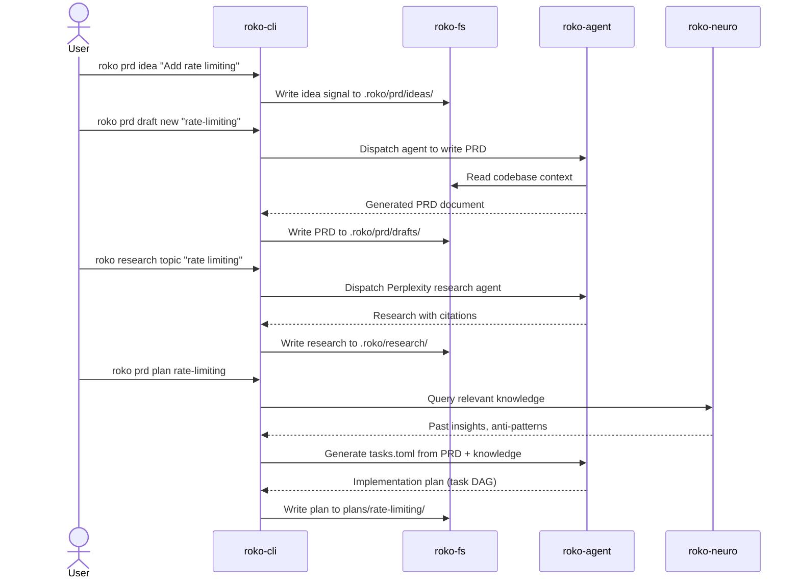
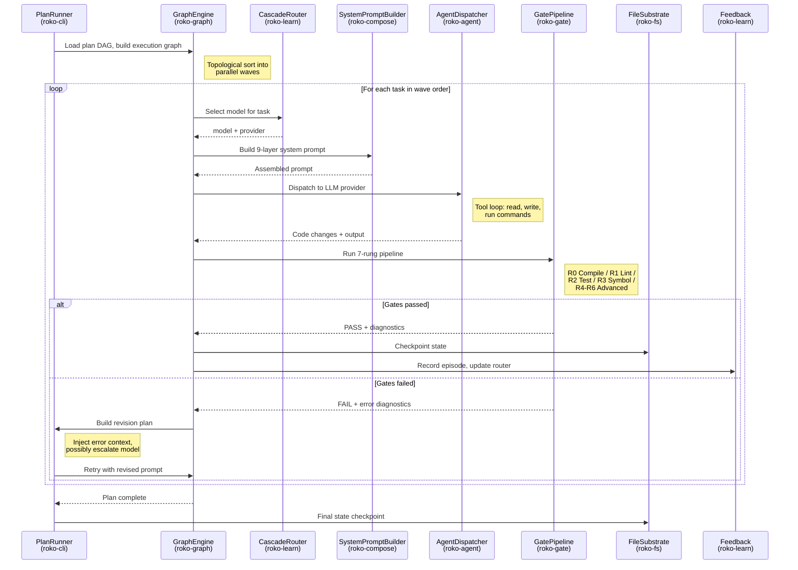
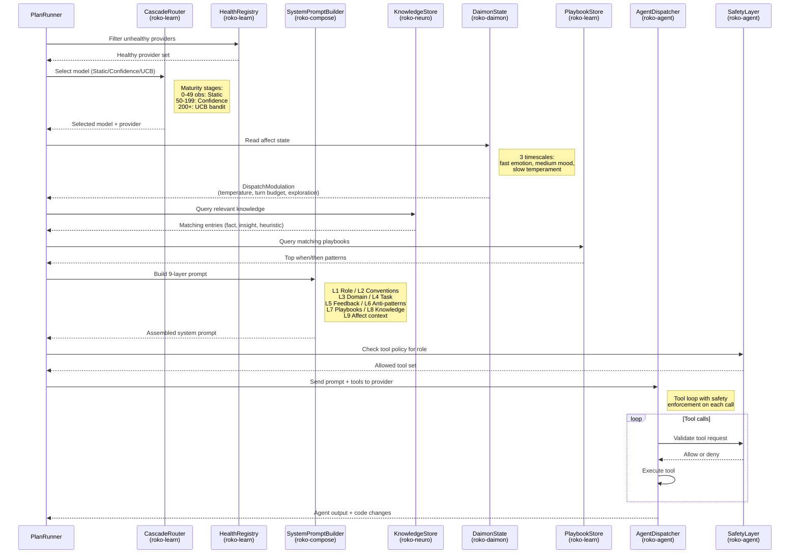
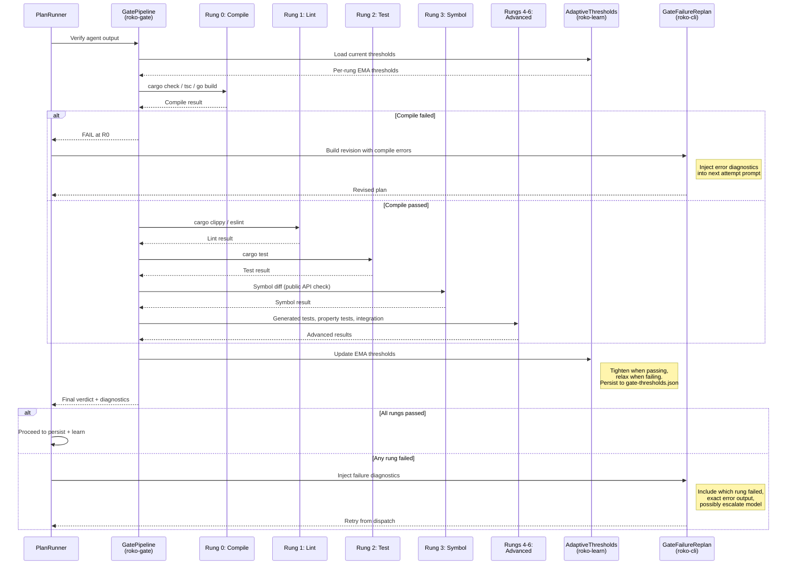
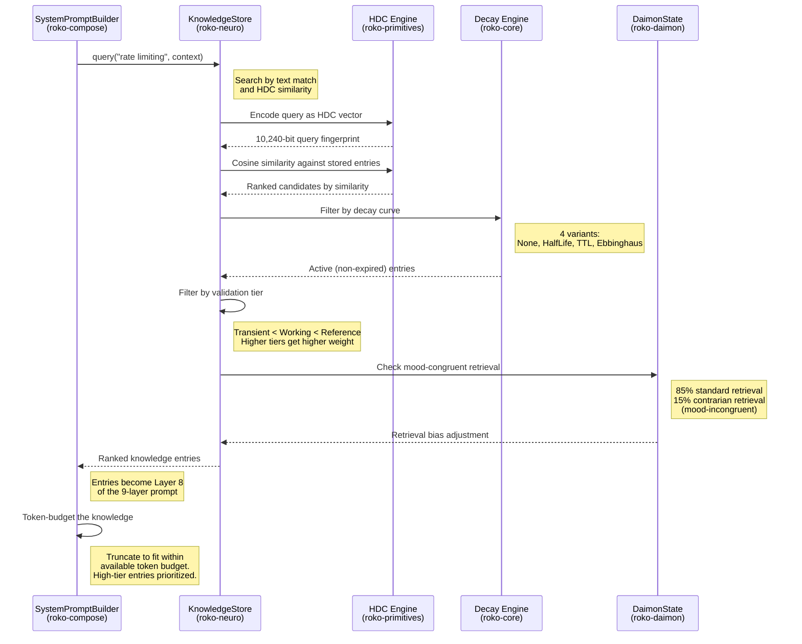
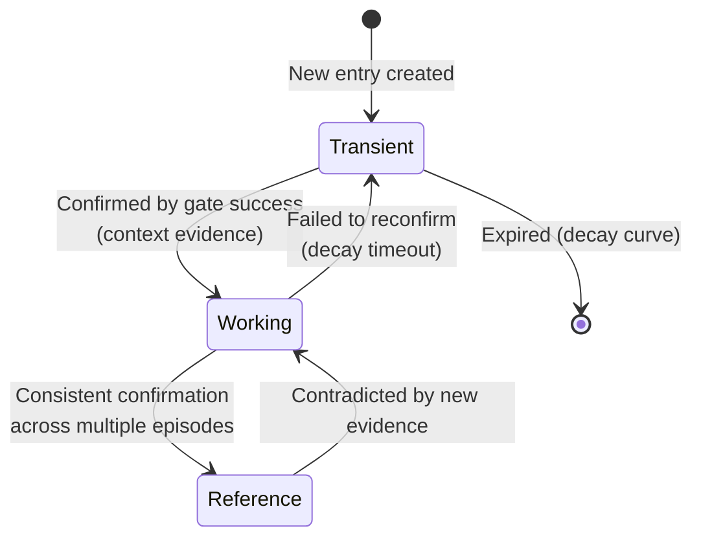
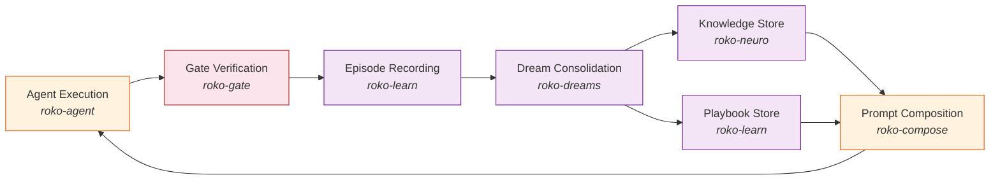

# Data Flow Animator

## Interactive Pipeline

The interactive visualization below shows the high-level 8-stage signal
pipeline: Query, Score, Route, Compose, Act, Verify, Write, React. Use the
Play/Pause controls to animate the flow, or step through one stage at a time.
Click any stage for its description.

<ClientOnly>
  <DataFlowAnimator />
</ClientOnly>

The interactive pipeline above shows the high-level flow. See the detailed
sequence diagrams below for specifics on each workflow scenario.

---

Five animated walkthroughs of the core data flows in Roko. Each scenario
traces data through the system step by step, annotated with the crate
responsible for each stage.

::: tip How to read these diagrams
Each sequence diagram shows participants (components) across the top and
messages flowing between them in time order (top to bottom). Notes explain
what happens at each step. The `alt` blocks show conditional branches
(e.g., gate pass vs. gate fail).
:::

## Scenarios

[[toc]]

---

## 1. Plan Execution {#plan-execution}

The complete lifecycle from an idea to validated, committed code. This is
the self-hosting loop that Roko uses to develop itself.

### Phase 1: Idea to Plan

### Phase 2: Execution and Verification

---

## 2. Agent Dispatch {#agent-dispatch}

A single agent task dispatch, showing the internal pipeline from model
selection through the tool loop to output.

---

## 3. Gate Validation {#gate-validation}

The 7-rung gate pipeline that verifies every agent output, with adaptive
threshold mechanics and the failure-to-replan feedback loop.

---

## 4. Knowledge Query {#knowledge-query}

How knowledge is retrieved, scored, and used during prompt composition.
Shows the HDC similarity lookup, tier filtering, and the path from
knowledge entry to prompt layer.

### Knowledge Tier Progression

After a successful gate-backed execution, knowledge entries can be promoted:

---

## 5. Dream Consolidation {#dream-consolidation}

The offline learning cycle that extracts patterns from completed episodes
and promotes them into durable knowledge and playbooks.

```mermaid
sequenceDiagram
    participant Daemon as Dream Daemon<br/>(roko-dreams)
    participant Episodes as EpisodeLogger<br/>(roko-learn)
    participant HDC as HDC Engine<br/>(roko-primitives)
    participant Neuro as KnowledgeStore<br/>(roko-neuro)
    participant Playbook as PlaybookStore<br/>(roko-learn)
    participant Bus as EventBus<br/>(roko-runtime)

    Note over Daemon: Triggered by:<br/>adaptive idle, cron,<br/>or episode count

    Daemon->>Episodes: Batch recent completed episodes
    Episodes-->>Daemon: Episode batch

    rect rgb(45, 40, 55)
        Note right of Daemon: Phase 1: Hypnagogia
        Daemon->>HDC: Compute HDC fingerprint per episode
        HDC-->>Daemon: Fingerprint vectors

        Daemon->>Daemon: Cluster episodes by HDC similarity
        Note right of Daemon: Group similar task shapes<br/>(e.g., "add API endpoint",<br/>"fix test failure")
    end

    rect rgb(40, 45, 55)
        Note right of Daemon: Phase 2: NREM Replay
        Daemon->>Daemon: Replay success patterns
        Note right of Daemon: Extract: what model worked,<br/>which tools were used,<br/>what prompt patterns succeeded

        Daemon->>Neuro: Distill knowledge entries
        Note right of Neuro: 6 types: fact, insight,<br/>heuristic, procedure,<br/>constraint, anti-knowledge
        Neuro-->>Daemon: Stored entries with tiers
    end

    rect rgb(45, 45, 50)
        Note right of Daemon: Phase 3: REM Imagination
        Daemon->>Daemon: Generate counterfactual scenarios
        Note right of Daemon: "What if we had used<br/>a different model?"<br/>"What if the test gate<br/>had been stricter?"

        Daemon->>Playbook: Promote reliable patterns
        Note right of Playbook: when/then rules:<br/>"When task matches X,<br/>then use strategy Y"
        Playbook-->>Daemon: Stored playbooks
    end

    Daemon->>Bus: Publish DreamConsolidated event
    Bus-->>Daemon: Event delivered to watchers

    Daemon->>Daemon: Write dream journal
    Note right of Daemon: .roko/dreams/journal/<br/>timestamped entries
```

### How Consolidated Knowledge Feeds Back

The playbooks and knowledge entries produced by dream consolidation are
injected into future agent dispatches, completing the learning loop:

---

## CLI Commands for Each Flow

| Flow | Commands |
|------|----------|
| Plan Execution | `roko prd idea`, `roko prd draft`, `roko prd plan`, `roko plan run` |
| Agent Dispatch | `roko run "<prompt>"`, `roko do "<prompt>"` |
| Gate Validation | Automatic during `roko plan run`; inspect with `roko learn gates` |
| Knowledge Query | `roko knowledge query "<topic>"`, `roko knowledge stats` |
| Dream Consolidation | `roko knowledge dream run`, `roko knowledge dream report` |

---

## Related

- [Architecture Explorer](./architecture) -- interactive component diagram
- [Crate Map](./crate-map) -- dependency graph for all crates
- [Architecture Guide: Data Flow](/35-ARCHITECTURE#6-data-flow-from-idea-to-completed-code) -- narrative walkthrough
