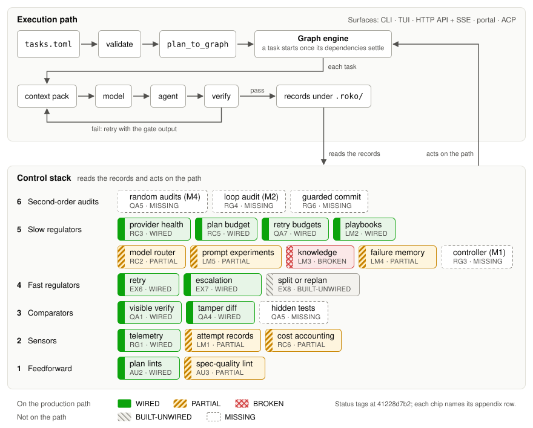

Status: draft · budget 700 words · owner spec-ce1484

# 3 Architecture

This section describes where Roko sits, the substrate its loops share, the records they leave, and the workers,
context and surfaces around them (Figure 1).

## 3.1 Where Roko sits

Agent loops such as Claude Code, Codex, Gemini CLI and OpenHands [@wang2025openhands] read, edit and run code. Roko
sits above them as a harness-level orchestrator, which runs attempts against a plan and decides what counts as done
[@xia2025agentless; @fourney2024magentic]. Roko adds what no single agent owns: checks written before the work,
isolation between attempts, integration, durable records and learning across runs. It leaves the inner loop to the
agent, so better agent loops become better workers.

## 3.2 The substrate

Every loop is built on one substrate of five primitives.

- **Signals** are durable, content-addressed records with a typed kind, such as a task, a prompt or a gate verdict.
  A signal's id is a BLAKE3 hash over its kind, body, author, taint flag and parent hashes, so identical content is
  stored once and identity commits to lineage. Derived signals inherit their parents' taint.
- **Cells** are processing steps (signals in, signals out); **graphs** are typed DAGs of cells. The Graph engine is
  the plan executor, and a plan compiles to one graph node per task.
- **The bus** carries ephemeral, sequence-numbered events, so a subscriber can detect a missed event and replay it.
  **The store** keeps signals in an append-only log indexed by content hash.

Every loop's inputs and outputs are therefore records that other loops and people can read: `roko replay` walks a
signal's lineage, and `roko diagnose` explains a failed plan. A loop with private state would be invisible to the
loops that audit it.

## 3.3 Records

Records live in the project's `.roko/` directory as JSONL logs and JSON files. The central one is the verdict record.
Each attempt opens one at dispatch and settles it exactly once, with the outcome and its blame, each check's result,
the model that actually served the call, cost, the attempt's place on the escalation ladder, and hashes of its inputs
and outputs. Learners read one field of it, the learning label (§6). Episodes, plan checkpoints and learner state sit
beside it. Each fact is written once: later knowledge, such as an audit that overturns a pass, arrives as an appended
amendment, never an edit, so learning, audit and people read the same facts.

## 3.4 Workers

Roko reaches every model through one dispatch interface. Twelve provider kinds (HTTP APIs, CLI agents, an ACP agent
and agent runtimes) each have one adapter, and everything above the adapter is provider-neutral, so a router can learn
across vendors and no loop inherits one vendor's conventions.

CLI agents run their own loops, so Roko bounds them from outside, with turn caps, an attempt timeout and, for Claude
Code, an isolation profile and a git-guard hook. For API models, Roko runs its own tool-calling loop, which passes
every call through a seven-step guard (§8). As an MCP client [@mcp2025spec], Roko merges MCP tools into its tool
registry. The HTTP control plane hosts an inference gateway for fallback, caching and cost accounting; plan runs do
failover, budget reservation and stall control in their own dispatch layer, tied to each attempt's verdict record.

## 3.5 Context

Prompts are assembled before dispatch, so each can be inspected, tested and replayed against another model. A layered
system-prompt builder orders its layers by cache stability (system, session, task, then dynamic retry feedback), so
providers can cache the stable prefix. Eleven role templates render typed inputs. Over the token budget, sections drop
in a fixed order, knowledge first and the task description last, and drops are reported.

## 3.6 Surfaces

People reach Roko through the CLI, a terminal dashboard, the HTTP control plane (REST, server-sent events and
WebSocket), ACP for editors, and MCP servers. One state hub folds runtime events into a snapshot that every surface
projects. Each surface's contract names the controls it may send back, such as pausing, resuming, cancelling or
retrying a plan. Observers never steer: removing them changes what people see, not what Roko does.

**Figure 1:** Roko's architecture: surfaces and their operator controls; loops and services; the substrate (signals,
cells in graphs, bus, store); and provider adapters connecting each dispatch to an agent loop or an API model.
