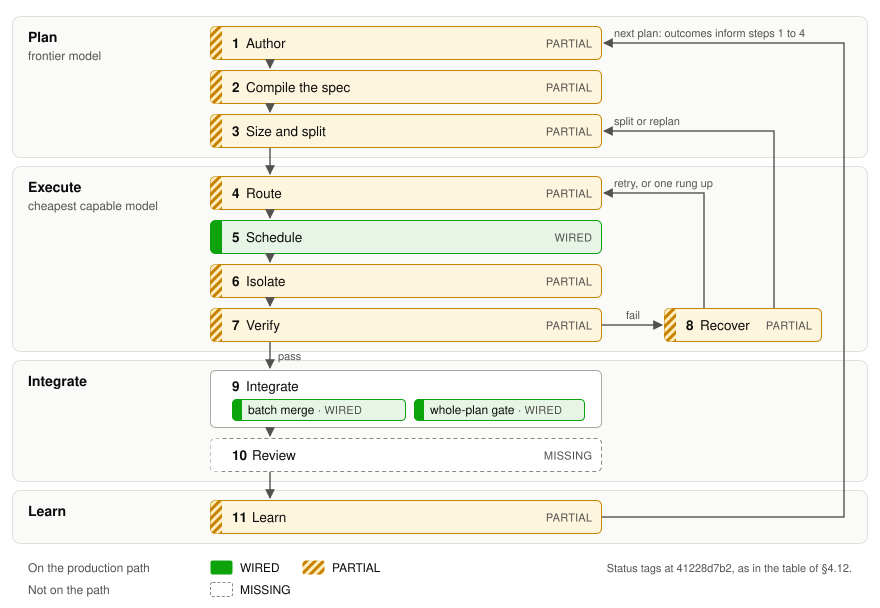

Status: reviewed · budget 950 words · owner gap-ac4646

# 4 The golden path, step by step

The golden path is the thesis in motion: eleven steps from a request to verified, integrated work that improves the
next plan. Step N is §4.N. Each gives the design, tagged as in the status matrix (the appendix, at `a43288b5f`), and
the principle from §2 behind it; §4.12 names the epics that would close the gaps.

**Figure 2:** The golden path. Failures loop back from step 8, and outcomes feed the next plan; tags are at
`a43288b5f`.

## 4.1 Author

A frontier model drafts the plan with the author, who edits and regenerates it quickly: PARTIAL@a43288b5f. Since
`28db9c789` one setting picks the planner model on every generate and revise path (gap-853b31, bug-8b1bf8), but it is
unset by default, and the portal's plans were written outside Roko (§7).
Principle: *put ambiguity back into authoring*.

## 4.2 Compile the spec

Each task compiles into exact context, acceptance criteria bound to checks, and planner-written tests proven to fail
on the base: PARTIAL@a43288b5f. Context packs are WIRED@a43288b5f (`render_declared_context`), and since `af51b7a61`
the planner's tests named in a task's accept table are pinned outside the working tree and run first
(WIRED@a43288b5f, AU7; gap-d14a43). Acceptance criteria are still prompt text, the spec-quality lint is opt-in
(PARTIAL@a43288b5f, AU3), and nothing in Roko proves that a check fails before the change. Principle: *the planner
writes the checks*.

## 4.3 Size and split

Task size follows the executor tier's measured pass rate, and tasks that may run together write disjoint files:
PARTIAL@a43288b5f. Plan validation checks task size against fixed per-tier limits, not measured pass rates
(gap-1d1fa6), and flags tasks that may run together but share files (gap-a8d786). Principles: *size tasks for the executor*; *split on independent outputs*.

## 4.4 Route

Each task runs on the cheapest model that passes its checks, chosen from a role × tier ladder: PARTIAL@a43288b5f.
Since `a13873ad2` a task that neither `--model` nor a hint pins starts on the rung its role and tier select, from
gpt-oss-120b up to Sonnet, and the learned router's pick is only logged (RC2). In the live run the cheap rung passed 7
of 10 small tasks, but GLM-4.7 on the mid rung returned blank answers (RC1), and failover moved tasks down the ladder,
never up (RC4; gap-625195, gap-e00238).[^4-live] Principle: *count cost per verified task*.

## 4.5 Schedule

Ready tasks dispatch at once, as wide as the DAG and the write sets allow: WIRED@a43288b5f. Since `bbf6517fc` each
task starts when its own dependencies settle, and a failure skips only its dependants (`SkipFailed`, gap-96d348);
tasks whose declared files overlap never run together, and since `626e182a9` a plan that omits `max_parallel` runs as
wide as its graph when its tasks declare their files (gap-272448). An authored value still wins: 102 of the 132
tracked plans set it to 1, 25 of them with tasks that could run together.[^4-plans] Principle: *split on independent outputs*.

## 4.6 Isolate

Each task works in its own workspace, out of reach of the operator's secrets: PARTIAL@a43288b5f. Since `39feebc07`
each plan task gets its own worktree on its plan's branch (WIRED@a43288b5f, IS1; §4.9). Gates and roko's own tools
start without its provider keys, as canary C2 confirms, but provider CLIs and MCP servers lose only the key names roko
knows (PARTIAL@a43288b5f, IS5; gap-843aef); a best-effort guard keeps Claude CLI agents from the key files and
destructive git commands (WIRED@a43288b5f, IS4). There is no OS sandbox (IS6).

## 4.7 Verify

Every attempt faces its visible checks plus checks it cannot see or edit: PARTIAL@a43288b5f. Since `7f9d1fcbc` a
screen diffs each attempt first and fails edits to tests, verify scripts or pinned acceptance tests (WIRED@a43288b5f,
QA4); then the task's own visible verify commands run, and the workspace's rungs. Verdicts have been honest since the
fix of 2026-09-28, with 0 false greens in 151 passes, down from about 27% of recorded successes,[^4-verdicts] and
since `4c0e5646e` every surface counts only verified passes (WIRED@a43288b5f, QA2). Hidden tests are
MISSING@a43288b5f. Principle: *assume visible checks are gamed*.

## 4.8 Recover

A failed check earns two cheap retries with the distilled gate errors, then one rung up the ladder, then a split or
replan: PARTIAL@a43288b5f. Retries with the parsed gate output are WIRED@a43288b5f, three by default; the budget gate
history sets (`99adacd6d`) is PARTIAL@a43288b5f (QA7), because the ladder raises it to five. Since `ce12e86d8` two
failures blamed on the agent move a task one ladder rung up (WIRED@a43288b5f, EX7). Since `dd192cb82` a watchdog
cancels and retries an agent that has gone silent (WIRED@a43288b5f, EX9). Split or replan is not: the
`ReplanController` is BUILT-UNWIRED@a43288b5f. Principle: *retry cheaply, then escalate*.

## 4.9 Integrate

Each verified task commits to a plan branch, plans merge through a queue, and a whole-plan gate checks the merged
result: WIRED@a43288b5f (IS2, IS3). Under per-task worktrees, `accept_attempt` folds each passed attempt onto its
plan's branch, and since `9c0b9aed0` each plan whose tasks passed merges into a batch branch in turn, where its
whole-plan check runs (`207f91da2`); a failure takes the merge back out. The check defaults to fmt, clippy and the
affected crates' tests in a Cargo workspace; other projects must write one. On 2026-09-28, before these merges, portal
plans 05 to 08 passed every gate while the assembled product was unusable (§7).
Principle: *merge, then verify*.

## 4.10 Review

An optional hold lets a person approve each task's diff before it merges: PARTIAL@a43288b5f. Since `e3267be54` an
opt-in mode holds each verified attempt and its diff until roko plan review approves or rejects it; the TUI and portal
cannot review yet, and no plan uses it (gap-843aef).

## 4.11 Learn

Verified outcomes teach Roko how to route, size and specify tasks: PARTIAL@a43288b5f. Merges on 2026-09-29
(`ce3bdcbb8`, `33e107da1`, `91cfe0467`) re-wired playbook credit, prompt experiments, knowledge write-back,
gate-history retry budgets and router learning; later ones made learners read settled verdicts, fed failures back as
error patterns (`74eaf5c8f`, `ed471a8c1`) and brought knowledge into plan prompts (`133c02093`; PARTIAL@a43288b5f,
LM3). But no loop has a measured benefit: live, knowledge came as generic success notes and error patterns only from
turn caps,[^4-live] and on the portal the router saw one pinned model (§4.12). Principle: *count cost per verified
task*. §5 covers the loops.

## 4.12 Where the path stands

Each step's tag, its appendix rows, and the epics that would change it:

| Step | Status | Matrix rows | Next |
|---|---|---|---|
| 1 Author | PARTIAL@a43288b5f | AU1, AU2, V2 | E8 specs (spec-e57870) |
| 2 Compile the spec | PARTIAL@a43288b5f | AU3, AU4, AU6, AU7 | E8 specs |
| 3 Size and split | PARTIAL@a43288b5f | AU2, V3 | E8 specs; E7 scheduler (spec-a78d57) |
| 4 Route | PARTIAL@a43288b5f | RC1, RC2, RC4, V3 | Failure paths (gap-625195, gap-e00238) |
| 5 Schedule | WIRED@a43288b5f | EX3, V4 | E7 scheduler |
| 6 Isolate | PARTIAL@a43288b5f | IS1, IS4, IS5, IS6 | E3 secrets (spec-ba7bea; gap-843aef) |
| 7 Verify | PARTIAL@a43288b5f | QA1, QA2, QA3, QA4, QA5 | E17 audits (spec-6ac537) |
| 8 Recover | PARTIAL@a43288b5f | EX6, EX7, EX8, EX9, QA7 | Split or replan (gap-3b170b, parked); failover (gap-e00238) |
| 9 Integrate | WIRED@a43288b5f | IS2, IS3 | E6 integration (spec-a0e40a) |
| 10 Review | PARTIAL@a43288b5f | SS6 | TUI and portal review (gap-843aef) |
| 11 Learn | PARTIAL@a43288b5f | V8, LM3, RC2 | E17 cybernetic core (spec-6ac537) |
| Whole path: cheaper at equal quality | UNPROVEN@a43288b5f | V7 | E11 acceptance tests (spec-f09094); E12 pilot (spec-567e52) |

Steps 5 and 9 do what their design asks, but the central promise is untested. Every portal attempt pinned
`claude-sonnet-4-6`,[^4-model] before the ladder existed, and the first live run on cheap models, ten small tasks,
needed six operator interventions.[^4-live] E11's end-to-end run (gap-f30b8e) is designed as the first test of the
whole path (§9.3), and §8 plans the comparison with a frontier agent.

[^4-plans]: Counted at `a43288b5f` over the 132 tracked `tasks.toml` files under `plans/`;
    `git grep -l -E '^max_parallel *= *1( |#|$)' a43288b5f -- 'plans/*tasks.toml'` lists the 102. Tasks could run
    together when two sit at the same depth of the plan's dependency graph (parsed with `tomllib`). Of the 102, 79
    are under `plans/archive/`, which plan discovery skips, and so are 24 of the 25.
[^4-verdicts]: Research note B7, frozen as `evidence/2026-09-29-b7-real-run-evidence.md` (sha256 `799b6a2b6184`),
    "TL;DR", and CASE-001 in `evidence/2026-09-29-field-cases.md`; also spec-e9d7ec. Visible verify steps only:
    recorded successes from 2026-09-05 to the fix, then passes to 2026-09-29 07:41Z. Not an audited false-green rate.
[^4-model]: B7 as above, "TL;DR": all 210 portal attempts, to 2026-09-29 07:41Z, pinned one model; also
    spec-f09094 and gap-e21595.
[^4-live]: The live run of 2026-10-02, frozen as `evidence/2026-10-02-live-cheap-model-run.md` (sha256
    `813172c96b88`): "TL;DR", "What worked" and "What broke" 2, 3 and 11; two five-task Python plans in a test
    repository, with a binary built at `a43288b5f`, one seed and no comparison arm.
