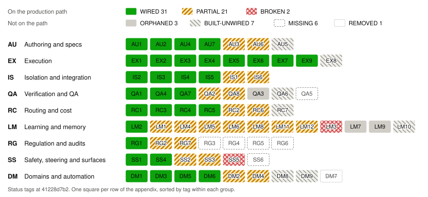

Status: reviewed · budget 550 words · owner gap-c19902

# 9 Status, limitations and roadmap

## 9.1 Status

The [status matrix](appendix-status-matrix.md) tags the paper's 71 mechanisms against the code at `a43288b5f`: 27
wired, 26 partial, 2 broken, 3 orphaned, 7 built but unwired, 5 missing and 1 removed (Figure 3).[^9-matrix] What is
WIRED@a43288b5f is the golden path's execution: plan generation and validation, the Graph engine with resume and
parallel scheduling, the tier ladder with escalation, per-task worktrees, verify and tamper checks, typed verdicts,
the stall watchdog, and integration under a whole-plan check, most of it merged from 2026-09-29 on. Roko's first live
run on cheap models, ten small tasks, needed six operator interventions;[^9-live] with it and a static re-check, the
audit took eight rows down, output screening to BROKEN@a43288b5f.

**Figure 3:** The status matrix at `a43288b5f`: mechanisms per status and group.

Only parallel execution (V4) is met in code:

| Claim | Status | Main epics |
|---|---|---|
| V1 Domain-agnostic orchestration | PARTIAL@a43288b5f | No epic |
| V2 Fast authoring, frontier planner | PARTIAL@a43288b5f | spec-e57870 |
| V3 Cheapest capable model per task | PARTIAL@a43288b5f | spec-e57870, gap-625195, gap-e00238 |
| V4 Parallel execution | WIRED@a43288b5f | spec-a78d57, gap-997366 |
| V5 Isolation and integration | PARTIAL@a43288b5f | spec-ba7bea, gap-843aef |
| V6 Trust from gates | PARTIAL@a43288b5f | spec-6ac537 |
| V7 Cheaper and faster than top models | UNPROVEN@a43288b5f | spec-567e52 |
| V8 Improves over time | PARTIAL@a43288b5f | spec-6ac537 |
| V9 Cybernetic throughout | PARTIAL@a43288b5f | spec-6ac537, gap-e00238, gap-f548c1 |
| V10 Observable and controllable | PARTIAL@a43288b5f | No epic; gap-198c9c, gap-625195 |

## 9.2 Limitations

- **One harness, few models.** All the evidence comes from Roko's own development: all 210 portal attempts pinned
  `claude-sonnet-4-6`,[^9-model] and one live run on cheap models was ten small tasks.[^9-live] The cheap-model half
  of the thesis is untested at scale (V3, V7).
- **Observational evidence.** §7 has no control arm, so it supports no causal claim, and supervising frontier
  sessions did much of the work, at an estimated 16–20× Roko's recorded spend.[^9-operator]
- **Code-first in practice.** Shell-command verifiers are the only check not tied to code, and triggers cannot start
  agent work (appendix rows DM1–DM3). No epic covers other domains.
- **Safety.** There is no OS sandbox in v1 (decided 2026-09-29; spec-ba7bea). Environment isolation is
  PARTIAL@a43288b5f: canary C2 finds no roko key in agents or gates (gap-0e2c40), but provider CLIs and MCP servers
  lose only the key names roko knows (gap-843aef), and the git guard, WIRED@a43288b5f, covers only Claude CLI runs.
- **No measured learning.** A benefit from any learning loop is UNPROVEN@a43288b5f: the router saw one model on the
  portal runs, and learning cannot yet be frozen for a comparison (gap-644040).

## 9.3 Roadmap

After the release blockers (spec-ae5f94), four goals follow in order, each epic ending in an executable exit check.
Epic numbers match §4.12.

1. **Truth:** E2 honest verdicts (spec-e9d7ec), E3 secrets and the git guard (spec-ba7bea), and E4 one settled
   record per attempt (spec-b7303f). Exit: fixture tests show honest verdicts everywhere, no leaked keys, and one
   record per attempt with its verdict, executed model and cost source.
2. **Golden path:** E5 tier ladder (spec-98f76d), E6 integration (spec-a0e40a), E7 scheduler (spec-a78d57), E8 specs
   a cheap model can execute (spec-e57870), E9 diff check (spec-9230a9) and E10 watchdog (spec-edda86), most of them
   merged. Exit (E11
   acceptance tests, spec-f09094): a fixture plan runs on real cheap models, escalates on failure, merges as a branch
   and passes formatting, lint and test checks unattended, three runs out of three.
3. **Proof:** E12, the pilot of §8 (spec-567e52), and E13, a record of the work itself (spec-f2463d). Exit: a
   committed pilot report, and a rollup of cost per merged item.
4. **Cybernetic core** (E17, spec-6ac537): routing that learns from verified failures and a frozen-learning mode,
   then the audits, self-model and controller of §5. Exit: tests for router labels, playbook credit and frozen runs.

Split or replan on failure (EX8) has only a parked item (gap-3b170b). Output screening (SS3), BROKEN@a43288b5f, is
gap-625195, its calibration parked (gap-f75dc8). Gates chosen by task domain (DM2) are gap-ce1d11; an OS sandbox (IS6)
is gap-8f8544, on hold for v1.

## 9.4 Proposed parking

A proposal, not yet decided, moves subsystems with no measured benefit behind feature flags and out of the default
build: the chain and marketplace code, offline batch consolidation, the conductor, affect, and the knowledge store's
extra modules. The four crates it would park whole hold 6.1% of the Rust in `crates/` at `1f4481133`; with the other
modules, about 9%, an estimate.[^9-park]

[^9-matrix]: gap-35a614's matrix, re-pinned by gap-fcea53, gap-08d9b2 and gap-d4a1c1, each tag re-checked against the
    code at `a43288b5f` (2026-10-02) by that day's audit; the re-pin note in `docs/whitepaper/data/mechanisms.toml`
    lists the rows that moved.
[^9-model]: Research note B7, frozen as `evidence/2026-09-29-b7-real-run-evidence.md` (sha256 `799b6a2b6184`),
    "TL;DR": portal plans, attempts to 2026-09-29 07:41Z, from Roko's efficiency records; also spec-f09094 and
    gap-e21595.
[^9-operator]: Assessment note W12, table F2, frozen by gap-29a64e as
    `evidence/2026-09-29-w12-operator-loop-cost.md` (sha256 `82676de5eee4`): an estimate of about $2.7–3.4k
    API-equivalent for 2026-09-25 to 2026-09-29, research programme included, against the $172.80 Roko recorded.
[^9-park]: Lines of the tracked `.rs` files in `crates/roko-chain`, `crates/roko-dreams`, `crates/roko-conductor` and
    `crates/roko-daimon` at `1f4481133` (`wc -l`): 64,066 of 1,052,880. The 9%, about 94k lines, adds the other
    modules, estimated at `d9e79e9d8`.
[^9-live]: The live run of 2026-10-02, frozen as `evidence/2026-10-02-live-cheap-model-run.md` (sha256
    `813172c96b88`), "TL;DR", "The runs" and "Operator interventions": two five-task Python plans in a test
    repository, with a binary built at `a43288b5f`, one seed and no comparison arm. Its defects' root causes:
    `evidence/2026-10-02-live-defect-root-causes.md` (sha256 `5df7d5221539`).
