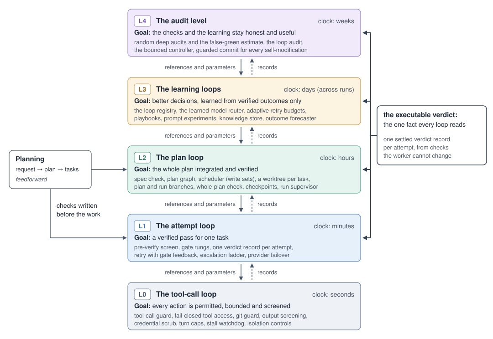

Status: draft · budget none · owner spec-ce1484

# Roko: A Cybernetic Harness for Multi-Agent Orchestration

This directory holds Roko's whitepaper: one file per section, the figures, the frozen evidence the text quotes, and
the bibliography. This README is the plan the sections follow: the thesis, the outline with its word budgets and
reading order, and the conventions every section keeps. Epic: spec-ce1484. Review: [`REVIEW.md`](REVIEW.md).

| Decision | Value |
|---|---|
| Title | Roko: A Cybernetic Harness for Multi-Agent Orchestration |
| Audience | Engineering leads deciding how to run agent work unattended |
| Length | 10–14 pages: about 6,500 words |
| Venue | This repository plus a generated PDF (`build.sh`); no arXiv for now |
| Citations | The literature through `references.bib`; the repository through tracked files and commits only. Quoted inputs are frozen into `evidence/` with their sha256 |
| AI-assistance disclosure | None |
| Figures | Two SVG figures, embedded in the PDF by pandoc through librsvg |

The author decided the audience, length, venue, citation rules and disclosure on 2026-09-29 (dec-2cd76a), and the
title and framing on 2026-10-02.

**History.** The 2026-09-29 version (an outline built around one workflow, status tags and a status matrix) is in git
history; the rewrite of 2026-10-02 replaces it.

## Thesis

> Roko is a cybernetic multi-agent orchestration harness. Its design is a set of feedback loops nested by time scale,
> from a single tool call to the audits of its own learning. Each loop steers toward a reference written before the
> work starts, measures with a sensor the actor cannot change, acts within bounds that people set, and leaves records
> that slower loops read. That structure is how Roko is built to do its job well: to turn plans into verified,
> integrated work across many agents and models.

§1 states the thesis in these words or very close to them, and gives the genre sentence once: "This paper describes
Roko's design: its loops, the mechanisms that implement them, and the reasons for each choice." The whitepaper is a
design paper. There is no single claim to prove, no other sentence discusses implementation progress, and "works
well" is always design rationale ("is built so that", "is designed to", "aims to"), never a measured result.

### The five loops

Slower loops set the references and settings of faster ones; faster loops leave records that slower ones read.
Planning is the feedforward half: it writes each task's checks before the work starts. **The executable verdict is
the one fact every loop reads.** In prose, use the names in the second column; L0–L4 are compact labels for tables and
figures, or for prose after the name.

| Level | Name in prose | Clock | Goal |
|---|---|---|---|
| L0 | the tool-call loop | seconds | every action is permitted, bounded and screened |
| L1 | the attempt loop | minutes | a verified pass for one task |
| L2 | the plan loop | hours | the whole plan integrated and verified |
| L3 | the learning loops | days | better decisions, learned from verified outcomes only |
| L4 | the audit level | weeks | the checks and the learning stay honest and useful |

A loop can be summed up in a regulator card: a table of its goal, reference, sensor, comparator, actuator, bounds,
clock and records. §2.2 defines the terms.

## Outline and reading order

Read the sections in this order; the PDF joins them the same way.

| § | File | Section | Budget | Owner |
|---|---|---|---|---|
| 0 | `00-abstract.md` | Abstract | 200 | spec-ce1484 |
| 1 | `01-introduction.md` | Introduction | 600 | spec-ce1484 |
| 2 | `02-design-principles.md` | Design goals and principles | 650 | spec-ce1484 |
| 3 | `03-architecture.md` | Architecture, with Figure 1 | 700 | spec-ce1484 |
| 4 | `04-orchestration.md` | From plan to integrated work: the attempt and plan loops | 850 | spec-ce1484 |
| 5 | `05-cybernetic-mechanisms.md` | The loops above the work: learning and audit, with Figure 2 | 900 | spec-ce1484 |
| 6 | `06-measured-trust.md` | Verification and measured trust | 550 | spec-ce1484 |
| 7 | `07-in-use.md` | Roko in use | 550 | spec-ce1484 |
| 8 | `08-safety.md` | Safety | 500 | spec-ce1484 |
| 9 | `09-open-problems.md` | Trade-offs and open problems | 450 | spec-ce1484 |
| 10 | `10-related-work.md` | Related work | 550 | spec-ce1484 |

- **Budgets** are in words and total 6,500 for §0–§10. `paperlint` reads the File and Budget columns of this table,
  and each file's status header repeats its budget.
- **Other files:** `references.bib` (the bibliography), `evidence/` (frozen inputs, with `SHA256SUMS` and a
  provenance table), `figures/` (the two figures; `figures/README.md` says how each is made),
  `data/citation-content-audit.json` (what each cited work was checked against, and the verdict),
  [`REVIEW.md`](REVIEW.md) (the review record) and `build.sh` (the PDF build).
- **Writers' working notes** (the research paper this whitepaper condenses, its fact sheets and each section's claims
  ledger) are kept outside the repository. The published text cites only the bibliography, tracked files, commits and
  frozen evidence.

## Conventions

### Status header

Line 1 of every section file (`NN-*.md`) is its status header:

    Status: draft · budget 600 words · owner spec-ce1484

- **State:** `stub` (a placeholder), `draft` (written and lint-clean) or `reviewed` (set by an independent review).
  `paperlint --strict` fails on `stub`, and the epic's exit check requires `reviewed`.
- **Budget:** the number in the outline table. `--strict` fails below half of it or above 1.3 times it. The count
  covers the words after the header, tables and captions included, and leaves out fenced blocks and footnote
  definitions.
- **Owner:** the epic, spec-ce1484, for every section of the 2026-10-02 rewrite.
- `build.sh` strips the header from the PDF.
- This README and `REVIEW.md` carry the same header with `budget none`, so that `paperlint --strict` can check every
  Markdown file in this directory.

### Voice and tense

- **Design voice, present tense.** Describe what Roko does and why it is built that way ("The Graph engine runs each
  attempt in its own worktree"). State goals as goals ("Escalation aims to spend strong models only where cheaper
  attempts fail").
- **No status framing.** No status tags (the old vocabulary of `WIRED`, `PARTIAL`, `MISSING` and the rest), no
  `(designed)` markers, no work-item, decision, spec or hypothesis ids in prose or captions, and no `tmp/` paths
  anywhere in a section. Avoid status words: "not yet", "currently", "today", "so far", "untested", "missing",
  "gap", "defect", "bug", "broken", "unwired". No list of limitations and no roadmap: forward-looking material is
  phrased as a design goal.
- **Numbers:** only design defaults with a tracked source (the code or `docs/v3`) and recorded figures that a frozen
  file holds, each footnoted (see below). No invented numbers. Comparative performance ("cheaper than", "more reliable
  than") is a design goal, never a finding.
- **Mechanisms answer three questions:** what it does, why it is built this way, and which alternative it rejects
  and why.
- **Cybernetic terms describe mechanisms.** Define each in plain words at its first use. Never write that a loop
  "guarantees" or "ensures convergence", or that Roko "implements the law of requisite variety" or "is a viable
  system". Beer's System 3\* gets one sentence: it names the role the random deep audits play.
- **Positioning.** "We did not find X among the systems we reviewed (accessed 2026-10-02)" is allowed in related
  work; "only", "unlike all other frameworks" and "novel architecture" are not.
- **Settings.** Give the setting of every literature result (single function, question answering, documents or
  repository scale), so that no result reads as broader than it is.
- **Leave out entirely:** offline consolidation, affect and temperament, the economy layer (chain, payments,
  marketplace, arena, DeFi, bounties, balances), the heartbeat and cognitive clock, mesh relay, sync and agent groups,
  coordination-marker maths, hyperdimensional-vector theory, the knowledge auction, expected-free-energy routing, the
  docs' unsourced cost figures, engine-migration history, benchmark campaigns and their results, and the companion
  audit.
- Plain, direct English and short paragraphs. Every section opens with one sentence saying what it covers.

### Names

Use plain names for mechanisms; the levels are named in "The five loops" above.

| In the code or docs | In the whitepaper |
|---|---|
| `Signal` (`Engram` is only an alias) | signal: a durable, content-addressed record whose id commits to its lineage |
| Pulse | event (ephemeral, on the bus) |
| Cell, Graph, `GraphEngine` | cell (a processing step), graph, the Graph engine (the plan executor) |
| `tasks.toml`, verify steps | the plan file; the task's checks (verify commands) |
| gate rungs | project checks; a rung of the gate pipeline |
| red flags, pre-verify | the pre-verify screen (tamper and scope check) |
| `[meta] verify` | the whole-plan check |
| delivery regression check | the whole-plan check on the merge (run at delivery, before the run branch moves); never "post-merge check" |
| `roko.verdict/1` | the verdict record and its learning label |
| false green | a pass that a stronger, independent check would fail |
| `[routing.ladder]`, failover | the escalation ladder and its model tiers; provider failover |
| `CascadeRouter` | the learned model router, which is not the escalation ladder |
| self-model | the calibrated outcome forecaster |
| S3\* audits | random deep audits |
| loop-liveness audit | the loop audit; its findings are reach failures |
| homeostat | the bounded controller (Ashby's ultrastability) |
| neuro | the knowledge store |
| the `immune` boundary | the runtime safety boundary; output screening |
| `SafetyLayer` pre and post checks | the tool-call guard |
| `agent-controls.json` | isolation controls |
| Conductor, watchers | the run supervisor and its watchers |
| StateHub | the state hub: one event source behind every surface |
| `roko-serve` | the HTTP control plane, a name never used for the loops |
| FAST lane | the bounded quick mode |

### Markers

Markers belong only in drafts in progress: `paperlint --strict` fails on any `[[…]]` left outside code, so a finished
section has none. If something can't be sourced, cut it.

| Marker | Meaning |
|---|---|
| `[[TODO: …]]` | Work still to do |
| `[[CITE?: …]]` | A claim still missing its source; never ship one |
| `[[AS-BUILT: …]]` | Design text still to check against `docs/v3` and the code |

TOML table names such as `[[task.verify]]` inside code spans are not markers.

### Citations and sources

- **Literature:** `[@key]` (several: `[@a; @b]`), with the key in `references.bib`. Prefer keys the whitepaper
  already has. Build a new entry only from verified metadata, note in its comment the identifier it was checked by
  (an arXiv id through DataCite, a DOI through Crossref), and add keys in a small commit of their own.
- **During the 2026-10-02 rewrite** writers don't edit `references.bib`: each stages new entries in its own staging
  file, and the citations pass merges them.
- **Vendor pages:** an `@online` entry with its `urldate`. A vendor's numbers stay the vendor's claims.
- **The repository:** tracked files and commits only. Write a repo path from the root in backticks
  (`crates/roko-graph/src/engine.rs`) and a symbol as a separate code span; avoid line numbers, which drift. Write a
  commit as a 9-digit short sha in backticks.
- **The design source** is `docs/v3`. Confirm names, counts and defaults in the code before writing them; where
  `docs/v3` and the code disagree on how something works, follow the code.
- **Gitignored inputs** (the research paper, its fact sheets, the specifications, research and field notes) are never
  cited directly. Freeze the part you quote into `evidence/`.

### Numbers and footnotes

- Every paragraph, list item or table with a `$` amount, a percentage, an `N×` ratio, an "N of M" count or an `N/M`
  fraction has an inline `[@key]` or a footnote in the same block that names its source:
  - **a design default in the code:** a commit (a 9-digit short sha in backticks, from `git rev-parse --short=9 HEAD`)
    and the file that holds the default, in the form "Design default (`<sha>`): `<identifier>` in `<path>`". The
    sections use one pin, so that every default is read at the same commit;
  - **a literature result:** its `[@key]`;
  - **a recorded figure:** the frozen file `evidence/<file>`, the first 12 hex digits of its sha256 from
    `evidence/SHA256SUMS`, and the key or row it quotes.

  The footnote also gives the window or scope. Use few numbers.
- Footnote labels start with the section number, because `build.sh` joins the files: `[^7-portal]`.
- `paperlint` counts a footnote as a source when it names a commit in HEAD's history, a `[@key]`, or a frozen file
  that exists in `evidence/`; the sha256 given with a frozen file must match its line in `SHA256SUMS`.
- For example:

```markdown
Roko ran most of the build of its own web portal: 16 plans and 173 tasks, 168 of them gate-verified, for $174.87 of
recorded agent spend.[^7-portal]

[^7-portal]: `evidence/2026-09-29-b7-real-run-evidence.md` (sha256 `799b6a2b6184`), "TL;DR": the portal plans,
    attempts to 2026-09-29 07:41Z, costs as recorded. The frontier sessions that wrote the plans and supervised the
    run are not in the figure.
```

### Frozen evidence

Anything quoted from a gitignored source is copied into `evidence/` and fixed there by its hash.

- **Only derived, scrubbed data:** counts, rollups, tables and case write-ups. Never transcripts, prompts,
  environment dumps, or anything that could hold a key.
- **Names:** `evidence/<YYYY-MM-DD>-<slug>.<ext>`, dated by when the source generated it.
- **Hashes:** `evidence/SHA256SUMS` holds one `shasum -a 256` line per file. Check them with
  `cd docs/whitepaper/evidence && shasum -a 256 -c SHA256SUMS`.
- **Provenance:** `evidence/README.md` has one row per file: its source path, the tool and time that generated it,
  the commit it describes, its window, and what was removed from it.
- **Never edit a frozen file.** To refresh one, freeze a new dated file and update the footnotes that cite it.

### Code identifiers

- Every backticked identifier or repo path must exist at HEAD (`git grep -w`, `git ls-files`); check with
  `paperlint --check-identifiers`.
- A mechanism that exists only in the design gets a plain name: never backticks, and never a `(designed)` marker.
- Prefer plain names to identifiers anyway: the reader is an engineering lead, not a code reviewer.

### Figures

- Two SVG files in `figures/`: `fig1-architecture.svg` in §3 (the layers: surfaces, the loops and services, the
  substrate, the workers) and `fig2-loops.svg` in §5 (the five loops nested by time scale). Both are drawn from the
  research paper's figures; `figures/README.md` says how each is made.
- Include a figure as an image on its own line with short alt text, followed by a caption paragraph that starts
  `**Figure N:**`. Other sections refer to it as "Figure 1" or "Figure 2".

```markdown


**Figure 2:** The five loops, from the tool-call loop (L0, seconds) to the audit level (L4, weeks). …
```

- Local links and figure paths must resolve.

### Headings

`# N Title` for a section and `## N.M Title` below it; the abstract is `# Abstract`. `build.sh` doesn't renumber.
Cross-references read "§4", "Figure 1" and "Table 6.1". Tables are numbered by section: a caption paragraph such as
`**Table 6.1.** What Roko measures …` comes right before each table.

### Banned words

- **Banned:** `provably`, `self-aware`, `metacognitive`, `flywheel`, `autocatalytic`, `superlinear`, `first-of-its-kind`, `is the first`, `the first to`, `world's first`, `immune`, `dream`, `dreams`, `dreaming`, `hypnagogia`, `daimon`, `somatic`, `demurrage`, `cortical`, `pheromone`, `pheromones`, `golden path`, `dormant`.

`paperlint --strict` reads the bullet above, the only one in these conventions that names the list. Each word or
phrase in it fails in prose: case-insensitive, whole words, outside code spans and link targets (so a crate name in a
code span is allowed). What to write instead:

| Word | Write instead |
|---|---|
| `provably` | What was checked, and how |
| `self-aware`, `metacognitive` | "the calibrated outcome forecaster (self-model)" |
| `flywheel`, `autocatalytic` | "learning from verified outcomes, under audit" |
| `superlinear` | Nothing |
| `first-of-its-kind`, `is the first`, `the first to`, `world's first` | "We did not find X among the systems we reviewed (accessed 2026-10-02)" |
| `immune` | "the runtime safety boundary" or "output screening" |
| `golden path` | "from plan to integrated work", or the loop's name |
| `dormant` | "reach failure" (the loop audit's term), or "shows no benefit" |
| `dream`, `dreams`, `dreaming`, `hypnagogia`, `daimon`, `somatic`, `demurrage`, `cortical`, `pheromone`, `pheromones` | Nothing: the subsystems these name are left out |

Rules the list can't express: never call Roko "self-improving" as a headline noun (§10 may name the literature's
self-improving harnesses), and never state comparative performance as a finding. Also avoid, though `paperlint`
doesn't check them: "agent cybernetics" or "cybernetic framework" as a coined category, "homeostatic",
"self-healing", "self-evolving", "second-order cybernetics", "autopoietic", "compounding", "exponential",
"Goodhart-proof", "OODA", "control plane" for the loops (it names the HTTP API), "closes the loop" as a claim of
effect, and absolutes such as "everything is".

### Shared files and checks

- `README.md` and `references.bib` are shared: edit them in small, separate commits.
- Check a section with `python3 tools/paperlint.py --strict --check-identifiers docs/whitepaper/<file>`. A stub fails
  on purpose. `--budget F` fails a file longer than F times its budget, and `--report` prints the counts and exits 0.
- Every number must agree with its frozen source or cited work, and every cited work must say what the text says it
  says. An independent review checks both and records its verdict in `REVIEW.md`.

## Building the PDF

`build.sh` builds the PDF from this directory alone. pandoc joins the sections in the outline's order without their
status headers, adds the references, resolves the citations against `references.bib` and writes LaTeX; librsvg
converts the figures, and tectonic typesets the result. Install the tools with `brew install pandoc tectonic librsvg`;
tectonic downloads its LaTeX packages on its first run.

```sh
docs/whitepaper/build.sh            # writes tmp/whitepaper/roko-whitepaper.pdf (tmp/ is gitignored)
docs/whitepaper/build.sh out.pdf    # or a path you choose
```

- **Checks:** any pandoc warning fails the build, so an unknown citation key stops it.
- **Reproducible:** the PDF's dates are the commit time of the sources, so one commit built with the same pandoc,
  tectonic and librsvg gives the same bytes. The script ends by printing the PDF's sha256. It needs no git metadata,
  so it also builds from an export: `git archive <tag> docs/whitepaper | tar -x -C <dir>`.
- **Don't commit the PDF:** a release carries it.
