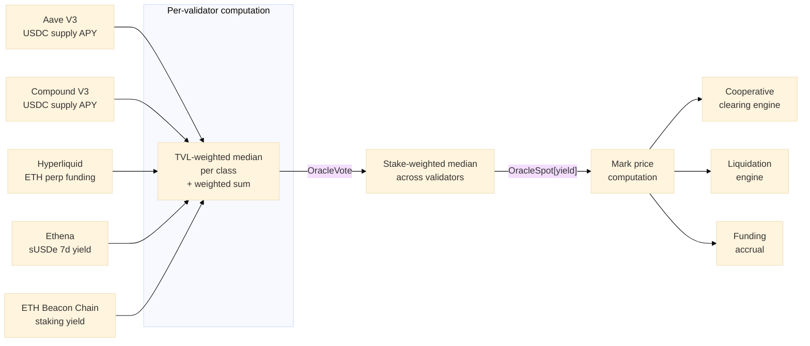

# 02 — Yield Perpetuals: The Instrument and Its Uses

> A yield perpetual is a perpetual futures contract whose underlying is a DeFi yield rate measured in basis points, not the spot price of an asset. It uses continuous funding payments to anchor its trading price to the underlying rate, with no expiration and no rollover. This document specifies the instrument — contract spec, position semantics, mark-price formula, funding-rate formula, margining and liquidation, KKT-verified clearing — and walks through the canonical use cases: the *clearing profile* primitive, the AAVE liquidation backstop, treasury hedging, leveraged yield trading, and sub-index-specific consumer profiles.

---

## 1. Category Definition

A yield perpetual is a perpetual futures contract — the same continuous-funding mechanism used by spot crypto perps on Binance, Bybit, dYdX, and Hyperliquid — applied to a yield rate instead of a price. Instead of "what does 1 BTC cost in USD" it tracks "what is the annualised cost of secured funding across DeFi lending protocols."

| Property | Standard crypto perp (BTC-PERP) | Yield perpetual |
|----------|---------------------------------|-----------------|
| Underlying | Asset spot price (BTC/USD) | DeFi yield rate (composite lending APY in bps) |
| Quote unit | USD or stablecoin | Basis points (1 bp = 0.01%) |
| Long means | Bet that the asset price rises | Bet that DeFi lending yields rise |
| Short means | Bet that the asset price falls | Bet that DeFi lending yields fall (the hedging use case) |
| Funding rate purpose | Anchor perp price to spot price | Anchor perp price to the reference yield rate |
| Funding rate components | Premium only | Premium + carry (the underlying itself is a rate) |

The category is not entirely novel — CME's SOFR futures and the legacy Eurodollar futures have been rate-based derivatives for decades. What is new is the perpetual structure (no expiry, continuous funding, single liquidity pool per benchmark) combined with on-chain rate trading and settlement against a consensus-computed benchmark (ISFR).

---

## 2. Contract Specification

| Parameter | Value | Notes |
|-----------|-------|-------|
| **Instrument type** | Perpetual futures (no expiry) | Continuous-funding |
| **Underlying** | DeFi yield reference rate | Multi-source benchmark = ISFR |
| **Quote unit** | Basis points (1 bp = 0.01%) | Industry convention for rate products |
| **Contract multiplier** | $1 notional per 1 bp of rate movement per unit | Linear payoff; required for KKT-verified clearing |
| **Minimum tick size** | 0.25 bp (0.0025%) | Matches CME SOFR futures tick size |
| **Lot size** | 1 unit ($1/bp) | Low barrier to entry |
| **Max leverage** | 10× | Conservative for rate markets |
| **Initial margin** | 10% of notional | |
| **Maintenance margin** | 5% of notional | |
| **Funding interval** | Every 8 hours | Standard perpetual cadence; 3 events per day |
| **Trading hours** | 24/7/365 | DeFi rates move continuously |
| **Reference index** | ISFR (Implied Secured Funding Rate) | See `01-isfr-index.md` |
| **Clearing** | Cooperative batch clearing, KKT-verified | See §6 |

The linear payoff is a deliberate choice, not a simplification. Convex or concave payoffs break the Karush–Kuhn–Tucker conditions that allow cooperative clearing solutions to be proved globally optimal in O(n) verification. Linearity preserves the convexity of the clearing optimisation problem.

---

## 3. Payoff and Position Semantics

The payoff is linear in basis points:

```
PnL per unit = (Exit_bps − Entry_bps) × Direction × $1
Direction:    +1 (long), −1 (short)
```

### Worked PnL examples

**Long, rates rise.** Enter long at 600 bps (6.00%). Reference rate rises to 650 bps (6.50%). Position size: 1,000 units.

```
PnL = (650 − 600) × (+1) × $1 × 1,000 = +$50,000
```

**Short, rates fall.** Enter short at 600 bps (6.00%). Reference rate falls to 450 bps (4.50%). Position size: 500 units.

```
PnL = (600 − 450) × (+1) × $1 × 500 = +$75,000
```

For a short, `Direction = −1` and `Exit − Entry` is negative when rates fall, so `(Exit − Entry) × Direction` becomes a positive number — the short profits when rates drop.

### Position semantics

| Position | Economic meaning | Who uses it | Funding behaviour |
|----------|------------------|-------------|-------------------|
| **Long** | Bet that the reference rate will rise | Speculators expecting yield increases; natural longs (borrowers with floating-rate liabilities) wanting to offset rising costs | Pays funding when mark > oracle; receives when mark < oracle |
| **Short** | Bet that the reference rate will fall | Treasuries and depositors hedging floating-rate exposure; anyone wanting to lock in today's rate | Receives funding when mark > oracle; pays when mark < oracle |

The short side is the primary economic reason yield perps exist. A treasury earning variable yield on Aave is long the rate by default — if rates fall, income drops. Shorting a yield perp creates an offsetting position: the perp's PnL compensates for the reduced lending income when rates fall, and the extra lending income compensates for the perp loss when rates rise. Net effect: the treasury locks in an effective rate close to the entry level regardless of where rates move. This is the same dynamic that makes interest-rate swaps the largest derivatives market in TradFi.

For every short, there must be a long. Natural counterparties on the long side:

1. **Speculators** expecting rates to rise (e.g., increased borrowing demand, governance changes that raise utilisation, macro shifts toward higher on-chain yields).
2. **Borrowers on lending protocols** wanting to hedge floating-rate borrowing cost. If a borrower pays 8% variable and rates spike to 15%, a long yield perp offsets the increased cost.
3. **Arbitrageurs** earning the funding rate when shorts are paying to maintain their hedge. If short demand is structurally higher than long demand, the funding rate is positive and longs earn a carry premium.

---

## 4. Mark Price Formula

The mark price governs unrealised PnL, margin calculations, and liquidation triggers. It blends the oracle reference rate with the order-book mid-price to prevent manipulation of either component individually.

### Standard formula (Live oracle)

```
MarkPrice[i] = OracleSpot[i] + EMA_150s(BookMid[i] − OracleSpot[i])
```

where:
- `OracleSpot[i]` is the stake-weighted median reference rate for instrument `i` (the ISFR value for yield instruments).
- `BookMid[i]` is the mid-price from the on-chain order book for the yield perp.
- `EMA_150s` is an exponential moving average with a 150-second time constant: smoothing factor `α = 1 − exp(−Δt / 150)`.

The oracle component dominates (preventing book manipulation), while the book term lets the mark price reflect genuine supply/demand dynamics not yet captured in the next reference-rate update.

An alternative explicit-blend formulation appears in some configurations:

```
MarkPrice = 0.7 × OracleRate + 0.3 × EMA(BookMid, 300s)
```

Either form yields the same operational property.

### Degraded-state formulas

When the ISFR oracle is not Live, the mark formula adjusts to reduce reliance on potentially-unreliable book prices:

| Oracle state | Mark price formula | Rationale |
|--------------|--------------------|-----------|
| **Live** | `OracleSpot + EMA_150s(BookMid − OracleSpot)` | Normal blending |
| **Degraded** | `0.9 × OracleRate + 0.1 × EMA(BookMid, 600s)` | Longer EMA, more oracle weight |
| **Stale** | `1.0 × LastLiveRate` | Pure oracle, frozen at last known good value |
| **Halted** | Mark price frozen; no new liquidations; no new positions | Emergency mode |

### Thin-liquidity fallback

When the order-book spread exceeds a threshold indicating unreliable book prices:

```
If BookSpread > SPREAD_THRESHOLD:
    MarkPrice = OracleSpot + EMA_30s(BookMid − MarkPrice)
```

The shorter 30-second EMA converges faster toward the oracle when the book is unreliable.

---

## 5. Funding Rate Formula

The funding rate is the mechanism that anchors the perpetual's trading price to the underlying reference rate. Without funding, the perp could diverge arbitrarily from the benchmark.

### Two-component structure

Yield perps differ from standard crypto perps by adding a carry term:

```
FundingRate = PremiumComponent + CarryComponent
```

#### Premium component

Standard perpetual funding mechanism, measuring how far the trading price has diverged from the oracle:

```
PremiumComponent = clamp(
    EMA(BookMid − OracleRate, 300s) / OracleRate,
    −0.05%,    // floor: −5 bps per 8h period
    +0.05%     // cap:   +5 bps per 8h period
)
```

When the perp trades above the oracle (positive premium), longs pay shorts. When below, shorts pay longs. This creates arbitrage pressure that pulls the perpetual price toward the benchmark. The ±0.05% per-interval clamp prevents unbounded liquidation risk during fast rate moves.

#### Carry component (unique to yield perps)

Standard crypto perps don't need a carry term because their underlying (a spot price) has no inherent yield. Yield perps do — the underlying is itself a rate, and holding rate exposure has an inherent cost.

```
CarryComponent = (ReferenceRate − RiskFreeRate) × (FundingInterval / Year)
```

where:
- `ReferenceRate` = the rate the instrument tracks (e.g. composite DeFi lending APY for the headline product).
- `RiskFreeRate` = the base cost of capital. ETH staking yield serves as crypto's risk-free analogue; on a USDC-margined book, the borrow rate of USDC on the same venue is the appropriate analogue.
- `FundingInterval / Year` = the fraction of a year elapsed in one funding interval (8 h / 8,760 h ≈ 0.000913).

The carry term ensures that in steady state, holding a yield perp position costs exactly the hedging cost — no free arbitrage for either side. Without it, one side would systematically receive a risk-free transfer at the other's expense during stable rate environments.

### Funding payment

Every 8 hours, funding is computed and applied:

```
FundingPayment = PositionSize × FundingRate
```

If `FundingRate > 0`: longs pay shorts. If `FundingRate < 0`: shorts pay longs.

### Comparison to standard crypto perp funding

| Aspect | Standard crypto perp (Binance/Hyperliquid) | Yield perpetual |
|--------|--------------------------------------------|-----------------|
| Premium term | `(Mark − OracleSpot) / OracleSpot` | Same formula applied to rate values |
| Carry term | None | `(ReferenceRate − RiskFreeRate) × Δt` |
| Clamp | ±0.05% per interval | Same clamp on premium; carry unclamped |
| Interval | 8 h (standard) | 8 h (configurable per instrument) |
| Settlement | USD-margined or coin-margined | USD-margined |

---

## 6. Cooperative Clearing — Where Orders Match

Yield perp orders do not match in a continuous limit-order book in the normal case. They match in cooperative batch clearing rounds where the batch's clearing price maximises total surplus, verified against KKT optimality conditions in O(n) time before fills execute.

This is why linearity matters: the clearing problem reduces to a linear program for which KKT conditions are necessary AND sufficient for optimality (Boyd & Vandenberghe, *Convex Optimization*, 2004). The chain folder owns the clearing engine internals; the index folder cares about three contract-surface properties:

1. **Mark price input.** The clearing engine reads `getMark(instrumentIndex)` via the Nunchi blockchain's oracle precompile in <31 ns. Liquidations always use the freshest mark.
2. **Phase ordering.** Within each block, ORACLE → ACCRUAL → LIQUIDATION → PERPS guarantees liquidations and funding always operate on the round's freshest oracle and mark.
3. **Stale-price guard.** Liquidations are paused when the ISFR oracle is in Stale or Halted state.

The full clearing-round lifecycle (order accumulation → batch close triggers → solver competition → KKT verification → settlement → prediction reveal & CRPS scoring → ClearingInsight emission) is documented in the chain folder. From the yield-perp instrument's perspective, the relevant property is that orders are matched at a uniform clearing price proven optimal by mathematics, not by trust in an off-chain matcher.

### Total clearing surplus

```
TotalSurplus = Σ((BuyLimit_i − ClearingPrice) × FillSize_i)   // filled buys
             + Σ((ClearingPrice − SellLimit_j) × FillSize_j)   // filled sells
```

### Graceful degradation

If the cooperative clearing path fails, the system degrades to parity with every other on-chain exchange — not below it:

| Failure level | Behaviour |
|---------------|-----------|
| **Normal** | Competitive solvers, KKT-verified clearing |
| **Default solver failure** | Orders roll to the next block. One block of delay, no loss. |
| **Persistent failure** | Fall back to standard CLOB matching. Price discovery continues. |
| **Circuit breaker** | If CLOB also fails, trading halts; positions frozen. |

Cooperative clearing is strictly additive: when it works, it produces better prices and emits structured knowledge (`ClearingInsight` events). When it fails, you get a normal order book.

---

## 7. Margining and Liquidation

Standard perpetual margining off the mark price.

| Parameter | Value | Notes |
|-----------|-------|-------|
| Initial margin | 10% (10× max leverage) | |
| Maintenance margin | 5% | |
| Liquidation trigger | `equity / notional < maintenance_margin` | |
| Liquidation engine | Reads `getMark(instrumentIndex)` via the chain precompile (<31 ns) | |
| Stale-price guard | Liquidations paused if ISFR oracle is Stale or Halted | Eliminates oracle-induced cascade-liquidation failure mode |
| Liquidation bonus | 2% of liquidated margin | Funded from the liquidated margin |
| Insurance fund contribution | 0.5 bps per cleared trade | Funds liquidation insurance |

### Liquidation example

A trader opens long $10,000 notional at 10× leverage ($1,000 margin).

```
Available margin before liquidation = $1,000 (initial) − $500 (maintenance) = $500
```

At $1/bp per unit with 10,000 units, $500 of loss corresponds to a 50 bp adverse rate move. If the trader is long at 600 bps and the mark price drops below 550 bps, the position becomes liquidatable.

Liquidation is permissionless. Any address can trigger the liquidation of an undercollateralised position and receive the 2% bonus from the liquidated margin. Liquidation orders enter the next cooperative clearing round.

---

## 8. The Clearing Profile — One-Action Hedging

A clearing profile is a persistent on-chain intent that automates the hedge setup. It sits dormant until market conditions activate it, creating the "set it and forget it" hedge that makes yield perpetuals accessible to non-expert users.

```solidity
struct ClearingProfile {
    address  account;          // Owner
    bytes32  market;           // Market identifier (e.g., "ISFR-PERP-V1")
    Direction direction;       // LONG or SHORT
    uint256  trigger;          // ISFR threshold in bps that activates the profile
                               //   SHORT: activates when ISFR < trigger
                               //   LONG:  activates when ISFR > trigger
    uint256  maxNotional;      // Maximum notional exposure in USD
    uint16   maxFeeBps;        // Maximum acceptable clearing fee (bps)
    uint64   expiry;           // Expiry timestamp (0 = no expiry)
    uint256  minFillNotional;  // Minimum fill per clearing round
    uint32   maxRounds;        // Max clearing rounds to participate in (0 = unlimited)
}
```

### Lifecycle

1. **Created** via one transaction (~50 K gas).
2. **Dormant** with zero carrying cost. No keeper required, no monitoring loop.
3. **Activated** when the reference rate crosses the trigger threshold.
4. **Filled** across cooperative clearing rounds until max notional, max rounds, or expiry.
5. **Complete or Cancelled.** The resulting position is a standard yield perpetual position.

If rates never cross the trigger, the profile never activates. The hedge costs $0. It is free insurance.

### Why this is the unlock

Without clearing profiles, hedging on yield perps requires continuous monitoring, manual order placement, margin top-ups, and active position management. With clearing profiles, the user declares a policy once and the runtime carries it out. This transforms the user-action count for a hedge from "tens of actions per month" to one. It is the difference between every DeFi treasury *understanding* it should hedge and every DeFi treasury *being able to* hedge.

---

## 9. Canonical Demo: AAVE Liquidation Backstop

This is the simplest end-to-end demonstration of why yield perpetuals paired with automated agents produce value that manual monitoring cannot.

### Setup

- A user has 10 ETH deposited on Aave at an 8% USDC supply rate.
- The user has borrowed against this position, giving a health factor of 1.4.
- If the supply rate drops significantly, cascading liquidations can push the health factor below 1.0.

### Without yield perpetuals

The user has two options: actively monitor the rate 24/7 and manually adjust the position, or do nothing and accept liquidation risk. In practice, 99% of DeFi users choose the second option by default. The product is unavailable not because the math is hard but because the operational burden is unacceptable.

### With yield perpetuals and an automated agent

1. The user sets a clearing profile — one transaction: *"hedge me if the rate drops below 6%."*
2. A reactive agent subscribes to the ISFR feed and the yield-perp order book.
3. The agent's predictive model flags an elevated probability of the rate crossing 6% — not after the drop, but as it begins forming.
4. The agent submits an intent to the clearing engine to open a short yield-perp position.
5. The clearing engine matches the intent with counterparties long the rate (speculators, natural longs) in a cooperative batch.
6. The hedge executes at **6.15%**.
7. The rate eventually drops to **5.2%**.
8. Without the hedge, the user faced an estimated $2,340 loss or liquidation. With it, the loss is limited to the hedging cost — a fraction of the unhedged alternative.

**Total user actions: 1** (setting the profile once).

---

## 10. Worked Hedging Example — $10M DAO Treasury

### Situation

A DAO holds **$10M USDC** on Aave V3 at **8.00% APY**. The treasury is concerned about rate compression over a 6-month window. If rates drop to 3.00%, the treasury loses approximately **$250,000** in expected yield over six months.

### Action

Create a clearing profile:

| Field | Value |
|-------|-------|
| Direction | SHORT |
| Trigger | ISFR < 700 bps (7.00%) |
| Max notional | $10,000,000 |
| Max fee | 10 bps |
| Expiry | 180 days |

### Scenario A — rates drop

Over three months, ISFR declines from 8.00% to 3.00%. The profile activates when ISFR crosses 7.00%, entering a short at 693 bps (clearing price) for a partial fill of 5,000 units.

```
PnL on perp = (693 − 300) × $1 × 5,000 = +$1,965,000

Aave yield shortfall over 6 months:
  Expected at 8.00%:    $10M × 8.00% × (180/365) = $394,521
  Actual at avg 5.00%:  $10M × 5.00% × (180/365) = $246,575
  Shortfall:                                       $147,946

Funding cost over 90 days at avg 0.01% per 8h interval:
  5,000 × 693 × 0.01% × (90 × 3) ≈ $935

Net result: +$1,965,000 − $935 = +$1,964,065 gain on hedge
            vs $147,946 yield shortfall
```

The hedge cost $935 to maintain and generated $1.96M against a $148K shortfall. The treasury is fully protected with material upside.

### Scenario B — rates stay high

ISFR never drops below 7.00%. The profile never activates. The treasury earned 8.00% APY on $10M for the full window. **Cost of the hedge: $0.**

This is the asymmetry the clearing profile creates: cost is zero unless the protection is needed.

---

## 11. Treasury Hedging — General Pattern

The DAO example generalises. Any holder of a floating-rate exposure can construct an offsetting short on the matching ISFR sub-index:

| Holder type | Exposure | Hedge | Sub-index |
|-------------|----------|-------|-----------|
| Stablecoin lender on Aave/Compound | Long lending APY | Short ISFR.LENDING | Yes |
| Ethena sUSDe holder | Long structured yield | Short ISFR.STRUCTURED | Yes |
| Validator / staker | Long ETH staking yield | Short ISFR.STAKING | Yes |
| Aggregate treasury (mixed) | Long composite | Short ISFR | Yes (composite) |
| Borrower paying floating-rate USDC | Short the rate | Long ISFR.LENDING | Yes |
| Funding-rate harvester | Long perp funding | Short ISFR.FUNDING | Yes |

The sub-indices are the granular hedging surface. A treasury hedging Aave-specific exposure should not be paying basis risk on a composite that includes funding-rate volatility; it can target `ISFR.LENDING` directly. This sub-index granularity is one of ISFR's structural advantages over IPOR (single index), Pendle (per-asset prices), and SOFR (one rate plus distribution percentiles).

### Basis trades against the composite

Sub-indices also enable basis trading. If `ISFR.LENDING` diverges sharply from `ISFR.STRUCTURED` (a "basis collapse" event), an arbitrageur can take opposing positions on the two sub-indices, profiting from convergence. The InsightStore emits structured warnings for divergences exceeding configurable thresholds, surfacing these opportunities to subscribed agents.

---

## 12. Speculative Use — Leveraged Yield Trading

The long side is structurally important even though hedging dominates the design narrative.

| Strategy | Position | Thesis |
|----------|----------|--------|
| Rates-rising speculation | Long ISFR composite | Macro view that DeFi yields will rise |
| Funding-rate carry | Long when funding > oracle (positive premium) | Receive perp funding while basis stays positive |
| Mean-reversion on a sub-index | Short divergent sub-index | Empirical observation: mean reversion within a typical window after large divergences |
| Volatility-regime speculation | Long volatility via wider stops on funding-rate spikes | Wider stops capture spike-and-revert dynamics |

Standard initial margin of 10% (10× max leverage) makes these strategies capital-efficient. Lower leverage than spot crypto perps (where 50–125× is common) reflects that DeFi rates rarely move >100 bps daily; 10× provides meaningful hedging without runaway liquidation risk.

---

## 13. Mortgage Analogue — Why This Matters Beyond Hedging

The closest TradFi analogue to the clearing-profile + yield-perp combination is the floating-to-fixed interest-rate swap that homebuyers use to lock in mortgage rates. In TradFi, that requires a swap dealer relationship, ISDA documentation, collateral agreements, and ongoing margin operations. The transactional cost is enormous, which is why retail homebuyers do it through a bank intermediary that bundles it into the mortgage.

Yield perps + clearing profiles + agents collapse the entire dealer/documentation/margin/operations stack into one signature for any DeFi participant. The product doesn't just enable institutional hedging; it makes hedging accessible at every TVL tier from $10K personal positions to $100M DAO treasuries. This is the reason a $49.5B DeFi lending market with no hedging instrument is the addressable market — it is not just the institutional slice of that market, it is the whole thing.

---

## 14. Sub-Index-Specific Use Cases

Each sub-index has its own consumer profile.

### ISFR.LENDING — the borrow/supply hedge

Primary consumers: stablecoin lenders, USDC borrowers, fixed-rate lending protocols (Term Finance, Notional Exponent), lending vault aggregators (Morpho, Spark frontends). Use case: hedge floating-rate lending exposure with the lowest possible basis to the actual underlying. ISFR.LENDING is the "purest" lending rate signal and the most direct settlement basis for fixed-rate lending products.

### ISFR.STRUCTURED — delta-neutral strategy benchmarking

Primary consumers: delta-neutral vaults (Ethena-style strategies), basis-trade strategies, structured-yield tokens. Use case: benchmark strategy performance against the broad delta-neutral market. A strategy underperforming `ISFR.STRUCTURED` over a window is, by definition, underperforming the benchmark.

### ISFR.FUNDING — speculative-pressure signal

Primary consumers: market makers, funding-rate arbitrageurs, leverage monitoring (risk dashboards), insurance products. Use case: gauge speculative leverage in the system. High `ISFR.FUNDING` divergence from `ISFR.LENDING` is a leading indicator of leverage build-up; sustained divergence frequently precedes liquidation cascades.

### ISFR.STAKING — base-rate floor

Primary consumers: validator economics models, staking ETF NAV computation, ETH-denominated risk-free curves. Use case: the base-layer floor rate. Because ETH staking is highly decentralised and slow-moving, `ISFR.STAKING` is the rate against which more volatile yields can be discounted to a real-yield equivalent.

---

## 15. The Knowledge Production Side Effect

Every clearing round of a yield perpetual emits a `ClearingInsight` event into the InsightStore — the chain's on-chain knowledge repository. The event records:

- Clearing price, volume, order imbalance.
- Prediction spread across participating agents (the variance of their committed rate predictions).
- Prediction-accuracy distribution after the next ISFR update reveals truth.
- Total surplus captured.

This is the "clearing-as-inference" property: every trade that clears adds a scored, timestamped, attribution-tagged observation to the chain's knowledge base. Other agents query the InsightStore to inform their next decisions. Reputation tiers — derived from CRPS scoring of those predictions — feed back into clearing priority and gamma fee discounts.

For a treasury or agent operator: **using yield perps is not just hedging; it is also producing a stream of structured observations that other consumers in the ecosystem can use, and the participant's own reputation score (with downstream economic consequences) updates as they participate.** Better predictions earn lower fees and higher fill priority, creating a positive flywheel for sophisticated agents.

See `04-business-and-regulatory.md` for the full agent-attestation and CRPS-scoring story.

---

## 16. Position Lifecycle (Reference)

The standard yield-perp position lifecycle:

1. **Open.** User or agent submits an order with direction (long/short), size in units, and collateral. Collateral must meet the 10% initial margin requirement.
2. **Mark.** Between clearing rounds, positions accrue unrealised PnL based on current mark price vs entry rate.
3. **Settle.** During each 8-hour funding interval, funding payments flow between longs and shorts.
4. **Close.** User or agent closes the position, realising PnL and reclaiming remaining collateral.

The clearing profile mechanism (§8) automates steps 1 and 4 in response to declarative triggers, leaving the user with no operational burden between profile creation and final settlement.

---

## 17. Operational Failure Modes

Use-case operators should know what happens at each ISFR oracle state:

| Oracle state | What happens to active positions | What happens to clearing profiles |
|--------------|-----------------------------------|-----------------------------------|
| **Live** | Normal operations | Triggers fire normally |
| **Degraded** | Normal with warning flag | Tight clearing profiles may pause |
| **Stale** | Existing positions use frozen rate | No new profile activations |
| **Halted** | No new positions; no liquidations; existing positions preserved | All triggers paused |

The defensive design: liquidations cannot be triggered by stale or unreliable oracle data. This eliminates the most common cause of catastrophic losses in DeFi history — cascading liquidations driven by oracle failure rather than market movement. A user who set a clearing profile and then suffered an oracle failure does not lose their position; they lose only the responsiveness window of the trigger until the oracle returns to Live.

---

## 18. Reference Rate Flow



---

## 19. All Constants and Parameters (Reference)

### Core formulas

**PnL (per unit):**
```
PnL = (Exit_bps − Entry_bps) × Direction × $1
Direction: +1 (long), −1 (short)
```

**Mark price (Live state):**
```
Mark = OracleSpot + EMA_150s(BookMid − OracleSpot)
```

**Funding rate:**
```
FundingRate     = PremiumComponent + CarryComponent
PremiumComponent = clamp(EMA(BookMid − OracleRate, 300s) / OracleRate, −0.05%, +0.05%)
CarryComponent   = (ReferenceRate − RiskFreeRate) × (FundingInterval / Year)
```

**Reference rate (ISFR) two-level computation:**
```
Level 1 (per class): TVL-weighted median of source rates within each class
Level 2 (composite): ISFR = 0.60·LENDING + 0.25·STRUCTURED + 0.10·FUNDING + 0.05·STAKING
```

### Constants

| Parameter | Value |
|-----------|-------|
| Contract multiplier | $1 / bp / unit |
| Minimum tick | 0.25 bp |
| Lot size | 1 unit |
| Initial margin | 10% |
| Maintenance margin | 5% |
| Max leverage | 10× |
| Funding interval | 8 hours |
| Funding premium clamp | ±0.05% per interval |
| Insurance fund contribution | 0.5 bps per trade |
| Liquidation bonus | 2% of liquidated margin |
| LENDING class weight | 0.60 |
| STRUCTURED class weight | 0.25 |
| FUNDING class weight | 0.10 |
| STAKING class weight | 0.05 |
| Oracle update cadence | 10 s (every 25 blocks at 400 ms block time) |
| Mark price EMA time constant | 150 s (standard) / 30 s (thin-liquidity fallback) |
| Confidence threshold: Live → Degraded | 70% |
| Confidence threshold: Degraded → Live | 80% (hysteresis) |
| Historical rate retention on-chain | 90 days |

### V2 governance-adjustable parameters

| Parameter | V1 value | V2 range |
|-----------|----------|----------|
| Class weight bounds | Fixed | LENDING 30–80%, FUNDING 0–20% (governance rails) |
| Source confidence | Governance-assigned (0–100) | MSPE leave-one-out (automatic) |
| Intra-class aggregation | TVL-weighted median | Cost-stratified trimmed mean |
| Class weight adaptation | Fixed | Bates–Granger optimal combination with bounds |
| Smoothing | EMA | Kalman filter |

---

## 20. References

- Hyperliquid funding documentation (premium-clamp design pattern).
- Boyd, S. & Vandenberghe, L. *Convex Optimization*. Cambridge University Press, 2004.
- Kim, H. & Park, A. "Designing Funding Rates for Perpetual Futures." arXiv:2506.08573, 2025.
- Federal Reserve Bank of New York / ARRC SOFR documentation.
