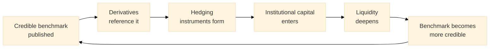

# 03 — Market Thesis and Generalised Benchmark Framework

> ISFR's addressable market is the world's largest financial market: ~$668 trillion in OTC interest-rate-derivative notional. The structural opportunity is the six-orders-of-magnitude gap between TradFi rate-derivative activity and on-chain rate-derivative activity (under $100M). This document covers the market thesis (the LIBOR-to-SOFR template, the benchmark flywheel, the index-industry economics, the YBS narrow wedge) and then explains how the computational pattern behind ISFR generalises to a `BenchmarkIndex` framework with five canonical indices and a universal five-stage pipeline.

---

## 1. The Numbers

The OTC interest-rate-derivatives market is the largest financial market on Earth by notional volume. Public data from the Bank for International Settlements and ISDA (mid-2025):

| Metric | Value | Source |
|--------|-------|--------|
| OTC IRD notional outstanding | **~$668T** (mid-2025) | BIS Statistical Bulletin, December 2025 |
| Share of total OTC derivatives | 78.7% of $845.7T | BIS |
| OTC IRD daily turnover | $7.9T (April 2025) | BIS Triennial Central Bank Survey, 2025 |
| Growth in daily turnover (2022 → 2025) | +59% (from $5.0T) | BIS Triennial Survey |
| SOFR-linked OIS traded notional (2024) | $72.1T | ISDA, June 2025 |
| SOFR OIS growth (2021 → 2024) | 11.8× (from $6.1T) | ISDA |
| OIS share of total IRD (2024) | 66.6% ($244.0T of $366.3T) | ISDA |

The structural shift is significant: overnight index swaps (OIS) — the instrument class most directly analogous to ISFR-settled yield perpetuals — now account for two-thirds of all interest-rate-derivative trading volume, up from a minority share before SOFR adoption. The LIBOR-to-SOFR transition did not merely replace one benchmark with another; it restructured the entire market around overnight secured rates.

This restructuring creates the template for DeFi. Overnight secured lending rates are exactly what DeFi lending protocols produce — variable, collateralised, with transparent on-chain settlement.

---

## 2. The Six-Orders-of-Magnitude Gap

DeFi lending is a $49.5B market (DeFiLlama, April 2026). On-chain interest-rate-derivative TVL is under $100M. The ratio between TradFi rate-derivative notional and on-chain rate-derivative TVL is over **1,000,000-to-1**.

| Metric | Value |
|--------|-------|
| TradFi interest-rate derivative notional | ~$668T |
| DeFi lending TVL (unhedged rate exposure) | ~$49.5B |
| On-chain interest-rate derivative TVL | < $100M |

Every dollar lent in DeFi carries unhedged variable rate exposure:

| Protocol | TVL (April 2026) | Supply rate (USDC) | Rate hedging available |
|----------|------------------|---------------------|------------------------|
| Aave V3 | ~$23.5B | 3–8% variable | None |
| Morpho | ~$10B+ | 3–8% variable | None |
| Spark (MakerDAO) | ~$7.9B | Variable (DSR) | None |
| Compound V3 | ~$2.1B | 3–8% variable | None |

A treasury holding $10M on Aave at 8% APY has no way to lock in that rate. If rates drop to 3%, the treasury faces a $500K annualised shortfall. Today there is no instrument to hedge against it.

This is not a marketing or timing problem. It is the absence of a foundational primitive: a credible, multi-source benchmark rate against which derivatives can settle.

---

## 3. The LIBOR-to-SOFR Precedent

The LIBOR-to-SOFR transition is the most instructive case study in benchmark dynamics — and the explicit template for how ISFR is positioned.

| Year | Event |
|------|-------|
| 1986–2014 | LIBOR governs >$350T in financial contracts globally, despite known structural weaknesses (survey-based, manipulation-susceptible, thin underlying transaction volume). |
| 2014 | Alternative Reference Rates Committee (ARRC) is convened by the Federal Reserve Bank of New York to identify a replacement for USD LIBOR. |
| 2017 | ARRC selects SOFR (Secured Overnight Financing Rate), based on the ~$1T/day U.S. Treasury repo market. SOFR's advantage is not sophistication — it is credibility: transaction-based methodology, deep underlying volume, administered by the NY Fed. |
| 2018–2023 | Five-year transition migrates $250T+ in contracts from LIBOR to SOFR. Required regulatory mandates, legislative backstops (LIBOR Act of 2022), and coordinated industry effort. |
| 30 June 2023 | All remaining USD LIBOR tenors cease publication permanently. |

### The lessons

1. **Benchmarks are natural monopolies.** LIBOR survived 30+ years of known deficiencies because switching costs exceeded design flaws. Once derivative contracts, hedging strategies, and institutional frameworks reference a benchmark, displacement is structurally hard.
2. **Credibility — not theoretical optimality — wins.** SOFR was not chosen because it was the optimal rate. It was chosen because it was first to achieve credibility: transaction-based methodology, NY Fed administration, deep underlying volume.
3. **Displacement requires regulatory force.** SOFR replaced LIBOR through coordinated regulatory mandate plus legislative backstop, not market choice. The first credible benchmark in a category captures it; competitors require regulatory intervention to displace.
4. **The same dynamics will apply on-chain.** DeFi has $49.5B in lending TVL and zero credible benchmark rates. The first rate that achieves institutional credibility will capture the position — and the network effects that defend it.

---

## 4. The Benchmark Flywheel

Every successful benchmark in financial history exhibits the same self-reinforcing cycle:



1. A credible rate is published.
2. Derivatives reference it.
3. Hedging instruments create demand.
4. Institutional capital enters (institutions require hedging to participate).
5. Institutional capital deepens liquidity.
6. Greater liquidity makes the benchmark more credible.
7. Greater credibility attracts more derivatives.

Once this flywheel reaches critical mass, displacement becomes prohibitively expensive. LIBOR survived 30+ years of known structural deficiencies because switching costs outweighed design flaws. SOFR displaced LIBOR only through coordinated regulatory force.

The thesis is that **the first credible DeFi benchmark rate will capture the same position in on-chain markets that SOFR holds in traditional finance**. The causal chain is explicit:

> **benchmark rate → derivative pricing → hedging instruments → institutional capital → market depth → lower borrowing costs → more derivatives → stronger benchmark**

Remove the benchmark and the entire chain does not start. ISFR is designed to start it.

---

## 5. Why Now — Convergent Conditions

Several structural conditions align in 2026.

### DeFi lending has reached institutional scale

$49.5B in TVL is large enough to sustain a benchmark-quality rate and large enough that the hedging gap is economically meaningful. The institutional buyers who will eventually consume ISFR-settled instruments need this scale to commit operational and compliance resources.

### The LIBOR-to-SOFR transition proved the template

The $250T+ migration demonstrated that benchmark transitions are possible, that transaction-based rates win over survey-based rates, and that overnight secured rates become the standard. DeFi lending protocols produce exactly the type of rate that won that transition: variable, collateralised, transaction-based, transparent.

### Perpetual futures are a proven DeFi primitive

Combined daily volume across Binance, Bybit, Hyperliquid, dYdX, and other venues routinely exceeds $100B. Hyperliquid alone reported approximately $2.95T total 2025 volume, $6B TVL, ~70% DEX-perpetuals market share, and ~$844M annual revenue. The mechanism works. Applying it to rates is an extension, not an invention.

### Existing attempts have failed to capture the benchmark position

| Project | Status | Why it has not captured the position |
|---------|--------|--------------------------------------|
| Pendle | $5.7B avg TVL (2025); $13.4B peak Sept 2025; $47.8B 2025 trading volume; ~$44.6M fees | Yield tokenisation with fixed-maturity PT/YT. Boros funding-rate market launched ($80M OI, $5.5B notional). Limitation: expiring instruments fragment liquidity per asset/maturity; manual rollover; **no benchmark rate**. |
| IPOR (now Fusion) | $5.55M seed (Feb 2022, no fresh capital); ~$14M unleveraged TVL / $60M total value managed; pivoted to vault aggregator May 2025 | Single-methodology flat 3-source average. No two-level aggregation, no manipulation-tolerance guarantees, thin liquidity. The vault pivot conceded the benchmark category. |
| Spectra | ~$44M current TVL; peaked ~$190M in 2025 | Same PT/YT model as Pendle with the same structural constraints. |
| Voltz | Sunset December 2023 | The most prominent prior attempt. IR swaps on a concentrated-liquidity AMM. Shut down after failing to achieve sustainable economics. |
| Treehouse | $610M TVL peak; $157M current; TREE token 94% below ATH | DOR / TESR (ETH staking yield only). Panellist-submitted forecasts. FalconX FRA pilots live but single-feed. |
| CF Benchmarks | $40B+ referenced AUM; FCA FRN 847100; KPMG-audited; Kraken-owned | All rates off-chain-administered, on-chain-distributed. No DeFi-native lending or yield-bearing-stablecoin product. |

What is missing across all of these is the foundational layer: a multi-source, validator-computed, manipulation-resistant benchmark rate with sub-indices, published at the consensus layer, available in a single opcode. ISFR is that layer.

---

## 6. The Index Industry Economics

The economics of running a benchmark business are among the most attractive in financial services. Combined index-industry revenue across the three dominant firms exceeds **$4.5B annually**:

| Firm | Revenue | EBITDA margin |
|------|---------|---------------|
| **S&P Dow Jones Indices (SPDJI)** | ~$1.6B | 60%+ |
| **MSCI Index segment** | ~$1.6B | 76% adjusted EBITDA — among the highest in any financial-services vertical |
| **FTSE Russell** | GBP 918M | — |

These margins exist because the toll-booth model scales with passive assets under management. US passive-fund AUM surpassed active in late 2024 and reached approximately **$19.1T** by October 2025. Once an ETF tracks an index, switching benchmarks is functionally impossible — pension mandates, ERISA contracts, and ETF prospectuses are hardwired to specific benchmarks. State Street pays S&P DJI approximately 3 bps of AUM plus $600,000 per year in flat fees for SPY alone, generating roughly **$120M annually from a single ETF**. Index licensing fees represent **31–36%** of all ETF expense ratios.

Bloomberg's $781M acquisition of Barclays Risk Analytics and Index Solutions in August 2016 (rebranded Bloomberg Fixed Income Indices in August 2021) demonstrates that credibility in this space is buyable but expensive. Over 500 ETFs and >$4.1T in mutual fund and ETF assets benchmark to Bloomberg fixed-income indices today; ~$2.3T tracks the US Aggregate alone. Three administrator changes (Lehman → Barclays → Bloomberg) and the Aggregate still dominates because institutional mandates are hardwired.

For ISFR, the same template scales to on-chain rate-product TVL. At a Phase-3 target of $20B referenced notional, even a 0.5–3 bp toll generates **$10–60M per year** at index-industry margins.

---

## 7. The DeFi Underlying — Where the Source Data Comes From

To ground the addressable-market argument: ISFR aggregates from real DeFi venues with substantial TVL and continuous on-chain activity.

### Aave

- ~$23.5B TVL; **61.5% active loan market share**; peak deposits of $75B; $3T+ in all-time assets supplied (DeFiLlama / Aave dashboards).
- V4 upgrade introduces hub-and-spoke cross-chain architecture.
- Aave Horizon (institutional RWA) ended 2025 with $570M deposits.

### Morpho

- Doubled to ~$6.4–7.1B TVL (some sources cite >$10B in optimised pools).
- Institutional backing from Apollo Global ($940B AUM), Coinbase, Société Générale.
- Now the #2 lending protocol by TVL.

### Spark (MakerDAO)

- ~$7.9B TVL; variable rate from the Maker DSR (Dai Savings Rate).
- Aave V3 fork with Maker integration.

### Compound

- ~$2.1B TVL with below-market yields (~2.6% APY in some periods).
- Different utilisation curve from Aave; provides intra-class diversification.

### Ethena

- USDe ~$5.92B (Q1 2026); sUSDe APY ~3.72% (Messari).
- Delta-neutral yield from short-perp funding rate capture.
- Peaked at $14.8B TVL before crashing 50%+ as leveraged strategies unwound.

### ETH Beacon Chain

- ~$115B+ staked (~38M ETH).
- Per-epoch consensus + MEV reward yield.
- Most decentralised yield source in crypto; most resistant to single-entity manipulation.

### Hyperliquid (FUNDING source for canonical V1)

- $2.95T total 2025 volume; $6B TVL; ~70% DEX perpetuals market share; ~$844M annual revenue.
- HIP-3 (October 2025) enables permissionless perpetual market creation by staking 500K HYPE (~$25M); builder-deployed open interest reached $790M ATH by January 2026.

These venues collectively produce rates whose movement is economically meaningful for tens of billions of dollars of unhedged exposure. They are the substrate ISFR is built on.

---

## 8. Beachhead Targeting: ISFR-YBS as the Narrow Wedge

Within the broader $668T addressable market, the launch wedge is deliberately narrow: yield-bearing stablecoins (YBS).

### Why YBS specifically

The yield-bearing-stablecoin sector projects **$50B+ in supply by year-end 2026**. Critically, **no regulated administrator publishes a benchmark for this segment.** DeFiLlama Yields and CoinGecko's category page are retail-grade and explicitly disclaim institutional use.

Current notable issuers and scale:

| Issuer | Scale | Notes |
|--------|-------|-------|
| Sky sUSDS | ~$5B market cap | 3.75–4.5% SSR |
| Ethena sUSDe | USDe ~$5.92B (Q1 2026) | sUSDe APY ~3.72% (Messari) |
| Maple syrupUSDC | ~$2.6B | |
| Ondo USDY | $1.32B at ~3.69–5% yield | OUSG ~$1.1B at ~3.75% |
| Aave aUSDC | ~$3.4B pool | |
| Ethena USDtb | $1.83B (BUIDL-backed) | |
| Mountain USDM, Frax sFRAX, Usual USD0/USD0++, Agora AUSD | various | Additional constituents |

The branding narrative is "the MMF benchmark for crypto dollars" — analogous to iMoneyNet or Crane Index in TradFi. Distribution is already happening at scale: Stripe/Privy plus sUSDS is pushing into 110M wallets and 2,000 apps as of March 2026.

### Why YBS scored highest in opportunity ranking

A weighted scoring across data availability, trust requirements, existing demand, competitive gap, and strategic fit (1–5 each, 25 maximum):

| Candidate | Data | Trust | Demand | Gap | Fit | Total |
|-----------|------|-------|--------|-----|-----|-------|
| **Stablecoin yield (YBS)** | 4 | 3 | **5** | **5** | 3 | **20** |
| DeFi lending rates | **5** | **5** | 3 | 2 | 4 | 19 |
| LST/LRT yield | 4 | 3 | 4 | 3 | **5** | 19 |
| Perp funding | **5** | 3 | 4 | 2 | 3 | 17 |
| AI compute pricing | 3 | 2 | 4 | 2 | **5** | 16 |

YBS scores highest on the two dimensions weighted most by sophisticated benchmark-buying institutions: existing demand and competitive gap.

### What was deferred and why

- **LRT/staking** despite the highest strategic-fit score: Treehouse + FalconX have a 6–12 month head start on staking-rate forward-rate agreements with named institutional counterparties (Edge Capital, Mirana, Monarq). The April 2026 Kelp/rsETH exploit ($292M drained, $236M in cascaded bad debt across Aave, Compound, and Euler) makes LRT inclusion-criteria the most adversarial design problem in DeFi. **Deferred to Phase 2.**
- **Perp funding**: Coinglass, Laevitas, Velo, CoinAPI, Amberdata, Block Scholes, and CF Benchmarks KFRI all publish data products in this space. Ethena's perp backing of USDe fell from ~93% to ~11% of collateral over 2025, weakening the hero use case. **Deferred.**
- **AI compute pricing**: Silicon Data already publishes a Bloomberg-distributed daily H100/A100 index, backed by DRW and Jump Trading, claiming 80%+ coverage. SemiAnalysis publishes a ClusterMAX H100 1-year rental index. SF Compute raised a Series A at $300M post-money in November 2025. **Phase 3 candidate at the earliest.**

The wedge sequence is therefore: **ISFR-YBS** (greenfield, no regulated competitor) → **ISFR-Lend.USDC** (companion product covering DeFi lending rates) → **ISFR-LRT** (after LRT methodology is battle-tested) → **ISFR-Funding** (after data competition is mapped). The composite ISFR (the headline aggregate) sits above all of them as the canonical benchmark for DeFi cost of capital.

---

## 9. The Underlying Bet

The bet is not that ISFR will out-engineer Chainlink/Pyth/API3 on data delivery. They are oracle networks. ISFR is a benchmark business in the model of CF Benchmarks, CoinDesk Indices, MSCI, and S&P Dow Jones Indices. The bet is that:

1. Benchmark rates are natural monopolies (LIBOR/SOFR proves this).
2. The first credible DeFi benchmark captures the rate-derivatives category.
3. The category, once reached, scales to a non-trivial fraction of TradFi's $668T notional.
4. The economics of running a credible benchmark — toll-booth licensing on referenced AUM — generate index-industry margins (60–76% EBITDA on revenue scaling with referenced notional).
5. ISFR's two-level multi-source methodology, validator-computed publication, and IOSCO-aligned governance position it to be that first credible benchmark for the YBS and DeFi-lending segments.

The competitive race is not fast; benchmark transitions take years. But the position, once captured, is defended by network effects and switching costs that took LIBOR 30 years and a Congressional act to displace. ISFR's design is optimised to be the first credible entrant, not the most clever one.

---

## 10. The Generalised Benchmark Framework

The computational pattern behind ISFR — multi-source aggregation, dual-median computation, validator consensus, oracle precompile publication, derivative instruments, prediction-scoring — is domain-agnostic. Any domain where multiple independent sources produce measurable signals can support a benchmark with identical properties.

While building ISFR, an architectural insight emerged: **the pipeline has nothing inherently specific to interest rates.** The pattern is the structure; only the source definitions and update cadences are domain-specific. This section specifies the generalised framework that extracts the pattern, and defines the five canonical indices that compose the **Nunchi Reference Index Suite (NRIS)**.

---

## 11. The `BenchmarkIndex` Trait

The generalisation is captured in a Rust trait defined in the chain's core crate. Any benchmark index — whether it measures DeFi funding costs, agent performance, knowledge quality, security posture, or research rigour — must implement this trait.

```rust
/// A benchmark index computed by Nunchi blockchain validators at the consensus layer.
///
/// All benchmark indices share the same computational structure: multi-source
/// aggregation via weighted median, validator-level consensus via stake-weighted
/// median, and publication via precompile.
pub trait BenchmarkIndex: Send + Sync {
    /// The set of sources contributing to this index.
    fn sources(&self) -> &[IndexSource];

    /// Compute the index value from a set of source readings.
    /// Each validator calls this independently during block production.
    /// The implementation MUST be deterministic given the same inputs.
    fn compute(&self, readings: &[SourceReading]) -> IndexValue;

    /// Compute the confidence score from validator vote distribution.
    /// Returns the fraction of stake within one standard deviation of the
    /// stake-weighted median. Used to trigger circuit-breaker state transitions.
    fn confidence(&self, validator_votes: &[Vote]) -> f64;

    /// The update cadence in blocks.
    /// At the chain's 400ms block time:
    /// - ISFR: 25 blocks (~10 seconds)
    /// - IAPI: 750 blocks (~5 minutes)
    /// - IKQI: 9,000 blocks (~1 hour)
    /// - ISVI: 9,000 blocks (~1 hour)
    /// - IRRI: 216,000 blocks (~24 hours)
    fn update_cadence_blocks(&self) -> u64;

    /// Precompile address where this index is published on the Kernel Plane.
    fn precompile_address(&self) -> Address;

    /// Circuit breaker threshold. Below this confidence, the index enters
    /// Degraded publication state. Default 0.70.
    fn circuit_breaker_threshold(&self) -> f64 { 0.70 }
}
```

### Supporting types

```rust
pub struct IndexSource {
    pub name: String,
    pub weight: f64,
    pub max_weight: f64,
    pub liveness_timeout_secs: u64,
    pub reader: SourceReader,
}

pub struct SourceReading {
    pub source_idx: usize,
    pub value_bps: u32,
    pub timestamp: u64,
    pub is_live: bool,
}

pub struct IndexValue {
    pub value_bps: u32,
    pub num_sources: u32,
    pub state: PublicationState,
}

pub enum PublicationState { Live, Degraded, Stale, Halted }

pub struct Vote {
    pub value_bps: u32,
    pub validator_index: u32,
    pub stake_weight: f64,
}
```

The validation criterion for genericity: a `Vec<Box<dyn BenchmarkIndex>>` must hold ISFR, IAPI, and IKQI simultaneously and all three must pass the same confidence and circuit-breaker logic. This proves the trait is genuinely generic, not just refactored ISFR-specific code.

---

## 12. The Five Indices

Five indices follow the `BenchmarkIndex` trait. Each addresses a different domain where multi-source aggregation produces a credibility advantage no single source can match.

### 12.1 ISFR — Implied Secured Funding Rate

**Domain.** DeFi funding cost.

**What it measures.** The cost of secured funding across decentralised finance. ISFR is to DeFi what SOFR is to traditional finance.

**Why it matters.** DeFi holds $49.5B in lending TVL with zero hedging instruments. ISFR creates the reference point that enables hedging. See `01-isfr-index.md`.

**Sources (canonical V1).** Aave V3 USDC, Compound V3 USDC, Ethena sUSDe, ETH Beacon Chain staking, Hyperliquid ETH perp funding. Two-level aggregation: TVL-weighted median per class (LENDING, STRUCTURED, FUNDING, STAKING), then weighted sum (0.60 / 0.25 / 0.10 / 0.05).

**Update cadence.** Every 25 blocks (~10 seconds). 8,640 publications/day.

**Precompile.** `0xA01`.

**Derivative.** Yield perpetuals. See `02-yield-perpetual.md`.

### 12.2 IAPI — Internet Agent Performance Index

**Domain.** Agent task success rates.

**What it measures.** Aggregate task-success rates for autonomous agents across competitive arenas. IAPI is the benchmark for agent capability — a single number capturing how well autonomous agents perform their assigned work.

**Sources.**

| Source | What it measures | Weight | Liveness timeout |
|--------|------------------|--------|------------------|
| Arena results | Win/loss/draw outcomes across competitive evaluation arenas | 0.30 | 600 s |
| Gate pass rates | Percentage of tasks that pass automated validation gates (compile, test, clippy, diff review) | 0.30 | 600 s |
| Task completion metrics | End-to-end task completion rates across all active plans | 0.25 | 600 s |
| CRPS prediction scores | Calibration quality of agent predictions scored via CRPS | 0.15 | 600 s |

**Update cadence.** Every 750 blocks (~5 minutes).

**Precompile.** `0xA06`.

**Why it matters.** Agent performance today is measured in isolated, protocol-specific ways. IAPI aggregates performance signals from multiple independent evaluation systems into a single number that can serve as the basis for agent reputation scoring, model routing decisions, derivative markets on agent capability trends, and insurance pricing for agent-executed work.

### 12.3 IKQI — Internet Knowledge Quality Index

**Domain.** Epistemic quality of knowledge entries.

**What it measures.** The accuracy, utility, and reliability of entries in persistent knowledge stores. IKQI is the benchmark for how trustworthy the knowledge that agents produce and consume actually is.

**Sources.**

| Source | What it measures | Weight | Liveness timeout |
|--------|------------------|--------|------------------|
| Confirmation rates | Percentage of entries later confirmed by independent observation | 0.30 | 3,600 s |
| Usage frequency | How often entries are queried and used in downstream agent decisions | 0.25 | 3,600 s |
| CRPS scores | Prediction accuracy of knowledge-derived forecasts scored against realised outcomes | 0.25 | 3,600 s |
| Peer validation counts | Number of independent agents that corroborate a knowledge entry | 0.20 | 3,600 s |

**Update cadence.** Every 9,000 blocks (~1 hour).

**Precompile.** `0xA07`.

**Why it matters.** Without a benchmark for knowledge quality there is no systematic way to distinguish high-quality knowledge producers from low-quality ones. IKQI provides the scoring function underpinning epistemic reputation.

### 12.4 ISVI — Internet Security Vulnerability Index

**Domain.** Security detection rates across codebases, contracts, and systems.

**What it measures.** How effectively automated security analysis identifies vulnerabilities before they are exploited.

**Sources.**

| Source | What it measures | Weight | Liveness timeout |
|--------|------------------|--------|------------------|
| Audit outcomes | Results from formal smart-contract and code audits (findings vs clean reports) | 0.30 | 3,600 s |
| Bug bounty results | Vulnerability discovery rates through bug-bounty programs | 0.25 | 3,600 s |
| Formal verification scores | Coverage and completeness of formal verification applied to critical code paths | 0.25 | 3,600 s |
| Automated scanner detection rates | True-positive rates of automated security scanners across known vulnerability corpora | 0.20 | 3,600 s |

**Update cadence.** Every 9,000 blocks (~1 hour).

**Precompile.** `0xA08`.

**Why it matters.** Security is currently assessed on a per-audit, per-protocol basis with no cross-system comparability. ISVI provides a continuous, aggregate measure of security effectiveness usable as a signal for smart-contract insurance pricing, a routing input for security-sensitive agent tasks, and a basis for derivative instruments on aggregate security quality.

### 12.5 IRRI — Internet Research Rigor Index

**Domain.** Research output quality from autonomous research agents.

**What it measures.** How well research conclusions hold up under scrutiny.

**Sources.**

| Source | What it measures | Weight | Liveness timeout |
|--------|------------------|--------|------------------|
| Citation rates | How frequently outputs are cited by other agents and systems | 0.25 | 86,400 s |
| Replication success | Percentage of conclusions independently replicated | 0.30 | 86,400 s |
| Peer validation | Endorsement rates from independent agent reviewers | 0.25 | 86,400 s |
| Prediction accuracy | How well research-derived predictions match realised outcomes | 0.20 | 86,400 s |

**Update cadence.** Every 216,000 blocks (~24 hours).

**Precompile.** `0xA09`.

**Why it matters.** Without a benchmark for research quality, consumers have no systematic way to evaluate reliability. IRRI provides the scoring function enabling research-agent reputation tiers, quality-weighted research aggregation, and derivative markets on research-output-quality trends.

---

## 13. Summary of Constants and Addresses

| Index | Full name | Precompile | Cadence | Blocks | Domain |
|-------|-----------|-----------|---------|--------|--------|
| **ISFR** | Implied Secured Funding Rate | `0xA01` | ~10 s | 25 | DeFi funding cost |
| **IAPI** | Internet Agent Performance Index | `0xA06` | ~5 min | 750 | Agent task success |
| **IKQI** | Internet Knowledge Quality Index | `0xA07` | ~1 h | 9,000 | Knowledge accuracy |
| **ISVI** | Internet Security Vulnerability Index | `0xA08` | ~1 h | 9,000 | Security detection |
| **IRRI** | Internet Research Rigor Index | `0xA09` | ~24 h | 216,000 | Research quality |

All block counts assume the chain's 400 ms block time. All five share the same `BenchmarkIndex` trait, the same dual-median aggregation pipeline, the same prediction-scoring via CRPS, the same four-state circuit-breaker model, and the same precompile publication mechanism. The framework is one pattern instantiated five times.

---

## 14. The Universal Five-Stage Pipeline

Each instance of `BenchmarkIndex` runs the same five stages.

### Stage 1 — Multi-source aggregation

Multiple independent sources are defined per index. Each measures the same underlying phenomenon from a different vantage. Sources are weighted (equal in V1, governance-adjustable in V2). Weighted median across sources produces one value per validator. The weighted median resists manipulation: an attacker must corrupt sources representing >50% of total weight to move the output to an arbitrary value.

### Stage 2 — Dual-median computation

Two layers of median-based aggregation give Byzantine fault tolerance at both source and validator level:

- **Layer 1 (source aggregation).** Each validator independently reads from sources and computes a weighted median. Tolerates ≤49% source weight corruption.
- **Layer 2 (validator aggregation).** The chain computes a stake-weighted median across all validator submissions. Tolerates ≤49% validator stake corruption.

Both must be simultaneously compromised to move the index. The defence compounds: corrupting both is qualitatively harder than corrupting either alone.

### Stage 3 — Validator consensus

Every validator on the Nunchi blockchain independently computes the index value as part of block production. There is no separate oracle operator, no off-chain infrastructure, no bridge dependency, no multisig. The index is a property of the chain itself — as available as the chain's consensus.

Validators whose votes fall within 1σ of the stake-weighted median receive oracle-mining rewards proportional to their stake. Outlier votes (>2σ from the median) receive reduced rewards. This creates an incentive for accurate computation without requiring trust in any specific validator.

### Stage 4 — Oracle publication

The computed index value is published via a dedicated precompile on the Kernel Plane. Any smart contract on the chain reads the current value with a single precompile call at fixed gas cost — equivalent to reading the block timestamp or chain ID, not a contract call with variable gas and external dependency.

### Stage 5 — Prediction scoring and derivatives

Each index update is simultaneously an epistemic calibration event. Before each update, agents commit probability distributions for the next index value. After publication, predictions are scored using the Continuous Ranked Probability Score (CRPS) — a strictly proper scoring rule (Gneiting & Raftery, JASA 2007) that rewards calibrated uncertainty estimates and penalises both overconfidence and underconfidence.

Prediction accuracy feeds the unified epistemic reputation system: agents with consistently accurate predictions earn higher reputation tiers, which grant increased query quotas, clearing priority, and system trust. Each index can also serve as the settlement layer for derivative instruments. ISFR settles yield perpetuals; the remaining indices can settle analogous instruments: performance futures (IAPI), knowledge-quality swaps (IKQI), security insurance (ISVI), research-quality derivatives (IRRI).

The full prediction-and-attestation surface is documented in `04-business-and-regulatory.md`.

---

## 15. Implementation in Rust (Reference)

The on-chain registry already implements weighted-median aggregation with 3-sigma outlier exclusion:

```rust
/// The on-chain registry: collects submissions and produces aggregates via weighted median.
pub struct IsfrRegistry {
    pub config: IsfrConfig,
    submissions: HashMap<(u64, MarketId), Vec<IsfrSubmission>>,
    current_epoch: u64,
    reputation_scores: HashMap<u256, f64>,
    quarantined: Vec<u256>,
    custom_markets: Vec<MarketId>,
}
```

The mathematical core — `weighted_median` — is a single function reused by every benchmark:

```rust
fn weighted_median(entries: &[(f64, f64)]) -> f64 {
    if entries.is_empty() { return 0.0; }
    if entries.len() == 1 { return entries[0].0; }

    let mut sorted: Vec<(f64, f64)> = entries.to_vec();
    sorted.sort_by(|a, b| a.0.partial_cmp(&b.0).unwrap_or(std::cmp::Ordering::Equal));

    let total_weight: f64 = sorted.iter().map(|(_, w)| w).sum();
    let half_weight = total_weight / 2.0;

    let mut cumulative = 0.0;
    for (i, &(value, weight)) in sorted.iter().enumerate() {
        cumulative += weight;
        if cumulative >= half_weight {
            if (cumulative - half_weight).abs() < 1e-12 && i + 1 < sorted.len() {
                return (value + sorted[i + 1].0) / 2.0;
            }
            return value;
        }
    }
    sorted.last().unwrap().0
}
```

The clearing-cycle state machine manages the six-phase clearing process (Commit → Reveal → Solve → Certificate → Verify → Settle) that applies to all benchmark indices.

---

## 16. Runtime Event Integration

When a `BenchmarkIndex` publishes a new value, the chain emits a `BenchmarkUpdate` event:

```rust
pub enum RokoEvent {
    // ... existing variants ...
    BenchmarkUpdate {
        index_name: String,                 // "ISFR", "IAPI", "IKQI", etc.
        value: IndexValue,                  // Current value with metadata
        previous_value: Option<IndexValue>, // For delta computation
        delta_bps: i32,                     // Signed change in basis points
    },
}
```

Subscribed agents receive the event via the runtime event bus and can take domain-specific actions. The agent runtime (Roko) wires this event into its foraging model — the attention-allocation system that decides which entities to monitor:

- ISFR delta > 50 bps: boost blockchain entity attention (increase monitoring frequency).
- ISFR enters Degraded or Stale: apply 2× urgency multiplier to the blockchain domain.
- ISFR enters Halted: apply 5× urgency multiplier (critical monitoring).
- ISFR returns to Live: reset urgency to 1.0.

The same event pattern flows for IAPI, IKQI, ISVI, and IRRI. Cross-domain subscriptions are useful: a security agent can subscribe to ISFR for systemic-stress detection; a research agent can subscribe to IAPI to detect agent-capability shifts that affect research-tool reliability.

---

## 17. NRIS — The Nunchi Reference Index Suite

The **Nunchi Reference Index Suite (NRIS)** is the umbrella framework encompassing all benchmark indices computed by Nunchi blockchain validators. ISFR is the first and flagship index, but NRIS is designed from the start to accommodate domain expansion.

### Inherited architecture

NRIS inherits its architecture from ISFR's design:

1. **Validator-computed.** All indices are computed by the same validator set producing blocks. No separate oracle networks, no external operator dependencies.
2. **Precompile-published.** All indices are accessible via fixed-address precompiles on the Kernel Plane, fixed gas cost, no contract indirection.
3. **Prediction-scored.** Every index update is a prediction target; predictions are committed before each update and scored after, feeding the unified epistemic reputation system.
4. **Circuit-breaker protected.** All indices share the four-state publication model (Live, Degraded, Stale, Halted) with confidence-based triggers.
5. **Governance-extensible.** New sources can be added to existing indices, and new indices to the suite, via governance proposals with timelock constraints.

### NRIS and the value stack

ISFR is not merely an index within NRIS. It is the economic primitive that activates the entire value stack:

- **Yield perpetuals** settle against ISFR — the first perpetual interest-rate hedge in DeFi.
- **The prediction loop** uses ISFR as its canonical target, creating the densest scoring feedback loop in any on-chain prediction system (8,640 events/day).
- **The InsightStore** ingests ISFR observations as structured knowledge.
- **Epistemic reputation** is computed from ISFR prediction accuracy.
- **The clearing engine** uses ISFR as its mark price; reputation-modulated parameters create direct economic incentives for prediction quality.

---

## 18. Cross-Domain Applications

A key property of benchmark indices is that they are useful outside their own domain. Non-domain agents consume indices as contextual signals.

### Research agents consuming ISFR

Research agents use ISFR as a macroeconomic signal. A rising ISFR (DeFi funding costs increasing) correlates with leverage expansion, speculative demand, and potential market stress. A falling ISFR correlates with risk-off sentiment, capital outflows, or protocol de-risking.

Research agents subscribe to ISFR updates at a filtered cadence (hourly or daily summary) and use rate-regime transitions as research-topic triggers:

- ISFR regime transition to "Volatile" → research on leverage cycles or funding-rate dynamics.
- ISFR crossing historical percentile thresholds (>95th of 30-day range) → deep-dive analysis.
- Sustained divergence between ISFR sources (e.g. Aave vs Compound) → protocol-specific research.

### Coding agents consuming ISFR

Agents writing DeFi protocol code benefit from live ISFR data as development context:

- **Realistic test parameters.** Instead of hardcoded 5% yield, agents reference actual current rates from ISFR.
- **Rate-range calibration.** Agents know the observed min/max/mean ISFR over the past 30 days, producing code that handles realistic ranges rather than arbitrary constants.
- **Protocol comparison context.** Per-source breakdown (Aave vs Compound vs Ethena) helps agents understand rate differentials when writing cross-protocol logic.

### Security agents consuming ISFR

ISFR manipulation-detection is itself a security monitoring signal. Sudden, large ISFR moves that do not correlate with market conditions suggest attempted manipulation of source rates. Security agents monitor for:

- **Flash-loan signatures.** A source-rate spike that reverts within one block is consistent with flash-loan manipulation.
- **Source-divergence anomalies.** If one source moves 200+ bps while all others remain stable, the divergent source may be under governance attack or experiencing a bug.
- **Confidence-score drops.** A sudden drop in validator confidence (90%+ → <70%) indicates validator disagreement, which may signal a consensus-layer attack.

---

## 19. The Strategic Thesis Behind Generalisation

### Infrastructure compounding

Building the first benchmark (ISFR) requires substantial infrastructure: validator computation, precompile publication, dual-median aggregation, prediction scoring, clearing engines, circuit breakers, governance mechanisms. Building the second requires almost none of that — just new source definitions and an update cadence. The marginal cost of each additional index approaches zero while the marginal value (a new derivative market) remains high.

This is infrastructure compounding. The framework amortises the cost of building benchmark infrastructure across an unlimited number of indices.

### The benchmark flywheel applies per-index

Each index in NRIS has its own flywheel. The flywheels reinforce each other: an agent economy with credible benchmarks for funding costs, agent performance, knowledge quality, security posture, and research rigour is more complete and more defensible than one with a single benchmark.

### Knowledge production as a byproduct

Every benchmark update is a knowledge-production event. Each update generates:

- A new observation (the index value itself).
- Prediction scores (CRPS evaluations of all agent predictions).
- Reputation updates.
- Insights (structured knowledge entries other agents query).

The framework is not just a price oracle — it is a continuous knowledge factory. Density scales with update frequency: ISFR produces 8,640 knowledge events per day, IAPI produces 288, even daily IRRI produces a calibration event every 24 hours.

---

## 20. Why Validator-Embedded Computation, Not Operator Networks

The structural difference between ISFR/NRIS and Chainlink/Pyth/API3:

| Property | Operator network (Chainlink, Pyth, API3) | NRIS validator-embedded |
|----------|-------------------------------------------|-------------------------|
| Trust assumption | Trust the operator set is honest | Trust the validator set is honest (= trust the chain) |
| Failure independence from chain | Operator can fail independently of chain consensus | Index fails iff chain consensus fails |
| Gas cost to read | Variable (contract call) | Fixed (single precompile opcode) |
| Latency to settlement | Operator round-trip + chain commit | Same as block production |
| Publication state model | Per-feed, ad-hoc | Universal four-state circuit breaker across all indices |

ISFR/NRIS does not depend on a separate operator set. Each index is as secure as the chain's own consensus. There is no trust delegation outside the validator set.

---

## 21. References

- Bank for International Settlements. "OTC derivatives statistics at end-June 2025." BIS Statistical Bulletin, December 2025.
- Bank for International Settlements. "OTC interest rate derivatives turnover in April 2025." BIS Triennial Central Bank Survey, 2025.
- International Swaps and Derivatives Association. "Key Trends in the Size and Composition of OTC Derivatives Markets in the First Half of 2025." ISDA, 2025.
- International Swaps and Derivatives Association. "Interest Rate Derivatives Trading in the US, EU and UK: Growth, Structural Shifts, and the Rise of OIS." ISDA Research, June 2025.
- Federal Reserve Bank of New York / Alternative Reference Rates Committee. "SOFR Transition" documentation.
- Financial Stability Board. LIBOR Transition Timeline.
- DeFiLlama protocol dashboards (April 2026).
- FalconX. "Pendle: One Venue, All of Fixed Income." FalconX Research, 2025.
- Messari, DeFi research dashboards (Q1 2026).
- Bates, J.M. & Granger, C.W.J. "The Combination of Forecasts." *Operational Research Quarterly* 20(4), 1969.
- Gneiting, T. & Raftery, A.E. "Strictly Proper Scoring Rules." *JASA* 102(477), 2007.
- IOSCO. "Principles for Financial Benchmarks." FR07/13, July 2013.
