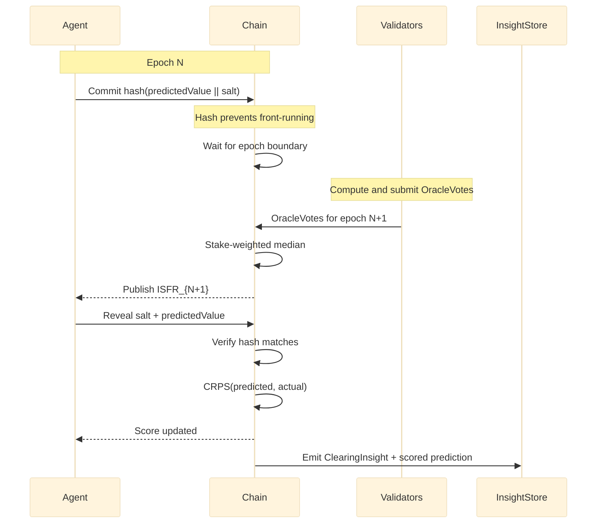

# 04 — Benchmark Business and Regulatory Path

> The single most important framing decision is that ISFR is a **regulated benchmark business**, not oracle infrastructure. This document specifies how to ship that business: the agent-attestation surface (prediction commit/reveal, CRPS scoring, ERC-8004 identity, x402 payments, Eigen-AVS cross-attestation, Inspect AI evaluation), the SOFR/VIX/S&P 500 lessons that anchor the strategy, the IBA / IOC / ARRC tripartite governance model, the four-tier revenue stack, the partnership target list, and the regulatory path through UK BMR Cat-6 with EU recognition and US engagement.

---

## 1. Why "Benchmark Business" and Not "Oracle"

The distinction is structural, not semantic.

**Oracle networks** push external data onto a chain. They are infrastructure: their value is data delivery, their economics are usage-based, their competitors are Chainlink, Pyth, API3, and similar.

**A benchmark** is computed by an independent administrator using a published, audited methodology, under regulatory oversight, with an independent oversight committee, and licensed to market participants on a recurring revenue basis. Its value is institutional credibility, its economics are licensing-based, and its comparators are CF Benchmarks, CoinDesk Indices, MSCI, S&P Dow Jones Indices, and Bloomberg BISL.

The LIBOR scandal — **$9 billion+ in fines, Tom Hayes's 14-year prison sentence** — taught the industry that submission-based rates from interested parties will be gamed. SOFR was designed to replace LIBOR by anchoring in the volume-weighted median of over $1 trillion in daily underlying repo transactions, collected under regulatory authority by the New York Federal Reserve with an OFR ex-officio observer. The benchmark business that emerged from that transition is the model ISFR copies.

ISFR must inherit three design principles directly from SOFR:

1. **Transaction-anchored, not opinion-anchored.** Every input is an observable on-chain event, not a panellist forecast.
2. **Volume-weighted median with a published filtering algorithm for outliers.** SOFR's bottom-20% specials filter is the template; ISFR's TVL-weighted median with confidence modulation and 3-sigma outlier exclusion is the equivalent.
3. **Fallback language hard-coded before scale.** ARRC spent five years on fallback language and still needed Congressional legislation for tough-legacy contracts. ISFR must publish ISDA-style fallback templates from day one.

---

## 2. Agent Participation Is a Design Property, Not an Add-On

Most benchmark rates are administered by a central authority that collects data from a known panel and publishes the result. That model created LIBOR's failure modes (panellist gaming, manipulation, conflict of interest) and constrains SOFR's update cadence (one publication per day).

ISFR inverts the pattern. The chain itself collects data via independent validator computation, and agents — registered, identified, paid, scored — provide a second redundant attestation surface. Each role plays a different part:

| Surface | Who | What they contribute | When |
|---------|-----|----------------------|------|
| Validator computation | Each Nunchi blockchain validator | Reads sources from its own RPC and submits an `OracleVote` | Every 25 blocks (~10 s) |
| Agent attestation | Registered Roko agents (ERC-8004 IDs) | Independent source reads with signed cost, freshness, and proof receipts | Per-fetch, x402-paid |
| Agent prediction | Any agent meeting reputation floor | Hash-committed prediction of the next ISFR value, scored via CRPS | Once per epoch (8,640/day) |

Validators provide the canonical computation; agents provide independent attestations that audit the validator computation, supply the InsightStore with knowledge, and produce the dense calibration record from which epistemic reputation compounds. Together they make manipulation prohibitively expensive: an attacker must compromise both the validator set AND the registered agent set simultaneously to corrupt the published rate without detection.

---

## 3. The Prediction Loop

Every 10 seconds, every participating agent has the opportunity to submit a prediction for the next ISFR value, and every prediction is scored once truth reveals.

### Round lifecycle



The cycle every ~10 seconds:

1. **Predict.** An agent registers a prediction for the next ISFR value: "ISFR will be X bps at epoch N+1."
2. **Commit.** The prediction is committed on-chain via hash commitment: `hash(predictedValue || salt)`. The hash prevents front-running.
3. **Observe.** At epoch N+1, validators publish the actual ISFR.
4. **Score.** The residual is computed using CRPS.
5. **Calibrate.** The residual feeds back into the agent's rolling 30-day exponential-moving-average score.

8,640 scoring opportunities per agent per day. Over a week: 60,480. Over a month: 259,200. The density is unique. SOFR has a single daily publication; IPOR updates ~96 times per day; standard prediction markets resolve weekly or monthly. ISFR creates a falsifiable target every 10 seconds.

---

## 4. CRPS — Why Honest Prediction Is the Only Rational Strategy

ISFR scores predictions with the Continuous Ranked Probability Score (CRPS), a strictly proper scoring rule for continuous outcomes first rigorously characterised by Gneiting and Raftery, *Journal of the American Statistical Association* 102(477), 2007. The CRPS framework has been validated for financial applications by Crisóstomo (2021) in the *Journal of Futures Markets* and applied to density forecasting by Loaiza-Maya, Martin, and Frazier (2021) in the *Journal of Applied Econometrics*.

### V1 — point predictions

Agents submit a single predicted value. CRPS reduces to mean absolute error:

```
CRPS(agent_i) = |predicted_i − actual|
```

Lower is better.

**Strict propriety** is a mathematical property, not an assumption: the unique optimal strategy is truthful reporting of one's best estimate. Hedging, sandbagging, and strategic misreporting all produce worse expected scores under strict propriety. This makes ISFR predictions incentive-compatible by construction.

### V2 — distributional predictions

Agents submit a full cumulative distribution function (CDF) over possible ISFR values:

```
CRPS(F, y) = ∫ [F(x) − 1(x ≥ y)]² dx
```

This rewards agents who accurately quantify their uncertainty — an agent who says "688 bps ± 5 bps at 90% confidence" earns a better score than "688 bps ± 50 bps" even if both nail the point estimate. Distributional predictions are also strictly proper.

### Worked example

An agent predicts ISFR = 610 bps at epoch N+1. Actual ISFR is 595 bps.

```
CRPS = |610 − 595| = 15 basis points
```

This residual enters the agent's rolling 30-day EMA. Over time, an agent that consistently predicts within 10 bps outranks one averaging 20 bps — even if the higher-error agent occasionally nails an exact prediction. The scoring rule rewards consistent calibration, not lucky guesses.

The unique optimal strategy under a strictly proper scoring rule is truth-telling, regardless of what other agents do. This is not a Nash equilibrium that might unravel under collusion; it is a property of the scoring function itself.

---

## 5. Epistemic Reputation Tiers

Each agent accumulates a rolling CRPS score per prediction domain:

```
epistemicScore(agent, "isfr") = EMA_30d(CRPS scores)
```

Agents are ranked into reputation tiers with concrete economic consequences:

| CRPS percentile | Tier | Economic benefit |
|-----------------|------|-------------------|
| Top 10% | **Oracle** | 2× InsightStore query quota; priority clearing; γ discount of 0.5× |
| 10–30% | **Calibrated** | 1.5× InsightStore query quota; γ discount of 0.75× |
| 30–70% | **Standard** | Base access, base γ |
| 70–100% | **Uncalibrated** | 0.5× InsightStore query quota; γ premium of 1.25× |

The γ discount is where reputation becomes economically material. In the cooperative clearing engine, γ (risk aversion) determines effective spread and margin requirements. Oracle-tier agents receive `γ_effective = γ_declared × 0.5` — half the friction cost of an Uncalibrated agent.

This creates a direct flywheel: accurate predictions → higher reputation → lower trading costs → more profitable strategies → more predictions → better accuracy.

### Properties that prevent gaming

- **Density.** Reputation is built from thousands of data points per day, not from peer review or staking. A bot cannot bootstrap reputation by purchasing a "verified" badge.
- **Objectivity.** CRPS is a mathematical residual, not a subjective judgement.
- **Non-transferability.** Reputation is tied to the agent's cumulative prediction history. Forking the agent's code does not transfer the score.
- **Time-locking.** A new agent starts at Standard regardless of underlying model quality. Earning Oracle tier requires sustained demonstrated accuracy.

---

## 6. Agent Attestation of Source Data

Validator computation is the canonical source-of-truth for ISFR. Agent attestation provides an *independent, auditable, paid, identified* second view that:

1. Cross-checks validator readings (an attestation that disagrees with the validator-computed value is itself a verifiable signal).
2. Supplies the InsightStore with structured observations beyond the index value (e.g. per-source freshness, scraper-level errors, cross-protocol divergences).
3. Provides regulators and IOSCO auditors with an audit trail at higher granularity than validator-vote records.

### The attestation pipeline

```
ERC-8004-registered Roko agent
   ↓ fetches source data via authenticated RPC
   ↓ logs the fetch trajectory in Inspect AI eval format
   ↓ signs the result and posts attestation on-chain
   ↓ pays for / is paid for the data via x402 micropayment
   ↓ result enters cross-attestation quorum
```

Each input data feed — protocol borrow rate, on-chain TVL, governance vote, off-chain proof-of-reserves — is fetched by a Roko agent registered under ERC-8004 with an immutable record of code hash, operator, and historical attestation accuracy.

This creates an audit trail that exceeds what any TradFi benchmark administrator can produce: not just "what data entered the calculation" but "*which specific agent fetched it, what code that agent was running, and what the agent's historical accuracy is*."

### Cross-attestation via Eigen-AVS

The non-naïve reputation primitive that improves on Sybil-vulnerable Eigentrust is **intersubjective validation** (Yuan et al., arXiv 2504.13443, April 2025), implemented via Eigen-AVS (Actively Validated Service): multiple independent agents attest to the same data point, and the attestations are cross-checked before the data enters the index calculation.

For ISFR-YBS specifically: *N* independent Roko agents each fetch the same on-chain borrow rate from Aave V3. Their attestations are compared. If fewer than a configurable quorum agree (typically 2/3 supermajority), the data point is flagged for manual review.

This satisfies IOSCO Principle 7 (data sufficiency) and IOSCO Principle 17 (audit trail) with cryptographic guarantees.

### Inspect AI evaluation format

Every agent fetch is logged in the Inspect AI evaluation format. Inspect AI (UK AI Safety Institute, open-sourced May 2024; 200+ pre-built evaluations; adopted by METR, Apollo Research, and the US Center for AI Safety and Innovation) is the de facto standard for government-facing AI evaluation.

Using the same framework for ISFR methodology validation creates natural alignment with FCA expectations for benchmark administration. The four standard eval categories applied to ISFR agent attestation:

| Eval | What it checks |
|------|----------------|
| Accuracy evals | Do agents correctly read on-chain data? |
| Manipulation-resistance evals | Can adversarial inputs cause agents to produce incorrect values? |
| Consistency evals | Do independent agent runs converge to the same result? |
| Latency evals | Do agents meet the relevant publication deadline (10 s for canonical V1; daily fixing at 16:00 UTC for ISFR-YBS)? |

---

## 7. ERC-8004 — Agent Identity

ERC-8004 (De Rossi/MetaMask, Crapis/Ethereum Foundation, Ellis/Google, Reppel/Coinbase; EIP draft August 2025) establishes trustless on-chain agent registries. By late 2025, ~106,996 agents were indexed across Base, BSC, and Ethereum.

ERC-8004 gives every Roko agent a verifiable on-chain identity: a registered agent that fetches Aave's `getReserveData()` has an immutable record of code hash, operator, and historical attestation accuracy (measured by the Eigen-AVS cross-attestation outcomes and CRPS prediction scores). Combined with x402 micropayment receipts, each fetch becomes an end-to-end provable artifact.

---

## 8. x402 — Payment for Attestation

x402 (Coinbase, May 2025) revives HTTP 402 to embed stablecoin/crypto micropayments in web requests. Adoption: +10,000% month-over-month growth in October 2025; >900K weekly settlements; x402 Foundation co-founded with Cloudflare; integrations with Visa, Google, Stellar, Solana; v2 released December 2025.

x402 V2 added wallet-based identity, reusable access sessions, automatic service discovery, subscriptions, prepaid access, usage-based billing, and multi-step workflow support. Every agent data fetch in the ISFR pipeline is an x402-paid transaction.

This creates two properties that regulators value:

1. **Economic audit trail.** Every data point has a verifiable cost. The methodology's operational expenses are transparent under IOSCO Principle 4 (control framework).
2. **Sybil-resistance.** Fabricating data requires paying for it. Large-scale data poisoning becomes economically irrational.

A note on positioning: ISFR should be x402-compatible but should not depend on x402 as the only payment standard. The benchmark business is payment-rail-agnostic; x402 is the most credible early-2026 standard but will likely be one of several over time.

---

## 9. The Receipt Envelope

The compact agent-work-receipt envelope is backwards-compatible with MCP and A2A while carrying the additional fields that make execution accountable:

```json
{
  "protocol": "nunchi.work.v0",
  "principal": "did:org:nunchi:...",
  "delegate": "agent:roko:...",
  "task": "isfr.fetch.aave.v3.usdc",
  "scope": ["read:onchain", "write:receipt"],
  "budget": {"currency": "USD", "max": "0.25"},
  "policy": {"destructive": false, "hitl_required": false},
  "inputs_hash": "sha256:...",
  "output_hash": "sha256:...",
  "evals": [{"name": "freshness", "status": "pass"}],
  "proof": {"type": "merkle_receipt", "hash": "..."},
  "settlement": {"type": "x402-compatible", "status": "pending"}
}
```

The required design choices baked into the envelope:

- **Principal/delegate distinction.** Who authorised vs who executed. Two distinct identity fields.
- **Scope.** Tool capabilities the delegate may exercise.
- **Budget.** Hard ceiling in dollars (or cost units), enforced at runtime.
- **Policy.** Destructive flag, HITL flag, retry rule.
- **Hashes.** Input and output content-addressed.
- **Eval status.** Inline gate outcomes (freshness, schema, accuracy proxy).
- **Proof.** Merkle receipt or equivalent verification artefact.
- **Settlement.** Payment rail and state, x402-compatible but rail-agnostic.

Every ISFR-source attestation produces a receipt of this form. The receipts are browser-verifiable: a visitor to the ISFR-YBS dashboard can verify any data point without trusting the dashboard.

---

## 10. Methodology Pipelines as Hash-Stable Programs

DSPy 3.0 + GEPA (Agrawal et al., arXiv 2507.19457, ICLR 2026 Oral) compiles natural-language methodology specifications into optimised LLM programs with JSON-serialisable, hash-stable representations. DSPy 3.0 has 28K+ GitHub stars as of mid-2026 — production-grade.

For ISFR, every methodology pipeline (raw data ingestion → volume-weighted median → outlier filtering → fixing) is expressed as a DSPy program. GEPA reflective evolution rewrites methodology prompts against a regulator-graded evaluation suite. Every optimisation step produces a new hash-stable artifact stored on-chain as an immutable methodology version with cryptographic provenance and a falsifiable backtested justification.

This directly addresses **IOSCO Principle 10** (periodic review of methodology) and **IOSCO Principle 12** (changes to methodology): the review is continuous, the changes are versioned, and the justification is machine-verifiable.

### Adversarial methodology strengthening

SWE-ABS (arXiv 2603.00520, 2026) is an adversarial benchmark-strengthening methodology. Berkeley RDI's 2026 research showed that 8 major agent benchmarks (SWE-bench Verified, Terminal-Bench, GAIA, OSWorld, WebArena) can be exploited to near-perfect scores via leaked references and prompt-injectable judges — evaluation frameworks themselves are attack surfaces.

ISFR applies SWE-ABS-style adversarial strengthening to the methodology itself. Red-team agents attempt to game the index calculation. Successful attacks become regression tests. The methodology evolves specifically to resist demonstrated attacks.

### Self-improvement within governance bounds (DGM)

The Darwin Gödel Machine (Zhang, Hu, Lu, Lange, Clune; arXiv 2505.22954, May 2025, revised March 2026) achieved gains on SWE-bench (20.0% → 50.0%) and Polyglot (14.2% → 30.7%) through archive-based self-improvement.

For ISFR, DGM-style self-improvement evolves the methodology computation itself **within IOC-approved bounds**. The archive is on-chain storage. Each agent variant is an NFT-bound lineage with a verifiable benchmark score. OMNI-EPIC (the DGM's open-ended quality-diversity component) generates synthetic stress-test scenarios — regulatory shocks, market dislocations, Kelp-style constituent failures — that the index must remain robust to.

Methodology evolution operates within a sandbox of IOC-specified invariants (inclusion thresholds, constituent caps, volume filters), and every proposed change goes through the full gate pipeline before entering the archive.

---

## 11. CRDT-Shared State and Audit-Trail Compliance

CodeCRDT (arXiv 2510.18893, October 2025) provides conflict-free replicated data types for LLM-agent coordination. CRDTs guarantee strong eventual consistency: multiple agents can modify the same data concurrently, without coordination, and all replicas converge to the same state.

For ISFR sub-index calculation, agent fleets compute portions of the index in parallel. CRDT merge semantics ensure deterministic convergence without a central coordinator. Each agent posts its partial result as an on-chain transaction, and the CRDT merge function produces the canonical sub-index value.

This matters for regulatory credibility: the IOSCO Principles require that methodology computation be reproducible and deterministic. A CRDT-based multi-agent calculation is both — any third party can replay the individual agent computations and verify that the merge produces the same result.

The MacNet collaborative scaling law (Qian et al., arXiv 2406.07155) tells the IOC how many agents to fund per sub-index: agent performance grows logistically with agent count, and small-world network topologies dominate. There is an optimal fleet size beyond which adding agents produces diminishing returns.

### IOSCO audit trail

The 5-year retention requirement under IOSCO Principle 17 is structurally trivial on-chain. Every agent attestation, every methodology version, every gate verdict, and every index calculation is an immutable on-chain transaction. The Inspect AI evaluation format provides the interpretation layer: each agent run is a structured evaluation record with inputs, outputs, scores, and explanations a KPMG or PwC auditor can review.

### Sleep-cycle consolidation

Roko implements a sleep-cycle consolidation pipeline. During waking operation, agents accumulate episodic memories. During sleep cycles (nightly or scheduled), these episodes distil into semantic knowledge entries.

| Tier | Half-life multiplier | Effective half-life (insight) |
|------|----------------------|-------------------------------|
| Transient | 0.1× | 3 days |
| Working | 0.5× | 15 days |
| Consolidated | 1.0× | 30 days |
| Persistent | 5.0× | 150 days |

Entries start at Transient and are promoted through independent confirmation. A demurrage model (balance decays at 0.005 per hour) ensures unused knowledge is garbage-collected.

Research foundations: SleepGate (arXiv 2603.14517), SCM (arXiv 2604.20943, achieving **90.9% memory-noise reduction**), Wake-Sleep Consolidated Learning (arXiv 2401.08623).

### GDPR compliance via subtractive HDC binding

Machine unlearning is not optional for a regulated benchmark administrator. GDPR's right to be forgotten and IOSCO Principle 13 (transition, covering cessation and delisting) both require the ability to remove specific data from system memory.

Hyperdimensional computing's algebraic structure makes this tractable. Because knowledge entries are encoded as bound hypervectors, removing an entry is a **subtractive binding operation**: unbind the entry's vector from the aggregate semantic memory. The result is a new aggregate that provably does not contain the removed entry's information (up to the HDC algebra's approximation guarantees). The index can then be recomputed deterministically from the cleaned memory.

---

## 12. Why This Combination Is Defensible

The agent-attestation surface combined with the validator-computation surface produces an audit trail that no traditional benchmark administrator can match:

| Property | Traditional benchmark | ISFR (validator + agent attestation) |
|----------|----------------------|--------------------------------------|
| Data origin | Panellist submission or operator collection | On-chain event read by validator + cross-attested by N registered agents |
| Conflict-of-interest control | Procedural (Chinese walls, separation of duties) | Cryptographic (admin entity has no positions; agent identities prove independence) |
| Manipulation cost | Reputational + regulatory risk | Plus economic cost (must pay x402 for fabricated data; must compromise both validator stake AND agent fleet) |
| Audit-trail granularity | Daily summary records | Per-fetch, per-attestation, per-prediction (8,640 events/day for ISFR alone) |
| Methodology-change evidence | Document version control | Hash-stable on-chain artifacts with backtested justification |
| Compliance forgetting | Manual procedure | Algebraic subtraction (HDC unbind) with automatic recomputation |

The system satisfies IOSCO Principles 4 (control framework), 7 (data sufficiency), 10 (periodic review), 12 (changes to methodology), 13 (transition), 14 (submitter code of conduct, where it applies to attesting agents), and 17 (audit trail) by construction rather than by procedure.

---

## 13. The $4.5B+ Index Industry

The economics of benchmark businesses are among the most attractive in financial services. Combined index-industry revenue across the three dominant firms exceeds **$4.5B annually**:

| Firm | Revenue | EBITDA margin |
|------|---------|---------------|
| **S&P Dow Jones Indices (SPDJI)** | ~$1.6B | 60%+ |
| **MSCI Index segment** | ~$1.6B | **76% adjusted EBITDA** |
| **FTSE Russell** | GBP 918M | — |

These margins exist because the toll-booth model scales with passive assets under management. State Street pays S&P DJI approximately 3 bps of AUM plus $600,000 per year in flat fees for SPY alone, generating roughly **$120M annually from a single ETF**. Index-licensing fees represent **31–36%** of all ETF expense ratios.

Bloomberg's $781M acquisition of Barclays Risk Analytics and Index Solutions in August 2016 demonstrates that credibility in this space is buyable but expensive. Over **500 ETFs and >$4.1T** in mutual fund and ETF assets benchmark to Bloomberg fixed-income indices today.

### The VIX vertical-integration lesson

The VIX teaches the venue-plus-benchmark vertical-integration moat. Cboe owns both the SPX/SPXW options market and the VIX index trademark. **VIX itself is uninvestable**; all monetisation happens at the futures, options, and ETP layer.

Cboe's 2003 redesign — making VIX a model-free static-replication recipe rather than a Black-Scholes output — is what made dealers able to hedge it. **ISFR's methodology must be similarly replicable: a market maker should be able to construct a hedging portfolio from on-chain primitives.**

The yield-perpetual instrument is the ISFR equivalent of the VIX-futures venue layer.

---

## 14. Corporate Structure — IBA as Template

ICE Benchmark Administration (IBA) is the corporate-structure template ISFR must adopt.

IBA is:

- Separately incorporated (England company number 08457573).
- Independently capitalised.
- Governed by a majority-independent board.
- Run with per-benchmark Oversight Committees.
- Audited via externally-reviewed Statement of Compliance by EY.

IBA administers the residual LIBOR (synthetic USD ceased September 30, 2024), LBMA Gold/Silver, and the ICE Swap Rate. Even though owned by ICE, IBA is structurally walled off.

### Recommended ISFR corporate structure

| Entity | Jurisdiction | Role |
|--------|--------------|------|
| **Nunchi ISFR Ltd.** | UK | FCA-authorised; holds methodology IP; Part 4A permission for administering a benchmark |
| **Nunchi Inc.** | Delaware C-Corp | Commercial sales, US distribution |
| **Independent chain-governance foundation** | Independent | Chain governance, structurally separate from the benchmark administrator |

This is the same pattern CF Benchmarks (UK Ltd, Kraken-owned, US ops) and Bloomberg BISL use. Independent capitalisation at the benchmark-entity level is required by BMR and is the structural prerequisite for institutional credibility. **No admin-entity employees may hold positions referencing the index.**

---

## 15. The Independent Oversight Committee

The ARRC tripartite structure is adopted verbatim: **administrator → sponsoring/endorsing body (the IOC) → official-sector ex-officio observers**.

### Proposed IOC composition

1. **Independent academic chair.** A senior researcher with cross-chain atomic-commit and "adversarial commerce" track record (Brown University is a natural source). Will Knottenbelt (Imperial College IC3RE) is the natural UK alternative given the FCA-jurisdiction strategy.
2. **Lending-protocol seat.** Aave Labs plus Sky, post the BGD Labs / ACI wind-down through July 2026.
3. **Stablecoin-issuer seat.** Guy Young (Ethena Labs) or Rune Christensen (Sky / MakerDAO).
4. **LST/staking seat.** Lido via cyber-Fund's Vasiliy Shapovalov.
5. **Institutional/custody seat.** Coinbase Institutional, Anchorage Digital (Diogo Monica), or Fireblocks (Michael Shaulov).
6. **Big-4 audit seat (non-voting).** KPMG (CF Benchmarks's current auditor) or PwC (Argus's 14-year auditor).
7. **Official-sector observers (non-voting, ARRC-style).** FCA Innovation Hub, CFTC LabCFTC, SEC FinHub, ESMA.
8. **End-user seat.** Pendle's TN (co-founder) as the largest natural index licensee.

### Governance discipline

All members serve under a Terms of Reference plus antitrust attestation modelled on the published ARRC TOR. Rotating seats with public charter, supermajority requirements for methodology changes, public consultation period of minimum 30 days for any material change.

The methodology committee — public rules, named members, change-control logs, advance-notice rebalance windows — is itself the moat asset, not merely a compliance cost.

---

## 16. The Two Launch Products

### Why narrow before broad

Consistent guidance from institutional advisers is "narrow before broad" — a focused index strategy over ambitious generalisation. Five candidate indices were scored across data availability, trust requirements, existing demand, competitive gap, and strategic fit (1–5 each, 25 maximum):

| Candidate | Data | Trust | Demand | Gap | Fit | Total |
|-----------|------|-------|--------|-----|-----|-------|
| **Stablecoin yield (YBS)** | 4 | 3 | **5** | **5** | 3 | **20** |
| DeFi lending rates | **5** | **5** | 3 | 2 | 4 | 19 |
| LST/LRT yield | 4 | 3 | 4 | 3 | **5** | 19 |
| Perp funding | **5** | 3 | 4 | 2 | 3 | 17 |
| AI compute pricing | 3 | 2 | 4 | 2 | **5** | 16 |

ISFR-YBS scores highest on the two dimensions that matter most: existing demand and competitive gap.

### ISFR-YBS — the narrow wedge

The yield-bearing-stablecoin sector projects **$50B+ in supply by year-end 2026**. **No regulated administrator publishes a benchmark for this segment.**

The methodology is a supply-weighted composite with risk-tiered sub-indices:

| Sub-index | Coverage |
|-----------|----------|
| **ISFR-YBS-T** | T-bill / RWA-backed: USDY, OUSG, USD0, USDtb, RWA portion of sUSDS |
| **ISFR-YBS-L** | Lending-based: aUSDC, aUSDT, syrupUSDC, sFRAX |
| **ISFR-YBS-D** | Delta-neutral / basis: sUSDe, Falcon, Resolv, Solv basis products |
| **ISFR-YBS-S** | Savings-rate composites: sUSDS, sDAI |

**Inclusion criteria.** ERC-4626 (or equivalent standard) compliance, >$50M sustained supply, public proof-of-reserves, redemption window <14 days, two reputable audits.

**Publication.** Daily fixing at 16:00 UTC plus rolling 7-day and 30-day series, with both gross and net-of-fees rates published.

**Constituent caps.** 40% per asset to prevent single-issuer dominance.

**Sanitisation.** Same-block flash-loan distortions filtered via EMA on debt levels.

**Delisting.** Published delisting protocol with 30-day notice.

The branding narrative is "the MMF benchmark for crypto dollars" — analogous to iMoneyNet or Crane Index in TradFi. Distribution is already happening at scale: Stripe/Privy plus sUSDS is pushing into 110M wallets and 2,000 apps as of March 2026.

### ISFR-Lend.USDC — the companion product

The second product is ISFR-Lend.USDC — a borrow-volume-weighted composite stablecoin lending rate across the major DeFi lending protocols:

- **Aave V3:** ~$20–26B TVL (post-Kelp event).
- **Morpho Blue:** ~$5.8–10B TVL.
- **SparkLend:** ~$2–3.4B TVL.
- **Compound V3:** ~$1.3B TVL.
- **Fluid:** ~$0.75–1B TVL.

Aggregate DeFi lending TVL is approximately **$75–80B** per Coinbase/Eco data. The data is trivially machine-readable: `getReserveData()` on Aave/Spark forks, `getBorrowRate(utilization)` on Compound Comet, Morpho Blue per-market reads.

The framing is deliberate: **ISFR-YBS is "the MMF benchmark for crypto dollars"**, **ISFR-Lend.USDC is "SOFR for DeFi credit."**

---

## 17. The Four-Tier Revenue Stack

The index industry's standard playbook applies directly. CME's Term SOFR program runs **7,000+ licenses to 1,800+ firms underpinning $2.6T in loans and $660B in derivative hedges**. MSCI's Index segment runs at ~76% adjusted EBITDA margin because the marginal cost of an additional licensee is near zero.

### Tier 1 — AUM/notional licensing (the toll booth)

- 0.5–3 bps on yield-bearing-stablecoin supply attributing ISFR-YBS as published reference.
- 0.5–2 bps on notional outstanding of fixed-rate lending products (Term Finance, Notional Exponent), Pendle PT/YT markets, and structured products.
- At Phase-3 target of $20B referenced notional, this generates **$10–60M per year** at index-industry margins.

### Tier 2 — Recurring data subscriptions

- Institutional API tier at $25,000–100,000 per year per protocol risk engine, fund, or trading desk.
- Terminal-redistribution licenses to Bloomberg, Refinitiv, Kaiko, Coin Metrics, and Amberdata.
- Tiered public API access.

### Tier 3 — Derivatives venue revenue share

For Nunchi-blockchain-native ISFR perpetuals and fixed-receivers, capture exchange-fee share following the Cboe / CME precedent.

### Tier 4 — Methodology / branding licensing

Trademark licensing to ETP issuers under BMR's "commercial and reasonable" (FRAND) standard.

### What to avoid

**Token-based admin revenue.** TREE's 94% drawdown (Treehouse) and FUSN's commercial pivot (IPOR → Fusion) demonstrate that token-funded benchmark businesses lose institutional credibility. Keep Nunchi ISFR Ltd. as a clean pure-software/data B2B entity. Any tokenisation should sit at the chain or agent layer, structurally separate from the administrator. The administrator entity should have **no token and no DAO governance**.

---

## 18. Competitive Landscape

The credible-crypto-benchmark space is smaller than it looks. Only five entities clear the IOSCO + BMR + audited-oversight bar: **CF Benchmarks** (FCA, KPMG-audited, Kraken-owned), **Bloomberg BISL**, **Compass Financial Technologies** (now MSCI-owned, AMF-regulated), **Vinter** (now Kaiko, ESMA-regulated), and **MarketVector** (BaFin-regulated). None publishes a yield-bearing stablecoin benchmark. None publishes a cross-venue DeFi lending rate index.

### IPOR / Fusion

IPOR rebranded to Fusion in May 2025 (IPOR → FUSN 1:1 token swap; Fusion DAO; vault-aggregator pivot), effectively conceding the benchmark category. TVL stands at approximately $14M unleveraged / $60M total value managed. Over $4B in cumulative IRS volume was reported in 2023, but no recent disclosure. The only funding round was a $5.55M seed in April 2022; no fresh capital since. Founder: Darren Camas. Status: possible acqui-hire target.

### Treehouse / TESR

Treehouse raised at a $400M valuation in April 2025 (~$20M total funding). TREE token hit $610M peak TVL at TGE but trades 94% below all-time high. Current TVL has fallen to $157M. Their DOR (DeFi Offered Rate) remains a single-feed product — TESR (ETH staking yield) only. The panellist set is small enough to invite LIBOR-collusion criticism. They use panellist-submitted forecasts with consensus methodology, a centralised "Operator" structure, and a Treehouse DAO post-TGE. FalconX FRA pilots are live with named institutional counterparties (Edge Capital, Mirana, Monarq), and there is CESR (CoinDesk Indices) integration. CEO: Brandon Goh.

### CF Benchmarks

CF Benchmarks is FCA-regulated (FRN 847100), KPMG ISAE 3000-audited, and owned by Kraken (acquired via Crypto Facilities in 2019, nine-figure deal). CEO: Sui Chung. They publish BIRC (Bitcoin Interest Rate Curve), KFRI (Kraken-only funding rate index), AUIRR (Aggregate Uncollateralized Interest Rate Risk), and a USDT IRC. Six of eleven spot BTC ETFs reference CF Benchmarks rates. Over $40B in referenced AUM. ~99% of regulated derivatives reference their rates.

The critical limitation: every CF rate is off-chain-administered, on-chain-distributed. None aggregates cross-venue DeFi borrow data the way SOFR aggregates tri-party repo. CF Benchmarks has no DeFi lending or YBS product.

### ISFR's positioning

| Dimension | IPOR (Fusion) | Treehouse (TESR) | CF Benchmarks | ISFR (proposed) |
|-----------|---------------|------------------|---------------|------------------|
| Product | Vault aggregator | Panel-consensus staking rate + tAssets + FRAs | FCA-regulated CeFi reference rates | DeFi-native YBS + Lending composites |
| Methodology | Block-over-block weighted average | Panellist-submitted forecasts | Multi-venue trade aggregation (off-chain) | Volume-weighted median, on-chain transactions |
| TVL/Notional | ~$14M / ~$60M TVM | $157M (was $610M peak) | >$40B referenced AUM | Target $5B Phase 2, $20B Phase 3 |
| Governance | Fusion DAO | Treehouse DAO + centralised Operator | FCA-regulated + KPMG + internal committee | Independent IOC, ARRC-style, FCA Cat-6 |
| Token | FUSN (1:1 from IPOR) | TREE (94% below ATH) | None (private, Kraken-owned) | None at admin layer |
| Regulation | None | None | UK FCA authorised | UK BMR Cat-6 (planned) |
| Coverage | USDT/USDC/DAI/stETH spot rates | ETH staking only | CeFi/derivatives-implied only | YBS (greenfield) + DeFi lending |

**The wedge is the intersection:** regulated administrator status (CF's strength, neither IPOR nor Treehouse has it) plus on-chain DeFi-native methodology (IPOR's original strength, CF does not have it) plus multi-asset coverage starting with the YBS gap (Treehouse only does staking). Each incumbent owns one corner; ISFR positions in the centre.

The branding discipline is critical: avoid the "DeFi LIBOR" tagline that Treehouse markets heavily but has only delivered for staking. ISFR's framing is "MMF benchmark for crypto dollars, then SOFR for DeFi credit" — concrete, narrow, and uncontested.

---

## 19. Phase-1 Partnership Targets

The ten highest-leverage Phase-1 outreach targets, prioritised by data quality, distribution leverage, and regulatory legitimacy:

**1. Aave Labs** — Stani Kulechov (CEO). Engage successor DAO service providers post-BGD/ACI wind-down via the Aave governance forum. Largest underlying borrow-rate source (~$45B TVL). Without Aave, no credible "DeFi LIBOR."

**2. CF Benchmarks (Kraken)** — Sui Chung (CEO). Either license CF infrastructure under FRN 847100 as a co-branded product or position as long-term acquirer (Crypto Facilities → Kraken precedent was nine-figures).

**3. Lido / cyber-Fund** — Vasiliy Shapovalov and Konstantin Lomashuk via cyber.fund. LST yield is the floor rate for ETH-denominated fixed income. cyber-Fund is also a $100M VC arm — possible investment partner.

**4. Pendle Finance** — TN (co-founder), via the Pendle governance forum. Largest yield-trading protocol ($1.96B TVL Q1 2026, $69.8B cumulative settled yield, ~90% category share). Boros funding-rate market and YBS PT/YT integrations make Pendle the most natural Phase-1 licensee.

**5. CME Group / CBA** — Giovanni Vicioso (Global Head Crypto Products), Sean Tully (Financial and OTC). Listing path via Part 40 self-certification. CBA is the FCA-authorised administrator running Term SOFR — direct precedent.

**6. ISDA Digital Assets Legal and Documentation Working Group** — Katherine Tew Darras (General Counsel). SPS Matrix inclusion gates institutional adoption.

**7. Imperial College IC3RE** — Will Knottenbelt. UK academic legitimacy. Three-year sponsored-research model proven (Blockchain.com partnership). Aligns with FCA-jurisdiction strategy.

**8. Treehouse Finance** — Brandon Goh (CEO). Operates competing DOR/TESR with FalconX FRA pilots and CESR integration. Partner-or-compete decision point — see §20.

**9. Hyperliquid Labs + Ethena Labs** — Jeff Yan (Hyperliquid), Guy Young (Ethena). Funding-rate component data. sUSDe is a YBS-D constituent and Hyperliquid is the dominant on-chain perp DEX with hourly funding settlements.

**10. Bloomberg Index Services (BISL)** — Index Relationship Manager team. Bloomberg Terminal distribution is the institutional default. BISL is itself UK BMR-regulated and routinely whitelabels compliant rates.

### Adjacent Phase-2 priorities

Morpho (Paul Frambot), Sky/MakerDAO (Rune Christensen), MarketVector (Martin Leinweber), Compass FT/MSCI (Pierre Kahn), Stanford CBR's Joe Grundfest for regulatory advisory, Coinbase Institutional (Greg Tusar), Anchorage Digital (Diogo Monica), Fireblocks (Michael Shaulov), and IPOR Labs (Darren Camas — possible acqui-hire).

---

## 20. The Treehouse Partner-or-Compete Decision

Treehouse Finance is the most strategically ambiguous entry on the partnership list. They are simultaneously the closest competitor and the most valuable potential partner. The analysis strongly favours partnership.

### The case for partnership

**Complementary coverage, not overlapping.** TESR covers ETH staking yield exclusively. ISFR-YBS covers yield-bearing stablecoins. ISFR-Lend covers DeFi lending rates. A joint methodology between ISFR (lending + YBS) and TESR (staking) is materially more credible than either alone.

**Treehouse is weakened and ISFR has leverage.** TREE token trades 94% below all-time high. TVL has fallen from $610M peak to $157M. The panellist set is small enough to invite LIBOR-collusion criticism. A partnership offer from a team pursuing FCA authorisation provides Treehouse with regulatory credibility they cannot achieve independently, while ISFR gains access to their FalconX FRA relationships and existing CESR integration.

**Head-to-head on staking is a losing fight.** Treehouse and CoinDesk Indices (CESR) already own the institutional staking-yield lane. Competing directly would require replicating 6–12 months of work with named institutional counterparties while diluting focus from the greenfield YBS opportunity.

### The risk of partnership

Treehouse could use the partnership to extract regulatory legitimacy while retaining commercial control of the staking lane. The mitigation is structural: **Nunchi ISFR Ltd. must hold the BMR administrator authorisation and methodology IP.** Treehouse participates as a data provider and IOC member, not as a co-administrator.

### Recommendation

Engage Brandon Goh (CEO) for a joint methodology discussion covering distinct lanes. Frame the conversation around what neither party can achieve alone. **TREE's 94% drawdown and declining TVL mean the partnership window is open now but may close if Treehouse either recovers or is acquired.**

---

## 21. The Regulatory Framework — UK BMR, not MiCA

ISFR is governed by the UK Benchmarks Regulation (BMR), not by MiCA.

| Regime | Coverage | Applicability to ISFR |
|--------|----------|------------------------|
| **UK BMR** | Reference benchmarks (interest rates, FX, commodities, equities) | Direct. ISFR is a benchmark used for derivative settlement. |
| **EU BMR** | Same | Recognised via third-country administrator route after UK authorisation. |
| **MiCA Title V** | CASP services (custody, exchange, advice) | Not applicable. **There is no MiCA reference-rate regime.** |

This is strategically positive: BMR is mature regulation with established case law. CASPs that consume ISFR rates absorb MiCA's compliance costs; CASP white papers must disclose reference-rate methodologies — a built-in distribution channel for any BMR-compliant rate.

### UK BMR Cat-6

**Category 6** is the authorisation category for significant interest-rate benchmarks. This is the same path CF Benchmarks took in 2019–2020.

The EU BMR's "non-significant" tier is being removed from scope **January 1, 2026** — interest-rate benchmarks are automatically Cat-6 "significant," which **narrows the competitive field rather than reducing ISFR's compliance burden**. The bar to entry rises; the gate is harder to walk through; but anyone who clears it has a meaningful structural moat.

---

## 22. The IOSCO 19 Principles

IOSCO compliance is a 19-principle, ~GBP 300,000/year line item, not a strategic question. All 19 principles must be addressed via published policies.

### The full list

1. Overall responsibility of the administrator.
2. Oversight of third parties.
3. Conflicts of interest management for the administrator.
4. Control framework for the administrator.
5. Internal oversight.
6. Benchmark design.
7. Data sufficiency.
8. Hierarchy of data inputs.
9. Transparency of benchmark determinations.
10. Periodic review of benchmark methodology.
11. Content of the methodology.
12. Changes to the methodology.
13. Transition (cessation, delisting).
14. Submitter code of conduct (where submission applies).
15. Internal controls over data collection.
16. Complaints procedures.
17. Audit.
18. Audit trail.
19. Cooperation with regulatory authorities.

The audit trail (Principle 17) must retain inputs, calculations, and decisions for **5 years** — an inherent on-chain advantage for ISFR. MSCI adopted IOSCO voluntarily in 2014, four years before EU BMR. ISFR should publish an Adherence Statement on day one, with KPMG (CF Benchmarks's current auditor) or PwC (Argus's 14-year auditor) providing ISAE 3000 assurance.

### Mapping IOSCO principles to ISFR design

The on-chain architecture satisfies most of the principles structurally rather than procedurally:

| Principle | Structural satisfaction |
|-----------|--------------------------|
| 1, 3, 5 (admin responsibility, conflicts, internal oversight) | Separately-incorporated UK Ltd. with majority-independent IOC; admin-entity employees barred from ISFR-referenced positions |
| 4 (control framework) | Cryptographic agent identity (ERC-8004), x402 economic audit trail per fetch, DSPy-hash-stable methodology pipelines |
| 6, 11 (benchmark design, methodology content) | Two-level dual-median methodology fully documented; on-chain validator computation makes design replayable |
| 7 (data sufficiency) | Multi-source TVL-weighted median per class with confidence modulation; cross-attestation via Eigen-AVS adds redundant agent attestation layer |
| 8 (hierarchy of inputs) | Source registry struct on-chain with class taxonomy and probationary confidence policy |
| 9 (transparency of determinations) | Every ISFR computation is on-chain; reproducible from chain state |
| 10 (periodic review of methodology) | Continuous via DSPy/GEPA reflective evolution against regulator-graded eval suite (Inspect AI); minimum annual full review |
| 12 (changes to methodology) | 7-day timelock on parameter changes; super-majority IOC vote for methodology changes; minimum 30-day public consultation |
| 13 (transition / cessation / delisting) | Published delisting protocol with 30-day notice; HDC subtractive binding for compliant data removal; recomputation deterministic |
| 14 (submitter code of conduct) | Applies to attesting agents — ERC-8004 identity binds attestation to operator; intersubjective validation surfaces deviations as on-chain events |
| 15 (internal data controls) | Validator computation is consensus state; agent attestations are signed and identity-bound |
| 16 (complaints) | Standard procedure; all material in IOC public minutes |
| 17 (audit / audit trail) | 5-year retention is structurally trivial on-chain; Inspect AI evaluation format provides interpretation layer |
| 19 (regulatory cooperation) | Ex-officio observers from FCA, CFTC, SEC, ESMA on the IOC (non-voting) |

This is the unique structural advantage of ISFR over a TradFi benchmark: many of the IOSCO requirements that are procedural compliance burdens for traditional administrators are structural properties of the on-chain pipeline.

---

## 23. The Authorisation Pipeline

### The FCA Cat-6 application

The procedural sequence:

1. **Pre-application engagement.** FCA Innovation Hub meeting; CFTC LabCFTC and SEC FinHub for parallel US dialogue.
2. **Part 4A application via FCA Connect.** Cat-6 administrator of significant interest-rate benchmark.
3. **FCA Q&A and 90-working-day determination clock.** CF Benchmarks took ~12 months end-to-end in 2019–2020 (statutory clock plus pre-decision iteration).
4. **Authorisation granted.** ISFR Ltd. receives FRN; can now hold itself out as a BMR-authorised administrator.

Realistic end-to-end timeline: **12–18 months** from incorporation to authorisation.

### EU recognition

Two routes for EU institutional users:

- **Recognition** as a third-country administrator. CME/CBA achieved ESMA recognition in April 2026, the precedent. The third-country transitional regime has been extended to **December 31, 2030**, providing a clear window.
- **Endorsement** by an EU-authorised administrator. Useful as a parallel path while recognition is processed.

### US engagement

US dialogue runs alongside UK authorisation:

- **CFTC LabCFTC.** Pre-application engagement on derivatives-listing implications.
- **SEC FinHub.** Disclosure obligations for ETFs/ETPs that may eventually reference ISFR.
- **CFTC Part 40 self-certification.** The path to listing ISFR-referenced futures on a DCM/MTF (CME's BRR is the playbook).

The US does not have a direct equivalent to UK BMR for benchmarks. ISFR's UK BMR Cat-6 status is the credibility anchor; US engagement is on derivatives and disclosure, not benchmark authorisation per se.

---

## 24. Phase-Gated Credibility Roadmap

### Phase 1 — Narrow Launch and FCA Pre-Application (Months 0–9)

**Months 0–3.** Incorporate UK Ltd. and Delaware C-Corp. Engage UK regulatory counsel (Linklaters, Clifford Chance, Travers Smith, or specialists Bovill / Complyport). Draft Terms of Reference plus Antitrust Guidelines using the ARRC template.

**Months 1–6.** Author full ISFR-YBS methodology rulebook. Recruit Independent Oversight Committee with a named independent chair.

**Months 3–9.** Draft IOSCO 19-Principle adherence statement. Big-4 readiness review (KPMG given CF Benchmarks precedent). Build complaints, whistleblowing, and breach systems. FCA pre-application meeting. Submit Part 4A application via FCA Connect for Cat-6 administrator of significant interest-rate benchmark.

**Phase 1 milestones.**

- 5 named data attestors signed (Aave, Sky, Ethena, Maple, Ondo at minimum).
- Public methodology paper.
- Weekly publication of ISFR-YBS.
- 1 institutional licensee signed (Pendle is the most natural target).
- $500M of yield-bearing stablecoin supply attributing to ISFR-YBS as a reference.

**External spend.** ~GBP 40–100K legal + GBP 100–200K methodology/governance + GBP 150–300K IOSCO preparation + ~GBP 10K FCA application fee.

### Phase 2 — Composite Expansion, First Audit, First Derivatives (Months 9–24)

FCA Q&A process and 90-working-day determination clock. Launch ISFR-Lend.USDC as the second composite. Convene a private DeFi Rates Committee with NY Fed-style ex-officio observers. First ISAE 3000 reasonable-assurance examination; publish on website. Apply for ISDA SPS Matrix inclusion.

**Phase 2 milestones.**

- FCA authorisation granted.
- KPMG or PwC ISAE 3000 published.
- 10+ data attestors signed.
- First Pendle PT integration referencing ISFR.
- First fixed-rate lending protocol (Term Finance, Notional Exponent) referencing ISFR for floating-leg settlement.
- $5B+ in product TVL referencing ISFR rates.

**External spend.** GBP 200K FCA advisor + GBP 150–300K first audit + GBP 100K convening + GBP 250K compliance staff (2 FTE).

### Phase 3 — Derivatives Market, EU Recognition, Licensing Revenue (Months 24–36)

ISFR-LRT and ISFR-Funding launched as Phase-3 composites once methodology has been battle-tested on YBS and Lend. File for ESMA recognition as third-country administrator. License rate to a DCM/MTF for futures listing via CFTC Part 40 self-certification. License to ETF/ETP issuers. Nunchi-blockchain-native ISFR perp futures and ISFR-referenced fixed-receivers go live.

**Phase 3 milestones.**

- ESMA recognition granted.
- 3+ derivatives venues listing ISFR-referenced products.
- $20B+ in referenced notional.
- First AUM-linked licensing revenue.
- ISDA SPS Matrix inclusion.

**Total pre-revenue regulatory spend Years 1–2: $1.5–3.0M.** Recurring compliance ~$500K to $1M per year thereafter.

---

## 25. Standards Bodies to Engage

Three industry/standards bodies should be engaged early. None is mandatory for FCA authorisation, but each meaningfully accelerates institutional adoption.

### ISDA — Settlement Price Source Matrix

**ISDA Digital Asset Derivatives Definitions Settlement Price Source Matrix** is the institutional whitelist for crypto rate sources. Application for inclusion is a Phase-1 priority. Without ISDA SPS Matrix inclusion, institutional counterparties cannot reference the rate in standard ISDA-documented derivatives without bespoke negotiation.

Contact: Katherine Tew Darras (General Counsel, ISDA).

### GBBC — Global Blockchain Business Council

PTDL (Project for Transparent and Distributed Ledger) Group; GSMI 7.0 (Global Standards Mapping Initiative); Risk Mitigation Framework cohorts already include Kaiko, Dfns, Droit, Blockmosaic, Metrika.

### ISO/TC 307

The ISO technical committee on blockchain and distributed-ledger technologies. Chair: Scott Farrell. Secretariat: Standards Australia. Engagement runs through the national mirror committee — ANSI in the US, BSI in the UK.

---

## 26. Risk Register

### Risk 1: Manipulation (LIBOR scandal lessons)

Five governance failures enabled $9B in LIBOR fines: submission-based not transaction-based, the BBA was an industry trade group not an independent regulated entity, traders sat next to submitters, no audit trail, and panel banks had direct economic incentive to lie.

**Mitigation.** ISFR is transaction-anchored from day one. Independent UK Ltd. with majority-independent IOC. Cryptographic audit trail with five-year retention. No admin-entity employees may hold positions referencing the index. Volume-weighted median is empirically more manipulation-resistant. Two-level aggregation provides independent Byzantine fault tolerance at each layer. An attacker must corrupt 50%+ of source weight AND 50%+ of validator stake simultaneously.

### Risk 2: Data quality

The Mango Markets exploit (October 2022, $117M, MNGO pumped 2,300% within minutes; Pyth and Switchboard reported the manipulated price faithfully) and the Kelp/rsETH bridge drain (April 18, 2026, $292M plus $236M cascaded bad debt) demonstrate that even technically-correct oracles fail when underlying constituents are manipulated.

**Mitigation.** Hard inclusion criteria. Per-asset constituent caps at 40%. Same-block flash-loan distortions filtered via EMA on debt levels. Published delisting protocol with 30-day notice. 3-sigma outlier exclusion.

### Risk 3: Governance capture

Treehouse's small panellist set is a structural risk. ARRC's 400+ firm participation is the antidote.

**Mitigation.** Rotating IOC seats with public charter. Supermajority requirements for methodology changes. Antitrust attestations modelled on ARRC's published TOR. Public consultation period of minimum 30 days. ARRC-style ex-officio regulator observers.

### Risk 4: Regulatory action

ISFR is BMR-regulated; the regulatory risk is failure to authorise, not adverse action against an authorised entity.

**Mitigation.** Pre-application engagement with FCA Innovation Hub (and CFTC LabCFTC, SEC FinHub for US dialogue). Over-budget on legal and compliance in Year 1. Engage Big-4 (KPMG precedent) early for ISAE 3000 readiness review before formal application. EU BMR's removal of the "non-significant" tier from January 2026 narrows the competitive field.

### Risk 5: Methodology contestation

Every published benchmark faces methodology critique; the question is whether the response process is institutionally credible.

**Mitigation.** Minimum annual methodology review per IOSCO Principle 10. Published change procedure with consultation per Principle 12. Named methodology committee with public minutes (redacted). Pre-announced rebalance and inclusion windows. Adversarial stress testing of the methodology itself.

---

## 27. Why the Path Is Realistic

Three precedents validate the timeline and cost:

1. **CF Benchmarks** went from incorporation to FCA FRN 847100 in roughly 18 months (2018–2019), then operated under FCA authorisation through to its acquisition by Kraken (nine-figure valuation).
2. **Compass Financial Technologies** achieved AMF (French regulator) authorisation as a benchmark administrator before being acquired by MSCI.
3. **CME / CBA** achieved ESMA third-country recognition for their SOFR products in April 2026.

Each precedent demonstrates that the path is walkable. None of them required regulatory innovation; all of them required disciplined execution against well-documented IOSCO and BMR requirements. ISFR's task is to walk the same path with on-chain operational architecture rather than to negotiate a new regulatory category.

The discipline is to never overclaim status. Until UK BMR Cat-6 authorisation is granted, ISFR-YBS publications must be labelled "research rate" or "methodology preview." Institutional buyers punish sloppy governance claims, and an authorisation application can be rejected if the applicant has been making unfounded claims about authorisation status pre-application.

---

## 28. Key Figures Referenced

| Financial reference | Figure |
|---------------------|--------|
| Global interest-rate-derivative notional | ~$668T |
| DeFi lending TVL | ~$49.5B |
| On-chain IR derivative TVL | <$100M |
| Index industry annual revenue (SPDJI + MSCI + FTSE Russell) | >$4.5B |
| MSCI Index segment EBITDA margin | ~76% |
| SPY licensing revenue to S&P DJI | ~$120M/year |
| US passive fund AUM | ~$19.1T (Oct 2025) |
| Bloomberg acquisition of Barclays index business | $781M (Aug 2016) |
| Yield-bearing stablecoin addressable supply | $50B+ (projected YE 2026) |
| Phase-3 referenced notional target | $20B+ |
| Phase-3 revenue range (0.5–3 bps on $20B) | $10–60M / year |
| Year 1–2 regulatory spend | $1.5–3.0M |
| Recurring compliance (post-authorisation) | $500K–1M / year |
| FCA application fee | ~GBP 10,000 |
| IOSCO compliance annual cost | ~GBP 300,000 / year |
| ISAE 3000 assurance annual cost | ~GBP 150–300K / year |
| Kelp/rsETH exploit (April 2026) | $292M drained + $236M cascaded |
| Mango Markets exploit (October 2022) | $117M |
| LIBOR scandal total fines | $9B+ |
| CME Term SOFR licenses | 7,000+ licenses, 1,800+ firms |
| CME Term SOFR loan notional | $2.6T |

---

## 29. References

- **UK Benchmarks Regulation (BMR)** — UK statutory regime governing financial benchmarks.
- **EU Benchmarks Regulation** — EU regime; transitional regime for third-country administrators extended to December 31, 2030.
- **IOSCO "Principles for Financial Benchmarks"** — FR07/13, July 2013.
- **ISDA Digital Asset Derivatives Definitions Settlement Price Source Matrix** — institutional whitelist for derivative-referenced rates.
- **ISO/TC 307** — international standards committee on blockchain and DLT.
- **GBBC PTDL Group** — industry standards-setting body for distributed-ledger benchmarks.
- **Federal Reserve Bank of New York / ARRC** — SOFR transition documentation; tripartite governance template.
- **FCA Innovation Hub** — UK regulator's pre-application engagement channel.
- **CFTC LabCFTC, SEC FinHub** — US regulator engagement channels.
- **Inspect AI** — UK AI Safety Institute open-source evaluation framework, used for methodology-validation evals.
- **CF Benchmarks** — public Adherence Statement, ISAE 3000 publication, FRN 847100 — primary precedent.
- Agrawal et al. "GEPA: Generalized Evolutionary Prompt Optimization." arXiv:2507.19457, July 2025. ICLR 2026 Oral.
- Crisóstomo, R. *Journal of Futures Markets* 41(11), 2021.
- De Rossi (MetaMask), Crapis (Ethereum Foundation), Ellis (Google), Reppel (Coinbase). ERC-8004 Agent Identity. EIP draft August 2025.
- Gneiting, T. & Raftery, A.E. "Strictly Proper Scoring Rules, Prediction, and Estimation." *JASA* 102(477), 2007.
- Loaiza-Maya, R., Martin, G.M. & Frazier, D.T. "Focused Bayesian Prediction." *Journal of Applied Econometrics* 36(5), 2021.
- Qian et al. "MacNet: Collaborative Scaling Laws for Multi-Agent Systems." arXiv:2406.07155, June 2024 (rev. March 2025).
- UK AI Safety Institute. Inspect AI evaluation framework. Open-sourced May 2024.
- Yuan et al. "Intersubjective Validation." arXiv:2504.13443, April 2025.
- Zhang, Hu, Lu, Lange, Clune. "Darwin Gödel Machine." arXiv:2505.22954, May 2025 (rev. March 2026).
- arXiv 2510.18893 (CodeCRDT, October 2025).
- arXiv 2603.14517 (SleepGate, March 2026).
- arXiv 2604.20943 (SCM, April 2026).
- arXiv 2401.08623 (Wake-Sleep Consolidated Learning, January 2024).
- arXiv 2603.00520 (SWE-ABS, 2026).
- Coinbase x402 documentation.
