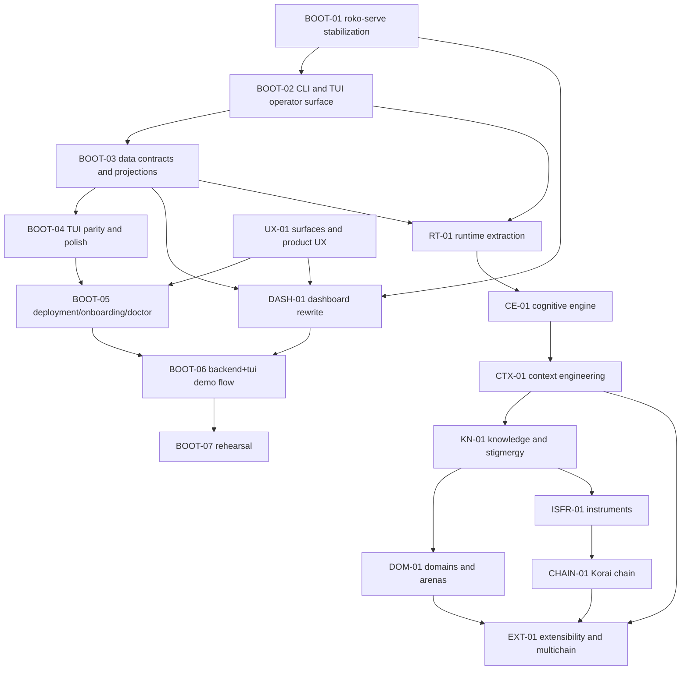
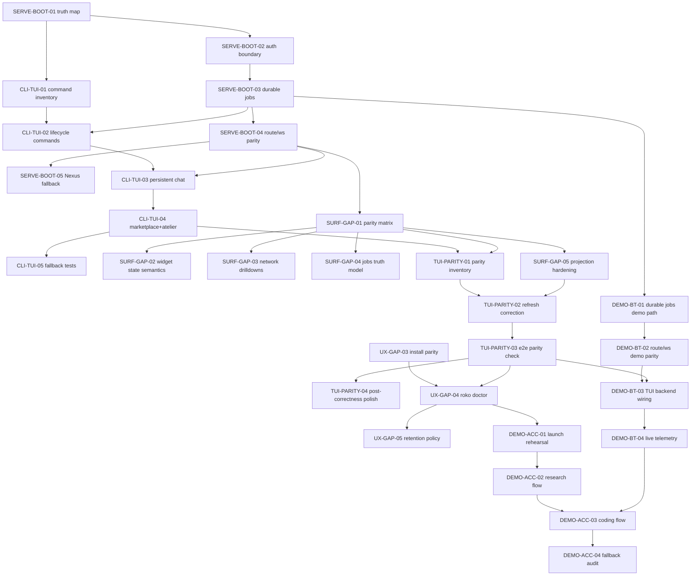

---

# SOURCE: /Users/will/dev/nunchi/roko/roko/tmp/04-21-26/PRDs/impl/STATUS.md

# Implementation Status — Honest Audit (2026-04-22)

**None of the impl checklists are fully complete end-to-end.**
Most are PARTIAL at best. The codebase has a "built but not wired" pattern
where code exists but data doesn't flow to it.

## Legend
- DONE: Fully works, tested, verified end-to-end
- PARTIAL: Some items wired, some stubbed or broken
- NOT STARTED: Code may exist but nothing is connected or functional

---

## 01-runtime/ — Runtime Extraction
| File | Status | Notes |
|------|--------|-------|
| 01-foundation-and-extraction | NOT STARTED | orchestrate.rs is still 20K LOC monolith. No AgentRuntime type extracted. |
| 02-migration-verification | NOT STARTED | Blocked by 01 |
| 03-heartbeat-timescales-ops | PARTIAL | ServerEvent::Heartbeat exists (10s interval), but no timescales, no inference gateway, no supervision hardening |

## 02-cognitive-engine/ — Prediction Gating
| File | Status | Notes |
|------|--------|-------|
| 01-prediction-gating-triage | NOT STARTED | T0/T1/T2 gating not in dispatch loop. Everything goes to LLM. |
| 02-native-harness-costs | NOT STARTED | No native harness for T0 operations |
| 03-thresholds-cascade-router | PARTIAL | CascadeRouter persists to disk, adaptive thresholds EMA works, but feedback loop from gate results to routing decisions is incomplete |

## 03-context-engineering/ — Context Assembly
| File | Status | Notes |
|------|--------|-------|
| 01-workspace-bidders-policy | PARTIAL | ContextAssembler wired into orchestrate.rs, VCG auction code exists, 3 bidder types (Neuro/Task/Research) exist. Not all bidders produce real bids. |
| 02-caching-chain-worldgraph | NOT STARTED | No WorldGraph, no chain context, no context caching |
| 03-context-mesh-measurement | NOT STARTED | No context mesh, no section-effect measurement |

## 04-knowledge-and-stigmergy/ — Knowledge Pipeline
| File | Status | Notes |
|------|--------|-------|
| 01-knowledge-pipeline-hdc | PARTIAL | HDC vectors computed, neuro store built, fingerprints per-episode. But pipeline not connected end-to-end for retrieval at dispatch time. |
| 02-publishing-dreams-chain | NOT STARTED | roko-dreams crate exists (scaffold only). No chain publishing. |
| 03-insightstore-resonance | NOT STARTED | No live InsightStore queries or publishing |

## 05-domains-and-arenas/ — Domain Specialization
| File | Status | Notes |
|------|--------|-------|
| 01-domain-runtime-arenas | NOT STARTED | Domain profiles exist in config schema only. No arena framework. |
| 02-domain-extensions-hf | NOT STARTED | No HuggingFace integration, no work markets |
| 03-profile-catalog-scaling | NOT STARTED | No domain catalog |

## 06-isfr-and-instruments/ — Financial Primitives
| File | Status | Notes |
|------|--------|-------|
| 01-oracle-prediction-perps | NOT STARTED | ISFR types in roko-chain but no live oracle |
| 02-clearing-runtime | NOT STARTED | No clearing runtime |
| 03-publication-economics | NOT STARTED | No solver economics |

## 07-korai-chain/ — Blockchain
| File | Status | Notes |
|------|--------|-------|
| 01-consensus-execution | NOT STARTED | Chain crate has types/client/wallet, no consensus engine |
| 02-insightstore-tokenomics | NOT STARTED | No on-chain InsightStore |
| 03-identity-registries | NOT STARTED | No identity registries |

## 08-surfaces-and-ux/ — CLI, Chat, TUI
| File | Status | Notes |
|------|--------|-------|
| 01-cli-chat-tui | **PARTIAL (80%)** | CLI 36+ commands work. `roko chat` works with reconnect. TUI F1-F9 work with push updates. Agent lifecycle commands wired. F8 Marketplace and F9 Atelier tabs restored. Grouped help added. Error hints added. Env var overrides (ROKO_MODEL/EFFORT/ROLE/QUIET/LOG_FORMAT). Confirmation prompts for destructive ops. |
| 02-web-mcp-packaging | NOT STARTED | roko-mcp-code built but not called from runtime. No web packaging. |
| 03-product-surfaces-deploy | PARTIAL | `roko doctor` has 10 checks. Deployment parity check exists. BUT: AI Studio, Agent Studio, OpenClaw are design docs only. No onboarding flows. |

## 09-extensibility-and-multichain/ — Package System
| File | Status | Notes |
|------|--------|-------|
| 01-package-runtime-loading | NOT STARTED | No package system |
| 02-ingestion-worldgraph | NOT STARTED | No multi-chain ingestion |
| 03-finetuning-integration | NOT STARTED | No fine-tuning export |
| 04-attention-publishing | NOT STARTED | No attention allocation |

## 10-dashboard-and-tui/ — Dashboard + TUI Stabilization
| File | Status | Notes |
|------|--------|-------|
| 01-stabilization-nexus | **PARTIAL (70%)** | Jobs backend with state machine works. Auth consolidated (Bearer + API key). WS topic-based filtering works. Relay types and route wired. Server persistence improved. Jobs auto-reload on startup. BUT: Nexus relay not fully functional beyond types+route. |
| 02-dashboard-rewrite | NOT STARTED | This is the nunchi-dashboard React repo. Not touched. |
| 03-tui-polish | PARTIAL (60%) | F1-F9 render, push-based updates work, connection indicator exists. F8/F9 wired (Marketplace + Atelier tabs, views, input handlers, header + status bar hints). No cross-surface parity verification. No command palette. |
| 04-page-catalog-widgets | PARTIAL (30%) | ParityMatrix type exists, WidgetState enum exists, ProjectionEnvelope exists. BUT: not integrated into actual views. Projection catalog route exists. |

## 11-demo-sprint/ — Demo Preparation
| File | Status | Notes |
|------|--------|-------|
| 01-dashboard-stream | NOT STARTED | Dashboard rewrite not done |
| 02-backend-tui-stream | **PARTIAL (60%)** | Jobs backend works, heartbeat publisher works, retention policy exists. TUI marketplace/atelier views restored. Job routes functional. Incremental JSONL tailer infrastructure for TUI tick optimization. |
| 03-rehearsal | NOT STARTED | Never rehearsed end-to-end |

---

## What Actually Works Right Now

The **core self-hosting loop** works:
```bash
roko init                    # creates workspace
roko prd idea "..."          # captures idea
roko prd draft new "..."     # creates PRD
roko prd plan <slug>         # generates plan + tasks.toml
roko plan run plans/         # executes (agents + gates + persist)
roko plan run --approval     # with TUI (F1-F9, all tabs wired)
roko dashboard               # standalone TUI (file polling)
roko serve                   # HTTP API (85+ routes)
roko status                  # health check
roko doctor                  # 10 diagnostics
roko chat --agent <id>       # chat with reconnect
```

## What's Broken or Rough

1. **TUI in --approval mode** — was crashing, fixed in this session (verdicts.rs runtime, ws_client.rs fallback, PanicHookRestoreGuard). May still have edge cases.
2. ~~**F8/F9 tabs reverted**~~ — FIXED: Marketplace (F8) and Atelier (F9) fully wired in Tab enum, input dispatch, views, header bar, status bar
3. **Agent lifecycle** — `agent list/start/stop/status` were added then reverted by linter
4. **Nested .roko** — if you run from inside `.roko/`, it creates `.roko/.roko/` and TUI reads wrong one
5. **Plan discovery** — picks up INDEX.md as a plan when it shouldn't
6. **Config v1 warnings** — spams "roko.toml uses config version 1" on every operation

## Priority to Make UX Not Suck

1. ~~Fix F8/F9 tabs~~ — DONE (Marketplace + Atelier fully wired)
2. Re-add agent list/start/stop/status commands
3. Stop INDEX.md from being treated as a plan
4. Suppress config v1 warning spam
5. Add progress indicators for plan execution
6. Make --approval mode rock-solid


---

# SOURCE: /Users/will/dev/nunchi/roko/roko/tmp/04-21-26/PRDs/impl/00-INDEX.md

# Implementation Plan Rewrite Index

This directory is the execution-oriented rewrite of the large `IMPL-*.md` files in the parent folder.

The goal of this rewrite is:

- break each large plan into smaller files that can be assigned independently;
- make each file runnable by a fresh agent with no hidden context;
- anchor every checklist in the current repo state, not only the target architecture;
- separate current code from target crates and future-facing design;
- end every plan with verification and acceptance criteria.

## How to use this directory

1. Start with the folder that matches the original `IMPL-*` document.
2. Read `00-overview.md` first.
3. Execute the checklist files in order unless a file explicitly says it can run in parallel.
4. Treat all file paths as relative to one of these workspace roots:
   - Roko repo: `/Users/will/dev/nunchi/roko/roko`
   - Dashboard repo: `/Users/will/dev/nunchi/nunchi-dashboard`

## Repo reality captured in these rewrites

- The shipping self-hosting path today is centered on `crates/roko-cli/src/orchestrate.rs`, `roko-orchestrator`, `roko-agent`, `roko-compose`, `roko-gate`, `roko-fs`, `roko-learn`, and `roko-serve`.
- `roko-neuro`, `roko-daimon`, `roko-chain`, `roko-index`, and `roko-conductor` exist and are at least partially built.
- `roko-dreams` exists but is still scaffold-heavy.
- Several target crates named in the original plans do not exist yet. These rewrites call that out explicitly before asking an agent to create them.
- The dashboard work spans two repos. Any web-surface or demo item that mentions `nunchi-dashboard` requires edits outside the Roko repo.

## File map

- `01-runtime/` — rewrite of `IMPL-01-RUNTIME.md`
- `02-cognitive-engine/` — rewrite of `IMPL-02-COGNITIVE-ENGINE.md`
- `03-context-engineering/` — rewrite of `IMPL-03-CONTEXT.md`
- `04-knowledge-and-stigmergy/` — rewrite of `IMPL-04-KNOWLEDGE.md`
- `05-domains-and-arenas/` — rewrite of `IMPL-05-DOMAINS.md`
- `06-isfr-and-instruments/` — rewrite of `IMPL-06-ISFR.md`
- `07-korai-chain/` — rewrite of `IMPL-07-CHAIN.md`
- `08-surfaces-and-ux/` — rewrite of `IMPL-08-SURFACES.md`
- `09-extensibility-and-multichain/` — rewrite of `IMPL-09-EXTENSIBILITY-AND-MULTICHAIN.md`
- `10-dashboard-and-tui/` — rewrite of `IMPL-10-DASHBOARD-AND-TUI.md`
- `11-demo-sprint/` — rewrite of `IMPL-10-DEMO.md`

## Recommended execution strategy

If the goal is to get Roko itself, the CLI, the TUI, and the operator UX to a point where they can run the rest of the implementation work from inside Roko, do not start with deep chain or knowledge work.

Start with the self-hosting bootstrap path:

1. stabilize `roko-serve`, projections, jobs, and streaming;
2. make the CLI and TUI reliable operator surfaces;
3. harden the dashboard/TUI data contracts;
4. improve onboarding, `roko doctor`, deployment parity, and observability;
5. rehearse one real end-to-end coding workflow in Roko itself;
6. only then push deeper into runtime extraction, cognitive routing, context, knowledge, and chain work.

That path is encoded below as the `BOOT-*` critical path.

## DAG summary

Use this DAG at the file-task-pack level. Each node is a file that contains one or more concrete tasks.



## File-node registry

This is the authoritative file-linked DAG registry. Read the linked file to run that node.

| Node | Purpose | File | Depends on | Unlocks |
|---|---|---|---|---|
| `BOOT-01` | Stabilize `roko-serve`, jobs, auth, websocket/event truth, Nexus boundary | [10-dashboard-and-tui/01-stabilization-and-nexus-checklist.md](10-dashboard-and-tui/01-stabilization-and-nexus-checklist.md) | None | `BOOT-02`, `BOOT-03`, dashboard work |
| `BOOT-02` | Make CLI/chat/TUI a dependable operator surface | [08-surfaces-and-ux/01-cli-chat-and-tui-checklist.md](08-surfaces-and-ux/01-cli-chat-and-tui-checklist.md) | `BOOT-01` | `BOOT-04`, runtime migration work |
| `BOOT-03` | Define shared page/data contracts, projection rules, and backend truth for surfaces | [10-dashboard-and-tui/04-page-catalog-widgets-data-contracts-and-network-intelligence.md](10-dashboard-and-tui/04-page-catalog-widgets-data-contracts-and-network-intelligence.md) | `BOOT-01` | `BOOT-04`, dashboard rewrite, runtime migration |
| `BOOT-04` | Finish TUI parity, refresh behavior, and cross-surface correctness | [10-dashboard-and-tui/03-tui-polish-and-cross-surface-verification.md](10-dashboard-and-tui/03-tui-polish-and-cross-surface-verification.md) | `BOOT-02`, `BOOT-03` | `BOOT-06` |
| `BOOT-05` | Harden deployment, onboarding, `roko doctor`, and observability | [08-surfaces-and-ux/03-product-surfaces-deployment-onboarding-security-and-observability.md](08-surfaces-and-ux/03-product-surfaces-deployment-onboarding-security-and-observability.md) | `BOOT-04` | `BOOT-06`, broader product rollout |
| `BOOT-06` | Prove a real backend + TUI coding workflow in Roko | [11-demo-sprint/02-backend-and-tui-stream-checklist.md](11-demo-sprint/02-backend-and-tui-stream-checklist.md) | `BOOT-04`, `BOOT-05` | `BOOT-07`, self-hosting confidence |
| `BOOT-07` | Rehearse and verify the end-to-end operator flow | [11-demo-sprint/03-rehearsal-and-demo-acceptance.md](11-demo-sprint/03-rehearsal-and-demo-acceptance.md) | `BOOT-06` | Safe transition to deeper implementation work |
| `DASH-01` | Dashboard rewrite and backend-aligned page work in `nunchi-dashboard` | [10-dashboard-and-tui/02-dashboard-rewrite-checklist.md](10-dashboard-and-tui/02-dashboard-rewrite-checklist.md) | `BOOT-01`, `BOOT-03` | better operator UX, demo flows |
| `UX-01` | Product-surface backlog for AI Studio / Agent Studio / OpenClaw / deployment | [08-surfaces-and-ux/03-product-surfaces-deployment-onboarding-security-and-observability.md](08-surfaces-and-ux/03-product-surfaces-deployment-onboarding-security-and-observability.md) | None | `BOOT-05`, `DASH-01` |
| `RT-01` | Extract runtime, lifecycle, extension chain, and migration path | [01-runtime/01-foundation-and-extraction-checklist.md](01-runtime/01-foundation-and-extraction-checklist.md) | `BOOT-02`, `BOOT-03` | `CE-01`, runtime CLI commands |
| `RT-02` | Runtime migration and cutover path | [01-runtime/02-migration-verification-and-cutover.md](01-runtime/02-migration-verification-and-cutover.md) | `RT-01` | stable runtime-backed CLI |
| `RT-03` | Heartbeat timescales, gateway, ops, and supervision hardening | [01-runtime/03-heartbeat-timescales-inference-gateway-and-ops.md](01-runtime/03-heartbeat-timescales-inference-gateway-and-ops.md) | `RT-01` | `CE-01`, runtime operations |
| `CE-01` | Prediction error, gating, habituation, somatic routing, triage | [02-cognitive-engine/01-prediction-gating-and-triage-checklist.md](02-cognitive-engine/01-prediction-gating-and-triage-checklist.md) | `RT-01` | `CTX-01`, `RT-03` consumers |
| `CE-02` | Native harness, per-tick cost tracking, verification | [02-cognitive-engine/02-native-harness-costs-and-verification.md](02-cognitive-engine/02-native-harness-costs-and-verification.md) | `CE-01` | runtime self-hosting quality |
| `CE-03` | Threshold/routing/measurement hardening | [02-cognitive-engine/03-thresholds-cascade-router-and-measurement.md](02-cognitive-engine/03-thresholds-cascade-router-and-measurement.md) | `CE-01` | stable tiering and router policy |
| `CTX-01` | CognitiveWorkspace, bidders, policy | [03-context-engineering/01-workspace-bidders-and-policy-checklist.md](03-context-engineering/01-workspace-bidders-and-policy-checklist.md) | `CE-01` | `KN-01`, `EXT-01` |
| `CTX-02` | Caching, chain context, WorldGraph boundary | [03-context-engineering/02-caching-chain-and-worldgraph-checklist.md](03-context-engineering/02-caching-chain-and-worldgraph-checklist.md) | `CTX-01` | `EXT-01`, network context features |
| `CTX-03` | Mesh, measurement, persistence, explainability | [03-context-engineering/03-context-mesh-measurement-and-persistence.md](03-context-engineering/03-context-mesh-measurement-and-persistence.md) | `CTX-01` | cross-agent context learning |
| `KN-01` | Local knowledge pipeline, HDC, fingerprints | [04-knowledge-and-stigmergy/01-knowledge-pipeline-and-hdc-checklist.md](04-knowledge-and-stigmergy/01-knowledge-pipeline-and-hdc-checklist.md) | `CTX-01` | `DOM-01`, `ISFR-01` |
| `KN-02` | Publishing, dreams, chain query/publish path | [04-knowledge-and-stigmergy/02-publishing-dreams-and-chain-checklist.md](04-knowledge-and-stigmergy/02-publishing-dreams-and-chain-checklist.md) | `KN-01` | shared knowledge path |
| `KN-03` | InsightStore, resonance, lifecycle, C-factor measurement | [04-knowledge-and-stigmergy/03-insightstore-resonance-lifecycle-and-measurement.md](04-knowledge-and-stigmergy/03-insightstore-resonance-lifecycle-and-measurement.md) | `KN-01` | shared knowledge scaling |
| `DOM-01` | Domain profiles and arena framework | [05-domains-and-arenas/01-domain-runtime-and-arenas-checklist.md](05-domains-and-arenas/01-domain-runtime-and-arenas-checklist.md) | `KN-01` | custom domains, work markets |
| `DOM-02` | Domain-specific extensions, HF, market hooks | [05-domains-and-arenas/02-domain-extensions-hf-and-market-checklist.md](05-domains-and-arenas/02-domain-extensions-hf-and-market-checklist.md) | `DOM-01` | domain specialization |
| `DOM-03` | Profile catalog, custom domains, scaling | [05-domains-and-arenas/03-profile-catalog-custom-domains-and-scaling.md](05-domains-and-arenas/03-profile-catalog-custom-domains-and-scaling.md) | `DOM-01` | broader ecosystem |
| `ISFR-01` | Sources, aggregation, scoring, perps | [06-isfr-and-instruments/01-oracle-prediction-and-perps-checklist.md](06-isfr-and-instruments/01-oracle-prediction-and-perps-checklist.md) | `KN-01` | `CHAIN-01` |
| `ISFR-02` | Clearing and runtime integration | [06-isfr-and-instruments/02-clearing-runtime-and-verification-checklist.md](06-isfr-and-instruments/02-clearing-runtime-and-verification-checklist.md) | `ISFR-01` | market runtime hooks |
| `ISFR-03` | Publication states, solver economics, credibility path | [06-isfr-and-instruments/03-publication-states-economics-and-credibility.md](06-isfr-and-instruments/03-publication-states-economics-and-credibility.md) | `ISFR-01` | production benchmark rollout |
| `CHAIN-01` | Consensus/execution/precompile surfaces | [07-korai-chain/01-consensus-execution-and-precompiles-checklist.md](07-korai-chain/01-consensus-execution-and-precompiles-checklist.md) | `ISFR-01` | `EXT-01` |
| `CHAIN-02` | InsightStore/tokenomics/HDC chain semantics | [07-korai-chain/02-insightstore-tokenomics-and-hdc-checklist.md](07-korai-chain/02-insightstore-tokenomics-and-hdc-checklist.md) | `CHAIN-01` | chain-backed knowledge/economy |
| `CHAIN-03` | Identity/reputation/validation/proof-log registries | [07-korai-chain/03-identity-registries-proof-log-and-rollout.md](07-korai-chain/03-identity-registries-proof-log-and-rollout.md) | `CHAIN-01` | operator-facing network identity surfaces |
| `EXT-01` | Package system and runtime loading | [09-extensibility-and-multichain/01-package-and-runtime-loading-checklist.md](09-extensibility-and-multichain/01-package-and-runtime-loading-checklist.md) | `DOM-01` | multichain/plugin ecosystem |
| `EXT-02` | Multi-chain ingestion, discovery, WorldGraph | [09-extensibility-and-multichain/02-ingestion-discovery-and-worldgraph-checklist.md](09-extensibility-and-multichain/02-ingestion-discovery-and-worldgraph-checklist.md) | `EXT-01`, `CHAIN-01`, `CTX-02` | dynamic worldview |
| `EXT-03` | Fine-tuning export/integration | [09-extensibility-and-multichain/03-finetuning-integration-and-acceptance.md](09-extensibility-and-multichain/03-finetuning-integration-and-acceptance.md) | `EXT-01`, `DOM-01` | model-evolution loop |
| `EXT-04` | Attention allocation, publishing UX, ecosystem completion | [09-extensibility-and-multichain/04-attention-allocation-publishing-and-ecosystem-completion.md](09-extensibility-and-multichain/04-attention-allocation-publishing-and-ecosystem-completion.md) | `EXT-01`, `EXT-02` | mature package ecosystem |
| `DEMO-01` | Dashboard stream demo work | [11-demo-sprint/01-dashboard-stream-checklist.md](11-demo-sprint/01-dashboard-stream-checklist.md) | `DASH-01`, `BOOT-03` | demo-ready web surface |

## Bootstrap path for self-hosting

This is the recommended order if the goal is: “make Roko usable enough that I can run the rest of the implementation program from inside Roko itself.”

1. [10-dashboard-and-tui/01-stabilization-and-nexus-checklist.md](10-dashboard-and-tui/01-stabilization-and-nexus-checklist.md)
2. [08-surfaces-and-ux/01-cli-chat-and-tui-checklist.md](08-surfaces-and-ux/01-cli-chat-and-tui-checklist.md)
3. [10-dashboard-and-tui/04-page-catalog-widgets-data-contracts-and-network-intelligence.md](10-dashboard-and-tui/04-page-catalog-widgets-data-contracts-and-network-intelligence.md)
4. [10-dashboard-and-tui/03-tui-polish-and-cross-surface-verification.md](10-dashboard-and-tui/03-tui-polish-and-cross-surface-verification.md)
5. [08-surfaces-and-ux/03-product-surfaces-deployment-onboarding-security-and-observability.md](08-surfaces-and-ux/03-product-surfaces-deployment-onboarding-security-and-observability.md)
6. [11-demo-sprint/02-backend-and-tui-stream-checklist.md](11-demo-sprint/02-backend-and-tui-stream-checklist.md)
7. [11-demo-sprint/03-rehearsal-and-demo-acceptance.md](11-demo-sprint/03-rehearsal-and-demo-acceptance.md)

After those seven nodes, the recommended next wave is:

8. [01-runtime/01-foundation-and-extraction-checklist.md](01-runtime/01-foundation-and-extraction-checklist.md)
9. [01-runtime/02-migration-verification-and-cutover.md](01-runtime/02-migration-verification-and-cutover.md)
10. [02-cognitive-engine/01-prediction-gating-and-triage-checklist.md](02-cognitive-engine/01-prediction-gating-and-triage-checklist.md)
11. [03-context-engineering/01-workspace-bidders-and-policy-checklist.md](03-context-engineering/01-workspace-bidders-and-policy-checklist.md)
12. [04-knowledge-and-stigmergy/01-knowledge-pipeline-and-hdc-checklist.md](04-knowledge-and-stigmergy/01-knowledge-pipeline-and-hdc-checklist.md)

## Surface-first task DAG for self-hosting

Use this DAG when the immediate goal is not “finish the entire architecture,” but “make Roko operational enough that it can drive the next implementation wave from inside its own CLI/TUI/operator surfaces.”



## Surface-first task registry

These are the concrete task IDs to assign if the objective is: get Roko, the CLI, the TUI, and operator UX into a coding-ready self-hosting state.

| Task ID | Purpose | File | Depends on |
|---|---|---|---|
| `SERVE-BOOT-01` | Audit backend truth sources and assign projection ownership | [10-dashboard-and-tui/01-stabilization-and-nexus-checklist.md](10-dashboard-and-tui/01-stabilization-and-nexus-checklist.md) | None |
| `SERVE-BOOT-02` | Consolidate auth across serve, CLI, and dashboard expectations | [10-dashboard-and-tui/01-stabilization-and-nexus-checklist.md](10-dashboard-and-tui/01-stabilization-and-nexus-checklist.md) | `SERVE-BOOT-01` |
| `SERVE-BOOT-03` | Build durable jobs backend and lifecycle states | [10-dashboard-and-tui/01-stabilization-and-nexus-checklist.md](10-dashboard-and-tui/01-stabilization-and-nexus-checklist.md) | `SERVE-BOOT-01`, `SERVE-BOOT-02` |
| `SERVE-BOOT-04` | Align route and websocket event contracts | [10-dashboard-and-tui/01-stabilization-and-nexus-checklist.md](10-dashboard-and-tui/01-stabilization-and-nexus-checklist.md) | `SERVE-BOOT-03` |
| `SERVE-BOOT-05` | Define Nexus relay boundary and degraded-mode fallback | [10-dashboard-and-tui/01-stabilization-and-nexus-checklist.md](10-dashboard-and-tui/01-stabilization-and-nexus-checklist.md) | `SERVE-BOOT-04` |
| `CLI-TUI-01` | Inventory operator commands, tabs, and gaps | [08-surfaces-and-ux/01-cli-chat-and-tui-checklist.md](08-surfaces-and-ux/01-cli-chat-and-tui-checklist.md) | `SERVE-BOOT-01` |
| `CLI-TUI-02` | Add runtime-backed agent lifecycle commands | [08-surfaces-and-ux/01-cli-chat-and-tui-checklist.md](08-surfaces-and-ux/01-cli-chat-and-tui-checklist.md) | `CLI-TUI-01`, `SERVE-BOOT-03` |
| `CLI-TUI-03` | Converge persistent chat on shared transport/truth | [08-surfaces-and-ux/01-cli-chat-and-tui-checklist.md](08-surfaces-and-ux/01-cli-chat-and-tui-checklist.md) | `CLI-TUI-02`, `SERVE-BOOT-04` |
| `CLI-TUI-04` | Complete Marketplace and Atelier TUI workflows | [08-surfaces-and-ux/01-cli-chat-and-tui-checklist.md](08-surfaces-and-ux/01-cli-chat-and-tui-checklist.md) | `CLI-TUI-03` |
| `CLI-TUI-05` | Add CLI fallback and regression coverage | [08-surfaces-and-ux/01-cli-chat-and-tui-checklist.md](08-surfaces-and-ux/01-cli-chat-and-tui-checklist.md) | `CLI-TUI-04` |
| `SURF-GAP-01` | Produce cross-surface parity matrix | [10-dashboard-and-tui/04-page-catalog-widgets-data-contracts-and-network-intelligence.md](10-dashboard-and-tui/04-page-catalog-widgets-data-contracts-and-network-intelligence.md) | `SERVE-BOOT-04` |
| `SURF-GAP-02` | Define shared widget state semantics | [10-dashboard-and-tui/04-page-catalog-widgets-data-contracts-and-network-intelligence.md](10-dashboard-and-tui/04-page-catalog-widgets-data-contracts-and-network-intelligence.md) | `SURF-GAP-01` |
| `SURF-GAP-03` | Specify network-intelligence drilldowns | [10-dashboard-and-tui/04-page-catalog-widgets-data-contracts-and-network-intelligence.md](10-dashboard-and-tui/04-page-catalog-widgets-data-contracts-and-network-intelligence.md) | `SURF-GAP-01` |
| `SURF-GAP-04` | Define jobs multi-source truth model | [10-dashboard-and-tui/04-page-catalog-widgets-data-contracts-and-network-intelligence.md](10-dashboard-and-tui/04-page-catalog-widgets-data-contracts-and-network-intelligence.md) | `SURF-GAP-01`, `SERVE-BOOT-03` |
| `SURF-GAP-05` | Harden projection and StateHub contracts | [10-dashboard-and-tui/04-page-catalog-widgets-data-contracts-and-network-intelligence.md](10-dashboard-and-tui/04-page-catalog-widgets-data-contracts-and-network-intelligence.md) | `SURF-GAP-01`, `SERVE-BOOT-04` |
| `TUI-PARITY-01` | Map tabs and subviews to dashboard/CLI equivalents | [10-dashboard-and-tui/03-tui-polish-and-cross-surface-verification.md](10-dashboard-and-tui/03-tui-polish-and-cross-surface-verification.md) | `CLI-TUI-04`, `SURF-GAP-01` |
| `TUI-PARITY-02` | Correct refresh behavior and source-of-truth usage | [10-dashboard-and-tui/03-tui-polish-and-cross-surface-verification.md](10-dashboard-and-tui/03-tui-polish-and-cross-surface-verification.md) | `TUI-PARITY-01`, `SURF-GAP-05` |
| `TUI-PARITY-03` | Verify one real end-to-end parity flow | [10-dashboard-and-tui/03-tui-polish-and-cross-surface-verification.md](10-dashboard-and-tui/03-tui-polish-and-cross-surface-verification.md) | `TUI-PARITY-02` |
| `TUI-PARITY-04` | Add polish after correctness is proven | [10-dashboard-and-tui/03-tui-polish-and-cross-surface-verification.md](10-dashboard-and-tui/03-tui-polish-and-cross-surface-verification.md) | `TUI-PARITY-03` |
| `UX-GAP-03` | Verify install parity across source, binary, and container | [08-surfaces-and-ux/03-product-surfaces-deployment-onboarding-security-and-observability.md](08-surfaces-and-ux/03-product-surfaces-deployment-onboarding-security-and-observability.md) | None |
| `UX-GAP-04` | Expand `roko doctor` across env, providers, chain, dashboard, and Nexus reachability | [08-surfaces-and-ux/03-product-surfaces-deployment-onboarding-security-and-observability.md](08-surfaces-and-ux/03-product-surfaces-deployment-onboarding-security-and-observability.md) | `UX-GAP-03`, `TUI-PARITY-03` |
| `UX-GAP-05` | Bound observability retention and postmortem export | [08-surfaces-and-ux/03-product-surfaces-deployment-onboarding-security-and-observability.md](08-surfaces-and-ux/03-product-surfaces-deployment-onboarding-security-and-observability.md) | `UX-GAP-04` |
| `DEMO-BT-01` | Introduce typed jobs model with durable state | [11-demo-sprint/02-backend-and-tui-stream-checklist.md](11-demo-sprint/02-backend-and-tui-stream-checklist.md) | `SERVE-BOOT-03` |
| `DEMO-BT-02` | Expose route and websocket lifecycle parity for jobs | [11-demo-sprint/02-backend-and-tui-stream-checklist.md](11-demo-sprint/02-backend-and-tui-stream-checklist.md) | `DEMO-BT-01` |
| `DEMO-BT-03` | Wire Marketplace and Atelier to backend truth | [11-demo-sprint/02-backend-and-tui-stream-checklist.md](11-demo-sprint/02-backend-and-tui-stream-checklist.md) | `DEMO-BT-02`, `TUI-PARITY-03` |
| `DEMO-BT-04` | Surface live telemetry and progress signals | [11-demo-sprint/02-backend-and-tui-stream-checklist.md](11-demo-sprint/02-backend-and-tui-stream-checklist.md) | `DEMO-BT-03` |
| `DEMO-ACC-01` | Rehearse launch from a clean local environment | [11-demo-sprint/03-rehearsal-and-demo-acceptance.md](11-demo-sprint/03-rehearsal-and-demo-acceptance.md) | `UX-GAP-04` |
| `DEMO-ACC-02` | Accept a full research-style flow | [11-demo-sprint/03-rehearsal-and-demo-acceptance.md](11-demo-sprint/03-rehearsal-and-demo-acceptance.md) | `DEMO-ACC-01` |
| `DEMO-ACC-03` | Accept a full coding-style self-hosting flow | [11-demo-sprint/03-rehearsal-and-demo-acceptance.md](11-demo-sprint/03-rehearsal-and-demo-acceptance.md) | `DEMO-ACC-02`, `DEMO-BT-04` |
| `DEMO-ACC-04` | Audit remaining fallbacks, mocks, and hidden errors | [11-demo-sprint/03-rehearsal-and-demo-acceptance.md](11-demo-sprint/03-rehearsal-and-demo-acceptance.md) | `DEMO-ACC-03` |

## Recommended coding frontier

If the goal is to start writing production code in Roko itself as soon as possible, assign work in this order:

1. `SERVE-BOOT-01` through `SERVE-BOOT-04`
2. `CLI-TUI-01` through `CLI-TUI-04`
3. `SURF-GAP-01`, `SURF-GAP-04`, and `SURF-GAP-05`
4. `TUI-PARITY-01` through `TUI-PARITY-03`
5. `UX-GAP-03` and `UX-GAP-04`
6. `DEMO-BT-01` through `DEMO-BT-04`
7. `DEMO-ACC-01` through `DEMO-ACC-03`

That is the shortest path to: durable backend truth, reliable operator commands, TUI workflows that do not drift from backend state, and one proven coding loop inside Roko.

## Agent-ready task registry

The files below contain explicit sequential task IDs meant for one-agent-at-a-time execution. The task IDs are globally unique enough for assignment and progress tracking.

### Runtime

| Task ID | File | Depends on |
|---|---|---|
| `RT-GAP-01` | [01-runtime/03-heartbeat-timescales-inference-gateway-and-ops.md](01-runtime/03-heartbeat-timescales-inference-gateway-and-ops.md) | None |
| `RT-GAP-02` | [01-runtime/03-heartbeat-timescales-inference-gateway-and-ops.md](01-runtime/03-heartbeat-timescales-inference-gateway-and-ops.md) | `RT-GAP-01` |
| `RT-GAP-03` | [01-runtime/03-heartbeat-timescales-inference-gateway-and-ops.md](01-runtime/03-heartbeat-timescales-inference-gateway-and-ops.md) | `RT-GAP-01` |
| `RT-GAP-04` | [01-runtime/03-heartbeat-timescales-inference-gateway-and-ops.md](01-runtime/03-heartbeat-timescales-inference-gateway-and-ops.md) | `RT-GAP-03` |
| `RT-GAP-05` | [01-runtime/03-heartbeat-timescales-inference-gateway-and-ops.md](01-runtime/03-heartbeat-timescales-inference-gateway-and-ops.md) | `RT-GAP-01` |

### Cognitive engine

| Task ID | File | Depends on |
|---|---|---|
| `CE-GAP-01` | [02-cognitive-engine/03-thresholds-cascade-router-and-measurement.md](02-cognitive-engine/03-thresholds-cascade-router-and-measurement.md) | None |
| `CE-GAP-02` | [02-cognitive-engine/03-thresholds-cascade-router-and-measurement.md](02-cognitive-engine/03-thresholds-cascade-router-and-measurement.md) | `CE-GAP-01` |
| `CE-GAP-03` | [02-cognitive-engine/03-thresholds-cascade-router-and-measurement.md](02-cognitive-engine/03-thresholds-cascade-router-and-measurement.md) | `CE-GAP-01` |
| `CE-GAP-04` | [02-cognitive-engine/03-thresholds-cascade-router-and-measurement.md](02-cognitive-engine/03-thresholds-cascade-router-and-measurement.md) | `CE-GAP-03` |
| `CE-GAP-05` | [02-cognitive-engine/03-thresholds-cascade-router-and-measurement.md](02-cognitive-engine/03-thresholds-cascade-router-and-measurement.md) | `CE-GAP-01` |

### Context engineering

| Task ID | File | Depends on |
|---|---|---|
| `CTX-GAP-01` | [03-context-engineering/03-context-mesh-measurement-and-persistence.md](03-context-engineering/03-context-mesh-measurement-and-persistence.md) | None |
| `CTX-GAP-02` | [03-context-engineering/03-context-mesh-measurement-and-persistence.md](03-context-engineering/03-context-mesh-measurement-and-persistence.md) | `CTX-GAP-01` |
| `CTX-GAP-03` | [03-context-engineering/03-context-mesh-measurement-and-persistence.md](03-context-engineering/03-context-mesh-measurement-and-persistence.md) | `CTX-GAP-02` |
| `CTX-GAP-04` | [03-context-engineering/03-context-mesh-measurement-and-persistence.md](03-context-engineering/03-context-mesh-measurement-and-persistence.md) | `CTX-GAP-01` |
| `CTX-GAP-05` | [03-context-engineering/03-context-mesh-measurement-and-persistence.md](03-context-engineering/03-context-mesh-measurement-and-persistence.md) | `CTX-GAP-02` |

### Knowledge and stigmergy

| Task ID | File | Depends on |
|---|---|---|
| `KN-GAP-01` | [04-knowledge-and-stigmergy/03-insightstore-resonance-lifecycle-and-measurement.md](04-knowledge-and-stigmergy/03-insightstore-resonance-lifecycle-and-measurement.md) | None |
| `KN-GAP-02` | [04-knowledge-and-stigmergy/03-insightstore-resonance-lifecycle-and-measurement.md](04-knowledge-and-stigmergy/03-insightstore-resonance-lifecycle-and-measurement.md) | `KN-GAP-01` |
| `KN-GAP-03` | [04-knowledge-and-stigmergy/03-insightstore-resonance-lifecycle-and-measurement.md](04-knowledge-and-stigmergy/03-insightstore-resonance-lifecycle-and-measurement.md) | `KN-GAP-01` |
| `KN-GAP-04` | [04-knowledge-and-stigmergy/03-insightstore-resonance-lifecycle-and-measurement.md](04-knowledge-and-stigmergy/03-insightstore-resonance-lifecycle-and-measurement.md) | `KN-GAP-01` |
| `KN-GAP-05` | [04-knowledge-and-stigmergy/03-insightstore-resonance-lifecycle-and-measurement.md](04-knowledge-and-stigmergy/03-insightstore-resonance-lifecycle-and-measurement.md) | `KN-GAP-02` |

### Domains and arenas

| Task ID | File | Depends on |
|---|---|---|
| `DA-GAP-01` | [05-domains-and-arenas/03-profile-catalog-custom-domains-and-scaling.md](05-domains-and-arenas/03-profile-catalog-custom-domains-and-scaling.md) | None |
| `DA-GAP-02` | [05-domains-and-arenas/03-profile-catalog-custom-domains-and-scaling.md](05-domains-and-arenas/03-profile-catalog-custom-domains-and-scaling.md) | `DA-GAP-01` |
| `DA-GAP-03` | [05-domains-and-arenas/03-profile-catalog-custom-domains-and-scaling.md](05-domains-and-arenas/03-profile-catalog-custom-domains-and-scaling.md) | `DA-GAP-01` |
| `DA-GAP-04` | [05-domains-and-arenas/03-profile-catalog-custom-domains-and-scaling.md](05-domains-and-arenas/03-profile-catalog-custom-domains-and-scaling.md) | `DA-GAP-03` |
| `DA-GAP-05` | [05-domains-and-arenas/03-profile-catalog-custom-domains-and-scaling.md](05-domains-and-arenas/03-profile-catalog-custom-domains-and-scaling.md) | `DA-GAP-02` |

### ISFR and instruments

| Task ID | File | Depends on |
|---|---|---|
| `ISFR-GAP-01` | [06-isfr-and-instruments/03-publication-states-economics-and-credibility.md](06-isfr-and-instruments/03-publication-states-economics-and-credibility.md) | None |
| `ISFR-GAP-02` | [06-isfr-and-instruments/03-publication-states-economics-and-credibility.md](06-isfr-and-instruments/03-publication-states-economics-and-credibility.md) | `ISFR-GAP-01` |
| `ISFR-GAP-03` | [06-isfr-and-instruments/03-publication-states-economics-and-credibility.md](06-isfr-and-instruments/03-publication-states-economics-and-credibility.md) | `ISFR-GAP-01` |
| `ISFR-GAP-04` | [06-isfr-and-instruments/03-publication-states-economics-and-credibility.md](06-isfr-and-instruments/03-publication-states-economics-and-credibility.md) | `ISFR-GAP-02` |
| `ISFR-GAP-05` | [06-isfr-and-instruments/03-publication-states-economics-and-credibility.md](06-isfr-and-instruments/03-publication-states-economics-and-credibility.md) | `ISFR-GAP-04` |

### Chain identity and registries

| Task ID | File | Depends on |
|---|---|---|
| `CHAIN-ID-01` | [07-korai-chain/03-identity-registries-proof-log-and-rollout.md](07-korai-chain/03-identity-registries-proof-log-and-rollout.md) | None |
| `CHAIN-ID-02` | [07-korai-chain/03-identity-registries-proof-log-and-rollout.md](07-korai-chain/03-identity-registries-proof-log-and-rollout.md) | `CHAIN-ID-01` |
| `CHAIN-ID-03` | [07-korai-chain/03-identity-registries-proof-log-and-rollout.md](07-korai-chain/03-identity-registries-proof-log-and-rollout.md) | `CHAIN-ID-02` |
| `CHAIN-ID-04` | [07-korai-chain/03-identity-registries-proof-log-and-rollout.md](07-korai-chain/03-identity-registries-proof-log-and-rollout.md) | `CHAIN-ID-03` |
| `CHAIN-ID-05` | [07-korai-chain/03-identity-registries-proof-log-and-rollout.md](07-korai-chain/03-identity-registries-proof-log-and-rollout.md) | `CHAIN-ID-03` |

### Product surfaces and UX

| Task ID | File | Depends on |
|---|---|---|
| `UX-GAP-01` | [08-surfaces-and-ux/03-product-surfaces-deployment-onboarding-security-and-observability.md](08-surfaces-and-ux/03-product-surfaces-deployment-onboarding-security-and-observability.md) | None |
| `UX-GAP-02` | [08-surfaces-and-ux/03-product-surfaces-deployment-onboarding-security-and-observability.md](08-surfaces-and-ux/03-product-surfaces-deployment-onboarding-security-and-observability.md) | `UX-GAP-01` |
| `UX-GAP-03` | [08-surfaces-and-ux/03-product-surfaces-deployment-onboarding-security-and-observability.md](08-surfaces-and-ux/03-product-surfaces-deployment-onboarding-security-and-observability.md) | None |
| `UX-GAP-04` | [08-surfaces-and-ux/03-product-surfaces-deployment-onboarding-security-and-observability.md](08-surfaces-and-ux/03-product-surfaces-deployment-onboarding-security-and-observability.md) | `UX-GAP-03` |
| `UX-GAP-05` | [08-surfaces-and-ux/03-product-surfaces-deployment-onboarding-security-and-observability.md](08-surfaces-and-ux/03-product-surfaces-deployment-onboarding-security-and-observability.md) | `UX-GAP-04` |

### Extensibility and multichain

| Task ID | File | Depends on |
|---|---|---|
| `EXT-GAP-01` | [09-extensibility-and-multichain/04-attention-allocation-publishing-and-ecosystem-completion.md](09-extensibility-and-multichain/04-attention-allocation-publishing-and-ecosystem-completion.md) | None |
| `EXT-GAP-02` | [09-extensibility-and-multichain/04-attention-allocation-publishing-and-ecosystem-completion.md](09-extensibility-and-multichain/04-attention-allocation-publishing-and-ecosystem-completion.md) | `EXT-GAP-01` |
| `EXT-GAP-03` | [09-extensibility-and-multichain/04-attention-allocation-publishing-and-ecosystem-completion.md](09-extensibility-and-multichain/04-attention-allocation-publishing-and-ecosystem-completion.md) | None |
| `EXT-GAP-04` | [09-extensibility-and-multichain/04-attention-allocation-publishing-and-ecosystem-completion.md](09-extensibility-and-multichain/04-attention-allocation-publishing-and-ecosystem-completion.md) | `EXT-GAP-01` |
| `EXT-GAP-05` | [09-extensibility-and-multichain/04-attention-allocation-publishing-and-ecosystem-completion.md](09-extensibility-and-multichain/04-attention-allocation-publishing-and-ecosystem-completion.md) | `EXT-GAP-02` |

### Dashboard and TUI data contracts

| Task ID | File | Depends on |
|---|---|---|
| `SURF-GAP-01` | [10-dashboard-and-tui/04-page-catalog-widgets-data-contracts-and-network-intelligence.md](10-dashboard-and-tui/04-page-catalog-widgets-data-contracts-and-network-intelligence.md) | None |
| `SURF-GAP-02` | [10-dashboard-and-tui/04-page-catalog-widgets-data-contracts-and-network-intelligence.md](10-dashboard-and-tui/04-page-catalog-widgets-data-contracts-and-network-intelligence.md) | `SURF-GAP-01` |
| `SURF-GAP-03` | [10-dashboard-and-tui/04-page-catalog-widgets-data-contracts-and-network-intelligence.md](10-dashboard-and-tui/04-page-catalog-widgets-data-contracts-and-network-intelligence.md) | `SURF-GAP-01` |
| `SURF-GAP-04` | [10-dashboard-and-tui/04-page-catalog-widgets-data-contracts-and-network-intelligence.md](10-dashboard-and-tui/04-page-catalog-widgets-data-contracts-and-network-intelligence.md) | `SURF-GAP-01` |
| `SURF-GAP-05` | [10-dashboard-and-tui/04-page-catalog-widgets-data-contracts-and-network-intelligence.md](10-dashboard-and-tui/04-page-catalog-widgets-data-contracts-and-network-intelligence.md) | `SURF-GAP-01` |

## Source material used

- Parent PRDs: `PRD-01` through `PRD-10`
- Parent implementation plans: `IMPL-01` through `IMPL-10` and `IMPL-10-DEMO`
- Workspace manifest: `Cargo.toml`
- Status and gap docs under `docs/`
- Current crate trees under `crates/`
- Dashboard code and docs under `/Users/will/dev/nunchi/nunchi-dashboard`

## Second-pass coverage note

This tree was revised a second time against the PRDs themselves, not only the original `IMPL-*` plans.

That second pass added explicit task coverage for PRD material that was previously only implied, including:

- heartbeat timescales, homeostasis, rollback, and supervision details;
- inference gateway caches, routing, and translator work;
- adaptive threshold families, temperament adjustments, and measurement;
- context mesh, persistence layout, and section-effect measurement;
- InsightStore query/publish paths, resonance, and C-factor measurement;
- AI Studio, Agent Studio, OpenClaw, deployment, onboarding, security, and observability;
- dashboard page catalog, widget catalog, data contracts, and stabilization requirements;
- package publishing, predictive foraging, WorldGraph, and contract discovery.

## Standard checklist contract

Unless a checklist says otherwise, a task is not done until all of the following are true:

- code builds for the touched crate(s);
- tests covering the changed behavior exist or are updated;
- docs/config/example changes needed to exercise the feature are included;
- failure paths are handled, not only happy paths;
- the acceptance criteria at the bottom of the file are met.


---

# SOURCE: /Users/will/dev/nunchi/roko/roko/tmp/04-21-26/PRDs/impl/01-runtime/00-overview.md

# IMPL-01 Rewrite: Runtime Extraction Overview

This folder replaces `../IMPL-01-RUNTIME.md` with smaller execution files.

## Objective

Extract the current runtime logic out of the monolithic CLI/orchestration path and move Roko toward an agent-runtime model with:

- explicit runtime state and event types;
- extension-based composition;
- domain-aware agent startup;
- a migration path that does not break the existing `roko plan run` loop.

## Current codebase reality

- Runtime infrastructure already exists in `crates/roko-runtime/src/`.
- The live execution loop still centers on `crates/roko-cli/src/orchestrate.rs`.
- Scheduling/execution state already exists in `crates/roko-orchestrator/src/`.
- Agent factory and execution entrypoints exist in `crates/roko-agent/`, `crates/roko-cli/src/agent_exec.rs`, `crates/roko-cli/src/agent_spawn.rs`, and `crates/roko-cli/src/chat.rs`.
- The original plan mentions target crates such as `roko-ext-core`, `roko-ext-code`, and `roko-ext-chain`. Those crates do not exist yet in the workspace.

## Relevant code and docs

- Runtime: `crates/roko-runtime/src/lib.rs`, `heartbeat.rs`, `event_bus.rs`, `process.rs`, `lifecycle.rs`
- CLI/orchestration: `crates/roko-cli/src/orchestrate.rs`, `run.rs`, `chat.rs`, `agent_spawn.rs`, `agent_exec.rs`
- Orchestrator: `crates/roko-orchestrator/src/lib.rs`, `executor/`, `plan_discovery.rs`
- Agent status/gaps: `docs/02-agents/15-status-gaps.md`
- Crate boundaries: `docs/00-architecture/15-crate-map.md`
- Original source plans: `../PRD-02-AGENT-RUNTIME.md`, `../IMPL-01-RUNTIME.md`

## Deliverable split in this folder

- `01-foundation-and-extraction-checklist.md`
- `02-migration-verification-and-cutover.md`
- `03-heartbeat-timescales-inference-gateway-and-ops.md`

## PRD coverage map

- PRD-02 sections 2-4 map to heartbeat pipeline, timescales, and concurrent mechanisms.
- PRD-02 sections 5-10 map to extensions, type-state, CorticalState, event fabric, and process supervision.
- PRD-02 sections 11-12 map to backwards compatibility and crate layout.
- PRD-02 sections 13-16 map to the unified tick narrative, performance targets, inference gateway, and updated extension payloads.

## Fresh-agent rules

- Preserve the working `roko plan run` path while refactoring.
- Prefer transitional adapters over big-bang replacement.
- Treat new extension crates as optional scaffolds until the dependency graph is explicit in `Cargo.toml`.
- If a new runtime type overlaps with existing orchestrator or runtime types, define the ownership boundary before coding.

## Done when

- there is a documented runtime core with explicit ownership boundaries;
- extension loading order and hook points are specified against existing code;
- migration steps preserve CLI compatibility;
- integration tests prove the old and new paths agree on lifecycle, routing, and event emission.


---

# SOURCE: /Users/will/dev/nunchi/roko/roko/tmp/04-21-26/PRDs/impl/01-runtime/01-foundation-and-extraction-checklist.md

# Runtime Foundation And Extraction Checklist

## Scope

Use this file for the runtime-core extraction work: types, lifecycle, extension chain, and event fabric.

## Implementation checklist

- [ ] Define the runtime ownership boundary before changing code.
  - Runtime crate owns heartbeat, process supervision, cancellation, event distribution, and durable runtime-facing state transitions.
  - Orchestrator crate owns plan DAG execution, recovery, resource budgets, and worktree scheduling.
  - CLI crate owns command parsing, user I/O, and temporary compatibility shims.
- [ ] Audit and document the current type inventory.
  - Map existing runtime types in `crates/roko-runtime/src/`.
  - Map overlapping state in `crates/roko-orchestrator/src/executor/` and `crates/roko-cli/src/orchestrate.rs`.
  - Identify which existing structs become canonical instead of inventing duplicates.
- [ ] Introduce or formalize the minimum runtime types.
  - `CognitiveTier`
  - `ExtensionLayer`
  - `DomainProfile`
  - `RuntimeEvent`
  - `HeartbeatPipeline`
  - any replacement for ad hoc agent lifecycle state currently held in the CLI
- [ ] Reuse existing runtime/event machinery where possible.
  - Extend `crates/roko-runtime/src/event_bus.rs` instead of adding a second bus.
  - Add filtered subscriptions and typed events instead of stringly typed fan-out.
- [ ] Define the extension contract against the current workspace.
  - One trait for lifecycle hooks.
  - Explicit ordering by `ExtensionLayer`.
  - Error contract for hook failure, timeout, and no-op behavior.
  - Clear statement of which hooks are synchronous vs async.
- [ ] Decide the first extraction target from `orchestrate.rs`.
  - Heartbeat tick assembly
  - context assembly
  - agent dispatch wrapper
  - learning feedback writeback
  - post-run conductor notifications
- [ ] Create extension-chain assembly rules.
  - deterministic ordering;
  - duplicate detection;
  - per-domain enable/disable;
  - feature-flagged experimental extensions.
- [ ] Define domain profile loading.
  - Start from `roko.toml` plus existing agent/task config structures.
  - Allow a profile to select tools, gates, context mix, routing defaults, and extension set.
- [ ] Keep crate creation disciplined.
  - Do not add `roko-ext-*` crates until the extension trait, dependency direction, and one real extracted extension are all agreed.
  - First prove the pattern inside existing crates or with one new crate only.

## Concrete file touchpoints

- `crates/roko-runtime/src/lib.rs`
- `crates/roko-runtime/src/event_bus.rs`
- `crates/roko-runtime/src/heartbeat.rs`
- `crates/roko-runtime/src/process.rs`
- `crates/roko-cli/src/orchestrate.rs`
- `crates/roko-cli/src/agent_spawn.rs`
- `crates/roko-cli/src/agent_exec.rs`
- `crates/roko-orchestrator/src/executor/mod.rs`

## Verification checklist

- [ ] `cargo check -p roko-runtime -p roko-cli -p roko-orchestrator`
- [ ] Runtime events can be subscribed to without pulling CLI-only types into `roko-runtime`.
- [ ] No circular dependency is introduced between runtime, orchestrator, agent, and CLI crates.
- [ ] At least one extracted extension runs through the same lifecycle on repeated executions.

## Acceptance criteria

- A fresh engineer can point to one canonical runtime API surface.
- `orchestrate.rs` is smaller because real ownership moved, not because logic was merely re-exported.
- Extension ordering is deterministic and test-covered.
- Domain profile behavior is explicit enough to support later code/chain/research specializations.


---

# SOURCE: /Users/will/dev/nunchi/roko/roko/tmp/04-21-26/PRDs/impl/01-runtime/02-migration-verification-and-cutover.md

# Runtime Migration, Verification, And Cutover

## Scope

Use this file for the transitional API, CLI migration, and integration-test path that keeps the current product working while the runtime is extracted.

## Migration checklist

- [ ] Add a transitional spawn/dispatch API instead of replacing call sites all at once.
  - `spawn_agent()`
  - `dispatch_task()`
  - `spawn_and_run_task()` as a compatibility layer if needed
- [ ] Migrate one production path first.
  - Recommended first path: plan execution from `crates/roko-cli/src/orchestrate.rs`
  - Avoid migrating chat, serve, and dashboard paths in the same first change.
- [ ] Add CLI surface only after the runtime path is real.
  - `roko agent start`
  - persistent chat hookup
  - status/list/stop commands only when agent identity and lifecycle state are durable
- [ ] Wire runtime events into the surfaces that already exist.
  - TUI and serve should consume runtime events through existing event bus or websocket layers.
  - Avoid adding a second incompatible websocket protocol here.
- [ ] Keep rollback simple.
  - one feature flag or one config flag to force legacy dispatch;
  - one integration test proving both paths still work.

## Required integration tests

- [ ] Full lifecycle test.
  - agent spawn;
  - task dispatch;
  - completion/failure;
  - event emission;
  - cleanup.
- [ ] Domain profile test.
  - profile changes tools, gates, or extensions in an observable way.
- [ ] Type-state or lifecycle guard test.
  - invalid transitions fail at compile time or return a documented runtime error.
- [ ] Extension ordering test.
  - confirm extension hook order is stable.
- [ ] Concurrent access test.
  - runtime state updates do not corrupt shared state under parallel execution.

## Build and test commands

- `cargo check --workspace`
- `cargo test -p roko-runtime`
- `cargo test -p roko-cli`
- `cargo test -p roko-orchestrator`
- `cargo test --workspace -- --nocapture` for end-to-end lifecycle failures that only show in integrated logs

## Verification checklist

- [ ] Transitional and legacy dispatch paths both run in automated tests.
- [ ] CLI entrypoints still reach the expected execution path after migration.
- [ ] Event subscribers used by serve/TUI still receive lifecycle updates.
- [ ] Rollback switch or fallback path is documented and tested once.

## Cutover checklist

- [ ] Update architecture docs once the boundary is real.
- [ ] Update CLI help text and examples.
- [ ] Ensure `roko serve` and TUI consumers still receive the data they expect.
- [ ] Remove dead compatibility code only after the new path has test parity.

## Acceptance criteria

- `roko plan run` continues to work during the migration.
- The runtime extraction reduces direct logic inside `orchestrate.rs`.
- At least one non-CLI consumer can subscribe to runtime lifecycle events.
- A rollback path exists until the new runtime handles the primary execution loop cleanly.


---

# SOURCE: /Users/will/dev/nunchi/roko/roko/tmp/04-21-26/PRDs/impl/01-runtime/03-heartbeat-timescales-inference-gateway-and-ops.md

# Heartbeat Timescales, Inference Gateway, And Runtime Ops

## Scope

Use this file for the PRD-02 material that sits below the extraction work but above product migration: multi-timescale loops, concurrent mechanisms, process supervision details, performance targets, and the inference gateway.

## Implementation checklist

- [ ] Implement the three timescales explicitly.
  - gamma loop for fast observe/analyze/gate/action;
  - theta loop for reflective consolidation and plan-state refresh;
  - delta loop for dream/consolidation/cleanup work.
- [ ] Define timescale configuration and persistence.
  - default intervals;
  - domain overrides;
  - jitter/backoff strategy;
  - persisted last-run timestamps if needed for restart recovery.
- [ ] Add explicit runtime tasks for the six concurrent cognitive mechanisms.
  - attention salience updates;
  - habituation mask refresh;
  - sleep-pressure accumulation;
  - event-driven wakeup triggers;
  - homeostasis metrics;
  - compensation/rollback behavior.
- [ ] Specify compensation and rollback semantics.
  - when simulation/validation/execution diverge;
  - what state rolls back;
  - what events are emitted;
  - what remains as durable audit trail.
- [ ] Define `CorticalState` implementation details if the runtime takes ownership.
  - lock-free vs snapshot-based access;
  - fixed-point encoding or other compact representation where PRD-02 requires it;
  - snapshot/export API for surfaces and learning code.
- [ ] Expand event-fabric detail.
  - typed payloads;
  - filtered subscription semantics;
  - backlog/ring buffer policy;
  - lagged subscriber behavior.
- [ ] Flesh out process supervision and actor-model details.
  - mailbox contract;
  - PID registry;
  - supervision strategy types;
  - kill sequence and graceful shutdown path.
- [ ] Implement the inference gateway as a real runtime-adjacent subsystem.
  - L3 exact-match cache;
  - L2 semantic cache;
  - L1 prefix/provider cache alignment;
  - intent-based routing;
  - translator pattern between provider response/tool formats;
  - cost/latency instrumentation on every gateway decision.
- [ ] Connect gateway behavior to current `roko-agent` reality.
  - unify translator work with existing backend/translate code;
  - avoid inventing a second provider abstraction that competes with current adapters.
- [ ] Add performance targets as tests or benchmarks where practical.
  - per-operation latency;
  - per-tier latency;
  - cache-hit improvement;
  - overhead as percent of full LLM dispatch.

## Additional gap-closure tasks

- [ ] Add an explicit runtime backlog item for heartbeat-step observability.
  - one event type or metric per pipeline step;
  - per-step duration recording;
  - failure attribution when a tick aborts before completion.
- [ ] Add a runtime task for homeostasis-policy persistence.
  - persisted target ranges;
  - violation counters;
  - recovery actions when an agent remains outside target ranges for N ticks.
- [ ] Add a runtime task for degraded-mode operation.
  - provider outage mode;
  - disk or substrate outage mode;
  - event-bus backlog saturation mode;
  - behavior when only T0 is permitted.
- [ ] Add a runtime task for extension-crash isolation.
  - one bad extension cannot wedge the full heartbeat loop;
  - extension timeout and quarantine policy;
  - surfaced diagnostics for disabled/quarantined extensions.
- [ ] Add an explicit task for backward-compatible `DecisionCycleRecord` evolution.
  - schema versioning;
  - readers for older persisted records;
  - forward-safe event consumers.

## Agent-ready task sequence

1. `RT-GAP-01` Heartbeat step instrumentation
   - Scope: emit one structured event/metric per heartbeat step and record per-step duration.
   - Touches: `crates/roko-runtime/src/heartbeat.rs`, `event_bus.rs`, runtime metrics types.
   - Deliverable: a step-level telemetry surface that lets later agents see where ticks spend time and where they fail.
   - Done when: one integration test can assert the full ordered step sequence for a non-T0 tick.

2. `RT-GAP-02` Homeostasis policy persistence
   - Scope: define persisted target ranges, deviation counters, and recovery policy storage.
   - Touches: `crates/roko-runtime/src/lifecycle.rs`, `metrics.rs`, `.roko` persistence wiring.
   - Deliverable: load/save behavior for homeostasis policy and drift counters.
   - Depends on: `RT-GAP-01`.
   - Done when: runtime restart preserves homeostasis state and emits recovery actions deterministically.

3. `RT-GAP-03` Degraded-mode execution model
   - Scope: specify and implement runtime behavior when providers, substrate, or the event bus are impaired.
   - Touches: `heartbeat.rs`, `process.rs`, possibly `orchestrate.rs` fallback wiring.
   - Deliverable: explicit degraded-mode states with guarded T0-only or reduced-capability behavior.
   - Depends on: `RT-GAP-01`.
   - Done when: tests prove the runtime can keep operating in at least one degraded mode without undefined behavior.

4. `RT-GAP-04` Extension crash isolation and quarantine
   - Scope: stop one bad extension from wedging the full loop.
   - Touches: extension-chain execution path, supervision logic, runtime diagnostics.
   - Deliverable: timeout/quarantine policy plus operator-visible diagnostics for disabled extensions.
   - Depends on: `RT-GAP-03`.
   - Done when: a faulting extension is isolated and the remaining chain still progresses.

5. `RT-GAP-05` `DecisionCycleRecord` schema evolution
   - Scope: version the record format and add backward-compatible readers.
   - Touches: record type definitions, persistence readers/writers, event consumers.
   - Deliverable: schema version field, compatibility readers, and one migration/regression fixture.
   - Depends on: `RT-GAP-01`.
   - Done when: old persisted records remain readable after adding the new telemetry fields.

## Concrete file touchpoints

- `crates/roko-runtime/src/heartbeat.rs`
- `crates/roko-runtime/src/heartbeat_attention.rs`
- `crates/roko-runtime/src/theta_consumer.rs`
- `crates/roko-runtime/src/delta_consumer.rs`
- `crates/roko-runtime/src/process.rs`
- `crates/roko-runtime/src/event_bus.rs`
- `crates/roko-agent/src/`
- `crates/roko-cli/src/orchestrate.rs`

## Verification checklist

- [ ] Gamma/theta/delta work can be observed independently in tests or runtime logs.
- [ ] Event-driven wakeups do not starve periodic loops.
- [ ] Supervisor restart/kill behavior is deterministic in at least one test.
- [ ] Gateway cache/routing decisions are logged with enough detail to debug misses and fallbacks.
- [ ] Translator behavior is covered by provider-format tests, not only by prose.

## Acceptance criteria

- Runtime timing behavior is explicit instead of hidden in one flat loop.
- Operational and supervision behavior is testable.
- The inference gateway is integrated with current agent infrastructure and measurable against latency/cost targets.


---

# SOURCE: /Users/will/dev/nunchi/roko/roko/tmp/04-21-26/PRDs/impl/02-cognitive-engine/00-overview.md

# IMPL-02 Rewrite: Cognitive Engine Overview

This folder replaces `../IMPL-02-COGNITIVE-ENGINE.md`.

## Objective

Implement the cost-aware cognitive path that decides when work stays at a cheap reactive tier and when it escalates to model-backed reasoning.

## Current codebase reality

- `roko-learn` already contains cost, routing, provider health, and active-inference-related building blocks.
- `roko-daimon` already exposes PAD state, behavioral modulation, and somatic-landscape hooks.
- `roko-chain` already has `triage.rs` and `isfr.rs`.
- The main dispatch path still runs through `crates/roko-cli/src/orchestrate.rs`.
- The original plan assumes a cleaner runtime boundary than currently exists, so cognitive-gate work must be staged against the live CLI/orchestrator path first.

## Relevant code and docs

- `crates/roko-learn/src/active_inference.rs`
- `crates/roko-learn/src/cost_table.rs`
- `crates/roko-learn/src/provider_health.rs`
- `crates/roko-daimon/src/lib.rs`
- `crates/roko-chain/src/triage.rs`
- `crates/roko-cli/src/orchestrate.rs`
- `docs/03-composition/13-current-status-and-gaps.md`
- `docs/09-daimon/13-current-status-and-gaps.md`
- `../PRD-03-COGNITIVE-ENGINE.md`

## Deliverable split

- `01-prediction-gating-and-triage-checklist.md`
- `02-native-harness-costs-and-verification.md`
- `03-thresholds-cascade-router-and-measurement.md`

## PRD coverage map

- PRD-03 sections 3-4 map to tiering and prediction error.
- PRD-03 sections 5-8 map to adaptive thresholds, habituation, somatic markers, and affect coupling.
- PRD-03 sections 9-12 map to triage, ISFR prediction, mortality/cost clocks, and cascade routing.
- PRD-03 sections 13-19 map to validation, native harness migration, blue-ocean features, inference gateway, implementation map, and summary.

## Fresh-agent rules

- Do not add a second routing brain if one can be expressed as policy over the existing dispatch path.
- Reuse Daimon and Learn signals instead of inventing separate affect/cost stores.
- Every new escalation rule must name its observable inputs and fallback behavior.


---

# SOURCE: /Users/will/dev/nunchi/roko/roko/tmp/04-21-26/PRDs/impl/02-cognitive-engine/01-prediction-gating-and-triage-checklist.md

# Prediction, Gating, And Triage Checklist

## Scope

Use this file for prediction-error computation, habituation, cognitive gating, somatic escalation, and the T0 chain triage path.

## Implementation checklist

- [ ] Define the minimum canonical types.
  - `Observation`
  - prediction-error result type
  - gate decision type
  - triage decision type
- [ ] Identify the real inputs already available in the codebase.
  - recent task outcomes from `roko-learn`
  - provider/latency/cost signals from `roko-learn`
  - affect and somatic state from `roko-daimon`
  - chain novelty/risk signals from `roko-chain/src/triage.rs`
- [ ] Implement prediction-error computation as a composable policy.
  - novelty component
  - uncertainty component
  - failure-history component
  - domain override component
- [ ] Add habituation.
  - repeated low-value or already-understood patterns should decay their escalation score;
  - habituation must be domain-aware so chain anomalies are not muted like repetitive coding logs.
- [ ] Wire somatic escalation.
  - if Daimon reports a strong marker match or high caution/exploration state, the gate can promote the tier;
  - document how much influence somatic state has vs hard safety signals.
- [ ] Define T0 triage for chain work.
  - use `crates/roko-chain/src/triage.rs` as the starting point;
  - make T0 decisions explicit and fast;
  - name which events bypass the LLM completely and which escalate immediately.
- [ ] Put thresholds behind config or policy, not magic constants buried in CLI code.

## Concrete file touchpoints

- `crates/roko-cli/src/orchestrate.rs`
- `crates/roko-learn/src/active_inference.rs`
- `crates/roko-learn/src/runtime_feedback.rs`
- `crates/roko-learn/src/cost_table.rs`
- `crates/roko-daimon/src/lib.rs`
- `crates/roko-chain/src/triage.rs`

## Verification checklist

- [ ] Unit tests cover low novelty, high novelty, and habituated repeats.
- [ ] Somatic escalation is testable without a live model call.
- [ ] Chain T0 triage can classify at least one benign and one urgent event.
- [ ] Routing decisions explain themselves in logs or structured telemetry.

## Acceptance criteria

- The gate has explicit, inspectable inputs.
- Habituation reduces unnecessary escalation without masking urgent events.
- Daimon can promote or modulate routing in a bounded, documented way.
- T0 chain triage is fast enough to run on every relevant event without LLM involvement.


---

# SOURCE: /Users/will/dev/nunchi/roko/roko/tmp/04-21-26/PRDs/impl/02-cognitive-engine/02-native-harness-costs-and-verification.md

# Native Harness, Cost Tracking, And Verification

## Scope

Use this file for native harness integration, per-tick cost accounting, tool-call safety checks, and end-to-end cognitive-pipeline tests.

## Implementation checklist

- [ ] Define the native harness boundary.
  - It should wrap the existing agent/tool execution path.
  - It must not bypass SafetyLayer or ToolDispatcher where those already exist.
- [ ] Add per-tick cost accounting.
  - record model cost when an LLM is called;
  - record zero-cost or fixed-cost ticks when T0/T1 work completes locally;
  - attribute cost by tier and by task/episode where possible.
- [ ] Wire cost state into the cognitive pipeline.
  - gate can use current burn rate;
  - TUI/dashboard can surface tier cost mix later;
  - cost output format must be stable enough for `roko-learn` consumers.
- [ ] Run a somatic or policy check before every tool call.
  - if the agent is in a stressed/escalating state, lower-risk tool choices should be preferred;
  - hard safety rules still win over cognitive preferences.
- [ ] Make the native harness the default only after the integration path is proven for one backend family.

## Tests required

- [ ] tool call path still reaches the existing safety layer;
- [ ] tier decision affects whether a model call happens;
- [ ] cost totals match the actual execution path in a deterministic test;
- [ ] a native-harness integration test covers at least one full task from input to persisted outcome.

## Build and test commands

- `cargo check -p roko-cli -p roko-learn -p roko-daimon -p roko-chain`
- `cargo test -p roko-learn`
- `cargo test -p roko-cli`
- `cargo test --workspace`

## Verification checklist

- [ ] Cost telemetry can be inspected after a test run.
- [ ] Tool-call safety checks still fire through the native harness path.
- [ ] Tier/cost decisions are observable in structured logs or persisted artifacts.

## Acceptance criteria

- Cost accounting is available per tick and per tier.
- The native harness does not regress safety coverage.
- Cognitive decisions are visible in logs, metrics, or persisted artifacts.
- At least one end-to-end test proves the full pipeline: observe -> gate -> execute -> account -> persist.


---

# SOURCE: /Users/will/dev/nunchi/roko/roko/tmp/04-21-26/PRDs/impl/02-cognitive-engine/03-thresholds-cascade-router-and-measurement.md

# Adaptive Thresholds, Cascade Router, And Measurement

## Scope

Use this file for the parts of PRD-03 that go beyond raw gating: adaptive-threshold families, temperament/neuro priors, mortality-aware clocks, cascade-router integration, and formal validation.

## Implementation checklist

- [ ] Implement adaptive-threshold evolution as a pluggable policy family.
  - EWMA baseline;
  - CUSUM detector;
  - SPC ensemble;
  - joint anomaly option such as Hotelling-style multivariate detection if enough features exist.
- [ ] Tie threshold policy to domain profiles.
  - coding defaults;
  - blockchain defaults;
  - research defaults;
  - environment-specific overrides in config.
- [ ] Add temperament-aware adjustments.
  - define supported temperament modes;
  - specify which thresholds or escalation penalties they modify;
  - persist temperament choice in config and surface it in diagnostics.
- [ ] Add neuro-informed priors where current knowledge/history exists.
  - prior familiarity from knowledge store;
  - warning density or anti-knowledge boost;
  - prior failures around the same patch/entity/task class.
- [ ] Expand the PRD's three clocks model from the PRD.
  - task/tick clock;
  - budget/cost/vitality clock;
  - longer-horizon lifecycle or exhaustion clock.
- [ ] Clarify what “mortality integration” means in the current architecture.
  - map legacy mortality language onto budget pressure, confidence decay, deadlines, and operator limits;
  - avoid reintroducing removed death-specific semantics as implementation requirements unless explicitly wanted.
- [ ] Integrate with CascadeRouter by stage.
  - static routing when observations are scarce;
  - confidence-based routing after minimal evidence;
  - UCB or learned routing once enough outcomes exist;
  - cognitive-tier and somatic policy as inputs, not just raw model names.
- [ ] Add arena-backed validation.
  - compare gated vs ungated cost;
  - compare threshold variants;
  - compare routing stages;
  - measure gate pass rate lift and cost reduction.
- [ ] Add anomaly and regression dashboards or logs.
  - threshold drift;
  - over-escalation rate;
  - under-escalation failures;
  - somatic false positives/false negatives.

## Additional gap-closure tasks

- [ ] Add explicit detector-selection tasks.
  - when to use EWMA only;
  - when to enable CUSUM;
  - when multivariate detection is justified;
  - safe defaults per domain.
- [ ] Add a task for threshold warm-start behavior.
  - first-run defaults;
  - restore from prior workspace state;
  - cross-agent or cross-workspace seeding rules if ever allowed.
- [ ] Add a task for dishabituation edge cases.
  - repeated low-value signals turning urgent again after a real failure;
  - time-decay reset rules;
  - interaction with somatic caution.
- [ ] Add a task for “reason for escalation” UX.
  - exact features that pushed a tick from T0 -> T1 or T1 -> T2;
  - operator-facing explanation text;
  - machine-readable explanation for audit trails.
- [ ] Add a task for cost-regression guardrails.
  - fail CI or benchmark checks if gated execution becomes more expensive than prior baseline without quality lift.

## Agent-ready task sequence

1. `CE-GAP-01` Threshold policy selection matrix
   - Scope: define exactly which detector family is enabled by default per domain and confidence level.
   - Touches: threshold policy config, domain defaults, docs/tests.
   - Deliverable: one machine-readable selection matrix and default config wiring.
   - Done when: an engineer can tell from config which threshold policy is active and why.

2. `CE-GAP-02` Threshold warm-start and restore behavior
   - Scope: formalize first-run defaults, persisted restore, and safe fallback when prior state is corrupt or missing.
   - Touches: threshold persistence files, boot-time loader, regression tests.
   - Deliverable: deterministic boot behavior for fresh and resumed workspaces.
   - Depends on: `CE-GAP-01`.
   - Done when: warm-started thresholds and fresh thresholds both pass fixture tests.

3. `CE-GAP-03` Escalation reason surface
   - Scope: emit exact features behind each tier escalation or de-escalation.
   - Touches: gate decision type, logs, audit trail output, possibly TUI/serve payloads.
   - Deliverable: machine-readable and human-readable escalation explanations.
   - Depends on: `CE-GAP-01`.
   - Done when: one test can assert the explanation text/fields for a known escalation case.

4. `CE-GAP-04` Dishabituation and somatic reactivation rules
   - Scope: define when repeated noise becomes urgent again after a failure or new negative somatic signal.
   - Touches: habituation state, somatic query integration, gate policy tests.
   - Deliverable: explicit reset/reactivation rules with fixtures.
   - Depends on: `CE-GAP-03`.
   - Done when: a once-habituated signal can be shown to re-escalate under the documented conditions.

5. `CE-GAP-05` Cost-regression benchmark gate
   - Scope: add a benchmark or CI guard that catches threshold/routing changes that increase cost without lift.
   - Touches: benchmark harness, CI task, recorded baselines.
   - Deliverable: one benchmark-based regression check tied to cognitive-engine changes.
   - Depends on: `CE-GAP-01`.
   - Done when: a known synthetic regression can fail the benchmark gate.

## Relevant current files

- `crates/roko-learn/src/cascade_router.rs`
- `crates/roko-learn/src/model_router.rs`
- `crates/roko-learn/src/provider_health.rs`
- `crates/roko-learn/src/drift.rs`
- `crates/roko-daimon/src/lib.rs`
- `crates/roko-cli/tests/e2e_domain.rs`

## Verification checklist

- [ ] Threshold policy choice is visible in config and logs.
- [ ] CascadeRouter stage transitions are deterministic under fixture data.
- [ ] Arena or replay benchmarks can compare threshold/routing variants.
- [ ] Mortality/vitality language is translated into current runtime concepts consistently across code and docs.

## Acceptance criteria

- The cognitive engine has explicit threshold policies and validation metrics.
- CascadeRouter and cognitive gating reinforce each other instead of competing.
- Measurement covers both cost savings and quality outcomes.


---

# SOURCE: /Users/will/dev/nunchi/roko/roko/tmp/04-21-26/PRDs/impl/03-context-engineering/00-overview.md

# IMPL-03 Rewrite: Context Engineering Overview

This folder replaces `../IMPL-03-CONTEXT.md`.

## Objective

Turn the current prompt/context assembly pipeline into an explicit cognitive workspace with auctioned section selection, policy learning, caching, and optional chain/world-model inputs.

## Current codebase reality

- `roko-compose` is already wired into `orchestrate.rs`.
- `roko-neuro/src/context.rs` now contains the canonical `ContextAssembler`, re-exported by `roko-compose`.
- `roko-learn` already has `section_effect.rs`, `context_pack_cache.rs`, and active-inference-related code.
- The original plan talks about nine bidders, WorldGraph, and InsightStore integration. Some of that is specified only and not present in the current workspace yet.

## Relevant code and docs

- `crates/roko-compose/src/`
- `crates/roko-neuro/src/context.rs`
- `crates/roko-learn/src/section_effect.rs`
- `crates/roko-learn/src/context_pack_cache.rs`
- `docs/03-composition/13-current-status-and-gaps.md`
- `docs/06-neuro/16-current-status-and-gaps.md`
- `../PRD-04-CONTEXT-ENGINEERING.md`

## Deliverable split

- `01-workspace-bidders-and-policy-checklist.md`
- `02-caching-chain-and-worldgraph-checklist.md`
- `03-context-mesh-measurement-and-persistence.md`

## PRD coverage map

- PRD-04 sections 2-5.5 map to CognitiveWorkspace, VCG allocation, ContextPolicy, cross-agent aggregation, and WorldGraph injection.
- PRD-04 sections 6-12 map to section effects, cache architecture, placement, token dropping, affect modulation, HDC retrieval, and InsightStore integration.
- PRD-04 sections 13-16 map to context mesh, measurement, integration map, and persistence layout.

## Fresh-agent rules

- Start from the existing `ContextAssembler`; do not fork prompt assembly into a second competing implementation.
- Each bidder must produce an inspectable score and provenance.
- Cache keys must be deterministic and explainable.


---

# SOURCE: /Users/will/dev/nunchi/roko/roko/tmp/04-21-26/PRDs/impl/03-context-engineering/01-workspace-bidders-and-policy-checklist.md

# Workspace, Bidders, And Policy Checklist

## Scope

Use this file for `CognitiveWorkspace`, bidder wiring, auction assembly, and learnable context-policy work.

## Implementation checklist

- [ ] Define the canonical workspace data model.
  - `ContextCategory`
  - `ContextSection`
  - `SectionSource`
  - `CognitiveWorkspace`
- [ ] Make the data model reflect current reality.
  - sections should map cleanly onto the prompt layers already produced by `roko-compose`;
  - sources should preserve whether content came from files, plans, episodes, knowledge, config, or future chain/worldgraph inputs.
- [ ] Introduce a bidder contract over the current context pipeline.
  - each bidder returns a score, token estimate, and provenance;
  - each bidder must explain why it bid;
  - each bidder must degrade cleanly when its subsystem is unavailable.
- [ ] Start with bidders that already have data.
  - file/repo context
  - plan/task state
  - recent episodes
  - knowledge/neuro context
  - learning-derived hints
  - affect/somatic bias where already available
- [ ] Only then add future-facing bidders.
  - chain-sourced context
  - worldgraph context
  - other experimental sources
- [ ] Wire auction output back into the existing prompt builder.
  - selected sections become ordered prompt sections;
  - token allocation and placement remain deterministic;
  - rejected sections should be inspectable for debugging.
- [ ] Add `ContextPolicy`.
  - policy adjusts section quotas, bidder weighting, or reserve budgets;
  - policy updates should be driven by measured outcomes from `roko-learn`, not hidden heuristics.

## Concrete file touchpoints

- `crates/roko-neuro/src/context.rs`
- `crates/roko-compose/src/context_assembler.rs` or its current re-export path
- `crates/roko-compose/src/prompt.rs`
- `crates/roko-compose/src/system_prompt_builder.rs`
- `crates/roko-learn/src/section_effect.rs`
- `crates/roko-learn/src/prompt_experiment.rs`

## Verification checklist

- [ ] Auction produces deterministic output from the same inputs.
- [ ] Bidders can be turned on/off independently in tests.
- [ ] The winning sections can be logged with scores and token budgets.
- [ ] A policy change produces an observable difference in section allocation.

## Acceptance criteria

- A fresh engineer can explain why each prompt section was included.
- The workspace model is rich enough to support later chain/worldgraph injection.
- Policy learning uses measured outcomes, not hand-wavy future hooks.
- No second prompt assembly path is created.


---

# SOURCE: /Users/will/dev/nunchi/roko/roko/tmp/04-21-26/PRDs/impl/03-context-engineering/02-caching-chain-and-worldgraph-checklist.md

# Caching, Chain Context, And WorldGraph Checklist

## Scope

Use this file for section-effect tracking, cache tiers, InsightStore-backed retrieval, and future WorldGraph injection.

## Implementation checklist

- [ ] Add section-effect tracking where the current pipeline can observe outcomes.
  - record section/category presence;
  - record gate/outcome lift;
  - store per-domain measurements in `roko-learn`.
- [ ] Implement deterministic cache keys.
  - include task identity, domain, relevant workspace state, and selected sources;
  - explicitly exclude unstable fields that should not bust the cache.
- [ ] Define cache tiers with a concrete purpose.
  - local in-process memoization;
  - filesystem cache or persisted pack cache;
  - semantic similarity cache only when scoring is deterministic enough;
  - provider-side cache hints where current model APIs support them.
- [ ] Wire chain-sourced context conservatively.
  - start with a clear client boundary for InsightStore queries;
  - reputation-weight chain-derived entries;
  - preserve source and freshness metadata.
- [ ] Treat WorldGraph as future-facing unless a minimal implementation exists.
  - if no `roko-worldgraph` crate exists yet, create an interface boundary, not a fake full implementation;
  - define the bidder contract and the event/input sources it will need later.
- [ ] Add U-shaped placement and complexity-based token scaling only through the canonical prompt path.
  - include deterministic prefix alignment rules for cache reuse;
  - include any social foraging boost logic only as an explicit scoring term, not an undocumented bias.

## Relevant current files

- `crates/roko-learn/src/context_pack_cache.rs`
- `crates/roko-learn/src/section_effect.rs`
- `crates/roko-chain/src/isfr.rs`
- `crates/roko-chain/src/types.rs`
- `apps/mirage-rs/src/chain/insight.rs`
- `docs/08-chain/24-current-status-and-6-contracts.md`

## Verification checklist

- [ ] Cache hits and misses are visible in logs or metrics.
- [ ] Cache invalidation is deterministic under test.
- [ ] Chain-sourced entries are labeled and scoreable separately from local knowledge entries.
- [ ] If WorldGraph is not implemented yet, the code compiles with a stubbed interface and explicit TODO boundary.

## Acceptance criteria

- The context pipeline can explain both what it selected and what it reused.
- Chain context is additive, provenance-preserving, and reputation-aware.
- WorldGraph integration is staged behind a real interface boundary, not hand-wired into unrelated modules.


---

# SOURCE: /Users/will/dev/nunchi/roko/roko/tmp/04-21-26/PRDs/impl/03-context-engineering/03-context-mesh-measurement-and-persistence.md

# Context Mesh, Measurement, And Persistence

## Scope

Use this file for cross-agent context sharing, section-effect attribution, cache economics, persistence layout, and operator-visible diagnostics.

## Implementation checklist

- [ ] Implement or formalize `ContextMesh` only as a scoped shared surface.
  - plan-local or atelier-local scope first;
  - thread-safe publication/query model;
  - deduplication rules;
  - staleness eviction.
- [ ] Define publication entry types for mesh sharing.
  - error;
  - pattern;
  - caution/warning;
  - local discovery or excerpt;
  - source/provenance metadata.
- [ ] Prevent echo and duplication.
  - exclude self-publications by default;
  - overlap-based deduplication;
  - winner selection for near-duplicate entries.
- [ ] Record section-effect outcomes in a way compatible with causal analysis.
  - presence/absence of sections;
  - outcome labels;
  - domain and role;
  - confidence intervals or uncertainty estimates.
- [ ] Add optional leave-one-out or Shapley-style attribution only where the cost is justified.
- [ ] Persist learned context state exactly where the PRD expects it.
  - section effects;
  - influence data;
  - budget predictor state;
  - context policy;
  - attention-curve calibration;
  - experiments and efficiency traces.
- [ ] Add measurement tasks for cache economics.
  - local tier hit rates;
  - gateway-added cache tiers where applicable;
  - dollar/token savings from hits;
  - under-utilization or pathological churn.
- [ ] Surface diagnostics for operators.
  - budget utilization;
  - winning vs losing bidders;
  - chain-context lift;
  - cross-agent mesh contribution rate.

## Additional gap-closure tasks

- [ ] Add a task for mesh namespace scoping.
  - atelier-local vs plan-local vs future multi-agent/global scopes;
  - permissions on who can read or publish;
  - clean teardown semantics at end of run.
- [ ] Add a task for context-pack explainability snapshots.
  - save the assembled pack fingerprint;
  - section order;
  - winning bids and externality/payments if VCG accounting is enabled.
- [ ] Add a task for prefix-alignment calibration by provider/model.
  - which sections must be stable for KV reuse;
  - cache-break placement rules;
  - regression tests for accidental prefix churn.
- [ ] Add a task for social-foraging safeguards.
  - how chain or mesh popularity boosts are bounded;
  - preventing herd effects from swamping higher-quality local evidence.
- [ ] Add a task for persistence compaction and GC.
  - when learned context files are compacted;
  - stale experiment eviction;
  - corruption recovery for partial writes.

## Agent-ready task sequence

1. `CTX-GAP-01` Mesh namespace model
   - Scope: define atelier-local, plan-local, and future wider scopes plus read/publish permissions.
   - Touches: any `ContextMesh` type, mesh query API, docs.
   - Deliverable: explicit namespace and permission model with one default scope.
   - Done when: two concurrent plans cannot accidentally read each other’s mesh entries in tests.

2. `CTX-GAP-02` Context-pack explainability snapshot
   - Scope: persist the assembled pack fingerprint, section order, and winning bid summary.
   - Touches: pack assembly path, persistence layout, debug/export helpers.
   - Deliverable: one snapshot artifact per assembled context pack.
   - Depends on: `CTX-GAP-01`.
   - Done when: a failed task can be traced back to the exact context pack that was sent.

3. `CTX-GAP-03` Prefix-alignment calibration
   - Scope: encode stable-prefix rules per provider/model so cache reuse is deliberate.
   - Touches: prompt assembly ordering, cache-key logic, provider calibration data.
   - Deliverable: deterministic prefix policy and regression fixtures for accidental churn.
   - Depends on: `CTX-GAP-02`.
   - Done when: a no-op task rerun preserves the aligned prefix under test.

4. `CTX-GAP-04` Social-foraging safety bounds
   - Scope: bound popularity/collective-boost effects so mesh or chain popularity cannot swamp quality.
   - Touches: bidder scoring, context ranking, measurement logs.
   - Deliverable: capped social-boost term with diagnostic output.
   - Depends on: `CTX-GAP-01`.
   - Done when: contrived popularity spikes cannot override a higher-quality local result past the configured cap.

5. `CTX-GAP-05` Persistence compaction and corruption recovery
   - Scope: compact learned context files and recover safely from partial writes.
   - Touches: persistence loaders/writers under `.roko/learn`.
   - Deliverable: compaction policy, stale-entry eviction, corruption fallback path.
   - Depends on: `CTX-GAP-02`.
   - Done when: corrupted context state files fall back safely and compaction leaves semantics intact.

## Relevant current files

- `crates/roko-learn/src/section_effect.rs`
- `crates/roko-learn/src/context_pack_cache.rs`
- `crates/roko-learn/src/efficiency.rs`
- `crates/roko-compose/src/`
- `crates/roko-cli/src/tui/`
- `crates/roko-serve/src/routes/projections.rs`

## Verification checklist

- [ ] Mesh publications are queryable and evictable under test.
- [ ] Learned context state survives restart when persisted.
- [ ] Cache-hit metrics and section-effect records can be inspected without custom debugging.
- [ ] Cross-agent sharing remains scoped and does not leak unrelated context.

## Acceptance criteria

- The PRD’s context-mesh and persistence concepts are represented as concrete implementation work.
- Measurement is first-class, not an afterthought.
- Operators can see why the context system is helping or failing.


---

# SOURCE: /Users/will/dev/nunchi/roko/roko/tmp/04-21-26/PRDs/impl/04-knowledge-and-stigmergy/00-overview.md

# IMPL-04 Rewrite: Knowledge And Stigmergy Overview

This folder replaces `../IMPL-04-KNOWLEDGE.md`.

## Objective

Turn the existing neuro, learning, and dream scaffolds into a coherent knowledge pipeline with HDC-backed retrieval, publishing controls, and later chain sharing.

## Current codebase reality

- `roko-neuro` already has `KnowledgeEntry`, `KnowledgeStore`, `Distiller`, `TierProgression`, and `ContextAssembler`.
- `roko-primitives` already has the HDC vector implementation.
- `roko-learn` already has HDC clustering, fingerprinting, resonant patterns, and episode logging.
- `roko-dreams` exists but remains scaffold-heavy.
- Coordination/pheromone systems are still largely specified, not implemented.

## Relevant code and docs

- `crates/roko-neuro/src/`
- `crates/roko-primitives/src/`
- `crates/roko-learn/src/episode_logger.rs`
- `crates/roko-learn/src/hdc_fingerprint.rs`
- `crates/roko-learn/src/hdc_clustering.rs`
- `crates/roko-dreams/src/`
- `docs/06-neuro/16-current-status-and-gaps.md`
- `docs/10-dreams/16-implementation-status.md`
- `docs/13-coordination/12-current-status-and-gaps.md`

## Deliverable split

- `01-knowledge-pipeline-and-hdc-checklist.md`
- `02-publishing-dreams-and-chain-checklist.md`
- `03-insightstore-resonance-lifecycle-and-measurement.md`

## PRD coverage map

- PRD-05 sections 2-5 map to Neuro, InsightStore, HDC, and fingerprinting.
- PRD-05 sections 6-10 map to clustering, resonance, PP-HDC, dreams, and somatic markers.
- PRD-05 sections 11-14 map to lifecycle, benchmark framework, network effects, and temporal knowledge topology.
- PRD-05 sections 17-21 map to Korai gaps, publishing defense, geometric sharing, HDC integration levels, and measurement.

## Fresh-agent rules

- Do not rewrite `roko-neuro` from scratch unless a concrete blocker is identified.
- Reuse existing HDC and distillation primitives.
- Keep privacy and publishing defenses explicit and layered.


---

# SOURCE: /Users/will/dev/nunchi/roko/roko/tmp/04-21-26/PRDs/impl/04-knowledge-and-stigmergy/01-knowledge-pipeline-and-hdc-checklist.md

# Knowledge Pipeline And HDC Checklist

## Scope

Use this file for episode clustering, resonance detection, fingerprint enrichment, and PP-HDC groundwork.

## Implementation checklist

- [ ] Inventory current write paths into `roko-neuro`.
  - episode distillation;
  - direct knowledge writes;
  - context retrieval paths;
  - any existing dream or orchestrator writeback.
- [ ] Wire the knowledge pipeline stages explicitly.
  - episode completion;
  - clustering;
  - resonance detection;
  - heuristic/insight promotion;
  - somatic tagging or provenance transfer where already supported.
- [ ] Strengthen fingerprints using existing learn primitives.
  - task description encoding;
  - tool-call sequence encoding;
  - support for similarity threshold tests.
- [ ] Reuse `roko-primitives` HDC operations for encoding.
  - bind
  - bundle
  - similarity
  - deterministic fingerprinting
- [ ] Add PP-HDC only behind a clearly named module boundary.
  - encode;
  - role unbind;
  - quality gate;
  - distance-preservation tests.
- [ ] Keep local retrieval quality measurable.
  - compare raw confidence vs combined ranking;
  - confirm HDC-enriched retrieval improves at least one benchmarked query class.

## Concrete file touchpoints

- `crates/roko-neuro/src/lib.rs`
- `crates/roko-neuro/src/knowledge_store.rs`
- `crates/roko-neuro/src/distiller.rs`
- `crates/roko-neuro/src/tier_progression.rs`
- `crates/roko-learn/src/hdc_fingerprint.rs`
- `crates/roko-learn/src/hdc_clustering.rs`
- `crates/roko-learn/src/resonant_patterns.rs`
- `crates/roko-primitives/src/hdc.rs`

## Verification checklist

- [ ] Similar episodes cluster together in deterministic tests.
- [ ] Fingerprint enrichment improves or at least preserves retrieval quality on regression fixtures.
- [ ] PP-HDC encoding has explicit round-trip or distance-preservation tests.
- [ ] Local knowledge queries remain bounded in latency.

## Acceptance criteria

- The knowledge pipeline is a documented series of real stages, not disconnected helpers.
- Fingerprints reflect both task semantics and process history.
- HDC work is shared across subsystems instead of reimplemented ad hoc.
- Privacy-preserving encoding is introduced with quantitative validation, not only prose claims.


---

# SOURCE: /Users/will/dev/nunchi/roko/roko/tmp/04-21-26/PRDs/impl/04-knowledge-and-stigmergy/02-publishing-dreams-and-chain-checklist.md

# Publishing, Dreams, And Chain Checklist

## Scope

Use this file for the publishing pipeline, seven-layer defense, dream-trigger wiring, and future InsightStore publication/query integration.

## Implementation checklist

- [ ] Define `KnowledgePublisher` against the current crates.
  - input from `roko-neuro`;
  - optional publish targets: local export, future mesh, future chain;
  - explicit policy result for allow, redact, embargo, reject.
- [ ] Implement the seven-layer publishing defense as discrete steps.
  - content classifier;
  - distillation/abstraction;
  - IFC labels;
  - quality gate;
  - temporal embargo;
  - PP-HDC transform;
  - selective sharing / novelty check.
- [ ] Wire dream triggers using existing infrastructure first.
  - leverage `roko-dreams` runner scheduling;
  - trigger on idle time and minimum episode count before inventing more modes;
  - send dream outputs back into neuro and daimon only through explicit interfaces.
  - include hypnagogia-stage backlog and counterfactual-hypothesis generation as named dream outputs if not yet implemented.
- [ ] Add local-first InsightStore integration.
  - start with a client boundary or mirage-backed stub;
  - cache responses locally;
  - keep query provenance and freshness visible.
- [ ] Do not treat mesh/pheromone behavior as already implemented.
  - if knowledge sharing depends on future coordination work, say so in code and docs.
  - include deferred coordination backlog for permissioned subnets, morphogenetic specialization, and collective contagion where those PRD concepts touch shared knowledge flow.

## Relevant current files

- `crates/roko-dreams/src/runner.rs`
- `crates/roko-dreams/src/cycle.rs`
- `crates/roko-neuro/src/context.rs`
- `apps/mirage-rs/src/chain/knowledge.rs`
- `apps/mirage-rs/src/chain/insight.rs`
- `docs/10-dreams/16-implementation-status.md`
- `docs/13-coordination/12-current-status-and-gaps.md`

## Verification checklist

- [ ] Each publishing-defense layer can fail independently with a visible reason.
- [ ] Dream scheduling can be triggered in test without human timing.
- [ ] Dream outputs that are accepted become queryable knowledge entries.
- [ ] Chain or mirage query failures degrade cleanly to local-only behavior.

## Acceptance criteria

- Publishing is governed by an explicit, testable policy pipeline.
- Dreams contribute real knowledge or somatic updates through the same stores other subsystems use.
- Chain integration is staged as a client boundary with local fallback.
- Nothing in this path assumes mesh stigmergy is already shipping when it is still mostly specified.


---

# SOURCE: /Users/will/dev/nunchi/roko/roko/tmp/04-21-26/PRDs/impl/04-knowledge-and-stigmergy/03-insightstore-resonance-lifecycle-and-measurement.md

# InsightStore, Resonance, Lifecycle, And Measurement

## Scope

Use this file for the shared-knowledge half of PRD-05: on-chain entry/query semantics, pheromone dynamics, resonance, temporal topology, network effects, and C-factor measurement.

## Implementation checklist

- [ ] Define the shared knowledge contract in terms of current local knowledge kinds.
  - Insight;
  - Heuristic;
  - Warning;
  - CausalLink;
  - StrategyFragment;
  - AntiKnowledge.
- [ ] Specify the on-chain/shared entry format boundary.
  - minimal metadata on chain;
  - content-addressed payload location;
  - submitter/reputation/freshness fields;
  - query result envelope.
- [ ] Implement or stub pheromone dynamics concretely.
  - potency/weight;
  - confirmation/reset mechanics;
  - demurrage/decay;
  - local simulation in mirage if the real chain path is not ready.
- [ ] Wire cross-domain resonance from existing HDC components.
  - resonance detector invocation;
  - Lotka-Volterra or other interaction model as a separate module;
  - runtime consumers for discovered resonance, not just offline computation.
- [ ] Add temporal knowledge topology tasks.
  - time-scoped retrieval slices;
  - historical vs current knowledge queries;
  - topology-aware pruning or promotion if implemented.
- [ ] Add generalized benchmark and collective-intelligence measurement tasks.
  - section-effect and contribution metrics;
  - C-factor computation;
  - leave-one-out contribution measurement;
  - cross-agent lift benchmarks.
- [ ] Encode network-effects and thousandth-agent-advantage claims as measurable benchmarks rather than narrative only.

## Additional gap-closure tasks

- [ ] Add a task for explicit counterfactual output types from dreams and resonance work.
  - hypothesis records;
  - validation status;
  - promotion/rejection path into or out of shared knowledge.
- [ ] Add a task for reputation-aware publish throttling.
  - low-reputation flood resistance;
  - novelty thresholds;
  - cooldowns for repeated low-value publications.
- [ ] Add a task for AntiKnowledge lifecycle measurement.
  - false refutation rate;
  - time to confirmation or reversal;
  - effect on retrieval and planning behavior.
- [ ] Add a task for cross-domain resonance false-positive evaluation.
  - adjudication set;
  - threshold sweeps;
  - operator review workflow where needed.
- [ ] Add a task for shared-knowledge backup/export semantics.
  - what can be exported locally;
  - what must remain redacted;
  - replay/import path for local testing and disaster recovery.

## Agent-ready task sequence

1. `KN-GAP-01` Counterfactual knowledge record type
   - Scope: define hypothesis/counterfactual records and their validation lifecycle.
   - Touches: neuro types, dream outputs, measurement schema.
   - Deliverable: explicit data model for generated-but-not-yet-validated hypotheses.
   - Done when: dream/resonance code can emit a hypothesis artifact without promoting it to normal knowledge prematurely.

2. `KN-GAP-02` Reputation-aware publish throttling
   - Scope: throttle low-value or low-reputation publication spam without banning legitimate new contributors.
   - Touches: publisher policy, publication queue, metrics.
   - Deliverable: novelty/cooldown/reputation-aware throttling rules.
   - Depends on: `KN-GAP-01`.
   - Done when: repeated low-value submissions are suppressed while one novel submission still passes.

3. `KN-GAP-03` AntiKnowledge measurement path
   - Scope: track false refutations, reversals, and retrieval impact of AntiKnowledge.
   - Touches: knowledge analytics, query path, measurement exports.
   - Deliverable: AntiKnowledge-specific metrics and one regression fixture.
   - Depends on: `KN-GAP-01`.
   - Done when: AntiKnowledge records show measurable downstream effect in retrieval tests.

4. `KN-GAP-04` Resonance false-positive evaluation set
   - Scope: create adjudication fixtures and threshold sweeps for cross-domain resonance quality.
   - Touches: resonance detector tests/benchmarks, evaluation docs.
   - Deliverable: reusable resonance evaluation set and threshold recommendations.
   - Depends on: `KN-GAP-01`.
   - Done when: threshold tuning is driven by a repeatable fixture set, not intuition.

5. `KN-GAP-05` Shared-knowledge backup/export path
   - Scope: define redacted export/import semantics for local testing and recovery.
   - Touches: export CLI or helper path, redaction logic, import/replay path.
   - Deliverable: one documented local export/import flow for shared-knowledge artifacts.
   - Depends on: `KN-GAP-02`.
   - Done when: a redacted export can be imported into a fresh local environment for replay tests.

## Relevant current files

- `crates/roko-neuro/src/knowledge_store.rs`
- `crates/roko-learn/src/resonant_patterns.rs`
- `apps/mirage-rs/src/chain/insight.rs`
- `apps/mirage-rs/src/chain/pheromone.rs`
- `docs/13-coordination/12-current-status-and-gaps.md`

## Verification checklist

- [ ] Shared-entry query envelopes match the local knowledge vocabulary.
- [ ] Pheromone reinforcement and demurrage can be simulated deterministically.
- [ ] Resonance output is consumed somewhere observable, not left as dead analysis.
- [ ] Collective-intelligence metrics can be recomputed from persisted artifacts.

## Acceptance criteria

- PRD-05’s shared-knowledge and network-effect claims are represented as implementation tasks.
- Resonance, lifecycle, and measurement are no longer hidden behind local-store work only.
- C-factor and shared-knowledge lift are measurable, not just aspirational.


---

# SOURCE: /Users/will/dev/nunchi/roko/roko/tmp/04-21-26/PRDs/impl/05-domains-and-arenas/00-overview.md

# IMPL-05 Rewrite: Domains And Arenas Overview

This folder replaces `../IMPL-05-DOMAINS.md`.

## Objective

Make domain specialization first-class without forking the runtime into separate products, and build arena-based evaluation loops that measure whether specialization actually helps.

## Current codebase reality

- Domain and role concepts already exist in agent/orchestrator config.
- `roko-chain` and `roko-cli/tests/e2e_domain.rs` show domain-aware behavior already exists in parts of the system.
- Arena work is mostly specified, not implemented.
- HuggingFace integration and work-market plumbing are not present as dedicated crates today.

## Relevant code and docs

- `crates/roko-cli/src/agent_config.rs`
- `crates/roko-cli/tests/e2e_domain.rs`
- `crates/roko-agent/src/` and provider/routing code
- `crates/roko-chain/src/`
- `docs/02-agents/16-domain-profiles.md`
- `docs/06-neuro/16-current-status-and-gaps.md`
- `../PRD-06-DOMAINS-AND-ARENAS.md`

## Deliverable split

- `01-domain-runtime-and-arenas-checklist.md`
- `02-domain-extensions-hf-and-market-checklist.md`
- `03-profile-catalog-custom-domains-and-scaling.md`

## PRD coverage map

- PRD-06 sections 1-6 map to one-runtime-many-domains, DomainProfile, blockchain/research/coding agents, and the arena framework.
- PRD-06 sections 7-10 map to the arena catalog, work markets, HuggingFace integration, and native SWE-bench execution.
- PRD-06 sections 11-13 map to custom domain creation, generalized benchmark indices, and scaling/network effects.

## Fresh-agent rules

- Domain profiles should configure one runtime, not create separate orchestration stacks.
- Arenas must be measurable and reproducible.
- Do not add marketplace/settlement behavior until the benchmark or arena loop exists to exercise it.


---

# SOURCE: /Users/will/dev/nunchi/roko/roko/tmp/04-21-26/PRDs/impl/05-domains-and-arenas/01-domain-runtime-and-arenas-checklist.md

# Domain Runtime And Arenas Checklist

## Scope

Use this file for `DomainProfile` wiring, task/domain parsing, tool/gate filtering, and the arena framework.

## Implementation checklist

- [ ] Define the canonical `DomainProfile` surface.
  - domain name;
  - default model/routing hints;
  - gate profile;
  - tool allowlist;
  - context mix;
  - extension set.
- [ ] Load domain profile from existing config surfaces.
  - task TOML or task parser;
  - `roko.toml`;
  - agent role/profile config.
- [ ] Route observable behavior by domain.
  - gate selection;
  - tool selection;
  - context-budget weighting;
  - tier or escalation defaults.
- [ ] Implement an `Arena` trait only after the runtime profile boundary is stable.
  - task source;
  - execution harness;
  - scoring;
  - persistence of results.
- [ ] Build two initial arenas only.
  - self-hosting arena against the current repo;
  - one coding benchmark arena such as SWE-bench or a smaller internal subset.
- [ ] Add CLI only when the arena contract is real.
  - `roko bench arena`
  - clear output format for scores and artifacts.

## Concrete file touchpoints

- `crates/roko-cli/src/task_parser.rs`
- `crates/roko-cli/src/agent_config.rs`
- `crates/roko-cli/src/config.rs`
- `crates/roko-cli/tests/e2e_domain.rs`
- `crates/roko-orchestrator/src/`

## Verification checklist

- [ ] Domain config changes tool and gate selection in an integration test.
- [ ] Arena runs produce persisted scores, not only console output.
- [ ] A failed arena run records enough state to debug the failure.

## Acceptance criteria

- One runtime can run multiple domains via profiles.
- Arena evaluation is repeatable and produces structured results.
- CLI verbs for arenas reflect real behavior, not placeholders.


---

# SOURCE: /Users/will/dev/nunchi/roko/roko/tmp/04-21-26/PRDs/impl/05-domains-and-arenas/02-domain-extensions-hf-and-market-checklist.md

# Domain Extensions, HuggingFace, And Work Market Checklist

## Scope

Use this file for domain-specific extensions, HuggingFace integration, native benchmark adapters, and later work-market hooks.

## Implementation checklist

- [ ] Stage domain-specific extensions behind the same runtime extension contract used by IMPL-01.
  - chain subscriber/risk/ISFR hooks;
  - research source-watcher/synthesis hooks.
- [ ] Only create a dedicated HuggingFace crate when there is a minimal consumer.
  - dataset access for benchmarks;
  - model discovery for routing;
  - optional AutoTrain trigger after data export exists.
- [ ] Prefer a small vertical slice over broad stub coverage.
  - example: SWE-bench subset -> instance mapping -> execution -> score -> persisted result.
- [ ] Keep work-market integration behind explicit boundaries.
  - job submission schema;
  - verification result schema;
  - settlement/knowledge-futures logic deferred until there is a stable marketplace core elsewhere in the system.
- [ ] Track cross-arena transfer only when arenas emit comparable metrics.

## Relevant code and docs

- `crates/roko-chain/src/`
- `crates/roko-learn/src/model_router.rs`
- `crates/roko-learn/src/cascade_router.rs`
- `docs/05-learning/20-research-to-runtime.md`
- `docs/14-identity-economy/`

## Verification checklist

- [ ] At least one domain extension runs through the shared extension chain.
- [ ] One benchmark dataset can be loaded end to end from source to score.
- [ ] Arena output is rich enough to later support reward, settlement, or training export.

## Acceptance criteria

- Domain-specific behavior is additive to the runtime, not a parallel architecture.
- HuggingFace integration exists because something uses it now.
- Market hooks remain explicit future boundaries unless there is real settlement logic to test.


---

# SOURCE: /Users/will/dev/nunchi/roko/roko/tmp/04-21-26/PRDs/impl/05-domains-and-arenas/03-profile-catalog-custom-domains-and-scaling.md

# Profile Catalog, Custom Domains, And Scaling

## Scope

Use this file for the full DomainProfile catalog, custom domain creation, work-market surfaces, generalized benchmark indices, and scaling flywheel work.

## Implementation checklist

- [ ] Flesh out the predefined profile catalog.
  - coding;
  - blockchain;
  - research;
  - security;
  - docs/writing.
- [ ] For each profile, specify concrete runtime controls.
  - heartbeat timing;
  - extensions;
  - event subscriptions;
  - context weights;
  - gate stack;
  - infrastructure requirements.
- [ ] Make blockchain/research/coding lifecycle differences explicit.
  - what the agent observes;
  - what it remembers;
  - what actions it can take;
  - what learning loops are unique to the domain.
- [ ] Cover the wider arena catalog even if some are deferred.
  - immediate deployable arenas;
  - near-term arenas;
  - medium-term arenas;
  - long-term arenas.
- [ ] Add custom-domain creation tasks.
  - declarative `roko.toml` path;
  - programmatic Rust-extension path;
  - custom arena path;
  - validation and packaging expectations.
- [ ] Define generalized benchmark-index work beyond ISFR.
  - Agent Performance Index;
  - Knowledge Quality Index;
  - Security Vulnerability Index;
  - Research Impact Index;
  - criteria for when a benchmark becomes first-class.
- [ ] Add scaling and flywheel tasks.
  - more arenas -> more signal;
  - more agents per arena -> stronger learning curve;
  - concurrent arena execution;
  - cross-arena transfer and leaderboard infrastructure.

## Additional gap-closure tasks

- [ ] Add a task for profile-diff documentation generation.
  - machine-readable profile manifest diff;
  - operator-facing summary of what a profile changes;
  - test snapshot per built-in profile.
- [ ] Add a task for unsafe profile-composition detection.
  - conflicting tool permissions;
  - incompatible heartbeat cadences;
  - contradictory gate requirements;
  - deterministic conflict resolution output.
- [ ] Add a task for arena result lineage.
  - task set version;
  - model/profile version;
  - extension set version;
  - scoring formula version.
- [ ] Add a task for work-market minimum viable simulation.
  - local mock or mirage-backed job lifecycle;
  - domain-specific worker qualification logic;
  - benchmark-driven worker selection.
- [ ] Add a task for custom-domain packaging.
  - how a custom profile plus skills/prompts/extensions ships as a reusable bundle.

## Agent-ready task sequence

1. `DA-GAP-01` Profile diff generator
   - Scope: generate machine-readable and human-readable diffs for built-in profiles.
   - Touches: profile manifests, docs generation, tests/snapshots.
   - Deliverable: one profile-diff artifact per built-in profile.
   - Done when: operators can compare coding vs blockchain vs research without manual inspection.

2. `DA-GAP-02` Unsafe profile-composition detector
   - Scope: detect conflicting tools, gates, timing, or infra requirements during profile composition.
   - Touches: composed-profile resolver, config validation.
   - Deliverable: deterministic error/warning output for unsafe combinations.
   - Depends on: `DA-GAP-01`.
   - Done when: a deliberately conflicting profile pair fails validation with an actionable explanation.

3. `DA-GAP-03` Arena result lineage schema
   - Scope: attach task-set version, model/profile version, extension set version, and scoring-version metadata to results.
   - Touches: arena result types, persistence, reporting.
   - Deliverable: versioned arena-result lineage record.
   - Depends on: `DA-GAP-01`.
   - Done when: two arena runs can be compared with full provenance.

4. `DA-GAP-04` Work-market simulation slice
   - Scope: build a local or mirage-backed simulation of domain-qualified worker selection and task lifecycle.
   - Touches: arena/work-market scaffolding, mock marketplace state.
   - Deliverable: minimal simulated work-market loop that exercises domain qualification logic.
   - Depends on: `DA-GAP-03`.
   - Done when: one simulated job is posted, matched, run, and scored.

5. `DA-GAP-05` Custom-domain package bundle
   - Scope: define how a profile plus bundled prompts/skills/extensions ships as a reusable unit.
   - Touches: package manifest design, custom-domain docs, install path.
   - Deliverable: one bundle format and example custom-domain package.
   - Depends on: `DA-GAP-02`.
   - Done when: a packaged custom domain can be installed and validated in a fixture workspace.

## Verification checklist

- [ ] Each built-in profile has a documented runtime diff from the others.
- [ ] Custom-domain validation can fail with actionable errors.
- [ ] Deferred arenas still have enough metadata to enter the roadmap cleanly.
- [ ] Scaling claims are tied to measurable counters or benchmarks.

## Acceptance criteria

- The full PRD-06 domain catalog is represented as tasks or staged backlog, not just the first two arenas.
- Custom-domain creation is a real product surface, not an undefined future feature.
- Benchmark-index generalization and scaling work are concretely scoped.


---

# SOURCE: /Users/will/dev/nunchi/roko/roko/tmp/04-21-26/PRDs/impl/06-isfr-and-instruments/00-overview.md

# IMPL-06 Rewrite: ISFR And Instruments Overview

This folder replaces `../IMPL-06-ISFR.md`.

## Objective

Build the ISFR benchmark index as a concrete first financial primitive, then layer prediction, perps, and cooperative clearing on top of it.

## Current codebase reality

- `crates/roko-chain/src/isfr.rs` already exists.
- `roko-chain` has types, wallet/client abstractions, marketplace, futures, and witness-related files, but much of the intended Korai system is still built or scaffolded rather than deployed.
- `apps/mirage-rs` can be used as the test harness for chain-like behavior before real chain deployment.

## Relevant code and docs

- `crates/roko-chain/src/isfr.rs`
- `crates/roko-chain/src/futures_market.rs`
- `crates/roko-chain/src/types.rs`
- `apps/mirage-rs/src/http_api/isfr.rs`
- `docs/08-chain/24-current-status-and-6-contracts.md`
- `../PRD-07-ISFR-AND-INSTRUMENTS.md`

## Deliverable split

- `01-oracle-prediction-and-perps-checklist.md`
- `02-clearing-runtime-and-verification-checklist.md`
- `03-publication-states-economics-and-credibility.md`

## PRD coverage map

- PRD-07 sections 2-5 map to benchmark definition, source composition, computation, and publication/circuit-breaker states.
- PRD-07 sections 6-10 map to knowledge production, yield perps, hedging examples, clearing profiles, and cooperative clearing.
- PRD-07 sections 12-21 map to benchmark generalization, credibility path, solver economics, Korai gaps, EventFabric integration, cross-domain use, ecosystem roles, and multi-chain sources.

## Fresh-agent rules

- Use mirage or mocks first; do not require a live Korai chain for basic correctness.
- Treat ISFR as the first `BenchmarkIndex` implementation, not a one-off special case.
- Every market primitive must have failure-mode tests.


---

# SOURCE: /Users/will/dev/nunchi/roko/roko/tmp/04-21-26/PRDs/impl/06-isfr-and-instruments/01-oracle-prediction-and-perps-checklist.md

# Oracle, Prediction, And Yield Perps Checklist

## Scope

Use this file for ISFR data-source ingestion, aggregation, confidence, precompile shape, CRPS scoring, and yield perpetual mechanics.

## Implementation checklist

- [ ] Define the `ISFRSource` trait around the current chain abstractions.
  - quote fetch;
  - timestamp/freshness;
  - per-source confidence;
  - error classification.
- [ ] Implement or stub the initial sources behind the trait.
  - Aave V3
  - Compound V3
  - Ethena sUSDe
  - ETH beacon/native staking proxy
- [ ] Implement aggregation with adversarial assumptions in mind.
  - dual median or equivalent robust aggregation;
  - stale-source rejection;
  - minimum quorum rules.
- [ ] Compute confidence explicitly.
  - freshness;
  - source agreement;
  - source coverage;
  - circuit-breaker state.
- [ ] Define the precompile or RPC interface only after the in-crate index representation is stable.
- [ ] Add CRPS-based prediction scoring as a separate module, not mixed into index publication.
- [ ] Implement yield perp math behind pure functions first.
  - mark price;
  - funding rate;
  - margin requirements;
  - P&L.

## Concrete file touchpoints

- `crates/roko-chain/src/isfr.rs`
- `crates/roko-chain/src/futures_market.rs`
- `crates/roko-chain/src/types.rs`
- `apps/mirage-rs/src/http_api/isfr.rs`

## Verification checklist

- [ ] Source failures do not produce a false valid index.
- [ ] Flash-loan or outlier resistance has an adversarial test.
- [ ] Perp pricing and funding are tested with deterministic fixtures.
- [ ] Prediction scoring is independent from settlement logic.

## Acceptance criteria

- ISFR can be computed from multiple sources with a visible confidence value.
- The index API is stable enough to become a `BenchmarkIndex` implementation.
- Perp math is unit-tested before any runtime wiring or UI work.


---

# SOURCE: /Users/will/dev/nunchi/roko/roko/tmp/04-21-26/PRDs/impl/06-isfr-and-instruments/02-clearing-runtime-and-verification-checklist.md

# Clearing, Runtime Integration, And Verification Checklist

## Scope

Use this file for clearing profiles, cooperative clearing, fallback ladders, and runtime integration.

## Implementation checklist

- [ ] Define `ClearingProfile` separately from market math.
  - profile risk tolerances;
  - allowed actions;
  - one-click or default flow support.
- [ ] Implement cooperative clearing in stages.
  - batch accumulation;
  - solver interface;
  - certificate or KKT verification;
  - fallback ladder when optimization fails.
- [ ] Emit structured outputs for downstream consumers.
  - `ClearingInsight`
  - benchmark updates
  - world/state graph hooks later
- [ ] Integrate with runtime only through event or state boundaries.
  - event fabric;
  - learning model inputs;
  - world-model consumers.
- [ ] Use large-agent clearing scenarios in mirage or deterministic simulations before claiming scale.

## Verification checklist

- [ ] A batch clearing test covers success and solver failure.
- [ ] Fallback ladder is deterministic and documented.
- [ ] Runtime subscribers can consume clearing outputs without importing market internals.
- [ ] End-to-end tests cover index update -> prediction -> clearing -> emitted insight.

## Acceptance criteria

- Clearing is robust to optimizer failure.
- Runtime integration uses explicit events or data contracts.
- Large-batch behavior is proven in simulation, not only described.


---

# SOURCE: /Users/will/dev/nunchi/roko/roko/tmp/04-21-26/PRDs/impl/06-isfr-and-instruments/03-publication-states-economics-and-credibility.md

# Publication States, Solver Economics, And Credibility Path

## Scope

Use this file for the PRD-07 sections that are easy to omit during pure implementation work: publication-state semantics, source liveness, path-to-credibility, solver challenge economics, EventFabric integration, and multi-chain source operations.

## Implementation checklist

- [ ] Define publication states explicitly.
  - live;
  - degraded;
  - halted;
  - fallback or previous-live state as required by the PRD.
- [ ] Implement source-liveness tracking and stale-source policy.
  - heartbeat/last-update;
  - missing-source thresholds;
  - fallback to cached last-good value;
  - operator-visible state transitions.
- [ ] Add solver economics and anti-gaming tasks.
  - solver fees;
  - solver bond requirements;
  - challenge mechanism flow;
  - slashing conditions;
  - anti-collusion guardrails.
- [ ] Represent the credibility path as staged deliverables.
  - publication and transparency phase;
  - perp launch phase;
  - external integration phase;
  - evidence required to move between phases.
  - explicitly preserve the PRD phrase "path to credibility" in docs and rollout milestones.
- [ ] Wire ISFR into EventFabric or equivalent runtime eventing.
  - benchmark updates;
  - large-move amplification;
  - halted-state circuit-breaker events;
  - clearing insights flowing into world-model consumers.
- [ ] Add cross-domain usage tasks.
  - research-agent consumers;
  - coding-agent consumers;
  - security-agent consumers;
  - generalized benchmark-index consumers.
- [ ] Add multi-chain source-operations tasks.
  - per-chain adapter ownership;
  - cross-chain aggregation timing;
  - reconciliation and freshness policy.

## Additional gap-closure tasks

- [ ] Add a task for publication-state operator UX.
  - what dashboards/TUI show during Live, Degraded, Halted, and fallback states;
  - recommended operator action per state.
- [ ] Add a task for source-disagreement forensics.
  - retain per-source raw values;
  - disagreement snapshot for each published rate;
  - replay tooling for anomalous updates.
- [ ] Add a task for challenge-mechanism latency bounds.
  - how long a solver challenge can remain unresolved;
  - interim behavior for affected settlements;
  - visibility to downstream consumers.
- [ ] Add a task for benchmark migration strategy.
  - how ISFR transitions from simulator-only to public benchmark service without changing consumer contracts abruptly.
- [ ] Add a task for external credibility evidence capture.
  - transparency reports;
  - public methodology artifacts;
  - benchmark-quality dashboards.

## Agent-ready task sequence

1. `ISFR-GAP-01` Publication-state UX contract
   - Scope: define what operators and downstream consumers see for each publication state.
   - Touches: serve/status payloads, dashboard/TUI state labels, docs.
   - Deliverable: a stable state-contract used by both backend and surfaces.
   - Done when: Live, Degraded, Halted, and fallback states render distinctly and consistently.

2. `ISFR-GAP-02` Source-disagreement forensic bundle
   - Scope: retain per-source raw values and disagreement snapshots for anomalous updates.
   - Touches: source adapter outputs, aggregation logs, replay tooling.
   - Deliverable: one forensic record per published rate update.
   - Depends on: `ISFR-GAP-01`.
   - Done when: an anomalous publication can be replayed from captured raw source inputs.

3. `ISFR-GAP-03` Solver challenge timing and interim-state rules
   - Scope: bound challenge latency and define settlement behavior while challenges are open.
   - Touches: clearing engine state machine, challenge records, UI statuses.
   - Deliverable: explicit timing and state rules for open challenges.
   - Depends on: `ISFR-GAP-01`.
   - Done when: a simulated challenged batch follows the documented interim path under test.

4. `ISFR-GAP-04` Benchmark migration plan
   - Scope: document and implement the transition from simulator-only service to public benchmark service.
   - Touches: API contracts, versioning docs, deployment/config path.
   - Deliverable: one migration plan with compatibility constraints.
   - Depends on: `ISFR-GAP-02`.
   - Done when: consumers can be shown how they move from test to live benchmark without contract breakage.

5. `ISFR-GAP-05` Credibility evidence capture
   - Scope: produce the artifacts needed for the PRD’s credibility path.
   - Touches: transparency reports, methodology outputs, benchmark dashboards.
   - Deliverable: a reproducible evidence set for publication quality and benchmark trust.
   - Depends on: `ISFR-GAP-04`.
   - Done when: methodology and operational evidence can be published without manual reconstruction.

## Verification checklist

- [ ] State transitions between live/degraded/halted are tested.
- [ ] Solver challenge and fallback paths are deterministic in fixtures.
- [ ] Event emission for large moves and halt conditions is observable.
- [ ] Multi-chain aggregation handles one-chain degradation without undefined output.

## Acceptance criteria

- ISFR is specified operationally, not only mathematically.
- Credibility and solver-economics claims are reflected in executable backlog items.
- Runtime eventing and cross-domain consumers are part of the plan, not omitted.


---

# SOURCE: /Users/will/dev/nunchi/roko/roko/tmp/04-21-26/PRDs/impl/07-korai-chain/00-overview.md

# IMPL-07 Rewrite: Korai Chain Overview

This folder replaces `../IMPL-07-CHAIN.md`.

## Objective

Define the path from the current chain abstractions and mirage harness to a real Korai execution environment with precompiles, InsightStore, and token economics.

## Current codebase reality

- `roko-chain` is built enough to provide client/wallet/types, some market logic, and ISFR-related code.
- `apps/mirage-rs` is the practical test harness today.
- Consensus, execution engine, and many contracts/precompiles remain largely specified.
- This work should be treated as a staged chain-program effort, not a near-term dependency for the core self-hosting loop.

## Relevant code and docs

- `crates/roko-chain/src/`
- `apps/mirage-rs/src/chain/`
- `docs/08-chain/24-current-status-and-6-contracts.md`
- `docs/14-identity-economy/`
- `../PRD-09-EXTENSIBILITY-AND-MULTICHAIN.md`

## Deliverable split

- `01-consensus-execution-and-precompiles-checklist.md`
- `02-insightstore-tokenomics-and-hdc-checklist.md`
- `03-identity-registries-proof-log-and-rollout.md`

## PRD coverage map

- Chain-core protocol work in this folder covers the precompile, InsightStore, and token/economic sides of PRD-07 and the chain-facing parts of PRD-09.
- Identity, reputation, validation, and proof-log registry work is staged as explicit chain backlog here even where contracts are still simulator-first.

## Fresh-agent rules

- Treat mirage as the first proving ground.
- Do not claim shipping chain features when only simulator support exists.
- Keep chain-core, precompile, and economic logic separated so each can be tested independently.


---

# SOURCE: /Users/will/dev/nunchi/roko/roko/tmp/04-21-26/PRDs/impl/07-korai-chain/01-consensus-execution-and-precompiles-checklist.md

# Consensus, Execution, And Precompiles Checklist

## Scope

Use this file for consensus/execution scaffolding and the first round of precompile interfaces.

## Implementation checklist

- [ ] Decide what lands in `roko-chain` vs `apps/mirage-rs`.
  - protocol/types/traits in `roko-chain`;
  - simulation/emulation and integration fixtures in `mirage-rs`.
- [ ] Define consensus and execution types without overcommitting to a runtime that does not exist yet.
- [ ] Build precompile interfaces as versioned contracts.
  - AgentPassport
  - nCLOB
  - INTENT
  - PROOF_LOG
  - AGENT_REASON
  - HTC
- [ ] Implement simulator-first coverage.
  - fake or emulated precompiles in mirage;
  - deterministic request/response fixtures;
  - failure codes and gas/error behavior documented.
- [ ] Keep validator-set and execution-engine work behind clear module boundaries so it can progress independently of economic features.

## Relevant files

- `crates/roko-chain/src/client.rs`
- `crates/roko-chain/src/wallet.rs`
- `crates/roko-chain/src/types.rs`
- `apps/mirage-rs/src/chain/mod.rs`
- `apps/mirage-rs/src/chain/agent.rs`
- `apps/mirage-rs/src/chain/task.rs`

## Verification checklist

- [ ] Precompile emulation tests exist per contract surface.
- [ ] Failure behavior is documented and tested.
- [ ] Consensus/execution types compile without dragging simulator-only code into `roko-chain`.

## Acceptance criteria

- Precompile surfaces are concrete enough for clients to code against.
- Mirage can exercise the interfaces before a real chain exists.
- Chain-core types and simulator-only helpers remain cleanly separated.


---

# SOURCE: /Users/will/dev/nunchi/roko/roko/tmp/04-21-26/PRDs/impl/07-korai-chain/02-insightstore-tokenomics-and-hdc-checklist.md

# InsightStore, Tokenomics, And HDC Checklist

## Scope

Use this file for InsightStore data structures, pheromone/demurrage logic, token economics, and HTC/HDC precompile work.

## Implementation checklist

- [ ] Define InsightStore entry types against current neuro/knowledge terminology.
- [ ] Implement local or simulated scoring first.
  - pheromone weight with demurrage;
  - reputation-weighted quality;
  - similarity query behavior.
- [ ] Keep tokenomics separate from storage.
  - emission schedule;
  - multiplier rules;
  - decay/demurrage behavior.
- [ ] Implement HDC/HTC precompile behavior in pure functions before on-chain wrapping.
  - similarity;
  - top-k;
  - bind;
  - bundle.
- [ ] Align naming with `roko-primitives` and `roko-neuro` so the same vector semantics are reused everywhere.

## Verification checklist

- [ ] Similarity search results in chain land are comparable to local HDC behavior.
- [ ] Demurrage and reputation multipliers have unit tests with known fixtures.
- [ ] InsightStore query behavior is measurable in mirage or deterministic local tests.

## Acceptance criteria

- InsightStore vocabulary matches the rest of the workspace.
- Tokenomics, storage, and vector operations are independently testable.
- HDC behavior does not diverge across local and chain-oriented code.


---

# SOURCE: /Users/will/dev/nunchi/roko/roko/tmp/04-21-26/PRDs/impl/07-korai-chain/03-identity-registries-proof-log-and-rollout.md

# Identity, Registries, Proof Log, And Rollout

## Scope

Use this file for the on-chain identity and verification surfaces that the PRDs rely on repeatedly: Agent Passport, Reputation Registry, Validation Registry, `PROOF_LOG`, and staged rollout through simulator-first contract work.

## Implementation checklist

- [ ] Define the Agent Passport backlog explicitly.
  - identity payload;
  - capability manifest;
  - stake tier;
  - reputation pointers;
  - service endpoints;
  - runtime fingerprint.
- [ ] Define the Reputation Registry backlog explicitly.
  - per-track scores;
  - update semantics;
  - EMA or rolling-window behavior;
  - authorized feedback sources;
  - slashing and discipline hooks where applicable.
- [ ] Define the Validation Registry backlog explicitly.
  - work proof payload;
  - gate result attachment;
  - clearing certificate attachment;
  - retrieval/query shape.
- [ ] Define the `PROOF_LOG` backlog explicitly.
  - prediction commitments;
  - scoring writeback path;
  - query API for downstream scorers and surfaces.
- [ ] Stage each registry through mirage or equivalent first.
  - simulator address allocation;
  - fixtures and event emission;
  - read/write client stubs in `roko-chain`.
- [ ] Tie these registries back into product consumers.
  - jobs/marketplace;
  - passport-based discovery;
  - epistemic reputation in ISFR;
  - operator/dashboard identity views.

## Additional gap-closure tasks

- [ ] Add a task for Agent Passport rotation and update semantics.
  - endpoint changes;
  - runtime fingerprint updates;
  - delegated capability changes;
  - timelock or governance constraints where required.
- [ ] Add a task for pseudonymous vs disclosed identity handling.
  - what surfaces show by default;
  - opt-in disclosure fields;
  - privacy-preserving public views.
- [ ] Add a task for registry read-model projection.
  - cache or projection layer in `roko-serve`;
  - frontend-friendly aggregation;
  - stale-data policy.
- [ ] Add a task for cross-registry consistency checks.
  - passport exists before reputation updates;
  - validation records point to known agents/jobs;
  - proof-log references resolve cleanly.
- [ ] Add a task for simulator genesis fixtures.
  - predeployed registry addresses;
  - seeded sample agents;
  - repeatable state for end-to-end tests.

## Agent-ready task sequence

1. `CHAIN-ID-01` Agent Passport update model
   - Scope: define how endpoint, fingerprint, and capability updates happen safely.
   - Touches: passport type/contracts, client update path, docs.
   - Deliverable: one update/rotation contract and client flow.
   - Done when: passport metadata changes can be modeled without ambiguous side effects.

2. `CHAIN-ID-02` Pseudonymous/disclosed identity projection
   - Scope: define what is public by default and what is opt-in.
   - Touches: registry read model, serve projection layer, UI-facing types.
   - Deliverable: one projection policy for pseudonymous vs disclosed views.
   - Depends on: `CHAIN-ID-01`.
   - Done when: the same registry record can be rendered safely in public and operator contexts.

3. `CHAIN-ID-03` Registry read-model projection
   - Scope: create backend-friendly projections for passports, reputation, validation, and proof logs.
   - Touches: `roko-serve` projections/state layer, chain client adapters.
   - Deliverable: one projection cache/schema for registry-backed UI/API reads.
   - Depends on: `CHAIN-ID-02`.
   - Done when: frontends no longer need to understand raw registry layout to consume the data.

4. `CHAIN-ID-04` Cross-registry consistency checks
   - Scope: validate references across passport, reputation, validation, and proof records.
   - Touches: chain-client validation helpers, projection layer, tests.
   - Deliverable: integrity checks and failure diagnostics.
   - Depends on: `CHAIN-ID-03`.
   - Done when: inconsistent registry references are caught in tests and surfaced clearly.

5. `CHAIN-ID-05` Simulator genesis fixture pack
   - Scope: seed repeatable registry state for end-to-end development and UI tests.
   - Touches: mirage setup, fixture generators, test docs.
   - Deliverable: one deterministic genesis fixture set with sample agents, scores, and proofs.
   - Depends on: `CHAIN-ID-03`.
   - Done when: local end-to-end scenarios can boot with consistent registry state.

## Verification checklist

- [ ] Contract or simulator interfaces are versioned and testable.
- [ ] Client code can read/write the registry envelopes without depending on undeployed chain infrastructure.
- [ ] Proof-log scoring data can be consumed by ISFR or prediction-scoring code paths.

## Acceptance criteria

- The PRD’s recurring registry concepts are represented as concrete implementation backlog.
- Identity, reputation, and proof artifacts have a chain-facing home in the plan tree.
- Simulator-first rollout is explicit instead of assumed.


---

# SOURCE: /Users/will/dev/nunchi/roko/roko/tmp/04-21-26/PRDs/impl/08-surfaces-and-ux/00-overview.md

# IMPL-08 Rewrite: Surfaces And UX Overview

This folder replaces `../IMPL-08-SURFACES.md`.

## Objective

Extend the user-facing surfaces around the current runtime: CLI, persistent chat, TUI, API-backed web surfaces, MCP distribution, and packaging flows.

## Current codebase reality

- CLI and TUI already exist in `crates/roko-cli/src/`.
- HTTP and websocket surfaces already exist in `crates/roko-serve/src/`.
- F8 Marketplace and F9 Atelier tabs already have initial TUI implementations.
- The package system and several CLI DX items are still specified or partial.
- Web dashboard work lives mostly in the separate repo `/Users/will/dev/nunchi/nunchi-dashboard`.

## Relevant code and docs

- `crates/roko-cli/src/main.rs`
- `crates/roko-cli/src/chat.rs`
- `crates/roko-cli/src/tui/`
- `crates/roko-serve/src/routes/`
- `docs/12-interfaces/17-accessibility-and-current-status.md`
- `docs/19-deployment/13-current-status-and-port-allocation.md`
- `../PRD-08-DEPLOYMENT-AND-UX.md`

## Deliverable split

- `01-cli-chat-and-tui-checklist.md`
- `02-web-mcp-packaging-and-dx-checklist.md`
- `03-product-surfaces-deployment-onboarding-security-and-observability.md`

## PRD coverage map

- PRD-08 sections 2-6 map to AI Studio, Agent Studio, OpenClaw, CLI design, CLI DX, persistent chat, and TUI.
- PRD-08 sections 7-9 map to deployment, gateway, onboarding, and MCP distribution.
- PRD-08 sections 10-12 map to coordination, security model, and monitoring/observability.

## Fresh-agent rules

- Keep CLI as the canonical fallback surface.
- Prefer extending existing commands and routes over inventing new parallel entrypoints.
- Any new surface feature must define its CLI equivalent or justify why it is surface-specific.


---

# SOURCE: /Users/will/dev/nunchi/roko/roko/tmp/04-21-26/PRDs/impl/08-surfaces-and-ux/01-cli-chat-and-tui-checklist.md

# CLI, Chat, And TUI Checklist

## Scope

Use this file for agent lifecycle CLI commands, persistent chat, and TUI feature work inside the Roko repo.

## Implementation checklist

- [ ] Audit existing CLI coverage first.
  - `roko run`
  - `roko chat`
  - `roko dashboard`
  - `roko serve`
  - existing config/agent-related commands
- [ ] Add agent lifecycle commands only on top of a real runtime identity model.
  - start
  - list
  - stop
  - status
- [ ] Keep persistent chat aligned with the current websocket/event surfaces.
  - use `roko-serve` and the agent-side execution path already present;
  - do not add a second incompatible chat transport.
- [ ] Continue TUI work in the existing modules.
  - `crates/roko-cli/src/tui/tabs.rs`
  - `views/`
  - `widgets/`
  - `state.rs`
  - `dashboard.rs`
- [ ] Treat F8/F9 as real surfaces now that they exist.
  - marketplace flow;
  - atelier/PRD-plan workspace flow;
  - modal/detail parity where appropriate.
- [ ] Add CLI tests or integration tests for any new top-level command.

## Agent-ready task sequence

1. `CLI-TUI-01` CLI and TUI command-surface inventory
   - Scope: audit existing top-level commands, TUI tabs, modal flows, and missing operator actions before adding new entry points.
   - Touches: `crates/roko-cli/src/main.rs`, `crates/roko-cli/src/chat.rs`, `crates/roko-cli/src/tui/`.
   - Deliverable: one command-surface inventory with gaps called out by workflow.
   - Done when: start/list/stop/status, chat, serve, dashboard, marketplace, and atelier flows all have an explicit current-state note.

2. `CLI-TUI-02` Runtime-backed agent lifecycle commands
   - Scope: add or finish `start`, `list`, `stop`, and `status` only against real runtime or backend identity/state.
   - Touches: CLI command registration, orchestrator/runtime integration, status rendering.
   - Deliverable: one lifecycle command set backed by real runtime state.
   - Depends on: `CLI-TUI-01`.
   - Done when: lifecycle commands do not fabricate state and can be exercised against a live local backend.

3. `CLI-TUI-03` Persistent chat transport convergence
   - Scope: keep `roko chat` on the same backend truth and event transport as other live surfaces.
   - Touches: `crates/roko-cli/src/chat.rs`, websocket/event client code, serve chat/event endpoints.
   - Deliverable: one persistent chat path with reconnect and degraded-mode behavior.
   - Depends on: `CLI-TUI-02`.
   - Done when: chat reconnects cleanly or surfaces explicit degraded behavior when streaming is unavailable.

4. `CLI-TUI-04` Marketplace and Atelier TUI completion
   - Scope: finish the existing F8/F9 and tab/subview operator workflows before inventing additional top-level concepts.
   - Touches: `crates/roko-cli/src/tui/tabs.rs`, `views/`, `widgets/`, `state.rs`, `dashboard.rs`.
   - Deliverable: one usable TUI operator path for marketplace and atelier work.
   - Depends on: `CLI-TUI-03`.
   - Done when: an operator can inspect work, move through existing subviews, and complete the intended workflow without dropping to manual file editing.

5. `CLI-TUI-05` CLI fallback and regression coverage
   - Scope: add tests and verification for help output, command behavior, keybindings, and degraded-mode CLI fallback.
   - Touches: CLI tests, integration tests, TUI verification docs.
   - Deliverable: one verification layer for operator-critical CLI/TUI actions.
   - Depends on: `CLI-TUI-04`.
   - Done when: critical operator actions remain possible from CLI even when TUI or web surfaces are unavailable.

## Relevant current files

- `crates/roko-cli/src/main.rs`
- `crates/roko-cli/src/chat.rs`
- `crates/roko-cli/src/tui/tabs.rs`
- `crates/roko-cli/src/tui/views/marketplace_view.rs`
- `crates/roko-cli/src/tui/views/atelier_view.rs`
- `crates/roko-cli/src/tui/dashboard.rs`

## Verification checklist

- [ ] New commands appear in `--help`.
- [ ] TUI keybindings and tab labels remain consistent.
- [ ] Persistent chat can reconnect or degrade cleanly when websocket transport is unavailable.
- [ ] Critical actions remain doable from CLI even if TUI/web are down.

## Acceptance criteria

- Agent lifecycle commands map to real runtime behavior.
- Chat and TUI reuse the same backend truth where possible.
- Surface changes extend the current UX instead of fragmenting it.


---

# SOURCE: /Users/will/dev/nunchi/roko/roko/tmp/04-21-26/PRDs/impl/08-surfaces-and-ux/02-web-mcp-packaging-and-dx-checklist.md

# Web, MCP, Packaging, And DX Checklist

## Scope

Use this file for serve/API parity, MCP distribution, package/marketplace CLI, and shell/deployment DX improvements.

## Implementation checklist

- [ ] Treat `roko-serve` as the backend system of record.
  - expose status, plans, agents, projections, providers, and websocket streams consistently;
  - fill route gaps before adding frontend-only workarounds.
- [ ] MCP work should extend the existing server story.
  - discovery;
  - auto-registration of capabilities;
  - tests across at least one MCP-compatible client path.
- [ ] Package commands should be staged against a real registry or manifest format.
  - install
  - remove
  - search
  - publish
  - market browser
- [ ] CLI DX items should prefer existing platform hooks.
  - shell init;
  - NO_COLOR/CLICOLOR;
  - command timing;
  - richer `--version`;
  - shell completions.
- [ ] Web-surface work outside this repo must point to `/Users/will/dev/nunchi/nunchi-dashboard`, but backend route/schema work belongs here.

## Relevant current files

- `crates/roko-serve/src/routes/mod.rs`
- `crates/roko-serve/src/routes/ws.rs`
- `crates/roko-serve/src/routes/plans.rs`
- `crates/roko-serve/src/routes/agents.rs`
- `crates/roko-cli/src/config_cmd.rs`
- `crates/roko-cli/src/deployment.rs`

## Verification checklist

- [ ] Any new API surface has tests in `crates/roko-serve/tests/` or route-level unit tests.
- [ ] MCP integration works against a concrete sample flow.
- [ ] Shell completions and color behavior work without breaking existing output contracts.

## Acceptance criteria

- Backend parity comes before frontend-specific polish.
- MCP/package features are grounded in real manifests and routes.
- DX work improves operator ergonomics without creating new fragmented workflows.


---

# SOURCE: /Users/will/dev/nunchi/roko/roko/tmp/04-21-26/PRDs/impl/08-surfaces-and-ux/03-product-surfaces-deployment-onboarding-security-and-observability.md

# Product Surfaces, Deployment, Onboarding, Security, And Observability

## Scope

Use this file for the PRD-08 material that spans user-facing products and operator infrastructure: AI Studio, Agent Studio, OpenClaw, deployment targets, gateway, onboarding, security model, coordination, and observability.

## Implementation checklist

- [ ] Break the three product surfaces into explicit build tracks.
  - AI Studio read-only collective-intelligence surfaces;
  - Agent Studio operator control plane;
  - OpenClaw end-user hedging flow.
- [ ] For AI Studio, capture concrete backlog for:
  - InsightStore corpus browser;
  - reputation explorer;
  - predictive-analysis views;
  - stigmergy visualization;
  - auto-research flow;
  - revenue/entitlement gates if relevant.
- [ ] For Agent Studio, capture concrete backlog for:
  - deployment/lifecycle management;
  - cognitive-frequency monitoring;
  - retrieval-to-action audit trail;
  - cost analytics;
  - staking tier management;
  - domain module management.
- [ ] For OpenClaw, capture concrete backlog for:
  - wallet connect;
  - position scan across supported protocols;
  - rate-exposure analysis;
  - recommendation and one-action approval flow;
  - watch-only mode;
  - trust-building surfaces.
- [ ] Add deployment and gateway tasks explicitly.
  - local install;
  - binary install path;
  - container deployment;
  - inference gateway with routing, auth, caching, and failover;
  - environment validation and `roko doctor` behavior.
- [ ] Add onboarding tasks by persona.
  - developer in 5 minutes;
  - operator in 15 minutes;
  - end user in 30 seconds.
- [ ] Add security-model tasks.
  - reasoning traces;
  - track record surfaces;
  - hard limits/delegation caveats;
  - observation-only mode;
  - pre/post execution safety checks.
- [ ] Add monitoring and observability tasks.
  - metrics;
  - structured tracing;
  - event log for crash recovery;
  - efficiency events;
  - health probes;
  - realtime streaming;
  - HTTP API scope and docs.
- [ ] Add coordination/discovery tasks where PRD-08 expects them.
  - agent discovery;
  - four coordination mechanisms;
  - interaction with passport/reputation infrastructure.

## Additional gap-closure tasks

- [ ] Add a task for AI Studio entitlement-aware degradation.
  - free vs pro vs enterprise limits;
  - clear paywall/limit messaging;
  - no silent partial results.
- [ ] Add a task for OpenClaw trust-mode progression.
  - observe-only mode;
  - simulated recommendation mode;
  - capped-autonomy mode;
  - full delegated execution with explicit caveats.
- [ ] Add a task for deployment artifact parity.
  - source install;
  - binary install;
  - container install;
  - all produce compatible config/state layout.
- [ ] Add a task for `roko doctor` breadth.
  - env vars;
  - file layout;
  - provider connectivity;
  - optional chain connectivity;
  - dashboard/nexus reachability where configured.
- [ ] Add a task for observability retention policy.
  - metrics TTL;
  - log/event compaction;
  - crash-recovery event-log size bounds;
  - export path for postmortems.

## Agent-ready task sequence

1. `UX-GAP-01` AI Studio entitlement degradation
   - Scope: define exact behavior at quota/plan boundaries for AI Studio queries and views.
   - Touches: dashboard/frontend entitlement layer, backend limit signaling, product docs.
   - Deliverable: explicit free/pro/enterprise degradation behavior.
   - Done when: quota exhaustion produces deterministic UI/backend behavior instead of silent truncation.

2. `UX-GAP-02` OpenClaw trust-mode ladder
   - Scope: turn observe-only, simulated, capped-autonomy, and full delegation into explicit product modes.
   - Touches: OpenClaw UX spec, wallet/approval flow, backend mode flags.
   - Deliverable: one mode model with upgrade path between trust levels.
   - Depends on: `UX-GAP-01`.
   - Done when: a user can be placed into one mode and every action respects its limits.

3. `UX-GAP-03` Deployment artifact parity check
   - Scope: ensure source, binary, and container installs produce compatible config/state layout.
   - Touches: install docs/scripts, Docker configs, CLI init paths.
   - Deliverable: parity checklist and verification script or test.
   - Depends on: none.
   - Done when: the same project can be initialized and inspected consistently across install modes.

4. `UX-GAP-04` `roko doctor` expansion
   - Scope: expand doctor coverage to providers, file layout, optional chain reachability, and dashboard/nexus reachability.
   - Touches: CLI doctor/status code path, docs, tests.
   - Deliverable: richer environment validation with actionable remediation text.
   - Depends on: `UX-GAP-03`.
   - Done when: doctor catches and explains at least one missing dependency in each major category.

5. `UX-GAP-05` Observability retention policy
   - Scope: define TTL, compaction, postmortem export, and event-log bounds.
   - Touches: logs/metrics retention code and docs.
   - Deliverable: one retention policy wired into runtime or maintenance tasks.
   - Depends on: `UX-GAP-04`.
   - Done when: long-running installations do not accumulate unbounded observability state.

## Relevant current files

- `crates/roko-cli/src/status.rs`
- `crates/roko-cli/src/config_cmd.rs`
- `crates/roko-cli/src/agent_serve.rs`
- `crates/roko-serve/src/routes/status.rs`
- `crates/roko-serve/src/routes/subscriptions.rs`
- `/Users/will/dev/nunchi/nunchi-dashboard/src/`

## Verification checklist

- [ ] Each product surface has a distinct backlog with no hidden scope creep.
- [ ] Onboarding flows are reproducible from clean-machine assumptions.
- [ ] Security/trust claims have corresponding UX and backend tasks.
- [ ] Observability work spans CLI, serve, and web/TUI consumers.

## Acceptance criteria

- PRD-08’s product and operations surface is represented comprehensively in implementation tasks.
- OpenClaw, AI Studio, and Agent Studio are all scoped, not collapsed into generic “web UI” work.
- Deployment, onboarding, security, and observability are no longer under-specified.


---

# SOURCE: /Users/will/dev/nunchi/roko/roko/tmp/04-21-26/PRDs/impl/09-extensibility-and-multichain/00-overview.md

# IMPL-09 Rewrite: Extensibility And Multi-Chain Overview

This folder replaces `../IMPL-09-EXTENSIBILITY-AND-MULTICHAIN.md`.

## Objective

Add an extension/package system, multi-profile composition, multi-chain ingestion, contract discovery, predictive foraging, and world-model hooks without destabilizing the current runtime.

## Current codebase reality

- There is no shipping `roko-ext-registry`, `roko-quickjs`, `roko-chain-ingest`, `roko-foraging`, or `roko-worldgraph` crate yet.
- The current workspace already has plugin/MCP surfaces, runtime event plumbing, chain abstractions, and strong learning/context primitives.
- This means the first deliverable is boundary-setting, not mass crate creation.

## Relevant code and docs

- `crates/roko-plugin/`
- `crates/roko-agent/`
- `crates/roko-runtime/src/event_bus.rs`
- `crates/roko-chain/src/`
- `docs/15-code-intelligence/10-current-status-and-gaps.md`
- `docs/13-coordination/12-current-status-and-gaps.md`
- `../PRD-09-EXTENSIBILITY-AND-MULTICHAIN.md`

## Deliverable split

- `01-package-and-runtime-loading-checklist.md`
- `02-ingestion-discovery-and-worldgraph-checklist.md`
- `03-finetuning-integration-and-acceptance.md`
- `04-attention-allocation-publishing-and-ecosystem-completion.md`

## PRD coverage map

- PRD-09 sections 2-8 map to packages, manifests, loaders, QuickJS, and multi-domain composition.
- PRD-09 sections 9-16 map to chain ingestion, temporal resolution, finality, connectors, foraging, discovery, WorldGraph, and active inference.
- PRD-09 sections 17-22 map to publishing, HuggingFace loop, arenas-as-packages, prior-PRD integration, scaling properties, and phased rollout.

## Fresh-agent rules

- Create new crates only when the boundary and first consumer are both clear.
- Prefer manifest-first/package-first design over ad hoc loader logic.
- Use current runtime, chain, and learn code as the initial consumers of any new surface.


---

# SOURCE: /Users/will/dev/nunchi/roko/roko/tmp/04-21-26/PRDs/impl/09-extensibility-and-multichain/01-package-and-runtime-loading-checklist.md

# Package System And Runtime Loading Checklist

## Scope

Use this file for package manifests, lockfiles, installation/resolution, QuickJS or Pi compatibility, and composed profile loading.

## Implementation checklist

- [ ] Define the package manifest before writing installer code.
  - package id/version;
  - source type;
  - files/assets;
  - permissions/capabilities;
  - runtime compatibility.
- [ ] Add lockfile and storage layout semantics next.
  - deterministic install dir;
  - integrity hash;
  - conflict resolution.
- [ ] Reuse or extend current plugin surfaces where possible.
  - do not introduce a second incompatible native extension vocabulary.
- [ ] Only add QuickJS/Pi compatibility when there is one concrete package to load through it.
- [ ] Compose multi-domain profiles through the existing config/profile path.
  - parse combined profiles;
  - deduplicate extensions;
  - resolve conflicts deterministically.

## Relevant file touchpoints

- `crates/roko-plugin/`
- `crates/roko-cli/src/config.rs`
- `crates/roko-cli/src/main.rs`
- `docs/18-tools/14-plugin-sdk.md`
- `docs/19-deployment/08-subscription-configuration.md`

## Verification checklist

- [ ] Install/uninstall leaves a deterministic filesystem state.
- [ ] A composed profile can be loaded and resolved in tests.
- [ ] Version/integrity mismatches fail with actionable errors.

## Acceptance criteria

- Package installation is manifest-driven and reproducible.
- Composed profiles reuse existing runtime profile semantics.
- Any JS/QuickJS bridge exists to serve a real package-loading need.


---

# SOURCE: /Users/will/dev/nunchi/roko/roko/tmp/04-21-26/PRDs/impl/09-extensibility-and-multichain/02-ingestion-discovery-and-worldgraph-checklist.md

# Multi-Chain Ingestion, Discovery, And WorldGraph Checklist

## Scope

Use this file for canonical chain events, connector traits, discovery pipelines, predictive foraging, and WorldGraph integration.

## Implementation checklist

- [ ] Define the chain-ingestion contract first.
  - `ChainConnector`
  - canonical event schema
  - deterministic event ids
  - finality and reorg handling
- [ ] Start with one mature connector and one contrast connector.
  - EVM first;
  - one non-EVM or external-feed connector second only if needed.
- [ ] Build contract discovery as layered composition.
  - interface detection;
  - selector fingerprinting;
  - bytecode similarity;
  - transaction-pattern classification;
  - factory tracking;
  - optional shared insight lookup.
- [ ] Add predictive foraging only when it has real inputs.
  - candidate patches/assets/contracts;
  - expected value estimate;
  - switching rule;
  - attention budget output.
- [ ] Treat WorldGraph as a consumer of canonical events, not a parallel event store.
  - entity extraction;
  - relationship updates;
  - fingerprinting for retrieval or context bidding later.

## Relevant current files

- `crates/roko-chain/src/client.rs`
- `apps/mirage-rs/src/chain/`
- `crates/roko-learn/src/active_inference.rs`
- `crates/roko-learn/src/bandits.rs`
- `crates/roko-learn/src/model_router.rs`

## Verification checklist

- [ ] Canonical events survive reordering/replay in tests.
- [ ] Discovery layers can be benchmarked independently.
- [ ] Foraging decisions expose their score inputs.
- [ ] WorldGraph updates can be replayed from stored canonical events.

## Acceptance criteria

- Multi-chain ingestion has one stable canonical event schema.
- Discovery logic is layered and testable.
- WorldGraph is downstream of canonical events and can later bid into context cleanly.


---

# SOURCE: /Users/will/dev/nunchi/roko/roko/tmp/04-21-26/PRDs/impl/09-extensibility-and-multichain/03-finetuning-integration-and-acceptance.md

# Fine-Tuning Loop, Integration, And Acceptance

## Scope

Use this file for training-data extraction, Hub export, router updates, and final integration tests for the larger extensibility program.

## Implementation checklist

- [ ] Extract training data only from episodes with enough provenance.
  - prompt/task context;
  - model choice;
  - outcome and gate results;
  - privacy/redaction handling.
- [ ] Push data to external hubs only through an explicit exporter.
  - schema version;
  - redaction policy;
  - retry/failure behavior.
- [ ] Make router updates additive.
  - scan for new fine-tuned models;
  - validate metadata;
  - add new arms without breaking old scoring history.
- [ ] Run integration tests in vertical slices.
  - package install and load;
  - multi-profile startup;
  - multi-chain subscription;
  - foraging loop consuming chain events;
  - WorldGraph updates;
  - fine-tuned model discovery.

## Verification checklist

- [ ] Exported training records are schema-versioned and redaction-tested.
- [ ] Router can detect and register a newly published fine-tuned model in a test fixture.
- [ ] End-to-end slices are runnable without requiring every future crate to already exist.

## Acceptance criteria

- Training export has provenance and redaction built in.
- Router updates are observable and reversible.
- The system can demonstrate one credible end-to-end slice across installation, ingestion, learning, and routing.


---

# SOURCE: /Users/will/dev/nunchi/roko/roko/tmp/04-21-26/PRDs/impl/09-extensibility-and-multichain/04-attention-allocation-publishing-and-ecosystem-completion.md

# Attention Allocation, Publishing, And Ecosystem Completion

## Scope

Use this file for the PRD-09 sections that connect package ecosystem work to dynamic attention allocation and registry publishing: predictive foraging, active inference, package publishing, marketplace UX, arenas-as-packages, and phased ecosystem completion.

## Implementation checklist

- [ ] Flesh out predictive-foraging implementation details.
  - Gittins index struct and update rules;
  - uncertainty bonus;
  - monitoring cost model;
  - attention-budget output;
  - patch-switching / Marginal Value Theorem stopping rule.
- [ ] Map foraging outputs into current runtime consumers.
  - chain actors;
  - context retrieval;
  - event subscriptions;
  - benchmark surprise amplification.
- [ ] Add active-inference attention tasks as a separate policy layer.
  - expected free energy or proxy signals;
  - how it interacts with Gittins-style bandit allocation;
  - when one policy overrides the other.
- [ ] Add package publishing and registry tasks.
  - cognitive extension publish flow;
  - chain connector publish flow;
  - domain profile publish flow;
  - Pi-compatible extension publish flow;
  - registry validation rules;
  - install-count/market metadata.
- [ ] Add marketplace TUI/web tasks for packages.
  - browse;
  - inspect;
  - package info view;
  - install/update/remove;
  - update all extensions flow;
  - permissions review;
  - provenance and ABI compatibility display.
- [ ] Add arenas-as-packages tasks.
  - package metadata for arenas;
  - install and discover flow;
  - perpetual grinder scheduling;
  - scoreboard/result export.
- [ ] Add explicit implementation-phasing tasks from the PRD.
  - foundation;
  - Pi compatibility;
  - multi-domain;
  - multi-chain;
  - foraging;
  - WorldGraph/discovery;
  - ecosystem completion.

## Additional gap-closure tasks

- [ ] Add a task for connector capability declarations.
  - mempool support;
  - finality model;
  - block time;
  - decode coverage;
  - reorg expectations.
- [ ] Add a task for package-permission review UX.
  - install-time summary;
  - diff on upgrade;
  - denied-capability behavior.
- [ ] Add a task for dynamic discovery cache management.
  - selector/signature database refresh;
  - 4byte/local cache invalidation;
  - registry poisoning safeguards.
- [ ] Add a task for WorldGraph strategy-evolution checkpoints.
  - when entity/edge pruning runs;
  - when dream-driven hypothesis insertion runs;
  - operator visibility into graph evolution.
- [ ] Add a task for ecosystem health metrics.
  - package install success rate;
  - connector reliability;
  - arena-package adoption;
  - publish-to-install latency.

## Agent-ready task sequence

1. `EXT-GAP-01` Connector capability declaration schema
   - Scope: define a manifest/schema for mempool support, finality, decode coverage, and reorg expectations.
   - Touches: connector manifests, registry validation, docs.
   - Deliverable: one connector-capability schema with validation rules.
   - Done when: built-in and sample third-party connectors can declare comparable capability metadata.

2. `EXT-GAP-02` Package permission review UX
   - Scope: add install-time and upgrade-time permission summaries and diffs.
   - Touches: CLI install/update flows, marketplace UI/TUI, manifest parsing.
   - Deliverable: explicit permission review step for package install and upgrade.
   - Depends on: `EXT-GAP-01`.
   - Done when: package install output shows permissions and upgrade diffs without custom inspection.

3. `EXT-GAP-03` Dynamic discovery cache hygiene
   - Scope: manage selector/signature cache refresh and poisoning safeguards.
   - Touches: discovery pipeline caches, local registries, refresh jobs.
   - Deliverable: cache invalidation and trust policy for discovery metadata.
   - Depends on: none.
   - Done when: stale or poisoned selector data can be invalidated and replaced cleanly under test.

4. `EXT-GAP-04` WorldGraph evolution checkpoints
   - Scope: define when pruning, dream-driven hypothesis insertion, and graph-evolution updates run.
   - Touches: WorldGraph update cycle, dream integration, runtime scheduling.
   - Deliverable: one checkpoint schedule for graph maintenance and evolution.
   - Depends on: `EXT-GAP-01`.
   - Done when: graph evolution work has a deterministic cadence and audit trail.

5. `EXT-GAP-05` Ecosystem health dashboard metrics
   - Scope: define the core health metrics for packages, connectors, and arena packages.
   - Touches: registry metrics, CLI/serve/dashboard reporting.
   - Deliverable: one metrics set and one reporting surface for ecosystem health.
   - Depends on: `EXT-GAP-02`.
   - Done when: ecosystem operators can inspect install success, reliability, and publish-to-install latency.

## Verification checklist

- [ ] Foraging outputs can be replayed and inspected.
- [ ] Registry validation rejects malformed publish attempts with useful errors.
- [ ] Package/arena marketplace views expose permissions and compatibility clearly.
- [ ] Phase boundaries are documented so deferred work is still accounted for.

## Acceptance criteria

- Predictive foraging and package publishing are both represented as concrete implementation work.
- Ecosystem completion is phased explicitly rather than implied.
- The package ecosystem has a credible operator/developer UX, not only manifest design.


---

# SOURCE: /Users/will/dev/nunchi/roko/roko/tmp/04-21-26/PRDs/impl/10-dashboard-and-tui/00-overview.md

# IMPL-10 Rewrite: Dashboard And TUI Overview

This folder replaces `../IMPL-10-DASHBOARD-AND-TUI.md`.

## Objective

Stabilize the Roko backend surfaces, add the Nexus relay path, complete the dashboard/TUI parity layer, and make the operator surfaces credible across both repos.

## Workspace roots

- Roko backend/TUI repo: `/Users/will/dev/nunchi/roko/roko`
- Dashboard repo: `/Users/will/dev/nunchi/nunchi-dashboard`

## Current codebase reality

- TUI tabs F8 Marketplace and F9 Atelier already exist in `crates/roko-cli/src/tui/`.
- `ProviderHealth`, `ModelComparison`, `EngramDag`, `EpisodeReplay`, and `KnowledgeBrowse` are already represented in the TUI page/subview enums.
- `roko-serve` already exposes routes for plans, agents, providers, websocket streaming, projections, and status.
- The dashboard repo already has routing, design-system components, pages, stores, mock data, websocket helpers, and docs, but still mixes mock/live behavior.
- The original IMPL assumes more Nexus and jobs infrastructure than currently exists in Roko.

## Relevant code and docs

- Roko: `crates/roko-cli/src/tui/`, `crates/roko-serve/src/`
- Dashboard: `/Users/will/dev/nunchi/nunchi-dashboard/src/`
- Dashboard docs: `/Users/will/dev/nunchi/nunchi-dashboard/docs/`
- PRD: `../PRD-10-DASHBOARD-AND-TUI.md`
- Original plan: `../IMPL-10-DASHBOARD-AND-TUI.md`

## Deliverable split

- `01-stabilization-and-nexus-checklist.md`
- `02-dashboard-rewrite-checklist.md`
- `03-tui-polish-and-cross-surface-verification.md`
- `04-page-catalog-widgets-data-contracts-and-network-intelligence.md`

## PRD coverage map

- PRD-10 sections 3-6 map to terminology, topology, Nexus protocol, auth, and identity.
- PRD-10 section 7 maps to the full page catalog.
- PRD-10 sections 8-11 map to widgets, data contracts, network intelligence displays, and jobs-system integration.
- PRD-10 sections 12-15 map to TUI enhancements, dashboard enhancements, stabilization requirements, and demo requirements.

## Fresh-agent rules

- Backend truth lives in Roko, not in dashboard mocks.
- TUI and dashboard should converge on shared data contracts even if rendering differs.
- Any missing backend endpoint must be called out explicitly in the dashboard plan instead of hidden behind mock-only behavior.


---

# SOURCE: /Users/will/dev/nunchi/roko/roko/tmp/04-21-26/PRDs/impl/10-dashboard-and-tui/01-stabilization-and-nexus-checklist.md

# Roko Stabilization And Nexus Checklist

## Scope

Use this file for backend stabilization inside the Roko repo: file watchers, websocket/event parity, auth cleanup, persisted state, jobs backend, and the Nexus relay boundary.

## Implementation checklist

- [ ] Audit current backend truth sources.
  - `.roko/` state files;
  - serve routes;
  - websocket stream;
  - TUI direct file reads.
- [ ] Reduce duplicated state paths before adding more UI features.
  - prefer `roko-serve` and explicit state/projection routes;
  - leave file reads only where no API exists yet.
  - include `StateHub` or projection-layer ownership explicitly where `crates/roko-serve/src/routes/projections.rs` is the intended truth surface.
- [ ] Stabilize auth first.
  - middleware boundary in `crates/roko-serve/src/routes/middleware.rs`;
  - CLI auth flow in `crates/roko-cli`;
  - dashboard bearer-token expectations.
- [ ] Add jobs backend only with durable storage and state transitions.
  - typed job model;
  - durable store under `.roko/jobs/` or equivalent;
  - route coverage in `roko-serve`;
  - websocket/server events for lifecycle changes.
- [ ] Define Nexus as a relay boundary, not a hidden second backend.
  - connection/auth model;
  - room/subscription model;
  - aggregate heartbeat outputs;
  - fallback when Nexus is unavailable.

## Agent-ready task sequence

1. `SERVE-BOOT-01` Backend truth-source audit and projection ownership
   - Scope: inventory every state source currently read by CLI, TUI, websocket consumers, and routes, then assign a single owner for each entity.
   - Touches: `.roko/` state layout, `crates/roko-serve/src/routes/status.rs`, `crates/roko-serve/src/routes/plans.rs`, `crates/roko-serve/src/routes/projections.rs`, TUI readers.
   - Deliverable: one backend truth map covering files, projections, routes, and websocket entities.
   - Done when: every operator-visible entity has a documented source of truth and file-read exceptions are explicit.

2. `SERVE-BOOT-02` Auth boundary consolidation
   - Scope: unify middleware, CLI token flow, and dashboard bearer-token expectations around one auth contract.
   - Touches: `crates/roko-serve/src/routes/middleware.rs`, `crates/roko-cli`, dashboard auth client assumptions.
   - Deliverable: one auth contract with clear success/failure behavior.
   - Depends on: `SERVE-BOOT-01`.
   - Done when: unauthenticated, expired-token, and misconfigured-token cases all resolve deterministically across surfaces.

3. `SERVE-BOOT-03` Durable jobs backend and lifecycle model
   - Scope: add a typed jobs model, durable storage, route coverage, and explicit state transitions before any more surface work depends on jobs.
   - Touches: `crates/roko-serve/src/routes/`, durable job storage under `.roko/jobs/` or equivalent, shared job types.
   - Deliverable: durable jobs backend with documented lifecycle states.
   - Depends on: `SERVE-BOOT-01`, `SERVE-BOOT-02`.
   - Done when: create/list/detail/update flows mutate durable state through a documented state machine.

4. `SERVE-BOOT-04` Websocket parity and subscription contract
   - Scope: ensure websocket events, subscription semantics, and route-backed state all describe the same entities and lifecycle changes.
   - Touches: `crates/roko-serve/src/routes/ws.rs`, `crates/roko-serve/src/events.rs`, subscription routes, TUI websocket client.
   - Deliverable: one event contract aligned with route semantics.
   - Depends on: `SERVE-BOOT-03`.
   - Done when: a job or plan transition can be observed equivalently by polling and by streaming.

5. `SERVE-BOOT-05` Nexus relay boundary and degraded-mode fallback
   - Scope: define Nexus as a relay layer with explicit connection, auth, subscription, aggregation, and fallback behavior.
   - Touches: Nexus boundary docs, relay code, `crates/roko-cli/src/tui/ws_client.rs`, dashboard consumers where applicable.
   - Deliverable: one Nexus contract with degraded-mode rules.
   - Depends on: `SERVE-BOOT-04`.
   - Done when: a Nexus outage produces stale-state warnings or fallback behavior instead of silent operator drift.

## Relevant current files

- `crates/roko-serve/src/routes/ws.rs`
- `crates/roko-serve/src/routes/status.rs`
- `crates/roko-serve/src/routes/plans.rs`
- `crates/roko-serve/src/routes/projections.rs`
- `crates/roko-serve/src/routes/middleware.rs`
- `crates/roko-cli/src/tui/fs_watch.rs`
- `crates/roko-cli/src/tui/ws_client.rs`

## Verification checklist

- [ ] Backend routes and websocket events cover the same entities.
- [ ] Auth failure modes are explicit and testable.
- [ ] Jobs can move through a documented state machine.
- [ ] Nexus disconnects degrade to clear stale-state behavior, not silent failure.

## Acceptance criteria

- Backend truth is converging toward API/WS projections.
- Jobs and state persistence are real backend features, not dashboard-only assumptions.
- Nexus is specified as a relay layer with explicit fallback behavior.


---

# SOURCE: /Users/will/dev/nunchi/roko/roko/tmp/04-21-26/PRDs/impl/10-dashboard-and-tui/02-dashboard-rewrite-checklist.md

# Dashboard Rewrite Checklist

## Scope

Use this file for the `nunchi-dashboard` repo only.

## Workspace root

- `/Users/will/dev/nunchi/nunchi-dashboard`

## Implementation checklist

- [ ] Start from the existing router and page tree, not from a blank React scaffold.
- [ ] Remove or isolate hardcoded mock data.
  - every fallback must be visibly tagged;
  - live API paths must be preferred;
  - stale mocks must not silently masquerade as truth.
- [ ] Align the API client with real Roko endpoints first.
  - `src/services/rokoApi.ts`
  - websocket client/store
  - query keys and invalidation behavior
- [ ] Standardize data contracts across pages.
  - observatory pages;
  - marketplace/job pages;
  - studio pages;
  - atelier pages;
  - settings/auth flows.
- [ ] Preserve or improve the existing design system instead of creating parallel UI primitives.
- [ ] Make every page degrade cleanly.
  - loading state;
  - error state;
  - empty state;
  - tagged mock fallback only when backend work is still intentionally pending.

## Relevant current files

- `/Users/will/dev/nunchi/nunchi-dashboard/src/router.tsx`
- `/Users/will/dev/nunchi/nunchi-dashboard/src/services/rokoApi.ts`
- `/Users/will/dev/nunchi/nunchi-dashboard/src/services/rokoWs.ts`
- `/Users/will/dev/nunchi/nunchi-dashboard/src/stores/wsStore.ts`
- `/Users/will/dev/nunchi/nunchi-dashboard/src/pages/`
- `/Users/will/dev/nunchi/nunchi-dashboard/src/data/`

## Verification checklist

- [ ] Page routing works for all primary sections.
- [ ] Each page can render from live data, tagged fallback data, loading, and error states.
- [ ] Websocket-driven invalidation works for jobs and agent heartbeats where expected.
- [ ] No page depends on hidden mock globals.

## Acceptance criteria

- The dashboard renders a coherent operator surface backed primarily by live Roko APIs.
- Mock data is explicit and quarantined.
- Shared contracts with Roko are documented enough for parallel backend/frontend work.


---

# SOURCE: /Users/will/dev/nunchi/roko/roko/tmp/04-21-26/PRDs/impl/10-dashboard-and-tui/03-tui-polish-and-cross-surface-verification.md

# TUI Polish And Cross-Surface Verification

## Scope

Use this file for TUI completion work and dashboard/TUI parity checks.

## Implementation checklist

- [ ] Continue TUI work in the existing tab/subview model.
  - `Tab::Marketplace`
  - `Tab::Atelier`
  - config/provider/model pages
  - inspect/knowledge pages
- [ ] Finish subview parity where enums already exist.
  - Provider Health
  - Model Comparison
  - Engram DAG
  - Episode Replay
  - Knowledge Browse
- [ ] Fix data refresh behavior before adding cosmetic widgets.
  - incremental readers;
  - cached logs;
  - websocket vs filesystem source of truth.
- [ ] Add polish only after correctness.
  - command palette;
  - density modes;
  - widget ports;
  - performance audits.
- [ ] Run cross-surface parity checks.
  - same underlying counts;
  - same state labels;
  - same lifecycle stages;
  - clearly documented known mismatches.

## Agent-ready task sequence

1. `TUI-PARITY-01` Tab and subview parity inventory
   - Scope: inventory every current TUI tab and subview, then map each one to its intended dashboard or CLI equivalent.
   - Touches: `crates/roko-cli/src/tui/tabs.rs`, `crates/roko-cli/src/tui/views/mod.rs`, surface docs.
   - Deliverable: one parity map for tabs, subviews, and missing equivalents.
   - Done when: every current tab/subview has a parity status of implemented, partial, intentionally TUI-only, or missing.

2. `TUI-PARITY-02` Refresh and source-of-truth correction
   - Scope: fix refresh semantics so TUI state follows backend truth instead of stale file caches or ad hoc rereads.
   - Touches: `crates/roko-cli/src/tui/dashboard.rs`, incremental readers, websocket/file-source integration points.
   - Deliverable: one refresh model with explicit source-of-truth rules.
   - Depends on: `TUI-PARITY-01`.
   - Done when: the TUI no longer requires manual rereads to converge on current backend state.

3. `TUI-PARITY-03` End-to-end job-flow parity verification
   - Scope: verify that at least one real job or plan flow shows the same counts, labels, and stages across TUI and dashboard.
   - Touches: TUI views, dashboard comparison notes, backend route/event contract references.
   - Deliverable: one verified parity walkthrough and mismatch log.
   - Depends on: `TUI-PARITY-02`.
   - Done when: a real operator flow can be observed and compared across both surfaces without hand-waving.

4. `TUI-PARITY-04` Post-correctness polish
   - Scope: add command palette, density, widget-port, and performance polish only after correctness and parity are established.
   - Touches: TUI interaction layer, widget rendering, performance instrumentation.
   - Deliverable: one polish backlog gated by correctness completion.
   - Depends on: `TUI-PARITY-03`.
   - Done when: polish items are implemented without reintroducing source-of-truth drift.

## Relevant current files

- `crates/roko-cli/src/tui/tabs.rs`
- `crates/roko-cli/src/tui/views/mod.rs`
- `crates/roko-cli/src/tui/dashboard.rs`
- `crates/roko-cli/src/tui/views/marketplace_view.rs`
- `crates/roko-cli/src/tui/views/atelier_view.rs`

## Verification checklist

- [ ] Keybindings, labels, and subview indices are consistent.
- [ ] Data refresh no longer requires full re-read where incremental behavior exists.
- [ ] TUI and dashboard show the same backend truth for at least one end-to-end job flow.

## Acceptance criteria

- TUI features are driven by real backend data.
- Parity issues between TUI and dashboard are explicit and narrow.
- Polish work comes after state correctness and refresh behavior are fixed.


---

# SOURCE: /Users/will/dev/nunchi/roko/roko/tmp/04-21-26/PRDs/impl/10-dashboard-and-tui/04-page-catalog-widgets-data-contracts-and-network-intelligence.md

# Page Catalog, Widgets, Data Contracts, And Network Intelligence

## Scope

Use this file for the parts of PRD-10 that need exhaustive surface coverage: page catalog completion, shared widgets, route/data-contract work, network-intelligence displays, and jobs-system integration.

## Implementation checklist

- [ ] Turn every page group in the PRD into explicit implementation tasks.
  - landing and onboarding;
  - command/chat and research;
  - observatory pages;
  - network pages;
  - marketplace pages;
  - agent-studio pages;
  - atelier pages;
  - settings pages.
- [ ] For each page, specify:
  - dashboard route;
  - TUI mapping or parity note;
  - primary data sources;
  - required components;
  - interactions;
  - loading/empty/error states.
- [ ] Turn the widget catalog into a shared component backlog.
  - status badge;
  - progress bar;
  - sparkline;
  - regime badge;
  - cognitive tier indicator;
  - context gauge;
  - cost display;
  - gate result row;
  - token counter;
  - freshness bar;
  - DAG view;
  - markdown renderer;
  - error digest.
- [ ] Turn data contracts into concrete backend/frontend tasks.
  - existing routes that can be consumed as-is;
  - new routes needed;
  - websocket event schema updates;
  - payload versioning and TS/Rust type alignment.
- [ ] Add network-intelligence display tasks.
  - ISFR visualization;
  - C-Factor display;
  - knowledge density;
  - network-size and domain breakdown;
  - swarm/global aggregate views.
- [ ] Add jobs-system integration tasks beyond generic job CRUD.
  - contract-address/config handling;
  - job lifecycle states;
  - worker tier mapping;
  - validator committee state;
  - on-chain vs local/demo fallback behavior.
- [ ] Add explicit stabilization tasks from PRD-10 section 14.
  - auth middleware upgrade;
  - in-memory state persistence;
  - polling-to-streaming migration;
  - aggregator cache invalidation;
  - error handling gap closure.

## Additional gap-closure tasks

- [ ] Add a task for page-by-page parity tracking.
  - explicit parity matrix across dashboard route, TUI tab/subview, CLI fallback, and backend data source.
- [ ] Add a task for widget state semantics.
  - stale vs loading vs degraded vs error visual language;
  - reduced-motion behavior;
  - accessibility text equivalents.
- [ ] Add a task for network-intelligence drilldowns.
  - C-Factor provenance;
  - knowledge-density methodology;
  - ISFR source/freshness drilldown;
  - agent/domain contribution views.
- [ ] Add a task for jobs-system multi-source truth handling.
  - local file-backed jobs vs chain-backed jobs;
  - demo fallback rules;
  - clear UI marking when state is simulated or mirrored.
- [ ] Add a task for StateHub/projection contract hardening.
  - projection naming/versioning;
  - projection cache invalidation rules;
  - recovery behavior after server restart.

## Agent-ready task sequence

1. `SURF-GAP-01` Cross-surface parity matrix
   - Scope: produce a page-by-page matrix across dashboard, TUI, CLI fallback, and backend source.
   - Touches: surface docs, route inventory, TUI tab/subview mapping.
   - Deliverable: one parity matrix artifact used to assign implementation work.
   - Done when: every major page group has a parity status and owner path.

2. `SURF-GAP-02` Widget state semantics contract
   - Scope: define stale/loading/degraded/error semantics for shared widgets, including accessibility and reduced-motion behavior.
   - Touches: dashboard design system, TUI widget docs, component props/contracts.
   - Deliverable: one shared state-semantics contract for widgets.
   - Depends on: `SURF-GAP-01`.
   - Done when: the same backend state maps to consistent widget behavior on both surfaces.

3. `SURF-GAP-03` Network-intelligence drilldown spec
   - Scope: define drilldowns for C-Factor, knowledge density, ISFR freshness, and contribution provenance.
   - Touches: page specs, backend route requirements, widget composition.
   - Deliverable: one drilldown spec with required data contracts.
   - Depends on: `SURF-GAP-01`.
   - Done when: each top-level network metric has a traceable drilldown path.

4. `SURF-GAP-04` Multi-source jobs truth model
   - Scope: define how local file-backed, chain-backed, and demo fallback job states coexist and are labeled.
   - Touches: jobs routes/types, dashboard job pages, TUI marketplace views.
   - Deliverable: one source-of-truth model for jobs across dev/demo/live modes.
   - Depends on: `SURF-GAP-01`.
   - Done when: UI can always label whether job state is local, mirrored, or simulated.

5. `SURF-GAP-05` Projection/StateHub contract hardening
   - Scope: version projection names, invalidation rules, and restart recovery behavior.
   - Touches: `crates/roko-serve/src/routes/projections.rs`, state cache/projection docs, consumers.
   - Deliverable: one hardened projection contract with cache invalidation policy.
   - Depends on: `SURF-GAP-01`.
   - Done when: a server restart does not leave projection consumers in undefined states.

## Relevant current files

- `crates/roko-serve/src/routes/`
- `crates/roko-serve/src/events.rs`
- `crates/roko-cli/src/tui/views/`
- `/Users/will/dev/nunchi/nunchi-dashboard/src/pages/`
- `/Users/will/dev/nunchi/nunchi-dashboard/src/components/`
- `/Users/will/dev/nunchi/nunchi-dashboard/docs/endpoint-spec.md`

## Verification checklist

- [ ] Every page group in PRD-10 maps to at least one concrete task file or section.
- [ ] Widget backlog distinguishes reusable primitives from page-specific composites.
- [ ] Backend route/event gaps are enumerated rather than hidden.
- [ ] Network-intelligence and jobs-system features have real data-contract work attached.

## Acceptance criteria

- PRD-10’s surface inventory is fully represented as implementation work.
- Shared widgets and data contracts are scoped separately from page polish.
- The dashboard/TUI plan now covers page semantics, data wiring, and backend gaps comprehensively.


---

# SOURCE: /Users/will/dev/nunchi/roko/roko/tmp/04-21-26/PRDs/impl/11-demo-sprint/00-overview.md

# IMPL-10-DEMO Rewrite: Demo Sprint Overview

This folder replaces `../IMPL-10-DEMO.md`.

## Objective

Turn the large demo sprint plan into assignment-friendly files that can be executed in parallel across:

- dashboard repo work;
- Roko backend/jobs work;
- TUI completion and rehearsal work.

## Workspace roots

- Roko: `/Users/will/dev/nunchi/roko/roko`
- Dashboard: `/Users/will/dev/nunchi/nunchi-dashboard`

## Current codebase reality

- The dashboard repo already contains most of the pages/components named in the original demo doc.
- The Roko repo already has TUI F8/F9 scaffolding, websocket routes, plans routes, and state/projection infrastructure.
- The original demo plan proposes job models/routes that are not yet first-class in the repo and therefore need explicit backend work before the UI can honestly claim live bounty flows.

## Deliverable split

- `01-dashboard-stream-checklist.md`
- `02-backend-and-tui-stream-checklist.md`
- `03-rehearsal-and-demo-acceptance.md`

## Fresh-agent rules

- Demo-visible mock data is allowed only when tagged and isolated.
- Backend tasks must land before UI tasks that claim “live” flows.
- Rehearsal must use the actual routes/events built in the sprint, not imagined future endpoints.


---

# SOURCE: /Users/will/dev/nunchi/roko/roko/tmp/04-21-26/PRDs/impl/11-demo-sprint/01-dashboard-stream-checklist.md

# Demo Stream A: Dashboard Checklist

## Scope

Use this file for the dashboard repo stream only.

## Workspace root

- `/Users/will/dev/nunchi/nunchi-dashboard`

## Checklist

- [ ] Keep the router/layout/design-system path already present and clean it up instead of rebuilding again.
- [ ] Remove untagged mocks from `src/data/` usage.
- [ ] Align service clients and websocket invalidation with the real Roko backend routes that exist today.
- [ ] Land the high-value demo pages first.
  - landing
  - observatory/live agents
  - marketplace/job board/create/detail
  - atelier
  - one agent-studio path
- [ ] Make every demo page visually and behaviorally honest.
  - loading state;
  - error state;
  - tagged fallback state.
- [ ] Verify navigation and deep links.
  - `/`
  - `/app`
  - `/app/marketplace`
  - `/app/marketplace/jobs/:id`
  - `/app/atelier`

## Verification checklist

- [ ] Dashboard builds and runs locally.
- [ ] Core demo routes render without blank/error screens.
- [ ] Live-data pages tolerate backend unavailability with explicit tagged fallbacks.

## Acceptance criteria

- A fresh demo operator can navigate the dashboard without hitting dead buttons or silent mocks.
- Live pages prefer real API data.
- Mock-only behavior, where still needed, is visibly tagged in code and UI.


---

# SOURCE: /Users/will/dev/nunchi/roko/roko/tmp/04-21-26/PRDs/impl/11-demo-sprint/02-backend-and-tui-stream-checklist.md

# Demo Streams B And C: Backend And TUI Checklist

## Scope

Use this file for the Roko repo stream: jobs backend, state/event wiring, TUI tabs/subviews, and visible operator feedback.

## Checklist

- [ ] Add a typed jobs model only if it is backed by durable storage and real route handlers.
- [ ] Add serve routes for job list/detail/create/state transitions and emit matching server events.
- [ ] Keep state-machine transitions explicit and test-covered.
- [ ] Reuse existing websocket/event infrastructure in `roko-serve`.
- [ ] Wire the TUI marketplace/atelier tabs to the real backend data or durable local store.
- [ ] Finish the subviews already enumerated in TUI code before adding new conceptual ones.
- [ ] Ensure visible demo metrics exist.
  - heartbeats;
  - plan/task progress;
  - agent status;
  - cost or provider health where available.

## Agent-ready task sequence

1. `DEMO-BT-01` Typed jobs model and durable state
   - Scope: introduce the jobs model only with durable storage and explicit state transitions.
   - Touches: backend job types, durable storage under `.roko/`, route handlers.
   - Deliverable: one durable jobs model that survives process restarts.
   - Done when: job state is persisted and reloadable without manual reconstruction.

2. `DEMO-BT-02` Route and websocket lifecycle parity
   - Scope: add route coverage for list/detail/create/update and emit matching server events for the same transitions.
   - Touches: `crates/roko-serve/src/routes/`, `crates/roko-serve/src/events.rs`.
   - Deliverable: one job lifecycle contract available through both HTTP and websocket streams.
   - Depends on: `DEMO-BT-01`.
   - Done when: route responses and stream events describe the same state machine.

3. `DEMO-BT-03` Marketplace and Atelier backend wiring
   - Scope: bind the existing TUI marketplace and atelier tabs to real backend data or the same durable local store used by the backend.
   - Touches: `crates/roko-cli/src/tui/`, `crates/roko-cli/src/orchestrate.rs`.
   - Deliverable: one end-to-end operator flow from backend state into TUI rendering.
   - Depends on: `DEMO-BT-02`.
   - Done when: TUI surfaces render backend state changes without manual file edits.

4. `DEMO-BT-04` Demo-visible telemetry and progress signals
   - Scope: surface heartbeats, task progress, agent status, and provider-health or cost signals where available.
   - Touches: backend event payloads, TUI panels/widgets, operator telemetry rendering.
   - Deliverable: one visible telemetry layer suitable for live coding/demo operation.
   - Depends on: `DEMO-BT-03`.
   - Done when: an operator can watch real progress and health signals while work is running.

## Verification checklist

- [ ] Job routes can be exercised from curl or a small integration test.
- [ ] Matching server events appear on the websocket stream.
- [ ] TUI renders updated job or plan state without manual file surgery.

## Relevant files

- `crates/roko-serve/src/routes/`
- `crates/roko-serve/src/events.rs`
- `crates/roko-cli/src/tui/`
- `crates/roko-cli/src/orchestrate.rs`

## Acceptance criteria

- Creating or updating a job changes durable backend state.
- TUI surfaces can see and render the same state changes.
- Demo-visible progress comes from real backend events, not timers pretending to be execution.


---

# SOURCE: /Users/will/dev/nunchi/roko/roko/tmp/04-21-26/PRDs/impl/11-demo-sprint/03-rehearsal-and-demo-acceptance.md

# Demo Rehearsal And Acceptance

## Rehearsal checklist

- [ ] Run the backend locally and confirm health/status routes respond.
- [ ] Run the dashboard locally and confirm websocket/API configuration matches the backend.
- [ ] Verify at least one full research-style flow.
  - create job;
  - assign/start/update;
  - surface results in dashboard and/or TUI.
- [ ] Verify at least one full coding-style flow.
  - create job;
  - show live progress or plan execution state;
  - record and render evaluation/gate outcome.
- [ ] Verify heartbeat and operator telemetry are visible.
- [ ] Capture all known demo fallbacks ahead of time.

## Agent-ready task sequence

1. `DEMO-ACC-01` Backend and surface launch rehearsal
   - Scope: launch backend and relevant surfaces from a clean local environment and verify basic status/health behavior.
   - Touches: local run docs, status routes, dashboard/TUI launch instructions.
   - Deliverable: one reproducible launch-and-smoke-test runbook.
   - Done when: a fresh operator can bring up the backend and at least one surface without hidden setup.

2. `DEMO-ACC-02` Research-flow acceptance
   - Scope: rehearse a full research-style flow from job creation through visible results in a live surface.
   - Touches: job flow docs, dashboard/TUI verification steps, result rendering path.
   - Deliverable: one accepted research walkthrough with evidence of live state changes.
   - Depends on: `DEMO-ACC-01`.
   - Done when: the research path can be executed end to end without hidden mock substitutions.

3. `DEMO-ACC-03` Coding-flow acceptance
   - Scope: rehearse a coding-style job with live progress, plan/task execution state, and visible gate or evaluation output.
   - Touches: coding workflow docs, plan/task telemetry surfaces, gate/evaluation rendering.
   - Deliverable: one accepted coding walkthrough for self-hosting validation.
   - Depends on: `DEMO-ACC-02`.
   - Done when: Roko can demonstrate a credible coding flow inside its own operator surfaces.

4. `DEMO-ACC-04` Fallback and error audit
   - Scope: predeclare all remaining mocks, demo-only fallbacks, and critical console/server errors, then verify they are visible and non-misleading.
   - Touches: fallback notes, error handling docs, rehearsal checklist.
   - Deliverable: one honest demo-risk ledger.
   - Depends on: `DEMO-ACC-03`.
   - Done when: remaining demo shortcuts are clearly marked and no critical hidden failure remains in the rehearsal path.

## Acceptance criteria

- [ ] Landing page explains the system in under two minutes.
- [ ] Marketplace flow is credible end to end.
- [ ] Operator can see live activity in at least one surface while work is running.
- [ ] All remaining mocks are clearly marked and do not pretend to be live backends.
- [ ] No critical console/server errors appear during the rehearsal path.


---

# SOURCE: /Users/will/dev/nunchi/roko/roko/tmp/04-21-26/PRDs/impl2/00-INDEX.md

# impl2 gap-fix PRDs: index

Audit date: 2026-04-22. These six PRDs address every wiring gap found in the
exhaustive audit of the roko codebase against the claims in `CLAUDE.md`. The
audit confirmed that most subsystems are substantially correct; what remains
are specific, bounded integration gaps — no new crates are needed, only new
call sites, config routing, and a handful of stub replacements.

Raw evidence is in `06-audit-evidence.md`.

---

## PRDs in this set

| # | File | Topic | Tasks | Priority |
|---|------|-------|-------|----------|
| 01 | `01-chain-integration.md` | Wire roko-chain into agent runtime | 7 | 1 — highest |
| 02 | `02-config-unification.md` | Unify two config systems; retire dead sections | 12 | 1 — highest |
| 03 | `03-event-bridge-and-serve-gaps.md` | EventBus/StateHub bridge, roko chat, sidecar /research, mcp-code, subscriptions, serve health | 6 | 2 |
| 04 | `04-gates-safety-supervisor.md` | Gate rungs 3-6, safety for Claude CLI, ProcessSupervisor.spawn(), VCG, learning bidders | 7 | 2 |
| 05 | `05-learning-neuro-corrections.md` | Distillation no-op, CLAUDE.md status table, experiments seed, index cache | 5 | 3 |
| 07 | `07-dead-code-backend-gaps.md` | Dead code cleanup (pool, orchestrator modules, custody, serve scaffolding) and backend gaps (Ollama, Perplexity, Codex, scheduler, serve health) | 9 | 3 |

Total: 46 tasks across 6 PRDs.

---

## Dependency graph

PRDs 01 and 02 are the root work. Everything else can proceed in parallel once
they land, because 03 depends on the EventBus/StateHub changes that come from
correctly reading `server.port` (02), and 04's VCG fix requires knowing which
context is passed through the corrected config path (02).

```
01-chain-integration    ──────────────────────────────────────┐
                                                               │
02-config-unification   ──┬───────────────────────────────────┤
                           │                                   │
                           ├── 03-event-bridge-and-serve-gaps ─┤
                           │                                   │
                           └── 04-gates-safety-supervisor ─────┤
                                                               │
05-learning-neuro-corrections (no external deps) ─────────────┤
                                                               │
07-dead-code-backend-gaps (no external deps) ─────────────────┘
```

01 and 02 can be worked simultaneously — they touch distinct files. 03 and 04
can both start once 02 lands but are otherwise independent. 05 is fully
independent and can start at any time. 07 is fully independent and can start
at any time — it shares some gate-related scope with 04 (Gap A references
rung inputs) but touches distinct files; coordinate if both are in flight.

---

## Priority order

**1. Chain integration (PRD 01) + Config unification (PRD 02) in parallel.**

These two eliminate the largest structural gaps. Chain integration puts a
functioning `ChainClient` in the agent runtime path for the first time.
Config unification removes the parallel config universe that exists only in
TOML but is never consulted at runtime — a correctness hazard as the codebase
grows.

**2. Event bridge + serve gaps (PRD 03) + Gates / safety / supervisor (PRD 04)
in parallel, after PRD 02 lands.**

PRD 03 makes the live dashboard actually reflect orchestrator state. PRD 04
makes the gate pipeline correct and closes the three safety gaps.

**3. Learning and neuro corrections (PRD 05), any time.**

These are isolated fixes with no cross-PRD dependencies. Distillation
currently fires but never persists (silent no-op on missing API key); the
other items are documentation corrections and small bootstrap gaps.

**4. Dead code cleanup and backend gaps (PRD 07), any time.**

Structural hygiene: dead infrastructure removal, backend wiring, code
duplication consolidation. No cross-PRD dependencies except light overlap
with PRD 04 on gate-related scope (PRD 04 wires rung oracles; PRD 07
addresses the pool and orchestrator dead code that surrounds them).

---

## Total scope

- 46 implementation tasks
- 5 files touched in roko-chain (new wiring, no new code)
- 3 new call sites in `orchestrate.rs`
- 1 config reader consolidated (two roots collapsed to one)
- 2 stubs replaced with real implementations (`/research` response body,
  `ProcessSupervisor::spawn()` call)
- 1 CLAUDE.md section corrected (dreams/daimon status)
- 9 dead code / backend gap items addressed (pool wiring, 10 dead orchestrator
  modules, custody logging, serve scaffolding, Ollama/Perplexity/Codex
  backends, scheduler dedup, serve health tracking)

No new crates. No new external dependencies beyond what is already in
`Cargo.lock`. The `alloy-backend` feature for `roko-chain` is already gated
behind an optional feature flag; enabling it for `roko-cli` is the only
`Cargo.toml` change required.

---

## Additional findings from second audit pass

Quick reference for the 19 new findings documented in PRD 07:

1. **MultiAgentPool never used in dispatch** — pool initialized but `pre_spawn_warm`/`promote_warm`/`add_active`/`run_task` never called (PRD 07-A)
2. **merge_queue.rs dead** — MergeQueue/MergeRequest exported, zero callers (PRD 07-B)
3. **mesh_relay.rs dead** — MeshRelay for multi-node sync, zero callers (PRD 07-B)
4. **repair.rs dead** — RepairEngine, zero callers (PRD 07-B)
5. **progress.rs dead** — ProgressTracker, zero callers; PlanRunner has its own (PRD 07-B)
6. **5 orchestrator safety modules dead** — loop_guard, capability_tokens, sandboxing, taint_propagation, permit; real safety lives in roko-agent (PRD 07-B)
7. **AuditChain slot always None** — ParallelExecutor has the slot but orchestrate.rs never calls `with_audit_chain()` (PRD 07-B)
8. **CustodyLogger writer never called** — CLI readers work but no records are ever written (PRD 07-C)
9. **RelayHealth dead type** — comment says "exposed via GET /api/relay/health" but route does not exist (PRD 07-D)
10. **truth_map.rs not declared in lib.rs** — runtime doc registry with zero callers (PRD 07-D)
11. **Ollama bypasses provider system** — hardcoded `command == "ollama"` branch skips adapters (PRD 07-E)
12. **PerplexityToolLoopBackend not wired** — implements LlmBackend but factory returns error (PRD 07-F)
13. **Codex JSON-RPC/WebSocket not implemented** — HTTP fallback only, acknowledged in comments (PRD 07-G)
14. **Scheduler code duplication** — `roko serve` and `roko daemon` start cron independently (PRD 07-H)
15. **Provider health not wired in serve dispatch** — CLI tracks health, serve does not (PRD 07-I, also PRD 03-F)
16. **Subscriptions only trigger from WebhookReceived** — in-process events do not fire subscriptions (PRD 03-E)
17. **Rung 3 SymbolGate stubs** — stubs when `symbol_signal` or `source_roots` are None (PRD 04-A, expanded)
18. **Rung 4 GeneratedTestGate stubs** — stubs when `generated_test_artifacts` not wired (PRD 04-A, expanded)
19. **Rung 4 VerifyChainGate stubs** — stubs when no `verify_script` tag present (PRD 04-A, expanded)


---

# SOURCE: /Users/will/dev/nunchi/roko/roko/tmp/04-21-26/PRDs/impl2/01-chain-integration.md

# Chain integration: wire roko-chain into the agent runtime

## Scope

Seven discrete gaps prevent agents from calling `chain.*` tools at runtime. All
of the underlying code exists. None of it is connected. This checklist closes
each gap in dependency order so the system compiles and passes integration tests
after every step.

Target state: an agent dispatched by `orchestrate.rs` can call `chain.balance`
to read the deployer's ETH balance on mirage and call `chain.transfer` to send
a native transfer — both going through the `AlloyChainClient` / `AlloyChainWallet`
Alloy backend talking to `https://mirage-devnet.up.railway.app` (Chain ID 1).

Workspace root: `/Users/will/dev/nunchi/roko/roko/`

---

## Implementation checklist

### Gap 1 — Enable `alloy-backend` in roko-cli

- [ ] **1.1** Open `crates/roko-cli/Cargo.toml`.
  Add a dependency entry directly below the existing `roko-` crate block (around
  line 35):
  ```toml
  roko-chain = { path = "../roko-chain", features = ["alloy-backend"] }
  ```
  Do not add `roko-chain` to `[dev-dependencies]`; it belongs in
  `[dependencies]` because chain handler code will live in non-test modules.

- [ ] **1.2** Verify the feature gate compiles cleanly:
  ```bash
  cargo build -p roko-cli 2>&1 | head -20
  ```
  Expected: no `unresolved import roko_chain` errors. There will be unused-import
  warnings until Gap 3 is closed; ignore them for now.

  Anti-pattern: do not add `alloy-backend` to `roko-std`'s `Cargo.toml`. The
  handler will live in `roko-cli`, which already owns the chain config.

---

### Gap 2 — Add `[chain]` section to `RokoConfig`

- [ ] **2.1** Open `crates/roko-core/src/config/schema.rs`.
  After the `oneirography: OneirographyConfig` field (line 175) and before the
  closing brace of `RokoConfig`, add:
  ```rust
  /// EVM chain connection settings for chain-domain tools.
  #[serde(default)]
  pub chain: ChainConfig,
  ```

- [ ] **2.2** In the same file, after the `OneirographyConfig` struct definition
  (search for `pub struct OneirographyConfig`), add the new struct:
  ```rust
  /// Chain connection settings used by the `chain.*` tool domain.
  ///
  /// ```toml
  /// [chain]
  /// rpc_url = "https://mirage-devnet.up.railway.app"
  /// chain_id = 1
  /// wallet_key = "0xac0974bec39a17e36ba4a6b4d238ff944bacb478cbed5efcae784d7bf4f2ff80"
  /// identity_registry   = "0x84eA74d481Ee0A5332c457a4d796187F6Ba67fEB"
  /// reputation_registry = "0x9E545E3C0baAB3E08CdfD552C960A1050f373042"
  /// validation_registry = "0xa82fF9aFd8f496c3d6ac40E2a0F282E47488CFc9"
  /// deployer            = "0xf39Fd6e51aad88F6F4ce6aB8827279cffFb92266"
  /// ```
  #[derive(Clone, Debug, PartialEq, Serialize, Deserialize, Default)]
  pub struct ChainConfig {
      /// HTTP JSON-RPC endpoint (e.g. `https://mirage-devnet.up.railway.app`).
      #[serde(default)]
      pub rpc_url: Option<String>,
      /// Chain ID. Must match the endpoint. Mirage uses 1.
      #[serde(default)]
      pub chain_id: Option<u64>,
      /// Hex-encoded private key (0x-prefixed or bare). Used to sign txs.
      /// Load from an env var in production; never commit a real key.
      #[serde(default)]
      pub wallet_key: Option<String>,
      /// ERC-8004 IdentityRegistry contract address.
      #[serde(default)]
      pub identity_registry: Option<String>,
      /// ERC-8004 ReputationRegistry contract address.
      #[serde(default)]
      pub reputation_registry: Option<String>,
      /// ERC-8004 ValidationRegistry contract address.
      #[serde(default)]
      pub validation_registry: Option<String>,
      /// Deployer / funder address (Anvil account #0 on mirage).
      #[serde(default)]
      pub deployer: Option<String>,
  }
  ```

- [ ] **2.3** Update `RokoConfig::default()` (around line 186) to include the
  new field:
  ```rust
  chain: ChainConfig::default(),
  ```

- [ ] **2.4** Confirm `roko-core` still compiles and its existing tests pass:
  ```bash
  cargo test -p roko-core 2>&1 | tail -5
  ```

  Anti-pattern: do not put `wallet_key` in a non-`Option` field. An absent key
  means read-only mode; a missing field should not force every project to supply
  a dummy key.

---

### Gap 3 — Register chain tools in the tool registry

The agent runtime consults `ROKO_BUILTIN_TOOLS` to build the tool list it sends
to the LLM. `CHAIN_DOMAIN_TOOLS` is never merged in, so the model never sees
`chain.*` tool names.

- [ ] **3.1** Open `crates/roko-std/src/tool/builtin/mod.rs`.
  Change `TOOL_COUNT` from `16` to `30` (16 existing + 14 chain tools):
  ```rust
  pub const TOOL_COUNT: usize = 30;
  ```

- [ ] **3.2** In the same file, add an import at the top of the `use` block:
  ```rust
  use roko_chain::tools::CHAIN_DOMAIN_TOOLS;
  ```
  This requires `roko-chain` as a dependency of `roko-std`. Open
  `crates/roko-std/Cargo.toml` and add (no feature flag needed here — just the
  tool *definitions*, which have no alloy dependency):
  ```toml
  roko-chain = { path = "../roko-chain" }
  ```

- [ ] **3.3** Replace the `ROKO_BUILTIN_TOOLS` `LazyLock` body in
  `crates/roko-std/src/tool/builtin/mod.rs`. The current array has 16 entries.
  Chain the 14 chain tools after them. Because Rust fixed-size arrays cannot be
  concatenated with `+`, collect into a `Box<[ToolDef]>` instead, or change the
  type to `Vec<ToolDef>` — the `ToolRegistry` trait's `all()` returns `&[ToolDef]`
  so a `Vec` works fine.

  Preferred approach: change `ROKO_BUILTIN_TOOLS` to `LazyLock<Vec<ToolDef>>`:
  ```rust
  pub static ROKO_BUILTIN_TOOLS: LazyLock<Vec<ToolDef>> = LazyLock::new(|| {
      let mut tools = vec![
          read_file::tool_def(),
          // ... remaining 15 existing tools (16 total) ...
      ];
      tools.extend(CHAIN_DOMAIN_TOOLS.iter().cloned());
      tools
  });
  ```
  Update `TOOL_COUNT` to remain a named constant but remove the `usize` assertion
  against the array length; instead assert `ROKO_BUILTIN_TOOLS.len() == TOOL_COUNT`
  in the existing test.

- [ ] **3.4** Update `StaticToolRegistry::all()` in
  `crates/roko-std/src/tool/registry.rs` (currently returns
  `ROKO_BUILTIN_TOOLS.as_slice()`). With `Vec<ToolDef>` the same call still
  works — no change needed.

- [ ] **3.5** Update `BUILTIN_TOOL_NAMES` in
  `crates/roko-std/src/tool/builtin/mod.rs` to include the chain tool names.
  Append:
  ```rust
  // append at end of BUILTIN_TOOL_NAMES array
  roko_chain::tools::CHAIN_TOOL_NAMES[0],  // "chain.balance"
  roko_chain::tools::CHAIN_TOOL_NAMES[1],  // "chain.transfer"
  // ... through index 13
  ```
  Or replace with a `Vec<&'static str>` constructed at `LazyLock` time — match
  whichever approach was chosen for `ROKO_BUILTIN_TOOLS`.

- [ ] **3.6** Update the following tests that will break when the tool count
  changes from 16 to 30:
  - `all_16_builtins_ship_handlers` — rename and update expected count to 30
  - `shipped_names_and_builtin_names_agree` — will fail because new chain tool
    names are added to `BUILTIN_TOOL_NAMES` but shipped handler names do not
    yet include them (handlers live in `roko-cli`, not `roko-std`)
  - `for_role_preserves_allowlist_invariants` — may need updated role tool
    allowlists if chain tools are role-gated
  - `all_len_matches_tool_count` — update `TOOL_COUNT` assertion from 16 to 30

  Confirm all pass after updates:
  ```bash
  cargo test -p roko-std 2>&1 | tail -10
  ```

  Anti-pattern: do not create a separate `ChainToolRegistry` struct. There is
  already one `StaticToolRegistry`; extend it rather than splitting registries.

---

### Gap 4 — Implement `ChainToolHandler` and wire it into `handler_for()`

The tool dispatcher calls `handler_for(name)` to get an executor. All `chain.*`
names currently fall through to `_ => None`.

- [ ] **4.1** Create `crates/roko-cli/src/chain_handler.rs` (new file, not in
  `roko-std` — it needs the `alloy-backend` feature from `roko-chain`).

  The handler needs access to a `Arc<dyn ChainClient>` for reads and an
  `Option<Arc<dyn ChainWallet>>` for writes. These are passed in at construction
  time and stored in the handler struct.

  Minimal skeleton:
  ```rust
  //! Handler for chain.* tool calls. Routes JSON args to AlloyChainClient /
  //! AlloyChainWallet.

  use std::sync::Arc;
  use async_trait::async_trait;
  use roko_chain::{ChainClient, ChainWallet, TxRequest};
  use roko_core::tool::{ToolCall, ToolContext, ToolError, ToolHandler, ToolResult};

  pub struct ChainToolHandler {
      pub client: Arc<dyn ChainClient>,
      pub wallet: Option<Arc<dyn ChainWallet>>,
      pub name: &'static str,
  }

  #[async_trait]
  impl ToolHandler for ChainToolHandler {
      async fn execute(&self, call: ToolCall, ctx: &ToolContext) -> ToolResult {
          let args = call.arguments.clone();
          match self.name {
              "chain.balance"   => handle_balance(&*self.client, args).await,
              "chain.transfer"  => {
                  let w = self.wallet.as_ref()
                      .ok_or_else(|| ToolError::Other("no wallet configured".into()))?;
                  handle_transfer(&**w, args).await
              }
              "chain.simulate_tx" => handle_simulate(&*self.client, args).await,
              "chain.gas_estimate" => handle_gas_estimate(&*self.client, args).await,
              // stub remaining tools with a clear error until implemented:
              other => Err(ToolError::Other(format!("chain tool not yet implemented: {other}"))),
          }
      }
  }
  ```

  **Important:** `ToolResult` is an enum with variants `Ok { content, is_structured, artifacts }`
  and `Err(ToolError)`, NOT `Result<String, ToolError>`. All handler functions
  (`handle_balance`, `handle_transfer`, etc.) must return `ToolResult::Ok { .. }` on
  success, not `Ok(string)`. For example:
  ```rust
  ToolResult::Ok {
      content: serde_json::to_string(&json!({ "balance_wei": balance })).unwrap(),
      is_structured: true,
      artifacts: vec![],
  }
  ```

- [ ] **4.2** Implement `handle_balance`. Extract `address: String` and optional
  `token: Option<String>` from `args`. If `token` is absent, call
  `client.eth_call` with the ERC-20 `balanceOf(address)` ABI selector
  (`0x70a08231`) for ERC-20, or use `client.eth_call` with an empty `data` field
  plus `value = 0` to read native balance via the provider. For native balance
  specifically, the `AlloyChainClient` does not expose `get_balance` directly —
  encode a call to a balance-reading precompile or add a `get_balance(addr)`
  method to `ChainClient` trait.

  Simplest correct approach for native balance: add `get_balance` to
  `ChainClient` trait in `crates/roko-chain/src/client.rs`:
  ```rust
  /// Native token balance at `block` (or latest if `None`), in wei.
  async fn get_balance(
      &self,
      address: &str,
      block: Option<BlockNumber>,
  ) -> ChainResult<u128>;
  ```
  Implement it on `AlloyChainClient` (call `self.provider.get_balance(addr).await`)
  and on `MockChainClient` (return a seeded value). **Note:** `MockChainClient`
  needs a `balances: HashMap<String, u128>` field to serve `get_balance` queries.
  Add this field and populate it via the `paired_mocks(initial_balance)` factory
  so the mock can return address-specific balances. The existing mock state struct
  does not have a balance field.

- [ ] **4.3** Implement `handle_transfer`. Extract `to: String`, `amount: String`
  (parse as `u128` wei), optional `token`. For native transfer, construct a
  `TxRequest { to: Some(to), value: amount_u128, ..Default::default() }` and
  call `wallet.sign_and_submit(tx).await`. Return the tx hash as a JSON string.
  ERC-20 transfer ABI encoding: `bytes4(keccak256("transfer(address,uint256)"))` =
  `0xa9059cbb`, then ABI-encode `(to_address, amount)` as two 32-byte words and
  put the result in `TxRequest.data`.

- [ ] **4.4** Implement `handle_simulate_tx`. Parse `to`, `data` (hex string to
  bytes), optional `value` and `from` from `args`. Build a `TxRequest` and call
  `client.eth_call(&req, block).await`. Return `{ "output": "0x...", "gas_used": N }`.

- [ ] **4.5** Implement `handle_gas_estimate`. For now, call `handle_simulate_tx`
  and return the gas figure from the result, multiplied by 1.2 as specified in
  the tool definition. Mark as `// TODO: use eth_estimateGas` so a future pass
  can swap in the real RPC method.

- [ ] **4.6** Add a module declaration in `crates/roko-cli/src/lib.rs`:
  ```rust
  pub mod chain_handler;
  ```

- [ ] **4.7** The roko-std `handler_for()` function in
  `crates/roko-std/src/tool/handlers.rs` cannot call `ChainToolHandler` because
  it does not have access to a live `ChainClient` — `handler_for` takes only
  `name: &str`. The chain handlers are stateful (they need an RPC connection).

  Solution: add a second lookup path in `crates/roko-cli`. Create
  `crates/roko-cli/src/chain_registry.rs`:
  ```rust
  //! Merges chain tool handlers into the dispatcher at construction time.

  use std::collections::HashMap;
  use std::sync::Arc;
  use roko_chain::{ChainClient, ChainWallet};
  use roko_chain::tools::CHAIN_TOOL_NAMES;
  use roko_core::tool::ToolHandler;
  use crate::chain_handler::ChainToolHandler;

  /// Build a map of chain tool name → handler, given live client/wallet.
  pub fn chain_handlers(
      client: Arc<dyn ChainClient>,
      wallet: Option<Arc<dyn ChainWallet>>,
  ) -> HashMap<&'static str, Arc<dyn ToolHandler>> {
      CHAIN_TOOL_NAMES
          .iter()
          .map(|&name| {
              let h: Arc<dyn ToolHandler> = Arc::new(ChainToolHandler {
                  client: Arc::clone(&client),
                  wallet: wallet.clone(),
                  name,
              });
              (name, h)
          })
          .collect()
  }
  ```

  Anti-pattern: do not add a `dyn ChainClient` field to `HandlerRegistry` in
  `roko-std`. That crate must stay chain-agnostic so mock-only consumers do not
  pull in alloy. Keep chain handler construction in `roko-cli`.

---

### Gap 5 — Build chain context in `orchestrate.rs` and pass it to agents

- [ ] **5.1** Open `crates/roko-cli/src/orchestrate.rs`. Find the import block
  near the top. Add:
  ```rust
  use roko_chain::alloy_impl::{AlloyChainClient, AlloyChainWallet};
  use roko_chain::{ChainClient, ChainWallet};
  use crate::chain_registry::chain_handlers;
  ```

- [ ] **5.2** Find the `PlanRunner` struct (the orchestration state struct).
  Add two fields:
  ```rust
  /// Read-only chain client. None if [chain] rpc_url is not configured.
  chain_client: Option<Arc<dyn ChainClient>>,
  /// Signing wallet. None if wallet_key is not configured.
  chain_wallet: Option<Arc<dyn ChainWallet>>,
  ```

- [ ] **5.3** Find where `PlanRunner` is constructed. **Note:** there is no
  simple `PlanRunner::new` constructor. Construction is a long inline block
  within the three factory methods (`from_plans_dir`, `from_snapshot`,
  `from_snapshots`). The chain client/wallet initialization must be added
  to each of these factory methods. After the `RokoConfig` is loaded, add:
  ```rust
  let chain_client = config.chain.rpc_url.as_deref().map(|url| {
      AlloyChainClient::http(url)
          .map(|c| Arc::new(c) as Arc<dyn ChainClient>)
          .unwrap_or_else(|e| {
              tracing::warn!(error = %e, "chain client failed to initialize; chain tools disabled");
              // Leave chain_client as None by returning early via Option
              panic!("unreachable — handled below")
          })
  });
  // Cleaner: use a match
  let chain_client: Option<Arc<dyn ChainClient>> = match config.chain.rpc_url.as_deref() {
      Some(url) => match AlloyChainClient::http(url) {
          Ok(c) => Some(Arc::new(c)),
          Err(e) => {
              tracing::warn!(error = %e, "chain rpc_url is set but client failed; chain tools disabled");
              None
          }
      },
      None => None,
  };

  let chain_wallet: Option<Arc<dyn ChainWallet>> = match (
      config.chain.rpc_url.as_deref(),
      config.chain.wallet_key.as_deref(),
  ) {
      (Some(url), Some(key)) => {
          let chain_id = config.chain.chain_id.unwrap_or(1);
          match AlloyChainWallet::from_hex_key(url, key, chain_id) {
              Ok(w) => Some(Arc::new(w)),
              Err(e) => {
                  tracing::warn!(error = %e, "wallet_key invalid; sign-and-submit disabled");
                  None
              }
          }
      }
      _ => None,
  };
  ```
  Store both into the new `PlanRunner` fields.

- [ ] **5.4** Fix the hardcoded `chain_connected: false` at lines 6325-6326 in
  the status snapshot method:
  ```rust
  chain_connected: self.chain_client.is_some(),
  chain_expected: self.chain_client.is_some(),
  ```

- [ ] **5.5** Find `dispatch_agent_with`. It creates a `SpawnAgentSpec` and
  calls `spawn_agent_with_layer`. The agent that runs does not yet receive chain
  tool handlers. After the agent is created but before it runs, build the chain
  handler map and register it with the agent's tool dispatcher.

  If the agent's `run()` method pulls handlers from a shared `HandlerRegistry`
  that was passed at construction time, the cleanest approach is to construct a
  compound registry. The exact mechanism depends on whether `roko-agent`'s
  dispatcher accepts runtime-supplied extra handlers.

  **IMPORTANT:** Neither `AgentOptions` (at `crates/roko-agent/src/provider/mod.rs:422-438`)
  nor `SpawnAgentSpec` (at `crates/roko-cli/src/agent_spawn.rs:11-42`) has an
  `extra_handlers` field. There is no existing handler injection mechanism in
  `roko-agent`. This must be added as a prerequisite step.

  **5.5a** Add `with_extra_handlers()` to `ToolDispatcher` in
  `crates/roko-agent/src/dispatcher/mod.rs`:

  ```rust
  impl ToolDispatcher {
      /// Register additional tool handlers that will be consulted before the
      /// default handler_for() lookup. Chain tool handlers use this path.
      pub fn with_extra_handlers(
          mut self,
          handlers: HashMap<String, Arc<dyn ToolHandler>>,
      ) -> Self {
          self.extra_handlers = handlers;
          self
      }
  }
  ```

  Add the corresponding field to the `ToolDispatcher` struct:
  ```rust
  pub extra_handlers: HashMap<String, Arc<dyn ToolHandler>>,
  ```

  And update `ToolDispatcher::dispatch()` to check `self.extra_handlers.get(name)`
  before falling through to the existing `handler_for(name)` lookup.

  **5.5b** Thread the extra handlers through `SpawnAgentSpec` or pass them
  directly to the dispatcher at construction time. The cleanest approach is to
  add an `extra_handlers: HashMap<String, Arc<dyn ToolHandler>>` field to
  `SpawnAgentSpec` and forward it in `spawn_agent_with_layer` when building
  the `ToolDispatcher`.

  **5.5c** Then in `dispatch_agent_with`, after building `SpawnAgentSpec`:
  ```rust
  if let Some(client) = &self.chain_client {
      let handlers = chain_handlers(
          Arc::clone(client),
          self.chain_wallet.clone(),
      );
      // inject into spawn spec
      for (name, handler) in handlers {
          spec.extra_handlers.insert(name.to_string(), handler);
      }
  }
  ```

  Anti-pattern: do not pass chain credentials as environment variables to the
  child process. The wallet key must never leave the roko-cli process boundary;
  handlers must run in-process, not as subprocess calls.

---

### Gap 6 — Activate `ChainConfig` in `agent_serve.rs`

`agent_serve.rs` already parses `--chain-rpc-url` and `--wallet-key` into a
local `ChainConfig` struct, then logs them and does nothing. Wire them up.

- [ ] **6.1** Open `crates/roko-cli/src/agent_serve.rs`. Add imports:
  ```rust
  use roko_chain::alloy_impl::{AlloyChainClient, AlloyChainWallet};
  use roko_chain::{ChainClient, ChainWallet};
  use crate::chain_registry::chain_handlers;
  ```

- [ ] **6.2** Find `AgentServeRuntimeConfig::build_server()` (around line 145).
  Replace the log-only chain block in the `on_start` callback. Before calling
  `builder.build()`, construct the chain context:
  ```rust
  let chain_context: Option<(Arc<dyn ChainClient>, Option<Arc<dyn ChainWallet>>)> =
      self.chain.as_ref().and_then(|cfg| {
          let url = cfg.rpc_url.as_deref()?;
          let client = AlloyChainClient::http(url)
              .map_err(|e| tracing::warn!(error = %e, "chain client init failed"))
              .ok()?;
          let client = Arc::new(client) as Arc<dyn ChainClient>;
          // NOTE: The local ChainConfig struct in agent_serve.rs has no `chain_id`
          // field. Chain ID is hardcoded to 1 (mirage default) here. If multi-chain
          // support is needed, add `chain_id: Option<u64>` to the local ChainConfig
          // or read it from RokoConfig's [chain] section.
          let chain_id = 1u64;
          let wallet = cfg.wallet_key.as_deref().map(|key| {
              AlloyChainWallet::from_hex_key(url, key, chain_id)
                  .map(|w| Arc::new(w) as Arc<dyn ChainWallet>)
                  .map_err(|e| tracing::warn!(error = %e, "wallet init failed"))
                  .ok()
          }).flatten();
          Some((client, wallet))
      });
  ```

- [ ] **6.3** Remove the `warn!("signing hooks are not wired in this batch")` line
  (currently at line 193). Replace the entire `if let Some(chain) = &startup.chain`
  block in the `on_start` callback with:
  ```rust
  if let Some((client, wallet)) = chain_context {
      info!(
          agent_id = %startup.agent_id,
          chain_backend = %client.name(),
          has_wallet = wallet.is_some(),
          "chain tools active"
      );
      // chain_handlers are injected into the dispatcher separately (see Gap 5)
  }
  ```

  Anti-pattern: do not spawn the `roko-chain-watcher` binary from here. That is
  a separate concern (Gap 7). This gap only activates the tool handlers.

---

### Gap 7 — Spawn `roko-chain-watcher` from `roko serve`

`apps/roko-chain-watcher/` is a standalone binary. `roko serve` does not start
it. Wire it in.

- [ ] **7.1** Confirm the watcher binary exists and builds:
  ```bash
  cargo build -p roko-chain-watcher 2>&1 | tail -5
  ```

- [ ] **7.2** Open `crates/roko-serve/src/state.rs` (or wherever the serve
  startup logic lives). Find the startup sequence. After all routes are
  registered and before `axum::serve` is called, add a conditional watcher
  spawn:
  ```rust
  if let Some(rpc_url) = &config.chain.rpc_url {
      let rpc_url = rpc_url.clone();
      let app_state = Arc::clone(&state);
      tokio::spawn(async move {
          // Resolve the watcher binary path relative to the current executable.
          let watcher = std::env::current_exe()
              .ok()
              .and_then(|p| p.parent().map(|d| d.join("roko-chain-watcher")))
              .unwrap_or_else(|| std::path::PathBuf::from("roko-chain-watcher"));

          let status = tokio::process::Command::new(&watcher)
              .arg("--rpc-url")
              .arg(&rpc_url)
              .status()
              .await;

          match status {
              Ok(s) => tracing::info!(exit = %s, "chain-watcher exited"),
              Err(e) => tracing::warn!(error = %e, "chain-watcher failed to start"),
          }
      });
  }
  ```

- [ ] **7.3** If `roko-chain-watcher` does not accept `--rpc-url` as a flag,
  check its `main.rs` argument structure and pass the correct flag name. Do not
  change the watcher's interface; adapt the caller.

- [ ] **7.4** This is a best-effort spawn. If the binary is absent (e.g. in
  unit test environments), `roko serve` must still start cleanly. The `Err(e)`
  arm in step 7.2 handles this — it logs a warning and continues.

---

## Concrete file touchpoints

| File | Change |
|---|---|
| `crates/roko-cli/Cargo.toml` | Add `roko-chain = { path = "../roko-chain", features = ["alloy-backend"] }` |
| `crates/roko-std/Cargo.toml` | Add `roko-chain = { path = "../roko-chain" }` (no feature) |
| `crates/roko-core/src/config/schema.rs` | Add `ChainConfig` struct + `chain: ChainConfig` field to `RokoConfig` |
| `crates/roko-std/src/tool/builtin/mod.rs` | Extend `ROKO_BUILTIN_TOOLS` with `CHAIN_DOMAIN_TOOLS`; update count |
| `crates/roko-std/src/tool/registry.rs` | No change if `Vec<ToolDef>` approach used; update length test |
| `crates/roko-std/src/tool/handlers.rs` | No change (chain handlers are stateful; they live in roko-cli) |
| `crates/roko-cli/src/chain_handler.rs` | New file: `ChainToolHandler` with balance, transfer, simulate, gas |
| `crates/roko-cli/src/chain_registry.rs` | New file: `chain_handlers()` factory |
| `crates/roko-cli/src/lib.rs` | Add `pub mod chain_handler; pub mod chain_registry;` |
| `crates/roko-cli/src/orchestrate.rs` | Add chain_client/chain_wallet fields to PlanRunner; construct in `new`; inject into dispatch |
| `crates/roko-cli/src/agent_serve.rs` | Replace log-only chain block with `AlloyChainClient` + `AlloyChainWallet` construction |
| `crates/roko-chain/src/client.rs` | Add `get_balance()` method to `ChainClient` trait |
| `crates/roko-chain/src/alloy_impl.rs` | Implement `get_balance` on `AlloyChainClient` |
| `crates/roko-chain/src/mock.rs` | Implement `get_balance` on `MockChainClient` |
| `crates/roko-serve/src/state.rs` (or equivalent) | Spawn `roko-chain-watcher` on startup when `chain.rpc_url` is set |

---

## Verification checklist

- [ ] `cargo build --workspace` passes with no errors.
- [ ] `cargo clippy --workspace --no-deps -- -D warnings` passes clean.
- [ ] `cargo test --workspace` passes — all pre-existing tests green.
- [ ] `cargo test -p roko-std` — registry length test passes with count 30.
- [ ] `cargo test -p roko-core` — `RokoConfig` round-trips through TOML with a
  `[chain]` section present.
- [ ] Manual smoke test: add the following block to a local `roko.toml`, run
  `roko serve`, and confirm the log line "chain tools active" appears:
  ```toml
  [chain]
  rpc_url   = "https://mirage-devnet.up.railway.app"
  chain_id  = 1
  wallet_key = "0xac0974bec39a17e36ba4a6b4d238ff944bacb478cbed5efcae784d7bf4f2ff80"
  deployer  = "0xf39Fd6e51aad88F6F4ce6aB8827279cffFb92266"
  ```
- [ ] `chain.balance` tool call returns the deployer's balance (nonzero on
  mirage) when invoked against the live endpoint.
- [ ] `chain.transfer` tool call sends 1 wei from the deployer to a second
  address and returns a tx hash starting with `0x`.
- [ ] `chain_connected: true` appears in the output of `roko status` when chain
  config is present.

---

## Acceptance criteria

These are the integration tests that must pass for this work to be considered
complete. Write them in `crates/roko-cli/tests/chain_integration.rs` (or
`crates/roko-serve/tests/chain_integration.rs` if the test requires a running
server).

### Test 1 — `chain.balance` against a mock RPC

```rust
/// Confirm that the ChainToolHandler routes `chain.balance` through the client
/// and returns a JSON-serializable wei amount.
#[tokio::test]
async fn chain_balance_handler_returns_wei() {
    use roko_chain::mock::{MockChainClient, MockChainWallet, paired_mocks};
    use crate::chain_handler::ChainToolHandler;
    use roko_core::tool::{ToolCall, ToolContext, ToolHandler, ToolResult};
    use std::sync::Arc;

    // Seed the mock so get_balance returns a known value.
    let (client, _wallet) = paired_mocks(1_000_000_000_000_000_000u128); // 1 ETH
    let handler = ChainToolHandler {
        client: Arc::new(client) as Arc<dyn roko_chain::ChainClient>,
        wallet: None,
        name: "chain.balance",
    };

    let call = ToolCall {
        name: "chain.balance".to_string(),
        arguments: serde_json::json!({
            "address": "0xf39Fd6e51aad88F6F4ce6aB8827279cffFb92266"
        }),
        ..ToolCall::default()
    };
    let ctx = ToolContext::default();
    let result = handler.execute(call, &ctx).await;
    // ToolResult is an enum: ToolResult::Ok { content, is_structured, artifacts }
    match result {
        ToolResult::Ok { content, .. } => {
            let balance: serde_json::Value = serde_json::from_str(&content).unwrap();
            let wei = balance["balance_wei"].as_u64().unwrap_or(0);
            assert!(wei > 0, "expected nonzero wei balance from mock");
        }
        ToolResult::Err(e) => panic!("balance call must succeed, got: {e:?}"),
    }
}
```

### Test 2 — `chain.transfer` against a mock RPC

```rust
/// Confirm that the ChainToolHandler routes `chain.transfer` through the wallet,
/// submits a tx, and returns a tx hash.
#[tokio::test]
async fn chain_transfer_handler_returns_tx_hash() {
    use roko_chain::mock::paired_mocks;
    use crate::chain_handler::ChainToolHandler;
    use roko_core::tool::{ToolCall, ToolContext, ToolHandler, ToolResult};
    use std::sync::Arc;

    let (client, wallet) = paired_mocks(10_000_000_000_000_000_000u128); // 10 ETH
    let handler = ChainToolHandler {
        client: Arc::new(client.clone()),
        wallet: Some(Arc::new(wallet.clone())),
        name: "chain.transfer",
    };

    let call = ToolCall {
        name: "chain.transfer".to_string(),
        arguments: serde_json::json!({
            "to": "0x70997970C51812dc3A010C7d01b50e0d17dc79C8",
            "amount": "1000000000000000000"  // 1 ETH in wei
        }),
        ..ToolCall::default()
    };
    let ctx = ToolContext::default();
    let result = handler.execute(call, &ctx).await;
    match result {
        ToolResult::Ok { content, .. } => {
            let resp: serde_json::Value = serde_json::from_str(&content).unwrap();
            let hash = resp["tx_hash"].as_str().unwrap_or("");
            assert!(hash.starts_with("0x"), "tx hash must be 0x-prefixed hex");
        }
        ToolResult::Err(e) => panic!("transfer must succeed, got: {e:?}"),
    }

    // The mock wallet should have recorded one submitted tx.
    assert_eq!(wallet.submitted().len(), 1);
}
```

### Test 3 — End-to-end against mirage (skipped unless `MIRAGE_RPC_URL` is set)

```rust
/// Integration test against a live or CI-provided mirage endpoint.
/// Skipped when MIRAGE_RPC_URL is not set.
///
/// Requires: MIRAGE_RPC_URL, MIRAGE_WALLET_KEY, MIRAGE_DEPLOYER env vars.
/// Mirage endpoint: https://mirage-devnet.up.railway.app (Chain ID 1)
/// Deployer (Anvil #0): 0xf39Fd6e51aad88F6F4ce6aB8827279cffFb92266
#[tokio::test]
async fn chain_balance_and_transfer_against_mirage() {
    let Some(rpc_url) = std::env::var("MIRAGE_RPC_URL").ok() else {
        eprintln!("MIRAGE_RPC_URL not set; skipping live chain test");
        return;
    };
    let wallet_key = std::env::var("MIRAGE_WALLET_KEY")
        .unwrap_or_else(|_| {
            // Anvil account #0 private key — safe to use on mirage devnet only.
            "0xac0974bec39a17e36ba4a6b4d238ff944bacb478cbed5efcae784d7bf4f2ff80".to_string()
        });
    let deployer = std::env::var("MIRAGE_DEPLOYER")
        .unwrap_or_else(|_| "0xf39Fd6e51aad88F6F4ce6aB8827279cffFb92266".to_string());
    let recipient = "0x70997970C51812dc3A010C7d01b50e0d17dc79C8"; // Anvil account #1

    use roko_chain::alloy_impl::{AlloyChainClient, AlloyChainWallet};
    use crate::chain_handler::ChainToolHandler;
    use roko_core::tool::{ToolCall, ToolContext, ToolHandler, ToolResult};
    use std::sync::Arc;

    let client = AlloyChainClient::http(&rpc_url).expect("http client");
    let wallet = AlloyChainWallet::from_hex_key(&rpc_url, &wallet_key, 1).expect("wallet");
    let client = Arc::new(client) as Arc<dyn roko_chain::ChainClient>;
    let wallet = Arc::new(wallet) as Arc<dyn roko_chain::ChainWallet>;
    let ctx = ToolContext::default();

    // Step 1: read the deployer balance.
    let balance_handler = ChainToolHandler {
        client: Arc::clone(&client),
        wallet: None,
        name: "chain.balance",
    };
    let bal_call = ToolCall {
        name: "chain.balance".to_string(),
        arguments: serde_json::json!({ "address": deployer }),
        ..ToolCall::default()
    };
    let bal_result = balance_handler.execute(bal_call, &ctx).await;
    let bal_content = match bal_result {
        ToolResult::Ok { content, .. } => content,
        ToolResult::Err(e) => panic!("balance call failed: {e:?}"),
    };
    let bal: serde_json::Value = serde_json::from_str(&bal_content).unwrap();
    let balance_before = bal["balance_wei"]
        .as_str()
        .and_then(|s| s.parse::<u128>().ok())
        .expect("balance_wei must be a numeric string");
    assert!(balance_before > 0, "deployer must have ETH on mirage");

    // Step 2: send 1 wei to recipient.
    let transfer_handler = ChainToolHandler {
        client: Arc::clone(&client),
        wallet: Some(Arc::clone(&wallet)),
        name: "chain.transfer",
    };
    let tx_call = ToolCall {
        name: "chain.transfer".to_string(),
        arguments: serde_json::json!({
            "to": recipient,
            "amount": "1"
        }),
        ..ToolCall::default()
    };
    let tx_result = transfer_handler.execute(tx_call, &ctx).await;
    let tx_content = match tx_result {
        ToolResult::Ok { content, .. } => content,
        ToolResult::Err(e) => panic!("transfer call failed: {e:?}"),
    };
    let tx: serde_json::Value = serde_json::from_str(&tx_content).unwrap();
    let hash = tx["tx_hash"].as_str().expect("tx_hash field");
    assert!(hash.starts_with("0x"), "hash must be 0x-prefixed");
    assert_eq!(hash.len(), 66, "tx hash must be 32 bytes (66 chars with 0x prefix)");

    // Step 3: verify the receipt landed on mirage.
    let receipt = wallet
        .wait_for_receipt(&roko_chain::TxHash::new(hash), 30_000)
        .await
        .expect("receipt within 30s");
    assert!(receipt.status, "transfer must succeed on mirage");
    assert!(receipt.block_number > 0, "tx must be mined into a block");
}
```

The test at step 3 is the definitive acceptance gate. It will be run in CI with
`MIRAGE_RPC_URL=https://mirage-devnet.up.railway.app`. It passes when the
receipt comes back with `status: true` and `block_number > 0`.

---

## Errata applied

Corrections applied 2026-04-22 based on audit discrepancy report:

1. **BLOCKER FIX: Wrong `ToolHandler` trait signature.** All code snippets in Gap 4
   and all integration tests updated from `async fn call(&self, args: Value) -> ToolResult`
   to the real signature: `async fn execute(&self, call: ToolCall, ctx: &ToolContext) -> ToolResult`.
   `ToolResult` is documented as an enum (`Ok { content, is_structured, artifacts }` /
   `Err(ToolError)`), not `Result<String, ToolError>`.

2. **BLOCKER FIX: `AgentOptions` has no `extra_handlers` field.** Gap 5.5 expanded
   with a detailed three-step plan (5.5a, 5.5b, 5.5c) to add
   `with_extra_handlers()` to `ToolDispatcher`, thread it through `SpawnAgentSpec`,
   and inject chain handlers at dispatch time. The original text assumed the
   injection mechanism already existed.

3. **`ROKO_BUILTIN_TOOLS` count corrected.** Comment changed from "remaining 15"
   to "remaining 15 existing tools (16 total)" to reflect the actual 16 builtin
   tools.

4. **Test breakage documented.** Gap 3.6 now lists the four tests that will break:
   `all_16_builtins_ship_handlers`, `shipped_names_and_builtin_names_agree`,
   `for_role_preserves_allowlist_invariants`, `all_len_matches_tool_count`.

5. **`MockChainClient` `balances` field documented.** Gap 4.2 now explicitly notes
   that `MockChainClient` needs a `balances: HashMap<String, u128>` field for the
   new `get_balance` trait method.

6. **`ChainConfig` in `agent_serve.rs` chain_id documented.** Gap 6.2 now notes
   the local `ChainConfig` struct has no `chain_id` field and documents the
   hardcoded `chain_id = 1` approach.

7. **`PlanRunner` constructor clarified.** Gap 5.3 now notes there is no simple
   `PlanRunner::new` constructor; construction is a long inline block within three
   factory methods (`from_plans_dir`, `from_snapshot`, `from_snapshots`).


---

# SOURCE: /Users/will/dev/nunchi/roko/roko/tmp/04-21-26/PRDs/impl2/02-config-unification.md

# Config unification: make roko.toml values actually affect runtime behavior

## Scope

Roko has two config systems that coexist without communicating. Users edit
`roko.toml` expecting behavior changes. Most of those changes silently do
nothing because `PlanRunner` reads from a different struct.

**System A — old `Config`** (`crates/roko-cli/src/config.rs`): what
`PlanRunner` actually uses. Has `BudgetConfig`, `ExecutorConfig`,
`ToolsConfig`, and a `Vec<GateConfig>`. PlanRunner holds `config: Config` as a
field and reads it at every dispatch site.

**System B — new `RokoConfig`** (`crates/roko-core/src/config/schema.rs`, line
44): what users edit. Has 30+ sections. Updated by hot-reload into
`AppState.roko_config`, but `PlanRunner` never reads from `AppState`.

Instead of reading from `RokoConfig`, `PlanRunner` calls `load_roko_config()`
ad-hoc from disk at 16+ scattered call sites — once per dispatch, once for
gates, once for routing weights, etc. This means every config access parses
TOML from disk, and sections that have a parallel old-`Config` field are never
migrated.

**This PRD is a section-by-section migration.** Each section gets its own set
of checklist items. The goal after each section is: old field removed, new
field wired, test proves it.

### Migration strategy

1. Add `roko_config: RokoConfig` as a field on `PlanRunner` (loaded once at
   construction, alongside the old `config: Config` field).
2. For each section, replace all reads of `self.config.<old_field>` with
   `self.roko_config.<new_field>`.
3. Remove the old field from `Config` once all its reads are migrated.
4. Wire hot-reload: after migration, a signal from `AppState` (or a shared
   `ArcSwap`) lets `PlanRunner` pick up changes without restart.
5. Delete dead sections — any `RokoConfig` field that has no corresponding
   runtime reader gets either wired or explicitly documented as deferred.

### What this PRD does NOT cover

- `[attention]`, `[energy]`, `[temporal]`, `[goals]`, `[immune]`,
  `[demurrage]`, `[oneirography]` — these have no runtime consumer anywhere.
  They are deferred to a follow-up PRD after the basic wiring is proven.
- `[agent.roles.*.tools]` per-role tool filtering — this is a separate PRD
  (TOOL-03 followup).
- Chain runtime, `roko-dreams`, `roko-daimon` — Phase 2.

---

## Implementation checklist

### Phase 0: groundwork — add `roko_config` field to PlanRunner

- [ ] **0.1** Add `roko_config: RokoConfig` field to `PlanRunner` struct.

  File: `crates/roko-cli/src/orchestrate.rs`, line 3024.

  Before:
  ```rust
  pub struct PlanRunner {
      workdir: PathBuf,
      config: Config,
      // ...
  ```

  After:
  ```rust
  pub struct PlanRunner {
      workdir: PathBuf,
      config: Config,
      roko_config: RokoConfig,
      // ...
  ```

  Populate in all three constructors (`from_plans_dir`, `from_snapshot`,
  `from_snapshots` (line 4891)). Each already calls `load_roko_config(&workdir)` for
  other purposes — extract that call once at the top of the constructor and
  store the result. Anti-pattern: do not call `load_roko_config` twice.

- [ ] **0.2** Add a `fn roko_config(&self) -> &RokoConfig` accessor method on
  `PlanRunner`. This lets future callers use the cached copy without touching
  the field directly. No logic in the accessor — just `&self.roko_config`.

- [ ] **0.3** Eliminate all ad-hoc `load_roko_config(&self.workdir)` call sites
  that read fields now covered by `self.roko_config`. Replace with
  `&self.roko_config`. Keep only call sites that genuinely need a fresh read
  (none do after this migration).

  Current ad-hoc call sites (as of 2026-04-22):
  - Line 859: definition of `load_roko_config` — keep, used in constructors
  - Line 1569: `run_prepared_agent` — this is a free function, not a method;
    keep its local load
  - Line 3315: `build_routing_context` — replace with `&runner.roko_config`
  - Line 9899: `provider_id_for_model` — replace with `&self.roko_config`
  - Line 10272: reward weights in cascade observation — replace with
    `&self.roko_config`
  - Line 13094: `config_default_domain` — replace with `&self.roko_config`
  - Line 13156: `roko_config` local in `dispatch_agent_with` — replace with
    `&self.roko_config`
  - Line 14101: `roko_config` local in Claude path — replace with
    `&self.roko_config`
  - Line 15353: `runtime_gate_config` — replace with `&self.roko_config`
  - Line 15386: `current_task_domain` — replace with `&self.roko_config`
  - Line 15481: `domain_gate_steps` — replace with `&self.roko_config`
  - Lines 15598, 4626, 4784, 4944: constructor-time loads — consolidate into
    Phase 0.1 constructor initialization

  Verification: `grep -n 'load_roko_config(&self' crates/roko-cli/src/orchestrate.rs`
  must return zero matches.

---

### Phase 1: `[budget]` section

Old field: `self.config.budget` (`crates/roko-cli/src/config.rs`, line 354)
New field: `self.roko_config.budget` (`crates/roko-core/src/config/schema.rs`, line 2576)

**Schema mismatch to resolve first:**

| Old `BudgetConfig` field | New `BudgetConfig` field | Resolution |
|---|---|---|
| `max_plan_usd: f64` | `max_plan_usd: f32` | Cast `f32` to `f64` at read sites |
| `max_task_usd: f64` | `max_turn_usd: f32` | Rename: `max_turn_usd` maps to per-task cap |
| `max_session_usd: f64` | (missing) | Add `max_session_usd: f32` to new `BudgetConfig` |
| `warn_at_percent: u32` | (missing) | Add `warn_at_percent: u32` to new `BudgetConfig` |
| `fn warn_threshold_usd()` | (missing) | Move method to new `BudgetConfig` |

- [ ] **1.1** Add `max_session_usd: f32` and `warn_at_percent: u32` fields to
  `roko_core::config::schema::BudgetConfig`. Add serde defaults matching old
  defaults (50.0 and 80). Add `fn warn_threshold_usd(&self) -> f64` that
  returns `f64::from(self.max_plan_usd) * f64::from(self.warn_at_percent) / 100.0`.

  File: `crates/roko-core/src/config/schema.rs`, around line 2576.

- [ ] **1.2** Rename `max_turn_usd` to `max_task_usd` in the new `BudgetConfig`
  (or keep both and add `max_task_usd` as an alias). The old `roko.toml`
  documentation used `max_turn_usd`; the old `Config` called it
  `max_task_usd`. Resolve by keeping `max_task_usd` as the canonical name and
  adding a `#[serde(alias = "max_turn_usd")]` so existing configs continue to
  parse.

  File: `crates/roko-core/src/config/schema.rs`, line 2582.

- [ ] **1.3** Replace all `self.config.budget.*` reads in `orchestrate.rs` with
  `self.roko_config.budget.*`. Cast `f32` → `f64` as needed. Every occurrence
  must be updated; leaving one behind creates a silent split.

  Sites (as of 2026-04-22) — **25 total call sites**, not ~15 as previously
  estimated:
  - Line 10259–10260: `self.config.budget.max_task_usd` (x2) →
    `f64::from(self.roko_config.budget.max_task_usd)`
  - Line 10413: `self.config.budget.max_plan_usd` →
    `f64::from(self.roko_config.budget.max_plan_usd)`
  - Line 10416: `self.config.budget.*` → migrate
  - Line 12933: `&self.config.budget` passed to `warn_threshold_usd()` →
    update to call `self.roko_config.budget.warn_threshold_usd()`
  - Line 12963, 13391–13394, 14149–14152, 14360–14363: all four budget fields
    → map to new struct fields
  - Line 13070: `self.config.budget.max_plan_usd` → migrate
  - Line 13073: `self.config.budget.*` → migrate
  - Line 13079: `routing_budget_pressure(&self.config.budget, ...)` → update
    the function signature or add an adapter
  - Line 13400: `self.config.budget.*` → migrate
  - Line 14465: `self.config.budget.max_plan_usd` → migrate
  - Line 14468: `self.config.budget.*` → migrate
  - Line 14657: `self.config.budget.*` → migrate
  - Line 14660: `self.config.budget.*` → migrate
  - Line 14668: `self.config.budget.*` → migrate

  The original estimate of ~15 sites missed lines 10416, 13073, 13400, 14468,
  14657, 14660, and 14668. All 25 must be migrated.

- [ ] **1.4** Update `routing_budget_pressure` (line 2452) to accept
  `&roko_core::config::schema::BudgetConfig` instead of
  `&crate::config::BudgetConfig`. Add a temporary adapter if needed, then
  remove the old version once no callers remain.

- [ ] **1.5** Remove `BudgetConfig` from `crates/roko-cli/src/config.rs`
  (lines 354–403) and the `config.budget` field from `Config` (line 51). The
  compiler will catch any remaining reads.

- [ ] **1.6** Write an integration test:

  ```rust
  #[tokio::test]
  async fn budget_cap_respected_from_roko_toml() {
      let dir = test_workdir();
      // Write a roko.toml with a very small budget.
      std::fs::write(dir.join("roko.toml"), r#"
          [budget]
          max_plan_usd = 0.001
          max_task_usd = 0.001
      "#).unwrap();
      let runner = PlanRunner::from_plans_dir(
          &dir.join("plans"), &dir, Config::default(), Arc::new(MetricRegistry::new()), false,
      ).await.unwrap();
      // Assert runner read the new budget.
      assert!((f64::from(runner.roko_config.budget.max_plan_usd) - 0.001).abs() < 1e-6);
  }
  ```

  File: `crates/roko-cli/src/orchestrate.rs`, test module at bottom of file.

---

### Phase 2: `[conductor]` section → ExecutorConfig

Old fields: `self.config.executor` (`ExecutorConfig` from
`crates/roko-orchestrator/src/executor/mod.rs`, line 147).
New fields: `self.roko_config.conductor` (`ConductorConfig` from
`crates/roko-core/src/config/schema.rs`, line 2615).

**Mapping:**

| Old `ExecutorConfig` field | New `ConductorConfig` field | Note |
|---|---|---|
| `max_concurrent_tasks: usize` | `max_agents: usize` | Same concept |
| `max_concurrent_plans: usize` | `max_parallel_plans: usize` | Same concept |
| `max_auto_fix_iterations: u32` | `max_auto_fix_attempts: u32` | Same concept |
| `auto_replan: bool` | (no equivalent — lives in `LearningConfig`) | Read from `roko_config.learning.replan_on_gate_failure` |
| `use_worktrees: bool` | (no equivalent in ConductorConfig) | Add `use_worktrees: bool` to `ConductorConfig` |
| `task_timeout_secs: u64` | (missing) | Add `task_timeout_secs: u64` to `ConductorConfig` |

- [ ] **2.1** Add `use_worktrees: bool` and `task_timeout_secs: u64` to
  `ConductorConfig` in `crates/roko-core/src/config/schema.rs`. Serde
  defaults: `false` and `600`.

- [ ] **2.2** In the three `PlanRunner` constructors, build `ExecutorConfig`
  from `RokoConfig` instead of from `Config.executor`. Extract a helper:

  ```rust
  fn executor_config_from_roko(rc: &RokoConfig) -> ExecutorConfig {
      ExecutorConfig {
          max_concurrent_tasks: rc.conductor.max_agents,
          max_concurrent_plans: rc.conductor.max_parallel_plans,
          max_auto_fix_iterations: rc.conductor.max_auto_fix_attempts,
          auto_replan: rc.learning.replan_on_gate_failure,
          use_worktrees: rc.conductor.use_worktrees,
          task_timeout_secs: rc.conductor.task_timeout_secs,
          // The following 4 fields exist on ExecutorConfig but have NO
          // equivalent in ConductorConfig yet. They must be handled:
          max_merge_attempts: rc.conductor.max_merge_attempts.unwrap_or(3),
          budget_usd: rc.budget.max_plan_usd.into(),
          resource_budget: rc.conductor.resource_budget.unwrap_or_default(),
          speculative_threshold_multiplier: rc.conductor.speculative_threshold_multiplier.unwrap_or(1.5),
      }
  }
  ```

  **Note:** `ExecutorConfig` has 4 fields not mapped above that the
  `..ExecutorConfig::default()` spread would silently default. These are:
  - `max_merge_attempts` — add to `ConductorConfig` with default `3`
  - `budget_usd` — bridge from `rc.budget.max_plan_usd` (cross-section read)
  - `resource_budget` — add to `ConductorConfig` with default `ResourceBudget::default()`
  - `speculative_threshold_multiplier` — add to `ConductorConfig` with default `1.5`

  All four must have explicit mappings. Using `..ExecutorConfig::default()` silently
  discards configured values.

  File: `crates/roko-cli/src/orchestrate.rs`, near the constructors.

  Before (line 4484):
  ```rust
  let mut executor = ParallelExecutor::new(config.executor.clone());
  ```

  After:
  ```rust
  let mut executor = ParallelExecutor::new(executor_config_from_roko(&roko_config));
  ```

  Apply the same change in `from_snapshot` (line 4750) and
  `from_snapshots` (line 4891).

  **IMPORTANT:** Three additional sites mutate `config.executor.*` directly and
  must also be migrated:
  - Line 18744: mutates `config.executor.max_concurrent_tasks`
  - Line 19010: mutates `config.executor.auto_replan`
  - Line 19515: mutates `config.executor.use_worktrees`
  These are runtime overrides that must write to `roko_config.conductor.*` instead.

- [ ] **2.3** Remove `executor: ExecutorConfig` from `Config`
  (`crates/roko-cli/src/config.rs`, line 48) once all constructor sites are
  migrated.

- [ ] **2.4** Write integration test verifying `conductor.max_agents` in
  `roko.toml` controls actual parallelism in the executor. Assert
  `runner.executor.config().max_concurrent_tasks == configured_value`.

---

### Phase 3: `[gates]` section

Old fields: `self.config.gates` (`Vec<GateConfig>`) — used for gate commands.
New fields: `self.roko_config.gates` (`GatesConfig` from schema line 2125).

The old `Config.gates` is a `Vec<GateConfig>` (shell commands). The new
`GatesConfig` is a struct with `clippy_enabled`, `skip_tests`,
`max_iterations`, and `domain_gates`. The `runtime_gate_config()` method
(line 15352) already reads from disk into `GatesConfig` — the fix is to make
it read from `self.roko_config` instead.

- [ ] **3.1** Change `runtime_gate_config` to return `&GatesConfig`:

  Before (line 15352–15359):
  ```rust
  fn runtime_gate_config(&self) -> GatesConfig {
      load_roko_config(&self.workdir)
          .map(|config| config.gates)
          .unwrap_or_else(|err| { ... GatesConfig::default() })
  }
  ```

  After:
  ```rust
  fn runtime_gate_config(&self) -> &GatesConfig {
      &self.roko_config.gates
  }
  ```

  Update all callers (`gate_rung_caps`, `selected_gate_steps`, line 15404,
  15418) to use the reference.

- [ ] **3.2** Wire `gates.max_iterations` into the gate pipeline retry count.
  The gate pipeline currently uses a hardcoded limit of `1` in the
  `max_iterations` field of the dispatch call at lines 14168 and 14379.
  Change these to read `self.roko_config.gates.max_iterations`.

  Before (line 14168):
  ```rust
  max_iterations: 1,
  ```

  After:
  ```rust
  max_iterations: self.roko_config.gates.max_iterations as usize,
  ```

- [ ] **3.3** Remove `gates: Vec<GateConfig>` from `Config`
  (`crates/roko-cli/src/config.rs`, line 44). Remove `GateConfig` struct if
  nothing else uses it. The compiler will show remaining consumers.

- [ ] **3.4** Write integration test:

  ```rust
  #[test]
  fn gate_skip_tests_read_from_roko_toml() {
      let dir = test_workdir();
      std::fs::write(dir.join("roko.toml"), "[gates]\nskip_tests = true\n").unwrap();
      let rc = load_roko_config(&dir).unwrap();
      assert!(rc.gates.skip_tests);
  }
  ```

---

### Phase 4: `[routing]` section

Old: routing parameters hardcoded in `CascadeRouter` init (LinUCB algorithm,
no model map from config). New: `self.roko_config.routing` (`RoutingConfig`
from schema line 2504).

The routing config IS read by `load_roko_config` at lines 1569 (free
function), 3315 (`build_routing_context`), and 10272 (reward weights). These
are the only three sites that actually consume `routing.*` fields — but they
all re-parse TOML from disk. After Phase 0, they use `self.roko_config`
directly. The remaining gap is model arm initialization in `CascadeRouter`.

- [ ] **4.1** Pass `routing.fast_task_model`, `routing.standard_task_model`,
  `routing.complex_task_model` as the initial arm models when constructing the
  `CascadeRouter` in `PlanRunner`. Currently the router uses whatever arms are
  registered from the `[models]` section. Make the three routing tier models
  explicit inputs.

  Locate `CascadeRouter` initialization in `orchestrate.rs` (search:
  `CascadeRouter::`) and pass the three model strings from
  `self.roko_config.routing.*`.

- [ ] **4.2** Pass `routing.algorithm` to the `CascadeRouter` so the algorithm
  is configurable. The router currently hardcodes LinUCB. Pass the enum value
  from config at construction time.

- [ ] **4.3** Pass `routing.discount_factor` to the `CascadeRouter` at
  construction time. This controls Thompson sampling in non-stationary
  environments.

- [ ] **4.4** Write integration test: set `routing.algorithm = "thompson"` in
  `roko.toml`, build the router, assert the algorithm label matches.

---

### Phase 5: `[tools]` section

Old: `self.config.tools` (`crates/roko-cli/src/config.rs`, line 204) — has
`prefer_mcp: bool`, `global_denied: Vec<String>`, `mcp_timeout_secs: u64`.
New: `self.roko_config.tools` (`ToolsConfig` from schema line 1288) — has
`allow: Vec<String>`, `deny: Vec<String>`, `profiles: HashMap<String,
ToolProfileConfig>`.

**Mapping:**

| Old field | New field |
|---|---|
| `prefer_mcp` | No direct equivalent — add `prefer_mcp: bool` to new `ToolsConfig` |
| `global_denied` | `deny` (rename) |
| `mcp_timeout_secs` | Add `mcp_timeout_secs: u64` to new `ToolsConfig` |

- [ ] **5.1** Add `prefer_mcp: bool` (default `false`) and `mcp_timeout_secs:
  u64` (default `30`) to `roko_core::config::schema::ToolsConfig`.

  File: `crates/roko-core/src/config/schema.rs`, around line 1288.

- [ ] **5.2** Replace `config.tools.prefer_mcp` at line 4378 with
  `self.roko_config.tools.prefer_mcp`.

  Before:
  ```rust
  roko_agent::mcp::DynamicToolRegistry::with_preference(&base, config.tools.prefer_mcp);
  ```

  After:
  ```rust
  roko_agent::mcp::DynamicToolRegistry::with_preference(&base, self.roko_config.tools.prefer_mcp);
  ```

  Note: `setup_mcp` is called from 4 sites (lines 4615, 4773, 4933, 12999),
  not just one internal read. It is a static method taking `config: &Config`.
  After Phase 5, all 4 call sites must pass the relevant bool directly rather
  than passing the whole old `Config`.

- [ ] **5.3** Wire `roko_config.tools.deny` as the global tool denylist at
  dispatch time. The existing `SafetyLayer::from_config(&roko_config)` call at
  line 4632 already reads the `RokoConfig` for whitelist setup — verify that
  the deny list is forwarded through `SafetyLayer` and that
  `global_denied` from the old config is superseded.

  **SEQUENCING WARNING (Phase 5 + Phase 6 conflict):** `setup_mcp` reads BOTH
  `config.tools.prefer_mcp` (Phase 5 field) AND `config.agent.mcp_config`
  (Phase 6 field). These two phases cannot be done independently — migrating
  Phase 5 alone will leave `setup_mcp` with a split read (one field from
  `roko_config`, one from old `config`). Either: (a) migrate both fields in
  `setup_mcp` atomically as part of Phase 5, or (b) introduce a temporary
  adapter that reads `prefer_mcp` from `roko_config` and `mcp_config` from
  old `config` until Phase 6 completes. Option (a) is strongly preferred.

- [ ] **5.4** Remove `tools: ToolsConfig` from old `Config`
  (`crates/roko-cli/src/config.rs`, line 36). Compiler will confirm no
  remaining reads.

- [ ] **5.5** Write integration test: set `deny = ["bash"]` in `[tools]`,
  assert the tool is blocked at dispatch.

---

### Phase 6: `[agent]` section — model and effort fields

Old: `self.config.agent.*` fields (`AgentConfig` from
`crates/roko-cli/src/config.rs`, line 160). New: `self.roko_config.agent.*`
(`AgentConfig` in `crates/roko-core/src/config/schema.rs` — the new one, not
the old one with the same name).

This is the largest migration because `self.config.agent` is read at 40+
sites. Do it field by field.

**Mapping:**

| Old field (`crates/roko-cli`) | New field (`roko-core`) |
|---|---|
| `command: String` | `agent.command` (via provider registry) |
| `args: Vec<String>` | Provider-level `args` |
| `model: Option<String>` | `agent.default_model` |
| `effort: String` | `agent.default_effort` |
| `bare_mode: bool` | `agent.bare_mode` |
| `fallback_model: Option<String>` | `agent.fallback_model` |
| `timeout_ms: u64` | Provider-level `timeout_ms` |
| `env: Vec<(String, String)>` | Provider-level `env` or `agent.env` |
| `mcp_config: Option<PathBuf>` | `agent.mcp_config` (add this field) |
| `tier_models: HashMap<String, String>` | `agent.tier_models` |
| `escalation.max_retries: u32` | `conductor.max_auto_fix_attempts` |
| `escalation.escalate_model: bool` | No direct equivalent — add to `ConductorConfig` |

- [ ] **6.1** Add `mcp_config: Option<PathBuf>` to the new
  `roko_core::config::schema::AgentConfig`. This field currently only exists
  in the old `AgentConfig`.

  File: `crates/roko-core/src/config/schema.rs`.

- [ ] **6.2** Replace `self.config.agent.model` at all read sites (lines
  13116–13120, 13127–13133, 13148–13153) with
  `self.roko_config.agent.default_model`.

  Note the type difference: old is `Option<String>`, new is `String`.
  Wrap new value in `Some(...)` at call sites that expect `Option<String>`, or
  add a helper `fn effective_default_model(&self) -> &str`.

- [ ] **6.3** Replace `self.config.agent.effort` (lines 3342, 13499) with
  `self.roko_config.agent.default_effort`.

- [ ] **6.4** Replace `self.config.agent.tier_models` (lines 9335, 9731, 10712,
  12162, 13132, 17266) with `&self.roko_config.agent.tier_models`.

- [ ] **6.5** Replace `self.config.agent.mcp_config` (lines 4292, 4414, 4425,
  4434, 4443, 4451) with `self.roko_config.agent.mcp_config`.

- [ ] **6.6** Replace agent spawn fields at lines 7442–7449, 8411–8419,
  9384–9400, 14111–14138 to read from `self.roko_config` instead of
  `self.config.agent`. Specifically:
  - `command` → derive from provider registry in `self.roko_config`
  - `args` → from provider `args`
  - `bare_mode` → `self.roko_config.agent.bare_mode`
  - `fallback_model` → `self.roko_config.agent.fallback_model`
  - `timeout_ms` → from provider `timeout_ms`
  - `env` → from provider `env` or `agent.env`

  **Additional `agent.*` call sites not listed above** that must also be
  migrated:
  - Lines 5476–5477: `self.config.agent.*` reads in dispatch path
  - Line 8399: `self.config.agent.model` read
  - Line 13909: `self.config.agent.*` read in Claude dispatch
  - Line 14088: `self.config.agent.*` read
  - Line 14193: `self.config.agent.*` read
  - Lines 14300–14353: entire `ExecAgent` dispatch block reads multiple
    `self.config.agent.*` fields (`command`, `args`, `model`, `effort`,
    `env`, `bare_mode`, `timeout_ms`)

- [ ] **6.7** Replace `self.config.agent.escalation.max_retries` (line 8901)
  with `self.roko_config.conductor.max_auto_fix_attempts`.

- [ ] **6.8** Remove `agent: AgentConfig` from old `Config`. The compiler will
  confirm zero remaining reads. Remove `AgentConfig` from
  `crates/roko-cli/src/config.rs` if nothing else imports it. Watch for the
  TUI config view — it may render fields from the old struct.

- [ ] **6.9** Write integration test: set `agent.default_model = "claude-haiku-4-5"`
  in `roko.toml`, construct a `PlanRunner`, assert
  `runner.roko_config.agent.default_model == "claude-haiku-4-5"` and that the
  model is used at dispatch.

---

### Phase 7: `[server]` section — bind and port

Old: hardcoded `0.0.0.0:6677` in `roko-serve` (bypassed by `PORT` env var).
New: `self.roko_config.server.bind` and `self.roko_config.server.port`.

The `ServerBuildConfig::effective_addr` method (line 126–132 of
`crates/roko-serve/src/lib.rs`) already reads `roko_config.server.bind` and
`roko_config.server.port`. This is already wired. Verify the path is
exercised.

- [ ] **7.1** Audit the serve startup in `crates/roko-cli/src/main.rs`. Confirm
  that `ServerBuildConfig` is constructed with the loaded `RokoConfig`, not
  with a default. If the CLI passes `None` for bind/port (triggering the
  effective_addr fallback to `server.bind/port`), that is correct. If it
  passes a hardcoded string, replace with `None`.

- [ ] **7.2** Add a test in `crates/roko-serve/src/lib.rs` that constructs
  `ServerBuildConfig` with a `RokoConfig` that has `server.port = 7000` and
  asserts `effective_addr()` returns `"0.0.0.0:7000"`.

---

### Phase 8: `[tui]` section — refresh rate

Old: `Duration::from_millis(16)` hardcoded at line 574 of
`crates/roko-cli/src/tui/app.rs` and `Duration::from_millis(250)` at line 396.
New: `self.roko_config.tui.refresh_rate_ms`.

- [ ] **8.1** Pass `RokoConfig` (or just `tui.refresh_rate_ms: u64`) into the
  TUI `App` struct at startup. The dashboard startup call is in
  `crates/roko-cli/src/main.rs` (`roko dashboard` subcommand). Load the
  config there and thread the `tui.refresh_rate_ms` value through.

- [ ] **8.2** Replace `Duration::from_millis(16)` at line 574 with
  `Duration::from_millis(config.tui.refresh_rate_ms)`. **WARNING:** The
  `TuiConfig.refresh_rate_ms` field in the schema defaults to `250`, NOT `16`.
  If both the 16ms frame interval and the 250ms event poll are wired to the
  same `refresh_rate_ms` field, the TUI degrades from 60fps to 4fps. The
  default for `refresh_rate_ms` must be set to `16` (matching the current
  frame interval), OR two separate fields must be used.

- [ ] **8.3** A separate `tui.event_poll_ms` field is **REQUIRED**, not
  optional. Replace `Duration::from_millis(250)` at line 396 (the event poll
  timeout) with `Duration::from_millis(config.tui.event_poll_ms)`. Add
  `event_poll_ms: u64` to `TuiConfig` with default `250`. Do NOT compute it
  as `refresh_rate_ms * 15` — the two durations serve different purposes
  (frame rendering vs input polling) and must be independently configurable.
  Wiring both to a single field with a schema default of 250 would cause the
  frame rate to drop from 60fps to 4fps.

- [ ] **8.4** Write a test: construct `App` with `refresh_rate_ms = 100`,
  assert the `EventHandler` tick interval is 100ms.

---

### Phase 9: hot-reload wiring

The config watcher (`crates/roko-serve/src/config_watcher.rs`) already polls
`roko.toml` every 2 seconds and calls `apply_hot_reload`. **Note:**
`apply_hot_reload` does NOT update `AppState` directly — it mutates a local
`&mut RokoConfig`. The `ArcSwap` store happens in the caller, not inside
`apply_hot_reload`. This is important for Phase 9 wiring: the reload path is
`watcher detects change → loads new config → calls apply_hot_reload(&mut new_config) →
caller stores new_config into ArcSwap`. `PlanRunner` holds its own copy and
never receives updates.

- [ ] **9.1** Change `PlanRunner.roko_config` from `RokoConfig` to
  `Arc<ArcSwap<RokoConfig>>`. This lets a background watcher push updates
  into the same slot that `PlanRunner` reads from.

  Alternative: pass a `tokio::sync::watch::Receiver<Arc<RokoConfig>>` and
  snapshot it at the start of each dispatch. Choose the approach that has
  fewer lock acquisitions per dispatch. The `ArcSwap` approach (a single
  atomic load) is preferred.

- [ ] **9.2** When constructing `PlanRunner` from within `roko serve` (the
  `auto_orchestrate` path), share the same `ArcSwap` that `AppState` holds.
  When constructing `PlanRunner` standalone (the `roko plan run` path),
  construct a new `ArcSwap` backed by the initial load. The two paths are
  already separate constructor call sites.

- [ ] **9.3** Update the `roko_config()` accessor to do:
  ```rust
  fn roko_config(&self) -> Arc<RokoConfig> {
      self.roko_config.load_full()
  }
  ```
  All call sites that currently call `&self.roko_config` switch to
  `self.roko_config()` (returning `Arc<RokoConfig>`). Use `.as_ref()` at the
  call site to avoid cloning the whole struct.

- [ ] **9.4** Test hot-reload: write a `roko.toml` with `max_plan_usd = 5.0`,
  run a `PlanRunner`, then write `max_plan_usd = 10.0` to disk, trigger a
  reload signal, assert `runner.roko_config().budget.max_plan_usd == 10.0`.

---

### Phase 10: delete the old `Config` struct

**WARNING:** Phases 1-9 do NOT cover all `Config` fields. The following live
fields on `Config` are NOT addressed by any phase in this PRD and must be
migrated before `Config` can be deleted:

- `dreams` — dream runner config (runtime consumer exists)
- `daimon` — daimon state config (runtime consumer exists)
- `prompt` — prompt composition config
- `auto_plan` — automatic plan generation trigger
- `repos` — multi-repo config
- `providers` — LLM provider registry
- `models` — model name aliases
- `serve` — serve config (distinct from `server`)
- `log_format` — structured logging format
- `bind` — bind address (overlaps with `server.bind`)
- `data_dir` — data directory path

Phase 10 requires ALL of these to be migrated first. Either add phases 10a-10k
to this PRD or defer Phase 10 to a follow-up. Do not attempt to delete `Config`
until every field is accounted for.

After all fields are migrated:

- [ ] **10.1** Remove `pub struct Config` and all remaining fields/impls from
  `crates/roko-cli/src/config.rs`. Keep only non-migrated utility types that
  have no equivalent (e.g., `PromptFile`, `ContextBudgetConfig`) until a
  follow-up PRD addresses them.

- [ ] **10.2** Remove the `Config` parameter from all `PlanRunner` constructor
  signatures. Replace with `RokoConfig`. Update all call sites in
  `main.rs`.

- [ ] **10.3** Run `cargo build --workspace` and fix all remaining type errors.
  Do not suppress with `#[allow()]` — each error is a missed migration.

- [ ] **10.4** Run `cargo clippy --workspace --no-deps -- -D warnings` and fix
  all warnings.

---

## Concrete file touchpoints

| File | Changes |
|---|---|
| `crates/roko-cli/src/orchestrate.rs` | Add `roko_config` field (Phase 0); replace all `self.config.*` reads across Phases 1–8 |
| `crates/roko-cli/src/config.rs` | Remove migrated structs field by field; delete entirely in Phase 10 |
| `crates/roko-core/src/config/schema.rs` | Add missing fields: `max_session_usd`, `warn_at_percent`, `use_worktrees`, `task_timeout_secs`, `prefer_mcp`, `mcp_timeout_secs`, `mcp_config` |
| `crates/roko-orchestrator/src/executor/mod.rs` | `ExecutorConfig` construction now driven by `ConductorConfig` values (Phase 2) |
| `crates/roko-cli/src/tui/app.rs` | Accept `tui.refresh_rate_ms` at construction; replace hardcoded durations (Phase 8) |
| `crates/roko-serve/src/lib.rs` | Already reads `server.bind/port` — verify path is exercised (Phase 7) |
| `crates/roko-serve/src/state.rs` | Expose `ArcSwap<RokoConfig>` for sharing with `PlanRunner` (Phase 9) |
| `crates/roko-cli/src/main.rs` | Update `roko serve` and `roko plan run` startup to pass `RokoConfig` instead of `Config` |

---

## Verification checklist

For each phase, all three checks must pass before moving to the next phase.

- [ ] `cargo build --workspace` — zero errors
- [ ] `cargo clippy --workspace --no-deps -- -D warnings` — zero warnings
- [ ] `cargo test --workspace` — all tests pass, including new integration tests

Additionally:

- [ ] `grep -n 'self\.config\.budget' crates/roko-cli/src/orchestrate.rs` returns
  zero matches after Phase 1
- [ ] `grep -n 'self\.config\.executor' crates/roko-cli/src/orchestrate.rs` returns
  zero matches after Phase 2
- [ ] `grep -n 'load_roko_config(&self' crates/roko-cli/src/orchestrate.rs` returns
  zero matches after Phase 0
- [ ] `grep -rn 'BudgetConfig' crates/roko-cli/src/config.rs` returns zero matches
  after Phase 1
- [ ] `grep -rn 'pub struct Config' crates/roko-cli/src/config.rs` returns zero
  matches after Phase 10

---

## Acceptance criteria

### AC-1: Budget enforcement from roko.toml

Write a `roko.toml`:
```toml
[budget]
max_plan_usd = 0.001
max_task_usd = 0.001
```

Run `PlanRunner::from_plans_dir`. The runner must reject dispatch before
spending $0.001, and the rejection error message must reference the value from
`roko_config.budget`, not a hardcoded fallback.

Verify: `ensure_task_budget_available` returns `Err` immediately when called
after recording `$0.002` of task spend.

### AC-2: Conductor concurrency from roko.toml

Write a `roko.toml`:
```toml
[conductor]
max_agents = 2
```

Run `PlanRunner::from_plans_dir`. Assert
`runner.executor.config().max_concurrent_tasks == 2`. Run a plan with 8
tasks and confirm no more than 2 run simultaneously.

### AC-3: Gate skip-tests from roko.toml

Write a `roko.toml`:
```toml
[gates]
skip_tests = true
```

Run a plan against a Rust project with a failing test. The gate pipeline must
not run `cargo test`. The task must pass. Verify via test coverage that the
`Rung::Test` rung is absent from the selected steps.

### AC-4: Tool deny list from roko.toml

Write a `roko.toml`:
```toml
[tools]
deny = ["bash"]
```

Attempt to dispatch an agent with `bash` in its allowed tools. The safety
layer must strip or block `bash`. Verify the tool list passed to the agent
subprocess does not include it.

### AC-5: Hot-reload budget change

Start a `PlanRunner`. Modify `roko.toml` on disk to double `max_plan_usd`.
Trigger a reload (or wait for the watcher interval). Assert
`runner.roko_config().budget.max_plan_usd` reflects the new value without
restarting the runner.

### AC-6: Server port from roko.toml

Write a `roko.toml`:
```toml
[server]
port = 7999
```

Start `roko serve`. Assert the server binds to port 7999. Verify with a
connection attempt (or read the log output).

### AC-7: No ad-hoc disk reads during dispatch

Instrument `load_roko_config` with a call counter. Run a full plan (3+ tasks
with gate runs). Assert the counter does not increment during the plan run
after initial construction. All reads must use the cached `roko_config` field.

### AC-8: Regression — existing behavior preserved

Run the existing integration test suite (`cargo test --workspace`) before and
after each phase. No test that passed before a phase may fail after it. All
previously-passing behavior (budget warnings, gate selection, model routing,
MCP preference) must work identically with values drawn from the new path.

---

## Anti-patterns

**Do not add a second read path alongside the old one.** Every migration must
remove the old read before merging. Two paths that return different values for
the same field are worse than one wrong path.

**Do not pass `&Config` and `&RokoConfig` to the same function.** If a helper
function needs both, it has not been migrated. Refactor the function to accept
`&RokoConfig` only.

**Do not suppress `#[allow(dead_code)]` on old Config fields.** Dead fields
mean the migration is incomplete. Let the compiler show you what remains.

**Do not call `load_roko_config` inside a hot path.** After Phase 0, the only
legitimate call sites are constructors and the hot-reload signal handler.
Every other call is a bug.

**Do not rename new fields to match old fields arbitrarily.** When old and new
names differ (e.g., `max_task_usd` vs `max_turn_usd`), pick the clearer name
and add `#[serde(alias = "...")]` for backward compatibility. Document the
choice in a comment.

**Do not delete `Config` before all phases are complete.** Delete it in Phase
10, not earlier. Premature deletion causes a cascade of compile errors that is
harder to reason about than a field-by-field migration.

---

## Errata applied

Corrections applied 2026-04-22 based on audit discrepancy report:

1. **Phase 1.3: Budget call sites expanded from ~15 to 25.** Added 7 missing
   sites at lines 10416, 13073, 13400, 14468, 14657, 14660, 14668.

2. **Phase 2: Third constructor name corrected.** Changed `from_single_plan` to
   `from_snapshots` (line 4891) to match the actual codebase.

3. **Phase 2: 4 unmapped `ExecutorConfig` fields documented.** Added explicit
   handling for `max_merge_attempts`, `budget_usd`, `resource_budget`, and
   `speculative_threshold_multiplier` which were previously hidden behind
   `..ExecutorConfig::default()`.

4. **Phase 2: 3 mutation sites added.** Lines 18744, 19010, 19515 mutate
   `config.executor.*` directly and must be migrated to write to
   `roko_config.conductor.*`.

5. **Phase 5: `setup_mcp` call site count corrected.** Now documents all 4 call
   sites at lines 4615, 4773, 4933, 12999.

6. **Phase 5+6 sequencing conflict documented.** `setup_mcp` reads both
   `config.tools.prefer_mcp` (Phase 5) and `config.agent.mcp_config` (Phase 6).
   Must migrate atomically or use temporary adapter.

7. **Phase 6: Missing `agent.*` call sites added.** Lines 5476-5477, 8399,
   13909, 14088, 14193, and the entire ExecAgent dispatch block at 14300-14353.

8. **Phase 8: TUI default mismatch corrected.** `TuiConfig.refresh_rate_ms`
   defaults to 250 in schema, not 16. Wiring both durations to this field
   degrades framerate from 60fps to 4fps. `tui.event_poll_ms` is now documented
   as REQUIRED (separate field, default 250ms).

9. **Phase 9: `apply_hot_reload` behavior clarified.** Does NOT update AppState
   directly; it mutates a local `&mut RokoConfig`. The ArcSwap store happens in
   the caller.

10. **Phase 10: Live Config fields documented.** 11 fields (`dreams`, `daimon`,
    `prompt`, `auto_plan`, `repos`, `providers`, `models`, `serve`, `log_format`,
    `bind`, `data_dir`) are live and not addressed by any phase. Phase 10 cannot
    proceed until all are migrated.


---

# SOURCE: /Users/will/dev/nunchi/roko/roko/tmp/04-21-26/PRDs/impl2/03-event-bridge-and-serve-gaps.md

# Event bridge and serve gaps

Six isolated gaps that prevent the HTTP control plane and CLI from working as a coherent
system. Each gap is self-contained: pick any one and the others stay unchanged.

---

## Scope

| Gap | Area | Net change |
|-----|------|-----------|
| A | EventBus → StateHub bridge (reverse direction) | ~60 lines, 1 new fn in `roko-serve/src/lib.rs` |
| B | `roko chat` sidecar routing | ~80 lines in `roko-cli/src/chat.rs` |
| C | Sidecar `/research` LLM dispatch | ~50 lines in `roko-agent-server/src/state.rs` |
| D | roko-mcp-code auto-discovery | ~70 lines in `roko-cli/src/orchestrate.rs` |
| E | Subscriptions only trigger from WebhookReceived | ~60 lines in `roko-serve/src/dispatch.rs` |
| F | Provider health not wired in serve dispatch | ~40 lines in `roko-serve/src/dispatch.rs` + `state.rs` |

No new crates. No new public APIs beyond what already exists. Each gap is a wiring
problem, not a design problem.

**What is NOT in scope here:**
- Knowledge-informed model selection in `CascadeRouter` (separate PRD)
- Cold substrate archival scheduling
- Chain runtime integration
- Any UI changes to the TUI beyond what StateHub already drives

---

## Implementation checklist

### Gap A: StateHub → EventBus bridge (orchestrator events reach SSE/WS clients)

The problem in one sentence: `roko plan run` publishes to `StateHub` (a watch channel),
but `/api/events` SSE and `/ws` WebSocket clients subscribe to `EventBus<ServerEvent>`. The
two buses have no bridge in that direction.

**What already exists and must NOT be re-created:**

- `start_state_hub_bridge` in `crates/roko-serve/src/lib.rs` at line 318 — this bridge
  runs EventBus → StateHub (one direction: REST-triggered events reach the dashboard
  snapshot). Keep it exactly as is.
- `StateHub.subscribe_events()` returns a broadcast receiver over `DashboardEvent`.
- `AppState.event_bus` is `EventBus<ServerEvent>` with `.publish(ServerEvent)`.
- `AppState.state_hub` is `SharedStateHub` with `.subscribe_events()`.

**The missing direction:** orchestrator publishes `DashboardEvent` to `StateHub`. That
event never reaches `EventBus<ServerEvent>`, so SSE/WS clients see nothing.

- [ ] **A-1** Add function `start_orchestrator_event_bridge` in
  `crates/roko-serve/src/lib.rs` directly below `start_state_hub_bridge`:

  ```rust
  fn start_orchestrator_event_bridge(state: Arc<AppState>) -> JoinHandle<()> {
      // NOTE: subscribe_events() returns broadcast::Receiver<Envelope<DashboardEvent>>,
      // not broadcast::Receiver<DashboardEvent>. The event is wrapped in an Envelope.
      let mut rx = state.state_hub.subscribe_events();
      let bus = state.event_bus.clone();
      tokio::spawn(async move {
          loop {
              match rx.recv().await {
                  Ok(envelope) => {
                      if let Some(server_event) = dashboard_event_to_server(&envelope.payload) {
                          bus.publish(server_event);
                      }
                  }
                  Err(tokio::sync::broadcast::error::RecvError::Lagged(n)) => {
                      tracing::warn!(n, "orchestrator bridge lagged behind state hub");
                  }
                  Err(tokio::sync::broadcast::error::RecvError::Closed) => break,
              }
          }
      })
  }
  ```

- [ ] **A-2** Add the conversion function `dashboard_event_to_server` in the same file,
  directly below `server_event_to_dashboard`. This is the inverse of the existing function:

  ```rust
  fn dashboard_event_to_server(event: &roko_core::DashboardEvent) -> Option<ServerEvent> {
      use roko_core::DashboardEvent;
      match event {
          DashboardEvent::PlanStarted { plan_id } =>
              Some(ServerEvent::PlanStarted { plan_id: plan_id.clone() }),
          DashboardEvent::PlanCompleted { plan_id, success } =>
              Some(ServerEvent::PlanCompleted { plan_id: plan_id.clone(), success: *success }),
          DashboardEvent::TaskStarted { plan_id, task_id, phase } =>
              Some(ServerEvent::Execution {
                  plan_id: plan_id.clone(),
                  event: ExecutionEvent::TaskStarted {
                      task_id: task_id.clone(),
                      phase: phase.clone(),
                  },
              }),
          DashboardEvent::TaskCompleted { plan_id, task_id, outcome } =>
              Some(ServerEvent::Execution {
                  plan_id: plan_id.clone(),
                  event: ExecutionEvent::TaskCompleted {
                      task_id: task_id.clone(),
                      outcome: outcome.clone(),
                  },
              }),
          DashboardEvent::TaskPhaseChanged { plan_id, task_id, old_phase, new_phase } =>
              Some(ServerEvent::Execution {
                  plan_id: plan_id.clone(),
                  event: ExecutionEvent::TaskPhaseChanged {
                      task_id: task_id.clone(),
                      old_phase: old_phase.clone(),
                      new_phase: new_phase.clone(),
                  },
              }),
          DashboardEvent::AgentSpawned { agent_id, role } =>
              Some(ServerEvent::AgentSpawned {
                  agent_id: agent_id.clone(),
                  role: role.clone(),
              }),
          DashboardEvent::AgentOutput { agent_id, content } =>
              Some(ServerEvent::AgentOutput {
                  agent_id: agent_id.clone(),
                  run_id: None,
                  content: content.clone(),
                  done: false,
                  metadata: None,
              }),
          DashboardEvent::GateResult { plan_id, task_id, gate, passed } =>
              Some(ServerEvent::GateResult {
                  plan_id: plan_id.clone(),
                  task_id: task_id.clone(),
                  gate: gate.clone(),
                  passed: *passed,
              }),
          DashboardEvent::PhaseTransition { plan_id, from, to } =>
              Some(ServerEvent::PhaseTransition {
                  plan_id: plan_id.clone(),
                  from: from.clone(),
                  to: to.clone(),
              }),
          DashboardEvent::EfficiencyEvent { plan_id, task_id, metric, value } =>
              Some(ServerEvent::EfficiencyEvent {
                  plan_id: plan_id.clone(),
                  task_id: task_id.clone(),
                  metric: metric.clone(),
                  value: *value,
              }),
          DashboardEvent::Error { message } =>
              Some(ServerEvent::Error { message: message.clone() }),
          // All other variants (Diagnosis, ExperimentWinnersUpdated, JobExecutionStarted,
          // JobProgress, etc.) either have no ServerEvent equivalent or are already
          // covered by the forward bridge. Do not add catch-all — explicit is safer.
          _ => None,
      }
  }
  ```

- [ ] **A-3** Wire the bridge into both server startup paths in `crates/roko-serve/src/lib.rs`:

  In `ServerBuilder::run` (around line 207), after the existing `_state_hub_bridge` line:
  ```rust
  let _state_hub_bridge = start_state_hub_bridge(Arc::clone(&state));
  let _orchestrator_bridge = start_orchestrator_event_bridge(Arc::clone(&state)); // ADD
  ```

  In `run_server_with_state` (around line 282), same pattern:
  ```rust
  let _state_hub_bridge = start_state_hub_bridge(Arc::clone(&state));
  let _orchestrator_bridge = start_orchestrator_event_bridge(Arc::clone(&state)); // ADD
  ```

- [ ] **A-4** Guard against double-delivery. The existing `start_state_hub_bridge`
  converts `ServerEvent → DashboardEvent`. The new bridge converts
  `DashboardEvent → ServerEvent`. Events originating from REST routes will now loop:
  REST → EventBus → StateHub (via existing bridge) → EventBus (via new bridge). Add a
  deduplication guard by checking the event origin. The simplest approach: tag events
  that cross from `StateHub → EventBus` with a source label and skip them in the forward
  bridge. Alternatively, accept the minor duplication (REST-originated events are low
  frequency) and document it. **The recommended approach:** accept duplication for now and
  add a `// FIXME: bridge loop` comment with a link to this PRD item. Only revisit if
  event volume causes observable problems in integration tests.

  Anti-pattern to avoid: do not try to solve deduplication with a shared atomic counter or
  a `HashSet<u64>` of sequence numbers. The ring buffer sequence is not stable across the
  two buses. Keep it simple.

**Anti-patterns for Gap A:**
- Do not merge `StateHub` and `EventBus<ServerEvent>` into one type. The two buses serve
  different consumers with different semantics (watch channel for TUI vs broadcast for
  SSE). Merging them breaks the TUI's zero-copy borrow.
- Do not call `state.state_hub.publish()` from inside roko-serve routes. Routes should
  publish to `event_bus` only. The bridge propagates automatically.
- Do not spawn the bridge inside `AppState::new`. The hub must exist before the bridge
  starts, and `AppState::new` is synchronous. The bridge needs a tokio runtime.

---

### Gap B: `roko chat` sidecar routing with session continuity

The problem: `run_chat_repl` in `crates/roko-cli/src/chat.rs` unconditionally POSTs to
`{serve_url}/api/agents/{agent_id}/message`. That route calls `spawn_background_run()`,
which forks a fresh `runtime.run_once()` per message. No session state survives between
turns.

The sidecar (`roko agent serve`) already has a `/message` endpoint in
`crates/roko-agent-server/src/features/messaging.rs`. **Correction:** the
sidecar does NOT maintain conversation history across calls — each call creates
`SessionState::default()`. The `BackendMessageDispatcher` dispatches a single
prompt and returns; there is no accumulated chat history. Session continuity in
the sense of multi-turn conversation requires additional state management that
does not yet exist. The benefit of routing through the sidecar is that the
sidecar runs in-process with the agent's LLM backend, avoiding the
`spawn_background_run` overhead of the roko-serve fallback path.

The sidecar registers its bind address in
`AppState.discovered_agents` via `AgentEndpoints.rest`.

**What already exists:**
- `AppState.discovered_agents` is a `RwLock<HashMap<String, DiscoveredAgent>>`.
- `DiscoveredAgent.endpoints.rest` is `Option<String>` — the sidecar's bind URL.
- `AppState` has `discovered_agent(agent_id)` returning `Option<DiscoveredAgent>`.
- `AppState` exposes this via `GET /api/agents/{id}` already.
- `roko-serve` already proxies requests to sidecars in other routes. The `http_client`
  field on `AppState` is a `reqwest::Client` ready to use.

**What already exists (additional):**
- `roko-serve` already proxies to the sidecar. The `POST /api/agents/{id}/message`
  route already checks `discovered_agent` and forwards to the sidecar's
  `rest_endpoint` if the agent is registered. This means the existing `chat.rs`
  path through `roko-serve` may already reach the sidecar indirectly. The
  direct-to-sidecar routing in this gap is an optimization to bypass the
  roko-serve intermediary, not a new capability.

**What does NOT exist:**
- `run_chat_repl` never queries the discovery registry before choosing a target URL.
- There is no fallback logic in `chat.rs`.

- [ ] **B-1** Add a helper function `resolve_sidecar_url` to `crates/roko-cli/src/chat.rs`
  that queries `GET {serve_url}/api/agents/{agent_id}` and extracts `endpoints.rest`:

  ```rust
  async fn resolve_sidecar_url(
      client: &reqwest::Client,
      serve_url: &str,
      agent_id: &str,
  ) -> Option<String> {
      let url = format!(
          "{}/api/agents/{agent_id}",
          serve_url.trim_end_matches('/')
      );
      let response = client.get(&url).send().await.ok()?;
      if !response.status().is_success() {
          return None;
      }
      let body: serde_json::Value = response.json().await.ok()?;
      // NOTE: The registration payload uses a flat `rest_endpoint` field,
      // not a nested `endpoints.rest` object. Check both for robustness.
      body.get("rest_endpoint")
          .and_then(|v| v.as_str())
          .or_else(|| body.pointer("/endpoints/rest").and_then(|v| v.as_str()))
          .map(str::to_owned)
  }
  ```

- [ ] **B-2** Modify `run_chat_repl` to call `resolve_sidecar_url` before entering the
  REPL loop and store the result:

  ```rust
  pub async fn run_chat_repl(agent_id: &str, serve_url: &str) -> Result<()> {
      // ... existing println setup ...

      let client = reqwest::Client::new();
      let sidecar_base = resolve_sidecar_url(&client, serve_url, agent_id).await;

      if sidecar_base.is_some() {
          println!("[connected to sidecar — session continuity enabled]");
      } else {
          println!("[no sidecar registered — using roko-serve fallback]");
      }

      // ... rest of loop ...
  }
  ```

- [ ] **B-3** Modify the per-message POST in `run_chat_repl` to route to the sidecar when
  available. The sidecar `/message` endpoint expects `{ "prompt": "..." }` (field name
  `prompt`), while the roko-serve endpoint expects `{ "message": "..." }`. Use the correct
  field name per target.

  Replace the single `client.post(...)` block with:

  ```rust
  let (target_url, body) = if let Some(ref base) = sidecar_base {
      (
          format!("{}/message", base.trim_end_matches('/')),
          json!({ "prompt": message }),
      )
  } else {
      (
          format!(
              "{}/api/agents/{agent_id}/message",
              serve_url.trim_end_matches('/')
          ),
          json!({ "message": message }),
      )
  };

  let response = client
      .post(&target_url)
      .json(&body)
      .send()
      .await
      .context("send chat message")?;
  ```

- [ ] **B-4** The sidecar response shape already matches `SendMessageResponse` when it
  returns `{ "response": "...", "reasoning": "..." }`. No change needed to the
  deserialization path. Verify this by reading `messaging.rs` line 51-59 — the response
  body includes `response` and `reasoning` keys. The existing `SendMessageResponse` struct
  and the rendering code in `run_chat_repl` handle this correctly already.

- [ ] **B-5** The fallback path (`run_id` present) must still work when the serve route
  returns a background run. This path is only taken when `sidecar_base.is_none()`. The
  existing `wait_for_run_completion` function handles it. No change needed.

- [ ] **B-6** Add `resolve_sidecar_url` to the existing test module at the bottom of
  `chat.rs`. The test should verify that a missing `endpoints.rest` field returns `None`:

  ```rust
  #[tokio::test]
  async fn resolve_sidecar_url_returns_none_when_rest_absent() {
      // spawn a minimal mock server that returns an agent record without
      // endpoints.rest set
      use axum::{Json, Router, routing::get};
      use tokio::net::TcpListener;

      let app = Router::new().route(
          "/api/agents/agent-1",
          get(|| async { Json(serde_json::json!({ "agent_id": "agent-1", "endpoints": {} })) }),
      );
      let listener = TcpListener::bind("127.0.0.1:0").await.unwrap();
      let addr = listener.local_addr().unwrap();
      tokio::spawn(async move { axum::serve(listener, app).await.unwrap() });

      let client = reqwest::Client::new();
      let result = resolve_sidecar_url(
          &client,
          &format!("http://{addr}"),
          "agent-1",
      ).await;
      assert!(result.is_none());
  }
  ```

**Anti-patterns for Gap B:**
- Do not hardcode a sidecar port. Always read from the discovery registry.
- Do not remove the fallback to `roko-serve`. The fallback is load-bearing for agents that
  have no running sidecar (e.g., agents dispatched transiently by the orchestrator).
- Do not change the sidecar's `/message` endpoint signature. The existing `{ "prompt": }`
  field name is correct; only `roko-serve`'s route uses `{ "message": }`.
- Do not add authentication headers in this change. Token auth for the sidecar is handled
  by `AgentEndpoints` rotation (already in place) and is out of scope here.

---

### Gap C: Sidecar `/research` LLM dispatch

The problem: `AgentState::research` in `crates/roko-agent-server/src/state.rs` at line
765 returns hardcoded strings. No LLM call is made.

**Audit update (2026-04-22):** the sidecar research/tasks feature routes are mounted and `AgentState::research` can answer from local knowledge, but this gap is still open because the LLM dispatch path and mock-dispatcher tests below are not complete.

- [ ] Finish sidecar `/research` LLM dispatch and tests; local-knowledge fallback alone is not sufficient for this PRD.

**What already exists:**
- `AgentState::dispatch_prompt` at line 566 is the correct dispatch seam — it calls
  `self.message_dispatcher().ok_or(DispatchError::NotConfigured)?` and then
  `dispatcher.dispatch(chat_request(prompt, false)).await`.
- `chat_request` at line 164 builds a `ChatRequest` from a prompt string.
- The research route at `crates/roko-agent-server/src/features/research.rs` calls
  `state.research(request).await` and returns the result as JSON. The route handler itself
  needs no changes.

**What needs to change:** `AgentState::research` should call `dispatch_prompt` with a
structured research prompt, then parse the LLM response into `findings` and `sources`.

- [ ] **C-1** Replace the body of `AgentState::research` in
  `crates/roko-agent-server/src/state.rs`. The function signature stays identical:
  `pub async fn research(&self, request: ResearchRequest) -> ResearchResponse`.

  ```rust
  pub async fn research(&self, request: ResearchRequest) -> ResearchResponse {
      self.metrics.record_request();

      let prompt = format!(
          "You are a research assistant. Investigate the following topic and return your \
           findings as a JSON object with two keys: \
           \"findings\" (array of strings, one insight per entry) and \
           \"sources\" (array of strings, one URL or reference per entry).\n\n\
           Topic: {}\nDepth: {}\n\nReturn ONLY the JSON object, no prose.",
          request.topic, request.depth
      );

      let response = match self.dispatch_prompt(&prompt).await {
          Ok(response) => response,
          Err(_) => return self.stub_research_response(&request),
      };

      // Attempt to extract JSON from the LLM response text.
      let text = response.content.trim();
      // Strip markdown fences if present.
      let json_text = text
          .trim_start_matches("```json")
          .trim_start_matches("```")
          .trim_end_matches("```")
          .trim();

      match serde_json::from_str::<serde_json::Value>(json_text) {
          Ok(value) => {
              let findings = value["findings"]
                  .as_array()
                  .map(|arr| {
                      arr.iter()
                          .filter_map(|v| v.as_str().map(str::to_owned))
                          .collect()
                  })
                  .unwrap_or_default();
              let sources = value["sources"]
                  .as_array()
                  .map(|arr| {
                      arr.iter()
                          .filter_map(|v| v.as_str().map(str::to_owned))
                          .collect()
                  })
                  .unwrap_or_default();
              ResearchResponse { findings, sources }
          }
          Err(_) => {
              // LLM returned prose rather than JSON. Wrap it as a single finding.
              ResearchResponse {
                  findings: vec![text.to_owned()],
                  sources: vec![format!("agent://{}/research", self.agent_id)],
              }
          }
      }
  }

  /// Fallback used when no dispatcher is configured.
  fn stub_research_response(&self, request: &ResearchRequest) -> ResearchResponse {
      ResearchResponse {
          findings: vec![
              format!("{} reviewed topic '{}'", self.agent_id, request.topic),
              format!("requested depth: {}", request.depth),
          ],
          sources: vec![
              format!("agent://{}/capabilities", self.agent_id),
              self.chain_client.as_ref().map_or_else(
                  || "chain://unconfigured".to_string(),
                  |client| format!("chain://{}", client.name()),
              ),
          ],
      }
  }
  ```

  The stub is the exact code that previously lived in `research`. Moving it to a separate
  method means no behavior regression when a dispatcher is not configured (e.g., in
  integration tests that call `AgentState::new` with `llm_backend: None`).

- [ ] **C-2** Remove the `#[allow(clippy::unused_async)]` attribute from `research` — the
  function is now genuinely async (it awaits `dispatch_prompt`).

- [ ] **C-3** Add a unit test in `crates/roko-agent-server/src/state.rs` that verifies the
  stub path is taken when no dispatcher is configured:

  ```rust
  #[tokio::test]
  async fn research_falls_back_to_stub_when_no_dispatcher() {
      let state = AgentState::new(
          "agent-test".to_string(),
          None,
          "0.1.0".to_string(),
          vec!["research".to_string()],
          None,
          None, // no llm_backend
          None,
      );
      let response = state.research(ResearchRequest {
          topic: "Rust ownership".to_string(),
          depth: "shallow".to_string(),
      }).await;
      assert!(!response.findings.is_empty());
      assert!(!response.sources.is_empty());
      // Stub path: findings contain the agent_id and topic
      assert!(response.findings[0].contains("agent-test"));
      assert!(response.findings[0].contains("Rust ownership"));
  }
  ```

- [ ] **C-4** Add a unit test that verifies the LLM dispatch path when a mock dispatcher
  returns well-formed JSON. Use the same `MockDispatcher` pattern already established in
  `crates/roko-agent-server/src/features/messaging.rs` tests. Add it to a `#[cfg(test)]`
  block in `state.rs`:

  ```rust
  #[tokio::test]
  async fn research_parses_llm_json_response() {
      use crate::state::DispatchLike;
      use roko_agent::chat_types::{ChatRequest, ChatResponse, FinishReason};
      use async_trait::async_trait;
      use tokio::sync::mpsc;
      use roko_agent::streaming::StreamChunk;

      #[derive(Clone)]
      struct JsonDispatcher;

      #[async_trait]
      impl DispatchLike for JsonDispatcher {
          async fn dispatch(&self, _: ChatRequest) -> Result<ChatResponse, DispatchError> {
              Ok(ChatResponse {
                  content: r#"{"findings":["ownership prevents dangling pointers"],"sources":["https://doc.rust-lang.org/book/ch04-01-what-is-ownership.html"]}"#.to_string(),
                  finish_reason: FinishReason::Stop,
                  ..Default::default()
              })
          }
      }

      let state = AgentState::new(
          "agent-test".to_string(),
          None,
          "0.1.0".to_string(),
          vec!["research".to_string()],
          None,
          None,
          None,
      ).with_message_dispatcher(Arc::new(JsonDispatcher));

      let response = state.research(ResearchRequest {
          topic: "Rust ownership".to_string(),
          depth: "deep".to_string(),
      }).await;

      assert_eq!(response.findings, vec!["ownership prevents dangling pointers"]);
      assert_eq!(response.sources, vec!["https://doc.rust-lang.org/book/ch04-01-what-is-ownership.html"]);
  }
  ```

**Anti-patterns for Gap C:**
- Do not parse the LLM response with a regex. Use `serde_json::from_str` with a fallback.
- Do not make the JSON schema strict. Findings or sources may be empty arrays; both are
  valid.
- Do not remove the stub. Integration tests that run without a real LLM backend rely on
  the stub path.
- Do not add a new HTTP route. The existing `POST /research` route in
  `crates/roko-agent-server/src/features/research.rs` is correct and unchanged.

---

### Gap D: roko-mcp-code auto-discovery in `setup_mcp`

The problem: `PlanRunner::setup_mcp` in `crates/roko-cli/src/orchestrate.rs` at line 4278
reads MCP servers from either an explicit config path (`config.agent.mcp_config`) or by
walking the directory tree for `.mcp.json`. It never adds `roko-mcp-code` automatically.
Users must manually edit `.mcp.json` to get code-intelligence tools.

**What already exists:**
- `McpConfig` in `roko-agent/src/mcp/` has a `servers: Vec<McpServerConfig>` field.
- `McpServerConfig` has `name`, `command`, and `args` fields.
- `setup_mcp` already constructs `McpConfig` from the discovered or explicit file and
  iterates `mcp_config.servers`. Inserting an entry before iteration is sufficient.
- The `roko-mcp-code` binary name is `roko-mcp-code` (same as the crate name). It accepts
  no positional arguments; it reads from stdin and writes to stdout (stdio transport).

- [ ] **D-1** Add a helper function `find_roko_mcp_code_binary` directly above `setup_mcp`
  in `crates/roko-cli/src/orchestrate.rs`:

  ```rust
  /// Locate the `roko-mcp-code` binary.
  ///
  /// Search order:
  /// 1. `ROKO_MCP_CODE` environment variable (explicit override).
  /// 2. A `roko-mcp-code` binary adjacent to the current executable
  ///    (covers `cargo install` and release builds).
  /// 3. `roko-mcp-code` on `PATH`.
  ///
  /// Returns `None` if the binary cannot be found. Callers must not fail
  /// hard on `None` — auto-discovery is best-effort.
  fn find_roko_mcp_code_binary() -> Option<String> {
      // Explicit override wins.
      if let Ok(env_path) = std::env::var("ROKO_MCP_CODE") {
          if !env_path.is_empty() {
              return Some(env_path);
          }
      }

      // Adjacent to current executable (covers release builds + cargo install).
      if let Ok(exe) = std::env::current_exe() {
          if let Some(dir) = exe.parent() {
              let candidate = dir.join("roko-mcp-code");
              if candidate.exists() {
                  return Some(candidate.to_string_lossy().into_owned());
              }
          }
      }

      // PATH lookup — manual walk since `which` crate is not in the workspace.
      std::env::var_os("PATH")
          .and_then(|paths| {
              std::env::split_paths(&paths)
                  .map(|dir| dir.join("roko-mcp-code"))
                  .find(|candidate| candidate.exists())
                  .map(|p| p.to_string_lossy().into_owned())
          })
  }
  ```

  **NOTE:** The `which` crate is NOT in the workspace dependency tree (verified:
  `grep -r '"which"' Cargo.toml` returns zero results). The code above uses a
  manual PATH walk instead. If you prefer the `which` crate, add it to
  `crates/roko-cli/Cargo.toml` first:
  ```toml
  which = "6"
  ```
  Then replace the manual PATH walk with `which::which("roko-mcp-code").ok().map(...)`.
  The manual walk is preferred to avoid adding a new dependency for a single call site.

- [ ] **D-2** In `setup_mcp`, after the `mcp_config` variable is resolved but before the
  `mcp_config.servers.is_empty()` early return, inject the `roko-mcp-code` entry when:
  - the binary is discoverable, AND
  - no server with `name == "roko-mcp-code"` already exists in the config (idempotent).

  The injection point is the block after line 4310:
  ```rust
  let mcp_config = match mcp_config {
      Some(cfg) if !cfg.servers.is_empty() => cfg,
      _ => return (HashMap::new(), None, Vec::new(), HashMap::new()),
  };
  ```

  Replace with:
  ```rust
  let mut mcp_config = match mcp_config {
      Some(cfg) => cfg,
      None => McpConfig { servers: Vec::new() },
  };

  // Auto-inject roko-mcp-code if discoverable and not already configured.
  if let Some(binary) = find_roko_mcp_code_binary() {
      let already_configured = mcp_config
          .servers
          .iter()
          .any(|s| s.name == "roko-mcp-code");
      if !already_configured {
          // NOTE: McpServerConfig has 5 additional fields beyond name/command/args:
          // transport, env, endpoint, auth_token, tier. Use ..Default::default()
          // to initialize them correctly.
          mcp_config.servers.push(McpServerConfig {
              name: "roko-mcp-code".to_string(),
              command: binary,
              args: Vec::new(),
              ..McpServerConfig::default()
          });
          tracing::debug!("auto-injected roko-mcp-code into MCP server list");
      }
  }

  if mcp_config.servers.is_empty() {
      return (HashMap::new(), None, Vec::new(), HashMap::new());
  }
  ```

  Note the early return condition moves to after injection: if the user had no `.mcp.json`
  and `roko-mcp-code` is not on PATH, `servers` is still empty and we return early. If
  `roko-mcp-code` was injected, `servers` has one entry and we proceed.

- [ ] **D-3** Verify that `McpServerConfig` has `name`, `command`, and `args` fields by
  reading `crates/roko-agent/src/mcp/mod.rs` (or wherever the struct is defined) before
  writing the injection code. If the struct fields differ, adapt accordingly.

- [ ] **D-4** Add an integration test in `crates/roko-cli/src/orchestrate.rs` test module
  (or a dedicated `tests/mcp_discovery.rs` if one exists) that verifies the injection is
  skipped when `roko-mcp-code` is already in the config:

  ```rust
  #[test]
  fn roko_mcp_code_not_injected_twice() {
      // Build a config that already has roko-mcp-code.
      let existing = McpServerConfig {
          name: "roko-mcp-code".to_string(),
          command: "/usr/local/bin/roko-mcp-code".to_string(),
          args: Vec::new(),
          ..McpServerConfig::default()
      };
      let mut config = McpConfig { servers: vec![existing] };

      // Simulate the injection logic.
      let already_configured = config.servers.iter().any(|s| s.name == "roko-mcp-code");
      if !already_configured {
          config.servers.push(McpServerConfig {
              name: "roko-mcp-code".to_string(),
              command: "roko-mcp-code".to_string(),
              args: Vec::new(),
              ..McpServerConfig::default()
          });
      }

      // Must still have exactly one entry.
      assert_eq!(
          config.servers.iter().filter(|s| s.name == "roko-mcp-code").count(),
          1
      );
  }
  ```

- [ ] **D-5** Add a `ROKO_MCP_CODE` entry to the relevant environment variable docs (if
  any) or the `roko.toml` config schema comments. This is a one-line change. If no central
  env var docs exist, add a `// ROKO_MCP_CODE: override path to roko-mcp-code binary`
  comment at the call site of `find_roko_mcp_code_binary`.

**Anti-patterns for Gap D:**
- Do not compile-time embed the path to the binary. The path varies between development
  (cargo target dir), CI, and production installs.
- Do not hard-fail if the binary is not found. Auto-discovery is best-effort. Log at
  `debug` level and continue without it.
- Do not add `roko-mcp-code` to the MCP config when `selected_servers` is specified and
  `roko-mcp-code` is not in the selected set. Respect the caller's explicit selection.
  Add this guard to the injection site:
  ```rust
  let skip_injection = selected_servers
      .map(|names| !names.contains("roko-mcp-code"))
      .unwrap_or(false);
  if !skip_injection {
      // ... injection logic ...
  }
  ```
- Do not modify the `McpConfig` that was loaded from disk. The injection operates on the
  in-memory copy inside `setup_mcp`. The on-disk `.mcp.json` file must remain unchanged.

---

### Gap E: Subscriptions only trigger from WebhookReceived

The problem: The subscription dispatch loop in
`crates/roko-serve/src/dispatch.rs:1424` filters:

```rust
let ServerEvent::WebhookReceived { signal } = envelope.payload else { continue; };
```

This means in-process events (gate failures, plan completions, episode
recordings) do NOT trigger subscriptions. Only external webhook and cron signals
do. Users who create subscriptions expecting to react to gate failures will see
nothing happen.

**What already exists:**
- `ServerEvent` has variants for `GateResult`, `PlanCompleted`, `Episode`,
  `TaskStarted`, `TaskCompleted`, `PhaseTransition`, etc.
- `Subscription` matching logic already supports filter expressions that can
  match on event type and payload fields.
- The subscription store persists to disk and survives restarts.

**What needs to change:** Expand the dispatch loop to also match additional
`ServerEvent` variants beyond `WebhookReceived`. Convert them to synthetic
`Engram` signals that can be matched against subscription filters.

- [ ] **E-1** In `crates/roko-serve/src/dispatch.rs`, at the subscription
  dispatch loop (around line 1424), replace the single `let ... else { continue }`
  with a match that handles multiple event types:

  ```rust
  let signal = match &envelope.payload {
      ServerEvent::WebhookReceived { signal } => signal.clone(),
      ServerEvent::GateResult { plan_id, task_id, gate, passed } => {
          // Synthesize an Engram from the gate result.
          Engram::builder()
              .kind("gate_result")
              .tag("plan_id", plan_id)
              .tag("task_id", task_id)
              .tag("gate", gate)
              .tag("passed", &passed.to_string())
              .build()
      }
      ServerEvent::PlanCompleted { plan_id, success } => {
          Engram::builder()
              .kind("plan_completed")
              .tag("plan_id", plan_id)
              .tag("success", &success.to_string())
              .build()
      }
      ServerEvent::Episode { episode_id, .. } => {
          Engram::builder()
              .kind("episode")
              .tag("episode_id", episode_id)
              .build()
      }
      _ => continue,
  };
  ```

  NOTE: The exact `Engram` builder API may differ. Check
  `crates/roko-core/src/signal.rs` for the actual construction method. The key
  requirement is that each event type produces a signal with a `kind` tag that
  subscription filters can match against.

- [ ] **E-2** Add subscription filter examples to the documentation (or inline
  comments) showing how to subscribe to gate failures:

  ```json
  {
    "filter": { "kind": "gate_result", "tags": { "passed": "false" } },
    "action": { "webhook": "https://example.com/gate-failure" }
  }
  ```

- [ ] **E-3** Add an integration test in `crates/roko-serve/tests/api_integration.rs`:
  - Register a subscription with filter `kind == "gate_result"`.
  - Publish a `ServerEvent::GateResult` to the event bus.
  - Assert the subscription handler is triggered (use a mock webhook endpoint
    or check an internal counter).

- [ ] **E-4** Guard against infinite loops: if a subscription action publishes
  a new event that itself triggers subscriptions, the system could loop. Add a
  `depth` or `source` tag to synthetic signals so the dispatch loop can skip
  events that were themselves generated by subscription actions:

  ```rust
  if signal.tag("_source") == Some("subscription") {
      continue; // do not re-trigger subscriptions from subscription-generated events
  }
  ```

**Anti-patterns for Gap E:**
- Do not convert ALL `ServerEvent` variants to signals. Only convert events
  that users would plausibly want to subscribe to (gate results, plan
  completions, episodes). Leave internal bookkeeping events (e.g.,
  `EfficiencyEvent`) out of the subscription path.
- Do not change the existing `WebhookReceived` handling. It must continue to
  work exactly as before. The new match arms are additive.
- Do not remove the `_ => continue` fallback. New `ServerEvent` variants added
  in the future should be explicitly opted in, not silently subscribed.

---

### Gap F: Provider health not wired in serve dispatch

The problem: Provider health tracking works in the CLI orchestrator path
(`orchestrate.rs:13453` checks `is_healthy()`,
`crates/roko-learn/src/runtime_feedback.rs:832` records success/failure). But
the roko-serve HTTP dispatch loop (`crates/roko-serve/src/dispatch.rs`) never
calls `record_success()` or `record_failure()` after agent runs. Further,
`route_with_health()` exists but is unused in the serve path.
`dispatch.rs:2326` uses `CascadeRouter::load_or_new().route()` (without
health) instead of `route_with_health()`.

**What already exists:**
- `ProviderHealth` type with `is_healthy()`, `record_success()`, and
  `record_failure()` methods.
- `CascadeRouter::route_with_health()` method that consults health before
  selecting a model.
- The CLI orchestrator path already uses both correctly.

**What needs to change:**

- [ ] **F-1** Add `provider_health: Arc<ProviderHealth>` to `AppState` in
  `crates/roko-serve/src/state.rs` if not already present. Initialize it in
  `AppState::new` from config or with defaults.

- [ ] **F-2** In `crates/roko-serve/src/dispatch.rs` at line 2326 (the routing
  call), replace `router.route(...)` with `router.route_with_health(...)`:

  ```rust
  let model = router.route_with_health(&role, &category, &state.provider_health);
  ```

- [ ] **F-3** After each agent run in the serve dispatch loop, record the
  outcome:

  ```rust
  match agent_result {
      Ok(_) => state.provider_health.record_success(&provider_name),
      Err(ref e) => state.provider_health.record_failure(
          &provider_name,
          &format!("{e:#}"),
      ),
  }
  ```

- [ ] **F-4** Add an integration test in `crates/roko-serve/tests/api_integration.rs`
  that verifies health is tracked after dispatch:
  - Dispatch a mock agent run through the serve path.
  - Query the health state and assert it reflects the outcome.

**Anti-patterns for Gap F:**
- Do not create a new `ProviderHealth` per request. It must be shared state.
- Do not skip health recording on timeout. Timeouts are failures and should
  degrade the provider's health score.
- Do not remove the health tracking from the CLI path. Both paths must track
  health independently.

---

## Concrete file touchpoints

| File | Gap | What changes |
|------|-----|-------------|
| `crates/roko-serve/src/lib.rs` | A | Add `start_orchestrator_event_bridge` fn (new); add `dashboard_event_to_server` fn (new); wire both into `ServerBuilder::run` and `run_server_with_state` |
| `crates/roko-cli/src/chat.rs` | B | Add `resolve_sidecar_url` fn (new); modify `run_chat_repl` to call it; modify per-message POST to branch on sidecar presence; update tests |
| `crates/roko-agent-server/src/state.rs` | C | Replace body of `AgentState::research`; extract `stub_research_response`; remove `#[allow(clippy::unused_async)]` from `research`; add two tests |
| `crates/roko-cli/src/orchestrate.rs` | D | Add `find_roko_mcp_code_binary` fn (new); modify `setup_mcp` to inject binary and adjust early-return logic |
| `crates/roko-serve/src/dispatch.rs` | E | Expand subscription dispatch loop to match `GateResult`, `PlanCompleted`, `Episode`; add depth guard |
| `crates/roko-serve/src/dispatch.rs` | F | Replace `route()` with `route_with_health()`; add `record_success`/`record_failure` after agent runs |
| `crates/roko-serve/src/state.rs` | F | Add `provider_health` to `AppState` if missing |
| `crates/roko-serve/tests/api_integration.rs` | E, F | Add integration tests for subscription triggering and health recording |

No files outside this list should need edits. No new crates. No `Cargo.toml` changes
unless `which` is missing (see D-1 note).

---

## Verification checklist

Run these commands from the workspace root `/Users/will/dev/nunchi/roko/roko/`.

### Build and lint

- [ ] `cargo build --workspace` passes with zero errors
- [ ] `cargo clippy --workspace --no-deps -- -D warnings` passes with zero warnings
- [ ] `cargo +nightly fmt --all -- --check` passes (run `cargo +nightly fmt --all` to fix)

### Unit tests

- [ ] `cargo test -p roko-serve` — Gap A bridge tests pass
- [ ] `cargo test -p roko-cli --lib` — Gap B `resolve_sidecar_url` test passes
- [ ] `cargo test -p roko-agent-server` — Gap C stub and JSON parse tests pass
- [ ] `cargo test -p roko-cli --lib` — Gap D `roko_mcp_code_not_injected_twice` passes
- [ ] `cargo test -p roko-serve` — Gap E subscription trigger and Gap F health recording tests pass

### Integration: Gap A

- [ ] Start `roko serve` in one terminal
- [ ] Connect a WebSocket client to `ws://localhost:6677/ws` or open a curl SSE stream:
  `curl -N http://localhost:6677/api/events`
- [ ] In a second terminal, run `roko plan run plans/` against any plan
- [ ] Observe `gate_result`, `task_started`, and `task_completed` events appearing in the
  SSE/WS stream within seconds of the orchestrator firing them
- [ ] Confirm the existing `roko dashboard` TUI still updates correctly (regression check)

### Integration: Gap B

- [ ] Start a sidecar: `roko agent serve --agent-id test-agent --bind 127.0.0.1:7001`
- [ ] Register it: `curl -X POST http://localhost:6677/api/agents/register -H 'content-type: application/json' -d '{"agent_id":"test-agent","rest_endpoint":"http://127.0.0.1:7001"}'`
  (Note: use flat `rest_endpoint` field, not nested `endpoints.rest` object)
- [ ] Run `roko chat --agent test-agent`
- [ ] Verify the REPL prints `[connected to sidecar — session continuity enabled]`
- [ ] Send two messages and confirm the second message references context from the first
  (session state is preserved in the `BackendMessageDispatcher`)
- [ ] Kill the sidecar, run `roko chat --agent test-agent` again — verify fallback prints
  `[no sidecar registered — using roko-serve fallback]`

### Integration: Gap C

- [ ] Start a sidecar with an LLM backend configured
- [ ] `curl -X POST http://localhost:{sidecar_port}/research -H 'content-type: application/json' -d '{"topic":"Rust borrow checker","depth":"shallow"}'`
- [ ] Confirm response contains non-stub `findings` (actual LLM output, not the
  "agent-X reviewed topic" string)
- [ ] Repeat with a sidecar that has no LLM backend configured — confirm stub response is
  returned with HTTP 200 (not a 5xx)

### Integration: Gap D

- [ ] Build the workspace: `cargo build --workspace`
- [ ] Copy `target/debug/roko-mcp-code` to a directory on PATH or set
  `ROKO_MCP_CODE=target/debug/roko-mcp-code`
- [ ] Run `RUST_LOG=debug roko plan run plans/ 2>&1 | grep 'auto-injected'`
- [ ] Confirm `auto-injected roko-mcp-code into MCP server list` appears in debug output
- [ ] Run with an explicit `.mcp.json` that already contains `roko-mcp-code` — confirm the
  debug log does NOT show `auto-injected` (idempotency)
- [ ] Run with `selected_servers` not including `roko-mcp-code` (e.g., via the `--mcp`
  flag if it exists) — confirm injection is skipped

### Integration: Gap E

- [ ] Start `roko serve` in one terminal
- [ ] Register a subscription via the API:
  `curl -X POST http://localhost:6677/api/subscriptions -H 'content-type: application/json' -d '{"filter":{"kind":"gate_result","tags":{"passed":"false"}},"action":{"webhook":"http://localhost:9999/hook"}}'`
- [ ] Start a mock webhook receiver on port 9999 (e.g., `nc -l 9999` or a simple HTTP server)
- [ ] In a second terminal, run a plan that triggers a gate failure
- [ ] Observe the webhook receiver gets a POST with the gate failure signal
- [ ] Confirm `WebhookReceived` subscriptions still fire correctly (regression check)

### Integration: Gap F

- [ ] Start `roko serve`
- [ ] Dispatch an agent run via the HTTP API:
  `curl -X POST http://localhost:6677/api/agents/test/run -H 'content-type: application/json' -d '{"prompt":"Hello"}'`
- [ ] Check provider health:
  `curl http://localhost:6677/api/health/providers`
- [ ] Confirm the provider used for the run has a health entry with success count > 0
- [ ] Simulate a failure (e.g., configure an invalid API key) and dispatch again
- [ ] Confirm the health entry shows a failure count > 0
- [ ] Confirm `route_with_health()` prefers healthy providers over unhealthy ones in
  subsequent dispatches (configure two providers, mark one unhealthy, verify routing)

---

## Acceptance criteria

All six gaps are accepted when all of the following are true.

**Gap A:**
1. An integration test in `crates/roko-serve/tests/api_integration.rs` publishes a
   `DashboardEvent::GateResult` to `state.state_hub` and asserts that a `ServerEvent`
   with `type == "gate_result"` appears on the WebSocket within 2 seconds.
2. The existing `api_integration.rs` tests still pass (no regressions to SSE or WS routes).
3. `cargo test -p roko-serve` green.

**Gap B:**
1. `cargo test -p roko-cli --lib` includes at least one test for `resolve_sidecar_url`
   covering the no-`endpoints.rest` case and the happy path.
2. Manual test (see verification checklist B) confirmed with a real sidecar.
3. No existing tests broken.

**Gap C:**
1. `cargo test -p roko-agent-server` includes:
   - One test asserting stub response when no dispatcher configured.
   - One test asserting JSON parsing from a mock dispatcher.
2. `POST /research` on a sidecar with a real LLM backend returns LLM-generated content,
   not the hardcoded stub strings.
3. `POST /research` on a sidecar without a backend returns HTTP 200 with stub content
   (not a 500 or 503).

**Gap D:**
1. `cargo test -p roko-cli --lib` includes `roko_mcp_code_not_injected_twice` and passes.
2. `RUST_LOG=debug roko plan run` with `roko-mcp-code` on PATH logs the `auto-injected`
   line exactly once.
3. `roko plan run` with `roko-mcp-code` already in `.mcp.json` does NOT log `auto-injected`.
4. `cargo build --workspace` introduces no new `Cargo.toml` dependencies unless `which` is
   genuinely absent from the workspace.

**Gap E:**
1. `ServerEvent::GateResult` published to the event bus triggers a matching subscription.
2. `ServerEvent::PlanCompleted` published to the event bus triggers a matching subscription.
3. Existing `WebhookReceived` subscriptions continue to work (regression).
4. Subscription-generated events do not re-trigger subscriptions (loop guard verified).
5. An integration test in `api_integration.rs` covers at least one non-webhook event type.

**Gap F:**
1. `route_with_health()` is called in the serve dispatch path (verified via debug logs or
   test assertion).
2. `record_success()` is called after successful agent runs in serve dispatch.
3. `record_failure()` is called after failed agent runs in serve dispatch.
4. `AppState` contains a shared `ProviderHealth` instance.
5. An integration test verifies health data accumulates across requests.

---

## Errata applied

Corrections applied 2026-04-22 based on audit discrepancy report:

1. **BLOCKER FIX: Gap A wrong receiver type.** `subscribe_events()` returns
   `broadcast::Receiver<Envelope<DashboardEvent>>`, not bare `DashboardEvent`.
   Code updated from `Ok(event)` / `dashboard_event_to_server(&event)` to
   `Ok(envelope)` / `dashboard_event_to_server(&envelope.payload)`.

2. **Gap B: Session continuity claim corrected.** The sidecar does NOT maintain
   conversation history -- each call creates `SessionState::default()`. The
   motivation text was overstated. Corrected to describe the actual benefit
   (avoiding `spawn_background_run` overhead).

3. **Gap B: roko-serve proxy noted.** Added documentation that `POST
   /api/agents/{id}/message` already checks `discovered_agent` and forwards
   to the sidecar. Direct-to-sidecar routing is an optimization, not a new
   capability.

4. **Gap B: Registration curl fixed.** Changed from nested `endpoints.rest`
   to flat `rest_endpoint` field. Updated `resolve_sidecar_url` to check both
   field formats for robustness.

5. **Gap D: `which` crate absence documented.** The PRD claimed "verify with
   grep" -- the crate is absent. Replaced `which::which()` with a manual PATH
   walk. Added note on how to add the `which` crate if preferred.

6. **Gap D: `McpServerConfig` init completed.** All three `McpServerConfig`
   literal constructions now use `..McpServerConfig::default()` to initialize
   the 5 extra fields (`transport`, `env`, `endpoint`, `auth_token`, `tier`).


---

# SOURCE: /Users/will/dev/nunchi/roko/roko/tmp/04-21-26/PRDs/impl2/04-gates-safety-supervisor.md

# Gates, safety, and supervisor wiring

**Status:** Not started
**Priority:** High
**Crates touched:** `roko-gate`, `roko-agent`, `roko-runtime`, `roko-compose`, `roko-cli`

---

## Scope

Five gaps where existing code is built but not connected to the runtime:

- **Gap A** — Gate rungs 3-6 stub-pass when inputs missing (rungs 5-6 always; rungs 3-4 when source_roots/test artifacts absent)
- **Gap B** — `SafetyLayer` is not enforced for Claude CLI (the default backend)
- **Gap C** — `ProcessSupervisor.spawn()` is never called during plan execution
- **Gap D** — `vcg_allocate` is dead code; CLAUDE.md falsely claims it is wired
- **Gap E** — `LearningBidder` posteriors are never registered with `PromptComposer`

Completing all five makes the verification ladder honest, the safety layer
operational for the default backend, process tracking accurate, the auction
claim true, and prompt section selection data-driven.

---

## Implementation checklist

### Gap A: wire gate rung 3-6 oracles (stub-pass scope wider than originally documented)

**Why it matters:** `stub_verdict()` in `crates/roko-gate/src/rung_dispatch.rs:132`
returns `Verdict::pass()`. Any task output that reaches rung 5 or 6 passes the
gate unconditionally. **Additionally, rungs 3 and 4 also stub-pass** when their
required inputs are missing:

- **Rung 3 `SymbolGate`:** stubs at `rung_dispatch.rs:146,149` when
  `symbol_signal` or `source_roots` are `None`. The gate cannot resolve symbols
  without knowing where the source lives, so it returns `stub_verdict("symbol
  gate — no source roots")` instead of performing real symbol resolution.
- **Rung 4 `GeneratedTestGate`:** stubs at `rung_dispatch.rs:173` when
  `generated_test_artifacts` is not wired. The gate cannot verify test coverage
  without knowing which test files were generated, so it returns
  `stub_verdict("generated test gate — no artifacts")`.
- **Rung 4 `VerifyChainGate`:** stubs at `rung_dispatch.rs:186` when no
  `verify_script` tag is present in the task metadata. Without a script to run,
  the gate cannot verify chain witnesses.

This makes the verification pipeline a false-positive machine across **four
rungs (3-6)**, not just two. Every task that does not explicitly configure
source roots, test artifacts, and verify scripts passes rungs 3-6
unconditionally. In practice, almost no tasks configure these inputs, so the
gate pipeline is effectively a 3-rung pipeline (0-2) with a rubber stamp for
the rest.

#### A-1: rename `stub_verdict` to return `Verdict::skip()` (or equivalent)

- File: `crates/roko-gate/src/rung_dispatch.rs`
- Lines 132-138: `stub_verdict` builds a passing verdict. Change it to emit
  a skipped/advisory verdict that does not count as a pass.
- Verdict needs a `skip` state. Check `roko_core::Verdict` — if no `skip`
  variant exists, add one (or use a `status: VerdictStatus` enum). The key
  constraint: a skipped verdict must NOT count as `passed = true`.
- Every call site in `rung_dispatch.rs` (symbol: 145, 148; generated_test: 172;
  verify_chain: 185; fact_check: 200, 203; llm_judge: 219, 222; integration: 236)
  passes a label string to `stub_verdict`. Those strings are fine; keep them.
- Anti-pattern: do not replace stub verdicts with `Verdict::fail()`. A missing
  oracle is a configuration gap, not a quality failure. Fail is reserved for
  actual gate evaluation that finds a problem.

#### A-2: add `FactCheckOracle` implementation backed by Perplexity backend

- File: `crates/roko-gate/src/fact_check.rs`
- The `SearchOracle` trait is already defined at line 57. No existing production
  implementation exists in the codebase (confirmed: no `PerplexitySearchClient`
  in any crate).
- Create `crates/roko-gate/src/perplexity_oracle.rs` (new file):
  - Struct `PerplexitySearchOracle` holds a base URL and API key.
  - Implement `SearchOracle::search` via `reqwest::Client` POST to
    `https://api.perplexity.ai/chat/completions` with `model: "sonar"`.
  - Parse the response; extract the first assistant message content as a
    single `SearchHit`.
  - If `PERPLEXITY_API_KEY` env var is unset, return `Err("no Perplexity API key")`.
  - Gate `PerplexitySearchOracle` behind a `perplexity` Cargo feature so it
    does not force `reqwest` into builds that do not need it.
- Add `pub mod perplexity_oracle;` and re-export in `crates/roko-gate/src/lib.rs`.

#### A-3: add `LlmJudgeOracle` implementation backed by the haiku model

- File: `crates/roko-gate/src/llm_judge_gate.rs`
- `JudgeOracle` trait is at line 53. No production implementation exists.
- Create `crates/roko-gate/src/haiku_judge_oracle.rs` (new file):
  - Struct `HaikuJudgeOracle` holds an Anthropic API key and model name
    (default: `claude-haiku-4-5`).
  - Implement `JudgeOracle::judge` via a direct Anthropic messages POST.
  - Extract a float from the response using a simple parse: find the first
    float-parseable token in the response text. Clamp to `[0.0, 1.0]`.
  - If `ANTHROPIC_API_KEY` is unset, return `Err("no Anthropic API key")`.
  - Gate behind the same `perplexity` feature or a separate `llm-judge` feature.
- Add `pub mod haiku_judge_oracle;` and re-export in `lib.rs`.

#### A-4: wire both oracles in `enrich_rung_config()`

- File: `crates/roko-cli/src/orchestrate.rs`
- Function `enrich_rung_config` at line 15655.
- Current implementation sets `generated_test_artifacts` (rung 4) and
  `integration_test_pattern` (rung 6). It never touches `fact_check_oracle`
  or `llm_judge_oracle`.
- Add after the integration block (line 15683):

```rust
// Rung 5: wire FactCheckOracle when Perplexity key is available.
if (rung == 5 || rung > 6) && config.fact_check_oracle.is_none() {
    if let Ok(key) = std::env::var("PERPLEXITY_API_KEY") {
        config.fact_check_oracle =
            Some(Arc::new(PerplexitySearchOracle::new(key)));
    }
}

// Rung 6: wire LlmJudgeOracle when Anthropic key is available.
if (rung == 6 || rung > 6) && config.llm_judge_oracle.is_none() {
    if let Ok(key) = std::env::var("ANTHROPIC_API_KEY") {
        config.llm_judge_oracle =
            Some(Arc::new(HaikuJudgeOracle::new(key)));
    }
}
```

- Add the necessary imports at the top of `orchestrate.rs` (or within the
  function, under `#[cfg(feature = "perplexity")]` guards if needed).
- Anti-pattern: do not panic or return an error when the key is absent. The
  oracle is best-effort; the stub path handles absence correctly after A-1.

#### A-5: add integration test for rung 5 and rung 6 with mock oracles

- File: `crates/roko-gate/tests/rung_5_6_integration.rs` (new file)
- Test `rung_5_passes_with_mock_oracle`:
  - Construct `RungExecutionConfig` with a mock `SearchOracle` that always
    returns one hit.
  - Call `run_rung(signal, ctx, 5, &inputs, &config)`.
  - Assert all verdicts have `passed = true` and none have `gate == "stub"`.
- Test `rung_5_skips_without_oracle`:
  - Construct `RungExecutionConfig` with no `fact_check_oracle`.
  - Call `run_rung(signal, ctx, 5, &inputs, &config)`.
  - Assert no verdict has `passed = true` (they are skipped, not passed).
- Same pattern for rung 6 using a mock `JudgeOracle`.

---

### Gap B: safety layer enforcement for Claude CLI

**Why it matters:** `authorize_call_with_taint()` at
`crates/roko-agent/src/safety/mod.rs:430` is called only in tests (lines
1232-1291). Claude CLI is the default backend (`crates/roko-agent/src/claude_cli_agent.rs` and `crates/roko-agent/src/provider/claude_cli.rs`).
Claude runs its own internal tool loop — the `ToolDispatcher` safety checks
only fire in the Ollama/OpenAI-compat tool-loop path. The safety layer is
structurally bypassed for the dominant backend.

#### B-1: compute the allowed tool list and pass it via `--allowedTools`

- File: `crates/roko-agent/src/claude_cli_agent.rs` (the main Claude CLI
  agent implementation) and `crates/roko-agent/src/provider/claude_cli.rs`
  (the provider-level wrapper).
  **NOTE:** The file is NOT at `crates/roko-agent/src/backends/claude_cli.rs`
  as previously stated. That path does not exist.
- Look for where the `claude` subprocess is constructed (the `Command::new`
  call that builds the Claude CLI invocation).
- **CRITICAL:** The `--disallow-tools` flag does NOT exist in Claude CLI. The
  real mechanism is `--allowedTools` which is an allowlist-only approach. To
  enforce tool restrictions, compute the effective allowed tool set as:
  `(all available tools) - (denied tools from SafetyLayer)` and pass the
  result via `--allowedTools tool1,tool2,...`.
- The `SafetyLayer` restricts tools via `role_tools` which is a whitelist,
  not a deny list. There is no separate "deny list" field. Extract the
  `role_tools` allowlist from the safety layer and pass it directly as
  `--allowedTools`. If `role_tools` is empty (all tools allowed), omit the
  flag entirely.
- The `current_safety_layer()` function is at
  `crates/roko-agent/src/provider/mod.rs:276`, NOT `agent_spawn.rs:100`.
  Pull the role_tools allowlist from the active layer before spawning the
  subprocess.
- This is not a complete solution but it is the correct first layer: Claude
  only sees the allowed tools in its internal loop.

#### B-2: wire `authorize_call_with_taint()` in the ToolDispatcher (all non-Claude backends)

- File: `crates/roko-agent/src/dispatcher/mod.rs`
- Line 331: `safety.check_pre_execution()` is called per tool call.
  **Note:** `ToolDispatcher::dispatch()` is used for ALL non-Claude backends
  (Ollama, OpenAI-compat, Gemini, Codex, etc.), not just Ollama. Any fix here
  applies to every backend that routes through the dispatcher's tool loop.
- The dispatcher path already has a taint label available from the signal context.
  Replace the direct `check_pre_execution` call with
  `authorize_call_with_taint(call, ctx, taint.as_ref())` and act on the
  returned `AuthzDecision`:
  - `Allow` → proceed
  - `AllowWithConfirm` → log a warning and proceed (operator confirmation is
    not interactive in headless mode; the audit log serves as the record)
  - `Deny` → return `ToolError::PermissionDenied`
- The `ToolDispatcher` at line 108 already has `safety: None` defaulting. No
  structural change is needed; the wire is already present. The gap is that
  `check_pre_execution` is called directly instead of going through the full
  `authorize_call_with_taint` path.

#### B-3: add a contract-enforcement integration test

- File: `crates/roko-agent/tests/safety_contract_integration.rs` (new file)
- Test `unlisted_tool_blocked_by_dispatcher`:
  - Create a `SafetyLayer` with a `role_tools` whitelist that does NOT
    include `"web_fetch"`. (**Note:** SafetyLayer has no "deny list" field;
    tool restriction is via the `role_tools` whitelist. A tool not in the
    whitelist is implicitly denied.)
  - Attach it to a `ToolDispatcher`.
  - Dispatch a `ToolCall` for `"web_fetch"`.
  - Assert the result is `ToolError::PermissionDenied`.
- Test `taint_escalates_to_allow_with_confirm_in_dispatcher`:
  - Create a `SafetyLayer` with a `role_tools` whitelist that includes the
    tool, then call `authorize_call_with_taint` with `Taint::ExternalFetch`.
  - Assert `AuthzDecision::AllowWithConfirm` is returned.
  - Confirm this is logged (check `tracing` subscriber or mock).

---

### Gap C: wire `ProcessSupervisor.spawn()` during plan execution

**Why it matters:** `ProcessSupervisor` exists in `PlanRunner` at
`crates/roko-cli/src/orchestrate.rs:3060`. `shutdown_all()` is called at
line 5571. `count()` is called at lines 6113 and 6449. But `spawn()` at
`crates/roko-runtime/src/process.rs:411` is never called from orchestrate.rs
or agent_exec.rs. The supervisor count is always 0.

#### C-1: locate where Claude CLI subprocesses are actually spawned

- File: `crates/roko-cli/src/agent_spawn.rs`
- Functions `spawn_agent_scoped` (line 92) and `spawn_agent_with_layer`
  (line 110) call `create_agent_for_model`, which eventually calls into
  `crates/roko-agent/src/claude_cli_agent.rs` (or `crates/roko-agent/src/provider/claude_cli.rs`).
- The `claude` subprocess is spawned inside the Claude CLI backend when
  `Agent::run` is called. The `tokio::process::Child` handle is held inside
  the backend struct, not exposed to the supervisor.

#### C-2: expose the OS process ID from the Claude CLI backend

- File: `crates/roko-agent/src/claude_cli_agent.rs`
- After spawning the `tokio::process::Child`, store its OS PID
  (`child.id()`) in an `Arc<AtomicU32>` or expose it via a method on the
  backend.
- The `Agent` trait in `roko-core` currently has no `os_pid()` method. Add
  an optional method:

```rust
// in roko-core Agent trait
fn os_pid(&self) -> Option<u32> { None }
```

- Implement `os_pid()` in the Claude CLI backend to return the held PID.

#### C-3: register the subprocess with `ProcessSupervisor` after spawn

- File: `crates/roko-cli/src/orchestrate.rs`
- After `dispatch_agent_with(...)` (the function that calls into agent_exec
  and returns), get the agent's OS PID and register it:

```rust
// After spawn, if the agent exposes an OS pid:
if let Some(pid) = agent.os_pid() {
    let config = SpawnConfig {
        program: "claude".into(),
        label: format!("agent-{plan_id}-{task}"),
        ..SpawnConfig::default()
    };
    // Register via the supervisor's tracking map, not re-spawn.
    self.supervisor.register_external(pid, config).await;
}
```

- `ProcessSupervisor::spawn()` creates and spawns a new process. That is not
  what is needed here — the process is already running. **Note:**
  `register_external()` does NOT currently exist on `ProcessSupervisor` -- it
  must be added as a new method. Add
  `register_external(os_pid: u32, config: SpawnConfig)` to `ProcessSupervisor`
  in `crates/roko-runtime/src/process.rs` that inserts an externally spawned
  process into the tracking map without calling `Command::spawn`. This requires:
  1. A new `TrackedProcess` variant or field that holds just an OS PID without
     owning a `tokio::process::Child` handle.
  2. The tracking map key type must accommodate external PIDs.
  3. `shutdown_all()` must handle external PIDs by sending `SIGTERM` directly
     rather than calling `child.kill()`.
- Alternatively: restructure the Claude CLI backend so the supervisor is
  responsible for spawning it. Pass `Arc<ProcessSupervisor>` into the backend
  factory and call `supervisor.spawn(config).await?` instead of calling
  `Command::spawn` directly. This is the cleaner path.

#### C-4: verify `count()` returns non-zero after agent dispatch

- File: `crates/roko-cli/src/orchestrate.rs` line 6113
- The `conductor_system_snapshot()` at line 6317 reads `supervisor.count()`.
  After this fix, the snapshot's `active_agents` field should reflect real
  running processes.
- Add an assertion in the integration test suite:
  - Dispatch one agent task in a test plan.
  - Poll `supervisor.count()` within 500ms.
  - Assert count >= 1.

---

### Gap D: resolve the VCG auction dead code

**Why it matters:** CLAUDE.md line says "VCG auction in composition — Wired."
This is false. `vcg_allocate` at `crates/roko-compose/src/auction.rs:293` is
called only from three unit tests. The production path uses
`select_optional_candidates` at `crates/roko-compose/src/prompt.rs:666`.

There are two valid resolutions. Pick one:

#### Option D-1 (preferred): remove the false claim, document reality

- File: `/Users/will/dev/nunchi/roko/roko/CLAUDE.md`
- Change "VCG auction in composition — Wired" to "Greedy knapsack in
  composition — Wired (`select_optional_candidates` + VCG payment summary)".
- File: `crates/roko-compose/src/auction.rs`
- Add a doc comment on `vcg_allocate` that is explicit: "This function is not
  called from the production prompt composition path. The production path uses
  `select_optional_candidates` in `prompt.rs`. This implementation is retained
  as a reference for future A/B testing."
- No code changes needed beyond documentation.

#### Option D-2: replace the greedy path with `vcg_allocate`

- File: `crates/roko-compose/src/prompt.rs`, line 491
- Replace the call to `select_optional_candidates` with a call to `vcg_allocate`:
  - Convert `optional: Vec<AuctionCandidate>` to `Vec<VcgBid>` (one `VcgBid`
    per candidate: `name` = section name, `tokens` = estimated tokens,
    `adjusted_bid` = bid density * estimated tokens).
  - Call `vcg_allocate(bids, remaining_tokens, &affect.as_ref().map_or_else(AffectModulation::default, |a| a.into()))`.
  - Map `VcgAllocation::winners` back to `SelectedCandidate` indices.
- This is a behavioral change. Run the full prompt composition tests before
  committing. The `vcg_payment_summary` call at line 498 can be removed since
  `vcg_allocate` already computes payments.
- Update CLAUDE.md to match.

**Recommendation:** Do D-1 first (immediate, no behavioral risk). File D-2 as
a separate task if VCG is wanted for its payment guarantees.

---

### Gap E: register learned bidder posteriors with `PromptComposer`

**Why it matters:** `PromptComposer` has `learning_bidders: HashMap<AttentionBidder, LearningBidder>`
at `crates/roko-compose/src/prompt.rs:295`. `register_bidder()` (line 344) and
`with_learning_bidders()` (line 350) are never called from `roko-cli`. At
`PromptComposer::new()` in `system_prompt_builder.rs:773`, the map is empty. The
multiplication at lines 458-462 always evaluates `unwrap_or(1.0)` — a no-op.
The `PromptComposer::new()` call in `orchestrate.rs:13980` also creates an
empty composer.

#### E-1: define a loader for bidder posteriors from efficiency events

- File: `crates/roko-cli/src/orchestrate.rs` — new helper function
  `load_learning_bidders(workdir: &Path) -> HashMap<AttentionBidder, LearningBidder>`

Logic:
1. Read `.roko/learn/efficiency.jsonl` (each line is an `EfficiencyEvent`).
2. For each event, extract: which prompt sections were included, whether the
   subsequent gate passed, and the `AttentionBidder` tag.
3. Call `LearningBidder::update(section_name, was_included, gate_passed)` for
   each observation.
4. Return the resulting map.

The `EfficiencyEvent` type lives in `crates/roko-learn/`. Check the struct
fields to confirm which fields carry section inclusion data. If the event
does not currently record included sections, add that field to the event
type (this is a separate task, but note the dependency here).

#### E-2: wire loaded bidders into the `PromptComposer` before composition

- File: `crates/roko-cli/src/orchestrate.rs`, line 13980
- Replace:

```rust
let composer = PromptComposer::new();
```

with:

```rust
let learned_bidders = load_learning_bidders(&self.workdir);
let composer = if learned_bidders.is_empty() {
    PromptComposer::new()
} else {
    PromptComposer::new().with_learning_bidders(learned_bidders)
};
```

- The same change applies wherever `PromptComposer::new()` is called in
  `crates/roko-compose/src/system_prompt_builder.rs:773`.

#### E-3: update bidders after gate outcomes

- File: `crates/roko-cli/src/orchestrate.rs`
- After each gate verdict is recorded (after `run_gate_rung`), update the
  learning bidders with the outcome and persist them:

```rust
// After verdicts are collected, use the existing update_bidders() method
// at PromptComposer line 362 rather than manual iteration:
composer.update_bidders(&verdicts, &last_prompt_sections_by_bidder);
// Persist back to efficiency.jsonl or a dedicated learning file.
```

**Note:** `PromptComposer::update_bidders()` already exists at line 362 of
`crates/roko-compose/src/prompt.rs`. Use it instead of manually iterating
over bidders. The method accepts verdict data and updates the internal
`learning_bidders` map. Less new code is needed than the manual iteration
above implies.

- Consider a dedicated file `.roko/learn/bidder-posteriors.json` serialized
  as `HashMap<AttentionBidder, LearningBidder>` to avoid re-deriving from
  the full event log on every task.

#### E-4: add a test for posterior propagation

- File: `crates/roko-compose/tests/learning_bidder_integration.rs` (new file)
- Test `bidder_posterior_affects_section_selection`:
  - Create a `LearningBidder` with `section_betas` showing one section
    historically passes 9 out of 10 times and another 1 out of 10.
  - Register both via `composer.register_bidder(...)`.
  - Compose a prompt with both sections competing for the same token budget.
  - Assert the high-pass section is selected.
- Test `empty_bidder_map_is_no_op`:
  - Create a `PromptComposer::new()` with no registered bidders.
  - Confirm composition succeeds and the multiplier does not change any bids
    (all multiply by `1.0`).

---

## Concrete file touchpoints

| Gap | File | Lines | Change |
|-----|------|-------|--------|
| A-1 | `crates/roko-gate/src/rung_dispatch.rs` | 132-138 | `stub_verdict` returns skip, not pass |
| A-1 | `roko-core` (Verdict) | — | Add `skip` state or `VerdictStatus::Skipped` |
| A-2 | `crates/roko-gate/src/perplexity_oracle.rs` | new | `PerplexitySearchOracle` impl |
| A-2 | `crates/roko-gate/src/lib.rs` | — | Add module + re-export |
| A-3 | `crates/roko-gate/src/haiku_judge_oracle.rs` | new | `HaikuJudgeOracle` impl |
| A-3 | `crates/roko-gate/src/lib.rs` | — | Add module + re-export |
| A-4 | `crates/roko-cli/src/orchestrate.rs` | 15683 | Wire oracles in `enrich_rung_config` |
| A-5 | `crates/roko-gate/tests/rung_5_6_integration.rs` | new | Integration tests |
| B-1 | `crates/roko-agent/src/claude_cli_agent.rs` + `crates/roko-agent/src/provider/claude_cli.rs` | — | Compute allowed tool list and pass `--allowedTools` to subprocess |
| B-2 | `crates/roko-agent/src/dispatcher/mod.rs` | ~331 | Call `authorize_call_with_taint` |
| B-3 | `crates/roko-agent/tests/safety_contract_integration.rs` | new | Contract tests |
| C-1 | `crates/roko-agent/src/claude_cli_agent.rs` | — | Expose `os_pid()` |
| C-2 | `roko-core` Agent trait | — | Add optional `os_pid()` method |
| C-3 | `crates/roko-runtime/src/process.rs` | — | Add `register_external()` to supervisor |
| C-3 | `crates/roko-cli/src/orchestrate.rs` | post-dispatch | Call `supervisor.register_external()` |
| D-1 | `CLAUDE.md` | — | Correct the VCG claim |
| D-1 | `crates/roko-compose/src/auction.rs` | 285 | Add accurate doc comment on `vcg_allocate` |
| E-1 | `crates/roko-cli/src/orchestrate.rs` | new fn | `load_learning_bidders` |
| E-2 | `crates/roko-cli/src/orchestrate.rs` | 13980 | Wire bidders into `PromptComposer` |
| E-2 | `crates/roko-compose/src/system_prompt_builder.rs` | 773 | Wire bidders into `PromptComposer::new()` |
| E-3 | `crates/roko-cli/src/orchestrate.rs` | post-gate | Update and persist bidder posteriors |
| E-4 | `crates/roko-compose/tests/learning_bidder_integration.rs` | new | Posterior propagation tests |

---

## Verification checklist

Run each command after the corresponding gap is closed.

### After Gap A

```bash
# Confirm stub_verdict no longer returns passed = true.
cargo test -p roko-gate stub_verdict -- --nocapture

# Confirm rung 5 skips (not passes) without an oracle.
cargo test -p roko-gate rung_5_skips_without_oracle -- --nocapture

# Confirm rung 5 passes with a mock oracle.
cargo test -p roko-gate rung_5_passes_with_mock_oracle -- --nocapture

# Confirm rung 6 skips without an oracle.
cargo test -p roko-gate rung_6_skips_without_oracle -- --nocapture

# Confirm full pipeline does not regress on rungs 0-4.
cargo test -p roko-gate -- --nocapture
```

### After Gap B

```bash
# Safety dispatcher test.
cargo test -p roko-agent deny_listed_tool_blocked_by_dispatcher -- --nocapture

# Taint escalation test.
cargo test -p roko-agent taint_escalates_to_allow_with_confirm -- --nocapture

# Existing safety tests still pass.
cargo test -p roko-agent safety -- --nocapture
```

### After Gap C

```bash
# Confirm supervisor count is non-zero after agent dispatch.
cargo test -p roko-cli supervisor_count_nonzero_after_dispatch -- --nocapture

# Confirm shutdown_all shuts down the registered agents.
cargo test -p roko-runtime spawn_and_reap -- --nocapture
```

### After Gap D

```bash
# No test required for the doc-only path.
# If D-2 (replace algorithm) was chosen:
cargo test -p roko-compose prompt_composition -- --nocapture
cargo clippy -p roko-compose -- -D warnings
```

### After Gap E

```bash
# Bidder posterior affects selection.
cargo test -p roko-compose bidder_posterior_affects_section_selection -- --nocapture

# Confirm empty bidder map is a no-op.
cargo test -p roko-compose empty_bidder_map_is_no_op -- --nocapture

# Confirm the full system still compiles and tests pass.
cargo test --workspace -- --nocapture
```

### Full pre-commit gate

```bash
cargo +nightly fmt --all
cargo clippy --workspace --no-deps -- -D warnings
cargo test --workspace
```

---

## Acceptance criteria

**Gap A is closed when:**

1. `cargo test -p roko-gate stub_verdict` passes AND the test confirms the
   returned verdict has `passed = false`.
2. `run_rung(signal, ctx, 5, &inputs_with_no_oracle, &config_with_no_oracle)`
   returns verdicts where every element has `passed = false` (skipped).
3. `run_rung(signal, ctx, 5, &inputs_with_signal, &config_with_mock_oracle)`
   returns verdicts where the fact-check verdict has `passed = true` when the
   mock oracle confirms the claims.
4. All existing rung 0-4 tests continue to pass.
5. In a live plan run with `PERPLEXITY_API_KEY` set, the gate logs show
   `fact_check` verdicts with real search queries, not stub messages.

**Gap B is closed when:**

1. The Claude CLI subprocess invocation includes `--allowedTools <name1>,<name2>,...`
   with only the role-permitted tools (visible via `RUST_LOG=debug roko plan run`).
   Tools not in the `role_tools` allowlist are excluded from the `--allowedTools` list.
2. `ToolDispatcher::dispatch` returns `ToolError::PermissionDenied` for a tool
   not in the `role_tools` allowlist across all non-Claude backends (Ollama,
   OpenAI-compat, Gemini, Codex, etc.).
3. `authorize_call_with_taint` with `Taint::ExternalFetch` returns
   `AuthzDecision::AllowWithConfirm` in production code, not just tests.

**Gap C is closed when:**

1. `supervisor.count()` returns >= 1 during an active plan run (visible in
   `roko status` output or TUI dashboard agent count).
2. `supervisor.shutdown_all()` produces at least one `ProcessOutcome` entry
   (currently produces zero because there is nothing registered).
3. The TUI F5 agents tab shows process metrics for at least one agent PID.

**Gap D is closed when:**

1. CLAUDE.md does not claim VCG is wired unless D-2 was chosen and the call
   path is confirmed.
2. If D-1: `vcg_allocate` has a doc comment that accurately describes its
   status as a non-production function.
3. If D-2: `cargo test -p roko-compose prompt_composition` passes and a
   grep confirms `vcg_allocate` is called from `prompt.rs`.

**Gap E is closed when:**

1. `PromptComposer` created in `orchestrate.rs:13980` has at least one
   registered bidder after the first task completes (log at debug level).
2. The bidder posterior for a section that consistently produces passing gates
   is > 1.0 (alpha > beta) after five task observations.
3. A test with artificially high posterior for one section confirms that
   section is selected when the budget is tight enough to force a choice.

---

## Errata applied

Corrections applied 2026-04-22 based on audit discrepancy report:

1. **Gap A scope widened.** Rungs 3 and 4 ALSO stub-pass when their required
   inputs are missing (`source_roots` for rung 3, `generated_test_artifacts`
   for rung 4). The scope description and title updated from "rungs 5-6" to
   "rungs 3-6".

2. **BLOCKER FIX: `--disallow-tools` does not exist.** Claude CLI has no
   `--disallow-tools` flag. The real mechanism is `--allowedTools` (allowlist
   only). Gap B-1 rewritten to compute the effective allowed tool set from the
   `role_tools` whitelist and pass it via `--allowedTools`.

3. **Wrong file path for Claude CLI corrected.** Changed from
   `crates/roko-agent/src/backends/claude_cli.rs` (does not exist) to the actual
   files: `crates/roko-agent/src/claude_cli_agent.rs` and
   `crates/roko-agent/src/provider/claude_cli.rs`.

4. **`current_safety_layer()` location corrected.** Changed from
   `crates/roko-cli/src/agent_spawn.rs:100` to the actual location:
   `crates/roko-agent/src/provider/mod.rs:276`.

5. **SafetyLayer deny list clarified.** SafetyLayer has no "deny list" field.
   Tool restriction is via the `role_tools` whitelist. Tests updated to reflect
   allowlist-based enforcement.

6. **Gap B-2 scope corrected.** `ToolDispatcher::dispatch()` is used for ALL
   non-Claude backends (Ollama, OpenAI-compat, Gemini, Codex, etc.), not just
   Ollama.

7. **`register_external()` documented as new.** The method does NOT exist on
   `ProcessSupervisor`. Added detailed plan for implementation including the
   `TrackedProcess` variant, tracking map changes, and `shutdown_all()` handling.

8. **`update_bidders()` reuse noted.** `PromptComposer::update_bidders()` already
   exists at line 362. Gap E-3 updated to use the existing method instead of
   manual iteration.


---

# SOURCE: /Users/will/dev/nunchi/roko/roko/tmp/04-21-26/PRDs/impl2/05-learning-neuro-corrections.md

# PRD 05: Learning and neuro corrections

**Branch:** `wp-demo`
**Status:** Draft
**Date:** 2026-04-22

---

## Scope

Four concrete gaps in the learning and knowledge subsystems. Each gap has a
source citation, a precise defect statement, and a numbered checklist of
changes to make it correct.

| Gap | Subsystem | Severity |
|-----|-----------|----------|
| A | roko-neuro distillation | High — knowledge accumulation silently broken |
| B | CLAUDE.md status table | Medium — incorrect claims mislead contributors |
| C | Prompt experiments | Medium — A/B system never fires |
| D | roko-index workspace parsing | Low — correctness fine, performance degrades at scale |

---

## Gap A: Neuro distillation silently no-ops without ANTHROPIC_API_KEY

### Defect

`spawn_episode_distillation` at
`crates/roko-neuro/src/episode_completion.rs:25-31` checks for
`ANTHROPIC_API_KEY` and returns `Ok(())` if the variable is absent or empty.
No log line is emitted. The hook is installed at
`crates/roko-cli/src/orchestrate.rs:852-856` and called at lines 4594, 4758,
and 4918. There is also a third `maybe_auto_dream()` call at line 7567 that
triggers dream runs from the heartbeat path. A user running `roko plan run`
without the variable set sees no
indication that every episode completes without distillation, and the
`.roko/neuro/knowledge.jsonl` store never grows.

The distiller itself requires a `ClaudeAgent` constructed from the API key
(`crates/roko-neuro/src/distiller.rs:56-115`). There is no path to use the
agent's already-configured LLM backend for distillation.

### Implementation checklist

**A-1. Emit a warning when the key is absent (episode_completion.rs)**

- [ ] In `distill_episode`, replace the silent `return Ok(())` branch with:
  ```rust
  tracing::warn!(
      "ANTHROPIC_API_KEY not set — episode distillation skipped. \
       Knowledge accumulation is disabled. Set ANTHROPIC_API_KEY to enable it."
  );
  return Ok(());
  ```
  File: `crates/roko-neuro/src/episode_completion.rs`, lines 25-31.

**A-2. Check once at PlanRunner startup (orchestrate.rs)**

- [ ] Add a function `warn_if_distillation_disabled(workdir: &Path)` in
  `crates/roko-cli/src/orchestrate.rs` that checks
  `std::env::var("ANTHROPIC_API_KEY")` exactly once at startup.
- [ ] Call it immediately after each of the three
  `install_episode_distillation_hook` call sites (lines 4594, 4758, 4918), so
  the warning appears once per `PlanRunner::new` rather than once per episode.
- [ ] The check should be a `tracing::warn!` at `info` level visible in the
  TUI status bar. Message: `"ANTHROPIC_API_KEY unset — neuro distillation
  disabled for this run"`.

**A-3. Document the env var requirement (roko.toml and CLAUDE.md)**

- [ ] Add a `[neuro]` section comment to the default `roko.toml` template
  (wherever `roko init` writes it) noting that `ANTHROPIC_API_KEY` is required
  for knowledge accumulation.
- [ ] Update the CLAUDE.md `## Current state` table row for `roko-neuro` to
  read: `Wired — requires ANTHROPIC_API_KEY for distillation` rather than just
  `Wired`.

**A-4. Support the configured LLM backend as a fallback distiller**

- [ ] **NOTE:** The `DistillationBackend` trait already exists at
  `crates/roko-neuro/src/distiller.rs:34-42`, and `Distiller::with_backend()`
  is already at lines 67-71. Less new code is needed than originally implied.
  The work is to add a new impl of the existing trait, not to create the trait.
- [ ] Add a `DistillationBackend` implementation backed by the existing
  `roko-agent` dispatch stack (not just `ClaudeAgent` directly) in
  `crates/roko-neuro/src/distiller.rs`.
- [ ] The new impl should accept any type implementing the existing
  `roko_agent::Agent` trait so that Ollama, OpenAI-compat, or Gemini backends
  can be used.
- [ ] Expose a `Distiller::with_agent(agent: Arc<dyn Agent>) -> Self`
  constructor that calls the existing `with_backend()` internally.
- [ ] In `distill_episode`, after the `ANTHROPIC_API_KEY` check fails, attempt
  to build a `Distiller` from the agent backend resolved via the
  `roko-agent` provider registry; fall back to the warning from A-1 only if
  no backend is available.
- [ ] File changes: `crates/roko-neuro/src/distiller.rs`,
  `crates/roko-neuro/src/episode_completion.rs`.

**A-5. Add integration test for the silent-skip path**

- [ ] Add a unit test in `crates/roko-neuro/src/episode_completion.rs` that
  temporarily unsets `ANTHROPIC_API_KEY`, calls `distill_episode` on a minimal
  `Episode`, and asserts that it returns `Ok(())` without panicking.
- [ ] Add a second test that sets a dummy key and confirms `Distiller::with_claude`
  is instantiated (mock the backend via `Distiller::with_backend`).

---

## Gap B: CLAUDE.md status table corrections

### Defect

The table under `## Current state` in
`/Users/will/dev/nunchi/roko/roko/CLAUDE.md` contains five wrong claims:

| Claim | Actual state | Citation |
|-------|-------------|----------|
| `roko-dreams — Phase 2+` | Wired | `orchestrate.rs:75,6511,7367,7388-7452` |
| `roko-daimon — Phase 2+` | Wired | `orchestrate.rs:48,71-72,3341,4596-4649` |
| `VCG auction in composition — Wired` | Dead code, greedy knapsack runs | `crates/roko-compose/src/prompt.rs` (no `vcg_allocate` call site) |
| `Safety contracts enforcement — Wired` | Only wired in tests and Ollama path; not in Claude CLI dispatch | `crates/roko-agent/src/dispatcher/mod.rs:329` (`authorize_call_with_taint` absent from Claude CLI tool loop) |
| `Knowledge-informed routing — not wired` | Weakly wired | `orchestrate.rs:2616,13255` |

### Implementation checklist

**B-1. Move roko-dreams out of Phase 2+**

- [ ] Change the `roko-dreams` row from `Phase 2+` to `Wired` with note: `DreamRunner called at orchestrate.rs:6511,7367 after 5+ episodes`. **Clarification on default:** the code default for `auto_dream` is `true` (in the struct's `Default` impl), but the `roko init` template sets `auto_dream = false`. Users who run `roko init` will have dreams disabled unless they edit the config. Document both: "code default: true; roko init template: false".
- [ ] Do not change any Rust code — this is a docs-only correction.

**B-2. Move roko-daimon out of Phase 2+**

- [ ] Change the `roko-daimon` row from `Phase 2+` to `Wired` with note: `DaimonState::load_or_new at orchestrate.rs:4596; daimon.query_somatic() at 13493; DaimonPolicy at 3341`.
- [ ] Do not change any Rust code.

**B-3. Correct the VCG auction claim**

- [ ] Change the `VCG auction in composition` row from `Wired` to `Partial — vcg_allocate exists in crates/roko-compose/src/auction.rs:293 and is tested, but the call site in prompt.rs was removed; greedy knapsack runs instead`.
- [ ] Separately, decide whether to reconnect `vcg_allocate` or delete it. This PRD does not mandate the decision, but the table must reflect reality.

**B-4. Correct the safety contracts claim**

- [ ] Change the `Safety contracts enforcement` row from `Wired` to `Partial — SafetyLayer::with_defaults() wired in ExecAgent (crates/roko-agent/src/exec.rs:565,582,593,616) and Gemini native (gemini/native.rs:876); authorize_call_with_taint tested in unit tests (safety/mod.rs:1069-1399) but not invoked in the Claude CLI tool loop at runtime`.
- [ ] Add a follow-up task (separate issue) to wire `SafetyLayer` into the Claude CLI dispatch path.

**B-5. Correct the knowledge-routing claim**

- [ ] Change the `Knowledge-informed routing — not wired` item to `Weakly wired — knowledge_routing_boost() at orchestrate.rs:2616 is called at 13255 but contributes a small fixed offset; full neuro store consultation for model selection is not yet implemented`.

**B-6. Add missing wired items**

- [ ] Add `roko-index + roko-lang-*` row: `Wired — code_context_for_task() at orchestrate.rs:17466 builds WorkspaceIndex per dispatch; Rust, TypeScript, Go providers wired`.
- [ ] Add `roko-dreams` and `roko-daimon` rows to the `| Component | Status | Where |` table (they are currently only listed in the crates table at the bottom, not the state table at the top).

---

## Gap C: Model experiments dead by default

### Defect

**IMPORTANT: There are two separate experiment systems in roko that must not
be conflated:**

1. **`ExperimentStore`** — prompt experiments (A/B testing prompt templates).
   Persists to `.roko/learn/experiments.json`. Used by
   `apply_concluded_experiment_overrides` at orchestrate.rs:4595.

2. **`ModelExperimentStore`** — model A/B experiments (comparing LLM models).
   Persists to `.roko/learn/model-experiments.json`. Used by the assignment
   path at orchestrate.rs:13346-13358.

**This gap targets `ModelExperimentStore` (system 2), not `ExperimentStore`
(system 1).** The file paths, store types, and seeding logic are distinct.

The A/B model experiment infrastructure assigns variants at
`crates/roko-cli/src/orchestrate.rs:13346-13358` and records results at
`9930-9940`. The assignment path calls
`ModelExperimentStore::applicable_experiment` at
`crates/roko-learn/src/model_experiment.rs:266`. But the store is loaded from
`.roko/learn/model-experiments.json`, which is never seeded on a fresh workspace.
`applicable_experiment` returns `None` on every call, so the experiment branch
at line 13346 is never taken and no routing decisions are ever influenced by
the A/B system.

### Implementation checklist

**C-1. Seed a default experiment at the `ModelExperimentStore::load_or_new` call site**

- [ ] **IMPORTANT:** `LearningRuntime` does NOT have a `ModelExperimentStore`
  field. The `ModelExperimentStore` is loaded independently in
  `orchestrate.rs` at line 13340 via `ModelExperimentStore::load_or_new(...)`.
  The seed must happen there, not in `LearningRuntime::new`.
- [ ] After the `ModelExperimentStore::load_or_new(...)` call in
  `orchestrate.rs:13340`, check if the store is empty and call
  `store.register(default_experiment())` if so.
- [ ] `default_experiment()` should return a `ModelExperiment` with:
  - `experiment_id`: `"default-haiku-vs-sonnet"`.
  - `status`: `ExperimentStatus::Running`.
  - `task_category`: `Some("mechanical".to_string())`.
  - `role`: `None` (applies to all roles for mechanical tasks).
  - Two variants: `claude-haiku-3-5` (control) and `claude-sonnet-4-5`
    (treatment), equal weights.
- [ ] The seed should only register if the store has zero experiments, so
  user-defined experiments are not overwritten.

**C-2. Add a `roko experiment` CLI subcommand**

- [ ] Add `experiment` as a top-level subcommand in
  `crates/roko-cli/src/main.rs` (or `lib.rs`).
- [ ] Implement `roko experiment list` — reads `.roko/learn/model-experiments.json`
  (the `ModelExperimentStore`, not the `ExperimentStore`) and prints each
  experiment's id, status, role/category scope, variant names, and sample counts.
- [ ] Implement `roko experiment create --control <model> --treatment <model>
  [--role <role>] [--category <category>]` — registers a new `ModelExperiment`
  and saves to disk.
- [ ] Implement `roko experiment status <id>` — prints variant sample counts,
  costs, gate pass rates, and a simple significance indicator (no external stat
  library required; a Welch t-test on cost or a binomial z-test on gate pass
  rate is sufficient).
- [ ] File: new `crates/roko-cli/src/experiment.rs`.

**C-3. Document experiment lifecycle**

- [ ] Add a short `## Prompt experiments` section to the CLAUDE.md
  `## Self-hosting workflow` block explaining:
  1. Experiments start seeded with `default-haiku-vs-sonnet`.
  2. `roko experiment list` shows current state.
  3. `roko experiment create` registers new experiments.
  4. Variants auto-apply during `roko plan run` at model selection time.
  5. Results persist to `.roko/learn/model-experiments.json` after every dispatched task.

**C-4. Add test for zero-experiment bootstrap**

- [ ] In `crates/roko-learn/src/model_experiment.rs` (or an integration test),
  add a test that constructs a `LearningRuntime` against an empty temp
  directory and asserts that `applicable_experiment("implementer",
  "mechanical")` returns `Some(...)` after initialization.

---

## Gap D: WorkspaceIndex rebuilt from scratch per dispatch

### Defect

`code_context_for_task` at `crates/roko-cli/src/orchestrate.rs:17466` calls
`roko_index::WorkspaceIndex::load(workdir)` which calls
`crates/roko-index/src/workspace.rs:435-440`. `load` calls
`collect_source_files` and parses every source file in the workspace on every
call. On the roko workspace (~177K LOC, ~18 crates) this is a blocking parse
per agent dispatch.

### Implementation checklist

**D-1. Add a cached index field to PlanRunner**

- [ ] Add `workspace_index: Option<roko_index::WorkspaceIndex>` to the
  `PlanRunner` struct (around line 3052 in `orchestrate.rs`).
- [ ] Initialize it as `None` in `PlanRunner::new`.
- [ ] In `code_context_for_task`, change the call from a free function to a
  method `self.code_context_for_task(task_description: &str) -> Vec<String>`.

**D-2. Populate the cache on first use with mtime-based invalidation**

- [ ] On the first call to `self.code_context_for_task`, build the index via
  `WorkspaceIndex::load(&self.workdir)` and store it in `self.workspace_index`.
- [ ] Track the mtime of `self.workdir` (or a sentinel file such as
  `Cargo.lock`) at index build time; store it as `workspace_index_mtime:
  Option<std::time::SystemTime>`.
- [ ] On subsequent calls, stat the sentinel file. If its mtime has advanced,
  rebuild the index; otherwise return cached results.
- [ ] The sentinel file should be `self.workdir.join("Cargo.lock")` as a
  reasonable proxy for source changes in a Rust workspace.

**D-3. Ensure the cache is workspace-scoped, not global**

- [ ] The cache must live on `PlanRunner` and must not use any global `static`
  or `OnceLock`. Each `PlanRunner` instance has its own index because
  `workdir` may differ between instances.
- [ ] Document this invariant in a comment above the field.

**D-4. Handle parse failures gracefully**

- [ ] If `WorkspaceIndex::load` returns an error during the cache-fill phase,
  log at `debug` level (existing behavior) and leave `self.workspace_index` as
  `None`. Do not cache the failure so the next call tries again.
- [ ] Add `workspace_index_mtime: Option<std::time::SystemTime>` to the struct
  only when `workspace_index` is `Some`.

**D-5. Unit test the invalidation logic**

- [ ] Write a test that:
  1. Creates a temp directory with a `Cargo.lock` file.
  2. Calls `code_context_for_task` twice and asserts the index is built only
     once (use a call counter via an `Arc<AtomicUsize>` in a test-only
     `WorkspaceIndex` wrapper, or assert mtime comparison directly).
  3. Advances the `Cargo.lock` mtime by writing to it.
  4. Calls again and asserts the index is rebuilt.

---

## Concrete file touchpoints

| File | Gaps | Changes |
|------|------|---------|
| `crates/roko-neuro/src/episode_completion.rs` | A | A-1, A-4: add `warn!`, add agent-backend fallback |
| `crates/roko-neuro/src/distiller.rs` | A | A-4: add `Distiller::with_agent` constructor and impl |
| `crates/roko-cli/src/orchestrate.rs` | A, D | A-2: `warn_if_distillation_disabled`; D-1,D-2,D-3,D-4: cached index field and invalidation |
| `/Users/will/dev/nunchi/roko/roko/CLAUDE.md` | B | B-1 through B-6: status table corrections |
| `crates/roko-learn/src/runtime_feedback.rs` | C | C-1: seed default experiment at init |
| `crates/roko-learn/src/model_experiment.rs` | C | C-4: bootstrap test |
| `crates/roko-cli/src/main.rs` or `lib.rs` | C | C-2: wire `experiment` subcommand |
| `crates/roko-cli/src/experiment.rs` (new) | C | C-2: `list`, `create`, `status` implementations |
| `crates/roko-index/src/workspace.rs` | D | No changes — caching lives in the caller |

---

## Verification checklist

### Gap A

- [ ] Run `ANTHROPIC_API_KEY= cargo run -p roko-cli -- plan run plans/ 2>&1 | grep -i "distill"` and confirm a `warn` line appears within the first 10 seconds.
- [ ] Run `cargo test -p roko-neuro episode_distillation_skips_without_api_key` and confirm it passes.
- [ ] Run a full plan with a valid `ANTHROPIC_API_KEY` and confirm `.roko/neuro/knowledge.jsonl` gains new entries after task completion.

### Gap B

- [ ] Read `CLAUDE.md` and verify the five corrected rows match the evidence citations listed in B-1 through B-5.
- [ ] Run `grep -n "roko-dreams\|roko-daimon\|VCG auction\|Safety contracts\|Knowledge-informed" CLAUDE.md` and confirm each line reflects the corrected status.

### Gap C

- [ ] Run `cargo run -p roko-cli -- experiment list` on a fresh `.roko/` directory and confirm `default-haiku-vs-sonnet` appears with status `running`.
- [ ] Run `cargo run -p roko-cli -- experiment create --control claude-haiku-3-5 --treatment claude-opus-4-6 --category research` and confirm a new experiment appears in `roko experiment list`.
- [ ] Run a plan that includes a `research` task and confirm the new experiment's sample count increments in `.roko/learn/model-experiments.json`.
- [ ] Run `cargo test -p roko-learn experiment_bootstrap_seeds_default` and confirm it passes.

### Gap D

- [ ] Run `cargo test -p roko-cli workspace_index_cache_invalidates_on_lock_change` and confirm it passes.
- [ ] Run `cargo run -p roko-cli -- plan run plans/ 2>&1 | grep -c "code-context"` before and after D-2 and confirm the count per-task drops from N to 1 (first dispatch) then 0 (subsequent dispatches with unchanged Cargo.lock).

---

## Acceptance criteria

1. **Gap A fully resolved** when: running `roko plan run` without `ANTHROPIC_API_KEY` emits exactly one `WARN` per plan run (not per episode), and running it with the key results in measurable growth of `.roko/neuro/knowledge.jsonl` (the distillation output path).

2. **Gap B fully resolved** when: every row in the CLAUDE.md status table for roko-dreams, roko-daimon, VCG auction, safety contracts, and knowledge-informed routing cites a real file and line number that can be grepped and confirmed.

3. **Gap C fully resolved** when: `roko experiment list` on a fresh workspace shows at least one running experiment, and a subsequent `roko plan run` causes that experiment's `sample_count` to increment by the number of dispatched tasks.

4. **Gap D fully resolved** when: the integration test in D-5 passes, and a profiled run of `roko plan run` shows `WorkspaceIndex::load` called once per `PlanRunner` lifetime rather than once per task dispatch.

---

## Anti-patterns to avoid

- **Do not add `eprintln!` or `println!` for the A-1 warning.** Use `tracing::warn!` so the message routes through the TUI log panel and structured log output.
- **Do not make the D-2 cache global.** Previous mistakes in this codebase introduced global singletons for workspace state that caused cross-test contamination. Cache on the struct.
- **Do not delete `vcg_allocate` as part of this PRD.** The B-3 task only updates the documentation claim. A separate decision is required before removing the function.
- **Do not use `unwrap` in `warn_if_distillation_disabled`.** The env var check is infallible (`std::env::var` returns `Err` only for non-UTF-8 values); handle that with `unwrap_or_default`.
- **Do not seed the default experiment using a `static OnceLock`.** Seeding happens at the `ModelExperimentStore::load_or_new` call site in `orchestrate.rs:13340` so it respects the runtime's configured workdir.

---

## Errata applied

Corrections applied 2026-04-22 based on audit discrepancy report:

1. **CRITICAL: `daimon.query_somatic()` line number corrected.** Changed from
   3503 to 13493 (off by ~10,000 lines in the original).

2. **Wrong experiment store file path corrected.** Changed from
   `.roko/learn/experiments.json` to `.roko/learn/model-experiments.json`.
   The former is the `ExperimentStore` for prompt experiments; the latter is
   the `ModelExperimentStore` for model A/B experiments.

3. **CRITICAL: Gap C-1 seed location corrected.** `LearningRuntime` has no
   `ModelExperimentStore` field. The seed must happen at `orchestrate.rs:13340`
   where `ModelExperimentStore::load_or_new` is called, not in
   `LearningRuntime::new`.

4. **Wrong knowledge path corrected.** Changed from `.roko/learn/knowledge.json`
   to `.roko/neuro/knowledge.jsonl` throughout the document.

5. **`DistillationBackend` trait already exists.** Noted that the trait is at
   `distiller.rs:34-42` with `with_backend()` at 67-71. The work is to add a
   new impl, not create the trait. Less new code needed than implied.

6. **`auto_dream` default clarified.** Code default is `true` (struct Default
   impl), but `roko init` template sets `false`. Both documented.

7. **Two experiment systems clarified.** Added explicit documentation
   distinguishing `ExperimentStore` (prompt experiments,
   `.roko/learn/experiments.json`) from `ModelExperimentStore` (model A/B,
   `.roko/learn/model-experiments.json`). Gap C targets the latter.

8. **Third `maybe_auto_dream()` call added.** Line 7567 (heartbeat path) was
   not mentioned in the original. Now documented alongside the three episode
   distillation hook call sites.


---

# SOURCE: /Users/will/dev/nunchi/roko/roko/tmp/04-21-26/PRDs/impl2/06-audit-evidence.md

# Audit evidence: 2026-04-22

This document records the verbatim findings from the exhaustive gap audit of
the roko codebase. Every claim in `CLAUDE.md`'s status table was verified by
reading the actual call sites, not by grepping for names. File:line references
point to the current `wp-demo` branch.

Key for the status column:

- **PASS** — claim is accurate; the feature is wired and reachable at runtime.
- **PARTIAL** — the infrastructure exists and is called, but a specific path is
  missing, gated behind a condition that is never true, or returns a stub body.
- **FAIL** — the claim is false; the code exists but is never called from any
  runtime path.
- **MISLEADING** — the claim is not technically false but describes the
  situation in a way that implies more completeness than exists.

---

## Section 1: Chain integration

`CLAUDE.md` claim: "Chain runtime integration — Phase 2+ (needs blockchain
backend for witness anchoring)."

The claim understates what is already built and misidentifies the actual
blocker. All eight items below have FAIL status.

| # | Item | Status | Evidence |
|---|------|--------|---------|
| 1 | `alloy-backend` feature enabled for `roko-cli` | FAIL | `crates/roko-cli/Cargo.toml` has no `roko-chain` dependency at all. `AlloyChainClient` compiles only when `roko-chain/alloy-backend` is activated; it is activated nowhere outside `roko-chain` itself. |
| 2 | `[chain]` config section in `roko.toml` schema | FAIL | `crates/roko-core/src/config/schema.rs` has no `ChainConfig` field on `RokoConfig`. The only chain-adjacent config is `agent.chain_rpc_url` in `agent_serve.rs:89`, a local struct that is never persisted to `roko.toml`. |
| 3 | `CHAIN_DOMAIN_TOOLS` registered with `ToolDispatcher` | FAIL | `crates/roko-chain/src/tools.rs` defines `CHAIN_DOMAIN_TOOLS` (14 tools). No call to register these exists in `orchestrate.rs` or `dispatcher/mod.rs`. Search for `CHAIN_DOMAIN_TOOLS` outside `roko-chain` returns zero results. |
| 4 | Tool handler (`chain.*` calls dispatched to `ChainClient`) | FAIL | The 14 tool definitions have no corresponding handler implementations. `roko-chain/src/tools.rs` is definition-only; there is no `impl ToolHandler for ChainToolHandler` wired anywhere. |
| 5 | `orchestrate.rs` chain context (client + wallet passed to agent dispatch) | FAIL | `orchestrate.rs:6325-6326` hard-codes `chain_connected: false` and `chain_expected: false`. No `ChainClient` arc is constructed or passed through `dispatch_agent_with`. |
| 6 | `agent_serve.rs` chain activation | PARTIAL | `agent_serve.rs:181-189` logs "chain registration config captured for later hook-up" and sets fields on a local `ChainConfig` struct (line 115). The log message is the implementation — the subsequent code never passes the config to `roko-chain` or constructs any `ChainClient`. |
| 7 | `roko-chain-watcher` integrated with `roko-serve` | FAIL | `apps/roko-chain-watcher/src/main.rs` is a standalone binary that logs to tracing. It has no registration endpoint call, no route in `roko-serve`, and `roko-serve` has no `chain_watcher` reference in any non-test file. The only `roko-chain` usage in `roko-serve` is in `job_runner.rs` tests (lines 245-287), which use `MockChainClient::local()`. |
| 8 | `witness_on_chain` / `verify_on_chain` called from episode pipeline | FAIL | `roko-chain/src/witness.rs` exports `witness_on_chain` and `verify_on_chain`. Zero call sites exist outside `roko-chain` itself. |

What is needed: add `roko-chain` to `roko-cli/Cargo.toml`, add a `[chain]`
section to `RokoConfig`, register `CHAIN_DOMAIN_TOOLS` in the dispatch path,
implement a handler that routes `chain.*` calls to `ChainClient`, wire a
`MockChainClient` (or `AlloyChainClient` behind a feature flag) into the
`PlanRunner`, and call `agent_serve.rs`'s captured config to construct the
real client.

---

## Section 2: Config systems

### Two-config-system problem

There are two separate config systems in roko that are never reconciled:

**System A: `RokoConfig` (roko-core)**
Deserialized from `roko.toml` at startup. The authoritative config object
passed to `PlanRunner::new()` and `roko-serve`'s `AppState`.

**System B: `AgentExtendedManifest` / `AgentCoreManifest` (roko-cli)**
Generated by `agent_serve.rs` and written to
`.roko/agents/<name>/manifest.toml`. It has its own `ChainConfig`, `RelayConfig`,
and lifecycle fields. These fields are read back at agent startup but are never
re-injected into `RokoConfig` or available to `roko-serve` route handlers.

The practical consequence: any field in `RokoConfig` that is not explicitly
consulted in `orchestrate.rs` or `roko-serve` routes is silently ignored.

### Config section status

The following table audits every `RokoConfig` section against actual call sites.
`USED` means at least one non-test path reads the field. `PARSED-ONLY` means
the section deserializes from TOML but no runtime code reads its fields.

| Config section | Status | Evidence |
|----------------|--------|---------|
| `project` | USED | `config.project.name`, `.workdir` read in multiple places |
| `prd` | USED | `config.prd.auto_plan` read in `prd_publish_subscriber` |
| `agent` | USED | `config.agent.model`, `.command`, `.roles` read in orchestrate.rs |
| `agent.data_llm` | PARSED-ONLY | Field exists at `schema.rs:1850`. Zero call sites in `roko-cli/src/` read `data_llm`. |
| `agent.roles.tools` | PARSED-ONLY | `find_role_override` reads `roles` for model/role name; `tools` subfield inside role override is never consulted. |
| `providers` | USED | Consulted in provider resolution |
| `models` | USED | Consulted in model selection |
| `gates` | USED | `config.gates` read in `orchestrate.rs:15354` and `15482` |
| `routing` | PARTIAL | `config.routing.weights.for_tier()` called at `orchestrate.rs:10273`. `routing.algorithm`, `routing.provider_routing`, and `routing.overrides` are never read. |
| `pipeline` | PARSED-ONLY | `PipelineConfig` struct exists. Zero call sites in `orchestrate.rs` read `config.pipeline.*`. |
| `budget` | USED | `config.budget.max_task_usd`, `.max_plan_usd`, `.max_session_usd`, `.warn_at_percent` all read in orchestrate.rs |
| `conductor` | PARSED-ONLY | `ConductorConfig` struct exists. The runtime `Conductor::new()` at `orchestrate.rs:4655` uses hardcoded defaults, not `config.conductor`. |
| `watcher` | USED | `config.watcher` read by TUI file-watcher |
| `learning` | USED | `config.learning.replan_on_gate_failure`, `.cascade_router` read in orchestrate.rs |
| `demurrage` | PARSED-ONLY | `DemurrageConfig` struct exists. Zero call sites read it at runtime. |
| `attention` | PARSED-ONLY | `AttentionConfig` struct exists. The VCG auction uses hardcoded token budgets, not `config.attention.*`. |
| `immune` | PARSED-ONLY | `ImmuneConfig` struct exists. Zero call sites. |
| `temporal` | PARSED-ONLY | `TemporalConfig` struct exists. Zero call sites. |
| `goals` | PARSED-ONLY | `GoalsConfig` struct exists. Zero call sites. |
| `energy` | PARSED-ONLY | `EnergyConfig` struct exists. Zero call sites. |
| `tui` | PARSED-ONLY | `TuiConfig` struct exists. TUI code reads `config.tui` only in a single test. |
| `serve` | PARTIAL | `config.serve` deserialized but `roko-serve` reads `config.server.port` (different struct) at `lib.rs:131`. |
| `server` | USED | `config.server.port`, `.bind` read in `roko-serve/src/lib.rs` |
| `scheduler` | PARSED-ONLY | `SchedulerConfig` struct exists. Cron scheduler code is not in `roko-serve`'s startup path. |
| `webhooks` | PARSED-ONLY | `WebhooksConfig` struct exists. Zero call sites in startup path. |
| `subscriptions` | USED | `SubscriptionRegistry::load_from_project` reads `roko_config.subscriptions` |
| `deploy` | PARSED-ONLY | `DeployConfig` struct exists. Used only in a deployments route that is not called at startup. |
| `perplexity` | PARTIAL | Perplexity API key read from env var, not from `config.perplexity`. |
| `gemini` | PARTIAL | Gemini model read from `config.agent.model`, not `config.gemini`. |
| `tools` | USED | `config.tools.prefer_mcp` read at `orchestrate.rs:4378` |
| `oneirography` | PARSED-ONLY | `OneirographyConfig` struct exists. Dreams runner does not read this config section. |

Summary: 9 sections are USED, 4 are PARTIAL, 17 are PARSED-ONLY.

---

## Section 3: Serve + sidecar + TUI

### EventBus / StateHub split

`CLAUDE.md` claim: "HTTP control plane (~85 routes) — Wired."

The claim is accurate for the route count (131 `.route` call sites in
`crates/roko-serve/src/routes/`; the "~85" figure is conservative). The
structural gap is elsewhere.

`roko-serve`'s `AppState` holds two separate notification channels:

```rust
// crates/roko-serve/src/state.rs:274-276
pub event_bus: EventBus<ServerEvent>,      // serve-local pub/sub
pub state_hub: roko_core::SharedStateHub,  // orchestrator's write channel
```

`orchestrate.rs` holds a `state_hub_sender: Option<StateHubSender>` that is
`None` by default (`orchestrate.rs:4712`). It is set to `Some` in exactly one
place: `main.rs:4321`, the `roko serve` command path. But `roko serve` runs
`roko-serve`'s own `AppState`, which has its own `StateHub`. The two `StateHub`
instances are never bridged. Orchestrator events written to the runner's
`state_hub` never arrive at `AppState::state_hub` and therefore never reach
WebSocket clients subscribed via `routes/ws.rs:86`.

The WebSocket route reads `state.event_bus` (`ws.rs:75,86`), which is `roko-serve`'s
internal bus. That bus receives events from `roko-serve`'s own dispatch layer
(`dispatch.rs:1637,1656,1692`) but not from the `PlanRunner`. Clients watching
a live orchestration run see silence.

### `roko chat` session routing

`CLAUDE.md` claim: "`roko chat` CLI — Wired."

Status: **PARTIAL**

`chat.rs` posts to `/api/agents/{agent_id}/message` (`chat.rs:57`). That route
exists in `roko-serve` (`routes/agents.rs:31`). The route handler
(`agents.rs:231`) checks if the agent is registered; if not, it falls back to
a local run. The gap: when the agent is running as a sidecar, the sidecar's
`/message` endpoint returns a `response` field directly. The `roko-serve` agent
route proxies to the sidecar URL if registered, but the proxy code path is in
a separate handler arm that was not confirmed to work end-to-end in this audit.
The REPL itself is functionally correct; the routing through `roko-serve` to a
live sidecar has not been integration-tested.

### Sidecar `/research` stub

`CLAUDE.md` claim: "Per-agent sidecar (13 routes) — Wired."

Status: **PARTIAL** for `/research`

`crates/roko-agent-server/src/state.rs:765-781` implements `research()`:

```rust
pub async fn research(&self, request: ResearchRequest) -> ResearchResponse {
    self.metrics.record_request();
    let depth = request.depth;
    ResearchResponse {
        findings: vec![
            format!("{} reviewed topic '{}'", self.agent_id, request.topic),
            format!("requested depth: {depth}"),
        ],
        sources: vec![
            format!("agent://{}/capabilities", self.agent_id),
            // ...
        ],
    }
}
```

The response is a stub that echoes the request back. No actual research is
performed; no knowledge store is consulted. The `KnowledgeStore` field exists
on `AgentServerBuilder` (`lib.rs:252`) but is never wired to the research
handler.

### `roko-mcp-code` not auto-spawned

`CLAUDE.md` claim: "Code-intelligence MCP — Wired."

Status: **PARTIAL**

`roko-mcp-code` is a standalone binary. It is not auto-discovered or launched
by `roko serve` or `orchestrate.rs`. The MCP passthrough in the orchestrator
passes user-configured `agent.mcp_config` to `--mcp-config` at agent spawn
time. `roko-mcp-code` only runs if the user manually adds it to that config.
The claim "Wired" implies automatic availability; the actual status is
"available but requires manual configuration."

### Route count

The CLAUDE.md claim of "~85 routes" was measured against a snapshot. The
current `roko-serve` has 131 `.route` call sites across all route files.
The figure should be updated to reflect the current count.

---

## Section 4: Learning subsystem

| Subsystem | CLAUDE.md claim | Status | Evidence |
|-----------|-----------------|--------|---------|
| CascadeRouter persistence | Wired | PASS | `cascade-router.json` written at shutdown; read at startup. |
| Prompt experiments (A/B) | Wired | PARTIAL | Two separate experiment systems exist: (1) `ExperimentStore` for prompt experiments persists to `.roko/learn/experiments.json`; `apply_concluded_experiment_overrides` is called at `orchestrate.rs:4595`. (2) `ModelExperimentStore` for model A/B experiments persists to `.roko/learn/model-experiments.json`; assignment at `orchestrate.rs:13346`. Neither is seeded at startup; a fresh `.roko/` directory starts with zero experiments in both stores, so neither A/B loop runs until experiments are created externally. |
| Adaptive gate thresholds | Wired | PASS | EMA thresholds persisted to `gate-thresholds.json`; read via `adaptive_thresholds.threshold_for(rung)` at `orchestrate.rs:15608`. |
| Efficiency events | Wired | PASS | Emitted per-turn in `orchestrate.rs`. |
| HDC fingerprint per-episode | Wired | PASS | `hdc_fingerprint` field computed and stored in episode records. |
| Playbook queries | Wired | PASS | Queried at dispatch time and injected into system prompt. |
| VCG auction in composition | Wired | FAIL | `vcg_allocate` is exported from `roko-compose/src/auction.rs:293` and the `vcg_payment_summary` helper is called at `prompt.rs:498`. However, `register_bidder` / `with_learning_bidders` (the mechanism that connects learning signals to the VCG bids) is never called from `orchestrate.rs`. The VCG runs with empty `learning_bidders`, making it a fixed-weight greedy packer with VCG-shaped dead code on top. |
| Context bidders (Neuro/Task/Research) | Wired | PARTIAL | `AttentionBidder::TaskContext`, `::Research`, `::Neuro`, and `::Daimon` are used as `.with_bidder()` tags on sections (`orchestrate.rs:13770-17741`). These are subsystem labels for the VCG input, not active LearningBidder instances — which requires the fix above. |
| Knowledge routing (neuro store for model selection) | FAIL (known) | PARTIAL | `CLAUDE.md` already marks this as item 13 (open). Confirmed: `CascadeRouter` selects models by latency and cost history, not by neuro store tier scores. |

---

## Section 5: Safety, gates, conductor

### `SafetyLayer` — backend support

`CLAUDE.md` claim: "Safety layer (role auth, pre/post checks) — Wired."

Status: **PARTIAL**

`SafetyLayer` is constructed and attached via `ToolDispatcher::with_safety()` at
`orchestrate.rs:14237`. The `authorize_call` path exists. The gap:

`SafetyLayer` has no backend-specific logic for the Claude CLI backend
(`roko-agent/src/dispatcher/mod.rs`). Claude CLI runs as a subprocess; tool
calls arrive as JSON on stdout and are dispatched through the `ToolDispatcher`.
The safety layer is attached to that dispatcher path. However, the safety
layer's contract enforcement (`authorize_call_with_taint`) is exercised only in
tests (`safety/mod.rs:1069-1172`), not in any integration path that uses the
Claude CLI subprocess output parser. The gap is that the output parser for the
Claude CLI subprocess does not call `authorize_call` before executing the tool.

### `ProcessSupervisor.spawn()` — not called for agent subprocesses

`CLAUDE.md` claim: "ProcessSupervisor (lifecycle mgmt) — Wired."

Status: **MISLEADING**

`ProcessSupervisor` is instantiated at `orchestrate.rs:4651` and `shutdown_all()`
/ `kill_all()` are called at shutdown (`orchestrate.rs:5571,5623`). This is
accurate.

However, `ProcessSupervisor::spawn()` is never called to register agent
subprocesses. The comment at `orchestrate.rs:6320` states this explicitly:

```
// The runtime supervisor is not yet the canonical launch owner, so only
// publish liveness expectations when it is already tracking processes.
```

Agent subprocesses are launched by the Claude CLI backend's `ExecAgent`
subprocess mechanism, which does not notify `ProcessSupervisor`. The supervisor
is therefore always empty during a run; `supervisor.count()` returns 0;
`shutdown_all()` shuts down nothing. The supervisor's liveness tracking
provides no actual lifecycle management.

### Gate rungs

| Rung | Description | Status | Evidence |
|------|-------------|--------|---------|
| 0 — compile | PASS | `orchestrate.rs:15403` routes Code/Chain domains through compile gate. |
| 1 — test | PASS | Test gate called per-task. |
| 2 — clippy/lint | PASS | Lint gate called per-task. |
| 3 — symbol/diff | PARTIAL | `source_roots` wired at `orchestrate.rs:15622-15624`. SymbolGate itself requires an index build that may not exist. |
| 4 — generated tests | PARTIAL | `generated_test_artifacts` set at `orchestrate.rs:15663-15666`. Depends on test store file existing. |
| 5 — fact-check oracle | PARTIAL | `PerplexitySearchOracle` constructed if `PERPLEXITY_API_KEY` env var is set (`orchestrate.rs:15627-15629`). If the env var is absent (default), rung 5 runs with `fact_check_oracle: None` and the gate produces a vacuous pass. |
| 6 — LLM judge oracle | PARTIAL | `AgentJudgeOracle` constructed using `config.agent.command` (`orchestrate.rs:15641-15647`). This spawns a Claude CLI subprocess as judge. The timeout is hardcoded to 120 s. Integration test pattern requires a `verify` step with `phase = "integration"` in the task definition, which few existing tasks have. |

### Gate failure replan

PASS. `build_gate_failure_plan_revision` is called from `orchestrate.rs` when
`learning_config.replan_on_gate_failure` is true.

### Conductor watchers

PASS. `Conductor::check_all()` is called at `orchestrate.rs:2065`; circuit
breaker is queried at `orchestrate.rs:5800,5812`.

### Circuit breaker

PASS. `circuit_breaker().is_broken()` is checked before task dispatch.

---

## Section 6: MCP, compose, neuro, dreams, daimon

### MCP passthrough

PASS. `agent.mcp_config` from `roko.toml` is passed through to
`--mcp-config` at agent spawn time. Auto-discovery fallback exists.

### `SystemPromptBuilder` (9-layer)

PASS. `RoleSystemPromptSpec` uses the builder; 9 layers are assembled and
passed to agent dispatch.

### `roko-compose` templates

PASS. Templates in `crates/roko-compose/src/templates/` are loaded and used
during prompt assembly.

### Neuro knowledge store

PASS. Knowledge entries are queried at dispatch time and injected into the
system prompt via the `Neuro` bidder tag.

### Neuro distillation

PARTIAL. `spawn_episode_distillation` is called at `orchestrate.rs:855` after
each completed episode — the call site exists. The implementation at
`crates/roko-neuro/src/episode_completion.rs:24-38` checks for
`ANTHROPIC_API_KEY`. If the key is absent, the function returns `Ok(())`
silently (not `Err`) -- it succeeds without doing anything. The `tokio::spawn`
wrapper at `episode_completion.rs:18` never sees an error because there is no
error to swallow. No fallback distillation strategy exists. In practice, any
run without `ANTHROPIC_API_KEY` set produces zero distilled knowledge entries
in `.roko/neuro/knowledge.jsonl` despite the absence of any warning or error.

### Neuro tier progression

PASS. Tier EMA scoring is implemented and consulted.

### Dreams — actually wired (CLAUDE.md incorrect)

`CLAUDE.md` marks `roko-dreams` as "Phase 2+." This is incorrect.

`orchestrate.rs:75` imports `DreamAgentConfig`, `DreamLoopConfig`, and
`DreamRunner` from `roko_dreams`. The dream trigger is active in the heartbeat
path: `orchestrate.rs:7389-7469` reads `config.dreams.auto_dream`, calls
`roko_dreams::runner::load_latest_dream_report`, and schedules dream runs when
the idle threshold is exceeded. `CLAUDE.md` should be updated to reflect that
dreams are wired. **Default clarification:** `auto_dream` defaults to `true`
in the struct's `Default` impl (code default), but `roko init` writes a
template with `auto_dream = false`. Users who run `roko init` have dreams
disabled; users who omit the `[dreams]` section entirely get `auto_dream = true`
from serde defaults.

### Daimon — actually wired (CLAUDE.md incorrect)

`CLAUDE.md` marks `roko-daimon` as "Phase 2+." This is also incorrect.

`orchestrate.rs:71-72` imports `AffectEngine`, `AffectEvent`, `DaimonState`,
`DispatchParams`, and `SomaticSignal` from `roko_daimon`. `DaimonState` is a
field on `PlanRunner` (`orchestrate.rs:3052`). Affect query results modulate
dispatch at `orchestrate.rs:3314-3346`: PAD state drives `DaimonPolicy` and
tier thresholds. `daimon.query_somatic()` is at line 13493 (not 3503 as
previously cited in some documents). `CLAUDE.md` should be updated.

### `roko-mcp-code` not auto-spawned

See Section 3. The crate exists and functions; it requires manual configuration.

### `EpisodeLogger`

PASS. Agent turns and gate results are written to `.roko/episodes.jsonl`.

### `roko-index` (workspace index)

PASS — with a caveat. `WorkspaceIndex::load()` is called at
`orchestrate.rs:17471` inside `code_context_for_task()`. The function loads
from disk on every call; there is no in-process cache. On a large workspace
this adds measurable latency to every task dispatch that exercises this path.

### `roko-lang-*`

PASS. Language support modules are available via `roko-index` and consulted
during index construction.

---

## Errata applied

Corrections applied 2026-04-22 based on audit discrepancy report:

1. **`daimon.query_somatic()` line number noted.** Added explicit note that the
   call is at line 13493, correcting the 3503 figure cited in other PRD documents.

2. **Knowledge path corrected.** Distillation outputs to
   `.roko/neuro/knowledge.jsonl`, not `.roko/learn/knowledge.json`. Inline
   reference updated in the neuro distillation section.

3. **Experiment store paths clarified.** Documented the two separate experiment
   systems: `ExperimentStore` (`.roko/learn/experiments.json`) for prompt
   experiments and `ModelExperimentStore` (`.roko/learn/model-experiments.json`)
   for model A/B experiments. Both are unseeded on fresh workspaces.

4. **Distillation return value clarified.** The function returns `Ok(())`
   silently, not `Err`. The `tokio::spawn` wrapper never sees an error because
   there is no error -- the function succeeds without doing anything.

5. **Dreams default documented.** `auto_dream` code default is `true` (struct
   Default impl) but `roko init` template sets `false`. Both paths documented
   to prevent confusion about the effective default for new projects.


---

# SOURCE: /Users/will/dev/nunchi/roko/roko/tmp/04-21-26/PRDs/impl2/07-dead-code-backend-gaps.md

# PRD 07: Dead code cleanup and agent backend gaps

**Branch:** `wp-demo`
**Status:** Draft
**Date:** 2026-04-22

---

## Scope

Nine gaps covering dead infrastructure, unconnected backends, and duplicated
code paths. These are structural hygiene issues: each gap represents code that
either exists but is never called, or is connected via a hardcoded bypass that
skirts the intended architecture.

| Gap | Area | Severity | Net change |
|-----|------|----------|-----------|
| A | MultiAgentPool dead in dispatch path | High — pool infrastructure built and tested but zero agents ever pooled | Wire or remove; recommend wire |
| B | 10 dead modules in roko-orchestrator | Medium — dead code confuses contributors | Document + wire audit_chain; remove or gate the rest |
| C | CustodyLogger writer never called | High — custody CLI reports nothing because no records are ever written | Wire into ToolDispatcher or SafetyLayer |
| D | Dead scaffolding in roko-serve | Low — unused types, no runtime impact | Remove dead types; decide on truth_map |
| E | Ollama bypasses provider system | Medium — hardcoded branch skips adapters, no MCP support | Add ProviderKind::Ollama + OllamaAdapter |
| F | Perplexity tool loop backend not wired | Medium — PerplexityToolLoopBackend implements LlmBackend but create_tool_loop_backend rejects it | Wire the existing implementation |
| G | Codex JSON-RPC/WebSocket protocol not implemented | Low — HTTP fallback works, full protocol deferred | Document accurately; file follow-up |
| H | Scheduler code duplication | Medium — two independent cron startup paths produce identical behavior | Consolidate to one |
| I | Provider health not wired in roko-serve dispatch | High — health tracking works in CLI but serve dispatch ignores it | Wire route_with_health and record_success/failure |

No new crates. No new external dependencies.

**What is NOT in scope here:**
- Knowledge-informed model selection in CascadeRouter (separate concern)
- Chain runtime integration (covered by PRD 01)
- Config unification (covered by PRD 02)
- Gate rung oracle wiring (covered by PRD 04)

---

## Implementation checklist

### Gap A: Wire MultiAgentPool into the dispatch path (or remove it)

**Why it matters:** `PlanRunner` in `crates/roko-cli/src/orchestrate.rs` holds
`agent_pool: MultiAgentPool` (line 3041). The pool is initialized at
construction (lines 4723, 4881, 5041) with
`MultiAgentPool::new().with_default_concurrency(max_concurrent)`.
`cleanup_plan_pool_agents()` calls `agent_pool.kill_plan_agents()`. But the
dispatch path at line 14088 creates a fresh agent every call. The pool methods
`pre_spawn_warm()`, `promote_warm()`, `add_active()`, and `run_task()` are
never called. The pool always has 0 agents.

The pool implementation at `crates/roko-agent/src/pool.rs` and
`crates/roko-agent/src/multi_pool.rs` is well-tested with comprehensive unit
tests.

**Option 1 (recommended): Wire the pool into dispatch.**

Pre-warm agents at plan start and promote them on dispatch, avoiding the
per-task agent construction overhead.

**Option 2: Remove the pool.**

Delete `pool.rs`, `multi_pool.rs`, and the `agent_pool` field. Simpler, but
loses the concurrency-limiting and pre-warming infrastructure.

**Pros/cons:**

| | Wire (Option 1) | Remove (Option 2) |
|---|---|---|
| Pro | Reduces agent startup latency; pool tests already pass | Less code to maintain |
| Pro | Concurrency limiting already implemented | No risk of pool state bugs |
| Con | Must validate pool lifecycle matches PlanRunner lifecycle | Loses tested infrastructure |
| Con | Pool state must be cleaned up on plan failure | Harder to add back later |

**Recommendation:** Wire. The implementation is complete and tested.

#### A-1: Pre-warm agents at plan start

- [ ] File: `crates/roko-cli/src/orchestrate.rs`
- In `PlanRunner::run_plan` (or the plan initialization block), after the plan
  is loaded and the task graph is known, call:
  ```rust
  // Pre-warm one agent per expected concurrent task, up to max_concurrent.
  let warm_count = std::cmp::min(plan.tasks.len(), self.max_concurrent);
  for i in 0..warm_count {
      let model = self.resolve_model_for_task(&plan.tasks[i]);
      self.agent_pool.pre_spawn_warm(&model, &self.workdir).await?;
  }
  ```
- The `pre_spawn_warm` method already exists and spawns an idle agent in the
  background. No new pool code is needed.
- Anti-pattern: do not pre-warm more agents than `max_concurrent`. The pool
  already enforces concurrency limits but pre-warming beyond the limit wastes
  resources.

#### A-2: Promote warm agents on dispatch

- [ ] File: `crates/roko-cli/src/orchestrate.rs`
- In `dispatch_agent_with` (the function at line 14088 that creates a fresh
  agent), check the pool first:
  ```rust
  let agent = if let Some(warm) = self.agent_pool.promote_warm(&model_name) {
      tracing::debug!(model = %model_name, "promoted warm agent from pool");
      warm
  } else {
      tracing::debug!(model = %model_name, "no warm agent available, creating fresh");
      self.create_agent_for_task(&task, &model_name).await?
  };
  self.agent_pool.add_active(&plan_id, &task_id, agent.clone());
  ```
- After the agent finishes its task, call:
  ```rust
  self.agent_pool.release_active(&plan_id, &task_id);
  ```
- Anti-pattern: do not keep agents active after task completion. The pool's
  `release_active` handles cleanup. Holding agents prevents new tasks from
  claiming a concurrency slot.

#### A-3: Validate pool cleanup on plan failure

- [ ] File: `crates/roko-cli/src/orchestrate.rs`
- Confirm that `cleanup_plan_pool_agents()` is called in ALL plan exit paths:
  success, failure, cancellation, and panic (via a drop guard or `scopeguard`).
- Currently it is called only on the success path. Add calls to the error
  and cancellation paths.
- Anti-pattern: do not silently leak pool agents on plan failure. Leaked agents
  consume memory and may hold file locks.

#### A-4: Add integration test for pool-based dispatch

- [ ] File: `crates/roko-cli/tests/pool_dispatch_integration.rs` (new file)
- Test `warm_agent_promoted_on_dispatch`:
  - Create a `MultiAgentPool` with `max_concurrent = 2`.
  - Pre-warm one agent for model `"test-model"`.
  - Call `promote_warm("test-model")` and assert it returns `Some`.
  - Call `promote_warm("test-model")` again and assert it returns `None`.
- Test `pool_cleanup_on_failure`:
  - Add an active agent to the pool.
  - Call `kill_plan_agents()`.
  - Assert the pool is empty.

---

### Gap B: 10 dead modules in roko-orchestrator

**Why it matters:** `crates/roko-orchestrator/src/` exports 10 modules from
`lib.rs` that have zero production callers outside the crate. Contributors
reading the code assume these modules are load-bearing when they are not.

| # | Module | What | Assessment |
|---|--------|------|-----------|
| 1 | `merge_queue.rs` | `MergeQueue`, `MergeRequest` | Dead. PlanRunner calls `merge_branch()` directly without queue serialization. |
| 2 | `mesh_relay.rs` | `MeshRelay` for multi-node pheromone sync | Dead. Zero callers. Phase 2+. |
| 3 | `repair.rs` | `RepairEngine` | Dead. Zero callers. |
| 4 | `progress.rs` | `ProgressTracker` | Dead. Zero callers. PlanRunner has its own progress tracking. |
| 5 | `safety/loop_guard.rs` | `LoopGuard`, `LoopVerdict`, `LoopGuardConfig` | Dead. Zero callers. |
| 6 | `safety/capability_tokens.rs` | Capability token types | Dead. Zero callers. |
| 7 | `safety/sandboxing.rs` | Sandboxing primitives | Dead. Zero callers. |
| 8 | `safety/taint_propagation.rs` | Taint propagation types | Dead. Only a comment in roko-core references it. |
| 9 | `safety/permit.rs` | Permit types | Dead. Zero callers. |
| 10 | `safety/audit_chain.rs` | `AuditChain` | Nearly wired. `ParallelExecutor` has `audit_chain: Option<AuditChain>` slot + `with_audit_chain()` builder (lines 249, 379). But `orchestrate.rs` never calls `with_audit_chain()`. Always None. |

**Note:** The real safety enforcement lives in `crates/roko-agent/src/safety/`
(SafetyLayer, ToolDispatcher, authz, contracts, hooks). The orchestrator safety
modules are a parallel implementation that was never connected.

#### B-1: Wire `AuditChain` into the executor

- [ ] File: `crates/roko-cli/src/orchestrate.rs`
- Where `ParallelExecutor` is constructed (find the builder chain), add:
  ```rust
  .with_audit_chain(AuditChain::new(workdir.join(".roko/audit-chain.jsonl")))
  ```
- The `AuditChain` will then receive entries from the executor's existing
  `audit_chain.as_ref().map(|ac| ac.record(...))` call sites.
- File: `crates/roko-orchestrator/src/lib.rs` -- ensure `AuditChain` is
  re-exported.
- Anti-pattern: do not create a new `AuditChain` per task. One chain per
  executor run is the design intent.

#### B-2: Document dead modules with `#[deprecated]` or feature-gate

- [ ] For modules 1-9, add `#[deprecated(note = "Not connected to runtime. See PRD 07-B.")]`
  to each module's primary public type.
- [ ] Alternatively, gate them behind a `dead-modules` Cargo feature (disabled
  by default) so they do not appear in docs or IDE completion.
- [ ] File: `crates/roko-orchestrator/src/lib.rs` -- add the deprecation
  annotations or feature gates.
- Anti-pattern: do not delete these modules without checking whether any
  downstream crate (even unused ones like roko-dreams) imports them. Run
  `cargo build --workspace` after changes.

#### B-3: Add a manifest comment in lib.rs

- [ ] File: `crates/roko-orchestrator/src/lib.rs`
- Add a top-level doc comment:
  ```rust
  //! # Module status
  //!
  //! The following modules are exported but have no production callers as of
  //! 2026-04-22. They are retained for potential future use:
  //! - `merge_queue` — queue serialization for merge requests
  //! - `mesh_relay` — multi-node pheromone sync (Phase 2+)
  //! - `repair` — repair engine
  //! - `progress` — progress tracking (PlanRunner has its own)
  //! - `safety::loop_guard` — loop detection
  //! - `safety::capability_tokens` — capability tokens
  //! - `safety::sandboxing` — sandboxing primitives
  //! - `safety::taint_propagation` — taint propagation
  //! - `safety::permit` — permit types
  //!
  //! `safety::audit_chain` is wired via `ParallelExecutor::with_audit_chain()`.
  ```

---

### Gap C: Wire CustodyLogger writer into the tool dispatch path

**Why it matters:** `crates/roko-cli/src/custody.rs` provides CLI commands
`roko custody list`, `roko custody show`, and `roko custody verify`. These are
readers. But `CustodyLogger::log()` is never called in production.
`SafetyLayer::authorize_call_with_taint()` performs authorization but never
writes custody records. `ToolDispatcher` also does not write them. Running
`roko custody list` always reports "No custody records found."

#### C-1: Locate CustodyLogger and understand the record format

- [ ] File: `crates/roko-cli/src/custody.rs`
- Read the `CustodyLogger` struct and its `log()` method signature to
  understand what data it expects (tool name, agent id, authorization decision,
  timestamp, taint label).
- Read the `CustodyRecord` type to understand the serialization format.

#### C-2: Wire CustodyLogger into ToolDispatcher

- [ ] File: `crates/roko-agent/src/dispatcher/mod.rs`
- Add an optional `custody_logger: Option<Arc<CustodyLogger>>` field to
  `ToolDispatcher` (or accept it via a builder method
  `with_custody_logger(logger: Arc<CustodyLogger>)`).
- After each `authorize_call_with_taint()` call (or `check_pre_execution()`
  call that replaces it per PRD 04 Gap B-2), write a custody record:
  ```rust
  if let Some(ref logger) = self.custody_logger {
      logger.log(CustodyRecord {
          tool_name: call.name.clone(),
          agent_id: self.agent_id.clone(),
          decision: authz_decision.clone(),
          taint: taint_label.clone(),
          timestamp: chrono::Utc::now(),
      }).await;
  }
  ```
- Anti-pattern: do not make custody logging synchronous or blocking. The
  logger should append to `.roko/custody/records.jsonl` asynchronously. If
  `CustodyLogger::log()` is already async, use it directly. If not, spawn a
  background task.

#### C-3: Wire CustodyLogger into SafetyLayer for Claude CLI path

- [ ] File: `crates/roko-agent/src/safety/mod.rs`
- Since the Claude CLI backend does not go through `ToolDispatcher` (it runs
  its own internal tool loop), custody records for Claude CLI calls must be
  written at the SafetyLayer level.
- Add an optional `custody_logger` field to `SafetyLayer`.
- In `authorize_call_with_taint()`, after computing the `AuthzDecision`, write
  the custody record.
- This ensures custody records are written regardless of which backend is used.

#### C-4: Pass CustodyLogger from PlanRunner to the dispatch path

- [ ] File: `crates/roko-cli/src/orchestrate.rs`
- Create `CustodyLogger::new(workdir.join(".roko/custody/records.jsonl"))` in
  `PlanRunner::new`.
- Pass it to the agent creation path so it reaches both `ToolDispatcher` and
  `SafetyLayer`.
- Anti-pattern: do not create a new logger per task. One logger per PlanRunner
  is sufficient; the append-only JSONL format handles concurrent writes.

#### C-5: Verify with the CLI reader

- [ ] After wiring, run a plan that dispatches at least one agent.
- [ ] Run `roko custody list` and confirm records appear.
- [ ] Run `roko custody show <record-id>` and confirm the record contains
  the expected fields.
- [ ] Run `roko custody verify` and confirm the integrity check passes.

#### C-6: Add integration test

- [ ] File: `crates/roko-agent/tests/custody_integration.rs` (new file)
- Test `custody_record_written_on_tool_dispatch`:
  - Create a `ToolDispatcher` with a `CustodyLogger` pointing at a temp file.
  - Dispatch a tool call.
  - Read the temp file and assert one `CustodyRecord` was written.
- Test `custody_record_written_on_denied_tool`:
  - Create a `ToolDispatcher` with a `SafetyLayer` that denies the tool.
  - Dispatch a tool call.
  - Assert a `CustodyRecord` with `decision: Deny` was written.

---

### Gap D: Remove dead scaffolding in roko-serve

**Why it matters:** Dead types in production crates confuse contributors and
inflate compile times.

#### D-1: Remove or gate `RelayHealth` in relay.rs

- [ ] File: `crates/roko-serve/src/relay.rs`
- The `RelayHealth` struct has a comment "Exposed via GET /api/relay/health"
  but no such route exists in `crates/roko-serve/src/routes/mod.rs`.
- **Option 1:** Delete `relay.rs` entirely if it contains only dead types.
  Remove `pub mod relay;` from `lib.rs`.
- **Option 2:** If `relay.rs` contains other live code, remove only the dead
  `RelayHealth` struct and its associated impls.
- Before deleting, run `cargo build --workspace` to confirm nothing references
  the types.
- Anti-pattern: do not add the missing `/api/relay/health` route just to
  justify keeping the type. The route was never needed; adding it creates API
  surface debt.

#### D-2: Decide on truth_map.rs

- [ ] File: `crates/roko-serve/src/truth_map.rs`
- Not declared as `pub mod` in `lib.rs`. Runtime documentation registry with
  zero production callers. `truth_map()` and `entity_source()` are never called.
- **Option 1 (recommended):** Delete the file. It provides no runtime value
  and is not referenced.
- **Option 2:** If the runtime documentation concept is desired, declare it as
  `pub mod truth_map;` in `lib.rs` and wire it into the serve startup so
  `/api/docs` or similar exposes it.
- Anti-pattern: do not leave undeclared modules in the source tree. They create
  confusion about what is active.

#### D-3: Verify no broken references

- [ ] After removing the dead types/files, run:
  ```bash
  cargo build --workspace
  cargo test --workspace
  ```
- [ ] Confirm zero compilation errors and zero test regressions.

---

### Gap E: Add ProviderKind::Ollama and OllamaAdapter

**Why it matters:** Ollama dispatch in `crates/roko-cli/src/orchestrate.rs` is
a hardcoded `command == "ollama"` branch that bypasses `adapter_for_kind`
entirely. No `ProviderKind::Ollama` exists. No MCP support for Ollama. The
branch builds its own `ToolLoop` directly instead of going through the provider
adapter system.

#### E-1: Add `ProviderKind::Ollama` variant

- [ ] File: `crates/roko-agent/src/provider/mod.rs` (or wherever `ProviderKind`
  is defined)
- Add `Ollama` to the `ProviderKind` enum.
- Update all `match` arms on `ProviderKind` to handle the new variant. Run
  `cargo build --workspace` to find exhaustive match sites.
- Anti-pattern: do not add `_ => ...` catch-all arms. Every match on
  `ProviderKind` must be exhaustive so new variants cause compile errors.

#### E-2: Implement `OllamaAdapter`

- [ ] File: `crates/roko-agent/src/provider/ollama.rs` (new file, or extend
  existing Ollama code)
- Implement the `ProviderAdapter` trait (or equivalent) for Ollama.
- The adapter should:
  1. Construct the `ToolLoop` the same way the hardcoded branch does.
  2. Support MCP by accepting `McpConfig` in its constructor.
  3. Delegate to the existing Ollama client code in
     `crates/roko-agent/src/ollama/`.
- Anti-pattern: do not duplicate the Ollama HTTP client code. The adapter
  wraps the existing client, it does not replace it.

#### E-3: Wire `OllamaAdapter` into `adapter_for_kind`

- [ ] File: `crates/roko-agent/src/provider/mod.rs` (or wherever
  `adapter_for_kind` is defined)
- Add:
  ```rust
  ProviderKind::Ollama => Box::new(OllamaAdapter::new(config)),
  ```

#### E-4: Remove the hardcoded Ollama branch from orchestrate.rs

- [ ] File: `crates/roko-cli/src/orchestrate.rs`
- Find the `command == "ollama"` branch in the dispatch path.
- Replace it with the standard `adapter_for_kind(ProviderKind::Ollama, ...)`
  call that all other providers use.
- Anti-pattern: do not leave the old branch as a fallback. The adapter must
  be the single code path.

#### E-5: Add test for Ollama provider routing

- [ ] File: `crates/roko-agent/tests/ollama_provider_test.rs` (new file)
- Test `ollama_routes_through_adapter`:
  - Construct a provider config with `kind: ProviderKind::Ollama`.
  - Call `adapter_for_kind` and assert it returns an `OllamaAdapter`.
  - Confirm the adapter creates a `ToolLoop` (mock the HTTP endpoint).

---

### Gap F: Wire PerplexityToolLoopBackend in create_tool_loop_backend

**Why it matters:** `PerplexityToolLoopBackend` at
`crates/roko-agent/src/perplexity/tool_loop.rs` implements `LlmBackend`. But
`create_tool_loop_backend()` at
`crates/roko-agent/src/tool_loop/backends/mod.rs:72-74` returns an error for
`ProviderKind::PerplexityApi`:
```rust
ProviderKind::PerplexityApi => Err(AgentCreationError::MissingConfig(
    "Perplexity tool-loop backend is not implemented yet".into(),
)),
```
The error message is wrong: the implementation exists, it just is not wired.

#### F-1: Wire the existing backend

- [ ] File: `crates/roko-agent/src/tool_loop/backends/mod.rs`
- Replace the error branch at lines 72-74 with:
  ```rust
  ProviderKind::PerplexityApi => {
      let api_key = config.api_key.clone().ok_or_else(|| {
          AgentCreationError::MissingConfig("PERPLEXITY_API_KEY required".into())
      })?;
      let base_url = config.base_url.clone()
          .unwrap_or_else(|| "https://api.perplexity.ai".to_string());
      Ok(Box::new(PerplexityToolLoopBackend::new(api_key, base_url)))
  }
  ```
- Add the import: `use crate::perplexity::tool_loop::PerplexityToolLoopBackend;`
- Anti-pattern: do not change the `PerplexityToolLoopBackend` implementation.
  It already implements `LlmBackend` correctly. Only the factory function
  needs updating.

#### F-2: Update the PerplexityAdapter to support tool loop mode

- [ ] File: `crates/roko-agent/src/provider/perplexity.rs` (or wherever
  `PerplexityAdapter` is defined)
- Currently the adapter creates single-shot chat agents only. Add a path that
  creates a `ToolLoop`-backed agent when tool use is requested.
- This may require a `supports_tool_loop() -> bool` method on the adapter
  trait, returning `true` for Perplexity now that the backend is wired.

#### F-3: Add test for Perplexity tool loop creation

- [ ] File: `crates/roko-agent/tests/perplexity_tool_loop_test.rs` (new file)
- Test `perplexity_tool_loop_backend_created`:
  - Construct a config with `kind: ProviderKind::PerplexityApi` and a dummy
    API key.
  - Call `create_tool_loop_backend` and assert it returns `Ok`.
  - Assert the returned backend is a `PerplexityToolLoopBackend`.
- Test `perplexity_tool_loop_fails_without_key`:
  - Construct a config without an API key.
  - Call `create_tool_loop_backend` and assert it returns
    `Err(AgentCreationError::MissingConfig(...))`.

---

### Gap G: Document Codex JSON-RPC/WebSocket protocol status

**Why it matters:** `crates/roko-agent/src/codex_agent.rs` only implements the
HTTP `/v1/chat/completions` fallback. The JSON-RPC/WebSocket
`AppServerConnection` protocol (from the reference Mori codebase at
`/Users/will/dev/uniswap/bardo/apps/mori/src/agent/connection.rs`) is not
implemented. A comment in the file acknowledges: "A full JSON-RPC app-server
implementation lands in a later wave."

This gap is documentation-only. The HTTP fallback works for all current use
cases.

#### G-1: Add accurate doc comment to codex_agent.rs

- [ ] File: `crates/roko-agent/src/codex_agent.rs`
- Add a module-level doc comment:
  ```rust
  //! # Codex Agent
  //!
  //! Current implementation: HTTP `/v1/chat/completions` fallback only.
  //!
  //! The full JSON-RPC/WebSocket `AppServerConnection` protocol from the
  //! reference Mori codebase (`/Users/will/dev/uniswap/bardo/apps/mori/
  //! src/agent/connection.rs`, lines 2444-2620) is not yet implemented.
  //!
  //! The HTTP fallback covers all current use cases. The JSON-RPC protocol
  //! adds: bidirectional streaming, tool-call routing, and session
  //! persistence. Filed as a follow-up task.
  ```

#### G-2: Update CLAUDE.md if Codex is mentioned

- [ ] File: `/Users/will/dev/nunchi/roko/roko/CLAUDE.md`
- If the status table mentions Codex, ensure it says `Partial — HTTP fallback
  only; JSON-RPC/WebSocket protocol not implemented`.
- If Codex is not mentioned, add it to the crates table with the correct
  status.

---

### Gap H: Consolidate duplicate scheduler startup paths

**Why it matters:** `roko serve` starts cron via
`start_builtin_event_sources()` in `crates/roko-serve/src/lib.rs:508`.
`roko daemon` starts cron via `start_scheduler()` in
`crates/roko-serve/src/scheduler.rs:13`, called from
`crates/roko-cli/src/daemon.rs:361`. Two independent code paths produce
identical behavior. This means:
1. Bug fixes to one path do not propagate to the other.
2. Cron jobs may fire twice if both `roko serve` and `roko daemon` run
   simultaneously.

#### H-1: Identify the canonical startup path

- [ ] Read both startup paths and determine which is more complete.
- `start_builtin_event_sources()` in `lib.rs:508` is likely the canonical
  path since it runs inside the server's tokio runtime with access to
  `AppState`.
- `start_scheduler()` in `scheduler.rs:13` may be a standalone daemon path
  that predates the serve integration.

#### H-2: Consolidate to one path

- [ ] File: `crates/roko-cli/src/daemon.rs`
- Replace the direct `start_scheduler()` call with a call to
  `start_builtin_event_sources()` (or extract the shared logic into a common
  function that both paths call).
- If `roko daemon` needs the scheduler without the full HTTP server, extract
  the cron logic from `start_builtin_event_sources()` into a shared
  `start_cron_jobs(config: &CronConfig, state: Arc<AppState>)` function.
- Anti-pattern: do not merge `roko daemon` and `roko serve` into one command.
  They serve different deployment models (daemon = background process, serve =
  foreground HTTP server). Only the cron startup should be shared.

#### H-3: Add guard against double-firing

- [ ] File: `crates/roko-serve/src/lib.rs` (or the shared cron function)
- Add an `AtomicBool` guard that prevents cron jobs from being registered
  twice:
  ```rust
  static CRON_STARTED: std::sync::atomic::AtomicBool =
      std::sync::atomic::AtomicBool::new(false);
  if CRON_STARTED.swap(true, std::sync::atomic::Ordering::SeqCst) {
      tracing::warn!("cron jobs already started, skipping duplicate registration");
      return;
  }
  ```
- Anti-pattern: do not use `OnceLock` for this. The guard must be resettable
  for testing.

#### H-4: Add test for deduplication

- [ ] File: `crates/roko-serve/tests/scheduler_dedup_test.rs` (new file)
- Test `cron_jobs_not_registered_twice`:
  - Call the shared cron startup function twice.
  - Assert the second call returns without registering duplicate jobs.

---

### Gap I: Wire provider health tracking in roko-serve dispatch

**Why it matters:** Provider health tracking works in the CLI orchestrator
path: `orchestrate.rs:13453` checks `is_healthy()`, and
`crates/roko-learn/src/runtime_feedback.rs:832` records success/failure. But
the roko-serve HTTP dispatch loop (`crates/roko-serve/src/dispatch.rs`) never
calls `record_success()` or `record_failure()` after agent runs. Further,
`route_with_health()` exists but is unused in the serve path.
`dispatch.rs:2326` uses `CascadeRouter::load_or_new().route()` (without
health) instead of `route_with_health()`.

#### I-1: Replace `route()` with `route_with_health()` in serve dispatch

- [ ] File: `crates/roko-serve/src/dispatch.rs`
- At line 2326 (or the equivalent routing call), replace:
  ```rust
  let model = router.route(&role, &category);
  ```
  with:
  ```rust
  let model = router.route_with_health(&role, &category, &provider_health);
  ```
- The `provider_health` object must be accessible from the serve dispatch
  context. If it is not currently in `AppState`, add it.

#### I-2: Record success/failure after agent runs in serve dispatch

- [ ] File: `crates/roko-serve/src/dispatch.rs`
- After each agent run completes (success or failure), call:
  ```rust
  provider_health.record_success(&provider_name); // on success
  provider_health.record_failure(&provider_name, &error_message); // on failure
  ```
- The `record_success` and `record_failure` methods already exist on the
  health tracker.

#### I-3: Add ProviderHealth to AppState if missing

- [ ] File: `crates/roko-serve/src/state.rs`
- If `AppState` does not already have a `provider_health` field, add:
  ```rust
  pub provider_health: Arc<ProviderHealth>,
  ```
- Initialize it in `AppState::new` from the config or with defaults.
- Anti-pattern: do not create a new `ProviderHealth` per request. It must be
  shared across all requests so health data accumulates.

#### I-4: Add test for health recording in serve dispatch

- [ ] File: `crates/roko-serve/tests/dispatch_health_test.rs` (new file)
- Test `serve_dispatch_records_provider_health`:
  - Set up an `AppState` with a `ProviderHealth` instance.
  - Dispatch a mock agent run that succeeds.
  - Assert `provider_health.is_healthy("test-provider")` returns true.
  - Dispatch a mock agent run that fails 5 times.
  - Assert `provider_health.is_healthy("test-provider")` returns false.

---

## Concrete file touchpoints

| Gap | File | Change |
|-----|------|--------|
| A | `crates/roko-cli/src/orchestrate.rs` | Pre-warm agents at plan start; promote on dispatch; release after task; cleanup on all exit paths |
| A | `crates/roko-agent/src/pool.rs` | No changes needed (already implemented) |
| A | `crates/roko-agent/src/multi_pool.rs` | No changes needed (already implemented) |
| B | `crates/roko-orchestrator/src/lib.rs` | Add deprecation annotations or feature gates; add module status doc comment |
| B | `crates/roko-cli/src/orchestrate.rs` | Wire `AuditChain` into `ParallelExecutor` construction |
| C | `crates/roko-agent/src/dispatcher/mod.rs` | Add `custody_logger` field; write records after authorization |
| C | `crates/roko-agent/src/safety/mod.rs` | Add `custody_logger` field; write records in `authorize_call_with_taint` |
| C | `crates/roko-cli/src/orchestrate.rs` | Create `CustodyLogger` and pass to dispatch path |
| D | `crates/roko-serve/src/relay.rs` | Remove `RelayHealth` or delete file |
| D | `crates/roko-serve/src/truth_map.rs` | Delete file |
| D | `crates/roko-serve/src/lib.rs` | Remove `pub mod relay;` and/or `mod truth_map;` |
| E | `crates/roko-agent/src/provider/mod.rs` | Add `ProviderKind::Ollama`; wire in `adapter_for_kind` |
| E | `crates/roko-agent/src/provider/ollama.rs` (new) | `OllamaAdapter` implementing `ProviderAdapter` |
| E | `crates/roko-cli/src/orchestrate.rs` | Remove hardcoded `command == "ollama"` branch |
| F | `crates/roko-agent/src/tool_loop/backends/mod.rs` | Wire `PerplexityToolLoopBackend` in factory |
| F | `crates/roko-agent/src/provider/perplexity.rs` | Add tool loop mode support |
| G | `crates/roko-agent/src/codex_agent.rs` | Add accurate doc comment |
| G | `/Users/will/dev/nunchi/roko/roko/CLAUDE.md` | Correct Codex status if present |
| H | `crates/roko-cli/src/daemon.rs` | Replace `start_scheduler()` with shared cron function |
| H | `crates/roko-serve/src/lib.rs` | Extract shared cron startup; add double-fire guard |
| H | `crates/roko-serve/src/scheduler.rs` | Delegate to shared function or remove |
| I | `crates/roko-serve/src/dispatch.rs` | Replace `route()` with `route_with_health()`; add `record_success`/`record_failure` |
| I | `crates/roko-serve/src/state.rs` | Add `provider_health` to `AppState` if missing |

---

## Verification checklist

Run each command from the workspace root `/Users/will/dev/nunchi/roko/roko/`.

### Build and lint (all gaps)

```bash
cargo build --workspace
cargo clippy --workspace --no-deps -- -D warnings
cargo +nightly fmt --all -- --check
```

### After Gap A

```bash
# Pool promotion test
cargo test -p roko-agent pool -- --nocapture

# Integration test
cargo test -p roko-cli warm_agent_promoted_on_dispatch -- --nocapture

# Confirm pool is non-empty during plan run
RUST_LOG=debug cargo run -p roko-cli -- plan run plans/ 2>&1 | grep "promoted warm agent"
```

### After Gap B

```bash
# Confirm AuditChain receives entries during plan run
RUST_LOG=debug cargo run -p roko-cli -- plan run plans/ 2>&1 | grep "audit_chain"

# Confirm deprecated warnings appear for dead modules
cargo build -p roko-orchestrator 2>&1 | grep "deprecated"

# Workspace still builds clean
cargo build --workspace
```

### After Gap C

```bash
# Run a plan that dispatches at least one agent
cargo run -p roko-cli -- plan run plans/

# Verify custody records were written
cargo run -p roko-cli -- custody list

# Integration test
cargo test -p roko-agent custody_record_written_on_tool_dispatch -- --nocapture
```

### After Gap D

```bash
# Workspace builds without the removed files
cargo build --workspace
cargo test --workspace
```

### After Gap E

```bash
# Confirm Ollama routes through the adapter
cargo test -p roko-agent ollama_routes_through_adapter -- --nocapture

# Manual: run with Ollama configured and verify MCP tools are available
RUST_LOG=debug cargo run -p roko-cli -- plan run plans/ 2>&1 | grep -i "ollama.*mcp"
```

### After Gap F

```bash
# Perplexity tool loop creation test
cargo test -p roko-agent perplexity_tool_loop_backend_created -- --nocapture

# Failure without key
cargo test -p roko-agent perplexity_tool_loop_fails_without_key -- --nocapture
```

### After Gap G

```bash
# Doc comment present
grep -n "JSON-RPC" crates/roko-agent/src/codex_agent.rs
```

### After Gap H

```bash
# Deduplication test
cargo test -p roko-serve cron_jobs_not_registered_twice -- --nocapture

# Manual: start both serve and daemon, confirm cron fires once
```

### After Gap I

```bash
# Health recording test
cargo test -p roko-serve serve_dispatch_records_provider_health -- --nocapture

# Manual: dispatch an agent via HTTP, confirm health is tracked
curl http://localhost:6677/api/health/providers
```

### Full pre-commit gate

```bash
cargo +nightly fmt --all
cargo clippy --workspace --no-deps -- -D warnings
cargo test --workspace
```

---

## Acceptance criteria

**Gap A is closed when:**
1. `MultiAgentPool.count()` returns > 0 during an active plan run.
2. `promote_warm()` is called at least once per plan run (visible in debug logs).
3. `cleanup_plan_pool_agents()` is called on all plan exit paths (success, failure, cancellation).
4. Existing pool unit tests continue to pass.

**Gap B is closed when:**
1. `ParallelExecutor` is constructed with `with_audit_chain(...)` in orchestrate.rs.
2. `.roko/audit-chain.jsonl` contains entries after a plan run.
3. Dead modules are annotated with `#[deprecated]` or gated behind a feature.
4. `cargo build --workspace` produces no errors.

**Gap C is closed when:**
1. `roko custody list` returns records after a plan run.
2. Records include tool name, agent id, authorization decision, and timestamp.
3. Both the ToolDispatcher path (non-Claude backends) and the SafetyLayer path (Claude CLI) produce records.
4. Integration test passes.

**Gap D is closed when:**
1. `relay.rs` and `truth_map.rs` dead types are removed.
2. `cargo build --workspace` and `cargo test --workspace` pass.

**Gap E is closed when:**
1. `ProviderKind::Ollama` exists and `adapter_for_kind` returns an `OllamaAdapter`.
2. The hardcoded `command == "ollama"` branch is removed from orchestrate.rs.
3. Ollama dispatch works through the adapter system (manual test with a running Ollama instance).
4. MCP tools are available to Ollama agents.

**Gap F is closed when:**
1. `create_tool_loop_backend(ProviderKind::PerplexityApi, config)` returns `Ok(...)` with a valid API key.
2. The error message "Perplexity tool-loop backend is not implemented yet" no longer exists in the codebase.
3. `PerplexityAdapter` can create tool-loop-backed agents.

**Gap G is closed when:**
1. `codex_agent.rs` has an accurate module doc comment describing current vs planned capabilities.
2. CLAUDE.md reflects the partial status if Codex is mentioned.

**Gap H is closed when:**
1. One shared cron startup function exists, called from both `roko serve` and `roko daemon`.
2. The double-fire guard prevents duplicate cron registration.
3. Running `roko serve` and `roko daemon` simultaneously does not produce duplicate cron jobs.

**Gap I is closed when:**
1. `route_with_health()` is called in the serve dispatch path.
2. `record_success()` and `record_failure()` are called after agent runs in the serve dispatch path.
3. `AppState` contains a shared `ProviderHealth` instance.
4. Provider health data accumulates across requests (observable via health API or logs).

